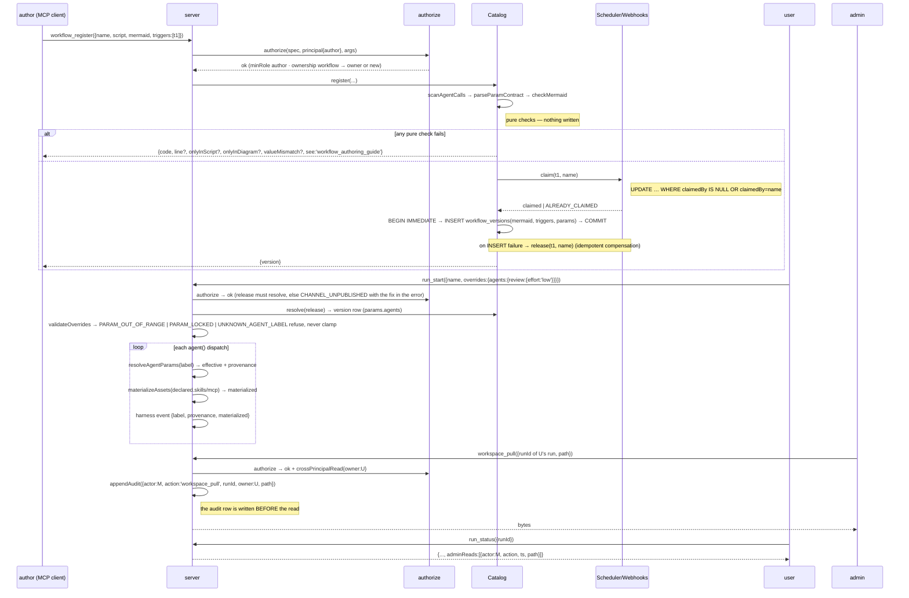
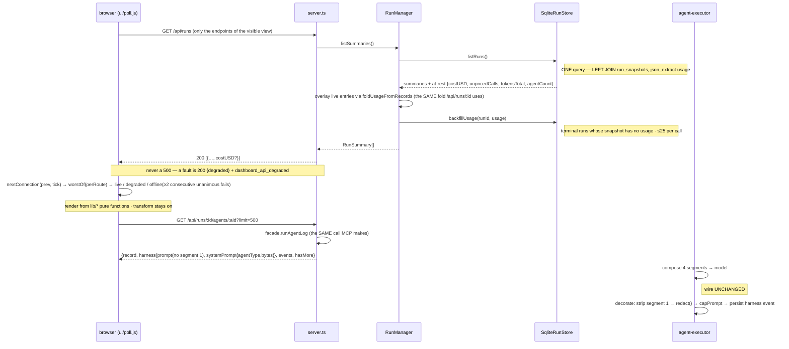

# Quality-dimensions — round 2: converged on every MUST; what is left is the shape of a `<p>`, seven annotations, and one owner ruling

## summary

**Nothing at MUST level is still disputed.** The adversarial round 1 and my round 1 were written blind to each other and reached the same three findings by execution, plus the adversarial lens found two drifts I missed. This round I **concede four things** — (1) the AC-2 guard's *direction* (root becomes the strict server program; my inverse program was the same guard the other way round, and their tie-break is better), (2) that my round-1 "verified consistent" for the AC-4 repair was **wrong** (ARCH-124 still says 「any `ok` → `live` immediately」 while `connection.js:24-36` is `worstOf`; `worstOf` appears 0 times in `02-architecture.md`), (3) ARCH-123's stale `cache` literal, (4) that my DASH-1 authoring rule mis-described mid-line `%%` — it is message text, not a comment, and I re-proved their junk finding by rendering (M7: 3 + 4 literal `%%` strings in the SVGs of the semicolon-only repair). I **hold two small things** with reasons — the shell's mount element should carry static pre-boot text rather than be empty, and the ADR-049 *title* must carry the amendment marker — and I **drop NB-2** (the boot watchdog) outright rather than fence it again.

**What I bring that changes the merged text.** (a) Their option (b) was measured with an explicit file list, which their own risk #1 flags; M4/M4b/M5/M6 re-measure it under real `-p` runs and it holds — 76 files / 0 errors / 3.7 s for the narrowed root, 510 / 0 / 8.8 s for the tests program, planted probe red — so the amendment can cite a measured config rather than a promised one. (b) Two paste-ready DASH-1 replacement blocks, parse- and render-verified, with every content change (as opposed to form change) enumerated so the architect keeps ownership of wording; the zero-meaning-change alternative (seven line-start `%%` comments) is stated in one line and is also verified by the ledger's own control block. (c) A merged ledger-edit table covering all five rows plus the two induced drifts, so the synthesizer has one list.

**Altitude.** Unchanged from both round-1 files: this repair is system-altitude throughout; the one agent-altitude thread — the dashboard is the operator's only console onto agent runs, so a tag or a page that lies about liveness is an agent-observability defect — is applied in §1 and nowhere else.

---

## 0. Responses to the adversarial round 1 — verdict first, engineering reason second

**In the task's three words:** **rebut — none at MUST level.** **Concede** — A1's direction (root = strict server program), A3, A4, A5's mid-line-`%%` half, NB-2 (dropped). **Hold** — the ADR-049 *title* marker; static pre-boot text and no `id` on the shell's mount element; NB-1 as an optional TASK-A DoD line (non-blocking). Everything else converged without a fight.

| Item (theirs) | Verdict | Reason, and what I integrate |
|---|---|---|
| **A1 — AC-2: option (b), scope DOM to a tests program; root back to `lib:["ES2022"]`, no `allowJs`** | **CONCEDE the direction.** | My round-1 inverse program (`tsconfig.server.json` beside an unchanged root) restores the *identical* compile-time property — M6 fails the planted probe with exactly the errors my M2 did. What breaks the tie is their self-sustainability argument: **the DEFAULT program should be the guard and the widening should be the named exception.** Stated carefully, because the asymmetry is weaker than "strict by default" sounds: under my shape a `build` script "simplified" back to bare `tsc --noEmit` silently drops the DOM boundary; under theirs it drops the tests program — and that is **not** harmless either, because vitest exercises runtime, not the `satisfies` wire-shape lock in `tests/fixtures/dashboard-wire.ts` (the lock ADR-049 says buys what `checkJs` would). **Both programs are load-bearing.** The tie still goes to (b) because the server boundary is the control with no runtime backstop at all, and the cheap guard for the other half is my own round-1 QD-G8-R6 mitigation, now a TASK-B DoD line: one UT pinning that `package.json`'s `typecheck` and `build` both contain `tsconfig.tests.json`. Their risk #1 ("I measured with a file list, not `-p`") is closed by M4/M4b: the narrowed root compiles under a real project file, with or without `vitest.config.ts`. I **hold** two things: the ADR-049 **title** ("no tsconfig change") must carry the amendment marker — by *their own* A4 rule, a clause the tree contradicts is blocking regardless of size — and the guard goes into `build` as well as `typecheck` (they already say both). Cost stated honestly: **+3.7 s per run** on top of today's ~8.8 s (M5). |
| A1's refusal-overturn paragraph (D-ADV-5 was "ceremony" at v27 synthesis) | **AGREE**, and my round 1 said the same from the other side ("the refused Sprint A idea, pointed the right way") | Both lenses independently name the lineage; the synthesizer should record it once: the refusal's premise (keeping `lib:["ES2022"]` is free) was falsified by IMPL-229's 36 errors. |
| **A2 — AC-3a: amend to the built shape; body is client-built; CSS half also false; no mount point exists today; dead body is a failure mask; delete + `<main id="app-view">` + `<noscript>` as IMPL follow-up** | **CONVERGE; HOLD** only on the replacement's shape (§Remaining #1) | We caught the same CSS-half falsity, the same `:455` line, the same surviving pin (`dashboard-page-source.test.ts:95`, their §5.5 = my UT-240 last case). They ask that the blast radius be measured, not assumed; my round 1 measured it: five dead pins enumerated with DES-208 dispositions, and the class-lock verified safe (0 of 104 `STYLE_HOOKS`, 0 of 23 `TEST_ANCHORS` are emitted only by the shell). Their "roughly 60 lines" net deletion matches `dashboard-page.ts:92-152`. |
| **A3 (NEW) — ARCH-124's connection clause contradicts the shipped `worstOf`; REQ-131's 「任一…成功 → Live」 is narrowed and must be recorded** | **CONCEDE — and correct my round 1.** | My round 1 listed "the v27g repairs of AC-4/AC-5/AC-6 … re-read, not re-litigated" under *Verified consistent*. That was a reading error: I re-read the repair, not the row. On disk: `02-architecture.md:3354` 「any `ok` → `live` immediately; … `degraded` … when it is the worst state」 — two clauses that cannot both hold for a mixed tick; `connection.js:26-32` implements the second; `grep worstOf 02-architecture.md` → 0. One fact strengthens their side: **§8 item 3 itself told the impl repair to wire `worstOf` "per ARCH-124's `api:`"** — the review already chose the second clause; striking the first records the review's own reading, it does not invent one. The REQ-131 reading is an **owner ruling**, not a two-panel closure (§Remaining #5). |
| **A4 (NEW) — ARCH-123's `cache: 'immutable' \| 'no-store'` vs `static-assets.ts:33`'s full directive** | **CONCEDE** (verified: `StaticAssetCache = 'public, max-age=31536000, immutable' \| 'no-store'`) | One-line edit; MUST by the mechanical routing rule. Nothing to add. |
| **A5 — DASH-1: four `;` sites; mid-line `%%` is message text and renders as junk (seven annotations)** | **CONCEDE the `%%` half; the four sites we found independently** | Re-executed (M7): first-site-only fails at the second site in both diagrams; semicolon-only parses but renders **3 + 4** literal `%%` strings; my candidates render **0**. **Retraction:** my round-1 rule said `;` breaks "inside a *trailing* `%%` comment" — there is no trailing comment; the correct rule is *`%%` is a comment only at line start; mid-line it is text, and message/Note text tolerates no `;`*. My control block (`:891-920`, a line-start `%% … HarnessDescriptor; see …`) still stands and now proves the other half: a line-start comment tolerates even a `;`. |
| **S1 — record the parse check as a decision + follow-up, NOT a vitest test; home `scripts/`** | **AGREE — there was never a dispute.** | My round 1 NB-3 already said "beside the ledger tooling, not in `src/` and not in `tests/`". Converge on **`scripts/mermaid-parse-check.mjs`** (the directory exists; `puppeteer` resolves from the repo root; UT-161's mermaid grep at `no-retired-surface.test.ts:42-45` walks `src/` only, so `scripts/` is outside it). Their §5.4 script is the body; the only change I would make is a loud skip when no Chrome is present, mirroring the dashboard's own soft dependency. |
| **S2 — one sentence in ARCH-128 naming the single synchronous writer** | **AGREE** (verified `sqlite-run-store.ts:310-320` through the closing brace: three synchronous `prepare().get/run` calls, zero `await` despite the `async` signature) | Zero code; closes a finding that would otherwise be re-derived. Text adopted verbatim in the edit table. |
| **W — the seven WON'Ts** (F-4, F-5, F-7, F-8, QD-R2, INV-V27-7 vs ADR-054, `/api/*` auth posture) | **AGREE on all seven** | I add nothing to §9 this round. On QD-R2 specifically: see their expected-disagreement #5 below. |

**Their six expected disagreements about my lens — answered in one line each.**
1. *"They will prefer option (a), a grep guard."* — I never proposed grep; my round 1 proposed the compiler (the inverse program) and rejected grep for the reasons they give (allowlist on day one at `auth-service.ts:273`; blind to types). Now I concede to (b)'s direction; the discriminator they named ("which mechanism keeps `HTMLElement` out of a server signature") is satisfied by both compiler forms and by neither grep.
2. *"They will want the mermaid check as a permanent CI test."* — No; round 1 said tooling, not `tests/`. Converged on `scripts/`.
3. *"They may want the dead body kept as a graceful fallback."* — The opposite: my round 1 named it "a page that impersonates a working dashboard" independently of their "failure mask". The residual is only what replaces it (§Remaining #1), framed by their own true-vs-false test.
4. *"They may accept the narrowing without recording the REQ-131 reading."* — No: the reading must be written where Gate 7.5 will read it (ARCH-124's row) **and** raised to the owner, because a panel cannot amend an acceptance clause.
5. *"They will escalate QD-R2."* — I do not. QD-R2 is a coverage-policy question and belongs to the next full round. My NB-1 is not QD-R2: it is a 15-line `node --check` parse guard over the seven `ui/*.js` files no tier parses — the smallest possible step, **held** as an optional DoD line of TASK-A (non-blocking), not as a policy change (§Remaining #3).
6. *"No disagreement on A4, A5, S2."* — Confirmed by re-execution, not by agreement.

---

## 1. Observability — transparency of internal state

*System altitude. Agent altitude: the one thread — the dashboard is the operator's only console onto agent runs — is why O-1 and O-3 are graded as observability defects and not tidiness.*

### O-1 — AC-3a: the shell's fallback must be a seam, not a mask (converged; one residual)

Both lenses: the pre-v27 body is a **failure mask** — when `app.js` 404s (ARCH-123's own degrade path), is blocked, or fails to parse, the browser keeps `dashboard-page.ts:92-152` on screen, and 「Running / Registered / Other / System / Models」 over empty containers reads as *a healthy engine with nothing running*. The connection tag cannot correct it because the code that paints the tag is the code that failed to load. Realistic cause, verified in round 1: no tier parses `ui/app.js`, `poll.js`, `home.js`, `workflow.js`, `run.js`, `agent-panel.js` or the classic `theme-init.js` except the real-browser one, which skips without a Chrome (ADR-053).

**Final position (two layers, both in ARCH-122):** Layer 1 — contractual now and true of the tree — the shell is `<html data-theme lang>` + `<head>` (charset, viewport, title, the `dashboard.css` link, the classic `theme-init.js`) + `<body>` containing the JSON island `#rwe-init` and the module script; **no CSS**; everything else in `<body>` is legacy markup `app.js:455` discards before first paint — non-contractual, not a test subject, removed by TASK-A. Layer 2 — TASK-A — the body becomes one mount element + the island + the module script.

**The residual (held, small):** what the mount element contains. Adversarial: `<main id="app-view"></main>` + `<noscript>`. Mine: `<main><p class="empty">儀表板載入中… / Loading dashboard…</p><noscript>…</noscript></main>`, **no id**. Reasons: (i) apply *their* discriminator (what does the something *say*?) one step further — with an empty mount, a module 404 with JS enabled shows a **blank page** (`<noscript>` is hidden): not a false statement, but not a seam either; the operator cannot tell "loading" from "dead" from "the tunnel served nothing". One `<p>` that stays on screen forever says "the client did not finish booting", which is the truth. (ii) Leave `#app-view` **client-owned**: `app.js:332` creates it and `:403`/`:422` read it back; a shell-emitted `#app-view` is a second emitter of the same anchor — a mirror pair of exactly the class ADR-049 was chosen to shrink — and the class-lock is happier with one emitter. `app.js` needs **zero change** either way (`replaceChildren` removes whatever the shell put there). The bilingual literal is a DES-201-class boundary exception (the shell is server TS and cannot import `lib/strings.js`; the text must exist before any JS runs); language-neutral `…` is the fallback if the panel prefers zero exceptions. Either shape satisfies §8 item 10; the architect picks.

**Dropped:** NB-2 (the `theme-init.js` boot watchdog). I said in round 1 I would concede on request; the adversarial lens's Karpathy tie-breaker is that request. The static text is the floor; slow-vs-dead is not worth six lines this round.

### O-2 — DASH-1: the ledger's dashboard is an observability surface; the repair is four sites and seven annotations (converged; wording residual)

Re-executed (M7) and agreed on every number. The two paste-ready blocks are in the edit table; each parses and renders with 0 `%%` strings. **Content changes vs. form changes, enumerated** so the architect keeps ownership of wording:
- Form-only (the four `;` sites): `:2539` `;`→`·`; `:2547` `; … ;`→`→ … →` (or `#59;` twice — both verified in round 1); `:3574` `;`→`—`; `:3576` `;`→`·`.
- Annotations moved to Notes: `%% UPDATE … WHERE claimedBy IS NULL OR claimedBy=name` and `%% wire UNCHANGED` are **verbatim**; `%% ONE query, LEFT JOIN …` and `%% never a 500; a fault …` change only `,`/`;` → `—`; **three are paraphrased** — `%% nothing written` → 「pure checks — nothing written」, `%% BEFORE the read` → 「the audit row is written BEFORE the read」, `%% terminal + snapshot has no usage, ≤25 per call` → 「terminal runs whose snapshot has no usage · ≤25 per call」.
- One **content** change I added and the architect may drop: the tick line gains `worstOf(perRoute) →` and `unanimous` (tied to A3; the original line, `;`-free, is verified to parse in the semicolon-only variant, so dropping the token is safe).
- **Zero-meaning-change alternative (one line):** move each of the seven annotations onto its own line as a line-start `%%` comment. Verified by the ledger's own control block (`:891-920`); invisible in the render, present in the source. I lean Notes for the four that carry invariants (never a 500; BEFORE the read; nothing written; wire UNCHANGED) and comments for the three implementation details — but this is the architect's call, and either choice must be re-run through the parse check before DASH-1 is declared closed.

After the edit: `sh .sdlc/trace` regenerates `dashboard.html` (the re-review's §3 renders the generated file), then `node scripts/mermaid-parse-check.mjs` over the five ledger files must print 40 checked / 1 failing (DASH-2, design's) or 0 once design's repair lands.

### O-3 — A3: a tag that says 連線中 while the visible table's route is degraded is a false statement to the operator (conceded; the observability argument is the same as theirs)

The repair is right; the text is wrong. `worstOf` makes the tag honest — that is the whole point of REQ-131's tag — and the observability lens has no better principle to offer than "the console must not lie". The amendment text is theirs (edit table), with two additions: the §8-item-3 fact (the review already chose the second clause) and an explicit owner-ruling line.

### O-4 — AC-2: the guard's visibility

Unchanged from round 1 and agreed by both: the absence of the promised guard is invisible today (`typecheck` says 0 errors; the ADR keeps asserting the guard). Under option (b) the default `tsc --noEmit` **is** the guard — its exit code is the signal in CI and in `deploy/rwe-update.sh:147`.

---

## 2. Replaceability — decoupling and pluggability

*System altitude. Agent altitude: no change — the LLM backend seam is untouched.*

### R-1 — AC-2: the server/client compile boundary — final shape (conceded to (b)'s direction, measured)

**The property** (both lenses): the server tree is a complete program without the client tree and without DOM. **The mechanism** (converged): two `tsc` programs — root = server (`lib:["ES2022"]`, no `allowJs`, `include:["src","vitest.config.ts"]`; M4b shows `vitest.config.ts` can stay), tests = `tsconfig.tests.json` (`extends` root; DOM + `DOM.Iterable` + `allowJs`; `include:["src","tests","vitest.config.ts"]`); `typecheck` and `build` both run `tsc --noEmit && tsc --noEmit -p tsconfig.tests.json`.

**Why (b) over my inverse program, stated as engineering not deference:** identical guard (M6 ≡ M2); identical file count (one new file + script lines); (b) makes the strict program the default and the widening the named exception, so drift removes the *weaker* control first. The one thing my shape had that (b) does not — an unchanged root, so every file keeps today's single editor project — is an editor concern, addressed below.

**Editor behaviour — stated as UNMEASURED (no IDE here).** IDEs resolve the nearest `tsconfig.json` by name. Under (b), `src/**` files get the strict program (an improvement over today: `document` stops autocompleting in server files); `tests/**` files fall outside any file named `tsconfig.json` and are typed by the editor's inferred project, which may differ from CI (strictness, resolution). If that proves noisy in practice, the tests program can live at **`tests/tsconfig.json`** (`extends:"../tsconfig.json"`, `include:["../src",".","../vitest.config.ts"]`) with **no change to CI semantics** — record it as the fallback placement, not as a third option for the synthesizer to adjudicate. No tooling in the repo pins a tsconfig path (checked: no eslint/biome/jsconfig config; `vitest.config.ts` does not reference one; `deploy/*.sh` only calls `npm run build`).

**Compile-time facts the amendment may cite (all measured under `-p`):** narrowed root 76 files / 0 errors / 3.7 s; tests program 510 files (20 client `.js`, 413 tests) / 0 errors / 8.8 s; planted `document`/`window`/`HTMLElement` → TS2584 + 2×TS2304; no `src/**/*.ts` uses a DOM global today (adversarial §5.3 grep; the only hit is an HTML string at `auth-service.ts:273`, which the compiler does not see as an identifier — the reason a grep guard would need an allowlist on day one and the compiler does not).

### R-2 — AC-3a: the shell owns only what the client cannot produce (converged)

Pin rule for ARCH-122's `note:` (replaces 「still assertable here」, both lenses): `DASHBOARD_HTML` is a valid test subject only for the shell's own facts — root attributes, the three asset references, exactly one inline `<script>` (the island), `<` escaped in the island, and after TASK-A the mount element. Every component-markup or CSS assertion takes `clientFile(...)`. **A component pin whose subject is `DASHBOARD_HTML` is dead by construction.** Blast radius (round 1, verified at HEAD): five dead pins with DES-208 dispositions (table carried in the edit section); class-lock safe; DES-200 and TASK-205 carry the same stale `draggable` clause and are owed to design/tasks.

### R-3 — A4: the `cache` literal (conceded)

The value *is* the header; the type says so; the row must too. One line.

---

## 3. Consumability — interface friendliness and integration cost

*System altitude. Agent altitude: no change — the MCP tool surface and `run_agent_log`'s shape are not in scope (QD-C2/C3 remain §9 debt).*

### C-1 — the shell's contract is four lines an integrator can read (converged)

(1) root attributes stamped before paint by `theme-init.js`; (2) three same-origin asset references under `/static/dashboard/*`; (3) one JSON island `#rwe-init` `{version, lastUpdate?, interruptedRuns?}` — the only server→client data path at load; (4) one module entry. The pre-v27 body adds nothing and misleads anyone reading the served source. `DASHBOARD_HTML` stays exported.

### C-2 — `npm run typecheck` gains a sentence of meaning; where a contributor learns the limit (converged)

"The server alone without DOM, then the whole tree with it." The amended ADR-049 is where a contributor learns why `document` is refused in `src/` and accepted in `tests/`, and that `checkJs` is off (the client is readable to `tsc`, not checked by it). Under (b) the sentence is shorter than under my shape: the default `tsc` is the strict one.

### C-3 — the ledger is consumed by people through `dashboard.html`; "renders" ≠ "reads correctly" (conceded)

The adversarial lens's fidelity point is the consumability point: a diagram that parses but shows `%% never a 500 · …` inside a message label is a documentation defect at the point of consumption, one grade less bad than 「圖渲染失敗」. The Note form makes the invariants visible to the reviewer deciding whether the architecture matches the tree; the comment form keeps them for the agent reading the markdown. Both are verified; §Remaining #2.

### C-4 — A3's REQ-131 reading must be written where the validator reads (converged; owner-facing)

Gate 7.5 validates REQ-131 against the requirement's own text. The narrowing — 「任一 `/api/*` 取得成功 → Live」 becomes 「visible-view routes ALL `ok` → Live; a mix → degraded; ≥2 unanimous-fail ticks → offline」 — goes into ARCH-124's row as an explicit, overturnable sentence **and** to the owner as a one-line ruling; a panel cannot amend an acceptance clause, and two panels agreeing is not a ruling.

---

## 4. Self-sustainability — closed-loop autonomy and lifecycle

*System altitude. Agent altitude: no change — memory metabolism, tool-liveness probes and prompt calibration are not touched by document repairs.*

### S-1 — the guard lives where the system rebuilds itself, and the default program is the guard (converged; this is why I conceded R-1)

`deploy/rwe-update.sh:132-147`: `npm ci` → `npm run build` → revert on failure. Both programs in `build` means every self-update re-proves the boundary with no human in the loop, at +3.7 s. Under (b), even a `build` script "simplified" back to bare `tsc --noEmit` keeps the server guard; what such a simplification would lose is the tests program — and that is not free: vitest exercises runtime, not the `satisfies` wire-shape lock in `tests/fixtures/dashboard-wire.ts`, so **both programs are load-bearing** and TASK-B pins both script strings with one UT (round-1 QD-G8-R6). The asymmetry is only about *which* control the default keeps, and the server boundary is the one with no runtime backstop — that, not "tests are less important", is the reason to prefer (b). Corollary the amendment must carry: every ledger sentence that says bare `tsc --noEmit` catches a *tests-tree* drift becomes false under (b) — found by `grep -n 'tsc --noEmit'` over 02/03/04: ARCH-124's note (two clauses — 「`npm run build` is `tsc --noEmit`」 and 「so `tsc --noEmit` fails when a wire shape drifts」), the v27 deployment-view label at `02-architecture.md:3589`, DES-192's `tests:` (`04-design.md:6729`), TASK-197's `dod:` (`03-tasks.md:1680`); ARCH-130's `:3414` claim is server-subject and stays true. The Gate-2 rows are in the edit table; the others are routed.

### S-2 — the honest floor for the shell is zero mechanism (converged; NB-2 dropped)

Static pre-boot text needs no timer, listener or state; the browser shows it until the module removes it, and if the module never runs the truth stays on screen. NB-1 (the `node --check` guard) is the only extra I still carry, as an optional DoD line (§Remaining #3).

### S-3 — a render oracle closes the loop the lexical checker cannot (converged: tooling, `scripts/`)

Three bites (v26 mis-recorded `:2531` as a false positive; v27 shipped `:3561` broken; the repair instruction was half-right) justify a standing check — but as *ledger tooling*, not a product test: `scripts/mermaid-parse-check.mjs` (adversarial §5.4 body; loud skip when no Chrome), run after any ledger diagram edit and before Gate 8's §3, and optionally invoked by `sh .sdlc/trace` when a browser is present. Recorded as a decision with a follow-up beside TOOL-FORK in §9. Not in the vitest denominator — both lenses agree the discriminator is the subject (a `.md` file is not the product).

### S-4 — ARCH-128's single-writer assumption (agree; verified)

`backfillUsage` (`sqlite-run-store.ts:310-320`) is an untransacted read-modify-write that is safe only because better-sqlite3 is synchronous and the body has no `await`; two engine processes on one database file would break 「in either order the row ends identical」. One sentence in the note; zero code.

### S-5 — follow-ups and the trace baseline (converged; naming routed)

Both lenses name follow-up impl items; the ledger's trace chain needs a **TASK row** for an IMPL to close against (TASK-018/153 precedent) — route the id assignment to the orchestrator so neither "TASK-A/TASK-B" nor "IMPL-nnn" is copied as-is. Recommendation unchanged: a **v27h micro dispatch before the re-review** scoped to TASK-A (shell body + five pins) and TASK-B (`tsconfig.json` narrowed + `tsconfig.tests.json` + two script lines; both programs pre-verified at 0 errors). If declined, the cost is **+2 LOW** (`未實作`) and both rows carry the "unguarded until it lands" sentence so no assertion contradicts the tree.

---

## Merged ledger edits — one list for the synthesizer (verbatim-ready)

| Row | Edit |
|---|---|
| **ADR-049 title** | Append `— [amended v27 Gate 8 send-back AC-2: the root tsconfig DID change at ddc4409 (IMPL-229); see Consequences]`. The title's 「no tsconfig change」 is a clause the tree contradicts; by the mechanical routing rule it needs the marker, not only the Consequences. |
| **ADR-049 Consequences** | Replace 「`allowJs`/`checkJs` and a `DOM` lib are deliberately NOT added to the root tsconfig, because that would make `document` a known global in server code」 with: 「**amended (v27 Gate 8 send-back — AC-2):** IMPL-229 (`ddc4409`) added `"DOM","DOM.Iterable"` and `"allowJs": true` to the single root `tsconfig.json`, repo-wide, to resolve 36 pre-existing `tsc` errors that all originate in the TEST tree (four acceptance files' `page.evaluate` callbacks; `.ts` tests importing client `.js`). Decision: the DOM lib and `allowJs` are **scoped to the tests program, not kept repo-wide** — root `tsconfig.json` returns to `"lib":["ES2022"]`, no `allowJs`, `include:["src","vitest.config.ts"]`; `tsconfig.tests.json` (`extends: "./tsconfig.json"`, `"lib":["ES2022","DOM","DOM.Iterable"]`, `"allowJs": true`, `include:["src","tests","vitest.config.ts"]`) types the tests; `npm run typecheck` and `npm run build` run BOTH (`tsc --noEmit && tsc --noEmit -p tsconfig.tests.json`), so every self-update (`deploy/rwe-update.sh:147`) re-proves the boundary at +3.7 s. Measured at eb387a1 under real `-p` runs: narrowed root 76 server files / 0 errors / 3.7 s; tests program 510 files / 0 errors / 8.8 s; a planted `document`/`window`/`HTMLElement` in the root program fails TS2584/TS2304 — that is the falsification. Editor: `src/` files get the strict program by the nearest-`tsconfig.json` rule; `tests/**` files fall to the editor's inferred project (unmeasured; if noisy, place the tests program at `tests/tsconfig.json` with `include:["../src",".","../vitest.config.ts"]` — CI semantics unchanged). `checkJs` stays off: the client tree is readable to `tsc`, not checked by it (opt-in `// @ts-check` per file in `lib/` is the non-blocking path). The `satisfies` wire-shape lock in `tests/fixtures/dashboard-wire.ts` is enforced by the TESTS program — `npm run typecheck` / `npm run build` — not by a bare `tsc --noEmit`, which no longer sees `tests/`; both programs are load-bearing, and TASK-B pins both script strings with one UT so neither drops out silently. Lineage: this is the second-tsconfig idea the v27 synthesis refused as ceremony (D-ADV-5, `:3666`); the refusal assumed keeping `lib:["ES2022"]` was free, and IMPL-229 proved it cost 36 errors. **State of the tree when this amendment is written: the split has NOT landed — `tsconfig.json` still carries `DOM`/`allowJs`; TASK-B (Gate 6) lands it, and until then this ADR describes a decision, not the tree.**」 |
| **ARCH-124 note (three tsconfig clauses)** | (i) Replace 「which buys what `allowJs`/`checkJs` would buy without adding `DOM` to a root `tsconfig.json` whose `"lib":["ES2022"]` is what stops server code from thinking `document` exists」 with 「which buys what `checkJs` would buy; the compile-time server/client boundary itself is the root `tsconfig.json` (server tree, `lib:["ES2022"]`, no `allowJs`) run beside `tsconfig.tests.json` (DOM + `allowJs`, the tests program) — ADR-049 as amended at the v27 Gate 8 send-back; **unguarded until TASK-B lands**」. (ii) In the same note, 「(so `tsc --noEmit` fails when a wire shape drifts)」 → 「(so the tests program — `npm run typecheck` / `build`, `tsconfig.tests.json` — fails when a wire shape drifts)」. (iii) 「`npm run build` is `tsc --noEmit`」 → 「`npm run build` is two `tsc --noEmit` programs (server, then tests)」. |
| **v27 deployment view `02-architecture.md:3589`** | Label `UPD --> T["npm ci · tsc --noEmit · vitest run"]` → `UPD --> T["npm ci · npm run build (tsc ×2: server, tests) · vitest run"]`; re-run `scripts/mermaid-parse-check.mjs` afterwards (a flowchart label edit; not pre-verified here). |
| **ARCH-124 api (connection clause)** | 「**amended (v27 Gate 8 send-back — AC-4's repair):** the `connection.js` clause is superseded in part. Strike 「any `ok` → `live` immediately」. The tag is **`worstOf(perRoute)`** over the routes the VISIBLE view depends on: `live` only when every one of them is `ok` (recovery is never debounced — one all-`ok` tick restores `live` from any state); any mix containing a `degraded` or a `fail` beside a better sibling reports `degraded` and resets the failure counter; `offline` only after ≥ 2 consecutive **unanimous**-`fail` ticks (REQ-131's 連續失敗; one transient miss during a self-update restart must not paint the team's tabs red). Exports: `worstOf(perRoute) → status`, `nextConnection(prev, tick) → State`, `classifyResponse(status, body) → status` — all pure and total. Verified by `tests/unit/dashboard-lib-connection.test.js:30-40`. **Reading of REQ-131 recorded explicitly:** REQ-131's 「任一 `/api/*` 取得成功 → Live」 is narrowed to 「visible-view routes ALL `ok` → Live」, because the requirement enumerates only Live/Offline while this architecture introduces `degraded`, and a tag that says 連線中 while the table's own route is degraded misinforms the operator the tag exists to inform. §8 item 3 of the v27 Gate 8 review instructed the AC-4 repair to wire `worstOf` "per ARCH-124's `api:`" — i.e. per this clause's second half; this amendment strikes the first half that instruction left standing. **Owner ruling requested:** if the literal reading is preferred, the correct outcome is to revert the `live` half of the AC-4 repair and this sentence — recorded here so that overturning it is a one-line decision.」 |
| **ARCH-123 api (`cache` literal)** | `STATIC_ASSETS: ReadonlyMap<string, { file: string; type: string; cache: 'public, max-age=31536000, immutable' \| 'no-store' }>` — 「the `cache` value **is** the `Cache-Control` header written verbatim by the route (v27 Gate 8 AC-8 repair; a bare `immutable` is a modifier with nothing to modify, RFC 8246). Policy unchanged: woff2 → one year immutable, JS/CSS → `no-store`.」 |
| **ARCH-122 title + api (Layer 1)** | Title: drop 「markup + tokens CSS」 → 「the served page becomes a shell: a `<head>` with two asset references, a JSON data island and one module script; no inline executable JS, and ARCH-040's update panel survives the rebuild」. `api:` — `buildDashboardHtml(init?) → string` keeps its signature and one caller (`server.ts:1334` at eb387a1). It emits `<html data-theme="dark" lang="zh-Hant">` + `<head>` (charset, viewport, title, `<link rel="stylesheet" href="/static/dashboard/dashboard.css">`, `<script src="/static/dashboard/ui/theme-init.js">` classic/blocking — stamps `data-theme` / `lang` / `--rwe-hue` before first paint) + `<body>` containing `<script type="application/json" id="rwe-init">{version, lastUpdate?, interruptedRuns?}</script>` and `<script type="module" src="/static/dashboard/ui/app.js">`. **No CSS in the shell** (v27c, DES-200: one delivery path, `dashboard.css` via ARCH-123). **The page's entire body is client-built:** `app.js:455` runs `document.body.replaceChildren(nav, routeMount, buildFooter())` on mount, so the nav and its source tag, the four tab shells, the route container `#app-view` (`app.js:332`), the `#dag-zoom`/`#dag-graph`/`#dag-fit`/`#run-usage`/`#diagram-*` anchors, the component classes and the slide-in panel container are **ARCH-125's**. Legacy pre-v27 markup between `<body>` and the island (`dashboard-page.ts:92-152` at eb387a1) is discarded before first paint: non-contractual, not a test subject, **removed by TASK-A**. `DASHBOARD_HTML` stays exported (the page-source tests' subject). |
| **ARCH-122 note** | Strike 「C1's three literal page-source pins keep their meaning … (still assertable here)」 and the CSS-in-this-file clause. Insert: 「**Pin rule:** `DASHBOARD_HTML` is a valid test subject only for the shell's own facts (root attributes, the three asset references, exactly one inline `<script>` — the island —, `<` escaped in the island, and after TASK-A the mount element); every component-markup or CSS assertion takes `clientFile(...)` — a component pin whose subject is `DASHBOARD_HTML` proves a string the browser discards. C1 is satisfied where the bytes live: `clientFile('dashboard.css')` for the two CSS rules, `clientFile('ui/workflow.js')` for `img.draggable = false`. **Boot-failure honesty (TASK-A):** the dead body is a failure mask — on a module 404/parse failure it paints a retired dashboard that reads as a healthy, idle engine; the body becomes one mount element (static pre-boot text 「儀表板載入中… / Loading dashboard…」 in the existing `empty` hook + `<noscript>`; no id — `#app-view` stays client-owned) + island + module script; `app.js` unchanged. The pre-boot literal is a boundary exception of DES-201's class (server TS cannot import `lib/strings.js`; the text must exist before any JS runs). The two guards unchanged and still correct: the island is data, not script (no nonce; ARCH-040/INV-V27-5 survive a rebuild) and zero inline executable JS (ARCH-130's CSP).」 |
| **ARCH-128 note** | Append: 「Convergence rests on a single synchronous writer: `backfillUsage` (`sqlite-run-store.ts:310-320`) is an untransacted read-modify-write, safe because better-sqlite3 is synchronous and the body has no `await`. Two engine processes against one database file would violate it; the engine is single-process by deployment (D9), and this is the assumption to revisit if that ever stops being true.」 |
| **02-architecture.md `:2530-2568` (v24 process view)** | Replace the block with the verified CANDIDATE below (or the comment-form alternative — see §1 O-2). |
| **02-architecture.md `:3560-3582` (v27 process view)** | Replace with the verified CANDIDATE below (same choice). Then `sh .sdlc/trace`; then `node scripts/mermaid-parse-check.mjs` over the five ledger files. |
| **Diagram authoring rule (file conventions)** | 「In a `sequenceDiagram`, `;` is a statement terminator inside message text and `Note` text; `%%` opens a comment **only at the start of a line** — mid-line it is message text and renders. Use `·` / `—` / `→` / `#59;` for a literal, and put annotations on their own line (`%%` comment) or in a `Note`. Falsifier: `scripts/mermaid-parse-check.mjs`.」 |
| **TASK-A (id from the orchestrator; Gate 6)** — the shell body becomes a mount point | files: `src/dashboard-page.ts`; `tests/unit/dashboard-page-source.test.ts` (`:95` RETIRE — UT-224's re-pointed case at `:42-43` guards it; add one positive: `<body>` contains the mount element, the island and the module script and **no `<section`/`<header`**); `tests/unit/dashboard-zoom-source.test.ts:19,23` (MOVE → `clientFile('ui/run.js')`); `tests/unit/workflow-page-harness-table.test.ts:15` (RETIRE with reason — REQ-135's panel, real-tier val-201 — or MOVE → `clientFile('ui/agent-panel.js')`); `tests/unit/dashboard-diagram-render.test.ts:60-62` (positive → `clientFile('ui/workflow.js')`; the two negatives over `clientCorpus()`); `tests/unit/dashboard-no-design-values.test.ts:44,50` no change (measured: 0/104 hooks, 0/23 anchors shell-only). dod: full unit suite green; class-lock unchanged; **in the same commit, strike ARCH-122's tree-state sentences** (the 「Legacy pre-v27 markup … removed by TASK-A」 clause in `api:` and the 「(TASK-A)」 marker in `note:`) so the row describes the tree after the change, not before it; optional third line — NB-1: one test spawning `node --check` over `src/dashboard/**/*.js` (falsified by a planted stray brace). |
| **TASK-B (id from the orchestrator; Gate 6)** — the two-program tsconfig | files: `tsconfig.json` (narrow), `tsconfig.tests.json` (new), `package.json` (`typecheck`, `build`). dod: both programs exit 0 on the tree (paste both exit codes); a planted `document.title` in any `src/*.ts` fails TS2584 (falsified, then reverted); one UT pins that `package.json`'s `typecheck` and `build` strings both contain `tsconfig.tests.json` (neither program may drop out silently — both are load-bearing); `deploy/rwe-update.sh` unchanged; `npm test` unchanged; **in the same commit, strike the tree-state sentences** — ADR-049's 「the split has NOT landed …」 and ARCH-124's 「unguarded until TASK-B lands」 — or the re-review finds the mirror-image contradiction. Fallback if the narrowed root fails under some path M4 did not exercise: my round-1 inverse program (`tsconfig.server.json` beside an unchanged root) — same guard, measured (M1/M2), recorded as such rather than silently. |
| **S1 decision + follow-up** | 「Ledger diagrams are verified by rendering, not linting: `scripts/mermaid-parse-check.mjs` (mermaid 11.17.2 from `node_modules`, the repo's cached Chrome, loud skip without one) runs after any ```mermaid edit and before Gate 8 §3. Not a vitest test — its subject is a `.md` file, not the product.」 Follow-up beside TOOL-FORK in §9. |
| **Owed, routed (not Gate 2's rows)** | DES-200's boundary sentence and signature line; TASK-205's `dod:`; the `:95` dead pin (TASK-A or AC-3b's impl owner) — all carry the v27g/AC-3a re-point (`clientFile('ui/workflow.js')`). Induced by AC-2's option (b): DES-192 `tests:` (`04-design.md:6729`) 「`tsc --noEmit` IS the first test (the `satisfies` lock)」 → 「`npm run typecheck` (the tests program) IS the first test」; TASK-197 `dod:` (`03-tasks.md:1680`) `npx tsc --noEmit && …` → `npx tsc --noEmit -p tsconfig.tests.json && …`; the v26 real-tier note at `04-design.md:6594` (「`tsc --noEmit` is `build`」) stays true as written (`build` still begins with it) — informational only. **REQ-131 acceptance reading → owner.** TASK ids for the two follow-ups → orchestrator. |

### DASH-1 CANDIDATE — v24 process view (`02-architecture.md:2530-2568`), parse OK, 0 `%%` in the SVG



### DASH-1 CANDIDATE — v27 process view (`02-architecture.md:3560-3582`), parse OK, 0 `%%` in the SVG



---

## Remaining disagreements — each with its discriminator

| # | Topic | Adversarial | Quality-dimensions | Discriminator / who decides |
|---|---|---|---|---|
| 1 | What replaces the dead body | `<main id="app-view"></main>` + `<noscript>` | `<main><p class="empty">載入中… / Loading…</p><noscript>…</noscript></main>`, **no id** | Their own test, one step further: on a module 404 with JS enabled, an empty mount is a **blank page** — not false, but not a seam; one `<p>` says "did not boot". `#app-view` stays single-emitter (client). Either satisfies §8 item 10; **architect decides**; `app.js` unchanged either way. |
| 2 | The seven `%%` annotations | own-line comments *or* Notes | Notes for the four invariant-bearing ones, comments for the three implementation details — but both blocks above use Notes throughout so they are one paste | Both forms verified to parse; Notes are visible in `dashboard.html`, comments are not. **Architect decides wording**; three Notes are paraphrases (listed in §1 O-2) and the `worstOf` token is a content change tied to A3 — drop it if A3's owner ruling goes the other way. Re-run the parse check after the choice. |
| 3 | NB-1 `node --check` over `src/dashboard/**/*.js` | beyond §8; QD-R2 territory | not QD-R2 — a 15-line parse guard, no dependency, over the seven files no tier parses; optional third DoD line of TASK-A | Does the orchestrator allow TASK-A one extra assertion? If not, §9 debt with the ghost-page consequence named. QD-R2 itself: **both lenses park it** to the next full round. |
| 4 | Placement of the tests program | `tsconfig.tests.json` at the root | same, with `tests/tsconfig.json` recorded as the editor-native **fallback** (unmeasured) | Not a third option: CI semantics are identical; only editor diagnostics differ, and no IDE was run here. TASK-B's implementer decides on evidence. |
| 5 | REQ-131's 「任一…成功 → Live」 vs the shipped `worstOf` narrowing | narrowing is right; record it as overturnable | same; add that §8 item 3 already chose it | **Owner ruling.** Two panels agreeing is not a ruling; the literal reading means reverting the `live` half of the AC-4 repair. |
| 6 | v27h micro dispatch vs +2 LOW | neutral ("Gate 2 cannot close it; name the follow-up") | dispatch (both changes pre-scoped; TASK-B's two programs pre-verified at 0 errors) | Either is honest once the "unguarded until it lands" sentence is in the rows; the dispatch removes the sentence and the two `未實作` LOWs. Orchestrator. |

Dropped this round, on purpose: **NB-2** (boot watchdog) — conceded; **my inverse-program shape for AC-2** — conceded to (b)'s direction, kept only as TASK-B's measured fallback; **my round-1 authoring rule's "trailing `%%` comment" wording** — retracted.

## key_points

1. **Converged on all five MUSTs**: AC-2 → DOM/`allowJs` scoped to a tests program with the root as the strict server program (measured under real `-p`: 76/0/3.7 s and 510/0/8.8 s, probe red; +3.7 s per run); AC-3a → two-layer ARCH-122 (contract = head + island + module script; body client-built; dead body removed by a named TASK); DASH-1 → four `;` sites **and** seven mid-line `%%` annotations (semicolon-only parses but renders 3 + 4 junk strings; candidates render 0); ARCH-124's connection clause → `worstOf`, first clause struck; ARCH-123's `cache` literal → the full directive.
2. **Two corrections to my round 1, stated plainly**: "verified consistent" for the AC-4 repair was a misread of the row (A3 is real); "trailing `%%` comment" was wrong (mid-line `%%` is text).
3. **Why I conceded the AC-2 direction**: identical guard, identical cost; both programs are load-bearing (the tests program carries the `satisfies` wire lock, which vitest does not exercise), but the default program should be the one with no runtime backstop — the server boundary — and one UT pins both script strings so neither drops out silently. Four ledger sentences that credit bare `tsc --noEmit` with a tests-tree catch are listed for edit/routing.
4. **Ownership of wording stays with the architect**: the DASH-1 candidates are verified-parseable, with form-only changes, verbatim moves, three paraphrases and one content change (`worstOf`) enumerated; the zero-meaning alternative (line-start `%%` comments) is one line and also verified.
5. **The mount element**: I hold for static pre-boot text and no `id` — blank is not false but is not a seam; `#app-view` stays client-owned — and mark it as the architect's call.
6. **S1 was never a dispute**: tooling in `scripts/`, not the vitest denominator; the parse check is DASH-1's falsifier and the standing control for a class that has bitten three times.
7. **Two owner/orchestrator routings**: REQ-131's reading (owner); TASK ids for the two follow-ups and whether v27h is dispatched (orchestrator).
8. **Both rows that describe un-landed code carry the "unguarded until it lands" sentence**, per the review's own warning about an amended ADR beside an unchanged tsconfig.

## risks

| # | Risk | Mitigation |
|---|---|---|
| QD-R2-1 | The synthesizer lifts the semicolon-only repair and DASH-1 re-opens on the `%%` junk at re-review | M7 table; candidates verified; `scripts/mermaid-parse-check.mjs` as the gate before closing |
| QD-R2-2 | The narrowed root fails under a path M4 did not exercise (an ambient type package pulling DOM) | M4/M4b ran real `-p` configs that `extends` the repo's own tsconfig; TASK-B's fallback is my measured inverse program, recorded rather than silent |
| QD-R2-3 | Editor diagnostics for `tests/**` diverge from CI under (b) | Stated as unmeasured; `tests/tsconfig.json` fallback with identical CI semantics |
| QD-R2-4 | Amended rows beside an unchanged tree at re-review | every row describing TASK-A/TASK-B carries "has NOT landed / unguarded until"; v27h dispatch recommended |
| QD-R2-5 | Removing the dead body goes red somewhere unlisted | five pins enumerated at HEAD with dispositions; class-lock measured safe; UT-240's new negative pins the shape |
| QD-R2-6 | The `worstOf` token in the v27 diagram outlives an owner ruling that goes the other way | listed as a content change; the `;`-free original line is verified to parse, so dropping it is safe |
| QD-R2-7 | REQ-131's narrowing is treated as closed because two panels agree | routed to the owner explicitly, in the row and in this file |
| QD-R2-8 | The pre-boot literal is read as a REQ-131 string-table violation | DES-201-class boundary exception recorded; `…` offered as the zero-exception fallback |
