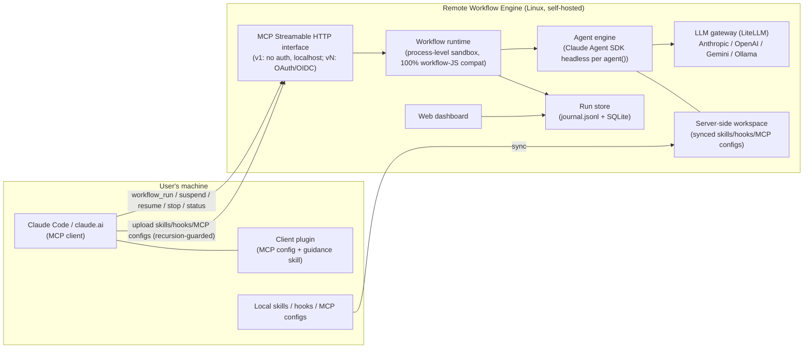

# 01 Requirements — Remote Workflow Engine

> **Product in one line**: a self-hostable (local or remote Linux) execution environment for
> Claude-generated workflow JS files, exposed as an MCP Streamable HTTP service, with pluggable
> LLM backends (Anthropic / OpenAI / Gemini / local LLM), full lifecycle control
> (suspend / resume / stop), and per-agent observability.

## Context & confirmed decisions (Gate 1 clarification outcomes)

| # | Decision | User's choice |
|---|---|---|
| D1 | Agent execution engine | **Claude Agent SDK (headless)** per `agent()` call — native MCP tools / skills / hooks support |
| D2 | Multi-model support | **Embedded LiteLLM proxy** as the LLM gateway (via `ANTHROPIC_BASE_URL`); gateway interface abstracted so it can be replaced later. Cost goal: route cheap/local models to mechanical agents, expensive models to critical agents. No Anthropic billing when requests route to non-Anthropic providers. |
| D3 | Local asset bridging | **Sync-upload only** (skills / hooks / MCP configs pushed to the server); no reverse tunnel in scope. Upload via MCP tools exposed by this server. |
| D4 | Recursion guard | The client plugin / skill / MCP config **of this system itself must be excluded** from sync and from server-side agent runtimes, so remote agents cannot recursively invoke the remote-workflow service, and the local dynamic Workflow tool never conflicts with this service. |
| D5 | Authentication | **Iteration 1: no auth** (bind 127.0.0.1 by default; remote access via SSH tunnel). OAuth 2.0 / generic OIDC resource server deferred to a later iteration (enterprise IdP = SSO or Entra ID, both OIDC-capable). |
| D6 | Sandbox isolation | **Process-level**: each run in its own Node.js child process + restricted VM context (script sees only the workflow API surface); dedicated working directory per run. |
| D7 | Observability | **Both** Web dashboard and MCP query tools. |
| D8 | Client distribution | A **Claude Code plugin** installs the MCP connection + a guidance skill teaching agents when/how to use the remote service vs the built-in dynamic Workflow tool. |
| D9 | Tech stack (orchestrator default) | Node.js / TypeScript server (natural fit: workflow scripts are JS; Claude Agent SDK has a first-class TS SDK). Persistence: filesystem journal (`journal.jsonl` per run) + SQLite index. |
| D10 | Work folders | Every registered workflow gets its **own persistent work folder**; every run executes in a run-scoped workspace under it (agents' file I/O roots there). |
| D11 | Execution modes | Beyond run-once-now: **cron-scheduled**, **one-shot at a time**, and **resident (deployed, user-triggered on demand)** workflows. |

> **Compatibility baseline**: the full as-is capability survey of Claude's dynamic Workflow tool lives in
> [`dynamic-workflow-compat-spec.md`](dynamic-workflow-compat-spec.md) (same folder) — §1–§5 are the 100%-compat
> target for REQ-001/002/003; §6 lists this product's deliberate extensions; §7 lists compat fixtures.

---

## Iteration v1 — core engine (local, no auth)

### REQ-001 — Execute Claude-generated workflow JS files unmodified (100% API compatibility)
- **status:** draft
- **traces:** —
- **acceptance:**
  - Given a workflow JS file produced by Claude's Workflow tool (using `export const meta`, `phase()`, `log()`, `agent()` with `{label, phase, schema}`, `pipeline()`, `parallel()`, `args`, `budget`, and a `return` value) When it is submitted for execution with an `args` value Then the run completes and the returned result deep-equals what the script's `return` statement produces, and each `agent()` with a `schema` yields an object validating against that schema
  - Given a workflow script that calls `Date.now()`, `Math.random()`, or argless `new Date()` When executed Then the call throws inside the script (determinism guard) and the error is reported in the run result
  - Given a `pipeline(items, s1, s2)` where one item's stage throws When executed Then that item resolves to `null`, its remaining stages are skipped, and all other items complete; and a `parallel()` thunk whose agent fails resolves to `null` without rejecting the whole call
- **iter:** v1

### REQ-002 — Workflow semantics: nesting, concurrency caps, budget accounting
- **status:** draft
- **traces:** —
- **acceptance:**
  - Given a script calling `workflow({scriptPath}, args)` When executed Then the child runs inline sharing the parent's concurrency cap / agent counter / budget, and a second-level nested `workflow()` call inside the child throws
  - Given a configured per-run concurrency cap N and a `parallel()` of more than N thunks When executed Then at most N agents run simultaneously (observable via run status) and all thunks still complete; and total agent count is capped at 1000 per run
  - Given a run started with a token budget T When cumulative output tokens across all agents reach T Then subsequent `agent()` calls throw, and `budget.total/spent()/remaining()` values observable in the script match the server's accounting
- **iter:** v1

### REQ-003 — Real agent execution per `agent()` via Claude Agent SDK
- **status:** draft
- **traces:** —
- **acceptance:**
  - Given a workflow whose `agent()` prompt requires reading a file in the run workspace When executed Then the spawned agent (Claude Agent SDK headless session) actually uses its tools to read the file and `agent()` resolves to the agent's final text (string without schema; validated object with schema, with retry-on-mismatch)
  - Given `agent(prompt, {agentType})` naming an agent definition present in the server-side workspace When executed Then that definition's system prompt/tools are applied; and given an unknown agentType Then the call fails with a reported error, not a hang
  - Given a subagent that dies on a terminal API error after retries When executed Then `agent()` resolves to `null` and the run continues (matching Claude Workflow-tool semantics)
- **iter:** v1

### REQ-004 — Multi-model routing (model aliases → configured providers via gateway)
- **status:** draft
- **traces:** —
- **acceptance:**
  - Given a server model-mapping config binding aliases (e.g. `sonnet`, `haiku`, `opus`, `default`) to provider models (Anthropic / OpenAI / Gemini / Ollama-local) When a workflow calls `agent(prompt, {model: 'haiku'})` Then the request is served by the mapped provider model (observable in the run's per-agent record: provider + real model id)
  - Given an alias mapped to a local Ollama model When the agent runs Then no request leaves for any paid provider (gateway logs show only the local backend) and token usage is still accounted into `budget`
  - Given a workflow omitting `opts.model` When executed Then the `default` alias mapping is used; and given an alias with no mapping Then submission-time validation reports the missing mapping instead of failing mid-run
  - Given a mapped provider that is unreachable or hung (e.g. local Ollama down) When an agent call routes to it Then the gateway applies a bounded timeout with retry and the affected `agent()` resolves to `null` (the run continues, never hangs), with the provider failure visible in that agent's run record (D-G minimal circuit breaker, user-confirmed 2026-07-03)
- **iter:** v1

### REQ-005 — MCP Streamable HTTP interface for run control
- **status:** draft
- **traces:** —
- **acceptance:**
  - Given the server is up When an MCP client connects over Streamable HTTP and calls `tools/list` Then it sees at least: `workflow_run`, `workflow_status`, `workflow_result`, `workflow_suspend`, `workflow_resume`, `workflow_stop`, `workflow_list`
  - Given `workflow_run` is called with a workflow script (inline content or server path) and optional `args` Then it returns a `runId` immediately (async execution) and `workflow_result(runId)` eventually returns the script's return value
  - Given default config When the server starts Then it listens on 127.0.0.1 only; and given `bind: 0.0.0.0` in config Then it serves remote clients (v1 explicitly unauthenticated — documented as SSH-tunnel/VPN deployment)
- **iter:** v1

### REQ-006 — Lifecycle: suspend / resume / stop with durable state
- **status:** draft
- **traces:** —
- **acceptance:**
  - Given a running workflow When `workflow_suspend(runId)` is called Then in-flight agents are stopped, state persists, and status becomes `suspended`; When `workflow_resume(runId)` is called Then completed `agent()` calls replay from the journal cache instantly and only unfinished calls run live, producing the same final result as an uninterrupted run
  - Given a suspended or completed run When the server process is restarted Then `workflow_status(runId)` still returns the run's state and a suspended run can still be resumed (journal + store survive restarts)
  - Given `workflow_stop(runId)` Then the run terminates, its sandbox process exits, status becomes `stopped`, and a subsequent `workflow_resume` with an edited script re-runs only from the first changed `agent()` call (cached-prefix resume semantics)
- **iter:** v1

### REQ-007 — Per-agent observability via MCP tools
- **status:** draft
- **traces:** —
- **acceptance:**
  - Given a running workflow When `workflow_status(runId)` is called Then it returns the phase list and per-agent entries: label, phase, state (queued/running/done/failed), model+provider actually used, and token usage
  - Given a completed agent When its transcript is requested (e.g. `workflow_agent_log(runId, agentId)`) Then the full message/tool-call transcript of that agent is returned
- **iter:** v1

### REQ-013 — Per-workflow work folder & per-run workspace
- **status:** draft
- **traces:** —
- **acceptance:**
  - Given a registered workflow When runs are started Then each run executes inside a run-scoped workspace directory under that workflow's own persistent work folder, and agents' relative file I/O resolves inside that workspace (a file written by run A is not visible to a concurrently running run B's workspace)
  - Given two different workflows When both run Then their work folders are distinct and neither can be resolved from the other via the provided API surface
  - Given a completed run When its workspace is inspected via the API (status/artifacts listing) Then files produced by its agents are retrievable; and a documented retention/cleanup policy governs old run workspaces
- **iter:** v1

### REQ-014 — Named workflow registry (save, list, invoke by name; `workflow(name)` compat)
- **status:** draft
- **traces:** —
- **acceptance:**
  - Given MCP tools to register a workflow (name + script) When a script is registered Then `workflow_list` shows it, and `workflow_run` accepts the name (no inline script needed)
  - Given a running script that calls `workflow('other-name', args)` When `other-name` exists in the server registry Then the child runs inline sharing caps/budget (per REQ-002) and its return value is delivered; and given an unknown name Then the call throws a catchable error naming the missing workflow
  - Given a registered workflow is updated When the next run starts Then it uses the new script version, and prior runs' journals still reference the version they ran with
  - Given registered workflows exist When the server restarts Then `workflow_list` still shows them and `workflow_run(name)` still works (registry persisted in SQLite; user-confirmed 2026-07-03)
- **iter:** v1

---

## Iteration v2 — remote deployment, asset sync, dashboard, client plugin

### REQ-008 — Web dashboard for runs and agents
- **status:** draft
- **traces:** —
- **acceptance:**
  - Given the server is up When a browser opens the dashboard URL Then it lists runs with status, and drilling into a run shows the phase/agent tree with live-updating agent states and token usage (update visible without manual reload)
  - Given a selected agent in the dashboard Then its transcript is viewable
- **iter:** v2

### REQ-009 — Sync-upload local skills (recursion-guarded)
- **status:** draft
- **traces:** —
- **acceptance:**
  - Given `asset_push` for a skill directory (plus `asset_list` / `asset_delete`) When a local skill dir is pushed Then it lands in the server-side asset store and a later workflow's SDK-gateway agents can invoke that skill (materialized into the run workspace `.claude/skills/<name>/`, loaded via project-scope settingSources)
  - Given a push that includes this system's own client plugin, its guidance skill, or the MCP connection config pointing at this server When synced Then those items are excluded/filtered (recursion guard) and the exclusion is reported to the caller
  - Given a pushed asset of an MCP-config kind Then it is NOT materialized per-run but redirected to server-side provisioning (REQ-017); and given a hook-kind asset Then it is rejected with a clear "hooks unsupported" reason (REQ-019)
- **iter:** v3

### REQ-010 — Claude Code client plugin (install + guidance skill, conflict-free)
- **status:** draft
- **traces:** —
- **acceptance:**
  - Given the plugin is installed in Claude Code When the user lists MCP servers Then the remote-workflow server connection is configured, and a guidance skill is available that instructs agents when to use the remote service vs the built-in dynamic Workflow tool
  - Given the plugin is installed When a locally-generated dynamic workflow JS runs via the local Workflow tool Then it is unaffected; and the same JS file submitted through the plugin's MCP connection executes remotely (both paths coexist without conflict)
- **iter:** v2

### REQ-011 — Deployable on local and remote Linux
- **status:** draft
- **traces:** —
- **acceptance:**
  - Given a clean Linux host and only the documented steps (DEPLOY.md: docker-compose or systemd path) When followed Then the server + LiteLLM gateway boot and pass a documented smoke check (submit a sample workflow → completes)
  - Given the same install on localhost (developer machine) Then the identical steps work without remote-specific assumptions
- **iter:** v2

### REQ-015 — Execution modes: cron schedule, one-shot timed, resident user-triggered
- **status:** draft
- **traces:** —
- **acceptance:**
  - Given a registered workflow with a cron schedule (e.g. `0 3 * * *`) When the scheduled time arrives Then a new run starts automatically with the configured `args`, appears in `workflow_list`/dashboard like any manual run, and the schedule keeps firing until disabled
  - Given a one-shot schedule (run once at time T) When T arrives Then exactly one run starts and the schedule auto-completes; and given T is edited before firing Then the new time applies
  - Given a workflow deployed as **resident** (enabled, waiting) When a user triggers it (MCP tool `workflow_trigger(name, args)`) Then a run starts immediately with those args; and given it is disabled Then triggering is rejected with a clear error
- **iter:** v2

---

## Iteration v3 — distributed harness, server-side provisioning, secrets, authentication

> v3 goal (user 2026-07-10): non-Anthropic models (Ollama/qwen, OpenAI, Gemini, GLM, …) run the FULL
> agent harness (tool loop + MCP + skills) through the Claude Agent SDK, with a convenient-and-safe
> way to deliver harness pieces in the distributed (remote-engine) topology. Grounded by the
> 2026-07-10 pre-Gate-1 spike (real qwen2.5:7b tool_use round-trip via LiteLLM+SDK).
> **Scope decision (user 2026-07-10):** OIDC auth (REQ-012) stays DEFERRED to a later slice; this
> slice's hard security boundary is **bind 127.0.0.1 only + SSH-tunnel/VPN for remote** — the
> `mcp_provision` / asset / secret / `/mcp` surfaces must never be exposed publicly until auth lands.

### REQ-016 — Non-Anthropic models run the full agent harness (tool loop + MCP + skills) via the SDK gateway
- **status:** draft
- **traces:** —
- **acceptance:**
  - Given an alias mapped to a non-Anthropic provider (Ollama/OpenAI/Gemini) and an `agent()` with at least one tool available When executed on the SDK gateway Then the model emits a **native `tool_use`** (not text), the tool actually executes in the run workspace, and its result is incorporated into the agent's final answer (real round-trip, observable in the per-agent transcript) — verified end-to-end for a local Ollama model
  - Given a non-Anthropic alias When the SDK session is constructed Then extended thinking is disabled for it (`thinking:{type:'disabled'}`), so the provider does not 400 on `think:true`; and given an Anthropic-mapped alias Then thinking is left at SDK default — regression guard (D-F6)
  - Given the SDK gateway path When an agent runs Then the tool surface exposed to the model is the curated allowlist only (never the full built-in Claude Code surface), so small models are not drowned into text-only degradation; the curated surface is observable in the session init
  - Given only the documented deployment steps for a local Ollama host When followed Then the harness path (`gateway:"sdk"` + managed LiteLLM proxy on Python 3.11/3.12) boots and a sample workflow whose `agent()` uses a tool completes green
- **iter:** v3

### REQ-017 — MCP tools provisioned server-side (registry), referenced by name, explicitly injected
- **status:** draft
- **traces:** —
- **acceptance:**
  - Given an admin provisions an MCP server config into the engine's server-side registry once (out-of-band from workflow submission, e.g. `mcp_provision`) When a later workflow references that MCP by name Then its tools are available to that run's SDK agents
  - Given a workflow references an MCP name that is not provisioned Then submission/run reports a clear error, not a silent no-op
  - Given any run When the SDK session is built Then ONLY the explicitly-referenced provisioned MCP servers are injected (`strictMcpConfig` preserved); the host's ambient user/project MCP plugins are never inherited (the VAL-003 isolation invariant continues to hold)
  - Given both admin-installed stdio and remote-HTTP provisioned MCP kinds Then both are usable (stdio is trusted because admin-provisioned, not per-run-uploaded)
- **iter:** v3

### REQ-018 — Secrets for providers / MCP via a server-side store, never workspace-reachable
- **status:** draft
- **traces:** —
- **acceptance:**
  - Given a provisioned MCP or a provider alias needs a token When configured Then the secret is supplied from a server-side store (systemd `LoadCredential` / process env), and the stored registry/asset entry carries only a reference handle (e.g. `${secret:name}`), never the plaintext value
  - Given any run workspace or the untrusted VM sandbox When inspected Then no provider/MCP secret is present on any path reachable from it (extends D-R2 hermeticity / D-V2G8)
  - Given a referenced secret is missing at run time Then the run reports a clear error — never a silent leak, a hang, or the literal handle passed through as a value
- **iter:** v3

### REQ-019 — Hooks are explicitly unsupported (uploaded user hooks removed)
- **status:** draft
- **traces:** —
- **acceptance:**
  - Given any provisioning/upload path receives a hook-kind asset When submitted Then it is rejected with a clear "hooks unsupported" reason (not silently materialized) — closes the arbitrary-server-side-code (RCE) vector by construction
  - Given a run executes Then no user-supplied hook runs on the server; the engine's OWN internal `PreToolUse` workspace-boundary hook (a fixed security control, not user-uploadable) is unaffected and still fires
- **iter:** v3

### REQ-020 — SDK gateway path bounds a hung agent LLM call (timeout + retries)
- **status:** draft
- **traces:** —
- **acceptance:**
  - Given the SDK gateway path and a configured `timeoutMs`/`retries` When an agent's underlying LLM call hangs or its provider is unreachable Then the call is bounded by the same timeout+retry policy as the direct-fetch path, and the affected `agent()` resolves to `null` (the run continues, never hangs) — the bound is observably applied (closing the v2 state where `timeoutMs` had no effect on this path)
  - Given a bounded failure Then the provider/timeout failure is visible in that agent's run record, never smuggled as fake success text
- **iter:** v3

### REQ-012 — OAuth 2.0 via generic OIDC resource server (deferred by user decision D5)
- **status:** draft
- **traces:** —
- **acceptance:**
  - Given auth is enabled with an OIDC issuer URL (works with Keycloak in dev; enterprise SSO / Entra ID in prod) When an MCP client presents no/invalid token Then requests are rejected per the MCP authorization spec (401 + resource metadata), and a client completing the OAuth 2.0 flow (PKCE) gains access
  - Given auth is disabled in config Then behavior matches v1 (backward compatible)
- **iter:** v3

---

## Open questions (red cards — deferred, do not block v1)
- [ ] v3: which enterprise IdP exactly (SSO vendor or Entra ID)? Both are OIDC; confirm at v3 kickoff. (User: environment currently has neither — Keycloak for dev.)
- [ ] Post-v2: is a reverse-tunnel bridge for truly machine-bound local MCP tools (filesystem, desktop apps) needed? Explicitly out of scope now (D3).
- [ ] `effort` opt mapping for non-Anthropic models (no direct equivalent): v1 default = pass-through/ignore for non-Anthropic; revisit if quality issues appear.

### REQ-021 — No ambient host-project CLAUDE.md / auto-memory leaks into agent context (workRoot isolation)
- **status:** draft
- **traces:** —
- **iter:** v3
- **acceptance:**
  - Given the SDK-gateway path builds an agent session with `settingSources:['project']` (needed to load the run workspace's own materialized `.claude/skills`), and the run workspace is nested under a directory that is a Claude Code project (an ancestor containing `.git` or `CLAUDE.md`) When the agent runs Then the agent CLI resolves the project root to that ancestor and loads ITS `CLAUDE.md` + `~/.claude/projects/<hash>/memory` into the agent context — a confinement leak that BYPASSES the tool-level workspace jail (D-V2G8-1(d)), because it happens at session-init, not via a Read tool call. This must be prevented. (Empirically reproduced 2026-07-11: `workRoot:"./data"` inside the engine repo → a qwen agent verbatim echoed the operator's MEMORY.md; moving workRoot outside any project made the leak vanish — journal 2026-07-11.)
  - Given the real product entrypoint resolves a `workRoot` (config/env) that is itself, or has any ancestor that is, a Claude Code project (`.git`/`CLAUDE.md` present) When the server boots Then it fails fast with a clear, actionable error (`WORKROOT_INSIDE_PROJECT`) naming the offending ancestor and the remedy (set workRoot outside any project), rather than silently running with the leak.
  - Given a `workRoot` with no project-marker ancestor Then boot proceeds normally (no false positive on an ordinary data dir).
