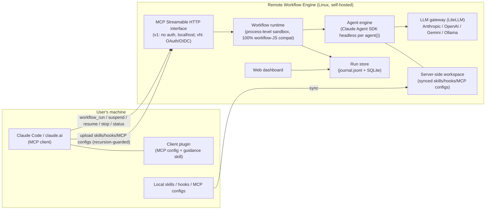

# 01 Requirements — Remote Workflow Engine

> **Product in one line**: a self-hostable (local or remote Linux) execution environment for
> Claude-generated workflow JS files, exposed as an MCP Streamable HTTP service, with pluggable
> LLM backends (Anthropic / OpenAI / Gemini / local LLM), full lifecycle control
> (suspend / resume / stop), and per-agent observability.

## Context & confirmed decisions (Gate 1 clarification outcomes)

| # | Decision | User's choice |
|---|---|---|
| D1 | Agent execution engine | **Claude Agent SDK (headless)** per `agent()` call — native MCP tools / skills / hooks support |
| D2 | Multi-model support | **Embedded LiteLLM proxy** as the LLM gateway (via `ANTHROPIC_BASE_URL`); gateway interface abstracted so it can be replaced later. Cost goal: route cheap/local models to mechanical agents, expensive models to critical agents. No Anthropic billing when requests route to non-Anthropic providers. |
| D3 | Local asset bridging | **Sync-upload only** (skills / hooks / MCP configs pushed to the server); no reverse tunnel in scope. Upload via MCP tools exposed by this server. |
| D4 | Recursion guard | The client plugin / skill / MCP config **of this system itself must be excluded** from sync and from server-side agent runtimes, so remote agents cannot recursively invoke the remote-workflow service, and the local dynamic Workflow tool never conflicts with this service. |
| D5 | Authentication | **Iteration 1: no auth** (bind 127.0.0.1 by default; remote access via SSH tunnel). OAuth 2.0 / generic OIDC resource server deferred to a later iteration (enterprise IdP = SSO or Entra ID, both OIDC-capable). |
| D6 | Sandbox isolation | **Process-level**: each run in its own Node.js child process + restricted VM context (script sees only the workflow API surface); dedicated working directory per run. |
| D7 | Observability | **Both** Web dashboard and MCP query tools. |
| D8 | Client distribution | A **Claude Code plugin** installs the MCP connection + a guidance skill teaching agents when/how to use the remote service vs the built-in dynamic Workflow tool. |
| D9 | Tech stack (orchestrator default) | Node.js / TypeScript server (natural fit: workflow scripts are JS; Claude Agent SDK has a first-class TS SDK). Persistence: filesystem journal (`journal.jsonl` per run) + SQLite index. |
| D10 | Work folders | Every registered workflow gets its **own persistent work folder**; every run executes in a run-scoped workspace under it (agents' file I/O roots there). |
| D11 | Execution modes | Beyond run-once-now: **cron-scheduled**, **one-shot at a time**, and **resident (deployed, user-triggered on demand)** workflows. |

> **Compatibility baseline**: the full as-is capability survey of Claude's dynamic Workflow tool lives in
> [`dynamic-workflow-compat-spec.md`](dynamic-workflow-compat-spec.md) (same folder) — §1–§5 are the 100%-compat
> target for REQ-001/002/003; §6 lists this product's deliberate extensions; §7 lists compat fixtures.

---

## Iteration v1 — core engine (local, no auth)

### REQ-001 — Execute Claude-generated workflow JS files unmodified (100% API compatibility)
- **status:** draft
- **traces:** —
- **acceptance:**
  - Given a workflow JS file produced by Claude's Workflow tool (using `export const meta`, `phase()`, `log()`, `agent()` with `{label, phase, schema}`, `pipeline()`, `parallel()`, `args`, `budget`, and a `return` value) When it is submitted for execution with an `args` value Then the run completes and the returned result deep-equals what the script's `return` statement produces, and each `agent()` with a `schema` yields an object validating against that schema
  - Given a workflow script that calls `Date.now()`, `Math.random()`, or argless `new Date()` When executed Then the call throws inside the script (determinism guard) and the error is reported in the run result
  - Given a `pipeline(items, s1, s2)` where one item's stage throws When executed Then that item resolves to `null`, its remaining stages are skipped, and all other items complete; and a `parallel()` thunk whose agent fails resolves to `null` without rejecting the whole call
- **iter:** v1

### REQ-002 — Workflow semantics: nesting, concurrency caps, budget accounting
- **status:** draft
- **traces:** —
- **acceptance:**
  - Given a script calling `workflow({scriptPath}, args)` When executed Then the child runs inline sharing the parent's concurrency cap / agent counter / budget, and a second-level nested `workflow()` call inside the child throws
  - Given a configured per-run concurrency cap N and a `parallel()` of more than N thunks When executed Then at most N agents run simultaneously (observable via run status) and all thunks still complete; and total agent count is capped at 1000 per run
  - Given a run started with a token budget T When cumulative output tokens across all agents reach T Then subsequent `agent()` calls throw, and `budget.total/spent()/remaining()` values observable in the script match the server's accounting
- **iter:** v1

### REQ-003 — Real agent execution per `agent()` via Claude Agent SDK
- **status:** draft
- **traces:** —
- **acceptance:**
  - Given a workflow whose `agent()` prompt requires reading a file in the run workspace When executed Then the spawned agent (Claude Agent SDK headless session) actually uses its tools to read the file and `agent()` resolves to the agent's final text (string without schema; validated object with schema, with retry-on-mismatch)
  - Given `agent(prompt, {agentType})` naming an agent definition present in the server-side workspace When executed Then that definition's system prompt/tools are applied; and given an unknown agentType Then the call fails with a reported error, not a hang
  - Given a subagent that dies on a terminal API error after retries When executed Then `agent()` resolves to `null` and the run continues (matching Claude Workflow-tool semantics)
- **iter:** v1

### REQ-004 — Multi-model routing (model aliases → configured providers via gateway)
- **status:** draft
- **traces:** —
- **acceptance:**
  - Given a server model-mapping config binding aliases (e.g. `sonnet`, `haiku`, `opus`, `default`) to provider models (Anthropic / OpenAI / Gemini / Ollama-local) When a workflow calls `agent(prompt, {model: 'haiku'})` Then the request is served by the mapped provider model (observable in the run's per-agent record: provider + real model id)
  - Given an alias mapped to a local Ollama model When the agent runs Then no request leaves for any paid provider (gateway logs show only the local backend) and token usage is still accounted into `budget`
  - Given a workflow omitting `opts.model` When executed Then the `default` alias mapping is used; and given an alias with no mapping Then submission-time validation reports the missing mapping instead of failing mid-run
  - Given a mapped provider that is unreachable or hung (e.g. local Ollama down) When an agent call routes to it Then the gateway applies a bounded timeout with retry and the affected `agent()` resolves to `null` (the run continues, never hangs), with the provider failure visible in that agent's run record (D-G minimal circuit breaker, user-confirmed 2026-07-03)
- **iter:** v1

### REQ-005 — MCP Streamable HTTP interface for run control
- **status:** draft
- **traces:** —
- **acceptance:**
  - Given the server is up When an MCP client connects over Streamable HTTP and calls `tools/list` Then it sees at least: `workflow_run`, `workflow_status`, `workflow_result`, `workflow_suspend`, `workflow_resume`, `workflow_stop`, `workflow_list`
  - Given `workflow_run` is called with a workflow script (inline content or server path) and optional `args` Then it returns a `runId` immediately (async execution) and `workflow_result(runId)` eventually returns the script's return value
  - Given default config When the server starts Then it listens on 127.0.0.1 only; and given `bind: 0.0.0.0` in config Then it serves remote clients (v1 explicitly unauthenticated — documented as SSH-tunnel/VPN deployment)
- **iter:** v1

### REQ-006 — Lifecycle: suspend / resume / stop with durable state
- **status:** draft
- **traces:** —
- **acceptance:**
  - Given a running workflow When `workflow_suspend(runId)` is called Then in-flight agents are stopped, state persists, and status becomes `suspended`; When `workflow_resume(runId)` is called Then completed `agent()` calls replay from the journal cache instantly and only unfinished calls run live, producing the same final result as an uninterrupted run
  - Given a suspended or completed run When the server process is restarted Then `workflow_status(runId)` still returns the run's state and a suspended run can still be resumed (journal + store survive restarts)
  - Given `workflow_stop(runId)` Then the run terminates, its sandbox process exits, status becomes `stopped`, and a subsequent `workflow_resume` with an edited script re-runs only from the first changed `agent()` call (cached-prefix resume semantics)
- **iter:** v1

### REQ-007 — Per-agent observability via MCP tools
- **status:** draft
- **traces:** —
- **acceptance:**
  - Given a running workflow When `workflow_status(runId)` is called Then it returns the phase list and per-agent entries: label, phase, state (queued/running/done/failed), model+provider actually used, and token usage
  - Given a completed agent When its transcript is requested (e.g. `workflow_agent_log(runId, agentId)`) Then the full message/tool-call transcript of that agent is returned
- **iter:** v1

### REQ-013 — Per-workflow work folder & per-run workspace
- **status:** draft
- **traces:** —
- **acceptance:**
  - Given a registered workflow When runs are started Then each run executes inside a run-scoped workspace directory under that workflow's own persistent work folder, and agents' relative file I/O resolves inside that workspace (a file written by run A is not visible to a concurrently running run B's workspace)
  - Given two different workflows When both run Then their work folders are distinct and neither can be resolved from the other via the provided API surface
  - Given a completed run When its workspace is inspected via the API (status/artifacts listing) Then files produced by its agents are retrievable; and a documented retention/cleanup policy governs old run workspaces
- **iter:** v1

### REQ-014 — Named workflow registry (save, list, invoke by name; `workflow(name)` compat)
- **status:** draft
- **traces:** —
- **acceptance:**
  - Given MCP tools to register a workflow (name + script) When a script is registered Then `workflow_list` shows it, and `workflow_run` accepts the name (no inline script needed)
  - Given a running script that calls `workflow('other-name', args)` When `other-name` exists in the server registry Then the child runs inline sharing caps/budget (per REQ-002) and its return value is delivered; and given an unknown name Then the call throws a catchable error naming the missing workflow
  - Given a registered workflow is updated When the next run starts Then it uses the new script version, and prior runs' journals still reference the version they ran with
  - Given registered workflows exist When the server restarts Then `workflow_list` still shows them and `workflow_run(name)` still works (registry persisted in SQLite; user-confirmed 2026-07-03)
- **iter:** v1

---

## Iteration v2 — remote deployment, asset sync, dashboard, client plugin

### REQ-008 — Web dashboard for runs and agents
- **status:** draft
- **traces:** —
- **acceptance:**
  - Given the server is up When a browser opens the dashboard URL Then it lists runs with status, and drilling into a run shows the phase/agent tree with live-updating agent states and token usage (update visible without manual reload)
  - Given a selected agent in the dashboard Then its transcript is viewable
- **iter:** v2

### REQ-009 — Sync-upload local skills (recursion-guarded)
- **status:** draft
- **traces:** —
- **acceptance:**
  - Given `asset_push` for a skill directory (plus `asset_list` / `asset_delete`) When a local skill dir is pushed Then it lands in the server-side asset store and a later workflow's SDK-gateway agents can invoke that skill (materialized into the run workspace `.claude/skills/<name>/`, loaded via project-scope settingSources)
  - Given a push that includes this system's own client plugin, its guidance skill, or the MCP connection config pointing at this server When synced Then those items are excluded/filtered (recursion guard) and the exclusion is reported to the caller
  - Given a pushed asset of an MCP-config kind Then it is NOT materialized per-run but redirected to server-side provisioning (REQ-017); and given a hook-kind asset Then it is rejected with a clear "hooks unsupported" reason (REQ-019)
- **iter:** v3

### REQ-010 — Claude Code client plugin (install + guidance skill, conflict-free)
- **status:** draft
- **traces:** —
- **acceptance:**
  - Given the plugin is installed in Claude Code When the user lists MCP servers Then the remote-workflow server connection is configured, and a guidance skill is available that instructs agents when to use the remote service vs the built-in dynamic Workflow tool
  - Given the plugin is installed When a locally-generated dynamic workflow JS runs via the local Workflow tool Then it is unaffected; and the same JS file submitted through the plugin's MCP connection executes remotely (both paths coexist without conflict)
- **iter:** v2

### REQ-011 — Deployable on local and remote Linux
- **status:** draft
- **traces:** —
- **acceptance:**
  - Given a clean Linux host and only the documented steps (DEPLOY.md: docker-compose or systemd path) When followed Then the server + LiteLLM gateway boot and pass a documented smoke check (submit a sample workflow → completes)
  - Given the same install on localhost (developer machine) Then the identical steps work without remote-specific assumptions
- **iter:** v2

### REQ-015 — Execution modes: cron schedule, one-shot timed, resident user-triggered
- **status:** draft
- **traces:** —
- **acceptance:**
  - Given a registered workflow with a cron schedule (e.g. `0 3 * * *`) When the scheduled time arrives Then a new run starts automatically with the configured `args`, appears in `workflow_list`/dashboard like any manual run, and the schedule keeps firing until disabled
  - Given a one-shot schedule (run once at time T) When T arrives Then exactly one run starts and the schedule auto-completes; and given T is edited before firing Then the new time applies
  - Given a workflow deployed as **resident** (enabled, waiting) When a user triggers it (MCP tool `workflow_trigger(name, args)`) Then a run starts immediately with those args; and given it is disabled Then triggering is rejected with a clear error
- **iter:** v2

---

## Iteration v3 — distributed harness, server-side provisioning, secrets, authentication

> v3 goal (user 2026-07-10): non-Anthropic models (Ollama/qwen, OpenAI, Gemini, GLM, …) run the FULL
> agent harness (tool loop + MCP + skills) through the Claude Agent SDK, with a convenient-and-safe
> way to deliver harness pieces in the distributed (remote-engine) topology. Grounded by the
> 2026-07-10 pre-Gate-1 spike (real qwen2.5:7b tool_use round-trip via LiteLLM+SDK).
> **Scope decision (user 2026-07-10):** OIDC auth (REQ-012) stays DEFERRED to a later slice; this
> slice's hard security boundary is **bind 127.0.0.1 only + SSH-tunnel/VPN for remote** — the
> `mcp_provision` / asset / secret / `/mcp` surfaces must never be exposed publicly until auth lands.

### REQ-016 — Non-Anthropic models run the full agent harness (tool loop + MCP + skills) via the SDK gateway
- **status:** draft
- **traces:** —
- **acceptance:**
  - Given an alias mapped to a non-Anthropic provider (Ollama/OpenAI/Gemini) and an `agent()` with at least one tool available When executed on the SDK gateway Then the model emits a **native `tool_use`** (not text), the tool actually executes in the run workspace, and its result is incorporated into the agent's final answer (real round-trip, observable in the per-agent transcript) — verified end-to-end for a local Ollama model
  - Given a non-Anthropic alias When the SDK session is constructed Then extended thinking is disabled for it (`thinking:{type:'disabled'}`), so the provider does not 400 on `think:true`; and given an Anthropic-mapped alias Then thinking is left at SDK default — regression guard (D-F6)
  - Given the SDK gateway path When an agent runs Then the tool surface exposed to the model is the curated allowlist only (never the full built-in Claude Code surface), so small models are not drowned into text-only degradation; the curated surface is observable in the session init
  - Given only the documented deployment steps for a local Ollama host When followed Then the harness path (`gateway:"sdk"` + managed LiteLLM proxy on Python 3.11/3.12) boots and a sample workflow whose `agent()` uses a tool completes green
- **iter:** v3

### REQ-017 — MCP tools provisioned server-side (registry), referenced by name, explicitly injected
- **status:** draft
- **traces:** —
- **acceptance:**
  - Given an admin provisions an MCP server config into the engine's server-side registry once (out-of-band from workflow submission, e.g. `mcp_provision`) When a later workflow references that MCP by name Then its tools are available to that run's SDK agents
  - Given a workflow references an MCP name that is not provisioned Then submission/run reports a clear error, not a silent no-op
  - Given any run When the SDK session is built Then ONLY the explicitly-referenced provisioned MCP servers are injected (`strictMcpConfig` preserved); the host's ambient user/project MCP plugins are never inherited (the VAL-003 isolation invariant continues to hold)
  - Given both admin-installed stdio and remote-HTTP provisioned MCP kinds Then both are usable (stdio is trusted because admin-provisioned, not per-run-uploaded)
- **iter:** v3

### REQ-018 — Secrets for providers / MCP via a server-side store, never workspace-reachable
- **status:** draft
- **traces:** —
- **acceptance:**
  - Given a provisioned MCP or a provider alias needs a token When configured Then the secret is supplied from a server-side store (systemd `LoadCredential` / process env), and the stored registry/asset entry carries only a reference handle (e.g. `${secret:name}`), never the plaintext value
  - Given any run workspace or the untrusted VM sandbox When inspected Then no provider/MCP secret is present on any path reachable from it (extends D-R2 hermeticity / D-V2G8)
  - Given a referenced secret is missing at run time Then the run reports a clear error — never a silent leak, a hang, or the literal handle passed through as a value
- **iter:** v3

### REQ-019 — Hooks are explicitly unsupported (uploaded user hooks removed)
- **status:** draft
- **traces:** —
- **acceptance:**
  - Given any provisioning/upload path receives a hook-kind asset When submitted Then it is rejected with a clear "hooks unsupported" reason (not silently materialized) — closes the arbitrary-server-side-code (RCE) vector by construction
  - Given a run executes Then no user-supplied hook runs on the server; the engine's OWN internal `PreToolUse` workspace-boundary hook (a fixed security control, not user-uploadable) is unaffected and still fires
- **iter:** v3

### REQ-020 — SDK gateway path bounds a hung agent LLM call (timeout + retries)
- **status:** draft
- **traces:** —
- **acceptance:**
  - Given the SDK gateway path and a configured `timeoutMs`/`retries` When an agent's underlying LLM call hangs or its provider is unreachable Then the call is bounded by the same timeout+retry policy as the direct-fetch path, and the affected `agent()` resolves to `null` (the run continues, never hangs) — the bound is observably applied (closing the v2 state where `timeoutMs` had no effect on this path)
  - Given a bounded failure Then the provider/timeout failure is visible in that agent's run record, never smuggled as fake success text
- **iter:** v3

### REQ-012 — OAuth 2.0 via generic OIDC resource server (deferred by user decision D5)
- **status:** draft
- **traces:** —
- **acceptance:**
  - Given auth is enabled with an OIDC issuer URL (works with Keycloak in dev; enterprise SSO / Entra ID in prod) When an MCP client presents no/invalid token Then requests are rejected per the MCP authorization spec (401 + resource metadata), and a client completing the OAuth 2.0 flow (PKCE) gains access
  - Given auth is disabled in config Then behavior matches v1 (backward compatible)
- **iter:** v3

---

## Open questions (red cards — deferred, do not block v1)
- [ ] v3: which enterprise IdP exactly (SSO vendor or Entra ID)? Both are OIDC; confirm at v3 kickoff. (User: environment currently has neither — Keycloak for dev.)
- [ ] Post-v2: is a reverse-tunnel bridge for truly machine-bound local MCP tools (filesystem, desktop apps) needed? Explicitly out of scope now (D3).
- [ ] `effort` opt mapping for non-Anthropic models (no direct equivalent): v1 default = pass-through/ignore for non-Anthropic; revisit if quality issues appear.

### REQ-021 — No ambient host-project CLAUDE.md / auto-memory leaks into agent context (workRoot isolation)
- **status:** draft
- **traces:** —
- **iter:** v3
- **acceptance:**
  - Given the SDK-gateway path builds an agent session with `settingSources:['project']` (needed to load the run workspace's own materialized `.claude/skills`), and the run workspace is nested under a directory that is a Claude Code project (an ancestor containing `.git` or `CLAUDE.md`) When the agent runs Then the agent CLI resolves the project root to that ancestor and loads ITS `CLAUDE.md` + `~/.claude/projects/<hash>/memory` into the agent context — a confinement leak that BYPASSES the tool-level workspace jail (D-V2G8-1(d)), because it happens at session-init, not via a Read tool call. This must be prevented. (Empirically reproduced 2026-07-11: `workRoot:"./data"` inside the engine repo → a qwen agent verbatim echoed the operator's MEMORY.md; moving workRoot outside any project made the leak vanish — journal 2026-07-11.)
  - Given the real product entrypoint resolves a `workRoot` (config/env) that is itself, or has any ancestor that is, a Claude Code project (`.git`/`CLAUDE.md` present) When the server boots Then it fails fast with a clear, actionable error (`WORKROOT_INSIDE_PROJECT`) naming the offending ancestor and the remedy (set workRoot outside any project), rather than silently running with the leak.
  - Given a `workRoot` with no project-marker ancestor Then boot proceeds normally (no false positive on an ordinary data dir).

## v4 slice — workspace byte-transport + lifecycle (REQ-022..026)

> Backfilled 2026-07-19: these five REQ were built via direct TDD on 2026-07-11 (ARCH-020..022 /
> TASK-039..043 / DES-032..036 / IMPL-081..084 / UT-055,056 / IT-042) but their requirement text was
> never written, leaving ARCH-020..022 tracing to non-existent upstream. Text here is written to match
> the shipped, test-covered, real-validated behavior (closes the 5 broken chains; Gate 8 v3 flagged them).

### REQ-022 — Recursively list a run's workspace artifacts with size + sha256
- **status:** reviewed
- **traces:** —
- **acceptance:** Given a completed run whose agents wrote files (including nested subdirectories) into its workspace When `workflow_artifacts{runId}` is called Then it returns every file as `{path (workspace-relative), size, sha256}` so a client can diff/verify what changed without downloading everything; a `.git/` directory and any symlink whose real target escapes the workspace are NOT listed; a run that wrote nothing returns `[]` (not an error)
- **iter:** v4

### REQ-023 — Fetch a windowed, size-capped, realpath-contained chunk of a workspace file
- **status:** reviewed
- **traces:** —
- **acceptance:** Given a workspace file too large for an inline `workflow_result` When `workflow_artifact_get{runId, path, offset, length}` is called Then it returns exactly that byte window (size-capped), so a patch/bundle can be fetched without OOM; Given a `path` that escapes the workspace (`../` or a symlink whose real target is outside) Then it is denied with a typed error, never bytes from outside the run workspace
- **iter:** v4

### REQ-024 — Bound the HTTP request-body size (413)
- **status:** reviewed
- **traces:** —
- **acceptance:** Given an HTTP request to the MCP/ingestion surface whose body exceeds the configured cap When received Then the server responds `413` and does not buffer the whole oversized body into memory (no OOM / DoS via a giant body)
- **iter:** v4

### REQ-025 — Seed files into the run workspace before agents start, with `.claude` RCE strip
- **status:** reviewed
- **traces:** —
- **acceptance:** Given `workflow_run{seed:[{path, contentB64}]}` When the run starts Then every seed file is materialized into the run workspace BEFORE any agent starts; Given a seed entry under `.claude/settings*.json` or `.claude/hooks/**` Then it is stripped (never materialized) so a seed cannot smuggle server-side hook/settings RCE (mirrors the REQ-019 asset hook-gate for the seed path); Given a seed `path` that escapes the workspace, or targets `.git` internals Then it is rejected (realpath-contained), never written outside the run workspace
- **iter:** v4

### REQ-026 — Run-workspace retention: manual purge (terminal-only) + opt-in TTL GC
- **status:** reviewed
- **traces:** —
- **acceptance:** Given a run in a terminal state (completed/failed/stopped) When `workspace_purge{runId}` is called Then its on-disk workspace tree is deleted while its journaled record/transcript is preserved; Given a run that is still active/suspended/queued Then purge is refused with `RUN_NOT_TERMINAL` (never races the sandbox); Given `config.workspaceTtlMs` is set When the GC runs Then it reclaims only TERMINAL workspaces older than the TTL, never an active/suspended/unknown run's workspace
- **iter:** v4

## v5 slice — GitHub issue reporting tool (REQ-027..030)

> Added 2026-07-19. A new MCP tool `issue_report` so any connected client/agent (from any machine, no
> host-switching) can file a STRUCTURED, agent-consumable GitHub issue into the engine's own repo —
> the intake side of a future "report → agent solves it" flow. Explicit-tool-only (no auto-file);
> fixed repo; GitHub token via the REQ-018 server-side secret store.

### REQ-027 — `issue_report` MCP tool files a structured GitHub issue
- **status:** reviewed
- **traces:** —
- **acceptance:** Given a client calls `issue_report{title, reproSteps, analysis, logs?, severity?, component?, runId?}` (title, reproSteps, analysis required) When invoked Then the engine creates ONE GitHub issue in the fixed repo `HsuJavis/remote-workflow-engine` and returns `{issueNumber, url}` in the uniform result envelope; Given a required field (title/reproSteps/analysis) is missing or empty When invoked Then it returns a typed `ISSUE_REPORT_INVALID` error (with `field`) and NO issue is created (fail-fast, no partial call)
- **iter:** v5

### REQ-028 — GitHub token via server-side secret, never workspace-reachable
- **status:** reviewed
- **traces:** —
- **acceptance:** Given `issue_report` needs a GitHub token When it runs Then the token is read ONLY from the server-side secret store (`RWE_SECRET_GITHUB_TOKEN` env / systemd `LoadCredential`), never from a run workspace, the untrusted VM sandbox, or the tool arguments; Given the token is not configured When `issue_report` is called Then it returns a typed `GITHUB_TOKEN_MISSING` error — never the literal handle, never a silent no-op, never a leak; Given any run workspace/transcript/log When inspected Then the token value never appears (redacted, extends REQ-018)
- **iter:** v5

### REQ-029 — Structured, agent-consumable issue body + labels for the solve-flow
- **status:** reviewed
- **traces:** —
- **acceptance:** Given an issue is filed When its body is rendered Then it follows a FIXED, machine-parseable template with labelled sections (`## Summary`, `## Reproduction steps`, `## Logs`, `## Analysis / root cause`, `## Environment` incl. engine version + ISO timestamp, and `## Linked run` when `runId` given) so a downstream issue-solving agent can parse and reproduce it; Given the issue is created Then it carries the fixed label `agent-reported` (and `severity:<level>` when provided) so the solve-flow can query for it
- **iter:** v5

### REQ-030 — Bounded, typed-error GitHub API call (never hangs or crashes the engine)
- **status:** reviewed
- **traces:** —
- **acceptance:** Given the GitHub API is unreachable, times out, is rate-limited, or returns a non-2xx When `issue_report` runs Then the call is bounded by a configured timeout+retry policy and resolves to a typed `GITHUB_API_ERROR` envelope carrying the HTTP status/reason — the tool never hangs and the engine process never crashes; Given a transient failure Then the failure is visible to the caller in the result envelope, never smuggled as a fake success
- **iter:** v5

## v6 slice — issue read/reply toolset for effective problem-handling (REQ-031..036)

> Added 2026-07-19. The read/write GitHub-issue primitives the "report → agent solves it" flow needs:
> an agent can find issues, read the conversation, reply with progress/resolution, plus two quality
> upgrades to issue_report (dedup + runId diagnostics enrichment). Same server-side PAT (Issues:R/W),
> same GithubIssueClient pattern, fixed repo. The "solve" logic itself is a workflow composing these
> primitives with workflow_run/rwe-apply — not a single tool.

### REQ-031 — `issue_get` reads a single issue
- **status:** reviewed
- **traces:** —
- **acceptance:** Given a client calls `issue_get{number}` When invoked Then it returns the issue's `{number, title, state, labels, body, url, commentCount}` from the fixed repo in the uniform envelope; Given the number does not exist Then it returns a typed `ISSUE_NOT_FOUND` error (never a crash); token missing → `GITHUB_TOKEN_MISSING`
- **iter:** v6

### REQ-032 — `issue_list` finds issues (for the solve-flow to pick up work)
- **status:** reviewed
- **traces:** —
- **acceptance:** Given a client calls `issue_list{labels?, state?, since?, limit?}` When invoked Then it returns a bounded array of `{number, title, state, labels, url}` matching the filter (default `state:open`, e.g. `labels:["agent-reported"]`), so a solve agent can enumerate work; the result is size-capped (default/hard limit) so a huge repo can't return unbounded; token missing → `GITHUB_TOKEN_MISSING`
- **iter:** v6

### REQ-033 — `issue_comments` reads an issue's replies
- **status:** reviewed
- **traces:** —
- **acceptance:** Given a client calls `issue_comments{number}` When invoked Then it returns the issue's comments in order as `{id, author, body, createdAt}` (the conversation/prior attempts a solve agent needs), size-capped; unknown number → `ISSUE_NOT_FOUND`; token missing → `GITHUB_TOKEN_MISSING`
- **iter:** v6

### REQ-034 — `issue_comment` posts a reply to an issue
- **status:** reviewed
- **traces:** —
- **acceptance:** Given a client calls `issue_comment{number, body}` (both required) When invoked Then it posts one comment to that issue and returns `{commentId, url}`; empty body → `ISSUE_COMMENT_INVALID`; unknown number → `ISSUE_NOT_FOUND`; token missing → `GITHUB_TOKEN_MISSING`; the call is bounded + typed-error like issue_report (never hangs/crashes)
- **iter:** v6

### REQ-035 — `issue_report` de-duplicates instead of spamming
- **status:** reviewed
- **traces:** —
- **acceptance:** Given `issue_report` is called and an OPEN issue with the same de-dup fingerprint (derived from title/component) already exists When invoked Then it does NOT create a duplicate — it posts the new report as a comment on the existing issue and returns `{issueNumber, url, deduped:true}`; Given no matching open issue Then it creates a new one as before (`deduped:false`/absent). Prevents an agent from flooding the repo with duplicates on the pre-OIDC surface
- **iter:** v6

### REQ-036 — `issue_report` auto-enriches from a runId
- **status:** reviewed
- **traces:** —
- **acceptance:** Given `issue_report{..., runId}` names a known run When invoked Then the issue body's `## Linked run` section is auto-enriched with that run's engine-side diagnostics (status, the failing/last agent's transcript tail, and the workspace artifact list) pulled from the engine — so the issue is reproducible from real run data, not only the caller's prose; Given the runId is unknown Then the tool still files the issue (the enrichment is best-effort, never fails the report)
- **iter:** v6

## v7 slice — provider-native routing + OpenRouter + models_list catalog (REQ-037..040)

> Added 2026-07-24. Fixes two real gaps found in use: (1) tool-schema translation hurts Anthropic
> models needlessly (they should skip LiteLLM); (2) an MCP client writing a workflow can't discover
> which models the engine offers. Single harness (Claude Agent SDK) kept; LiteLLM stays the
> integration layer for non-Anthropic; Anthropic routes direct.

### REQ-037 — Provider-aware SDK routing + Anthropic dual auth (API key or subscription)
- **status:** reviewed
- **traces:** —
- **acceptance:** Given an `agent()` call resolves to an alias whose provider is `anthropic` When the SDK session is built Then `ANTHROPIC_BASE_URL` points at the REAL Anthropic API (LiteLLM is bypassed — no tool-schema translation); Given the provider is `openai`/`openrouter`/`ollama` Then `ANTHROPIC_BASE_URL` points at the managed LiteLLM proxy (translation). Given the Anthropic-direct path and auth mode `api-key` (real `ANTHROPIC_API_KEY` secret present) Then it authenticates with that key (never the dummy); Given auth mode `subscription` (`CLAUDE_CODE_OAUTH_TOKEN` secret present, from `claude setup-token`) Then it authenticates with the OAuth subscription token and NO `ANTHROPIC_API_KEY` is set; both auth modes are supported and selected by config/secret presence. Given the required auth for the chosen mode is missing Then the run reports a typed error, never a silent dummy-key failure. Auth material is injected ONLY into the SDK subprocess env (never workspace/sandbox-reachable, extends REQ-018/D-R2).
- **iter:** v7

### REQ-038 — `openrouter` first-class provider + model passthrough
- **status:** reviewed
- **traces:** —
- **acceptance:** Given an alias with `provider:"openrouter"` (or a passthrough model string `openrouter/<id>`) When routed Then LiteLLM routes it natively as `openrouter/<model>` using `OPENROUTER_API_KEY` from the server-side env; the model id passes through UNMODIFIED so ANY current OpenRouter model works without a pre-listed alias; Given the alias validation Then `openrouter` is an accepted provider (not rejected as unknown), and a bad passthrough id fails bounded+typed at run time (never hangs). Coexists with a direct-`openai` provider (separate keys, no OPENAI_API_BASE global remap).
- **iter:** v7

### REQ-039 — `models_list` unified, normalized, cross-provider catalog
- **status:** reviewed
- **traces:** —
- **acceptance:** Given a client calls `models_list` When invoked Then it returns a UNIFIED array where every entry has the same shape `{provider, model, alias?, description, modalities:{in:[…],out:[…]}, contextWindow, price(in/out or "free"/"unknown"), toolUse(bool/"unknown"), location:"local"|"remote"}`; sources are federated: the curated aliases + a live query of Ollama `/api/tags` (local models) + a live query of OpenRouter `/api/v1/models` (remote, metadata mapped incl. tool support from `supported_parameters`) + a small static table for the known openai/anthropic models; NO API key or secret value ever appears in the output (secret-separated). A provider whose live catalog is unreachable degrades gracefully (its curated/static entries still return).
- **iter:** v7

### REQ-040 — `models_list` filtering to narrow the result
- **status:** reviewed
- **traces:** —
- **acceptance:** Given `models_list{provider?, query?, modalityIn?, modalityOut?, maxPricePerM?, minContext?, toolUse?, location?, limit?}` When invoked Then only models matching ALL supplied filters are returned, capped by `limit` (with a sane default/hard cap), so a client can narrow OpenRouter's large catalog (e.g. `{location:"remote", toolUse:true, maxPricePerM:1, query:"qwen"}`); an empty match returns `[]` (not an error)
- **iter:** v7

<!-- ── v8 Slice 1 — N-level workflow() composition (compose registered workflows into a system graph). See docs/v8-trigger-architecture.md §7 Slice 1. ── -->

### REQ-041 — `workflow()` nesting supports N levels up to a configurable depth cap
- **status:** reviewed
- **traces:** —
- **acceptance:** Given `rwe.config.json` sets `maxWorkflowDepth:N` (default **4** when absent/unset) When a `workflow()` call chain nests to depth ≤ N Then each nested workflow resolves from the catalog, runs, and returns its value to the caller (so a registered composite CAN be a node inside another composite — lifting today's one-level `NESTING_ERROR`); When a `workflow()` call would exceed depth N Then that single call fails with error code `NESTING_DEPTH_EXCEEDED` (envelope-not-crash: the parent run does NOT hang or die, the error is branchable and its message names the depth limit). The top-level run is depth 0; its first `workflow()` call is depth 1. An out-of-range/invalid `maxWorkflowDepth` (≤0 or non-integer) is rejected/clamped at config load with a clear message.
- **iter:** v8

### REQ-042 — ancestor-cycle guard on nested `workflow()`
- **status:** reviewed
- **traces:** —
- **acceptance:** Given a live nesting chain whose ancestor workflows are e.g. A→B→C When any `workflow()` targets a name already present in its own ancestor set ({A,B,C}) Then the call fails with `NESTING_CYCLE` (naming the offending workflow) instead of recursing unboundedly — a self-call A→A is refused at the first re-entry. AND a legitimate diamond (two sibling branches each calling the same NON-ancestor workflow D) is allowed: D runs independently in each branch and is not mistaken for a cycle.
- **iter:** v8

### REQ-043 — total-descendant cap per run
- **status:** reviewed
- **traces:** —
- **acceptance:** Given a run whose nested `workflow()` invocations across the WHOLE tree (fan-out × depth) reach a configurable total-descendant cap (`maxWorkflowDescendants`, default **256**) When the (cap+1)th nested `workflow()` is attempted Then it fails with `DESCENDANT_CAP_EXCEEDED`; a run with ≤ cap nested calls completes normally. This bounds a wide-and-deep graph independently of the per-branch depth cap (REQ-041), so an accidental fan-out explosion cannot spawn unbounded nested executions.
- **iter:** v8

### REQ-044 — cross-depth invariants preserved (shared budget + resume-safe journal)
- **status:** reviewed
- **traces:** —
- **acceptance:** Given a nested chain of depth ≥ 2 where scripts at multiple levels each call `agent()` Then (a) every `agent()` call at any depth decrements the SAME parent run's single `RunGuard` budget — there is NO per-level budget reset, so the aggregate agent count is bounded by the one run budget (observable: a depth-3 script issuing 2 agents/level against a run budget of 5 fails the 6th agent with the budget error, not the 6th-per-level); AND (b) the journal `callSeq` keys assigned to nested `agent()` calls remain globally unique across arbitrary depth within `MAX_SAFE_INTEGER` (the current `(parentCallSeq+1)×1e6+n` multiply scheme overflows past ~depth 2 and MUST be reworked), so replay is not corrupted; a resume of the same unmodified composite script replays every nested `agent()` call from cache deterministically (identical results, no re-dispatch).
- **iter:** v8

<!-- ── v8 Slice 2 — call-tree + composite linkage (dashboard data layer, first increment). See docs/v8-trigger-architecture.md §6/§7 Slice 2. Deferred to a later increment: parallel() group markers, phase persistence + current-step + timing, static pre-read + scriptVersion cache, cross-restart tree persistence. ── -->

### REQ-045 — each `agent()` node records the composite frame it ran in
- **status:** reviewed
- **traces:** —
- **acceptance:** Given a run whose script composes registered workflows (`workflow()`), Then every `agent()` record surfaced by `workflow_status` carries a `frame` string identifying the nesting frame it executed in: the top-level script's own agents carry the ROOT frame (the empty string `""`), and an agent inside a nested `workflow()` carries a non-root frame whose parent frame is a strict PREFIX of it (so a depth-2 agent's frame strictly extends its depth-1 ancestor frame). Observable: a composite `top(agent T) → mid(agent M) → leaf(agent L)` yields `T.frame == ""`, `M.frame` non-empty, `L.frame` has `M.frame` as a strict prefix — so agents can be grouped and nested by frame without any other data.
- **iter:** v8

### REQ-046 — each nested `workflow()` call is recorded as a composite-boundary node
- **status:** reviewed
- **traces:** —
- **acceptance:** Given the same composite run, Then `workflow_status` exposes a `workflowNodes` array with one entry per nested `workflow(name)` invocation: `{ frame, name, parentFrame, depth }`, where `frame` equals the frame its own inner agents carry (REQ-045), `parentFrame` is the caller's frame (root `""` for a top-level `workflow()` call), and `depth` is 1-based. Observable: the `top→mid→leaf` run yields nodes `{name:"mid", parentFrame:"", depth:1}` and `{name:"leaf", parentFrame:<mid.frame>, depth:2}`; a diamond that calls the same workflow twice yields TWO distinct nodes (distinct `frame`s). This is the composite linkage that lets the dashboard render a composite as multiple sub-cards.
- **iter:** v8

### REQ-047 — `workflow_status` exposes enough to reconstruct the live call-tree (DAG) + drill to logs
- **status:** reviewed
- **traces:** —
- **acceptance:** Given a single `workflow_status(runId)` call on an in-process composite run (running or just-completed), Then its result contains BOTH the frame-tagged `agents` (REQ-045) and `workflowNodes` (REQ-046), from which a client reconstructs the full call tree deterministically — group agent nodes by `frame`, nest frames by `parentFrame` — with each agent node's live `state`/`model`/`label`/`phase` already present (so the current step = the running node(s)); AND every agent node's `agentId` resolves to its transcript via `workflow_agent_log(runId, agentId)` (the node→log drill-down). The same shape is returned by `GET /api/runs/:id`. (Cross-restart persistence of the tree is explicitly out of scope for this increment.)
- **iter:** v8

<!-- ── v8 Slice 3 — dashboard UI (cards → live DAG → agent log). See docs/v8-trigger-architecture.md §6/§7 Slice 3. Reuses the Slice-2 data layer; keeps the 3s poll (SSE deferred). ── -->

### REQ-048 — pure `buildDagModel` reconstructs a run's call tree from its status
- **status:** reviewed
- **traces:** —
- **acceptance:** Given a `RunStatusView` carrying frame-tagged `agents` + `workflowNodes` (REQ-045/046), `buildDagModel(view)` returns a tree rooted at the top-level frame: the ROOT node holds the agents whose `frame` is `""` and, as `children`, one composite node per top-level `workflowNode` (`parentFrame === ""`); each composite node (keyed by its `frame`) holds the agents whose `frame` matches it and, recursively, the composite nodes whose `parentFrame` equals its frame; each agent leaf carries `{agentId, label, state, model, tokens}` and each composite node carries `{frame, name, depth}`. Observable: for `T(frame "") · mid→agent M(frame ".0") · leaf→agent L(frame ".0.0")` the result is `root{ agents:[T], children:[ mid{name:"mid", agents:[M], children:[ leaf{name:"leaf", agents:[L] } ] } ] }`. Pure (no I/O), never throws, never drops an agent (an agent whose frame has no matching node attaches to root).
- **iter:** v8

### REQ-049 — dashboard renders cards → live DAG → agent log
- **status:** reviewed
- **traces:** —
- **acceptance:** Given the dashboard served at `GET /dashboard`, Then its home view lists BOTH registered workflows (from `GET /api/workflows`) and runs (from `GET /api/runs`) as cards; clicking a run card opens that run's DAG (from `GET /api/runs/:id/dag`, backed by REQ-048) rendered as a NESTED tree — each composite sub-workflow is a labeled group containing its own agent nodes and nested groups, each agent node colored by its 3-state (`queued`/`running`/`done`/`failed`) and showing its model; clicking an agent node loads its transcript (`GET /api/runs/:id/agents/:aid`); the page refreshes on a 3-second poll. Observable (real-run, headless browser): after a nested composite run, loading `/dashboard` shows the run as a card; opening it renders the composite groups with their agent nodes carrying state CSS classes; clicking an agent node shows its log text.
- **iter:** v8

<!-- ── v8 Slice 2b — live execution detail (phase timeline + current step + per-agent timing). See docs/v8-trigger-architecture.md §6/§7. Deferred to Slice 2c: parallel() group markers (needs a sandbox-child protocol change), cross-restart phase/tree persistence, SSE (keeps the 3s poll), static pre-read + scriptVersion cache. ── -->

### REQ-050 — phase timeline with timestamps + current step
- **status:** reviewed
- **traces:** —
- **acceptance:** Given a run whose script calls `phase(title)` one or more times, Then each entry in `workflow_status.phases` carries the ISO timestamp it was entered (`{title, ts}`), the entries are in call order (non-decreasing `ts`), and — while the run's status is `running` — the LAST entry is the current step. Observable: a script `phase('draft'); …; phase('verify')` yields `phases = [{title:'draft', ts:t0}, {title:'verify', ts:t1}]` with `t0 ≤ t1`; the dashboard renders the phase timeline and visually marks the current (last, while running) phase. Backward-compatible: a run with no `phase()` call yields `phases: []`.
- **iter:** v8

### REQ-051 — per-agent timing (started / ended / duration)
- **status:** reviewed
- **traces:** —
- **acceptance:** Given an `agent()` call, Then its record carries `startedAt` (the ISO time it was dispatched to the gateway, i.e. once it acquired its concurrency slot) and, once settled, `endedAt` (with `endedAt ≥ startedAt`); a still-in-flight agent has `startedAt` but no `endedAt`; a queued-but-not-yet-dispatched agent has neither. `buildDagModel`'s agent nodes expose `startedAt`/`endedAt` and a derived non-negative `durationMs` (undefined while unfinished), and the dashboard shows each agent node's duration. Observable: a completed agent node has both timestamps and `durationMs ≥ 0`; the value equals `endedAt − startedAt`.
- **iter:** v8

<!-- ── v8 Slice 4 — cross-trigger chaining + run-admission (the last core v8 trigger mechanism). See docs/v8-trigger-architecture.md §7 Slice 4. Deferred: external ingress security (Defer B) + durable in-flight-graph suspend/resume (Defer A). ── -->

### REQ-052 — authoritative `onTerminal` hook fires once per terminal transition
- **status:** reviewed
- **traces:** —
- **acceptance:** Given an injected `onTerminal(runId, status)` listener on the RunManager, Then it is invoked EXACTLY once for each top-level run reaching a terminal status, for ALL THREE terminal statuses — `completed`, `failed`, AND `stopped` — fired from the single authoritative `_transition` (NOT the un-`.catch`ed `.then` in `_runLive`, which never covers `stopped`); a non-terminal transition (`running`/`suspended`) does NOT fire it; a nested `workflow()` execution (which has no store row and never calls `_transition`) does NOT fire it. Firing does not block or corrupt the terminal state write: the listener runs after the transition is persisted, and a throwing listener never wedges the run's terminal transition. Observable: a run that completes fires `onTerminal(id,'completed')` once; a stopped run fires `onTerminal(id,'stopped')` once; a composite parent run with 2 nested `workflow()` calls fires exactly ONE onTerminal (for the parent), not three.
- **iter:** v8

### REQ-053 — durable on-completion chaining (run A completes → start run B)
- **status:** reviewed
- **traces:** —
- **acceptance:** Given a client registers a continuation via `chain_create({afterRunId, run:{workflow, args?}})` → `{chainId}`, Then when `afterRunId` reaches terminal `completed`, the engine starts `run.workflow` with `run.args` exactly ONCE and records the spawned `runId` on the continuation (observable via `chain_list`); the spawned run inherits a lineage `rootRunId` (= afterRunId's own root, or afterRunId if it is a root). When `afterRunId` terminates `failed`/`stopped` instead, the continuation is marked SKIPPED and no run is started. The continuation is DURABLE (SQLite, engine-owned side table — no change to RunSpec/RunStore): if the engine restarts after `afterRunId` already terminated, a boot reconcile fires (or skips) any still-pending continuation exactly once by reading the run's persisted terminal status. Firing is IDEMPOTENT — a stop→resume→complete cycle (two terminal transitions) starts B at most once. A `chain_create` whose `afterRunId` is unknown returns a typed error (`CHAIN_TARGET_NOT_FOUND`), never a crash.
- **iter:** v8

### REQ-054 — run-admission counter bounds concurrent top-level runs
- **status:** reviewed
- **traces:** —
- **acceptance:** Given `rwe.config.json` sets `maxConcurrentRuns:N` (default **64** when absent; invalid ≤0/non-integer rejected at config load), When a `start()` would make the number of live (non-terminal: `queued`/`running`/`suspended`) top-level runs exceed N, Then `start()` fails with error code `RUN_ADMISSION_LIMIT` BEFORE any durable/expensive work (no `store.createRun`, no workspace mkdir, no seed, no sandbox spawn) — the DoS chokepoint the global agent-semaphore does NOT provide (it caps only `agent()` dispatch, not run count / sandbox forks / workspace materialization). A nested `workflow()` does NOT consume an admission slot (it is not a top-level `start()`). Once a run reaches a terminal status its slot is freed (a later `start()` succeeds). Observable: with `maxConcurrentRuns:1`, a second concurrent top-level `start()` fails `RUN_ADMISSION_LIMIT` while the first is still running, and succeeds once the first completes.
- **iter:** v8
