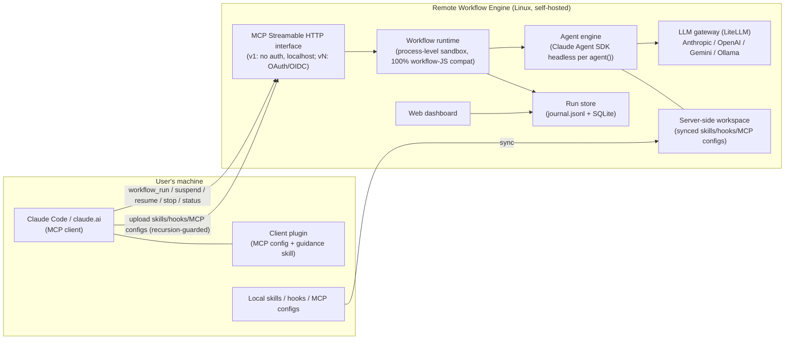

# 01 Requirements — Remote Workflow Engine

> **Product in one line**: a self-hostable (local or remote Linux) execution environment for
> Claude-generated workflow JS files, exposed as an MCP Streamable HTTP service, with pluggable
> LLM backends (Anthropic / OpenAI / Gemini / local LLM), full lifecycle control
> (suspend / resume / stop), and per-agent observability.

## Clarification log

Gate 1 for the original v1 scope was interviewed over 2 AskUserQuestion rounds (decisions D1–D11).
Each later iteration appends its own round here.

### Round v21 — 2026-08-31 (author/user separation)

**User's opening statement of the problem** (verbatim intent): workflows are written by an author but
used by others; because nothing separates the two roles, "換這個需求但是 workflow 要用一樣的就要改
workflow js,變成會一直改". Users should be able to feed back problems and tune non-script variables
(model / timeout / effort / append prompt) but must not edit the workflow JS; authors need authoring
rules that force data/logic separation; system prompt, workdir, skills and MCP tools must never be
user-modifiable. Secondary asks: a read-only MCP surface that explains all this; a workflow diagram a
human can actually follow (agent-drawn ASCII, rounded-box agents, trigger method, fan-out/fan-in,
conditional branch/loop); model selection driven by per-model data; and — user's own open questions —
"是不是註冊的 workflow 要有 beta/release 的機制? 然後回報問題可以針對哪個 workflow 去報?"

**Grounding pass before answering** (read-only survey of the engine, recorded because it changed the
scope): four facts decided the shape of the requirements — (a) `resolveHarnessParams` has zero callers
in `src/`, so REQ-088's registered defaults never reach a run; (b) `effort` is advertised in the MCP
DSL contract but nothing reads it; (c) the catalog stores one row per name, so version history does not
exist and beta/release is a schema change, not a field; (d) the four "must be locked" items are already
unreachable from the caller — the real hole is `workflow_run({script})` plus `workflow_get` returning
the full script to anyone, which lets a user copy-edit-and-run around the whole intent.

| Q | Question put to the user | User's answer |
|---|---|---|
| Q1 | Who counts as the author, and does closing the ad-hoc inline-script path (currently a main usage route, a real behavioural break) get sign-off? | **Close inline script entirely — every run goes through a registered workflow.** |
| Q2 | Given the system prompt is locked, where exactly does a user's `appendPrompt` attach? | **Fixed position: after the system prompt and after skill/MCP.** |
| Q3 | Should `workflow_get` mask the script from non-owners? | **Yes, mask it. And remove the skeleton entirely — an agent should analyse the workflow and draw the line diagram; the user only needs to know the shape of the workflow.** |
| Q4 | Priority — this bundle displaces the previously agreed ordering (issue-goal → v11 sysinfo → v10 seed-sync Slice 3/4). | User asked for a proposed ordering, then **approved the v21 → v22 → v23 roadmap** and set the goal "走到 v23 完成、E2E 驗證都 OK、Playwright 開 dashboard 正常". |

**Backlog reconciliation done in the same round** (so "what is left" is honest): v11 system info,
model-catalog enrichment, v10 seed-sync Slice 3 and Slice 4, `redact()` wiring and the D-BIND bind
guard are all already delivered; the only open GitHub issue is **#32**, which is exactly the
agent-drawn diagram feature and is therefore folded into v23. Not scheduled: the security-hardening
iteration for three still-unwired modules (`session-options-builder`, `cli-lifecycle`, `timeout-race`,
re-verified 2026-08-31 as having zero importers in `src/`).

**Resulting scope split:** v21 = REQ-090..095 (this document); v22 = version history + beta/release
channels + closing inline script + masking `workflow_get`, which must ship together because banning
inline script without channels would leave an author's only iteration path overwriting the exact
version users are running; v23 = `workflow_describe` + agent-rendered ASCII diagram + skeleton removal,
closing issue #32.

## Context & confirmed decisions (Gate 1 clarification outcomes)

| # | Decision | User's choice |
|---|---|---|
| D1 | Agent execution engine | **Claude Agent SDK (headless)** per `agent()` call — native MCP tools / skills / hooks support |
| D2 | Multi-model support | **Embedded LiteLLM proxy** as the LLM gateway (via `ANTHROPIC_BASE_URL`); gateway interface abstracted so it can be replaced later. Cost goal: route cheap/local models to mechanical agents, expensive models to critical agents. No Anthropic billing when requests route to non-Anthropic providers. |
| D3 | Local asset bridging | **Sync-upload only** (skills / hooks / MCP configs pushed to the server); no reverse tunnel in scope. Upload via MCP tools exposed by this server. |
| D4 | Recursion guard | The client plugin / skill / MCP config **of this system itself must be excluded** from sync and from server-side agent runtimes, so remote agents cannot recursively invoke the remote-workflow service, and the local dynamic Workflow tool never conflicts with this service. |
| D5 | Authentication | **Iteration 1: no auth** (bind 127.0.0.1 by default; remote access via SSH tunnel). OAuth 2.0 / generic OIDC resource server deferred to a later iteration (enterprise IdP = SSO or Entra ID, both OIDC-capable). |
| D6 | Sandbox isolation | **Process-level**: each run in its own Node.js child process + restricted VM context (script sees only the workflow API surface); dedicated working directory per run. |
| D7 | Observability | **Both** Web dashboard and MCP query tools. |
| D8 | Client distribution | A **Claude Code plugin** installs the MCP connection + a guidance skill teaching agents when/how to use the remote service vs the built-in dynamic Workflow tool. |
| D9 | Tech stack (orchestrator default) | Node.js / TypeScript server (natural fit: workflow scripts are JS; Claude Agent SDK has a first-class TS SDK). Persistence: filesystem journal (`journal.jsonl` per run) + SQLite index. |
| D10 | Work folders | Every registered workflow gets its **own persistent work folder**; every run executes in a run-scoped workspace under it (agents' file I/O roots there). |
| D11 | Execution modes | Beyond run-once-now: **cron-scheduled**, **one-shot at a time**, and **resident (deployed, user-triggered on demand)** workflows. |
| D12 (v21, user 2026-08-31) | Author / user role split | The engine distinguishes a workflow's **author** (its `owner` principal from REQ-087 — no new role concept) from its **users**. Users may tune only a declared set of knobs: **model / effort / timeoutMs / appendPrompt** plus the author-declared `args`. Permanently **locked** to the author: the system prompt, `skills`, `tools`, provisioned `mcp` servers, and the work directory. Enforcement is engine-side validation at run submission, not convention. |
| D13 (v21, user 2026-08-31) | appendPrompt attachment point | A user-supplied `appendPrompt` is attached at a **fixed position: after the agentType system prompt and after the skill / MCP surface**, i.e. appended to the outbound prompt composition — never replacing or preceding the locked system prompt. |
| D14 (v22, user 2026-08-31) | Inline script is closed | `workflow_run({script})` and `workflow_resume({script})` are **removed as caller-supplied entry points**; every run goes through a registered name. Consequence recorded at Gate 1: the submission-time static checks (parse / model-alias / MCP-provisioned) currently gated on `spec.script` must move to registration time or they become dead code. |
| D15 (v22, user 2026-08-31) | Version history + beta/release channels | The catalog keeps **version history** (a name may have many versions); `beta` and `release` are channel pointers to specific versions. `channel` is a **run-time parameter defaulting to `release`**; no per-user channel opt-in state. `workflow_get` **masks the script for non-owners**. |
| D16 (v23, user 2026-08-31) | Diagram by agent; skeleton removed | The regex `parseWorkflowSkeleton` is **removed** (all three consumers). A configuration-separated **analyzer agent** reads the script + params declaration and renders an **ASCII line diagram** (rounded-box agents, trigger method, fan-out/fan-in, conditional branch/loop), stored per version and served read-only. Accepted consequence: the live run DAG then shows only agents that actually spawned, with no predicted cells. Closes GitHub issue #32. |

> **Compatibility baseline**: the full as-is capability survey of Claude's dynamic Workflow tool lives in
> [`dynamic-workflow-compat-spec.md`](dynamic-workflow-compat-spec.md) (same folder) — §1–§5 are the 100%-compat
> target for REQ-001/002/003; §6 lists this product's deliberate extensions; §7 lists compat fixtures.

---

## Iteration v1 — core engine (local, no auth)

### REQ-001 — Execute Claude-generated workflow JS files unmodified (100% API compatibility)
- **status:** draft
- **traces:** —
- **acceptance:**
  - Given a workflow JS file produced by Claude's Workflow tool (using `export const meta`, `phase()`, `log()`, `agent()` with `{label, phase, schema}`, `pipeline()`, `parallel()`, `args`, `budget`, and a `return` value) When it is submitted for execution with an `args` value Then the run completes and the returned result deep-equals what the script's `return` statement produces, and each `agent()` with a `schema` yields an object validating against that schema
  - Given a workflow script that calls `Date.now()`, `Math.random()`, or argless `new Date()` When executed Then the call throws inside the script (determinism guard) and the error is reported in the run result
  - Given a `pipeline(items, s1, s2)` where one item's stage throws When executed Then that item resolves to `null`, its remaining stages are skipped, and all other items complete; and a `parallel()` thunk whose agent fails resolves to `null` without rejecting the whole call
- **iter:** v1

### REQ-002 — Workflow semantics: nesting, concurrency caps, budget accounting
- **status:** draft
- **traces:** —
- **acceptance:**
  - Given a script calling `workflow({scriptPath}, args)` When executed Then the child runs inline sharing the parent's concurrency cap / agent counter / budget, and a second-level nested `workflow()` call inside the child throws
  - Given a configured per-run concurrency cap N and a `parallel()` of more than N thunks When executed Then at most N agents run simultaneously (observable via run status) and all thunks still complete; and total agent count is capped at 1000 per run
  - Given a run started with a token budget T When cumulative output tokens across all agents reach T Then subsequent `agent()` calls throw, and `budget.total/spent()/remaining()` values observable in the script match the server's accounting
    **SUPERSEDED IN PART BY REQ-127 (v26, 2026-09-08).** The owner's Q5 ruling made the budget a **cost**
    budget, so from v26 `budget.total/spent()/remaining()` are **USD**, not tokens; the four token columns
    are read through the new `budget.tokens()`. The clause above still binds in substance — the values a
    script observes must match the server's accounting, and reaching the limit still stops dispatch — only
    the UNIT changed. The v25-era tests that assert token semantics on `spent()` (IT-018 / VAL-002 /
    IT-037 / IT-135 / IT-137) are to be rewritten against `budget.tokens()`, not deleted: the property they
    pin (script view == server accounting) is exactly what REQ-127 still requires.
- **iter:** v1

### REQ-003 — Real agent execution per `agent()` via Claude Agent SDK
- **status:** draft
- **traces:** —
- **acceptance:**
  - Given a workflow whose `agent()` prompt requires reading a file in the run workspace When executed Then the spawned agent (Claude Agent SDK headless session) actually uses its tools to read the file and `agent()` resolves to the agent's final text (string without schema; validated object with schema, with retry-on-mismatch)
  - Given `agent(prompt, {agentType})` naming an agent definition present in the server-side workspace When executed Then that definition's system prompt/tools are applied; and given an unknown agentType Then the call fails with a reported error, not a hang
  - Given a subagent that dies on a terminal API error after retries When executed Then `agent()` resolves to `null` and the run continues (matching Claude Workflow-tool semantics)
- **iter:** v1

### REQ-004 — Multi-model routing (model aliases → configured providers via gateway)
- **status:** draft
- **traces:** —
- **acceptance:**
  - Given a server model-mapping config binding aliases (e.g. `sonnet`, `haiku`, `opus`, `default`) to provider models (Anthropic / OpenAI / Gemini / Ollama-local) When a workflow calls `agent(prompt, {model: 'haiku'})` Then the request is served by the mapped provider model (observable in the run's per-agent record: provider + real model id)
  - Given an alias mapped to a local Ollama model When the agent runs Then no request leaves for any paid provider (gateway logs show only the local backend) and token usage is still accounted into `budget`
  - Given a workflow omitting `opts.model` When executed Then the `default` alias mapping is used; and given an alias with no mapping Then submission-time validation reports the missing mapping instead of failing mid-run
  - Given a mapped provider that is unreachable or hung (e.g. local Ollama down) When an agent call routes to it Then the gateway applies a bounded timeout with retry and the affected `agent()` resolves to `null` (the run continues, never hangs), with the provider failure visible in that agent's run record (D-G minimal circuit breaker, user-confirmed 2026-07-03)
- **iter:** v1

### REQ-005 — MCP Streamable HTTP interface for run control
- **status:** draft
- **traces:** —
- **acceptance:**
  - Given the server is up When an MCP client connects over Streamable HTTP and calls `tools/list` Then it sees at least: `workflow_run`, `workflow_status`, `workflow_result`, `workflow_suspend`, `workflow_resume`, `workflow_stop`, `workflow_list`
  - Given `workflow_run` is called with a workflow script (inline content or server path) and optional `args` Then it returns a `runId` immediately (async execution) and `workflow_result(runId)` eventually returns the script's return value
  - Given default config When the server starts Then it listens on 127.0.0.1 only; and given `bind: 0.0.0.0` in config Then it serves remote clients (v1 explicitly unauthenticated — documented as SSH-tunnel/VPN deployment)
- **iter:** v1

### REQ-006 — Lifecycle: suspend / resume / stop with durable state
- **status:** draft
- **traces:** —
- **acceptance:**
  - Given a running workflow When `workflow_suspend(runId)` is called Then in-flight agents are stopped, state persists, and status becomes `suspended`; When `workflow_resume(runId)` is called Then completed `agent()` calls replay from the journal cache instantly and only unfinished calls run live, producing the same final result as an uninterrupted run
  - Given a suspended or completed run When the server process is restarted Then `workflow_status(runId)` still returns the run's state and a suspended run can still be resumed (journal + store survive restarts)
  - Given `workflow_stop(runId)` Then the run terminates, its sandbox process exits, and status becomes `stopped`.
    **[SUPERSEDED v22, owner-confirmed 2026-09-01]** The remainder of this clause — "a subsequent `workflow_resume` with an
    edited script re-runs only from the first changed `agent()` call (cached-prefix resume semantics)" — is superseded by
    **REQ-098** (inline script is closed; `workflow_resume` no longer accepts a replacement script) together with
    **REQ-096** (a run pins the version it executed). Decided in **ADR-010**. The cached-prefix machinery itself is
    unaffected and still governs a bare `workflow_resume(runId)`; what is withdrawn is the *edited-script* entry point.
    **Sanctioned replacement:** register a new version, then run by version. A `workflow_resume({runId, version})`
    re-point was considered and rejected — no v22 REQ asks for it, and it collides with v21's ADR-002 run-immutable
    `effectiveParams` snapshot; restoring an edited-script loop would be a future requirements decision, not an
    architecture one. No test pinned the withdrawn clause (every suite calls `resume(runId)` bare), so nothing green
    was weakened to make this true.
- **iter:** v1

### REQ-007 — Per-agent observability via MCP tools
- **status:** draft
- **traces:** —
- **acceptance:**
  - Given a running workflow When `workflow_status(runId)` is called Then it returns the phase list and per-agent entries: label, phase, state (queued/running/done/failed), model+provider actually used, and token usage
  - Given a completed agent When its transcript is requested (e.g. `workflow_agent_log(runId, agentId)`) Then the full message/tool-call transcript of that agent is returned
- **iter:** v1

### REQ-013 — Per-workflow work folder & per-run workspace
- **status:** draft
- **traces:** —
- **acceptance:**
  - Given a registered workflow When runs are started Then each run executes inside a run-scoped workspace directory under that workflow's own persistent work folder, and agents' relative file I/O resolves inside that workspace (a file written by run A is not visible to a concurrently running run B's workspace)
  - Given two different workflows When both run Then their work folders are distinct and neither can be resolved from the other via the provided API surface
  - Given a completed run When its workspace is inspected via the API (status/artifacts listing) Then files produced by its agents are retrievable; and a documented retention/cleanup policy governs old run workspaces
- **iter:** v1

### REQ-014 — Named workflow registry (save, list, invoke by name; `workflow(name)` compat)
- **status:** draft
- **traces:** —
- **acceptance:**
  - Given MCP tools to register a workflow (name + script) When a script is registered Then `workflow_list` shows it, and `workflow_run` accepts the name (no inline script needed)
  - Given a running script that calls `workflow('other-name', args)` When `other-name` exists in the server registry Then the child runs inline sharing caps/budget (per REQ-002) and its return value is delivered; and given an unknown name Then the call throws a catchable error naming the missing workflow
  - Given a registered workflow is updated When the next run starts Then it uses the new script version, and prior runs' journals still reference the version they ran with
  - Given registered workflows exist When the server restarts Then `workflow_list` still shows them and `workflow_run(name)` still works (registry persisted in SQLite; user-confirmed 2026-07-03)
- **iter:** v1

---

## Iteration v2 — remote deployment, asset sync, dashboard, client plugin

### REQ-008 — Web dashboard for runs and agents
- **status:** draft
- **traces:** —
- **acceptance:**
  - Given the server is up When a browser opens the dashboard URL Then it lists runs with status, and drilling into a run shows the phase/agent tree with live-updating agent states and token usage (update visible without manual reload)
  - Given a selected agent in the dashboard Then its transcript is viewable
- **iter:** v2

### REQ-009 — Sync-upload local skills (recursion-guarded)
- **status:** draft
- **traces:** —
- **acceptance:**
  - Given `asset_push` for a skill directory (plus `asset_list` / `asset_delete`) When a local skill dir is pushed Then it lands in the server-side asset store and a later workflow's SDK-gateway agents can invoke that skill (materialized into the run workspace `.claude/skills/<name>/`, loaded via project-scope settingSources)
  - Given a push that includes this system's own client plugin, its guidance skill, or the MCP connection config pointing at this server When synced Then those items are excluded/filtered (recursion guard) and the exclusion is reported to the caller
  - Given a pushed asset of an MCP-config kind Then it is NOT materialized per-run but redirected to server-side provisioning (REQ-017); and given a hook-kind asset Then it is rejected with a clear "hooks unsupported" reason (REQ-019)
- **iter:** v3

### REQ-010 — Claude Code client plugin (install + guidance skill, conflict-free)
- **status:** draft
- **traces:** —
- **acceptance:**
  - Given the plugin is installed in Claude Code When the user lists MCP servers Then the remote-workflow server connection is configured, and a guidance skill is available that instructs agents when to use the remote service vs the built-in dynamic Workflow tool
  - Given the plugin is installed When a locally-generated dynamic workflow JS runs via the local Workflow tool Then it is unaffected; and the same JS file submitted through the plugin's MCP connection executes remotely (both paths coexist without conflict)
- **iter:** v2

### REQ-011 — Deployable on local and remote Linux
- **status:** draft
- **traces:** —
- **acceptance:**
  - Given a clean Linux host and only the documented steps (DEPLOY.md: docker-compose or systemd path) When followed Then the server + LiteLLM gateway boot and pass a documented smoke check (submit a sample workflow → completes)
  - Given the same install on localhost (developer machine) Then the identical steps work without remote-specific assumptions
- **iter:** v2

### REQ-015 — Execution modes: cron schedule, one-shot timed, resident user-triggered
- **status:** draft
- **traces:** —
- **acceptance:**
  - Given a registered workflow with a cron schedule (e.g. `0 3 * * *`) When the scheduled time arrives Then a new run starts automatically with the configured `args`, appears in `workflow_list`/dashboard like any manual run, and the schedule keeps firing until disabled
  - Given a one-shot schedule (run once at time T) When T arrives Then exactly one run starts and the schedule auto-completes; and given T is edited before firing Then the new time applies
  - Given a workflow deployed as **resident** (enabled, waiting) When a user triggers it (MCP tool `workflow_trigger(name, args)`) Then a run starts immediately with those args; and given it is disabled Then triggering is rejected with a clear error
- **iter:** v2

---

## Iteration v3 — distributed harness, server-side provisioning, secrets, authentication

> v3 goal (user 2026-07-10): non-Anthropic models (Ollama/qwen, OpenAI, Gemini, GLM, …) run the FULL
> agent harness (tool loop + MCP + skills) through the Claude Agent SDK, with a convenient-and-safe
> way to deliver harness pieces in the distributed (remote-engine) topology. Grounded by the
> 2026-07-10 pre-Gate-1 spike (real qwen2.5:7b tool_use round-trip via LiteLLM+SDK).
> **Scope decision (user 2026-07-10):** OIDC auth (REQ-012) stays DEFERRED to a later slice; this
> slice's hard security boundary is **bind 127.0.0.1 only + SSH-tunnel/VPN for remote** — the
> `mcp_provision` / asset / secret / `/mcp` surfaces must never be exposed publicly until auth lands.

### REQ-016 — Non-Anthropic models run the full agent harness (tool loop + MCP + skills) via the SDK gateway
- **status:** draft
- **traces:** —
- **acceptance:**
  - Given an alias mapped to a non-Anthropic provider (Ollama/OpenAI/Gemini) and an `agent()` with at least one tool available When executed on the SDK gateway Then the model emits a **native `tool_use`** (not text), the tool actually executes in the run workspace, and its result is incorporated into the agent's final answer (real round-trip, observable in the per-agent transcript) — verified end-to-end for a local Ollama model
  - Given a non-Anthropic alias When the SDK session is constructed Then extended thinking is disabled for it (`thinking:{type:'disabled'}`), so the provider does not 400 on `think:true`; and given an Anthropic-mapped alias Then thinking is left at SDK default — regression guard (D-F6)
  - Given the SDK gateway path When an agent runs Then the tool surface exposed to the model is the curated allowlist only (never the full built-in Claude Code surface), so small models are not drowned into text-only degradation; the curated surface is observable in the session init
  - Given only the documented deployment steps for a local Ollama host When followed Then the harness path (`gateway:"sdk"` + managed LiteLLM proxy on Python 3.11/3.12) boots and a sample workflow whose `agent()` uses a tool completes green
- **iter:** v3

### REQ-017 — MCP tools provisioned server-side (registry), referenced by name, explicitly injected
- **status:** draft
- **traces:** —
- **acceptance:**
  - Given an admin provisions an MCP server config into the engine's server-side registry once (out-of-band from workflow submission, e.g. `mcp_provision`) When a later workflow references that MCP by name Then its tools are available to that run's SDK agents
  - Given a workflow references an MCP name that is not provisioned Then submission/run reports a clear error, not a silent no-op
  - Given any run When the SDK session is built Then ONLY the explicitly-referenced provisioned MCP servers are injected (`strictMcpConfig` preserved); the host's ambient user/project MCP plugins are never inherited (the VAL-003 isolation invariant continues to hold)
  - Given both admin-installed stdio and remote-HTTP provisioned MCP kinds Then both are usable (stdio is trusted because admin-provisioned, not per-run-uploaded)
- **iter:** v3

### REQ-018 — Secrets for providers / MCP via a server-side store, never workspace-reachable
- **status:** draft
- **traces:** —
- **acceptance:**
  - Given a provisioned MCP or a provider alias needs a token When configured Then the secret is supplied from a server-side store (systemd `LoadCredential` / process env), and the stored registry/asset entry carries only a reference handle (e.g. `${secret:name}`), never the plaintext value
  - Given any run workspace or the untrusted VM sandbox When inspected Then no provider/MCP secret is present on any path reachable from it (extends D-R2 hermeticity / D-V2G8)
  - Given a referenced secret is missing at run time Then the run reports a clear error — never a silent leak, a hang, or the literal handle passed through as a value
- **iter:** v3

### REQ-019 — Hooks are explicitly unsupported (uploaded user hooks removed)
- **status:** draft
- **traces:** —
- **acceptance:**
  - Given any provisioning/upload path receives a hook-kind asset When submitted Then it is rejected with a clear "hooks unsupported" reason (not silently materialized) — closes the arbitrary-server-side-code (RCE) vector by construction
  - Given a run executes Then no user-supplied hook runs on the server; the engine's OWN internal `PreToolUse` workspace-boundary hook (a fixed security control, not user-uploadable) is unaffected and still fires
- **iter:** v3

### REQ-020 — SDK gateway path bounds a hung agent LLM call (timeout + retries)
- **status:** draft
- **traces:** —
- **acceptance:**
  - Given the SDK gateway path and a configured `timeoutMs`/`retries` When an agent's underlying LLM call hangs or its provider is unreachable Then the call is bounded by the same timeout+retry policy as the direct-fetch path, and the affected `agent()` resolves to `null` (the run continues, never hangs) — the bound is observably applied (closing the v2 state where `timeoutMs` had no effect on this path)
  - Given a bounded failure Then the provider/timeout failure is visible in that agent's run record, never smuggled as fake success text
- **iter:** v3

### REQ-012 — OAuth 2.0: engine is its own authorization server, federating to Google as IdP (un-deferred, v15 Slice B)
- **status:** draft
- **traces:** —
- **acceptance:**
  - Given auth is enabled and an MCP client (Claude Code) connects to `/mcp` without a valid bearer token When it makes any MCP request Then the engine rejects it per the **MCP authorization spec** — HTTP 401 with a `WWW-Authenticate` pointing at the engine's protected-resource metadata (`/.well-known/oauth-protected-resource`), which in turn names the engine's own authorization-server metadata (`/.well-known/oauth-authorization-server` exposing `authorization_endpoint`, `token_endpoint`, PKCE `code_challenge_methods_supported=["S256"]`) — so a schema/spec-only MCP client can discover the flow with zero custom code
  - Given the client runs the discovered **authorization-code + PKCE + loopback-redirect** flow (the "跳出瀏覽器網址" Claude-Code login) When it hits the engine's `/authorize` Then the engine (acting as its OWN authorization server, because Google does not support dynamic client registration) redirects the user's browser to **Google**'s consent screen; on consent Google redirects back to the engine's fixed server-side callback (`/oauth/google/callback`, an HTTPS URI reachable via the existing cloudflared tunnel), the engine verifies the Google `id_token` (issuer/audience/signature/expiry) and takes the verified **`email` claim as the principal**, then completes the MCP `/token` exchange issuing the engine's OWN opaque bearer token (persisted in SQLite with an expiry), NOT the Google token
  - Given a completed flow When the client presents the engine-issued bearer on `/mcp` Then requests are accepted and every downstream action is attributed to that email principal (observable in the run/audit record); Given the token is expired or unknown Then requests are rejected 401 and the client can re-run the flow
  - Given the engine config carries the Google `client_id`/`client_secret` (server-side secret store only, per REQ-018) and NO end-user ever sees them When the flow runs Then those credentials never appear in any client-visible response, transcript, or workspace-reachable path
  - Given auth is DISABLED in config Then behavior matches the pre-v15 surface (backward compatible; the engine still boots and serves an unauthenticated LAN as before — auth is opt-in by config, then enforced by REQ-089)
  - **(v16 Gate-8 fix, ARCH-059 invariant 4 — open-redirect → bearer theft)** Given a client calls `/authorize` with a `redirect_uri` that is NOT a loopback URI (`http://127.0.0.1:<port>` / `http://localhost:<port>` / `http://[::1]:<port>`, per RFC 8252) Then `/authorize` rejects it with a 400 (`invalid_request`) BEFORE storing any state and BEFORE redirecting to Google — so a mint-and-deliver of the engine auth-code to an attacker-controlled URL is impossible; Given a loopback `redirect_uri` Then the flow proceeds as before. Observable: `/authorize?redirect_uri=https://evil.example/cb` → 400 with no `oauth_state` row written; `/authorize?redirect_uri=http://127.0.0.1:5599/cb` → 302 to Google as normal.
  - **(v16 Gate-8 fix, ARCH-059 note — unbounded auth-table growth)** Given the running engine's periodic maintenance sweep fires Then it garbage-collects expired `oauth_state`, unexchanged `auth_codes`, and expired `bearer_tokens` (the existing `TokenStore.gcExpired()` is invoked from the same sweep that reclaims stale workspaces), so the auth tables do not grow without bound. Observable: after inserting an already-expired state/code/bearer row and triggering the sweep, those rows are gone; a live (unexpired) bearer is retained.
  - **(v17 real-connect fix — MCP client with no pre-registered credentials, RFC 7591 Dynamic Client Registration)** Given an MCP client (Claude Code) that has NO pre-registered `client_id` discovers the engine's authorization-server metadata Then that metadata advertises a `registration_endpoint`, and the engine implements **RFC 7591 Dynamic Client Registration** at it: a `POST /register` with a client metadata document (`{redirect_uris:[…], token_endpoint_auth_method:"none", grant_types:["authorization_code"], response_types:["code"]}`) returns **201** with `{client_id, client_id_issued_at, …}` for a public PKCE client (no `client_secret`), so a spec-only MCP client can register and then complete the authorization-code+PKCE flow with **zero custom code** (closes the observed "Incompatible auth server: does not support dynamic client registration" connect failure). Given a registration request whose `redirect_uris` include a NON-loopback URI Then `/register` rejects it (`invalid_redirect_uri`, 400) — the RFC 8252 loopback rule (v16 HIGH-1) is enforced at registration too. Given a subsequent `/authorize` presenting an issued `client_id` and a `redirect_uri` that was registered for it Then the flow proceeds; the registered client is persisted (survives restart). Observable: `GET /.well-known/oauth-authorization-server` includes `registration_endpoint`; `POST /register {redirect_uris:["http://127.0.0.1:5599/cb"], …}` → 201 + `client_id`; the same with `redirect_uris:["https://evil.example/cb"]` → 400; a real MCP client SDK (`@modelcontextprotocol/sdk` auth) drives register→authorize→token end-to-end against the running engine.
  - **(v18 real-consent fix — Google's three OAuth endpoints live on THREE distinct hosts, not one base)** Given the engine performs the Google leg of the flow Then it uses each of Google's REAL production endpoints at its correct host: **authorization** `https://accounts.google.com/o/oauth2/v2/auth`, **token exchange** `https://oauth2.googleapis.com/token` (NOT `accounts.google.com/token`), and **JWKS** `https://www.googleapis.com/oauth2/v3/certs` (NOT `accounts.google.com/oauth2/v3/certs`). The single `googleBase` used for all three (default `https://accounts.google.com`) made the real token exchange + JWKS fetch hit non-existent endpoints, so `/oauth/google/callback` failed after a successful Google consent (observed 502 Bad Gateway at the callback). Observable: a static/unit assertion pins the PRODUCTION default token URL to `https://oauth2.googleapis.com/token` and the default JWKS URL to `https://www.googleapis.com/oauth2/v3/certs` (a regression guard for this fake-double-collapses-real-hosts class, which no Google-doubled test can catch); the endpoints remain injectable so the fake-Google integration tests still pass; a real end-to-end Google consent completes the callback and 302-redirects to the client's loopback with an engine auth-code.
  - **(v19 real-client fix — the client's OAuth2 `state` MUST round-trip back to the client, RFC 6749 §4.1.2 / CSRF)** Given a client (Claude Code's MCP OAuth) calls `/authorize` with a `state` parameter When the flow completes Then the engine echoes that EXACT `state` back to the client at its `redirect_uri` alongside the engine auth-code (`http://localhost:<port>/callback?code=<engineCode>&state=<clientState>`), so the client's CSRF check passes (closes the observed "OAuth state mismatch - possible CSRF attack" connect failure). The engine's own Google-leg `state` (its CSRF token to Google, stored in `oauth_state`) is SEPARATE from and never confused with the client's `state`; the client's `state` is captured at `/authorize`, persisted across the Google round-trip, and returned only at the final client redirect. The engine also includes the RFC 9207 `iss` parameter (its issuer) in that client redirect. When the client omits `state` Then none is echoed (no spurious `state=`). Observable: `/authorize?...&state=ABC123&redirect_uri=http://127.0.0.1:P/cb` drives the flow to a final client redirect carrying `state=ABC123` unchanged; a real `@modelcontextprotocol/sdk` client completes the ENTIRE authorization-code loop against the running engine with a fake IdP — register → authorize → callback → **token exchange → bearer → an authenticated `/mcp` call succeeds** — with its `state` accepted at every step (the full round-trip a Google-doubled unit test never exercised end-to-end).
  - **(v20 refresh tokens — RFC 6749 §6 / OAuth 2.1 / MCP `offline_access`, so a client never needs a browser re-auth on access-token expiry)** Given the engine's authorization-server metadata When fetched Then it advertises `scopes_supported: ["openid","email","offline_access"]`, `grant_types_supported: ["authorization_code","refresh_token"]`, `token_endpoint_auth_methods_supported: ["none"]`, and `authorization_response_iss_parameter_supported: true`. Given a client requests the `offline_access` scope at `/authorize` (Claude Code auto-appends it when it sees `offline_access` in `scopes_supported`) When the authorization-code is later exchanged at `/token` Then the response includes a `refresh_token` (opaque, sha256-at-rest, ~90-day TTL) IN ADDITION to `{access_token, token_type:"Bearer", expires_in, scope}` — `expires_in` is ALWAYS present (a missing `expires_in` makes Claude Code discard the token early, issue #26281) and `scope` is always echoed. Given the client was NOT granted `offline_access` Then no `refresh_token` is issued. Given a `POST /token` with `grant_type=refresh_token&refresh_token=<rt>&client_id=<id>` (no PKCE on the refresh grant) When the refresh token is valid Then the engine issues a NEW access_token AND a ROTATED refresh_token (the presented refresh token is single-use / consumed, RFC 9700 rotation for public clients) and returns the same `{access_token, token_type, expires_in, refresh_token, scope}` shape; When the refresh token is unknown/expired/already-consumed Then `400 invalid_grant`. The client's requested `scope` is captured at `/authorize` and persisted across the Google round-trip (mirrors the v19 client_state plumbing: `oauth_state.scope` → `auth_codes.scope` → available at token exchange) — the client-requested scope is SEPARATE from the hard-coded Google-leg `openid email`. `TokenStore.gcExpired()` also reaps expired refresh tokens. Observable: metadata shows the offline_access/refresh_token/none fields; an `/authorize?...&scope=...%20offline_access` flow yields a `/token` response containing a `refresh_token`; a subsequent `grant_type=refresh_token` call returns a fresh access_token + a DIFFERENT refresh_token, and re-using the old refresh_token → `invalid_grant`; a flow WITHOUT offline_access yields no refresh_token; a real `@modelcontextprotocol/sdk`/Claude-Code client stays connected across an access-token expiry without a new browser sign-in.
  - **(v20 UX — callback shows a success page instead of a broken loopback error)** Given the engine's `/oauth/google/callback` completes and is about to hand the engine auth-code back to the client's loopback `redirect_uri` When the response is rendered Then instead of a bare 302 the engine returns a minimal HTML success page ("✅ 認證通過 / Authentication complete") that (a) contains the full `redirect_uri?code=...&state=...&iss=...` URL with a one-click copy control (for headless `--no-browser` paste) AND (b) auto-forwards to that loopback URL via a `<meta http-equiv="refresh">` + JS redirect (so a same-machine loopback listener still auto-catches it). Observable: on a machine WITHOUT a loopback listener the browser shows the success page + copyable callback URL (not a "can't connect" error); on the same machine as the client the redirect still auto-completes.
- **iter:** v20

---

## Open questions (red cards — deferred, do not block v1)
- [ ] v3: which enterprise IdP exactly (SSO vendor or Entra ID)? Both are OIDC; confirm at v3 kickoff. (User: environment currently has neither — Keycloak for dev.)
- [ ] Post-v2: is a reverse-tunnel bridge for truly machine-bound local MCP tools (filesystem, desktop apps) needed? Explicitly out of scope now (D3).
- [ ] `effort` opt mapping for non-Anthropic models (no direct equivalent): v1 default = pass-through/ignore for non-Anthropic; revisit if quality issues appear.

### REQ-021 — No ambient host-project CLAUDE.md / auto-memory leaks into agent context (workRoot isolation)
- **status:** draft
- **traces:** —
- **iter:** v3
- **acceptance:**
  - Given the SDK-gateway path builds an agent session with `settingSources:['project']` (needed to load the run workspace's own materialized `.claude/skills`), and the run workspace is nested under a directory that is a Claude Code project (an ancestor containing `.git` or `CLAUDE.md`) When the agent runs Then the agent CLI resolves the project root to that ancestor and loads ITS `CLAUDE.md` + `~/.claude/projects/<hash>/memory` into the agent context — a confinement leak that BYPASSES the tool-level workspace jail (D-V2G8-1(d)), because it happens at session-init, not via a Read tool call. This must be prevented. (Empirically reproduced 2026-07-11: `workRoot:"./data"` inside the engine repo → a qwen agent verbatim echoed the operator's MEMORY.md; moving workRoot outside any project made the leak vanish — journal 2026-07-11.)
  - Given the real product entrypoint resolves a `workRoot` (config/env) that is itself, or has any ancestor that is, a Claude Code project (`.git`/`CLAUDE.md` present) When the server boots Then it fails fast with a clear, actionable error (`WORKROOT_INSIDE_PROJECT`) naming the offending ancestor and the remedy (set workRoot outside any project), rather than silently running with the leak.
  - Given a `workRoot` with no project-marker ancestor Then boot proceeds normally (no false positive on an ordinary data dir).

## v4 slice — workspace byte-transport + lifecycle (REQ-022..026)

> Backfilled 2026-07-19: these five REQ were built via direct TDD on 2026-07-11 (ARCH-020..022 /
> TASK-039..043 / DES-032..036 / IMPL-081..084 / UT-055,056 / IT-042) but their requirement text was
> never written, leaving ARCH-020..022 tracing to non-existent upstream. Text here is written to match
> the shipped, test-covered, real-validated behavior (closes the 5 broken chains; Gate 8 v3 flagged them).

### REQ-022 — Recursively list a run's workspace artifacts with size + sha256
- **status:** reviewed
- **traces:** —
- **acceptance:** Given a completed run whose agents wrote files (including nested subdirectories) into its workspace When `workflow_artifacts{runId}` is called Then it returns every file as `{path (workspace-relative), size, sha256}` so a client can diff/verify what changed without downloading everything; a `.git/` directory and any symlink whose real target escapes the workspace are NOT listed; a run that wrote nothing returns `[]` (not an error)
- **iter:** v4

### REQ-023 — Fetch a windowed, size-capped, realpath-contained chunk of a workspace file
- **status:** reviewed
- **traces:** —
- **acceptance:** Given a workspace file too large for an inline `workflow_result` When `workflow_artifact_get{runId, path, offset, length}` is called Then it returns exactly that byte window (size-capped), so a patch/bundle can be fetched without OOM; Given a `path` that escapes the workspace (`../` or a symlink whose real target is outside) Then it is denied with a typed error, never bytes from outside the run workspace
- **iter:** v4

### REQ-024 — Bound the HTTP request-body size (413)
- **status:** reviewed
- **traces:** —
- **acceptance:** Given an HTTP request to the MCP/ingestion surface whose body exceeds the configured cap When received Then the server responds `413` and does not buffer the whole oversized body into memory (no OOM / DoS via a giant body)
- **iter:** v4

### REQ-025 — Seed files into the run workspace before agents start, with `.claude` RCE strip
- **status:** reviewed
- **traces:** —
- **acceptance:** Given `workflow_run{seed:[{path, contentB64}]}` When the run starts Then every seed file is materialized into the run workspace BEFORE any agent starts; Given a seed entry under `.claude/settings*.json` or `.claude/hooks/**` Then it is stripped (never materialized) so a seed cannot smuggle server-side hook/settings RCE (mirrors the REQ-019 asset hook-gate for the seed path); Given a seed `path` that escapes the workspace, or targets `.git` internals Then it is rejected (realpath-contained), never written outside the run workspace
- **iter:** v4

### REQ-026 — Run-workspace retention: manual purge (terminal-only) + opt-in TTL GC
- **status:** reviewed
- **traces:** —
- **acceptance:** Given a run in a terminal state (completed/failed/stopped) When `workspace_purge{runId}` is called Then its on-disk workspace tree is deleted while its journaled record/transcript is preserved; Given a run that is still active/suspended/queued Then purge is refused with `RUN_NOT_TERMINAL` (never races the sandbox); Given `config.workspaceTtlMs` is set When the GC runs Then it reclaims only TERMINAL workspaces older than the TTL, never an active/suspended/unknown run's workspace
- **iter:** v4

## v5 slice — GitHub issue reporting tool (REQ-027..030)

> Added 2026-07-19. A new MCP tool `issue_report` so any connected client/agent (from any machine, no
> host-switching) can file a STRUCTURED, agent-consumable GitHub issue into the engine's own repo —
> the intake side of a future "report → agent solves it" flow. Explicit-tool-only (no auto-file);
> fixed repo; GitHub token via the REQ-018 server-side secret store.

### REQ-027 — `issue_report` MCP tool files a structured GitHub issue
- **status:** reviewed
- **traces:** —
- **acceptance:** Given a client calls `issue_report{title, reproSteps, analysis, logs?, severity?, component?, runId?}` (title, reproSteps, analysis required) When invoked Then the engine creates ONE GitHub issue in the fixed repo `HsuJavis/remote-workflow-engine` and returns `{issueNumber, url}` in the uniform result envelope; Given a required field (title/reproSteps/analysis) is missing or empty When invoked Then it returns a typed `ISSUE_REPORT_INVALID` error (with `field`) and NO issue is created (fail-fast, no partial call)
- **iter:** v5

### REQ-028 — GitHub token via server-side secret, never workspace-reachable
- **status:** reviewed
- **traces:** —
- **acceptance:** Given `issue_report` needs a GitHub token When it runs Then the token is read ONLY from the server-side secret store (`RWE_SECRET_GITHUB_TOKEN` env / systemd `LoadCredential`), never from a run workspace, the untrusted VM sandbox, or the tool arguments; Given the token is not configured When `issue_report` is called Then it returns a typed `GITHUB_TOKEN_MISSING` error — never the literal handle, never a silent no-op, never a leak; Given any run workspace/transcript/log When inspected Then the token value never appears (redacted, extends REQ-018)
- **iter:** v5

### REQ-029 — Structured, agent-consumable issue body + labels for the solve-flow
- **status:** reviewed
- **traces:** —
- **acceptance:** Given an issue is filed When its body is rendered Then it follows a FIXED, machine-parseable template with labelled sections (`## Summary`, `## Reproduction steps`, `## Logs`, `## Analysis / root cause`, `## Environment` incl. engine version + ISO timestamp, and `## Linked run` when `runId` given) so a downstream issue-solving agent can parse and reproduce it; Given the issue is created Then it carries the fixed label `agent-reported` (and `severity:<level>` when provided) so the solve-flow can query for it
- **iter:** v5

### REQ-030 — Bounded, typed-error GitHub API call (never hangs or crashes the engine)
- **status:** reviewed
- **traces:** —
- **acceptance:** Given the GitHub API is unreachable, times out, is rate-limited, or returns a non-2xx When `issue_report` runs Then the call is bounded by a configured timeout+retry policy and resolves to a typed `GITHUB_API_ERROR` envelope carrying the HTTP status/reason — the tool never hangs and the engine process never crashes; Given a transient failure Then the failure is visible to the caller in the result envelope, never smuggled as a fake success
- **iter:** v5

## v6 slice — issue read/reply toolset for effective problem-handling (REQ-031..036)

> Added 2026-07-19. The read/write GitHub-issue primitives the "report → agent solves it" flow needs:
> an agent can find issues, read the conversation, reply with progress/resolution, plus two quality
> upgrades to issue_report (dedup + runId diagnostics enrichment). Same server-side PAT (Issues:R/W),
> same GithubIssueClient pattern, fixed repo. The "solve" logic itself is a workflow composing these
> primitives with workflow_run/rwe-apply — not a single tool.

### REQ-031 — `issue_get` reads a single issue
- **status:** reviewed
- **traces:** —
- **acceptance:** Given a client calls `issue_get{number}` When invoked Then it returns the issue's `{number, title, state, labels, body, url, commentCount}` from the fixed repo in the uniform envelope; Given the number does not exist Then it returns a typed `ISSUE_NOT_FOUND` error (never a crash); token missing → `GITHUB_TOKEN_MISSING`
- **iter:** v6

### REQ-032 — `issue_list` finds issues (for the solve-flow to pick up work)
- **status:** reviewed
- **traces:** —
- **acceptance:** Given a client calls `issue_list{labels?, state?, since?, limit?}` When invoked Then it returns a bounded array of `{number, title, state, labels, url}` matching the filter (default `state:open`, e.g. `labels:["agent-reported"]`), so a solve agent can enumerate work; the result is size-capped (default/hard limit) so a huge repo can't return unbounded; token missing → `GITHUB_TOKEN_MISSING`
- **iter:** v6

### REQ-033 — `issue_comments` reads an issue's replies
- **status:** reviewed
- **traces:** —
- **acceptance:** Given a client calls `issue_comments{number}` When invoked Then it returns the issue's comments in order as `{id, author, body, createdAt}` (the conversation/prior attempts a solve agent needs), size-capped; unknown number → `ISSUE_NOT_FOUND`; token missing → `GITHUB_TOKEN_MISSING`
- **iter:** v6

### REQ-034 — `issue_comment` posts a reply to an issue
- **status:** reviewed
- **traces:** —
- **acceptance:** Given a client calls `issue_comment{number, body}` (both required) When invoked Then it posts one comment to that issue and returns `{commentId, url}`; empty body → `ISSUE_COMMENT_INVALID`; unknown number → `ISSUE_NOT_FOUND`; token missing → `GITHUB_TOKEN_MISSING`; the call is bounded + typed-error like issue_report (never hangs/crashes)
- **iter:** v6

### REQ-035 — `issue_report` de-duplicates instead of spamming
- **status:** reviewed
- **traces:** —
- **acceptance:** Given `issue_report` is called and an OPEN issue with the same de-dup fingerprint (derived from title/component) already exists When invoked Then it does NOT create a duplicate — it posts the new report as a comment on the existing issue and returns `{issueNumber, url, deduped:true}`; Given no matching open issue Then it creates a new one as before (`deduped:false`/absent). Prevents an agent from flooding the repo with duplicates on the pre-OIDC surface
- **iter:** v6

### REQ-036 — `issue_report` auto-enriches from a runId
- **status:** reviewed
- **traces:** —
- **acceptance:** Given `issue_report{..., runId}` names a known run When invoked Then the issue body's `## Linked run` section is auto-enriched with that run's engine-side diagnostics (status, the failing/last agent's transcript tail, and the workspace artifact list) pulled from the engine — so the issue is reproducible from real run data, not only the caller's prose; Given the runId is unknown Then the tool still files the issue (the enrichment is best-effort, never fails the report)
- **iter:** v6

## v7 slice — provider-native routing + OpenRouter + models_list catalog (REQ-037..040)

> Added 2026-07-24. Fixes two real gaps found in use: (1) tool-schema translation hurts Anthropic
> models needlessly (they should skip LiteLLM); (2) an MCP client writing a workflow can't discover
> which models the engine offers. Single harness (Claude Agent SDK) kept; LiteLLM stays the
> integration layer for non-Anthropic; Anthropic routes direct.

### REQ-037 — Provider-aware SDK routing + Anthropic dual auth (API key or subscription)
- **status:** reviewed
- **traces:** —
- **acceptance:** Given an `agent()` call resolves to an alias whose provider is `anthropic` When the SDK session is built Then `ANTHROPIC_BASE_URL` points at the REAL Anthropic API (LiteLLM is bypassed — no tool-schema translation); Given the provider is `openai`/`openrouter`/`ollama` Then `ANTHROPIC_BASE_URL` points at the managed LiteLLM proxy (translation). Given the Anthropic-direct path and auth mode `api-key` (real `ANTHROPIC_API_KEY` secret present) Then it authenticates with that key (never the dummy); Given auth mode `subscription` (`CLAUDE_CODE_OAUTH_TOKEN` secret present, from `claude setup-token`) Then it authenticates with the OAuth subscription token and NO `ANTHROPIC_API_KEY` is set; both auth modes are supported and selected by config/secret presence. Given the required auth for the chosen mode is missing Then the run reports a typed error, never a silent dummy-key failure. Auth material is injected ONLY into the SDK subprocess env (never workspace/sandbox-reachable, extends REQ-018/D-R2).
- **iter:** v7

### REQ-038 — `openrouter` first-class provider + model passthrough
- **status:** reviewed
- **traces:** —
- **acceptance:** Given an alias with `provider:"openrouter"` (or a passthrough model string `openrouter/<id>`) When routed Then LiteLLM routes it natively as `openrouter/<model>` using `OPENROUTER_API_KEY` from the server-side env; the model id passes through UNMODIFIED so ANY current OpenRouter model works without a pre-listed alias; Given the alias validation Then `openrouter` is an accepted provider (not rejected as unknown), and a bad passthrough id fails bounded+typed at run time (never hangs). Coexists with a direct-`openai` provider (separate keys, no OPENAI_API_BASE global remap).
- **iter:** v7

### REQ-039 — `models_list` unified, normalized, cross-provider catalog
- **status:** reviewed
- **traces:** —
- **acceptance:** Given a client calls `models_list` When invoked Then it returns a UNIFIED array where every entry has the same shape `{provider, model, alias?, description, modalities:{in:[…],out:[…]}, contextWindow, price(in/out or "free"/"unknown"), toolUse(bool/"unknown"), location:"local"|"remote"}`; sources are federated: the curated aliases + a live query of Ollama `/api/tags` (local models) + a live query of OpenRouter `/api/v1/models` (remote, metadata mapped incl. tool support from `supported_parameters`) + a small static table for the known openai/anthropic models; NO API key or secret value ever appears in the output (secret-separated). A provider whose live catalog is unreachable degrades gracefully (its curated/static entries still return).
- **iter:** v7

### REQ-040 — `models_list` filtering to narrow the result
- **status:** reviewed
- **traces:** —
- **acceptance:** Given `models_list{provider?, query?, modalityIn?, modalityOut?, maxPricePerM?, minContext?, toolUse?, location?, limit?}` When invoked Then only models matching ALL supplied filters are returned, capped by `limit` (with a sane default/hard cap), so a client can narrow OpenRouter's large catalog (e.g. `{location:"remote", toolUse:true, maxPricePerM:1, query:"qwen"}`); an empty match returns `[]` (not an error)
- **iter:** v7

<!-- ── v8 Slice 1 — N-level workflow() composition (compose registered workflows into a system graph). See docs/v8-trigger-architecture.md §7 Slice 1. ── -->

### REQ-041 — `workflow()` nesting supports N levels up to a configurable depth cap
- **status:** reviewed
- **traces:** —
- **acceptance:** Given `rwe.config.json` sets `maxWorkflowDepth:N` (default **4** when absent/unset) When a `workflow()` call chain nests to depth ≤ N Then each nested workflow resolves from the catalog, runs, and returns its value to the caller (so a registered composite CAN be a node inside another composite — lifting today's one-level `NESTING_ERROR`); When a `workflow()` call would exceed depth N Then that single call fails with error code `NESTING_DEPTH_EXCEEDED` (envelope-not-crash: the parent run does NOT hang or die, the error is branchable and its message names the depth limit). The top-level run is depth 0; its first `workflow()` call is depth 1. An out-of-range/invalid `maxWorkflowDepth` (≤0 or non-integer) is rejected/clamped at config load with a clear message.
- **iter:** v8

### REQ-042 — ancestor-cycle guard on nested `workflow()`
- **status:** reviewed
- **traces:** —
- **acceptance:** Given a live nesting chain whose ancestor workflows are e.g. A→B→C When any `workflow()` targets a name already present in its own ancestor set ({A,B,C}) Then the call fails with `NESTING_CYCLE` (naming the offending workflow) instead of recursing unboundedly — a self-call A→A is refused at the first re-entry. AND a legitimate diamond (two sibling branches each calling the same NON-ancestor workflow D) is allowed: D runs independently in each branch and is not mistaken for a cycle.
- **iter:** v8

### REQ-043 — total-descendant cap per run
- **status:** reviewed
- **traces:** —
- **acceptance:** Given a run whose nested `workflow()` invocations across the WHOLE tree (fan-out × depth) reach a configurable total-descendant cap (`maxWorkflowDescendants`, default **256**) When the (cap+1)th nested `workflow()` is attempted Then it fails with `DESCENDANT_CAP_EXCEEDED`; a run with ≤ cap nested calls completes normally. This bounds a wide-and-deep graph independently of the per-branch depth cap (REQ-041), so an accidental fan-out explosion cannot spawn unbounded nested executions.
- **iter:** v8

### REQ-044 — cross-depth invariants preserved (shared budget + resume-safe journal)
- **status:** reviewed
- **traces:** —
- **acceptance:** Given a nested chain of depth ≥ 2 where scripts at multiple levels each call `agent()` Then (a) every `agent()` call at any depth decrements the SAME parent run's single `RunGuard` budget — there is NO per-level budget reset, so the aggregate agent count is bounded by the one run budget (observable: a depth-3 script issuing 2 agents/level against a run budget of 5 fails the 6th agent with the budget error, not the 6th-per-level); AND (b) the journal `callSeq` keys assigned to nested `agent()` calls remain globally unique across arbitrary depth within `MAX_SAFE_INTEGER` (the current `(parentCallSeq+1)×1e6+n` multiply scheme overflows past ~depth 2 and MUST be reworked), so replay is not corrupted; a resume of the same unmodified composite script replays every nested `agent()` call from cache deterministically (identical results, no re-dispatch).
- **iter:** v8

<!-- ── v8 Slice 2 — call-tree + composite linkage (dashboard data layer, first increment). See docs/v8-trigger-architecture.md §6/§7 Slice 2. Deferred to a later increment: parallel() group markers, phase persistence + current-step + timing, static pre-read + scriptVersion cache, cross-restart tree persistence. ── -->

### REQ-045 — each `agent()` node records the composite frame it ran in
- **status:** reviewed
- **traces:** —
- **acceptance:** Given a run whose script composes registered workflows (`workflow()`), Then every `agent()` record surfaced by `workflow_status` carries a `frame` string identifying the nesting frame it executed in: the top-level script's own agents carry the ROOT frame (the empty string `""`), and an agent inside a nested `workflow()` carries a non-root frame whose parent frame is a strict PREFIX of it (so a depth-2 agent's frame strictly extends its depth-1 ancestor frame). Observable: a composite `top(agent T) → mid(agent M) → leaf(agent L)` yields `T.frame == ""`, `M.frame` non-empty, `L.frame` has `M.frame` as a strict prefix — so agents can be grouped and nested by frame without any other data.
- **iter:** v8

### REQ-046 — each nested `workflow()` call is recorded as a composite-boundary node
- **status:** reviewed
- **traces:** —
- **acceptance:** Given the same composite run, Then `workflow_status` exposes a `workflowNodes` array with one entry per nested `workflow(name)` invocation: `{ frame, name, parentFrame, depth }`, where `frame` equals the frame its own inner agents carry (REQ-045), `parentFrame` is the caller's frame (root `""` for a top-level `workflow()` call), and `depth` is 1-based. Observable: the `top→mid→leaf` run yields nodes `{name:"mid", parentFrame:"", depth:1}` and `{name:"leaf", parentFrame:<mid.frame>, depth:2}`; a diamond that calls the same workflow twice yields TWO distinct nodes (distinct `frame`s). This is the composite linkage that lets the dashboard render a composite as multiple sub-cards.
- **iter:** v8

### REQ-047 — `workflow_status` exposes enough to reconstruct the live call-tree (DAG) + drill to logs
- **status:** reviewed
- **traces:** —
- **acceptance:** Given a single `workflow_status(runId)` call on an in-process composite run (running or just-completed), Then its result contains BOTH the frame-tagged `agents` (REQ-045) and `workflowNodes` (REQ-046), from which a client reconstructs the full call tree deterministically — group agent nodes by `frame`, nest frames by `parentFrame` — with each agent node's live `state`/`model`/`label`/`phase` already present (so the current step = the running node(s)); AND every agent node's `agentId` resolves to its transcript via `workflow_agent_log(runId, agentId)` (the node→log drill-down). The same shape is returned by `GET /api/runs/:id`. (Cross-restart persistence of the tree is explicitly out of scope for this increment.)
- **iter:** v8

<!-- ── v8 Slice 3 — dashboard UI (cards → live DAG → agent log). See docs/v8-trigger-architecture.md §6/§7 Slice 3. Reuses the Slice-2 data layer; keeps the 3s poll (SSE deferred). ── -->

### REQ-048 — pure `buildDagModel` reconstructs a run's call tree from its status
- **status:** reviewed
- **traces:** —
- **acceptance:** Given a `RunStatusView` carrying frame-tagged `agents` + `workflowNodes` (REQ-045/046), `buildDagModel(view)` returns a tree rooted at the top-level frame: the ROOT node holds the agents whose `frame` is `""` and, as `children`, one composite node per top-level `workflowNode` (`parentFrame === ""`); each composite node (keyed by its `frame`) holds the agents whose `frame` matches it and, recursively, the composite nodes whose `parentFrame` equals its frame; each agent leaf carries `{agentId, label, state, model, tokens}` and each composite node carries `{frame, name, depth}`. Observable: for `T(frame "") · mid→agent M(frame ".0") · leaf→agent L(frame ".0.0")` the result is `root{ agents:[T], children:[ mid{name:"mid", agents:[M], children:[ leaf{name:"leaf", agents:[L] } ] } ] }`. Pure (no I/O), never throws, never drops an agent (an agent whose frame has no matching node attaches to root).
- **iter:** v8

### REQ-049 — dashboard renders cards → live DAG → agent log
- **status:** reviewed
- **traces:** —
- **acceptance:** Given the dashboard served at `GET /dashboard`, Then its home view lists BOTH registered workflows (from `GET /api/workflows`) and runs (from `GET /api/runs`) as cards; clicking a run card opens that run's DAG (from `GET /api/runs/:id/dag`, backed by REQ-048) rendered as a NESTED tree — each composite sub-workflow is a labeled group containing its own agent nodes and nested groups, each agent node colored by its 3-state (`queued`/`running`/`done`/`failed`) and showing its model; clicking an agent node loads its transcript (`GET /api/runs/:id/agents/:aid`); the page refreshes on a 3-second poll. Observable (real-run, headless browser): after a nested composite run, loading `/dashboard` shows the run as a card; opening it renders the composite groups with their agent nodes carrying state CSS classes; clicking an agent node shows its log text.
- **iter:** v8

<!-- ── v8 Slice 2b — live execution detail (phase timeline + current step + per-agent timing). See docs/v8-trigger-architecture.md §6/§7. Deferred to Slice 2c: parallel() group markers (needs a sandbox-child protocol change), cross-restart phase/tree persistence, SSE (keeps the 3s poll), static pre-read + scriptVersion cache. ── -->

### REQ-050 — phase timeline with timestamps + current step
- **status:** reviewed
- **traces:** —
- **acceptance:** Given a run whose script calls `phase(title)` one or more times, Then each entry in `workflow_status.phases` carries the ISO timestamp it was entered (`{title, ts}`), the entries are in call order (non-decreasing `ts`), and — while the run's status is `running` — the LAST entry is the current step. Observable: a script `phase('draft'); …; phase('verify')` yields `phases = [{title:'draft', ts:t0}, {title:'verify', ts:t1}]` with `t0 ≤ t1`; the dashboard renders the phase timeline and visually marks the current (last, while running) phase. Backward-compatible: a run with no `phase()` call yields `phases: []`.
- **iter:** v8

### REQ-051 — per-agent timing (started / ended / duration)
- **status:** reviewed
- **traces:** —
- **acceptance:** Given an `agent()` call, Then its record carries `startedAt` (the ISO time it was dispatched to the gateway, i.e. once it acquired its concurrency slot) and, once settled, `endedAt` (with `endedAt ≥ startedAt`); a still-in-flight agent has `startedAt` but no `endedAt`; a queued-but-not-yet-dispatched agent has neither. `buildDagModel`'s agent nodes expose `startedAt`/`endedAt` and a derived non-negative `durationMs` (undefined while unfinished), and the dashboard shows each agent node's duration. Observable: a completed agent node has both timestamps and `durationMs ≥ 0`; the value equals `endedAt − startedAt`.
- **iter:** v8

<!-- ── v8 Slice 4 — cross-trigger chaining + run-admission (the last core v8 trigger mechanism). See docs/v8-trigger-architecture.md §7 Slice 4. Deferred: external ingress security (Defer B) + durable in-flight-graph suspend/resume (Defer A). ── -->

### REQ-052 — authoritative `onTerminal` hook fires once per terminal transition
- **status:** reviewed
- **traces:** —
- **acceptance:** Given an injected `onTerminal(runId, status)` listener on the RunManager, Then it is invoked EXACTLY once for each top-level run reaching a terminal status, for ALL THREE terminal statuses — `completed`, `failed`, AND `stopped` — fired from the single authoritative `_transition` (NOT the un-`.catch`ed `.then` in `_runLive`, which never covers `stopped`); a non-terminal transition (`running`/`suspended`) does NOT fire it; a nested `workflow()` execution (which has no store row and never calls `_transition`) does NOT fire it. Firing does not block or corrupt the terminal state write: the listener runs after the transition is persisted, and a throwing listener never wedges the run's terminal transition. Observable: a run that completes fires `onTerminal(id,'completed')` once; a stopped run fires `onTerminal(id,'stopped')` once; a composite parent run with 2 nested `workflow()` calls fires exactly ONE onTerminal (for the parent), not three.
- **iter:** v8

### REQ-053 — durable on-completion chaining (run A completes → start run B)
- **status:** reviewed
- **traces:** —
- **acceptance:** Given a client registers a continuation via `chain_create({afterRunId, run:{workflow, args?}})` → `{chainId}`, Then when `afterRunId` reaches terminal `completed`, the engine starts `run.workflow` with `run.args` exactly ONCE and records the spawned `runId` on the continuation (observable via `chain_list`); the spawned run inherits a lineage `rootRunId` (= afterRunId's own root, or afterRunId if it is a root). When `afterRunId` terminates `failed`/`stopped` instead, the continuation is marked SKIPPED and no run is started. The continuation is DURABLE (SQLite, engine-owned side table — no change to RunSpec/RunStore): if the engine restarts after `afterRunId` already terminated, a boot reconcile fires (or skips) any still-pending continuation exactly once by reading the run's persisted terminal status. Firing is IDEMPOTENT — a stop→resume→complete cycle (two terminal transitions) starts B at most once. A `chain_create` whose `afterRunId` is unknown returns a typed error (`CHAIN_TARGET_NOT_FOUND`), never a crash.
- **iter:** v8

### REQ-054 — run-admission counter bounds concurrent top-level runs
- **status:** reviewed
- **traces:** —
- **acceptance:** Given `rwe.config.json` sets `maxConcurrentRuns:N` (default **64** when absent; invalid ≤0/non-integer rejected at config load), When a `start()` would make the number of live (non-terminal: `queued`/`running`/`suspended`) top-level runs exceed N, Then `start()` fails with error code `RUN_ADMISSION_LIMIT` BEFORE any durable/expensive work (no `store.createRun`, no workspace mkdir, no seed, no sandbox spawn) — the DoS chokepoint the global agent-semaphore does NOT provide (it caps only `agent()` dispatch, not run count / sandbox forks / workspace materialization). A nested `workflow()` does NOT consume an admission slot (it is not a top-level `start()`). Once a run reaches a terminal status its slot is freed (a later `start()` succeeds). Observable: with `maxConcurrentRuns:1`, a second concurrent top-level `start()` fails `RUN_ADMISSION_LIMIT` while the first is still running, and succeeds once the first completes.
- **iter:** v8

<!-- ── v8 Slice 2c — cross-restart DAG persistence (fixes the real data-loss: a terminated run's nested DAG/phases flatten after a restart). See docs/v8-trigger-architecture.md §6. Still deferred: SSE (Item B), parallel() group markers (Item C, needs a sandbox-IPC change), static pre-read skeleton + cache (Item D). ── -->

### REQ-055 — a terminated run's DAG (frames, phases, per-agent detail) survives a restart
- **status:** reviewed
- **traces:** —
- **acceptance:** Given a composite run with nested `workflow()` calls, `phase()` calls, and `agent()` calls reaches a terminal status (`completed`/`failed`/`stopped`), When the engine is restarted (the run is no longer in-process) and `workflow_status(runId)` / `GET /api/runs/:id` are called, Then the reconstructed `RunStatusView` still carries: (a) the `workflowNodes` (composite boundaries) and `phases` (with their `ts`) as they were at terminal — persisted once at the authoritative terminal transition (so failed/stopped are covered, not only completed); and (b) each `agent()` record's `label`, `phase`, `frame`, `startedAt`, `endedAt` (not only the tokens/provider/model that survive today) — enriched onto the persisted per-agent record so `deriveAgentRecords` reconstructs the full node. Consequently `buildDagModel` rebuilds the SAME nested tree after a restart as before it (composite groups intact, agents grouped by frame, durations shown) — the dashboard no longer flattens a completed composite run. Backward-compatible: a run persisted before this change (no snapshot / bare usage events) still reconstructs at least as well as today (phases:[]/workflowNodes:[], agents from tokens) — never worse, never a crash.
- **iter:** v8

<!-- ── v8 Defer B — external-ingress security (Host/Origin allowlist + webhook ingress). See docs/v8-trigger-architecture.md §7 Defer B. Interim control until OIDC (REQ-012, D5). ── -->

### REQ-056 — Host/Origin allowlist on the HTTP server (DNS-rebinding / CSRF defense)
- **status:** reviewed
- **traces:** —
- **acceptance:** Given the HTTP server, When a request arrives Then its `Host` header must resolve to an allowlisted authority (loopback `127.0.0.1`/`localhost` at the server port, plus the configured `bind` host:port when bound to a LAN address) — a request with a non-allowlisted `Host` is rejected `403` (defends DNS-rebinding); AND when an `Origin` header is PRESENT it must be in the allowlist, else `403` (defends a drive-by browser page CSRF-POSTing `/mcp`) — but an ABSENT `Origin` is allowed (every programmatic MCP client / test sends no Origin; fail-OPEN on absent Origin so legitimate non-browser callers are never broken). Observable: a normal loopback `fetch` to `/mcp`/`/api/runs` with no Origin still works (200); a request carrying `Host: evil.example.com` → 403; a request carrying `Origin: http://evil.example.com` → 403. The check is uniform across `/mcp`, `/api/*`, `/dashboard`, and any `/hooks/*` route.
- **iter:** v8

### REQ-057 — webhook ingress `POST /hooks/:id` fires a pre-bound workflow, HMAC-verified
- **status:** reviewed
- **traces:** —
- **acceptance:** Given a registered webhook (id → {workflow, secretHash}), When `POST /hooks/:id` arrives Then the engine verifies, fail-CLOSED and in this order: (1) the id exists and is enabled (else `404`/`403`, no run started); (2) an `X-RWE-Signature: sha256=<hex>` header equals `HMAC-SHA256(secret, rawBody)` compared in constant time (`timingSafeEqual`) — computed over the RAW body BEFORE any JSON parse — else `401`, no run; (3) an `X-RWE-Timestamp` within ±300s of now (replay window) else `401`; (4) an `X-RWE-Delivery` id not seen before (atomic dedup) — a replayed delivery is accepted idempotently (`200`, no second run). On success the engine starts the webhook's PRE-BOUND workflow via the same `RunManager.start` path (the workflow name comes from the stored registration, NEVER from the request body — no workflow-selection injection), passing the parsed body as `args.event`, and returns `202` with the spawned `{runId}`. Observable: a correctly-signed fresh delivery starts the bound workflow and returns its runId; a bad signature → 401 and no run; a replayed `X-RWE-Delivery` → 200 with no second run.
- **iter:** v8

### REQ-058 — webhook management tools with generate-once, hashed-at-rest secrets + bind safety
- **status:** reviewed
- **traces:** —
- **acceptance:** Given `webhook_create({workflow, enabled})`, Then the engine verifies the workflow is registered (else typed `WORKFLOW_NOT_FOUND`), generates a random secret server-side, and returns `{webhookId, url, secret}` with the secret shown EXACTLY ONCE. (The secret IS the HMAC key, so verification requires it — it is stored server-side and never returned again, the same model GitHub/Stripe webhooks use; a one-way hash cannot verify an HMAC.) `webhook_list` returns each webhook's `{id, workflow, enabled, secretFingerprint}` (a short sha256 prefix of the secret) and NEVER the secret itself; `webhook_delete({id})` removes it. The registry is durable (SQLite side table, survives restart, same convention as schedules.db/continuations.db). Bind safety (interim control before OIDC): admin-write ingress relies on the loopback/LAN bind + the Host/Origin allowlist (REQ-056) — a public `0.0.0.0` bind without OIDC is a documented deployment caveat. Observable: `webhook_create` returns a secret once; `webhook_list` shows only a fingerprint (never the secret); a webhook created on one process is usable after a restart (its registration + secret persisted).
- **iter:** v8

<!-- ── v8 Defer A — crash durability (a run interrupted by a crash/restart is resumable, not lost). See docs/v8-trigger-architecture.md §7 Defer A. Achieved by reusing the ResumeCache/journal replay (no VM checkpoint). ── -->

### REQ-059 — persisted journal read-back (resume-after-restart replays instead of re-running everything)
- **status:** reviewed
- **traces:** —
- **acceptance:** Given a run that journaled one or more settled `agent()`/`workflow()` calls, When it is resumed in a FRESH engine process (the run is no longer in memory), Then the resumed re-execution replays those already-journaled calls from the persisted journal — the gateway is NOT re-invoked for a call whose journal entry survives — via a new `RunStore.getJournal(runId)` read-back that populates the rehydrated run's ResumeCache (today `_requireLive` hard-codes an empty journal, so a suspended run resumed after a restart re-runs every call live — a cost/duplication bug this fixes). Observable: a run with a journaled `agent('A')` result, suspended then resumed in a new store instance on the same data dir, completes with the SAME result and the second process's gateway is never invoked for `'A'`. `getJournal` returns the settled call entries (not the terminal result marker); an unknown run → `[]`.
- **iter:** v8

### REQ-060 — a run interrupted by a crash/restart is resumable, not permanently failed
- **status:** reviewed
- **traces:** —
- **acceptance:** Given a run that was `running` when the engine crashed/restarted, When the engine boots (`hydrateAll`), Then the interrupted run is reclassified to a RESUMABLE state (not `failed`) so `workflow_resume(runId)` re-executes it — replaying its journaled calls (REQ-059) and running only the unfinished tail — to a correct terminal result, WITHOUT re-dispatching the agent() calls that completed before the crash. The run's on-disk workspace (a deterministic function of name+runId) is preserved across the restart, so file state the pre-crash agents produced is still present. A call that was mid-flight at the instant of the crash (dispatched but never journaled) is correctly re-run on resume (no journal entry → cache MISS → live re-dispatch) — the same semantics suspend/resume already guarantees; this is a documented caveat, not silent loss. Observable: a composite run crashed (engine killed) mid-second-`agent()` with the first `agent()` already journaled comes back resumable after a restart (not `failed`); resuming it completes and the first agent is served from the journal (not re-dispatched).
- **iter:** v8

<!-- ── v9 — workflow discovery / reuse decision (query a workflow's purpose + see its DAG before running, to decide reuse vs create-new). ── -->

### REQ-061 — a registered workflow's purpose is queryable (description + phases + full detail)
- **status:** reviewed
- **traces:** —
- **acceptance:** Given a workflow registered with an `export const meta = { name, description, phases }` block, When it is registered Then the engine extracts and stores the `description` and `phases` (parsed from the already-validated pure-literal meta, reusing the `checkMeta` scanner); `workflow_list` returns each workflow's `{name, version, createdAt, description}` so a client can see WHAT each workflow is for without reading its script; AND a new `workflow_get({name})` returns the full detail `{name, version, description, phases, script}` (or a typed `WORKFLOW_NOT_FOUND` for an unknown name). A workflow with no meta / no description degrades gracefully (empty description, not an error). Observable: registering a workflow whose meta.description is "drafts a reply then verifies it" makes that string appear in `workflow_list` and `workflow_get`.
- **iter:** v9

### REQ-062 — a workflow's DAG is inspectable BEFORE running it (static skeleton)
- **status:** reviewed
- **traces:** —
- **acceptance:** Given a registered workflow's script, When a client requests its skeleton (`workflow_get`'s `skeleton` field and/or `GET /api/workflows/:name/skeleton`), Then the engine returns a PREDICTED DAG skeleton — a pure static scan of the script's `phase(...)`, `agent(...)`, `parallel([...])`, and `workflow('name', ...)` calls — as an ordered node list where each node carries its kind (`phase`/`agent`/`workflow`) and, for a `workflow` node, the referenced sub-workflow name; nodes whose count/shape is runtime-dependent (inside a `for`/`while` loop or an `if`) are marked `dynamic:true` (best-effort, since loops/conditionals resolve only at run time). The scan never executes the script and never throws on an odd script (returns whatever it can parse). The dashboard's registered-workflow card links to this skeleton so a user can SEE a workflow's shape before deciding to reuse it or author a new one. Observable: the customer-service example (`parallel` of 2 drafting agents → a verify agent) yields a skeleton with a parallel group of 2 agent nodes followed by an agent node; a composite that calls `workflow('reserve-stock')` yields a `workflow` node naming `reserve-stock`.
- **iter:** v9

**[PARTIALLY SUPERSEDED v23, adjudication #2 R-3(a)]** The **user-facing surface** — `workflow_get`'s
`skeleton` field and the `GET /api/workflows/:name/skeleton` route — is withdrawn by REQ-105: the
route is deleted and no advertised schema mentions the concept. `parseWorkflowSkeleton` itself
**survives**, unchanged in shape, as (1) the run-DAG route's internal layout spine
(`/api/runs/:id/dag`, still behind the auth gate) and (2) REQ-102's analyzer grounding
(`graph-analyzer.ts`) — neither serves it to a client as a named artifact. Only the two named
user-facing vehicles are gone; the static-scan guarantee this requirement describes is not.

<!-- ── v10 Slice 1 — efficient seeding, immediate win: compressed request body + a typed too-large error. See docs/seed-sync-architecture.md (Roadmap Slice 1). The CAS substrate is Slice 2 (docs §"the CAS substrate"). ── -->

### REQ-063 — compressed request bodies + a typed, actionable too-large error
- **status:** reviewed
- **traces:** —
- **acceptance:** Given a client sends a POST body with `Content-Encoding: gzip` (or `deflate`), When the engine reads it Then it decompresses the body before parsing — so a large seed/asset payload (code compresses ~3–5×) fits under the wire cap — bounded by BOTH a compressed-input cap (the existing `MAX_BODY_BYTES`) AND a decompressed-output cap, so a decompression bomb (tiny compressed → huge output) is rejected, never OOMs the process. A body WITHOUT `Content-Encoding` behaves exactly as today. AND when a body exceeds a cap (compressed or decompressed), the engine returns a TYPED, actionable error — HTTP 413 whose JSON body carries `{ code:"BODY_TOO_LARGE", bytes|limit, cap, hint }` naming the cap and the next step (e.g. "gzip the body / it exceeds the N-byte cap") — not an opaque raw 413. Observable: a gzipped `tools/call` body that is >8 MiB uncompressed but <8 MiB gzipped is accepted and processed; a >8 MiB gzipped body → 413 with the typed error; a 1 KB gzip bomb inflating past the decompressed cap → 413 (typed), no OOM; an uncompressed >8 MiB body → the same typed 413 (with the gzip hint).
- **iter:** v10

<!-- ── v10 Slice 2 — the CAS substrate (content-addressed blob store + manifest handshake). See docs/seed-sync-architecture.md. Deferred to later increments: raw-streaming blob endpoint, per-tenant quotas/GC, the client push_workspace.py helper (git-as-client-cache), seedRef engine-pull. ── -->

### REQ-064 — content-addressed blob store with byte-verify + per-namespace refs
- **status:** reviewed
- **traces:** —
- **acceptance:** Given a `CasStore`, When `blob_put(namespace, sha256, bytes)` is called Then the engine computes sha256 over the RECEIVED bytes, stores the blob under the COMPUTED hash (never the claimed one), and records the ref for `namespace` — a claim/upload mismatch throws `BLOB_HASH_MISMATCH` and stores nothing (poisoning + confused-deputy safe). `missing(namespace, shas)`/`hasRef` are computed against the CALLER's namespace refset, never global existence — a blob namespace A uploaded is still "missing" for namespace B until B uploads it too (no cross-tenant dedup oracle). The store is durable (survives a fresh instance on the same dir), idempotent (re-put is a no-op), and immutable (a written blob is never overwritten). The MCP tools `blob_put{namespace,sha256,contentB64}` (→ `{sha256, accepted}` / typed `BLOB_HASH_MISMATCH`) and `seed_plan{namespace, manifest}` (→ `{missing:[sha256…]}`) expose it. Observable: `blob_put` of `sha(bytesX)` then `seed_plan` for that sha in the SAME namespace → `missing:[]`; in a DIFFERENT namespace → `missing:[shaX]`; `blob_put` with a wrong sha → `BLOB_HASH_MISMATCH`, nothing stored.
- **iter:** v10

### REQ-065 — assemble a run workspace from a CAS `seedManifest` (efficient seed)
- **status:** reviewed
- **traces:** —
- **acceptance:** Given `workflow_run({..., seedManifest:[{path, sha256, exec?}], seedNamespace})`, When the run starts Then the engine assembles the workspace by reading each entry's bytes from the CAS by sha256 and writing them at `path`, through the SAME guardrails as `materializeSeed` (`.claude` settings/hooks stripped, `.git` internals + `../`/symlink escapes rejected, realpath-contained) — reusing one shared path-verdict so the inline and CAS seed paths can never diverge. The manifest carries REGULAR FILES ONLY: no mode int, no symlink/type field, ever; `exec?:boolean` applies the sole safe metadata bit (`exec?0o755:0o644`, masked — setuid/setgid/sticky unrepresentable). A `seedManifest` referencing a blob the namespace hasn't uploaded fails FAST with `MISSING_BLOBS` (listing the shas) BEFORE any durable work — no run row created — so the client `blob_put`s the missing blobs and retries. Observable: `blob_put` a file's bytes, then `workflow_run` with a `seedManifest` naming it → the run completes and `workflow_artifacts` shows the file at the right path with the byte-identical sha256; a `seedManifest` naming an un-uploaded blob → `workflow_run` fails with `MISSING_BLOBS`; an `exec:true` entry lands as mode 0755, else 0644.
- **iter:** v10

<!-- ══════════════════════════════════════════════════════════════════════════════════════════════ -->
<!-- ── v11 — operational loop + n8n-style graph observability dashboard. User-confirmed 2026-08-09.   -->
<!-- Vertical slices, OPS-LOOP FIRST: Sprint 1 (issue display page + version) → Sprint 2 (tag auto     -->
<!-- self-update, privilege-separated) → Sprint 3 (n8n graph dashboard, Morandi) → Sprint 4 (home     -->
<!-- cards + metrics). Decisions: tag update = FULLY AUTOMATIC apply; restart = privilege-separated    -->
<!-- helper (engine writes a flag, a systemd path-unit does fetch/checkout/build/restart — engine      -->
<!-- needs no sudo); issue REPORTING stays MCP-tool-only (no dashboard report form), dashboard only     -->
<!-- DISPLAYS issues. The trigger backends (scheduler-engine/webhook-registry/workflow_trigger), the   -->
<!-- composition frame model (WorkflowNodeView{frame,parentFrame,depth}), the DAG skeleton (REQ-062),   -->
<!-- and the issue_report/issue_list/issue_get primitives ALREADY EXIST and are reused, not rebuilt.    -->
<!-- ══════════════════════════════════════════════════════════════════════════════════════════════ -->

<!-- ── Sprint 1 (ops) — issue observability: the report tool already exists; add the missing version -->
<!-- field, and a read-only dashboard page that DISPLAYS current/resolved issues. ── -->

### REQ-066 — every filed issue carries a version (repro / version / severity / analysis / log)
- **status:** draft
- **traces:** —
- **acceptance:** Given the existing `issue_report` MCP tool, When it files an issue Then the report ALWAYS carries a `version` alongside the existing `reproSteps` / `severity` (問題等級) / `analysis` / `logs` — the input accepts an optional `version` and, when the caller omits it, the engine fills its OWN running version (from `package.json` version + the applied git tag / `git describe`), so no issue is ever version-less. The filed GitHub issue body renders a labeled Version section. Observable: `issue_report` with `version:"v1.4.0"` → the created issue body contains "Version: v1.4.0"; `issue_report` omitting version → the body contains the engine's own current version string (non-empty); the five fields repro/version/severity/analysis/log are all present in the rendered body.
- **iter:** v11

### REQ-067 — a dashboard page that DISPLAYS issues (open, per-issue status, resolved)
- **status:** draft
- **traces:** —
- **acceptance:** Given the engine's repo has `agent-reported` issues, When a user opens the dashboard Issues page (a new `GET /api/issues` backing an Issues view), Then it renders — READ-ONLY, display-only, no report form — the current OPEN issues (number, title, severity, status/labels) and the RESOLVED (closed) issues in separate groups, sourced from the EXISTING `issue_list`/`issue_get` primitives; selecting an issue shows its detail (body, labels, comment count, GitHub url). Missing GitHub token degrades gracefully to a "not configured" notice, never a crash/500. Observable: with 2 open + 1 closed agent-reported issue, the Issues page lists 2 under "Open" and 1 under "Resolved", each linking to its GitHub url; with no token configured the page shows the notice and the rest of the dashboard still loads.
- **iter:** v11

<!-- ── Sprint 2 (ops) — tag-triggered FULLY-AUTOMATIC self-update, privilege-separated (engine writes -->
<!-- a flag; a systemd path-unit does the git/build/restart). Security-sensitive: HMAC + tag-pattern + -->
<!-- official-remote-only + safe-fail (never leave the service down). ── -->

### REQ-068 — GitHub tag webhook (HMAC-verified) records an update request on a new version tag
- **status:** draft
- **traces:** —
- **acceptance:** Given a GitHub webhook POST carrying `X-Hub-Signature-256` (HMAC-SHA256 over the RAW body, key = a server-side-stored webhook secret, never a workspace secret), When the event is a new version tag (a `create`/`push` whose ref matches a configured tag pattern, default `v*`), Then the engine verifies the signature in CONSTANT time and records ONE update request naming the tag; an absent/invalid signature → 401 and NOTHING recorded; a non-tag event or a tag not matching the pattern → 200 no-op. Reuses the existing raw-body HMAC path (the webhook-registry pattern). Observable: a correctly-signed `create` for `v1.4.0` → an update request for `v1.4.0` is recorded; the same body with a wrong signature → 401, no request; a signed branch `push` → 200, no request.
- **iter:** v11

### REQ-069 — privilege-separated updater: engine writes a flag, a systemd unit does the git/build/restart
- **status:** draft
- **traces:** —
- **acceptance:** Given a recorded update request for tag T, When the update proceeds Then the ENGINE process only writes an update-request flag file (containing T) to a watched path and does NOTHING privileged — it never runs `git`, `npm`, or `systemctl` and requires no sudo. A SEPARATE privileged unit shipped with deploy (a systemd `.path` watching the flag + a oneshot `.service`) performs `git fetch --tags` → verify T is an existing tag on the OFFICIAL remote (reject any other ref) → `git checkout <T>` → `npm ci && npm run build` → `systemctl restart rwe`. Observable (unit test of the flag-writer + integration test of the helper script against a throwaway git repo + documented unit files): the engine writing the flag does NOT itself restart or shell out; the helper, given a flag naming a valid tag, checks out exactly that tag and issues the restart; given a flag naming a non-existent/foreign ref, it refuses and changes nothing.
- **iter:** v11

### REQ-070 — fully-automatic apply, observable applied version, safe-fail (never leave the service down)
- **status:** draft
- **traces:** —
- **acceptance:** Given REQ-068's webhook and REQ-069's updater, When a valid new tag arrives Then the update applies FULLY AUTOMATICALLY with no manual gate, and after restart the engine's reported version (`GET /api/version`, and a field on `/api/status`) equals the new tag. A build/checkout FAILURE is safe: the helper aborts BEFORE `systemctl restart` (or restarts onto the prior good checkout) so a bad tag NEVER leaves the service down — the previous version keeps running — and the failure outcome is recorded. The applied version and the last-update outcome (success/failure + tag + time) are observable on the dashboard. Observable: a valid tag → after the helper runs, `/api/version` returns the new tag; a tag whose `npm run build` fails → the service stays up on the prior version and the dashboard's update panel shows the failed outcome for that tag.
- **iter:** v11

<!-- ── Sprint 3 (UI) — n8n-style graph dashboard on a Morandi light palette. Triggers as source nodes, -->
<!-- agents as boxes, composed workflows as colored frames, agent boxes clickable for harness detail. -->
<!-- Reuses the DAG/skeleton (REQ-062), AgentRecord (model/state/tokens/frame), WorkflowNodeView. ── -->

### REQ-071 — n8n-style graph view: trigger source node → agent boxes → edges, Morandi theme
- **status:** draft
- **traces:** —
- **acceptance:** Given a run (live or finished) or a workflow skeleton, When a user opens its graph view Then the dashboard renders an n8n-style NODE GRAPH on a Morandi light palette (muted, low-saturation neutrals + soft accents): a TRIGGER source node labeled by how the run started — `client` / `webhook` / `schedule` — feeds the workflow; each `agent()` is a node box; edges connect nodes in phase → parallel-group → nesting order; the canvas pans/zooms and the PAGE BODY never scrolls horizontally (wide graph scrolls within its own container). Observable: the customer-service run renders a trigger node → a "Draft" phase with 2 parallel agent boxes → a "Verify" agent box, connected by edges; a schedule-triggered run shows a `schedule` source node, a webhook-triggered run a `webhook` source node.
- **iter:** v11

### REQ-072 — composed workflows drawn as distinct Morandi-tinted, labeled frames
- **status:** draft
- **traces:** —
- **acceptance:** Given a composed run that calls `workflow('sub')` (producing `WorkflowNodeView` frames), When rendered Then each sub-workflow frame is a distinct softly-tinted background CONTAINER (a Morandi hue assigned per frame, nested by `depth`) grouping EXACTLY that frame's agent boxes, labeled with the sub-workflow's name — so a graph assembled from several workflows shows each as its own colored region (the n8n grouping look the user drew). Observable: a run composing two sub-workflows shows two differently-tinted labeled containers, each wrapping only its own agents; a nested (depth-2) sub-workflow renders as a tinted frame inside its parent's frame; a single-workflow run shows one plain region.
- **iter:** v11

### REQ-073 — clickable agent box → harness detail (model, prompt, tools, skills, live status)
- **status:** draft
- **traces:** —
- **acceptance:** Given the graph view, When a user clicks an agent box Then a detail panel shows that agent's HARNESS: model name, the prompt it ran, its tool list and skill list (from the resolved harness / `AgentOpts.mcp` + agent definition), and its current status — `running` / `completed` / `idle` (still queued) / `failed` — with token counts; an in-flight agent shows `running` and live-updates on the poll. NO secret/token VALUE is ever shown. Observable: clicking a finished agent shows its model, prompt text, tool/skill lists, and `completed · N tok`; clicking a queued agent shows `idle`; clicking a running agent shows `running` and updates as it settles.
- **iter:** v11

<!-- ── Sprint 4 (UI) — home cards with a graph preview + reliability metrics. ── -->

### REQ-074 — home cards: running / registered / other, with description + mini graph preview
- **status:** draft
- **traces:** —
- **acceptance:** Given the dashboard home, When it loads Then workflows are shown as cards grouped into RUNNING / REGISTERED / OTHER, each card showing the workflow's description and a MINI GRAPH PREVIEW (its predicted skeleton rendered small, Morandi themed); clicking a card opens its full graph view (REQ-071). Observable: the customer-service card shows its description and a tiny "2-parallel → verify" preview; a workflow with a currently-running run appears under "Running"; a registered-but-idle workflow under "Registered".
- **iter:** v11

### REQ-075 — each card shows average success rate + average execution time
- **status:** draft
- **traces:** —
- **acceptance:** Given a workflow with past runs, When its card renders Then the card shows AVG SUCCESS RATE (completed ÷ total terminal runs) and AVG EXECUTION TIME (mean wall-clock of terminal runs) for that workflow, computed from the run store over that workflow's runs; a workflow with zero runs shows "—", never a divide-by-zero or NaN. Observable: a workflow with 4 completed + 1 failed terminal runs shows 80% and the mean of those 5 durations; a never-run registered workflow shows "— / —".
- **iter:** v11

### REQ-076 — system resource metrics (CPU / memory / disk) via a read-only MCP tool + dashboard
- **status:** draft
- **traces:** —
- **acceptance:** Given the running engine on a host, When a client calls a new read-only MCP tool `system_info` (and When a user opens the dashboard), Then the engine reports current HOST metrics: CPU (load averages + core count + a sampled utilization %), MEMORY (total / used / free bytes + used %), and DISK (for the engine's working-disk: total / used / free bytes + used %). Values are sampled at call time from the OS (never fabricated); an unavailable metric on a given platform degrades to null with a reason, never throws. Observable: `system_info` returns `{cpu:{cores,loadAvg,utilizationPct}, memory:{totalBytes,usedBytes,freeBytes,usedPct}, disk:{path,totalBytes,usedBytes,freeBytes,usedPct}, ...}` with plausible non-negative numbers that track `free`/`df` on the same host; the dashboard shows a System panel with these figures; no secret or full-host path listing is disclosed beyond these aggregate metrics.
- **iter:** v12

### REQ-077 — process metrics: the engine process + host Top-N processes + system-wide process stats
- **status:** draft
- **traces:** REQ-076
- **acceptance:** Given `system_info` (and the dashboard System panel), When called Then it ALSO reports PROCESS information in three parts: (a) the ENGINE's own process — pid, uptime seconds, resident memory (rss) bytes, cpu %, and thread/handle count; (b) host TOP-N processes by resource use — an ordered list of `{pid, name, cpuPct, memBytes}` (N bounded + documented, default 5); (c) system-wide process STATS — total process count and a breakdown by state (running / sleeping / etc.) where the platform exposes it. Observable: the engine process entry's pid matches the live rwe service pid and rss tracks `ps`/`/proc`; the top-N list is ≤ N and ordered by the stated key; total process count is a positive integer close to `ps -e | wc -l`; a platform that can't enumerate processes degrades that part to an empty list / null with a reason, never throws.
- **iter:** v12

### REQ-078 — enriched model catalog: capability, stability, in/out modalities, cost level 0–10
- **status:** done   <!-- v23 Gate 1 hygiene: shipped in v12 (IMPL-113/114/120), rtm.md row real-verified ✅; the `draft` marker was stale metadata, not an open requirement. This IS the owner's original "model selection driven by per-model data". -->
- **traces:** REQ-039
- **acceptance:** Given `models_list`, When it returns each model entry Then the entry ALSO carries: a `capability` description (what the model is good at — curated for well-known models, derived from the source description for live ones), a `stability` rating (a small ordered enum, e.g. `stable | variable | best-effort`, derived from tier — curated/paid provider = stable, OpenRouter `:free`/besteffort = best-effort), its supported `modalities.in` / `modalities.out` (already present — surfaced explicitly), and a `costLevel` INTEGER 0–10 where 0 = free (local Ollama + OpenRouter `:free`) and 10 = the most expensive tier, banded from the model's price (a model with `price:'unknown'` gets `costLevel:null`, never a guessed number). Observable: an Ollama/`:free` model has `costLevel:0` and `stability:'best-effort'` (free) or `'variable'`; a top Anthropic model has a high `costLevel` and `stability:'stable'`; `costLevel` is monotonic with price across the catalog (a dearer model never has a lower level than a cheaper one); the dashboard model list shows these columns per model.
- **iter:** v12

### REQ-079 — every new / changed MCP tool schema precisely self-describes params, options, and effects
- **status:** draft
- **traces:** REQ-076, REQ-078
- **acceptance:** Given a schema-only consumer (no external docs), When it reads the served `tools/list` inputSchema for `system_info` (and the updated `models_list`), Then each parameter is documented with its purpose, its allowed VALUES/OPTIONS, its default, its UNIT where numeric, and WHAT IT AFFECTS in the output (e.g. `system_info`'s `topN` param: integer, default 5, 1–50, controls how many host processes part (b) returns; a `sections`/filter param, if present, lists its allowed values and which output blocks each toggles). The output shape (fields + units) is described in the tool description. Observable: `tools/list` for `system_info` declares every parameter with type + allowed range/enum + default + unit + effect; a drift-lock test pins that the description names each param and its effect; no parameter is an opaque undocumented knob.
- **iter:** v12

### REQ-080 — engine-pull `seedRef:{repoUrl,sha}` behind a fail-closed egress allowlist (SSRF-safe)
- **status:** draft
- **traces:** REQ-065
- **acceptance:** Given the engine configured with an egress allowlist (e.g. `seedRefAllowlist: ["https://github.com/HsuJavis/"]`), When `workflow_run({seedRef:{repoUrl, sha}, seedNamespace?})` is called with a repoUrl that matches an allowlist entry, Then the engine fetches that repo AT that exact sha over the network and assembles the run workspace through the SAME per-path guards as `seed`/`seedManifest` (`.git` stripped/rejected, realpath-contained, no symlink escape, `{exec?}` mask) — the run then starts against that tree. When the repoUrl does NOT match any allowlist entry (a foreign host, or an SSRF-shaped target such as `http://169.254.169.254/`, `http://localhost/`, a private-range IP, or a `file://`/non-http scheme), Then the engine rejects with a typed `SEEDREF_EGRESS_DENIED` BEFORE any network call and creates no run. When NO allowlist is configured (absent/empty), Then any seedRef is rejected `SEEDREF_DISABLED` — fail-closed, the transport is OFF by default. seedRef is optional/additive: existing `seed`/`seedManifest`/inline paths are unchanged; `seedRef` is mutually exclusive with `seed`/`seedManifest` (supplying more than one → typed `SEED_SOURCE_CONFLICT`). Observable: with `github.com/HsuJavis/` allowlisted, a real seedRef pull of a small repo materializes its files (a script reads one back / artifacts list them); `repoUrl:"http://169.254.169.254/"` → `SEEDREF_EGRESS_DENIED`, zero outbound connection; no allowlist set → `SEEDREF_DISABLED`; the pulled tree goes through the identical guard that rejects a `.git`/symlink escape.
- **iter:** v13

### REQ-081 — raw HTTP body-streaming blob upload (context-free, past the JSON-RPC cap)
- **status:** draft
- **traces:** REQ-064
- **acceptance:** Given the engine, When a client sends `POST /assets/blob/<sha256>?namespace=<ns>` with the RAW file bytes as the request body (not base64, not a JSON-RPC param), Then the engine streams the body into the CAS under `<ns>`, computing sha256 as it reads, and stores the blob ONLY if the computed hash equals the `<sha256>` in the path, returning 200 with the stored sha. A blob LARGER than the JSON-RPC 8 MiB body cap (e.g. 20 MiB) succeeds via this route — the raw-body path is bounded by its own streaming cap `maxBlobBytes`, NOT the JSON-RPC cap, and is not buffered unbounded into memory. When the computed hash != the path `<sha256>`, Then it rejects `BLOB_SHA_MISMATCH` and stores nothing (content-addressed / poisoning-safe, same invariant as `blob_put` — a wrong hash or wrong namespace cannot poison another namespace's ref). When the body exceeds `maxBlobBytes`, Then it rejects `BLOB_TOO_LARGE`. The bytes travel in the HTTP body, never in an MCP tool-call param, so an LLM agent driving the upload never holds file contents in its context (the root fix for #34). Observable: a 20 MiB blob uploads via `POST /assets/blob/<sha>` and reads back byte-identical (assembled into a run); the SAME blob via `blob_put` base64 → 413 `BODY_TOO_LARGE`; a tampered sha → `BLOB_SHA_MISMATCH`, nothing written; an oversized body → `BLOB_TOO_LARGE`.
- **iter:** v14

### REQ-082 — server-side seed manifest ref (the manifest itself never transits the caller)
- **status:** draft
- **traces:** REQ-065
- **acceptance:** Given blobs already uploaded to a namespace (via REQ-081 streaming or `blob_put`), When a client registers a manifest — the list of `{path, sha256, exec?}` entries — under that namespace via a raw-body endpoint (`POST /assets/manifest?namespace=<ns>`, manifest in the body), Then the engine validates every referenced blob is present (else typed `MISSING_BLOBS` naming the absent shas), stores the manifest server-side, and returns a SHORT opaque `seedManifestRef` (a content hash of the manifest). When `workflow_run({seedManifestRef, seedNamespace})` is called with that ref, Then the engine loads the stored manifest server-side and assembles the workspace through the SAME `materializeManifest` guards as inline `seedManifest` (`.claude`-strip, `.git`-reject, realpath-contained, no symlink escape, `{exec?}` mask) — the `workflow_run` params carry ONLY the short ref, not the hundreds of `{path,sha256}` entries. `seedManifestRef` is mutually exclusive with `seed` / `seedManifest` / `seedRef` (more than one → typed `SEED_SOURCE_CONFLICT`). Observable: a 300-file tree seeds via a single `workflow_run({seedManifestRef})` whose params are a few dozen bytes, producing a workspace byte-identical to the inline-`seedManifest` path; a ref naming a missing blob → `MISSING_BLOBS`; the agent driving the run holds neither file bytes nor manifest entries in its context.
- **iter:** v14

### REQ-083 — provisioned secrets are redacted AT CAPTURE in the transcript
- **status:** draft
- **traces:** REQ-018
- **acceptance:** Given the engine holds provisioned secret values (the `${secret:NAME}` store, REQ-018), When an agent or an MCP tool echoes a secret value into a captured transcript event (a `message` / `tool_call` / `tool_result` / `usage` body), Then that value is redacted AT CAPTURE (replaced with a stable fingerprint/placeholder) BEFORE it is persisted, so `workflow_agent_log` and any stored transcript never return the raw secret. Observable: a workflow whose agent prints a known provisioned secret shows that secret as a redacted fingerprint (never the raw value) both in `workflow_agent_log` output and in the on-disk persisted transcript; an ordinary non-secret string of the same shape is NOT redacted (no over-redaction); the existing `kind:'harness'` redaction is unchanged. (Closes the audit finding: `redact()` exists but is not wired into the capture path, so secrets are currently stored and re-served raw on the upload→run→inspect path.)
- **iter:** v14

### REQ-084 — `asset_push` `kind` schema tells the truth about what materializes
- **status:** draft
- **traces:** REQ-009, REQ-079
- **acceptance:** Given a schema-only consumer reading `tools/list`, When it reads `asset_push`'s `kind` parameter, Then the advertised enum + description reflect what actually materializes: `skill` is supported and writes an asset; any kind the engine does NOT materialize (`hook` → rejected `HOOKS_UNSUPPORTED`; `mcp-config` → redirected to `mcp_provision`) is EITHER removed from the enum OR documented in-band in the schema as rejected/redirected, naming the alternative to use — so a remote client reading the schema cannot reasonably expect `hook`/`mcp-config` to work silently. Observable: `tools/list` for `asset_push` no longer advertises an unsupported kind as if it works; a drift-lock test pins that every `kind` enum value either materializes or carries an in-schema note of its rejection/redirect; pushing `hook` still returns the typed `HOOKS_UNSUPPORTED` (behavior unchanged — only the schema becomes honest).
- **iter:** v14

### REQ-085 — optional `scriptSha256` integrity guard on `workflow_run({script})`
- **[SUPERSEDED v22, owner-confirmed 2026-09-02]** This requirement guards the integrity of a script
  supplied **on the wire**. **REQ-098 closes that door entirely**, so the guarded input can no longer
  exist: `scriptSha256` is unreachable by construction, not merely unused. Removed in v22 (adjudication
  K-4; `RunSpec.script` itself is retained solely for pre-v22 persisted read-back on resume). The
  integrity concern it addressed does not disappear — it **moves to registration**, where `REQ-099`'s
  parse / alias / MCP checks now run, and where `REQ-096`'s version pin means a run executes exactly the
  stored bytes of the version it names. Its two test files (`assert-script-integrity.test.ts`,
  `val-094-script-sha.test.ts`) therefore test a surface that no longer exists and are retired with it,
  not migrated — migrating them would fabricate coverage for an input the engine cannot accept.

- **status:** draft
- **traces:** REQ-081
- **acceptance:** Given `workflow_run({script, scriptSha256})`, When `scriptSha256` is supplied AND equals the sha256 of the `script` bytes, Then the run proceeds normally. When `scriptSha256` is supplied but does NOT equal the sha256 of `script`, Then the engine rejects with a typed `SCRIPT_SHA_MISMATCH` and creates no run (a transcription slip in a large inline script cannot silently change gate behavior and burn budget). When `scriptSha256` is absent, Then behavior is unchanged (optional / additive; existing callers unaffected). Observable: a `workflow_run` with a matching `scriptSha256` runs; the same call with one byte of the script altered → `SCRIPT_SHA_MISMATCH`, no run; omitting `scriptSha256` runs exactly as before.
- **iter:** v14

---

## Iteration v15 — Slice B: per-caller identity (OAuth2/Google), workflow ownership, harness-param binding, fail-closed bind

> v15 goal (user 2026-08-16): give the remote-first engine a **per-caller principal** so the three
> standing design intents can finally hold — ② upload tools authenticate the caller, ③④ a registered
> workflow carries its default harness params and can be edited only by its creator. Auth mechanism
> is **REQ-012** (engine-as-its-own-AS federating to Google/Gmail, MCP authorization spec; user
> 2026-08-16: "用 oauth2 參考 claude code 的 login … 使用 gmail 登入"). This slice un-defers D5.
> **Rollout decisions (user 2026-08-16):** auth surface = `/mcp` + the raw `/assets/blob` + `/assets/manifest`
> upload endpoints (dashboard + `/api/*` stay trusted-network for now); existing owner-less workflows are
> migrated to owner `hsuhungjung@gmail.com` (others read-only); D-BIND is **fail-closed with a loopback
> (127.0.0.1) exemption** so the local admin / self-update rescue path survives the cutover.

### REQ-086 — protected surfaces require a per-caller principal; every action is attributed to it
- **status:** draft
- **traces:** REQ-012
- **acceptance:** Given auth is enabled, When a caller hits a **protected surface** — the `/mcp` control plane OR the raw upload endpoints `POST /assets/blob/:sha` and `POST /assets/manifest` — with no bearer / an expired / an unknown token, Then the request is rejected **401** before any side effect (no run created, no blob written, no manifest stored) with a `WWW-Authenticate` per REQ-012; Given a valid engine-issued bearer (principal = verified Google email), Then the request proceeds AND the resolved principal is recorded on the resulting artifact — a run's record carries the email that started it, an uploaded blob/manifest namespace carries the email that pushed it — observable via the existing status/list surfaces (e.g. `workflow_status`/run record shows `principal:<email>`). Given auth is disabled, Then no principal is required and behavior matches the pre-v15 surface (the enforcement switch is REQ-089). Non-goals (explicit): `/api/*` health/status and the read-only dashboard remain unauthenticated in this slice (documented trusted-network caveat, unchanged from Slice A).
- **iter:** v15

### REQ-087 — workflow ownership: only the creating principal can edit/deregister; others may run/read
- **status:** draft
- **traces:** REQ-012, REQ-086
- **acceptance:** Given auth is enabled and principal A calls `workflow_register({name, …})` for a NEW name, When it succeeds Then the stored workflow records `owner: A`; Given principal B (B ≠ A) later calls `workflow_register` overwriting that name, or `workflow_deregister` on it, Then the engine rejects with a typed `NOT_WORKFLOW_OWNER` and the stored definition is unchanged; Given principal A (the owner) does the same edit/deregister Then it succeeds and bumps the stored definition. Given ANY authenticated principal calls `workflow_run` / `workflow_get` / `workflow_list` on a workflow they do not own Then it is allowed (ownership gates *mutation*, not execution or read) — observable: B can run A's workflow and read its result, but cannot change or delete it. **Migration:** Given the pre-v15 registry holds workflows with no `owner`, When v15 first boots with auth enabled Then every existing owner-less workflow is assigned `owner: hsuhungjung@gmail.com` (others therefore read/run-only) — observable: after upgrade, a `workflow_get` on a pre-existing workflow shows `owner: hsuhungjung@gmail.com`, and a different principal's edit of it returns `NOT_WORKFLOW_OWNER`.
- **iter:** v15

### REQ-088 — registered workflows bind their default harness params at registration (not buried in script text)
- **status:** draft
- **traces:** REQ-012, REQ-087
- **acceptance:** Given `workflow_register({name, script, defaults})` where `defaults` is a first-class object of default harness params — at minimum `{model, tools, skills, timeoutMs, prompt}` (the model string / curated tool + skill allowlist / run timeout / a default prompt) — When registered by the owner Then those defaults are stored ALONGSIDE the script (queryable via `workflow_get`, not parsed out of the script body); Given a later `workflow_run({name})` that does NOT override them Then the run executes with the registered defaults applied (observable: the run's effective harness params equal the registered `defaults`); Given a `workflow_run({name, …overrides})` that DOES supply a param Then the per-run value wins for that param only, the rest fall back to the registered defaults (observable: overriding just `timeoutMs` keeps the registered `model`). Given a `defaults` object with an unknown/ill-typed key or a `model`/tool not resolvable by the engine Then `workflow_register` rejects with a typed validation error and stores nothing (fail-closed registration, no silent drop). Backward-compat: Given `workflow_register` is called WITHOUT `defaults` (pre-v15 shape) Then it still registers (defaults absent ⇒ run-time params must be supplied per-run exactly as before).
- **iter:** v15
- **superseded-by:** REQ-110 (v24, ADR-035). The workflow-wide `defaults` object is removed: REQ-110 makes `model`/`effort`/`timeoutMs`/`appendPrompt` REQUIRED per declared agent in `meta.params.agents.<label>`, which is registration-bound exactly as `defaults` was, so this requirement's intent survives on the per-agent rung while its named field does not. The locked keys this acceptance also routed through `defaults` (`tools`/`skills`/`prompt`) keep their guarantee: they are written by the author — in `agent()` and, for skills, per agent under REQ-113 — and remain unreachable by any caller (D12). Read the acceptance below as history, not as a live interface contract.

### REQ-089 — D-BIND fail-closed: non-loopback callers without a valid principal are refused; loopback exempt
- **status:** draft
- **traces:** REQ-012, REQ-086
- **acceptance:** Given auth is enabled and the engine is bound to a non-loopback address (`0.0.0.0` / the LAN IP / via the cloudflared tunnel), When a request to a **protected surface** (REQ-086) arrives from a **non-loopback** peer without a valid engine bearer Then it is refused **fail-closed** (401, no side effect) — closing the current state where a `0.0.0.0` bind serves every LAN/tunnel caller with zero auth; Given the SAME request arrives from **loopback (`127.0.0.1`/`::1`)** Then it is exempt (the local admin, curl smoke-tests, and the tag-triggered self-update rescue path keep working without a token); Given the `POST /github/webhook` path (HMAC-verified, REQ-…webhook) Then it is unaffected by this guard (its own HMAC remains the control, so releases still self-update). Observable: from another host, an un-tokened `/mcp` or `/assets/blob` call gets 401; the identical call over `127.0.0.1` on the engine host succeeds; a valid HMAC webhook POST from the tunnel still triggers self-update. Given auth is DISABLED in config Then the guard is dormant and the pre-v15 open-LAN behavior is preserved (opt-in security switch).
- **iter:** v15

---

## Iteration v21 — Author/user separation, part 1: the tunable-parameter contract

> **v21 goal (user 2026-08-31)**: today a workflow author and a workflow user are the same role, so
> when a user needs a variation the only lever is *editing the workflow JS* — the engine has no notion
> of "this knob is yours to turn, that one is mine". v21 introduces the **parameter contract**: an
> author declares which knobs a user may tune, the engine enforces it at run submission, and the
> locked configuration (system prompt / skills / tools / MCP / workdir) becomes structurally
> unreachable from the caller. See decisions **D12–D13**.
>
> **Two live defects are repaired in the same iteration** (both found 2026-08-31 while scoping this
> work, both pre-existing, both making the v15 REQ-088 promise hollow):
> 1. `resolveHarnessParams()` (`src/harness-defaults.ts:90`) has **zero callers in `src/`** — registered
>    `defaults` are stored, validated, and returned by `workflow_get`, but the run path only ever calls
>    `catalog.get()` (script+version), so they never affect execution. REQ-088's "the run executes with
>    the registered defaults applied" has never actually held. Same wiring bug class as the v11
>    `updateFlagPath`, v15 `auth`, and v16 `workspaceTtlMs` composition-root misses.
> 2. `AgentOpts.effort` (`src/types.ts:49`) is advertised in the MCP DSL contract
>    (`src/server.ts:258`) and `ProviderProfile.effortMapping` exists, but **no code reads either** —
>    it is a documented knob that does nothing.
>
> v22 (channels + closing inline script) and v23 (read-only describe surface + agent-rendered ASCII
> diagram, closing issue #32) build on this contract; the ordering constraint is recorded in D14/D15.

### REQ-090 — a workflow declares its tunable-parameter contract, discoverable without reading the script
- **status:** draft
- **traces:** REQ-014, REQ-088
- **acceptance:** Given a workflow script whose `export const meta` carries a **`params` block** — a pure literal declaring, per tunable knob, its name, type, default, and an allowed enum/range — When the owner registers it Then the declaration is validated and stored alongside the script; Given `workflow_get` / `workflow_list` Then the declared contract (each knob's name/type/default/bounds) is returned as structured data so a caller learns what it may tune **without reading the script body**; Given the four engine-global harness knobs (`model`, `effort`, `timeoutMs`, `appendPrompt`) Then they are tunable by default and a `params` declaration may further **constrain** them (e.g. `model` restricted to an enum of aliases, `timeoutMs` to a ceiling) but may not unlock anything outside them; Given a `params` block that attempts to declare any **locked** key — `prompt`, `tools`, `skills`, `mcp`, `workdir`/`cwd` (D12) — Then registration is rejected with a typed error and **nothing is stored** (fail-closed, no partial write); Given a script with **no** `params` block Then it still registers unchanged (backward compatible) and is treated as declaring the four global knobs with no extra constraints.
- **iter:** v21

### REQ-091 — per-run overrides are validated against the contract; locked configuration is unreachable from the caller
- **status:** draft
- **traces:** REQ-090, REQ-088, REQ-087
- **acceptance:** Given `workflow_run({name, overrides:{model?, effort?, timeoutMs?, appendPrompt?}, args})` whose values satisfy the registered contract, When the run starts Then the effective harness params are the registered defaults merged per-parameter with the overrides (override wins for the keys it supplies, the rest fall back) — observable in the run's harness descriptor via `workflow_agent_log`, not merely echoed back; Given an `overrides` object naming any **locked** key (`prompt`, `tools`, `skills`, `mcp`, `workdir`/`cwd`) Then the submission is refused with typed **`PARAM_LOCKED`** **before any durable work** (no run row, no workspace directory, no sandbox fork); Given an override outside the declared contract — a model absent from the declared enum, a `timeoutMs` above the declared ceiling, an unknown `effort` level — Then refused with typed **`PARAM_OUT_OF_RANGE`**, likewise before durable work; Given declared `args` fields Then they are type/range-checked the same way, while **undeclared** `args` keys pass through unchanged (backward compatible with every existing workflow); Given no `overrides` at all Then behavior is identical to a pre-v21 run of the same workflow.
- **iter:** v21

### REQ-092 — registered harness defaults actually take effect at run time (repairs the REQ-088 wiring gap)
- **status:** draft
- **traces:** REQ-088, REQ-091
- **acceptance:** Given a workflow registered with `defaults:{model:'M', timeoutMs:T}` and a `workflow_run({name})` supplying no overrides, When a script `agent()` call that specifies **no** `model`/`timeoutMs` of its own dispatches, Then it really dispatches with `M` and `T` — observable in the agent's harness descriptor (`workflow_agent_log(...).harness`) and in the model actually billed/routed, **not** merely in `workflow_get`'s echo of the stored row; Given the same run where the **script itself** passes `agent({model:'S'})` Then the per-call value wins (the author's explicit per-step choice is more specific than a registration-time default); Given the full precedence chain Then it resolves as **per-call `agent()` opts › per-run `overrides` › registered `defaults` › engine default alias**, and a test pins each rung; Given `defaults.skills` / `defaults.tools` / `defaults.prompt` (the locked keys) Then they are applied from the **registration** only and can never be reached by a caller (D12) — closing the current state where they are inert metadata.
- **iter:** v21
- **superseded-by:** REQ-110 (v24, ADR-035). The workflow-wide `defaults` object is removed: REQ-110 makes `model`/`effort`/`timeoutMs`/`appendPrompt` REQUIRED per declared agent in `meta.params.agents.<label>`, which is registration-bound exactly as `defaults` was, so this requirement's intent survives on the per-agent rung while its named field does not. The locked keys this acceptance also routed through `defaults` (`tools`/`skills`/`prompt`) keep their guarantee: they are written by the author — in `agent()` and, for skills, per agent under REQ-113 — and remain unreachable by any caller (D12). Read the acceptance below as history, not as a live interface contract.

### REQ-093 — `effort` is a real end-to-end parameter, not a documented no-op
- **status:** draft
- **traces:** REQ-091, REQ-092
- **acceptance:** Given `agent({effort:'high'})` in a script, or a per-run `overrides.effort`, When the agent dispatches Then the effort level is **actually conveyed to the model backend** through a provider-appropriate mapping and the applied mapping is recorded in the harness descriptor (observable: two runs of the same prompt at `low` vs `max` show the different mapped value on the outbound request, not just in the echo); Given a provider with no equivalent control Then the effort **degrades to a no-op without failing the run** and the descriptor explicitly records that it was not applied (honest observability, never a silent claim of success); Given an `effort` value outside `low|medium|high|xhigh|max` Then it is refused at submission with a typed error; Given no `effort` anywhere Then request composition is byte-identical to pre-v21 (no regression for existing workflows).
- **iter:** v21

### REQ-094 — a user-supplied `appendPrompt` attaches at a fixed position after everything the author controls
- **status:** draft
- **traces:** REQ-091, REQ-090
- **acceptance:** Given a run whose effective params include `appendPrompt:"…"`, When any `agent()` in that run dispatches Then the outbound prompt is composed as **[agentType system prompt] + [script prompt] + [appendPrompt]** with the appended text **last** — never before or in place of the system prompt — and the skill / MCP surface (which is option-level, not prompt-string-level) is likewise unaffected in composition order (D13); observable in the captured transcript prompt; Given no `appendPrompt` Then the composed prompt is byte-identical to pre-v21; Given an `appendPrompt` whose text asks the agent to change its tools, skills, MCP servers, or working directory Then it has no such effect — those remain enforced structurally by REQ-091, so the append is only ever additional instruction text; Given an `appendPrompt` exceeding a documented size cap Then it is refused at submission with a typed error rather than silently truncated.
- **iter:** v21

### REQ-095 — problem reports are bound to a specific workflow and filterable by it
- **status:** draft
- **traces:** REQ-090
- **acceptance:** Given `issue_report({workflow, version, runId, …})` Then the created GitHub issue carries a **`workflow:<name>` label** and its body records `name@version` plus the `runId` that reproduced it, so the workflow's author can see which of their workflows is being reported against; Given `issue_list({workflow:'x'})` Then only issues labelled `workflow:x` are returned; Given `issue_report` called **without** a `workflow` (an engine-level bug report) Then it behaves exactly as it does today, unlabelled by workflow; Given a `workflow` name that is not registered Then the report is still filed (a user must be able to report against a workflow that was just deregistered) but records the name as-supplied without asserting it exists.
- **iter:** v21

---

## Iteration v22 — Author/user separation, part 2: version history, release channels, closing inline script

> **v22 goal (user 2026-08-31, decisions D14/D15)**: v21 gave users a declared set of knobs, but the
> separation is still bypassable — `workflow_run({script})` accepts arbitrary inline JS and
> `workflow_get` hands the full script to anyone, so a user can copy a workflow, edit two lines and
> run it. v22 closes that path. It cannot be closed alone: the catalog stores exactly one row per name
> (`workflows` PK = `name`, register overwrites the script and bumps `version`), so an author whose
> only remaining way to test a draft is `workflow_register` would overwrite the very version users are
> running. **Version history and channels therefore ship in the same iteration as the ban.**
>
> A consequence recorded at Gate 1 and carried into REQ-099: the submission-time static checks —
> script parse, model-alias resolution, MCP-provisioned lookup (`src/submission-validator.ts:92`) —
> are all gated on `if (spec.script)`, so a run by name skips every one of them. Closing inline script
> without moving those checks to registration would silently delete the engine's entire fail-fast
> submission validation.

### REQ-096 — the catalog keeps version history; a run pins the exact version it executed
- **status:** draft
- **traces:** REQ-014, REQ-087
- **acceptance:** Given a workflow registered twice under the same name, When the second registration lands Then **both versions remain retrievable** (the catalog is keyed by `(name, version)`, not by `name` alone) and the earlier script is unchanged — closing the current behaviour where registering overwrites the stored script in place; Given `workflow_get({name, version})` Then that specific version is returned, and `workflow_get({name})` without a version returns the version the `release` channel points at (REQ-097); Given a run started from a named workflow Then its record pins the concrete version it executed, and re-reading that run's status after a newer version is registered still reports the version that actually ran; Given an existing pre-v22 catalog with one row per name, When the engine first boots on v22 Then the migration preserves every existing registration as its current version with its existing owner (no loss, idempotent, restart-safe); Given `workflow_list` Then each workflow reports its available versions and which version each channel points at.
- **iter:** v22

### REQ-097 — `beta` and `release` channels; a run resolves a channel to a version, defaulting to release
- **status:** draft
- **traces:** REQ-096, REQ-087
- **acceptance:** Given the owner calls `workflow_publish({name, version, channel})` with `channel` one of `beta|release` Then that channel pointer moves to that version, and a non-owner principal attempting the same is refused with the existing `NOT_WORKFLOW_OWNER`; Given `workflow_run({name})` with **no** channel Then it runs the version the **`release`** channel points at (the default, so a user never accidentally runs a draft); Given `workflow_run({name, channel:'beta'})` Then it runs the beta version; Given `workflow_run({name, version:'v7'})` Then it runs exactly that version regardless of any channel; Given a channel that has never been published for that name Then the run is refused with a typed error naming the channel, rather than silently falling back to the newest script; Given a newly registered version Then it is **not** automatically on any channel — registration and publication are separate acts, so an author can register a draft without affecting a single user; Given `channel` supplied as anything other than `beta|release` Then a typed validation error. Channel resolution is a run-time parameter only: no per-user channel assignment or opt-in state exists.
- **iter:** v22

### REQ-098 — inline script is closed; every run goes through a registered workflow
- **status:** draft
- **traces:** REQ-090, REQ-096, REQ-087
- **acceptance:** Given `workflow_run({script})` with caller-supplied inline JavaScript Then it is refused with a typed error directing the caller to register the workflow first — the `script` parameter is removed from the tool's input schema so a schema-reading client never learns it exists; Given `workflow_resume({runId, script})` Then the replacement-script parameter is likewise refused/removed, and a plain `workflow_resume({runId})` continues to work unchanged; Given the three deferred-trigger tools (`schedule_create`, `chain_create`, `webhook_create`) Then they are unaffected — each already binds a registered workflow **name** only (confirmed at Gate 1, so no new surface to close); Given any existing caller that used inline script Then the documented migration is `workflow_register` followed by `workflow_run({name})`, and the error message states it; Given the `_adhoc` workspace path that existed only to host nameless runs Then it is retired or left inert, with no run able to create one.
- **iter:** v22

### REQ-099 — the submission-time static checks move to registration, so closing inline loses no validation
- **status:** draft
- **traces:** REQ-098, REQ-014
- **acceptance:** Given `workflow_register({name, script})` whose script fails to parse Then registration is refused with the same typed `PARSE_ERROR` the engine previously produced at run submission, and **nothing is stored**; Given a script referencing a model alias the engine cannot resolve Then registration is refused with `UNKNOWN_ALIAS` (the `openrouter/<id>` passthrough remains accepted, unchanged); Given a script referencing an MCP server name that has not been provisioned Then registration is refused with `MCP_NOT_PROVISIONED`; Given the engine after v22 Then **no code path performs these checks only for inline scripts** — the checks that used to sit behind `if (spec.script)` in the submission validator now run wherever a script actually enters the engine, and a test pins that a run by name is covered; Given a workflow that was registered BEFORE v22 and would now fail one of these checks Then the engine does not retroactively refuse to run it, but the condition is surfaced (observable, not silently swallowed) so the author can fix and re-register.
- **iter:** v22

### REQ-100 — `workflow_get` masks the script for non-owners
- **status:** draft
- **traces:** REQ-098, REQ-087
- **acceptance:** Given a principal that is **not** the workflow's owner calls `workflow_get({name})` Then the response omits the script body while still returning everything a user legitimately needs — name, version, channel, purpose, declared parameter contract (REQ-090), owner, and how to report a problem against it (REQ-095); Given the **owner** calls it Then the full script is returned exactly as today; Given auth is disabled (no principal) Then behaviour matches the pre-v22 surface, so a local single-operator deployment is unaffected; Given any other read surface that exposes script text — `workflow_list`, the HTTP `/api/workflows*` routes, the dashboard — Then it is masked consistently, so masking cannot be trivially side-stepped by asking a different endpoint; Given a masked response Then it says the script is withheld rather than pretending the workflow has none.
- **iter:** v22

**[AMENDED v23, owner-ruled 2026-09-02]** `phases` (`meta.phases[].title`) JOINS the non-owner
allowlist. v22 shipped it masked; v23's diagram (REQ-102) draws phase names, and serving them there
while `workflow_get` and `/api/workflows/:name/skeleton` withheld them would be this requirement's own
"cannot be side-stepped by asking a different endpoint" clause violated in mirror image. The owner
ruled 一律公開: the diagram draws them AND both read surfaces stop masking them, one decision applied
everywhere. `WorkflowPublicView` and `EXPECTED_NON_OWNER_KEYS` both gain the field (the two-sided
oracle still catches a leak in either direction), and `docs/AUTHORING.md` (REQ-106) must state that
phase titles are visible to every principal who can see the workflow. Full reasoning: 04-design.md,
v23 adjudication #1.

**[PARTIALLY SUPERSEDED v23, adjudication #2 R-3(a)]** — for `skeleton`/`phases` only. This
requirement's own "auth disabled → pre-v22 surface" clause named `skeleton`/`phases` staying
unmasked on the deleted `/api/workflows/:name/skeleton` route and `workflow_get`; both are removed
by REQ-105 regardless of auth state, so there is no surface left for that clause to apply to. Every
other field this requirement names (script masking itself, owner/report metadata) is unaffected and
stands as written.

---

### Round v22 — 2026-09-01 (clarification: no new interview needed)

The v22 scope **is** the owner's own answers from the Round v21 interview: Q1 (close inline script
entirely) and Q3 (mask the script from non-owners) are REQ-098 and REQ-100, and Q4 approved the
v21→v22→v23 ordering. Recording that explicitly rather than staging a second interview to produce
answers that already exist.

**Two rules carried in from v21, both bought at high cost:**

1. **A test whose oracle is the code under test cannot fail when the code is wrong.** Four v21 defects
   survived multiple tiers this way — "low and max produce *different* bytes" passes when both are
   wrong; "the wrapping is applied" passes when the wrapping is forgeable; `not.toContain(whole)` passes
   when a fragment leaks; and a comment asserting a guarantee is not a control. v22 has two external
   contracts of its own — channel resolution and the masked `workflow_get` response shape — and both
   must be asserted against the contract literally.
2. **Never launch a workflow while a prior run is unstopped and unreported.** A run started with
   `gates:["review"]` can still be running `tests` and `impl` from its own send-back. In v21 two impl
   gates wrote the same tree for ~50 minutes; five commits reached `src/` with no ledger entry as a
   direct result, and an adjudication landed one minute after an in-flight Gate 5 wrote tests for the
   opposite resolution.

**Debt inherited from v21** is named in `07-review.md` → "GATE 8 — v21 CLOSED BY OWNER DECISION". Two
items are cheap to close inside v22's own scope and should be taken while the surrounding code is open:
**S-1** (a ceilings-less `WorkflowCatalog` enforces no registration ceiling — its "would need a third
copy" rationale died with P6-5's shared export) and **P6-2's registration half** (an author-declared
`defaults.appendPrompt` carrying a forged frame delimiter is refused at dispatch but not at
registration).

---

## Iteration v23 — Author/user separation, part 3: the explain surface, the agent-drawn diagram, and retiring the skeleton

> **v23 goal (owner, decisions D14/D15 + Round v23 answers A1–A3)**: v21 gave users a declared set of
> knobs; v22 stopped them editing the script at all. What is still missing is the other half of the
> bargain — if a user may not read the script, the engine owes them a way to understand the workflow
> anyway. Today the only structural view is a regex-derived `skeleton` the owner has called unreadable
> and asked to retire, replaced by an ASCII line diagram an agent draws from the actual code.
>
> Closes GitHub issue **#32**, with **two deliberate deltas** from the issue as filed, both owner-ratified
> at Round v23 and both to be stated in the close comment: the diagram is **ASCII, not Mermaid** (A2),
> and there is **no deterministic skeleton fallback** when the analyzer fails (A1).
>
> Scope note recorded at Gate 1: the owner's original five-part ask is now fully accounted for. Parts 1
> and 5b shipped in v21 (REQ-090..095), 5a in v22 (REQ-096..097), and part 4 — model selection driven by
> per-model data — **already shipped in v12 as REQ-078** (`models_list` carries capability, stability,
> modalities and a 0–10 costLevel; RTM row real-verified). Nothing from the original request is
> outstanding beyond this iteration.

### REQ-101 — `workflow_describe`: one read-only surface that explains a workflow without showing its script
- **status:** draft
- **traces:** REQ-100, REQ-090, REQ-096, REQ-097, REQ-095
- **acceptance:** Given any principal calls `workflow_describe({name, version?, channel?})` Then it returns, in one response, everything a *user* (not an author) needs to run the workflow responsibly: purpose, the resolved `(name, version)` and which channel resolved it, the ASCII diagram (REQ-102), the declared tunable-parameter contract with each knob's type/default/allowed range and its engine-ceiling bound, the locked keys **named as locked** so a client learns they exist and cannot be set, the available versions and channel pointers, the owner, and how to file a problem report against this workflow (REQ-095); Given the caller is not the owner Then the response contains **no script text at all** — asserted by the same secret-bearing-script test REQ-102 uses, so the two masks cannot drift apart; Given the version/channel selectors Then they resolve by REQ-097's exact order and an unpublished channel is refused with `CHANNEL_UNPUBLISHED`, never silently resolved to something else; Given a schema-only MCP client with no prior knowledge Then the tool description alone is sufficient to learn what the tool returns and that the script is deliberately not among it.
- **iter:** v23

### REQ-102 — the workflow diagram is drawn by an analyzer agent, structure only, honest when absent
- **status:** draft
- **traces:** REQ-101, REQ-096, REQ-100
- **acceptance:** Given a workflow is registered Then an analyzer agent reads its script and emits an **ASCII line diagram** using the fixed vocabulary — rounded-corner box = one `agent()` call annotated with its resolved model, square box = trigger or output artifact, `◇` = conditional branch, `⟲` = loop back-edge, `──┬──▶` = fan-out, converging arrows = fan-in/join — and the diagram is stored against the exact `(name, version)` it was derived from and never served against a different version; Given registration Then it **never blocks on the analyzer** (generate async, reconcile) and the analyzer is bounded by a configured `timeoutMs`; Given the analyzer times out, errors, or is disabled Then `workflow_describe` returns `diagram: null` with `diagramStatus: 'pending'|'unavailable'` and a human-readable note — **there is no degraded fallback diagram** (owner decision A1, superseding issue #32's skeleton-fallback clause); Given a workflow whose script contains a secret literal, a distinctive prompt sentence, or an `appendPrompt` string Then **none of those strings appear anywhere in the emitted diagram** for any principal — the diagram carries structure only: node types, agent count, resolved model per agent, fan-out/join, branches, loops, phase names, trigger bindings (owner decision A3; this is what stops a summarising analyzer from re-opening REQ-100's mask); Given a new version of the same name is registered Then its diagram is generated fresh and the prior version's diagram is unchanged.
- **iter:** v23

### REQ-103 — the diagram shows how the workflow is triggered, which the script does not contain
- **status:** draft
- **traces:** REQ-102, REQ-053, REQ-058
- **acceptance:** Given a workflow bound by `schedule_create`, `webhook_create`, and/or `chain_create` Then its diagram's entry node names that trigger method (cron/webhook/chain, and for chain the upstream workflow), because the analyzer is given the **trigger bindings** alongside the script — trigger bindings live in the schedule/webhook/continuation tables keyed by workflow name and are **absent from the script entirely**, so an analyzer fed only the script can never show them (the gap in issue #32 as filed); Given a workflow with no trigger bound Then the entry node reads as a direct `workflow_run` invocation rather than inventing a trigger; Given a trigger is added or removed after the diagram was generated Then the change is observable — either the diagram regenerates or `workflow_describe` reports the current bindings as a separate field alongside a diagram marked as generated-at that time, so a stale diagram never silently contradicts the live bindings.
- **iter:** v23

### REQ-104 — the analyzer is config-separated and admin-tunable with no code change
- **status:** draft
- **traces:** REQ-102
- **acceptance:** Given the engine config Then a `graphAnalyzer` block sets at minimum `enabled`, `model`, `systemPrompt` (the diagram vocabulary and instructions), `tools`, `timeoutMs` and `retries`, and **no analyzer harness value is hard-coded in engine source**; Given an operator edits `graphAnalyzer.systemPrompt` or `graphAnalyzer.model` and re-registers a workflow Then the emitted diagram visibly changes with no redeploy — **this is the acceptance, and it is verified by a Gate 7.5 real run, not by a unit test**: a config block that is read but never forwarded through `composeConfig()` passes every unit test and silently does nothing, which is this engine's known recurring wiring defect (v11 `updateFlagPath`, v15 auth); Given `graphAnalyzer.enabled:false` Then registration still succeeds and `workflow_describe` reports `diagramStatus:'unavailable'` per REQ-102, never an error.
- **iter:** v23

### REQ-105 — the static skeleton leaves every user-facing surface
- **status:** draft
- **traces:** REQ-102, REQ-100
- **acceptance:** Given any user-facing read surface — `workflow_get`, the `/api/workflows/:name/skeleton` route, `workflow-view.ts`'s projection, the dashboard workflow-detail preview and home-card mini-preview, and `workflow_get`'s own tool description — Then **none of them returns, renders, or mentions the regex-derived skeleton**, so a schema-reading client can no longer learn the concept exists; Given the run-DAG route `/api/runs/:id/dag`, which retains the skeleton internally as its layout spine Then it stays **behind the auth gate** (v22 finding H2 closed exactly this hole; v23 must not re-open it) and serves layout only, never a named artifact a client can request; Given the codebase after v23 Then no comment, docblock, tool description, architecture note, or ledger entry still tells a reader the skeleton is a surface available to them — **the deletion is not finished while something still describes the deleted thing**, which is the single most-repeated defect in this ledger's history (nine recorded instances across v21 and v22).
- **iter:** v23

**[PARTIALLY SUPERSEDED v27b, Round v27b owner ruling — ADR-051 / ADR-055]** — for the run-DAG
auth clause ONLY. This requirement's second clause says `/api/runs/:id/dag` 「stays **behind the
auth gate** (v22 finding H2 closed exactly this hole; v23 must not re-open it)」. The owner ruled
otherwise on 2026-09-11: the **predicted overlay** (lanes and cells not yet reached) is served
regardless of `auth.enabled`, because the same structure is already anonymously public through
`/api/workflows`, `describe.phases`, `describe.mermaid` and `toolSurface` — the mask withheld
nothing those surfaces did not already give away, while costing the swimlane graph its dashed edges
to unreached nodes on exactly the deployment the owner runs (team, remote, auth on). `if
(!authEnabled)` at `server.ts:520` is deleted, not defaulted, and ADR-055's sibling
`describe.phases[].agents` widens with it — both surfaces or neither, as ADR-051 required.

**What this does NOT supersede — every other word of this requirement stands:**
- the skeleton still leaves `workflow_get`, the deleted `/api/workflows/:name/skeleton` route,
  `workflow-view.ts`'s projection, the dashboard previews and `workflow_get`'s tool description;
- `/api/runs/:id/dag` still serves **derived layout only** — lane/cell/edge shapes — and **never a
  named artifact a client can request**, and never the pinned script's own source bytes. That last
  guard is not weakened by the ruling; it is now carried explicitly by IT-092, re-traced to REQ-100
  and kept green with its sentinel asserted on the raw response text;
- INV-V27-9 (the exclusion-form DAG-payload parity oracle plus a positive anchor on the auth server)
  is the **replacement control** for the retired mask — the reversal removes a predicate, not a check;
- and the closing clause — 「**the deletion is not finished while something still describes the
  deleted thing**」 — stands untouched. This marker exists *because* of that clause: the Gate 2
  architect found this contradiction, could not edit a REQ outside its own impact closure
  (REQ-133/134/140), and handed the obligation to the orchestrator rather than leaving the ledger
  saying two opposite things. Recorded by the orchestrator 2026-09-12.

### REQ-106 — authoring rules are documented and discoverable, so authors keep data out of logic
- **status:** draft
- **traces:** REQ-090, REQ-101
- **acceptance:** Given `docs/AUTHORING.md` Then it states the rules an author must follow for a workflow to be tunable without editing it: declare every knob a user might need in `meta.params` rather than hard-coding it, never read a value the contract does not declare, and treat the six locked keys as engine-owned; Given a schema-only MCP client Then the same rules are reachable from the MCP surface itself (the `workflow_register.script` description or an equivalent discoverable reference), because the plugin ships no guidance skills and the tool schemas are all a cold client has; Given a registered workflow that hard-codes a value the engine could tune Then this is **documented as an authoring smell, not enforced** — no new rejection is added at registration.
- **iter:** v23

---

### Round v23 — 2026-09-02 (three boundary calls, owner-answered in session)

The owner's standing instruction is 「哪幾個邊界情況 你跟我說一下 我來判斷」. v22 legitimately skipped an
interview because its scope literally *was* the Round v21 answers; v23 does not get that pass — two of
the three questions below could silently undo work v22 had just shipped.

**A1 — analyzer failure/timeout → 誠實缺席 (honest absence).** `diagram: null` + `diagramStatus:
'pending'|'unavailable'` + a human-readable note. **No degraded skeleton fallback**, which overrides
issue #32's "ALWAYS provide a deterministic skeleton→mermaid fallback" clause. Rationale: it matches
REQ-100's rule that a withheld thing *says* it is withheld, and a fallback would put the hard-to-read
diagram the owner asked to retire back in front of users on exactly the failure path.

**A2 — ASCII everywhere.** One artifact: MCP clients and the browser render the same ASCII line
diagram. **No Mermaid path**, so #32's `flowchart LR` deliverable is consciously not built. Rationale: a
single source of truth cannot disagree with itself, and a second render path is scope the owner did not
ask for.

**A3 — the diagram carries structure only** (orchestrator-proposed, owner did not overrule): node types,
agent count, resolved model per agent, fan-out/join, branches, loops, phase names, trigger binding.
**Never** prompt bodies, `appendPrompt`, or literal string arguments. A test registers a secret-bearing
script and asserts the secret is absent from its diagram. Without this pin, an analyzer that
"summarises the workflow" quietly re-opens the mask v22 shipped.

**Boundary call the orchestrator made and recorded, rather than reading the owner's words
hyper-literally.** Round v21's answer 3 was 「skeleton 應該要移除」. Read as "delete
`parseWorkflowSkeleton`", that collides with two other things the same owner set: the `/goal` Playwright
condition (the function is the layout spine of the LIVE RUN graph at `server.ts:1108` —
`layoutGraph(skeletonNodes, view.agents)` positionally matches live agents to predicted slots, and an
empty skeleton degrades every agent to the `frame-grouped` path), and issue #32 itself, which names the
skeleton as the analyzer's grounding input. The whole sentence 「使用者知道工作流的樣子就好」 is about what
users see, so REQ-105 removes it from every user-facing surface and keeps the function internal-only —
**behind the auth gate**, per v22's H2.

**Rules carried in from v21 and v22, each bought at cost:**

1. **A test whose oracle is the code under test cannot fail when the code is wrong.** v22 produced a
   fresh instance: `val-107`'s "a non-owner is refused `NOT_WORKFLOW_OWNER`" was rewritten to assert
   success so it would match the new code. v23's own external contracts — the diagram vocabulary and
   `workflow_describe`'s response shape — must be asserted literally, never derived.
2. **A test can be built on the vulnerability it should be catching.** IT-080 bound its server to
   `0.0.0.0` to take the D-BIND exemption and then self-asserted `{principal: ALICE}` — the exact shape
   H1 existed to close. When the fix landed, seven cases went red because they depended on it.
3. **Moving a check is not done until everything that described its old home points at the new one.**
   Nine instances across v21 and v22: code comments (×2), docblocks, `02-architecture.md`, retired tests
   left green, a review finding, and `ARCH-072`/`ADR-010`/`ADR-014` never amended for a ratified design
   decision. REQ-105 deletes a surface that **seven files currently describe**.

**Debt carried in from v22** (recorded, not assumed): `chain_create` validates no workflow at all
(07-review.md §8.2); with no MCP registry configured every referenced MCP name is dropped with no record
(adjudication #5 O-2); and v22's own 7 MEDIUM + 12 LOW in 07-review.md §4.3.

---

## Iteration v24 — Interface consolidation, roles, per-agent parameters, and the author-supplied diagram

> **v24 goal (owner, Gate 1 interview 2026-09-04)**: v21–v23 built the author/user separation one
> layer at a time. What is left is that the *surface* does not yet read as one system: three prefixes
> for one resource, tool names that are implementation terms, no role model at all, parameters that
> apply to a whole workflow rather than to each agent, and a diagram the engine draws by guessing at
> the code. v24 makes the surface honest and self-teaching — the acceptance for the whole iteration
> is that **an LLM with only `tools/list` and the authoring guide can use this engine correctly on the
> first try**.
>
> **Scope decision (owner)**: everything in one iteration — one compatibility window, one Gate 7.5.
> **No compatibility period for old tool names** (owner): the only caller today is the owner, and
> carrying both name sets would directly defeat the schema-only goal.
>
> Full working notes, with every verification that produced these requirements, are in the Gate 1
> staging document (`v24-gate1-staging.md`, 20 chapters).

### REQ-107 — one prefix per entity: `workflow_*` / `run_*` / `workspace_*`
- **status:** draft
- **traces:** REQ-101, REQ-014
- **acceptance:** Given `tools/list` Then every tool name begins with a prefix that names the entity it acts on and matches its own key — `workflow_*` keyed by `name`, `run_*` keyed by `runId`, `workspace_*` keyed by `runId` or `kind` — with no tool acting on a run while carrying the `workflow_` prefix; Given the seven run-scoped tools Then they are `run_start`, `run_status`, `run_result`, `run_suspend`, `run_resume`, `run_stop`, `run_agent_log` (`workflow_run` becomes `run_start`, because the old name reads as a property while the tool is an action); Given `workflow_list` Then it returns workflows ONLY — the pre-v24 flat array discriminated by `kind:'workflow'|'run'` is split, and a new `run_list({workflow?, status?, limit?})` returns runs with filters, so "which runs of this workflow failed recently" is answerable without fetching everything; Given `workflow_get` Then it is renamed `workflow_source`, because it is the privileged view and the old name read as the more basic one; Given any old tool name Then it is ABSENT from `tools/list` and calling it is an unknown-tool error — there is no deprecation window (owner decision, Gate 1).
- **iter:** v24

### REQ-108 — the workspace surface is six tools with per-tool modes, not one overloaded scope rule
- **status:** draft
- **traces:** REQ-064, REQ-065, REQ-022, REQ-023, REQ-026
- **acceptance:** Given the nine pre-v24 file-moving tools (`blob_put`, `seed_plan`, `asset_push`, `asset_list`, `asset_delete`, `workflow_artifacts`, `workflow_artifact_get`, `workspace_purge`, plus the new partial delete) Then they are six: `workspace_diff` (give a manifest, get back which sha256 are still missing), `workspace_push`, `workspace_pull`, `workspace_list`, `workspace_delete`, `workspace_purge`; Given `workspace_push` Then it has exactly two modes — `{sha256, contentB64}` for content-addressed upload (namespace derived from the principal, NO path and NO runId, because a run does not exist yet when seeding) and `{workflow, kind, name, …}` for an asset — and supplying a `runId` to push is rejected, since the workspace is immutable while a run is live and meaningless after it ends; Given `workspace_diff` Then it takes no scope argument at all and compares against the caller's own CAS pool; Given `workspace_delete({runId, paths[]})` Then it deletes named files and is REFUSED while the run is running/suspended/queued, matching `workspace_purge`; Given the engine after v24 Then a single shared path-verdict decides every write, with per-destination rules (a run workspace strips `.claude/settings*.json` and `.claude/hooks/**` and rejects `.git` internals and `../`/symlink escapes; an asset tree rejects reserved `rwe-*`), so the two rule sets cannot drift apart.
- **iter:** v24

### REQ-109 — three roles, configured per account, enforced at every tool
- **status:** draft
- **traces:** REQ-087, REQ-100
- **acceptance:** Given the engine config Then a `principals` map assigns each account one of `admin` | `author` | `user`, with `"*"` as the default for an authenticated principal not listed (owner: default is `user`), and auth disabled means everyone is `admin` (unchanged single-operator behaviour); Given a `user` Then they may list and describe workflows, start and observe THEIR OWN runs, read/write their own runs' workspaces, and file issues — and `workflow_register`, `workflow_deregister`, `workflow_publish`, `workflow_source`, trigger creation and asset pushes are all refused; Given an `author` Then they may additionally register workflows and act on the ones THEY OWN, and push assets to their own workflows; Given an `admin` Then every gate is passed, INCLUDING ownership (they may deregister or publish another principal's workflow) and including reading another principal's run workspace — and that last one WRITES AN AUDIT RECORD naming the principal, the run and the time, because a permission that leaves no trace cannot be reviewed (owner decision); Given `mcp_provision`'s pre-v24 description Then the claim "Admin tool" becomes true — before v24 that string was advertised on the tool while `case 'mcp_provision'` performed no check at all.
- **iter:** v24

### REQ-110 — every tunable parameter is declared and overridable PER AGENT
- **status:** draft
- **traces:** REQ-090, REQ-091, REQ-092
- **acceptance:** Given a script Then `agent()` accepts `label` (and `phase`/`schema`) but NOT `model`/`effort`/`timeoutMs` — a value there is refused at registration with a typed error pointing at `meta.params.agents`, so a script carries no model name and stays usable when a model becomes unavailable; Given `meta.params.agents.<label>` Then it declares that agent's `model`/`effort`/`timeoutMs`/`appendPrompt` with type, default and allowed range, AND its `skills`/`mcp` (author-owned, locked); Given `run_start({overrides:{agents:{<label>:{…}}}})` Then a user tunes each agent independently — the pre-v24 flat override that applied one value to every agent is gone; Given `workflow_describe` Then `params` is reported per agent, so a user sees what each agent can be tuned to before spending anything; Given any tunable value Then the engine ceiling is applied as a REFUSAL (`PARAM_OUT_OF_RANGE`), never a silent clamp — `maxTimeoutMs` 600000, `maxAppendPromptBytes` 1024, `maxEffort` `high`; Given the six locked keys Then they remain locked and `PARAM_LOCKED` is returned for any attempt, `prompt` because it IS the workflow's logic and the other five because they are security or isolation boundaries. Given a `workflow_register` call that still passes the retired workflow-wide `defaults` object (ADR-035) Then registration is REFUSED with a typed error naming `meta.params.agents.<label>.<key>.default` — never accepted and silently ignored, because a cold model working from a stale example must be told its knob had no effect rather than discover it in the billing.
- **iter:** v24

### REQ-111 — the diagram is supplied by the author, and the engine holds it to the script
- **status:** draft
- **traces:** REQ-102, REQ-105
- **acceptance:** Given `workflow_register` Then `mermaid` is REQUIRED alongside `script`, with no exception for dynamically generated workflows (owner decision: consistency over convenience, accepting that a malformed diagram now blocks an otherwise-valid registration); Given a `mermaid` that does not render Then registration is refused with a typed error, and nothing is stored; Given the diagram and the script Then the agent sets must match EXACTLY IN BOTH DIRECTIONS — every `agent({label})` in the script has a node in the diagram and every agent node names a script label — so an author who adds an agent without updating the diagram is refused at registration; **this bidirectional check is what replaces the analyzer as the anti-drift mechanism, and it is statically decidable, needing no model**; Given a new version of the same workflow Then a fresh `mermaid` is required (the engine can no longer re-derive one, so re-supply is the only thing that keeps the picture true); Given the analyzer subsystem built in v23 Then it is REMOVED — `graph-analyzer.ts`, the `graphAnalyzer` config block, the async generate/reconcile machinery, the `diagramStatus` pending/unavailable states and `workflow_regenerate_diagram` all go, while `diagram-gate.ts` is repurposed from validating a model's ASCII against a vocabulary to validating the author's Mermaid.
- **iter:** v24

### REQ-112 — the Mermaid vocabulary is fixed, so every author's diagram reads the same way
- **status:** draft
- **traces:** REQ-111
- **acceptance:** Given the shapes Then they are fixed and not author-invented: `[/"…"/]` for a trigger or an output artifact, `(["…"])` for one agent, `{"…"}` for a conditional branch, `{{"…"}}` for a NON-agent aggregation (a script-level merge/filter that costs no model call), and `["…"]` (a plain rectangle) for a call into ANOTHER registered workflow, drawn as a black box; Given that black-box node Then it is EXCLUDED from REQ-111's bidirectional agent-label diff, because it names another owner's workflow and not an agent of this one — including it would make the consistency check refuse a legitimate diagram (orchestrator adjudication v24 #1 A-1: working notes ch. 11.4 asked for this node while this list gave it no shape; the plain rectangle was the one unoccupied shape); Given an aggregation performed BY an agent Then the fan-in edges converge directly on that agent's node with no hexagon — so the shape itself answers whether a step costs a model call (owner correction to the first draft, which double-drew the synthesizer); Given an agent node Then its label carries `label model · effort · timeoutMs`, putting each agent's tunable parameters on the picture; Given fan-out or fan-in Then every edge is written on its own line and the collapsed `A --> B & C & D` form is REFUSED, because collapsing hides the staggering that makes an expansion legible; Given an expansion or a debate Then it is wrapped in a `subgraph` whose title names the pattern, with debate members joined by `<-->`; Given a loop Then it is a labelled back-edge, and a skipped or discarded path is a dashed edge; Given registration Then the shape/label/edge rules are checked mechanically and a violation names the rule and points at `workflow_authoring_guide`.
- **iter:** v24

### REQ-113 — assets belong to a workflow, are declared per agent, and are materialized selectively
- **status:** draft
- **traces:** REQ-009, REQ-025
- **acceptance:** Given assets Then they live at `<workRoot>/<workflow>/assets/<kind>/<name>/`, owned by that workflow's owner — NOT in the pre-v24 single global tree, where fifty authors pushing a skill called `review` would silently overwrite one another; Given a global asset Then it lives in the engine-level tree, is pushed AND removable by an `admin` only, and is marked `builtin:true` in listings (owner: admin can both add and remove built-ins); Given `workspace_list({workflow, kind})` Then it returns BOTH that workflow's own assets and the global ones, each marked with its scope and `pushedBy`, so an author can see what exists before deciding what to upload — before v24 there was NO way to discover a provisioned MCP at all; Given an agent Then the skills and MCP it uses are declared at `meta.params.agents.<label>` and ONLY those are materialized into the run workspace — the pre-v24 `materializeAssets` copied EVERY skill in the tree into EVERY run, so trigger-word collisions between unrelated skills grew with the number of authors; Given `workflow_deregister` Then that workflow's assets are deleted with it, consistent with the existing transaction that already deletes its versions and diagrams; Given assets and versions Then assets are shared across all versions of a name (no asset versioning), and the authoring guide must state that editing a skill affects versions still on `release`.
- **iter:** v24

### REQ-114 — every upload records who did it
- **status:** draft
- **traces:** REQ-109, REQ-113
- **acceptance:** Given any asset or MCP config stored by the engine Then the record carries `pushedBy` and `pushedAt` — before v24 the `mcp_provisions` table had only `provisionedAt`, and `asset_push` never read the principal at all, so a violation could be traced to the workflow that used a config but never to whoever installed it; Given `workspace_list` Then `pushedBy` is returned, so an admin can see who placed what; Given the decision to let an `author` (not only an `admin`) push an MCP config Then it is conditional on this requirement — **the two ship together and the acceptance for the open permission includes reading `pushedBy` back**, because the justification for widening the permission is the ability to audit it (owner: traceability first).
- **iter:** v24

### REQ-115 — triggers are created first and claimed by a workflow at registration
- **status:** draft
- **traces:** REQ-053, REQ-058, REQ-097
- **acceptance:** Given `schedule_create` / `webhook_create` Then they create an UNCLAIMED trigger and return its id, without naming any workflow — reversing the pre-v24 direction where a trigger referenced a workflow by name and therefore ran whatever `release` happened to point at; Given `workflow_register({triggers:[id,…]})` Then that version claims those triggers, making the trigger set part of the versioned artifact and letting the author draw the real entry point in the diagram; Given a registration with no `triggers` Then the workflow is manually-run only; Given a trigger that fires while unclaimed Then it is REFUSED and the refusal is recorded — never silently dropped; Given a trigger already claimed by another workflow Then the claim is refused (a trigger is exclusive, so "what does this webhook start" never requires a reverse lookup); Given `workflow_deregister` Then its claimed triggers return to UNCLAIMED and are NOT deleted — they are the user's resources — and the response returns `releasedTriggers[]` so the caller is told what it now owns; Given `schedule_create`'s pre-v24 release-resolution check (v22 finding H4) Then it MOVES to `workflow_register`, which validates that each claimed id exists and is unclaimed — the check does not disappear, it changes site, and everything that described its old site must be updated with it.
- **iter:** v24

### REQ-116 — `workflow_authoring_guide`: the engine teaches its own authoring contract
- **status:** draft
- **traces:** REQ-106, REQ-107
- **acceptance:** Given `tools/list` alone Then a cold client discovers `workflow_authoring_guide` and `workflow_register`'s description tells it to call that first; Given the guide Then it returns, in one response: the full sandbox API (`agent`, `parallel`, `pipeline`, `phase`, `log`, `args`, `budget`, `workflow`), the `meta` shape with a WORKING `params.agents` example, the authoring rules, the complete Mermaid vocabulary of REQ-112, the tunable-versus-locked table with where each is written and how a user changes it, this deployment's resolved `maxWorkflowDepth` and what happens at the limit **(corrected 2026-09-05, orchestrator adjudication #9: this clause said 'the one-level nesting limit and the instruction to FLATTEN'. v8 shipped N-level `maxWorkflowDepth` (run-manager.ts) and neither this requirement nor ARCH-002/ARCH-107 followed; adjudication #4 C-5 corrected the two architecture rows and missed this one. The independent verifier registered a three-level chain and the engine accepted all three, so the guide — which documents the configurable depth and explicitly retires the old teaching — is right and this text was wrong)**, and the note that assets are shared across versions; Given every example the guide hands out Then a test REGISTERS it against the real engine and asserts it is accepted — v23 shipped an `AUTHORING.md` example the engine refused, found only because Gate 7.5 ran it, and this guide will carry many more examples than that file did; Given a registration that fails on parse, contract, diagram or trigger Then the error message points at this tool.
- **iter:** v24

### REQ-117 — a cold model, given only the schema and the guide, gets it right the first time
- **status:** draft
- **traces:** REQ-116, REQ-107, REQ-112
- **acceptance:** Given a FRESH model instance with NO context from this project's development, handed only `tools/list` and `workflow_authoring_guide` Then it authors a MULTI-AGENT collaborating workflow (with its Mermaid), registers it, publishes it, runs it, and reads back a correct result — **on the first attempt, with no trial and error** (owner); Given any step it gets wrong Then that is recorded as a DEFECT IN THE DOCUMENTATION, not a failure of the model: the insufficient passage is identified and fixed, and the experiment is re-run with ANOTHER fresh instance, because the first is no longer cold; Given the reviewer of this requirement Then anyone who has seen this project's development conversation — including the orchestrator and any advisor — is DISQUALIFIED as a subject, and a description review can never substitute for the run; Given Gate 7.5 Then this requirement is proven by that real run and by nothing else.
- **iter:** v24

### REQ-118 — every MCP tool's interface is exercised once against a live engine
- **status:** draft
- **traces:** REQ-107
- **acceptance:** Given the v24 tool set Then EACH tool is called at least once over real MCP HTTP against a booted engine, with its required arguments, and its response is asserted against its own documented contract — not merely "did not error"; Given a tool whose contract names typed errors Then at least one error path is exercised too (for example `run_start` on an unpublished workflow returning `CHANNEL_UNPUBLISHED`, `workspace_push` with a mismatched hash returning `BLOB_HASH_MISMATCH`); Given the result Then a table records tool, arguments, observed response and pass/fail, and a tool that cannot be exercised in this environment is listed as UNVERIFIED with the reason, never quietly omitted; Given `workflow_list` Then it also reports `runnable` per workflow and accepts `onlyRunnable`, since a `user` who can only run published workflows should not be shown drafts that will refuse.
- **iter:** v24

---

### Round v24 — 2026-09-04 (Gate 1 interview, owner-answered in session)

Eleven open points were put to the owner and all were settled. The full record, including every
source verification that produced them, is in `v24-gate1-staging.md` (20 chapters).

**Scope and compatibility.** One iteration, not two — all the breaking changes take one compatibility
window and one Gate 7.5. **No deprecation period for old tool names**: the only caller today is the
owner, and a `tools/list` carrying both name sets would defeat REQ-117 outright.

**Permissions.** `user` by default for an authenticated principal not in the config; `admin` bypasses
ownership; `admin` may read another principal's run workspace **but that read is audited**. The owner's
reasoning throughout was that a permission which leaves no trace cannot be reviewed — the same
principle that made REQ-114 a precondition of REQ-113's open MCP push rather than a later improvement.

**The diagram.** The author supplies it; the engine holds it to the script bidirectionally. The owner
reached this from a direction worth recording: it is what makes the *diagram drawable at all*. If
`release` calls `deploy` as a black box, `release`'s picture is either uninformative or silently stale
whenever `deploy` changes. Flattening — read the callee's script, merge it — keeps the script and the
picture the same size. That is also why the one-level nesting limit STAYS (and it matches Claude Code's
own dynamic workflow, which nests one level too).

> **Annotation (2026-09-05, adjudication #9)** — this paragraph is about the DIAGRAM: how deep a
> picture may go before a callee becomes a black box. It is NOT about `maxWorkflowDepth`, the
> runtime nesting v8 shipped, which is N-level and configurable. REQ-116's acceptance conflated the
> two and asked the guide to teach a one-level RUNTIME cap; the independent verifier registered a
> three-level chain and the engine accepted all three, so that clause was corrected above. This
> paragraph stands as written — the diagram rule it decides is still in force.

**Rules carried in from v21–v23, each bought at cost:**

1. **A test whose oracle is the code under test cannot fail when the code is wrong.** v22 produced a
   fresh instance when `val-107`'s "a non-owner is refused" was rewritten to assert success.
2. **A test can be built on the very vulnerability it should catch.** IT-080 bound to `0.0.0.0` to take
   the D-BIND exemption and then self-asserted a principal — the exact shape H1 existed to close.
3. **Moving a check is not finished until everything describing its old site points at the new one.**
   Fifteen instances across v21–v23: code comments, docblocks, `02-architecture.md`, retired tests left
   green, a review finding, ledger rows, a TYPE ANNOTATION the compiler enforced while it was wrong, and
   a tool description advertising an "Admin tool" that checked nothing. REQ-115 moves a check; the
   things that describe its old site move with it.
4. **A guide that teaches an invalid example is worse than no guide.** v23's `AUTHORING.md` example was
   refused by the engine, found only because Gate 7.5 *ran* it. REQ-116 requires every example to be
   registered by a test.

### REQ-119 — dashboard 把作者的圖畫出來,而且渲染不發生在使用者的瀏覽器裡
- **status:** draft
- **traces:** REQ-111, REQ-112
- **acceptance:** Given 一個已註冊且圖通過 `checkMermaid` 的工作流版本 When 有人在 dashboard 上
  瀏覽它 Then 他看到的是**畫出來的流程圖**,不是 Mermaid 原始碼 —— 擁有者 2026-09-06 的產品裁決,
  推翻 ADR-033 的後果(該 ADR 自己就把這件事標為「呈報給擁有者」)。
  Given 渲染 Then 它發生在**伺服端**,瀏覽器只收到一張 `image/svg+xml`,並以 `` 載入
  (不得用 `<object>`/`<embed>`,那兩者會執行 SVG 內的 script)—— 這保住 ADR-033 的兩個理由:
  作者可控的標籤文字永遠不進入任何人瀏覽器的 HTML 渲染器,前端不新增函式庫,
  `UT-161` 禁止前端 mermaid 的 grep 守衛**維持不變**。
  Given `label model · effort · timeoutMs` 三元組 Then 它在圖上**換行顯示**(實測已驗證:
  `writer` / `default · low · 120000` 兩行)—— 這是伺服端渲染相對前端渲染的決定性差異,
  前端要開 `securityLevel:'strict'` 才安全,而開了之後 ` ` 會顯示成字面文字。
  Given 渲染時機 Then 是**首次瀏覽時才渲並快取**(擁有者裁決),不是註冊時 ——
  註冊路徑不因此變慢,代價是第一個瀏覽者要等。
  Given 快取鍵 Then 是 `(name, version)`:同一個版本的 mermaid 不可變(REQ-111 要求改 script
  必須重附圖),所以**快取永不需要失效**,只在 `workflow_deregister` 時連同刪除。
  Given 渲染失敗(逾時、Chrome 缺席、mermaid-cli 缺席)Then **降級回現行的原始碼顯示**,
  並回報可觀測的原因 —— 不得整頁空白,也不得假裝成功。
  **Given 這條路由是匿名可存取的**(裁定 #8 H-1 拿掉了它的 auth 閘門,好讓 dashboard 讀得到)
  **Then 匿名請求不得能夠任意觸發 headless Chrome**:必須 (a) **快取優先** ——
  命中快取時完全不啟動 Chrome;(b) **single-flight** —— 同一個 `(name, version)` 同時來十個請求
  只渲一次,其餘等同一份結果;(c) **併發上限與逾時** —— 同時進行的渲染數有上限,
  超過時排隊或降級回原始碼,單次渲染有硬逾時。
  三者缺一,這條匿名路由就是一個資源耗盡的入口。
- **iter:** v25

### REQ-120 — 設了預算不該讓 `parallel()` 失去第三路,而且被拒絕的呼叫必須讓呼叫者知道
- **status:** draft
- **traces:** REQ-001, REQ-119
- **acceptance:** 由擁有者在另一台機器實際使用時撞到(issue #61),orchestrator 定位根因。
  **Given** 一個 run 帶了 `budget`,**When** `parallel()` 同時派出三個以上的 `agent()`,
  **Then** 全部都要執行 —— 現行的 `RESERVATION_FRACTION = 0.5`(`run-guard.ts:12`)讓前兩個各保留
  總預算的 50%,第三個的 `assertBudget()` 因此**必然**丟 `BudgetExceededError`,
  **與實際花掉多少無關**(實測那個 run 當時幾乎沒花)。這不是競態而是算術必然,
  所以任何設了預算的 `parallel()` 都只能跑兩路。
  **擁有者裁決(2026-09-07):兩件事分開 —— 併發由併發上限管,預算管整個工作流的總花費。**
  保留機制(`reserve()`/`releaseReserved()`/`_reserved`)**整個移除**,不是換個公式:
  它的存在本身就是把「併發控制」和「花費控制」綁在一起,而每次呼叫要花多少在它結束前無法得知,
  所以任何「每次呼叫預留估計值」的方案在 run 一開始必然是猜的 —— 猜高就卡住 fan-out(現在的病),
  猜低就沒有保護。**引擎守不住的保證不該假裝守得住。**
  取而代之:
  - **併發**由 per-run 併發上限管。它**已經存在且做對了**
    (`run-manager.ts:241`,預設 `min(16, CPU-2)`;`acquireSlot()` 達上限時**排隊**不拒絕),
    只是被保留機制的算術從 14 砍成 2。**改成明確的固定上限(24),並可從設定檔調整**,
    不再隱含依賴 CPU 數 —— 一台機器的核心數與一個工作流該有多寬無關。
    主機全域的 `agentSlots`(預設 32)維持不變,那是另一層(跨 run)的保護。
  - **預算**只管一件事:整個 run 的累計花費。`assertBudget()` 只檢查 `spent >= total`。
  - **誠實的定位**:預算是「停止派新工」的訊號,不是硬上限 ——
    已在飛行中的呼叫最多超支「併發上限 × 單次成本」。這句話要寫進
    `workflow_authoring_guide`,因為引擎本來就只做得到這樣,而現行實作假裝做得到更多,
    代價是砍掉併發。
  **Given** 預算真的用完了,**When** 一個 `agent()` 因此被拒絕,
  **Then** 呼叫者必須知道:該次呼叫要出現在 `run_status.agents`(帶狀態與具名原因碼),
  且 `parallel()` 不得把它和「作者自己的 thunk 丟例外」混為一談。
  現行 `sandbox/guards.ts:143-151` 的 `catch { return null }` **把原因整個丟棄** ——
  沒有碼、沒有日誌、沒有事件;唯一殘留的證據是 journal 的 `callSeq` 跳號
  (實測 `0, 1, [2 缺], 3, 4`),而那是沒有人會去找的東西。
  擁有者的話:「如果是 budget 問題,應該 fail 時 client 知道,不然他會認為這是問題。」
  **Given** `run_start` 沒有指定 `budget`(或給 `null`),**Then** 該 run 不受預算限制 ——
  這**已經是現行行為**(`tool-specs.ts:352` 寫明 "Omitted or null means unbounded",
  `reserve()` 對 `null` 回 0),本條只是把它釘成不得回歸的驗收條款。
  **Given** 任何預算相關的限制,**Then** `workflow_authoring_guide` 要說明它 ——
  作者現在無從得知「設了預算就只能兩路併發」。
- **iter:** v25

## Iteration v26 — 圖的契約、三條 provider 路、真實的錢與可見的失敗 (REQ-121..130)

### Round v26 — 2026-09-08 (Gate 1 interview, owner-answered in session)

來源是 2026-09-07 晚間擁有者從另一台電腦冷跑五個 workflow 時,agent 以 `issue_report` 回報的
#64–#75 共 12 個 issue。orchestrator 先對每一條宣稱做原始碼對照或實跑重現(全文與重現方式在
`v26-gate1-working-notes.md`),再把六個開放問題交給擁有者,全部在 session 內裁定:

**圖的真相來源(Q1)—— 甲。** 作者畫圖,引擎用 script skeleton 嚴驗到 lane / tools / edge。
REQ-111「圖由作者提供」**維持**;#75 提案的 `mermaid:"auto"`(引擎產圖)**不採**。

**方向與版本(Q2)—— `graph LR` 成為硬規則,但只對 v26 之後的新註冊。** 擁有者的理由:回頭強制
會把既有 workflow 的圖全刪掉。既有版本不重驗、不刪、照原圖渲染。dashboard 要支援 zoom。

**沙箱(Q3)—— 維持禁用,補文件。** 擁有者原句「A先維持好了但schema 要說禁用那些以及可以用什麼方式
取代」,讀為「先維持現狀」:`Date.now()` / 無參數 `new Date()` / `Math.random()` 繼續丟
`DETERMINISM_GUARD`(REQ-001 不變),但 guide 與 schema 必須列出禁了什麼、為什麼、用什麼取代。
(若擁有者本意是放行,請在 Gate 2 暫停點更正;那會變成 REQ-001 的修訂。)

**Provider 路徑(Q4 + 補充)—— 只剩三條:anthropic、openrouter、ollama,三條都拿完整工具面。**
移除 `NON_ANTHROPIC_EXCLUDED_TOOLS` 與 gpt-4.1 相關程式碼,「不支援就好了」,「不要有類似的 patch」;
**整條 `openai` provider 移除**,理由是 OpenRouter 上有 OpenAI 的模型;「請清乾淨一點」。
orchestrator 標明兩個後果,照裁決執行:(1) DEPLOY.md 記載的「自架 OpenAI 相容端點」路徑
(vLLM/TGI/llama.cpp 經 `OPENAI_API_BASE`)隨之消失,本機模型仍有 Ollama;(2) `gemini` 直連 provider
(只存在於 `gateway:"direct-fetch"` 舊路徑)一併移除,Gemini 模型走 OpenRouter。

**budget 單位(Q5)—— 依各模型的價格算花費。** 四欄 token(input / output / cache read / cache write)
乘上該模型的價格;models_list 已有價格(OpenRouter 由上游 `pricing` 帶 cache 欄位)。

**重啟(Q6)—— 現在。** 已於 2026-09-08 04:0x 重啟,新 OpenRouter key 載入,
`openrouter/google/gemini-3.8-flash` 經正式 LiteLLM 回 "Paris"。

**延後:** #73「每週對 OpenRouter 探測並更新 models_list」是之後的排程工作;v26 只加宣告欄位。

**Gate 2 之後的補充裁決(2026-09-08 上午,架構師以 owner_decision 呈報,擁有者在 session 內裁定):**
(1) **沒有價格的模型以 0 計費**,不拒絕 run;紀錄仍要標示「未定價」並可查詢,供事後調整價格表。
架構師提議的 `PRICE_UNKNOWN` fail-closed 拒絕**不採**。
(2) **trigger 啟動的 run(cron / once / resident / webhook)不設花費上限** —— 編寫者建立 trigger 時已經知道
要花多少;D-V2h 據此重新裁定。
**擁有者立下的原則(所有 budget 相關設計都要遵守):預算不是一定要設的,不設就是沒有上限;
但每一個 run 的花費一定要追蹤、紀錄、事後可查詢,讓人回頭調整。**

### REQ-121 — `seed` 只帶 sha256 必須被拒絕,而且 schema 要說清楚三種 seed 形狀
- **status:** draft
- **traces:** REQ-025, REQ-065, REQ-082
- **acceptance:** issue #64。現況 `workspace-seed.ts:46` 寫 `contentB64 ?? ''`,`tool-specs.ts:378` 的
  schema 只有 `seed: {type:'array'}`,所以 `[{path, sha256}]` 被接受並寫出 0-byte 檔,五個 run 在空
  工作區上跑完而沒有任何人被告知。
  **Given** `run_start.seed` 的任一元素缺 `contentB64`(或不是 string)**Then** `INVALID_SEED_SPEC`,
  訊息點名該 `path`,並指出「只帶 sha256 請用 `seedManifest`」;不寫任何檔案。
  **Given** 合法的 `seed`(每個元素都有 `contentB64`)**Then** 行為與 v25 完全相同。
  **Given** `tools/list` 的 `run_start` schema **Then** `seed` 與 `seedManifest` 的 `items` 形狀有定義、
  有描述(`seed` 帶內容、`seedManifest` 帶 sha256 從內容庫取、`seedManifestRef` 帶 manifest 的 sha)。
  `additionalProperties:false` 加到 items 之前,先確認 plugin client `push_workspace.py` 不多送欄位。
  **紅測:** `run_start({seed:[{path:'a.txt', sha256:'…'}]})` 現況 accepted → 期望 refused。
- **iter:** v26

### REQ-122 — provider 的認證與模型不存在錯誤,一個 attempt 內就以 terminal 回報,不可等到 timeout
- **status:** draft
- **traces:** REQ-020, REQ-037, REQ-038
- **acceptance:** issue #65 引擎端。實測:Claude CLI 收到 401 會自己重試 10 次(退避 0.5s→20s+),期間發
  `system/api_retry`(`error_status`, `error`);`claude-agent-sdk-client.ts:656` 的 `_drain` 只處理
  `result`,`api_retry` 被丟掉,引擎只看到 `timeoutMs` 到期;`invoke():444` 的 retry loop 對任何非 ok
  結果再跑一輪 → 240 秒、`events: []`、沒有錯誤文字。
  **Given** session 發出 `system/api_retry` 且 `error_status ∈ {401, 403, 404}` **Then** 該 attempt 立即以
  `{ok:false, reason:'terminal', detail}` 結束,`detail` 含 provider、status 與 CLI 給的 `error`;同一筆
  寫成 transcript 事件(`run_agent_log.events` 非空),AgentRecord 為 `failed` 並帶同一 detail。
  **Given** `error_status` 為 429 或 5xx **Then** 維持交給 CLI 重試(那些會好)。
  **Given** 一個標為 non-retryable 的 terminal **Then** gateway 的 retry loop **不**再跑一次。
  **Given** `run_status.agents[]` 該筆 **Then** provider 仍是解析後的值(見 REQ-125),讓事後查得出是哪條路壞。
  **紅測:** 假 session 連發 `api_retry(401)`、永不發 `result` → 期望 1 秒內 terminal、events 含錯誤;
  現況要等到 timeout × (1+retries)。
- **iter:** v26

### REQ-123 — 只有三條 provider 路(anthropic、openrouter、ollama),三條都拿完整工具面;openai 與 gemini 直連整條移除
- **status:** draft
- **traces:** REQ-016, REQ-037, REQ-038
- **acceptance:** issue #66 與擁有者 2026-09-08 裁決。現況 `NON_ANTHROPIC_EXCLUDED_TOOLS = {'Read'}`
  (commit 0f79f04,2026-07-12)對所有非 Anthropic provider 剔除 Read 並強加 Bash;決策與證據只存在
  commit message。今日重測 5/5:gpt-4.1 經 LiteLLM(OpenAI Responses API)把每個 optional 欄位填滿
  (`pages:""`),Read 必壞 —— 擁有者選擇**不支援 gpt-4.1**而不是保留 patch。
  **Given** 原始碼 **Then** 不存在 `NON_ANTHROPIC_EXCLUDED_TOOLS`、`curateToolsForProvider`、
  provider `'openai'`、provider `'gemini'` 的任何分支;`AliasMap` 的 provider 聯集只剩三個;
  model catalog 沒有 openai 靜態列;`generateLiteLLMConfig` 不再產生 openai 條目;
  `OPENAI_API_KEY` / `OPENAI_API_BASE` / `GEMINI_API_KEY` 不再被引擎讀取或記載
  (grep 守衛,`no-retired-surface.test.ts` 的既有做法)。
  **Given** 任一 provider 的 `agent()` 帶 `allowedTools` **Then** harness 紀錄的 `tools` 與呼叫端一致 ——
  不剔除、不強加;`[]` 仍是空(DES-120 維持)。
  **Given** `rwe.config.json` 的 alias 寫了三個以外的 provider **Then** 開機拒絕並指出是哪一列、合法值是什麼
  (fail-closed;訊息**逐列點名**要刪掉哪幾個 alias 與合法值清單)。**部署順序是驗收的一部分:** 正式機現有
  gpt4omini/gpt41mini/gpt41nano/gpt41 四列必須在重啟**之前**由 Gate 7.5 的部署步驟連同擁有者移除 ——
  自我更新路徑會在 release 後自動重啟,一個帶著舊列的 config 會讓服務起不來。DEPLOY.md 與 rwe.env 範本
  不再記載 `OPENAI_API_KEY` / `OPENAI_API_BASE` / `GEMINI_API_KEY`。
  **Given** Gate 7.5 **Then** 三條路各有一次真跑,且 **ollama(`default` alias,qwen2.5:7b)那次的工具面含 Read**
  —— 本條拿掉的正是這個部署自己預設路徑上的剔除,不能只驗 anthropic 與 openrouter 這兩條明顯會過的。
  **Given** `thinkingFor` **Then** 不再對非 Anthropic 一律 `disabled`(REQ-126 接手)。
  **Given** DEPLOY.md / README.md / guide **Then** 沒有 openai provider 的部署說明;DEPLOY.md 的
  「自架 OpenAI 相容端點」段落改為「本機用 Ollama,雲端用 OpenRouter」。
  **Given** 帳本 **Then** 有一條 ADR 記下 0f79f04 的原決策、今日重測、與被推翻的理由。
  **紅測:** `curateToolsForProvider(['Read','Bash'],'ollama')` 現況少 Read → 期望函式不存在;
  provider `'openai'` 的 alias 現況通過 → 期望開機拒絕。
- **iter:** v26

### REQ-124 — run DAG 的每個 agent 落在正確的 phase 欄,既有的 run 也一樣
- **status:** draft
- **traces:** REQ-008, REQ-119
- **acceptance:** issue #70。現況 100% 的 run 全部 frame-grouped:`run-manager.ts:1065` 用
  `key.opts.phase`(沒有任何 script 會設),`dashboard.ts:285` 以 `a.phase ?? ''` 對 skeleton。
  **Given** 新 run 的 `agent()` 派發 **Then** AgentRecord.phase 是派發當下最後一次 `phase()` 的標題
  (nested `workflow()` frame 共用同一條 phase 時間軸,記為已知近似)。
  **Given** 既有 run(record 無 `phase`、有 `startedAt`;run 有帶時間戳的 `phases[]`)**Then** `layoutGraph`
  以「`startedAt` 之前最後一個 phase」推回;`server.ts:507` 把 `view.phases` 一起傳入。
  **Given** 動態 phase 標題(`phase('fork:'+tier)`)**Then** skeleton 以 phase **順序**對位,不靠字串相等。
  **Given** 三元/if 兩個互斥 `agent()` **Then** skeleton 收成一個 slot 帶候選 label 集合。
  **Given** 正式機現有的 run(如 77f74018)**Then** `GET /api/runs/<id>/dag` 的 `warnings` 為空。
  **紅測:** `layoutGraph(skeleton, agents 無 phase 有 startedAt, {phases})` 現況每 agent 一條 warning →
  期望零 warning、欄位正確。
- **iter:** v26

### REQ-125 — 終態紀錄保留解析後的 provider 與 model,傳輸層另開欄位
- **status:** draft
- **traces:** REQ-037, REQ-020
- **acceptance:** issue #72。現況 `agent-executor.ts:259-274` 在 done/failed 用 gateway result 的
  `provider:'claude-agent-sdk'`(傳輸層)與 alias 覆蓋 markHarness 寫的解析值。
  **Given** agent 結束(done 或 failed)**Then** `run_status.agents[]` 的 `provider`/`model` 與 harness 事件的
  解析值一致(`openrouter` / `google/gemini-3.8-flash`;`anthropic` / `claude-haiku-4-5-20251001`);
  新增 `transport`(`claude-agent-sdk` | `direct-fetch`)與 `proxyModel`(如 `rwe-proxy-haiku`,無則省略)。
  **Given** usage 事件 **Then** 同樣帶解析後的 provider/model。
  **紅測:** markHarness(openrouter, gemini) 後 markDone({provider:'claude-agent-sdk', model:'gem'}) →
  現況紀錄變 claude-agent-sdk/gem → 期望仍是 openrouter/gemini。
- **iter:** v26

### REQ-126 — effort 對宣告支援 reasoning 的 OpenRouter 模型生效;models_list 宣告每列的工具與 effort 支援
- **status:** draft
- **traces:** REQ-110, REQ-038, REQ-078
- **acceptance:** issue #71(effort)、#73(宣告欄位)。現況 `EFFORT_PROFILES` 只有 anthropic,
  `thinkingFor` 對所有非 Anthropic 強制 `{type:'disabled'}`。私有 LiteLLM 實測:Anthropic 格式的
  `thinking:{type:'enabled', budget_tokens}` 被翻成上游 `reasoning_effort`,OpenRouter 回 `reasoning_tokens`;
  `output_config.effort` 不被翻譯。
  **Given** `openrouter/<id>` 且 OpenRouter `supported_parameters` 含 `reasoning` **Then** `effort`
  low/medium/high 經 `thinking.budget_tokens` 映射為上游 `reasoning_effort`,harness 的 `effortApplied`
  為 `applied:true` 並記下 wire 位置與值;low 與 high 在真跑上可觀察到 reasoning 用量或行為差異(Gate 7.5)。
  **Given** 模型不宣告 `reasoning` **Then** `effortApplied: {applied:false, reason}`,reason 指出該模型不支援。
  **Given** anthropic **Then** 現行 `output_config.effort` 路徑不變(UT-101 的 byte-identical 維持)。
  **Given** ollama **Then** `applied:false` 且 reason 明確;**wire 上 `thinking` 維持 `disabled`**(v3 harness spike:
  qwen2.5:7b 只在 thinking 關閉時跑得通),對不宣告 `reasoning` 的 openrouter 模型亦同 —— 只有宣告
  reasoning 的列才拿到 budget 映射;REQ-123 說的「不再一律 disabled」指的就是這個分流,不是「交給 SDK 預設」。
  **Given** `models_list` **Then** 每列有 `toolUseDeclared`(boolean|'unknown')與 `effortDeclared`
  (boolean|'unknown'),明寫是**宣告**(來自上游清單或 provider 常識)不是探測;現有 `toolUse` 改名或保留為別名。
  **紅測:** `mapEffort(profileFor('openrouter'), 'low')` 現況 `applied:false` → 期望 `applied:true`。

  **修訂(擁有者裁決,2026-09-10,選項 a)—— 第一條 Given 的結果條款改為「宣告支援,且送不到時誠實回報」。**
  Gate 7.5 VAL-186 在真實 OpenRouter API 前架側錄代理,抓下 low 與 high 兩次請求的原文:**兩者位元組相同,
  且都沒有 `reasoning` / `reasoning_effort` / `thinking` 任何欄位**。鏈路逐跳隔離:SDK 把 budget 映成
  `--max-thinking-tokens`,Claude CLI 只送 `thinking:{type:'adaptive'}`(budget 與 low/high 的差別在第一跳
  就消失),LiteLLM 再把它對 openrouter 丟掉;顯式送 `reasoning` 會被自家產生的 config 擋成 400
  `UnsupportedParamsError`。**這是這個部署的派送路徑的性質,不是引擎的疏漏。**
  修訂後的條款:**Given** `openrouter/<id>` 且模型宣告 `reasoning` **Then** 引擎仍照映射把 budget 交給 SDK
  (路由不變),但 `effortApplied` 必須回 `{applied:false, reason}`,reason 要點名真正的原因(CLI 摺疊成
  adaptive、LiteLLM 對 openrouter 丟棄),**不得宣稱送出了線路上沒有的欄位**;`workflow_authoring_guide`
  的 provider 表由 `PROVIDER_CAPS.effortDelivered`(觀察到的事實)而非 `effort !== null`(有沒有調節鈕)
  渲染,所以手冊不會承諾做不到的事。其餘四條 Given(不宣告 reasoning 的模型、anthropic、ollama、
  `models_list` 宣告欄位)**維持原樣且已全部實測通過**。
  **本條的來由要記下:** Gate 1 當時給擁有者看的「可行」證據是直接打 LiteLLM 量的,繞過了 SDK 與 CLI;
  orchestrator 當時有標注需 Gate 7.5 驗證,Gate 7.5 驗了並否證了它。**教訓:驗 provider 參數必須走正式的
  派送路徑,只打中介層會得到相反的結論。**
  選項 (b)(改走 direct-fetch 顯式送 `reasoning`)未採用:那條路目前沒有工具面,且屬設計變更,
  記為後續迭代的候選。
- **iter:** v26

### REQ-127 — token 四欄、依模型價格算花費、budget 以花費計
- **status:** draft
- **traces:** REQ-120, REQ-078, REQ-001
- **acceptance:** issue #74 與擁有者裁決 Q5。現況 `claude-agent-sdk-client.ts:673` 只讀 `input_tokens`;
  實測 haiku 三回合:`input 18 / cache_creation 20,762 / cache_read 19,522 / output 282`,引擎記 18。
  **Given** 任一 agent 呼叫結束 **Then** `tokens = {input, output, cacheRead, cacheWrite}`:SDK 路徑取
  `result.usage` 四欄(或 `modelUsage` 加總);OpenRouter 直連取 `prompt_tokens_details.cached_tokens` /
  `cache_write_tokens`;Ollama cache 兩欄為 0。
  **Given** 該呼叫解析到的模型 **Then** 以該模型的四個單價算出 `costUSD`:anthropic 由靜態表(in/out/cacheRead/
  cacheWrite);openrouter 由 `/models` 的 `pricing.prompt / completion / input_cache_read / input_cache_write`;
  ollama 為 0;**查不到價格 → 以 0 計費(`costUSD: 0`),但該筆紀錄標 `unpriced: true`、run 的
  `meta.unpricedCalls` 計數 —— 擁有者 2026-09-08 裁決:不拒絕、以 0 計,可查詢即可**(原稿的 `null` 改為 0)。
  **Given** 任何 run,不論由 `run_start` 或 trigger 啟動、不論有沒有設 budget **Then** 每個 agent 的四欄與
  `costUSD`、整個 run 的合計,都持久化並可由 `run_status` / `run_result.meta` / dashboard 查到 ——
  擁有者原則:預算可以不設(= 無上限),追蹤與紀錄不能不做。
  **Given** trigger 啟動的 run **Then** 不帶花費上限(擁有者 2026-09-08 裁決 (b),D-V2h 重新裁定),花費照上一條紀錄。
  **Given** `run_start.budget` **Then** 單位是 **USD**(schema 描述與 guide 改寫;數值語義變更在
  guide 與 tool description 明寫);`assertBudget()` 比較累計 `costUSD`;script 內 `budget.spent()` 回 USD,
  另提供 `budget.tokens()` 四欄合計。
  **Given** `run_result.meta` / `run_status.agents[]` / dashboard **Then** 四欄與 costUSD 都看得到。
  **公開的後果,交 Gate 2 決定形狀:** 這個部署的 `default` alias 是 ollama qwen2.5:7b,價格為 0,所以純 USD 的
  budget 永遠停不住一個本機 run。兩個選項 —— (i) guide 明寫「本機模型不受花費預算限制」;(ii) `budget` 同時接受
  一個可選的 token 上限(四欄合計)與花費上限,任一到達即停派。不得默默採 (i)。
  **紅測:** 假 result 帶四欄 usage → 現況只記 input/output → 期望四欄齊全且 costUSD 正確到分。
- **iter:** v26

### REQ-128 — 泳道圖契約:LR、每 phase 一條 lane、節點寫工具面、邊對 skeleton;只對 v26 之後的新註冊強制
- **status:** draft
- **traces:** REQ-111, REQ-112, REQ-116, REQ-117
- **acceptance:** issue #75 / #67 / #68,擁有者裁決 Q1 甲、Q2。現況 `check-mermaid.ts` 只比 label 集合、
  `&`、未宣告 id、cycle 標籤;guide 卻寫「逐邊比對」(第 22 個描述不符)。
  **Given** v26 之後的新註冊 **Then** 頭必須是 `graph LR` 或 `flowchart LR`(`DIAGRAM_DIRECTION`);
  `subgraph` 的數量與順序等於 script 的 `phase()` 呼叫、每個 agent 節點在它被派發的那個 phase 的 lane
  (`LANE_MISMATCH`);stadium 第三段 `tools: …` 等於該 label 的 `allowedTools`(空為 `none`)(`TOOLS_MISMATCH`);
  邊與 skeleton 一致 —— 順序呼叫→一條邊、`parallel()` 成員同 lane 扇入、三元/if→菱形加標籤邊
  (`EDGE_MISMATCH`);四個碼皆 `see: workflow_authoring_guide`,訊息指出第幾行、期望什麼。
  既有的 label 雙向比對、cycle 標籤、`COLLAPSED_EDGE` 規則保留。
  **Given** v26 之前註冊的版本 **Then** 不重驗、不刪、照原圖渲染(以版本列上新增的契約欄位或
  `createdAt` 判定;`workflow_describe` 標示 `diagramContract: 'v1'|'v2'`)。
  **Given** guide **Then** 有「Canonical diagram」一段把上述規則寫成作者看得懂的話,十個範例全部改為 LR 泳道,
  `workflow_register.mermaid` 的描述帶同一規則;「逐邊比對」那句成為實話。
  **Given** dashboard 的 workflow 頁 **Then** 作者圖旁有每個 agent 的 harness 參數表
  (label / 宣告 model → 解析 model / effort / timeout / tools)—— #68 在「甲」方向的落地。
  **Given** 一個只讀 guide 的冷模型 **Then** 第一次註冊就通過(REQ-117 的延伸,Gate 7.5 實測)。
  **紅測:** 註冊 `a-->c` 但 script 為 a→b→c 現況通過 → 期望 `EDGE_MISMATCH`;`graph TD` 新註冊現況通過 →
  期望 `DIAGRAM_DIRECTION`;既有 TD 版本重啟後仍渲染。
- **iter:** v26

### REQ-129 — dashboard 兩張圖都隨視窗縮放,並可 zoom / pan
- **status:** draft
- **traces:** REQ-119, REQ-008
- **acceptance:** issue #69。現況 `dashboard-page.ts:117` 以 `max-width:100%` 硬縮作者 SVG;`:394-403`
  的 run DAG 用固定像素與絕對 `width/height`。
  **Given** run DAG **Then** SVG 帶 `viewBox` 與 `width=100%`、`preserveAspectRatio`,隨容器縮放。
  **Given** 作者圖與 run DAG **Then** 支援滑鼠滾輪 zoom 與拖曳 pan,並有「fit」重置;既有 TD 圖同樣適用
  (渲染層,不動圖本身)。
  **Given** 11 節點的 TD 圖與 9 agent 五 phase 的寬 run **Then** 在 1100px 寬視窗內一眼可讀(Playwright 截圖為證)。
  **紅測:** 產出的 run DAG SVG 現況無 `viewBox` → 期望有。
- **iter:** v26

### REQ-130 — guide 補齊冷 client 白跑的五個缺口,含沙箱禁用清單與替代方式
- **status:** draft
- **traces:** REQ-116, REQ-117, REQ-001
- **acceptance:** issue #71 文件部分,擁有者裁決 Q3(維持禁用、補說明)。
  **Given** guide **Then** 有(a)「Seeding a workspace」:`workspace_push(sha256, contentB64)` → `seedManifest`,
  inline `seed:[{path, contentB64}]`,`seedManifestRef`,並說明只帶 sha256 的 `seed` 會被拒絕(REQ-121);
  (b)「沙箱裡有什麼、沒有什麼」:完整全域清單(`agent/parallel/pipeline/phase/log/args/budget/workflow`),
  明列會丟 `DETERMINISM_GUARD` 的三個呼叫與**原因**(resume 回放以 prompt+opts 為 key),與**替代方式**
  (時間:用 `run_status`/`run_result` 的時間戳或由 `args` 傳入;隨機:由 `args` 傳 seed;`setTimeout`/`fetch`/
  `console` 等不存在,`log` 是 no-op);(c) `meta.params.args` 的合法型別 `string | number | enum`;
  (d) 每個 alias 的 provider / 工具支援 / effort 是否生效的表,與 alias 清單**同源產生**;
  (e) `models_list` 的能力旗標是宣告不是探測。
  **Given** `run_start` 的 tool description **Then** 同樣說明 seed 三形狀(REQ-121)與 budget 單位(REQ-127)。
  **Given** guide 的產生器 **Then** 上述文字由引擎常數渲染(ADR-032 的既有做法),`docs/AUTHORING.md` 由同一
  builder 重生成。
  **紅測:** 現行 guide 文字不含「DETERMINISM_GUARD」與 `seedManifest` → 期望含。
- **iter:** v26

## Iteration v27 — 依 Claude Design 交付包重建 operator dashboard (REQ-131..143)

### Round v27 — 2026-09-11 (Gate 1 interview, owner-answered in session)

來源:擁有者在 Claude Design 完成了一份 high-fidelity 的 dashboard 設計並備妥交付包
(project `38fc8181-5b00-45aa-a354-bf07994e19ab`「Workflow Dashboard Design」,交付路徑
`design_handoff_workflow_dashboard/`:`README.md` 規格、`Workflow Dashboard.dc.html` 設計本體、
`rwe-data.js` i18n/formatter/REST client/示範資料、`github.md` 指名本 repo @ master)。交付包的
`README.md` 自述 **fidelity: HIGH — Colors, type, spacing and interactions are final. Match them
exactly**,並指定「在既有的 `src/dashboard-page.ts` server-side HTML stack 裡重做」。綁定的
design system 是 Classical(`f8a17458-…`),但**只借用元件類別**(`.card .tag .btn .table .seg
.input .nav .hr`),token 全數被每個主題覆寫 —— 這份設計不是 Classical 的金色白底。

orchestrator 先派 explorer 做 Gate 0 as-is 盤點(全文 `v27-gate0-asis-map.md`),再以三輪
AskUserQuestion 訪談擁有者。

**Round 1 — 5W1H**

| Q | 問題 | 擁有者的回答 |
|---|---|---|
| Q1 (Why) | 重做 dashboard 最想解決什麼? | **以觀測性為主,但三者都要**(看不到 agent 在幹嘛 / 畫面醜 / 模型與系統資源不好查) |
| Q2 (Who·Where) | 誰在看、在哪看? | **我 + 團隊,遠端連進來** |
| Q3 (What) | 怎樣算成功? | 四項全選:點任一 agent 看到全貌、一眼看出卡在哪個 lane、跟設計稿像素級一致、成本一目了然;並自行補上一句 **「要和設計出來的UI 99% 相似」** |
| Q4 (How much) | 這次一定要做完哪幾塊? | **四塊全要**:主題外殼、Workflows tab、Agent 滑入面板、Models tab + System tab |

**Round 2 — 5 Whys + 關鍵決策**

| Q | 問題 | 擁有者的回答 | 改變了什麼 |
|---|---|---|---|
| Q5 | 「看不到 agent 在幹嘛」最痛的是哪一刻——即時介入還是事後驗屍? | **一樣重** | 畫面不得只為其中一邊最佳化;即時度(輪詢、進行中樣式)與可回溯(完整 log、失敗 detail、歷史比對)同為 acceptance |
| Q6 | 遠端 + 團隊會看到完整 prompt 與 log,怎麼處理? | **「system prompt 看不到 只有 user prompt 會顯示, log 無害 沒關係」** | 產生 REQ-136。經查證這**不是**前端問題:`agent-executor.ts:580` 把 agentType 的 systemPrompt 合成在第一段,`gateway/client.ts:501` 原樣放進 harness descriptor,`mcp-facade.ts:699` 直接回傳 —— 今天線上就在吐。改為線上不傳 |
| Q7 | 字體 Archivo + JetBrains Mono 原走 Google Fonts,但本 repo 連 mermaid CDN 都刻意拒絕 | **字體檔 vendor 進 repo** | REQ-131 要求字體自 repo 自帶的 woff2 載入,HTML 不得含任何外部 host |
| Q8 | API 連不上時畫面怎麼表現? | **「3 因為我要看有缺什麼 如果可以正式上線 再拿掉就好」**(選項 3 = 保留示範資料但標記得很明顯) | 產生 REQ-143,並在該 REQ 內寫死退場條件 |

**Round 3 — NFR 與紅卡**

| Q | 問題 | 擁有者的回答 | 改變了什麼 |
|---|---|---|---|
| Q9 | models 的 latency / benchmarks 完全不存在,資料哪來?(唯一無法從程式碼回答的紅卡) | **先顯示「—」,下個迴代再補** | REQ-137 保留欄位與 `—` 呈現;資料來源列為 Won't-have(D2) |
| Q10 | 「99% 相似」要怎麼驗收才算數? | **截圖並排比對 + 規格逐條核** | 成為 Gate 7.5 的手續:每個畫面 dark/light 各一張 Playwright 截圖存 `evidence/`,與交付包並排;再依交付 README 的顏色/尺寸/動畫清單逐條核 |
| Q11 | 遠端多人 + 3 秒輪詢的效能底線? | **只選「頁面隱藏時暫停輪詢」** | 產生 REQ-142;輪詢間隔可設定與其他效能項目**未**被選取,列為 Won't-have(D3) |
| Q12 | 主題/語言/hue 偏好存哪? | **localStorage,每人各自記** | REQ-131;不新增引擎端偏好設定面向 |

**Gate 0 盤點帶回、成為本輪硬約束的四件事**

- **C1 — page-source 文字斷言**:`tests/unit/dashboard-page-source.test.ts` 釘死三段字面值
  (`.fit-btn{position:relative;z-index:1;`、` [])` 吞掉抓取失敗,
  於是 Ollama 與 OpenRouter 同時拒絕連線時,分頁顯示 4 筆靜態 Anthropic 資料、一個**新的**
  `catalogFetchedAt`、tag 寫「連線中 / Live」,**畫面上沒有任何標記**。架構師實測後提出最小誠實形式
  (在既有 `/api/models` 前綴下加 status 分支,只回傳封閉的原因代碼 —— 絕不回傳上游錯誤字串,因為
  那可能夾帶 LiteLLM 網址或帶金鑰的查詢),擁有者裁定**本輪不做**。
  **這是經過裁決的盲點,不是未發現的缺陷** —— 後續 gate 不應把它當新發現重新提報;要改請開新 REQ。
  與 D2(latency/benchmarks 資料源)同屬「Models 分頁本輪只做畫面、不擴充資料真實性」這一組。

**擁有者確認**:2026-09-11,擁有者於 session 內逐輪作答並確認四塊全做、Issues tab「保留,照新主題
重畫」、驗收採「截圖並排比對 + 規格逐條核」。

---

**Round v27b — 2026-09-11 (owner decision on ADR-051 / ADR-055, taken mid-run)**

Gate 2 passed with one `owner_decision: pending` — ADR-051 asked whether, under `auth.enabled:true`,
the dashboard may show the **predicted overlay** (lanes and nodes not yet reached). The architect took
option (a) (derive `lanes` from `view.phases`, leave the v22 send-back H2 / ADR-012 mask in place) and
escalated the reversal rather than taking it, because it widens what a non-owner principal sees.

The orchestrator put it to the owner with the consequence attached: on the deployment the owner
actually described (「我 + 團隊,遠端連進來」, i.e. auth ON) keeping the mask means the swimlane graph
loses its dashed edges to not-yet-reached nodes, and REQ-134's 「5 lane、9 agent 一眼看出卡在哪」
degrades to reached-lanes-only — precisely the observability the owner ranked first in Round 1.

**Owner's ruling: 開 —— 撤銷遮罩.** The predicted overlay is served regardless of `auth.enabled`.
Rationale accepted as stated by the architect: the same structure is already anonymously public through
`/api/workflows`, `describe.phases`, `describe.mermaid` and `toolSurface`, so the mask protects nothing
it does not already leak. ADR-055's sibling surface (`describe.phases[].agents`) follows the identical
predicate and is widened with it — both surfaces or neither, as ADR-051 stated.

This **reverses v22 send-back H2 / DES-114 / ARCH-073 / ARCH-075 / ADR-012** for the predicted-overlay
predicate only. It does **not** reopen Won't-have D1: no per-principal dashboard permission tier is
introduced — the overlay is simply not principal-dependent. Everything else those items decided stands.

**Consequences for this iteration** (the architect folds these into ADR-051/ADR-055 and the affected
ARCH/DES/TASK rows; Gate 5's `tests/integration/dag-masking-auth.test.ts` flips from asserting the mask
to asserting the overlay is served):
- REQ-133 / REQ-134 acceptance is **not** scoped to `auth.enabled:false` — the clause ADR-051 warned it
  would need is hereby refused by the owner.
- Gate 7.5 must still run at least one case with `auth.enabled:true`, but now to prove the overlay IS
  visible there, not to record what degrades.

---

### REQ-131 — dashboard 外殼:主題、自帶字體、語言、accent hue 與連線指示
- **status:** draft
- **traces:** REQ-008, REQ-074
- **acceptance:**
  **Given** 首次載入且無既存偏好 **Then** 根元素帶 `data-theme="dark"`,`--color-bg` 計算值為 `#18191b`
  (交付包的 dark 預設)。
  **Given** 主題分段控制選「淺」 **Then** `data-theme="light"`、`--color-bg` 為 `#eef2f1`,且重新整理後
  仍為 light(偏好存 `localStorage`)。
  **Given** 主題為「系統」 **When** `prefers-color-scheme` 由 light 轉 dark **Then** 版面隨之改變,不需重新整理。
  **Given** hue 滑桿移到 h **Then** `--color-accent` 依 OKLCH 公式重算(dark `oklch(.72 .065 h)`、
  light `oklch(.56 .065 h)`,ramp 100–900 依交付 README 的 L/C 序列),且值寫入 `localStorage['rwe-hue']`。
  **Given** 語言分段設 EN **Then** nav/tab/欄位標題全英文;設「中」**Then** 全繁中。兩種語言的字串
  同源於單一字串表,畫面不得散落字面值。
  **Given** 目前分頁所依賴的 `/api/*` 路由**全部**取得成功 **Then** nav 的來源 tag 顯示「連線中 / Live」
  (accent tint);**Given** 其中任一路由降級(混合狀態,例如 `describe` 成功但 `/api/runs` 失敗)**Then**
  顯示「降級」而**非**「連線中」;連續失敗 **Then** 顯示「離線 / Offline」(紅色 outline)。
  **[AMENDED v27h, owner ruling 2026-09-13 — ARCH-124]** 本條原寫「**任一** `/api/*` 取得成功即顯示
  Live」。v27g 的 AC-4 修復(`src/dashboard/lib/connection.js:24-37`,已上線)把它收窄成上述的全部-ok
  語意,於是實作與本條的字面讀法不一致。架構師拒絕自行修改驗收條款(專家組無此權限)並升級給擁有者;
  擁有者裁定 **保留收窄**,理由採納架構師的陳述:tag 顯示「連線中」而使用者正在看的那張表所依賴的路由
  其實正在降級,等於對操作者說謊 —— 與本 repo 既有的「degrade, never pretend」立場一致。因此改的是
  本條的文字,不是實作。三態方案(連線中 / 部分降級 / 離線)經考慮後未採,因為交付包只定義了
  Live / Offline / Demo data 三種來源 tag,新增第四種會超出 DES-209 所定的保真度依據。
  **Given** 在無網路環境開啟頁面 **Then** Archivo 與 JetBrains Mono 仍正確套用 —— 字體由本 repo 自帶的
  woff2 供應,產出的 HTML 不含 `fonts.googleapis.com` 或任何其他外部 host(C3 之外的離線立場,與既有
  「不引 mermaid CDN」一致)。
  **紅測:** 現行 `DASHBOARD_HTML` 無 `data-theme`、無 `--color-accent`、`lang="en"` 寫死、字體為
  `-apple-system,Segoe UI,sans-serif` → 期望上述皆成立。
- **iter:** v27

### REQ-132 — Workflows home:搜尋、篩選、帶成本的卡片指標與執行中掃光
- **status:** draft
- **traces:** REQ-076, REQ-008
- **acceptance:**
  **Given** home **Then** 卡片分 Running / Registered / Other 三段,Running 段標題帶脈動 accent 圓點
  (`rwePulse` 1.6s),Other 段整體 opacity .75;格線 `repeat(auto-fill, minmax(280px,1fr))`、gap 16px。
  **Given** 任一卡片 **Then** 顯示 kicker(`ACTIVE · <8碼 runId>` 或 `LAST RUN · <M/D HH:MM>`)、
  workflow 名稱、描述,與 meta 列 `成功率 67% (2/3) · 平均耗時 12m 4s · 平均費用 $0.42 · 5 次執行`,
  數字為 tabular figures,成功率項 `white-space:nowrap`。
  **Given** 搜尋框輸入字串 **Then** 僅保留名稱或描述命中的卡片;分段篩選「全部 / 執行中 / 已註冊」
  各自顯示對應數量。
  **Given** 一個有進行中 run 的 workflow **Then** 其卡片為 accent 邊框,頂端有 2px accent 掃光
  (`rweSweep` 2.4s linear infinite);hover 時 5–6% accent 底色。
  **Given** 點擊卡片 **Then** 進入該 workflow detail,麵包屑為 `總覽 › <name>`。
  **視覺驗收:** dark 與 light 各一張 Playwright 截圖存 `evidence/`,與交付包並排比對。
  **紅測:** 現行 home 無搜尋框、無分段篩選、卡片無平均費用 → 期望有。
- **iter:** v27

### REQ-133 — Workflow detail:版本/觸發器、run chips 與執行歷史表
- **status:** draft
- **traces:** REQ-097, REQ-119, REQ-008
- **acceptance:**
  **Given** workflow detail **Then** 顯示 h2 名稱、`版本 vN` tag、可執行/不可執行 tag、描述(最寬 720px),
  右欄「TRIGGERS」以 outline tag 逐一列出(如 `webhook · gh-issue-labeled`)。
  **Given** 該 workflow 有執行記錄 **Then** 顯示最近 6 個 run chip(outline `.btn` + 7px 狀態點 + 8 碼
  runId),選中者為 accent 邊框 + accent-100 底。
  **Given** 執行歷史表 **Then** 欄位為 執行ID(等寬)· 狀態 tag · 版本 · 觸發者 · 開始時間 · 耗時 ·
  節點數 · Tokens · 費用;進行中的耗時顯示為 `4m 12s 進行中`;選中列為 7% accent 底。
  **Given** 點擊歷史表某一列 **Then** 上方的執行圖切換到該 run。
  **Given** 該 workflow 完全沒有執行過 **Then** 圖區顯示其**預測結構**並標明尚無執行 —— 文案與識別字
  一律使用「預測結構 / predicted layout」,**不得出現 "skeleton"**(C3,`no-skeleton-surface` 守衛)。
  **紅測:** 現行無 workflow detail 這一層(卡片直接進 run 詳情)→ 期望有。
  **Owner ruling (Round v27b):** 這條的驗收**不**限定 `auth.enabled:false` —— 預測結構在啟用 auth 時同樣
  必須可見(撤銷 v22 H2 / ADR-012 的預測疊層遮罩,見 ADR-051)。
- **iter:** v27

### REQ-134 — swimlane 執行圖取代現行 DAG 版面
- **status:** draft
- **traces:** REQ-071, REQ-072, REQ-128, REQ-129
- **acceptance:**
  版面常數:`PAD 16 / TRIG_W 112 / LANE_W 216 / LANE_GAP 40 / HEAD_H 48 / CELL_H 74 / GAP_Y 14`。
  **Given** 一個 5 lane、9 agent 的 run **Then** 每個 lane 有標頭(如 `01 REQUIREMENTS`,大寫 13px、
  letter-spacing .04em、semibold),目前 lane 的標頭為 accent 色 + accent 底線 + `目前` tag,
  各 lane 的 x 位置有垂直髮絲線。
  **Given** 邊 **Then** 為來源右中到目標左中的三次貝茲曲線、1.2px;目標執行中為 accent、已走過為
  neutral-500、其餘為 divider;指向 pending/queued 的邊為 `4 4` 虛線。
  **Given** 節點 **Then** 216×74、radius 3px、surface 底、1px divider 邊、padding 8/12,三列:
  ①9px 狀態點 + 標籤(13.5px semibold,溢出省略) ②模型短名(11px,70%)+ effort tag(`.tag-neutral` 10px)
  ③`52k tok · $0.31 · 2m 10s`(10.5px,55%)。
  **Given** 執行中節點 **Then** accent-100 底、accent-600 邊、`--shadow-md` + `rweGlow` 1.8s 光環,
  狀態點 `rweRing` 1.3s;**done** 狀態點為文字色;**failed** 邊與點為 `oklch(0.55 0.16 25)`;
  **queued/pending** 為虛線邊、opacity .65、空心點。
  **Given** 觸發節點 **Then** 112×40、透明底、標籤為觸發類型。
  **Given** 圖區 **Then** 下方有 legend 列,右對齊執行摘要(如 `執行中 · 8 個節點 · 412k tok · $2.13`)。
  **Given** 重建後的圖 **Then** `#dag-fit` / `#dag-graph` / `#dag-zoom` 錨點與滾輪 zoom / 拖曳 pan /
  fit 重置行為皆保留,REQ-129 的真實驗證不得回歸(C2)。
  **紅測:** 現行 DAG 無 lane 標頭、無貝茲邊、節點只有單列標籤 → 期望有。
  **Owner ruling (Round v27b):** 「5 lane、9 agent」這條在 `auth.enabled:true` 下同樣成立 —— 指向尚未
  執行到的節點的虛線邊必須畫得出來,不得因 auth 而退化成只顯示已走到的 lane(ADR-051)。
- **iter:** v27

### REQ-135 — agent 滑入面板:一次看完一個節點的全貌
- **status:** draft
- **traces:** REQ-118, REQ-127, REQ-008
- **acceptance:**
  **Given** 點擊任一 agent 節點 **Then** 面板由右側滑入(`translateX(40px)→0`,.28s
  `cubic-bezier(.2,.7,.2,1)`);**When** 該節點中心位於圖的右半 **Then** 改由左側滑入
  (`translateX(-40px)→0`)。背景遮罩 `rgba(8,12,9,.5)` 於 .2s 淡入。
  **Given** 面板 **Then** 標頭含 32px `.btn-icon` 關閉鈕、標籤 h2、狀態 tag、階段 tag、右對齊等寬 agentId。
  **Given** 面板 **Then** 六張 stat 卡(`auto-fit minmax(150px,1fr)`):模型 / 努力程度
  (`reasoning.effort = high`)/ 逾時(`15m 0s` 與 `900,000 ms` 並陳)/ 耗時(開始→結束)/
  Tokens(總數 + 輸入·輸出·快取讀·快取寫 四欄)/ 費用。
  **Given** 面板 **Then** 以 `<pre>`(13.5px/1.6、pre-wrap、max-height 420、外框)顯示**使用者提示詞**;
  三欄列出 允許工具(`.tag-neutral`)、MCP 伺服器(`.tag-accent`)、技能(`.tag-outline`),各帶數量。
  **Given** 輸出事件列表(max-height 420) **Then** 每列為 `HH:MM:SS` · 種類 tag(tool call = accent tint、
  message = neutral、log = 紅 outline、其餘 outline)· 內容(tool_call / tool_result / log 用等寬字)。
  **Given** 失敗事件帶 `detail` **Then** 以紅色外框方塊顯示該 detail。
  **Given** 按 Esc 或點擊背景遮罩 **Then** 面板關閉。
  **紅測:** 現行以共用的 `#detail` 區塊就地顯示 transcript,無滑入面板、無 stat 卡 → 期望有。
- **iter:** v27

### REQ-136 — agent 明細的線上回應不得含 agentType 的 system prompt
- **status:** draft
- **traces:** REQ-094, REQ-118, REQ-135
- **acceptance:**
  **現況(已於 Gate 1 查證):** `agent-executor.ts:580` 以
  `composePrompt(def?.systemPrompt, runParams.prompt, req.prompt, appendPrompt)` 合成,agentType 的
  **systemPrompt 是第一段**;`gateway/client.ts:501` 將該合成結果原樣放進 `HarnessDescriptor.prompt`
  (4KB 頭尾截斷,`agent-executor.ts:676`);`mcp-facade.ts:699` 的 `run_agent_log` 直接回傳 `harness`。
  因此今天 agent 明細的線上回應**含 system prompt**。
  **Given** 任一 agentType 帶非空 systemPrompt 的 agent **When** 取其明細(MCP `run_agent_log` 或
  dashboard 所用的 HTTP 路由) **Then** 回應 body 不含該 systemPrompt 的任何片段。
  **Given** 同一回應 **Then** 仍含腳本提供的 agent 提示詞(使用者提示詞),使 REQ-135 的面板有東西可顯示。
  **Given** 呼叫者是 run 的擁有者本人 **Then** 結果相同 —— 這是**線上不傳**,不是前端隱藏。
  **開放給 Gate 2 裁定:** `appendPrompt` 與 `runParams.prompt` 兩段是否比照 systemPrompt 一併剔除,
  以及既有以 `harness.prompt` 為斷言對象的測試如何調整(不得以放寬斷言了事)。
  **紅測:** 對一個有 systemPrompt 的 agentType 實跑一次後取明細,斷言回應 body 不含其 systemPrompt
  片段 → 現況為含,紅。
- **iter:** v27

### REQ-137 — Models tab:可排序可篩選的目錄與滑入細節
- **status:** draft
- **traces:** REQ-040, REQ-077, REQ-008
- **acceptance:**
  **Given** Models tab **Then** 表格(min 960px,可水平捲動)欄位為:模型(nowrap,min 170)· 供應商 ·
  別名 · 上下文(右對齊)· 價格(輸入/輸出 每 M)· 工具 · effort · 模態(`text+image → text`)·
  延遲(`TTFT 900ms · p50 6.8s`)· 穩定度 tag · 基準分數(`78 avg`)· 位置。
  **Given** 點擊任一欄標題 **Then** 依該欄排序,再點切換升降冪,作用中欄標題為 accent-700 並帶 ▲/▼。
  **Given** `/api/models` 的某列未提供 `latency` 或 `benchmarks` **Then** 該格顯示 `—` 而非 0 或空白。
  (本迭代這兩欄**必定**為 `—`,資料來源為 Won't-have D2。)
  **Given** 搜尋框、供應商下拉、「全部 / 遠端 / 本機」分段 **Then** 計數顯示 `9`,有篩選時顯示 `4 / 9`。
  **Given** 點擊任一列 **Then** 右側滑入 560px 面板:kicker「供應商 · 位置」、h2 模型名、別名列、描述、
  定義列表(能力 / 模態 / 上下文 / 價格 / 成本等級以 ●●●○○ 呈現 / 延遲 / 穩定度 / 工具 / effort)、
  **Benchmarks** 區(grid `140px 1fr 48px`,每項 2px 軌 + 4px accent 長條)、支援參數以 neutral tag 列出。
  **紅測:** 現行 Models 面板為單一 `.models-table`,無排序、無篩選、無滑入細節 → 期望有。
- **iter:** v27

### REQ-138 — System tab:資源卡片、處理程序表與引擎自身
- **status:** draft
- **traces:** REQ-078, REQ-008
- **acceptance:**
  **Given** System tab **Then** 四張 stat 卡:CPU %、記憶體 %、磁碟 %(kicker 為路徑)、儲存的工作流數;
  數字 34px/weight 500,下方 2px 軌 + 4px accent 長條,meta 行如 `16 核心 · 負載 5.2 / 4.87 / 3.91`、
  `26 GB / 64 GB · 38 GB 可用`、`9 個版本 · 13 次執行記錄`。
  **Given** 處理程序表 **Then** 欄位 PID · 名稱(等寬;引擎自身的列標 ★ 並帶 accent 長條)· CPU %(長條)·
  記憶體;表頭顯示 `總處理程序 312 · S 298 · R 7 …`。
  **Given** 引擎自身 **Then** 以 `<dl>` 置於外框方塊,列出 PID / 運作時間 / CPU % / 記憶體 / 執行緒 /
  檔案描述子。
  **Given** `/api/system` 回報某區段 degraded **Then** 該區顯示「無法取樣 / Unavailable」,不得顯示 0
  假裝有值(沿用本 repo「degrade, never pretend」立場)。
  **紅測:** 現行 System 面板為單一 `.sys-table` 鍵值表,無 stat 卡、無長條、無處理程序表 → 期望有。
- **iter:** v27

### REQ-139 — Issues tab 保留,並與其他 tab 同主題
- **status:** draft
- **traces:** REQ-067, REQ-131
- **acceptance:**
  **Given** Issues tab **Then** 仍由 `/api/issues` 供資料、仍分 Open / Resolved、仍可展開細節並開啟
  GitHub 連結,REQ-067 的行為不得回歸(未設定 GitHub 時仍顯示 degraded 而非空白)。
  **Given** Issues tab **Then** 其 tag / 列表 / 細節方塊一律使用 v27 的 token 與元件類別,在 dark 與
  light 下與其他三個 tab 無視覺落差(兩張截圖為證)。
  **註:** 交付包的設計只有三個 tab,Issues 是擁有者明確要求保留的第四個;因此它**沒有**設計稿可比對,
  其視覺驗收以「與其他 tab 同主題、同元件類別」為準,不適用 99% 相似條款。
- **iter:** v27

### REQ-140 — 兩處小型 API 補齊:`dag.lanes` 與 agent 明細的 `record`
- **status:** draft
- **traces:** REQ-128, REQ-118, REQ-134, REQ-135
- **acceptance:**
  **Given** `GET /api/runs/:id/dag` **Then** 回應含 `lanes:[{index,title}]`,且**在啟用 auth 時同樣回傳**
  —— 現況 `server.ts:519-552` 只在 `!authEnabled` 才填,`skeleton-graph.ts:25-30` 算出的 lane 資訊
  算完即丟。既有的 `{kind,cells,edges,startedBy}` 欄位一併保留,不得移除
  (`tests/integration/dashboard-http.test.ts` 已釘住現行形狀)。
  **Given** `GET /api/runs/:id/agents/:agentId` **Then** 回應含 `record`(對應的 `AgentRecord`),
  與既有的 `harness` / `events` 並存 —— 該物件已於 `mcp-facade.ts:677-683` 解析出,只是 `:699` 未放進回傳。
  **紅測:** 現行回應無 `lanes`、無 `record` → 期望有。
  **Owner ruling (Round v27b):** ADR-051 選項 (b) 獲准 —— 除了從 `view.phases` 取 `lanes` 之外,
  `server.ts` 的 `!authEnabled` 預測疊層分支一併退場,`describe.phases[].agents`(ADR-055)同步放寬。
- **iter:** v27

### REQ-141 — `RunSummary` 帶 `costUSD`,且與單筆 run 的 fold 一致
- **status:** draft
- **traces:** REQ-127, REQ-132
- **acceptance:**
  **Given** `GET /api/runs` **Then** 每筆 summary 帶 `costUSD`;有可定價呼叫時為其總和,完全無用量時
  省略該欄而非填 0。
  **Given** home 卡片的「平均費用」 **Then** 由這些 summary 計算,不得由前端對每個 run 再打一次
  `/api/runs/:id`。
  **Given** 同一個 run **Then** `/api/runs` 的 `costUSD` 與 `/api/runs/:id` 的 `usage.costUSD` 數值一致
  —— 兩者必須走同一個 fold,不得各算一套(v26 殘留缺陷 R-1 的教訓:live 與 at-rest 兩條 fold 路徑分歧)。
  **紅測:** `RunSummary`(`types.ts:358-369`)現無任何 cost 欄位 → 期望有。
- **iter:** v27

### REQ-142 — (nfr) 頁面隱藏時暫停輪詢
- **status:** draft
- **kind:** nfr
- **traces:** REQ-131
- **acceptance:**
  **Given** dashboard 開啟且分頁可見 **Then** 每 3 秒輪詢一次。
  **Given** 分頁切走(`document.visibilityState === 'hidden'`)持續 30 秒 **Then** 該期間對 `/api/*` 的
  請求數為 0(以 Playwright 攔截請求計數為證,而非檢查原始碼是否含 `visibilitychange`)。
  **Given** 分頁切回 **Then** 立即輪詢一次,並恢復 3 秒節奏。
  **紅測:** 現行輪詢為無條件 `setInterval` → 期望有 visibility 判斷。
- **iter:** v27

### REQ-143 — (nfr) 示範資料必須自我標示,並登記退場條件
- **status:** draft
- **kind:** nfr
- **traces:** REQ-131
- **acceptance:**
  **Given** 引擎 API 不可達 **Then** 畫面以交付包的示範資料集渲染(擁有者裁定:先保留,「因為我要看
  有缺什麼」),且 nav 的來源 tag 顯示「示範資料 / Demo data」。
  **Given** 示範資料模式 **Then** 該 tag 不得與「連線中 / Live」同時出現;且每個 tab 的可見區域都能看出
  處於示範模式,不是只有 nav 一處。
  **[AMENDED v28, owner ruling 2026-09-17]** 「每個 tab 都看得出來」**包含**「此路由無示範資料」這種明說。
  三個畫面的示範資料無法提供,原因各自具體且經量測:`/api/workflows`(裸)與 `/api/workflows/:name/describe`
  在 `tests/fixtures/dashboard-wire.ts` 沒有任何 key-set 預言,硬寫示範內容就是未經測試的實作(違反 Gate 6
  出口條件);`/api/issues` 有型別預言,但真實 `IssueSummary.url` 是 `https://github.com/…`,而 UT-231
  (REQ-131)禁止 `src/dashboard/**` 出現任何 `https?://` 位元組 —— 兩個約束無法同時滿足。
  擁有者裁定:那三處顯示「此路由無示範資料」,**不偽造內容、不放寬守衛**。這比填假資料更符合本條初衷
  (擁有者原話:「因為我要看有缺什麼」)——使用者不只看得出在示範模式,還看得出哪一塊沒有資料。
  退化為該路由的「取不到」標記,絕不崩潰。這是**經過裁決的範圍**,不是未發現的缺陷。
  **[REFINED v28b, owner ruling 2026-09-18]** 揭露必須**指名缺的是哪一條路由**,不是只說「這裡沒有」:
  `此路由無示範資料:<路由>`。擁有者的追問原話是「可以實作缺什麼東西就可以完整顯示嗎?」——
  這回到本條最初的理由(「因為我要看有缺什麼」):看到三處空白再自己回推是哪三個端點,不算「看得出來」。
  **三條路由一律適用,包含 System 分頁的工作流數量卡** —— 它今天顯示的「無法取樣 / Unavailable」在示範
  模式下語意是反的(那是「嘗試取樣但失敗」,而實情是「示範模式本來就不涵蓋這條」),所以該卡在
  `tick.source` 為 demo 時改用本句,live 降級時仍用「無法取樣」。
  安全性已確認:此處顯示的是引擎自己的公開 REST 路由(README 已載明),**不是上游錯誤字串** ——
  ADR-060 擔心的 LiteLLM 網址/帶金鑰查詢外洩風險不適用於路由路徑本身。
  **Given** 引擎 API 恢復可達 **Then** 下一次輪詢即切回真實資料並改顯示「連線中 / Live」。
  **退場條件(登記於此,擁有者原話「如果可以正式上線 再拿掉就好」):** 正式上線前移除示範資料集;
  移除時必須同步退役本 REQ、其測試與所有畫面文案 —— 本 ledger 記錄最多次的缺陷類型正是
  「刪掉了卻還有東西在描述它」(REQ-105 / ADR-048 / UT-115 的由來)。
  **紅測:** 現行畫面在 API 失敗時為空白,無示範資料也無標示 → 期望有。
- **iter:** v27

---

## Iteration v29 — 設計一致性稽核的八條高影響修正

**來源:** 2026-09-18 的並排稽核。把 Design project 38fc8181 的交付稿還原成一個會跑的頁面
(補回 repo 未 vendor 的 `support.js` / `rwe-data.js` / `_ds/styles.css` / `_ds/_ds_bundle.js`),
把它的 `/api/*` 代理到正式引擎(8899),兩邊因此渲染**同一份資料**,再以 Chrome for Testing
逐項點按、拖曳、量測 computed style。結果:29 項不一致、11 項行為完全一致、5 項屬已裁決差異。
本迭代只處理其中 8 條高影響;其餘 21 條由擁有者在下一階段排序。

### 釐清紀錄(Clarification log)

| # | 問題 | 裁決 |
|---|---|---|
| V29-Q1 | B5 地面色(bg/panel/line)要不要改成跟著色相走?這會推翻 DES-209 boundary ⑦ 明文駁回、且已過閘的條款 | **改成跟色相走。** 採用 README 的 `oklch(.21 .006 h)` / `oklch(.955 .008 h)`;連帶修改 SPEC_ROWS 與 VAL-208 釘住的 `#18191b`/`#eef2f1` |
| V29-Q2 | B27 底部 mermaid 流程圖如何配合深色主題 | **移除底部流程圖。** 不做內嵌 SVG 重新上色;只拆儀表板顯示面,REQ-102 的引擎側產圖與唯讀服務保留 |

**V29-Q1 為什麼可以推翻一個已過閘的條款 —— 前提變了,不是結論變了。**
DES-209 boundary ⑦ 當時的原話是「REQ-131 已測的 `#18191b`/`#eef2f1` 字面值勝出」,而同一個 row 的
boundary ④ 記載了做這個判斷時的處境:`design_handoff_workflow_dashboard/` **不在 checkout 裡**
(原文「`find` measured」),所以沒有人能實際看到交付稿跑起來是什麼樣子,判斷只能建立在推論上。
當時的推論是「色相驅動的背景與固定 hex 的中性色階搭配會不協調」。本次稽核把交付稿真的跑起來,
證明設計本來就是這個搭配,而且在 19°/180°/321° 三個色相下都成立 —— 該推論不成立。
**駁回的理由被證偽,所以條款重開;這不是重新審一次同一個問題。**

**V29-Q2 的已知後果,登記於此以免日後被當成退化。**
儀表板的流程圖顯示面源自擁有者自己 2026-08-31 的 D16 裁決(REQ-102,收掉 GitHub issue #32)。
移除顯示面會一併退役 val-169(渲染)與 val-197(拖曳平移)兩條驗收,以及 C1 釘住的
`#diagram-img{…-webkit-user-drag:none;user-select:none}` 字面值與 C2 的 `#diagram-img` /
`#diagram-zoom` 選擇器錨點。**保留**:`src/server.ts` 的 `/api/workflows/:name/diagram.svg` 路由、
`src/diagram-render.ts`、`tests/integration/diagram-svg-route.test.ts`。REQ-102 本身不退役。

### 先決工作:驗收 oracle 已被實作污染,必須先重算

`tests/fixtures/dashboard-spec.ts` 的 SPEC_ROWS 與 VAL-208 目前釘著 `#18191b` / `#eef2f1`。
這兩個值不是從交付稿來的 —— 它們是 `.dc.html` **靜態 fallback 區塊**的快照,而 DES-201 自己就寫著
那個區塊「is a snapshot of ONE hue and is never copied anywhere」。也就是說,oracle 抄的是實作,
不是設計。DES-209 的 v28 修訂已經把這個類別命名為本 ledger 年度發現三次的缺陷型態
(「a poisoned row goes green forever and looks like coverage」)。

**因此 c2 的順序不可顛倒:先從 `.sdlc/design-handoff/README.md` §Design tokens 重算每一條釘住
地面或色階字面值的 SPEC_ROW/VAL,單獨成一個 commit 並在訊息中點名污染來源,再改 CSS。**
反過來做,Gate 7.5 量到的是自己抄自己。

範圍限制:README 只對應 `bg / surface / divider / text / accent / accent-100..900` 與一組固定中性色階。
`--color-panel2` / `--color-muted` / `--color-link` / `--color-ink` 沒有 1:1 的 README token,
**本迭代不動**,留給 21 條那一輪。

### 需求

- **REQ-144 — 強調色九階採用交付 README 的 L/C 序列**
  **來源:** B6。DES-201 只裁決了「方向」(深色由 100→900 遞增),並明文把序列本身留給
  「REQ-131 的 `依交付 README 的 L/C 序列`,由 DES-209 的 `owner_decision` 承載」。
  該 `owner_decision` 已於 commit `7039586` **answered**(README 即 REQ-131..139 的 fidelity oracle),
  但 `dashboard.css:31-38` 仍寫著「README's own L/C sequence is still pending in-repo」——
  那是 README 進 repo **之前**的陳舊註解,序列至今仍是 DES-201 的暫代值(淺色曲線逐位反轉)。
  **驗收:** 深色 `--accent-100..900` 的 L 為 `.30 .37 .45 .55 .65 .72 .80 .87 .93`、
  C 為 `.035 .045 .055 .06 .065 .065 .06 .05 .035`;淺色為 README 的淺色序列。
  同時刪除 `dashboard.css` 那段陳舊註解 —— 本 ledger 最常見的缺陷是「刪掉了卻還有東西在描述它」。
  **紅測:** 現行九階彩度單調遞減,README 為中段鼓起的拱形;九階中僅兩階亮度吻合。

- **REQ-145 — 地面色(bg / surface / divider)隨色相推導** `[推翻 DES-209 boundary ⑦]`
  **來源:** B5 + V29-Q1。**驗收:** 深色 `--color-bg: oklch(.21 .006 var(--rwe-hue))`、
  `--color-panel: oklch(.25 .007 var(--rwe-hue))`、`--color-line: oklch(.36 .01 var(--rwe-hue))`;
  淺色為 README 的 `.955/.008`、`.985/.005`、`.82/.012`。拖動色相滑桿時整頁地面的色溫隨之改變。
  **REQ-131 的 `#18191b`/`#eef2f1` 條款於此標記 `[AMENDED v29]`。**
  **紅測:** 三個不同色相下 `--color-bg` 的 computed 值相同 → 期望相異。

- **REQ-146 — 工作流卡片標題使用標題字**
  **來源:** B4。`dashboard.css:112` 現為 `.card .t{font-weight:600;font-family:'JetBrains Mono'…;word-break:break-all}`。
  交付稿的 `.card-title` 是 Archivo 17px/600;等寬字在設計稿中專屬於 run id、PID、工具呼叫。
  **驗收:** `.card .t` 解析為 Archivo 17px 600。
  **`word-break:break-all` 一併移除** —— 它是為等寬字加的,留著會讓 Archivo 把
  `hypothesis-researcher` 從字中切斷。`.card .t` 的**選擇器**是 C2 錨點,保持不變,只換宣告。

- **REQ-147 — agent 面板的六張統計卡要是卡片**
  **來源:** B14。`ui/agent-panel.js:59-70` 已經正確產出 `[data-stat-card]` + `.stat-label` + `.stat-value`,
  `.stat-cards` 也已是 `auto-fit minmax(150px,1fr)` 的 grid ——
  **缺的只有樣式:`[data-stat-card]` 目前沒有任何一條規則**,而 `.stat-label`/`.stat-value` 是相鄰的
  inline ``,於是渲染成 `MODELhaiku — claude-agent-sdk · —` 這樣的跑版文字。
  **驗收:** 每張卡有 `--color-line` 外框、`--radius-md`、內距;標籤為 block 且與數值有垂直間距。
  **不得更動 `dashboard.css:345` 的 `.stat-card`** —— 那是系統頁 34px 數字的類別,同名不同物。

- **REQ-148 — 執行歷史九欄的格式化**
  **來源:** B12。`lib/runlist.js:65 historyRow()` 九欄中有五欄是原始值直通:
  `runId` 未取前 8 碼、`status` 為未翻譯純文字、`startedBy.type` 未翻譯、
  `fmtStartedAt(iso){ return iso ?? '—' }` **是一個 stub,直接回傳 ISO 字串**、
  `tokensTotal` 用 `String(n)` 而非人性化。
  **驗收:** `431df640 │ 完成 │ 客戶端 │ 9/7 18:25:26 │ 19.4k`。
  runId 取前 8 碼**重用 `ui/workflow.js:209` 既有的 `slice(0, 8)`**,不得另寫一份。

- **REQ-149 — 版本字串的前綴與遺失**
  **來源:** B1 + B2。**[CORRECTED v29 c1 — 兩處的性質相反,原文寫成同一種是錯的]**
  `ui/workflow.js:183` 的 `(lang === 'zh' ? '版本 v' : 'v') + describe.version` 確實多補了一個 `v`:
  該路由回傳的就是 `version: 'v4'`(已量測),所以畫面讀成 `版本 vv4`。
  但 `ui/app.js:102` 的 `` `v${vm.version}` `` **前綴是對的** —— `/api/status` 回的是
  `'0.1.0 (v0.20.0-…)'`,沒有自帶 `v`。那裡唯一的錯是 `vm.version` 變成 undefined。
  **B2 的根因是資料被銷毀,不是字串問題,也不在語言處理器裡:**
  `ui/app.js:595` 的 `document.body.replaceChildren(nav, routeMount, buildFooter())` 會把
  `<script id="rwe-init">` 一起清掉 —— 那個 island 就在 `<body>` 內(`dashboard-page.ts:93`)。
  首次掛載在清除**之前**讀到它;語言切換再次呼叫 `mountApp()` 時,文件裡已經沒有這個節點,
  於是整個 vm 變成 `{}`,版本字串與更新面板一起消失。
  **在 `app.js:102` 加 undefined 防護會把病徵蓋掉**,要修的是「只讀一次並記住」。
  **驗收:** 切 EN 再切回中文,兩個版本字串與切換前逐字相同。

- **REQ-150 — 中文介面不得出現未翻譯的英文狀態、單位與事件種類**
  **來源:** B16。本次探針量到的字面值集合:
  `done` `completed` `stopped` `stable` `remote` `message` `usage` `Open` `Resolved`
  `cores` `Load` `of` `free` `versions` `run records` `Total processes` `System`。
  **驗收:** 以 `lang='zh'` 渲染四個分頁與兩個滑入面板後,上列 ASCII token 一個都不出現。
  **範圍上限:** 只修這一組。**不移植交付稿 `rwe-data.js` 完整的 ~90 key `STR` 表** ——
  那是 21 條那一輪的擴張,不是本迭代的修正。

- **REQ-151 — 移除工作流明細頁的流程圖顯示面** `[修訂 C1 / C2]`
  **來源:** B27 + V29-Q2。交付稿的明細頁沒有這個元素;現行實作把引擎產的 mermaid SVG 以
  `` 貼在頁尾,白底淺黃,在深色頁面上與其餘一切不協調。
  **刪除範圍 [CORRECTED v29 c4 — 原文兩處寫錯]:** `ui/workflow.js` 的 img / zoom / fit 控制 /
  fetch / `createObjectURL` 記憶化 / `revokeObjectURL`,**以及 `<pre id="diagram">` 與 `#mermaidNote`**
  (「沒有圖時」的退路;留著等於圖沒了卻還有文字解釋為什麼沒有圖)、`ui/run.js` 的註解參照、
  `tests/fixtures/dashboard-classes.ts` 的兩條 TEST_ANCHORS、
  `tests/unit/dashboard-page-source.test.ts` 的 UT-224、`tests/unit/dashboard-diagram-render.test.ts`
  的 UT-252 client 半邊與 UT-169 的第一條斷言、**val-197**。

  **更正一:`.fit-btn` 不可刪。** 原文寫「刪 `#diagram-img` / `#diagram-zoom` / `.fit-btn` 三組規則」——
  `.fit-btn` 是共用的,`ui/run.js:413` 用它做泳道的 Fit 鈕,刪掉會弄壞另一個畫面。
  只刪 `#diagram-img` 一條規則;`.zoomable` 也保留(它的三個消費者退了一個,另兩個還在)。
  UT-269 為此加了一條**正向錨點**:`.fit-btn` 的 C1 釘子必須仍然存在。

  **更正二:val-169 不可退。** 原文寫「退役 val-169(渲染)與 val-197」—— val-169 **根本不打
  dashboard**,它用 puppeteer 只是為了讓 mmdc 產圖,測的是「惡意 payload 必須以逸出文字回來」,
  是路由與渲染器的安全性質。只有 val-197 導航到 `/dashboard` 並拖曳該元素,該退的只有它。

  **UT-169 拆開而非整條退役。** 斷言一(`createElement('img')` … `img.id`)退;
  斷言二(client 任何地方都不得 `createElement('object'|'embed')`)**留** ——
  `<object>`/`<embed>` 會執行 SVG 內的 script,不論在畫什麼都成立。讓一個安全守衛因為
  「當初促成它的元素被刪了」而陪葬,是把安全檢查當成外觀改動的附帶損害。
  **保留:** `src/server.ts` 的路由、`src/diagram-render.ts`、`tests/integration/diagram-svg-route.test.ts`。
  **驗收:** 明細頁不含任何 `#diagram-*` 元素;`/api/workflows/:name/diagram.svg` 仍回 200。
  依 REQ-105 / ADR-048 的反腐條款,刪面即刪其 CSS 與其描述 —— 不得留下孤立的規則或註解。

### 約束

- **C5(順序)** REQ-145/144 的 oracle 重算必須先於 CSS 修改,且獨立成一個 commit。
- **C6(Gate 7.5)** VAL-208 讀的是**執行中**節點的 `--accent-100` 底色。目前引擎沒有進行中的 run,
  若不先真跑一個 workflow,該條只會是 mock-only —— 依本專案硬規則等同未驗證。
- **C7** 不得擴張到 21 條清單:`--color-panel2/-muted/-link/-ink`、完整 STR 表、
  導覽列多餘的版本字串(B25)、麵包屑(B3)、泳道結構(B7/B8/B10/B11/B13)皆不在本迭代。

### 交付順序

| commit | 內容 | 動到 oracle |
|---|---|---|
| c1 | REQ-149 · REQ-148 · REQ-146 · REQ-147 | 否 —— 純函式 + 三段 CSS,最快的 RED→GREEN |
| c2 | oracle 重算 → REQ-144 · REQ-145 | **是**,且必須是兩個 commit |
| c3 | REQ-150 | 否 |
| c4 | REQ-151 | 退役 val-169 / val-197 / 兩條 C1 pin |

**落地後:** `systemctl --user restart rwe.service`(先確認 `inUse=0`;已知優雅關閉會停滯約 55 秒
才被 SIGKILL 收尾 —— 該缺陷本身在 21 條之外,另行登記)。

---

## Iteration v29b — R29-A1:一次性排程觸發兩次

- **REQ-152 — 到期的排程必須在派工之前被同步認領**
  **來源:** R29-A1。v29 的五次全回歸中兩次紅在
  `tests/integration/unclaimed-trigger-create.test.ts:156`,同一個斷言、**值恆為 2**。

  **機制(從程式碼讀出,非推論):**
  `server.ts:945` 的驅動迴圈同步讀出到期清單,然後 `void resolveScheduleTarget(...)` 進入非同步;
  `scheduler.markFired()` —— **唯一會把 `once` 設成 `enabled = 0` 的寫入** —— 要等
  `runManager.start()` resolve 之後才執行。ticker 是 `RealTicker(500)`。
  派工慢於 500ms,下一次 tick 就再看到同一筆(`enabled` 仍為 1、`nextFire` 未變)並**再派一次**。
  第三次 tick 時第一筆通常已落地,所以值永遠是 2、從來不是 3。

  **這個 race 早就被認知過。** `markRefused` 裡有一段名為「Tight-loop trap」的守衛,
  註解寫著「two ticks racing the same instant」—— 但它只防住**拒絕路徑的重複計數**;
  成功路徑沒有守衛,而它的 race 產物不是多算一次,是**多跑一個 workflow**。

  **驗收:** 認領在任何 `await` 之前同步發生;第二次 tick 取不到同一筆;
  `cron` 的 `nextFire` 只被推進一次(二次推進會讓每次觸發跳過一整個週期)。

  **接受的取捨,登記於此:** 認領與派工之間崩潰,會消耗掉一個 `once` 排程而沒有跑。
  這嚴格優於它取代的行為(把任意 workflow 跑兩遍),且與 `markFailed` / `markRefused`
  對「派工未產生 run」的 `once` 本來就做的事一致。

---

## Iteration v29c — 第一群:工作流明細頁的七條中影響

來源:2026-09-18 稽核的 B3 / B7 / B8 / B10 / B11 / B13 / B26。七條全在同一個畫面、
同一批檔案,一次做完比分三次便宜。這也是「一眼看出卡在哪個 lane」的主畫面。

**量測更正(兩處,原報告寫錯):**

1. **B7 不是「目前欄沒有用強調色」。** `.lane-head.is-current{border-color:accent;color:accent}`
   的 CSS 早就存在,`ui/run.js:243` 也已經在設那個 class。稽核量到「五欄同一個灰」,
   是因為 gp-runner 的那次 run 已 **completed** —— 已完成的 run 沒有「目前」欄。
   真正的差別是:**參考稿的已走過 lane 用 `--color-text`(亮),實作全部用 `--color-muted`(灰)**,
   而且實作沒有 `01`/`02` 編號。
2. **B8 的觸發節點不是自己被切掉。** `triggerRect()` 回傳 `x = PAD = 16`,位置是對的;
   被切的是**整個泳道盒**貼齊視窗左緣(量到 `x:0`、無外框、無內距)。

### REQ-153 — 明細頁的三個結構要件
- **麵包屑**(README §1「Click card → workflow detail (breadcrumb `Overview › name`)」):
  「總覽 › gp-runner」,「總覽」可點回首頁。
- **觸發器欄**(README §2「right column "TRIGGERS" list of outline tags」):
  右欄標題 + `.tag-outline` 列表;無觸發器時顯示「(無)」。
- **三個區塊標題**(README §2):「工作流圖」、「檢視執行」(在 run chips 之前)、「執行歷史」。
- **驗收:** 以 zh 渲染明細頁,四個字串皆出現;參考稿四者俱全,實作目前一個都沒有(已量測)。

### REQ-154 — 泳道的外框、lane 編號與已走過/未走到的區別
- **外框盒**(README §2「scrollable box, border 1 px divider, radius 3 px」):
  `1px solid var(--color-line)`、`--radius-md`,且左右有內距,使 `x = PAD` 的觸發節點不貼視窗邊緣。
- **lane 編號**:`01`、`02`…,獨立於標題文字的子元素(參考稿即如此),不是把數字併進同一段文字。
- **已走過的 lane** 用 `--color-ink`;**未走到的** 淡出;**目前的**(若有)維持既有的強調色規則。
- **B26 的空白**:說明文字與泳道之間約 100px 的空隙一併收掉。
- **驗收:** 真 Chromium 下量 lane header 的 `color`,已走過與未走到必須不同;泳道盒有框且 `x > 0`。

### REQ-155 — 圖例列
- README §2「Legend row + right-aligned run summary」。目前 `renderLegend()` 只畫警告與右側摘要,
  **沒有狀態圖例**。補上五項:執行中 / 完成 / 失敗 / 排隊 / 待執行,各帶對應的圓點樣式。
- **驗收:** 以 zh 渲染,五個詞皆出現;右側摘要位置不變。

### 約束
- **C8** 不得動 `SWIMLANE_BOX` 的七個常數 —— 它們與 README 逐字相符,且 `val-193`/`val-200`
  的幾何斷言建立在其上。
- **C9** 本群不碰模型頁、系統頁、導覽列(B18/B20/B21/B22/B24/B25),那是第二、三群。
