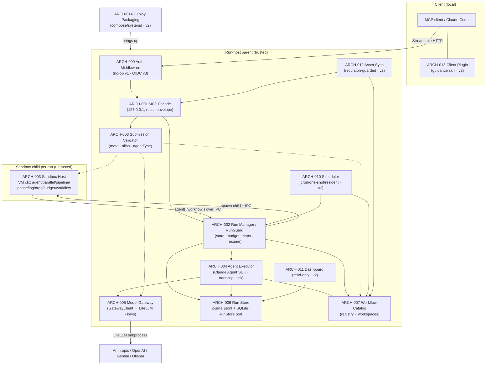

# 02 Architecture — Remote Workflow Engine

> Decomposition of REQ-001..015 into modules. Each `### ARCH-NNN`'s `traces` points back to the REQ(s) it realizes; matching verification is integration test IT-*.
> **Load-bearing decision**: a single **trust-boundary / IPC seam** splits an *untrusted child* (the Claude-generated orchestration JS, pure API surface only) from a *trusted parent* (budget/journal/agent-spawn/secrets). That one seam simultaneously minimizes the security blast radius (D6), is the master test seam (stub the agent executor → dry-run the real 641-line fixture with zero model calls), and is the natural single-authority point for budget/concurrency consistency.
> **Compat kernel vs extensions** (compat-spec §6): ARCH-001..008 are the v1 compat kernel + entry-point validation; ARCH-009..014 are deliberate extensions that attach at pre-existing v1 seams (auth-as-middleware, scheduler-over-catalog, dashboard-over-store, sync-over-workspace) with **zero v1 rework**.
> Panel provenance: `.panel/gate2/adversarial.r1.md` (security/scalability/testability, opus) + `.panel/gate2/quality.r1.md` (observability/replaceability/consumability/self-sustainability, sonnet-5). Decision rationale at the foot of this file.

## Compat kernel (v1) — 100%-compat baseline (compat-spec §1–§5)

### ARCH-001 — MCP Facade (Streamable HTTP interface)
- **status:** draft
- **traces:** REQ-005, REQ-007
- **note:** Streamable-HTTP transport; dispatches `workflow_run/status/result/suspend/resume/stop/list` + `workflow_agent_log`; binds `127.0.0.1` by default, `0.0.0.0` opt-in (D5); async `runId` return. Emits a **uniform result envelope** `{runId,status,result,error?}` from every tool so agent callers branch identically (consumability). No business logic (delegates to ARCH-002), no direct persistence (reads via ARCH-006), no auth *decision* (calls the ARCH-009 seam, a no-op in v1). Depends: ARCH-002, ARCH-006, ARCH-008, ARCH-009(no-op).
- **iter:** v1

### ARCH-002 — Run Manager / Lifecycle (single per-run authority · RunGuard)
- **status:** draft
- **traces:** REQ-002, REQ-006
- **note:** The single authority per run: state machine (`queued/running/suspended/stopped/completed/failed`), concurrency gate `min(16,cores−2)`, global agent counter (≤1000), **budget accounting** (`total/spent()/remaining()`, hard-throw at ceiling), serialized journal-append ordering, suspend/resume/stop, replay-from-cache orchestration. These three caps together form the shared **RunGuard** read by both orchestration and the agent spawner so they cannot drift (quality: self-sustainability bound). Does NOT run script code (ARCH-003) or call the model (ARCH-004) — owns policy & truth, not execution. Depends: ARCH-003, ARCH-004, ARCH-006, ARCH-007.
- **iter:** v1

### ARCH-003 — Sandbox Host (untrusted-child execution kernel)
- **status:** draft
- **traces:** REQ-001, REQ-002
- **note:** One Node child process per run; restricted **VM context** exposing ONLY the workflow API surface (`agent/parallel/pipeline/phase/log/args/budget/workflow`); determinism guards (`Date.now`,`Math.random`,argless `new Date()` throw); no fs/Node/network/`require` in-context; 512 KB cap; JS-not-TS parse rejection; `meta` literal validation; `parallel`/`pipeline` null-semantics; `workflow()` one-level nesting throw; 4096-item/call cap. Holds **no secrets, no store handle, no network** — marshals each `agent()`/`workflow()` over the IPC seam to ARCH-002; the in-script `budget` is a read-only view (ARCH-002 is source of truth). Depends: ARCH-002 (IPC only).
- **iter:** v1

### ARCH-004 — Agent Executor (Claude Agent SDK headless)
- **status:** draft
- **traces:** REQ-003, REQ-007
- **note:** Per `agent()` call: one Claude Agent SDK headless session; `schema`→StructuredOutput with retry-on-mismatch; `agentType` resolved from the server-side registry (unknown → reported error, not hang); `effort`/`isolation` applied; terminal failure after retries → resolves `null` (never rejects). Runs **parent-side** so untrusted script never touches the SDK or keys. **AgentTranscriptSink**: one capture path taps the SDK message/event stream → `agent-<id>.jsonl` (feeds `workflow_agent_log`, dashboard, and resume cache — not three paths). Token deltas emitted here feed both the `budget` view and the status API (one accounting path). Depends: ARCH-005, ARCH-006, ARCH-007.
- **iter:** v1

### ARCH-005 — Model Gateway (embedded LiteLLM behind GatewayClient)
- **status:** draft
- **traces:** REQ-004
- **note:** Manages the embedded **LiteLLM** subprocess; exposes it only through a narrow **`GatewayClient.invoke(prompt,opts)`** interface (one impl today, `LiteLLMGatewayClient` over `ANTHROPIC_BASE_URL`) so the gateway is replaceable per D2 without touching ARCH-004. Owns the alias→provider mapping (`sonnet/haiku/opus/default → Anthropic/OpenAI/Gemini/Ollama`) as **config**; **sole custody of provider API keys** (parent-only). Every call is **correlation-tagged** with `runId`/`agentId` so the LiteLLM request log joins back to the store (makes REQ-004 "local backend only" verifiable). Surfaces real provider+model id + token usage back to ARCH-002/004. **Provider-down handling**: bounded timeout → retry → `null` (reuses REQ-003 null semantics) so a dead/hung provider (e.g. local Ollama) cannot hang a whole run — see decision D-G below (user-confirmed: in v1).
- **iter:** v1

### ARCH-006 — Run Store (journal.jsonl + SQLite, RunStore port · RunRecorder)
- **status:** draft
- **traces:** REQ-006, REQ-007
- **note:** Durable persistence behind a narrow injectable **`RunStore`** port (create/append/query run & agent records): `journal.jsonl` per run (each `agent()` return in completion order — the resume cache keyed on `(prompt,opts)` longest-unchanged-prefix), `agent-<id>.jsonl` transcripts, SQLite **index** for `list/status`. Survives restart; single-writer *per run* (per-run files → no cross-run contention). **RunRecorder**: one writer of every state transition (timestamp + `runId`), two readers (status API, dashboard). Boot-recovery emits one log line enumerating re-hydrated runs. Port abstraction is for **testability** (in-memory fake), NOT multi-DB portability (no REQ asks to swap SQLite → deliberately not built).
- **iter:** v1

### ARCH-007 — Workflow Catalog (named registry + per-workflow/per-run workspaces)
- **status:** draft
- **traces:** REQ-013, REQ-014
- **note:** Named registry (save/list/invoke-by-name; version pinning so prior runs reference their version); `workflow(name)` resolution (unknown name → catchable throw). **Per-workflow persistent work folder** + **per-run workspace** rooting: agent file I/O confined to the run workspace, run A cannot see run B, workflow X's folder unreachable from Y via the API; documented retention/cleanup policy. Hands ARCH-004 a *rooted* workspace path and refuses to resolve outside it. Registry-version and work-folder are merged (one identity key = one module; splitting would be two modules over one PK). Depends: ARCH-006 (metadata).
- **iter:** v1

### ARCH-008 — Submission Validator (fail-fast at entry points)
- **status:** draft
- **traces:** REQ-001, REQ-004, REQ-014
- **note:** One validation facade invoked at both `workflow_run` and workflow-registration entry points so errors surface **at submission, not mid-run**: `meta` literal shape (compat-spec §1), model-alias mappings resolve (REQ-004 "missing mapping reported at submission"), `agentType` existence. Delegates to each owning module's rule (ARCH-003 parse/meta, ARCH-005 alias table, ARCH-007 registry) but presents **one error-reporting shape** — collapses three ad-hoc checks into one seam (consumability). Depends: ARCH-003, ARCH-005, ARCH-007.
- **iter:** v1

## Extension modules (v2/v3) — attach at existing v1 seams, zero v1 rework

### ARCH-009 — Auth Middleware (pluggable, no-op in v1)
- **status:** draft
- **traces:** REQ-012
- **note:** Wraps the ARCH-001 request pipeline; **ships v1 as a pass-through no-op** (D5), v3 swaps in an OIDC resource server (401 + resource metadata, PKCE; Keycloak dev / enterprise SSO / Entra ID). Auth-disabled config = v1 behavior (backward compatible). No ARCH-001 signature change → drop-in. Depends: ARCH-001.
- **iter:** v3

### ARCH-010 — Scheduler (cron / one-shot / resident-trigger)
- **status:** draft
- **traces:** REQ-015
- **note:** A driver **over ARCH-007 + ARCH-002**: cron schedules, one-shot-at-T (auto-completes; editable before firing), resident `workflow_trigger(name,args)` (rejected when disabled). Starts runs via the **same code path** as a manual `workflow_run` → scheduled runs appear in `workflow_list`/dashboard like any run. Pure consumer of existing surfaces; no kernel change. Depends: ARCH-007, ARCH-002.
- **iter:** v2

### ARCH-011 — Web Dashboard (read-only over the store)
- **status:** draft
- **traces:** REQ-008
- **note:** **Read-only over ARCH-006** (+ live tail): run list with status, drill-in to phase/agent tree with live-updating states + token usage, per-agent transcript view. Adds no write path — cannot perturb runs. Depends: ARCH-006.
- **iter:** v2

### ARCH-012 — Asset Sync (recursion-guarded upload)
- **status:** draft
- **traces:** REQ-009
- **note:** MCP tools `asset_push/asset_list/asset_delete` writing into ARCH-007's server-side workspace. **Recursion guard (D4)**: rejects/strips this system's own plugin/guidance skill/self-MCP-config, reporting the exclusion. **AssetValidator** with a *live probe* of pushed MCP configs (attempt connect/handshake) — server-runnable (remote HTTP / npx stdio) accepted; non-runnable or interactively-authenticated-headless (compat-spec §5 caveat) rejected with an actionable reason. Depends: ARCH-007, ARCH-001.
- **iter:** v2

### ARCH-013 — Claude Code Client Plugin (install + guidance skill)
- **status:** draft
- **traces:** REQ-010
- **note:** Client-side artifact: MCP connection config + guidance skill teaching agents when to use the remote service vs the built-in dynamic Workflow tool (incl. the async **submit→poll `workflow_status`→fetch `workflow_result`** pattern, since `workflow_run` returns `runId` immediately). Coexists conflict-free with the local Workflow tool; **excluded from its own sync** (D4). Depends: (client-side; consumes ARCH-001).
- **iter:** v2

### ARCH-014 — Deploy Packaging (local + remote Linux)
- **status:** draft
- **traces:** REQ-011
- **note:** docker-compose / systemd bring-up of ARCH-001..008 + the LiteLLM (ARCH-005) subprocess; documented smoke check (submit sample workflow → completes); identical steps on localhost and remote host. DEPLOY.md sets a **restart policy** (`Restart=on-failure`) — the self-healing seam v1/v2 need (no custom watchdog) — and loudly documents the **v2-without-auth caveat** (asset_push = server-side code execution; require SSH-tunnel/VPN until v3 auth). Depends: all ARCH-001..008 (+ v2 modules when present).
- **iter:** v2

## Decision rationale (contested / gap points)

- **D-VAL — centralized Validator vs per-module checks** (quality ⟂ adversarial): adversarial had each module validate its own inputs; quality wanted one Validator to avoid three ad-hoc entry-point checks. **Resolved (quality conceded the ownership, adversarial conceded the facade):** ARCH-008 is a thin *facade* at the two entry points that **delegates** to each module's rule — one fail-fast error shape without duplicating validation logic or inverting module ownership. Simplicity holds (no new rule engine).
- **D-G — gateway provider-down circuit breaker** (quality's one genuine gap; C4-adjacent): no REQ-004 criterion covers an unreachable/hung provider. **Resolved to the minimal option**: fold a bounded timeout→retry→`null` into ARCH-005's `GatewayClient` (reuses REQ-003's existing null-on-terminal-failure semantics; costs no new run-state). **USER CONFIRMED 2026-07-03: keep the minimal breaker in v1** (REQ-004 acceptance extended accordingly). No heavier circuit-breaker/bulkhead is proposed (speculative for a single-node QM tool).
- **C1 sandbox strength vs perf** → honor D6 exactly (process + restricted VM, secrets parent-only); no container/gVisor per run (QM class doesn't warrant it; trust split already removes keys/network/fs from blast radius).
- **C2 single writer vs horizontal scale** → a run is single-authority/single-host (ARCH-002); scale is across *runs*, not within one. No distributed budget consensus (needless flexibility; v1 is localhost).
- **C3 injectable seams vs simplicity** → inject only where non-deterministic/networked/costly: **ARCH-004 (SDK), ARCH-005 (Gateway), ARCH-006 (Store)** + the determinism guards as the clock/RNG seam. ARCH-001/003/007 stay concrete. The ARCH-004 stub alone unlocks full compat-suite dry-runs of `sdlc-run.js`.
- **C4 v2 asset_push RCE before v3 auth** → do not pull OIDC forward (respects D5 sequencing); ship the ARCH-009 no-op seam, gate exposure via tunnel/VPN deployment, document the caveat in ARCH-014.
- **Explicitly NOT built** (both groups agree, Karpathy): pluggable DB backend, pluggable sandbox strategy, pluggable agent-execution engine (D1 fixes the SDK), metrics/alerting stack, autoscaling, cross-run agent memory, prompt self-calibration.

## Architecture container diagram

