# 02 Architecture — Remote Workflow Engine

> Decomposition of REQ-001..021 into modules. Each `### ARCH-NNN`'s `traces` points back to the REQ(s) it realizes; matching verification is integration test IT-*.
> **Load-bearing decision**: a single **trust-boundary / IPC seam** splits an *untrusted child* (the Claude-generated orchestration JS, pure API surface only) from a *trusted parent* (budget/journal/agent-spawn/secrets). That one seam simultaneously minimizes the security blast radius (D6), is the master test seam (stub the agent executor → dry-run the real 641-line fixture with zero model calls), and is the natural single-authority point for budget/concurrency consistency.
> **Compat kernel vs extensions** (compat-spec §6): ARCH-001..008 are the v1 compat kernel + entry-point validation; ARCH-009..014 are deliberate extensions that attach at pre-existing v1 seams (auth-as-middleware, scheduler-over-catalog, dashboard-over-store, sync-over-workspace) with **zero v1 rework**. **v3 slice** ARCH-015..019 hang on the *same* untrusted-child ⟂ trusted-parent boundary (provisioning registry, secret store, SDK session-options builder + outer timeout race, asset-ingestion policy, workRoot project-isolation guard) — again zero v1 rework; the only v1/v2 module *amendments* are three fail-closed tightenings recorded in the rationale (global RunGuard semaphore, non-loopback bind guard, proxy-subprocess lifecycle).
> Panel provenance: `.panel/gate2/adversarial.r1.md` (security/scalability/testability, opus) + `.panel/gate2/quality.r1.md` (observability/replaceability/consumability/self-sustainability, sonnet-5). Decision rationale at the foot of this file.

## Compat kernel (v1) — 100%-compat baseline (compat-spec §1–§5)

### ARCH-001 — MCP Facade (Streamable HTTP interface)
- **status:** draft
- **traces:** REQ-005, REQ-007
- **note:** Streamable-HTTP transport; dispatches `workflow_run/status/result/suspend/resume/stop/list` + `workflow_agent_log`; binds `127.0.0.1` by default, `0.0.0.0` opt-in (D5); async `runId` return. Emits a **uniform result envelope** `{runId,status,result,error?}` from every tool so agent callers branch identically (consumability). No business logic (delegates to ARCH-002), no direct persistence (reads via ARCH-006), no auth *decision* (calls the ARCH-009 seam, a no-op in v1). Depends: ARCH-002, ARCH-006, ARCH-008, ARCH-009(no-op).
- **iter:** v1

### ARCH-002 — Run Manager / Lifecycle (single per-run authority · RunGuard)
- **status:** draft
- **traces:** REQ-002, REQ-006
- **note:** The single authority per run: state machine (`queued/running/suspended/stopped/completed/failed`), concurrency gate (**v25/DES-168: an explicit, config-overridable `runConcurrency`, default 24 — was `min(16,cores−2)`, a ceiling nobody could see and no author could relate to a fan-out width**), global agent counter (≤1000), **budget accounting** (`total/spent()/remaining()`, hard-throw at ceiling — **v25/DES-167: the throw is on cumulative SPEND only; the per-call reservation is deleted, so the ceiling is a stop-dispatching signal that in-flight calls may overshoot by up to one concurrency window, which is what a single authority can actually enforce**), serialized journal-append ordering, suspend/resume/stop, replay-from-cache orchestration. These three caps together form the shared **RunGuard** read by both orchestration and the agent spawner so they cannot drift (quality: self-sustainability bound). Does NOT run script code (ARCH-003) or call the model (ARCH-004) — owns policy & truth, not execution. Depends: ARCH-003, ARCH-004, ARCH-006, ARCH-007.
- **iter:** v1

### ARCH-003 — Sandbox Host (untrusted-child execution kernel)
- **status:** draft
- **traces:** REQ-001, REQ-002
- **note:** One Node child process per run; restricted **VM context** exposing ONLY the workflow API surface (`agent/parallel/pipeline/phase/log/args/budget/workflow`); determinism guards (`Date.now`,`Math.random`,argless `new Date()` throw); no fs/Node/network/`require` in-context; 512 KB cap; JS-not-TS parse rejection; `meta` literal validation; `parallel`/`pipeline` null-semantics; `workflow()` nesting bounded by the deployment's configured `maxWorkflowDepth` (default 4) and `maxWorkflowDescendants` (default 256) — **N levels, not one** (v8 REQ-041/043 lifted the one-level `NESTING_ERROR`; corrected here by adjudication (v24) #4 C-5, which found this note, ARCH-107 and DES-157 all still describing the pre-v8 limit while `run-manager.ts`'s depth check had been N-level for four iterations); 4096-item/call cap. Holds **no secrets, no store handle, no network** — marshals each `agent()`/`workflow()` over the IPC seam to ARCH-002; the in-script `budget` is a read-only view (ARCH-002 is source of truth). Depends: ARCH-002 (IPC only).
- **v36 amendment (REQ-215, ARCH-165/166/167, ADR-072/073, INV-V36-1/2):** the sandbox IPC contract gains exactly ONE optional field — `refusalRef: number` on the terminal `{t:'error'}` message — and nothing else: `agentThrow` is untouched, no string and no script-authored object crosses upward, and the host stays a pure relay that validates nothing (the parent that minted the refusal is the only component that may honour the ref). Inside the child, `guards.ts` gains a module-scope `WeakMap` keyed on the error object's identity, and `ENGINE_REFUSAL_CODES` gains `PARAM_UNKNOWN` — which also changes `parallel()`/`pipeline()` null-folding for that code (a cross-reference to REQ-120's v25 mechanism, deliberately NOT a new trace edge).
- **iter:** v36
### ARCH-004 — Agent Executor (Claude Agent SDK headless)
- **status:** draft
- **traces:** REQ-003, REQ-007
- **note:** Per `agent()` call: one Claude Agent SDK headless session; `schema`→StructuredOutput with retry-on-mismatch; `agentType` resolved from the server-side registry (unknown → reported error, not hang); `effort`/`isolation` applied; terminal failure after retries → resolves `null` (never rejects). Runs **parent-side** so untrusted script never touches the SDK or keys. **AgentTranscriptSink**: one capture path taps the SDK message/event stream → `agent-<id>.jsonl` (feeds `workflow_agent_log`, dashboard, and resume cache — not three paths). Token deltas emitted here feed both the `budget` view and the status API (one accounting path). Depends: ARCH-005, ARCH-006, ARCH-007.
- **module:** src/agent-executor.ts
- **deps:** ARCH-005, ARCH-006, ARCH-007, ARCH-069
- **v34 amendment (REQ-203, ARCH-137, ADR-061/063):** the `agentType` clause of this row RETIRES. The executor no longer resolves a server-side registry — `AgentTypeDef`, the `agentTypes` constructor dep, the registry lookup and the `Unknown agentType` throw all go with `src/agent-definitions.ts` and `ServerConfig.agentDefinitionsDir`, because all three of that mechanism's layers (systemPrompt / model / tools) were inputs the remote author could not write yet that changed the outcome (INV-V34-1). What replaces the throw is **not silence**: a stored pre-v34 script whose options literal still carries the key is refused at the same site by a structural `Object.hasOwn(req.opts,'agentType')` check (ADR-063), so the fail-closed property this row has had since v1 outlives the mechanism it guarded. Everything else here is untouched — one SDK headless session per `agent()`, `schema`→retry-on-mismatch, `effort`/`isolation`, terminal failure resolving `null` and never rejecting, parent-side execution so the untrusted script never touches the SDK or keys, the ONE AgentTranscriptSink capture path, one token-accounting path.
- **iter:** v34

### ARCH-005 — Model Gateway (embedded LiteLLM behind GatewayClient)
- **status:** draft
- **traces:** REQ-004
- **note:** Manages the embedded **LiteLLM** subprocess; exposes it only through a narrow **`GatewayClient.invoke(prompt,opts)`** interface (one impl today, `LiteLLMGatewayClient` over `ANTHROPIC_BASE_URL`) so the gateway is replaceable per D2 without touching ARCH-004. Owns the alias→provider mapping (`sonnet/haiku/opus/default → Anthropic/OpenAI/Gemini/Ollama`) as **config**; **sole custody of provider API keys** (parent-only). Every call is **correlation-tagged** with `runId`/`agentId` so the LiteLLM request log joins back to the store (makes REQ-004 "local backend only" verifiable). Surfaces real provider+model id + token usage back to ARCH-002/004. **Provider-down handling**: bounded timeout → retry → `null` (reuses REQ-003 null semantics) so a dead/hung provider (e.g. local Ollama) cannot hang a whole run — see decision D-G below (user-confirmed: in v1).
- **iter:** v1

### ARCH-006 — Run Store (journal.jsonl + SQLite, RunStore port · RunRecorder)
- **status:** draft
- **traces:** REQ-006, REQ-007
- **note:** Durable persistence behind a narrow injectable **`RunStore`** port (create/append/query run & agent records): `journal.jsonl` per run (each `agent()` return in completion order — the resume cache keyed on `(prompt,opts)` longest-unchanged-prefix), `agent-<id>.jsonl` transcripts, SQLite **index** for `list/status`. Survives restart; single-writer *per run* (per-run files → no cross-run contention). **RunRecorder**: one writer of every state transition (timestamp + `runId`), two readers (status API, dashboard). Boot-recovery emits one log line enumerating re-hydrated runs. Port abstraction is for **testability** (in-memory fake), NOT multi-DB portability (no REQ asks to swap SQLite → deliberately not built).
- **iter:** v1

### ARCH-007 — Workflow Catalog (named registry + per-workflow/per-run workspaces)
- **status:** draft
- **traces:** REQ-013, REQ-014
- **note:** Named registry (save/list/invoke-by-name; version pinning so prior runs reference their version); `workflow(name)` resolution (unknown name → catchable throw). **Per-workflow persistent work folder** + **per-run workspace** rooting: agent file I/O confined to the run workspace, run A cannot see run B, workflow X's folder unreachable from Y via the API; documented retention/cleanup policy. Hands ARCH-004 a *rooted* workspace path and refuses to resolve outside it. Registry-version and work-folder are merged (one identity key = one module; splitting would be two modules over one PK). Depends: ARCH-006 (metadata).
- **iter:** v1

### ARCH-008 — Submission Validator (fail-fast at entry points)
- **status:** draft
- **traces:** REQ-001, REQ-004, REQ-014
- **note:** One validation facade invoked at both `workflow_run` and workflow-registration entry points so errors surface **at submission, not mid-run**: `meta` literal shape (compat-spec §1), model-alias mappings resolve (REQ-004 "missing mapping reported at submission"), `agentType` existence. Delegates to each owning module's rule (ARCH-003 parse/meta, ARCH-005 alias table, ARCH-007 registry) but presents **one error-reporting shape** — collapses three ad-hoc checks into one seam (consumability). Depends: ARCH-003, ARCH-005, ARCH-007.
- **iter:** v1

## Extension modules (v2/v3) — attach at existing v1 seams, zero v1 rework

### ARCH-009 — Auth Middleware (pluggable, no-op in v1)
- **status:** draft
- **traces:** REQ-012
- **note:** Wraps the ARCH-001 request pipeline; **ships v1 as a pass-through no-op** (D5), v3 swaps in an OIDC resource server (401 + resource metadata, PKCE; Keycloak dev / enterprise SSO / Entra ID). Auth-disabled config = v1 behavior (backward compatible). No ARCH-001 signature change → drop-in. Depends: ARCH-001. **[SUPERSEDED v15 by ARCH-059..063]** — REQ-012 was un-deferred and rewritten (engine-as-its-own-AS federating to Google, not an enterprise OIDC resource server); the concrete auth decisions now live in ARCH-059 (AS + `resolvePrincipal` at the edge) and the guard in ARCH-063 (net-guard fail-closed). This placeholder's "no-op until v3" stance no longer holds; kept for chain history.
- **iter:** v3

### ARCH-010 — Scheduler (cron / one-shot / resident-trigger)
- **status:** draft
- **traces:** REQ-015
- **note:** A driver **over ARCH-007 + ARCH-002**: cron schedules, one-shot-at-T (auto-completes; editable before firing), resident `workflow_trigger(name,args)` (rejected when disabled). Starts runs via the **same code path** as a manual `workflow_run` → scheduled runs appear in `workflow_list`/dashboard like any run. Pure consumer of existing surfaces; no kernel change. Depends: ARCH-007, ARCH-002.
- **iter:** v2

### ARCH-011 — Web Dashboard (read-only over the store)
- **status:** draft
- **traces:** REQ-008
- **note:** **Read-only over ARCH-006** (+ live tail): run list with status, drill-in to phase/agent tree with live-updating states + token usage, per-agent transcript view. Adds no write path — cannot perturb runs. Depends: ARCH-006.
- **iter:** v2

### ARCH-012 — Asset Sync (recursion-guarded upload)
- **status:** draft
- **traces:** REQ-009
- **note:** MCP tools `asset_push/asset_list/asset_delete` writing into ARCH-007's server-side workspace. **Recursion guard (D4)**: rejects/strips this system's own plugin/guidance skill/self-MCP-config, reporting the exclusion. **AssetValidator** with a *live probe* of pushed MCP configs (attempt connect/handshake) — server-runnable (remote HTTP / npx stdio) accepted; non-runnable or interactively-authenticated-headless (compat-spec §5 caveat) rejected with an actionable reason. Depends: ARCH-007, ARCH-001.
- **iter:** v2

### ARCH-013 — Claude Code Client Plugin (install + guidance skill)
- **status:** draft
- **traces:** REQ-010
- **note:** Client-side artifact: MCP connection config + guidance skill teaching agents when to use the remote service vs the built-in dynamic Workflow tool (incl. the async **submit→poll `workflow_status`→fetch `workflow_result`** pattern, since `workflow_run` returns `runId` immediately). Coexists conflict-free with the local Workflow tool; **excluded from its own sync** (D4). Depends: (client-side; consumes ARCH-001).
- **iter:** v2

### ARCH-014 — Deploy Packaging (local + remote Linux)
- **status:** draft
- **traces:** REQ-011
- **note:** docker-compose / systemd bring-up of ARCH-001..008 + the LiteLLM (ARCH-005) subprocess; documented smoke check (submit sample workflow → completes); identical steps on localhost and remote host. DEPLOY.md sets a **restart policy** (`Restart=on-failure`) — the self-healing seam v1/v2 need (no custom watchdog) — and loudly documents the **v2-without-auth caveat** (asset_push = server-side code execution; require SSH-tunnel/VPN until v3 auth). Depends: all ARCH-001..008 (+ v2 modules when present).
- **iter:** v2

## v3 slice modules (REQ-016..020) — attach at the existing trust boundary, zero v1 rework

### ARCH-015 — MCP Provisioning Registry (admin-write, referenced-by-name)
- **status:** draft
- **traces:** REQ-017
- **note:** SQLite-backed `name → {kind: stdio|http, config}`, provisioned **out-of-band** from run submission via an admin-only `mcp_provision` tool (probes the server at provision time → `MCP_PROBE_FAILED` on a dead config; reject, not silent). At session build the run references MCPs **by name**; unknown name → typed `MCP_NOT_PROVISIONED` at submission/run (never silent no-op). Sibling of the ARCH-007 catalog over the ARCH-006 store; **read** by ARCH-017 which injects ONLY the explicitly-referenced entries with `strictMcpConfig` preserved (host ambient MCP never inherited — the VAL-003 isolation invariant). Admin-provisioned stdio is trusted **because** it is admin-provisioned, not per-run-uploaded — so the security-critical property is the *write authority* (see the non-loopback bind guard, D-BIND). Depends: ARCH-006, ARCH-001.
- **iter:** v3

### ARCH-016 — Secret Store + Resolver (parent-only, never workspace-reachable)
- **status:** draft
- **traces:** REQ-018
- **note:** Parent-only. Loads `${secret:name}` sources from systemd `LoadCredential`/process env into parent memory at startup; a narrow **`SecretResolver` port** resolves `${secret:name}` → value **at session-build time** and injects it into the MCP/provider config the parent hands the SDK. Registry/asset entries store **only the handle**, never plaintext; a missing handle → typed `SECRET_MISSING` / `SECRET_HANDLE_INVALID` (fail-closed — never a hang, never the literal handle smuggled through as a value). **Two-layer containment** to make REQ-018's stated invariant *true*, not just handle-shaped (see D-SEC): (1) provider keys live only in the LiteLLM proxy process env/memory — off every agent-reachable filesystem path; (2) MCP secrets resolved in parent memory, never written to any workspace path; and the ARCH-007 confinement callback is made **realpath-based + argument-name-complete + `Bash`-deny-outside-root** so a tool-capable agent cannot `cat` the proxy config or a sibling run's journal. **Redaction is part of this module, not an afterthought** (D-REDACT): resolved values never enter transcripts/dashboard/logs; SessionInitRecord logs handle *names* only. One concrete source today (env/`LoadCredential`) behind the resolver port — **no vault/KMS impl until a second backend is a real requirement** (Karpathy). Depends: ARCH-005, ARCH-015, ARCH-007.
- **iter:** v3

### ARCH-017 — SDK Session-Options Builder (pure) + outer timeout race
- **status:** draft
- **traces:** REQ-016, REQ-020
- **note:** Splits **policy** from **spawn** — the master v3 test seam. A **pure** builder `(providerClass, alias, config, provisionedRefs, resolvedSecrets) → SDKOptions` sets `thinking:{type:'disabled'}` for non-Anthropic aliases (Anthropic left at SDK default — the D-F6 regression guard), the **curated tool allowlist** (never the full built-in Claude Code surface, so small models are not drowned into text-only degradation), and the explicitly-referenced injected-MCP set (`strictMcpConfig`). Provider capability is a **config-driven `ProviderProfile`** per alias (`supportsExtendedThinking/supportsToolUse/timeoutMs/retries/effortMapping`), single source of truth shared with the alias validator — GLM/qwen/next-provider is a config row, not a gateway rewrite (D2 replaceability; also answers the open `effort`-mapping question). Impure half: `Promise.race(query, timeoutMs)` that **kills the CLI subprocess** on timeout (not a bare abandon — an orphan child burns tokens and holds a global slot for its ~4-min internal backoff) → `agent()` resolves `null`, bound observably applied on BOTH gateway paths. Both impls write one **`FailureEnvelope`** `{kind:timeout|provider_error|tool_error|schema_mismatch, attempts, elapsedMs, providerDetail}` before resolving `null` (never fake success text) and one **`SessionInitRecord`** at build (resolved alias→provider+model id, thinking mode, allowlist, injected-MCP names, secret-handle names, cwd) — makes REQ-016 c3 "curated surface observable in session init" auditable from the store. Real `tool_use` round-trip against local Ollama is the one unavoidable real-tier integration test; everything else (thinking flag, allowlist, strict-MCP, typed errors, secret-never-in-artifact) is a pure unit test. Lives **inside** the GatewayClient impls behind the unchanged `invoke(prompt,opts)` contract (SDK options never leak through ARCH-004 into orchestration). Depends: ARCH-004, ARCH-005, ARCH-015, ARCH-016.
- **iter:** v3

### ARCH-018 — Asset-Ingestion Policy (hooks-drop by construction, MCP-config redirect)
- **status:** draft
- **traces:** REQ-019
- **note:** A pure classifier at the ARCH-012 asset boundary: **hook-kind assets rejected by construction** with a typed `HOOKS_UNSUPPORTED` reason (never silently materialized) — closes the arbitrary-server-side-code (RCE) vector by construction; the engine's OWN internal `PreToolUse` workspace-boundary hook is a fixed control (not user-uploadable) and is unaffected. **MCP-config-kind assets are redirected to ARCH-015 provisioning** rather than materialized per-run (the REQ-009 rescope); skill-kind continues to ARCH-012 materialization. One-line unit test per asset kind. Depends: ARCH-012, ARCH-015.
- **iter:** v3

### ARCH-019 — WorkRoot Project-Isolation Guard (boot fail-fast + session-init confinement)
- **status:** draft
- **traces:** REQ-021
- **note:** Closes the session-init confinement leak that **BYPASSES the ARCH-016 tool-level jail** (empirically reproduced 2026-07-11: `workRoot:"./data"` inside the engine repo → a qwen agent verbatim echoed the operator's MEMORY.md). With `settingSources:['project']` (needed so ARCH-017's session loads the run workspace's own materialized `.claude/skills`), the agent CLI resolves the *project root* to the nearest ancestor containing a `.git`/`CLAUDE.md` marker and loads ITS `CLAUDE.md` + `~/.claude/projects/<hash>/memory` into agent context — the leak happens at **session-init, not via a Read tool call**, so ARCH-016's realpath/argument-complete/`Bash`-deny callback never intercepts it. Two-part fix, the minimum that makes REQ-021 true: **(1) boot fail-fast** — at server boot the entrypoint resolves the configured `workRoot` and walks its ancestors; if `workRoot` itself or any ancestor carries a project marker (`.git`/`CLAUDE.md`), boot aborts with a typed `WORKROOT_INSIDE_PROJECT` error naming the offending ancestor + remedy (set workRoot outside any project); a marker-free ordinary data dir boots normally (no false positive). **(2) session-init confinement** — ARCH-017 builds each run session with `cwd` = the run workspace under a now-guaranteed-project-free workRoot, so the CLI's project-root resolution cannot climb into an operator project. Owned as a boot/entrypoint guard co-located with ARCH-007's workspace-rooting authority (a fixed control, not runtime-configurable); consumed by ARCH-017 at session build. **No new runtime subsystem** (Karpathy — one boot check + a cwd invariant, not a per-agent OS jail; consistent with D-SEC's "no uid/namespace jail" ruling). Depends: ARCH-007, ARCH-017, ARCH-014 (boot).
- **iter:** v3

## Decision rationale (contested / gap points)

- **D-VAL — centralized Validator vs per-module checks** (quality ⟂ adversarial): adversarial had each module validate its own inputs; quality wanted one Validator to avoid three ad-hoc entry-point checks. **Resolved (quality conceded the ownership, adversarial conceded the facade):** ARCH-008 is a thin *facade* at the two entry points that **delegates** to each module's rule — one fail-fast error shape without duplicating validation logic or inverting module ownership. Simplicity holds (no new rule engine).
- **D-G — gateway provider-down circuit breaker** (quality's one genuine gap; C4-adjacent): no REQ-004 criterion covers an unreachable/hung provider. **Resolved to the minimal option**: fold a bounded timeout→retry→`null` into ARCH-005's `GatewayClient` (reuses REQ-003's existing null-on-terminal-failure semantics; costs no new run-state). **USER CONFIRMED 2026-07-03: keep the minimal breaker in v1** (REQ-004 acceptance extended accordingly). No heavier circuit-breaker/bulkhead is proposed (speculative for a single-node QM tool).
- **C1 sandbox strength vs perf** → honor D6 exactly (process + restricted VM, secrets parent-only); no container/gVisor per run (QM class doesn't warrant it; trust split already removes keys/network/fs from blast radius).
- **C2 single writer vs horizontal scale** → a run is single-authority/single-host (ARCH-002); scale is across *runs*, not within one. No distributed budget consensus (needless flexibility; v1 is localhost).
- **C3 injectable seams vs simplicity** → inject only where non-deterministic/networked/costly: **ARCH-004 (SDK), ARCH-005 (Gateway), ARCH-006 (Store)** + the determinism guards as the clock/RNG seam. ARCH-001/003/007 stay concrete. The ARCH-004 stub alone unlocks full compat-suite dry-runs of `sdlc-run.js`.
- **C4 v2 asset_push RCE before v3 auth** → do not pull OIDC forward (respects D5 sequencing); ship the ARCH-009 no-op seam, gate exposure via tunnel/VPN deployment, document the caveat in ARCH-014.
- **Explicitly NOT built** (both groups agree, Karpathy): pluggable DB backend, pluggable sandbox strategy, pluggable agent-execution engine (D1 fixes the SDK), metrics/alerting stack, autoscaling, cross-run agent memory, prompt self-calibration.

### v3 slice (REQ-016..020) — panel convergence
- **D-SEC — how far to contain secrets (adversarial security ⟂ scalability/testability/simplicity, IC1).** Security wanted an OS filesystem jail per run (uid/mount-namespace/chroot) to make REQ-018's *"no secret on any sandbox-reachable path"* invariant hold generally; that needs elevated caps, complicates docker/systemd deploy, is hard to exercise in CI, and exceeds the QM warrant. Simplicity wanted the existing lexical `file_path` check. **Resolved to the minimal option that still makes the *stated* invariant true — two-layer containment** (ARCH-016): keys off every agent-reachable filesystem (env-only into the proxy) + a realpath/argument-complete/`Bash`-deny confinement callback. **Security conceded the full OS jail; simplicity conceded the lexical-only check** — because the review already ruled a lexical `file_path`-only check *under-builds* a stated invariant, and under-building an invariant is a defect, not a Karpathy win. Full uid-per-run jail noted as the robust alternative, deferred unless a HIGH re-escalates.
- **D-DOS — global RunGuard semaphore (amends ARCH-002, no new module).** v3's SDK harness spawns a CLI subprocess *per agent* plus N stdio-MCP children per session, and the scheduler launches runs autonomously → per-run caps multiply into a single-node exhaustion surface. **Both groups co-signed:** promote the concurrency gate + global agent counter to **one process-global semaphore shared by every `RunGuard`** (budget stays per-run — that is the REQ-002 per-run quantity C2 licenses; the *global* counter is not). REQ-020's timeout must FREE the slot on kill (D-KILL), or a hung provider starves the very resource the semaphore rations. Carried review finding V2, now acute — lands with v3, not after.
- **D-KILL — outer timeout kills the child (adversarial R3 ⟂ "configure the SDK's own retry knobs").** One side argued REQ-020 is met by tuning the CLI's internal retry/backoff. **Resolved to both, with the engine-owned outer bound non-negotiable** (ARCH-017): configure what the SDK exposes, but a black-box child's policy is not our contract — the outer `Promise.race` must **kill** the subprocess (not abandon the promise), else an orphan burns tokens and holds a global slot. Kill-on-timeout + per-attempt token attribution close the "REQ-020 passes its test while budget silently rots" hazard both groups flagged as highest-risk.
- **D-PROFILE — ProviderProfile config vs hardcoded if-Anthropic branch (quality replaceability ⟂ Karpathy "speculative structure").** Quality wanted a per-alias capability table; simplicity read it as speculative. **Resolved for the config table** (folded into ARCH-017): it is a reaction to a *confirmed real defect* (the D-F6 thinking-400 on Ollama), not imagined flexibility — debt already incurred. It also retires the open `effort`-mapping question as a config row instead of future code. Kept as a flat config table, **not** a formal provider SPI/plugin (that abstraction is the part Karpathy cuts).
- **D-REDACT — clear errors vs info-disclosure on the unauthenticated listener (IC4, security ⟂ consumability).** REQ-017/018 demand *clear* errors, but enumerating the provisioned-MCP inventory or the secret-name set to any caller on the no-auth listener is disclosure. **Resolved: clear *typed* error (reason-code taxonomy: `MCP_NOT_PROVISIONED/MCP_PROBE_FAILED/SECRET_MISSING/SECRET_HANDLE_INVALID/HOOKS_UNSUPPORTED/PROVIDER_TIMEOUT`) to the submitting client, but transcripts/dashboard/logs redact resolved secret values and do not enumerate the secret set.** Consumability conceded discoverability endpoints until auth (REQ-012) lands; security conceded that a clear typed error to the trusted-behind-tunnel submitter is fine.
- **D-BIND — non-loopback bind guard (amends ARCH-009, no new module).** v3 stacks an RCE-capable provisioning surface + a secret store on the same unauthenticated listener. **Resolved:** materialize the ARCH-009 no-op middleware in *code* (the review found only the deploy half of C4 shipped) and add a **fail-closed guard that refuses `bind != 127.0.0.1` unless an explicit `insecureNoAuth:true` is set.** Quality saw the guard as creep against the "OIDC deferred" decision; **it is not auth** — a one-`if` fail-closed default that makes the deferral safe. OIDC itself stays deferred (respects D5/scope).
- **D-PROC — proxy/CLI subprocess lifecycle (quality ManagedSubprocess supervisor ⟂ adversarial "let systemd/docker restart-policy do it").** Confirmed real defects: port-4000 collision, proxy never stopped on shutdown, mkdtemp config dirs leaked, and (once D-KILL lands) orphaned CLI children. **Resolved to the minimum that fixes the incurred debt, folded into ARCH-005 (proxy) + ARCH-017 (CLI kill-on-timeout), not a new self-heal subsystem:** derived/dynamic port selection, health probe before first use, SIGTERM→SIGKILL shutdown tied to engine lifecycle, temp-dir cleanup on session end/stop/timeout. **Restart/auto-recovery stays on the supervisor** (systemd `Restart=on-failure` / docker restart-policy per ARCH-014) — no in-process watchdog (adversarial won the "less code" point; quality won the lifecycle-cleanup point).
- **D-PROBE — MCP liveness at provision + submission, no background poller.** Run the existing `mcp-probe` at provision time (reject dead configs) and optionally at run-submission for referenced names (fail-fast). **No continuous background probing** (speculative on a single node) — both groups agree.
- **D-WORKROOT — REQ-021 session-init leak, added in synthesis beyond the panel's stated REQ-016..020 scope.** The 2-group panel (`.panel/architecture/adversarial.r1.md` opus + `quality-dimensions.r1.md` sonnet, round-1 headlines complementary — no round 2 needed) scoped itself to REQ-016..020; REQ-021 (added 2026-07-11 after the empirical MEMORY.md-echo reproduction) had **no ARCH**, the one decomposition gap. **Synthesis adds ARCH-019 rather than folding into ARCH-016**, because the leak is orthogonal to ARCH-016's *tool-call* reachability containment: it happens at session-init via the CLI's project-root resolution, which the realpath/`Bash`-deny callback never sees. Chosen minimal shape = a **boot fail-fast guard** (`WORKROOT_INSIDE_PROJECT`) + a **workspace-cwd-outside-any-project invariant** — no per-run OS jail (consistent with the D-SEC ruling that a uid/namespace jail exceeds the QM warrant). Both stances are satisfied: the adversarial "confinement must actually hold, not just be handle-shaped" (a real ancestor-walk, fail-closed) and the quality "opaque failure = defect" (a typed, actionable boot error naming the offending ancestor, not a silent leak). Panel altitude note: this is agent-altitude confinement on the system-altitude boot path.
- **REQ-009 rescope acknowledged:** its acceptance now delegates hook-rejection and MCP-config-redirect to ARCH-018; ARCH-012 remains the skill-materialization + recursion-guard owner. No trace change to ARCH-012.
- **v3 "Explicitly NOT built"** (both groups, Karpathy): pluggable vault/KMS secret backend, provider-capability probe subsystem, MCP connection pool, background MCP health poller, per-run OS uid/namespace jail, in-process self-heal/watchdog, cross-run agent memory, OTel/metrics stack. All deferred until a real requirement or a re-escalated HIGH forces them.

## Architecture container diagram
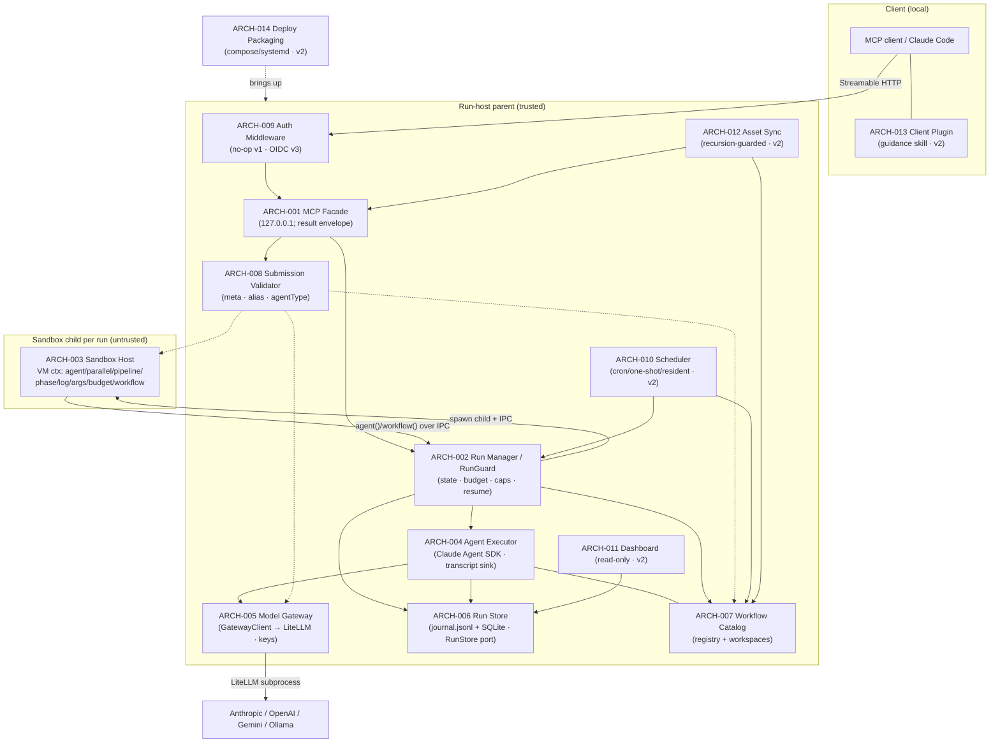

### ARCH-020 — Workspace byte-transport (recursive listing + sha256 + chunked realpath-contained get + body cap)
- **status:** done
- **traces:** REQ-022, REQ-023, REQ-024
- workspace-artifacts (pure): recursive listArtifacts (rel path + size + sha256, symlink-escape skipped) + readArtifactChunk (windowed, size-capped, realpath-contained via isPathContained); server.ts readBody body-size cap (413).

### ARCH-021 — Seed-into-workspace (pre-agent materialization + .claude RCE strip)
- **status:** done
- **traces:** REQ-025
- workspace-seed.materializeSeed: engine-side, before agents start (RunManager.start); strips `.claude/settings*.json` + `.claude/hooks/**` (closes DES-028 hook-gate for the seed path), realpath-contained, rejects `.git` internals.

### ARCH-022 — Run-workspace retention (manual purge + opt-in TTL GC)
- **status:** done
- **traces:** REQ-026
- workspace_purge (terminal-only) + reclaimStaleWorkspaces (opt-in config.workspaceTtlMs, deletes TERMINAL+old, never active/suspended/unknown).

## v5 slice — GitHub issue reporting (ARCH-023)

### ARCH-023 — GitHub Issue Reporter
- **status:** done
- **traces:** REQ-027, REQ-028, REQ-029, REQ-030, REQ-066
- **iter:** v11
- Engine-side `issue_report` core (src/github/issue-reporter.ts): an injectable GithubIssueClient (bounded fetch — AbortController timeout + retry budget, 4xx-except-429 not retried — any non-2xx/network/timeout surfaced as a typed `GITHUB_API_ERROR`, never a hang/crash/fake-success). The GitHub token is read from the server-side SecretSource (`RWE_SECRET_GITHUB_TOKEN`), never workspace- or sandbox-reachable and never from tool args (extends ARCH-016's secret store to REQ-028). Fixed, machine-parseable agent-consumable body template + fixed `agent-reported` label (and optional `severity:<x>`) so a downstream solve-flow can query/parse it. Fixed target repo `HsuJavis/remote-workflow-engine`. Wired at server.ts `callTool` (`issue_report` case → `{issueNumber,url}` or typed error envelope) from the composition-root default (loadSecretSourceFromEnv + shared ENGINE_VERSION) or the `ServerConfig.issueReporter` test seam. Depends: ARCH-001 (tool/server surface), ARCH-016 (server-side secret store).
- **NB (v6):** REQ-035/036 amend this ARCH-023 `report()` path — dedup (fingerprint + hidden body marker + findOpenByFingerprint→createComment) and best-effort runId diagnostics enrichment are folded into `report()`; see ARCH-024.
- **NB (v11, REQ-066):** every filed issue always carries a version. `IssueReportInput` gains an optional `version`; when the caller omits it the engine fills its OWN running version (a `resolveEngineVersion()` seam = `package.json` version + best-effort `git describe`, computed once at the composition root, replacing the hardcoded `ENGINE_VERSION`). The body renders a labelled `Version:` line, and all five report fields (repro/version/severity/analysis/log) are always rendered (placeholder when absent) so no issue is ever version-less or field-sparse. Folded into the existing `renderIssueBody`/`report()` path; see DES-037.

## v6 slice — GitHub issue read/reply toolset (ARCH-024)

### ARCH-024 — GitHub Issue Ops (read/list/comment toolset + dedup + runId enrichment)
- **status:** done
- **traces:** REQ-031, REQ-032, REQ-033, REQ-034, REQ-035, REQ-036, REQ-067
- **iter:** v11
- Extends ARCH-023's GithubIssueClient with read/write issue ops (getIssue / listIssues / getComments / createComment / findOpenByFingerprint over a shared bounded-fetch `ghFetch`: 404→null on get/comments/createComment, other non-2xx→`GITHUB_API_ERROR`, retry only on 5xx/429/network — same never-hang/crash/fake-success discipline as ARCH-023). Surfaces four new MCP tools `issue_get` / `issue_list` / `issue_comments` / `issue_comment` (server.ts TOOL_NAMES + TOOL_METADATA + `callTool` cases), each returning a typed envelope (`ISSUE_NOT_FOUND` / `ISSUE_COMMENT_INVALID` / reused `GITHUB_TOKEN_MISSING` / `GITHUB_API_ERROR`).
- Two upgrades to the ARCH-023 `report()` path: REQ-035 dedup via `issueFingerprint()` (sha256 over title/component) + a hidden `<!-- rwe-fp:… -->` body marker that `findOpenByFingerprint` searches — a matching OPEN issue is commented instead of re-filed (`deduped:true`); REQ-036 best-effort runId enrichment of the `## Linked run` section from an injected `runDiagnostics(runId)` (facade status + artifact list + last-agent transcript tail), which never fails the report when the runId is unknown.
- Depends: ARCH-023 (GithubIssueClient + IssueReporter it extends), ARCH-001 (tool/server surface), ARCH-002 (McpFacade — supplies the runId enrichment data: workflow_status / artifacts / agent_log).
- **NB (v11, REQ-067):** a READ-ONLY dashboard Issues page that DISPLAYS current issues, sourced from the EXISTING `issue_list`/`issue_get` primitives (no new GitHub client work, no report form). Adds two read-only endpoints on the SAME dashboard-API transport (ARCH-011 / DES-018 `handleDashboardRequest`): `GET /api/issues` (open + resolved `agent-reported` groups) and `GET /api/issues/:number` (one issue's detail), plus a new Issues view in the dashboard page. A missing GitHub token degrades to a "not configured" notice (HTTP 200, never a 500/crash) so the rest of the dashboard still loads. Rides the ARCH-029 dashboard page + the ARCH-011 read-only HTTP transport; no run-lifecycle or v1 change. See DES-038.

## v7 slice — provider-native routing + OpenRouter + models_list catalog (ARCH-025, ARCH-026)

### ARCH-025 — Provider-native SDK routing + OpenRouter provider
- **status:** done
- **traces:** REQ-037, REQ-038
- **iter:** v7
- Splits the ARCH-005 gateway routing by provider at SDK-session build time: an `agent()` whose resolved alias has provider `anthropic` routes DIRECT to the real Anthropic API (`ANTHROPIC_BASE_URL` = real Anthropic, LiteLLM bypassed — no tool-schema translation), while `openai`/`openrouter`/`ollama` keep routing through the managed embedded LiteLLM proxy (translation layer preserved). The Anthropic-direct path carries dual auth resolved from config/secret presence (`resolveAnthropicAuth`): mode `api-key` → real `ANTHROPIC_API_KEY`; mode `subscription` → `CLAUDE_CODE_OAUTH_TOKEN` (from `claude setup-token`) with NO `ANTHROPIC_API_KEY`; the required-secret-missing case is a TYPED `ANTHROPIC_AUTH_MISSING` error, never a silent dummy-key run.
- Adds `openrouter` as a first-class provider (extends the ARCH-005 alias→provider mapping + the ARCH-020 submission validator's accepted-provider set): the embedded LiteLLM config gains a native wildcard `openrouter/*` route (reads server-side `OPENROUTER_API_KEY`), and a passthrough model string `openrouter/<id>` is NOT alias-cloaked through the rwe proxy — it goes RAW to match the LiteLLM `openrouter/*` wildcard so ANY current OpenRouter model works without a pre-listed alias (`isPassthroughModel`/`effectiveProvider` derive the provider from the prefix). A separate direct-`openai` provider case coexists (own key, no global `OPENAI_API_BASE` remap).
- Invariant (extends ARCH-016 / REQ-018 D-R2): all auth material — the real `ANTHROPIC_API_KEY`, the OAuth subscription token, and `OPENROUTER_API_KEY` — is injected into the SDK subprocess env ONLY (from the injected `secretSource`); it never reaches the run workspace, sandbox, or transcript.
- Depends: ARCH-005 (Model Gateway alias→provider mapping + LiteLLM the routing splits/extends), ARCH-016 (Secret Store/Resolver — the subprocess-only auth custody this reuses), ARCH-020 (submission validator whose accepted-provider set now admits `openrouter` + passthrough), ARCH-001 (tool/server + SDK gateway composition).

### ARCH-026 — Model catalog (`models_list`)
- **status:** done
- **traces:** REQ-039, REQ-040
- **iter:** v7
- A new discovery surface so an MCP client authoring a workflow can enumerate the models the engine offers. Federates four sources into ONE normalized array (`ModelEntry`: `{provider, model, alias?, description, modalities:{in,out}, contextWindow, price, toolUse, location}`): the curated-alias overlay, a small static openai/anthropic table, a LIVE query of Ollama `/api/tags` (local models), and a LIVE query of OpenRouter `/api/v1/models` (remote metadata incl. tool support from `supported_parameters`). Each live source is injectable (fetcher seams) and degrades gracefully — an unreachable live catalog drops only its own entries; the curated/static entries still return. No secret/API-key value ever appears in the output (secret-separated).
- Surfaces as MCP tool `models_list` (ARCH-001 tool/server surface: TOOL_NAMES + metadata/schema + callTool case) with an AND-filter over `{provider, query, modalityIn, modalityOut, maxPricePerM, minContext, toolUse, location, limit}`, capped by a sane default/hard `limit`, so a client can narrow OpenRouter's large catalog; an empty match returns `[]` (not an error). ServerConfig exposes injectable catalog seams (the fetchers) for test wiring.
- Depends: ARCH-001 (tool/server surface the tool is added to), ARCH-005 (the alias/provider knowledge the catalog federates over), ARCH-025 (the `openrouter` provider whose live catalog this exposes).

## v8 slice 1 — N-level workflow() composition (ARCH-027)

### ARCH-027 — N-level workflow() composition (config-capped nesting depth + cycle/descendant guards + depth-safe journal keying)
- **status:** done
- **traces:** REQ-041, REQ-042, REQ-043, REQ-044
- **iter:** v8
- Lifts the previous one-level `NESTING_ERROR` (a registered composite could not itself contain a `workflow()` node) into a bounded N-level composition tree, so a registered workflow can be a node inside another registered workflow up to a configurable depth. The nested child still runs INLINE, sharing the parent run's single `RunGuard` budget / concurrency cap / agent counter and its journal (extends ARCH-002/ARCH-005's inline-nested-run model from 1 level to N). Each `workflow()` call carries a nesting context down the recursion: `depth` (top run = 0, its first `workflow()` = 1), an `ancestors` name-set, and a deterministic parent frame-path key.
- Three composition guards enforced at the `onWorkflowRequest` boundary, in order (REQ-041/042/043), each a TYPED, branchable envelope error (never a crash/hang of the parent run): (a) `depth > maxWorkflowDepth` → `NESTING_DEPTH_EXCEEDED` (REQ-041; `maxWorkflowDepth` default **4**, validated ≤0/non-integer-rejected at config load); (b) target name ∈ its own `ancestors` set → `NESTING_CYCLE` (REQ-042; a self-call A→A refused at first re-entry) while a legitimate diamond — the same NON-ancestor workflow D called from two sibling branches — is allowed (D runs independently per branch, not mistaken for a cycle, because the guard keys on the ancestor CHAIN, not a global visited-set); (c) per-run total-descendant counter `++entry.descendants > maxWorkflowDescendants` → `DESCENDANT_CAP_EXCEEDED` (REQ-043; default **256**), bounding a wide-and-deep fan-out independently of the per-branch depth cap.
- Depth-safe journal keying (REQ-044b): the old multiplicative `_nestedCallSeq((parentCallSeq+1)×1e6+n)` scheme OVERFLOWED `MAX_SAFE_INTEGER` past ~depth 2 and corrupted replay. It is REPLACED by an ADDITIVE per-frame base allocation (`_frameBaseFor` + a fixed `NESTED_FRAME_STRIDE`): each distinct nested frame — keyed on a deterministic frame-path derived from the parent path + parent callSeq — is assigned `base = (++nestedFrameSeq) × STRIDE`, and that frame's own `agent()` callSeqs are namespaced under `base`. Frames are first-touched in deterministic execution order (including `parallel()` array order), so the keying is identical across a resume → cached replay stays deterministic and collision-free at arbitrary depth within `MAX_SAFE_INTEGER`. The shared-budget invariant (REQ-044a) falls out of keeping the child on the parent's single `RunGuard` (no per-level budget reset).
- Depends: ARCH-002 (RunManager run lifecycle / journal / RunGuard budget this extends), ARCH-005 (the WorkflowCatalog `workflow(name)` resolution the nested calls resolve through), ARCH-001 (ServerConfig → RunManager config threading for the two new caps).

### ARCH-028 — call-tree + composite linkage surfaced for the dashboard (agent frame tagging + nested workflow() boundary nodes)
- **status:** done
- **traces:** REQ-045, REQ-046, REQ-047
- **iter:** v8
- Slice 2 of v8: the first increment of the dashboard DATA layer over ARCH-027's N-level composition. ARCH-027 already gives each nested `workflow()` call a deterministic frame-path key and namespaces each frame's `agent()` calls under a frame base; this module SURFACES that hidden structure so a client can reconstruct the live call-tree (DAG) of a composite run and drill from any node to its transcript. No execution semantics change — this is a read-model/observability extension, not a scheduling change.
- Two structural signals are added to the `workflow_status` / `GET /api/runs/:id` read-model (`RunStatusView`): (a) FRAME-TAGGED AGENTS (REQ-045) — every `AgentRecord` carries the composite `frame` string it ran in (root script = `""`; a nested `workflow()`'s agents carry that call's frame-path, whose parent frame is a strict PREFIX), so agents group + nest by frame with no other data; (b) COMPOSITE-BOUNDARY NODES (REQ-046) — one `workflowNodes` entry `{ frame, name, parentFrame, depth }` per nested `workflow(name)` invocation, where `frame` equals the frame that call's own inner agents carry, `parentFrame` is the caller's frame (`""` at top level), and `depth` is 1-based. Together these let a client group agents by `frame` and nest frames by `parentFrame` to rebuild the whole tree deterministically (REQ-047), with each `agentId` resolving to its log via the existing `workflow_agent_log` drill-down.
- Boundary: the frame is STAMPED at agent-queue time (so an in-flight / just-queued agent already carries it, matching REQ-047's "current step = the running node") and threaded through the existing agent-transcript capture path unchanged; the boundary nodes are recorded at the same `onWorkflowRequest` recursion boundary ARCH-027 already owns, reusing its frame-path key (`framePathKey`) as the node's `frame` and its parent path key as `parentFrame` — so the tree keys are the SAME keys the journal already uses (one source of frame identity, no parallel bookkeeping). The read-model merge exposes the live per-run node list alongside the already-merged live agents/phases.
- Scope line for this increment: cross-restart persistence of the tree is OUT of scope (the persisted/derived `getRun()` path defaults `workflowNodes: []`); parallel-group markers, phase persistence, current-step/timing, and static pre-read + scriptVersion caching are deferred to later Slice-2 increments (recorded in 07-review). `workflow_status` itself needs no change — the MCP facade already returns the full `RunStatusView` as its `result`, so both new fields flow through automatically.
- Depends: ARCH-027 (the N-level composition + deterministic frame-path keying this read-model surfaces), ARCH-002 (the RunManager run/journal read-model `_mergeLive` this extends), ARCH-004 (the AgentExecutor / AgentTranscriptSink capture path the frame threads through).

## v8 slice 3 — dashboard UI: cards → live DAG → agent log (ARCH-029)

### ARCH-029 — dashboard UI: cards → live DAG → agent log (buildDagModel + /api/{workflows,runs/:id/dag} + nested-group page)
- **status:** done
- **traces:** REQ-048, REQ-049
- **iter:** v8
- Slice 3 of v8: the PRESENTATION layer over Slice-2's frame-tagged read-model (ARCH-028). Slice 2 surfaced the raw structural signals (agents carry a `frame`, each nested `workflow()` is a `workflowNodes` boundary node); this module turns that flat read-model into (a) a PURE call-tree model a client renders and (b) the browser-facing dashboard that renders cards → a nested composite DAG → an agent transcript. No execution semantics change — a read-model reshaping + a page, layered on the existing dashboard HTTP transport (ARCH-011/DES-018).
- Two pieces: (a) `buildDagModel(RunStatusView) → DagNode` (REQ-048) — a PURE, total reconstruction of the run's call-tree: index the Slice-2 `workflowNodes` by frame depth-ascending so a parent frame node always exists before its children, attach each frame-tagged agent to its frame's node with a ROOT FALLBACK (an agent whose frame has no matching node is not dropped — it lands on the root), never throws, never mutates its input. This is the single tested model shared by the HTTP endpoint and the page — no parallel tree-building logic. (b) The dashboard surface (REQ-049) — two new read-only endpoints on the existing dashboard-API transport (`GET /api/workflows` → the registered `WorkflowCatalog`; `GET /api/runs/:id/dag` → `buildDagModel(view)`), and a rewritten self-contained SPA that renders the workflow + run cards on `/dashboard`, a recursive nested-group DAG (composite groups, 3-state-colored agent nodes showing model) on `/dashboard/:runId`, and an agent transcript drill-down — on a 3-second poll.
- Boundary / routing fix: the two endpoints reuse the Slice-1/DES-018 dashboard-API handler (`handleDashboardRequest`) and the shared `RunStatusView` read-model; `buildDagModel` runs over exactly the ARCH-028 `frame`/`workflowNodes` fields, so `node.frame == its inner agents' frame` holds by construction from Slice 2. The top-level request router's dispatch predicate — which previously only matched `/api/runs*` — was widened to ALSO match `/api/workflows` (`src/server.ts:797`); without this, `/api/workflows` fell through to the `/mcp` JSON-RPC handler and returned `-32601` (method-not-found). This routing gap was caught at Gate 7.5 on a real run and fixed, with a regression test locking it (IT-048).
- Scope line for this increment: server-sent events are NOT used — the page keeps the 3-second poll (deferred); parallel-group markers, phase persistence + current-step/timing, static pre-read + scriptVersion caching, and cross-restart tree persistence remain deferred from Slice 2 (after a service restart an out-of-process run's `/dag` flattens because `getRun()` returns `workflowNodes: []` — exactly REQ-047's documented cross-restart-out-of-scope). Recorded in 07-review.
- Depends: ARCH-028 (the frame-tagged agents + `workflowNodes` boundary nodes this reconstructs and renders), ARCH-011 (the dashboard read-model + HTTP transport / DES-018 `handleDashboardRequest` these endpoints extend), ARCH-005 (the `WorkflowCatalog` the `/api/workflows` card list reads).

## v8 slice 2b — live execution detail: phase timeline + per-agent timing (ARCH-030)

### ARCH-030 — live execution detail: phase timeline (with timestamps + current step) + per-agent timing (started/ended/duration)
- **status:** done
- **traces:** REQ-050, REQ-051
- **iter:** v8
- Slice 2b of v8: the LIVE-EXECUTION-DETAIL layer over Slice-2/Slice-3's call-tree read-model + dashboard. Slice 2 tagged agents by frame and Slice 3 rendered the nested DAG; this module adds the two remaining "what is happening right now" signals the dashboard was missing — WHEN each `phase()` was entered (the phase timeline, with the last-while-running entry as the current step) and HOW LONG each agent took (dispatch→settle timing). No execution semantics change — two additional timestamps captured on the existing phase-push / agent-capture paths, surfaced through the same read-model + `buildDagModel` + page, layered on the Slice-3 dashboard (ARCH-029/DES-045/046).
- Two pieces: (a) phase timeline (REQ-050) — each `phases[]` entry becomes `{title, ts}` where `ts` is the ISO clock time the `phase()` call was entered; entries stay in call order (non-decreasing `ts`); while the run's status is `running` the LAST entry is the current step. `PhaseView.ts` is made a REQUIRED field so every producer stamps it, and the dashboard renders the timeline marking the current (last, while-running) phase. Back-compatible: a run with no `phase()` still yields `phases: []`. (b) per-agent timing (REQ-051) — each `AgentRecord` carries `startedAt` (the ISO time the agent acquired its concurrency slot / was dispatched to the gateway) and, once settled, `endedAt` (`endedAt ≥ startedAt`); a queued-not-yet-dispatched agent has neither, an in-flight one has only `startedAt`. `buildDagModel`'s agent nodes expose `startedAt`/`endedAt` + a derived non-negative `durationMs` (undefined while unfinished), and the page shows each node's duration.
- Boundary: reuses the SAME injectable `Clock` (`this._clock.isoNow()`) the engine already uses for journal/transition timestamps — one clock source, so an advancing test clock makes the timeline + timing deterministically assertable (IT-049). The `startedAt` stamp is taken at the EXISTING `markRunning` seam (the point the agent acquires its slot, `src/run-manager.ts:494`) — no new lifecycle state; `endedAt` is the `capture()` timestamp already threaded through. Timing/timeline are read-model/observability only — the `RunGuard` budget, concurrency semaphore, and run lifecycle are untouched.
- Scope line for this increment: this closes the "phase persistence + current-step + timing" and "per-node start/end/duration" items deferred from Slice 2/3. Still deferred to Slice 2c (recorded in 07-review): parallel-group markers (which sibling nodes ran as one `parallel()` batch — needs a sandbox-child protocol change), cross-restart phase/tree persistence (after a restart an out-of-process run's phases/tree are not rehydrated), SSE (the page keeps the 3-second poll), and static pre-read + `scriptVersion` cache.
- Depends: ARCH-029 (the Slice-3 `buildDagModel` + dashboard page these timing fields extend), ARCH-028 (the frame-tagged read-model the phases/timing ride alongside), ARCH-011 (the dashboard read-model + HTTP transport / DES-018 the page is served on).

## v8 slice 4 — cross-trigger chaining + run-admission (ARCH-031)

### ARCH-031 — cross-trigger chaining + run-admission (onTerminal hook + durable ContinuationStore + maxConcurrentRuns)
- **status:** done
- **traces:** REQ-052, REQ-053, REQ-054
- **iter:** v8
- Slice 4 of v8: the last core v8 trigger mechanism — CROSS-TRIGGER CHAINING (one run's completion durably starts another) plus a RUN-ADMISSION cap (a DoS chokepoint on top-level run count). The prior slices covered the observability surface (Slice 2/2b/3) and the scheduler/webhook ingress; this module closes the loop so runs can trigger runs, and bounds how many top-level runs may be live at once. No change to RunSpec/RunStore/journal semantics — one new lifecycle notification (`onTerminal`), one new engine-owned durable side table (continuations), and one admission counter, wired at the existing RunManager↔server seams.
- Three pieces: (a) authoritative `onTerminal` hook (REQ-052) — the RunManager fires an injected `onTerminal(runId, status)` EXACTLY once per top-level terminal transition, for all three terminal statuses (`completed`/`failed`/`stopped`), from the single authoritative `_transition` choke (not the un-`.catch`'d `.then` in `_runLive`, which never covers `stopped`); a non-terminal transition never fires it and a nested `workflow()` (no store row, never calls `_transition`) never fires it. Fire-and-forget after the persisted terminal write, so a throwing/slow listener never wedges the run. (b) durable ContinuationStore (REQ-053) — an engine-owned SQLite side table: `chain_create({afterRunId, run})` registers a pending continuation; when `afterRunId` completes the store starts `run.workflow` exactly once (failed/stopped → skipped), records the spawned `runId`, and inherits a lineage `rootRunId`; durable across restart via a boot reconcile; idempotent under a stop→resume→complete cycle; an unknown target returns `CHAIN_TARGET_NOT_FOUND`. (c) run-admission counter (REQ-054) — a `maxConcurrentRuns` cap (default 64, config-validated) enforced at the very TOP of `start()`, rejecting an over-limit top-level run with `RUN_ADMISSION_LIMIT` BEFORE any durable/expensive work (no `createRun`, no workspace mkdir, no seed, no sandbox spawn) — the run-count/sandbox-fork chokepoint the global agent-semaphore (which caps only `agent()` dispatch) does NOT provide; a nested `workflow()` consumes no slot, and a terminal run frees its slot.
- Boundary: the ContinuationStore is a structural peer of the scheduler port — it talks to RunManager and RunStore through structural seams (RunManagerPort.start / RunStorePort.getRun), never importing the classes, so it stays a testable, swappable side module (IT-051 drives it with fakes). The RunManager↔store construction cycle (RunManager needs `onTerminal → store`; store needs `runManager.start`) is broken with a late-bound closure in server composition — the `onTerminal` closure captures a `let continuations` populated immediately after, and it only ever fires at runtime (via `queueMicrotask`), long after both are assigned. Admission + onTerminal are the ONLY changes to the run lifecycle; the RunGuard budget, concurrency semaphore, and journal are untouched.
- Scope line for this increment: this closes the "runs trigger runs" + "bound concurrent runs" items of the v8 trigger plan. Still deferred (recorded in 07-review): external ingress security (Defer B — authn/z + rate-limit on any public trigger surface), durable in-flight-graph suspend/resume (Defer A — persist/rehydrate a mid-execution call-tree across restart), and the Slice-2c dashboard items (parallel-group markers, cross-restart phase/tree persistence, SSE, static pre-read + scriptVersion cache).
- Depends: ARCH-002 (the RunManager lifecycle / `_transition` state machine the `onTerminal` hook fires from and the admission gate fronts), ARCH-010 (the scheduler's SqliteSchedulerPort whose durable-side-table + boot-reconcile pattern the ContinuationStore mirrors), ARCH-001 (the MCP facade / tool surface the `chain_create`/`chain_list` tools and the late-bound server wiring extend).

## v8 slice 2c — cross-restart DAG persistence (ARCH-032)

### ARCH-032 — cross-restart DAG persistence (terminal-transition snapshot of phases + workflowNodes + per-agent frame/label/timing)
- **status:** done
- **traces:** REQ-055
- **iter:** v8
- Slice 2c of v8: fixes the one REAL data-loss the observability slices left open — after a restart an out-of-process run's nested DAG FLATTENS. Slice 2/2b/3 surfaced the call-tree (`frame`/`workflowNodes`), the phase timeline (`phases[]` with `ts`), and per-agent timing (`startedAt`/`endedAt`) — but ALL of that lived only in the per-process `RunEntry`. On the persisted read-back path `getRun()` returned `phases:[]` / `workflowNodes:[]` and `deriveAgentRecords` reconstructed agents from the `usage` transcript event WITHOUT `label`/`phase`/`frame`/timing — so a completed composite run, once the process is gone, rebuilt as a flat list of token-only agents (the deferral explicitly recorded in the Slice-2/2b/3 retros). This module persists that DAG detail ONCE at the authoritative terminal transition and overlays it on read-back, so `buildDagModel` rebuilds the SAME nested tree after a restart as before it. No execution-semantics change and no v1-core change — one engine-owned side table + one write on the existing terminal edge.
- Two pieces: (a) the terminal-transition SNAPSHOT (REQ-055) — a new `RunDagSnapshot {phases, agents, workflowNodes}` captured at the SINGLE authoritative terminal `_transition` (so `failed`/`stopped` are covered, not only `completed`, and it is written exactly once), gathering the run's live `entry.phases`, its full `AgentRecord[]` (via the in-process AgentExecutor's `getAllRecords()`, which carry `label`/`phase`/`frame`/`startedAt`/`endedAt` — the enriched records the transcript-derived path lacks), and `entry.workflowNodes`. (b) the read-back OVERLAY — `getRun()` reads the persisted snapshot row and, WHEN PRESENT, overlays it onto the reconstructed `RunStatusView` (phases/agents/workflowNodes from the snapshot); WHEN ABSENT it falls back to the existing derive-from-transcripts path (`deriveAgentRecords` / `phases:[]` / `workflowNodes:[]`) — so a run persisted before this change (or one that never reached a snapshot) still reconstructs at least as well as today, never worse, never a crash.
- Boundary: the snapshot is a MIGRATION-FREE engine-owned side table (`run_snapshots(runId PRIMARY KEY, json TEXT)` in the SqliteRunStore, `INSERT OR REPLACE`; a `snapshot?` field on the InMemory StoredRun) — same "don't touch v1 core" stance as the scheduler/continuation side tables; RunSpec/RunStore's existing shapes, journal, and the terminal state machine are otherwise untouched. The write is added to `_transition` next to the existing `recordTransition` call (the one authoritative terminal writer) so it rides the SAME choke the onTerminal hook (ARCH-031) rides — covering all three terminal statuses by construction. `saveSnapshot` is added to the `RunStore` port so both stores (InMemory / Sqlite) implement it uniformly.
- Scope line for this increment: this closes the "cross-restart phase/tree persistence" item deferred across Slice 2/2b/3. Still deferred (recorded in 07-review): SSE (Item B — the dashboard keeps the 3s poll), parallel-group markers (Item C — which siblings ran as one `parallel()` batch, needs a sandbox-child IPC change), and the static pre-read skeleton + `scriptVersion` cache (Item D).
- Depends: ARCH-006 (the SqliteRunStore / journal + transition audit trail this snapshot side-table sits beside), ARCH-030 (the Slice-2b phase `ts` + per-agent `startedAt`/`endedAt` the snapshot persists), ARCH-029 (the Slice-3 `buildDagModel` + `workflowNodes` read-model the overlaid snapshot rebuilds), ARCH-002 (the RunManager `_transition` terminal choke the snapshot is written from).

## v8 Defer B — external-ingress security (ARCH-033)

### ARCH-033 — external-ingress security (Host/Origin allowlist + HMAC-verified webhook ingress + durable webhook registry)
- **status:** done
- **traces:** REQ-056, REQ-057, REQ-058
- **iter:** v8
- Defer B of v8: the interim external-ingress SECURITY layer — the access control that lets any trigger surface (the scheduler, the new webhook ingress, the dashboard/API) face something less trusted than pure loopback, WITHOUT the full OIDC of REQ-012 (still deferred, D5). Two independent controls plus their management surface: a Host/Origin allowlist on EVERY HTTP route (DNS-rebinding + CSRF defense), and an HMAC-verified webhook ingress (`POST /hooks/:id`) that fires a PRE-BOUND workflow, backed by a durable webhook registry with a generate-once secret. No change to the run lifecycle or v1 core — one guard at the top of the HTTP handler, one new route, one engine-owned durable side table, three MCP tools.
- Three pieces: (a) the Host/Origin ALLOWLIST (REQ-056) — pure helpers (`isAllowedHost`/`isAllowedOrigin`) enforced at the TOP of the HTTP handler, uniform across `/mcp`, `/api/*`, `/dashboard`, `/hooks/*`: a foreign `Host` (DNS-rebinding) → 403, a PRESENT-but-foreign `Origin` (drive-by browser CSRF) → 403, but an ABSENT `Origin` is allowed (FAIL-OPEN — every programmatic MCP client / test sends none, so a fail-closed Origin check would break all legitimate non-browser callers). The allowset is loopback (`127.0.0.1`/`localhost`/`::1`) at the server port plus the configured non-loopback `bind` host; a real IP-literal / authority check, not a textual prefix (a `127.0.0.1.evil.example.com` prefix-bypass is rejected). (b) the WEBHOOK INGRESS (REQ-057) — `POST /hooks/:id`, fail-CLOSED and in order: id exists+enabled → HMAC-SHA256 constant-time over the RAW body BEFORE any JSON parse → ±300s timestamp window → `X-RWE-Delivery` dedup → fire the PRE-BOUND workflow (name from the stored registration, NEVER from the request body — no workflow-selection injection) with the parsed body as `args.event`; a replay of a seen delivery returns 200 with no second run. (c) the WEBHOOK REGISTRY + management tools (REQ-058) — a durable SQLite side table binding id → {workflow, secret}; `webhook_create` validates the workflow exists, generates a random secret server-side and returns it EXACTLY ONCE; `webhook_list` shows only a sha256 fingerprint (never the secret); `webhook_delete` removes it; durable across restart.
- Boundary: the WebhookRegistry is a structural peer of the scheduler/continuation side modules — it reaches the RunManager and the WorkflowCatalog through structural `RunManagerPort`/`CatalogPort` seams (no class import), so it stays unit-drivable with fakes (IT-054) over real SQLite. The allowlist helpers are pure (net-guard.ts, no I/O) and unit-tested as a truth table (UT-063). The secret is stored server-side (NOT a one-way hash) BECAUSE HMAC verification needs the key — the same GitHub/Stripe model; the interim access control (Host/Origin allowlist + loopback/LAN bind) stands in for OIDC, and a public `0.0.0.0` bind without OIDC remains a documented deployment caveat.
- Scope line for this increment: this closes the "external ingress security (authn/z on a public trigger surface)" item recorded as Defer B in the Slice-4 retro. Still deferred (recorded in 07-review): durable in-flight-graph suspend/resume (Defer A — persist/rehydrate a mid-execution call-tree across restart), and full OIDC (REQ-012, D5) for which this allowlist + bind-safety is the interim control.
- Depends: ARCH-011 (the single HTTP server / `/mcp`+dashboard transport the guard fronts and the `/hooks/:id` route slots into), ARCH-002 (the `RunManager.start` path the webhook fires the pre-bound workflow through), ARCH-010 (the scheduler's durable-side-table convention the WebhookRegistry mirrors), ARCH-001 (the MCP tool surface the `webhook_create`/`list`/`delete` tools extend), ARCH-005 (the D-BIND loopback guard / `net-guard.ts` the allowlist helpers are added beside).

## v8 Defer A — crash durability (ARCH-034)

### ARCH-034 — crash durability: interrupted-status boot recovery + journal read-back replay (Option X — reuse ResumeCache, no checkpoint protocol)
- **status:** done
- **traces:** REQ-059, REQ-060
- **iter:** v8
- Defer A of v8: a run that was in-flight when the engine crashed/restarted is now RESUMABLE, not lost — the last core v8 trigger-durability gap. Achieved via **Option X**: reuse the EXISTING ResumeCache/journal-replay machinery (the same one suspend/resume already relies on) plus two small additions — a NON-terminal `interrupted` status assigned at boot recovery, and a persisted-journal READ-BACK that populates a rehydrated run's ResumeCache. Deliberately NO new sandbox-checkpoint protocol (no VM snapshot / no mid-execution call-tree serialization): the journal of settled `agent()`/`workflow()` calls IS the durable checkpoint, and re-executing the script against a populated cache reconstructs the run's position by replaying settled calls and running only the unfinished tail. No change to the run lifecycle beyond one new status value; no v1-core schema change (the journal.jsonl and SQLite `runs` table already exist).
- Two pieces: (a) INTERRUPTED-STATUS BOOT RECOVERY (REQ-060) — `hydrateAll` reclassifies any row left `running` at boot (a run that was executing when the process died) to `interrupted` (a RESUMABLE, non-terminal status distinct from a user `suspended`/`stopped`), instead of the previous force-to-`failed` that made a crashed run permanently dead. `resume()`/`_requireLive` accept `interrupted` alongside suspended/stopped, so `workflow_resume(runId)` reaches a crashed run and re-executes it. The run's on-disk workspace (a deterministic function of name+runId) survives the restart, so file state the pre-crash agents produced is still present. (b) PERSISTED-JOURNAL READ-BACK (REQ-059) — a new `RunStore.getJournal(runId)` reads the run's journal.jsonl back (dropping the terminal `{type:'result'}` marker, and ROBUST to a crash-truncated final line — a real SIGKILL can leave a half-written tail, which is skipped, not thrown), and `_requireLive` populates the rehydrated `RunEntry.journal` from it (was hard-coded `journal:[]`). So a run resumed in a FRESH process replays its already-settled calls from cache — the gateway is NOT re-invoked for a call whose journal entry survives — instead of re-running everything live. A call that was mid-flight at the instant of the crash (dispatched but never journaled) has no entry → cache MISS → live re-dispatch on resume: the SAME semantics suspend/resume already guarantees, a documented caveat (not silent loss).
- Boundary: this reaches only the store's boot-recovery + a read-back method and the RunManager's rehydration path — the terminal state machine, RunSpec/RunStore shapes, the journal format, and the sandbox protocol are all untouched. `interrupted` is a single new value on the existing `RunStatus` union (a cosmetic `.st-interrupted` dashboard color accompanies it). A pre-existing NAMED-workflow-restart-resume bug surfaced by live crash testing is fixed on this same rehydration path (see DES-053 / IMPL-096): a named run stores no inline script on its spec (start() resolves it from the catalog at launch), so the prior `spec.script ?? ''` rehydrate ran an EMPTY script and returned `undefined` — `_requireLive` now re-resolves the script from the catalog the SAME way start() does. This bug predates Defer A (it also hit the suspended-run restart-resume path) but was never caught because every unit test used inline `start({script})`.
- Scope line for this increment: this closes the "durable in-flight-graph suspend/resume across restart" item recorded as Defer A in the Slice-4 / Slice-2c-Defer-B retros. Still deferred (recorded in 07-review): SSE (the dashboard keeps its 3s poll), `parallel()` group markers (needs a sandbox-child IPC change), the static pre-read + scriptVersion cache, and the mid-flight-at-crash re-run caveat (correct-by-design, same as suspend/resume) + side-effect idempotency of a re-run tail call. Full OIDC (REQ-012, D5) remains the separate deferred auth track.
- Depends: ARCH-006 (the RunStore journal.jsonl + SQLite the read-back reads and the boot-recovery reclassifies), ARCH-008 (the ResumeCache / cached-prefix replay this reuses wholesale — Option X), ARCH-002 (the `RunManager` rehydration / `resume()` path the `interrupted` status and journal-populate slot into), ARCH-014 (the named-workflow catalog the `_requireLive` script re-resolution reads from).

## v9 — workflow discovery / reuse decision (ARCH-035)

### ARCH-035 — workflow discovery: purpose (meta) + predicted static DAG skeleton, for the reuse-vs-create decision
- **status:** done
- **traces:** REQ-061, REQ-062
- **iter:** v9
- The v9 discovery theme: before an operator reuses a registered workflow (or authors a new one), they need to answer two questions WITHOUT running it or reading its script — "what is this workflow FOR?" (its purpose) and "what SHAPE does it have?" (its DAG). This module adds both as pure, read-only, side-effect-free discovery over the already-persisted catalog: (a) PURPOSE (REQ-061) — a workflow's `export const meta = { name, description, phases }` block is parsed into `{description, phases}`, surfaced in `workflow_list` (each entry now carries `description`) and in a new `workflow_get({name})` full-detail read; (b) PREDICTED DAG (REQ-062) — a static scan of the script's `phase()`/`agent()`/`parallel()`/`workflow()` calls yields an ordered skeleton (parallel-group ids, sub-workflow names, best-effort `dynamic` markers for loop/conditional bodies), exposed on `workflow_get.skeleton` and `GET /api/workflows/:name/skeleton`, and drawn on the dashboard's workflow card. Together they close the reuse-decision loop: SEE the purpose in the list → INSPECT the DAG before running → decide reuse vs new.
- Two pieces, both pure functions in a new `src/workflow-meta.ts` (no I/O, never execute the script, never throw on odd input): (a) `parseMeta(script) → {description, phases}` REUSES the sandbox's existing `checkMeta` scanner (the same one register-time validation already runs) to obtain the VALIDATED pure-literal meta object text, then evaluates it in an empty, timeout-bounded `runInNewContext` — safe precisely because the meta is a checked pure literal (no calls/vars/spreads/templates), so evaluation is side-effect-free; missing/impure/odd meta degrades to `{description:'', phases:[]}`. (b) `parseWorkflowSkeleton(script) → SkeletonNode[]` is a pure static regex scan (string/paren-aware span matching) that never runs the script. On-demand `parseMeta` (rather than a stored/migrated description column) keeps the description always in sync with the current script and needs no schema migration.
- Boundary: this is a purely ADDITIVE read layer over the existing WorkflowCatalog (ARCH-014) and MCP/HTTP facades — no change to registration storage, the run lifecycle, the sandbox protocol, or any existing tool's semantics. `workflow_list`'s return type is WIDENED (adds `description`, an additive field existing clients ignore); `workflow_get` + `GET /api/workflows/:name/skeleton` are NEW read-only surfaces; the dashboard card gains a description line + a click-to-skeleton drill-in. The skeleton is an explicitly BEST-EFFORT static prediction — loop/conditional bodies resolve their true count/shape only at run time, so their nodes are flagged `dynamic:true` rather than claimed exact. Unknown-name reads return a typed `WORKFLOW_NOT_FOUND` envelope (tool) / 404 (HTTP), never a throw.
- Scope line for this increment: this opens the v9 discovery theme (query purpose + inspect DAG before reuse). Still deferred (recorded in 07-review, unchanged from v8): SSE (the dashboard keeps its 3s poll), `parallel()` group markers on the RUN dag (needs a sandbox-child IPC change — the STATIC skeleton here does carry parallel groups, but the live-run DAG still does not), and full OIDC (REQ-012, D5, the separate deferred auth track).
- Depends: ARCH-014 (the named-workflow WorkflowCatalog whose stored scripts `parseMeta`/`parseWorkflowSkeleton` read and whose `list`/`getFull` this extends), and the `checkMeta` sandbox guard (reused wholesale by `parseMeta` to obtain the validated pure-literal meta object text).

## v10 — efficient large-codebase seeding (ARCH-036, ARCH-037)

> New theme: seeding a run's workspace (and the sibling `asset_push`) is today `files:[{path, contentB64}]` — full base64 in the MCP JSON body (+33% wire, whole blob buffered, an 8 MiB hard body cap, zero dedup). The accepted architecture — a 4-architect panel debate (first-principles · distributed-systems · adversarial-security · consumability), two rounds with cross-examination — is recorded in `docs/seed-sync-architecture.md`. It lands as vertical slices; v10 ships Slice 1 (the immediate compression + typed-error win) and Slice 2 (the CAS substrate — the main event).

### ARCH-036 — compressed request bodies + a typed, actionable too-large error (Slice 1, the immediate win)
- **status:** done
- **traces:** REQ-063
- **iter:** v10
- Slice 1 of the efficient-seeding roadmap (`docs/seed-sync-architecture.md` §Roadmap — the panel-unanimous "do first"): accept `Content-Encoding: gzip|deflate` on the `/mcp` request body so a compressible code seed/asset payload (code compresses ~3–5×) fits under the wire cap, and turn the opaque raw 413 into a TYPED, actionable error the client can act on. Zero design risk, on the path to the CAS substrate, and independently useful (a large `workflow_run` seed or `asset_push` that today 413s can be gzipped through immediately). The panel scoped it as a strictly additive transport concern — no change to any tool's payload shape, only how the body bytes arrive.
- Two bounds, both load-bearing (the adversarial-security seat's condition for accepting compression at all): a COMPRESSED-input cap (the existing `MAX_BODY_BYTES` = 8 MiB, applied to the bytes on the wire) AND a DECOMPRESSED-output cap (`MAX_DECOMPRESSED_BYTES` = 8× that), so a decompression bomb (a tiny gzip that inflates to gigabytes) is rejected mid-inflate and can never OOM the process. A body WITHOUT `Content-Encoding` decodes exactly as today (identity → same bytes), so the change is invisible to every existing client. The typed error names the cap and the next step (`{code:'BODY_TOO_LARGE', cap, phase:'compressed'|'decompressed', hint}`), surfaced as HTTP 413 on both the `/mcp` and webhook ingress paths.
- Boundary: this reaches ONLY the HTTP body-read seam (`readBody` split into a raw capped `readBodyBuffer` + a new decoding `readBodyDecoded`) and the two 413 catch blocks. The webhook path deliberately keeps reading the RAW body (`readBody`, un-decoded) because its HMAC is computed over the delivered bytes — auto-decompressing there would break signature verification; it merely gains the typed 413. No tool semantics, no payload schema, no run-lifecycle change.
- Depends: ARCH-020 (the workspace byte-transport whose v1.5 DoS body cap `MAX_BODY_BYTES` this bounds the compressed input against and extends with a decompressed-output cap), ARCH-033 (the webhook ingress path whose RAW-body HMAC read must NOT be auto-decompressed — it only gains the typed 413).

### ARCH-037 — the CAS substrate: a content-addressed blob store + manifest handshake for efficient seeding (Slice 2, the main event)
- **status:** done
- **traces:** REQ-064, REQ-065
- **iter:** v10
- Slice 2 of the roadmap, and the substrate the whole theme rests on (`docs/seed-sync-architecture.md` §"The accepted architecture (panel-unanimous)"): a CONTENT-ADDRESSED BLOB STORE (CAS, keyed by sha256 of the raw bytes) plus a manifest/plan handshake. This is NOT reinventing git — it mirrors the engine's OWN shipped OUT direction (`workspace-artifacts.ts` already emits a `{path, size, sha256}` manifest, chunks the transport, and `materializeSeed` is the assemble step); the IN direction is that mirror. The delta win over "just gzip + raise the cap" (Slice 1) lives entirely in the persistent, cross-push, per-namespace dedup: re-aligning a mostly-unchanged codebase re-transfers only the changed blobs, because `seed_plan` returns exactly the blobs THIS namespace still lacks.
- Two pieces: (a) the STORE (REQ-064) — `CasStore(dir)`: an on-disk immutable blob pool (`blobs/<sha[0:2]>/<sha>`) + a SQLite per-namespace refset; `blob_put(namespace, sha256, bytes)` byte-verifies and stores under the COMPUTED hash, `seed_plan(namespace, manifest)` returns `{missing}` per-namespace. (b) the ASSEMBLE (REQ-065) — `workflow_run({seedManifest:[{path,sha256,exec?}], seedNamespace})` reads each entry's bytes from the CAS and materializes the workspace through the SAME per-path guardrails as the inline seed, failing fast with `MISSING_BLOBS` before any durable work if a referenced blob wasn't uploaded.
- FOUR security invariants, enforced day-one (before OIDC — so multi-tenant is an enforcement flip, not a rewrite; `docs/seed-sync-architecture.md` §"Security invariants"): (1) `missing`/`hasRef` are PER-NAMESPACE ("blobs YOU must upload"), never global existence → closes the cross-tenant dedup oracle (the Harnik/Dropbox-2011 confirmation attack); (2) the server BYTE-VERIFIES every upload and stores under the COMPUTED hash (never the claimed one), with no exists-skip fast path → closes hash-poisoning AND confused-deputy exfil at once; (3) guardrails run at ASSEMBLE, per manifest `path` (the same ARCH-021 `materializeSeed` verdict: `.claude` strip → `.git` reject → realpath-contained → write → apply exec bit); (4) admission is the `missing` ticket (only asked-for hashes accepted) — per-tenant quotas + immutable-pool GC are the day-two extension of this same invariant.
- The manifest entry schema is `{path, sha256, exec?:boolean}` — REGULAR FILES ONLY, resolved by the panel as the fidelity-vs-safety tradeoff (`docs/seed-sync-architecture.md` §"Manifest entry schema"): `exec?` is the SOLE metadata bit (masked `& 0o755`; setuid/setgid/sticky unrepresentable), categorically safe because it grants no capability the jailed agent lacks and nothing auto-executes (the `.claude`-strip is the RCE gate, not the exec bit). NO `mode:int`, NO `symlink`/`type`/`target` — EVER: symlinks are unrepresentable and rejected, precisely so a future "tree-walker forgot `isPathContained`" bug stays harmless instead of becoming host-file exfiltration. A seed is a starting tree the agent builds from, not a frozen runnable image.
- Rejected transports (with the decisive reason, from the panel): **rsync** — a second network surface that bypasses `materializeSeed` (guardrails don't run) + a second auth root disjoint from OIDC → unanimously rejected. **git-bundle as transport** — the engine-minted baseline commit is an unrelated DAG with no common ancestor, so `bundle serverRef..HEAD` is empty (zero delta); recovering delta needs a per-tenant bare repo whose fetch negotiation IS an existence oracle serving any reachable object → strictly worse than the CAS here. (Deferred, NOT rejected: `seedRef` engine-pull kept as an optional egress-allowlisted transport for the CI/forge/air-gapped case, layered on the SAME CAS-assemble.)
- Boundary: additive over the existing seed path — `materializeSeed`'s inline `{path,contentB64}` seed and `asset_push` keep working untouched; the CAS is a new engine-owned store (`$workRoot/cas`, its own SQLite side table, same convention as schedules/webhooks) and `blob_put`/`seed_plan` are new tools; `workflow_run` gains the additive `seedManifest`/`seedNamespace` fields. The inline and CAS seed paths share ONE per-path verdict function so they can never diverge on policy.
- Scope line for this increment: this lands the substrate (Slices 1+2). Deferred to later increments (recorded in 07-review, per `docs/seed-sync-architecture.md` §Roadmap): the raw-streaming `POST /assets/blob/<sha256>` blob endpoint (no base64, no 8 MiB cap — the many-large-files transport), per-tenant quotas + immutable-pool refcount GC, the client `push_workspace.py` helper (git-as-client-cache: memoize `gitOID→sha256` so re-align is `git status`-fast) + the `rwe seed` CLI, and the optional `seedRef:{repoUrl,sha}` engine-pull behind an egress allowlist. Full OIDC (REQ-012, D5) remains the separate deferred auth track; the Host/Origin allowlist + loopback/LAN bind is the interim control the blob route will inherit.
- Depends: ARCH-021 (the `materializeSeed` workspace-seed guardrails the CAS assemble reuses via one shared per-path verdict), ARCH-002 (the `RunManager.start` admission/seed path the fail-fast `MISSING_BLOBS`/`CAS_UNAVAILABLE` check and the CAS assemble slot into), ARCH-006 (the RunStore/`createRun` durable boundary the fail-fast check sits BEFORE), and the engine-owned-SQLite-side-table convention (schedules/continuations/webhooks) the CAS refset follows.

## v11 Sprint 2 — tag-triggered fully-automatic, privilege-separated self-update (ARCH-038, ARCH-039, ARCH-040)

This slice makes the engine update ITS OWN code when an official GitHub version tag is pushed. The whole feature is **RCE-by-design** — a network event causes the host to fetch, build, and run new code — so every boundary is a security control, not hygiene. The decomposition follows the privilege-separation seam the panel judged non-negotiable and splits into the three cleanly-injectable units the testability lens identified: (038) the in-engine **unprivileged** verifier + flag-writer, (039) the out-of-engine **privileged** updater helper + systemd units, (040) the version/outcome **observability** the engine surfaces after the fact. Context flows across the privilege boundary through two files only — an update-request flag (engine→helper) and a result file (helper→engine) — never a shared process or shared privilege.

### ARCH-038 — GitHub tag webhook: unprivileged HMAC verifier + atomic flag-writer (the engine-side of self-update)
- **status:** draft
- **traces:** REQ-068, REQ-069
- **iter:** v1
- The in-engine, **unprivileged** half. A new route accepts the GitHub webhook POST, verifies `X-Hub-Signature-256` in constant time over the **RAW delivered bytes** (`readBodyBuffer`, captured BEFORE any JSON parse and BEFORE the REQ-063 `Content-Encoding` decode path — GitHub signs the wire bytes; HMACing the decoded body silently breaks verification, so a raw-body assertion is a required test), then — only on a `create`/`push` whose ref matches the configured tag pattern (default `v*`, regex `^v[0-9][0-9A-Za-z.\-+]*$`) — records ONE update request for tag T by writing an update-request flag file. Absent/invalid signature → 401, nothing recorded; non-tag or non-matching ref → 200 no-op, no flag. The route does NO work before verify (a bad-signature flood costs one cheap constant-time HMAC; a basic per-source rate limit suffices — brute-forcing a 256-bit secret is a non-threat).
- **Reuse the verifier, specialize the policy.** Extract the shared constant-time `timingSafeEqual` HMAC-SHA256-over-raw-body primitive already proven in `src/webhook-registry.ts` (`X-Hub-Signature-256: sha256=<hex>` matches after stripping the `sha256=` prefix). The **secret model diverges** from `WebhookRegistry.create()`: GitHub is the sender, so this is a **provisioned shared secret** (`RWE_SECRET_GITHUB_WEBHOOK_SECRET` via `loadSecretSourceFromEnv`, `RWE_SECRET_*` prefix — server-side only, never workspace/sandbox-reachable, never logged, never on the dashboard; extends REQ-018/D-R2), NOT the registry's generate-and-return. GitHub also sends **no signed timestamp**, so the RWE webhook's ±300s replay window does NOT transfer — dedup instead on `X-GitHub-Delivery` (reuse the `webhook_deliveries`-style table); a replayed valid delivery must not re-arm the update.
- **The flag file IS the new privilege boundary.** With privsep the flag is what the privileged helper trusts, so its location/ownership/permissions are the authz on the helper (R2, critical): it lives **outside any `workRoot`/run workspace** (an untrusted agent that could write it gets host RCE via the helper), is engine-user-owned, mode `0600`, and is **written atomically** (temp + `rename`) so the helper never reads a half-written tag. T is treated as untrusted attacker-influenced data from here on — validated against the tag pattern before the flag is written, and never shell-interpolated.
- The engine process does **nothing privileged** on this path: it never runs `git`, `npm`, or `systemctl` and needs no sudo. Its sole side effect is the atomic flag write. This is the load-bearing invariant of REQ-069's engine half and is directly unit-testable via a flag-sink seam (inject a `SecretSource`, a `Clock`, and the flag-writer function): valid signed tag → sink called with T; bad signature → 401, sink NOT called; non-tag/non-matching → 200, no sink; replayed delivery-id → no second flag.
- Depends: ARCH-033 (external-ingress security — REQ-056 Host/Origin allowlist; the forwarded webhook carries a public Host so this one route is either allowlisted or exempted, HMAC being its auth), the raw-body split from ARCH-036 (REQ-063 `readBodyBuffer`/`readBodyDecoded` — this route MUST take the raw branch), and the engine-owned-SQLite-side-table convention for delivery-id dedup.

### ARCH-039 — privilege-separated updater: systemd path-unit + oneshot + a dumb helper script
- **status:** draft
- **traces:** REQ-069, REQ-070
- **iter:** v1
- The out-of-engine, **privileged** half, shipped with deploy. A systemd `.path` unit watches the flag file; on change it triggers a oneshot `.service` that runs the helper script. The `.path`/`.service` directives are **trivial and carry ZERO decision logic** (declarative unit files are effectively untestable in CI) — every meaningful step lives in the helper SCRIPT so it is unit/integration-testable against a throwaway git repo (REQ-069). This is the only component granted the rights to `git`/`npm`/`systemctl`; the engine never is, preserving the VM-sandbox threat model even though the engine runs untrusted agent code and is now webhook-reachable.
- Helper sequence, all on untrusted T: (1) re-validate T against the tag pattern helper-side (defence-in-depth, independent of the engine); (2) `git fetch --tags` from the **pinned OFFICIAL remote** and confirm T resolves to an existing tag there — reject a rewritten `origin`, reject any ref that is not that exact tag (blocks foreign/nonexistent refs); (3) `git checkout` the **resolved SHA** via `execFile`/array-args — **never** `sh -c "git checkout $T"` (blocks `v1.0.0; rm -rf /`, `--upload-pack=…`, `--exec`, ref-injection); (4) `npm ci && npm run build`; (5) `systemctl restart rwe`. Serialized by an `flock` on an injectable lock-path so close tags (v1.4.0 then v1.4.1) can't interleave a checkout/build — **latest-tag-wins** (documented simple policy) — and **idempotent apply** (no-op / skip restart if already on T) so a replayed or duplicate arm can't force a restart storm (R5).
- **Safe-fail is a TESTED branch, not a hope** (REQ-070): any checkout/build failure **aborts BEFORE `systemctl restart`** (the prior good checkout keeps running) and records a `failed` outcome — the single most important test, whose failure mode is "service left down". Structured as one injectable branch: inject a failing build command → assert restart NOT called + prior checkout intact + outcome=failed. The helper writes its outcome (`{tag, status: applied|failed, ts, detail}`) to a **result file** the engine reads back across the boundary (see ARCH-040); it does not touch engine state directly.
- `git`/`systemctl`/`npm` are invoked through a command-prefix/env seam so integration tests substitute fakes — this is both the testability seam and the replaceability seam (the deployment substrate, not the engine, owns these binaries). Deploy artifacts to ship + document in DEPLOY: the helper script, the `.path` unit, the `.service` unit, and the flag/result path convention.
- Depends: ARCH-038 (the flag it consumes, and the atomic-write/permissions contract that makes the flag trustworthy), ARCH-034 (crash durability — a self-update restart == a controlled crash; in-flight runs resume via REQ-059/060 journal replay, so this path needs NO new in-flight-drain machinery).

### ARCH-040 — observable applied version + last-update outcome (version reporter + dashboard panel)
- **status:** draft
- **traces:** REQ-070
- **iter:** v1
- The after-the-fact observability half. After a successful update+restart the engine's reported version — `GET /api/version` and a field on `/api/status` — MUST equal the new tag (reuse the existing `resolveEngineVersion(exec?)` with its injectable `exec`). The **last-update outcome** (success/failure + tag + time) is a single durable record (one SQLite row, per the engine-owned-side-table convention — deliberately NOT an audit log / rollback-history DB; Karpathy) surfaced on the dashboard's update panel: a valid tag → `/api/version` returns the new tag; a tag whose build fails → the service stays up on the prior version and the panel shows the `failed` outcome for that tag.
- **When the engine reads the helper's result file** (named now so design does not invent a watcher daemon): at boot (covers the success case — a successful apply restarts the engine, which then ingests the result and updates the row) and lazily on `/api/status`/dashboard query (covers the failure case — the engine was never restarted, so it must pick up the `failed` result on demand). No polling daemon, no push channel; the result file + these two read points are sufficient.
- This slice **is** the system's own self-sustainability at the system altitude (a service healing/updating itself, never leaving itself down); the observability requirement here is scoped to the applied version + last outcome, deliberately NOT the broader `GET /health`/trace-ID/metrics surface the quality panel raised for the wider system (out of scope for REQ-068..070 — see rationale).
- Depends: ARCH-039 (the result file it ingests), ARCH-030 (the dashboard/`/api/status` surface the version field and update panel extend).

### Decision rationale — v11 Sprint 2 self-update
- **Panel process:** r1 only (`adversarial.r1.md` + `quality-dimensions.r1.md`); stances are **complementary, not contradictory** (quality-dimensions explicitly endorses the privilege-separation shape the adversarial group defends), so the conditional Round-2 rebuttal trigger was not met — synthesized directly. QM safety_class → no functional-safety/cybersecurity lenses (panel unchanged).
- **Webhook-receive vs poll (adversarial R1, "the decision the panel must make first"):** DECIDED in favour of the receive model — REQ-068's acceptance text unambiguously mandates the webhook POST + `X-Hub-Signature-256`, and it passed Gate 1; choosing poll would be rewriting a passed REQ, not architecture. The 127.0.0.1-only product boundary is preserved by keeping the **engine bound to loopback**: the architecture owns the route + HMAC, while HOW GitHub reaches it (reverse-proxy forwarding only the webhook path, or a relay/tunnel) is an operator deployment decision documented in DEPLOY. HMAC is the auth (GitHub's own model); the Host/Origin allowlist (REQ-056) must allowlist-or-exempt this one route since the forwarded request carries a public Host. `git ls-remote --tags` polling is recorded as the documented **zero-inbound fallback** for operators who refuse any inbound path — noted, not built. Not a user clarification: the requirement already chose.
- **Security vs Testability (signed-tag verification):** ship official-remote-pin + tag-pattern + existing-tag check now (all cheap and directly testable); **defer** GPG `git tag -v` signed-tag verification and `npm ci --ignore-scripts` as documented hardening — not v1 blockers. Adversarial's own Karpathy tie-break; accepted.
- **Security vs Availability (full-auto, no human gate):** REQ-070 mandates full-auto; accepted **because** privsep + official-remote-pin bound the blast radius. Recorded residual risk (adversarial R4): a malicious tag whose build SUCCEEDS is not caught by safe-fail (which protects availability, not integrity) — the only real defence is repo/secret integrity + the deferred signed-tag verification.
- **Single-instance ceiling (adversarial P5):** self-update is inherently host-local (it updates THIS checkout) and incompatible with multi-replica (split-brain versions) — documented, not fixed.
- **Out-of-scope quality-dimensions items — reviewed, deferred as future-REQ candidates, deliberately NOT given ARCH here** (an ARCH tracing no in-scope REQ would fail this Gate; Karpathy nothing-speculative): distributed trace-ID across the four-process boundary, `RunStorePort`/`CatalogPort` interfaces, OpenAPI spec for `/api/*`, named circuit-breaker states, journal archival policy, `GET /health` liveness. The **budget-on-crash-resume** gap (their R9 — `budget.spent()` must be re-derived from journaled agent records, not reset to zero) is the one worth carrying forward as a real defect candidate and is noted in the journal.

## v11 Sprint 3 — n8n-style graph dashboard on a Morandi light palette (ARCH-041..045)

This slice is, in the adversarial lens's words, **"90% a render layer over data that already exists + 10% two small, security-load-bearing data additions."** The subject observed is **agent-altitude** (each agent's harness — model/prompt/tools/skills/live-state); the delivery is **system-altitude** (HTTP routes, DOM render, payload bounds, the unauthenticated read plane). The defining risk is that the richest, most sensitive payload the dashboard has ever surfaced (prompts + resolved harness) is piped onto the **unauthenticated, reverse-proxy-forwardable (REQ-070) read plane** — so secret-redaction and XSS are the load-bearing controls, not hygiene. The decomposition follows the panel's converged **layered pure-function seams**: two durable data additions (041 `startedBy`, 044 harness capture) feed two pure server-side model/API seams (042 graph payload+layout) and two browser render seams (043 Morandi renderer, 045 harness detail panel). Every run-derived string renders via `textContent`; no external graph library; no SSE; no auth (D5 defers it). Reuses the existing substrate wholesale — `buildDagModel` (REQ-048, pure), `WorkflowNodeView{frame,parentFrame,depth}` (REQ-045/046), `parseWorkflowSkeleton` (REQ-062), the REQ-055 snapshot, per-agent timing (REQ-050/051), `AgentRecord`, the append-only `agent-<id>.jsonl` journal (REQ-059/060), and the global pre-routing Host/Origin net-guard (`server.ts:1097`) that all new `/api/*` routes inherit for free.

### ARCH-041 — trigger provenance (`startedBy`) on the durable run record
- **status:** draft
- **traces:** REQ-071
- **iter:** v1
- The first of the two data additions. REQ-071's trigger SOURCE node needs to know HOW a run started; no such field exists on the run record today. Add `startedBy: { type: 'client' | 'webhook' | 'schedule' | 'chain', id?: string }` to `RunSpec`, **set at `RunManager.start()` by each of the four callers** (MCP facade → `client`, `WebhookRegistry.deliver` → `webhook` + webhook id, `SchedulerEngine` → `schedule` + schedule name, `ContinuationStore.fire` → `chain` + parent run id). The `id?` links the source node to its originator for future drill-down.
- **Persist in the `runs` table, NOT only the REQ-055 terminal snapshot** — the source node must render for in-progress runs, and the snapshot fires at terminal (too late). Surface `startedBy` in `RunStatusView`, `workflow_status` (MCP), and `GET /api/runs/:id` so programmatic callers — not just the dashboard HTML — can read the trigger source (quality G10, no observability regression for non-browser consumers).
- **The `chain` enum value is required** (both lenses converged; adversarial K6's enumeration hole): a chain-spawned continuation maps to none of `client|webhook|schedule`, so without it a chained run's source node throws. The value exists so the run cannot crash; the **display LABEL for `chain` on the source node is a design-gate leftover** (REQ-071's acceptance only enumerates client/webhook/schedule) — deferred, not blocking.
- Depends: ARCH-031 (ContinuationStore, the `chain` caller), ARCH-033 (WebhookRegistry, the `webhook` caller), ARCH-002 (`RunManager.start` admission/seed path where `startedBy` is set), ARCH-006 (the `runs` table durable boundary).

### ARCH-042 — pure graph model + layout: `GraphPayload` + `layoutGraph` + skeleton-as-topology overlay
- **status:** draft
- **traces:** REQ-071, REQ-072
- **iter:** v1
- The server-authoritative, browser-free model seam. One shared internal type `GraphPayload = { kind:'skeleton'; nodes:SkeletonNode[]; name } | { kind:'run'; layout:GraphLayout; startedBy }` consumed by a single `renderGraph`, so the graph is written ONCE for both a live/finished run and a static workflow skeleton (REQ-071 names both as graph inputs). A **pure `layoutGraph(dag, trigger) → GraphLayout{ nodes:[{id,x,y,width,height,kind,state?,label,...}], edges }`** computes explicit positions (columns by phase → parallel-group → nesting depth) plus edges — no force-directed physics, no external lib, no DOM. Explicit coordinates are REQUIRED (not a preference): REQ-071's acceptance demands drawn **edges** and a **pan/zoom canvas**, and CSS-flexbox positions are only knowable via `getBoundingClientRect()` at runtime (untestable without a browser). This is the converged rebuttal — adversarial cited the edges/pan-zoom acceptance, quality conceded flexbox.
- **Skeleton-as-topology overlay for parallel groups (quality G2 Option A, adversarial concede):** the live-run DAG carries no parallel-group structure (`DagNode` groups only by composite frame; only `SkeletonNode.kind:'parallel'` from REQ-062 has it), and REQ-071's "2 parallel Draft agents → Verify" acceptance REQUIRES it. Use `SkeletonNode[]` as structural truth, annotate with live `AgentRecord` state by a `label+phase` key. **Static-vs-runtime divergence fallback is pinned so Option A has no correctness hole** (adversarial's added check): an unmatched *live* agent (loops/conditionals/dynamic labels the static scan didn't predict) falls back to frame-based `buildDagModel` grouping and still renders — **never drop a live agent**; an unmatched *skeleton* node renders inert (predicted, not-yet-run).
- **Additive API, no new endpoint:** `GET /api/runs/:id/dag` returns the `GraphPayload` envelope (the existing `DagModel` tree becomes `layout` inside `kind:'run'`); the dashboard is the only consumer and is rewritten this sprint, so no breakage. Kept as an **internal render seam, not a frozen versioned public contract** — adversarial holds against quality G11's "elevate to public API + migrate"; quality conceded the type is shared, the elevation is deferred. Add `warnings:string[]` for unattached-frame agents (quality G3, cheap observability aid) and `terminalAt?` on `RunStatusView` (quality G12) so pollers stop on completed runs.
- **Server-authoritative topology, recomputed per poll — quality G15 (client-side `buildDagModel` recompute + browser topology cache) is REJECTED.** Tie-break discriminator (unconverged: adversarial HELD, quality "not challenged"): a *live* run's topology GROWS mid-run (agents appear as phases progress), so cache-layout-on-first-load is not merely speculative for a 1-2-tab loopback dev — it is **incorrect** for live runs without an invalidation protocol, exactly the complexity Karpathy rejects. Keep `buildDagModel`/`layoutGraph` server-side; the poll re-fetches. `terminalAt?` already bounds polling of finished runs.
- Depends: ARCH-029 (`buildDagModel` + `/api/runs/:id/dag`), ARCH-035 (`parseWorkflowSkeleton` skeleton), ARCH-028 (frame/label/phase tagging the `label+phase` key uses), ARCH-041 (`startedBy` in the `kind:'run'` envelope).

### ARCH-043 — Morandi n8n renderer: SVG edge/text layer + pan/zoom + tinted nested frames
- **status:** draft
- **traces:** REQ-071, REQ-072
- **iter:** v1
- The dumb browser consumer of ARCH-042's pure layout. Hand-rolled **inline SVG**: a `<g>` root transformed for pan/zoom, an edge layer, node boxes, and per-frame tinted background containers. REQ-072's composed-workflow frames are **softly-tinted nested background containers** (one Morandi hue per frame, nested by `depth`, labeled with the sub-workflow name), each wrapping EXACTLY its own agents; a depth-2 sub-workflow renders as a tinted frame inside its parent's; a single-workflow run shows one plain region. The page body never scrolls horizontally — a wide graph pans within its own container (REQ-071 acceptance).
- **Deterministic per-frame color (converged, adversarial K7 == quality G16):** `morandiFrameHue(frame) = palette[stableHash(frame) % palette.length]` — a **pure function of the frame string**, so a frame never flickers color across the 3s poll. Morandi palette as CSS custom properties on a scoped selector (quality G6), making a swap a one-file change.
- **`textContent`-only invariant (security-load-bearing, adversarial K4, quality concede — explicit acceptance criterion):** every run-derived string (agent label, model id, workflow name, tool/skill names) is attacker-influenceable (a workflow author, a webhook `args` payload, or agent-produced text); render **all** of them via `textContent`, **including inside SVG `<text>`** — no `innerHTML` of any run-derived string anywhere in the graph path. This extends REQ-067's existing dashboard convention verbatim and is the concrete resolution of the security-vs-richness tension (the n8n look tempts a vendored lib + `innerHTML`; both yield).
- **Node cap + "N more" affordance** (adversarial K5) for very large runs (REQ-002's 1000-agent ceiling), not a virtualization/windowing engine (typical runs are tiny — virtualize is speculative; Karpathy tie-break). Keep the existing **3s poll; no SSE** (both lenses converged; SSE is the biggest YAGNI temptation here and adds a stateful transport to a stateless read plane — deferred).
- Depends: ARCH-042 (the `GraphPayload` + `layoutGraph` it renders), ARCH-029 (the dashboard page + poll it extends), REQ-067's textContent convention.

### ARCH-044 — harness capture at dispatch: `kind:'harness'` transcript event + pure `redactHarness`
- **status:** draft
- **traces:** REQ-073
- **iter:** v1
- The second data addition, and the security core. REQ-073's detail panel needs each agent's model + the prompt it ran + tool list + skill list + resolved MCP names; `AgentRecord` carries none of prompt/tools/skills today. **The transcript cannot yield them** (empirically confirmed this round — `TranscriptEvent.kind` ∈ `{message|tool_call|tool_result|usage}`; `extractEvents` captures only SDK *output*; the input prompt + curated tool surface + skills + MCP names never appear). Adversarial's r1 "derive-from-transcript" (K2) is therefore dead — **conceded on code evidence**; capture is mandatory.
- **Mechanism: capture as a NEW `TranscriptEvent` `kind:'harness'`, written as the agent's FIRST journaled event — no new `runs` column, no REQ-055 snapshot schema change.** This is the reconciliation of adversarial's "don't fatten the durable schema" (R3) with quality's "must survive restart": the append-only `agent-<id>.jsonl` journal **replays on restart** (REQ-059/060), so a harness journaled at dispatch survives a mid-run crash — where a snapshot-borne one (quality's original G4) would not, since the snapshot fires only at terminal. Harness stays a pure projection of the transcript, and it flows to programmatic MCP callers for free via the existing `workflow_agent_log` transcript path (satisfies quality G9 with zero new tool). **This resolves quality's "design gate must decide" — the discriminating constraint is what actually survives restart, and the journal does; decided here, not punted.**
- **Four mechanics pinned (adversarial, so design cannot unpick them):** (1) **capture point = the SDK gateway session-build, post-curation** (after `curateToolsForProvider` + MCP `resolveInjected`) — REQ-073 wants the *resolved* surface, so pre-curation capture would show provider-filtered-out tools; (2) **write eagerly** via the existing `AgentTranscriptSink` (mirroring `markQueued`), one `appendTranscript` at session-build — NOT batched into `_drain`'s settle-time array, else clicking a *running* agent shows nothing and a crash loses it; (3) **latest-wins dedupe** — the bounded retry loop can build a session more than once; (4) a **queued agent has no harness event yet** — REQ-073 only requires `idle` for queued, so this is intended, not a gap. **`deriveAgentRecords` MUST change (a required obligation, not optional):** `run-store.ts:18`'s `if (!usage) continue` drops a dispatched-but-unsettled agent on snapshot-less restart — it must yield a queued/running record from a harness-without-usage event (this also fixes the current in-flight-agent loss on restart).
- **No-secret = capture-time PRIMARY** (converged; adversarial conceded capture-time over render-time): the `HarnessDescriptor = { prompt (4 KB cap, "…(truncated)"), tools:string[], skills:string[], mcpServers:string[] }` stores **names only — never resolved MCP configs, never a provider key, never a resolved `${secret:}` value** (extends REQ-018/REQ-028 onto the observability plane). Resolved secrets never enter the record, so a client bug cannot render one. Expose the security-load-bearing transform as a **pure, unit-tested `redactHarness(rawOpts) → HarnessDescriptor`** — the one impure line is the eager sink emission at session-build; the projection stays pure and testable (adversarial C5). **Accepted VM-sandbox limit** (both lenses): a workflow script CAN pass a secret VALUE as a prompt string; the harness prompt captures whatever the script passed, at the transcript's trust level, 4 KB-bounded. Precise invariant: the engine never *substitutes* a REQ-018 `${secret:}` into a prompt — script-authored plaintext is the author's own boundary, not an engine leak. **Design-gate leftover:** whether the non-SDK direct-fetch/LiteLLM gateway emits its own resolved harness or renders harness-absent (model+status only) — one sink call either way; deferred, not blocking.
- Depends: ARCH-025 (the SDK/direct-fetch gateway session-build where `curateToolsForProvider` resolves the surface), ARCH-030/ARCH-032 (`AgentTranscriptSink` + `agent-<id>.jsonl` journal the event rides), ARCH-034 (journal read-back replay that makes the eager write restart-safe), ARCH-016 (REQ-018 Secret Store+Resolver — the secret-separation the redactor extends onto the observability plane).

### ARCH-045 — clickable agent box → harness detail panel (consumability + two-tier no-secret proof)
- **status:** draft
- **traces:** REQ-073
- **iter:** v1
- The browser + API consumption of ARCH-044's captured harness. Clicking an agent box opens a detail panel showing the agent's model, prompt text, tool/skill lists, resolved MCP names, and current status — `running` / `completed` / `idle` (still queued) / `failed` — with token counts; an in-flight agent shows `running` and live-updates on the 3s poll.
- **Consumability, no endpoint proliferation (converged):** extend the existing `workflow_agent_log` response (MCP tool + HTTP endpoint) with `harness: HarnessDescriptor | null` alongside the transcript — one surface grows, no new `/harness` route. **Canonical `AgentRecord.state` values stay `queued`/`running`/`done`/`failed`; the render-time display aliases are `queued → "idle"` and `done → "completed"`** (quality G13, matching REQ-073's observable wording) so MCP/API callers keep the canonical strings. Transcript fetched **on-click only** (never on the poll), display capped at 50 messages, `workflow_agent_log` HTTP gains optional `?limit=N&offset=M` (REQ-023 windowing precedent) — bounds the browser-OOM/engine-amplification vector (quality R8/G14) without SSE.
- **`textContent`-only in the detail panel too** — the harness `prompt` is the most attacker-influenceable field on the page; set it and all names via `textContent`, no `innerHTML` (shared invariant with ARCH-043).
- **Two-tier no-secret PROOF (adversarial C2/K3, quality concede — both tiers required, distinct reasons):** (1) a **fast unit test on the pure `redactHarness` mapper** (CI) — given a build that received a provisioned MCP config carrying a resolved secret, the output contains the server NAME/handle only, never the plaintext (proves the *function*); (2) **one headless-browser real-run at Gate 7.5** asserting the rendered detail-panel DOM contains no secret plaintext (proves the *whole path* — catches a future `innerHTML` regression between payload and pixel that capture-time purity alone cannot). Testability does not get to skip the real-run.
- Depends: ARCH-044 (the `HarnessDescriptor` + `redactHarness` it renders and proves), ARCH-030 (`workflow_agent_log` transcript endpoint it extends), ARCH-043 (the graph render + poll + textContent convention it plugs into).

## Decision rationale — v11 Sprint 3 (ARCH-041..045)

- **Panel process:** BOTH rounds ran and **Round 2 WAS triggered** (unlike Sprint 2's r1-only) because two round-1 stances materially conflicted, not merely complemented: **D1** derive-from-transcript (adversarial K2) vs capture-at-dispatch (quality G4), and **D6** CSS-flexbox layout (quality G7) vs explicit-coordinate/SVG (adversarial K1). Synthesized from the converged r2 stances with r1 as supporting context. QM safety_class → no functional-safety/cybersecurity lenses (panel unchanged).
- **D1 harness source — CONVERGED, decided here (not punted to design):** adversarial **conceded** derive-from-transcript on hard code evidence (the transcript carries neither prompt nor resolved surface); quality's "disputed; design gate must decide" is resolved by the discriminating constraint — *what survives restart*. The append-only `agent-<id>.jsonl` journal replays (REQ-059/060), so a `kind:'harness'` event journaled at dispatch survives a crash with **no snapshot schema change and no `runs` column** — meeting quality's underlying restart-safety concern via a cheaper mechanism than its original snapshot-borne G4. (ARCH-044)
- **D6 layout — REBUT then CONVERGE:** quality **conceded** CSS flexbox because REQ-071's acceptance demands drawn edges + a pan/zoom canvas, which flexbox draws neither and which need explicit coordinates (untestable via `getBoundingClientRect` without a browser). Converged on a pure position computation feeding an SVG edge/text layer, no external lib. (ARCH-042/043)
- **D4 skeleton overlay — adversarial PARTIAL-CONCEDE:** the shared `GraphPayload` + single `renderGraph` + skeleton-as-topology overlay is the minimum satisfying "a run OR a skeleton" and the ONLY source of parallel-group topology REQ-071 requires — not speculative. Adversarial added the static-vs-runtime divergence fallback (never drop a live agent) that quality's proposal lacked. Adversarial HELD against elevating `GraphPayload` to a frozen public contract (quality G11) — kept an internal seam; quality conceded the type is shared. (ARCH-042)
- **G15 topology cache — UNCONVERGED, tie broken here:** adversarial HELD against client-side recompute + browser cache; quality left it "not challenged." Broke the tie on a discriminator neither stated — a live run's topology grows mid-run, so cache-on-first-load is *incorrect* (not just speculative) without invalidation, the very complexity Karpathy rejects. Decided server-authoritative recompute per poll. (ARCH-042)
- **No-secret — CONVERGED on capture-time primary + two-tier proof:** adversarial conceded capture-time (names-only, nothing to scrub) is the primary mechanism over its r1 render-time redactor, but HELD the two-tier proof (pure-mapper unit test + one headless DOM assertion) regardless of mechanism, because only the DOM assertion catches a future `innerHTML` regression. Both accepted the prompt-smuggling case as a documented VM-sandbox limit, not a novel gap. (ARCH-044/045)
- **Converged small items — homed so design cannot lose them:** `startedBy`+`chain` at `start()` in `runs` table → 041; `warnings[]`+`terminalAt?` → 042; deterministic `stableHash(frame)` Morandi hue + node-cap "N more" + textContent → 043; four capture mechanics + `deriveAgentRecords` fix + 4 KB cap + `redactHarness` → 044; `workflow_agent_log` `harness` field + `?limit&offset` + 50-msg cap + `queued`-canonical/`idle`-alias + two-tier proof → 045. **Deferred, both lenses agree (design-gate leftovers, non-blocking):** the `chain` source-node display label, and whether the non-SDK gateway emits harness or renders harness-absent.
- **Karpathy simplicity throughout:** poll not SSE, hand-rolled SVG not a vendored graph lib, cap+"N more" not virtualization, journaled event not a new durable column, internal seam not a frozen public API, server-authoritative not client recompute — every tie broken toward the simpler equal-value option.
- **Deferred (adversarial): none new that block this slice.** SSE, auth (D5), and a public `GraphPayload` contract are the recorded future-REQ candidates, deliberately NOT given ARCH here (an ARCH tracing no in-scope REQ fails this Gate).

## v11 F1 — home dashboard: grouped workflow cards + reliability metrics (ARCH-046, ARCH-047)

### ARCH-046 — home cards: RUNNING / REGISTERED / OTHER grouping + description + mini graph preview
- **status:** draft
- **traces:** REQ-074
- **iter:** v11
- The dashboard home presents every workflow as a card in one of three groups — **RUNNING** (a registered workflow with ≥1 non-terminal run), **REGISTERED** (registered, no active run), **OTHER** (runs whose `name` is absent from / not in the catalog: inline-script or deregistered runs, keyed by name or `(inline)`). Each card shows the workflow's `description` (reusing DES-054 `parseMeta`) and a **mini graph preview** — the predicted static skeleton (DES-054 `parseWorkflowSkeleton` via the existing `GET /api/workflows/:name/skeleton`) rendered small and non-interactive through the SAME `layoutGraph` (ARCH-042/DES-064) + `cellToPixel` (ARCH-043/DES-065) projection at a reduced box size, Morandi-tinted. Clicking a card opens the full graph view (REQ-071): the active run's live graph when running, else the predicted-skeleton graph.
- Grouping + card assembly is a **PURE server-side fold** (`buildHomeView`) over the catalog list + `RunStore.listRuns()`, exposed additively as `GET /api/home` — **server-authoritative per poll** (cites the v11 G15 tie-break: the client never caches a topology that grows mid-run; the mini preview uses the STATIC skeleton, which is safe to fetch-once/cache). `textContent`-only for every run/workflow-derived string on the card and preview (shared no-auth-plane invariant, ARCH-043 / REQ-067).
- Boundary: purely ADDITIVE read layer — no run-lifecycle or catalog-storage change; an OTHER card has no catalog script → placeholder preview, never a throw; empty catalog + no runs → three empty groups.
- Depends: ARCH-035 (catalog `list`-with-`description` + `/skeleton` endpoint), ARCH-042 (`layoutGraph` + `GraphPayload` skeleton arm), ARCH-043 (SVG renderer + `textContent` invariant), ARCH-029 (dashboard page + 3s poll), ARCH-047 (the metrics the card surfaces).

### ARCH-047 — per-workflow reliability metrics: avg success rate + avg execution time
- **status:** draft
- **traces:** REQ-075
- **iter:** v11
- Each card shows **AVG SUCCESS RATE** (completed ÷ terminal runs) and **AVG EXECUTION TIME** (mean wall-clock of terminal runs) for that workflow, computed by a **PURE fold** (`computeWorkflowMetrics`) over `RunStore.listRuns()` grouped by workflow name. Terminal set = `{completed, failed, stopped}` (matches the existing `RunStatusView.terminalAt` definition — "first terminal transition (completed/failed/stopped)"); `queued`/`running`/`suspended`/`interrupted` are non-terminal and excluded from BOTH metrics. Zero terminal runs → both metrics `null` → the card renders `"— / —"` (the REQ's named divide-by-zero / NaN boundary). Duration = `terminalAt − createdAt` (**includes queue wait — an explicit choice**), over persisted ISO timestamps only; the fold reads **NO wall clock** (only terminal, already-timestamped runs count).
- Requires `terminalAt` additively on `RunSummary` / `RunStore.listRuns()` (the first terminal-transition `ts`; mirrors DES-063's additive `startedBy` — both InMemory + SQLite stores, no migration/backfill since it derives from existing persisted transitions).
- Boundary: a terminal run with an absent/unparseable `terminalAt` (legacy) is counted in successRate but skipped from the duration mean; all-absent → `avgDurationMs` null. Server-authoritative recompute per poll.
- Depends: ARCH-024 / ARCH-029 (`RunStore.listRuns` + dashboard), ARCH-046 (the home view that surfaces these).

### Decision rationale — v11 F1 (ARCH-046/047, self-decided, no panel)
- **Fix-mode, lean self-decision (QM, single UI area):** two small read-only card-UI REQs building entirely on shipped seams (DES-054 discovery + skeleton, DES-063 startedBy, DES-064/065 layout+render, RunStore.listRuns). No cross-cutting conflict → no expert panel per the F1 dispatch; grouped lenses self-applied (see 04-design `## Decision rationale — v11 F1`).
- **Created downstream of an empty-closure REQ, not out-of-closure ripple:** REQ-074/075 had zero downstream (trace `--impact` = 0 related). An impact-DESIGN delta on a design-empty closure IS creation of that downstream; it touches no Sprint-3 mid-flight item except the one-line supersession of DES-054's card-click behavior (which REQ-074 explicitly redefines).
- **Pure folds + server-authoritative:** both `buildHomeView` and `computeWorkflowMetrics` are pure and clock-free (Exit-Gate 5 seam consistency holds trivially — no method reads wall time), re-derived per poll per G15 rather than client-cached.

### ARCH-048 — `system_info` host metrics (CPU / memory / disk) via an injectable `SystemProbe` + lazy sampler + dashboard System panel
- **status:** draft
- **traces:** REQ-076
- **iter:** v12
- Add a read-only `system_info` MCP tool + additive `GET /api/system` HTTP route that report current HOST metrics: **CPU** `{cores, loadAvg[3], utilizationPct}`, **MEMORY** `{totalBytes, usedBytes, freeBytes, usedPct}`, **DISK** (engine working-disk only) `{path, totalBytes, usedBytes, freeBytes, usedPct}`. Structure = one injectable **`SystemProbe` port** (the untestable OS boundary) + one **pure shaper** `buildSystemInfo(snapshot, {topN}) → SystemInfoView`. Mirrors the codebase's existing injectable-transport seam (`ollamaFetch`/`openrouterFetch` in `model-catalog.ts`). Real impl reads **in-process cheap APIs only** — `os.loadavg()`/`os.cpus()`/`os.totalmem()`/`os.freemem()` + `fs.promises.statfs(workRoot)` — **NO shell-out to `ps`/`df`/`top`** (fork-per-call would stall the single-threaded event loop and, on the unauthenticated plane, enable a `system_info`-loop fork-bomb). A `StubSystemProbe`/fake (fault-injectable per section) covers the degrade contract in unit tests without a real Linux host.
- **CPU `utilizationPct` = lazy-cached two-sample delta, NOT a per-call blocking sleep and NOT a background poller** (honors the standing D-PROBE "no background poller" principle): a call samples the OS unless a sample newer than the TTL (~1–2 s) already exists — the call *triggers* sampling, only within-TTL repeats reuse the cached snapshot; `utilizationPct` is the delta of the cached previous vs the current CPU counters. First call with no prior snapshot → `utilizationPct: null` + `reason:"awaiting-second-sample"` (inside REQ-076's degrade-to-null contract). Response carries `sampledAt` (ISO) + `windowMs` so a caller (human or agent) knows the metric's age + span — "never fabricated" holds because a call still samples the OS; staleness ≤ TTL is well inside the dashboard's own 3 s poll. The **one cached snapshot feeds BOTH the MCP tool and `GET /api/system`** (the dashboard polls HTTP, not MCP) — sample once, not twice.
- **Degrade-to-null, never-throw is per-section:** any single metric failing (or a non-Linux platform lacking `statfs`/`/proc`) yields that field `null` + a `reason` string; the tool never throws. Disk stats **exactly one mount** — `statfs(workRoot)`, single resolved `path` — never enumerates other mounts / a filesystem listing (REQ-076 "no full-host path listing").
- **Security note (converged deferral):** `system_info` is a host-reconnaissance oracle on the auth-deferred read plane (interim control = loopback-bind + Host/Origin net-guard, ARCH-033/REQ-056). A per-tool config-disable / public-bind suppression was raised by BOTH lenses and **DEFERRED** as a future-REQ candidate (loopback invariant is the interim control; a per-tool toggle risks seeding a speculative RBAC layer — Karpathy). The documentation half IS in scope: DEPLOY names this recon surface and couples it to the standing "never expose publicly until auth lands" invariant (REQ-005).
- Depends: ARCH-009 (loopback-bind / non-loopback guard), ARCH-033 (Host/Origin net-guard), ARCH-029 (dashboard page + 3 s poll — adds the System panel, `textContent`-only per REQ-067). New module (`src/system-probe.ts` + shaper); no change to run lifecycle or any secret path.

### ARCH-049 — `system_info` process metrics: engine-self + host Top-N (comm-only) + system-wide stats, via the same probe
- **status:** draft
- **traces:** REQ-077
- **iter:** v12
- Extend `SystemProbe` (ARCH-048) + `buildSystemInfo` with the three REQ-077 process parts: **(a) engine self** `{pid, uptimeSec, rssBytes, cpuPct, threads, fdCount}` (`/proc/self/status` Threads + `/proc/self/fd` count + `/proc/self/stat`; `pid`/`uptime` from `process`); **(b) host Top-N** — ordered `{pid, name, cpuPct, memBytes}`, `topN` bounded 1–50 default 5, **fixed sort key** `cpuPct` desc then `memBytes` tiebreak; **(c) system-wide stats** — total process count + a state breakdown (running/sleeping/…) where the platform exposes it. Parts (b) and (c) come from **one bounded async `/proc` pass** (`fs.promises.readdir('/proc')` → numeric pids → per-pid `stat`+`comm`), NOT a synchronous walk (a 10k-process host would freeze every concurrent MCP call). The pass is bounded by `Promise.race([enumerate(), timeout(~150ms)])` → on timeout part (b) degrades to `[]` + part (c) to `null` with `reason:"timeout"`, consistent with the gateway-timeout / catalog source-failure degrade pattern (REQ-020/REQ-039). Per-process `cpuPct` uses the **same cached-delta window** as host CPU (ARCH-048) — a TTL-window delta, not a `ps pcpu` lifetime average (which reads ~0 for a briefly-busy long-lived process) and not a noisy 100–200 ms micro-window.
- **Process `name` = `/proc/<pid>/comm` (15-char executable name), NEVER `/proc/<pid>/cmdline`/argv** — capture-time-redaction-by-construction: command lines routinely carry secrets (`--api-key=…`, `--password=…`), so the architecture forecloses the leak by never opening that file; there is nothing to scrub at render time. A unit test asserts the process record has no `cmd`/`argv` field. This is the HIGH-severity control both lenses ratify.
- Non-Linux / unable-to-enumerate → part degrades to empty list / `null` + `reason`, never throws; no cross-platform (macOS/Windows) process probe is built (deployment target is systemd/Linux — DEPLOY; degrade-to-null reports other platforms honestly without speculative code).
- Depends: ARCH-048 (the probe port + shaper + lazy sampler this extends).

### ARCH-050 — enriched `models_list`: `capability` / `stability` / explicit `modalities` / `costLevel` 0–10 as a pure post-`buildCatalog` layer
- **status:** draft
- **traces:** REQ-078
- **iter:** v12
- Add `enrichModelEntry(entry) → EnrichedModelEntry` as a **pure enrichment step applied AFTER `buildCatalog`** (`model-catalog.ts:176`), NOT forked into `fetchOllama`/`fetchOpenRouter` per-source paths (so a future `fetchAnthropic` plugs in without touching classification). New fields: **`capability`** (curated table for well-known models ∪ the source `description` for live OpenRouter models, **capped at 200 chars** + `…` to bound `models_list` response size on 1000-entry catalogs; empty/null → a short generated `"${provider} model"`, never `null`); **`stability`** via exported pure `classifyStability(entry) → 'stable'|'variable'|'best-effort'` — paid/curated providers → `stable`, local Ollama (`location:'local'`) → `variable`, OpenRouter `:free`/`besteffort` → `best-effort`; **`modalities.in`/`.out`** surfaced explicitly (already present on `ModelEntry:16` — no derivation); **`costLevel`** via exported pure `computeCostLevel(entry) → number|null`.
- **`costLevel` = fixed absolute price bands** (a monotone step function) over the scalar from the existing **`maxPricePerMOf`** helper (`model-catalog.ts:212`, already returns `number|null`): `'free' → 0`, `'unknown' → null` (never a guessed number), fixed ascending bands (a **named constant table**, no inline magic numbers) up to `10`. Typed **`integer | null`** (breaks from `price`'s string union so budget filters compare numerically). **Reject percentile/relative banding** — it makes a fixed model's level drift as the catalog changes (non-deterministic, not drift-lockable). Monotonicity holds **by construction**; the "monotonic with price across the catalog" invariant is a **property test defined w.r.t. the SAME scalar** (`maxPricePerMOf`) — sort by that scalar, assert `costLevel` non-decreasing (test written against a different scalar, e.g. out-price, would fail spuriously when in/out prices cross).
- Fields are **additive + optional + non-breaking** (absent from any `required` schema array; no existing field changes shape) and **computed at `models_list` call time inside `enrichModelEntry`, never persisted** (prices change between live fetches → a cached level goes stale; no SQLite column, no migration). **Secret-separated by construction** — derives only from already-public `ModelEntry` fields (`price`/`besteffort`/`location`/`description`), reads no credential; dashboard renders the new columns `textContent`-only (source descriptions may embed HTML).
- Depends: ARCH-024 (`models_list` / `buildCatalog` / `filterCatalog`), ARCH-051 (its schema self-description + drift-lock).

### ARCH-051 — precise self-describing tool schemas + a structured drift-lock test across new/changed tools
- **status:** draft
- **traces:** REQ-079
- **iter:** v12
- Every new/changed MCP tool schema (`system_info`, the enriched `models_list`) precisely self-describes so a **schema-only consumer** (an LLM agent reading `tools/list` with no external docs) can call it correctly: each parameter declares **type + allowed values/enum or range + default + unit (where numeric) + what it affects in the output**, and the tool `description` states the output shape (fields + units). The schemas stay **declarative object literals** (the existing `TOOL_DEFS` pattern near `server.ts:214`) — no framework. Worked contract: `system_info.topN` = integer, default 5, range 1–50, "controls how many host processes part (b) returns"; per-process `cpuPct` semantics ("short/TTL-window sample, not lifetime average") and `costLevel`'s "0 = free/local … 10 = dearest tier; null when price unknown" stated in the respective descriptions.
- **`system_info` has exactly ONE parameter — `topN`.** `sortBy` is **rejected** (REQ-077's singular "the stated key" is satisfied by the ARCH-049 fixed cpu-desc/mem-tiebreak sort; an enum would add surface REQ-079 must then document for no gain — Karpathy). A `sections`/filter param is **rejected**: quality proposed it only to skip the 100–200 ms CPU wait, and the ARCH-048 lazy-cache decision removes that wait, so its own motivation dissolves (REQ-079's "if present" makes `sections` optional, not required).
- **Drift-lock test (`test/schema-drift.test.ts`) asserts STRUCTURED FACTS, not prose equality** — per param: name present, `default` present, `enum`/range present where applicable, a unit keyword ("bytes"/"percent"/"seconds") in the description, and the effect named — reading the served `tools/list` for `system_info`+`models_list`. A semantic presence-check, not a golden-string snapshot (which would red the build on every doc tweak).
- **[AMENDED v23 Gate 2 re-run (send-back `d294880`) — A6 ≡ adversarial P5 ≡ QD-C2. The lock's MEMBERSHIP half is a two-sided SET EQUALITY, not a containment check and not a length floor.** Measured this round: `TOOL_NAMES` (`server.ts:188-242`) is the **single declaration** of the advertised set and every one of its entries is advertised (`:1856`, `:2050`); `REQUIRED_TOOLS` (`tests/integration/mcp-tools-list-schema.test.ts:28-39`) lists **10** and is used only as `expect(tools.length).toBeGreaterThanOrEqual(REQUIRED_TOOLS.length)` at `:64` — the names are never compared, so a rename of every tool stays green, and ARCH-082's "both new tool schemas join the drift-lock" was a claim made against a length floor. **Amended contract, in two parts.** *(a) Now, and this is all v23 owes:* `expect([...advertised].sort()).toEqual([...literal].sort())` with the literal list **hand-written in the test and never imported or derived from `server.ts`** — a test whose oracle is the code under test cannot fail when the code is wrong (adversarial's rule, held; quality agreed) — plus per-tool assertion rows for the **two v23 tools only** and one literal assertion on `server.ts:493`'s script-absence sentence. *(b) Recorded TARGET shape, not built now:* a total `Record<ToolName, Assertions>` table, so adding a tool to `TOOL_NAMES` makes the test **fail to compile** until its row exists — an earlier and stronger lock than a runtime list a one-word edit restores to green. This does **not** violate (a)'s rule: what the type supplies is *coverage*, and a type cannot supply expected *content* — every description and required-field list stays hand-written, and the runtime equality is kept as well because it is the assertion that survives a `tsc`-less run. **Every advertised tool without a per-tool assertion row is recorded as a NAMED backfill debt against this ARCH, to be budgeted at Gate 3 — explicitly not absorbed into v23 and explicitly not silently dropped**, because an unrecorded gap is how a "load-bearing" claim came to be made against a length floor in the first place. Owning gates: 3 (budget) then 5 (the v23 assertions).**]** **[AMENDED v23 Gate 2 RE-RUN #2 (send-back `41e6382`) — R-6, both panels ruling the same way: the integers are DELETED from this row rather than corrected.** The amendment above shipped with **39** where the code declares **40** (counted this pass: `TOOL_NAMES` = 40 entries; the derived "29 uncovered" was wrong by the same one) — and the delicious part is *where* the stale number sat: inside the very amendment written to replace a count-based drift-lock with a set equality, because a count cannot detect a rename. Correcting 39→40 buys one iteration of accuracy and re-arms the trap at v24's first new tool; deleting the claim removes a second source of truth permanently. **No integer appears in this row's normative text**; membership is IT-102's two-sided sorted set equality against a hand-written literal that is never imported from `server.ts`, and that test is the only authority on how many tools there are. Doc-only, no code change.**]**
- Depends: ARCH-048/049 (`system_info` schema this documents + drift-locks), ARCH-050 (enriched `models_list` schema).

### Decision rationale — v12 (ARCH-048..051, REQ-076..079: `system_info` + enriched `models_list` + precise schemas)
- **Panel provenance / r2 NOT run for v12:** synthesized from `.panel/architecture/adversarial.r1.md` (opus) + `quality-dimensions.r1.md` (sonnet), **both freshly rewritten 2026-08-14 for v12 and explicitly superseding the v11-Sprint-3 residue at this path**. Per the synthesize-only dispatch I did NOT re-spawn a panel; I reconciled the r1 conflicts myself. **The `*.r2.md` files at this path are v11-Sprint-3 residue (REQ-071..073, dated 2026-08-09) — NOT inputs to this synthesis.** QM `safety_class` → no functional-safety / cybersecurity lenses. The r1 stances are largely complementary (both want an injectable `SystemProbe`, a pure enrichment layer, a structured drift-lock, comm-not-cmdline, `statfs(workRoot)`); three material conflicts resolved below.
- **D-v12-A — CPU sampling: lazy-cached delta (adversarial) OVER on-call 100–200 ms double-sample (quality).** Quality's strongest point is REQ-076's literal "sampled at call time"; answered head-on — a call *triggers* sampling unless a within-TTL sample exists, so the OS is still read (never fabricated), and `sampledAt`+`windowMs` disclose age/span. Chosen because: (1) it puts no deliberate 100–200 ms stall on the dashboard's 3 s poll path; (2) the cache doubles as the DoS/recon rate-governor on the unauthenticated plane (security HIGH R2); (3) it honors the standing D-PROBE "no background poller" (a lazy cache is demand-driven, not a poller — both lenses reject the poller); (4) a TTL-window per-process delta is a *statistically better* metric than a noisy 100–200 ms micro-window, turning quality's "variable window" objection into a benefit. First-call-null is inside the REQ's degrade contract. Quality's `sampledAt` requirement is adopted.
- **D-v12-B — `system_info` param surface: `topN` only; `sortBy` + `sections` rejected (adversarial D-v12-4 OVER quality G8/G12).** Convergence chain: quality's G12 justification for `sections` was skipping the 100–200 ms CPU wait — D-v12-A removes the wait, so **quality's own motivation dissolves**; REQ-079's "if present" makes `sections` optional; REQ-077's singular "the stated key" is satisfied by a fixed sort → `sortBy` is needless configurability (Karpathy: no flexibility for a knob used one way).
- **D-v12-C — `costLevel` scalar: reuse existing `maxPricePerMOf` (adversarial) OVER a new out-price function (quality G7).** Both agree on fixed absolute bands / free→0 / unknown→null / monotonic-by-construction / named table; the tie-break is surgical reuse of the shipped `maxPricePerMOf` (`model-catalog.ts:212`) over introducing a second price scalar. **Monotonicity + its property test are pinned w.r.t. that same scalar** so the verifier does not write the test against out-price and fail spuriously.
- **Converged agreements ratified (no conflict):** injectable `SystemProbe` + pure shaper + `StubSystemProbe` fake; no shell-out to `ps`/`df`/`top`; async bounded `/proc` walk (`Promise.race` 150 ms → degraded); per-section degrade-to-null-never-throw; **process name = `comm`, never `cmdline`/argv** (HIGH); `statfs(workRoot)` single mount; `enrichModelEntry` pure post-`buildCatalog` layer with exported pure `classifyStability`/`computeCostLevel`; additive/optional/non-breaking, computed-at-call-time-not-persisted; 200-char `capability` cap; structured (not prose) drift-lock; `textContent`-only rendering of source-derived strings.
- **Deferred, no speculative ARCH (both lenses agree):** per-tool config-disable / public-bind suppression (loopback invariant is the interim control; documented in DEPLOY, coupled to "never public until auth"); cross-platform process probes; SSE for the System panel (3 s poll retained product-wide); a metrics/telemetry framework or Prometheus exporter (no requirement — rejected outright); a `GET /health` endpoint (future-REQ candidate if the deploy moves to k8s).
- **Karpathy check:** 4 ARCH for 4 REQ, 1:1, each cohesive; one new module (`src/system-probe.ts`) + a pure enrichment function + a drift-lock test; every heavier option (poller, sortBy/sections knobs, relative banding, cross-platform probes, exporter framework, per-tool RBAC) was rejected as speculative. No run-lifecycle or secret-path change.

<!-- ── v13 — engine-pull seedRef:{repoUrl,sha} behind a fail-closed egress allowlist (SSRF-safe). Third, additive seed source layered on the SAME seedPathVerdict + CAS-assemble substrate as seed/seedManifest. See docs/seed-sync-architecture.md (roadmap: "seedRef engine-pull"). Synthesized from .panel/architecture/adversarial.r1 (opus) + quality-dimensions.r1 (sonnet), complementary → r2 not run. ── -->

### ARCH-052 — pure egress-allowlist gate + seed-source mutual-exclusion (reject-before-network, pre-`createRun`)
- **status:** draft
- **traces:** REQ-080
- **iter:** v13
- The security core of seedRef is a set of **pure, network-free rejects that run BEFORE `store.createRun`** (the "creates no run" fail-fast tier, right next to `INVALID_SEED_SPEC` / `MISSING_BLOBS` in `run-manager`). Every SSRF/allowlist test lands here as a deterministic unit test with **zero network**.
- **`isEgressAllowed(repoUrl, allowlist) → verdict` — an exported PURE function.** Deny-by-default. Absent/empty allowlist → `SEEDREF_DISABLED` (the transport is OFF by default, fail-closed). Otherwise parse with `new URL` and match **`origin + pathname` as a path-prefix on a normalized authority with an ENFORCED trailing `/`** (so `github.com/HsuJavis/` can never prefix-match `github.com/HsuJavisEvil/`). **Fail-closed (`SEEDREF_EGRESS_DENIED`) on:** any non-`https:` scheme (`file://`, `ext::`, `ssh://`, `git://`, `http://`), any URL carrying **userinfo** (`user:pass@host`), any parse failure, and any non-matching URL. Every SSRF example in the acceptance (`169.254.169.254`, `localhost`, private-range IP, `file://`) is rejected by construction because it cannot match an operator's forge prefix — no separate IP-range blocklist is needed at this tier (see D-v13-B on why a blanket private-IP ban is deliberately NOT added).
- **Seed-source mutual exclusion** in the submission validator (the pure `seedPathVerdict`/spec-validation module): at most one of `seed` / `seedManifest` / `seedRef` — supplying more than one → typed `SEED_SOURCE_CONFLICT`, no run created. `seedRef` is optional/additive; the existing inline `seed` and CAS `seedManifest` paths are byte-for-byte unchanged.
- **Allowlist normalize + validate at CONFIG LOAD** (same convention as `maxWorkflowDepth` / `maxConcurrentRuns` — reject/clamp with a clear actionable message): each `seedRefAllowlist` entry must be an `https:` origin+path; a bare host or a missing trailing `/` is normalized (trailing `/` appended) or rejected, closing the R5 over-match foot-gun before any run.
- **Consumability (quality gap #16):** the `workflow_run` tool description states the mutual-exclusion rule AND that `seedRef` requires a configured `seedRefAllowlist` — so a caller invoking `seedRef` without an allowlist gets the actionable `SEEDREF_DISABLED` with a hint, not a silent dead-end.
- Depends: the existing submission-validator / `seedPathVerdict` module (REQ-025/065), `run-manager`'s pre-`createRun` fail-fast tier, and the config-load validator (REQ-041/054 convention). Pure new function `isEgressAllowed` (`src/seedref-egress.ts` or the seed-validator module) — no I/O, no lifecycle change.

### ARCH-053 — `SeedRefFetcher` port: hardened git fetch → sha-verify → CAS-assemble via `materializeManifest` (bounded, post-`createRun`)
- **status:** draft
- **traces:** REQ-080
- **iter:** v13
- The **network fetch + workspace assembly** run in the **post-`createRun` materialization step** (bounded by a wall-clock timeout), so `workflow_run` still returns a `runId` immediately (REQ-005) and a fetch failure fails the run **typed**, never hangs. A **`SeedRefFetcher` port is injected into `RunManager`**, mirroring the existing optional-dependency pattern (`cas?`, `queryImpl`, `Clock`, `GatewayClient`): the real impl shells `git`; unit tests inject a fake and RunManager tests stay network-free; the one true integration test points it at a throwaway local repo (mirrors the self-update-helper IT).
- **Hardened git subprocess (K2 — the allowlisted URL is NOT the URL git dials).** The fetcher runs git with its OWN hardened env — `GIT_CONFIG_NOSYSTEM=1`, an isolated `GIT_CONFIG_GLOBAL`/`HOME` (defeats `url.<x>.insteadOf` rewrite in the operator's ambient gitconfig), `GIT_ALLOW_PROTOCOL=https` (no `file`/`ext`/`ssh` fallback), `-c http.followRedirects=false` (no cross-host 3xx pivot to an internal target), `-c submodule.recurse=false` / no `--recurse-submodules` (a submodule URL is attacker-controlled and bypasses the allowlist), `GIT_TERMINAL_PROMPT=0` (an auth-required/private repo fails typed, never hangs). It **must NOT reuse `workspace-git.ts`'s un-isolated `...process.env`** (correct for local baseline init, wrong for egress).
- **Bound the fetch (K4 — DoS / git-bomb).** Shallow `--depth 1` fetch of the single sha; a configured wall-clock **`timeoutMs`** (reuses the bounded-call convention of the GitHub-issue client + REQ-020 gateway path — quality R4 and adversarial K4 both mandate this, decided at architecture time, NOT deferred to impl); and **total-bytes + per-file byte caps enforced from `git ls-tree -l` sizes BEFORE reading any blob**, so a huge repo is rejected before download. **No separate fetch worker pool** — the run-admission counter (REQ-054, `maxConcurrentRuns`) already caps concurrent runs, hence concurrent fetches (D-v13-D).
- **sha-verify, unconditional (K3).** The materialized tree must hash to a tree whose commit is exactly `sha` (do not assume `allowAnySHA1InWant` is enabled on every forge — fetch-ref-then-resolve+checkout is a valid path); any mismatch → `SEEDREF_SHA_MISMATCH`, run fails. This is the agent-altitude provenance/replay anchor — a seeded agent run is reproducible and audit-able only if the tree == the pinned sha.
- **CAS-assemble via the shared verdict (K5), never a raw worktree copy.** Enumerate the tree (`git ls-tree`) → reject symlink (`120000`) / gitlink (`160000`) modes + enforce byte caps up front → stream blobs into the `CasStore` under `seedNamespace` → `materializeManifest` (the single writer, which already gives `.claude` settings/hooks strip, `.git`-reject, realpath-containment, `{exec?}` 0755/0644 mask, and dedupe on repeat pulls of the same sha — for free and un-forkable). A temp-checkout-then-copy design is rejected: it reopens the symlink-deref TOCTOU (R4) and re-implements the four guards at risk of divergence. This is why `seedRef` **traces its guard/assemble lineage to REQ-065** (CAS `seedManifest`).
- **Secrets stay out of the fetch (K6).** v13 scope = public/allowlisted forges + air-gapped internal forges reachable without a token in the fetch env. No provider/GitHub secret (REQ-018/028) is injected into the git subprocess, and none appears in the pulled tree (the tree is data the sandboxed agents Read/Edit). A private repo needing auth is explicitly out of scope for this slice (fails typed via `GIT_TERMINAL_PROMPT=0`); a secret-referenced credential helper is a clean future slice, not built now.
- **Fetch-outcome observability (quality gap #4).** The fetcher records on the run's observable record: the **resolved commit sha, bytes transferred, and fetch latency** (plus the typed failure code on failure) — so a slow or silently-wrong pull is visible to the operator, not invisible. A fetch failure surfaces as typed `SEEDREF_FETCH_FAILED` (git absent / unreachable / timeout), never a hang and never a run started against an empty tree (R3).
- Depends: ARCH-037 (`CasStore` + `materializeManifest`), ARCH-052 (the pre-network gate that guarantees only an allowlisted URL reaches this fetcher), `run-manager`'s post-`createRun` materialization step, REQ-054 admission counter (concurrency bound). New module `src/seedref-fetcher.ts` (the port + hardened-git impl); no change to the inline/`seedManifest` seed paths or any secret path.

### Decision rationale — v13 (ARCH-052/053, REQ-080: engine-pull seedRef, SSRF-safe)
- **Panel provenance / r2 NOT run:** synthesized from `.panel/architecture/adversarial.r1.md` (opus — security/scalability/testability, Karpathy tie-break) + `quality-dimensions.r1.md` (sonnet — observability/replaceability/consumability/self-sustainability). QM `safety_class` → **no functional-safety / cybersecurity lenses** (correct for developer tooling). The two r1 stances are **complementary, not conflicting**, so **r2 was not triggered**: the adversarial lens supplies the decomposition (pure gate + injectable fetcher + CAS-assemble); the quality lens's REQ-080-specific asks — a fetch timeout (its R4), fetch-outcome observability (its gap #4), and consumability docs (its gap #16) — are all *additive* to that shape and folded in above.
- **D-v13-A — CAS-assemble (adversarial K5) OVER a direct-worktree-copy.** Reuses `materializeManifest` as the single writer → the `.claude`-strip / `.git`-reject / realpath / exec-mask guards are un-forkable and identical to the inline/`seedManifest` paths (they can never diverge), plus free dedupe; it also matches the accepted `docs/seed-sync-architecture.md` ("layered on the SAME CAS-assemble") and REQ-080's own `seedNamespace?` field (only meaningful if fetched blobs land in the CAS). Direct-copy would re-implement four guards and reopen symlink TOCTOU (R4). Hence REQ-080 **traces REQ-065**.
- **D-v13-B — no blanket connect-time private-IP ban (adversarial CONFLICT-1, security-vs-consumability).** The textbook SSRF floor ("deny all private-range IPs at connect time") would **break the documented air-gapped / internal-forge use case**, where the sanctioned forge legitimately lives on a private/LAN IP the operator explicitly allowlisted. Resolution (Karpathy tie-break): floor only non-`https` schemes + userinfo + parse failure; treat the operator's explicit allowlist prefix as the trust grant. Deny-by-default + prefix-match already blocks every *unsanctioned* target; a blanket ban is a *false* security win that removes a real feature.
- **D-v13-C — DNS-rebind of an allowlisted host = ACCEPTED RESIDUAL (R1), connect-IP-pin NOT built.** A host the operator explicitly trusted whose DNS is later poisoned to a private IP would still be dialed. A resolve→reject-private→connect-to-pinned-IP would close it, but it is speculative hardening on top of an explicit operator trust grant; documented as accepted residual (consistent with the ledger's interim-control posture pre-OIDC), revisited only if warranted. Simplicity cuts the pin, not the K2 env flags (which are cheap, closed-form, and close git-specific holes — `insteadOf`, redirect pivot, submodule URL — the pure allowlist cannot see).
- **D-v13-D — no dedicated fetch worker pool (adversarial CONFLICT-4).** The run-admission counter (REQ-054) already bounds concurrent runs and therefore concurrent fetches; a pool is speculative infrastructure for a load profile we have no evidence of. Revisit only on telemetry showing fetch contention.
- **D-v13-E — timeout decided at architecture time, not deferred.** Both lenses flagged that the SDK-gateway timeout gap (fixed late at D-F5) recurs if left implicit; the bounded `timeoutMs` on the fetch is therefore a named architectural commitment in ARCH-053 (K4), reusing the existing bounded-call convention.
- **D-v13-F — secrets/private-repo deferred (adversarial K6), no speculative ARCH.** Public/allowlisted + air-gapped-no-token forges only this slice; a private-repo credential helper widens the secret surface with no acceptance criterion demanding it now.
- **Quality's broader cross-cutting gaps are NOT new ARCH (Karpathy):** the trace-ID (its R1), `RunStorePort`/`CatalogPort` (R2), stateful circuit-breaker (R3), `GET /health` (R6), and journal/SQLite archival (R7) concerns are **pre-existing, system-wide, and already logged as deferred future-REQ candidates** in the ledger (state.yaml). For REQ-080 specifically, only the fetch-timeout (R4) and fetch-observability (#4) items are in-scope and are addressed in ARCH-053; the rest stay deferred rather than seed a speculative RBAC/telemetry/persistence layer for a single seed-source feature.
- **Karpathy check:** 2 ARCH for 1 REQ, split on the **pure-before-network vs network-after-`createRun` seam** (which is also the testability seam — SSRF matrix = pure unit tests, one real-git IT). The whole feature reduces to one pure function (`isEgressAllowed`) + one injected port (`SeedRefFetcher`) + reuse of two existing substrates (submission-validator/`seedPathVerdict` and `CasStore`/`materializeManifest`). Every heavier option (private-IP connect ban, connect-IP-pin, fetch worker pool, in-scope secret credential helper, direct-worktree-copy) was rejected as speculative or guard-diverging. No change to the inline/`seedManifest` seed paths or any secret path.

### ARCH-054 — streaming raw-body blob ingest: `POST /assets/blob/:sha` behind the net-guard, pure validators before any fd
- **status:** draft
- **traces:** REQ-081
- **iter:** v14
- The one v14 REQ that earns real architecture (the other four are thin hardening). A new raw-body route `POST /assets/blob/:sha?namespace=<ns>` that streams the request body into the CAS with **O(1) heap regardless of blob size** — the whole point is to break the JSON-RPC 8 MiB body cap without buffering (`readBodyBuffer` at server.ts, which buffers the whole body, is deliberately NOT reused on this path).
- **Pure validators gate BEFORE any fd opens (path-traversal, adversarial R4/security).** `isValidSha256Hex(sha)` (64-char lowercase hex) and `isValidNamespace(ns)` (charset-restricted, no `/` or `..`) run first; a crafted `../..`-shaped "sha" or namespace is rejected as a typed error / 400 **before** the filesystem is touched. Exported pure functions → unit-testable with no HTTP.
- **All real logic in an injectable `CasStore.putBlobStream(namespace, declaredSha, readable, maxBytes, readTimeout)` seam** (testability wins at the unit seam, not a new HTTP layer — see D-v14-F): pipe `req` → a **per-request temp file** sink while computing sha256 incrementally; **mid-stream abort at `maxBlobBytes`** → `BLOB_TOO_LARGE` (never buffer-then-check); **per-connection read/idle timeout** → `BLOB_UPLOAD_TIMEOUT` (bounds slow-drip connection-exhaustion DoS, orthogonal to the size cap — quality R5); verify **computed == declared** → `BLOB_SHA_MISMATCH` on mismatch (unlink, store nothing); **atomic rename** into `blobs/<sha[0:2]>/<sha>`; **then** record the per-namespace ref. **Unlink the temp on any error/abort/timeout.** A fake `Readable` (incl. one that emits `maxBytes+1`, and one that stalls) drives the whole unit.
- **No-exists-shortcut invariant (possession proof — the REQ-064 poisoning bug restated for the stream path).** Even when `blobs/<sha>` already exists, the stream MUST be fully consumed and verified before the namespace ref is recorded. The tempting "blob exists, skip reading, record the ref from the *declared* sha" re-opens the cross-namespace ref-without-possession / dedup-oracle hole the v10 CAS design closed. Store under the **computed** hash, never the claimed one.
- **Both `/assets/*` routes MUST sit behind the existing `isAllowedHost` / `isAllowedOrigin` net-guard (adversarial R1-HIGH).** Route-level guard *exemption* demonstrably happens in this codebase (the github-webhook route is documented Host-exempt); an unguarded `/assets/blob` is an **unauthenticated arbitrary-namespace blob write / disk-fill DoS** on the pre-OIDC loopback surface. Pin with an IT/drift case: a foreign `Host` → 403 on `/assets/blob`. Handler is thin glue in `src/server.ts` (no separate file — D-v14-F).
- **Observability (quality hold, cheap — not a store):** 200 returns `{sha256, bytes, namespace}` and the server emits **one structured INFO log line at the atomic-rename success point**. Concurrent uploads of the same sha are benign (temp-file-per-request + atomic rename, last rename wins, no lock). **Residual R3 (disk-fill accumulation across namespaces):** `maxBlobBytes` bounds one blob, not the sum — a pre-existing CAS property (no quota/GC today); accepted as documented residual on the loopback surface, per-namespace quota/GC is a future-REQ. A boot-time orphan-temp sweep is noted, not built (Karpathy).
- Depends: existing `CasStore` (ARCH-037, per-namespace refset), the net-guard (ARCH-033 `isAllowedHost`/`isAllowedOrigin`), `src/server.ts` route table + body caps. New: `CasStore.putBlobStream` + pure hex/namespace validators (`src/cas-store.ts`); a thin route handler in `server.ts`.

### ARCH-055 — server-side seed manifest ref = a CAS blob (`seedManifestRef` = sha256 of manifest bytes), 4-way exclusion slotted into the existing ladder
- **status:** draft
- **traces:** REQ-082
- **iter:** v14
- **Collapse to near-nothing (Karpathy / D-v14-A): a manifest is just bytes.** Hash the manifest bytes → that sha256 **is** the `seedManifestRef`. Store it as an ordinary CAS blob under the namespace. **No dedicated manifest table, no `ManifestStore` port, no lifecycle/GC subsystem** — all dissolved because the entity is a content-addressed immutable blob (both lenses conceded this once manifest-as-CAS-blob is adopted; see D-v14-A/E).
- `POST /assets/manifest?namespace=<ns>` (raw-body, manifest in the body — NOT an MCP tool, so the driving LLM agent never holds the hundreds of `{path,sha256}` entries in its context, the root fix for #34) validates every referenced blob is present in that namespace → typed `MISSING_BLOBS` (naming the absent shas), then stores the manifest bytes as a CAS blob and returns the short `seedManifestRef`.
- **Run-time `MISSING_BLOBS` stays the real security boundary; register-time is UX.** A caller can mint a manifest-shaped ref via plain `blob_put` and skip the register endpoint, so the existing v10 pre-`createRun` `MISSING_BLOBS` gate MUST fire on the `seedManifestRef` path. A manifest blob that doesn't parse as a manifest → typed `INVALID_SEED_SPEC` / `MANIFEST_PARSE_ERROR`, never a crash, never a silent empty assemble. TOCTOU is a non-issue (blobs are immutable and never deleted — a blob present at register time is present at run time).
- **`workflow_run({seedManifestRef})` assembles through the EXISTING `materializeManifest`** (same `.claude`-strip, `.git`-reject, realpath-contained, symlink-escape reject, `{exec?}` mask as inline `seedManifest` — the inline and ref paths cannot diverge). Reuses ARCH-037 verbatim.
- **4-way mutual exclusion — slot into the v13 precedence chain, do NOT invent a parallel path.** Extend the existing top rung so that supplying more than one of `seed` / `seedManifest` / `seedRef` / `seedManifestRef` → `SEED_SOURCE_CONFLICT` (same run-manager pre-`createRun` ladder as the v13 seed-source check).
- **Consumability + observability (both lenses HOLD, cheap):** `RunStatusView` gains `seedManifestRef` (the ref used) — parity with v13 `RunStatusView.seedRef`, one field, closes the operator audit gap (mandated, not optional). The `workflow_run` MCP tool **description enumerates all four seed sources + names `SEED_SOURCE_CONFLICT`**, and `blob_put` / `workflow_run` descriptions **cross-reference both raw REST endpoints** (URL pattern, param names, error codes) as an in-band contract; both pinned by a **drift-lock test** (REQ-079 precedent). A caller who knows the manifest contents can derive the ref locally and verify it against the register response (a consumability bonus of content-addressing — document it).
- Depends: ARCH-037 (`CasStore` + `materializeManifest`), ARCH-054 (blob ingest), the v13 seed-source precedence ladder (ARCH-052 lineage), `RunStatusView` (v13 `seedRef` precedent). New: a `POST /assets/manifest` handler + `seedManifestRef` load/parse path; no new store.

### ARCH-056 — redact-at-capture wiring: every transcript persist sink through a name-keyed `redact()`, on the persist write only
- **status:** draft
- **traces:** REQ-083
- **v35 amendment (REQ-205, ARCH-142; cross-reference, `traces:` deliberately untouched):** the sink enumeration gains **sink (5) — the run-level failure reason**. `entry.resultError` was not a persist sink when this row was written (it died with the process), which is why DES-088's four-sink sweep never listed it; REQ-205 turns it into three surfaces at once (`runs.error`, `journal.jsonl`, the `run_status`/`run_list` projection). It is redacted **at capture** — before the assignment at `run-manager.ts:1225` — so all three sinks read one already-clean value and this registry gains one entry rather than three chances to miss one. Noted here because this row is what a security audit reads; REQ-083 is outside the v35 impact closure, so this is a cross-reference, not a new trace edge.
- **iter:** v35
- The load-bearing **security** REQ of v14, and an **enumeration-and-wiring** problem, not a new redactor. The audit finding is that the pure `redact()` (`src/secret-resolver.ts`) EXISTS but is **not wired** into the capture path, so secrets are stored and re-served raw on the upload→run→inspect path. The architecture's whole job: enumerate **every** path that persists a transcript event and route each through `redact()` **before persist**, with provably-complete sink coverage (the "count failures in exactly one authoritative place" analogue).
- **Sinks to enumerate, distinguishing two structurally different shapes:**
  - **Transcript sinks (pure win, no replay hazard):** the per-agent transcript store that `workflow_agent_log` reads, the run snapshot written at terminal transition, and the SDK-gateway `kind:'message'|'tool_call'|'tool_result'|'usage'` capture, **and the SDK-gateway `kind:'harness'` descriptor sink**. **AMENDED v21 Gate 8 (review §4 B3 + §R2 R-G8/R-G9 — the original text here claimed `kind:'harness'` was "already redacted (`redactHarness`, ARCH-044)" and could be left as a separate unchanged stage; that premise was FALSE and cost a real leak).** `redactHarness` is a **structural** transform only: it strips MCP configs to names and drops the uncurated surface, but it never matches a secret VALUE and never emits a `‹secret:NAME›` marker — so a secret riding the composed prompt (v21's caller-supplied `appendPrompt` makes that reachable by design) went to disk raw. The harness sink is therefore **not** exempt: it runs the same `redact()` on the persist write as every other sink, at the one descriptor-decoration site (`agent-executor.ts` `onHarness`). Two consequences pinned by R-G9/R-G10: (i) the 4KB prompt cap runs **after** `redact()`, never before — capping first can cut a secret across the 2048-char seam so the value-exact match finds neither half and partial credential bytes persist (the cap moved out of `redactHarness` into `capPrompt`, applied at the persist site); (ii) no persist sink carries a `kind!=='harness'` redaction carve-out — every event kind is redacted unconditionally, which is what makes "one redaction pass per persisted event" true by construction instead of by a comment. Future stages (PII scrubbing) slot in after, additively.
  - **Journal settled-value sink (a REPLAY source — the sharp seam, D-v14-B):** settled `agent()`/`workflow()` return values are appended to `journal.jsonl` (`run-manager.ts` `appendJournal`, the `JournalEntry.value` build site) and later replayed into workflow logic via `ResumeCache`. This is a distinct path from the transcript sinks and is currently unredacted.
- **Redact-at-persist, NEVER the live in-memory `messages` array (D-v14-C, both lenses CONVERGE).** Redaction runs on the persistence write path only; the live message stream the SDK session replays into its next turn is untouched — otherwise an agent that read `{apiKey:"abc123"}` in a prior `tool_result` would receive `{apiKey:"‹secret:NAME›"}` on its next turn and reason on the marker (silent wrong-behavior, run still completes). This asymmetry (agent saw the real value; the persisted/served transcript shows the marker) must be documented in the `workflow_agent_log` tool output description.
- **Name-keyed marker `‹secret:NAME›` (D-v14-D) — dissolves the fingerprint debate.** Extend `redact(event, secretValues: string[])` to `redact(event, secrets: {name,value}[])` and substitute the registered **handle NAME** (non-sensitive server-side metadata), never a value-derived token. This is stable across restarts/instances by construction (no key, no HMAC, no per-boot state), per-secret distinguishable (auditable), and carries **no offline dictionary-attack oracle** (nothing in the transcript derives from the secret value). Value-exact substring match is retained (why it does NOT over-redact: a same-shape-but-different-value string never equals a secret value — so NO pattern/entropy matcher, which would start over-redacting). Caveats documented: renaming a secret changes future-vs-historical markers; two secrets sharing one value → first name deterministically.
- **Journal scope = redact + hermeticity contract (D-v14-B, option a).** Redact `JournalEntry.value` too, AND make it a documented contract that **no provisioned secret value may be round-tripped through an `agent()`/`workflow()` output schema** (stated in the `workflow_run` description + workflow-authoring guidance). The only replay divergence this introduces bites a workflow that was already exfiltrating a secret through its own return value — we do not owe correctness to that misuse; this is the D-R2 hermeticity boundary (REQ-018) one layer up.
- **Secret values never cross into the sandbox.** A `SecretValueProvider` port (`entries(): {name,value}[]` — the variant the name-keyed marker needs) reads the server-side secret source (REQ-018) and lives only on the engine/capture side; injected into the capture chokepoint AND made accessible at the `appendJournal` site (`RunManager` receives it as a dependency, does not read the secret source directly). The untrusted VM never sees the value list. Scalability: O(events × secrets) split/join is fine at v14 secret counts; a compiled index (Aho-Corasick) is a future opt, not v14 (Karpathy).
- Depends: pure `redact()` (`src/secret-resolver.ts`, signature extended to `{name,value}[]`), the secret source (REQ-018), the SDK-gateway capture path (ARCH-044/REQ-073), the per-agent transcript store + terminal snapshot + `journal.jsonl` (`run-manager.ts` / `sqlite-run-store.ts`), `RunManager` dependency wiring. New: `SecretValueProvider` port; sink enumeration + one chokepoint.

### ARCH-057 — honest `asset_push` `kind` schema + drift-lock (static only, no behavior change)
- **status:** draft
- **traces:** REQ-084, REQ-079
- **iter:** v14
- Static-only, one paragraph of architecture. The `asset_push` `inputSchema` advertises `kind: skill | hook | mcp-config` while the classifier rejects `hook` (`HOOKS_UNSUPPORTED`) and redirects `mcp-config` (to `mcp_provision`) — the schema lies to a schema-only (LLM) consumer, an agent-altitude **consumability** defect.
- **Fix (both lenses CONVERGE): keep the enum values, annotate their disposition IN-BAND** (`hook` → rejected `HOOKS_UNSUPPORTED`; `mcp-config` → use `mcp_provision`), naming the alternative — honest AND non-breaking (dropping values could break a caller that sends `mcp-config` expecting the redirect). **Behavior is unchanged** — only the schema stops lying (pushing `hook` still returns typed `HOOKS_UNSUPPORTED`).
- Pin with a **drift-lock test** (REQ-079 precedent): every advertised `kind` either materializes or carries an in-schema rejection/redirect note. Pure static assertion over `tools/list`.
- Depends: the `asset_push` tool schema in `src/server.ts`, the classifier (`asset-sync.ts`), the existing drift-lock test harness (REQ-079). No runtime path change.

### ARCH-058 — pure `scriptSha256` integrity guard: one rung in the existing pre-`createRun` ladder
- **status:** draft
- **traces:** REQ-085, REQ-081
- **iter:** v14
- Pure, ~10 lines, no architecture (plain system altitude). A pure `assertScriptIntegrity(script, sha?)` added as **one rung in the existing `workflow_run` pre-`createRun` validation ladder** (same place as the seed-source conflict check): if `scriptSha256` present and `sha256(scriptBytes) !== scriptSha256` → typed `SCRIPT_SHA_MISMATCH`, **no run created, before any durable work**; absent → unchanged (optional/additive, existing callers unaffected).
- Schema documents the param per REQ-079 precedent: type = 64-char lowercase hex, computed over the **UTF-8 bytes of the script string**, default absent = no check, effect on mismatch = `SCRIPT_SHA_MISMATCH`. Drift-locked with the other v14 schema changes.
- **Explicitly reject any "script integrity subsystem" framing** (a store, a registry, signing) as over-engineering — the REQ asks for a byte-equality guard on an optional param, nothing more (Karpathy). Testability: the pure function is unit-tested directly.
- Depends: the `workflow_run` pre-`createRun` validation ladder (`run-manager.ts`), the tool schema in `src/server.ts`. New: one pure function + one ladder rung.

### Decision rationale — v14 (ARCH-054..058, REQ-081..085: remote-seeding transport + capture-redaction + schema honesty)
- **Panel provenance / both r2 rounds run:** synthesized from `.panel/architecture/adversarial.r1+r2.md` (opus — security/scalability/testability, Karpathy tie-break) and `quality-dimensions.r1+r2.md` (sonnet — observability/replaceability/consumability/self-sustainability). r2 WAS triggered because r1 stances materially conflicted (ManifestStore port, separable asset-server file, fingerprint algorithm, journal scope). QM `safety_class` → **no functional-safety / cybersecurity lenses** (correct for developer tooling). **The two r2 files crossed** — each rebuts the other's r1, neither saw the other's r2 — so "favor the final round" here means the **union of both r2 concessions**, which leaves ZERO open conflicts: adversarial r2's "remaining disagreements" (ManifestStore, asset-server.ts) are STALE, because quality r2 independently CONCEDED both. Recorded so a later reviewer does not reopen a settled point.
- **D-v14-A — manifest-as-CAS-blob (adversarial) OVER a dedicated manifest store/table + `ManifestStore` port (quality r1).** Quality CONCEDED in r2, *conditionally on adoption at synthesis* — which I adopt, so the concession holds. The `seedManifestRef` = sha256 of the manifest bytes stored as an ordinary immutable CAS blob → no new persistent entity, no port, no GC lifecycle, no lock-from-GC, no empty-workspace race (all dissolve by construction). The replaceability concern migrates to the pre-existing `CasStore`-without-port debt (already a tracked deferred item), NOT a new v14 gap.
- **D-v14-B — REQ-083 journal scope = REDACT + hermeticity contract (adversarial r2 option a; quality r2 Decision RW-083-J also recommends (a)).** Both lenses independently land on (a). The journal is a **replay source** (not a plain sink — this reframing was in neither r1; adversarial surfaced it in r2), so redacting it changes replay semantics ONLY for a workflow that round-trips a provisioned secret through its own `agent()`/`workflow()` output schema. Enabling constraint recorded verbatim: **no provisioned secret value may be returned from an `agent()`/`workflow()` schema** (documented in `workflow_run` description + authoring guidance); the accepted replay divergence bites only a secret-exfiltrating misuse. Option (b) (transcript-only + documented residual) was defensible but strictly weaker; (a) chosen — a replayable plaintext secret at rest in `journal.jsonl` is exactly the class REQ-083 exists to close.
- **D-v14-C — redact at persist write ONLY, never the live `messages` array (both lenses CONVERGE, quality R4).** Named as a hard invariant on ARCH-056 — getting it wrong is silent (run completes with the agent reasoning on the marker).
- **D-v14-D — marker = `‹secret:NAME›` (adversarial r2 synthesis).** Provenance honesty: quality r2 never saw this proposal (it still frames constant-`‹redacted›` vs `sha256(value)[0:16]`). Adopted because it satisfies EVERY constraint quality held — stable across restarts/instances, per-secret distinguishable, no per-boot key — while being simpler and safer than BOTH r1 options: keying on the handle NAME (not the value) removes the offline dictionary-attack oracle that an unkeyed value-hash creates for low-entropy secrets, with no key-management. This is quality's own R10 point honored: it is a small **extension** of `redact()`'s signature (`string[]` → `{name,value}[]`), not "pure reuse"; the port becomes `SecretValueProvider.entries(): {name,value}[]` — the exact variant quality r2 pre-endorsed. Caveats: rename changes future markers; shared value → first name deterministically.
- **D-v14-E — no separate `src/asset-server.ts`; both `/assets/*` routes live in `server.ts` behind the net-guard (adversarial r1-HIGH R1; quality r2 CONCEDED its own R8).** Security beats replaceability by asymmetric cost: one guard chokepoint in `server.ts` costs nothing structurally and closes the unauthenticated-arbitrary-namespace-write risk; a separable layer would duplicate guard wiring and add a bypass surface. Future extraction (once an MCP SDK owns Streamable HTTP) is a trivial move of ~15 lines of glue — the real logic already lives at the injectable `putBlobStream` seam. No new file at v14.
- **D-v14-F — testability at the unit seam, not a new HTTP layer.** `putBlobStream(readable, maxBytes, readTimeout)` + pure `isValidSha256Hex`/`isValidNamespace` are driven by a fake `Readable` (incl. `maxBytes+1` and stall cases); the `server.ts` handler is thin glue. No `ManifestStore` port either (the manifest IS a `CasStore` blob — an abstraction over an abstraction, D-v14-A).
- **Converged additive holds folded in (both lenses):** per-connection read/idle timeout on the blob route (`BLOB_UPLOAD_TIMEOUT`, adversarial r2 CONCEDED quality R5 — one config value, distinct from the byte cap); `seedManifestRef` in `RunStatusView` (quality R7); 200-response `{sha256,bytes,namespace}` + one structured INFO line (quality observability HOLD, cheap, not a store); 4-way `SEED_SOURCE_CONFLICT` + dark-REST-endpoint cross-reference in MCP descriptions, all drift-locked (REQ-079 precedent). REQ-084/REQ-085 converged as trivial (schema edit + ~10-line guard); any expansion (script-signing subsystem, pattern/entropy redaction, resumable/chunked upload, manifest lifecycle table) rejected as speculative (Karpathy).
- **Karpathy check:** 5 ARCH for 5 REQ, one-to-one. Complexity budget spent ONLY on ARCH-054 (true streaming, the one genuine new I/O path) and ARCH-056 (sink-completeness, the load-bearing security REQ); ARCH-055 collapses to a CAS blob, ARCH-057 is a static schema edit, ARCH-058 is a pure ladder rung. The dominant risks are all *bypass* risks (a route skipping the net-guard, a persist sink skipping `redact()`, a stream skipping full verification) — the architecture makes those bypasses impossible-by-construction rather than adding machinery. Every heavier option was rejected. No change to the inline `seed`/`seedManifest`/`seedRef` paths or the existing secret path.

## v15 slice B modules (REQ-012, REQ-086..089) — engine-as-own-AS + per-caller principal + ownership + harness binding + fail-closed

### ARCH-059 — engine's own OAuth 2.0 Authorization Server, federating identity to Google
- **status:** draft
- **traces:** REQ-012
- **note:** A thin, testable auth layer under `src/auth/` (one-file-per-concern, matching the codebase): `oauth-metadata.ts` (PURE builders for `/.well-known/oauth-protected-resource` + `/.well-known/oauth-authorization-server`, functions of config → `authorization_endpoint`/`token_endpoint`/`code_challenge_methods_supported:["S256"]`; unit-testable, no I/O), `token-store.ts` (SQLite, **injectable clock + CSPRNG**; three tables — `bearer_tokens(token_hash PK, principal, issued_at, expires_at)`, single-use `auth_codes(code_hash PK, principal, code_challenge, redirect_uri, expires_at)`, single-use `oauth_state(state PK, nonce, code_challenge, redirect_uri, expires_at)`; `issue/verifyByHash/consume/gcExpired`), `google-verifier.ts` (verify Google `id_token`: `iss∈{accounts.google.com,https://accounts.google.com}`, `aud==client_id`, `exp` fresh, **signature via cached JWKS**, `nonce` match, **`email_verified===true` BEFORE adopting the `email` claim**; injectable JWKS fetcher + Google base URL so tests never hit Google), `auth-service.ts` (orchestration: `startAuthorize()`→302 to Google consent storing state+nonce+PKCE; `handleGoogleCallback(state,code)`→verify id_token→mint engine auth-code; `tokenExchange(code,verifier)`→verify PKCE S256→issue engine bearer; `resolvePrincipal(req)`→`{principal}`|401). Wired in `server.ts` as four new routes (`/.well-known/*`, `/authorize`, `/oauth/google/callback`, `/token`). **Load-bearing invariants (silently-wrong-if-missed):** (1) the engine issues its OWN **opaque, sha256-hashed-at-rest bearer** — never a JWT, never the Google token — eliminating the JWT-forgery/`alg:none`/alg-confusion class entirely, making revocation a row-delete and a DB/backup leak yield hashes not live tokens [D-AUTH-1]; (2) `email_verified===true` is the difference between "authenticated" and "authenticated-as-whoever-you-typed" — without it any Google account carrying an unverified alias email impersonates an owner; (3) auth-codes/state are **single-use, ≤60s TTL, consumed atomically** (txn/delete-returning) so a concurrent double-`/token` or replayed callback cannot mint two tokens; (4) **[v16 Gate-8 HIGH-1 fix — enforced, was descriptive]** `/authorize` **validates** the `redirect_uri` is an RFC 8252 loopback URI (`http:` scheme, host ∈ {`127.0.0.1`,`localhost`,`[::1]`}, any port/path) **BEFORE storing any `oauth_state` and BEFORE redirecting to Google** — a non-loopback / missing / unparseable `redirect_uri` is refused **400 `invalid_request`** with no state row written, closing the open-redirect that would let an attacker have the engine mint-and-deliver its auth-code to an attacker-controlled URL (→ engine bearer theft / account takeover); (5) Google `client_id`/`client_secret` + any token-hash pepper live in the REQ-018 server-side secret store ONLY, never in a client-visible response/workspace/sandbox-env/transcript; the engine bearer and Google id_token are equally kept off every sandbox-reachable path (agent-altitude hermeticity). **Bearer TTL = weeks-scale default** (adversarial pre-concession, closing the predicted consumability clash without refresh tokens). **Scale:** single-host SQLite, per-`/mcp` verify = one indexed lookup (~µs); JWKS cached with TTL+rotation; `gcExpired` **[v16 Gate-8 MED-2 fix — now actually invoked]** is **called each tick of the REQ-026 periodic maintenance sweep** (try/catch→log+continue, never throws into the scheduler); to guarantee bounded auth tables even in the auth-enabled / no-workspace-TTL config, the sweep interval is created when **`workspaceTtlMs>0` OR auth is enabled** (workspace reclaim still runs iff a TTL is set; `gcExpired` runs iff auth is wired) — same hourly cadence cap, no new scheduler. **[v17 real-connect fix — DCR implemented, reversing the prior "reject DCR" stance]** a spec-only MCP client (Claude Code / `@modelcontextprotocol/sdk`) with NO pre-registered `client_id` cannot start the flow unless the AS advertises a `registration_endpoint` and implements **RFC 7591 Dynamic Client Registration** — the observed live-connect failure ("Incompatible auth server: does not support dynamic client registration"). v17 adds: (a) `registration_endpoint` in the `/.well-known/oauth-authorization-server` metadata; (b) a public **`POST /register`** route (open registration, no bearer) that issues a **public PKCE `client_id` (no `client_secret`)**, **clamping** requested metadata to what the engine supports (`grant_types:["authorization_code"]`, `response_types:["code"]`, `token_endpoint_auth_method:"none"`) rather than rejecting a richer request, and enforcing the RFC 8252 loopback rule on every `redirect_uri` at registration (`invalid_redirect_uri` 400 otherwise); (c) a persisted, GC'd `registered_clients` table so a cached `client_id` survives restart; (d) `/authorize` binds a **registered** `client_id` to its registered redirect_uris (scheme+host+path match, **port-agnostic per RFC 8252 §7.3** so native clients' ephemeral loopback ports pass) — an **unregistered/absent** `client_id` still falls through to the loopback-only path (backward compatible, keeps pre-DCR callers green). Google's lack of DCR remains the very reason the engine is its own AS. **[v20 real-connect fix — refresh tokens, reversing the prior "reject scopes/refresh" stance]** the v15..v19 "single email-principal model needs no scopes / no refresh" stance was WRONG for a real MCP client: Claude Code auto-appends the `offline_access` scope when it sees it advertised, and a missing `refresh_token` forces a browser re-auth on every access-token expiry (the weeks-scale TTL only delays it). v20 adds refresh-token support end-to-end WITHOUT a new module/route/seam — (a) the AS metadata advertises `scopes_supported:["openid","email","offline_access"]`, `grant_types_supported:["authorization_code","refresh_token"]`, `token_endpoint_auth_methods_supported:["none"]`, `authorization_response_iss_parameter_supported:true`; (b) the client's requested `scope` is captured at `/authorize` and persisted across the Google round-trip in new nullable `oauth_state.scope`→`auth_codes.scope` columns (mirrors the v19 client_state plumbing) — **SEPARATE from and never forwarded to Google** (the Google leg stays hard-coded `openid email`); (c) when the granted scope includes `offline_access` (space-split membership, not substring) the `/token` exchange issues an opaque **sha256-at-rest refresh_token** (~90-day sliding TTL) in a new `refresh_tokens` table ALONGSIDE the access token, and the token response ALWAYS carries `expires_in` + `scope` (a missing `expires_in` makes Claude Code discard the token early, issue #26281); (d) a `grant_type=refresh_token` branch on the EXISTING `/token` route (no PKCE) consumes the presented refresh token single-use and issues a NEW access token + a ROTATED refresh token (RFC 9700 rotation for public clients), `400 invalid_grant` on unknown/expired/consumed; (e) the v17 DCR `/register` grant-type clamp widens to `["authorization_code","refresh_token"]` so a registered spec-only client is actually TOLD the refresh grant exists; (f) `gcExpired()` reaps the 5th table too. The refresh token uses the SAME opaque-sha256-at-rest / injected-clock+CSPRNG discipline as the bearer (D-AUTH-1 unchanged); no JWT, revocation = row-delete. New: `src/auth/*.ts` + 5 routes. Depends: server.ts request pipeline (ARCH-001), secret store (ARCH-016). Supersedes the ARCH-009 no-op OIDC placeholder. **[v18 real-consent fix — Google's three OAuth endpoints live on THREE distinct hosts, not one base]** the Google leg is done against three PRODUCTION hosts, not one shared base: **authorization** `https://accounts.google.com/o/oauth2/v2/auth`, **token exchange** `https://oauth2.googleapis.com/token`, **JWKS** `https://www.googleapis.com/oauth2/v3/certs`. v15..v17 conflated all three onto a single `googleBase` (default `accounts.google.com`) → the real token exchange hit `accounts.google.com/token` and JWKS hit `accounts.google.com/oauth2/v3/certs` (neither exists), so `/oauth/google/callback` 502'd AFTER a successful real consent. Invisible to tests because the fake RS256 IdP double served all three off one base. Fix: **three separately-injectable URL fields** (`googleAuthorizeUrl`/`googleTokenUrl`/`googleJwksUrl`), each defaulting to its correct production host via an **exported named constant**; a **static UT regression guard** pins the two previously-wrong production defaults (token + JWKS) — the ONLY tier that can catch this fake-double-collapses-hosts class. The `google-verifier.ts` deps drop the misnamed `googleBase` for a full `jwksUri` (host-agnostic — it just fetches the JWKS URL it is handed). No new module, no new route, no config-schema change (the three URLs are test-injectable overrides with production defaults; production config is unchanged). **[v19 real-client fix — the client's OAuth2 `state` must round-trip back to the client (RFC 6749 §4.1.2 / CSRF)]** a real Claude Code MCP OAuth connect failed with "OAuth state mismatch - possible CSRF attack" because the engine handled only its OWN Google-leg `state` (the CSRF token it sends to Google, the `oauth_state` PK) and never echoed the CLIENT's `state` back to the client `redirect_uri`. The two `state` values are architecturally SEPARATE and must never be conflated: the engine-leg `state` stays the `oauth_state` PK; the client's `state` is **captured at `/authorize`, persisted across the Google round-trip in a new nullable `oauth_state.client_state` column, and returned only at the final client redirect** (`…/callback?code=<engineCode>&state=<clientState>&iss=<issuer>`). The engine also adds the RFC 9207 `iss` parameter (its issuer, byte-equal to the advertised AS metadata `issuer`) on that final client redirect. An omitted/empty client `state` echoes none (no spurious `state=`). No new module, no new route, no config-schema change (one nullable column via idempotent additive migration; the client value is client-supplied so no new clock/CSPRNG seam). **[v20 UX — callback success page instead of a broken loopback error]** `/oauth/google/callback` now renders a minimal HTML success page (200 `text/html; charset=utf-8`) rather than a bare 302 — it (a) shows the full `redirect_uri?code=…&state=…&iss=…` URL with a one-click copy control (headless `--no-browser` paste) AND (b) auto-forwards to that loopback URL via a `<meta http-equiv="refresh">` + JS redirect (a same-machine loopback listener still auto-catches). Same handler, no new route; the real-browser E2E path is unaffected (browsers execute the meta/JS redirect). This changes the callback response from 302 to 200-HTML, so integration tests that scraped `state`/`iss` from the 302 `Location` now parse them from a stable extraction point on the page (sanctioned fallout, verifier-owned).
- **iter:** v20

### ARCH-060 — per-caller principal resolved once at the HTTP edge, threaded explicitly, attributed on the artifact
- **status:** draft
- **traces:** REQ-086
- **note:** A `resolvePrincipal` gate applied at the **protected surfaces only** — `/mcp` (control plane) + the two raw asset upload endpoints `POST /assets/blob/:sha` and `POST /assets/manifest` — rejecting no-bearer/expired/unknown with **401 + `WWW-Authenticate`** (per REQ-012) **BEFORE any side effect** (no run created, no blob written, no manifest stored). **Load-bearing invariants:** (1) the principal is resolved **once at the edge and threaded as an EXPLICIT argument** — never a module global, never thread-local [D-AUTH-2]; the facade methods that need it (`dispatchToolCall(rpc, principal)`, `workflow_run/register/deregister`) and the two asset handlers take it as a parameter, so unit tests pass a principal literal and concurrency is safe by construction; (2) the principal is recorded on the **control-plane row** of each artifact — the run record carries `principal:<email>` (surfaced via existing `workflow_status`/run-record), the CAS namespace carries the first-writer principal — but is **NEVER** passed into the sandbox child-process env or the run workspace [D-AUTH-4, agent-altitude hermeticity: attribution and hermeticity reconciled by putting the principal on the same side of the boundary the secrets already respect]; (3) **CAS attribution is record-only, not a security control**: the blob endpoint computes sha256 over the received bytes and stores under the computed hash (REQ-064 invariant), so a second principal writing the same namespace cannot forge/overwrite another's content-addressed immutable blob — we therefore RECORD the pushing principal and do NOT build namespace-ownership enforcement (no REQ asks for it). **Non-goals (explicit, REQ-086):** `/api/*` health/status + the read-only dashboard stay unauthenticated this slice (documented trusted-network caveat). New: `run-store` gains a `principal` field (control-plane only); no schema change to the sandbox contract. Depends: ARCH-059 (`resolvePrincipal`), the `/mcp` dispatcher (ARCH-001), the `/assets/*` handlers behind the net-guard (ARCH-054).
- **v36 amendment (REQ-212, ARCH-158, ADR-076):** the edge-resolved `Principal` this row threads is now mapped ONCE, at the facade, into a 4-field `Actor` (`id`, `kind`, `bypass`, `idSource`) for every mutating catalog call — so 「who called」 and 「may bypass ownership」 stop sharing one nullable string, and an id taken from tool arguments on an auth-disabled server is attested as `claimed`, never as `authenticated`. The attribution rules themselves (`attributionPrincipal`/`attributionWithArg`) are unchanged.
- **iter:** v36
### ARCH-061 — workflow ownership: creator-only mutation, run/read open to any principal, idempotent backfill
- **status:** draft
- **traces:** REQ-087
- **note:** `ALTER TABLE workflows ADD COLUMN owner TEXT` in `workflow-catalog.ts`; `register(name, script, defaults, principal)` records the owner on first registration and **gates only MUTATION** (register-overwrite / `deregister`) on ownership — a non-owner mutation returns typed **`NOT_WORKFLOW_OWNER`** with the stored definition unchanged; `workflow_run`/`workflow_get`/`workflow_list` are **NOT** gated (ownership gates mutation, not execution or read — B can run and read A's workflow, just not change/delete it). **Load-bearing invariants:** (1) **migration is idempotent, `WHERE owner IS NULL` only, once per boot** — `UPDATE workflows SET owner='hsuhungjung@gmail.com' WHERE owner IS NULL` on first v15 auth-enabled boot, so a re-run cannot re-own an already-owned row; (2) **auth-disabled ⇒ store NULL owner (not a sentinel)** [D-AUTH-6] so the backfill's "owner-less → hsuhungjung@gmail.com" clause stays uniform and idempotent across the cutover (no row is spuriously "owned" before the migration sees it). Depends: ARCH-060 (threaded principal), the workflow catalog (ARCH-007). Reuses `errors.ts` for the typed code.
- **v36 amendment (REQ-212, ARCH-157):** the creator-only rule becomes the exported pure predicate `canMutate(owner, actor)` — `owner === null || actor.bypass || owner === actor.id`, i.e. exactly the three inline comparisons this row already specifies, now provable without a database — and the bypass fact is carried as its own field instead of as a null identity. No ownership semantics change; every existing ownership test stays green (Gate 3/4/5 constraint 10).
- **iter:** v36
### ARCH-062 — registered workflows bind default harness params at registration (first-class, queryable, override-merged)
- **status:** draft
- **traces:** REQ-088
- **note:** `workflow-catalog.ts` gains a `defaults TEXT` (JSON) column storing a **first-class harness-defaults object** — at minimum `{model, tools, skills, timeoutMs, prompt}` — ALONGSIDE the script (queryable via `workflow_get`, NOT parsed out of the script body). This is the agent-altitude replaceability/consumability surface: the swappable agent-harness config made first-class and owner-gated rather than buried in script text. `workflow_run({name})` with no override executes with the registered defaults; `workflow_run({name, …overrides})` merges **per-param** — the per-run value wins for that param only, the rest fall back to registered defaults (overriding just `timeoutMs` keeps the registered `model`). **Load-bearing invariant — register-time validation depth [D-AUTH-5]:** register-time validation = **shape + model-alias resolvable + tool-name in the curated static allowlist** (statically resolvable, zero staleness) → typed validation error + **stores nothing** (fail-closed registration, no silent drop) on unknown/ill-typed key or unresolvable model/tool; **`skill` existence is DEFERRED to run time** (skills are mutable per-run uploaded assets, so hard register-time coupling would produce stale false-failures — the REQ says *tool*, not *skill*). **Backward-compat:** `workflow_register` without `defaults` (pre-v15 shape) still registers (defaults absent ⇒ per-run params supplied exactly as before). Depends: ARCH-061 (same catalog row / owner gate), the run-manager harness-param resolution (ARCH-002/ARCH-017), the register-time validation facade (ARCH-008). Reuses the model-alias table (ARCH-005) + curated tool allowlist for static resolution.
- **iter:** v15

### ARCH-063 — D-BIND fail-closed net-guard extension: non-loopback un-tokened callers refused, loopback exempt
- **status:** draft
- **traces:** REQ-089
- **note:** **Extends the EXISTING `net-guard.ts` chokepoint** (the same one that already carries the Host/Origin allowlist and the `/github/webhook` HMAC carve-out) rather than adding a new guard module: when auth is enabled and the engine is bound non-loopback (`0.0.0.0`/LAN/cloudflared tunnel), a request to a **protected surface** (REQ-086) from a **non-loopback peer without a valid engine bearer** is refused **fail-closed** (401, no side effect); the identical request from **loopback (`127.0.0.1`/`::1`)** is exempt (local admin, curl smoke-tests, the tag-triggered self-update rescue path keep working token-free). **Load-bearing invariants [D-AUTH-3, the single sharpest security finding]:** (1) the exemption keys on the **raw socket `remoteAddress` ONLY, never a forwarded header** — because REQ-012 names the cloudflared tunnel, a tunnel proxying to `127.0.0.1:port` would make EVERY public request arrive with a loopback socket peer and exempt the entire internet with zero auth; (2) **deployment hard-rule: the tunnel origin targets the NON-loopback bind, never `127.0.0.1`** (a non-loopback destination yields a non-loopback source, so peer-keying then works); (3) **fail-safe: any tunnel-injected client-IP header present (`cf-connecting-ip`/forwarded-for) ⇒ NEVER exempt** (spoofing it can only force auth, never bypass it); (4) `POST /github/webhook` stays **unaffected** — its own HMAC remains the control, so releases still self-update; (5) **auth disabled ⇒ guard dormant**, pre-v15 open-LAN behavior preserved (opt-in security switch). Depends: `net-guard.ts` (the existing per-request chokepoint), ARCH-059 (bearer verification), ARCH-060 (protected-surface set). No new module.
- **iter:** v15

### Decision rationale — v15 Slice B (ARCH-059..063, REQ-012+086..089: engine-as-own-AS + per-caller principal + workflow ownership + harness binding + D-BIND fail-closed)
- **Panel provenance / no round 2 — TWO independent reasons.** Synthesized from `.panel/architecture/adversarial.r1.md` (opus — security/scalability/testability, Karpathy tie-break; tightly scoped to the 5 v15 REQ) and `quality-dimensions.r1.md` (sonnet — observability/replaceability/consumability/self-sustainability, whole-system review). **r2 NOT triggered:** (a) the round-1 headlines are **complementary, not contradictory** — adversarial owned the 5-REQ slice; quality-dims reviewed the whole system and raised no recommendation that contradicts adversarial on any in-scope REQ; AND (b) the orchestrator pre-ran the panel and the task explicitly forbids re-spawning. The one predicted clash (quality/consumability pushing fuller OAuth — DCR/scopes/refresh tokens) **never actually materialized** in quality r1 (which accepted the interim control and deferred OIDC); adversarial pre-conceded a **weeks-scale bearer TTL**, which I adopt, converging it trivially. QM `safety_class` → **no functional-safety / cybersecurity lenses** (correct for developer tooling — an auth slice with no cyber-physical impact).
- **6 adversarial decisions adopted wholesale (D-AUTH-1..6)**, each baked into the item NOTES (not only here) because they are the silently-wrong-if-missed class the designer/verifier must not lose: D-AUTH-1 opaque sha256-at-rest bearer (no JWT) → ARCH-059; D-AUTH-2 principal resolved once at edge, threaded explicitly → ARCH-060; D-AUTH-3 loopback exemption keys on raw socket `remoteAddress` + tunnel-origin-non-loopback deployment rule + forwarded-header⇒never-exempt fail-safe → ARCH-063; D-AUTH-4 principal control-plane-only, never enters sandbox → ARCH-060; D-AUTH-5 register-time validate model+tool (static allowlist), defer skill to run → ARCH-062; D-AUTH-6 auth-disabled ⇒ NULL owner/principal (not a sentinel) so the backfill stays idempotent → ARCH-061.
- **Quality-dimensions whole-system gaps CONSCIOUSLY EXCLUDED from v15 ARCH (Karpathy scope guard).** The quality panel's actionable gaps — `StreamingSeam`/SSE (G-OBS-1), `/metrics` (G-OBS-3), W3C trace IDs (G-OBS-4), `RunStore` interface (G-REP-1), MCP-SDK migration (G-REP-2), `@rwe/workflow-types` package (G-CON-1), `openapi.json` (G-CON-2), `/healthz` (G-SUS-2), disk-full defense (G-SUS-3), SDK-gateway `timeoutMs` race (G-SUS-1) — all trace to REQs **not in this slice**, and most are already tracked as pre-existing deferred debt from prior reviews. Weighed and deliberately NOT minted as ARCH items: creating them here is exactly the scope creep the simplicity discipline exists to block. Where quality's concerns DO intersect the slice they already converge with adversarial and are folded in: **observability** — the principal is surfaced via existing `workflow_status`/run-record `principal:<email>` (ARCH-060), no new endpoint; **replaceability/consumability** — REQ-088's harness defaults ARE the swappable agent-harness surface made first-class + `workflow_get`-queryable (ARCH-062), which honors quality's replaceability altitude without a new port.
- **Two consciously-accepted residual gaps (adversarial Risks 7+8; REQ-stated non-goals — RECORD, do not architect).** (i) **Run-lifecycle mutation stays ungated for non-owners** — `workflow_stop/suspend/resume` and `workspace_purge` on another principal's run remain open to any authenticated caller (attribution without authorization); REQ-087 gates only register-overwrite/deregister, so building enforcement would be speculative scope. (ii) **`/api/*` + dashboard stay unauthenticated and now surface `principal:<email>`** — a mild PII exposure on the trusted-network surface; REQ-086 explicitly keeps them unauthenticated this slice. Both are the user's already-made rollout decisions (01 v15 preamble) — recorded here, NOT surfaced as clarifications.
- **Karpathy check:** 5 ARCH for 5 REQ, one-to-one. Complexity budget spent ONLY on ARCH-059 (the one genuine new subsystem — a minimal AS federating to Google, four small pure/injectable files); ARCH-060 is edge-resolution + explicit threading (a parameter, not machinery), ARCH-061 is one column + an idempotent backfill, ARCH-062 is one column + register-time validation reusing the existing alias table + tool allowlist, ARCH-063 is an extension of the existing `net-guard.ts` chokepoint (no new module). The dominant risks are all **bypass / impersonation** risks (a protected route skipping `resolvePrincipal`, the cloudflared-on-loopback exemption hole, a missing `email_verified` gate, a principal leaking into the sandbox) — the architecture makes each impossible-by-construction (single edge chokepoint, raw-socket keying, load-bearing verifier gate, control-plane-only attribution) rather than adding machinery. Every heavier option (JWT for statelessness, DCR/scopes/refresh, namespace-ownership enforcement, a separate auth-server file, private-IP connect ban) was rejected as speculative. Auth is **opt-in by config; disabled ⇒ byte-for-byte pre-v15 behavior** — every existing test runs unchanged.


## v21 slice — the tunable-parameter contract (REQ-090..095): ARCH-064..070 + ADR-001..008

**Slice shape (Karpathy check up front).** Two pure modules under a new `src/params/`, one new catalog
column, one new run-record snapshot field, one admission rung inserted between two existing lines, one
required argument on the dispatch path, one descriptor extension, three config keys, and one label on
an existing issue envelope. **Zero new tables, zero new endpoints, zero new services, zero new
processes, no new abstraction with a single implementation.** Anything larger at Gate 3/4 is carrying
speculation.

### ARCH-064 — pure param-contract module: `meta.params` parsing + user-override validation
- **status:** draft
- **traces:** REQ-090, REQ-091
- **module:** src/params/contract.ts
- **deps:** —
- **api:** `LOCKED_KEYS` (const set: `prompt|tools|skills|mcp|workdir|cwd`); `TUNABLE_KEYS` (`model|effort|timeoutMs|appendPrompt`); types `ParamSpec {type, default?, enum?, min?, max?, unit?}`, `ParamContract {knobs: Record<string,ParamSpec>, args: Record<string,ParamSpec>}`, closed type `UserOverrides {model?: string; effort?: Effort; timeoutMs?: number; appendPrompt?: string}`; `parseParamContract(metaParams: unknown, aliasNames: Set<string>): Ok<ParamContract> | Err`; `validateUserOverrides(contract, raw: unknown, aliasNames, ceilings): Ok<UserOverrides> | Err`; `validateDeclaredArgs(contract, args): Ok|Err`; `isEffort(v): v is Effort`; `isKnownAlias(alias, aliasNames): boolean` (the ONE alias predicate — `openrouter/<id>` passthrough-aware, empty-table-skipping — shared by the registration-time and admission-time rungs, review §4 B4). **`Err` is one shared five-code union** (`contract.ts:47`): `PARAM_LOCKED | PARAM_OUT_OF_RANGE | PARAM_UNKNOWN | PARAM_CONTRACT_INVALID | UNKNOWN_ALIAS`, each with `{message, detail}`. Which function emits which — **verified against `contract.ts` rather than inferred from the code names**: `parseParamContract` → **`PARAM_CONTRACT_INVALID` only** (its single `invalid()` helper at `:129`), which covers *every* registration-time rejection including a locked key declared as a knob and a `model` enum entry that is not a known alias — i.e. at registration a locked key is **not** `PARAM_LOCKED` and a bad alias is **not** `UNKNOWN_ALIAS`, the same three-rungs-three-codes split IMPL-139 recorded; `validateUserOverrides` → `PARAM_LOCKED`, `PARAM_UNKNOWN`, `PARAM_OUT_OF_RANGE` **and `UNKNOWN_ALIAS`** (review §4 B1 — an `overrides.model` naming no configured alias, refused before any durable work; and §R2 R-G2, the same code on the EFFECTIVE post-merge model at `run-manager.ts:427`); `validateDeclaredArgs` → `PARAM_OUT_OF_RANGE`.
- **note:** ONE pure, dependency-free module is the single place that knows the contract vocabulary — registration (ARCH-067), submission (ARCH-066) and v23's read-only describe surface all consume it, so the locked-key list and the bound-checking rules cannot drift into three copies (quality R-2/R-3). **Load-bearing invariants:** (1) **`UserOverrides` is a closed four-field type — a locked key is not representable** [ADR-001]; `validateUserOverrides` is the ONLY constructor from caller data (**[AMENDED v21 Gate 8 RE-REVIEW #4, A9/C-1]** — this clause and S-2 below named a `parseUserOverrides` that has never existed in `src/`; the exported name is and always was `validateUserOverrides`, `contract.ts:290`), every other `UserOverrides` value is built from the registry, so `PARAM_LOCKED` is a courtesy message at the boundary, never the security control; (2) **allowlist, enforced in ONE place — the parser** [AMENDED v21 Gate 8 RE-REVIEW #4, A3]: `validateUserOverrides` rejects any unknown key with `PARAM_UNKNOWN` rather than ignoring it (a denylist rots the next time a harness knob is added), and that rejection **is** the control. The MCP `workflow_run` inputSchema's `overrides` block (`additionalProperties:false`, exactly these four properties, drift-locked per the REQ-079/ARCH-051 self-describing-schema discipline) is **client-facing documentation, not a server-side check** — nothing in this engine evaluates `inputSchema` on the dispatch path (`server.ts:799` casts the arguments and forwards them; the only JSON-Schema validator in `src/` is the agent-*output* one in `agent-executor.ts`). The original "allowlist at both ends" wording credited a control that does not run; behaviour is unchanged and still fail-closed, because `validateUserOverrides` is total over caller data — what changed is that the doc stops claiming a second enforcement point; (3) **errors are self-describing** — `PARAM_OUT_OF_RANGE` carries `{param, supplied, allowed}` and `PARAM_LOCKED` carries `{param, tunable:[…]}`, so an agent caller repairs its call from the error without a second `workflow_get` round-trip (quality C-2, existing typed-envelope practice); (4) **backward compat is explicit, not `undefined`-shaped** — a script with no `params` block parses to the canonical *unconstrained* contract (four knobs, no enum/range, no declared args), so the resolver never branches on "contract missing" (quality's degradation point, adversarial D-6(ii) conceded); (5) `parseParamContract` bounds the author literal (byte size; **no nesting-depth bound** — adjudication B-1 dropped it: `ParamSpec` is a flat shape and any nested key a caller invents is inert, so a depth bound on a structure with no depth is dead code) BEFORE it reaches the existing `runInNewContext` pure-literal gate in `workflow-meta.ts`, and is called **at registration only** — the run path never re-parses a script to learn the contract [ADR-004]. Pure: no I/O, no clock, no randomness — the whole rejection taxonomy is a table-driven unit test.
- **v35 amendment (REQ-206, ARCH-145, ADR-071):** the P6-3 prohibition on a declared `args.<k>.default` (`contract.ts:428`, 「never applied」) is deleted **for cause** — ARCH-144/145 make serving mean applying, which discharges the premise the ban rested on — and the declared default is validated like any other spec value. This module also gains one pure export, `materializeArgDefaults()`, because it already owns the `args: Record<string, ParamSpec>` shape and the meaning of `spec.default`. A reasoned reversal, not an amnesiac one: the reason ships in the comment that replaces the rejection.
- **iter:** v35

### ARCH-065 — pure resolution & composition module: two-moment merge, prompt composition, effort mapping
- **status:** draft
- **traces:** REQ-092, REQ-093, REQ-094
- **module:** src/params/resolve.ts
- **deps:** ARCH-064
- **api:** `mergeRunParams(defaults: HarnessDefaults, overrides: UserOverrides): RunParams` (admission); `resolveCallParams(perCallOpts, agentTypeDef, runParams, engineDefaults): EffectiveCallParams` (dispatch, carries `provenance: Record<'model'|'effort'|'timeoutMs'|'appendPrompt', 'call'|'agentType'|'override'|'default'|'engine'>`); `composePrompt(systemPrompt: string|undefined, authorPrompt: string|undefined, scriptPrompt: string, appendPrompt?: string): string` (**4-arg** — the author segment `defaults.prompt` is its own rung between the agentType systemPrompt and the script prompt); `mapEffort(profile: EffortProfile | undefined, effort?: Effort): {applied:true, param:string, restPath:string[], value:unknown} | {applied:false, reason:string} | undefined` — **the wired implementation lives in `src/gateway/client.ts`** (consumed there and by `gateway/claude-agent-sdk-client.ts`), not in this module. **[AMENDED v21 Gate 8 RE-REVIEW #4, A12/R-1]:** this line carried the pre-P-A1 flat `{param, value}` shape. The shipped applied-shape is **three fields** — `param` is the flat Agent SDK `Options` field name, `restPath` is the (possibly nested) REST-body path (`['output_config','effort']` for anthropic), and `value` is the effort ordinal — because P-A1 established that the two transports need different placements for the same decision and a single flat name cannot express the REST one.
- **note:** **Resolution happens at TWO distinct moments and the split is load-bearing** (both panels blurred it): at *admission* `mergeRunParams` folds the validated user overrides over the registered defaults into a **run-immutable `RunParams` snapshot** (per-key provenance `'override'|'default'`), because rungs 3–5 are all knowable then and pinning them is what buys consistency, auditability and resume determinism [ADR-002]; at *dispatch* `resolveCallParams` applies the two rungs that are only knowable per call — the script's `agent()` opts and the agentType frontmatter — over that snapshot. **Five-rung precedence** [ADR-003]: per-call `agent()` opts › agentType definition frontmatter › per-run `overrides` › registered `defaults` › engine default alias/config; REQ-092's four named rungs keep their stated relative order, the agentType rung is *inserted* (author config beats a user's blanket choice, D12) and this preserves today's `agent-executor.ts:291` semantics byte-for-byte. `composePrompt` = `[agentType systemPrompt] + [author defaults.prompt] + [script prompt] + [framed appendPrompt]`, appended text last (D13/REQ-094), wrapped in the fixed frame `\n\n<user-instructions untrusted="true">\n…\n</user-instructions>` [ADR-007]; **when `appendPrompt` is absent the return value is byte-identical to today's `${systemPrompt}\n\n${prompt}` / bare `prompt`** — a pinned equality test, not a review promise. `mapEffort` is the effort translator, and the **wired copy is `src/gateway/client.ts`'s** (imported by `gateway/claude-agent-sdk-client.ts`). **Debt entry UPGRADED [v21 Gate 8 RE-REVIEW #4, A12/R-1] — the `resolve.ts` copy is no longer merely a duplicate, it is WRONG:** it has **no `restPath`** (`resolve.ts:157-164`), so it returns the pre-P-A1 flat shape, and any future caller who imports it instead of the gateway's would emit `effort` at the top level of the REST body — reproducing verbatim the HIGH finding pass 3 filed as P-A1. Severity is therefore no longer "dead code, tidy up when convenient" but "a loaded gun in the source tree". **Deleting it is the cheaper true fix and remains the standing instruction**, but it is out of reach of a doc-only pass: `tests/unit/params-resolve.test.ts` imports and exercises it (5 cases, `:204-229`), so the deletion must land together with re-pointing or retiring those cases — next touch of DES-102/DES-106, and not by weakening a test in the meantime. Until then this note is the record that the copy is unsafe to adopt. Behaviour of the wired copy: a provider profile entry maps the ordinal to that backend's parameter, an explicit no-op entry yields `{applied:false, reason}`, and the **same returned object** is both placed on the outbound request and recorded in the descriptor — never a parallel lookup (kills the false-success mode REQ-093 forbids). Pure throughout: the precedence table, the composition order and every provider mapping are unit tests with no I/O.
- **iter:** v21

### ARCH-066 — admission rung + run-immutable effective-params snapshot + engine ceilings
- **status:** draft
- **traces:** REQ-091, REQ-092, REQ-094
- **module:** src/run-manager.ts
- **deps:** ARCH-064, ARCH-065, ARCH-002, ARCH-006, ARCH-007, ARCH-056, ARCH-060, ARCH-062, ARCH-069
- **api:** `RunManager.start(spec)` accepts `spec.overrides`; validated + merged params are persisted on the run record as `effectiveParams` (JSON) alongside `principal`; `RunManager.resume()` reads the pinned snapshot; config keys `maxTimeoutMs` / `maxAppendPromptBytes` / `maxEffort`.
- **note:** **Insertion point is surgical and pinned:** the v21 rung sits between the existing `this._catalog.get(spec.name)` (`run-manager.ts:349`, which already reads the row carrying the contract and defaults — no second query) and `this._store.createRun(...)` (`:355`) / `runWorkspace(...)` (`:356`). **No existing rung moves** — the scriptSha → admission-limit → seed-shape → seed-source ladder above it is test-pinned and stays byte-identical; the panel's idealized ladder diagram is NOT a refactoring instruction. This placement is what makes REQ-091's "**before any durable work**" true: rejection happens with no run row, no workspace mkdir, no sandbox fork. **Load-bearing invariants:** (1) **the snapshot is run-immutable** — it is read from the same catalog version row the run already pins (REQ-014), so a concurrent owner re-`register` cannot change what an in-flight run enforces; consistency by snapshotting, not by locking [ADR-002]; (2) **`workflow_resume` has three halves** — it refuses new/changed `overrides` with a typed error; it reads the **pinned snapshot** rather than re-resolving from the current catalog row (`run-manager.ts:523` does a fresh `catalog.get`; without this, a re-register between start and resume silently changes effective params with no cache miss to reveal it); and **the read-back is REFUSAL-ONLY — resume never reconstructs a secret** [AMENDED v21 Gate 8 re-review, review §R2 R-G1/R-G6]. The snapshot on disk is redact-at-capture, so a value that WAS a live secret reads back as a `‹secret:NAME›` marker. The engine does **not** expand it: `resume()` refuses with typed **`PARAM_SECRET_UNAVAILABLE`** (`run-manager.ts:539`, message names the runId and cites this invariant) whenever the rehydrated `effectiveParams` still carry a marker. So a resumed run is **byte-identical to admission or a typed refusal — never a silent substitution**. The short-lived `unredactBestEffort` restore path that the first send-back closeout shipped is **DELETED**: because `appendPrompt` is caller-supplied free text, an inverter cannot distinguish an engine-written marker from a caller who merely *typed* the public marker grammar, which turned the marker into a secret-dereference primitive (an attacker who never held the secret got it composed into a dispatched prompt on resume). Refusal is the only sound direction; a rotated secret is the second reason (the restore would dispatch different bytes than admission); (3) **nothing v21 resolves may enter `CallKey`** — `run-manager.ts:706` stays byte-identical [ADR-002]; (4) **engine ceilings bound the user override rung AND, since G-1, the values stored into the `defaults` column at registration time** [AMENDED v21 Gate 8 RE-REVIEW #5, S-2 — this invariant said "the USER override rung **only**", which has been false since adjudication #7's G-1 fix; an architect reading the superseded text would re-open G-1's hole at the next composition site, so the text is corrected to what the code does]. Two rungs, one bound: (a) **admission** re-checks a caller's `overrides` against the live ceilings (`run-manager.ts:410` → `validateUserOverrides`); (b) **registration** re-checks the FINAL stored defaults — a caller-supplied `defaults.<knob>` and a `params.knobs.<knob>.default` normalized into the same column alike — against the SAME bound, via the same `effectiveBounds(canonicalContract(), ceilings)`/`checkValueAgainstSpec` pair (`workflow-catalog.ts:171-194`), so registration can never refuse against a different number than admission enforces. What is still true of the original text is the *reason for* rung (a): script **per-call** opts are not ceiling-bounded, because clamping them would break REQ-091's "no overrides ⇒ identical to pre-v21" [ADR-005]. At both rungs ceilings **refuse** (`PARAM_OUT_OF_RANGE` at admission; origin-keyed `HARNESS_DEFAULTS_INVALID` / `PARAM_CONTRACT_INVALID` at registration), they never silently clamp (silent alteration is the exact class v21 repairs). **Declared asymmetry — a ceiling LOWERED after a row was stored does not re-bound that row** [see ADR-005, where it is declared intended]: registration enforces the ceiling in force *at registration time*, and admission never re-checks the registered defaults against the current ceiling, so a `defaults.effort:'max'` stored under `maxEffort:'max'` still dispatches after the operator lowers `maxEffort` to `'high'` — while the identical value supplied as a caller override on the same server is refused; (5) **the snapshot write is a NEW persist sink** — it carries caller text (`appendPrompt`) and MUST be routed through the ARCH-056 `redact()`-on-persist path and added to the REQ-083 sink-completeness sweep; the **dispatched** copy is never redacted (DES-088 persist-only redaction / replay-divergence invariant). **The READ direction is stated in invariant (2) and is one-way by design** [AMENDED v21 Gate 8 re-review, R-G6]: `redact()` has no inverse in this engine, so a marker read back from the snapshot is a **typed `PARAM_SECRET_UNAVAILABLE` refusal**, never a restore. The same run-immutability that makes the write safe is what makes the read a refusal: the only value resume may dispatch is the one admission recorded; (6) the three config keys are forwarded in `composeConfig()` **and added to `tests/unit/compose-config-v2-wiring.test.ts` in the same change** — this is part of this ARCH's definition of done, not the implementer's discretion (four prior misses of this class: v11 `updateFlagPath`, v15 `auth`, v16 `workspaceTtlMs`, now `resolveHarnessParams`). Defaults: `maxTimeoutMs: 600_000`, `maxAppendPromptBytes: 1024`, `maxEffort: 'high'`. **Residual — the snapshot is RUN-scoped, so it crosses `workflow()` frame boundaries, and it carries AUTHOR rungs [ADDED v21 Gate 8 RE-REVIEW #5, F3; the design-side record at `04-design.md` "Nesting → run-scoped params" previously called this "inherited not introduced" and scoped it to the caller's overrides — both were wrong, and this ARCH had no residual line at all]:** a nested `workflow()` frame shares the parent's `RunEntry` and therefore the parent's `effectiveParams` [ADR-002 run-immutability, applied tree-wide], while the child row's own `defaults`/`params` columns are never read — `_handleWorkflowRequest` takes only `registered.script` off it. Because that snapshot carries the parent author's `defaults.prompt`/`defaults.tools` as well as the caller's four tunable knobs, a PARENT author configures a CHILD author's agents. **Introduced by v21, not inherited:** pre-v21 the author-side merge (`resolveHarnessParams`) had zero `src/` callers (verified at the v20 tip `637b86e`), so those two fields were inert at every rung. Bounded today — the `tools` value can only name curated-allowlist entries (ARCH-062/D-AUTH-5-C) and scripts are readable by any authenticated principal — and it becomes a real cross-author exposure when v22/D15's non-owner masking lands. **v22 candidate:** per-frame contract resolution for composed runs, covering the author rungs and not only the caller's.
- **v35 amendment (REQ-206, ARCH-144, ADR-071):** the run-immutable admission snapshot this row owns gains `args` — the resolved, defaults-materialized record — written **before** the `redact()` fork at `:626-627` so the persisted copy and first dispatch cannot disagree, and never promoted to the dispatch source (INV-V35-2: `runs.args`/`entry.args` dispatches, `effective_params.args` records, because the snapshot copy is redacted and a hard-crash resume must not hand the script a marker as data). An omitted `args` is also normalized to `{}` here, at the one site where `RunSpec.args` is fixed for the run — so scheduler- and webhook-started runs, which structurally never carry `args`, get it without each trigger path reimplementing it.
- **iter:** v35

### ARCH-067 — contract stored on the version row at registration + discoverable via `workflow_get`/`workflow_list`
- **status:** draft
- **traces:** REQ-090
- **module:** src/workflow-catalog.ts
- **deps:** ARCH-064, ARCH-007, ARCH-001, ARCH-062
- **api:** `ALTER TABLE workflows ADD COLUMN params TEXT` (normalized `ParamContract` JSON, nullable); `register(name, script, defaults, principal)` parses + validates + stores it; `get`/`list` return `params` as structured data; `workflow_get`/`workflow_list` surface `{knobs:{name,type,default,enum?|min?|max?,unit?}, args:{…}}`.
- **note:** The contract is **normalized once at registration and stored as JSON on the version row** — never derived from script text on read [ADR-004]. Three reasons converge on the same location: security (one `runInNewContext` evaluation site, not one per submission), performance (the contract rides the catalog row read the run path already performs), and forward-compat (v22/D15 masks the script from non-owners; a contract derived from script text would break, a stored column keeps working with zero rework — the storage choice the *already-approved* next iteration requires, not speculative generality). **Fail-closed registration** [reuses the ARCH-062/D-AUTH-5-E rule]: a `params` block naming any locked key, or malformed/oversized, is rejected with a typed error and **nothing is stored** — no partial write. A script with no `params` block registers exactly as today and reads back as the canonical unconstrained contract (REQ-090 backward compat). The MCP tool descriptions for `workflow_run.overrides` / `workflow_get.params` are generated from the ARCH-064 types under the existing ARCH-051 drift-lock test — the `effort` no-op being repaired here was precisely a docs/behavior split, so the fix must not create a new one.
- **iter:** v21

### ARCH-068 — dispatch wiring (required argument) + harness-descriptor observability extension
- **status:** draft
- **traces:** REQ-092, REQ-093, REQ-094
- **module:** src/agent-executor.ts
- **deps:** ARCH-065, ARCH-004, ARCH-044, ARCH-069
- **api:** `AgentExecutor` takes `runParams: RunParams` as a **required** (non-optional, no default) constructor/dispatch argument; prompt composition moves to `composePrompt` at the existing `agent-executor.ts:~285` seam; `HarnessDescriptor` gains `{effort?, effortApplied?: {param,value} | {reason}, timeoutMs?, provenance: Record<key, rung>}` (**`appendPromptBytes` / `promptTruncated` dropped** — adjudication B-2: REQ-094 refuses an oversize `appendPrompt` at submission "rather than silently truncated", so a truncation-record field describes a state v21 cannot enter; the rejection's own `suppliedBytes`/`maxBytes` detail is the observable).
- **note:** **The wiring IS the risk, so omission must be a `tsc` error, not a silent no-op** — the run/dispatch path takes the resolved params as a **required argument**; an optional field with a fallback default reproduces the exact bug class (a default implementation is how `resolveHarnessParams` came to have zero callers while looking wired). Composition happens **downstream of `run-manager.ts:706`**, at the same point `agentType.systemPrompt` is already prepended, so `CallKey` is untouched and no suspended run's journal is invalidated by the upgrade [ADR-002]. **One observation point, three lenses satisfied** (adversarial T-4 ≡ quality O-1, independently proposed): the existing `kind:'harness'` transcript event (already served by `workflow_agent_log`; redacted at its own `onHarness` persist site by `redact()` — **not** by `redactHarness`, which redacts nothing: the original parenthetical here repeated the false premise ARCH-056 retracted under R-G8, corrected under A10/O-2) gains per-key **provenance** — `'call'|'agentType'|'override'|'default'|'engine'`, the five rungs — so REQ-091/092's "observable in the harness descriptor, **not** merely echoed back" becomes a per-key Gate-7.5 assertion and a future fifth wiring miss shows up as `provenance.model:'engine'` where a test expects `'default'`. `effortApplied` is **tri-state** (applied-with-mapped-value / not-applied-with-reason / absent because not requested) — "silently dropped" and "never asked for" must stay distinguishable. **What the `applied` state does and does NOT assert [AMENDED v21 Gate 8 RE-REVIEW #4, A6 — the same clarification carried on ARCH-069's note, mirrored here so the two definitions of this field cannot drift]:** `effortApplied:true` means the dial was **sent on the wire**, not that the model verified-honoured it. `EFFORT_PROFILES` (`gateway/client.ts:41-43`) keys the mapping decision by **provider**, while effort support is per-**model** (the vendored `claude-agent-sdk`'s own `supportsEffort` + silent downgrade), so a run against an effort-less model of a dial-carrying provider records `applied:true` truthfully under this definition and says nothing about the model's response to it. The tri-state therefore distinguishes *sent* / *not sent, with reason* / *never requested* — a fourth "sent and honoured" state would need a post-downgrade signal from the SDK that nothing consults today. Deliberately the cheaper of the two review-sanctioned routes; a future iteration with a real per-model honesty signal may tighten it without changing wire behaviour. **Correction to the panel's P-4/R-9 claim (primary source), RESTATED to the post-R-G9 code [AMENDED v21 Gate 8 RE-REVIEW #4, A10/O-2]:** the 4096-byte descriptor cap no longer lives in `redactHarness`. It is the exported **`capPrompt`** (`agent-executor.ts`), applied unconditionally at the single `onHarness` persist site **after** `redact()` — the ordering R-G9 required, because `redact()` is a value-exact substring match and capping first split secrets across the seam. `redactHarness` is now a purely structural transform and passes the prompt through uncut. As before, the cap truncates the **recorded descriptor only** and never the outbound prompt, so no author instruction is displaced from the dispatch; the residual is record honesty, covered by the pinned head/tail cases now targeting `capPrompt` (UT-070). The `promptTruncated` / `appendPromptBytes` fields this clause originally proposed were dropped by adjudication B-2 — see the api line above; they exist in neither `types.ts` nor anywhere in `src/`. `appendPrompt` tokens are charged to the run's REQ-002 budget like any prompt tokens (explicit: no free rider under fan-out).
- **iter:** v21

### ARCH-069 — effort actually reaches the backend: provider-profile mapping applied on the outbound request
- **status:** draft
- **traces:** REQ-093
- **module:** src/gateway
- **deps:** ARCH-065, ARCH-005, ARCH-068
- **api:** both `GatewayClient` implementations (`gateway/client.ts` LiteLLM, `gateway/claude-agent-sdk-client.ts`) apply `mapEffort(...)`'s returned **`{param, restPath, value}`** to the outbound request and hand the same result back for the descriptor — the SDK client writes the flat `options[param]`, the REST client nests the value along `restPath` (`effortBodyFields`, `client.ts:138`). **[AMENDED v21 Gate 8 RE-REVIEW #4, A12/R-1]:** this line described the pre-P-A1 flat `{param, value}` shape, which is exactly what put `effort` at the top level of the REST body instead of inside `output_config`; `restPath` is the field P-A1 added so the placement travels with the decision instead of being re-derived per transport.
- **note:** REQ-093's load-bearing clause is "**actually conveyed to the model backend**", so the effort value must be visible on the wire (two runs at `low` vs `max` differ on the outbound request, not merely in an echo). Mapping data lives in a **provider profile entry**, so adding a provider with a new effort dial is config, not code (agent-altitude replaceability, quality R-1) — and a provider with no equivalent control gets an explicit no-op entry that degrades the run without failing it and records the reason. **Scope fence [ADR-006]:** `src/session-options-builder.ts` (which carries the unread `effortMapping?` field at line 18) is **NOT wired here** — it is one of three modules on the tracked built-but-unwired security-hardening track (with `cli-lifecycle`, `timeout-race`) and dragging an unreviewed module into the run path under cover of a params iteration is exactly the kind of scope leak this gate exists to stop; v21 adds a small pure mapper consumed by the two gateway clients and leaves the debt on its own track. An `effort` value outside `low|medium|high|xhigh|max` is refused at submission for overrides (ARCH-064) and rejects the call typed for a script-supplied per-call value — never silently ignored. **`deps:` completeness (Gate 8 RE-REVIEW #4, R-2):** both gateway clients value-import `redactHarness` from `src/agent-executor.ts` (ARCH-068) to build the descriptor handed back alongside the mapped effort value — `ARCH-068` added to the `deps:` line above; no code changed, the dependency pre-dates this line's writing. **`effortApplied:true` honesty (Gate 8 RE-REVIEW #4, A6):** `EFFORT_PROFILES` keys the mapping decision by **provider**, not by model — a provider profile entry existing means the dial was **sent on the wire**, which is what `effortApplied:true` records; it does not assert the specific model **honoured** it (the SDK's own per-model `supportsEffort`/silent-downgrade behavior is not consulted here). Cheaper of the two review-sanctioned routes taken deliberately, since consulting the SDK's post-downgrade report is unverified behavior with no Gate 5 test forcing it: `effortApplied:true` is defined as "**sent, not verified-honoured**"; a future iteration with a real per-model honesty signal from the vendored SDK may tighten this without changing the wire behavior.
- **iter:** v21

### ARCH-070 — workflow-bound problem reports: `workflow:<name>` label, `name@version` in body, filtered listing
- **status:** draft
- **traces:** REQ-095
- **module:** src/github/issue-reporter.ts
- **deps:** ARCH-023, ARCH-024
- **api:** `issue_report({workflow?, version?, runId, …})` → issue labelled `workflow:<name>` with `name@version` + `runId` in the body; `issue_list({workflow?})` → label-filtered query.
- **note:** Rides the existing GitHub issue envelope — one extra label and two body lines, no new client, no new store. **Load-bearing details:** (1) the caller-supplied name is **not** existence-checked and **not** validated against any name predicate (adjudication A-5: no registration charset/length rule exists in `src/` to reuse, and REQ-095 requires a report to be filable against a name as-supplied, e.g. a just-deregistered workflow). Instead the `workflow:<name>` GitHub label is produced by a **label-scoped sanitize** — a documented transform to characters GitHub accepts in a label, truncated to GitHub's 50-character label cap — with the untruncated `name@version` always recorded in the issue **body**; (2) the workflow label must enter the **ARCH-024 dedup fingerprint**, or two different workflows' reports collapse onto one issue; (3) omitting `workflow` behaves exactly as today (unlabelled engine-level report), and `issue_list({workflow})` tolerates an unregistered name symmetrically with `issue_report` so report-then-list round-trips.
- **iter:** v21

### ADR-001 — closed `UserOverrides` type, NOT wiring `resolveHarnessParams(registered, Partial<HarnessDefaults>)` as-is
- **status:** draft
- **traces:** REQ-091
- **note:** Context: REQ-092 says "wire the zero-caller function into the run path", but its override side is `Partial<HarnessDefaults>` = `{model, tools, skills, timeoutMs, prompt}` — three of those five are D12-locked, so the shortest path from requirement text to code hands every authenticated principal the author's tool surface and system prompt. Options: (a) wire it and guard the call with a locked-key denylist; (b) split the types so a locked key is unrepresentable. Decision: (b) — `HarnessDefaults` (author, unchanged) + new closed `UserOverrides` (`model?/effort?/timeoutMs?/appendPrompt?`), with one total parser as the only constructor from caller data. Consequences: enforcement is by construction (D12's own words: engine-side, not convention), `PARAM_LOCKED` degrades to a helpful message, and the next harness knob is locked-by-default instead of silently user-tunable; runner-up (a) lost because a denylist rots the moment a sixth key is added and the guard is one forgotten line away from a privilege escalation.
- **iter:** v21

### ADR-002 — effective params resolved once at admission, run-immutable, and never part of `CallKey`
- **status:** draft
- **traces:** REQ-092
- **note:** Context: `resume-cache.ts:13 sameKey()` compares `prompt` + `JSON.stringify(opts)`, and `run-manager.ts:706` builds `CallKey` from the raw script-literal values; a miss poisons forward (every later call misses too). Options: (a) resolve params upstream and let them enter `CallKey`; (b) resolve at admission into a run-immutable snapshot, apply per-call resolution downstream of key construction. Decision: (b) — plus `workflow_resume` refuses changed overrides AND reads the pinned snapshot instead of re-resolving from the current catalog row. Consequences: zero resume-cache invalidation on the v21 deploy (option (a) would silently re-dispatch the entire tail of every suspended run — real money, production-only visibility), register-vs-submit consistency without any lock, and one durable audit record (principal + workflow@version + knobs + appended text); cost is one `if` on resume and the discipline that composition lives in `agent-executor`, not `run-manager`.
- **iter:** v21

### ADR-003 — five precedence rungs: agentType frontmatter is inserted ABOVE the per-run user override
- **status:** draft
- **traces:** REQ-092
- **note:** Context: REQ-092 names four rungs and is silent about a fifth that exists in code — `agent-executor.ts:291` fills `model` from the agentType definition's frontmatter when `opts.model` is undefined. Options: (a) user override beats agentType (naive wiring: the user's blanket choice overrides the author's per-step choice); (b) agentType sits directly below per-call opts. Decision: (b) — `agent()` opts › agentType frontmatter › per-run overrides › registered defaults › engine default. Consequences: REQ-092's four rungs keep their stated relative order (this is an insertion, not a reorder — so no requirement is contradicted), D12's author/user split is honored because an agentType definition is author configuration, and today's behavior is preserved byte-for-byte; runner-up (a) lost because it would let a user silently redirect an author's deliberately-pinned reviewer/analyst step.
- **iter:** v21

### ADR-004 — the contract is normalized and stored on the version row at registration, never re-parsed from script at run time
- **status:** draft
- **traces:** REQ-090
- **note:** Context: `workflow-meta.ts` already evaluates the author literal via `runInNewContext(..., {timeout:50})`; a `params` block makes that literal larger and nested. Options: (a) parse the contract from the script on every read/submission; (b) evaluate once at registration and persist normalized JSON in a `params` column. Decision: (b), with a size + nesting-depth bound before the existing pure-literal gate. Consequences: one eval site (security), no per-submission script re-parse (performance — the contract rides the catalog row the run path already reads), and REQ-090's discoverability survives v22/D15's script masking with zero rework; runner-up (a) lost on all three counts and would have had to be undone next iteration.
- **iter:** v21

### ADR-005 — knobs stay open-by-default; engine ceilings bound the user-override rung and the registration rung
- **status:** draft
- **traces:** REQ-091, REQ-093
- **note:** Context: REQ-087 leaves execution open to any authenticated principal, and v21 makes `model`/`effort` real — so `effort:'max'` on the dearest alias, on someone else's workflow, on the owner's billing, becomes a two-field JSON call. Options: (a) closed-by-default (knobs pinned unless the author declares them tunable); (b) open-by-default per REQ-090 + engine-global ceilings. Decision: (b) — `maxTimeoutMs` (600 000), `maxAppendPromptBytes` (1024), `maxEffort` (`'high'`), refusing with `PARAM_OUT_OF_RANGE` rather than silently clamping. Consequences: REQ-090's explicit backward-compat clause (a Gate-1 user decision) is obeyed, the unbounded part of the cost risk closes for one config block, and cost stays attributable to the principal. Runner-up (a) lost because flipping the default is a requirements change that belongs at Gate 1, not an architecture liberty; residual cost-amplification risk accepted and recorded.
  **[AMENDED v21 Gate 8 RE-REVIEW #5, S-2 — the original decision text read "applied to **caller-supplied override values only** … ceilings deliberately do NOT apply to author-side values (registered defaults / script per-call opts)", which stopped being true when adjudication #7's G-1 fix landed. The code is the truth; the ADR is corrected to it, because an architect reading the superseded sentence would re-open G-1's hole at the next composition site.]** The scope of the ceilings is now **two rungs**: the **caller override** rung at admission, and the **registration** rung over the values that reach the stored `defaults` column — whether the caller supplied them as `defaults.<knob>` or the author declared them as `params.knobs.<knob>.default` and the catalog normalized them in. G-1's reason stands on its own: `validateHarnessDefaults` knows nothing of ceilings and admission re-checks only the caller's `overrides`, so before G-1 a `defaults:{effort:'max'}` registered above a bound every submission was refused against — the engine advertised a ceiling it did not hold at the one rung an author controls. What the original sentence was *right* about survives verbatim for **script per-call `agent()` opts**: those are still not ceiling-bounded, because clamping them WOULD break REQ-091's "no overrides ⇒ identical to pre-v21", and register-time validation (ARCH-062) governs the author's static configuration instead.
  **The lowered-ceiling asymmetry, declared INTENDED (this is the paragraph the review asked for):** registration enforces the ceiling *in force at registration time* and admission never re-validates the registered defaults against the current ceiling, so lowering a ceiling does not re-bound rows already stored. Measured on a live pair of servers over the same workRoot (v21 Gate 8 closeout): a row registered under `maxEffort:'max'` with `defaults:{effort:'max', timeoutMs:500000}`, re-opened under `maxEffort:'high', maxTimeoutMs:60000` → `workflow_get` serves the **narrowed** bounds (`effort.enum:['low','medium','high']`, `timeoutMs.max:60000`, recomputed at read from live config per B-3) **next to the unchanged stored `defaults:{effort:'max', timeoutMs:500000}`**; `workflow_run` with **no overrides** is **admitted** and dispatches `effort:'max'`; the **identical value as a caller override** on that same server is refused `PARAM_OUT_OF_RANGE`; a **re-register** of the same defaults is refused `HARNESS_DEFAULTS_INVALID: defaults.effort exceeds the engine's configured ceiling`. Intended, for ADR-005's own reason: the alternative — re-validating stored defaults at admission — is exactly the author-side clamping this ADR rejects, and it would retroactively break runs of workflows that were legal when registered (REQ-091's backward-compat clause). The exposure is operator-caused, not caller-reachable: no submitter can raise their own effective ceiling this way. The state is **visible** (`workflow_get` shows a `defaults` value outside the `params` bound served beside it) and the **repair is one call** (re-register, which refuses until the defaults are brought under the new ceiling). A boot-time sweep that re-bounds or flags stored rows is the honest closure and is recorded as a v22 candidate, not v21 scope.
- **iter:** v21

### ADR-006 — effort mapping is a small pure mapper in `src/params`; `session-options-builder.ts` stays unwired
- **status:** draft
- **traces:** REQ-093
- **note:** Context: `ProviderProfile.effortMapping` (`session-options-builder.ts:18`) looks like the natural home for REQ-093, but that module is tracked built-but-unwired architecture debt (zero `src/` importers, parked on a separate security-hardening iteration, re-verified 2026-08-31). Options: (a) wire the existing builder; (b) a pure `mapEffort` + provider profile data consumed by the two gateway clients. Decision: (b). Consequences: the debt stays on its own reviewed track instead of entering the run path under cover of a params iteration; adding a provider with a new effort dial remains a config entry, not executor code (the replaceability property the builder was supposed to provide, obtained without importing it); runner-up (a) lost because it drags an unreviewed module across a trust boundary for no functional gain.
- **iter:** v21

### ADR-007 — `appendPrompt`: byte cap + fixed untrusted frame + attribution; no content screening
- **status:** draft
- **traces:** REQ-094
- **note:** Context: D13 puts user text in the strongest instruction position (last); the user cannot change the tool list but can ask the agent to use the author's granted tools in unintended ways — a real residual that validation cannot remove. Options: (a) content screening/sanitizing of the instruction text; (b) author opt-out of `appendPrompt` entirely; (c) hard byte cap + fixed delimiter frame (`<user-instructions untrusted="true">…`) + persisted attribution next to `principal`, with structural locks doing the actual enforcement. Decision: (c), cap default 1024 bytes (≤ ¼ of the 4096-char descriptor record cap so author context survives in the record, and small enough that N-way fan-out does not blow the run budget), refusal-not-truncation on excess, cap surfaced as a documented config key in DEPLOY §1. Consequences: the frame text is part of the composition contract and is drift-locked by test; option (a) rejected as unenforceable theatre by both lens groups; option (b) is available for free later — a workflow's `params` block may constrain `appendPrompt` like any other global knob (REQ-090 already permits constraining), so no mechanism is needed now.
- **iter:** v21

### ADR-008 — no rejection-metrics subsystem; non-owner descriptor masking deferred to v22/D15
- **status:** draft
- **traces:** REQ-091, REQ-090
- **note:** Context: two visibility asks arrived from the quality lens (a per-`{workflow,errorCode}` rejection counter, since refusals leave no trace by design) and from the adversarial lens (the enriched descriptor is served to non-owners via `workflow_agent_log`, exposing author configuration that v22 will mask). Options for the first: (a) in-memory counter on the status surface, (b) decline and record the residual — decision: (b), because no metrics subsystem exists and inventing one for two error codes fails the simplicity tie-break; the typed error reaches the caller and the journal already holds the data. Options for the second: (a) reduced view for non-owners now, (b) defer to v22's single masking policy — decision: (b), because v21 adds no new *class* of exposure (`tools`/`skills`/`model` are already served to any authenticated principal) and two masking implementations are worse than one; recorded as a residual explicitly bound to v22/D15 rather than left implicit. Also declined: refactoring the pinned admission ladder into a data-driven `admit()` — the pure contract functions already give per-rung unit tests, and the negative property gets exactly one integration test (submit a `PARAM_LOCKED` call → zero run rows, zero new workspace dirs).
- **iter:** v21

### v21 4+1 views

**(1) Logical view** — what depends on what (new in bold):

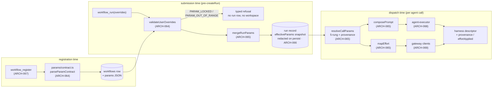

**(2) Development view** — files touched, and the fence:

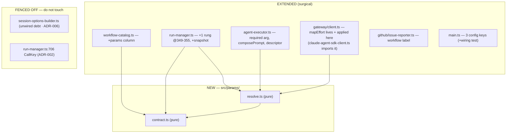

**(3) Process view** — one submission, one dispatch (the two moments):

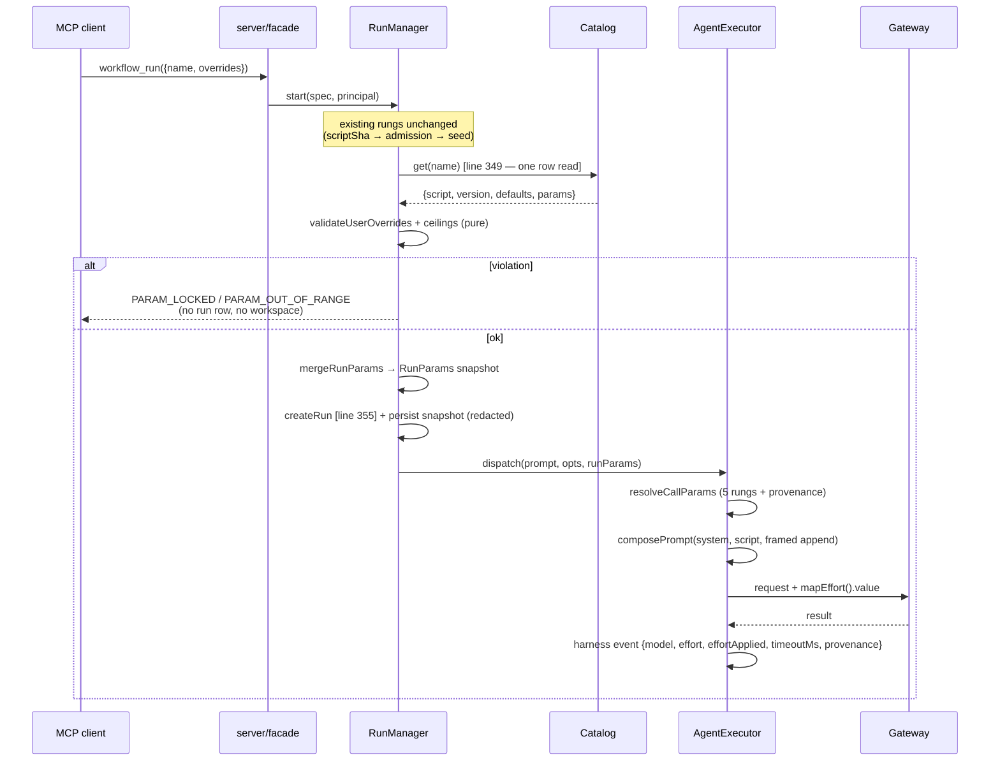

**(4) Deployment view** — **unchanged**: same single Node process, same SQLite file, same ports/routes, no new service or sidecar. The only operational delta is three config keys in `rwe.config.json` (`maxTimeoutMs`, `maxAppendPromptBytes`, `maxEffort`), documented in DEPLOY §1; a missing key uses the fail-closed default. (One-line view per the lean rule — there is genuinely no topology change.)

**(+1) Scenarios**
- *S-1 — user tunes what the author allowed*: caller sends `overrides:{model:'haiku', effort:'high', appendPrompt:'…'}`; contract enum admits the model, ceilings admit effort/append size; snapshot pins `{model:'haiku'(override), timeoutMs:T(default)}`; every `agent()` without its own `model` dispatches on `haiku`, with the framed append last, and `workflow_agent_log(...).harness.provenance.model === 'override'` proves it — not `workflow_get`'s echo.
- *S-2 — locked key, zero footprint*: caller sends `overrides:{tools:['Bash']}`; **`validateUserOverrides` refuses** with `PARAM_LOCKED {param:'tools', tunable:[model,effort,timeoutMs,appendPrompt]}` at the rung before `createRun` — the integration test asserts zero new run rows and zero new workspace directories. **[AMENDED v21 Gate 8 RE-REVIEW #4, A3 + A9/C-1]:** this scenario previously read "`additionalProperties:false` + `parseUserOverrides` refuse". Both halves were wrong — there is no `parseUserOverrides` in `src/`, and the `additionalProperties:false` in the tool's `inputSchema` is never evaluated server-side (see ARCH-064 invariant (2)). The refusal comes from the parser alone, which is why the scenario still holds exactly as written.
- *S-3 — restart + resume*: a suspended run resumes after the v21 deploy; `CallKey` is byte-identical to what was journaled, so every already-made call replays from the cache (zero gateway invocations), and the resumed tail uses the **pinned** snapshot even if the workflow was re-registered meanwhile.

### v21 data architecture

Storage stays SQLite/better-sqlite3 (no ADR — the SQL-vs-NoSQL choice was settled for this engine long ago and v21 adds no new access pattern). **Delta only:**

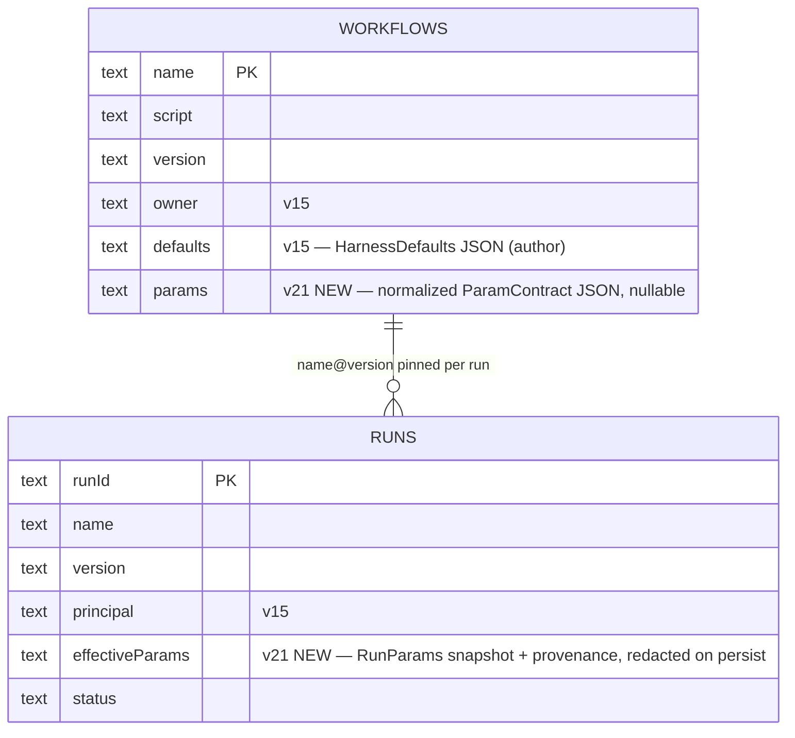

- `workflows.params`: nullable; `NULL` ⇒ the canonical unconstrained contract (no migration backfill needed — absence is already the backward-compatible meaning).
- `runs.effectiveParams`: written once at `createRun`, never updated (run-immutable); it is a **new persist sink** and goes through the ARCH-056 redaction path.
- No new table, no new index (both fields are read via the existing single-row lookups).

### v21 interface & API contracts

| surface | contract delta | errors |
|---|---|---|
| `workflow_register({name, script, defaults})` | script `meta.params` parsed, validated, normalized, stored on the version row | typed reject + **nothing stored** on locked key / malformed / oversized block |
| `workflow_get({name})` / `workflow_list()` | `+params: {knobs:{name,type,default,enum?|min?|max?,unit?}, args:{…}}` structured data (contract legible without the script body) | — |
| `workflow_run({name, args, overrides})` | `overrides` object, `additionalProperties:false`, exactly `{model?, effort?: low\|medium\|high\|xhigh\|max, timeoutMs?, appendPrompt?}`; declared `args` type/range-checked, undeclared `args` pass through | `PARAM_LOCKED {param,tunable[]}`, `PARAM_OUT_OF_RANGE {param,supplied,allowed}`, `PARAM_UNKNOWN {param}`, existing `UNKNOWN_ALIAS` for an unresolvable effective model — all **before** any durable work |
| `workflow_resume({runId})` | new/changed `overrides` refused; the pinned snapshot is used, never re-resolved from the current catalog row; the snapshot read-back is **refusal-only — a redaction marker is never expanded back into a secret** (R-G1/R-G6) | typed refusal on changed overrides; **`PARAM_SECRET_UNAVAILABLE`** when the rehydrated `effectiveParams` still carry a `‹secret:NAME›` marker — resume is byte-identical to admission or refused, never a silent substitution |
| `workflow_agent_log({runId, agentId}).harness` | `+effort`, `+effortApplied` (tri-state), `+timeoutMs`, `+provenance{key→call\|agentType\|override\|default\|engine}` (`appendPromptBytes`/`promptTruncated` dropped — adjudication B-2) | — |
| `issue_report({workflow?, version?, runId})` / `issue_list({workflow?})` | `workflow:<name>` label + `name@version` in body; label-filtered listing; no existence check and no name predicate — label-scoped sanitize + 50-char cap, untruncated `name@version` in the body (adjudication A-5) | — |
| `rwe.config.json` | `+maxTimeoutMs` (600000), `+maxAppendPromptBytes` (1024), `+maxEffort` ('high') — **two rungs**: the caller-override rung at admission AND the values stored into a workflow's `defaults` column at registration (caller-supplied `defaults.<knob>` and a normalized `params.knobs.<knob>.default` alike). Script per-call `agent()` opts stay unbounded [ADR-005]. Refuse, never clamp. **[AMENDED v21 Gate 8 RE-REVIEW #6, QD-CONS-3 — this row read "user-override ceilings only", which has been false since adjudication #7's G-1 fix; it is the surface an integrating caller reads first, and ADR-005 + ARCH-066 inv-4 were corrected one pass earlier (S-2) while this table was missed]** | — |

### Decision rationale — v21 (ARCH-064..070, ADR-001..008; REQ-090..095)

- **Panel provenance / no round 2.** Synthesized from `.panel/architecture/adversarial.r1.md` (security / scalability / testability, Karpathy tie-break) and `.panel/architecture/quality-dimensions.r1.md` (observability / replaceability / consumability / self-sustainability). **r2 NOT triggered:** the two round-1 headlines are *complementary, not contradictory* — both independently converge on "one pure resolution seam with one observable output", and every pre-declared disagreement (below) was either pre-conceded in r1 or resolvable on evidence. The orchestrator pre-ran the panel and re-spawning is out of scope. QM `safety_class` ⇒ no functional-safety / cybersecurity lenses (correct for developer tooling).
- **Strongest convergence, adopted wholesale: per-key provenance at the single existing observation point** (quality O-1 ≡ adversarial T-4, proposed independently). Quality pre-empted the "over-engineering" objection; adversarial never raised it and asked for the same field. Cost is one small journaled object; benefit is that the recurring silent-no-op wiring class (4th instance) becomes a Gate-7.5 assertion instead of Gate-8 archaeology. → ARCH-068.
- **ADR-001 (closed `UserOverrides`) is the single most consequential adoption.** Adversarial S-1 (blocking) showed that the shortest path from REQ-092's own wording to code is a privilege escalation; quality's R-2 "one pure contract module" is satisfied by the same design. Quality's expected push for a general `ParamDescriptor` registry never appeared in r1; adversarial's pre-declared concession (a shared `ParamSpec` *value* type for the open-ended declared `args`, a closed type for the four harness knobs) is exactly what I adopted — the seam both lenses said they would converge on.
- **ADR-002 (run-immutable snapshot, `CallKey` untouched) — adversarial-only finding, adopted without dilution, and extended.** Quality never examined the resume cache. The extension is mine and it matters: adversarial named only "refuse changed overrides on resume"; primary source shows `run-manager.ts:523` re-reads the catalog on resume, so the snapshot must also be *read back* rather than re-resolved, or a re-register silently changes an in-flight run's params with no cache miss to reveal it.
- **ADR-003 (fifth rung) — adjudicating adversarial's OPEN-3.** Adopted its proposal (author agentType above user override) with a sharper framing: REQ-092's four rungs keep their relative order and the fifth is *inserted*, so this is a refinement of a requirement silence, not a contradiction — and it preserves `agent-executor.ts:291`'s current behavior exactly.
- **ADR-005 (open-by-default + ceilings) — adjudicating OPEN-1; adversarial conceded to the requirement itself.** Its security lens wanted closed-by-default and explicitly stood down because REQ-090 decided otherwise at Gate 1. My addition on the evidence: the ceilings bind the **caller-override rung at admission and the registration rung** over the values that reach the stored `defaults` column; applying them to script **per-call** `agent()` opts would break REQ-091's "no overrides ⇒ byte-identical to pre-v21" and would re-open a settled author-trust question. Refusal, never silent clamping, since silent alteration is precisely the defect class this iteration repairs. **[AMENDED v21 Gate 8 RE-REVIEW #6, QD-CONS-3 — as written at Gate 2 this bullet said the ceilings bind the "user-override rung only" and named registered defaults alongside per-call opts as deliberately unbounded; adjudication #7's G-1 fix made the first half false. A THIRD stale surface beyond the two the review named (`:967` and DEPLOY.md), found by re-verifying against `workflow-catalog.ts:171-194` rather than against the review's list, and disclosed rather than silently retargeted — see IMPL-147. ADR-005 and ARCH-066 inv-4 already carry the corrected statement (S-2, RE-REVIEW #5).]**
- **ADR-008 — adjudicating OPEN-2 and the two visibility asks.** Rejection telemetry: declined, landing on quality's own stated acceptable outcome (an explicitly recorded residual, not silence) — no metrics subsystem exists and two error codes do not justify inventing one. Non-owner descriptor masking: adversarial leaned toward a reduced view now but flagged that it is really a v22/D15 policy question; I chose deferral because v21 exposes no new *class* of author configuration and one masking implementation is better than two. Both are recorded residuals, not gaps.
- **Quality S-1 (stale registered defaults) adopted in reduced form.** Rather than a new `DEFAULT_STALE` code or a liveness mechanism, the *effective* (post-merge) model is checked at submission with the existing alias rule (including the `openrouter/<id>` passthrough carve-out) and reuses the existing `UNKNOWN_ALIAS` code. Quality itself offered to collapse this to a test "on evidence"; the evidence (`submission-validator.ts:106-112` only scans inline `spec.script`, so a named run never checks the registered default) shows a real hole, so it stays — but as one call, not a subsystem.
- **Two panel claims corrected against primary source.** (i) `PROMPT_CAP` truncation (adversarial P-4/R-9) affects the **recorded descriptor only**, never the dispatched prompt — no author instruction is displaced from the model's input; the residual is record honesty. **[AMENDED v21 Gate 8 RE-REVIEW #4, A10/O-2 — this rationale described the pre-R-G9 site and two retracted fields, and an auditor following it was pointed at the wrong function]:** the cap is no longer in `redactHarness`; it is the exported `capPrompt` (`agent-executor.ts`) applied at the single `onHarness` persist site **after** `redact()` (R-G9's ordering — cap-then-redact split secrets across the 2048-byte seam and leaked credential fragments into the persisted descriptor), and the record-honesty fields `promptTruncated` / `appendPromptBytes` were **dropped** by adjudication B-2 rather than shipped: REQ-094 refuses an oversize `appendPrompt` at submission, so a truncation-record field describes a state v21 cannot enter. The observable is the rejection's own `suppliedBytes`/`maxBytes` detail plus UT-070's head/tail pins on `capPrompt`. (ii) Adversarial's admission-ladder diagram does not match the actual, test-pinned order in `run-manager.ts` (seed rungs precede `catalog.get`); the v21 rung is *inserted* at lines 349–355 and **no existing rung moves** — Gate 3/4 must not "fix" the ladder to match the panel's idealization.
- **Consciously declined (Karpathy scope guard), each with the lens that asked:** the data-driven `admit()` ladder refactor (adversarial C-2 — refactoring working, pinned code violates surgical-changes; per-rung testability is already bought by the pure functions, and the negative property gets exactly one integration test); a rejection-metrics subsystem (quality O-3 / adversarial D-5); a general parameter registry (adversarial D-1, pre-declined; quality never asked); a new discovery endpoint or per-workflow dynamic tool schema (adversarial D-2 — the contract is per-row data on `workflow_get`, the four global knobs are in the static `workflow_run` schema); dashboard surfacing of params (adversarial D-3 — `/api/*` is unauthenticated, so it would publish author config and user text more widely than the authenticated case; revisit with v23); a `HarnessResolutionPort` interface (adversarial D-4 — a required argument kills the inert-wiring class, an interface with a default implementation *recreates* it); and wiring `session-options-builder.ts` (ADR-006).
- **Karpathy check.** 7 ARCH for 6 REQ, split strictly along module boundaries (two new pure files, five surgical extensions). Complexity budget is spent only where the requirement forces it: ARCH-064/065 (the pure decision core, where all the testability lives) and ARCH-066 (the admission rung + the persist-sink/redaction/resume invariants). ARCH-067 is one column, ARCH-068 is one required argument plus descriptor fields, ARCH-069 is a mapper applied at two existing call sites, ARCH-070 is a label plus two body lines. The dominant risks are all *silent-failure* risks — inert wiring, a smuggled locked key, a dishonest `effortApplied`, a poisoned resume cache, a persist sink bypassing redaction — and the architecture makes each impossible-by-construction (required argument, unrepresentable key, single computed value reused, resolution downstream of `CallKey`, snapshot routed through the existing sink) rather than adding machinery to detect them afterwards.
- **Accepted residuals (record, do not architect):** cost amplification by a non-owner principal within the ceilings (ADR-005); prompt-injection influence over the author's granted tool surface via `appendPrompt`, bounded and attributed but not eliminable (ADR-007); no rejection telemetry and no non-owner descriptor masking until v22 (ADR-008).
- **Gate 6.5+7 module-boundary fix (verifier, 2026-09-01):** `solid_check` flagged two HIGH undeclared deps — `src/run-manager.ts` (ARCH-066) and `src/agent-executor.ts` (ARCH-068) each `import … from './gateway/client.js'`, which now resolves to ARCH-069's module (`src/gateway`) but wasn't in either's `deps:` list. Both imports **pre-date v21** (`RunManager` has always built its own default `LiteLLMGatewayClient` when none is injected; `AgentExecutor` has always dispatched through the `GatewayClient` type) — ARCH-069 is the new v21 arch item, so this is a documentation-completeness gap (a pre-existing, legitimate dependency surfacing for the first time against a module id that didn't exist before this iteration), not a boundary v21 actually broke. Fixed by adding `ARCH-069` to both `deps:` lines above; no code changed. Re-run: `solid_check` now reports 0 high (10 low `未認領檔案` unchanged — pre-existing files with no ARCH declaration at all, out of this pass's scope).


## v22 slice — versioned catalog + beta/release channels + closing inline script (REQ-096..100): ARCH-071..076 + ADR-009..014

**Slice shape (Karpathy check up front).** One new table (`workflow_versions`), two nullable pointer
columns on the existing `workflows` row, **one** new MCP tool (`workflow_publish` — REQ-097 has no
other way to move a pointer), two new pure files (`src/script-checks.ts`, `src/workflow-view.ts`),
one deleted accessor (`catalog.get(name)`), one deleted wire parameter (`script` on
`workflow_run`/`workflow_resume`), one config key. **Zero new endpoints, zero new services, zero new
background jobs, zero caches, no GC, no audit table, no channels table, no per-user channel state.**
Anything larger at Gate 3/4 is carrying speculation.

The slice is one structural idea plus one deletion: the catalog stops being a mutable key→value map
and becomes an **append-only version table with two movable pointers**; and `script` leaves the wire,
which makes `workflow_register` the engine's **only** ingress for executable text — so REQ-099's move
of the static checks is not bookkeeping, it is a correctness precondition (today every check sits
behind `if (spec.script)` at `submission-validator.ts:92`, so the moment inline script closes, 100% of
runs skip 100% of submission validation).

### ARCH-071 — versioned catalog: append-only `(name, version)` rows, two channel pointers, owner-gated `publish`, the single resolve accessor, transactional idempotent migration, per-name version ceiling
- **status:** draft
- **traces:** REQ-096, REQ-097
- **module:** src/workflow-catalog.ts
- **deps:** ARCH-007, ARCH-061, ARCH-062, ARCH-067, ARCH-074
- **api:** `workflow_versions(name, version, script, defaults, params, createdAt, PRIMARY KEY(name, version))` (immutable rows); `workflows` keeps `name PK / owner / createdAt` and gains `release_version TEXT NULL` + `beta_version TEXT NULL`; `register(name, script, defaults, principal) → {version}` (INSERT a new row, **never** `ON CONFLICT DO UPDATE`, and **not** published to any channel); `publish(name, version, channel, principal) → {channel, version}` (owner-gated, `NOT_WORKFLOW_OWNER`); **`resolve(name, {version?, channel?}) → {script, version, defaults, params}`** — the ONE read accessor for execution, replacing `get(name)` which is **deleted**; pure exported `resolveVersionRequest({version?, channel?}, {release, beta}) → {version} | {code}` (the truth table, no I/O); `exists(name)`; `listVersions(name)`; `list()` gains `versions[]` + `channels{release,beta}` per name; `deregister(name, principal)` removes the `workflows` row **and all its version rows**; config `maxWorkflowVersions` (per name).
- **note:** **Channels are two nullable columns, not a table** [ADR-009]: REQ-097 closes the enum to `beta|release` and states outright that no per-user channel assignment or opt-in state exists, so a join table is speculative generality for a two-valued closed enum — and `ALTER TABLE ADD COLUMN` is this file's proven idempotent idiom (four precedents, `workflow-catalog.ts:86-98`). **Owner stays on `workflows`, not per version** — ownership is per *name*, which is what `NOT_WORKFLOW_OWNER` already means (`:201`); duplicating it per version invents a "who owns v3 vs v4" question nothing asks. **Load-bearing invariants:** (1) **`get(name)` is DELETED, not left beside `resolve()`** — a surviving legacy "newest row" read is exactly how this repo's signature stored-but-never-wired class recurs (`resolveHarnessParams` zero callers, v11 `updateFlagPath`, v15 `auth`, v16 `workspaceTtlMs`); after this slice the compiler, not a reviewer, finds a missed call site (the six known ones: `run-manager.ts:391,635,801`, `scheduler.ts:148,209`, `webhook-registry.ts:89`, plus `submission-validator.ts:83` — the last four are existence checks and become `exists()`). (2) **`resolveVersionRequest` is pure and total** — explicit `version` wins over any channel (REQ-097's own words, "regardless of any channel", so a version+channel pair needs no conflict error); else the named channel's pointer; else `release`; a NULL pointer is **`CHANNEL_UNPUBLISHED` naming the channel, never a fallback to the newest row**; an unknown version is `UNKNOWN_VERSION`; a channel outside `beta|release` is `INVALID_CHANNEL`. It is table-driven-unit-testable with no database. (3) **Registration ≠ publication** — a new row is on no channel, so an author registers a draft without affecting one user (REQ-097). (4) **Boot migration, one `db.transaction()`** [ADR-011]: copy each existing `workflows` row into `workflow_versions` at its current version, keep owner/defaults/params/createdAt, **and set `release_version` to that version**; idempotent (`INSERT OR IGNORE` + a pointer write only when NULL), restart-safe, and atomic — a half-applied migration is unrepresentable rather than detected. (5) **`register` + `publish` each run inside one `db.transaction()`** — `better-sqlite3` is synchronous so the in-process SELECT-max-version → INSERT sequence cannot interleave, but the **cross-process** case is real (the self-update overlap window, an operator second instance), and where today `ON CONFLICT DO UPDATE` silently absorbed a lost update, the new `(name, version)` PK turns it into a raw `SQLITE_CONSTRAINT` surfacing as an untyped 500. One transaction is the whole answer at this scale; a lock table, an advisory lock or a version-allocation service is explicitly rejected. (6) **Per-name version ceiling** (S-1, the debt the requirements invite): `maxWorkflowVersions` sourced from the **existing** `WorkflowCatalogOpts.ceilings` object (`:57`) — no new plumbing — refusing the *registration* with a typed `VERSION_CEILING_EXCEEDED`. It counts **versions, not bytes** (a second byte-cap semantics beside `maxAppendPromptBytes` would earn nothing) and it is a front door, not a GC [ADR-014]. (7) **Version identifiers stay engine-assigned `v<n>`** (`:205` semantics preserved, now computed as max over the name's rows): sortable, collision-free, and an agent reasons "higher = newer" without a semver parser. (8) `register` calls ARCH-074's `validateScriptEntry` **before** any write, so "nothing is stored" on a refusal is guaranteed at the cheapest place [ADR-013]; that gives this module new alias/MCP-registry dependencies which **must be threaded in `main.ts`'s constructor call AND added to `tests/unit/compose-config-v2-wiring.test.ts` in the same change** — part of this ARCH's definition of done, not implementer discretion (five prior misses of this class).
- **v36 amendment (REQ-211/212/213, ARCH-155/157/161, ADR-074/076):** four deltas inside this module, none of them a new table — (a) per-version delete granularity with its three refusals and the late-write diagram guard (`:~409`) re-keyed from name-scoped to `(name, version)`; (b) the three mutating methods take `actor: Actor` where they took `principal: string | null`, with ownership collapsed into the exported pure predicate `canMutate(owner, actor)` (identical semantics); (c) `publish`'s bare `console.log` (`:803`) moves onto the ARCH-159 event sink and gains REQ-212's `bypass`/`idSource` fields; (d) `insertVersion` gains the matching `catalog.register` line REQ-213 asks for.
- **iter:** v36
### ARCH-072 — resolve once at admission, pin the version on the run, and make resume / nested `workflow()` / DAG read the pin; inline-script ingress refused
- **status:** draft
- **traces:** REQ-096, REQ-097, REQ-098, REQ-099
- **module:** src/run-manager.ts
- **deps:** ARCH-002, ARCH-006, ARCH-066, ARCH-071, ARCH-074
- **api:** `RunManager.start(spec)` accepts `spec.version? | spec.channel?` and **refuses `spec.script`** with typed `INLINE_SCRIPT_CLOSED`; resolution happens once via `catalog.resolve(name, {version, channel})` at the existing `run-manager.ts:391` site; the resolved version is persisted as the run's pin through the **already-existing** `RunStore.createRun(spec, scriptVersion)` field (`run-store.ts:81/146`, D-V7); `resume(runId)` re-resolves **through the pin** (`resolve(name, {version: view.scriptVersion})`, replacing the `catalog.get(spec.name)` at `:635`); nested `workflow(name)` (`:801`) resolves the **`release`** channel and records the resolved version on the journal entry; the run record additionally carries the **request shape** (`requested: {version} | {channel} | 'default-release'`) and the admission-time `validation` observation from ARCH-074.
- **note:** **The pin is a correctness fix, not decoration** [ADR-010]. Today a run started by name stores an empty `spec.script` (the resolved script is deliberately never written back, `:385-392`), so `resume`/`rehydrate` re-reads `catalog.get(spec.name)` (`:632-636`) and continues **whatever is registered now** — register a new version while a run is suspended, resume it, and the run executes a different script than it started. Overwrite semantics made that a narrow window nobody noticed; version history plus a `beta` channel authors are encouraged to churn makes it the normal case. So version history is the only available fix for resume determinism, and the fix has a RED test with real failure semantics (start `foo@v1` → suspend → register `foo@v2` → resume → assert it continued **v1**; that test fails against today's code). **Name-collision warning, verified against primary source and stated so Gate 4/5 cannot conflate them:** there are TWO `scriptVersion` fields. `RunStore`'s `runs.scriptVersion: string` (`run-store.ts:129`) is the **durable catalog version, written once at `createRun` and never updated** — that is the pin. `RunEntry.scriptVersion: number` (`run-manager.ts:146`) is an in-memory **resume-generation counter** (`entry.scriptVersion += 1` at `:563`, stamped onto each `JournalEntry` as `v${n}` at `:883`, and re-seeded from the stored catalog version at `:676`). v22 must not make the second one authoritative for resolution, and must not let it overwrite the first. **Load-bearing invariants:** (1) **one resolution moment per run** — every trigger path (client `workflow_run`, `workflow_trigger`, scheduler, webhook, chain) already funnels through `start()`, so pinning there covers all of them with no per-trigger work; `scheduler.ts`/`webhook-registry.ts` keep only an `exists()`-shaped front-door check, and `Scheduler.create()` upgrades its check to "resolves `release`" so a schedule that could never fire is refused at creation rather than at 3am [quality SUS-5, bought for one line]. (2) **Channel resolution is fire-time, not creation-time** — a standing schedule follows its workflow's `release` pointer, which is the feature (publish once, every trigger upgrades); the per-run pin plus the recorded request shape is what makes "which version did this cron actually run" answerable afterwards, since the pointer itself is mutable and unreconstructable. (3) **The ban on inline script is on INGRESS ONLY, never on rehydration** — a run suspended *before* the upgrade has a persisted `spec.script` and must still resume; refusing it at rehydrate would strand it (the obvious over-correction). (4) **The internal replacement-script capability goes with the parameter** — `entry.script = newScript` (`:562`) loses its caller; leaving it is a latent re-entry. (5) **`_adhoc` is left inert, not deleted** (REQ-098 permits either): once no run can be nameless, the three `spec.name ?? '_adhoc'` defaults (`:268`, `:450`, `:654`) are dead, and deleting them means re-proving `path-containment`/`workroot-guard` behaviour at three workspace-rooting sites for zero user-visible gain. (6) **`effectiveParams` stays run-immutable** [v21 ADR-002 unchanged]: the pin makes the v21 snapshot *more* correct (it is now demonstrably the version the snapshot was computed from), and nothing in v22 re-merges a newer version's `defaults` into a live run. (7) **The DAG's script source becomes the pin** — `server.ts:1044-1046` reads `spec?.script`, which is empty for every named run, so `/api/runs/:id/dag` already renders skeleton-less graphs and after REQ-098 would do so for 100% of runs; deriving the skeleton from the pinned `(name, version)` fixes it exactly and stably (wired in ARCH-073). **Explicitly rejected:** persisting the resolved script into the stored `RunSpec` — the one-line fix that creates a *new unmasked script sink* read back wholesale by `getSpec()`, defeating REQ-100 from another endpoint and duplicating script bytes per run. **Declared residual:** an *unsettled* nested `workflow()` call re-resolves `release` on resume (settled ones replay from the journal cache and never re-resolve); the airtight closure is ARCH-044's eager-journal pattern (record the resolution at call start), named here as the future fix and deliberately not built now.
- **v36 amendment (REQ-211, ARCH-156, ADR-074, INV-V36-5):** this row's resolution path is unchanged, but something upstream now guarantees the pin it reads still exists. The `VERSION_NOT_FOUND` catch at `:1049-1060` re-resolves a resumed run through `release` and records `legacySubstitution` — correct for the legacy cohort it was built for, catastrophic if a per-version delete routed ordinary healthy runs into it (they would not fail; they would continue on different code). v36 refuses the **delete** (ARCH-156's probe) rather than changing this fallback; making resume fail loudly is filed for v37 with its line numbers.
- **iter:** v36
### ARCH-073 — the wire surface: `script` removed from the schemas, `workflow_publish`, version/channel parameters, and the `ReadContext` threading that makes masking real
- **status:** draft
- **traces:** REQ-096, REQ-097, REQ-098, REQ-100
- **module:** src/server.ts
- **deps:** ARCH-001, ARCH-051, ARCH-060, ARCH-069, ARCH-071, ARCH-072, ARCH-075, ARCH-076
- **api:** `workflow_run` inputSchema **loses `script`** and gains `version?: string` + `channel?: 'beta'|'release'`; `workflow_resume` inputSchema **loses `script`**; new tool `workflow_publish({name, version, channel})`; `workflow_get` gains `version?`; `workflow_list` reports `versions[]` + `channels{release,beta}`; the dispatch cases at `server.ts:808` (`workflow_list`) and `:823` (`workflow_get`) thread a **required** `ReadContext {authEnabled: boolean; principal: string | null}` built from the already-resolved edge principal; `/api/workflows`, `/api/workflows/:name/skeleton` and `/api/runs/:id/dag` serve the **non-owner projection whenever auth is enabled**, and the DAG route derives its skeleton from the run's pinned `(name, version)` instead of `spec.script`.
- **note:** **Closure must be schema-level AND runtime-level, asserted separately** (REQ-098 says a schema-reading client never learns `script` exists; but `/mcp` accepts arbitrary JSON bodies, so a hand-rolled request can still carry it): the parameter is **removed from the advertised schema** *and* its presence is a typed `INLINE_SCRIPT_CLOSED` refusal whose message carries the migration recipe (`workflow_register` then `workflow_run({name})`) — for an MCP agent the error text is the documentation. Both facts join the ARCH-051 structured drift-lock test, as does the `workflow_publish` schema and the new `version`/`channel` parameters. **The `ReadContext` is a REQUIRED parameter, and that is the whole point** [ADR-012]: `server.ts:823`/`:808` thread **no principal today** (unlike `workflow_register`/`workflow_deregister` at `:813-822`), so REQ-100 is not "add a mask to the facade", it is "add an authorization input to two read paths that have none" — and an *optional* `principal = null` reproduces this project's twice-realised `composeConfig` wiring bug class verbatim: correct implementation, unwired call site, every unit test green, zero protection. A required argument makes an unwired call site a **`tsc` error**. **`args.principal` is BARRED from this path**: the register/deregister fallback at `:814-815` honours a caller-supplied principal when the auth-resolved one is null (a test convenience on a production path); for *attribution* that is defensible, for a *confidentiality* decision it is self-asserted identity — and since `owner` is returned to everyone by REQ-100's own allowlist, reusing it would let a non-owner unmask by echoing the owner email it just read. Integration tests mint a real token through the existing injectable `TokenStore` seam instead. **`/api/*` and the dashboard have no identity plumbing whatsoever** and adding browser-session identity is a subsystem REQ-100 does not ask for, so they serve the masked projection unconditionally while auth is enabled, and the pre-v22 surface while auth is disabled — the strongest setting that costs nothing [ADR-012]. **Accepted cost, stated not hidden:** on an auth-enabled deployment an owner cannot read their own script in the dashboard (they use `workflow_get` with a bearer), and the dashboard DAG shows live agent nodes without the predicted skeleton overlay (ARCH-042's never-drop-live-agent fallback already covers this shape). **The masking test must run over the real transport** — one integration test drives an authenticated non-owner through `/mcp` (real HTTP, real bearer, real `resolvePrincipal`) and asserts the masked shape; a facade-level unit test with an injected principal cannot detect the `:823` hole, which is the entire lesson of `compose-config-v2-wiring.test.ts`. **`deps:` completeness [AMENDED v22 gate-closeout, `solid_check` finding]:** this is the first `module:`/`deps:` declaration this ledger has ever written for `src/server.ts` (every prior ARCH covering it — ARCH-001, ARCH-051 among others — predates the convention and used prose). `server.ts` is the composition root and has constructed `LiteLLMGatewayClient` (`src/gateway/client.ts`, ARCH-069) since v1 (`e4aee17`) — pre-existing, load-bearing, not introduced by this slice. `ARCH-069` added to `deps:` above; no code changed, same "dependency pre-dates this line's writing" disposition ARCH-069's own note already applied to `ARCH-068` (Gate 8 RE-REVIEW #4, R-2). This declaration is scoped to what `solid_check` can verify (server.ts's actual import graph), not to a claim that ARCH-073 designed the gateway wiring.
- **superseded_in_part:** v27b (2026-09-11, owner ruling Round v27b → ADR-051) — the clause 「`/api/runs/:id/dag` serve[s] the **non-owner projection whenever auth is enabled**」 and the accepted cost 「the dashboard DAG shows live agent nodes without the predicted skeleton overlay」 no longer hold **for the PREDICTED OVERLAY**: it is served regardless of `auth.enabled`. Everything else here stands unchanged — script text, the `ReadContext` threading, `workflow_get`/`workflow_list` and `/api/workflows*`'s non-owner projection. History is marked, not rewritten; `iter:` stays v22.
- **iter:** v22

### ARCH-074 — one shared `validateScriptEntry`: enforced at registration, observed at admission, surfaced on read
- **status:** draft
- **traces:** REQ-099
- **module:** src/script-checks.ts
- **deps:** ARCH-008
- **api:** pure-with-injected-ports `validateScriptEntry(script, {aliases, openrouterPassthrough, mcpLookup}) → {ok: true} | {ok: false, errors: [{code: 'PARSE_ERROR'|'UNKNOWN_ALIAS'|'MCP_NOT_PROVISIONED', message, detail}]}` — the parse/`checkMeta` + model-alias + MCP-name-existence checks lifted verbatim out of `submission-validator.ts:92`'s `if (spec.script)` block; also exports the `defaults.appendPrompt` frame-delimiter predicate reused from `params/contract.ts`'s `FRAME_CLOSE_FORGERY` (P6-2's registration half — the **same** predicate the dispatch site uses, never a second copy).
- **note:** A **new tiny pure module rather than a call into `submission-validator.ts`**, for one concrete reason: `workflow-catalog.ts` is the new enforcement site and `submission-validator.ts` already type-imports the catalog — extracting the checks keeps the dependency acyclic and gives both call sites the **one** implementation (the F-2 lesson; `workflow-catalog.ts:36-46` already delegates `violatesOwnSpec` to the shared `checkValueAgainstSpec` for exactly this reason). **Disposition split, and it is the contested call** [ADR-013]: **registration enforces fail-closed** — any error ⇒ typed refusal, **nothing stored** (same codes the engine produced at submission, so no caller learns a new vocabulary); **admission observes**. `workflow_get` recomputes the same function for the served version via `catalog.validateCurrent()` and returns `validation: {ok, errors[]}` to the owner (masked to `{ok}` for a non-owner, DES-115/REQ-100) so an author can *query* which of their workflows went stale instead of discovering it in a run; **`workflow_list` deliberately does not** — it is polled by the dashboard every 3s and a per-row script parse there would be a real cost for a surface nobody debugs from. **[AMENDED v22 gate-closeout, adjudication #5 O-1]** This note originally said admission's observation was `start()` recomputing the two environmental checks against the resolved version and recording the outcome **on the run record**. That call was never built. Adjudication #4 (N-1) sited the observable narrower and elsewhere, after finding it live-missing at Gate 6 closeout: **only `MCP_NOT_PROVISIONED`** is recomputed, **per dispatched `agent()` call** (not once per run), and surfaced as `HarnessDescriptor.mcpUnresolved?: string[]` — present only when that call's own MCP references include one no longer provisioned, absent (never `[]`) otherwise (`workflow_agent_log`'s `harness` field). `UNKNOWN_ALIAS` is not rechecked at dispatch. The run is never retroactively refused, matching REQ-099's last clause either way; only the recording site and grain changed. One enforcement site (registration), one read-time observation site (`workflow_get`), one narrower per-call dispatch observation (`mcpUnresolved`) — the "no two gates that can disagree" property still holds, because none of the three ever refuses. **Structural guard REQ-099's own wording invites:** after the move, `SubmissionValidator` contains **zero `if (spec.script)` branches** — grep-able, cheap to assert in a lint-style test, and far stronger against re-introduction than the behavioural "a run by name is covered" test (which is also required).
- **iter:** v22

### ARCH-075 — `projectWorkflowForRead`: one pure allowlist projection, constructed not deleted
- **status:** draft
- **traces:** REQ-100
- **module:** src/workflow-view.ts
- **deps:** —
- **api:** `type WorkflowOwnerView` (carries `script`) and `type WorkflowPublicView` (**no `script` field in the type at all**); `projectWorkflowForRead(full, viewerIsOwner: boolean) → WorkflowOwnerView | WorkflowPublicView`; the non-owner branch emits exactly `{name, version, channels, description, phases?: never, params, owner, reportProblem, scriptWithheld: true}`.
- **note:** **Allowlist projection at ONE choke point, by construction** — every script-derived response (`workflow_get`, `workflow_list`, `/api/workflows*`, the skeleton route, the dashboard) is *constructed* from an explicit field list, so REQ-100's "cannot be side-stepped by asking a different endpoint" is enforced by construction rather than by five remembered deletions, and adding a catalog field later cannot silently widen disclosure. **Three concrete traps this closes, all visible in today's code:** (1) `script` is returned **twice** by `workflow_get` (top level *and* inside `result`, `mcp-facade.ts:220/232`), so a `delete resp.script` fix leaks `result.script` — v21's fragment-leak defect verbatim; (2) `skeleton` and `phases` are **script-derived** (`parseWorkflowSkeleton` is a static scan of every `phase`/`agent`/`parallel`/`workflow` call — a decompiled outline of the agent graph) and are **not** on REQ-100's non-owner allowlist, so they are masked by default; (3) `/api/workflows/:name/skeleton` (`server.ts:~1003`) serves the same derived structure over a route with no identity plumbing at all. **The non-owner branch is a positive statement, not a hole** — `scriptWithheld: true` (a distinct key, so the response never carries a `script` of a second shape a client's type-narrowing could misread), and REQ-100's allowlist is served in full including the **`reportProblem` affordance from REQ-095** (`issue_report({workflow})`) and the REQ-090 declared parameter contract, which ARCH-067 already stores as a column precisely so it survives script masking. **Test oracle, pinned here because it is half the requirement** [v22 Rule 1]: `expect(Object.keys(deepFlatten(resp)).sort()).toEqual(EXPECTED_NON_OWNER_KEYS)` — a literal two-sided allowlist over the whole response tree, so a *new* leaked field fails **and** a missing `scriptWithheld` fails; `expect(resp).not.toContain(scriptText)` is refused as an oracle (it passes while `result.script`/`skeleton` leak). If a non-owner genuinely needs more shape, the answer is an **author-declared `meta` field** (consented disclosure) — never leaking a derived one.
- **superseded_in_part:** v27b (2026-09-11, owner ruling Round v27b → ADR-051/ADR-055) — trap (2)'s 「`skeleton` and `phases` … are masked by default」 keeps its force on the `workflow_get` non-owner allowlist, but the PREDICTED LANE STRUCTURE (the run DAG's predicted overlay and `describe.phases[].agents`) is now a named, owner-ruled exception: it is served to every caller. The projection itself, `scriptWithheld: true` and the two-sided allowlist test are untouched. `iter:` stays v22.
- **iter:** v22

### ARCH-076 — masked reads at the facade: required `ReadContext` on `workflow_get` / `workflow_list`, `version` selection, owner determined by the catalog row
- **status:** draft
- **traces:** REQ-100, REQ-096
- **module:** src/mcp-facade.ts
- **deps:** ARCH-001, ARCH-071, ARCH-075
- **api:** `workflow_get(a: {name: string; version?: string}, ctx: ReadContext)` and `workflow_list(a, ctx: ReadContext)` — `ctx` **required, no default**; `viewerIsOwner = ctx.authEnabled ? (ctx.principal !== null && ctx.principal === row.owner) : true`; the response is whatever `projectWorkflowForRead` returns, never a row.
- **note:** The facade is where the *policy* is evaluated and ARCH-075 is where the *shape* is built — split so the shape is testable without auth and the policy is testable without HTTP. **`workflow_get({name})` with no version resolves through the same `resolveVersionRequest` truth table as a run** (REQ-096: no-version get returns what `release` points at), so an unpublished draft returns the same typed `CHANNEL_UNPUBLISHED` and the author reads it with `{name, version}` — the version `workflow_register` already returns, which is what keeps the sanctioned author loop two calls (`register` → `run/get {version}`) with no lookup in between. **`workflow_list` returns public views for every row** — its per-row `description`/`params` come from stored columns, never from a script parse. Auth disabled ⇒ `viewerIsOwner` is true for everyone, i.e. byte-for-byte the pre-v22 surface (REQ-100 clause 3, the single-operator floor).
- **iter:** v22

### ADR-009 — an append-only `(name, version)` table with two nullable channel-pointer columns, not in-place overwrite and not a channels table
- **status:** draft
- **traces:** REQ-096, REQ-097
- **note:** Context: the catalog overwrites the stored script in place (`ON CONFLICT(name) DO UPDATE`, `workflow-catalog.ts:211-220`), which REQ-096 closes; channels then need somewhere to live. Options: (a) keep one row per name and add a history/audit side-table; (b) `workflow_versions(name, version, …)` immutable rows + a `channels(name, channel, version)` table; (c) `workflow_versions` immutable rows + `release_version`/`beta_version` columns on the existing per-name row. Decision: (c). Consequences: "a channel that has never been published" is a `NULL` check instead of a missing-row join, the pointer move is a single-row `UPDATE` inside the same transaction as the insert, and ownership stays per-name where `NOT_WORKFLOW_OWNER` already puts it; runner-up (b) lost because REQ-097 closes the enum to exactly two values *and* explicitly bars per-user channel state, so a table is speculative generality — and a third channel would cost the same `ALTER TABLE ADD COLUMN` this file already performs idempotently four times. (a) lost because it keeps the mutable row that REQ-096's "both versions remain retrievable" exists to delete.
- **iter:** v22

### ADR-010 — a run pins its resolved version; resume, nested `workflow()` and the DAG resolve through the pin — and REQ-006's edited-script resume clause is superseded
- **status:** draft
- **traces:** REQ-096, REQ-098, REQ-006
- **note:** Context: `run-manager.ts:632-636` re-reads `catalog.get(spec.name)` on resume/rehydrate, so a named run continues **whatever is registered now**; version history plus a churned `beta` channel turns that from a narrow window into the normal case. Options: (a) persist the resolved script into the stored `RunSpec` (one line, fixes resume *and* the blank DAG); (b) pin `(name, version)` on the run record and resolve every later read through the pin. Decision: (b), reusing the **existing** `runs.scriptVersion` D-V7 field so the pin costs zero schema. Consequences: resume determinism becomes a testable invariant (RED today), the DAG is reconstructible for named runs, and `workflow_status` reports the version that actually ran after a newer one is registered (REQ-096's own clause); runner-up (a) lost because it creates a **new unmasked script sink** in the run store — read back wholesale by `getSpec()` — that defeats REQ-100 from a different endpoint, and duplicates script bytes per run rather than per version. **Consequence that must not be discovered later:** REQ-006's clause "a subsequent `workflow_resume` with an edited script re-runs only from the first changed `agent()` call" is **superseded** — REQ-098 removes the parameter (the owner's Gate-1 Q1 decision), and pinning removes the accidental substitute (re-register-then-resume, which worked only because overwrite semantics existed). No test pins that clause today (`resume()` is called without a script in every suite), so nothing breaks; the sanctioned replacement is *register a new version and start a new run*. A `workflow_resume({runId, version})` re-point was considered and **rejected**: no v22 requirement asks for it, and it would collide with v21's run-immutable `effectiveParams` snapshot (ADR-002) whose read-back is refusal-only — a re-pointed run would either carry params computed from a version it is no longer running, or re-merge new defaults and break run-immutability. If the owner wants the edited-script loop back, that is a requirements decision, not an architecture liberty.
- **iter:** v22

### ADR-011 — the boot migration publishes each existing workflow's current version to `release`, atomically
- **status:** draft
- **traces:** REQ-096, REQ-097
- **note:** Context: REQ-096's migration clause preserves every registration "as its current version with its existing owner" and says nothing about channels; REQ-097 refuses an unpublished channel rather than falling back to the newest script. Composed literally, every pre-v22 workflow migrates with `release_version = NULL` and **every** existing `workflow_run({name})` — plus every schedule, chain and webhook, which all bind a name and fire through the same `start()` path — begins failing at its next fire with no user action having occurred. Options: (a) migrate rows only, per the literal text; (b) migrate rows **and** point `release` at the migrated version. Decision: (b), inside the same `db.transaction()` as the row copy, idempotent and restart-safe in the shape of the existing `backfillOwner` boot pass (`:100-107`). Consequences: v22 is a non-breaking upgrade, post-migration registrations follow REQ-097 unchanged (registered ≠ published), and a pre-v22 row running untouched after upgrade is an explicit test; runner-up (a) lost because it is a fleet-wide silent outage bought for nothing — this is the single highest-value line in the slice. Atomicity is part of the decision: a half-applied migration is made unrepresentable rather than detected by a boot-time repair path.
- **iter:** v22

### ADR-012 — masking keys on `authEnabled`, never on `principal == null`; identity comes from the auth layer only; `/api/*` and the dashboard serve the non-owner view whenever auth is on
- **status:** draft
- **traces:** REQ-100
- **note:** Context: REQ-100 says "auth is disabled (no principal) ⇒ pre-v22 surface", but a `null` principal has **two** causes in this code: auth genuinely off, and the D-BIND loopback-peer exemption on an auth-*enabled*, non-loopback-bound server (ARCH-063). Options: (a) `principal === null ⇒ full script` (the literal parenthetical); (b) key on `authEnabled`, so `{auth off → script; auth on + null → masked; auth on + owner → script; auth on + non-owner → masked}`. Decision: (b), fail-closed. Consequences: REQ-100's literal clause 3 is fully preserved (auth off ⇒ pre-v22), and the case the requirement never addresses — any process able to present as a loopback peer reading every workflow's script on a publicly-bound authenticated server, which is exactly the deployment REQ-100 is written for — is closed; the rescue path is unharmed because self-update and local admin need `workflow_run`/status, not script text. Two riders decided with it: the identity used for masking comes **only** from `resolvePrincipal`, never from `args.principal` (that fallback exists for catalog integration tests and is self-asserted — and since `owner` is in the non-owner allowlist, reusing it would make the mask bypassable by echoing its own response); and `/api/*` + the dashboard, which have **no** identity plumbing, serve the non-owner projection unconditionally while auth is on, because adding browser-session identity is a subsystem REQ-100 does not ask for. Accepted costs, recorded not hidden: an owner cannot read their own script in the dashboard on an auth-enabled deployment, and the dashboard DAG loses its predicted-skeleton overlay there (live agent nodes still render).
- **superseded_in_part:** v27b (2026-09-11, owner ruling Round v27b → ADR-051) — for the PREDICTED-OVERLAY PREDICATE only. The accepted cost recorded here (「the dashboard DAG loses its predicted-skeleton overlay there」) is reversed; `authEnabled` remains the key for SCRIPT-TEXT masking and every other consequence of this ADR, and `principal == null` is still never the key. `iter:` stays v22.
- **iter:** v22

### ADR-013 — REQ-099's checks: registration ENFORCES, admission OBSERVES, one shared module — no second checker
- **status:** draft
- **traces:** REQ-099
- **note:** Context: `PARSE_ERROR` is intrinsic to the script text; `UNKNOWN_ALIAS` and `MCP_NOT_PROVISIONED` are properties of a mutable environment that rots after a clean registration, and REQ-099's last clause forbids retroactive refusal while requiring the condition be surfaced. Options: (a) registration-only enforcement, drift merely logged; (b) registration enforces **and** admission re-enforces (a hard refusal at run time); (c) registration enforces fail-closed, admission recomputes the two environmental checks and **records** the outcome on the run record, `workflow_get` recomputes and returns `validation` for the served version. Decision: (c). Consequences: exactly one gate can refuse (so two gates cannot disagree — the divergence REQ-099 exists to delete), the grandfathering clause is honoured uniformly for pre-v22 and gone-stale-later rows alike, and an author can *query* staleness instead of waiting for a run; runner-up (b) lost because it re-creates the two-enforcement-site problem and would retroactively break workflows that were legal when registered, and (a) lost because "surfaced" needs a seam a caller can read, not a log line. Cost: a run can still fail mid-flight on a deprovisioned MCP server — with a real error at the `agent()` call, which is today's behaviour and not a regression. `workflow_list` is deliberately excluded from the recompute (3s dashboard poll × per-row script parse). **[AMENDED v22 gate-closeout, adjudication #5 O-1]** Decision (c) as built is narrower than as decided: there is no `start()`-time recompute of both environmental checks recorded on the run record. Adjudication #4 (N-1) found this live-missing and sited the shipped observation on the **harness descriptor** instead — `HarnessDescriptor.mcpUnresolved?: string[]`, `MCP_NOT_PROVISIONED` only, computed per dispatched `agent()` call from that call's own referenced MCP names, present only when non-empty. `UNKNOWN_ALIAS` has no admission-time or dispatch-time recheck at all — an alias that leaves config after a clean registration surfaces only via `workflow_get`'s `validateCurrent()` read, not on any run. The consequence claimed for (c) — "exactly one gate can refuse" — still holds (none of registration/read/dispatch-observation refuses at admission), but "the outcome on the run record" should be read as "the outcome on the harness descriptor of each affected `agent()` call, for `MCP_NOT_PROVISIONED` only."
- **iter:** v22

### ADR-014 — retention: a per-name version ceiling at the front door; no GC, no CAS dedup, and `deregister` still removes everything
- **status:** draft
- **traces:** REQ-096
- **note:** Context: today N registrations of a name cost **one** row; after REQ-096 they cost N rows each holding a full script — the catalog goes from O(names) to O(registrations), unbounded, and the sanctioned author loop (register-draft → run) *accelerates* registration. S-1 (the ceilings-less catalog) is open v21 debt whose "would need a third copy" rationale died with P6-5's shared export, and the requirements invite taking it here. Options: (a) accept unbounded growth; (b) prune old versions on a sweep (not channel-pointed, not newest, not run-referenced, older than TTL); (c) refuse at registration via a per-name version ceiling from the existing `Ceilings` object. Decision: (c), with the schema left GC-ready (the run→version reference is queryable because the pin requires it). Consequences: growth is bounded where the author can see and react to it, and a completed run's pin can never dangle behind a silent deletion; runner-up (b) lost because automatic deletion collides head-on with REQ-096's "both versions remain retrievable" and makes an audited run unreconstructible — a visible refusal beats a silent loss. CAS/content-addressed dedup of script bodies was considered and declined as premature for text-sized rows once a ceiling exists (the `script` column stays swappable for a CAS ref later — a column, not a subsystem). **`deregister` keeps today's semantics** (owner-gated, removes the name and now all its version rows): pins on completed runs then reference a `name@version` that no longer resolves, which degrades exactly like a purged workspace — the recorded string survives on the run record, and the DAG falls back to live agent nodes. Building tombstones or blocking deregistration on referencing runs would be inventing a lifecycle nothing asked for.
- **v36 amendment (REQ-211, ARCH-155, ADR-074):** 「`deregister` still removes everything」 stops being the whole retention story. A sibling `deregisterVersion(name, version, actor)` removes ONE version's `workflow_versions` + `workflow_diagrams` rows and nothing else — name-scoped `assets` and the `workflows` row survive — behind three refusals (channel-pinned / last-remaining / pinned by a non-terminal run). The whole-name path described here, its transaction and its error codes are unchanged; what changes is that retention now has two granularities, and `VERSION_CEILING_EXCEEDED`'s hint finally names an action the tool can actually perform.
- **iter:** v36
### v22 4+1 views

**(1) Logical view** — the three moments (new in bold):

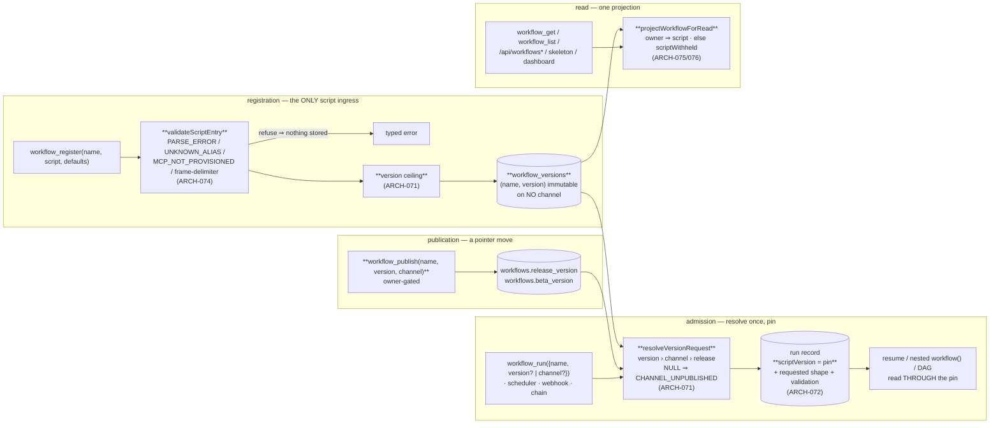

**(2) Development view** — files touched, and the fence:

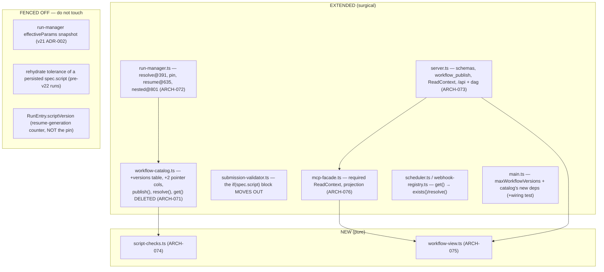

**(3) Process view** — a channelled run, and a masked read:

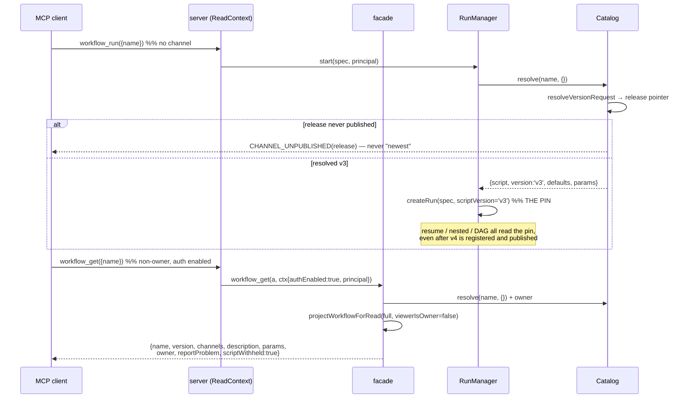

**(4) Deployment view** — **unchanged**: same single Node process, same SQLite file at `workRoot`, same
ports and routes, no new service, sidecar or background job. Two operational deltas, both documented in
DEPLOY: one config key `maxWorkflowVersions` (per-name registration ceiling), and the boot log line from
the ADR-011 migration (`catalog.migrate: N workflows → workflow_versions, release published`). The
engine stays single-node by construction; the only multi-process reality is the self-update overlap
window, which ARCH-071's transaction covers.

**(+1) Scenarios**
- *S-1 — the author ships a draft without touching one user*: `workflow_register` returns `{version:'v4'}`, on no channel; `workflow_run({name})` still runs the `release` v3; `workflow_run({name, version:'v4'})` runs the draft; `workflow_publish({name, version:'v4', channel:'beta'})` then `…{channel:'release'}` promotes it. The oracle is literal — after publishing v1 to release and registering an unpublished v2, `workflow_run({name})` **executes v1 and pins `v1`** (never "the two calls agree with each other").
- *S-2 — upgrade day*: an engine with pre-v22 rows boots; the migration copies each row to `workflow_versions` and publishes `release`; an existing cron schedule fires unchanged and its run pins the migrated version. Verified against a **real pre-v22 SQLite file**, not a fixture built by the new code.
- *S-3 — the non-owner read*: an authenticated non-owner calls `workflow_get` over real HTTP with a real bearer; the response key set equals `EXPECTED_NON_OWNER_KEYS` exactly (including `scriptWithheld`), and `/api/workflows/:name/skeleton` returns the same masked shape. Supplying `{principal:'<owner-email>'}` in the arguments does **not** unmask.
- *S-4 — inline script is gone*: `tools/list` never advertises `script` on `workflow_run`/`workflow_resume`; a hand-rolled `/mcp` body carrying `script` is refused `INLINE_SCRIPT_CLOSED` with the `register → run({name})` recipe; a run suspended before the upgrade still resumes from its persisted `spec.script`.
- *S-5 — the stale environment*: an MCP server is deprovisioned after a workflow registered cleanly; `workflow_get` reports `validation:{ok:false, errors:[{code:'MCP_NOT_PROVISIONED'}]}`, a run still starts and records the same observation, and a **re-registration** of that script is refused.

### v22 data architecture

Storage stays SQLite/`better-sqlite3` (no ADR — settled long ago; v22 adds one table and no new access
pattern). **Delta only:**

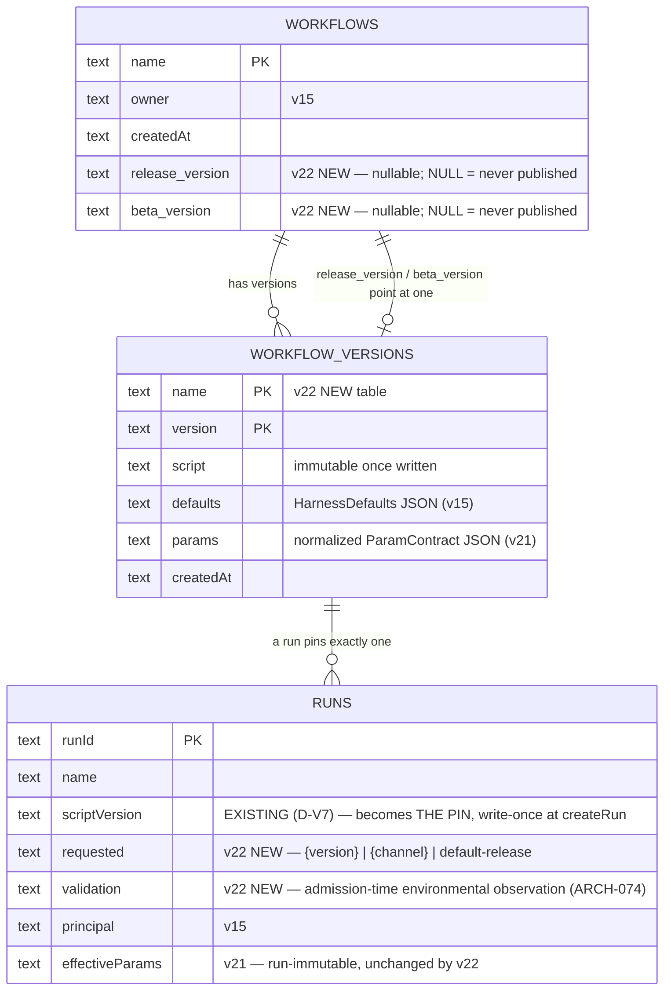

- `workflows.script`/`.version`/`.defaults`/`.params` **move** to `workflow_versions`; the per-name row
  keeps identity + pointers only. The migration is one transaction (ADR-011).
- No new index beyond the `(name, version)` primary key: `list()` is a second `SELECT name, version FROM
  workflow_versions` grouped in JS — two indexed queries at human-rate row counts on a local file. **No
  cache, no denormalized `versions` JSON blob** (a second source of truth that would drift).
- `runs.scriptVersion` is the pin and is **write-once**; `RunEntry.scriptVersion` (in-memory, `+= 1` per
  resume) is a *different field with the same name* and must never write back to it.

### v22 interface & API contracts

| surface | contract delta | errors |
|---|---|---|
| `workflow_register({name, script, defaults})` | inserts a NEW immutable `(name, version)` row, on **no** channel; runs `validateScriptEntry` + the `appendPrompt` frame-delimiter gate + the per-name version ceiling **before any write** | `PARSE_ERROR`, `UNKNOWN_ALIAS`, `MCP_NOT_PROVISIONED`, `PARAM_OUT_OF_RANGE` (delimiter), `VERSION_CEILING_EXCEEDED`, `NOT_WORKFLOW_OWNER` — **nothing stored** on any of them |
| `workflow_publish({name, version, channel})` | **NEW tool** — owner-gated pointer move; `channel ∈ {beta, release}` | `NOT_WORKFLOW_OWNER`, `UNKNOWN_VERSION`, `INVALID_CHANNEL`, `WORKFLOW_NOT_FOUND` |
| `workflow_run({name, version?, channel?, args, overrides})` | `script` **removed from the input schema**; explicit `version` › `channel` › `release` default; the resolved version is pinned on the run record with the request shape | `INLINE_SCRIPT_CLOSED` (message carries `register → run({name})`), `CHANNEL_UNPUBLISHED` (names the channel — never a silent fallback to the newest script), `UNKNOWN_VERSION`, `INVALID_CHANNEL` |
| `workflow_resume({runId})` | `script` **removed from the input schema**; a plain resume works unchanged and now re-resolves **through the pin**, not through the name; a pre-v22 run with a persisted `spec.script` still rehydrates | `INLINE_SCRIPT_CLOSED`; v21's `PARAM_SECRET_UNAVAILABLE` unchanged |
| `workflow_get({name, version?})` | no `version` ⇒ the `release` version; `+versions[]`, `+channels{release,beta}`, `+validation{ok,errors[]}`; **non-owner ⇒ `{name, version, channels, description, params, owner, reportProblem, scriptWithheld:true}`** and nothing else | `CHANNEL_UNPUBLISHED`, `UNKNOWN_VERSION`, `WORKFLOW_NOT_FOUND` |
| `workflow_list()` | `+versions[]` + `+channels{release,beta}` per workflow; entries are projections (no script, no skeleton) — no per-row script parse | — |
| `GET /api/workflows`, `/api/workflows/:name/skeleton`, `/api/runs/:id/dag`, dashboard | serve the **non-owner projection whenever auth is enabled** (pre-v22 surface when it is disabled); the DAG derives its skeleton from the run's pinned `(name, version)` instead of the empty `spec.script` | — |
| `workflow_status(runId)` | reports the **pinned** version and the request shape; unchanged after a newer version is registered or published | — |
| `schedule_create` / `chain_create` / `webhook_create` | unchanged surface (they bind a name); creation now requires the name to resolve on `release`, and each fire resolves `release` again at fire time (so a publish upgrades standing triggers — deliberate) | `WORKFLOW_NOT_FOUND`, `CHANNEL_UNPUBLISHED` at creation |
| `rwe.config.json` | `+maxWorkflowVersions` (per-name registration ceiling) — forwarded in `composeConfig()` **and** added to `tests/unit/compose-config-v2-wiring.test.ts` in the same change | `VERSION_CEILING_EXCEEDED` |

### Decision rationale — v22 (ARCH-071..076, ADR-009..014; REQ-096..100)

- **Panel provenance / no round 2.** Synthesized from `.panel/architecture/adversarial.r1.md` (security /
  scalability / testability, Karpathy tie-break) and `.panel/architecture/quality-dimensions.r1.md`
  (observability / replaceability / consumability / self-sustainability). The orchestrator pre-ran the
  panel and forbids re-spawning; **r2 would not have been triggered anyway** — the round-1 headlines are
  *complementary*: both independently land on one resolution seam, one masking projection, the pin, the
  migration publishing `release`, moving the static checks, and taking S-1 + P6-2. The four genuine
  divergences are adjudicated below. QM `safety_class` ⇒ no functional-safety / cybersecurity lenses.
- **Both altitudes judged, system dominates (both lenses agreed independently).** v22 is schema,
  identity-gated reads and where-a-validation-runs — conventional system work. The agent altitude binds
  in exactly two places and is honoured there: the masked view must still let an *MCP client agent*
  decide (hence REQ-095's report affordance and the REQ-090 contract in the non-owner allowlist), and the
  schema + error text ARE the UX (hence schema-level closure, the migration recipe in the error, and the
  drift-lock).
- **Adopted wholesale from adversarial, because it is the highest-value line in the slice: ADR-011.**
  REQ-096 says nothing about channels and REQ-097 refuses an unpublished one — composed literally, every
  pre-v22 workflow, schedule, chain and webhook starts failing at its next fire. Quality never modelled
  the composition. One line in the migration.
- **Adopted from adversarial, sharpened against primary source: ADR-010 (the pin).** Verified
  `run-manager.ts:632-636` re-resolves on resume, and — the panel missed this — the pin **already has a
  home**: `runs.scriptVersion` (D-V7, `run-store.ts:81/129/146`) is written once at `createRun` and never
  updated, so the correctness fix costs **zero schema**. The synthesis adds the name-collision warning
  (`RunEntry.scriptVersion` is an unrelated in-memory resume counter that stamps journal entries as
  `v${n}` and is re-seeded from the stored value at `:676`) because conflating the two at Gate 4/5 would
  corrupt the pin.
- **Adopted from quality, against adversarial's predicted YAGNI: REP-1's "delete `get(name)`".**
  Adversarial proposed `getVersion(name, v)` *alongside*; quality argued the surviving legacy read is how
  the wiring class recurs. Quality wins on evidence (four documented recurrences in this repo), and it is
  also the **simpler** end state — one accessor, six mechanically-converted call sites, and a compile
  error instead of a review checklist. Where I did NOT follow quality: its resolver is a new injected
  module; I fold the pure truth table into `workflow-catalog.ts` as an exported function, because a
  separate file for a function only the catalog calls is abstraction for code used once.
- **Conflict 1 — environmental re-checks (adversarial §5b registration-only vs quality SUS-3 admission
  re-check): split by disposition, both concede a half [ADR-013].** Adversarial's objection is sound
  (two enforcement sites drift, which is the exact defect REQ-099 deletes) and quality's is sound
  (alias/MCP are environmental and rot). They are only in conflict if "check" means "refuse". One module,
  two dispositions: registration refuses, admission records. Quality conceded the hard admission gate;
  adversarial conceded that a log line is not the "surfaced" seam REQ-099's last clause requires. Quality's
  `validation` field is adopted for `workflow_get` and **declined for `workflow_list`** (3s dashboard poll
  × per-row script parse) — the one place its "recompute opportunistically on read" was too broad.
- **Conflict 2 — the publish audit trail (quality OBS-2) DECLINED; quality conceded to simplicity.**
  Its own r1 offered to trade elaborate lifecycle work for a recorded decision. The diagnostic value it
  protects is largely already bought: the per-run pin plus request shape lets you read a pointer move off
  the run history, and `publish` is owner-gated so "who" is nearly determined. Replacement, for one line
  and no schema: `publish` emits a structured INFO log (`name`, `channel`, `from→to`, `principal`).
  Recorded as a residual, not a gap.
- **Conflict 3 — masking scope (adversarial D-P22-3 fail-closed vs quality "the requirement keeps
  auth-disabled unmasked"): both hold, because they address different cells [ADR-012].** The table
  satisfies quality's floor (auth off ⇒ pre-v22, byte-for-byte) and adversarial's fail-closed instinct
  (auth on + `null` principal via the D-BIND loopback exemption ⇒ masked). Adversarial asked for this to
  be escalated as a user decision; **decided here instead**, because REQ-100's literal clause is preserved
  intact and the deviation governs only a case the requirement never addresses — an intent-preserving
  fail-closed reading is an architecture call. Recorded rather than escalated.
- **Conflict 4 — `skeleton`/`phases` for non-owners: masked, adversarial's ruling adopted; quality did
  not contest it** (its REP-2 asks for a type where `script` is unrepresentable, which is the same
  instinct). REQ-100's allowlist does not contain them and the skeleton is a decompiled outline of the
  agent graph. The constructive escape hatch is author-declared `meta` fields — consented disclosure,
  never a derived leak. Accepted cost: a non-owner's dashboard DAG (and, with auth on, every dashboard
  DAG) shows live agent nodes without the predicted overlay.
- **Retention: the two lenses' recommendations were the same shape, taken in its simpler form [ADR-014].**
  Adversarial: ceiling, never GC. Quality: accepted-unbounded now, schema kept GC-ready, plus ceilings.
  Both give the same code today; the union is: ceiling now, no sweep, run→version reference queryable
  (which the pin requires anyway). CAS dedup of script bodies declined as premature (quality itself rated
  it so).
- **REQ-006's edited-script resume is superseded, and that is disclosed, not absorbed [ADR-010].** Quality
  (CON-3) proposed replacing it with `workflow_resume({runId, version})`. Declined: no v22 requirement asks
  for it, and it collides with v21's run-immutable `effectiveParams` (ADR-002) — a re-pointed run would
  either run v5's script under v3's params or re-merge and break run-immutability. No test pins the clause
  (every suite calls `resume(runId)` bare), so nothing breaks; the sanctioned loop is register-draft →
  run-by-version, which is two calls because `workflow_register` already returns the assigned version.
  Surfaced to the owner as an informational confirmation, not a gate blocker.
- **Two panel claims corrected against primary source.** (i) Adversarial's `PRIMARY KEY (name, version)`
  race framing is right about the *cross-process* case only, and the sync-`better-sqlite3` reasoning is
  restated in ARCH-071 so Gate 4 does not build in-process locking. (ii) The pin needs **no new column** —
  both lenses assumed one; `runs.scriptVersion` already exists and is write-once, and the `RunEntry`
  same-name counter is the trap that assumption would have walked into.
- **Consciously declined (Karpathy scope guard), each with the lens that asked:** a `channels` table
  (quality replaceability instinct / adversarial §5d — REQ-097 closed the enum and barred per-user state);
  a publish audit table (quality OBS-2); a version-GC sweep (quality SUS-1 option b); CAS dedup of scripts
  (quality's own "premature"); a `workflow_resume({runId, version})` re-point (quality CON-3); persisting
  the resolved script into `RunSpec` (adversarial's named trap); any lock table / advisory lock /
  version-allocation service (adversarial §3.3); deleting the `_adhoc` defaults (adversarial §2.6 — three
  workspace-rooting sites re-proved for zero user-visible gain); browser-session identity for the
  dashboard (both lenses — a subsystem REQ-100 does not ask for); author-chosen version strings (quality
  CON-5 — engine-assigned `v<n>` stays); a schedule `lastError` column for SUS-5 (closed instead at the
  front door: `Scheduler.create` requires the name to resolve on `release`).
- **Karpathy check.** 6 ARCH for 5 REQ, split strictly along module boundaries (two small pure files, four
  surgical extensions). Complexity budget is spent only where the requirements force it: ARCH-071 (the one
  genuine schema change) and ARCH-072 (the resolution/pin invariants). ARCH-073 is schema edits plus a
  threaded parameter, ARCH-074 is code *moved*, not written, ARCH-075 is one pure function, ARCH-076 is a
  required argument. The dominant risks are all **silent-failure** risks — a masked implementation that is
  never wired, a run path still reading "newest", a leak through a second endpoint, a migration that
  breaks every standing trigger, validation deleted along with inline script — and the architecture makes
  each impossible-by-construction (required `ReadContext` ⇒ `tsc` error; `get(name)` deleted ⇒ `tsc`
  error; allowlist projection ⇒ new fields fail closed; migration publishes `release`; zero
  `if (spec.script)` branches left) rather than adding machinery to detect them afterwards.
- **Accepted residuals (record, do not architect):** an unsettled nested `workflow()` call re-resolves
  `release` on resume (ARCH-072; ARCH-044's eager-journal pattern is the named future closure); no publish
  audit trail beyond a log line; on an auth-enabled deployment the owner cannot read their own script or
  see the predicted DAG overlay in the dashboard; a run can still fail mid-flight on an environment that
  went stale after registration (ADR-013); `deregister` leaves pins pointing at removed versions
  (ADR-014); disk growth is bounded by a ceiling, never reclaimed.

---

## v23 slice — the explain surface, the agent-drawn diagram, retiring the skeleton (REQ-101..106): ARCH-077..086 + ADR-015..022

**Slice shape (Karpathy check up front).** Three new small files (`src/trigger-bindings.ts`,
`src/graph-analyzer.ts`, `src/diagram-gate.ts`), one new table on an existing module
(`workflow_diagrams`, inside `workflow-catalog.ts`), one new projection function in the existing
`workflow-view.ts`, **two** new MCP tools (`workflow_describe` — REQ-101 has no other surface; and
`workflow_regenerate_diagram` — the one recovery action ADR-017 admits), one route swapped for another
(`/api/workflows/:name/describe` replaces `/skeleton`), one config block, one doc. **Zero new services,
zero new daemons, zero caches, zero retry schedulers, zero new trust tiers, no second render path, no
intermediate structured representation, no analyzer transcript store.** Ten ARCH items ≠ ten
components: it is ten *modules touched*, six of them surgical edits of existing files, and the
`module:`/`deps:` contract requires one item per module root.

The slice is one structural idea plus one deletion. The idea: **v23 is the first iteration in which the
engine itself is an LLM consumer for an internal control surface** — it calls a model on
attacker-influenced input (an author's script) and publishes the model's output to *other* principals
as engine-authored fact. That inverts the trust direction the rest of the codebase is built on, and it
is why the gate (ARCH-080), not the system prompt, is the control. The deletion: the regex skeleton
leaves every user-facing surface while `parseWorkflowSkeleton` stays as an internal function with a
*second* internal consumer (it computes the gate's allowlist), which is exactly the boundary call the
orchestrator recorded at Gate 1.

### ARCH-077 — `workflow_diagrams`: a derived, mutable, per-`(name, version)` diagram row inside the catalog's own database and transaction
- **status:** draft
- **traces:** REQ-102, REQ-101
- **module:** src/workflow-catalog.ts
- **deps:** ARCH-007, ARCH-071
- **api:** `workflow_diagrams(name TEXT, version TEXT, status TEXT NOT NULL, diagram TEXT NULL, note_code TEXT NULL, generated_at TEXT NULL, bindings_fp TEXT NULL, PRIMARY KEY(name, version))` created with the file's established `CREATE TABLE IF NOT EXISTS` idiom (`workflow-catalog.ts:144/177`); accessors on `WorkflowCatalog`: `putDiagramPending(name, version)`, `putDiagramResult(name, version, {status, diagram?, noteCode?, generatedAt, bindingsFp})`, `getDiagram(name, version) → DiagramRow | null`, `listPendingDiagrams() → {name, version}[]` (boot sweep); `deregister()` deletes this name's diagram rows **inside its existing `db.transaction()`** (`workflow-catalog.ts:488-490`) — **[AMENDED v23 Gate 2 re-run (send-back `d294880`) — A8/QD-O3: the `maxWorkflowVersions` prune does not exist and never did.** `maxWorkflowVersions` **refuses the registration** (`VERSION_CEILING_EXCEEDED`, `workflow-catalog.ts:441-445`); nothing is pruned, so `deregister()` is the **single** deletion path and the derived-store invariant rests on that one path, not on two. DES-130 struck the prune clause at Gate 4 and this row was not amended — the omission this send-back exists to stop.**]**
- **note:** **The diagram is derived data and must not live on the immutable version row** [ADR-021]: `workflow_versions` is append-only by ADR-009 and a diagram is written *after* registration, rewritten by `workflow_regenerate_diagram` (ADR-017) and deleted when its workflow is deregistered — three mutations an immutable row cannot express. **Folded into `workflow-catalog.ts` rather than a separate `DiagramStore` file** (both panel proposals named a standalone component): the load-bearing invariant is *a derived store must never outlive its source*, and the only structural way to guarantee that is to delete the diagram row in the **same `better-sqlite3` transaction** as the version row — which requires the same `Database` handle, i.e. the same module. A separate file would either share the handle (a component in name only) or open a second connection (two write paths into one file, and the cleanup becomes a discipline instead of an invariant). Same disposition and same reason as v22 folding `resolveVersionRequest` into this file. **Load-bearing invariants:** (1) **the PK is `(name, version)`**, so REQ-102's "the diagram is stored against the exact `(name, version)` it was derived from and never served against a different version" is a schema property, not a code discipline — there is no shape in which a `v3` read returns a `v4` diagram. (2) **`status` is the closed three-value enum `pending | ready | unavailable`**, written out in full and asserted literally (see ADR-017 for the naming). (3) **`note_code` is engine-authored** and always one of the fixed `DiagramNoteCode` values; the column never holds model or provider text (ADR-016). (4) **`diagram` is NULL unless `status='ready'`** — honest absence is representable, and "a row with a status of unavailable but a diagram present" is unrepresentable rather than merely unexpected. (5) **`bindings_fp` is stored, `inputs_fp` deliberately is NOT** [ADR-018] — there is no cache, so nothing is keyed on the script or the analyzer config; `bindings_fp` exists for exactly one job, REQ-103's staleness compare. (6) **No `analyzer_model` column**: the per-run journal line (ARCH-079) carries the model, and REQ-104's real-run acceptance reads the *diagram*, not the row. (7) Deletion rides the existing transactions — no sweep, no GC, no orphan-reaper. **[AMENDED v23 Gate 2 re-run (`d294880`) — A8/QD-O3, both panels agreed on fact and text:** this note previously read "deleted when its version is pruned" (opening sentence, now corrected in place to "deregistered") and inv 7's transactions were plural; **there is no prune.** The ceiling refuses the *registration*, so diagram rows are **bounded** (per name, by `maxWorkflowVersions`) rather than pruned, and `deregister()` is the single deletion path. The invariant is unweakened — a derived row still cannot outlive its source — but it now rests on one transaction instead of two, which is *stronger*. No code change; this is the row catching up with DES-130.**]**
- **iter:** v23

### ARCH-078 — `getTriggerBindings(name)`: one projected cross-store snapshot, two call sites, one fingerprint
- **status:** draft
- **traces:** REQ-103, REQ-102
- **module:** src/trigger-bindings.ts
- **deps:** ARCH-006, ARCH-010, ARCH-031, ARCH-033
- **api:** `getTriggerBindings(name, ports) → {bindings: TriggerBinding[], bindingsFp: string}` where `ports = {schedules, webhooks, continuations, runs}` (injected readers, no direct DB access) and `TriggerBinding = {kind:'cron', cron: string, tz?: string, enabled: boolean} | {kind:'webhook', enabled: boolean} | {kind:'chain', upstreamWorkflow: string | null}`; `bindingsFp = sha256(JSON of the normalized, deterministically-ordered bindings array)`. Called from exactly two places: `GraphAnalyzer` (generation-time input, ARCH-079) and `projectWorkflowDescribe` (describe-time **live** field, ARCH-081).
- **note:** **One function, two call sites, is the whole design** — it is what makes REQ-103's "a stale diagram never silently contradicts the live bindings" checkable: the same normalization feeds the analyzer and the served field, so a mismatch of `bindingsFp` is a real staleness signal rather than a formatting artifact. **Three primary-source corrections both panel proposals needed** (verified in code, stated here so Gate 3/4 does not build the wrong thing): (i) **the three trigger stores are three separate SQLite FILES** — `schedules.db`, `webhooks.db`, `continuations.db` (`server.ts:1331/1334/1392`), none of them the catalog's — so this is a composition of three store APIs, **not** "a single batched read" as adversarial R9 assumed; (ii) **continuations are keyed by `afterRunId`, not by an upstream workflow name** (`continuation-store.ts:75-86`): the `workflow` column is the *downstream* target, so naming the upstream for the diagram's entry node costs a join through `RunStore.getRun(afterRunId)` and yields `null` when that run has been purged — the projection carries `upstreamWorkflow: string | null` and the diagram renders the null case as an unnamed chain, never as an invented name; (iii) **chain bindings are transient** — a continuation row lives only while `status='pending'` and is consumed on fire/skip, so unlike cron and webhook bindings a chain binding is a *momentary* fact; the describe response therefore always serves the live snapshot, which is the only correct rendering. **Security invariant, missed by both panels and non-negotiable:** the `webhooks` table stores a live HMAC `secret` column (`webhook-registry.ts:76-82`), and this snapshot is fed into an **LLM prompt**. The projection therefore **constructs** each binding from an explicit field list — it never returns rows, never carries `secret`, and never carries the webhook `id`. The gate (ARCH-080) would stop a secret reaching the *diagram*; nothing would stop it reaching the *provider*, so the closure has to be here, at the read. The webhook id is additionally not in the projection because no requirement asks for it: REQ-103 needs the trigger **kind** (plus the chain's upstream), and not building a masking mechanism beats building one.
- **iter:** v23

### ARCH-079 — `GraphAnalyzer`: an async, single-flight, transcript-less internal LLM call on a dedicated gateway path
- **status:** draft
- **traces:** REQ-102, REQ-104, REQ-103
- **module:** src/graph-analyzer.ts
- **deps:** ARCH-005, ARCH-035, ARCH-069, ARCH-077, ARCH-078, ARCH-080
- **api:** `class GraphAnalyzer({gateway: GatewayClient, catalog, triggerBindings, clock, config: GraphAnalyzerConfig, schedule?})`; `enqueue(name, version, script)` → returns immediately after writing the `pending` row (registration **never** awaits it); `sweepAtBoot()` → for every `pending` row, one requeue, then `unavailable/RETRIES_EXHAUSTED`; `regenerate(name, version)` → the same job path, run once, used by ARCH-082's owner-gated tool. `GraphAnalyzerConfig` — every harness value read from config, **none hard-coded in engine source** (REQ-104). **[AMENDED v23 Gate 2 RE-RUN #2 (send-back `41e6382`) — CONS-1 (this row is its second home) and R-4/P11.** *(a)* This row re-typed **six** of the config's keys; the shipped type declares **nine**. The fix is to name the **declaration** and let any key list be non-normative, so the tenth key cannot drift it again: `GraphAnalyzerConfig` is declared once at `graph-analyzer.ts:75-85` (today `enabled, model, systemPrompt, tools, timeoutMs, retries, maxBytes, maxLines, maxQueueDepth` — the last three ratified by DES-134 for a REQ-104 reason). *(b)* **`enqueue()` is TOTAL at its own front door**: it never throws at its caller. `server.ts:957` calls it synchronously **after** `facade.workflow_register` has committed, and `enqueue` does `getDiagram` + `putDiagramPending` (and, on a settle path, `getTriggerBindings` + a durable write) — a throw there turns a **committed** registration into a failed tool response, after which the caller retries into `VERSION_CEILING_EXCEEDED` or a duplicate version and the engine has lied about what it did. One `try` inside `enqueue` (settle, or journal `cause:'settle_failed'` per inv 2 floor 2b, then return) covers `server.ts:957`, the facade's regenerate path and every future caller; the reviewer's `try/catch` at the one call site covers one call site — the same choke-point argument as inv 11, applied consistently. *(Referee call: adversarial proposed the front-door form, quality supported the call-site catch and marked it "owner's call"; the front door wins on caller-count, at identical cost.)* Still **LOW** — `better-sqlite3` is single-process-synchronous and inv 10 rules contention out of scope — so this is a Gate 6 opportunistic item, not a blocker.**]**
- **note:** **A dedicated `GatewayClient.invoke()` path, never `AgentExecutor`** [ADR-016] — both panels reached this line independently, from opposite lenses, which is the best evidence available that it is in the right place. Security: `AgentExecutor` is what writes transcript events, so bypassing it means **there is no analyzer transcript to mask**, and REQ-100's "cannot be side-stepped by asking a different endpoint" cannot be re-opened through `workflow_agent_log` or the dashboard drill-down by a surface v22 could not have known about. Product: analyzer invocations would otherwise land in run listings, consume REQ-054 `maxConcurrentRuns` admission slots meant for user work, and corrupt REQ-075's per-workflow success-rate and average-execution-time cards. Verified against primary source: the gateway clients themselves persist nothing (they set `x-run-id`/`x-agent-id` correlation headers only, `gateway/client.ts:157/302`), so isolation is achieved by *what we do not pass* — a synthetic `runId`/`agentId`, **no `workspace`, no `onEvent`, no `onHarness`, no `SecretValueProvider`**, and an explicit scratch `cwd` that is not CLAUDE.md/MEMORY.md-reachable (this repo's recorded workroot-guard leak class; `ClaudeAgentSdkGatewayClient` re-scopes `cwd` and materializes assets per call, `claude-agent-sdk-client.ts:57/161`, so leaving `cwd` unset is not safe by default). **[NEW RULE — v23 Gate 2 RE-RUN #2 (send-back `41e6382`), adversarial §2.5, unopposed: an implementation that deviates from an amended invariant must amend that invariant IN THE SAME COMMIT.** Eight of round 1's ten amendments were verified closed in code; the two that failed (inv 2, inv 11) failed the same way — each described a **property**, and Gate 6 shipped the narrowest instance that satisfies the sentence's most convenient clause, with nothing anywhere recording the downgrade. A property enforced at N call sites is not a property, it is N chances to be right; and a doc that disagrees with the code is a defect **independently of which one is better** (inv 11's shipped shape has no live hole and was still a send-back item, solely because nothing recorded taking the pre-authorized fallback). This rule lives in the invariant it governs rather than in a retro, because a retro is not a gate input.**]** **Load-bearing invariants:** (1) **Async, settled by requirement text, not an open trade-off** — REQ-102 says registration "never blocks on the analyzer"; synchronous generation would additionally make registration latency a function of provider health and let a slow provider hold an admission path open. (2) **Single-flight, `concurrency: 1`, with a bounded queue depth** — an internal LLM caller with no bound of its own is the scar this engine already carries (D-G8-4); when the queue is full the job is not run and the row settles `unavailable/QUEUE_FULL`, which is honest absence working as designed, not an error. **[AMENDED v23 Gate 2 re-run (`d294880`) — A3/N-1, and this text corrects what BOTH panels wrote in round 1:** a bound is a bound only if the claim and the slot are released on **every** exit path of the unit that took them. The claim (`_pendingKeys.add`, `graph-analyzer.ts:209`) and the slot (`_runningCount++`, `:217`) are taken in **`_startJob`**, and the scheduled closure `await`s `scriptPromise` at `:211` **before** `_runJob` is entered — so a `try/catch/finally` placed *inside* `_runJob` (adversarial r1 P3 and QD-S2 both prescribed exactly that) **never runs** on the one reachable throw and the slot leaks permanently. The invariant is therefore: **the `try { … } catch { settle + journal } finally { release + drain }` wraps the scheduled closure**, so the closure never rejects and every scheduler — production `setImmediate` (`:127`), the tests' `runInline`, any future one — inherits termination by construction; the `.catch()` at the `setImmediate` site is belt-and-braces, never the mechanism, because `schedule` is an injectable seam (inv 8) and an invariant enforced only in the default seam is one the tests never exercise. **And `QUEUE_FULL`'s honesty is conditional on this release** [QD-O5, jointly held]: a wedged slot reports itself with the same string, so a lost release is indistinguishable from correct operation at the surface. Reachable RED oracle for Gate 5 (needs no new seam): seed an orphan `pending` row — `putDiagramPending` has no version-existence guard, so an `enqueue` racing a `deregister` re-creates one after `workflow-catalog.ts:488-490` commits — boot-sweep it, and assert (a) no unhandled rejection, (b) the row settles, (c) **the next enqueued job still runs**. (c) is what fails today and what a `_runJob`-local `finally` would still fail; `sweepAtBoot`'s requeue promise at `:177` has no `.catch()` while the analogous `regenerate` promise at `:156-160` does. Owning gates: 5 then 6.**]** **[AMENDED v23 Gate 2 RE-RUN #2 (send-back `41e6382`) — R-1 (HIGH): inv 2 above is RE-ASSERTED VERBATIM (the text is right; the code is wrong), plus two testable floors the ordered shape itself still lacked, plus the oracles.** Re-verified this pass at `graph-analyzer.ts:255-264`: the `try` wraps the `await scriptPromise` **only**, `_runJob` sits outside it, the `catch` releases without settling or journalling, and `:127`'s `.catch()` backstop was not added either — **nothing of A3/N-1 shipped**, and both panels re-assert the amended shape without softening a word. **Blast radius, stated precisely and without the overclaim both panels withdrew once:** `grep -rn "unhandledRejection" src/` is still empty and this project pins Node 22.6+, whose default is to terminate the process; the reachable throw sites (`getTriggerBindings`, `putDiagramResult` ×3) sit inside a closure scheduled from `sweepAtBoot()` (`server.ts:1507`), so **one orphan `pending` row can take the engine down at boot** — bounded to **one** crash (not a restart loop under `Restart=on-failure`) by **inv 9 alone**, since the sweep stamps before it schedules and the next boot takes the zero-model-call branch. inv 9 is therefore load-bearing for inv 2's severity, and a future "simplification" of the sweep's stamp ordering silently converts a crash into a loop. **FLOOR 2a — the release is idempotent per key (V-E; filed by adversarial, unopposed; oracle O4).** `_release(key)` returns without effect unless the key is still claimed (`_pendingKeys.has(key)`) — the claim is the authoritative record that this unit still owns a slot. The `finally` is then the **only** release site and `_runJob`'s tail release (`:388`) is **deleted**. Pinned as floors, not review notes: **`_runningCount` is never negative** and **never exceeds 1**, at every observable point, including after a job that both throws and completes a settle. Why this is an invariant and not a review comment: admission is `if (this._runningCount >= 1)` (`:265`), so a double release — adding the `finally` **without** deleting the tail release, the single most likely partial implementation and this iteration's demonstrated failure mode — drives the count to `-1` and silently converts concurrency-1 into **unbounded** parallel `gateway.invoke()`. Note the asymmetry that earns the floor: the leak direction fails **closed** and reports `QUEUE_FULL`, while the double-release direction fails **open** (cost amplification, provider rate-limit exhaustion) and makes every existing test *greener* — no suite can distinguish it from a performance win. **FLOOR 2b — the catch body is total (V-F; filed by adversarial, unopposed; realized INSIDE inv 5's `_settle` seam; oracles O1/O2).** `_settleUnavailable` performs the same three store/port calls that are the reachable throw sites, so the ordered `catch { settle + journal }` calls, in its recovery path, the code whose failure it is recovering from — and if it throws, the closure still rejects and inv 2's headline claim ("the closure never rejects") is still false. Therefore: the terminal row write is `try`-wrapped **inside `_settle`**, so inv 5's "one caller of `putDiagramResult`, one caller of `_journal`" survives the failure path; when the write fails, the journal line is still emitted (`outcome:'unavailable'`, `cause:'settle_failed'`) and the `finally` still releases. The row is then left `pending` **on purpose** — precisely the state ADR-017's boot sweep already resolves — so "we could not settle" is a *recorded* state instead of an unhandled rejection. **No new recovery path is built**; `_journal` is a `console.log` of engine-classified fields and cannot throw, which is what makes this ordering safe — that property is now load-bearing and is written here so an edit that gives the emitter I/O has to come back to this sentence. **Gate 5 owes FIVE oracles that are RED against `41e6382`**, all reachable through seams that already exist (inv 8's `schedule`; constructor-injected `ports`/`catalog`) — **no new seam is proposed**: **O1** — injected `ports.getTriggerBindings` throws on a job that reaches `_runJob`: assert (a) zero unhandled rejections, (b) the row settles `unavailable`, (c) exactly one journal line, (d) the next enqueued job runs, (e) `_runningCount === 0`. **O2** — injected `catalog.putDiagramResult` throws on the **`ready`** branch: the same five (this is inv 8's V-C case, named as debt in UT-128's docblock `:497-501` and never picked up). **O3** — UT-125 (`tests/unit/graph-analyzer.test.ts:703-743`) regains its **dropped assertion (b)**: the orphan `ga-orphan@v1` row **settles** rather than staying `pending` (its docblock calls the `scriptPromise` rejection "the one reachable throw", which the four throw sites in `_runJob` falsify). **O4** — slot-accounting floor over a mixed burst (one throwing job, then `maxQueueDepth + 3` valid ones): `_runningCount` never `< 0` and never `> 1` at any settle, and concurrent `gateway.invoke` calls never exceed 1; this is the oracle that makes FLOOR 2a falsifiable **before** Gate 6 writes the `finally`. **O5** — see inv 5. The reviewer ran `graph-analyzer.test.ts` → 33/33 green **with the defect present**, and the full suite → 1837 green: an invariant shipped without a red-today oracle is a wish, which is why these five are listed here with an owning gate rather than left to Gate 5's judgement. Owning gates: 5 then 6.**]** (3) **Own `timeoutMs`/`retries` from config**, the only retry mechanism in the design (ADR-017 declines a second, backoff-based one). (4) **Everything the model authored passes ARCH-080's gate; everything else is engine-authored, on every channel** — the diagram goes through `gateDiagram`, the user-visible note is rendered from the fixed `noteCode` enum, and **the journal line carries an engine-classified error class and token counts, never raw provider or model text** (a provider error payload can echo the request, and the request contains the masked script — closing the diagram channel while leaving the log channel open would be decorative). **[AMENDED v23 Gate 2 re-run (`d294880`) — A8: the words "plus the provider HTTP status" are STRUCK.** DES-129 struck that clause at Gate 4, stating outright that "02-architecture.md is **not** edited" (`04-design.md:4235`), and the shipped line indeed carries no provider status (`graph-analyzer.ts:287-296`). The *security* half of the invariant — never raw provider or model text — is unchanged and re-verified; only the field that was never built is removed. The identical strike is applied to ADR-016, the interface table's journal row, and the process-view mermaid note, because a clause struck in one of four places is the defect class this send-back is repairing.**]** (5) **One journal line per analyzer run**, field list pinned here so it cannot silently grow a transcript field later: `{name, version, principal, model, promptTokens, completionTokens, durationMs, outcome, noteCode}` — this is simultaneously the cost attribution both panels asked for (S-1, below) and the effective-config observability seam (an operator who edits `graphAnalyzer.model` and re-registers sees the new model on the very next line, or sees the *old* one, which is the wiring-gap signature). No separate config-readback surface is built. **[AMENDED v23 Gate 2 re-run (`d294880`) — QD r2 §1.1, adopted over adversarial r2 §5.4 (see Decision rationale, referee call R-1). Inv 5 is now "one line per SETTLE", not "per run", and the emitter moves to the settle choke point.** Verified this round: `grep -n "console.log" src/graph-analyzer.ts` returns **exactly one hit, `:288`, inside `_attempt`** — so a line is emitted only when a model call was actually attempted, while `_settleUnavailable` (`:194-201`) writes a terminal store row and logs **nothing**. Three of the eight persisted note codes are therefore written with **no operator-visible signal anywhere**: `MODEL_UNMAPPED` (`:136`), `QUEUE_FULL` (`:140`), and the boot-sweep zero-call settle (`:180-188`) — and the new `enabled:false` guard (inv 11) would silently become a fourth. `MODEL_UNMAPPED` is the damning one: it is this repo's `composeConfig` forwarding-gap signature (v11 `updateFlagPath`, v15 `auth`, v16 `workspaceTtlMs`) settling per workflow, forever, invisibly — which is the exact class inv 5 exists to make loud. **Amended invariant:** exactly one journal line is emitted per **settle**, on every path that writes a terminal `workflow_diagrams` row — model-call settles, `MODEL_UNMAPPED`, `QUEUE_FULL`, the `enabled:false` guard, the boot-sweep settle, and the exceptional exit of inv 2's closure. The emitter lives at the **settle choke point, not inside `_attempt`**; fields only a model call can supply (`promptTokens`, `completionTokens`, `durationMs`, `gateFail`) are `null` on the paths that made no call. **True field list, corrected in the same breath** (it was already stale): `{name, version, principal, model, promptTokens, completionTokens, durationMs, outcome, noteCode, gateFail, cause}` — `gateFail` is the tenth field DES-129 ratified and shipped (`graph-analyzer.ts:295`) and this row never recorded it; `cause` is the eleventh, an engine-classified string that carries the *distinct* reason on paths where the persisted `noteCode` is overloaded. **No store migration**: the persisted `note_code` `CHECK` (`workflow-catalog.ts:240-241`) stays at eight values and the distinct cause rides the journal field — DES-129's `gateFail` is the direct precedent. **Named debt, not smuggled:** `RETRIES_EXHAUSTED` becomes an overloaded "the engine gave up" code (inv 11 settles it with zero attempts made); un-overloading it costs a ninth persisted code plus a `CHECK` migration on a shipped store, which is scheduled rather than paid here. The same structural argument that moves the `enabled` guard to a choke point (a rule enforced at callers is not a rule) moves the emitter to one; adopting both puts the control and its observation at the two choke points of one state machine. Owning gates: 5 then 6.**]** **[AMENDED v23 Gate 2 RE-RUN #2 (send-back `41e6382`) — R-2 + R-2b: the SETTLE scope is HELD, the emitter becomes STRUCTURAL, and `cause` becomes a CLOSED UNION.** Re-verified: `_journal` is still called from `_settleUnavailable:212` **and `_attempt:339`**; terminal rows are written at **four** sites (`:206`, `:376` ready, `:378-383` B5 restore, `:385` unavailable); `_journal`'s key literal (`:223-233`) carries **ten** keys and `cause` exists nowhere in `src/`. **The scope is not re-litigated** — quality's "one line per settle" won referee call R-1 one round ago and quality is now holding its own ruling *against* the shipped code; re-opening an adjudicated call because the implementation went the other way is exactly the ratchet this send-back exists to stop. The substantive reason it stays: a **settle** is what an operator counts (one diagram, one outcome, one cost), an **attempt** is an implementation detail of the retry policy, and a log whose line count varies with a config knob (`retries`, a REQ-104 operator knob) cannot be summed into "how many diagrams settled unavailable this week" without knowing that knob's history. **(a) One settle seam.** One private `_settle(name, version, row, telemetry)` is the **only** caller of `catalog.putDiagramResult(...)` and the **only** caller of `_journal(...)`, in that order; `_attempt` **returns** its telemetry inside the existing `AttemptOutcome` union and emits nothing. Every terminal path goes through it: the zero-model-call settle, `_runJob`'s three branches, and inv 2's catch. Two properties then hold **by construction** rather than by care: exactly one line per settle (one place writes a terminal row), and the line's `outcome` is computed from the very row being written — which is what closes the **B5 mismatch** (`:378-383` writes `status:'ready'` while the only emitted line says `outcome:'unavailable'`; the store and the log contradict each other about one event, a defect under either reading of inv 5, and `diagramStale` is exactly the field a human checks next). **(b) Twelve fields, wire order pinned.** The existing ten keep their order (`_journal`'s own docblock: *"the key order below IS the line's wire format; keep it"* — inserting mid-list breaks every operator's `jq`/`cut`), and the two new fields append **after** them: `{name, version, principal, model, promptTokens, completionTokens, durationMs, outcome, noteCode, gateFail, attempts, cause}`. Gate 5 pins it with `expect(Object.keys(JSON.parse(line)).sort()).toEqual([…].sort())` — **set equality, never `toContain`**: a one-sided check lets a thirteenth field grow silently, the same A6 ruling one file away. **(c) Aggregation across a retry loop, so moving the emitter loses nothing:** `promptTokens`/`completionTokens` are **summed** and `durationMs` is the **total** wall clock across the settle's attempts (a per-settle line carrying one attempt's tokens under-reports S-1's cost *by design*); `gateFail` and `noteCode` come from the last attempt; **`attempts: number`** is the twelfth field and carries the only information the move destroys. *(Referee: adversarial proposed the field, quality proposed encoding the count inside `cause` and pre-conceded on machine-parseability — the field wins, because it is what keeps `cause` a closed set.)* **(d) `cause` is a CLOSED UNION of engine-authored literals, never `string`** — declared once beside `GateFailReason`: `'disabled' | 'model_unmapped' | 'queue_full' | 'boot_abandoned' | 'script_unresolved' | 'job_exception' | 'provider_terminal' | 'provider_timeout' | 'gate_refused' | 'prior_restored' | 'settle_failed'`, or `null` on a plain success. This is the security half neither panel's first draft stated: ADR-016's "engine-classified class, never raw provider or model text" is today held only by a `catch` that discards the error object (`:318`); a field typed `string` re-opens that channel — a provider error payload can echo the request, and the request carries REQ-100's masked script — with a one-line diff and no security thought, while a union makes the leak a **compile error**. Cost: one type alias. **Value domain, so Gate 5 asserts VALUES and not presence** (the `RETRIES_EXHAUSTED` overload was accepted *on the condition* that the distinct cause rides this field; `cause:null` on those paths would satisfy an `Object.keys` assertion and leave the overload exactly as opaque as before): `enabled:false` guard → `RETRIES_EXHAUSTED` / `'disabled'`; boot sweep abandoned by a dead process → `RETRIES_EXHAUSTED` / `'boot_abandoned'`; unmapped alias → `MODEL_UNMAPPED` / `'model_unmapped'`; queue full → `QUEUE_FULL` / `'queue_full'`; the closure's `scriptPromise` rejection (the `enqueue`-races-`deregister` orphan case — designed and benign, distinguished by `instanceof CatalogNotFoundError`, `errors.ts:38`) → `RETRIES_EXHAUSTED` / `'script_unresolved'`; any other throw inside the closure → `RETRIES_EXHAUSTED` / `'job_exception'`; provider terminal or timeout after retries → the existing `noteCode` / `'provider_terminal' | 'provider_timeout'`; gate rejection → the existing `noteCode` / `'gate_refused'` (**which** gate failure is already the `gateFail` field, so no interpolation); a failed settle → `'settle_failed'`, **no row written**; plain success → `outcome:'ready'`, `noteCode:null`, `cause:null`. **(e) The B5 restore line, pinned so a third convenient reading is not expressible:** `outcome:'ready'` (the row it actually wrote), `noteCode:null` (preserving the shipped `ready ⇒ noteCode null` convention that `workflow-view.ts`'s note precedence relies on), `gateFail` from the last attempt (a model-call fact, `null` when no call was made), and `cause:'prior_restored'` — so the line reads "this settle left a good diagram in place, and here is why a new one was not drawn". **Named debt, not smuggled:** the flat literal does not carry *which* provider failure preceded the restore; `attempts` and `gateFail` carry the rest. Quality's interpolated form (`prior_restored:<lastNoteCode>`) is **declined** because it re-opens `cause` to composition, which is the one property (d) exists to buy — if the residual proves operationally needed, a future iteration adds another **literal**, never a template. **(f) Oracle O5 — the one to keep if only one could be kept:** for every path that **writes** a terminal row (all five, including the B5 restore), assert the journal line's `outcome` **equals** the status of the row read back from the catalog. It is a *relational* oracle — it compares two things the code produces rather than asserting a literal — so it cannot be satisfied by editing an expected value to match shipped behaviour, which is this iteration's documented test-drift failure (v22's `val-107`; IT-080 built on the vulnerability it should have caught). **`settle_failed` is explicitly OUT of O5's scope** and takes its own case (no row is written, the row stays `pending`, exactly one line with `cause:'settle_failed'`) — stated here because an unscoped O5 would either be weakened by Gate 5 or file a false defect. Owning gates: 5 then 6.**]** (6) **The allowlist is computed here and passed to the gate**: `parseWorkflowSkeleton(script)` (phase names, agent count/order, child `workflow()` names) ∪ resolved model aliases ∪ the trigger kinds and upstream name from ARCH-078 ∪ `DIAGRAM_CODEPOINTS`. This is `parseWorkflowSkeleton`'s **second internal consumer** and the concrete reason REQ-105 retires the surface rather than the function. **[AMENDED v23 Gate 2 re-run (`d294880`) — A7 / adversarial P6 ≡ QD-O1, escalated LOW→MED by both panels (quality conceded the escalation to its own earlier filing). This is not ordinary doc drift: ADR-015's whole security claim — "every token the diagram may contain is already served on a masked surface today" — is AUDITED against this membership list, so an un-amended list is an unaudited claim.** True membership, verified in code: `parseWorkflowSkeleton(script)` ∪ resolved model aliases ∪ ARCH-078's trigger kinds/upstream name ∪ **`meta.phases[].title`** (`graph-analyzer.ts:231`) ∪ **`'default'`** (`:233`) ∪ **`'model:param'`** (`:234`) ∪ **`UNBOUND_ENTRY_LABEL`** (`:241`). **`DIAGRAM_CODEPOINTS` is REMOVED from this list** — it was never a label member; it is a separate codepoint pass inside `gateDiagram` (ARCH-080), and listing it here mis-stated what the allowlist even is. **The re-audit was performed and its result is recorded per member, which is the point of the amendment**: `meta.phases[].title` is already served to non-owners today (`WorkflowPublicView.phases`, `workflow-view.ts:46`, owner adjudication #1 一律公開), and `'default'` / `'model:param'` / `UNBOUND_ENTRY_LABEL` are **engine-authored constants**, not author-controlled, so none of them can carry script-derived text. **ADR-015's claim survives unchanged. New rule, the only new rule in this amendment:** ADR-015's claim is re-audited whenever this list changes, and **adding an author-controlled member requires that member to be independently non-owner-visible** — so the next widening cannot be a one-line diff with no security thought. Doc-only; no code change.**]** (7) **`tools` defaults to `[]`** [ADR-020]. (8) **A `schedule` seam** (default: `setImmediate`) so tests run the job inline and deterministically instead of racing an async worker — an async-by-default job with no run-now seam produces flaky tests, and flaky tests get deleted. **[AMENDED v23 Gate 2 re-run (`d294880`) — V-C, filed by adversarial and adopted verbatim by quality as "this lens stated in their vocabulary":** a seam added for happy-path determinism **must also admit the failure the invariant claims to survive**, or the invariant is prose. `schedule` makes the job run inline; nothing makes `getTriggerBindings` or `putDiagramResult` throw, which is precisely *why* A3 shipped untested despite inv 2 asserting a bound. Cost is zero — `ports` and `catalog` are already injected. First concrete instance is inv 2's RED oracle above; it is also what makes amended inv 5 falsifiable (a throwing `putDiagramResult` must still produce exactly one journal line).**]** **[AMENDED v23 Gate 2 RE-RUN #2 (send-back `41e6382`) — quality QD-O4.2, unopposed: AN ENUMERATED ORACLE IS SATISFIED ONLY IN FULL.** Gate 2's RED oracle for inv 2 ordered three assertions; UT-125 (`tests/unit/graph-analyzer.test.ts:703-743`) shipped (a) and (c) and **dropped (b) — that the row settles**. That is how a **33/33 green** `graph-analyzer.test.ts` coexisted with a permanently leaking slot and a boot-path process exit across two Gate 8 rounds. The rule belongs on inv 8 because inv 8 is the falsifiability invariant: **when this document enumerates the assertions of an oracle, dropping one is a send-back item, not a judgement call** — a test that implements a subset names the dropped assertion and its owning gate on its scope line, never in a docblock (a deferred oracle recorded in a docblock is where this iteration's defect actually hid).**]** **(9) [NEW — v23 Gate 2 re-run (`d294880`), V-A, adopted from adversarial by quality: the boot sweep stamps BEFORE it schedules.** `sweepAtBoot` writes `putDiagramPending(name, version, stamp)` (`:173`) before `_startJob` (`:176-179`), and that ordering is the *only* thing that makes the requeue at-most-once across restarts — it is what bounds the crash path to one extra attempt instead of a restart-driven billing loop under `Restart=on-failure`. Both panels independently withdrew their own "unbounded crash-loop" overclaim on exactly this evidence; the ordering was load-bearing and unwritten. Writing it down **is** the fix.**]** **(10) [NEW — v23 Gate 2 re-run (`d294880`), V-B, filed by adversarial, adopted by quality as a replaceability item too: the bounds in inv 2 are PER-PROCESS.** `_runningCount`, `_queue` and `_pendingKeys` are in-memory; `workflow_diagrams` is durable and shared, and it has **no lock** (`putDiagramResult` takes a `.immediate()` write lock on a file two processes could contend for). "concurrency: 1" therefore describes one process, not one catalog. **No distributed lock is built and none is wanted** — multi-instance over one catalog is out of scope (`DEPLOY.md` §multi-instance); writing the constraint down *is* the whole fix, so a future deployment topology cannot silently double a bound this document presents as absolute.**]** **(11) [NEW — v23 Gate 2 re-run (`d294880`), A2 ≡ QD-S1 + adversarial P2 (refined): NO `GraphAnalyzer` code path reaches `this._gateway` when `config.enabled === false`.** `_startJob` is the single choke point at which this subsystem decides to spend a model call — reached from all three callers (`enqueue:145`, `sweepAtBoot:176`, `regenerate`) — and it is the site of **both** claims: the in-memory `_pendingKeys` claim and (after this amendment) the durable `putDiagramPending` write, which moves **behind** the guard with the boot sweep passing its attempt stamp as a parameter. The `enabled` guard is the first statement, before either claim, and it **settles** (`_settleUnavailable`), because ADR-017's "`pending` always settles" is what makes `unavailable` honest rather than lost. Two properties fall out for free: the sweep's row is `pending`, so it settles and **nothing is stranded** (QD's Risk #5 satisfied *by construction*, not by care — the sweep's zero-call branch at `:180-188` never touches `_startJob` at all); and the `enqueue`/`regenerate` row may be `ready`, so `_settleUnavailable`'s ready-check (`:194-199`) returns early and **a prior good diagram survives**. That second property is why the durable write must move: with `putDiagramPending`'s `ON CONFLICT … SET diagram=NULL` still ahead of the guard, a guard at `_startJob` would trade a known bug for a latent one — adversarial found this defect in **its own** r1 proposal by checking quality's Risk #5 against the code, and conceded it. Settle code is the persisted `RETRIES_EXHAUSTED` (no migration) **and V-D in ARCH-081 is a prerequisite, not an optional extra**, or the operator who switched the analyzer off reads "retries exhausted" for a subsystem that made zero attempts. Today's shipped hole is exactly one caller wide: `server.ts:953` gates registration and `mcp-facade.ts:462-464` gates regenerate — **three callers each carrying the check, two remembered, one forgot**, which is the argument for the choke point in one sentence. `mcp-facade.ts:462-464` is **defence-in-depth, not load-bearing**, under this fix (adversarial downgraded its own r1 claim) and still earns a one-line assertion. **Fallback named for the referee** (adversarial's own offer, if Gate 6 wants zero structural change at a send-back gate): QD-S1's requeue-branch-only `if`, which closes the shipped hole but does not cover a fourth caller. Owning gates: 5 then 6.**]** **[AMENDED v23 Gate 2 RE-RUN #2 (send-back `41e6382`) — R-3: the choke point is BUILT and the pre-authorized fallback is DECLINED. Both panels ruled the same way from opposite lenses (security-egress and replaceability-kill-switch).** Re-verified: the guard sits at `graph-analyzer.ts:138` (`enqueue`), `:181` (`sweepAtBoot`), `server.ts:955` and `mcp-facade.ts:462` — **four sites across three modules**; `_startJob` (`:250-271`) reads `this._config.enabled` **nowhere**; `putDiagramPending` was **not** moved behind any guard (still at `enqueue:152` / `sweepAtBoot:187`) and `_startJob` takes no stamp parameter. The site count went **up** in the round that was meant to consolidate it, and the architecture of record asserts a choke point that does not exist. **The counterweight is real and is recorded before the ruling:** there is no live hole (all three `_startJob` callers are covered; UT-124 pins all three entry points plus the prior-`ready` clobber trap), the guard-before-`putDiagramPending` ordering the amendment actually cared about *does* hold at both sites, and inv 11 pre-authorized the weaker fallback for exactly this situation. **Ruling: build it anyway.** `enabled:false` is not a feature flag — it is the operator's only documented **script-egress kill switch** (`server.ts:298` tells them so; DEPLOY §1b repeats it), and its correctness property is a universal over paths ("no code path reaches `this._gateway`"). A universal enforced at four sites in three modules is a convention that happens to hold — one refactor, one new caller or one `regenerate`-shaped feature away from false — and this invariant's own rationale is the repo's evidence: *"three callers each carrying the check, two remembered, one forgot."* **The churn argument that made the fallback attractive has expired**: R-1's fix rewrites the very closure `_startJob` schedules, so the marginal cost is now **one `if`, two moved lines and one parameter**, against a permanent **4 → 1** reduction in load-bearing rule sites. Shape (unchanged from inv 11, restated so a third reading is not expressible): `_startJob`'s first statement is the `enabled` check, **before either claim**; when disabled it **settles** (`_settleUnavailable`, persisted `RETRIES_EXHAUSTED`, `cause:'disabled'` per inv 5) and returns; `putDiagramPending` moves **into** `_startJob` behind that guard, with `sweepAtBoot` passing its attempt stamp as a parameter (inv 9's stamp-before-schedule becomes stamp-inside-`_startJob`-before-schedule, which is strictly tighter); `enqueue` keeps reading `priorRow` **before** calling `_startJob` and passes it through, so the B5 prior-`ready` protection is unchanged and UT-124's fourth case (the latent-clobber trap) must stay green. `server.ts:955` and `mcp-facade.ts:462` **stay as defence-in-depth**, are labelled as such here so their presence is no longer evidence of a missing choke point, and each earns a one-line assertion. **Sequencing is a CONDITION of this ruling, not a note** (adversarial's stated condition ≡ quality's Risk 1): the guard lands as a **separate RED→GREEN step AFTER inv 2's fix** — UT-125's dropped assertion (b) goes red and green on the closure wrap **before** the guard moves. Two structural changes to one closure in one commit is how a fix and a regression become indistinguishable at Gate 8, and this subsystem has produced two consecutive blocking rounds by exactly that mechanism. **The fallback, if the owner overrules:** ratify the caller placement **only** paired with a mechanical caller-set lock (a test asserting the `_startJob(` call-site set equals a pinned literal — the repo's own `TOOL_NAMES` set-equality pattern), because a bare ratification is renamed debt: it converts "the doc is wrong" into "the doc is right and the fourth caller will still forget". **Either way IMPL must record which was taken** — the adjudicated defect was the silence, not the shape.**]** **Recorded, not architected around:** v23 raises v22 debt **S-1**'s severity — two independently-filed low-severity items (a ceiling-less `WorkflowCatalog`; every registration now costs an LLM call) compose into a real cost risk that neither filing owns. No rate limiter is built: `maxWorkflowVersions` (ADR-014) is the per-name front door, and concurrency 1 + queue cap + `timeoutMs` bound the rest.
- **iter:** v23

### ARCH-080 — `gateDiagram`: a pure allowlist gate over model-authored text, with a split reason code
- **status:** draft
- **traces:** REQ-102
- **module:** src/diagram-gate.ts
- **deps:** —
- **api:** pure `gateDiagram(raw: string, allowedLabels: Set<string>, limits: {maxBytes: number; maxLines: number}) → {ok: true; diagram: string} | {ok: false; reason: 'GATE_REJECTED_CONTENT' | 'GATE_REJECTED_SHAPE'}`; exported constant `DIAGRAM_CODEPOINTS` (printable ASCII + newline + the named vocabulary glyphs `◇ ⟲ ─ │ ┬ ┴ ├ ┤ ▶ ╭ ╮ ╰ ╯`) with exactly three consumers — this gate, the shipped default `graphAnalyzer.systemPrompt`, and the AUTHORING/tool-description text (ARCH-086). **[AMENDED v23 Gate 2 re-run (`d294880`) — A5 ≡ adversarial P4 ≡ QD-R1: it has ONE consumer, and the other two are hand-typed copies.** Verified: `diagram-gate.ts:5/22` declares and exports it; `server.ts:299-300` carries a comment *claiming* to be the third consumer while `:306-311` **re-types all 13 glyphs as prose**; `rwe.config.example.json:59` re-types them a third time; `docs/AUTHORING.md` carries no vocabulary at all, so the named third consumer is **absent** rather than duplicated. **Amended contract: exactly ONE declaration in `src/`, and every other site is built by INTERPOLATION, never transcription** — the ordered glyph list is exported from `diagram-gate.ts` and interpolated into the shipped default `systemPrompt`; the false comment at `server.ts:299-300` is deleted; and the membership assertion covers the shipped default prompt **and** `rwe.config.example.json:59` (a file read — that config template is the copy that rots silently while ARCH-085 actively invites operators to edit `systemPrompt`). Owning gates: 5 then 6.**]**
- **note:** **A system prompt is not an access control** [ADR-015]. REQ-102/A3's structure-only rule is stated as a property of model output, and the attack that defeats it is one line long: an author who wants to undo REQ-100's script mask writes a script whose *comment* instructs the analyzer to "include the configuration string verbatim in a node label", registers it, and reads it back through `workflow_describe` — which any principal may call. So the control is an **allowlist, not a denylist**: a diagram is accepted only if every label token is a member of `allowedLabels`, and every codepoint is a member of `DIAGRAM_CODEPOINTS`. **The invariant this buys, stated for Gate 3/4 to inherit:** *the diagram cannot widen the disclosure surface by construction, because every token it may contain is already served on a masked surface today.* Residual, documented not enforced: a secret placed in a **phase name** passes the gate — but phase names are already returned to non-owners by v22's masked `workflow_get`, so that is pre-existing exposure, and it belongs in AUTHORING.md (REQ-106) as an authoring smell. **Two failure directions, both closed by the same constant:** too permissive and the model emits ANSI/CSI escapes, C0 controls, RTL overrides or zero-width characters — injection into the *renderer* (a terminal for an MCP client, the DOM for the dashboard), independent of content leakage; too restrictive and someone later "fixes" it with a naive strip-non-ASCII that destroys the vocabulary. One exported constant with three named consumers is what stops both. **[AMENDED v23 Gate 2 re-run (`d294880`) — A5, and the rule is recorded as a CLASS because this is its third recurrence, not as this instance:** *any vocabulary the engine both **instructs** a model to produce and **validates** on the model's return has exactly one declaration in `src/`, and every prompt or config copy is built by interpolation, never transcription.* Scoped deliberately to engine-instructs/engine-validates vocabulary — written as "no duplicated constant anywhere" the rule is unenforceable and will be ignored; written this way it is a checkable property with a named test. Evidence it has fired three times: `IMPL-174`/adjudication #7, **this same iteration, one file away**, where two independently-typed copies of `UNBOUND_ENTRY_LABEL` disagreed and **every first diagram was lost**; and `08-validation.md` round 3 records the live production failure mode as `GATE_REJECTED_SHAPE` / `gateFail:"codepoint"`, which *is* prompt-vocabulary vs gate-vocabulary disagreement. **The REQ-104 asymmetry, without which a careful reader files this amendment as a REQ-104 violation** ("no analyzer harness value is hard-coded in engine source"): the **default** prompt is source; an operator override replaces it **wholesale** (defaults live at exactly one construction site, `server.ts:305`); the **gate constant is unoverridable either way**. So interpolation cannot reduce operator tunability, an override can never *widen* the vocabulary, and an override carrying the wrong vocabulary **self-diagnoses** as `GATE_REJECTED_SHAPE` at first use — which is ADR-015's "the prompt is a hint, the gate is the control" restated at config level, and is also why no boot-time glyph lint of an operator's prompt is built. **Vehicle decided (crossed concession — see Decision rationale, referee call R-2): this rule lands as this note on ARCH-080, NOT as a new ADR.**]** `maxBytes`/`maxLines` bound an otherwise unbounded model-authored string that is stored once and served on every describe and every home card. **The reason code is split on purpose:** `GATE_REJECTED_CONTENT` (a token outside `allowedLabels` — the model tried to emit script-derived text) is a **security** event and should be ~0 in steady state; `GATE_REJECTED_SHAPE` (prose instead of glyphs, oversize, disallowed codepoints) is a **replaceability** event, and a rising rate after a `graphAnalyzer.model` swap is precisely the "wired but degraded" signal a config-swap needs, read off a counter that had to exist anyway. **Testability, and the reason this module is separate and pure:** the REQ-102/A3 security invariant becomes unit-testable with *zero* model involvement — feed a hostile "diagram" containing the secret literal and assert rejection. The acceptance test that registers a secret-bearing script and runs the real analyzer still exists, but it is no longer the only line of defence, and per the ledger's carried-in rule 1 it must assert the *literal* absence, never `not.toContain(whole)`.
- **iter:** v23

### ARCH-081 — `projectWorkflowDescribe`: the one explain projection, live bindings, and the stale flag
- **status:** draft
- **traces:** REQ-101, REQ-103, REQ-102
- **module:** src/workflow-view.ts
- **deps:** ARCH-078
- **api:** `type WorkflowDescribeView`; `projectWorkflowDescribe(full, {diagram, bindings, bindingsFp, viewerIsOwner}) → WorkflowDescribeView` emitting exactly `{name, version, resolvedBy: 'version'|'channel'|'default-release', channels: {release, beta}, versions: string[], description, params, lockedKeys: string[], owner, reportProblem, triggers: TriggerBinding[], diagram: string|null, diagramStatus: 'ready'|'pending'|'unavailable', diagramNote: string, diagramGeneratedAt: string|null, diagramStale: boolean}` — **and no `script` field in the type at all**, the same construction ARCH-075 uses. **[AMENDED v23 Gate 2 re-run (`d294880`) — A7/QD-O2, uncontested by both panels: the emitted key list also contains `phases`** (`workflow-view.ts:94/113/147`), per owner adjudication #1 (一律公開). This row's 16-key list omitted it, and **that omission is the other half of the inv-6 allowlist amendment above**: `meta.phases[].title` is an allowlist member *only because* phase titles are non-owner-visible, and this row is where that visibility is pinned — amending one without the other leaves ADR-015's audit chain broken. No code change; the type and the two-sided `EXPECTED_DESCRIBE_KEYS` oracle already agree with the code.**]**
- **note:** **One projection, consumed by both the MCP tool and the HTTP route** (ARCH-082/083), because REQ-101's own words demand that the describe mask and the `workflow_get` mask "cannot drift apart" — the only structural guarantee of that is one function plus one test asserting both call sites emit the identical object. `script` is absent from the **type**, so a leak is a `tsc` error rather than a review item. **`lockedKeys` is a positive statement**: REQ-101 requires the six engine-owned keys to be *named as locked* so a client learns they exist and cannot be set — a client that only sees the tunable knobs would keep guessing at the others. **`diagramStale` is one `sha256` compare and it is what makes REQ-103 machine-checkable** [ADR-019]: `triggers` is always the **live** snapshot recomputed at describe time from ARCH-078, `diagramGeneratedAt` stamps when the diagram was drawn, and `diagramStale = (recomputed bindingsFp !== stored bindings_fp)`. REQ-103's literal requirement — "a stale diagram never silently contradicts the live bindings" — is then an assertion rather than something left to the reader's eye. **`owner` is served exactly as v22 already serves it, to every principal** — decided here, not escalated: ARCH-075's ratified non-owner allowlist already emits `owner`, so describe opens **no new exposure**, and masking it would both contradict REQ-101's literal field list and create a *third* owner-disclosure policy where two surfaces would then disagree about one object — the precise drift REQ-101 exists to prevent. If the owner wants owner-email opacity, it is one decision applied to `workflow_get` and `workflow_describe` **together**, in a security-hardening iteration; recorded as a residual (see Decision rationale). **`diagramNote` is rendered from the engine's `noteCode` enum, never from model or provider text** (ADR-016), which also makes it assertable literally per carried-in rule 1. **[AMENDED v23 Gate 2 re-run (`d294880`) — V-D, new to round 2 and REQUIRED BY ARCH-079 inv 11; it is what stops A2's fix from shipping a lie.** Verified note precedence at `workflow-view.ts:128-138`: `analyzerEnabled` is consulted **only** on the `diagram === null` branch; an `unavailable` row with a persisted `noteCode` takes the next branch and prints that note's text. **Both panels independently picked `RETRIES_EXHAUSTED` as inv 11's settle without noticing** that, under inv 11, a row *always exists* by guard time (`enqueue` writes at `:144`, `sweepAtBoot` at `:173`) — so the operator who set `enabled:false` would read **"the diagram model could not be reached after several attempts"** for a subsystem that made **zero** attempts because they switched it off. That is a lie told by the honest-absence machinery, the same defect class as `QUEUE_FULL` emitted by a dead queue: two internal states collapsed onto one user-visible string, in the one iteration whose spine is REQ-102's honest absence. **Amended rule:** a `ready` row's note stays `''`; otherwise, when `ctx.analyzerEnabled === false` the note is **`DISABLED`**, regardless of whether a row exists and what it persists — because while egress is off, *disabled* is the operative present-tense reason the diagram is absent (the recovery action is refused too, `mcp-facade.ts:462-464`), and any persisted code describes a life the operator has since switched off. One line in a pure function, widening the existing branch by exactly one disjunct (the `&& diagram.noteCode` guard is kept: a null `noteCode` must still fall through to `''` when the analyzer is enabled). **Alternatives rejected and why:** a ninth persisted `DISABLED` is the `note_code` `CHECK` migration (`workflow-catalog.ts:240-241`) both panels' risk lists exist to avoid, and `DISABLED` is declared READ-SYNTHESIZED-ONLY at `graph-analyzer.ts:14-21` — this keeps that declaration true instead of breaking it; settling *without writing a row* so the existing no-row branch fires naturally would mean **deleting** a row, i.e. new destructive API on a derived store whose single deletion path is a verified-clean invariant. **Accepted cost, named:** while `enabled:false`, a *historical* failure cause on a non-`ready` row is masked by `DISABLED` until the analyzer is re-enabled — a read-time projection, no information destroyed, and the alternative is a false cause. The oracle is a table over `{row: null | pending | unavailable+code | ready} × {analyzerEnabled}` on the existing pure function; zero new seams. Owning gates: 5 then 6.**]** **Test oracle, pinned here because it is half the requirement:** `expect(Object.keys(deepFlatten(resp)).sort()).toEqual(EXPECTED_DESCRIBE_KEYS)` — a two-sided literal allowlist over the whole response tree, so a newly leaked field fails **and** a dropped `lockedKeys`/`diagramStatus` fails; and the full three-value enum is asserted literally, never inferred from the two absence states.
- **iter:** v23

### ARCH-082 — the facade: `workflow_describe` (any principal) and `workflow_regenerate_diagram` (owner-gated), both on the existing required `ReadContext`
- **status:** draft
- **traces:** REQ-101, REQ-102, REQ-103
- **module:** src/mcp-facade.ts
- **deps:** ARCH-001, ARCH-071, ARCH-075, ARCH-076, ARCH-077, ARCH-078, ARCH-079, ARCH-081
- **api:** `workflow_describe(a: {name: string; version?: string; channel?: 'beta'|'release'}, ctx: ReadContext)` — resolves through the **same** `resolveVersionRequest` truth table as a run (explicit `version` › `channel` › `release`; an unpublished channel is `CHANNEL_UNPUBLISHED` naming the channel, never a silent fallback), then returns `projectWorkflowDescribe(...)`; `workflow_regenerate_diagram(a: {name: string; version: string}, principal: string | null)` — owner-gated, `NOT_WORKFLOW_OWNER`, one job through ARCH-079's `regenerate()`.
- **note:** `ctx` stays **required with no default**, per ADR-012 — an optional `principal = null` reproduces this project's twice-realised `composeConfig` wiring-bug class verbatim. **`workflow_describe` deliberately removes the last reason a user would ask for the script** and is callable by any principal — that is the bargain REQ-101 states: if a user may not read the script, the engine owes them a way to understand the workflow anyway. It is the *only* v23 read surface, and it replaces (does not supplement) the `skeleton` shape that REQ-105 deletes from `workflow_get` (`mcp-facade.ts:307/329`) and from that tool's own description (`server.ts:446`). **`workflow_regenerate_diagram` is the single recovery action** [ADR-017] and it is a catalog *write* in the authorization sense, so it goes through the **existing** `resolveWritePrincipal` helper (`server.ts:822`) and `principalRequiredEnvelope()` — the fourth call site of the same shared function, so the four cannot drift on the `!authEnabled` gate independently, which is exactly why v22's send-back factored it out. **There is no `admin` tier in this codebase** (verified: authorization is owner-vs-non-owner, `NOT_WORKFLOW_OWNER`), so both panels' "owner/admin" reads as **owner** here; inventing a trust tier for one tool would be the speculative kind of machinery this slice is spending its budget avoiding. **Both new tool schemas join ARCH-051's structured drift-lock test.** REQ-101's last clause — a schema-only MCP client must learn from the description alone what the tool returns *and that the script is deliberately not among it* — is a property of the advertised schema, and the drift-lock is where that becomes a test rather than a hope. **[AMENDED v23 Gate 2 re-run (`d294880`) — A6 ≡ adversarial P5 ≡ QD-C2: neither tool joined it, so REQ-101's last clause is asserted NOWHERE — and the lock they were told to join is weaker than either panel first thought.** Verified: `tests/integration/mcp-tools-list-schema.test.ts:28-39` lists ten tools while `TOOL_NAMES` (`server.ts:188-242`) declares the whole advertised set at `:1856`/`:2050` **[AMENDED v23 Gate 2 RE-RUN #2 (`41e6382`) — R-6: this row carried the same stale integer as ARCH-051 (it said 39; the code declares 40) and is corrected the same way — by DELETING the count, not updating it. Membership is IT-102's two-sided set equality; a count cannot detect a rename, which is what the amendment carrying it was written to fix.]**; and `REQUIRED_TOOLS` appears exactly twice in the file — its declaration and `expect(tools.length).toBeGreaterThanOrEqual(REQUIRED_TOOLS.length)` at `:64`. **It is a length floor: the names are never compared at all**, so `tools/list` could rename every tool and stay green. The only assertions reaching the two v23 tools are two generic loops a one-word description would pass, and the served sentence "The raw workflow script is deliberately NOT part of this response" (`server.ts:493`) has **no test at all** — `grep -rn "deliberately NOT" tests/` is empty, so deleting REQ-101's load-bearing sentence turns nothing red. **What v23 owes, right-sized (see ARCH-051 for the target shape and the recorded debt):** (1) sorted-name **set equality** over advertised vs a hand-written literal list; (2) per-tool assertion rows for the **two v23 tools only**; (3) one **literal** assertion on `server.ts:493`'s script-absence sentence. Owning gate: 5.**]**
- **iter:** v23

### ARCH-083 — the server wire: two tool schemas, `/describe` replaces `/skeleton`, and the mechanical REQ-105 guard
- **status:** draft
- **traces:** REQ-105, REQ-101, REQ-102
- **module:** src/server.ts
- **deps:** ARCH-001, ARCH-029, ARCH-051, ARCH-060, ARCH-069, ARCH-073, ARCH-076, ARCH-079, ARCH-082
- **api:** new tools `workflow_describe` and `workflow_regenerate_diagram` in the advertised list; **`GET /api/workflows/:name/describe`** serving the same `projectWorkflowDescribe` object as the MCP tool — **[AMENDED v23 Gate 2 re-run (`d294880`) — A1, the send-back's one architecture DECISION. The phrase "auth-gated exactly as the route it replaces" is STRUCK as unfalsifiable and, as shipped, false: the route body (`server.ts:1173-1183`) makes no authorization decision at all, and it is dispatched at `:1918-1930` OUTSIDE the `if (authHandlers)` block, which is structurally where the only three routes that make one live (`/assets/blob`, `/assets/manifest`, `/mcp` — `:1774/:1798/:1834`, the sole users of `dbindExempt` at `:1719`). The replaced `/skeleton` route DID branch (`git show ebd530d^:src/server.ts`), so the clause was unsatisfied on any reading. Replaced by a literal rule:** `GET /api/workflows/:name/describe` is admitted **only** when `!authEnabled`, **or** the peer is loopback (`isLoopbackPeer`, the REQ-089/D-BIND exemption), **or** `resolvePrincipal` returns a principal; otherwise **401** with `wwwChallenge()`, **before any store read**. **Wiring, stated literally because the placement IS the finding:** the **gate** joins the `authHandlers` block (`server.ts:1722`) as the **fourth `dbindExempt` member** alongside the existing three — it either 401s or lets the request fall through; the **handler stays exactly where it is**, in the `/api/*` dispatch at `:1918-1930`. That split is load-bearing, not cosmetic: `authHandlers` is `authCfg && authTokenStore` (`:1623`), so the whole block is skipped when auth is off, and a route that *lived* inside it would **404 for every no-auth deployment** — this product's majority local posture. Being the fourth member of the same predicate is the enforcement: the four cannot drift on the `!authEnabled` gate independently. Owning gates: 2 (this decision + text), then 5 (RED) and 6 (wire).**]**; **`GET /api/workflows/:name/skeleton` is DELETED** (`server.ts:1037`, `:1074-1084`); `workflow_get`'s tool description (`:446`) loses the words `skeleton` and "predicted DAG"; `GET /api/runs/:id/dag` is **unchanged** and stays behind the auth gate.
- **note:** **This is the deletion item, and the ledger's most-repeated defect is that a deletion is not finished while something still describes the deleted thing — nine recorded instances across v21 and v22.** So the deletion is enumerated by line, not by intent. Sites that lose the skeleton: `mcp-facade.ts:255` (docblock), `:307`, `:329` (the two response fields); `server.ts:446` (the `workflow_get` tool description), `:1037`/`:1074-1084` (the route); `workflow-view.ts:24` (`skeleton?: unknown` — deleted from the **type**, so a stray write is a `tsc` error); `dashboard-page.ts:203-210`, `:223-227` (ARCH-084). Sites that **keep** it, internal-only: `workflow-meta.ts:131` (`parseWorkflowSkeleton` — now with a second internal consumer, ARCH-079's allowlist), `dashboard.ts:246` (`layoutGraph`'s positional spine), and `server.ts:1123-1146` (the `/api/runs/:id/dag` path, which already withholds the overlay when `authEnabled` — **v22 finding H2 closed exactly that hole and v23 must not re-open it**; `:1145`'s `authEnabled ? [] : parseWorkflowSkeleton(...)` is left untouched). **The guard is mechanical, because review discipline demonstrably does not catch this class** [ADR-022]: a test greps `src/` for `skeleton` (case-insensitive) and fails on any occurrence outside an explicit **four**-entry internal allowlist **[AMENDED v23 Gate 2 re-run (`d294880`) — A9/QD-C3, both panels, uncontested: the shipped allowlist is `{workflow-meta.ts, dashboard.ts, server.ts, graph-analyzer.ts}` (`tests/unit/no-skeleton-surface.test.ts:36`) and `:61-63` pins `size === 4`.** The fourth entry — `graph-analyzer.ts`, added by adjudication #3 — is **legitimate**: the analyzer consumes the skeleton only as the gate's grounding input (`graph-analyzer.ts:227-230`), which is ADR-022's own reason for keeping the function. Only this text was stale. The pinned size is what stops the number re-drifting, so it is named here as part of the mechanism rather than as an implementation detail.**]**, plus a second assertion that **no advertised MCP tool description or input-schema string contains the word** — so a schema-reading client can no longer learn the concept exists, which is REQ-105's literal acceptance, converted from a review checklist into a CI failure. **Accepted cost, recorded not hidden:** the dashboard workflow-detail view loses its predicted-DAG preview until a diagram is `ready` (and shows honest absence when it is not) — that is the owner's own decision A1 applied to the surface that motivated it. **[ADDED v23 Gate 2 re-run (`d294880`) — the A1 decision's reasoning, cost and test oracle, so Gates 5/6 inherit them rather than re-derive them.** **Why the transport gate and not the two alternatives** — both panels reached this independently, from opposite premises, which is the strongest evidence this panel produced (security from disclosure, consumability from REQ-101's own "the two masks cannot drift apart"): *(a) shrink the response on the unauthenticated surface* is the **second masking projection** the reviewer forbids and REQ-101 forbids, and it is dishonest by this iteration's own rule — an anonymous caller receiving `triggers: []` when three are bound is a silent lie, and a `triggersWithheld` marker is just the forbidden second shape wearing a hat; *(b) shrink the single projection for everyone* deletes `triggers`/`versions`/`owner` and breaks REQ-101's and REQ-103's literal field lists; *(c) accept it as pre-existing `/api/*` posture* — the counterweight is real (`/api/runs/:id` already serves `principal`) but the shipped object is **not** the ratified non-owner projection: `EXPECTED_NON_OWNER_KEYS` (`workflow-view.ts:59-62`) contains none of `triggers`/`versions`/`diagram`, so DES-132's own justification does not describe what it shipped. **Do NOT build a second masking projection; DES-125's single projection is right and stays.** **What was actually leaking, ranked:** `triggers[]` (raw cron + `tz` + per-binding `enabled` + chain upstream — operational timing intelligence and internal topology, the one field with no anonymous precedent anywhere in this codebase), then `diagram` (agent count, resolved model per agent, fan-out, phases), then `versions[]` and `owner`, both weaker — `catalog.list()` already serves versions/channels/description/params anonymously, and `owner`'s real weight is only that engine authorization is owner-email-valued, so anonymous *per-workflow* attribution improves enumeration of the exact strings that appear in authorization decisions: an increment in enumerability, not in kind. **Named cost, bounded by the loopback clause:** under `auth.enabled:true` on a non-loopback bind a *remote* browser's workflow-detail diagram goes dark; a browser on the engine host or over DEPLOY's own SSH-tunnel posture is loopback-exempt and unaffected, and the blast radius is exactly **one view** because ARCH-084's A4 deletes the only other consumer. This is the same degradation shape v22's H2 already established at `server.ts:1241` — and the fact that the sibling route applies the **opposite** rule to the same class of script-derived structure is what makes the current state a deviation rather than a policy. **Gate 5 oracle, parameterized:** `{authEnabled:false}` → **200** (this row first — it is what catches a gate implemented one block too deep); `{authEnabled:true, loopback peer}` → 200; `{authEnabled:true, non-loopback peer, no/invalid bearer}` → **401 + `WWW-Authenticate`, zero store reads**; **plus a parity row** asserting the HTTP 200 body is key-identical to the MCP tool's `result` under the existing two-sided `EXPECTED_DESCRIBE_KEYS` oracle — that row is the mechanical guarantee of "one projection", which today is exercised at only one of the two call sites. **Gate 6 owes the contingent doc edits in the same round or the fix is not done:** `README.md` §使用範例 (~`:176`,「任何人都能問」) and DEPLOY's description of the HTTP describe route both become false. **Owner-overrulable — see `ADJ-A1` in the Decision rationale.**]** **[ADDED v23 Gate 2 re-run — A4/QD-S4's rule, held by quality and not taken up by adversarial, adopted here because it is the rule and not the instance:** ADR-022's grep guard is **word-specific**, so it structurally cannot catch a **dead call site whose name no longer contains the word** — which is exactly how the home-card mini-preview survived REQ-105. **A deletion item enumerates CALL SITES, not just definitions**: REQ-105's own "the deletion is not finished while something still describes the deleted thing", extended with "…or still calls it".**]**
- **iter:** v23

### ARCH-084 — the dashboard: skeleton previews out, the ASCII diagram in, `textContent` into `<pre>`, never `innerHTML`
- **status:** draft
- **traces:** REQ-105, REQ-101, REQ-102
- **module:** src/dashboard-page.ts
- **deps:** ARCH-011, ARCH-029, ARCH-046, ARCH-083
- **api:** the workflow-detail view fetches `/api/workflows/:name/describe` instead of `/skeleton` (`:203`) and renders `diagram` into a `<pre>` via `textContent`, or the `diagramNote` when `diagramStatus !== 'ready'`; the home-card mini-preview (`:223-227`) drops its skeleton fetch and renders nothing when no diagram exists (REQ-105 removes the concept from the home card; A1 forbids a fallback drawing). **[AMENDED v23 Gate 2 re-run (`d294880`) — A4 ≡ adversarial P7 ≡ QD-S4, both panels adjudicating the identical fix: the fetch was RE-POINTED, not dropped, and the amendment is that `renderMiniPreviewAsync` and its call site are DELETED.** Verified: `dashboard-page.ts:227-231`'s body is `if(!s||!s.diagram) return;` on every branch — it fetches `/describe` per card and **discards the response** — called at `:243` for every named card under `setInterval(render, 3000)` (`:496`), i.e. **20N synchronous-SQLite requests/minute per open tab**, on the heaviest read v23 added and (until A1 lands) the one needing no credential. "Renders nothing" was implemented as "renders nothing, expensively". Two lines deleted; UT-116's oracle re-pointed at the *absence* of the fetch rather than at `/skeleton`. **A1 and A4 close two halves of one hole** — A1 removes the anonymous vector, A4 removes the amplifier, and either alone leaves half of it open. Owning gate: 6.**]**
- **note:** **The diagram is the first model-authored string this renderer has ever received**, which is why this is its own item rather than a line in ARCH-083. `dashboard-page.ts` is `textContent`-only by convention (KP-12) but has `innerHTML=''` clear patterns nearby; a convention is not a control when the input's author is a language model, so the `<pre>` + `textContent` path gets an explicit test, and ARCH-080's `DIAGRAM_CODEPOINTS` is the second, upstream layer (a diagram containing a `<` never survives the gate in the first place). **One artifact, one render path** (owner decision A2): the browser and an MCP client display the *same* ASCII string, so there is no second renderer that could disagree with the first about a masked object. **`layoutGraph` and the live run DAG are untouched** — that is a different view of a different thing (a live run, not a registered workflow), it is auth-gated, and it keeps its internal skeleton spine.
- **iter:** v23

### ARCH-085 — the `graphAnalyzer` config block, forwarded in `composeConfig()` and proven by a real run
- **status:** draft
- **traces:** REQ-104
- **module:** src/main.ts
- **deps:** ARCH-079, ARCH-069
- **api:** `FileConfig.graphAnalyzer?: Partial<GraphAnalyzerConfig>` (`server.ts:173`) in `rwe.config.json`, forwarded as a whole through `composeConfig()` (`main.ts:184`) into `ServerConfig`, defaulted at one place (`server.ts:1476-1484`), and documented in `rwe.config.example.json` + DEPLOY.md. **[AMENDED v23 Gate 2 RE-RUN #2 (send-back `41e6382`) — CONS-1: this row re-typed SIX keys where NINE ship; the fix names the DECLARATION instead of re-typing a list.** One declaration — `GraphAnalyzerConfig`, `graph-analyzer.ts:75-85` — and the config type is derived from it, so a tenth key cannot drift this row again; a row that re-types a key list will drift on the next one. Non-normative, for a human reader only: today those nine are `enabled, model, systemPrompt, tools, timeoutMs, retries, maxBytes, maxLines, maxQueueDepth` (the last three added by DES-134 for a REQ-104 reason). **Verified doc-only, and recorded here so the next reader does not spend a round re-establishing it:** this row's six-key text *looks* exactly like this repo's `composeConfig` forwarding-gap signature (v11 `updateFlagPath`, v15 `auth`, v16 `workspaceTtlMs`) and is **not** one — `server.ts:173` is a `Partial<>` over the nine-key type, `main.ts:184` forwards `fileConfig.graphAnalyzer` **as a whole block**, and `tests/unit/compose-config-v2-wiring.test.ts:196` already pins the three keys this row was missing. No code change. *(Referee: adversarial proposed the type name alone, quality proposed the nine keys spelled out; both offered the crossed compromise — type name authoritative, key list explicitly non-normative — and that is what is written.)*.**]**
- **note:** **This ARCH exists because REQ-104's acceptance names this engine's own recurring wiring defect, and the requirement is explicit that a unit test is not proof.** **[AMENDED v23 Gate 6.5+7 — `deps:` completeness, no design change]** `deps:` gains **ARCH-069** (`src/gateway`): this ARCH claims `src/main.ts` as its module, and `main.ts` has constructed `ClaudeAgentSdkGatewayClient`/`LiteLLMProxyManager` since D-F4 — the gateway choice *is* what this entrypoint exists to decide. Declaring only ARCH-079 was an omission in the Gate-2 write-up, surfaced as `solid_check`'s one HIGH (undeclared cross-module dep) the moment ARCH-085 took ownership of the file. *Decision rationale:* declare, do not sever — the dependency is correct and pre-existing (v23 introduced no new `main.ts → gateway` edge), and removing it would mean moving the composition root, which no requirement asks for. Same remedy as v22's ARCH-073 `deps:` completeness fix. A config block that is read but never forwarded through `composeConfig()` passes every unit test and silently does nothing — v11 `updateFlagPath`, v15 `auth`, v16 `workspaceTtlMs`, and the reason `tests/unit/compose-config-v2-wiring.test.ts` exists. Definition of done, all three, not a choice of one: (1) forwarded in the `composeConfig()` object literal, using the same convention as `maxWorkflowVersions` (`main.ts:167`); (2) a row in `compose-config-v2-wiring.test.ts` added **in the same change**; (3) **REQ-104's Gate 7.5 real run** — an operator edits `graphAnalyzer.systemPrompt` or `.model`, re-registers a workflow, and the emitted diagram visibly changes with **no redeploy**. (3) is the only one of the three that can prove the value reached the analyzer, because a status field or a unit assertion can itself be read off the same broken path; this is why no separate effective-config readback surface is built (ARCH-079's journal line already carries the model per run, which is the same signal for free). **[AMENDED v23 Gate 2 re-run (`d294880`) — that justification was EMPIRICALLY FALSIFIED and is re-decided rather than re-asserted (quality's argument, adversarial accepted the principle entirely).** The journal line was exactly what is **absent** when the subsystem breaks: it is emitted only inside `_attempt`, so three settle paths were silent (see ARCH-079 inv 5 as amended). A justification that has been falsified must be re-decided. **Decision: the justification is REPAIRED, not replaced — and it must now NAME ITS OWN DEPENDENCY:** *the per-run journal line is an adequate config readback **because** ARCH-079 inv 2 releases on every exit path and inv 5 emits on every settle; if either is weakened, this justification lapses with it.* Without that clause a future iteration deletes the `finally`, keeps the sentence, and the subsystem is silently opaque again — the same "moving a check is not done until everything describing its old home points at the new one" rule this send-back has caught four times. **Still NO status surface** (`GET /api/status` analyzer gauge, quality's QD-O6): withdrawn by its own author on its own verification, and rebutted by adversarial on three grounds worth keeping — the gauge is strictly *weaker* diagnostics for the same state (`{running:1, queued:8}` says *that* something is wedged; the journal line says which `name@version`, on which attempt, against which model, with which cause); the unbounded-hang case it insured against does not exist (`timeoutMs` reaches `gateway.invoke` at `graph-analyzer.ts:259` and **both** gateway implementations enforce it with a real `AbortController` + `setTimeout`, `gateway/client.ts:151/:292`, `claude-agent-sdk-client.ts:472-473`), so a provider hang is a gateway-contract question, not an analyzer one; and `/api/status` is anonymous, which makes it an odd round in which to hand anonymous callers a live gauge of engine-internal queue activity while 401-ing the describe route for the same callers. Adding a gauge for a state that this same round makes unreachable is the speculative machinery this slice spent its budget avoiding.**]** **`enabled: false` is a first-class, tested state**: registration still succeeds and describe reports `diagramStatus:'unavailable'` with a note rendered as `DISABLED` — never an error (REQ-104's last clause). **[AMENDED v23 Gate 2 re-run (`d294880`) — A2 ≡ quality SUS-1, HIGH: `enabled:false` did NOT stop the boot sweep from making a model call, so the operator's only documented script-egress control leaked on the restart path.** `sweepAtBoot()` (`graph-analyzer.ts:165-192`) never read `this._config.enabled`; its first branch calls `_startJob` at `:175-179`, which schedules a real `gateway.invoke()` carrying the workflow script (`:256-262`), and `server.ts:1505` called it unconditionally with the comment at `:1502-1504` stating that intent outright. Failure in the operator's words: someone reads DEPLOY §1b, sets `graphAnalyzer.enabled:false` **because** registration ships the script to the provider, restarts with a `pending` row present, and ships that script anyway. **The remedy is ARCH-079's new inv 11** (choke-point guard at `_startJob`, durable `putDiagramPending` moved behind it, settles rather than returns) **plus ARCH-081's V-D** (the read layer synthesizes `DISABLED` for a non-`ready` row when the analyzer is off). **Conflation corrected in this row's own text while we are here:** `DISABLED` is **read-synthesized-only** (`graph-analyzer.ts:14-21`) and is *not* a persistable `note_code`; the persisted value on this path is `RETRIES_EXHAUSTED` inside the existing eight-value `CHECK`, and `DISABLED` is what the operator *reads*. Saying "`noteCode: DISABLED`" invited exactly the ninth-code migration both panels' risk lists exist to avoid. Owning gates: 5 then 6.**]** **DEPLOY.md must name the model class the shipped default `systemPrompt` assumes** — this deployment's real case is a local Ollama `qwen2.5:7b`, where vocabulary compliance is the thing that degrades first, and `GATE_REJECTED_SHAPE` (ARCH-080) is the operator's signal that it has.
- **iter:** v23

### ARCH-086 — `docs/AUTHORING.md`, reachable from the MCP surface a cold client actually sees
- **status:** draft
- **traces:** REQ-106
- **module:** docs/AUTHORING.md
- **deps:** —
- **api:** `docs/AUTHORING.md` — the rules for a workflow to be tunable without editing it: declare every knob a user might need in `meta.params` rather than hard-coding it; never read a value the contract does not declare; treat the six locked keys as engine-owned; and (v23's own addition) keep secrets and distinctive prose out of **phase names**, which are served to non-owners today and are therefore inside the diagram's allowlist. `workflow_register`'s `script` parameter description carries the same rules in condensed form plus the pointer.
- **note:** **Documentation, deliberately not enforcement** — REQ-106's last clause is explicit that a workflow which hard-codes a tunable value is an authoring *smell*, and no new registration rejection is added. The discoverability half is the load-bearing half: this plugin ships no guidance skills, so **the tool schemas are all a cold MCP client has** (REQ-079's own premise), which is why the rules live in the `workflow_register.script` description and not only in a file nobody's client will fetch. That description string joins ARCH-051's drift-lock like every other. The phase-name rule is the documented residual of ARCH-080's allowlist gate, placed here rather than in gate logic because the exposure it describes is pre-existing v22 behaviour, not a v23 regression.
- **iter:** v23

### ADR-015 — the diagram's structure-only guarantee is enforced by an allowlist gate over model output, not by the analyzer's system prompt
- **status:** draft
- **traces:** REQ-102, REQ-100
- **note:** Context: REQ-102/A3 forbids any secret literal, distinctive prompt sentence or `appendPrompt` string from appearing in the diagram, for any principal — but the diagram's author is a language model reading attacker-influenced input (the script), and `workflow_describe` is callable by principals REQ-100 forbids from reading that script. Options: (a) instruct the model in `graphAnalyzer.systemPrompt` to emit structure only; (b) a denylist that strips known-sensitive strings from the model's output; (c) an allowlist gate that accepts a diagram only if every label token is a member of a set the engine derived from data it already serves on masked surfaces. Decision: (c), as a **pure** function (`gateDiagram`, ARCH-080). Consequences: the invariant becomes *the diagram cannot widen the disclosure surface by construction*, it is unit-testable with no model involved, and REQ-104's own requirement that `systemPrompt` be operator-editable can be honoured without the security property depending on what the operator wrote; runner-up (b) lost because a denylist needs to know the secret in order to strip it and cannot know a "distinctive prompt sentence" at all — and REQ-102's own wording is a content-*absence* claim, which only an allowlist can make. (a) lost outright: a system prompt is an instruction, not an access control, and a script comment that says "include the configuration string verbatim in a node label" is a one-line bypass of it. Residual, documented in AUTHORING.md rather than enforced: a secret placed in a *phase name* passes the gate, because phase names are already served to non-owners by v22's masked `workflow_get` — pre-existing exposure, not a v23 regression. **Consequence for the owner to know:** if A3 (structure-only) were ever overruled in favour of a summarising diagram, this ADR collapses — an allowlist cannot express "a sentence about what this agent does", the gate degrades to a denylist, and REQ-100's mask is re-opened by v23's own feature.
- **iter:** v23

### ADR-016 — the analyzer runs on a dedicated gateway path and persists no transcript; every analyzer-adjacent output is either gate-passed or engine-authored
- **status:** draft
- **traces:** REQ-102, REQ-100, REQ-007
- **note:** Context: the analyzer is an `agent()`-shaped call whose *input* is the very script REQ-100 masks, and REQ-007's per-agent observability (chain-of-thought, tokens, tool calls) is generic — enrolled through `AgentExecutor`, an analyzer run would be readable by a non-owner via `workflow_agent_log` or the dashboard drill-down, which is REQ-100's own stated failure mode ("cannot be trivially side-stepped by asking a different endpoint") reappearing through a surface v22 could not have known about. Options: (a) enrol the analyzer in the generic per-agent observability surface and apply the same non-owner mask to its transcript; (b) keep it off that surface entirely — a dedicated `GatewayClient.invoke()` path with no transcript persisted at all. Decision: (b). Consequences: **there is nothing to mask, because nothing is stored** — a strictly stronger control than a correct second implementation of the mask, and a smaller architecture; the analyzer also stops polluting REQ-075's per-workflow metrics and stops consuming REQ-054 admission slots; observability is preserved at the altitude that actually matters for an engine-internal caller by **one journal line per run** (`{name, version, principal, model, promptTokens, completionTokens, durationMs, outcome, noteCode}`), which doubles as the cost attribution S-1 needs and as the effective-config seam for REQ-104. **[AMENDED v23 Gate 2 re-run (`d294880`) — true-up, so this ADR and ARCH-079 inv 5 cannot disagree about one line: it is one line per SETTLE (not per run), emitted at the settle choke point, and the field list is `{name, version, principal, model, promptTokens, completionTokens, durationMs, outcome, noteCode, gateFail, cause}`** — `gateFail` is DES-129's ratified tenth field, already shipped at `graph-analyzer.ts:295` and never recorded here; `cause` is the eleventh, carrying the distinct reason where the persisted `noteCode` is overloaded. The **security** half of this ADR is untouched and re-verified: still no transcript, still no raw provider or model text on any channel. **[AMENDED v23 Gate 2 RE-RUN #2 (`41e6382`) — `cause`'s TYPE is now part of this ADR's security half, and a twelfth field is added.** The field list is `{…, gateFail, attempts, cause}` (twelve; `attempts` and `cause` append after the existing ten, whose order is the wire format), and **`cause` is a closed union of engine-authored literals, never `string`** — the domain is enumerated **exactly once**, in ARCH-079 inv 5; this ADR and the interface table's journal row deliberately **point** at it rather than re-type it (CONS-1's lesson, applied in the round that files it). Why the type is an ADR-level concern rather than a style note: this ADR's rule is today held only by a `catch` that discards the error object (`graph-analyzer.ts:318`), so a field typed `string` re-opens the exact channel this ADR closed — a provider error payload can echo the request, and the request carries REQ-100's masked script — with a one-line diff and no security thought. A union makes that leak a **compile error**; cost, one type alias. This is the cheapest available enforcement of the one genuine confidentiality property v23 added.**]** See ARCH-079 inv 5 for the full statement and the `RETRIES_EXHAUSTED`-overload debt.**]** Runner-up (a) lost because it creates a *second* place the mask must be implemented correctly, and this ledger's own history is that a second implementation of a mask is a drift bug waiting to be filed. **The rule extends to every channel, which is where this ADR earns its keep:** the user-visible note is rendered from a fixed engine `noteCode` enum (a controlled analyzer failure would otherwise smuggle text out through the one path that skips diagram validation), and the **journal** carries an engine-classified error class + token counts **[AMENDED v23 Gate 2 re-run (`d294880`) — A8: "+ provider HTTP status" STRUCK here too; DES-129 struck it at Gate 4 and the shipped line never carried it (`graph-analyzer.ts:287-296`). One of four sites that repeated the clause; all four are struck in this re-run, because striking one of four is the defect class the send-back names.**]**, never raw provider or model text (a provider error payload can echo the request, and the request contains the script — closing the response channel while leaving the log channel open would be decorative). If an operator genuinely needs raw provider text to debug, that is an explicit, off-by-default, owner-only diagnostic and it is out of v23 scope. **Gap recorded, not closed:** REQ-083's redact-at-capture is scoped to *provisioned secrets* and does not reach script literals or prompt sentences — so it would not have saved an analyzer transcript had one existed. Under this decision the gap is moot for v23 (nothing is captured); state it so no future reader assumes a coverage that is actually an avoidance.
- **iter:** v23

### ADR-017 — `pending → ready | unavailable`, generated async; `unavailable` is recoverable only by an explicit owner-gated regenerate, never by a background retry
- **status:** draft
- **traces:** REQ-102, REQ-101
- **note:** Context: REQ-102 pins async generation and honest absence, and diagrams are keyed to an **immutable** `(name, version)` — so a version whose one generation attempt failed would be `unavailable` forever, and the only user recourse would be re-registering, which mints a new version and disturbs channel semantics. That is a human-in-the-loop workaround for a transient fault. Options: (a) `unavailable` is terminal (the original adversarial position); (b) automatic retry with backoff, distinct from the initial attempt; (c) one explicit `workflow_regenerate_diagram({name, version})` action, owner-gated, one shot per invocation, through the same single-flight queue; (d) lazy regeneration triggered by a `workflow_describe` read. Decision: (c), plus the boot sweep for the *different* failure mode of a process that died mid-generation (one requeue, then `unavailable`). Consequences: the diagram row is mutable **by design** while the `workflow_versions` row it is keyed to is untouched, so REQ-102's "never served against a different version" is undisturbed — the version does not change, only its derived diagram does; recovery from an operator's own misconfiguration window (swap to a weaker model, gate-rejection rate rises, fix the config) costs one call per affected version instead of a re-registration each. (a) lost to the closed-loop argument. (b) lost because `graphAnalyzer.retries` **already is** the bounded-retry mechanism at the initial-attempt level, and a second, unbounded, engine-initiated retry loop against a failing provider is exactly the cost amplification the rest of this slice is bounding. (d) lost because "every read might trigger a model call" turns a universally-callable read surface into a spend primitive. **The success state is named `ready`, not `ok`** — the two panels crossed concessions on this in round 2 (each adopted the other's name), so it is decided here on the surviving argument: REQ-102's text enumerates only the *absence* states, so the success state's name is unpinned by the requirement and `ready` self-describes. All three values are written into the schema and asserted **literally** in a test, never inferred from the two absence branches (carried-in rule 1). **[AMENDED v23 Gate 2 re-run (`d294880`) — A10 ≡ adversarial P8 ≡ QD-S5. STATING THE WINDOW IS THE FIX; both panels agree, and the amendment records WHY the cheap remedy is the right one so v24 does not re-propose the one-liner.** DES-127 B5 ("a failure must never clobber a prior `ready` row") is an **in-memory compensation, not an invariant**: `putDiagramPending` runs `ON CONFLICT … SET status='pending', diagram=NULL` (`workflow-catalog.ts:249-258`), so on the sequence **regenerate → crash → boot sweep** the prior good diagram is already gone from disk, `sweepAtBoot` requeues with `priorRow = null` (`graph-analyzer.ts:176-179`), and a failed attempt loses it for good. The in-line comment there — *"a still-pending row was never 'ready' — nothing to restore on failure"* — is **false for that sequence** and Gate 6 corrects it (two lines, no behaviour change). **The durable guarantee, stated honestly:** *`pending` always settles*, and a prior `ready` diagram survives a failure **only within one process lifetime**. **The cause, which is what makes the expensive alternative expensive:** `generated_at` serves **two state machines at once** — a provenance stamp on `ready`/`unavailable` rows, and the boot-sweep attempt marker on `pending` rows (ARCH-079 inv 9) — so "just stop nulling `diagram` on conflict" is not a one-line `ON CONFLICT` change; preserving a prior diagram through `pending` needs `prior_*` columns and a **migration on a shipped store**. Adversarial withdrew its own r1 "one-line SQL fix" on exactly this evidence. **No schema change this iteration.** The costed alternative is carried as a named option, not argued: the loss degrades to `unavailable`, never to stale-but-wrong, which is consistent with owner decision A1. Owning gates: 2 (this statement) + 6 (the comment).**]**
- **iter:** v23

### ADR-018 — no diagram cache: every generation attempt calls the model, and `inputs_fp` is not built
- **status:** draft
- **traces:** REQ-102, REQ-104
- **note:** Context: **both** panel proposals converged on an `inputs_fp = sha256(script ‖ bindings ‖ analyzerFingerprint)` reuse key doing three jobs — REQ-104 cache-busting, REQ-103 staleness, and idempotence (skip the model call when a re-registration's inputs are byte-identical). Options: (a) build `inputs_fp` and reuse, with adversarial's round-2 correction that reuse applies only against a `ready` row (its own round 1 would otherwise have cached a transient failure forever); (b) build no cache: keep `bindings_fp` for staleness, and let every registration and every regenerate call the analyzer. Decision: (b) — **overriding a converged panel position**, on simplicity. Consequences, examined one job at a time: REQ-104's "an operator edits `systemPrompt`/`model`, re-registers, and the diagram visibly changes with no redeploy" becomes true *by construction* rather than by remembering to include the analyzer fingerprint in a hash — an optimization that could break the acceptance simply does not exist; REQ-103's staleness keeps its own dedicated `bindings_fp`, which is the only fingerprint that survives; and REQ-102's "a new version's diagram is generated fresh" is satisfied on its most literal reading, which **removes an owner escalation both panels asked for** (whether "generated fresh" means "must re-invoke the model"). Also deleted with it: adversarial's self-correction SC-1 (the cached-failure predicate), and the cross-principal oracle it had already rejected a stronger form of (principal B learning their script is byte-identical to principal A's by observing an instant `ready`). Cost, stated plainly: one extra model call when someone re-registers byte-identical inputs — a rare path both lenses agreed is rare, on an act that already costs a database write and a version. The register-loop spend that `inputs_fp` was the last mitigation for is bounded by the mechanism that actually bounds it: `maxWorkflowVersions` (ADR-014) refuses the *registration* at the front door, and concurrency 1 + a queue-depth cap + `timeoutMs` bound the rest. When two designs deliver equal value, the one with fewer moving parts wins.
- **iter:** v23

### ADR-019 — REQ-103: serve live trigger bindings plus a generated-at stamp and a staleness flag; do not regenerate the diagram when bindings change
- **status:** draft
- **traces:** REQ-103, REQ-102
- **note:** Context: REQ-103 explicitly offers two branches — regenerate the diagram when a trigger binding is added or removed, or report the current bindings as a separate live field alongside a diagram marked as generated-at that time. Options: (a) regenerate on every `schedule_create`/`webhook_create`/`chain_create` mutation; (b) live field + `generatedAt` + `diagramStale`. Decision: (b), which both lenses reached independently from opposite directions (determinism/no-LLM-flapping; and not coupling three subsystems to the analyzer). Consequences: trigger bindings are structured data the engine already owns and can render with no model call at all; a binding edit cannot fail, flap, or cost money; and REQ-103's literal promise — "a stale diagram never silently contradicts the live bindings" — becomes a machine-checkable boolean (`diagramStale`, one `sha256` compare against the stored `bindings_fp`) rather than something a reader has to notice. Runner-up (a) lost because it multiplies LLM cost by trigger churn, couples the scheduler/webhook/continuation stores to an async LLM job, and re-opens "what happens when the analyzer fails" on a path that had no need of it. **Three primary-source facts this decision rests on, and which both panel proposals had wrong or unstated** (ARCH-078 carries them into the design): the three trigger stores are three separate SQLite *files*, so the aggregator is an API composition and not one batched query; `continuations` are keyed by `afterRunId`, so naming a chain's upstream **workflow** requires a `RunStore` join and is `null` when the upstream run has been purged; and a chain binding is transient (it exists only while `status='pending'`), which is a second, independent reason the served field must be live rather than baked into a diagram.
- **iter:** v23

### ADR-020 — `graphAnalyzer.tools` defaults to `[]`; a non-empty analyzer tool surface is an operator-accepted risk, announced loudly at boot
- **status:** draft
- **traces:** REQ-104, REQ-102
- **note:** Context: REQ-104 mandates that `tools` be one of the config-separated, admin-tunable analyzer keys — and a tool-enabled agent whose input is attacker-authored script text is an execution primitive: with this engine's `defaultAllowedTools` including `Read`/`Write`/`Bash` in some configs, that is read/write in the engine's own process context, reachable by registering a workflow. Options: (a) forbid the key (contradicts the requirement); (b) ship a permissive default because a `Read`-capable analyzer draws better diagrams for composed workflows; (c) mandate the key, default it to `[]`, warn loudly at boot when it is non-empty, and record non-empty as an accepted operator risk. Decision: (c) — proposed by the adversarial lens and **endorsed without qualification** by the quality lens, which added an independent argument from its own dimension (a hung or runaway tool call inside *registration*, on every register, with no owner principal to hold accountable, is a self-sustainability risk regardless of the security one). Consequences: REQ-104's key exists and is tunable exactly as written; the default blast radius is nil; the analyzer needs no process sandbox, because it executes no user code — it reads a script as *text* and calls a model, so the relevant boundary is data-flow (ADR-015's gate + ADR-016's isolation + `tools: []`), not process isolation, and adding sandbox machinery here would be speculative. (b) lost because diagram fidelity is not worth an execution primitive reachable by `workflow_register`; (a) lost because architecture does not get to delete a requirement's mandated key. Decided here rather than escalated: the requirement mandates the *key*, not a non-empty *default*, so choosing the default is an architecture call — but it is called out in the Decision rationale for the owner to overrule at review if they disagree. **[AMENDED v23 Gate 2 RE-RUN #2 (send-back `41e6382`) — SUS-2: mitigation (c)'s WARNING was never built; the decision is re-asserted, not softened, and the warning is pinned to the EFFECTIVE tool set.** Verified: `server.ts:1512` is the only analyzer-tools boot line and it is an unconditional `console.log`, byte-identical in form for `tools:[]` and `tools:["Bash","Write"]`; `console.warn` appears in this block only for the unknown-alias case at `:1497`. Two of this ADR's three mitigations shipped and the one that converts a silent hazard into an **accepted** one did not — and "accepted risk" is the whole point of decision (c): a hazard nobody is told about is not accepted, it is merely unnoticed, so an ADR whose *permission* survives and whose *condition* does not is a decision that was never actually made. **Gate 6 owes one conditional `console.warn` beside `:1512`**, keyed off `analyzerEffectiveTools.length > 0`, naming **both** the configured and the effective set and stating the risk in the operator's words (a non-empty tool surface hands the engine's own internal agent tools inside the scratch jail). Keyed off the *effective* set because three sets are in play — configured, the fail-closed `tools:[]` forced when no `workRoot` resolves (`:1478`, DES-122), and the provider-curated `analyzerEffectiveTools` (`:1511`) — and the operator-risk statement must describe the one that actually reaches the model. The existing unconditional readback `console.log` **stays** (ARCH-085 leans on it): the risk line and the readback line answer different questions. The loud-line pattern already exists eight lines above (`:1486`), so this is reuse, not new machinery. **Gate 5 owes the mirror rows** — a warn-level line when `tools` is non-empty, and none when empty — without which this drops silently a second time. Owning gates: 5 then 6.**]**
- **iter:** v23

### ADR-021 — the diagram lives in a separate mutable table inside the catalog's own database and module, not on the immutable version row and not in a standalone store
- **status:** draft
- **traces:** REQ-102, REQ-096
- **note:** Context: `workflow_versions` is append-only and immutable by ADR-009, but a diagram is written *after* registration (async), rewritten by a regenerate (ADR-017), and must be deleted when the workflow is deregistered — three mutations the immutable row cannot express. **[AMENDED v23 Gate 2 re-run (`d294880`) — A8/QD-O3: the words "when its version is pruned or" are STRUCK. There is no prune anywhere in the codebase** — `maxWorkflowVersions` **refuses the registration** (`VERSION_CEILING_EXCEEDED`, `workflow-catalog.ts:441-445`) and the code says so in-line at `:231-233`. DES-130 struck the clause at Gate 4; ARCH-077 and this ADR were not amended, which is 1 of the 4 LOW findings this re-run exists to close. **The decision is UNAFFECTED and in fact strengthened**: `deregister()` (`workflow-catalog.ts:488-490`) is now the *single* deletion path, so the derived-store invariant rests on one transaction rather than two. Consequence to state plainly rather than promise away: diagram rows are **bounded** per name (by the ceiling that refuses further versions), **not reclaimed** — a long-running deployment eventually needs a human to deregister, which is quality's "no metabolism" long-horizon gap, **named and not built**.**]** Options: (a) add `diagram`/`diagram_status` columns to `workflow_versions`; (b) a standalone `DiagramStore` component with its own file (what both panel proposals named), over the catalog database; (c) a `workflow_diagrams(name, version, …)` table owned by `workflow-catalog.ts` itself. Decision: (c). Consequences: the PK `(name, version)` makes REQ-102's never-serve-across-versions guarantee a **schema** property; the row is deleted **in the same `better-sqlite3` transaction** as the `workflow_versions` row it derives from, so "a derived store must not outlive its source" — the exact defect class this ledger keeps re-recording — is an invariant rather than a discipline; and the version row stays immutable, so ADR-009 is untouched. (b) lost because that transactional guarantee requires the same `Database` handle: a separate file would either be handed the handle (a component in name only) or open a second connection to one file, at which point cleanup becomes two coordinated writes that can half-happen. Same disposition, and the same reason, as v22 folding the pure `resolveVersionRequest` into this module instead of a new one. (a) lost on ADR-009. **Consciously not built:** no diagram GC sweep, no retention TTL, no orphan reaper — the rows are text, they are bounded by `maxWorkflowVersions` per name, and they die with their source rows; a growth note is recorded rather than a mechanism.
- **iter:** v23

### ADR-022 — the skeleton is deleted from every user-facing surface and kept as an internal function with a second consumer, and the deletion is enforced by a grep guard in CI
- **status:** draft
- **traces:** REQ-105, REQ-102
- **note:** Context: the owner's Round v21 words were 「skeleton 應該要移除」, but read as "delete `parseWorkflowSkeleton`" that collides with two things the same owner set — the function is the layout spine of the *live run* graph (`server.ts:1145` positionally matches live agents to predicted slots; an empty skeleton degrades every agent to the `frame-grouped` path), and issue #32 names it as the analyzer's grounding input. Options: (a) delete the function and everything that uses it; (b) delete the user-facing surfaces and keep the function internal. Decision: (b) — the orchestrator's recorded Gate-1 boundary call, and v23 *strengthens* rather than merely accepts it, because ARCH-079's allowlist gives the function a **second internal consumer**: the gate's `allowedLabels` are derived from the engine's own static scan, which is what lets ADR-015 make a content-absence claim at all. Consequences: `workflow_get`, the `/api/workflows/:name/skeleton` route, `workflow-view.ts`'s type field, both dashboard previews and `workflow_get`'s own tool description all lose it (enumerated by line in ARCH-083); `/api/runs/:id/dag` keeps it **behind the auth gate**, which is v22 finding H2 and must not be re-opened; and no comment, docblock, tool description, architecture note or schema string may still tell a reader the skeleton is a surface available to them. **The enforcement mechanism is the decision's real content:** "the deletion is not finished while something still describes the deleted thing" is the single most-repeated defect in this ledger (nine instances across v21 and v22 — code comments ×2, docblocks, `02-architecture.md`, retired tests left green, a review finding, and three ARCH/ADR rows never amended), so this iteration does not rely on review discipline: a test greps `src/` and the advertised tool schemas, and fails CI on any occurrence outside a **four**-entry internal allowlist (`workflow-meta.ts`, `dashboard.ts`, the auth-gated dag path in `server.ts`, and `graph-analyzer.ts`). **[AMENDED v23 Gate 2 re-run (`d294880`) — A9/QD-C3: four, not three.** The fourth entry was added by adjudication #3 and is legitimate — the analyzer consumes the skeleton as the gate's grounding input (`graph-analyzer.ts:227-230`), which is this ADR's own reason for keeping the function; only the count was stale, and the test pins `size === 4` (`tests/unit/no-skeleton-surface.test.ts:61-63`) so it cannot re-drift. **Second amendment, A4/QD-S4, and it is the rule this guard was missing:** the grep guard is **word-specific**, so it can never catch a **dead call site whose name no longer contains the word** — which is exactly how the home-card mini-preview survived REQ-105 while ARCH-084 claimed it was dropped. **A deletion item therefore enumerates CALL SITES, not just definitions**: REQ-105's "the deletion is not finished while something still describes the deleted thing", extended with "…or still calls it". A mechanical guard that only knows one word is not a substitute for enumerating the callers.**]** Runner-up (a) lost because it would break the live-run DAG the owner separately asked to keep, and would delete the analyzer's own grounding input.
- **iter:** v23

### v23 4+1 views

**(1) Logical view** — registration fans out; describe joins back (new in bold):

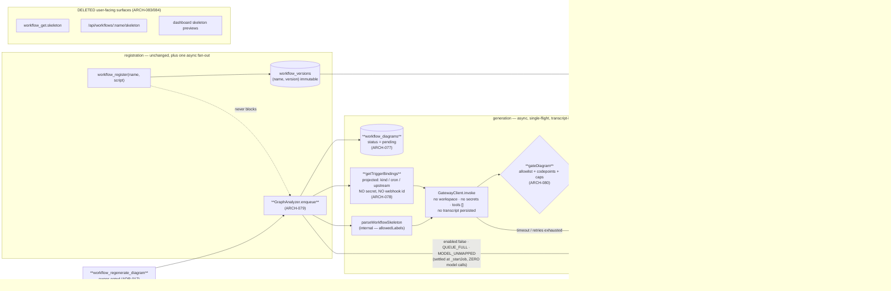

**(2) Development view** — files touched, and the fence:

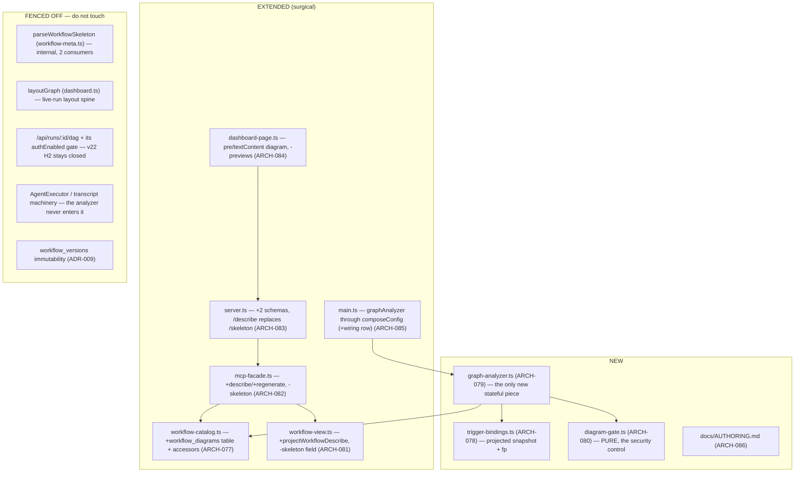

**(3) Process view** — register → async draw → describe, and the failure path:

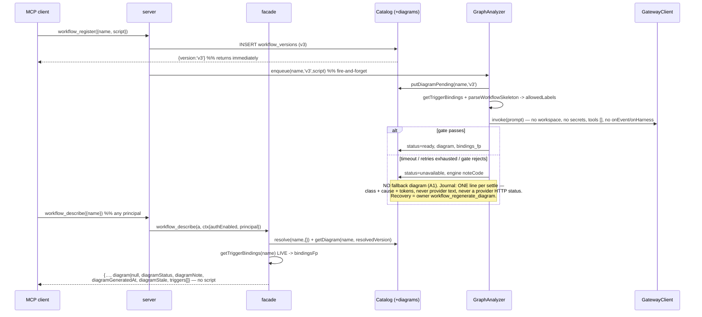

**(4) Deployment view** — **unchanged**: same single Node process, same SQLite files at `workRoot`, no new
service, sidecar, daemon or port. Three operational deltas, all documented in DEPLOY.md: the
`graphAnalyzer` config block (and the model class its shipped default `systemPrompt` assumes — a weaker
local model raises the `GATE_REJECTED_SHAPE` rate, which is the signal); **registration now performs an
outbound LLM call**, so a deployment with no reachable analyzer model registers fine and simply reports
`diagramStatus:'unavailable'`; and one route is gone (`/api/workflows/:name/skeleton` → `/describe`),
which is a breaking change for any local script that scraped it.

**(+1) Scenarios**
- *S-1 — the user who may not read the script*: a non-owner calls `workflow_describe({name})`, gets purpose, resolved `(name, version)` and how it resolved, the ASCII diagram, every tunable knob with type/default/range/ceiling, the **locked keys named as locked**, versions + channel pointers, owner, and the `issue_report` affordance — and the response key set equals `EXPECTED_DESCRIBE_KEYS` exactly, with no `script` anywhere in the tree.
- *S-2 — the hostile script (the iteration's central test)*: a script carrying a secret literal, a distinctive prompt sentence and an `appendPrompt` is registered; the emitted diagram contains **none of those literal strings** for any principal. Asserted at two tiers: `gateDiagram` unit-tested with a hostile hand-written "diagram" and **zero** model involvement, and an acceptance test through the real analyzer asserting the literal absence — never `not.toContain(whole)`.
- *S-3 — honest absence*: with `graphAnalyzer.enabled:false`, and again with an unreachable model, registration still succeeds and describe returns `diagram:null`, `diagramStatus:'unavailable'`, and a note rendered from the engine's own enum. **No fallback drawing appears anywhere** (A1), and no provider text reaches the response or the journal.
- *S-4 — the config really is separated (Gate 7.5, real run, not a unit test)*: an operator edits `graphAnalyzer.systemPrompt` (or `.model`), re-registers the same workflow with **no redeploy**, and the emitted diagram visibly changes. The journal line for that run names the new model — the wiring-gap signature is the *old* model still appearing.
- *S-5 — triggers, including the ones the script cannot contain*: a workflow bound by `schedule_create` shows `cron` on its entry node; adding a `webhook_create` afterwards makes `diagramStale:true` while `triggers[]` immediately reports both — the live field and the flag together, never a silently contradicting diagram. A chain whose upstream run has been purged renders as an unnamed chain, never an invented name.
- *S-6 — the skeleton is gone, and nothing still describes it*: `tools/list` contains the word `skeleton` **nowhere**; `GET /api/workflows/:name/skeleton` 404s; the CI grep guard fails on any `src/` occurrence outside the **four**-entry internal allowlist (**[AMENDED v23 Gate 2 re-run (`d294880`) — A9/QD-C3: `graph-analyzer.ts` is the legitimate fourth entry; the test pins `size === 4`]**); and `/api/runs/:id/dag` still refuses the overlay when `authEnabled` (v22 H2 regression test, re-run unchanged).
- *S-7 — recovery from the operator's own bad window*: versions registered while a misconfigured `graphAnalyzer.model` was gate-rejecting sit at `unavailable`; after the config is fixed, the owner calls `workflow_regenerate_diagram({name, version})` per version and the row flips to `ready` **without minting a version or moving a channel pointer**. A non-owner calling it gets `NOT_WORKFLOW_OWNER`.

### v23 data architecture

Storage stays SQLite/`better-sqlite3` (no ADR — settled long ago). v23 adds **one table in the existing
`catalog.db`** and no new access pattern. The three trigger tables are shown because ARCH-078 reads
them; note they live in **three separate database files**, which is why the aggregator is an API
composition rather than a join.

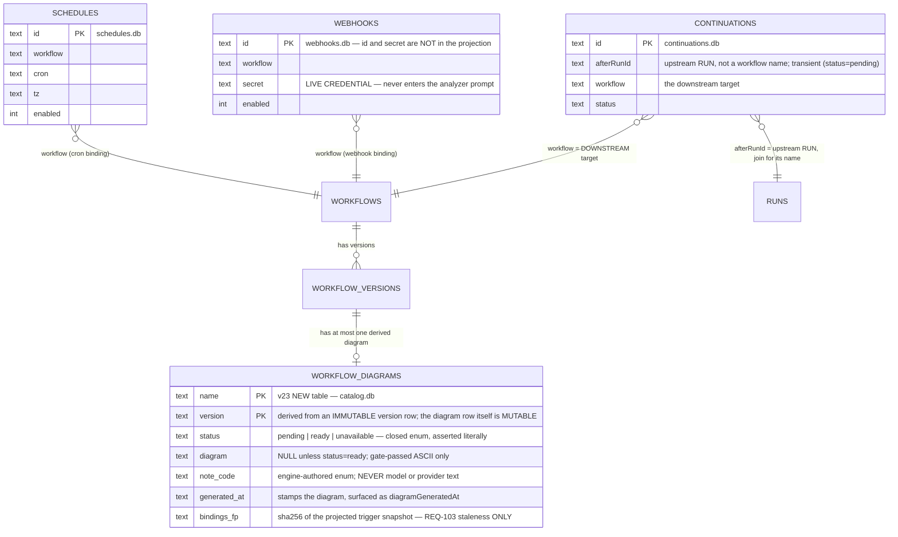

- **No `inputs_fp` column** [ADR-018]: there is no cache, so the only fingerprint that exists is
  `bindings_fp`, and it does exactly one job.
- **No new index**: every access is by the `(name, version)` primary key, at human-rate row counts on a
  local file. `workflow_describe` performs one catalog resolve + one diagram lookup + three small
  store reads; the dashboard home view is the only per-card caller, and if that ever bites the fix is a
  `describe({brief:true})` projection — **noted, not built**.
- **Lifecycle**: diagram rows are deleted inside the *same transaction* as `workflow_deregister`
  (`workflow-catalog.ts:488-490`) — **[AMENDED v23 Gate 2 re-run (`d294880`) — A8/QD-O3: "and the
  `maxWorkflowVersions` prune" is STRUCK; no prune exists, the ceiling refuses the registration
  (`:441-445`), so deregister is the SINGLE deletion path.]** No sweep, no TTL, no GC. Growth is
  **bounded** (never reclaimed) per name by the same ceiling that refuses further versions; a
  one-line note is recorded so a year-deep catalog is not a surprise.

### v23 interface & API contracts

| surface | contract delta | errors |
|---|---|---|
| `workflow_describe({name, version?, channel?})` | **NEW tool, callable by any principal** — returns `{name, version, resolvedBy, channels, versions[], description, params, lockedKeys[], owner, reportProblem, triggers[], phases, diagram\|null, diagramStatus:'ready'\|'pending'\|'unavailable', diagramNote, diagramGeneratedAt, diagramStale}` (**`phases` added v23 Gate 2 re-run, A7/QD-O2** — it is emitted per owner adjudication #1 一律公開, and its non-owner visibility is what justifies `meta.phases[].title` as an ARCH-079 inv-6 allowlist member) and **never a `script` field in any branch**; resolves by REQ-097's exact order (`version` › `channel` › `release`); the tool description states outright that the script is deliberately not among the returned fields | `CHANNEL_UNPUBLISHED` (names the channel), `UNKNOWN_VERSION`, `INVALID_CHANNEL`, `WORKFLOW_NOT_FOUND` |
| `workflow_regenerate_diagram({name, version})` | **NEW tool, owner-gated** — re-runs the analyzer for that exact immutable version through the same single-flight queue and overwrites its (mutable) diagram row in place; mints no version and moves no channel pointer | `NOT_WORKFLOW_OWNER`, `PRINCIPAL_REQUIRED`, `UNKNOWN_VERSION`, `WORKFLOW_NOT_FOUND` |
| `workflow_register({name, script, defaults})` | **surface unchanged**; additionally enqueues an async diagram job that registration never awaits, and whose failure never affects the registration's outcome | unchanged (v22 set) |
| `workflow_get({name, version?})` | **loses `skeleton`** from the response and from its own tool description; everything else unchanged | unchanged |
| `GET /api/workflows/:name/describe` | **NEW route**, serving the **identical object** the MCP tool returns — one projection, asserted by a **parity** test across both call sites (key-identical bodies under `EXPECTED_DESCRIBE_KEYS`). **[AMENDED v23 Gate 2 re-run (`d294880`) — A1: "auth-gated exactly as the route it replaces" STRUCK (unfalsifiable, and false as shipped).** Admitted **only** when `!authEnabled` **‖** loopback peer (`isLoopbackPeer`, REQ-089/D-BIND) **‖** `resolvePrincipal` returns a principal; otherwise **401 + `WWW-Authenticate`, before any store read**. The gate joins the `authHandlers` block (`server.ts:1722`) as the **fourth `dbindExempt` member**; the handler **stays** in the `/api/*` dispatch (`:1918-1930`), because `authHandlers` is `authCfg && authTokenStore` and a route living inside it would 404 every no-auth deployment. See ARCH-083 and `ADJ-A1`.**]** | **401** (auth on, non-loopback peer, no/invalid bearer), 404 unknown name |
| `GET /api/workflows/:name/skeleton` | **DELETED** | 404 |
| `GET /api/runs/:id/dag` | **unchanged**, including its `authEnabled` withholding of the predicted overlay (v22 H2 stays closed) | — |
| dashboard | workflow-detail renders the ASCII diagram via `textContent` into `<pre>`, or the engine note when not `ready`; the home-card mini-preview is **removed**, with no substitute drawing — **[AMENDED v23 Gate 2 re-run (`d294880`) — A4: "removed" means `renderMiniPreviewAsync` and its call site are DELETED, not re-pointed.** As shipped it fetches `/describe` per card per 3 s tick and discards the response (`dashboard-page.ts:227-231`, called at `:243`, `setInterval` at `:496`) = 20N req/min/tab.**]** | — |
| `rwe.config.json` | `+graphAnalyzer?: Partial<GraphAnalyzerConfig>` (`server.ts:173`; the type is declared once at `graph-analyzer.ts:75-85` — **[AMENDED v23 Gate 2 RE-RUN #2 (`41e6382`) — CONS-1, third site of the same six-key list; see ARCH-085]**) — forwarded in `composeConfig()`, a row added to `compose-config-v2-wiring.test.ts` in the same change, **and** proven by REQ-104's Gate 7.5 real run; `tools` defaults to `[]` with a loud boot warning when non-empty | — |
| journal (**one line per analyzer SETTLE**, not per run — **[AMENDED v23 Gate 2 re-run (`d294880`)]**) | `{name, version, principal, model, promptTokens, completionTokens, durationMs, outcome, noteCode, gateFail, attempts, cause}` — `gateFail` is DES-129's shipped tenth field this row never recorded; **[AMENDED v23 Gate 2 RE-RUN #2 (`41e6382`)]** `attempts` (number of attempts in this settle) and `cause` append **after** the existing ten, whose order is the wire format; `cause` is a **closed union of engine-authored literals, never `string`**, declared once beside `GateFailReason` and enumerated once — in ARCH-079 inv 5, which this row deliberately does **not** re-type (CONS-1's own lesson, applied to the round that files it) — carrying the distinct reason where `noteCode` is overloaded; the four model-call-only fields are `null` on paths that made no call (`MODEL_UNMAPPED`, `QUEUE_FULL`, `enabled:false`, boot-sweep settle, exceptional exit); tokens and `durationMs` aggregate across the settle's attempts. **"+ provider HTTP status" STRUCK** (A8 — DES-129 struck it at Gate 4; never shipped). **[AMENDED v23 Gate 2 RE-RUN #2 (`41e6382`) — the closing clause contradicted the STRUCK note one sentence away; this is the fourth-of-four A8 site, the very defect class A8 was written to repair.]** Engine-classified error class + token counts only; **never** transcript text, raw provider text, a provider HTTP status, or the script | — |
| `docs/AUTHORING.md` + `workflow_register.script` description | authoring rules: declare knobs in `meta.params`, never read an undeclared value, the six locked keys are engine-owned, and keep secrets/prose out of phase names — documented as smells, **no new registration rejection** | — |

### Decision rationale — v23 (ARCH-077..086, ADR-015..022; REQ-101..106)

- **Panel provenance.** Synthesized from all four files under `.panel/architecture/`: `adversarial.r1/r2.md`
  (security × scalability × testability, Karpathy tie-break) and `quality-dimensions.r1/r2.md`
  (observability / replaceability / consumability / self-sustainability). The orchestrator pre-ran the
  panel; re-spawning is forbidden. Round 2 was a genuine convergence round — the r2 stance is taken as
  the baseline and r1 read as supporting argument. QM `safety_class` ⇒ no functional-safety /
  cybersecurity lenses.
- **Altitude: both, and v23 adds a third that neither previous iteration had.** Both lenses reached this
  independently and in almost the same words: this is the first iteration where an **agent is an internal
  engine subsystem with its own trust boundary** — the engine calls a model on attacker-influenced input
  and republishes the output to principals forbidden from reading that input. Every load-bearing decision
  in this slice (ADR-015 gate, ADR-016 isolation, ADR-020 empty tools) follows from that one framing.
- **The panel's single strongest contribution, adopted as ADR-016: the analyzer transcript is a mask
  bypass.** Quality filed it HIGH; adversarial's r1 had already routed the analyzer off `AgentExecutor`
  for unrelated (metrics/admission) reasons and conceded in r2 that quality supplied the stronger
  justification for the same line. Two lenses converging on one structural boundary from opposite
  directions is the best evidence available that the boundary is in the right place. Quality's option (a)
  — do not store — beat its own option (b) — store and mask — because a second implementation of a mask
  is a drift bug waiting to be filed; **observability conceded to security**, and bought back what it
  actually needed with one journal line.
- **Overriding a *converged* panel position, on simplicity: ADR-018 deletes `inputs_fp`.** Both proposals
  built the fingerprint cache, and adversarial's r2 self-correction SC-1 patched its worst failure mode
  (a cached transient failure returned forever). The synthesis removes the mechanism instead of patching
  it: REQ-104's no-redeploy acceptance becomes true by construction rather than by remembering to hash
  the analyzer config; REQ-102's "generated fresh" is satisfied on its most literal reading, which
  **closes one of the three escalations the panel wanted the owner to ratify**; and the cross-principal
  oracle and the cached-failure predicate both disappear with it. The one job left over — bounding
  register-loop spend — was already `maxWorkflowVersions`' job (ADR-014). Equal value, fewer moving
  parts.
- **Reversing one converged panel structure, on the transaction argument: ADR-021 folds the store into
  `workflow-catalog.ts`.** Both proposals named a standalone `DiagramStore`. The invariant both of them
  also demanded — a derived store must not outlive its source — requires deleting the diagram row in the
  *same* `better-sqlite3` transaction as the version row, which requires the same `Database` handle. A
  separate file would be a component in name only. Precedent: v22 folded the pure `resolveVersionRequest`
  into the same module for the same reason.
- **Escalation O-1 (owner email / webhook id in a universally-callable response) — DECIDED here, not
  escalated, and the evidence dissolves the conflict.** Adversarial raised it as a genuine three-lens
  fight (security wants masking, consumability wants REQ-101's literal field list, simplicity says do not
  build two projections) and quality endorsed adversarial's masked-handle proposal. Both missed that
  **v22 already ships `owner` to non-owners** — ARCH-075's ratified allowlist emits it and ADR-012
  reasons explicitly about it. So `workflow_describe` opens **no new exposure**, and masking it in
  describe alone would create a *third* owner-disclosure policy under which two surfaces disagree about
  one object: exactly the drift REQ-101 exists to prevent. The webhook **id** is resolved the simpler
  way: it is not in the projection at all, because no requirement asks for it (REQ-103 needs the trigger
  *kind* plus the chain's upstream) — not building a masking mechanism beats building one. Recorded, not
  escalated, per the v22 Conflict-3 precedent; owner-email opacity remains available as one decision
  applied to `workflow_get` **and** `workflow_describe` together, in a security-hardening iteration.
- **Escalation O-2 (`graphAnalyzer.tools`) — DECIDED here as ADR-020.** The requirement mandates the
  *key*, not a non-empty *default*; both lenses independently want `[]` (quality "without qualification",
  adding a self-sustainability argument adversarial had not made). Choosing a default is an architecture
  call. Flagged in this rationale for the owner to overrule at review rather than held as a gate blocker.
- **Escalation O-3 (the "generated fresh" literal reading) — dissolved by ADR-018**, as above. All three
  of the panel's owner-escalations are therefore closed inside Gate 2 without a requirements round-trip.
- **The crossed concession, recorded for honesty:** in round 2 adversarial adopted quality's `ready` and
  quality simultaneously adopted adversarial's `ok`, so each conceded to a name the other had just
  abandoned. Decided on the surviving argument (REQ-102 pins only the two absence states, so the success
  state's name is unpinned and `ready` self-describes): **`ready`** [ADR-017]. Quality's stated reason for
  `ok` — that it "matches the SCREAMING_CASE register" — does not hold; both candidates are lowercase.
  Not revisited.
- **Self-sustainability's one surviving disagreement, split: ADR-017 takes the action, refuses the
  daemon.** Quality was right that a terminal `unavailable` on an immutable version is a closed-loop gap
  (a transient outage during a registration burst permanently flags every version in the window), and
  right that its own r1 had conflated two failure modes that need different fixes (the boot sweep handles
  a crash mid-generation; something else must handle exhausted retries). Adversarial conceded the
  finding and bounded the remedy. The remedy taken is **only** the explicit owner-gated
  `workflow_regenerate_diagram`: automatic retry-with-backoff lost (it duplicates `graphAnalyzer.retries`
  and turns a provider outage into an unbounded spend loop) and lazy describe-time regeneration lost
  (every read becomes a potential model call). Quality itself pre-emptively excluded both in r2.
- **Replaceability withdrew its own ask, correctly: `gateDiagram` *is* the conformance check.** Quality's
  r1 wanted a vocabulary-conformance check to distinguish "wired but degraded" from "not wired"; it
  conceded in r2 that the security gate already performs exactly that predicate on **every** generation
  rather than at audit time. Adversarial integrated the dimension without a new component by splitting
  the reason code (`GATE_REJECTED_CONTENT` = security event, `GATE_REJECTED_SHAPE` = degradation signal)
  — the cleanest integration in the round, and adopted verbatim. **Replaceability conceded to simplicity;
  simplicity paid for it with one enum entry.**
- **Observability's effective-config surface: narrowed, then dropped entirely.** Quality r1 wanted the
  resolved `graphAnalyzer` block on a status surface; adversarial held it with two security conditions
  (owner-gated, never the prompt body); quality r2 then folded it into the per-run journal line instead,
  which carries `model` and gives the same wiring-gap signature. The synthesis takes quality's smaller
  form and builds **no status surface at all** — reinforced by the fact that **this codebase has no admin
  tier** (verified: authorization is owner-vs-non-owner), so both proposals' "owner/admin" would have
  meant inventing a trust tier for one read.
- **Three primary-source corrections the panel needed** (house rule: verify the code, do not inherit the
  proposal's assumptions). (i) The three trigger stores are **three separate SQLite files**
  (`server.ts:1331/1334/1392`), so adversarial R9's "a single batched read per call" is not available —
  ARCH-078 is an API composition. (ii) `continuations` are keyed by **`afterRunId`, a run**
  (`continuation-store.ts:75-86`), so REQ-103's "for chain the upstream workflow" costs a `RunStore` join
  and can legitimately be `null`; chain bindings are also **transient**, which is a second independent
  reason the served field must be live. (iii) **`webhooks.secret` is a live credential in a table the
  aggregator reads** (`webhook-registry.ts:76-82`) and that snapshot goes into an LLM prompt — neither
  proposal noticed; ARCH-078's projection is therefore constructed from an explicit field list, closing
  the leak at the read rather than relying on the gate, which only protects the *diagram*, not the
  *provider call*.
- **Karpathy check.** Ten ARCH for six REQ, one per module root as the `module:`/`deps:` contract
  requires — three genuinely new files (two of them pure or nearly so), one new table on an existing
  module, and six surgical edits. Complexity is spent only where a requirement forces it: the gate
  (ADR-015 — the only thing standing between v23 and undoing v22), the async job with its three-state
  row (REQ-102's own words), and the config block (REQ-104's own words). Everything speculative was cut,
  and the cut list is longer than the build list. The dominant risks are all **silent-failure** risks —
  a mask re-opened by the engine's own new feature, a config block that is read but never wired, a
  deletion that leaves seven files still describing the deleted thing, a derived row outliving its
  source — and each is made impossible-by-construction rather than detected afterwards: an allowlist
  gate (a leak fails closed), a `script`-less **type** (a leak is a `tsc` error), a CI grep guard (a
  surviving description is a build failure), a shared transaction (an orphan row is unrepresentable),
  and a real run (a wiring gap is not a passing unit test).
- **Consciously declined, each with the lens that asked:** a standalone `DiagramStore` component (both
  lenses — ADR-021); `inputs_fp` / any diagram cache (both lenses — ADR-018); cross-workflow
  content-addressed dedupe by script hash (adversarial's own rejection — a cross-principal oracle for a
  load that does not exist); automatic retry with backoff (quality SUS — ADR-017); lazy regeneration on
  describe (quality's own pre-emptive exclusion); a second vocabulary-conformance checker (quality
  replaceability — the gate already is one); enrolling the analyzer in generic per-agent observability
  with masking applied (quality observability — ADR-016); an effective-config status surface (both
  lenses, narrowed then dropped); an `admin` trust tier (both lenses' "owner/admin" — none exists);
  process-sandboxing the analyzer (adversarial explicitly rebutted: it runs no user code); a rate
  limiter for analyzer spend (both lenses agreed it is not warranted this iteration); a Mermaid or SVG
  second render path (A2, both lenses concede); a retained structured intermediate representation (A2 —
  and any future structured export must pass its own gate derived from the same `allowedLabels`, because
  a structured field is *easier* to exfiltrate through than ASCII, not harder); any degraded skeleton
  fallback on the failure path (A1, both lenses concede); extending REQ-083's redact-at-capture to script
  literals (out of scope — recorded as a gap that ADR-016 makes moot for v23); a diagram GC sweep or
  retention TTL (ADR-021).
- **Accepted residuals (record, do not architect):** `owner` remains visible to every principal on both
  read surfaces, unchanged from v22 (above); v23 raises v22 debt **S-1**'s severity by making every
  registration cost an LLM call, mitigated but not closed by `maxWorkflowVersions` + concurrency 1 +
  `timeoutMs`; REQ-083's redact-at-capture still does not reach script literals or prompt sentences,
  which is moot only for as long as ADR-016 holds; the shipped default `systemPrompt` assumes a model
  class, so a weaker local model makes honest absence the *common* path (`GATE_REJECTED_SHAPE` is the
  signal, DEPLOY.md must name the assumption); `chain_create` still validates no workflow at all (v22
  §8.2), so a diagram may faithfully draw a trigger to a non-existent upstream — **render it verbatim,
  never "correct" it**; the dashboard workflow-detail view has no predicted preview until a diagram is
  `ready`; and `/api/workflows/:name/skeleton` disappearing is a breaking change for any local script
  that scraped it.

### Decision rationale — v23 **Gate 2 RE-RUN** (send-back `d294880`, 2026-09-03)

**Scope and provenance.** Gate 8's first v23 pass returned `send_back: ["architecture","tests","impl"]`,
`arch_consistent:false`, 10 deviations (3 HIGH / 3 MED / 4 LOW). Its §8 assigns **Gate 2** the **A1
decision** plus the **A7/A8/A9/A10 amendments**; Gates 5/6 own the rest. This re-run does exactly that,
and additionally gives A2/A3/A5/A6 **an architectural invariant to test against** — a Gate-5 RED row with
no architectural oracle is how this ledger got here. The panel was **pre-run by the orchestrator**
(`.panel/architecture/{adversarial,quality-dimensions}.{r1,r2}.md`, all four re-written for this
send-back and superseding their pre-send-back namesakes); it was **not** re-spawned. Round 2 is taken as
the baseline, round 1 as supporting argument. QM `safety_class` ⇒ no functional-safety / cybersecurity
lenses. **Every load-bearing `src/` claim below was re-verified against the working tree by this
synthesizer**, not accepted from a panel or from the ledger's prose (`server.ts:296-312`, `:950-956`,
`:1714-1726`, `:1918-1930`; `graph-analyzer.ts:165-192`, `:204-219`, `:280-300`; `workflow-view.ts:126-140`;
`workflow-catalog.ts:247-260`, `:439-447`; `mcp-facade.ts:460-466`; `tests/unit/no-skeleton-surface.test.ts:30-65`).

**The convergence, stated plainly.** The two panels **agreed on twelve of fourteen live items**, including
A1 — the one both predicted a fight over — reaching *transport gate, singular projection* independently,
security from disclosure and consumability from REQ-101's own "the two masks cannot drift apart". When the
two lenses that most often trade off converge from opposite premises, that is the strongest evidence a
panel can produce, and A1's mechanism is treated as settled. Round 2 also produced **two corrections that
invalidated fix text both panels wrote in round 1** (N-1, V-D below) — which is the round earning its cost.

**`ADJ-A1` — the one decision an owner may want to overrule, DECIDED here, not escalated.** Gating
`/api/workflows/:name/describe` partially retires REQ-086's non-goal ("`/api/*` health/status and the
read-only dashboard remain unauthenticated **in this slice**"). Decided at Gate 2 for four reasons: the
Gate 8 review explicitly assigns the decision here; both panels converged on the mechanism *including* the
loopback exemption; REQ-086's non-goal is **slice-scoped by its own words** ("in this slice", v15), so this
is a later slice adding a protected surface rather than a ratified rule being broken; and this ledger's
precedent for exactly this shape is decide-and-flag (v23's own O-1/O-2/O-3, ADR-020's "flagged for the
owner to overrule at review"). **The one outcome both panels reject is the documents continuing to claim a
gate that does not exist** — so if the owner rules the route stays open, ARCH-083 and ADR-012's masking
posture must instead be amended to say the describe payload is **public by decision**, and
`EXPECTED_NON_OWNER_KEYS` (`workflow-view.ts:59-62`) reconciled with it. Either way the documents move, and
either way `README.md` §使用範例 (「任何人都能問」) and DEPLOY's describe-route description are edited in the
same round. Cost of the decision as taken, bounded: one view (workflow-detail diagram) goes dark for
**remote** browsers under `auth.enabled:true`, while the engine host and DEPLOY's own SSH-tunnel posture
stay working via the loopback exemption.

**Referee call R-1 — inv 5's scope: quality's "one line per SETTLE" beats adversarial's "per scheduled
job".** This is a real contradiction, and it exists only because the two r2 files were written in parallel
and never saw each other. Adversarial §5.4 scopes the invariant to scheduled jobs (pre-scheduling refusals
settle silently); its stated motivation is that *its own* `_startJob` guard would otherwise violate the
invariant it was adopting. Quality's r2 §1.1 then produced evidence adversarial never saw: `grep -n
"console.log" src/graph-analyzer.ts` returns **exactly one hit**, so `MODEL_UNMAPPED`, `QUEUE_FULL` and the
boot-sweep settle are **already** silent today. **Adopted: quality's form.** Adversarial's objection
dissolves by construction once the emitter moves to the settle choke point — a synchronous refusal then
emits its line for free — so nothing it was protecting is lost. The argument that decides it is
`MODEL_UNMAPPED`: that is this repo's `composeConfig` wiring-gap signature settling per workflow, forever,
invisibly, in the iteration whose own ARCH-085 exists because of that bug class. Cost: **one moved-and-
widened `console.log`.**

**Referee call R-2 — A5's vehicle: a note on ARCH-080, NOT a new ADR.** A crossed concession, the same
shape as v23's own `ready`/`ok` crossing: adversarial r2 conceded **to** quality's r1 ADR while quality r2
simultaneously conceded **away** from it. Decided on the surviving argument, which is quality's: a new ADR
at a send-back gate is ledger churn this iteration can least afford (six ledger-honesty gaps already on the
board); ARCH-080 is where a reader touching the vocabulary is already looking, which is the only place the
rule can actually fire; and the minimum artifact that closes the deviation wins. Two further reasons of
this synthesizer's own: an ADR is for a contested *technology* choice and this is a coding-discipline rule
with no runner-up technology; and adding no work item keeps the trace ledger byte-comparable at 996/18, so
Gate 8 can diff this re-run cheaply. **Both of adversarial's held clauses are carried into the note
verbatim** — scope the rule to *engine-instructs/engine-validates* vocabulary (otherwise it is
unenforceable and will be ignored), and the REQ-104 asymmetry paragraph (otherwise a careful reader files
the amendment itself as a REQ-104 violation).

**Referee call R-3 — A6's target shape: adopt BOTH, since they are not actually exclusive.** Adversarial
holds "the literal expectation stays in the test, never derived from `server.ts`"; quality wants a total
`Record<ToolName, Assertions>` so `tsc` refuses an unasserted tool. Quality's answer to adversarial's rule
holds: **an imported type supplies coverage, not content** — every description and required-field list
stays hand-written. So ARCH-051 now records the runtime sorted-name equality (adversarial's, kept, because
it survives a `tsc`-less run) **as what v23 builds**, and the typed total table **as the recorded target**,
with the 29 uncovered advertised tools as a **named backfill debt budgeted at Gate 3**. Quality's one
non-negotiable — the debt is recorded with an owner in either shape — is honoured; that is the clause that
matters, since an unrecorded gap is how a "load-bearing" claim came to be made against a length floor.

**Who conceded what, on the items that were contested.** *Adversarial conceded*: its own r1 P3 fix site
(the `finally` belongs in the scheduled closure, not `_runJob` — it corrected **both** panels); its own r1
P2 guard site (moving the durable `putDiagramPending` behind the guard, a latent prior-`ready`-destruction
it found by checking **quality's** Risk #5 against the code); its own r1 settle claim (`RETRIES_EXHAUSTED`
reads as a false cause — hence V-D); its A7 LOW→MED severity *fight* (kept the rule, dropped the label
argument as changing no text); the r1 "one-line SQL fix" for A10 (it is a migration); "`mcp-facade:462` is
load-bearing" (downgraded to defence-in-depth); and quality's `02-architecture.md` line numbers over its
own. *Quality conceded*: A1's precise wiring (`dbindExempt` predicate, gate-in-block/handler-in-dispatch
split — it had written the weaker "requires a bearer", which implemented one block too deep would 404 every
no-auth deployment); A2's guard **placement** (choke point over requeue-branch), while completing the
remedy with V-D; A5's ADR vehicle; A6's scope (29 rows now is creep by its own Risk #1); A7's severity to
MED; its own QD-O6 status gauge, **withdrawn on its own verification** that `timeoutMs` is really enforced
by both gateway implementations. *Both withdrew the same overclaim independently*: the analyzer crash-loop
is **bounded**, because `sweepAtBoot` stamps before it schedules — which is why that ordering is now
written down as inv 9 rather than left as an accident.

**Karpathy check on the re-run.** Net **new mechanism** across every adopted item: one predicate reuse
(A1), **one** `try/catch/finally` in one closure (which *replaces* two larger r1 fixes — the debate made
the fix smaller), one `if` plus two moved lines (inv 11), one line of note precedence (V-D), one exported
constant + interpolation (A5), one moved-and-widened log line (inv 5), one `toEqual` where a length floor
stands (A6), **two lines deleted** (A4), one journal field. Everything else is amendment text — the correct
output for a gate whose deviations are 40% "the row was never edited". **Still not proposed, now by both
panels:** no rate limiter, no distributed lock, no second masking projection, no `diagramCache`, no `admin`
tier, no new state store, no global `unhandledRejection` handler (REQ-059/060 make restart-and-resume a
*designed* capability, so crash-only is a real posture here), no `note_code` `CHECK` migration, no
preserved-prior-diagram schema change, no boot-time prompt lint, no tool-liveness probe, no auto-retry, no
diagram prune, and **no status gauge**.

**Named, not built (long-horizon, both panels agree these are (iii)):** no metabolism — diagram rows are
bounded but never reclaimed, since `maxWorkflowVersions` refuses rather than prunes, so a long-running
deployment eventually needs a human to deregister; and no analyzer tool-liveness probe. Recorded here so
the A8 amendment cannot be misread as promising a prune it just deleted.

**Handoff, so the re-run's gates inherit oracles rather than re-derive them.** Gate 2 (this file) closed
A1, A7, A8, A9, A10 and wrote the invariants for A2/A3/A5/A6. **Gate 5 (RED first)**: A2's per-entry-point
"gateway never invoked when `enabled:false`"; A3's orphan-pending → boot-sweep row whose third assertion is
*the next enqueued job still runs*; V-D's `{row} × {analyzerEnabled}` table; A5's vocabulary-membership
assertion over the shipped prompt **and** `rwe.config.example.json:59`; A6's name-set equality + the two
v23 tool rows + the literal `server.ts:493` sentence; A1's four-row parameterized route oracle **with
`{authEnabled:false} → 200` first**. **Gate 6**: A1's gate + the README/DEPLOY edits, A2's guard and moved
write, A3's closure handler, A4's two deleted lines + UT-116 re-point, A5's export/interpolation + deleting
the false `server.ts:299-300` comment, A10's false comment at `graph-analyzer.ts:176-179`. Gates 3 and 4
were **not** sent back; DES-125/127/129/130/132 stand as written — in all four LOW findings the design was
*right* and it was this file that lagged. **Gate 8 must re-verify each doc-only amendment BY GREP, not by
reading this note** — both panels rate that the highest residual risk, and it is the exact defect this
re-run exists to repair.

### Decision rationale — v23 **Gate 2 RE-RUN #2** (send-back `41e6382`, 2026-09-03)

**Scope and provenance.** Gate 8's v23 **re-review** returned `send_back: ["architecture","tests","impl"]`,
`arch_consistent:false`, **1 HIGH · 4 MED · 4 LOW** (the HIGH is the unfixed half of the previous
send-back's A3). Its §8 assigns **Gate 2** the R-3, R-2b, R-6 and CONS-1 decisions plus the interface
table's self-contradicting journal row; Gates 5/6 own the rest, and this re-run additionally hands them
the **oracles** and the **`cause` value domain** so they inherit decisions instead of re-deriving them.
The panel was **pre-run by the orchestrator and NOT re-spawned**: this round is
`.panel/architecture/{adversarial,quality-dimensions}.r1.md` (both re-written for `41e6382` and each
saying so in its own header); the `*.r2.md` files on disk belong to the **previous** (`d294880`) round
and are *not* this round's second round — round 2 was correctly skipped because the two r1 headlines are
**complementary, not contradictory** (both rule "build the choke point", both hold the settle scope, both
keep `cause`, both delete the tool count), leaving only referee-decidable details, which are ruled below.
QM `safety_class` ⇒ no functional-safety / cybersecurity lenses. **Every load-bearing `src/` claim in the
amendments was re-verified against the working tree by this synthesizer, not accepted from a panel or
from the ledger's prose**: `graph-analyzer.ts:75-85` (nine config keys), `:105/:240-245/:260/:265/:388`
(the two release sites and the admission test), `:220-233` (the ten-key `_journal` literal, `cause`
absent), `:250-271` (the closure, `_runJob` outside the `try`, no `enabled` read), `:138/:181`,
`server.ts:173`, `:188-242` (**40** entries in `TOOL_NAMES`, counted), `:955`, `:1505-1516` (one
unconditional `console.log`, no `console.warn`), `main.ts:184`, `mcp-facade.ts:462`, `errors.ts:38`, and
`grep -rn "unhandledRejection" src/` → empty.

**The convergence, stated plainly.** The two lenses agreed on every ruling and differed only on form:
build inv 11's choke point (security-egress and replaceability-kill-switch reaching it from opposite
premises); hold inv 5's settle scope and make it structural; keep `cause` and implement it; delete the
tool count rather than correct it; strike `:1708`'s trailing clause; re-assert ADR-020(c). The shape of
the whole round is one sentence: **the architecture text was not the problem — the enforcement site
was.** Round 1's amendments were verified closed in code eight times out of ten, and the two that failed
failed identically, by shipping the narrowest instance of a stated property. So five of the nine
adopted items *reduce* the number of places a rule lives (egress 4 → 1, emitter 3 → 1, terminal-row
writes 4 → 1, release sites 2 → 1, config-key sources 3 → 1) and the two new floors close the two holes
the ordered fix would otherwise still have.

**Referee call RR-1 — `cause`'s type and the twelfth field: adversarial's closed union, plus `attempts`
as its own field.** Quality's value table used parameterised strings (`prior_ready_restored:<code>`,
`gate_reject:<gateFail>`, `attempts=N; last=…`); adversarial demanded a closed union of engine literals
so that ADR-016's "never raw provider text" is a **compile error** rather than a matter of care.
**Adopted: the union**, because two of quality's three interpolations are redundant with fields that
already exist (`gateFail`; and `attempts` once it is a field) — so the union costs no information — and
because quality itself named `attempts:number` as an acceptable fallback and pre-conceded on
machine-parseability. **Quality conceded on form, adversarial on field count** (it had marked the twelfth
field referee-decidable and would have accepted the loss as named debt). The residual — which provider
failure preceded a B5 restore — is recorded as named debt in inv 5(e), not silently dropped, which was
the one thing both lenses refused to allow either way.

**Referee call RR-2 — R-4's fix site: `enqueue()`'s front door, not the call site.** Quality supported
the reviewer's two-line `try/catch` at `server.ts:957`; adversarial argued the choke-point form for
consistency with R-3. **Adopted: the front door**, at identical cost (one `try`), because it covers the
facade's regenerate path and every future caller while a call-site catch covers one call site — and
because ruling the *opposite* way here while ruling for the choke point in R-3 would leave this document
holding two contradictory positions on the same question in one round. Quality had marked it "owner's
call", so nothing it argued for is lost: the registration still succeeds and `sweepAtBoot` still settles
the `pending` row, which is the self-healing path its rebuttal relied on.

**Referee call RR-3 — CONS-1's form: the type name is authoritative, the key list is explicitly
non-normative.** Adversarial wanted the enumerated list replaced by `Partial<GraphAnalyzerConfig>`;
quality wanted all nine keys spelled out for an integrator, plus the recorded verification that this is
*not* the `composeConfig` forwarding-gap class. Both offered the crossed compromise in their own
"expected disagreements" sections and **both are taken**: the declaration is named first and is the
authority, the nine keys follow as a dated human-readable convenience, and the doc-only verification is
recorded in the row so the next reader does not spend a round re-establishing it. A row that re-types a
list drifts on the tenth key; a row that names the type cannot.

**Referee call RR-4 — R-6: delete the integer, and delete its derived one too.** Both panels ruled
"delete, do not correct"; quality left "currently 40 (non-normative)" open *if the referee insists*. **It
is not taken.** A correct integer in a document nobody re-counts is a defect with a longer fuse, and the
same amendment carried a *second* count derived from the first ("the 29 uncovered tools"), which is the
proof that one number breeds another. IT-102's two-sided set equality is the sole authority.

**What both panels declined to build, and this synthesizer holds declined.** No process-level
`unhandledRejection` handler (it would mask R-1 at the wrong altitude and would make O1/O2 pass without
the invariant holding — declined *because* it would have hidden the boot crash; recorded so a future
hardening iteration inherits it rather than rediscovering it); no distributed lock or cross-process slot
accounting (inv 10's per-process bound is the honest one); no ninth persisted `note_code` + `CHECK`
migration (`cause` on the journal is the zero-migration answer, DES-129's `gateFail` the precedent); no
rate limiter over registrations (S-1 stays bounded by concurrency 1 + queue cap + `timeoutMs` +
`maxWorkflowVersions`); no reuse of `agent-semaphore.ts` for the release floor (a module-boundary change
to replace one `if`); no `graphAnalyzer` status gauge (withdrawn by its own author last round and not
re-filed); no second render path; and **no re-opening of A1, A4, A5, A6, V-D or inv 4/6/9/10**, all
verified CLOSED — re-opening verified-closed items at a send-back round is how a gate loop fails to
terminate.

**Karpathy check on this re-run.** Net **new mechanism** across every adopted item: **one** private
`_settle()` method (which *removes* two of the four terminal-write sites and one of the two emitters),
one `if` for idempotent release, one nested `try` inside that seam, one `if` + two moved lines + one
parameter for the egress choke point, one `try` at `enqueue`'s front door, one closed union type, one
conditional `console.warn` (copying the pattern eight lines above it), one journal field — and, in the
documents, **two claims deleted** (a tool count and its derivative; a re-typed key list, in all three of
its homes) and **one contradictory clause struck**. **Nothing new is stored, nothing new is configured,
nothing new is exposed on any surface, no migration, no new module, no new seam.** That is the correct
output for a gate whose defect is *deviation from an already-agreed shape*, not missing design.

**Nothing this round is owner-shaped.** Unlike the previous re-run (`ADJ-A1`, which partially retired a
REQ-086 non-goal), every item here is an engineering call inside decisions the owner already ratified —
so `needs_clarification` is empty **by finding, not by omission**. The one place an owner may still
overrule is inv 11's fallback, and its price (a mechanical `_startJob(` caller-set lock, plus an IMPL
line recording that the fallback was taken) is written into the invariant.

**Handoff, so the re-run's gates inherit oracles rather than re-derive them.** **Gate 5 (RED first)**:
**O1** (throwing `ports.getTriggerBindings`), **O2** (throwing `catalog.putDiagramResult` on the `ready`
branch), **O3** (UT-125 regains dropped assertion (b)), **O4** (slot-accounting floor, `never < 0` and
`never > 1`, red *before* the `finally` is written), **O5** (relational settle oracle over the five
row-writing paths, with `settle_failed` as its own out-of-scope case) — each with **every** enumerated
assertion, per inv 8's new rule; plus `cause` **value** assertions on the five zero-model-call paths
(inv 5(d)'s table), a type-level assertion that `cause` is not `string` (a `@ts-expect-error` on
assigning an arbitrary string suffices), the twelve-key `Object.keys(...).sort()` **set equality**,
ADR-020's two mirror rows (a warn line when `tools` is non-empty, none when empty), and the two
defence-in-depth one-line assertions (`server.ts:955`, `mcp-facade.ts:462`). **Gate 6, in this order and
as separate RED→GREEN steps**: (1) inv 2 — wrap the closure, `catch → _settle`, `finally → release +
drain`, **delete `_runJob`'s tail release**, make `_release` idempotent, add the `.catch()` backstop at
`:127`; (2) inv 5 — the `_settle` seam, `_attempt` returns telemetry, the `cause` union, `attempts`, the
B5 line shape; (3) inv 11 — the `_startJob` guard, `putDiagramPending` moved behind it, the stamp
parameter, **and an IMPL line recording that the choke point (not the fallback) was taken**; (4)
ADR-020's conditional `console.warn`; (5) `enqueue()`'s front-door `try`. Gates 3 and 4 were **not** sent
back and are not re-opened; the next gate to dispatch after this one is **5**. **Gate 8 must re-verify
each doc-only amendment BY GREP, not by reading this note** — that instruction is repeated verbatim from
the previous re-run because the item it was written for (`:1708`) survived anyway, one site short.

## v24 slice — interface consolidation, roles, per-agent parameters, the author-supplied diagram (REQ-107..118): ARCH-087..108 + ADR-023..035

**Slice shape (Karpathy check up front).** v24 is **one structural addition, one structural deletion, and a
lot of renaming**. The addition: a single **tool-spec data array** (`src/tool-specs.ts`) that is the only
source of `tools/list`, of every tool's `errors:` line, of the **authorization row** each tool is checked
against **once, before the dispatch switch** (`src/authz.ts`), and of the REQ-118 exercise table. The
deletion: the whole v23 analyzer subsystem (`graph-analyzer.ts`, the `graphAnalyzer` config block, the
async generate/reconcile machinery, `diagramStatus`, `workflow_regenerate_diagram`, `workflow_diagrams`),
replaced by a **pure fixed-grammar Mermaid check** in the repurposed `diagram-gate.ts` that diffs the
diagram's agent set against the script's literal `agent({label})` set in both directions — statically
decidable, no model, registration is total again. Everything else (six workspace tools over one
`pathVerdict`, per-agent parameters, workflow-owned assets with `pushedBy`, claimable triggers, the guide)
re-shapes existing modules at their existing seams. **Four new pure files** (`tool-specs.ts`, `authz.ts`,
`path-verdict.ts`, `authoring-guide.ts`) against **three deletions** (`graph-analyzer.ts`,
`continuation-store.ts`, `mcp-registry.ts`); **zero new services, daemons, ports or runtime dependencies**
(no `mermaid` — ADR-023); **two new tables** (`assets` in `catalog.db`, `audit_events` in the run store),
**one dropped** (`workflow_diagrams`), columns on four existing tables. Twenty-two ARCH items ≠ twenty-two
components: it is twenty-two *module roots touched* (one item per `module:` path, the ledger's convention
since v21), eighteen of them surgical edits of files that already exist.

**Panel provenance.** Synthesized from the two pre-run round-1 proposals under `.panel/architecture/`
(`adversarial.r1.md`: security × scalability/consistency × testability; `quality-dimensions.r1.md`:
observability / replaceability / consumability / self-sustainability). **No round 2 exists and none was
spawned**: the two headlines are complementary — both rule "one authorization table consulted once, not
per-`case`", both rule "no `mermaid` dependency, a fixed grammar is the honest 'renders'", both rule "the
guide is rendered from the enforcement constants", both name the same read-back-seam and config-wiring
risks. Where they differ (audit read-back, refusal coalescing) the differences are referee-decidable and
are settled in the Decision rationale below with who conceded and why. **Both proposals predate
working-notes ch. 16–20**, so several of their "requirement gaps" were already ruled by the owner; each is
closed by citation in the rationale rather than relayed.

**The tool set, derived once.** Working notes ch. 7 counts 36 (40 − `chain_create`/`chain_list` −
`workflow_regenerate_diagram` − two workspace tools + `run_list`). Ch. 16.1 then removed `run_trigger` and
ch. 16.2 merged `mcp_provision` into `workspace_push({kind:'mcp'})`; REQ-116 adds
`workflow_authoring_guide`. **v24 ships 35 tools**: workflow 7 (`register`, `deregister`, `publish`,
`describe`, `source`, `list`, `authoring_guide`) · run 8 (`start`, `status`, `result`, `suspend`, `resume`,
`stop`, `agent_log`, `list`) · workspace 6 (`diff`, `push`, `pull`, `list`, `delete`, `purge`) · triggers 7
(`schedule_create/list/delete/setEnabled`, `webhook_create/list/delete`) · issues 5 (`issue_report`,
`issue_get`, `issue_list`, `issue_get_comments`, `issue_comment_post`) · environment 2 (`models_list`,
`system_info`). This number appears **here once**; `TOOL_SPECS.length` is the assertion (v23 CONS-1: a count
hand-typed in four places drifted in all four). `state.yaml`'s "40→36" was written before ch. 16.

### ARCH-087 — `TOOL_SPECS`: one data array that is the tool surface — names, schemas, descriptions, `errors:`, authorization row, REQ-118 fixture list
- **status:** draft
- **traces:** REQ-107, REQ-109, REQ-116, REQ-118, REQ-201
- **module:** src/tool-specs.ts
- **deps:** —
- **api:** `type Role = 'admin'|'author'|'user'` (declared HERE so the dependency stays one-directional: ARCH-088 imports it); `TOOL_SPECS: ReadonlyArray<ToolSpec>` with `ToolSpec = { name; entity: 'workflow'|'run'|'workspace'|'schedule'|'webhook'|'issue'|'env'; key: 'name'|'runId'|'id'|'number'|null; description; inputSchema; errors: ErrorCode[]; seeAlso?: ToolName[]; authz: { minRole: Role; ownership: 'none'|'run'|'workflow'|'trigger'|'asset'; adminCrossRead?: true } }`; `type ToolName = TOOL_SPECS[number]['name']`; `projectToolsList(): McpToolDescriptor[]` appends `Errors: …` and `See also: …` to each description deterministically. Pure data + one projection; imports nothing from `src/`.
- **note:** Consumability at agent altitude: for REQ-117 the description text *is* the API, so the two first-try traps notes ch. 10.3/10.4 found live on `run_start`'s own row ("a just-registered workflow has no `release` — `workflow_publish` first or pass `{version}`"; "poll `run_status` until terminal, then `run_result`") and a unit test asserts the row contains both sentences — a REQ-117 doc defect becomes a red test. The REQ-107 prefix rule is a **unit test over the array**, not a review item: `name.startsWith(entity + '_')`, and `entity === 'run' && key !== null ⇒ key === 'runId'` (creators are keyed by the parent's key, so `run_start({name})` has `key: null`). Old names (`workflow_run`, `workflow_get`, `blob_put`, `asset_*`, `workflow_artifact*`, `seed_plan`, `chain_*`, `workflow_trigger`, `mcp_provision`, `workflow_regenerate_diagram`, `issue_comments`, `issue_comment`) are simply **not in the array** → unknown-tool error; there is no alias branch anywhere (owner: no deprecation window). `issue_get_comments` carries `latest` only (ch. 11.2 dropped `since`). The v22-H2 lesson generalized: `mcp_provision` advertised "Admin tool" while its `case` checked nothing because the intent lived only in prose; here the authz row sits on the same object as the prose, and a second unit test asserts a description containing "admin" has `minRole:'admin'` (ARCH-051 drift-lock pattern).
- **v33 amendment (REQ-201, TASK-227, DES-222):** the same "the description text *is* the API" rule now also owns the **version loop**, because the remote cold client of 2026-09-20 registered four names in 45 minutes and published every one of them to `release` within seconds — the mechanism was right and the advertised text never said it out loud. Two rows change text only (no schema, no `errors[]`, no `authz`, no fixture): `workflow_register`'s description states that re-registering the SAME name APPENDS a new version (`v2`, `v3`…) and overwrites nothing, so a new name is for a new PURPOSE; `run_start`'s description puts `{version}` FIRST ("run the version you just registered, to iterate") and demotes `workflow_publish` to "once it is stable" — the existing order taught `publish` first and wrote `{version}` as the fallback. The `See also: workflow_authoring_guide` pointer is unaffected: `buildDescription` DERIVES it from `ERROR_CATALOG[].see`, never from these literals.
- **v34 amendment (REQ-202, REQ-203, ARCH-136/137):** two description edits, again text only — no schema, no `errors[]`, no `authz`, no fixture. (a) `run_start.overrides` (`tool-specs.ts:439-446`, which already names `PARAM_LOCKED`/`PARAM_UNKNOWN`/`UNKNOWN_AGENT_LABEL` for exactly this reason) states the three RULES a cold client needs **before** its first `appendPrompt`: the key must be declared by the author in `meta.params.agents.<label>` or it is `PARAM_UNKNOWN`; the text is wrapped in `<user-instructions untrusted="true">…</user-instructions>` and the model is told that segment is untrusted; the effective cap is min(author, engine `maxAppendPromptBytes`) in **bytes** and the text may not contain the frame-close delimiter (`PARAM_OUT_OF_RANGE`). The rules ride `tools/list` because a cold client reads it FIRST, with zero workflow-specific calls; the per-workflow VALUES are ARCH-136's job on `workflow_describe`. Note for the implementer: the override path's `PARAM_UNKNOWN` and the script-scan path's `SCAN_VIOLATION: PARAM_UNKNOWN` are different refusals and must not be conflated in the advertised text. (b) the harness-disclosure sentence at `tool-specs.ts:614` (「An agentType's system prompt is never in harness.prompt; harness.systemPrompt:{agentType,bytes}…」) becomes FALSE the moment ARCH-137 lands and is rewritten to the two-segment truth. Both edits move in ONE commit with ARCH-107 and `docs/AUTHORING.md` under ADR-032's byte lock.
- **v35 amendment (REQ-206, REQ-210, ARCH-154):** two more description edits, text only. (a) `run_start.args` states the shape when omitted (`{}`, never `null`/`undefined`) and where a value comes from when the caller sends nothing (a declared `meta.params.args.<k>.default`, materialized at admission and visible in `effective_params.args`) — the measured failure was a caller reasoning correctly from an interface that understated reality. (b) the module exports `ENVELOPE_NOTE`, the one sentence on the double-JSON `content[0].text` encoding that ARCH-152 serves at the handshake, exported rather than inlined so every consumer says the same words. No schema, no `errors[]`, no `authz`, no fixture change.
- **iter:** v35

### ARCH-088 — `authorize()`: three roles, one `Principal` union, ownership through an injected `OwnerLookup` port, evaluated once before the tool switch
- **status:** draft
- **traces:** REQ-109, REQ-114, REQ-107
- **module:** src/authz.ts
- **deps:** ARCH-087
- **api:** `Role` imported from ARCH-087; `type Principal = { kind:'authenticated'; id: string; role: Role } | { kind:'auth-disabled'; id: null; role:'admin' } | { kind:'loopback-exempt'; id: null }`; `resolveRole(principals: Record<string, {role: Role}> | undefined, id: string): Role` — listed → its role; unlisted → `principals['*']?.role ?? 'user'`; **map undefined while auth is enabled → `'user'`** (ADR-028: fail closed and loud); `type OwnerLookup = { runOwner(runId): string|null; workflowOwner(name): string|null; triggerOwner(id): string|null }`; `authorize(p: Principal, spec: Pick<ToolSpec,'name'|'key'|'authz'>, args, lookup: OwnerLookup): { ok: true; crossPrincipalRead?: { owner: string } } | { ok: false; code: 'FORBIDDEN_ROLE'|'NOT_RUN_OWNER'|'NOT_WORKFLOW_OWNER'|'NOT_TRIGGER_OWNER'|'PRINCIPAL_REQUIRED'; see: 'workflow_authoring_guide'|null }`. Total over the union: `auth-disabled` → always ok (unchanged single-operator behaviour); `loopback-exempt` → ok only for `minRole:'user'` + `ownership:'none'` rows, else `PRINCIPAL_REQUIRED` (this is the former `authEnabled && principal === null` condition of `resolveWritePrincipal`/`principalRequiredEnvelope`, carried in the type instead of a flag threaded through positional arguments); `admin` → passes role AND ownership, and when the row has `adminCrossRead` and the resource's owner ≠ `p.id` the result carries `crossPrincipalRead` so the caller writes the audit row (ARCH-091/092) **before** serving bytes.
- **note:** Pure: unit tests pass a `Map`-backed lookup; integration tests pass the stores (`runs.principal`, `workflows.owner`, `schedules.createdBy`/`webhooks.createdBy`). The catalog's own owner checks (`workflow-catalog.ts:437/484`) **stay** as defence in depth — the table decides, the store re-asserts, a disagreement between the two is a test failure not a policy. Role/ownership matrix (working notes ch. 15.2 as amended by ch. 16/19/20): `user` — `workflow_list/describe/authoring_guide`, `run_*` on own runs, `workspace_*({runId})` on own runs, `workspace_diff`/`workspace_push` mode A (own CAS pool), `issue_*`, `models_list`, `system_info`; `author` — additionally `workflow_register`, `workflow_deregister/publish/source` on owned workflows, `schedule_*`/`webhook_*` on triggers they created, `workspace_push` mode B / `workspace_delete` mode B / `workspace_list({workflow,kind})` on owned workflows; `admin` — everything, ownership bypassed (owner ruling), cross-principal run-workspace reads audited. A workflow owner does **not** read other principals' runs of their workflow (ch. 4, carried in). **Karpathy:** no role service, no permission DSL, no per-resource ACLs — three roles, four ownership kinds, one function.
- **iter:** v24
- **correction (2026-09-04, orchestrator adjudication v24 #2 A-3):** the api prose above is corrected to the SHIPPED `src/authz.ts:77` / `src/owner-lookup.ts` signatures — principal first (not spec first) and `triggerOwner(id)` one-arg (schedule and webhook ids are disjoint UUID spaces, so the kind was redundant; the return also distinguishes `undefined` = no such id from `null` = exists with no owner). UT-140's RED test is the operative spec under TDD, so the code is right and this document was wrong. Recorded as instance #16 of a description that stopped matching the thing it describes — the recurring cost is that the next reader builds against the prose.

### ARCH-089 — the server wire: `tools/list` as a projection, `Principal` built at the HTTP edge, one `authorize()` call, the old `case` arms gone
- **status:** draft
- **traces:** REQ-107, REQ-108, REQ-109, REQ-116
- **module:** src/server.ts
- **deps:** ARCH-001, ARCH-051, ARCH-054, ARCH-060, ARCH-063, ARCH-073, ARCH-083, ARCH-087, ARCH-088, ARCH-091
- **api:** `tools/list` = `projectToolsList()` (ARCH-087) — `TOOL_NAMES` and the hand-kept schema map are deleted; `callTool(name, args, principal)` does `const spec = TOOL_SPECS.find(name) ?? unknownTool()` → `authorize(principal, spec, args, lookup)` → the one `switch` on the 35 new names; `Principal` is built in the `/mcp` handler from `resolvePrincipal` + `authEnabled` + `isLoopbackPeer` (the three shapes of ARCH-088) and threaded as one value; `ServerConfig.principals?: Record<string, {role: Role}>`; `POST /assets/blob/:sha` (ARCH-054) derives `namespace` from the principal exactly as the MCP `workspace_push` mode A now does; `GET /api/workflows/:name/describe` unchanged. Deleted: `case` arms for every old name, `ContinuationStore` construction and the `chain_*` arms, `GraphAnalyzer` construction and the `graphAnalyzer` warn-at-boot, `workflow_regenerate_diagram`, `mcp_provision` (its probe-then-store path now lives behind `workspace_push({kind:'mcp'})`, ARCH-102).
- **note:** REQ-109's clause "`mcp_provision`'s 'Admin tool' claim becomes true" is satisfied structurally: the mode it became (`workspace_push` mode B, `kind:'mcp'`) has an authz row (`author`, ownership `workflow`; `scope:'global'` → `admin`) and the stdio-transport narrowing of ADR-030. `resolveWritePrincipal`/`principalRequiredEnvelope` (`server.ts:876-886`) collapse into `authorize`. Two mechanical guards carry the REQ-107 rule out of review: the prefix unit test on the array (ARCH-087) and an integration test that `tools/list` over real HTTP contains no old name. Breaking for any client with the old names — by owner decision; the client plugin's guidance skill (ARCH-013, separate repo) must ship the new names **before** the REQ-117 probe (scenario S-8).
- **iter:** v24

### ARCH-090 — `principals` forwarded in `composeConfig()`, proven by the wiring guard; `graphAnalyzer` removed from the config surface
- **status:** draft
- **traces:** REQ-109, REQ-111
- **module:** src/main.ts
- **deps:** ARCH-088, ARCH-089
- **api:** `rwe.config.json` gains `principals?: Record<string, {role:'admin'|'author'|'user'}>` (`"*"` allowed as a key); `composeConfig()` forwards it to `ServerConfig.principals`; a row is added to `tests/unit/compose-config-v2-wiring.test.ts` **in the same change**; the `graphAnalyzer` block is removed from `FileConfig`, `composeConfig()` and the wiring test, and a present-but-unknown `graphAnalyzer` key produces one boot warning naming ADR-025 (so an operator's stale config is not silently ignored).
- **note:** This project's twice-bitten `composeConfig` bug class (v11 `updateFlagPath`, v15 auth): a new block forgotten in the forward silently no-ops and only a real run catches it. Two defences, both in this item: the wiring-test row, and ADR-028's **fail-closed default** — an undefined `principals` map with auth enabled resolves every authenticated caller to `user`, so an unwired block locks the operator out of `workflow_register` within minutes instead of quietly granting everyone `admin`. `principals` absent (never wired) and auth disabled (deliberate single-operator mode) are different states and must not be conflated in code.
- **iter:** v24

### ARCH-091 — the facade: the 35 handlers behind the new names — `run_list`, the six `workspace_*` modes, `workflow_list.runnable`, `workflow_source`, per-agent `describe`, `workflow_register({mermaid, triggers})`, `deregister → releasedTriggers`, the audited admin cross-read
- **status:** draft
- **traces:** REQ-107, REQ-108, REQ-109, REQ-113, REQ-114, REQ-115, REQ-118, REQ-201
- **module:** src/mcp-facade.ts
- **deps:** ARCH-001, ARCH-002, ARCH-007, ARCH-020, ARCH-021, ARCH-037, ARCH-055, ARCH-056, ARCH-071, ARCH-075, ARCH-076, ARCH-082, ARCH-087, ARCH-088, ARCH-092, ARCH-093, ARCH-098, ARCH-099, ARCH-100, ARCH-102, ARCH-105
- **api:** `run_list({workflow?, status?, limit?})` → `RunSummary[]`, **filtered by principal in SQL** for `user`/`author` (ARCH-092), unfiltered for `admin`; `workflow_list({onlyRunnable?})` → workflows only, each with `runnable` (= `release` pointer non-null), `user` role defaults `onlyRunnable:true`; `workflow_source({name, version?})` = the former `workflow_get` — owner/admin full, non-owner `author` gets the ARCH-075 masked projection with `scriptWithheld:true, see:'workflow_describe'`; `workflow_describe` returns `params.agents.<label>` (ARCH-105) and `mermaid` (string | null for legacy) — `diagramStatus`/`diagramNote`/`diagramStale`/`diagramGeneratedAt` are **removed**; `workflow_register({name, script, mermaid, triggers?})` (no `defaults` — ADR-035) — the facade runs ADR-026's sequence: `catalog.validateRegistration` → `claim` per trigger (ARCH-099/100) → `catalog.insertVersion` → release the claims if the insert throws; `workflow_deregister → {removed, releasedTriggers: string[]}` — catalog deletes, facade releases each claimed trigger; `workspace_diff({manifest})` — no scope arg, pool = the caller's namespace; `workspace_push` mode A `{sha256, contentB64}` → CAS in the caller's namespace, mode B `{workflow, kind:'skill'|'mcp', name, files|config, scope?:'global'}` → ARCH-102; **any `runId` on push → `INVALID_ARGUMENT` with `see:'workflow_authoring_guide'`**; `workspace_pull({runId, path, offset?, length?})`; `workspace_list({runId} | {workflow, kind})`; `workspace_delete({runId, paths[]} | {workflow, kind, name} | {scope:'global', kind, name})`; `workspace_purge({runId})`; `workflow_authoring_guide()` → ARCH-107's text. CAS `namespace = principal.id ?? 'local'` appears **once**, here (ADR-028).
- **note:** Three consistency points decided at architecture, not left to design. (1) **TOCTOU on "refused while the run is live"**: `workspace_delete`/`workspace_purge` check terminality **inside `RunManager`** (`runManager.withTerminalRun(runId, fn)` holds the in-process run entry — a mutex, not a lock protocol; single process), not by a status read in the facade. (2) **Audit before bytes**: when `authorize()` returns `crossPrincipalRead`, the facade calls `runStore.appendAudit()` and only then reads the filesystem (`workspace_list`, `workspace_pull`, `run_agent_log`); a crash between the two leaves an audit row for a read that did not happen — acceptable; the reverse is not. (3) **`run_status` carries `adminReads[]`** for the run's owner (ADR-027) — the read-back seam this ledger's AC-2 rule requires, with no new tool. Pre-v24 `workflow_artifacts`/`workflow_artifact_get`/`workspace_purge` took `{runId}` and checked nothing (notes ch. 4); the ownership row on every `run_*`/`workspace_*({runId})` closes that. `run_list` needs the composite index of ARCH-092 — required, not optional (a `user` on a busy engine must not page through everyone's rows to have them masked).
- **v33 amendment (REQ-201, TASK-227, DES-222):** `workflow_register`'s SUCCESS envelope gains two keys on `result` — `versions` (every version now registered under that name, ascending by version NUMBER) and `channels` (`{release, beta}`, `null` for a channel nobody has published to) — so the response itself shows a cold client that a same-name registration STACKED a version and did NOT take over `release` (REQ-097 in one read, instead of in prose nobody reaches). The facade reads them from the catalog read that already returns both (`resolveDetail`, ARCH-098/DES-111) and keeps ONLY those two keys — no new catalog method, no catalog behaviour change, nothing else of `WorkflowDetail` (notably `script`) enters the response. The failure envelope is untouched: a refused registration still answers `{status:"failed", code, error}` with no `result`.
- **v36 amendment (REQ-211/212/213, ARCH-156/158/163):** three handler deltas on this facade — `workflow_deregister` gains an optional `version` plus the cross-database pinned-run probe that no other component can perform (it is the only holder of both store handles); the mutating catalog handlers hand over an `Actor` instead of a `principal` string; and `workflow_list`'s projection (`:572-579`) stops dropping the `description` `catalog.list()` already returns, and merges `lastRunAt` from one grouped query.
- **iter:** v36
### ARCH-092 — run store: `getOwner`, filtered `list` with its index, and the append-only `audit_events` table with its per-run reader
- **status:** draft
- **traces:** REQ-109, REQ-107
- **module:** src/store/sqlite-run-store.ts
- **deps:** ARCH-006
- **api:** `RunStore.getOwner(runId) → string | null` (reads the existing v15 `runs.principal` column — a lookup, not a migration); `RunStore.list({workflow?, status?, principal?, limit}) → RunSummary[]` backed by `CREATE INDEX IF NOT EXISTS runs_name_status_created ON runs(name, status, createdAt DESC)`; `RunStore.appendAudit({ts, actor, action:'workspace_list'|'workspace_pull'|'agent_log_read', runId, owner, path?})` into `audit_events(seq INTEGER PRIMARY KEY AUTOINCREMENT, ts, actor, action, runId, owner, path)` — same append-only idiom as `transitions` (`sqlite-run-store.ts:46`); `RunStore.auditFor(runId) → AuditEvent[]` (the `run_status.adminReads[]` reader). `run-store.ts` port extended with the same three methods.
- **note:** One `CREATE TABLE`, one insert, one select. Not a log line (nobody reviews a log), not a new tool (REQ-109 says *write*; the reader rides `run_status`), not a separate database (the audit row and the run it concerns share a `Database` handle, so `runId` is a real reference).
- **v35 amendment (REQ-205, REQ-207, ARCH-143):** the filtered `list` projection this row owns now also carries the failure reason (`runs.error`, read off the row it already fetches) and `failedAgentCount` (one more predicate over the `json_each`/`json_array_length` snapshot read `_USAGE_PROJECTION` already performs, surfaced only under the existing zero-agent guard). `runs_name_status_created` is untouched — nothing filters or sorts on either field — so there is no new query plan, only a wider row. The store also gains `recordError`/`getError` on the **port** beside `recordResult`/`getResult`, so the in-memory implementation satisfies the redaction and size-bound tests with no SQLite file.
- **iter:** v35

### ARCH-093 — `pathVerdict`: one pure decision for every write, two destination-keyed rule sets
- **status:** draft
- **traces:** REQ-108, REQ-065
- **module:** src/path-verdict.ts
- **deps:** —
- **api:** `pathVerdict(dest: {kind:'run-workspace'; root: string} | {kind:'asset-tree'; root: string; reservedPrefix: string}, rel: string) → {verdict:'ok'; abs: string} | {verdict:'stripped'; reason:'CLAUDE_SETTINGS'|'CLAUDE_HOOKS'} | {verdict:'rejected'; reason:'ESCAPE'|'GIT_INTERNAL'|'RESERVED_PREFIX'|'ABSOLUTE'|'SYMLINK'}`. Run-workspace rules: strip `.claude/settings*.json` and `.claude/hooks/**`, reject `.git` internals, `../`, absolute paths and symlink escapes (realpath containment). Asset-tree rules: reject the reserved `rwe-*` prefix, `../`, absolute, symlink escapes.
- **note:** The one function `materializeSeed`, `materializeManifest` (ARCH-021/037/053/055 call sites in `workspace-seed.ts`), `AssetSyncService.push` (ARCH-102), `workspace_pull` and `workspace_delete` (ARCH-091) all call — REQ-108's last clause ("a single shared path-verdict decides every write … so the two rule sets cannot drift apart") realized as one export. Same shape as ARCH-088: one decision point, a table of rules, a drift-lock (a unit test enumerates both rule sets and asserts every former `STRIP_RE`/`safeRelPath` case lands on the same verdict). `workspace-seed.ts` and `asset-sync.ts` lose their private copies; nothing else in them changes.
- **iter:** v24

### ARCH-094 — per-agent parameter contract: `ParamContract.agents.<label>`, `UserOverrides.agents.<label>`, ceilings that refuse
- **status:** draft
- **traces:** REQ-110, REQ-090, REQ-091
- **module:** src/params/contract.ts
- **deps:** ARCH-064
- **api:** `ParamContract = { agents: Record<label, AgentParamSpec>; args: Record<string, ParamSpec> }` with `AgentParamSpec = { model: ParamSpec; effort: ParamSpec; timeoutMs: ParamSpec; appendPrompt?: ParamSpec; skills?: string[]; mcp?: string[] }` — **`model`/`effort`/`timeoutMs` each REQUIRED with a `default`** (owner ch. 12: every tunable of every agent has a default; ADR-029); `knobs` (the v21 workflow-wide shape) is **removed**, not aliased; `UserOverrides = { agents?: Record<label, Partial<{model; effort; timeoutMs; appendPrompt}>> }` — the flat form is gone (REQ-110: "gone"), and the JSON schema stays closed (`additionalProperties:false` at both levels); `parseParamContract(meta, scriptLabels)` refuses `PARAM_CONTRACT_INVALID` (shape), `AGENT_UNDECLARED { label }` (a script label with no `agents.<label>` entry), `AGENT_DECLARED_NOT_IN_SCRIPT { label }`; `validateOverrides(contract, overrides, ceilings)` refuses `PARAM_LOCKED` (any of the six locked keys, or `skills`/`mcp`), `UNKNOWN_AGENT_LABEL`, `PARAM_OUT_OF_RANGE` (author range **and** engine ceiling — `maxTimeoutMs` 600000, `maxAppendPromptBytes` 1024, `maxEffort` `high` — as a refusal, never a clamp), `UNKNOWN_ALIAS` for `model`. `LOCKED_KEYS`, `TUNABLE_KEYS`, `DEFAULT_CEILINGS` unchanged and still the single exported source the guide interpolates.
- **note:** `skills`/`mcp` live in the same `agents.<label>` block as the four tunables but are author-owned and locked — the guide states this coexistence in one table (ch. 12.5 / 13). Registration does **not** verify that declared skills/MCP exist (owner 19.5.3 — the two tools are separate and a check would create a circular dependency); a missing asset surfaces at run time in `mcpUnresolved`/the harness descriptor, never as a silent downgrade. Refuse-never-clamp is a consumability decision (QD C-3): `PARAM_OUT_OF_RANGE` teaches the ceiling on the first attempt, which is what REQ-117 measures.
- **iter:** v24

### ARCH-095 — resolution gains the per-label rung for all four keys; the call rung is gone
- **status:** draft
- **traces:** REQ-110, REQ-092, REQ-093
- **module:** src/params/resolve.ts
- **deps:** ARCH-065, ARCH-094
- **api:** `resolveAgentParams(label, contract, overrides, agentTypeDef, engineDefaults) → EffectiveCallParams` with the ladder **override(agents.<label>.<key>) › contract `agents.<label>.<key>.default` › agentType frontmatter (model only, existing) › engine default**, provenance per key ∈ `'override'|'default'|'agentType'|'engine'`; the `'call'` rung is deleted because `agent()` may no longer carry values (ARCH-096). `effectiveBounds` still *reports* the author-range ∩ ceiling intersection for `describe`; admission compares and refuses (ARCH-094).
- **note:** Today only `model` has an intermediate rung (`resolve.ts:74`: `effort`/`timeoutMs` are call › snapshot › engine); v24 gives all four keys the same per-label rung. Because the three defaults are required per declared agent, the `agentType`/`engine` rungs are reachable only for `appendPrompt` — stated so the design does not build dead paths. Agent-altitude replaceability (QD R-4): with no model name in any script, retiring a model is a `describe` + `run_start({overrides})` decision by the user or a `meta` default edit by the author — never an edit to workflow logic.
- **iter:** v24

### ARCH-096 — `scanAgentCalls(script)`: literal labels required, values in `agent()` refused, one static pass shared by the contract and the diagram check
- **status:** draft
- **traces:** REQ-110, REQ-111
- **module:** src/workflow-meta.ts
- **deps:** —
- **v25 amendment (issue #55 / adjudication #9 I-1.4):** the `api:` line below is superseded by `scanAgentCalls(script) → { labels: string[]; violations: Array<{line; code:'AGENT_LABEL_REQUIRED'|'AGENT_LABEL_NOT_LITERAL'|'AGENT_LABEL_FORMAT'|'AGENT_OPTS_NOT_LITERAL'|'PARAM_IN_SCRIPT'|'PARAM_UNKNOWN'; key?: string; hint: string}> }`. v25 adds `PARAM_UNKNOWN` (an options key that is neither an `AgentOpts` field nor a tunable: refused, naming the key and listing the accepted ones) and widens `key` to `string`, since an unknown key's whole value is the name the author actually wrote. The accepted set is derived from the `AgentOpts` TYPE (`Record<keyof AgentOpts | 'prompt', true>`), so it cannot fall behind it. `PARAM_IN_SCRIPT` now covers ALL FOUR `TUNABLE_KEYS`: the hard-coded triple here knew nothing of `appendPrompt`, so that key took the silently-accepted path its three siblings were refused on. The v24 text is kept below unedited, as the record of what changed.
- **api:** `scanAgentCalls(script) → { labels: string[]; violations: Array<{line; code:'AGENT_LABEL_REQUIRED'|'AGENT_LABEL_NOT_LITERAL'|'AGENT_OPTS_NOT_LITERAL'|'PARAM_IN_SCRIPT'; key?: 'model'|'effort'|'timeoutMs'; hint: string}> }` — extends the existing `CALL_RE` scan to read each `agent(` call's literal options object; `PARAM_IN_SCRIPT` names the key and points at `meta.params.agents.<label>.<key>`; distinct labels are returned (duplicates share one spec, ADR-029). `parseWorkflowSkeleton` stays for its surviving internal consumer (the `/api/runs/:id/dag` predicted overlay, ARCH-042); its analyzer consumer is gone.
- **note:** Statically decidable requires literal labels: a template string or variable cannot be matched to a Mermaid node at registration, so it is refused and the guide says so in one line. Non-literal option objects (`agent(prompt, opts)`) are refused too (`AGENT_OPTS_NOT_LITERAL`) rather than adding a JS parser dependency for a rule the guide can state — a Karpathy call the design gate may revisit if authors need computed options.
- **v35 amendment (REQ-208, ARCH-148/149, ADR-068):** this scanner's one structural defect — reading string content as code, so the prose 「…verifier agent (mode A)…」 inside an `agent()` prompt is refused `AGENT_LABEL_REQUIRED` — is fixed **without touching the extractor this row describes**: `AGENT_CALL_RE`, `matchDelimiter`, label and `allowedTools` extraction, the group helpers and DES-174's published `index` join key are byte-identical, and the only change is that match offsets landing inside a string literal, template quasi, regex literal or comment are skipped, via a span predicate from the new `src/script-spans.ts` oracle (acorn, registration path only). 「One static pass」 becomes 「one parse plus one static pass」, both at registration. Fail-closed: when the oracle cannot consume the file the scan returns `SCRIPT_UNSCANNABLE` and registration is refused, never scanned blind.
- **iter:** v35

### ARCH-097 — `checkMermaid`: the repurposed `diagram-gate.ts` — a pure fixed-grammar parser over the REQ-112 vocabulary, bidirectional label diff, value-triple compare, line-numbered refusals
- **status:** draft
- **traces:** REQ-111, REQ-112, REQ-116
- **module:** src/diagram-gate.ts
- **deps:** —
- **api:** `checkMermaid(src: string, scriptLabels: ReadonlySet<string>, agentDefaults: Record<label, {model: string; effort: Effort; timeoutMs: number}>, limits: {maxBytes; maxLines}) → { ok: true; agents: string[] } | { ok: false; code: 'MERMAID_INVALID'|'MERMAID_RULE_VIOLATION'|'DIAGRAM_SCRIPT_MISMATCH'|'DIAGRAM_VALUE_MISMATCH'; line?: number; rule?: 'SHAPE'|'AGENT_LABEL_FORMAT'|'COLLAPSED_EDGE'|'SUBGRAPH_TITLE'|'LOOP_LABEL'|'SIZE'; onlyInScript?: string[]; onlyInDiagram?: string[]; valueMismatch?: Array<{label; key; diagram; meta}>; see: 'workflow_authoring_guide' }`. **Closed grammar**: header `flowchart|graph <TD|TB|LR|RL|BT>`; node declarations in exactly five shapes — `[/"…"/]` trigger/output, `(["…"])` agent, `{"…"}` conditional, `{{"…"}}` non-agent aggregation, `["…"]` **nested `workflow()` black box (ADR-023, flagged)**; one edge per line — `-->`, `-->|label|`, `<-->`, `-.->`, `-.->|label|`; `subgraph ID ["title"]` … `end` with optional `direction`; `%%` comments; blank lines. Anything else → `MERMAID_INVALID {line}`. Rules: agent node text matches `^(?<label>[A-Za-z_][\w-]*)<br/>(?<model>[^·]+?) · (?<effort>low|medium|high|xhigh|max) · (?<timeout>\d+(ms|s))$`; `&` in an edge line → `COLLAPSED_EDGE`; empty subgraph title → `SUBGRAPH_TITLE`; an edge that closes a cycle without a `|label|` → `LOOP_LABEL`; `labels(diagram) ≠ scriptLabels` → `DIAGRAM_SCRIPT_MISMATCH` with **both** diff sets; `(model, effort, timeout)` on the node ≠ `agentDefaults[label]` (timeout compared numerically, `120s ≡ 120000`) → `DIAGRAM_VALUE_MISMATCH`. `VOCAB_GLYPHS`, `DIAGRAM_CODEPOINTS` and `gateDiagram` are deleted; the exported grammar constants (`SHAPES`, `EDGE_FORMS`, `AGENT_LABEL_RE`) are the single declaration the guide interpolates (the v23 "one canonical declaration, never re-type" rule, kept for the new vocabulary).
- **note:** "Does not render" is read as "is not in the grammar" (ADR-023): the grammar is a strict **subset** of Mermaid flowchart syntax, so grammar-valid ⇒ renders by construction, and it is *stricter* than a renderer (a renderer accepts `A --> B & C` and author-invented shapes). Keeping the subset property is a design obligation; a Gate 7.5 one-off renders `GUIDE_EXAMPLES` in a browser as the check on the obligation. **Security**: the diagram is author-supplied and served to *other* principals; `<`/`>` are now legal only inside the two tokens `<br/>` and `<-->`, and the dashboard keeps `textContent` into `<pre>` (ARCH-106) — no client-side Mermaid library, asserted by extending ARCH-084's grep guard. **Consumability**: a bare mismatch fails REQ-117 on the first real run (adversarial R3), so both diff sets and the guide pointer are on every refusal.
- **iter:** v24

### ARCH-098 — the catalog: `mermaid` + `triggers` on the immutable version row, the `assets` table, `workflow_diagrams` dropped, the register sequence with claims and compensation, `deregister` releasing triggers and deleting assets
- **status:** draft
- **traces:** REQ-111, REQ-113, REQ-114, REQ-115, REQ-118
- **module:** src/workflow-catalog.ts
- **deps:** ARCH-007, ARCH-061, ARCH-071, ARCH-072, ARCH-094, ARCH-096, ARCH-097
- **api:** `workflow_versions` gains `mermaid TEXT NULL` and `triggers TEXT NULL` (JSON `string[]`; both `NULL` only on pre-v24 rows — ADR-025/026); `workflow_diagrams` dropped by the boot migration; new table `assets(workflow TEXT NOT NULL, kind TEXT NOT NULL, name TEXT NOT NULL, pushedBy TEXT, pushedAt TEXT NOT NULL, config TEXT NULL, PRIMARY KEY(workflow, kind, name))` — **`workflow = ''` is the global-scope sentinel** (SQLite refuses expressions in a PK); `putAsset/deleteAsset/listAssets(workflow, kind)/assetsOf(workflow)` for ARCH-102; the catalog exposes two halves and knows nothing of the trigger stores (no dependency cycle — the fire path in ARCH-099/100 already depends on this module): `validateRegistration({name, script, mermaid, principal})` — every pure check (`validateScriptEntry`, `scanAgentCalls`, `parseParamContract`, `checkMermaid`), **nothing written**; and `insertVersion({name, script, mermaid, triggers, params, principal})` — the existing `.immediate()` transaction (owner gate, version-count ceiling, the row). The four-step sequence — (1) `validateRegistration` + trigger-id existence/ownership, (2) `claim(id, name)` per trigger in its own store (atomic each; first `ALREADY_CLAIMED`/`NOT_FOUND` → release the ones just claimed, refuse), (3) `insertVersion`, (4) if (3) throws → release the claims — **runs in the facade** (ARCH-091, ADR-026), which already depends on all three stores. `deregister(name)` → inside the existing transaction: delete versions and `assets` rows, then FS removal of `<workRoot>/<name>/assets/` as an after-hook; returns `{removed, claimedTriggers}` (the ids read from the release/latest version's `triggers`), and the facade releases each in its store and reports them as `releasedTriggers`. `list()` rows carry `runnable`. `MERMAID_REQUIRED` refused on the registration path (the column is nullable for legacy rows, so "every post-v24 row has a diagram" is a **code discipline** — one test registers without `mermaid` and asserts the refusal, another asserts no post-migration row is written `NULL`).
- **note:** Four SQLite files (`catalog.db`, `schedules.db`, `webhooks.db`, run store) mean "claim triggers and insert the version" cannot be one transaction; ADR-026 declines the store merge and relies on the conditional-`UPDATE` claim plus idempotent compensation, with the single-process assumption stated. A crash between deregister's version delete and the release leaves a claim pointing at a deleted workflow — the fire path treats `claimedBy` naming a missing workflow as unclaimed (refuse + record), so the worst case is "trigger needs a manual re-claim", never a phantom fire. Legacy assets in the pre-v24 global tree are migrated at boot into `assets(workflow='', pushedBy='legacy')` rows, `mcp_provisions` rows likewise with `kind:'mcp'` and their `config` — transactional and idempotent per ARCH-071's precedent.
- **iter:** v24

### ARCH-099 — schedules: created unclaimed, claimed at registration, fire-time membership check, refusals coalesced on the row; the H4 check leaves `create`
- **status:** draft
- **traces:** REQ-115, REQ-109, REQ-053
- **module:** src/scheduler.ts
- **deps:** ARCH-010, ARCH-071, ARCH-072
- **api:** `schedules` gains `claimedBy TEXT NULL`, `createdBy TEXT NULL`, `refusalCount INTEGER NOT NULL DEFAULT 0`, `lastRefusedAt TEXT NULL`, `lastRefusalReason TEXT NULL`; the `workflow NOT NULL` column is migrated (`claimedBy = workflow`, then dropped) so existing bound schedules stay claimed; `create(spec)` takes no workflow and performs no catalog resolve (the v22-H4 check **moves** to `workflow_register`, ARCH-098 step 1); `claim(id, workflow) → 'claimed'|'NOT_FOUND'|'ALREADY_CLAIMED'` as `UPDATE schedules SET claimedBy=? WHERE id=? AND (claimedBy IS NULL OR claimedBy=?)` reading `changes`; `release(id, workflow)` symmetric and idempotent; `list()` rows carry `claimedBy`, `createdBy`, the three refusal fields; fire path: `claimedBy` null → refuse `UNCLAIMED`; workflow missing → `CLAIMED_WORKFLOW_MISSING`; `resolve(claimedBy, {channel:'release'})` throws → `CHANNEL_UNPUBLISHED`; the release version's `triggers` is non-`NULL` and does not contain this id **and that id was declared by at least one version of the claimed workflow** → `NOT_IN_RELEASE` — **[AMENDED v24 Gate 8, AF-2 / TASK-161]** the third clause is new: a trigger that entered through the create-time binding door (`schedule_create({workflow})` / `webhook_create({workflow})`, which this same item says `create` no longer accepts but AF-5 records as still shipped) was never declared by any version, so the release list has no jurisdiction over it. Until AF-2 that job was done by proxy — an empty declaration was persisted as `NULL`, so `triggers === undefined` meant both "pre-v24 row" and "came through the other door", which is exactly what made `NOT_IN_RELEASE` unreachable. When v25 closes the second door (AF-5) the clause becomes always-true and is deleted with it; every refusal = `refusalCount+1`, `lastRefusedAt`, `lastRefusalReason` on the row and **no run, no `run_origins` row**. `workflow_trigger`/`run_trigger` and `SCHEDULE_DISABLED`-on-manual-start are deleted (owner ch. 16.1: a disabled schedule means "stop auto-firing", not "forbid manual runs"; a manual start is now truthfully `startedBy:{type:'manual'}`).
- **note:** Per carried-in rule 3 (a moved check is not finished until everything describing its old site points at the new one): ARCH-072 note 1, the `SqliteSchedulerPort` docblock, `catalogResolveErrorEnvelope`'s call site here, and the test asserting `CHANNEL_UNPUBLISHED` from `schedule_create` all move with it — the design gate lists them by line. Coalescing (ADR-031) is what keeps REQ-115's "never silently dropped" **and** a bounded table: a forgotten cron fires 1440×/day forever and would otherwise write 1440 rows/day nobody reads.
- **AMENDED v26 (orchestrator, 2026-09-10) — the shipped schema DIVERGED from this row's `api` line, and the divergence is load-bearing. Recorded, not resolved: routed to Gate 8.**
  This row prescribes that `workflow NOT NULL` be **migrated (`claimedBy = workflow`) and then DROPPED**.
  Neither half was ever written. The engine keeps `workflow TEXT` **nullable alongside** `claimedBy` — the
  `CREATE TABLE`, D13's seventeen-column rebuild (IMPL-218) and `create`'s INSERT all name both — and
  compensates for the missing backfill by folding the two columns together at read time
  (`all()`'s `claimedBy ?? workflow`, `resolveScheduleTarget`'s same fallback, `release()`'s
  `claimedBy = ? OR (claimedBy IS NULL AND workflow = ?)`, and the lookup at `scheduler.ts:322`).
  Found by the v26 design-amendment pass, which correctly refused to edit an architecture row and reported
  it (`1f57f20`); the orchestrator verified it at source before writing this.
  **A concrete asymmetry falls out of it, and it is the reason this is not a documentation-only note:**
  `claim()` (`scheduler.ts:466-475`) reads **only** `claimedBy`, so a legacy row — `claimedBy IS NULL` with
  `workflow` set — is claimable by ANY workflow, while `release()` and the `:322` lookup both treat that same
  row as bound to the workflow named in `workflow`. A second workflow can therefore claim a trigger the
  other two predicates still consider owned. **No row on this deployment can hit it today** (measured
  2026-09-10 on the live `schedules.db`: 0 legacy-shaped rows, 0 rows total), which is why it is being
  recorded rather than hot-fixed.
  **For Gate 8 to rule:** either (a) write the backfill and the column drop this row already prescribes, and
  delete the three compatibility folds, or (b) amend this `api` line to the two-column shape that actually
  shipped and make `claim()` honour `workflow` the way its two siblings do. Do not close it by declaring the
  code correct while this line still says otherwise — that is the "description doesn't match the thing"
  class this ledger has now counted past twenty times.
- **iter:** v24

### ARCH-100 — webhooks: same claim model; verify HMAC and timestamp first, then refuse `409 TRIGGER_UNCLAIMED` and record it
- **status:** draft
- **traces:** REQ-115, REQ-109, REQ-058
- **module:** src/webhook-registry.ts
- **deps:** ARCH-033, ARCH-071, ARCH-072
- **api:** `webhooks` gains the same five columns as ARCH-099 (`claimedBy`, `createdBy`, `refusalCount`, `lastRefusedAt`, `lastRefusalReason`) with the same migration; `create()` takes no workflow and does no catalog resolve; `claim`/`release` identical in shape; `deliver()` order: exists+enabled → HMAC over the raw body → ±300 s timestamp → dedup → **then** the claim/membership/publish checks of ARCH-099 → `409 {code:'TRIGGER_UNCLAIMED'|…}` recorded on the row; `list()` carries `claimedBy`, `createdBy`, refusal fields, `secretFingerprint` (never the secret).
- **note:** An unauthenticated caller must not learn claim state, so the refusal is visible only to a caller who already holds the secret — the check sits after verification, deliberately. Reading the refusal back is through `webhook_list` (QD O-2): ARCH-101's `getTriggerBindings` cannot be that seam because it is keyed by workflow and an unclaimed trigger has none.
- **iter:** v24

### ARCH-101 — `getTriggerBindings(name)`: reads the claims of the release version; the chain binding and `UNBOUND_ENTRY_LABEL` are deleted
- **status:** draft
- **traces:** REQ-115, REQ-107, REQ-103
- **module:** src/trigger-bindings.ts
- **deps:** ARCH-071, ARCH-099, ARCH-100
- **api:** `getTriggerBindings(name) → TriggerBinding[]` where a binding is `{kind:'cron'|'once'|'resident'|'webhook'; id; claimedBy; inRelease: boolean}` — `inRelease` compares against the release version's `triggers` (legacy `NULL` list → `true`); the `chain` kind, `ContinuationStore` read and `UNBOUND_ENTRY_LABEL` (`'workflow_run'`) are gone with `chain_*` (owner ch. 5); `bindingsFingerprint` is deleted with the staleness flag it served (the diagram is no longer derived, so there is nothing to be stale relative to — the author's diagram *is* the declared entry, and `triggers[]` in `describe` is the live truth beside it).
- **note:** Survives (ch. 1 "存活" list) because `workflow_describe.triggers[]` still needs one projected cross-store snapshot; it shrinks. A chain whose semantics an author needs is written as `workflow()` inside the script (nested up to `maxWorkflowDepth`, default 4 — adjudication (v24) #4 C-5).
- **iter:** v24

### ARCH-102 — assets owned by their workflow: two trees, `pushedBy` on every row, `kind:'mcp'` probed-then-stored behind an egress gate, discovery of both scopes
- **status:** draft
- **traces:** REQ-113, REQ-114, REQ-109, REQ-009, REQ-025
- **module:** src/asset-sync.ts
- **deps:** ARCH-012, ARCH-015, ARCH-018, ARCH-052, ARCH-093, ARCH-098
- **api:** filesystem `<assetRoot>/<workflow>/<kind>/<name>/` (workflow scope; `assetRoot` defaults to `<workRoot>/assets`) and **`<workRoot>/_global_assets/<kind>/<name>/`** (global scope, `builtin:true`) — **[AMENDED v24 Gate 8, adjudication #7 G-1]** the global tree is deliberately OUTSIDE the swept `assets/` root: `reclaimStaleWorkspaces` deletes every child of `<assetRoot>/` that is not a live workflow, and `_global_assets` is not a child of it. The original text here placed the global scope at `<workRoot>/assets/<kind>/<name>/`, i.e. inside the swept tree; the implementation's deviation is the SAFER one (DEPLOY §1b states the reason) so the document follows the code, and the pre-v24 tree that still sits at the old path is relocated by ARCH-098's boot migration (TASK-160) before the sweep is armed; `AssetSyncService.push({scope:'workflow', workflow, kind:'skill', name, files, pushedBy})` / `push({…, kind:'mcp', name, config, pushedBy})` / `push({scope:'global', …})` (admin, ARCH-088); every push writes the FS and a `catalog.assets` row (ARCH-098) with `pushedBy`/`pushedAt`, through `pathVerdict` (ARCH-093, `reservedPrefix:'rwe-*'`); `kind:'mcp'` runs `McpProbe` first and stores nothing on failure (`MCP_PROBE_FAILED`), **`http` transports must pass `isEgressAllowed(url, cfg.mcpEgressAllowlist)` (ARCH-052, default empty = `EGRESS_DENIED`), and `stdio` transports are `admin`-only regardless of scope (ADR-030)**; `hook` is still rejected by construction (`HOOKS_UNSUPPORTED`); `list({workflow, kind}) → Array<{scope:'workflow'|'global'; builtin; kind; name; pushedBy; pushedAt}>` (both scopes in one response); `delete({workflow|scope:'global', kind, name})`; `resolveMcp(workflow, names) → configs` (workflow scope first, then global; the strict-by-name behaviour of the former `mcp-registry.ts` `resolveInjected`). `mcp-registry.ts` and its `mcp_provisions` table are retired (rows migrated by ARCH-098); `mcp-probe.ts` stays as the probe port.
- **note:** Why a table and not a `rwe-meta.json` per directory: `pushedBy` must be listable and must die with the workflow in the same transaction as the version rows — a sidecar gives neither without a directory walk. Why one table for skills and MCP: one `pushedBy` home, one deregister delete, one list; the alternative left `mcp_provisions` as a second, global-keyed registry with the exact fifty-authors collision REQ-113 exists to end (adversarial G3). Assets are shared across all versions of a name (owner 19.5.2) — the guide states that editing a skill affects versions still on `release`. Global scope lets admins **add and remove** built-ins (owner ch. 20 #7). REQ-114's precondition holds by construction: no push path exists that does not carry `pushedBy`, and `workspace_list` returns it. `resolveMcp` is the one consumer ARCH-103 calls; the design gate decides whether it stays a method here or a pure helper — not a new module either way.
- **iter:** v24

### ARCH-103 — selective materialization: only the calling agent's declared `skills`/`mcp` enter the run workspace, additively, and the materialized set is recorded
- **status:** draft
- **traces:** REQ-113, REQ-110
- **module:** src/gateway/claude-agent-sdk-client.ts
- **deps:** ARCH-004, ARCH-017, ARCH-069, ARCH-094, ARCH-102
- **api:** `materializeAssets(roots: {workflow: string; global: string}, workspace, declared: {skills: string[]; mcp: string[]}) → {skills: string[]; mcp: string[]; missing: string[]}` — copies **only** `declared.skills` (workflow scope wins over global on a name clash) into `<workspace>/.claude/skills/<name>/`, writes `<workspace>/.mcp.json` from `resolveMcp(workflow, declared.mcp)` (ARCH-102), returns what was actually placed and what was declared but absent; called per `agent()` dispatch with that label's `AgentParamSpec.skills/mcp` (ARCH-094).
- **note:** The pre-v24 loop copied **every** skill in the global tree into **every** run (`claude-agent-sdk-client.ts:166-175`), so trigger-word collisions grew with the number of authors — QD S-5 names this context hygiene, and the fix is that each agent's environment becomes a function of its own declaration. Honest limit (ADR-034): one workspace per run and no agent-level isolation is an existing, stated design (notes ch. 3), so in a `parallel()` the skills of concurrently running agents of the *same workflow* may be present together; an undeclared skill is never present, and a skill from an unrelated author never is. The harness descriptor (ARCH-104) records the **materialized** set, not the declared one (QD-R9). **[AMENDED v24 Gate 6.5+7 round 2, `solid_check` HIGH]:** `deps:` gains **ARCH-069**. ARCH-103's `module:` is a single FILE nested inside ARCH-069's directory module (`src/gateway`), so its imports of its own siblings read to the boundary checker as an undeclared cross-module dependency. The dependency is real and intended — this is a behaviour of the SDK gateway client, not a separate component — so the correct repair is the missing DECLARATION, not a code change; the alternative (promoting the file out of `src/gateway`) would move production code to satisfy a documentation gap.
- **iter:** v24

### ARCH-104 — dispatch wiring: per-label resolution at every `agent()` and a per-agent harness descriptor with provenance and materialized assets
- **status:** draft
- **traces:** REQ-110, REQ-113
- **module:** src/agent-executor.ts
- **deps:** ARCH-068, ARCH-094, ARCH-095, ARCH-103
- **api:** at each `agent()` dispatch `resolveAgentParams(opts.label, contract, run.overrides, …)` (ARCH-095) replaces `resolveCallParams(opts, …)`; the `kind:'harness'` transcript event (ARCH-044/068) gains `label`, per-key `provenance`, and `materialized: {skills[], mcp[], missing[]}` from ARCH-103; `redactHarness` unchanged.
- **note:** QD O-4: the unit of resolution is now the label, so "which model/effort/timeout did *this* agent get, and from whose default or override?" and "why did skill X not load for this agent?" must both be answerable from the transcript after the fact — otherwise REQ-110 + REQ-113 create a new black box. Declared-vs-materialized divergence is the whole point of selective materialization, so the descriptor observes the materialized set.
- **iter:** v24

### ARCH-105 — the read projections: `describe` reports `params.agents.<label>` and `mermaid`, `list` reports `runnable`, the `diagramStatus` family is gone
- **status:** draft
- **traces:** REQ-110, REQ-111, REQ-118, REQ-101
- **module:** src/workflow-view.ts
- **deps:** ARCH-075, ARCH-081, ARCH-094, ARCH-101
- **api:** `projectWorkflowDescribe` → `{name, version, resolvedBy, channels, versions[], description, params: {agents: Record<label, {model, effort, timeoutMs, appendPrompt?}> /* each with type/default/range ∩ ceiling */, args}, lockedKeys[], owner, reportProblem, triggers[] /* ARCH-101 */, phases, mermaid: string | null, mermaidNote: 'LEGACY_NO_DIAGRAM' | null}` — **never `script`**; `EXPECTED_DESCRIBE_KEYS` re-pinned to this set (the `diagramStatus`/`diagramNote`/`diagramStale`/`diagramGeneratedAt` keys are deleted, not left optional); `projectWorkflowForRead` (the `workflow_source`/`workflow_list` projection) adds `runnable` and `scriptWithheld` carries `see:'workflow_describe'`.
- **note:** `params` per agent is what makes v24's acceptance hold at the parameter layer (notes ch. 12.4): a user sees "this workflow has `analyze` and `review`, each tunable to X with default Y" before spending anything. Legacy versions honestly report `mermaid: null` with the engine enum, never an invented drawing (v23 A1 carried forward in spirit).
- **iter:** v24

### ARCH-106 — the dashboard: the author's Mermaid source into `<pre>` via `textContent`; the pending/unavailable branches and per-card describe fetches are gone
> **v25 amendment (REQ-119, ARCH-109):** the `<pre>`+`textContent` path is now the FALLBACK, not the display. The detail pane loads `GET /api/workflows/:name/diagram.svg` into an `` and shows the source only when that render is unavailable. `textContent` (never `innerHTML`) still governs the fallback, and no client-side Mermaid library was added — carried-in rule 3: this row described the old site, so it moves with the decision.
- **status:** draft
- **traces:** REQ-111
- **module:** src/dashboard-page.ts
- **deps:** ARCH-011, ARCH-084, ARCH-089
- **api:** the workflow-detail `#diagram` `<pre>` shows `describe.mermaid` verbatim (or the `LEGACY_NO_DIAGRAM` note); no `diagramStatus` polling branch; **no client-side Mermaid library** — ARCH-084's grep guard is extended to fail on any `mermaid` import or CDN `<script>` in `src/`.
- **note:** ADR-033: author-controlled label text (legitimately containing `<br/>`) reaching an HTML renderer in every principal's browser is an XSS surface and a new third-party dependency, and no v24 requirement asks for a rendered picture — the consumer REQ-117 measures is an LLM reading source. A rendered view is a product decision surfaced for the owner, not taken here.
- **iter:** v24

### ARCH-107 — `workflow_authoring_guide`: assembled from the enforcement constants plus a `GUIDE_EXAMPLES` array a test registers against a booted engine; `docs/AUTHORING.md` generated from the same builder
- **status:** draft
- **traces:** REQ-116, REQ-117, REQ-112, REQ-110, REQ-106, REQ-201
- **module:** src/authoring-guide.ts
- **deps:** ARCH-087, ARCH-094, ARCH-097
- **api:** `buildAuthoringGuide({ceilings: DEFAULT_CEILINGS, lockedKeys: LOCKED_KEYS, tunableKeys: TUNABLE_KEYS, grammar: {SHAPES, EDGE_FORMS, AGENT_LABEL_RE}, errors: ERROR_CATALOG, tools: TOOL_SPECS, examples: GUIDE_EXAMPLES}) → string` — one response carrying: the sandbox API (`agent`, `parallel`, `pipeline`, `phase`, `log`, `args`, `budget`, `workflow`), the `meta` shape with a **working** `params.agents` example, the authoring rules (v23's four + A3 "structure only, secrets never in the picture" as author responsibility, ch. 11.1), the complete REQ-112 vocabulary with the fan-out / debate / agent-aggregation / non-agent-aggregation / loop / skip patterns drawn once each, the tunable-vs-locked table with where each is written and how a user changes it (ch. 13.1–13.3), the `workflow()` nesting limit — the deployment's configured `maxWorkflowDepth` (default 4), **not one level** (adjudication (v24) #4 C-5; `authoring-guide.ts` already renders the N-level rule and flagged the departure in code) — with the instruction to **flatten** past it and to draw another owner's workflow as a black-box node, and the note that assets are shared across versions; `GUIDE_EXAMPLES: ReadonlyArray<{title; script; mermaid; expectRegister:'ok'}>` exported; `ERROR_CATALOG: Record<ErrorCode, {message; see: 'workflow_authoring_guide' | null}>` (home: `src/errors.ts`, one entry per typed error so REQ-116's "the error points at this tool" holds for errors added after v24). `docs/AUTHORING.md` = the builder's output written by an npm script; a unit test asserts the committed file equals the current output.
- **note:** Carried-in rule 4 (a guide that teaches an invalid example is worse than none): REQ-116's example-registration test is a *detector*; rendering the guide's **facts** (ceilings, locked keys, vocabulary, error codes, tool names) from the modules the validators read is the *preventer* (QD C-1 / adversarial ARCH-095 — both lenses). One integration test iterates `GUIDE_EXAMPLES`, calls `workflow_register` over real MCP HTTP against `createServer()` and asserts `{version}`. Two sources of authoring truth is how v23 shipped a refused example, hence the generated `AUTHORING.md` rather than a hand-kept one (ADR-032).
- **v33 amendment (REQ-201, TASK-227, DES-222):** the guide's `Registration and versioning` section is re-ordered so its OPENING paragraph is the NORMAL loop — `workflow_register` → `run_start({name, version})` → iterate → `workflow_publish(release)` — and the three paragraphs it opens with today (`LEGACY_REREGISTER`, omission-does-not-release / a refused `once` is consumed, assets shared across versions) are kept VERBATIM underneath as what they always were: exceptions. The section taught only the exceptions, which is why a cold client that had read the whole guide still treated `release` as the only way to run what it had just registered. Same builder, same rule — `docs/AUTHORING.md` is regenerated in the same commit so ADR-032's byte lock (UT-160) stays green.
- **v34 amendment (REQ-202, REQ-203, ARCH-136/137/138):** the guide gains ONE new section, **prompt layering**, and loses one stale sentence. The section states that after v34 a model sees exactly two author/caller segments — the script's own `prompt` and the framed `appendPrompt` — and teaches the consequence authors keep getting wrong: if an author wants the appended segment to have overriding force, the author must write the adoption rule into their own prompt, because **the engine will not decide the 「authorized override」 vs 「foreign injection」 line for them**. It states the frame honestly (INV-V34-2): an advisory label inside a single user message, plus exactly one enforced property — the caller cannot close the frame early. The stale sentence is the three-layer tool resolution at `authoring-guide.ts:531-532`, which becomes two layers (per-call `allowedTools` → deployment `defaultAllowedTools`), subject to ADR-064. The near-miss pointers that today send an author writing `system:`/`systemPrompt:` to `agentType` are re-pointed at this new section (ARCH-138 owns the map) rather than deleted — that author has a real need, and the true answer after v34 is 「put it in your script's own `prompt`」. Same builder, same rule: `docs/AUTHORING.md` is regenerated in the same commit, and per ADR-032 this edit and ARCH-087's two rows are ONE task.
- **v35 amendment (REQ-207, REQ-209, REQ-210, ARCH-151):** the guide gains the three facts a cold author provably got wrong — (a) a failed sequential `await agent()` returns **`null` and does not throw** (`types.ts:189`, deliberate and symmetric with `parallel()`'s thunks), taught with the author-side self-protection pattern, because the measured cost of leaving it unsaid was a stringified `null` reaching a live model as data; (b) `timeoutMs` bounds ONE attempt and the deployed retry count multiplies the real wait, with the computed value on `workflow_describe` (ARCH-147); (c) every tool result arrives as a JSON string inside `content[0].text`. All three are rendered from the constants/enforcement they describe, per this row's standing rule — never transcribed, so they cannot rot.
- **iter:** v35

### ARCH-108 — the REQ-118 live-engine exercise as a table-driven acceptance test, and the REQ-117 cold-model probe protocol
- **status:** draft
- **traces:** REQ-118, REQ-117
- **module:** tests/acceptance/v24-tool-surface.test.ts
- **deps:** ARCH-087, ARCH-107
- **api:** for each `TOOL_SPECS` row: one happy call with required arguments over real MCP HTTP against a booted engine, one call per `errors[]` entry where constructible (`run_start` on an unpublished workflow → `CHANNEL_UNPUBLISHED`; `workspace_push` mode A with a wrong hash → `BLOB_HASH_MISMATCH`; `workspace_push` with `runId` → `INVALID_ARGUMENT`; `workflow_register` without `mermaid` → `MERMAID_REQUIRED`; a `user` calling `workflow_register` → `FORBIDDEN_ROLE`; …), each response asserted against the row's documented contract; rows needing GitHub/OpenRouter credentials emit `UNVERIFIED(reason)` rows; the table (tool, arguments, observed response, pass/fail/unverified) is **generated** by the test and drift-locked so a row exists for every array entry (QD O-3). REQ-117 protocol (validator-owned at Gate 7.5, named here as an architectural precondition): the subject is a fresh model instance with a stub MCP client and **nothing else**, launched **outside this project tree** so no `CLAUDE.md`/memory of this repo is loaded (the `rwe-workspace-memory-leak` finding), given `tools/list` + `workflow_authoring_guide`, asked to author a multi-agent collaborating workflow with its Mermaid, register, publish, run and read a correct result; any wrong step is a doc defect fixed in ARCH-087/107 and re-run with **another** fresh instance.
- **note:** A hand-maintained conformance table decays by the next iteration; generation from the array is the same drift-lock shape ARCH-051 established for schemas. REQ-118 observes the interface; ARCH-104's descriptor observes run-time internals — complementary, neither substitutes for the other.
- **iter:** v24

### ADR-023 — "renders" means "parses under the fixed REQ-112 grammar" — a pure subset-of-Mermaid parser in `diagram-gate.ts`, no `mermaid` dependency; a fifth shape for the nested-workflow black box
- **status:** draft
- **traces:** REQ-111, REQ-112
- **note:** Context: REQ-111 refuses a `mermaid` that "does not render"; the server has three runtime dependencies and no DOM. Options: (a) `mermaid` + jsdom/headless browser at registration; (b) `@mermaid-js/parser` (does not cover flowcharts); (c) a restricted-grammar parser over REQ-112's closed vocabulary. Decision: (c) — both panels independently; zero dependencies, statically decidable, line-numbered errors a cold model can act on ("fix line 7" vs "mermaid threw"), and *stricter* than a renderer (collapsed `A --> B & C`, invented shapes are refused, which REQ-112 requires and a renderer would accept). Consequence: the grammar must stay a strict subset of Mermaid flowchart syntax (design obligation; Gate 7.5 renders `GUIDE_EXAMPLES` once in a browser). Runner-up (a) lost on supply-chain surface, boot cost and parser-quirk lock-in for a systemd-deployed engine. **Addendum (flagged for the owner):** REQ-112's four shapes have none for the black-box node ch. 11.4 tells an author to draw for another owner's `workflow()`; the grammar admits Mermaid's default rectangle `["…"]` for exactly that, excluded from the agent diff. Confirm or choose another.
- **iter:** v24

### ADR-024 — one tool-spec array with an authorization row per tool, `authorize()` once before dispatch; ownership via an injected port — not per-`case` checks, not a role service
- **status:** draft
- **traces:** REQ-109, REQ-107
- **note:** Context: `mcp_provision` shipped "Admin tool" in its description with no check in its `case`, because intent and enforcement lived in different places; REQ-109 asks for three roles "enforced at every tool". Options: (a) a role check in each of the 35 `case` arms; (b) a separate `AUTHZ` table beside `TOOL_NAMES`; (c) the authz row on the same `ToolSpec` object as the name, schema and description, checked once at the facade. Decision: (c) — a tool without a row cannot exist (the array *is* the tool list), the description-vs-row agreement is a unit test, and a future OIDC-group or external-policy mapping swaps `resolveRole`, not 35 call sites (QD R-1). Ownership predicates read three stores, which would make the function impure — resolved with an injected `OwnerLookup` (testability lens; unit tests pass a map). Runner-up (b) lost because two arrays over the same names is the CONS-1 drift shape in miniature.
- **iter:** v24

### ADR-025 — `mermaid` lives on the immutable version row; `workflow_diagrams` is dropped; legacy rows are `NULL` and re-registration without a diagram is refused
- **status:** draft
- **traces:** REQ-111
- **note:** Context: v23's ADR-021 put the diagram in a separate mutable table because it was *derived* and regenerated. In v24 it is author-supplied input, validated at registration, never mutated — exactly the properties of the append-only version row (ADR-009). Decision: one nullable column on `workflow_versions`; `deregister` needs no second delete; "a new version requires a fresh `mermaid`" is enforced on the registration path (`MERMAID_REQUIRED`) because a boot migration cannot invent diagrams for existing rows, so the column is nullable and legacy versions report `mermaid: null` + `LEGACY_NO_DIAGRAM`. Consequence: two tests (refusal without `mermaid`; no post-migration `NULL` write) turn the code discipline into a checked one. Runner-up (keep `workflow_diagrams` as a 1:1 table) lost as a second table for one column.
- **iter:** v24

### ADR-026 — trigger claims: `claimedBy` on the trigger row (name-level exclusivity) + `triggers[]` on the version row (fire-time membership); four SQLite files are not merged — atomic conditional `UPDATE` plus idempotent compensation
- **status:** draft
- **traces:** REQ-115, REQ-097
- **note:** Context: REQ-115 makes the trigger set part of the *versioned* artifact ("`workflow_publish` moving `release` changes the effective trigger set", ch. 2) while exclusivity ("one trigger, one workflow") is a *name*-level property. Options: (a) claim per version (a trigger row referencing `(name, version)`) — then re-claiming on every new version and releasing on publish; (b) claim per name + a version-row list + a fire-time `includes` check; (c) merge `schedules.db`/`webhooks.db` into `catalog.db` for a true transaction. Decision: (b): `claim(id, name)` succeeds when unclaimed or already claimed by the same name (re-registration of a new version is the common path), the fire path resolves `release` and checks the version's `triggers` (legacy `NULL` list ⇒ member, so pre-v24 schedules keep firing), `NOT_IN_RELEASE` is a recorded refusal. Cross-file atomicity: the claim is `UPDATE … WHERE id=? AND (claimedBy IS NULL OR claimedBy=?)` reading `changes`, the register sequence claims before inserting and releases on failure, and the fire path treats a `claimedBy` naming a missing workflow as unclaimed — so both crash windows degrade to "needs re-claim", never to a phantom fire. Single-process, one writer per file — a mutex, not a protocol; stated so it is not dressed as one. Runner-up (c) lost as a live three-table migration for one edge case whose compensation is three lines; if Gate 7.5 ever shows a phantom fire, (c) is the fallback, not more compensation code. Who may claim (adversarial G4): the trigger's creator or an admin, per ch. 15.2 "only their own".
- **iter:** v24

### ADR-027 — the admin cross-principal read writes one `audit_events` row before serving bytes, read back on the run owner's `run_status.adminReads[]`; no viewer tool
- **status:** draft
- **traces:** REQ-109
- **note:** Context: owner ruling — admin may read another principal's run workspace, "but a permission that leaves no trace cannot be reviewed". Panels split: adversarial — append-only table, no reader ("an admin has the SQLite file"; 40→35 tool pressure); quality-dimensions — a durable row **and** a read-back seam (`run_status` + dashboard), citing this ledger's own AC-2 rule that write-without-readback is graded debt. Decision: the table (both agree) plus the `run_status.adminReads[]` seam for the run's owner (QD wins on read-back: the party whose data was read is the one who can review it, and the seam is one select on an existing response) — but **no new tool and no dashboard panel** (adversarial wins on scope: neither is asked for). Ordering: audit first, then read; a crashed read leaves a row for a read that did not happen — acceptable, the reverse is not. Audited actions: `workspace_list`, `workspace_pull`, `run_agent_log` on a run the admin does not own.
- **iter:** v24

### ADR-028 — auth-disabled and unwired-config sentinels decided now: principal `{role:'admin', id:null}`, CAS namespace `'local'`, and `principals` undefined with auth enabled ⇒ `user`
- **status:** draft
- **traces:** REQ-109, REQ-108
- **note:** Context: the CAS `namespace` is today a caller-typed string (a partition, not a permission — ch. 4) and becomes the principal id; with auth disabled there is no id. Security wants no caller-typed partition; testability dislikes a sentinel as a second branch. Decision: one constant `'local'` chosen at the edge where `Principal` is built, so `principal.id ?? 'local'` appears exactly once (ARCH-091) and every downstream module sees one code path; it satisfies `isValidNamespace` and cannot collide with an email. Auth disabled ⇒ `role:'admin'` (unchanged single-operator behaviour, owner). **`principals` map undefined while auth is enabled ⇒ everyone `user`** — fail closed and loud (QD-R2): the twice-bitten `composeConfig` class must lock the operator out visibly, not grant everyone `admin` silently; the two states (block never wired / auth deliberately off) are distinct in the `Principal` union.
- **iter:** v24

### ADR-029 — `agent({label})`: `label` required and a string literal on every call, no values in `agent()`, per-agent defaults for `model`/`effort`/`timeoutMs` required, duplicate labels share one spec
- **status:** draft
- **traces:** REQ-110, REQ-111
- **note:** Context: ch. 12.3 left two points open (is `label` required? are duplicate labels legal?) and the diagram check needs a static key. Decision: `label` is **required on every `agent()`** (unconditionally — an unlabelled agent cannot appear in the diagram, so the bidirectional check would fail by construction anyway) and must be a string literal (`AGENT_LABEL_NOT_LITERAL` otherwise); every label must have a `meta.params.agents.<label>` entry (`AGENT_UNDECLARED`) and that entry must carry defaults for the three tunables (owner ch. 12: "每個 agent 的每個可調項都要有預設值") — which is also what makes ARCH-097's value-triple compare sound (there is always a declared value to compare the picture against); `appendPrompt` default optional; duplicate labels are legal and share one spec (same role run twice; the check counts distinct labels). The timeout on the picture is written `<n>s` or `<n>ms` and compared numerically (owner examples write `120s`, REQ-112 says `timeoutMs`). Runner-up (label optional, tolerate unlabelled agents in the diff) lost because it reopens the drift the check exists to close.
- **iter:** v24

### ADR-030 — MCP config is an asset kind: `mcp_provision` merges into `workspace_push({kind:'mcp'})`, one `assets` table for all kinds, probe kept; `http` probes pass the egress allowlist and `stdio` configs stay admin-only
- **status:** draft
- **traces:** REQ-113, REQ-114, REQ-109
- **note:** Context: owner ch. 16.2 merged `mcp_provision` into `workspace_push({kind:'mcp'})` and opened it to authors, ch. 17 made `pushedBy` the precondition (REQ-114). Adversarial R1 (BLOCKING) then verified that `McpProbe` `fetch(HEAD)`es an author-supplied URL and `spawn()`s an author-supplied command (`mcp-probe.ts:62/72`) with no egress gate — acceptable while the single operator was the only caller, but for authors it is (a) an SSRF/port-scan oracle and (b) arbitrary command execution on the engine host for `stdio`. Decision: keep the merge and the author permission for **`http` transports, gated by the existing `isEgressAllowed` (ARCH-052, default-empty allowlist ⇒ refused until the operator lists hosts)**; **`stdio` transports remain `admin`-only** — the requirement says "MCP config", and a command-spawning config is read as outside what the owner meant to open. Audit (`pushedBy`) answers *who*; it does not contain *what the probe can reach* — audit ≠ containment. Storage: `mcp_provisions` retired into `catalog.assets` (`kind:'mcp'`, `config` column) so `pushedBy`, deregister-delete and discovery have one home (closes adversarial G3). **This is the one place the architecture narrows a Gate 1 ruling; surfaced in `needs_clarification` as confirm-or-overrule.**
- **iter:** v24

### ADR-031 — trigger refusals coalesce onto the trigger's own row (count, last time, last reason), read back via `schedule_list`/`webhook_list`; no pause, no per-fire rows
- **status:** draft
- **traces:** REQ-115
- **note:** Context: REQ-115 says a trigger that fires while unclaimed is "REFUSED and the refusal is recorded — never silently dropped". A literal per-fire row from a forgotten cron is 1440 rows/day forever (QD-R1, HIGH). Options: (a) pause the schedule while unclaimed (changes observable behaviour — an owner call); (b) per-fire rows + TTL GC (hides the smell); (c) one coalesced record on the trigger row. Decision: (c) — `refusalCount`/`lastRefusedAt`/`lastRefusalReason ∈ {UNCLAIMED, CLAIMED_WORKFLOW_MISSING, NOT_IN_RELEASE, CHANNEL_UNPUBLISHED}`; every refusal is recorded (the count is exact), nothing is dropped, the table is bounded, and the seam is the trigger's own listing surface (QD O-2). Pause (a) declined because it needs no owner decision this way and would make a later claim silently *not* fire until un-paused. Firing an unpublished-but-claimed workflow is refused and recorded the same way.
- **iter:** v24

### ADR-032 — the guide is assembled from the enforcement constants and an example array a test registers; `docs/AUTHORING.md` is generated from the same builder and diff-locked
- **status:** draft
- **traces:** REQ-116, REQ-117, REQ-106, REQ-201
- **note:** Context: v23's hand-written `AUTHORING.md` taught a `meta.params` example the engine refused, found only because Gate 7.5 ran it; REQ-116 will carry many more examples and REQ-117 has no margin for a stale ceiling in prose. Options: (a) hand-written guide + example-registration test; (b) guide text interpolating the exported constants (`DEFAULT_CEILINGS`, `LOCKED_KEYS`, grammar constants, `ERROR_CATALOG`, `TOOL_SPECS`) + the same test; (c) delete `AUTHORING.md` in favour of the tool. Decision: (b), with `AUTHORING.md` generated by the builder and a test asserting the committed file equals the output — the owner's rulings name `AUTHORING.md` as a place (ch. 11.1/11.4) and GitHub readers exist, so it stays, but as an artifact not a second source. (a) is a detector, not a preventer; (c) removes a surface the owner named.
- **v33 (REQ-201):** unchanged as a decision, exercised again as a consequence — REQ-201's guide edit is written in the BUILDER and `docs/AUTHORING.md` is regenerated (`npm run gen:authoring`) in the same commit, so the diff lock (UT-160) is a passing test rather than a second place where the version loop would have to be re-typed.
- **v34 (REQ-202, REQ-203):** unchanged as a decision, exercised a third time and promoted from 「test detail」 to a **hard task constraint**, because v34 touches THREE advertised-text sites at once: `tool-specs.ts` (the `run_start.overrides` rules AND the harness-disclosure sentence), `authoring-guide.ts` (the new prompt-layering section and three tool layers → two), and the regenerated `docs/AUTHORING.md`. They are one task, one commit, with UT-160 green in that commit — splitting them across tasks is how the byte lock re-trips, and v33's F6-1 is the measured precedent for what that costs in phantom gap rows.
- **v35 amendment (REQ-209, ARCH-151):** the 「a test registers the examples」 half of this decision extends to the documents readers actually copy from — `guide-examples-register.test.ts` now also covers the DEPLOY.md and README example blocks, and calls the **real** `workflow_register` rather than the static checkers. v34 is the proof it was needed: bytes a direct static check called 「0 violations」 were refused twice by real registration (`TOOLS_MISMATCH`, then `EDGE_MISMATCH`), so a reader following the printed recipe hit two walls. Mock-only counts as unverified, applied to documentation.
- **iter:** v35

### ADR-033 — the dashboard shows the author's Mermaid as source text; no client-side renderer in v24
- **status:** draft
- **traces:** REQ-111
- **note:** **OVERRULED for the display half by REQ-119 (owner, 2026-09-06) — see ADR-036 and ARCH-109. The two REASONS below survive intact and are now enforced by a different mechanism: rendering moved to the SERVER, so author text still never reaches an HTML renderer in a viewer's browser, and no front-end library was added (UT-161's grep guard is unchanged and green). What expired is the third reason ("no requirement asks for a rendered picture; the consumer REQ-117 measures is an LLM reading source") — there is a human looking at the picture and he is the owner. The `<pre>` path this ADR chose is not deleted: it is the FALLBACK when a render fails. This ADR is also the process defect of adjudication #12 L-3 — it self-marked "surfaced to the owner" in its own body but appeared in no gate's `needs_clarification`, so nobody surfaced it for two days.**
  Context: no v24 requirement says where the author's Mermaid is *displayed* (QD-R10). Options: (a) `textContent` into `<pre>` (ARCH-084's path; a reader sees `flowchart` source); (b) a client-side Mermaid renderer fed author-controlled text that legitimately contains `<br/>`. Decision: (a) — zero new dependency, no XSS surface into every principal's browser, and the consumer v24 measures (REQ-117's model) reads source; ARCH-084's grep guard extended to forbid any Mermaid client library. Consequence and the honest cost: a human on the dashboard sees text, not a picture — a consumability regression against the v21 ask that is a product decision, surfaced to the owner, not taken here.
- **iter:** v24

### ADR-034 — selective materialization is per `agent()` call and additive within the shared run workspace; the descriptor records the materialized set
- **status:** draft
- **traces:** REQ-113
- **note:** Context: owner 19.5.4 fixes the declaration granularity at the agent; the run has one workspace shared by all its agents and no agent isolation (existing design, ch. 3). Options: (a) per-agent workspaces or per-call `CLAUDE_CONFIG_DIR` isolation — a new isolation mechanism; (b) materialize the run's declared union once; (c) materialize each agent's declared set at its dispatch, never removing another in-flight agent's files. Decision: (c) — sequential agents get exactly their set; concurrent agents of the same workflow may see each other's declared skills; undeclared and foreign-author skills never appear, which is the failure REQ-113 names. (a) is a new mechanism no requirement asks for; (b) leaves the intra-workflow collision the owner explicitly rejected. The harness descriptor records what was placed, so the limit is observable, not hidden.
- **iter:** v24

### ADR-035 — `workflow_register.defaults` is removed; `meta.params.agents.<label>.<key>.default` is the only author-default rung
- **status:** draft
- **traces:** REQ-110, REQ-088, REQ-092
- **note:** Context: v15's REQ-088 bound workflow-wide harness defaults at registration (`defaults`), v21 layered `meta.params.knobs` on top, and REQ-110 now makes every tunable per agent with a required default. Adversarial R7: two rungs describing the same knob confuse a cold model and need a precedence rule nobody can state from `tools/list`. Options: (a) keep `defaults` as the fallback rung below per-agent defaults; (b) refuse `defaults` when `params.agents` is present; (c) remove `defaults`. Decision: (c) — with the three defaults required per declared agent, a workflow-wide fallback is unreachable for `model`/`effort`/`timeoutMs` and only `appendPrompt` could use it; REQ-088/092's intent ("registered defaults actually take effect") is satisfied by the per-agent rung, which is also registration-bound (it is in the registered `meta`). Ch. 9's table still lists `defaults` (it predates ch. 12). **Flagged in `needs_clarification` because it retires a Gate-1-era field.**
- **iter:** v24

### v24 4+1 views

**(1) Logical view** — one edge, one table, one switch; registration is total again:

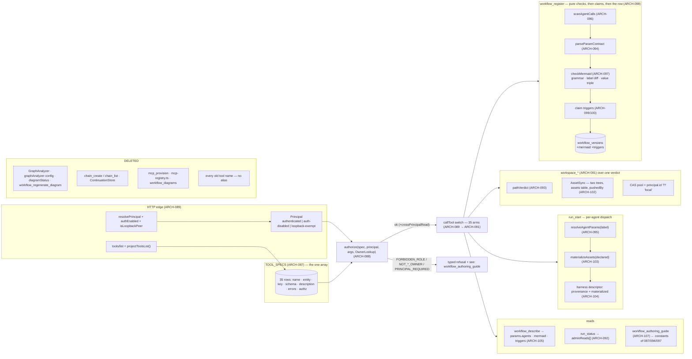

**(2) Development view** — files new / extended / deleted / fenced:

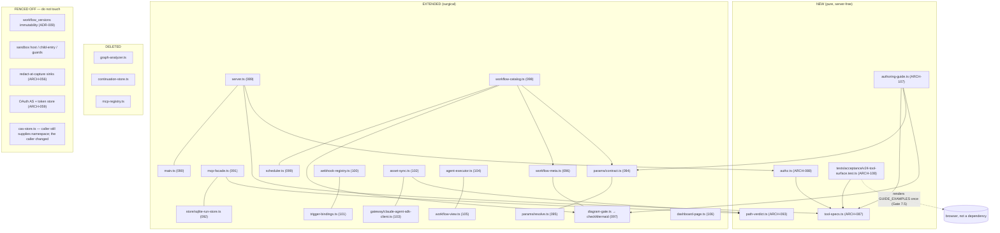

**(3) Process view** — register with claims, start with per-agent resolution, the audited cross-read:

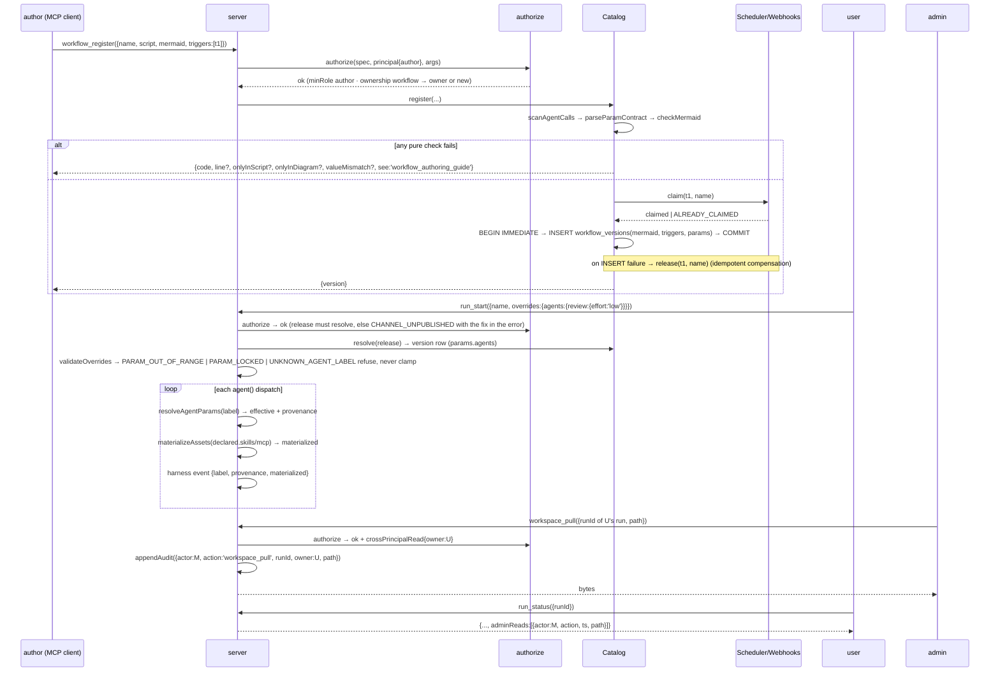

**(4) Deployment view** — **unchanged topology**: one Node process, the same SQLite files under `workRoot`,
no new port, sidecar or daemon; **fewer** moving parts (no analyzer model call at registration, no
continuation reconciler). Operational deltas, all for DEPLOY.md: (i) `principals` config block — auth on and
no block ⇒ every authenticated caller is `user` (ADR-028), so the operator adds themselves as `admin` in the
same edit that enables auth; (ii) `mcpEgressAllowlist` (ADR-030) — empty ⇒ author `http` MCP pushes are
refused until hosts are listed; (iii) the `graphAnalyzer` block is gone and warns once if present; (iv) boot
migrations: `schedules.workflow`/`webhooks.workflow` → `claimedBy`, global-tree assets and `mcp_provisions`
→ `catalog.assets` with `pushedBy:'legacy'`, `workflow_diagrams` dropped; (v) **every old tool name is gone**
— the client plugin (ARCH-013) must ship the new names first; (vi) registration is total: no outbound model
call, no `diagramStatus`.

**(+1) Scenarios**
- *S-1 — the cold model (REQ-117, the iteration's acceptance)*: a fresh instance outside this project tree, with `tools/list` + `workflow_authoring_guide` only, authors a multi-agent workflow with its Mermaid, registers, publishes, runs and reads a correct result first try. Every fact it relied on (ceilings, locked keys, shapes, error codes, `run_start`'s two trap sentences) came from constants the validators also read — a wrong step is a red test in ARCH-087/107, fixed and re-run with another fresh instance.
- *S-2 — the honest author who forgot the picture*: adds `agent(prompt, {label:'verify'})`, re-registers with the old diagram → `DIAGRAM_SCRIPT_MISMATCH { onlyInScript:['verify'], see }`; fixes the diagram but writes `opus · high · 300s` while meta defaults say `sonnet · medium · 120s` → `DIAGRAM_VALUE_MISMATCH`; nothing was stored either time (ADR-025).
- *S-3 — the user tunes one agent*: `workflow_describe` shows `params.agents.{analyze, review}`; `run_start({overrides:{agents:{review:{timeoutMs: 999999}}}})` → `PARAM_OUT_OF_RANGE` naming `maxTimeoutMs 600000` (never clamped); with `60000` the run's harness event for `review` shows `timeoutMs: 60000, provenance: 'override'` and `analyze` shows its `default`.
- *S-4 — the audited cross-read*: an `admin` pulls a file from another principal's run; the `audit_events` row exists **before** the bytes are served; the run owner's `run_status` shows `adminReads[]`; a `user` attempting the same gets `NOT_RUN_OWNER`.
- *S-5 — the forgotten cron*: `schedule_create({cron})` returns an id; nobody claims it; it fires 1440 times in a day and `schedule_list` shows `refusalCount: 1440, lastRefusalReason: 'UNCLAIMED'` — one row, nothing dropped, no run started. `workflow_register({triggers:[id]})` by a different principal → `NOT_TRIGGER_OWNER`; by its creator → claimed; a second workflow claiming it → `TRIGGER_ALREADY_CLAIMED`. `workflow_deregister` returns `releasedTriggers:[id]` and the schedule is unclaimed again, not deleted.
- *S-6 — fifty authors, one skill name*: two authors each `workspace_push({workflow:<own>, kind:'skill', name:'review'})`; both exist (`<workRoot>/<wf>/assets/skill/review/`), `workspace_list` on either shows only its own plus global `builtin:true` rows, each with `pushedBy`; a run of workflow A whose `analyze` declares `skills:['review']` materializes A's `review` only, and the harness event lists it under `materialized.skills`.
- *S-7 — the MCP push under the new gate*: an `author` pushes `{kind:'mcp', config:{url:'http://10.0.0.5:9000'}}` with an empty allowlist → `EGRESS_DENIED`, nothing stored, no probe fired; the same with a `command` → `FORBIDDEN_ROLE` (stdio is admin-only); an admin's stdio push is probed then stored with `pushedBy`.
- *S-8 — the surface itself (REQ-118)*: the generated table has one row per `TOOL_SPECS` entry; `tools/list` over real HTTP contains none of the 15 old names; `issue_comment_post` rows read `UNVERIFIED(no GitHub token)` rather than being absent; the client plugin's guidance skill has been updated to the new names before the S-1 probe runs (its old `workflow_run` would hand the cold client an unknown-tool error).
- *S-9 — the unwired block*: an operator enables auth and forgets `principals`; the next `workflow_register` from their own account returns `FORBIDDEN_ROLE` (they are `user`) — loud within minutes, never silently `admin` for everyone.

### v24 data architecture

Storage stays SQLite/`better-sqlite3` — no ADR, settled long ago. v24 adds **`assets`** to `catalog.db`,
**`audit_events`** to the run store, columns to `workflow_versions`, `schedules`, `webhooks`, and drops
`workflow_diagrams`, `mcp_provisions`, `continuations`. The three trigger/catalog/run databases remain
**separate files**, which is why claims are compensated rather than joined (ADR-026).

```mermaid
erDiagram
  WORKFLOWS ||--o{ WORKFLOW_VERSIONS : "has versions (append-only)"
  WORKFLOWS ||--o{ ASSETS : "owns (workflow scope); '' = global"
  WORKFLOWS ||--o{ SCHEDULES : "claimedBy (name-level, exclusive)"
  WORKFLOWS ||--o{ WEBHOOKS : "claimedBy (name-level, exclusive)"
  RUNS ||--o{ AUDIT_EVENTS : "admin cross-principal reads"
  WORKFLOW_VERSIONS {
    text name PK
    text version PK
    text script
    text params "v24: params.agents.<label> — model/effort/timeoutMs required defaults; skills/mcp locked"
    text mermaid "v24 NEW — author-supplied, validated by checkMermaid; NULL only on pre-v24 rows"
    text triggers "v24 NEW — JSON string[] of claimed trigger ids; NULL only on pre-v24 rows (⇒ all claimed fire)"
  }
  ASSETS {
    text workflow PK "v24 NEW table — '' is the global-scope sentinel"
    text kind PK "skill | mcp (hook rejected by construction)"
    text name PK
    text pushedBy "REQ-114 — never null on a post-v24 push; 'legacy' for migrated rows"
    text pushedAt
    text config "mcp only — the probed server config (former mcp_provisions.config)"
  }
  SCHEDULES {
    text id PK "schedules.db"
    text claimedBy "v24 — replaces workflow NOT NULL; NULL = unclaimed"
    text createdBy "v24 — principal; NULL when auth disabled / legacy"
    text cron
    int enabled
    int refusalCount "v24 — coalesced refusals (ADR-031)"
    text lastRefusedAt
    text lastRefusalReason "UNCLAIMED | CLAIMED_WORKFLOW_MISSING | NOT_IN_RELEASE | CHANNEL_UNPUBLISHED"
  }
  WEBHOOKS {
    text id PK "webhooks.db"
    text claimedBy
    text createdBy
    text secret "LIVE CREDENTIAL — verified BEFORE any claim-state answer"
    int enabled
    int refusalCount
    text lastRefusedAt
    text lastRefusalReason
  }
  RUNS {
    text id PK "run store"
    text name
    text status
    text principal "v15 column — the run owner; v24 indexes (name, status, createdAt)"
    text createdAt
  }
  AUDIT_EVENTS {
    int seq PK "v24 NEW — AUTOINCREMENT, append-only like transitions"
    text ts
    text actor "the admin"
    text action "workspace_list | workspace_pull | agent_log_read"
    text runId FK
    text owner "the principal whose run was read"
    text path
  }
```

- **Indexes**: one new, `runs(name, status, createdAt DESC)` for `run_list` filters (required — ARCH-091). Everything else is by primary key at human-rate row counts.
- **Lifecycle**: `assets` rows die inside `deregister`'s transaction; the asset directory and the trigger releases are compensating after-hooks. `audit_events` are never deleted (append-only; bounded by admin behaviour, not by traffic). Refusals are coalesced, so no table grows per fire.
- **Migrations (boot, idempotent, ARCH-071 precedent)**: `schedules.workflow`/`webhooks.workflow` → `claimedBy`; global-tree asset directories → `assets(workflow='', pushedBy='legacy')`; `mcp_provisions` → `assets(kind='mcp', config, pushedBy='legacy')` then dropped; `workflow_diagrams` dropped; `continuations` dropped (any `pending` continuation is logged once and discarded — the tool that created it no longer exists).

### v24 interface & API contracts

| surface | contract delta | errors |
|---|---|---|
| `tools/list` | **projection of `TOOL_SPECS`** — 35 names, each description ending in `Errors: …` and `See also: …`; **no old name present**; `workflow_register`'s description tells a cold client to call `workflow_authoring_guide` first | unknown tool for any old name |
| `workflow_register({name, script, mermaid, triggers?})` | `mermaid` **required**; `triggers` optional ids created earlier; **no `defaults`** (ADR-035); `minRole:'author'`; owner-or-new; every refusal carries `see:'workflow_authoring_guide'` and, where it applies, `line`, `onlyInScript`/`onlyInDiagram`, `valueMismatch` | `PARSE_ERROR`, `AGENT_LABEL_REQUIRED`, `AGENT_LABEL_NOT_LITERAL`, `AGENT_OPTS_NOT_LITERAL`, `PARAM_IN_SCRIPT`, `PARAM_CONTRACT_INVALID`, `AGENT_UNDECLARED`, `AGENT_DECLARED_NOT_IN_SCRIPT`, `MERMAID_REQUIRED`, `MERMAID_INVALID`, `MERMAID_RULE_VIOLATION`, `DIAGRAM_SCRIPT_MISMATCH`, `DIAGRAM_VALUE_MISMATCH`, `TRIGGER_NOT_FOUND`, `TRIGGER_ALREADY_CLAIMED`, `NOT_TRIGGER_OWNER`, `UNKNOWN_ALIAS`, `NOT_WORKFLOW_OWNER`, `FORBIDDEN_ROLE` |
| `workflow_deregister({name})` | → `{removed, releasedTriggers: string[]}`; deletes versions + assets (rows and tree); releases, never deletes, triggers | `NOT_WORKFLOW_OWNER`, `FORBIDDEN_ROLE` |
| `workflow_publish`, `workflow_describe`, `workflow_list({onlyRunnable?})`, `workflow_source({name, version?})`, `workflow_authoring_guide()` | `describe.params` is `{agents: Record<label, …>, args}`, `describe.mermaid` string\|null (+ `mermaidNote`), `describe.triggers[]` from claims; `list` rows carry `runnable`, `user` defaults `onlyRunnable:true`; `source` = former `workflow_get`, `minRole:'author'`, non-owner gets the masked projection with `see:'workflow_describe'`; the guide is one text response built from the enforcement constants | `CHANNEL_UNPUBLISHED`, `UNKNOWN_VERSION`, `WORKFLOW_NOT_FOUND`, `FORBIDDEN_ROLE` |
| `run_start({name, version?\|channel?, args?, seed*, overrides?:{agents:{<label>:{model?, effort?, timeoutMs?, appendPrompt?}}}})` | former `workflow_run`; overrides **per agent only** (flat form gone; closed schema); description carries the two first-try sentences (publish-first; poll `run_status` then `run_result`) | `CHANNEL_UNPUBLISHED` (with the fix), `UNKNOWN_AGENT_LABEL`, `PARAM_LOCKED`, `PARAM_OUT_OF_RANGE`, `UNKNOWN_ALIAS`, `SEED_*` (unchanged) |
| `run_status`, `run_result`, `run_suspend`, `run_resume`, `run_stop`, `run_agent_log`, `run_list({workflow?, status?, limit?})` | renamed from `workflow_*`; **ownership `run`** on every one (admin bypass; `run_agent_log` cross-read audited); `run_status` adds `adminReads[]` for the owner; `run_list` filters by principal in SQL for non-admins | `NOT_RUN_OWNER`, `RUN_NOT_FOUND` |
| `workspace_diff({manifest})` | former `seed_plan`; no scope argument; pool = caller's namespace | — |
| `workspace_push` | mode A `{sha256, contentB64}` → CAS (former `blob_put`; namespace from principal, `'local'` when auth is off); mode B `{workflow, kind:'skill'\|'mcp', name, files\|config, scope?:'global'}` (former `asset_push` + `mcp_provision`); **`runId` present → refused** | `BLOB_HASH_MISMATCH`, `INVALID_ARGUMENT`, `HOOKS_UNSUPPORTED`, `RESERVED_PREFIX`, `MCP_PROBE_FAILED`, `EGRESS_DENIED`, `NOT_WORKFLOW_OWNER`, `FORBIDDEN_ROLE` (stdio or global by a non-admin) |
| `workspace_pull({runId, path, offset?, length?})`, `workspace_list({runId} \| {workflow, kind})`, `workspace_delete({runId, paths[]} \| {workflow\|scope:'global', kind, name})`, `workspace_purge({runId})` | former `workflow_artifact_get` / `workflow_artifacts`+`asset_list` / `asset_delete`+new partial delete / same; `list({workflow, kind})` returns both scopes with `scope`, `builtin`, `pushedBy`, `pushedAt`; `delete`/`purge` on a `queued\|running\|suspended` run refused inside `RunManager` | `NOT_RUN_OWNER`, `RUN_NOT_TERMINAL`, `PATH_ESCAPE`, `NOT_WORKFLOW_OWNER`, `FORBIDDEN_ROLE` |
| `schedule_create({cron\|at\|resident})`, `webhook_create()` | **no `workflow` argument, no catalog resolve** (the v22-H4 check moved to `workflow_register`); return `{id}` / `{webhookId, url, secret}` with `createdBy` recorded; `minRole:'author'` | `INVALID_CRON`, `INVALID_AT` |
| `schedule_list`, `webhook_list`, `schedule_delete`, `schedule_setEnabled`, `webhook_delete` | rows carry `claimedBy`, `createdBy`, `refusalCount`, `lastRefusedAt`, `lastRefusalReason`; mutations are ownership `trigger` (creator or admin) | `NOT_TRIGGER_OWNER` |
| `POST /webhooks/:id` (ingress) | verify HMAC → timestamp → dedup → **then** claim/membership/publish → `409 TRIGGER_UNCLAIMED\|CLAIMED_WORKFLOW_MISSING\|NOT_IN_RELEASE\|CHANNEL_UNPUBLISHED`, recorded on the row | 401 / 403 / 404 / 409 |
| `issue_report`, `issue_get`, `issue_list`, `issue_get_comments({number, latest?, limit?})`, `issue_comment_post` | `issue_comments` → `issue_get_comments` (read; `latest` only), `issue_comment` → `issue_comment_post` (write; side effect named); all roles | unchanged |
| `models_list`, `system_info` | unchanged; all roles | unchanged |
| `POST /assets/blob/:sha` | namespace from the principal, same rule as `workspace_push` mode A | unchanged |
| `rwe.config.json` | `+principals?: Record<string, {role}>` (forwarded in `composeConfig()`, wiring-test row, fail-closed default); `+mcpEgressAllowlist?: string[]`; `−graphAnalyzer` (warns once if present) | — |
| harness transcript event | `+label`, `+provenance` per key (`override\|default\|agentType\|engine`), `+materialized: {skills[], mcp[], missing[]}` | — |
| `docs/AUTHORING.md` | **generated** from `buildAuthoringGuide()`; a test diffs the committed file against the output | — |

### Decision rationale — v24 (ARCH-087..108, ADR-023..035; REQ-107..118)

- **Convergence.** No round 2 was needed: the two round-1 proposals agree on every structural choice (one
  authz table before dispatch; fixed grammar not a renderer; guide rendered from constants; per-agent
  harness descriptor; `principals` into the wiring guard; drop the analyzer as a double win). The
  remaining differences were referee-decidable: **audit read-back** — QD's `run_status.adminReads[]`
  adopted over adversarial's "no reader" because this ledger already graded write-without-readback as debt
  (AC-2/ARCH-085); adversarial's "no new tool / no dashboard panel" kept (ADR-027). **Refusal
  coalescing** — QD raised the unbounded-rows risk and offered pause-or-coalesce as an owner call;
  adversarial wrote per-fire rows; coalescing on the trigger row takes QD's bound without changing the
  owner-visible behaviour, so no ruling was needed (ADR-031). **Value-triple compare** — adversarial only;
  adopted because ch. 12's "every tunable of every agent has a default" makes it sound, and its absence
  is the "picture says opus, meta says haiku" failure this ledger has met fifteen times (ADR-029).
- **Panel gaps already ruled by the owner (closed by citation, not relayed).** Adversarial G1 (`chain_*`
  deletion unnamed in REQs) — ruled [OWNER] at working notes ch. 5, and REQ-107's tool set is the trace.
  G3 (`mcp_provisions` scope) — resolved by the owner's asset model (ch. 19 + REQ-113/114 "any asset or
  MCP config"): MCP is a kind of asset, one table (ADR-030). G4 (who may claim) — ch. 15.2 "only their
  own": creator or admin (ADR-026). G5 (`run_trigger` breaks the `run_*`-keyed-by-`runId` rule) — moot,
  ch. 16.1 removed `run_trigger`. Adversarial ADR-030's "keep `mcp_provision`" — superseded by ch. 16.2's
  merge. QD-R4 (legacy assets owner-less) — migrated as global `pushedBy:'legacy'` rows (ARCH-098).
- **Altitude.** Both panels: v24 is a control-plane slice argued at system altitude, with agent altitude in
  exactly three places — the consumer of the surface is an LLM (REQ-116/117: descriptions and error
  envelopes *are* the API), REQ-110 is LLM-decoupling at the authoring layer (no model name in any
  script), and REQ-113's selective materialization is context hygiene. Memory metabolism / self-reflection
  / tool-liveness are named by QD as out of scope and are not smuggled in.
- **The one push-back on a Gate 1 ruling (ADR-030).** Opening MCP push to authors was justified by
  traceability (`pushedBy`). Adversarial R1 verified the probe `spawn()`s an author-supplied command and
  `fetch`es an author-supplied URL with no egress gate — audit answers *who*, not *what the probe can
  reach*. Architecture fails closed: `http` through the existing allowlist, `stdio` admin-only. Surfaced
  for confirm-or-overrule; nothing else in this slice narrows an owner ruling.
- **Karpathy check per lens.** Security: one `Principal` union, one `authorize`, one `pathVerdict`, one
  egress gate reused — no new trust tier. Scalability/consistency: one index, one compensation sequence,
  single-process stated; store merge named and declined. Testability: four new files are pure and
  server-free; every drift rule is a unit test over an array, not a review item. Observability: three
  "recorded" clauses each have a named reader (`workspace_list.pushedBy`, `run_status.adminReads[]`,
  `schedule_list/webhook_list` refusal fields); the harness descriptor records what was materialized.
  Replaceability: role source is one function; model binding leaves scripts entirely. Consumability:
  refuse-never-clamp, both diff sets on every mismatch, traps on `run_start`'s own row, `runnable` on
  `list`. Self-sustainability: registration is total (no model, no async, no reconciler); refusals bounded;
  `principals` fails closed. Simpler-of-equals: `diagram-gate.ts` kept as the module name (REQ-111 says
  "repurposed"), rectangle for the black box (Mermaid's default), coalesce over pause, source text over a
  renderer, one `assets` table over two registries.
- **Requirement notes for the orchestrator (not user decisions).** `state.yaml`'s "40→36" predates ch. 16;
  the derivation above gives 35 and `TOOL_SPECS.length` is the check. REQ-109's acceptance still names
  `mcp_provision`; the clause is satisfied by the authz row on the `workspace_push` mcp mode. The client
  plugin (ARCH-013, separate repo, no ledger) must ship the new tool names before the REQ-117 probe —
  named in S-8 and the deployment view. **Two shipped REQs now point at deleted code and should be marked superseded in 01-requirements.md by the orchestrator (a ledger-consistency line, not a user decision):** REQ-104 (the `graphAnalyzer` config block) is retired by REQ-111 — working notes ch. 1 marks it 全作廢; REQ-103's staleness clause (`diagramStale`, `bindingsFingerprint`) is superseded because the trigger set is now a declared input on the version row (ARCH-098/101) and cannot go stale relative to a diagram the author drew from it — `describe.triggers[]` remains the live truth REQ-103 asked for.

### ARCH-109 — server-side Mermaid→SVG: `diagram-render.ts` (an mmdc child process behind a `(name, version)` cache that doubles as the anonymous route's limiter) + `GET /api/workflows/:name/diagram.svg`
- **status:** draft
- **traces:** REQ-119, REQ-111, REQ-112
- **module:** src/diagram-render.ts
- **deps:** ARCH-105, ARCH-106, ARCH-089
- **api:** `renderWithMmdc(mermaid, signal, {cliPath?, env?}) → Promise<{ok:true,svg} | {ok:false, reason:'RENDERER_MISSING'|'RENDER_TIMEOUT'|'RENDER_FAILED'|'RENDER_BUSY', detail?}>` — spawns `node <mmdc cli> -i in.mmd -o out.svg -c mermaid.json -p puppeteer.json` in a per-render temp dir, `detached` (own process GROUP), and never throws; `resolveMmdcCli(): string | null`; `class DiagramRenderer {get(name, version, mermaid); invalidate(name); size()}` with `RENDER_TIMEOUT_MS=20000`, `MAX_CONCURRENT_RENDERS=2`, `MAX_CACHED_DIAGRAMS=128`. Route: `GET /api/workflows/:name/diagram.svg[?version=]` inside `handleDashboardRequest` — resolves `(version, mermaid)` through the SAME `facade.workflowDescribe` the neighbouring `/describe` route uses, then `200 image/svg+xml` + `X-Content-Type-Options: nosniff` + `Content-Security-Policy: default-src 'none'; style-src 'unsafe-inline'; img-src data:` + `X-Diagram-Cache: hit|miss`, `404 {code:'DIAGRAM_UNAVAILABLE', reason:'LEGACY_NO_DIAGRAM'}` for a pre-v24 row, `503 {code:'DIAGRAM_RENDER_UNAVAILABLE', reason}` for every degradation. `ServerConfig.diagramRender?: DiagramRendererOpts` is the injection seam (tests replace `render`); `McpFacadeDeps.diagramCache` lets `workflow_deregister` call `invalidate(name)` beside the existing asset-tree delete.
- **note:** The cache is a SECURITY component, not an optimization: adjudication #8 H-1 made this route family anonymous, and REQ-119 makes rendering lazy, so without cache-first + single-flight + a cap an unauthenticated GET spawns a ~300MB browser per request. Two mermaid options are load-bearing and were measured, not assumed: `htmlLabels:false` (author text becomes an entity-escaped `<tspan>` instead of real HTML in a `<foreignObject>` — with the default, a label of `` is FETCHED by the engine's own Chrome at render time, observed in the render log) and `--proxy-server=127.0.0.1:9` as a blanket egress blackhole. The same flag preserves REQ-112's `<br/>` triple as two rendered ROWS (measured: `writer` / `sonnet · low · 60000`), which the client-side alternative could not do at `securityLevel:'strict'`.
- **iter:** v25

### ADR-036 — `@mermaid-js/mermaid-cli` is a DECLARED `optionalDependency` resolved through node, never an `npx` fetch at request time
- **status:** draft
- **traces:** REQ-119
- **note:** Context: the render path was first proven with `npx -y -p @mermaid-js/mermaid-cli mmdc …`, i.e. an undeclared dependency the engine discovers at run time. Options: (a) a hard `dependencies` entry — `npm ci` on the production box (and inside `rwe-update.sh`, whose failure REVERTS a release) then downloads puppeteer's ~150MB Chrome, and a registry hiccup fails the deploy of an engine whose core has nothing to do with diagrams; (b) keep discovering it via `npx` — an ANONYMOUS, unmetered HTTP route would then be able to trigger a package DOWNLOAD and an unbounded first-call latency on the engine host, which is a worse version of the exhaustion REQ-119's three defences exist to close, plus a silent supply-chain fetch on every fresh box; (c) declare `@mermaid-js/mermaid-cli` + its `puppeteer` peer in `optionalDependencies` and resolve the CLI with `createRequire(...).resolve()`. Decision: (c). It is auditable (a version in `package-lock.json`, a name in `npm audit`), it never fails an install — npm tolerates an optional dep whose install or postinstall fails, so a box that cannot fetch Chrome still boots and simply degrades to the source display (`RENDERER_MISSING`, UT-168) — and no request path ever touches the network. Consequence: the engine inherits `PUPPETEER_EXECUTABLE_PATH`, which is puppeteer's own native override, so a host with a shared Chrome installs with `PUPPETEER_SKIP_DOWNLOAD=1` and points at it. Cost recorded honestly: `npm install` grows by 188 packages, and `npm audit` reports 11 advisories in that subtree (0 in the engine's own three runtime dependencies) — the renderer is a build-time tool for a dashboard picture, and it runs as a short-lived child process with a blackholed proxy, but the number belongs in the ledger rather than in a footnote. **Second cost, measured not assumed: `--no-sandbox`/`--disable-setuid-sandbox` are REQUIRED, not inherited habit — a render with the flags removed fails to launch Chrome at all on this host. So Chrome's own renderer sandbox is OFF while it parses an author's document. What bounds that: the document is a Mermaid text file (not arbitrary HTML), `htmlLabels:false` means no author text is ever parsed as HTML, `--proxy-server=127.0.0.1:9` blackholes egress, and the process is short-lived and group-killed on the deadline. It is stated here so the next reader knows it was a decision.**
- **iter:** v25

## v26 slice — the seed refusal, terminal provider errors, three providers, a phase-accurate DAG, a money-aware budget, the swimlane contract (REQ-121..130): ARCH-110..121 + ADR-037..047

**How this section was decided.** A real two-group lens panel ran before this synthesis and its proposals are on disk: `.panel/architecture/adversarial.r{1,2}.md` (security × scalability/consistency × testability, Karpathy simplicity-first as the tie-breaker) and `.panel/architecture/quality-dimensions.r{1,2}.md` (observability / replaceability / consumability / self-sustainability). Round 2 converged on almost everything; this section takes the round-2 stance and the file-end **Decision rationale — v26** records, per contested point, who conceded and why. Safety class is QM, so the ISO 26262 / 21434 lenses are absent by tailoring, not by omission.

**The slice in one sentence.** Five of the ten REQs are the *same* defect at five seams — a projection over an external payload with a silent default (`contentB64 ?? ''`; `extractEvents` returning `[]` for every `system` message; `usage.input_tokens ?? 0`; `markDone` overwriting the resolved provider with the transport name; `markQueued(key.opts.phase)` reading a field no writer sets) — so v26 is **four corrections** (REQ-121/122/125/124), **two structural additions** (one pure `ExpectedGraph` derivation shared by the registration checker and the run-DAG layout; one `ModelBook` snapshot that answers price and declared capability once per run), and **one large deletion** (the `openai` and `gemini` provider paths, the non-Anthropic tool curation, two dead effort tables). Zero new services, zero new runtime dependencies, three new pure files (`src/providers.ts`, `src/skeleton-graph.ts`, `src/models/model-book.ts`), two new SQLite columns (`workflow_versions.diagram_contract`, `runs.price_book`), and a net-negative line count.

**Altitude split** (both apply; each REQ read at the one that fits). *Agent altitude* — REQ-122 (a model call's failure must be inspectable within one attempt, not a 240 s silence), REQ-123 (three interchangeable provider paths with no per-provider tool patch), REQ-126 (the reasoning dial reaches the wire or says honestly that it did not), REQ-127 (metering real money), REQ-128/130 (the author is a cold model; the guide and the refusal envelope *are* the API). *System altitude* — REQ-121 (input validation that fails closed), REQ-124 (a read-side join), REQ-125 (record integrity), REQ-129 (rendering).

**NFR ownership (exit-gate 1c).** No REQ in this ledger carries a `kind:` field, so there is no `kind:nfr` set to decompose separately; the quality requirements are ordinary REQs and each has a named owning module: failure observability → **ARCH-111** (+ **ARCH-115** for "which path broke"); cost limits → **ARCH-118** (`RunGuard` stays the single enforcement door) fed by **ARCH-116**'s pinned prices; deployment fail-closed / never-down → **ARCH-112** + **ADR-042**; documentation and first-try authoring → **ARCH-121** + **ARCH-119**; dashboard rendering/readability → **ARCH-120**; logging/redaction is unchanged (ARCH-056 redact-at-capture) and every new persisted string joins its sweep (INV-V26-5). No health endpoint or limits module is added: the existing `RunGuard`, `AgentSemaphore` and the anonymous-route render cap already own those qualities.

**Scale and feature model.** `state.yaml` declares no `scale`, and the 109 ARCH items preceding this slice carry no `build:` / `selftest:` / `flag:`; v26 follows the ledger's S/M form rather than minting a parallel convention mid-project. **No `FLAG-*` is minted** — v26 introduces no switchable capability: `diagram_contract` v1/v2 is data versioning on an immutable row (ADR-043), and `gateway: "sdk" | "direct-fetch"` / `useLiteLLMProxy` are pre-existing runtime config, not compile/feature switches.

### ARCH-110 — `validateSeedSpec`: every `seed` element is checked before any byte is written; the schema describes all three seed shapes
- **status:** draft
- **traces:** REQ-121, REQ-025, REQ-065, REQ-082
- **module:** src/workspace-seed.ts
- **deps:** ARCH-007, ARCH-087, ARCH-091, ARCH-093
- **api:** `validateSeedSpec(seed: unknown) → { ok: true; files: SeedFile[] } | { ok: false; code: 'INVALID_SEED_SPEC'; path: string; index: number; hint: string }` — refuses the FIRST element whose `path` or `contentB64` is not a string, before the first `mkdirSync`; `materializeSeed(files)` takes only validated files and THROWS instead of `?? ''` (defence in depth, not the gate). `TOOL_SPECS.run_start` gains item shapes: `seed.items = {type:'object', required:['path'], properties:{path:{type:'string'}, contentB64:{type:'string', description:'REQUIRED — base64 of the file bytes; a missing/non-string value raises INVALID_SEED_SPEC'}}}`; `seedManifest.items = {required:['path','sha256'], sha256:{pattern:'^[0-9a-f]{64}$'}, exec?:boolean}` (bytes come from the CAS via `workspace_push`); `seedManifestRef = {type:'string', pattern:'^[0-9a-f]{64}$'}`; two sources together stay `SEED_SOURCE_CONFLICT`.
- **note:** Boundary: the validator is pure and lives with the materializer it protects; admission (`mcp-facade` → `run_start`) is the only caller. Validate-all-then-write makes a seed atomic with respect to spec errors — today's loop writes as it iterates, so a malformed element mid-list leaves a half-materialized workspace that agents then run on (issue #64's five empty runs are the degenerate all-empty case). `INVALID_SEED_SPEC` is an EXISTING catalog row (`errors.ts:112`, `see: null`): v26 makes the `seed` path actually raise it, rewrites the hint to *"seed elements carry bytes inline as contentB64 (string, base64); to seed by sha256 use seedManifest (blobs pushed via workspace_push) or seedManifestRef"*, and sets `see: 'workflow_authoring_guide'` — without that the catalog test in ARCH-119 would pass on the old generic row. Why a post-schema validator and not ajv `required`: ajv refuses as `INVALID_ARGUMENT` with no pointer to the shape the caller meant, and the specific-code-after-schema pattern already exists (`SEED_SOURCE_CONFLICT`); the schema description still says REQUIRED so `tools/list` does not lie. Base64 garbage is deliberately NOT decode-verified — byte exactness is what the sha-verified `seedManifest` route is for, and saying so costs less than a second decoder. `additionalProperties:false` on `seed.items` is NOT set, and that is a decision rather than unfinished work — see the amendment below.
- **amended (2026-09-11, Gate 8 send-back repair, architecture half — review LOW D-7, scheduled for "the next Gate 2 touch"):** the original closing sentence read as a TODO (*"lands ONLY after the plugin client `push_workspace.py` is confirmed to send exactly `{path, contentB64}`"*). The condition WAS met and the action was deliberately NOT taken, with the reason recorded in a nine-line comment at `src/tool-specs.ts:457-474`: closing the schema puts ajv's generic `INVALID_ARGUMENT` **in front of** the typed `INVALID_SEED_SPEC` that names the offending path — which restores the whole content of issue #64, the defect this item exists to close. Conflict adjudicated on the panel's own split: security wants the closed schema, consumability wants the refusal that names the path; **consumability wins**, because the residual risk (an extra key is ignored) materialises nothing while the regression is the exact user-visible failure REQ-121 was written for. A note that reads as a TODO for a decision already made is the same defect class as A-1, one size smaller.
- **iter:** v26

### ARCH-111 — provider errors end the attempt: `classifyApiError` over the SDK's closed error union, `_drain` reads `system/api_retry`, the controller is always created and always aborted, `retryable:false` stops both retry loops
- **status:** draft
- **traces:** REQ-122, REQ-020, REQ-037, REQ-038, REQ-083
- **module:** src/gateway/claude-agent-sdk-client.ts
- **deps:** ARCH-005, ARCH-056, ARCH-104, ARCH-112
- **api:** `classifyApiError(kind: SDKAssistantMessageError, status: number | null) → 'terminal' | 'retry'` — pure and total over the SDK's closed union: `authentication_failed | oauth_org_not_allowed | billing_error | invalid_request | model_not_found → terminal`; `rate_limit | overloaded | server_error | max_output_tokens → retry`; `unknown → status in 400..499 && status ∉ {408, 429} ? terminal : retry`. `GatewayResult` (failure arm) gains `retryable?: false` and `error?: { kind: string; status: number | null; attempt: number }`. `_drain(session, model, onEvent)` handles `msg.type==='system' && msg.subtype==='api_retry'`: a **retry** classification emits `{kind:'message', data:{type:'api_retry', status, kind, attempt, max_retries}}` — five scalars, no provider text — and lets the CLI's own backoff continue under the engine's `timeoutMs`; a **terminal** classification emits `{kind:'message', data:{type:'error', detail, status, kind, attempt}}` and returns `{ok:false, reason:'terminal', retryable:false, detail, error, events}`. `_invokeOnce` creates the `AbortController` UNCONDITIONALLY and calls `controller.abort()` in its `finally` after the race settles. `invoke()` gains `if (!last.ok && last.retryable === false) break;`; the direct-fetch client sets the same `retryable:false` from its own 401/403/404. `AgentRecord.detail?: string` (present on `failed` only, written by `capture()` from `result.detail`). Unmapped `system` subtypes are counted, never stored: `GatewayResult.unmapped?: string[]` → `run_result.meta.unmappedMessages: Record<subtype, count>`.
- **note:** Boundary: detection stays behind each transport (the SDK's message vocabulary must not grow a copy inside `client.ts`); only the *classification* — `retryable` + `error` on the shared result type — crosses. Liveness is the real payload: today a 401 holds a RunGuard slot and a host semaphore for `timeoutMs × (1+retries)` while a CLI subprocess retries ten times against a provider that already said no — on a 24-wide `parallel()` that is 24 dead subprocesses for four minutes. The abort lives in `finally`, not inside `_drain`: `bound` resolves synchronously on `abort()`, so aborting before `_drain` returns can let the timeout arm win the race and misreport `reason:'timeout'`. Two bounded strings, both from a stream the engine does not author: `detail` is redacted THEN capped at `MAX_ERROR_DETAIL_BYTES = 1024` (cutting before `redact()` can split a secret and defeat its value-exact match) and joins the REQ-083 sink sweep; the unmapped **subtype** is capped at 64 bytes and restricted to `[a-z0-9_.-]` (anything else → `?`). No payload of an unmapped message is stored at all — `redact()` is value-exact over secrets the engine was told about, so it cannot protect a body echoing something it was not; the name-and-count keeps the irreducible fact that something was dropped. The live `run_status` reply stays un-redacted by design (DES-088 persist-only redaction); every persisted copy is redacted. Not built: circuit breaker, per-provider health table, retry-policy object — the CLI already retries; the engine's only new job is to recognise *cannot succeed* and stop.
- **iter:** v26

### ARCH-112 — three providers, one home: `providers.ts` (`Provider`, `PROVIDER_CAPS`, `validateAliases`), boot refuses retired providers row by row, the updater runs `--check-config` before it restarts, the retired surface is grep-guarded
- **status:** draft
- **traces:** REQ-123, REQ-016, REQ-037, REQ-038, REQ-070
- **module:** src/providers.ts
- **deps:** ARCH-005, ARCH-090
- **api:** `export const PROVIDERS = ['anthropic','openrouter','ollama'] as const; export type Provider = typeof PROVIDERS[number];` `PROVIDER_CAPS: Record<Provider, { tools: 'all'; effort: EffortProfile | null; thinking: 'sdk-default' | 'budget-when-declared' | 'disabled' }>` — `anthropic: {tools:'all', effort:{param:'effort', restPath:['output_config','effort'], value: e => e}, thinking:'sdk-default'}`, `openrouter: {tools:'all', effort:{param:'thinking', restPath:['thinking','budget_tokens'], value: e => ({type:'enabled', budgetTokens: REASONING_BUDGET[e]}), requires:'caps.reasoning'}, thinking:'budget-when-declared'}`, `ollama: {tools:'all', effort:null, thinking:'disabled'}`. `validateAliases(aliases) → { ok:true } | { ok:false; offenders:{alias, provider}[]; allowed: readonly Provider[] }` — pure, lists EVERY offending row; `composeConfig()` throws with all of them named (`"…provider 'openai' on alias 'gpt41' is not supported (allowed: anthropic, openrouter, ollama); also: gpt4omini, gpt41mini, gpt41nano — remove these rows"`). `main.ts --check-config` = `loadFileConfig()` + `composeConfig(cfg, {proxyManager: NOOP, listen: false})` → exit 0/1 with the same message, no proxy spawn, no port bind, exposed as `npm run check-config`. `deploy/rwe-update.sh` runs it between the `npm test` gate and `write_result applied`, routes a non-zero exit into the existing `revert_and_fail`, and records `configCheck: 'passed' | 'skipped'`. Deleted and grep-guarded in `no-retired-surface.test.ts` (comment-stripped for `src/`, raw for docs): identifiers `NON_ANTHROPIC_EXCLUDED_TOOLS`, `curateToolsForProvider`, `STATIC_OPENAI`, `effortMapping`, `ProviderEffortProfile`; literals `'openai'`, `'gemini'`; env names `OPENAI_API_KEY`, `OPENAI_API_BASE`, `GEMINI_API_KEY` (`src/`, DEPLOY.md, README.md, `rwe.env.example`).
- **note:** Boundary and column rule: `providers.ts` is pure — no SDK import, no `fetch`, so it stays unit-testable and importable from both gateways. **A per-provider fact earns a column only when two or more readers need it** (`PROVIDER_CAPS` has five: `wireEffort`, `effortBodyFields`, `validateAliases`, `models_list`'s declared columns, the guide's alias table); `keyEnv` (one reader — the direct-fetch arm; LiteLLM reads `OPENROUTER_API_KEY` from its own env), the request/response shapes, the catalog fetchers and the LiteLLM route emitter stay as `switch (provider)` code with a `never` exhaustiveness check, which is the honest form for code. A fourth provider later is one union member plus the `Record` rows `tsc` then demands — no plugin interface, no capability probe, no deprecation window. Security: the `openai` path was also the only one where `OPENAI_API_BASE` let LiteLLM be pointed at an arbitrary URL from the environment; egress narrows to three fixed upstreams. The managed LiteLLM subprocess keeps inheriting `{...process.env}` by design (D-V2G8-1(c)); after v26 no generated route references the retired keys, so a stale value left in an operator's `rwe.env` is inert — REQ-123's "不再被引擎讀取或記載" is a statement about engine code, generated proxy config and docs, and narrowing that env belongs to the hardening tracker (#22), not this slice. The conflict with REQ-070 (fail-closed boot vs an auto-restarting updater) is resolved by ADR-042, not by trusting the deployment order.
- **iter:** v26

### ARCH-113 — `skeleton-graph.ts`: one pure derivation `deriveExpectedGraph(skeleton, scan) → {lanes, slots, edges}`, consumed by the registration checker AND the run-DAG layout so the two can never disagree
- **status:** draft
- **traces:** REQ-128, REQ-124, REQ-111, REQ-112
- **module:** src/skeleton-graph.ts
- **deps:** ARCH-096, ARCH-097
- **api:** `interface ExpectedGraph { lanes: Array<{ index: number; title: string | null; dynamic: boolean; slots: number[] }>; slots: Array<{ index: number; lane: number; labels: string[]; kind: 'single' | 'parallel' | 'alt'; tools: Record<string, string[] | 'default'> }>; edges: Array<{ from: number; to: number }> }`; `deriveExpectedGraph(nodes: SkeletonNode[], scan: AgentCallScan, contract: 'v1' | 'v2' = 'v2') → ExpectedGraph | { refused: 'LANE_MISMATCH'; line: number; label: string }`. Rules in order — (L1) one lane per `phase` node in source order; `title` is the literal when `STRING_ARG_RE` matched, else `null` (a dynamic title matched by POSITION); `dynamic` carries `SkeletonNode.dynamic` (the call sits inside a `for`/`while`/`if`/`.map` body, `workflow-meta.ts:99/385`). (L2) under the v2 contract an `agent()` before the first `phase()` is refused at registration ("every agent must be dispatched inside a phase"), because an unnamed zeroth lane is neither checkable nor drawable — the *layout* still places such records (v1-contract scripts are legal), see ARCH-114. (S1) a sequential `agent()` → one `single` slot; (S2) `parallel([...])` members → one `parallel` slot; (S3) the two arms of one ternary or one `if/else` at the same delimiter depth → one `alt` slot carrying the candidate label set (detected with the string-aware `matchDelimiter` the scanner already has); (S4) `kind:'workflow'` nodes are TRANSPARENT — no slot, no edge constraint, and a `parallel()` of `workflow()` calls yields no slot. (T1) `tools[label]` = the literal `allowedTools` array (sorted) when present, absent → `'default'`. (E1) one edge between consecutive slots, across lane boundaries too.
- **note:** Boundary: pure text analysis, no I/O, no server; the checker that consumes it remains the only gate on author text. The load-bearing property is **one derivation, two consumers** — before v26 the checker knew nothing about phases and the layout knew nothing about the checker, and issue #67 (edges unchecked) and #70 (every agent frame-grouped) are the same missing object seen from two sides. The regex skeleton is kept and the *contract* is narrowed to what it can decide (ADR-039): a `switch`, an `agent()` inside a loop body, an `agent()` reached through a helper are already `SCAN_VIOLATION` or are refused with a line-pointed message. Fixtures are `(script, expectedGraph)` pairs with no server, and the SAME fixtures drive the checker tests (ARCH-119) and the layout tests (ARCH-114).
- **amended (2026-09-11, Gate 8 send-back repair, architecture half — cross-half consistency with M-3):** the `api:` signature above gains the third parameter the M-3 repair added, `contract: 'v1' | 'v2' = 'v2'`. Rule (L2) already said "under the v2 contract", but the SIGNATURE offered no way to say which contract, so the read path had grown a private second derivation (`v1FallbackGraph`) that mapped every scanned call to `kind:'single'` and chained the slots — rendering a v1 script's `parallel([a,b,c])` as three CHAINED slots and asserting a sequential dependency the script does not have, on every pre-v26 workflow on the box. That violated this item's own load-bearing property (**one derivation, two consumers**, INV-V26-3). The parameter restores it: `'v1'` skips L2's refusal (opening one implicit lane on first need) and falls through to the SAME S1–S4/T1/E1 logic, so `call.group` is honoured on both contracts — the registration gate stays strict, the read path stays permissive, which is DES-174's stated split.
- **iter:** v26

### ARCH-114 — the phase is snapshotted at IPC RECEIPT as `{title, index}`, carried on the harness event so resume rebuilds it, never written into the replay key; `inferPhase` repairs existing terminal snapshots; `layoutGraph` joins by lane ORDINAL
- **status:** draft
- **traces:** REQ-124, REQ-008, REQ-119, REQ-055
- **module:** src/dashboard.ts
- **deps:** ARCH-006, ARCH-055, ARCH-104, ARCH-113
- **api:** `SandboxHostConfig.currentPhase?: () => { title: string; index: number } | undefined` — RunManager supplies `() => { const p = this._runs.get(runId)?.phases; return p?.length ? { title: p[p.length-1].title, index: p.length-1 } : undefined; }` to the top-level host AND to every nested-frame host, so a nested frame that calls no `phase()` inherits the parent's current lane. `host.ts` reads it SYNCHRONOUSLY inside `case 'agent'`, before the `Promise.resolve().then(handler)` deferral, and passes it as a fourth handler argument: `AgentRequestHandler(prompt, opts, callSeq, phase?)` → `_handleAgentRequest(…, framePath, phase)` → `markQueued(agentId, label, phase?.title, framePath, phase?.index)`. `AgentRecord.phaseIndex?: number` beside `phase?: string`; the harness event descriptor carries both, and `deriveAgentRecords` (`src/run-store.ts:42`) reads them plus `startedAt` from the event `ts`. `inferPhase(record, phases) → { title: string; index: number } | undefined` — the last `phases[i]` with `ts <= (record.startedAt ?? record.endedAt)`. `layoutGraph(expected: ExpectedGraph, liveAgents, phases: PhaseView[], opts)`; `server.ts` passes `view.phases` and `deriveExpectedGraph(...)`.
- **note:** **Why receipt-time, verified not argued:** `case 'phase'` calls `onPhase` synchronously while `case 'agent'` defers to a microtask, and Node delivers each IPC message on a `nextTick` whose queue drains before microtasks — so when `const p = agent(…); phase('B'); await p` sends both messages in one chunk, a handler-time read stamps the LATER phase. A 20-line `fork()` probe reproduced this 5/5 on the installed Node; the receipt-time read is exact under every ordering. **Why an ordinal beside the title:** titles repeat (`phase('review')` twice) and dynamic titles (`phase('fork:'+tier)`) are truncated to `fork:` or lost entirely by `STRING_ARG_RE`, so string equality — today's join — cannot place them; and on resume the re-running script RE-FIRES `phase()` with fresh timestamps, making the ordinal the one join key a resumed run reproduces exactly. **Invariant (tested): `CallKey` is byte-identical to v25 — `phase` is NEVER written into `key.opts`**; otherwise every pre-upgrade journal misses at callSeq 0 and re-dispatches paid calls on the first resume. **Lane rule:** lane = `record.phaseIndex ?? inferPhase(record, phases)?.index`; runtime index `k` places into skeleton lane `k` when `k < lanes.length` and that lane is not `dynamic`; a record whose timestamps precede the first phase `ts` (or a run with no phases) takes the implicit lane 0 the layout already builds, **without a warning** — a v1-contract script may legally dispatch before its first `phase()` and REQ-124 requires zero warnings on the existing production runs; `k >= lanes.length` (nested frames pushing onto the parent timeline) appends a lane WITH a warning; a `dynamic` lane falls back to frame-grouping WITH a warning. Slot within the lane is matched by label against the expected slot's label set; an `alt` slot consumes one live agent, a `parallel` slot up to its member count. **Three cohorts, stated so the acceptance cannot ask for the impossible:** (i) v26 runs — exact from the live stamp or the harness event, including `refused` records (`markQueued` runs before `assertBudget` and `markRefused` merges onto that record); (ii) pre-v26 TERMINAL snapshots (the ~30 runs on the owner's box) — `inferPhase` over the snapshot's own `phases[]`, exact to the phase boundary, derived at read with zero writes (a back-fill migration would open a second writer to a write-once snapshot — declined); (iii) pre-v26 journals RESUMED across the upgrade — no timestamp pair agrees, so those replayed records keep the frame-grouped fallback WITH a warning.
- **amended (2026-09-11, Gate 8 send-back repair, architecture half — the housekeeping `04-design.md:6259` routed to "the architect"):** two corrections, both record-vs-code. **(1)** `buildRecordsFromTranscript` does not exist — `grep -rn buildRecordsFromTranscript src/` returns nothing; the real function is `deriveAgentRecords` (`src/run-store.ts:42`), the one H-3's restart-survival fix and the review's D-8 both name. A ledger naming a function that cannot be found is the cheapest possible reading failure for the next agent. **(2)** the lane rule's parenthetical "`k >= lanes.length` (**nested frames pushing onto the parent timeline**)" describes a case DES-175 rules out: a nested frame's own `phase()` goes to its own SUB-CARD (`WorkflowNodeView.phases`, pushed by the nested host's `onPhase`, `src/run-manager.ts:1188`) and NEVER onto the parent timeline, precisely because pushing it there would warn on a legal parent script — a warning on correct input is this iteration's failure mode inverted. The `k >= lanes.length` append-with-warning arm survives unchanged, but it is reachable only from a runtime phase index beyond the skeleton's lane count, not from nesting.
- **iter:** v26

### ARCH-115 — the terminal record keeps what the harness resolved; `GatewayResult` says which transport carried it
- **status:** draft
- **traces:** REQ-125, REQ-037, REQ-020
- **module:** src/agent-executor.ts
- **deps:** ARCH-005, ARCH-104, ARCH-111
- **api:** `GatewayResult` (both arms) gains `transport: 'claude-agent-sdk' | 'direct-fetch'` and `proxyModel?: string` (e.g. `rwe-proxy-haiku`; absent on Anthropic-direct and direct-fetch); `provider` becomes the RESOLVED provider on BOTH gateways (today the SDK path puts the transport name there) and `model` the resolved model id, not the alias. `AgentRecord` gains `transport?` and `proxyModel?`. `capture()` writes `provider: prev?.provider || result.provider`, `model: prev?.model || result.model` — the harness stamp wins where it exists, the gateway fills only what no harness ever wrote (a pre-harness terminal such as `ANTHROPIC_AUTH_MISSING`). The `usage` transcript event carries the same four resolved fields.
- **note:** Boundary: fix it at the SOURCE (the gateway returns resolved names) so the executor's rule is a safety net rather than the only truth; three names for one call (running / terminal / usage event) is a consistency defect inside the record itself. A drift test asserts `harness.provider === record.provider === usageEvent.provider` on both gateways. This is what makes REQ-122's post-mortem question — *which of the three paths broke* — answerable from the record alone. Tests that assert `provider:'claude-agent-sdk'` on a result move to `transport`; UT-101's byte-identical request composition is untouched (this changes the RESULT shape, not the request). Two optional fields and one `||` per name — not a `Resolution` object, not a second descriptor.
- **iter:** v26

### ARCH-116 — `ModelBook`: one TTL'd, single-flight catalog snapshot answering price (four rates) and declared capability per `(provider, model)`, pinned onto the run row at admission with its own provenance
- **status:** draft
- **traces:** REQ-127, REQ-126, REQ-078, REQ-039
- **module:** src/models/model-book.ts
- **deps:** ARCH-050, ARCH-109, ARCH-112
- **api:** `type FourRates = { in: number; out: number; cacheRead: number; cacheWrite: number }` (USD per token); `type Caps = { reasoning: boolean | 'unknown'; tools: boolean | 'unknown'; source: 'upstream' | 'static' | 'unknown' }`; `type BookEntry = { price: FourRates | null; caps: Caps }`; `class ModelBook { constructor(source: () => Promise<ModelEntry[]>, opts: { ttlMs?: number /* 3_600_000 */; clock }); snapshot(): Promise<BookSnapshot> }` — refreshes at most once per TTL, single-flight (N concurrent callers share one `source()`), keeps the last-good snapshot in memory when `source()` throws. `BookSnapshot.lookup(provider, model) → BookEntry`: `anthropic` from the static table made numeric (`ratesPerM {in,out,cacheRead,cacheWrite}`, the `"$5/1M"` display string DERIVED from it — one source, with a `reviewedAt` date beside it); `ollama` → all-zero rates (priced, never `null`); `openrouter` from `/models` `pricing.{prompt, completion, input_cache_read, input_cache_write}` (a missing cache rate is priced at the `prompt` rate — an upper bound, conservative for a spend limit; a parse failure yields `null`, never `0`); anything unlisted → `price: null`. `caps.reasoning` = `supported_parameters.includes('reasoning')` for an openrouter row that declares it, else `'unknown'`; **`'unknown'` for anthropic and ollama**, whose static rows declare nothing — *declared, not probed* (ARCH-121(d)), which is what the code answers and the honest answer; `caps.tools` likewise; `caps.source` records where the row came from (`'upstream' | 'static' | 'unknown'`). Admission (`run_start`) resolves the reachable set `{effectiveParams.model} ∪ {agents[*].model}` — static since ADR-029/REQ-091 — and writes `runs.price_book = { fetchedAt, source: 'live' | 'last-good' | 'static', pinned: Record<'provider/model', BookEntry> }`; dispatch, capture and resume read the PIN, never the live book. `models_list` renders from the same snapshot — `ModelBook.snapshot()`, so a burst of `models_list` calls inside the TTL fires ONE upstream fetch — and stamps each ROW with `catalogFetchedAt: string | null` = that snapshot's own `fetchedAt`.
- **note:** Boundary: pure lookups plus one loader class; the loader IS the already-injectable `config.modelCatalog`, so tests inject a fake source and clock. One fetch per TTL, not one per `run_start` and certainly not one per `agent()` — a 24-wide `parallel()` would otherwise fire 24 catalog fetches of ~1 MB; single-flight is the same shape `DiagramRenderer` already uses. Pinning at admission is what makes a run's arithmetic immune to a mid-run price change or a listing outage, and it is why no mid-run "unpriced" decision can exist (ADR-038). **Book-level provenance is load-bearing, not decoration:** the pin decides NOTHING about admission — after the owner's 2026-09-08 ruling no run is ever refused on price — but it fixes a run's arithmetic against a mid-run price change or a listing outage, and `price_book.source` is what makes "this run was priced on six-hour-stale OpenRouter prices, or on the static table" an auditable fact AFTERWARDS rather than an inference. Named honestly rather than left implied: no MCP field projects `source` today; it is persisted provenance, read from the run row during the post-mortem / re-pricing pass the ruling exists for (charge `0` now, adjust the price table later), while the LIVE signal a caller codes against is `run_result.meta.budgetEnforceable.usd:false`. Because the pin is immutable per run BY DESIGN, re-pricing is an offline recomputation over the persisted tokens, never a rewrite of a finished run's recorded cost. Per-row `declaredAt` is NOT added — it pre-shapes a slot for issue #73's deferred probe, and one snapshot-level `catalogFetchedAt` VALUE — stamped onto every row of the response — already carries the only honest "as of". Not built: a pricing service, a per-provider adapter hierarchy, a persisted price history, or a last-good snapshot that survives restart (named in ADR-038's consequence, deliberately not built).
- **amended (2026-09-11, Gate 8 send-back repair, architecture half — A-1 plus the two LOWs the Gate 8 review scheduled for "the next Gate 2 touch"):** **(a, A-1)** the provenance sentence above justified itself by ADR-038's admission refusal, which the owner overruled — that was the sentence a future architect would have re-derived `PRICE_UNKNOWN` FROM, so it now states the reason that survives the ruling. **(b, cross-half consistency with H-4)** `catalogFetchedAt` ships **per ROW**, not as a top-level wrapper: `models_list` returns a bare array and wrapping it would be a breaking MCP shape change to save ~24 bytes/row (`src/models/model-catalog.ts:352-359`, advertised at `src/tool-specs.ts:966` — DES-179's own boundary). H-4's impl repair made both `models_list` and `GET /api/models` read `ModelBook.snapshot()` so the TTL and single-flight actually apply and the stamp is real; the api line now describes that, so the re-review does not read the shipped shape as a violation of this item. **(c, review LOW D-6)** `caps.reasoning`/`caps.tools` answer `'unknown'` for anthropic and ollama, not `true`/`false` — the code is the honest one and the ledger was overstating. **Consequence recorded rather than fixed in code:** `models_list` therefore reports anthropic effort as *undeclared*, steering a reader away from the one provider where the dial demonstrably lands (`PROVIDER_CAPS.anthropic.effortDelivered: true`). Both lenses agreed the repair is documentary — quality-dimensions (QR-2) argued the consumability cost is real and adversarial (§5 D-6) declined a static-table change inside a send-back whose mandate is *amend the record to match the code*; QD conceded the iteration, not the diagnosis, so the fix is chartered as backlog with its own red test, not smuggled in here.
- **iter:** v26

### ARCH-117 — `wireEffort`: the single writer of `options.thinking` AND `options.effort`, resolved as provider profile × MODEL capability; `models_list` gains `toolUseDeclared` / `effortDeclared` / `declaredSource`
- **status:** draft
- **traces:** REQ-126, REQ-123, REQ-110, REQ-038, REQ-078
- **module:** src/gateway/client.ts
- **deps:** ARCH-069, ARCH-112, ARCH-116
- **api:** `REASONING_BUDGET: Record<Effort, number> = { low: 1024, medium: 2048, high: 4096, xhigh: 4096, max: 4096 }` — the thresholds LiteLLM translates into upstream `reasoning_effort` low/medium/high, pinned against the deployed LiteLLM version at Gate 5 and MEASURED at Gate 7.5 round 1 (outcome in the note below). `wireEffort(provider: Provider | undefined, caps: Caps, effort?: Effort) → { thinking: Options['thinking']; effort?: Options['effort']; applied?: EffortApplied }`, total: `anthropic` → `{thinking: undefined /* SDK default */, effort, applied:{applied:true, param:'effort', restPath:['output_config','effort'], value}}`; `openrouter` with `caps.reasoning === true` → `{thinking:{type:'enabled', budgetTokens: REASONING_BUDGET[e]}, applied:{applied:false, reason: <the measured hop-by-hop reason>}}` — **the ROUTING is unchanged** (the SDK is still handed the budget, so a later CLI/LiteLLM fix delivers effort with NO engine change) while the RECORD no longer claims it landed: VAL-186 measured the parameter being dropped, and the owner ruled option (a) on 2026-09-10, amending REQ-126's acceptance to *"declared, and reported honestly when undeliverable"*; `openrouter` with `reasoning false|'unknown'` → `{thinking:{type:'disabled'}, applied:{applied:false, reason:'model does not declare reasoning' | 'model reasoning support unknown'}}`; `ollama` or unknown provider → `{thinking:{type:'disabled'}, applied:{applied:false, reason:'no reasoning dial for this provider'}}`. `GatewayClient.invoke(req)` gains `caps?: Caps` — the executor threads the calling label's pinned `BookEntry.caps`; absent → `'unknown'`, the fail-safe branch. `effortBodyFields` in the direct-fetch client reads `PROVIDER_CAPS[p].effort` for its own body. `thinkingFor`, `mapEffort`, `profileFor`, `client.ts`'s `EFFORT_PROFILES`, `params/resolve.ts:191`'s table and `session-options-builder.ts:18`'s table are all DELETED (ADR-045). `EnrichedModelEntry` gains `toolUseDeclared: boolean | 'unknown'`, `effortDeclared: boolean | 'unknown'`, `declaredSource: 'upstream' | 'static' | 'unknown'`; `toolUse` is RENAMED (no alias window, per the v24 ruling).
- **note:** Boundary: `wireEffort` is the SOLE writer of both wire fields on the SDK transport, `effortBodyFields` the sole writer on the direct-fetch transport, and both read the one `PROVIDER_CAPS` table — two writers of one field is exactly the defect REQ-093 already taught this ledger about, and three tables for one concept is how "effort is a documented no-op" happened once. Effort is no longer answerable from the provider alone: OpenRouter's reasoning support is per MODEL (`supported_parameters`), so the resolution is provider profile × model capability, with the capability coming from the run's pin (ARCH-116) — never a fresh lookup at dispatch. On the wire the SDK's `ThinkingConfig` is camelCase `budgetTokens` while the REST spelling recorded in `applied.restPath` is what LiteLLM sees; recording the wire POSITION and VALUE (not `applied:true`) is what makes a LiteLLM translation change falsifiable — `HarnessDescriptor.effortApplied` is already persisted (DES-106), so this changes its content, not the plumbing. `ollama` and non-declaring OpenRouter models keep `thinking: disabled` on the wire (the v3 harness spike is unambiguous that qwen2.5:7b only runs with thinking off) — REQ-123's "no longer always disabled for non-Anthropic" means exactly this three-way split, not "leave it to the SDK default". Observability at Gate 7.5 was a named risk and it MATERIALISED, so this clause records a measurement rather than a plan: `result.usage` carries no `reasoning_tokens` through the SDK, so the protocol was a `--detailed_debug` proxy capture grepping `reasoning_effort` plus a low-vs-high diff on a declared-reasoning model — run at Gate 7.5 round 1 against the REAL OpenRouter API, it found neither `reasoning`, `reasoning_effort` nor `thinking` on the wire, and low and high byte-identical (VAL-186). The chain, isolated hop by hop: the SDK maps `thinking:{type:'enabled', budgetTokens:N}` to `--max-thinking-tokens N`; the Claude CLI then sends `thinking:{type:'adaptive'}`, which carries no budget, so low and high collapse to the same request; LiteLLM turns that into `reasoning_effort` and DROPS it for openrouter. Changing the ROUTING (a proxy `allowed_openai_params`, a different hop) is not chartered by REQ-121..130 and is recorded as backlog — VAL-186's ruling settled what v26 must do, which is report honestly.
- **amended (2026-09-11, Gate 8 send-back repair, architecture half, A-1):** the openrouter arm of the `api:` line above specified `applied:{applied:true, param:'thinking', …}` for a request that provably carries no reasoning field — `applied:true` for an undelivered dial is exactly the class of false record REQ-125 exists to remove, and it is the observability half of A-1 (the money half is ADR-038's). The shipped `wireEffort` (`src/gateway/client.ts:87-111`) returns `applied:false` with the measured reason, and that is now what this item specifies. **Both halves had to be written or the next reader "fixes" the routing to match the record**, which would delete the property that makes a future CLI/LiteLLM fix a zero-engine-change event. **ANTI-COLLISION, carried verbatim from the Gate 8 review so the two send-back halves cannot collide: this amendment touches the `wireEffort` (SDK) openrouter clause ONLY. The direct-fetch `effortBodyFields` clause — "reads `PROVIDER_CAPS[p].effort` for its own body" — is CORRECT as written, is H-1's impl fix, and is neither relaxed nor deleted here.** For the record, H-1 landed that half STRONGER than the clause specifies: `wireEffort(provider, caps, effort)` is now the single `PROVIDER_CAPS` reader for BOTH transports and `effortBodyFields(applied)` only projects the already-resolved `EffortApplied` into REST body fields, so the two transports cannot resolve a different `effortApplied` for the same `(provider, caps, effort)` — which is what H-1's own acceptance test asserts. INV-V26-2's requirement (one writer per wire field, both reading the one table) is unchanged and now holds transitively through one function instead of two.
- **iter:** v26

### ARCH-118 — four-column tokens, `costUSD` computed once at capture from the pin and persisted, `RunGuard` holding two independent limits `{usd?, tokens?}`, and a resume fold that sums what was persisted
- **status:** draft
- **traces:** REQ-127, REQ-120, REQ-001, REQ-002, REQ-059
- **module:** src/run-guard.ts
- **deps:** ARCH-006, ARCH-104, ARCH-112, ARCH-116
- **api:** `type Tokens = { input: number; output: number; cacheRead: number; cacheWrite: number }` — SDK path from `result.usage` (`input_tokens / output_tokens / cache_read_input_tokens / cache_creation_input_tokens`, falling back to the sum over `modelUsage[*]`); direct-fetch OpenRouter from `prompt_tokens_details.cached_tokens` and `cache_write_tokens`; ollama cache columns 0. `priceCall(tokens, rates: FourRates | null) → number | null` — pure, `Σ tokens[k] × rates[k]`, `null` when rates are `null`. `capture()` computes `costUSD` ONCE from the run's pin and writes `{tokens, costUSD, provider, model, transport, proxyModel?}` on the usage event; `AgentRecord.tokens: Tokens`, `AgentRecord.costUSD: number` (**`0` when unpriced, never `null`** — ADR-038's ruling) beside `AgentRecord.unpriced?: boolean` (`true` iff no rate was pinned for that model; both optional because a pre-v26 record carries neither, and absence means "pre-v26", never "free"). `RunGuard({concurrency, budget: {usd: number | null; tokens: number | null}})` with `addUsage(tokens, costUSD, unpriced, unmapped?)` accumulating `_spentUsd`, `_spentTokens` (four-column sum) and `_unpriced++` (only for a `done` call whose pinned rates are `null` — a `failed` call carries no usage and moves no counter, so an outage cannot inflate `unpricedCalls`); `assertBudget()` throws `BudgetExceededError({limit:'usd'|'tokens', spent, total})` when EITHER limit is met — one door, still "stop dispatching", still no reservation (the v25 ruling stands). `foldUsage(events) → RunUsage = {tokens, costUSD, unpricedCalls, unmappedMessages}` replaces `sumUsageTokens`: a pre-v26 usage event (two columns, no `costUSD`) folds with `cacheRead/cacheWrite = 0` and `unpriced += 1`, never re-priced against today's catalog. `run_start.budget` becomes `{usd?: number ≥ 0, tokens?: integer ≥ 0}` with `additionalProperties:false`, `minProperties:1`; a bare number is refused at the schema (ADR-037) while a PERSISTED legacy number rehydrates as `{tokens: n}` — its true v25 meaning. IPC `agentResult.spent` becomes `{usd, tokens}`; the script-visible `budget` keeps `total` / `spent()` / `remaining()` in USD and gains `tokens(): Tokens & { limit: number | null }`; `remaining()` returns `null` (not `Infinity`) when a token limit exists and no USD limit does. `run_result.meta` gains `usage: RunUsage` (+ `unmappedMessages` from ARCH-111) AND `budgetEnforceable: {usd: boolean; tokens: boolean; unpricedModels: string[]}` — derived at READ from the run's price pin, never stored twice; `usd:false` is the field a caller reads to learn a USD cap cannot bind (a pre-v26 run with no pin persisted reports `usd:false`, the honest answer). `run_status.agents[]` and the dashboard agent detail show all four columns and the cost.
- **note:** Boundary: `RunGuard` remains the single enforcement point; pricing is an INPUT to it (ARCH-116's pin), never a second authority. Cost is computed once from a pinned rate and persisted, so the resume fold re-adds stored numbers and a restart cannot rewrite a run's spend. Floats are fine: ~1e3 calls of ~1e-3 USD accumulate ~1e-16 error, so "correct to the cent" holds without integer micro-dollars. The token limit is not speculative — a v25 token budget really did stop an ollama run, and a USD-only budget would silently remove that protection from this deployment's own default path (`default` = qwen2.5:7b, price 0), which is why REQ-127's option (ii) is the non-regression choice (ADR-037). **`remaining()` → `null`:** under a tokens-only budget the current accessor returns `Infinity` while a real cap exists, which is a confident wrong value of exactly the class this iteration exists to remove; `null` does not restore v25 behaviour (nothing can — the unit changed) but it makes the absence `=== null`-detectable and biases the common `remaining() > X` shape fail-SAFE (always false) instead of fail-open (always true). Stated honestly: `null < 1000` still coerces to `true`, so this is paired with — not a substitute for — the guide sentence naming which accessor answers which limit, and `budget.tokens().limit` remains the named reader for the token cap. Declined: the SDK's own `modelUsage.costUSD` as a second stored opinion (it becomes a cheap Gate 7.5 cross-check, not a field), integer micro-dollars, a spend-rate limiter.
- **amended (2026-09-11, Gate 8 send-back repair, architecture half, A-1):** four clauses of the `api:` line above were corrected to what shipped, all in the same direction — the code was right and this record was stale. **(1)** `AgentRecord.costUSD: number | null` → `number` (`0` when unpriced) with `unpriced?: boolean` beside it: after ADR-038's 2026-09-08 ruling the wire never carries a null cost, so a caller writing defensive code against `costUSD === null` would code a branch it can never reach and MISS the flag that actually carries the fact. **(2)** `addUsage(tokens, costUSD)` → the shipped four-parameter form (`src/run-guard.ts:209`). **(3)** `foldUsage`'s return is the shared `RunUsage` (`src/types.ts:85`), i.e. `unpricedCalls` and `unmappedMessages`, not a bare `unpriced`. **(4)** `meta.budgetEnforceable` — shipped at `src/mcp-facade.ts:644-649`, designed at `04-design.md:6425`, and until now absent from the architecture entirely: it is the field that replaced the overruled `PRICE_UNKNOWN` refusal as the caller's answer to "can my limit actually bind", so the architecture that deleted the refusal has to name its replacement. The one-hop `null` invariant is stated once, beside the ER diagram (§v26 data architecture), because that is where the next reader would otherwise "restore" the nullable column as the more honest shape. Panel convergence: adversarial §3 #4 and quality-dimensions QO-2 found this line independently; QD's addition — that the ER rows need a `bool unpriced` ADDED rather than a string edited — is taken, because without it the data architecture has no representation of "charged 0 because the price was unknown".
- **iter:** v26

### ARCH-119 — `checkMermaid` v2: direction, lanes, tools and edges checked against `ExpectedGraph`; `diagram_contract` grandfathers every existing version; the workflow page gains the per-agent harness table
- **status:** draft
- **traces:** REQ-128, REQ-111, REQ-112, REQ-116, REQ-117, REQ-119
- **module:** src/check-mermaid.ts
- **deps:** ARCH-097, ARCH-098, ARCH-105, ARCH-106, ARCH-113
- **api:** `checkMermaid(src, scriptLabels, agentDefaults, limits, v2?: { expected: ExpectedGraph })` — steps (1)–(9) unchanged (label diff, value triple, `&` form, undeclared ids, cycle labels, `COLLAPSED_EDGE`); with `v2` present it adds (10) `DIAGRAM_DIRECTION` — the header must be `graph LR` or `flowchart LR`; (11) `LANE_MISMATCH` — the number and order of `subgraph` blocks equals `expected.lanes`, a literal-titled lane must match exactly, a `null`-titled lane accepts any non-empty title at that position, and every stadium node must be declared inside the subgraph of its slot's lane; (12) `TOOLS_MISMATCH` — the stadium's third `<br/>` segment is `tools: a, b` (sorted, comma-space) or `tools: none` for `[]`, and when the expected value is `'default'` the comparison is SKIPPED entirely (never partially compared); (13) `EDGE_MISMATCH` — every expected consecutive-slot edge is realised by a path whose intermediate nodes are all non-agent shapes; no agent→agent path links non-consecutive slots unless the leaving edge carries a `|label|`; members of one `parallel`/`alt` slot have no edges among themselves. The refusal envelope carries `{rule, line, expected: <the lane/slot/edge as JSON>}` — the expected STRUCTURE as data, never corrected Mermaid text. `workflow_versions.diagram_contract TEXT` (`ALTER TABLE … ADD COLUMN`; `NULL` ⇒ `'v1'`), every v26 registration writes `'v2'` and is checked with `v2`; a `'v1'` row is never re-checked, never deleted, renders as before; `workflow_describe` exposes `diagramContract: 'v1' | 'v2'`. Dashboard workflow page: one row per `params.agents.<label>` — label / declared model → resolved model / effort / timeoutMs / tools — engine-authored text via `textContent`.
- **note:** Boundary: the checker stays a pure function with no I/O and gains no knowledge of scripts beyond `ExpectedGraph`. Grandfathering by an explicit column is safe precisely because a version row is immutable (ADR-025), so no v1 row can drift into needing a v2 check; deriving the contract from `createdAt` would make it depend on the deploy clock (ADR-043). Handing back a corrected diagram is refused on two lenses' agreement: the moment the engine emits a passing diagram every author pastes it and REQ-111 (the diagram is the author's statement of intent) dies by convenience — the structure-as-JSON envelope is strictly more useful to a cold model, which has to write the Mermaid anyway. `tools: default` stays the honest word for "the engine's configured default surface": freezing the resolved list into a stored diagram would make a config change retroactively invalidate every diagram. Testability is a coverage assertion, not vigilance: each of the four v2 codes has ≥1 negative fixture producing it, and each v2 construct (phase lane, `parallel` slot, `alt` slot, `tools: none`, `tools: default`, dynamic title, plus the five contract edges ADR-039 refuses or narrows) has ≥1 `GUIDE_EXAMPLE` that registers GREEN against a booted engine. Not built: a diagram generator (owner ruling 甲), a Mermaid diff/patch, a per-workflow contract override, a migration of old diagrams.
- **v35 amendment (REQ-209, ARCH-150, ADR-069):** the four v2 rules this row added stop being optional — the fifth parameter becomes **required** and the `if (v2)` guard at `check-mermaid.ts:285-300` becomes unconditional. The optional form is the direct cause of v34's false green: a direct caller could obtain a structurally-incomplete pass and not know it, and the same bytes a static check called 「0 violations」 were refused twice by real registration. Removed at compile time, with no runtime opt-out and no 「v2 not covered」 marker — one production caller (`workflow-catalog.ts:548`) already passes all five arguments, and the break is confined to two test files.
- **iter:** v35

### ARCH-120 — the run DAG scales with its container (`viewBox` from exported box math) and both figures zoom / pan / fit through one wrapper; the DAG stays client-constructed DOM
- **status:** draft
- **traces:** REQ-129, REQ-119, REQ-008, REQ-073
- **module:** src/dashboard-page.ts
- **deps:** ARCH-106, ARCH-109, ARCH-114
- **api:** `dagBox(cells: LayoutCell[], box = {cellW:140, cellH:44, gap:14}) → {width, height}` — pure, exported from `dashboard.ts` and interpolated into the page; the client sets `viewBox="0 0 W H"`, `width="100%"`, `preserveAspectRatio="xMinYMin meet"` and drops the absolute `width`/`height`. One `.zoomable` wrapper applied to BOTH `#diagram-img` (the author's SVG, still an `` per REQ-119) and `#dag-graph`: wheel → scale about the cursor (clamped 0.25–4), drag → translate, a `fit` button resets to identity and re-fits on `resize`; `#diagram-img{max-width:100%}` becomes the fit state rather than a hard cap. No library.
- **note:** Boundary: this is a view-layer change only — no stored diagram is touched, which is what gives pre-v26 `graph TD` diagrams the same treatment (REQ-129's own requirement). The DAG keeps `createElementNS` + `textContent` for every run-derived string: a server-side SVG string would be easier to assert but reintroduces an escaping path and kills the click-to-detail interactivity (ADR-044); testability is served instead by a unit test on `dagBox`, a page-source assertion, and a Playwright screenshot in the existing `val-018` acceptance tier for the "readable at 1100 px" clause. A CSS transform on an `` executes nothing, so the anonymous route gains no new author-text path. ~40 lines of inline JS and one CSS class — not d3-zoom, not a re-render on zoom.
- **amended (2026-09-11, v27 — REQ-134 replaces the DAG layout this item renders; ARCH-122/124/125, ADR-044/049):** three clauses move, one property is unchanged and is the reason this item is amended rather than superseded. **(1) The zoom/pan/fit contract survives verbatim** — one `.zoomable` wrapper over BOTH figures, wheel-scale about the cursor, drag-translate, a `fit` reset, the transform on the WRAPPER while children are rebuilt each tick, and the `#dag-fit` / `#dag-graph` / `#dag-zoom` / `#diagram-img` / `#diagram-zoom` anchors keeping their ids; REQ-134's own acceptance restates it and REQ-129's real verification may not regress (C2, INV-V27-6). **(2) The box math moves.** `dagBox(cells, {cellW:140, cellH:44, gap:14})` described the retired 140×44 grid; the swimlane's constants and geometry (`SWIMLANE_BOX`, `cellRect`, `edgePath`, `svgBox`) live in `src/dashboard/lib/swimlane.js` and are unit-tested there, so `dagBox` is no longer interpolated into the page. That NARROWS ADR-044's "only the box math moves server-side" — it does not reverse it: ADR-044's rule existed because the client could not be unit-tested, which is exactly what ADR-049 changes, and the load-bearing half ("the graph stays client-constructed DOM, `createElementNS` + `textContent`, never a server-rendered SVG string") is unchanged and restated in ARCH-125. **(3) "~40 lines of inline JS" is retired** — after ARCH-122 the page carries no executable inline script at all, and the behaviour this item pinned by page-source text is re-proven where it was actually caught: the real-mouse Chromium tests val-193/val-197 (ADR-053).
- **iter:** v27

### ARCH-121 — the guide's five gaps are rendered from exported constants and drift-locked to the code they describe
- **status:** draft
- **traces:** REQ-130, REQ-116, REQ-117, REQ-001, REQ-121, REQ-127
- **module:** src/authoring-guide.ts
- **deps:** ARCH-087, ARCH-107, ARCH-112, ARCH-118
- **api:** `guards.ts` exports `SANDBOX_GLOBALS = ['agent','parallel','pipeline','phase','log','args','budget','workflow','Date','Math'] as const` and `DETERMINISM_GUARDED = [{call, why, instead}]` for the three guarded calls (`Date.now()`, `new Date()`, `Math.random()`) — exports only, no new value IMPORT into the sandbox child. `buildGuide()` renders: **(a) Seeding a workspace** — the three shapes from `TOOL_SPECS.run_start`'s item descriptions plus `workspace_push`, and the REQ-121 refusal; **(b) What the sandbox has and lacks** — `SANDBOX_GLOBALS`, the three guarded calls each with WHY (resume replays `agent()` results keyed by `prompt`+`opts`, so a wall-clock or random value changes the key and re-dispatches paid calls) and INSTEAD (read timestamps from `run_status`/`run_result` or pass them in `args`; pass a seed in `args`; `new Date('2026-01-01')` with an argument is allowed), plus `log()` is a no-op and `setTimeout`/`fetch`/`console`/`require`/`process`/`fs` do not exist; **(c)** `meta.params.args` legal types `string | number | enum`; **(d)** the alias table generated from the live `aliases` × `PROVIDER_CAPS` — provider, tool surface, whether effort applies — labelled *declared, not probed*; **(e)** `models_list`'s flags are declarations with `declaredSource` and one `catalogFetchedAt`. Plus the budget section rewritten for `{usd, tokens}` (keeping the v25 sentence "budget is a stop-dispatching signal; in-flight calls may overshoot by concurrency × one call", now per limit) and one honesty line: *"`budget.spent()` / `remaining()` / `tokens()` are live values, not resume-stable — read them for logging; a branch on them changes the next prompt, misses the replay key on resume, and re-executes from that call at real cost."* `run_start`'s tool description carries the seed shapes and the budget unit; `docs/AUTHORING.md` is regenerated from the same builder.
- **note:** Boundary: one builder, one source of truth per fact — `authoring-guide.ts` already imports `LOCKED_KEYS`, `TUNABLE_KEYS`, `ERROR_CATALOG`, `SHAPES`, `EDGE_FORMS` from the modules that enforce them (ADR-032); this is more of the same rule, including the definition of the `tools: default` keyword, which is rendered from the same constant the checker reads. Drift locks are the point and each is a unit test: `Object.keys(createSandboxContext(...))` equals `SANDBOX_GLOBALS`; every `DETERMINISM_GUARDED.call` really throws `DETERMINISM_GUARD` in a real vm context; `PROVIDER_CAPS` is total over `Provider`; every code any validator emits has an `ERROR_CATALOG` row and every authoring-side code has `see: 'workflow_authoring_guide'`; `docs/AUTHORING.md` is diff-locked to the builder. The determinism guard is documented as hygiene, not a security boundary — the guide must not overclaim what `guards.ts` itself already disclaims. The acceptance is the REQ-117 cold-model probe at Gate 7.5, and by the v24 ruling any first-try failure is a DOCUMENTATION defect.
- **iter:** v26

### ADR-037 — `budget` becomes an object `{usd?, tokens?}`; a bare number is refused at the schema; a PERSISTED legacy number rehydrates as `{tokens: n}`
- **status:** draft
- **traces:** REQ-127, REQ-120
- **note:** Context: REQ-127 changes the unit of an already-persisted numeric field from tokens to USD and explicitly delegates the shape to Gate 2 with "不得默默採 (i)". Options: (a) keep `budget: number`, redefine as USD, document it (option (i)); (b) rename to `budgetUsd`; (c) an object with two optional limits, at least one required (option (ii)). **Decision: (c) — this is REQ-127's own option (ii), taken explicitly, not a deviation.** Why: (a) is a silent semantic change on a safety control — a v25 caller or a cold model that learned `budget: 200000` keeps sending it and gets a $200k limit, and `runs.budget` is persisted and rebuilt on resume, so the reinterpretation is undetectable forever; (b) fixes that but leaves this deployment's own default path (ollama, price 0) with no stopping power it had in v25. (c) does both in one shape, makes `typeof budget === 'number'` an unambiguous legacy marker, and gives an in-flight pre-v26 run a lossless rehydration. Consequences: every caller changes once (a breaking MCP schema change — one cross-repo row in §API contracts); in-script `total`/`spent()`/`remaining()` stay USD and `tokens()` is the named token accessor; `remaining()` returns `null` rather than `Infinity` under a tokens-only budget (ARCH-118's note states why, and that `null` is detectable but not comparison-safe).
- **owner_decision:** —
- **iter:** v26

### ADR-038 — pricing is pinned at admission; an unpriced model is ADMITTED and charged `costUSD: 0` with `unpriced: true`, so a USD-only limit cannot bind on that call (owner ruling 2026-09-08 — the proposed `PRICE_UNKNOWN` refusal is overruled)
- **status:** draft
- **traces:** REQ-127
- **note:** Context: the reachable model set is static at `run_start` (ADR-029 + REQ-091), so after the pin there is no new pricing information and a mid-run "unpriced" stop cannot exist. Options: (a) REQ-127 literal — always admit, `costUSD: null` + `meta.unpricedCalls`; (b) refuse mid-run at the first unpriced dispatch; (c) refuse at admission whenever `budget.usd` is set; (d) refuse at admission ONLY when `budget.usd` is set, `budget.tokens` is absent and at least one reachable model is unpriced. **Decision: (d)**, with (a) everywhere else. (b) makes the decision depend on dispatch order; (c) was the round-1 position and is too wide — it turns a catalog outage into an outage for runs that still have an enforceable token limit. (d) refuses only where the caller asked for a limit the engine knows it cannot enforce and nothing else is armed, spends nothing, and names the remedy in the message: *"openrouter/<id> has no price in the catalog; a USD-only budget cannot count it — add `budget.tokens`, omit `budget.usd`, or retry when the catalog is reachable."* Consequence, stated rather than discovered: the last-good price snapshot is IN-MEMORY only and this deployment restarts automatically on every release, so an OpenRouter listing outage spanning a release refuses NEW USD-only-budgeted OpenRouter runs until the first successful fetch; unbudgeted, token-budgeted, anthropic and ollama runs are untouched, and `price_book.source` makes which case applied auditable afterwards. Persisting the last-good snapshot is named and NOT built this iteration (it is a cache-hardening change with its own failure modes, and the refusal already has a caller-side remedy). **If the owner overrules, the fallback is (a) everywhere — `costUSD: null` + `unpricedCalls`, no admission refusal — which costs one branch in the admission path and no other design change.**
- **owner_decision:** answered(2026-09-08) — **no refusal: an unpriced model is charged 0** (`costUSD: 0`), the record still says it was unpriced (`unpriced: true` on the agent record, `meta.unpricedCalls` counted) so it can be queried and the price book adjusted later. The proposed `PRICE_UNKNOWN` refusal is overruled. Original question kept for the record: REQ-127 says an unpriceable call must yield `costUSD: null` and increment `meta.unpricedCalls`. Architecture proposes ONE narrow deviation: refuse the run at `run_start` with `PRICE_UNKNOWN` when the caller set a USD budget, set no token budget, and a reachable model has no catalog price (a USD cap the engine cannot enforce). Confirm this fail-closed refusal, or overrule it and keep the REQ literal everywhere (admit and count)?
- **amended (2026-09-11, Gate 8 send-back repair, architecture half, A-1):** the owner overruled option (d) on 2026-09-08. **The decision is (a) everywhere, with ONE change to REQ-127's original money rule: an unpriceable call is charged `costUSD: 0` — NOT `null` — and the record carries `unpriced: true`, counted in `meta.unpricedCalls`.** `PRICE_UNKNOWN` was never implemented and cannot be emitted (`grep -rn PRICE_UNKNOWN src/` is empty; `tests/integration/public-shapes-pin.test.ts:49` pins the absence). The option analysis above is kept as the record of what was PROPOSED and ruled on — it is history, not behaviour — and two of its clauses are retired here explicitly, because leaving the reasoning for a dead design two lines above the ruling that killed it is how this survived Gate 4 twice: **(i)** "**Decision: (d)**" is superseded by this item's `owner_decision` ruling; **(ii)** the "Consequence" paragraph (the IN-MEMORY last-good snapshot refusing NEW USD-only-budgeted OpenRouter runs across a release) describes a refusal that no longer exists — after the ruling a listing outage spanning a release ADMITS the run and charges 0 with `unpriced: true`. Persisting the last-good snapshot therefore stops being a compensating control for an accepted risk and becomes a plain, unchartered backlog item. **What a caller must code against is now stated where callers read it** — ARCH-118's `api:`, the logical view, both ER rows and the §v26 interface & API contracts row, all amended in this same pass: a `budget.usd` limit CANNOT stop dispatch on an unpriced model, `budget.tokens` is the enforceable limit on that path (ADR-037's second limit exists for exactly this), and `run_result.meta.budgetEnforceable.usd:false` is how a caller learns which of its limits can bind. The unpriced case is RELABELLED rather than deleted from the logical view on purpose: a diagram with no unpriced case reads as "prices are always known", which is REQ-127's forbidden option (i) adopted without anyone deciding it. Panel convergence: both lenses read the code as right and the ledger as stale (adversarial §3 #1/#2, quality-dimensions QO-1); QD wanted the consequence paragraph DELETED, adversarial wanted the option analysis PRESERVED as record — this bullet takes both by retiring the paragraph in the amendment instead of cutting the note.
- **iter:** v26

### ADR-039 — the skeleton stays a regex scan; the v2 diagram contract is narrowed to what it can decide, and undecidable constructs are refused at registration with a line-pointed message
- **status:** draft
- **traces:** REQ-128, REQ-111
- **note:** Context: checking lanes, tools and edges against the script needs a model of the script's shape. Options: (a) a real AST — `typescript` (~10 MB, today a devDependency) or `acorn` as a fourth RUNTIME dependency, exact but heavy for a check whose grammar the guide teaches anyway; (b) the existing regex skeleton plus a narrowed contract, refusing what it cannot decide. **Decision: (b)**, extending ADR-029, which did exactly this for labels and passed the v24 cold-model probe first try. The `alt`-group detection for ternary and if/else reuses the scanner's existing string-aware `matchDelimiter`; a `switch`, an `agent()` inside a loop body and an `agent()` reached through a helper are already `SCAN_VIOLATION` or are refused with the line and a message a cold model can act on. Consequence: false refusals are possible (an `agent(` inside a comment), so the refusal envelope carries the expected structure as data and the cold-model probe is the arbiter — by the v24 ruling any first-try failure is a documentation defect, not an author error. Cost accepted: the five contract edges the narrowing creates (an `agent()` before the first `phase()`, nested `workflow()` rectangles, `parallel()` of `workflow()` calls, `tools:` when `allowedTools` is absent, dynamic phase titles) each need ≥1 registering `GUIDE_EXAMPLE` (ARCH-119), which converts five prose caveats into five tests.
- **owner_decision:** —
- **v35 amendment (REQ-208, ADR-068):** this decision **stands** — the skeleton is still a regex scan and the v2 diagram contract stays narrowed to what a regex scan can decide. What changes is only the scan's *input filter*: a parser answers 「is this offset inside a literal or a comment」 and nothing else. No AST walk replaces the extraction, no derivation moves to the parser, and the source text is never rewritten, so every `index`-dependent consumer (DES-174's skeleton↔scan join, `lineAt()`) is preserved by construction.
- **iter:** v35

### ADR-040 — provider errors are classified by the SDK's closed `SDKAssistantMessageError` union with a status fallback, not by the status set `{401,403,404}` alone
- **status:** draft
- **traces:** REQ-122
- **note:** Context: REQ-122 names three statuses; the SDK reports a closed error KIND beside the status. Options: (a) the literal status set; (b) the kind union with a status fallback for `unknown`. **Decision: (b).** It satisfies every clause of REQ-122 (401/403/404 arrive as `authentication_failed`/`oauth_org_not_allowed`/`model_not_found` → terminal; 429 and 5xx → retry), it is `tsc`-total so a new SDK kind is a compile error rather than a silent `'retry'`, and it also closes `invalid_request` — the class behind Gate 7.5 round 3's four-minute thinking-400 failure — which a set of three statuses would leave open. It is an EXTENSION of the REQ, not a contradiction, so it is decided here rather than deferred. Two consequences REQ-122 implies but does not state, and which the acceptance must carry: the fast terminal MUST abort the CLI subprocess (else "terminal in 1 s" leaves it retrying for four minutes — a `ps` check at Gate 7.5 is the only real evidence), and `AgentRecord.detail` is a NEW persisted string that is redacted, then capped at 1024 bytes, and added to the REQ-083 sink sweep.
- **owner_decision:** —
- **iter:** v26

### ADR-041 — per-provider tool curation (commit 0f79f04, 2026-07-12) is retired; `openai` and `gemini` leave the engine entirely
- **status:** draft
- **traces:** REQ-123, REQ-016
- **note:** Context, recorded because REQ-123 requires the ledger to hold it: commit 0f79f04 introduced `NON_ANTHROPIC_EXCLUDED_TOOLS = {'Read'}` — every non-Anthropic provider silently lost `Read` and gained a forced `Bash` — because gpt-4.1 through LiteLLM's OpenAI-Responses translation filled every optional field (`pages:""`) and failed `Read` roughly two times in three; the decision and its evidence lived only in a commit message. The 2026-09-08 retest reproduced it 5/5. Options: (a) keep the patch; (b) keep the patch but document it; (c) drop gpt-4.1 support and delete the curation. **Decision (owner, 2026-09-08): (c)** — "不支援就好", all three surviving paths get the full tool surface and no similar patch is added. Consequences: (1) the ollama default path now carries `Read` and qwen2.5:7b may misuse the same Anthropic-tuned schema — accepted by the owner, and Gate 7.5's ollama run with a real `Read` call is the evidence either way, which is why REQ-123 names that specific run; (2) removing the `openai` provider also removes DEPLOY.md's self-hosted OpenAI-compatible endpoint path (vLLM / TGI / llama.cpp via `OPENAI_API_BASE`) — a CAPABILITY loss, not only a config cleanup, with the stated replacement "local: Ollama; cloud: OpenRouter"; (3) `gemini` direct goes with it (a single `client.ts` branch on the legacy direct-fetch path; Gemini models route through OpenRouter). The pluggability seam is concentrated, not lost: three direct paths with OpenRouter as the many-model front door, and re-adding a provider is one union member plus the `Record` rows `tsc` demands.
- **owner_decision:** —
- **iter:** v26

### ADR-042 — the boot refusal for retired providers is fail-closed, AND the updater runs `--check-config` before it restarts
- **status:** draft
- **traces:** REQ-123, REQ-070
- **note:** Context: REQ-123 wants a fail-closed boot check while REQ-070 wants a self-update path that never leaves the service down — and the updater restarts automatically after a release, while `npm test` never reads the production `rwe.config.json`. Options: (a) fail-closed boot plus a documented human deployment order; (b) drop the offending rows at boot with a warning (fail-open); (c) fail-closed boot plus a config check inside the updater's existing `revert_and_fail` path. **Decision: (c).** (b) would let a script naming a dropped alias run on nothing — issue #65's "timeout with no error" in a new costume. (c) turns a stale config into a FAILED UPDATE ON THE OLD VERSION, recorded in the result file, instead of an outage. Consequence and its honest limit: the check only runs when `RWE_CONFIG_PATH` is in the updater's `/etc/rwe/update.env`; when it is absent the step is SKIPPED AND RECORDED (`configCheck: 'skipped'`) — never a false pass — and the restart then proceeds into a boot refusal that names the offending rows. So (a) survives as (c)'s explicit fallback: DEPLOY.md carries a numbered step with that failure mode spelled out, and Gate 7.5 observes the ORDER, not just the end state — drive the updater against a config still carrying a `gpt41*` row (expect `configCheck: 'failed'`, service still on the prior version), then remove the rows and expect `applied`.
- **owner_decision:** —
- **iter:** v26

### ADR-043 — `diagram_contract` is an explicit column on the immutable version row, never inferred from `createdAt`
- **status:** draft
- **traces:** REQ-128
- **note:** Context: the LR swimlane contract binds only registrations made after v26 (owner ruling Q2). Options: (a) infer from `createdAt` versus the deploy timestamp; (b) an explicit `diagram_contract TEXT` column, `NULL` ⇒ `'v1'`, every v26 write `'v2'`. **Decision: (b).** A contract that depends on the deploy clock is not a contract — clock skew, restored rows and re-registration all break the proxy, and there is no third value to infer when the contract moves to v3. `workflow_describe` already has to REPORT `diagramContract`, so storing what is reported costs one column and removes a whole class of "why was my old diagram re-checked" questions. Consequence: v1 rows are never re-checked, never deleted and render exactly as before (the zoom/pan of ARCH-120 applies to them at the view layer without touching the stored diagram).
- **owner_decision:** —
- **iter:** v26

### ADR-044 — the run DAG stays client-constructed DOM (`createElementNS` + `textContent`); only the box math moves server-side
- **status:** draft
- **traces:** REQ-129, REQ-119
- **note:** Context: REQ-129 needs a `viewBox`, which needs the drawing's true extent. Options: (a) build the whole SVG server-side as a string — trivially assertable in a unit test, ~60 fewer lines of inline JS; (b) export only `dagBox()` and keep the client construction. **Decision: (b).** A server-side string reintroduces an escaping path for run-derived text on a route whose safety today rests on `textContent` never interpreting markup, and it would kill the click-to-detail interactivity an ``/string embed cannot offer. Testability loses little: `dagBox` is a pure unit test, the emitted page source is a template string a unit test can assert (`setAttribute('viewBox'`, `.zoomable`), and Playwright asserts the actual picture in the existing acceptance tier.
- **owner_decision:** —
- **iter:** v26

### ADR-045 — one effort table, and it is `PROVIDER_CAPS[p].effort` in `providers.ts`; the other three are deleted and grep-guarded
- **status:** draft
- **traces:** REQ-126, REQ-123
- **note:** Context: effort knowledge currently lives in `client.ts`'s `EFFORT_PROFILES` (the live one, imported by both gateways), `params/resolve.ts:191` (`ProviderEffortProfile` + a second `mapEffort`, imported by nobody) and `session-options-builder.ts:18` (a third mapping, fenced and unused) — while `thinkingFor` separately writes `options.thinking`. Options: (a) extend the live table for openrouter and leave the dead ones; (b) one table in `providers.ts` carrying the effort profile as a column, with the other three deleted. **Decision: (b).** Three tables for one concept is how "effort is a documented no-op" (REQ-093) happened once already, and keeping a `Provider`-keyed capability table beside a `Provider`-keyed effort table would rebuild the same split one file over. The profile IS the `effort` column; two transport-local writers (`wireEffort` for the SDK, `effortBodyFields` for direct-fetch) read it and neither transport's vocabulary crosses into the other. Consequence: the deletions are enforced by the existing comment-stripping grep guard, so a future reader finds exactly one place where effort becomes wire; the net diff is negative.
- **owner_decision:** —
- **iter:** v26

### ADR-046 — a projection over an external payload may not drop silently; the counter-measure is chosen per seam and recorded, NOT abstracted into a shared type
- **status:** draft
- **traces:** REQ-121, REQ-122, REQ-124, REQ-125, REQ-127
- **note:** Context: five of v26's ten requirements are one bug class — a narrow projection of an input the engine does not author, with a silent default for everything the projection did not name: `contentB64 ?? ''` (REQ-121), `extractEvents → []` for every `system` message (REQ-122), `usage.input_tokens ?? 0` dropping two cache columns (REQ-127), `markDone` clobbering the resolved provider (REQ-125), `markQueued(key.opts.phase)` reading a field nothing writes (REQ-124). Options: (a) patch the five seams and move on; (b) introduce a shared `Projection`/`Unmapped` abstraction; (c) name the class once, choose the correct behaviour per seam explicitly, and lock the discipline with a review rule. **Decision: (c).** (b) is rejected because the five seams have five different correct behaviours — refuse (121), terminal (122), count (127), keep-previous (125), stamp (124) — and share no type; a common abstraction would be machinery serving nothing. (a) is rejected because the class recurs: this iteration exists because of it, and without a record v27 re-derives it from a sixth incident. Consequence: 04-design carries the checklist line **D-V26-projection** — *"every default (`?? x`, `?.`, `: []`) applied to an external payload (SDK message, provider response body, tool argument, catalog row) names in an adjacent comment WHAT it drops and WHICH counter or code makes the drop visible; a bare `?? 0` / `?? ''` over such a payload is a Gate 8 finding"* — and every run-level counter v26 mints (`meta.unpricedCalls`, `meta.unmappedMessages`) is a NAMED field with a named reader on the dashboard run page, covered by one integration assertion that a run triggering it shows a non-zero value in both places.
- **owner_decision:** —
- **iter:** v26

### ADR-047 — trigger-started runs carry no budget at all, and `04-design.md`'s D-V2h says they should: the coverage hole is escalated, and the ledger rows are corrected either way
- **status:** draft
- **traces:** REQ-127, REQ-015, REQ-057
- **note:** Context, verified independently by both panel groups: only `run_start` accepts a `budget`; cron/once (`server.ts`), resident (`scheduler.ts`) and webhook (`webhook-registry.ts`) all call `start({name, args, startedBy})`, the `schedules` table has no budget column, and no server-level default cap exists anywhere in `src/`. Meanwhile `04-design.md:814-815/832` types and specifies a per-arm budget *"so no unbounded-spend-on-an-unattended-timer"*, `:1156` (D-V2h) records it **Resolved**, and the overlap-allowed accepted risk cites *"per-run budget"* as its compensating control. REQ-127 makes this acute by turning that number into money: after v26 the money cap protects the attended runs and misses exactly the unattended ones a budget exists for. Options: (a) a small added scope — `budget: {usd?, tokens?}` on `schedule_create`/`webhook_create`, one `budget TEXT` column per trigger row, forwarded by `start()` (wiring in the `composeConfig` bug class, not new design; if ruled in, forward the per-trigger value only and do NOT build D-V2h's "server-level default cap", which is a second policy source nobody has asked for); (b) re-decide D-V2h explicitly. **Not decided here:** none of REQ-121..130 mentions triggers, so choosing (a) would be scope invention and choosing (b) would be overruling a recorded design decision — both are the owner's call. **Unconditional and NOT deferred (architecture mandates it either way, at Gate 4):** `04-design.md:832`, `:1156` and the overlap accepted risk are amended in this iteration — pointed at the new REQ if (a), corrected to say no such control exists if (b). A design row asserting a control that does not exist, with an accepted risk leaning on it, is the same defect class as ADR-046's silent projection.
- **owner_decision:** answered(2026-09-08) — **(b): trigger-started runs carry no spend limit.** The author already knows what the workflow costs when they create the trigger; what is mandatory is that every run — however started — records its spend (four token columns + costUSD per agent, totals per run) and exposes it for later query and adjustment (`run_status`, `run_result.meta`, dashboard). D-V2h is re-decided accordingly. Owner's principle, verbatim in spirit: a budget is optional, absent means unbounded, but tracking and recording are never optional. Original question kept for the record: trigger-started runs (cron / once / resident / webhook) have never carried a spend limit, although `04-design.md` D-V2h specifies one and marks it "Resolved". v26 turns the budget into real money. Ruling needed: (a) add a small in-scope slice giving each trigger its own `budget: {usd?, tokens?}` forwarded to `start()`, or (b) re-decide D-V2h and accept that unattended runs have no spend ceiling (the ledger rows are corrected either way)?
- **iter:** v26

### v26 4+1 views

**(1) Logical view** — what each REQ's correction attaches to, and the two new shared objects:

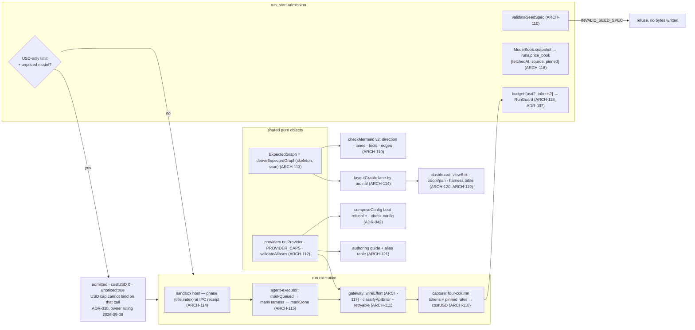

**(2) Development view** — three new pure files, the extended ones, and what leaves the tree:

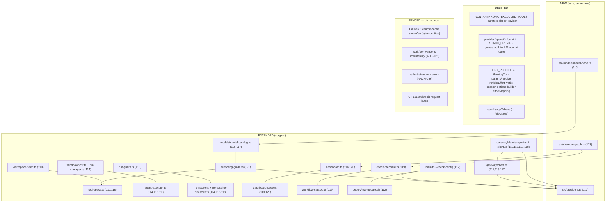

**(3) Process view** — a 401 that used to cost four minutes, and the phase stamp that must be read before the deferral:

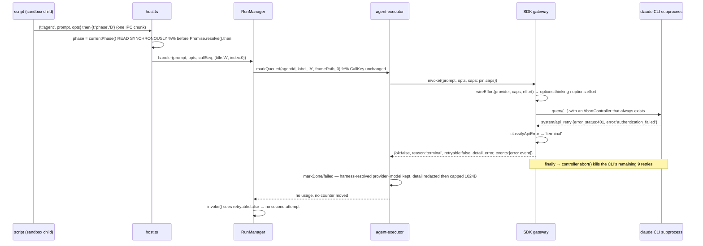

**(4) Deployment view** — the release order that must not take the service down:

```mermaid
flowchart LR
  REL["GitHub release published"] --> UPD["rwe-update.sh (root unit)"]
  UPD --> T["npm ci · npm run build · npm test"]
  T -->|fail| RV["revert_and_fail — old version keeps running"]
  T -->|pass| CC{"RWE_CONFIG_PATH set?"}
  CC -->|yes| CHK["npm run check-config → validateAliases"]
  CC -->|no| SKIP["configCheck: skipped (recorded, never a false pass)"]
  CHK -->|"openai/gemini rows present"| RV
  CHK -->|ok| AP["write_result applied → systemctl restart"]
  SKIP --> AP
  AP --> ENG["rwe engine (user unit)"]
  ENG --> LLM["managed LiteLLM proxy"]
  LLM --> A["api.anthropic.com"]
  LLM --> O["openrouter.ai"]
  LLM --> OL["local Ollama"]
  ENG --> DB[("SQLite: runs.price_book · workflow_versions.diagram_contract")]
  ENG --> FS[("journal + run_snapshots")]
```

**(5) Scenarios** — one line each, crossing the views:
- *A cold client seeds a workspace by sha256 only* (REQ-121): `run_start` → ARCH-110 refuses with `INVALID_SEED_SPEC` naming the path and `seedManifest`, no directory is created, and the guide section (b)/(a) of ARCH-121 is what the refusal points at.
- *A revoked OpenRouter key* (REQ-122/125): process view above — one attempt, a real error string on the record and in the transcript, the CLI subprocess aborted, `provider: 'openrouter'` preserved so the post-mortem says which path broke.
- *A nine-agent five-phase run is opened on the dashboard* (REQ-124/128/129): `layoutGraph(deriveExpectedGraph(...), agents, phases)` places every agent by phase ordinal, the workflow page shows the author's LR swimlane beside the per-agent harness table, and both figures scale to the container and zoom.
- *A budgeted run against a model the catalog does not price* (REQ-127): admission pins the price book, ADR-038 either refuses (USD-only) or admits and counts, and `foldUsage` reproduces the same total after a restart from the journal alone.
- *The v26 release lands on the production box* (REQ-123/070): deployment view above — the four `gpt41*` alias rows must be gone before the restart, and the updater's `--check-config` turns forgetting into a failed update on the old version.

### v26 data architecture

Two additive columns and two widened JSON shapes; no table is created, none is migrated, and every existing row stays readable (`NULL` has a defined meaning in both new columns). SQLite remains the store for the same reason as every prior slice (single process, file-backed, transactional) — no new ADR is needed because nothing about that choice is reopened.

```mermaid
erDiagram
  RUNS ||--o{ USAGE_EVENT : "journals"
  RUNS ||--o{ AGENT_RECORD : "snapshots"
  WORKFLOW_VERSIONS ||--o{ RUNS : "starts"
  RUNS {
    text id PK
    json effective_params "unchanged — resolved at admission"
    json budget "v26: number | {usd?, tokens?} | null; a legacy number rehydrates as {tokens:n}"
    json price_book "NEW: {fetchedAt, source:'live'|'last-good'|'static', pinned:{'provider/model':{price,caps}}}"
  }
  USAGE_EVENT {
    json tokens "v26: {input, output, cacheRead, cacheWrite} (was two columns)"
    real costUSD "NEW: computed once at capture from the pin; 0 when unpriced, NOT NULL (ADR-038, ruled 2026-09-08)"
    bool unpriced "NEW: true when no rate was pinned for this model; a legacy two-column event reads as true"
    text provider "v26: RESOLVED (was the transport name on the SDK path)"
    text model "v26: resolved model id, not the alias"
    text transport "NEW: claude-agent-sdk | direct-fetch"
    text proxyModel "NEW, optional"
  }
  AGENT_RECORD {
    text phase "v26: written for real (was read from an opts field nothing set)"
    int phaseIndex "NEW: the join key layoutGraph orders by"
    text detail "NEW: failed only; redacted then capped at 1024 bytes"
    json tokens "v26: four columns"
    real costUSD "NEW: 0 when unpriced, NOT NULL (ADR-038, ruled 2026-09-08)"
    bool unpriced "NEW: true when no rate was pinned for this model — the fact the money column no longer carries"
  }
  WORKFLOW_VERSIONS {
    text mermaid "unchanged, immutable"
    text diagram_contract "NEW: NULL ⇒ 'v1'; every v26 registration writes 'v2'"
  }
```

**`null` survives exactly ONE hop, and that is why the money column is not nullable.** `priceCall(tokens, rates)` is the only producer of `null` (an unknown price must stay distinguishable from a genuinely free model — ollama's all-zero rates are a KNOWN price yielding `0`), and `capture()` is its only consumer, collapsing it at the single capture site to `{costUSD: 0, unpriced: true}` (ADR-038, ruled 2026-09-08). Downstream, `costUSD` is a non-nullable number everywhere and the FACT of unpricedness rides the boolean beside it: every fold is plain addition, and `unpricedCalls > 0` is the qualifier that tells a reader the total is a lower bound. A nullable money column would instead force every fold, projection and dashboard reader to carry its own null policy — the classic way two counters silently disagree.

Read-side derivations that write nothing: `inferPhase` repairs pre-v26 terminal snapshots at read time (ARCH-114 — a back-fill would open a second writer to a write-once snapshot), and `foldUsage` recomputes a resumed run's spend by summing STORED `costUSD` (never re-pricing against today's catalog), counting legacy two-column events as `unpriced`.

### v26 interface & API contracts

| Contract | Between | Protocol | Summary (v26 delta) |
|---|---|---|---|
| `run_start.seed` / `seedManifest` / `seedManifestRef` | client ↔ ARCH-110 | MCP JSON-RPC | three discriminated item shapes with descriptions; a `seed` element without a string `contentB64` → `INVALID_SEED_SPEC` naming the path and pointing at `seedManifest`; nothing is written |
| `run_start.budget` | client ↔ ARCH-118 | MCP JSON-RPC | **breaking:** `{usd?: number, tokens?: integer}`, `minProperties:1`; a bare number → `INVALID_ARGUMENT` whose description states the unit; a PERSISTED legacy number rehydrates as `{tokens:n}` |
| `run_start` admission | client ↔ ARCH-116/ADR-038 | MCP JSON-RPC | **never refuses on price** (owner ruling 2026-09-08): an unpriced reachable model is admitted, charged `costUSD: 0`, flagged `unpriced: true` and counted in `meta.unpricedCalls`. **Consequence a caller must code against:** a `budget.usd` limit cannot stop dispatch on an unpriced model — `budget.tokens` is the enforceable limit on that path (ADR-037) — and `run_result.meta.budgetEnforceable {usd, tokens, unpricedModels}`, derived at READ from the run's price pin, is how a caller learns which of its limits can bind |
| `run_status.agents[]` / `run_result` | client ↔ ARCH-115/118/111 | MCP JSON-RPC | adds `transport`, `proxyModel?`, four-column `tokens`, `costUSD`, `detail?` (failed), `phase`/`phaseIndex`; `meta` adds `usage`, `unpricedCalls`, `unmappedMessages` |
| `models_list` | client ↔ ARCH-117 | MCP JSON-RPC | **breaking:** `toolUse` → `toolUseDeclared` (no alias window); adds `effortDeclared`, `declaredSource`, and `catalogFetchedAt` **per ROW** — `models_list` returns a bare array, so a top-level wrapper would be a breaking MCP shape change to save ~24 bytes/row (DES-179's boundary); every row of one response carries the SAME `ModelBook` snapshot `fetchedAt`, which is the only honest "as of" |
| `workflow_register.mermaid` | author ↔ ARCH-119 | MCP JSON-RPC | v2 contract for NEW registrations: `graph LR`, one subgraph per `phase()` in order, stadium `tools:` row, edges matching the skeleton; refusals carry `{rule, line, expected}` as JSON, never corrected Mermaid |
| `workflow_describe` | client ↔ ARCH-119 | MCP JSON-RPC | adds `diagramContract: 'v1' \| 'v2'` |
| `GET /api/runs/:id/dag` | dashboard ↔ ARCH-114 | HTTP/JSON | lane per phase ordinal; `warnings` empty for existing terminal runs; SVG gains `viewBox` + `width=100%` (ARCH-120) |
| `main --check-config` | updater ↔ ARCH-112 | CLI exit code | 0/1 with the offending alias rows named; consumed by `deploy/rwe-update.sh` between the test gate and the restart |
| **cross-repo (one check, three items)** | engine ↔ `rwe-mcp` plugin client (separate repo, no SDLC ledger) | MCP | before shipping: (1) `push_workspace.py` sends exactly `{path, contentB64}` or `additionalProperties:false` stays off `seed.items`; (2) any reader of `models_list.toolUse` moves to `toolUseDeclared`; (3) any caller sending `budget: <number>` moves to `{usd}`/`{tokens}`. One Gate 5 read of the plugin repo + one Gate 7.5 observation + one release-note line |

### v26 cross-component invariants (INV)

The SAD carried no INV list before this slice; these are scoped to v26 and named `INV-V26-*` so a later global list can start clean.

- **INV-V26-1 (replay key):** nothing the ENGINE injects may enter `agent()`'s `opts` — `CallKey` stays byte-identical to v25, and the phase travels as its own handler argument and its own record field. A test replays a v25 journal fixture under v26 and asserts zero misses.
- **INV-V26-2 (one writer per wire field):** `options.thinking` and `options.effort` are written only by `wireEffort` (SDK) / `effortBodyFields` (direct-fetch), both reading `PROVIDER_CAPS`; no other module may set them.
- **INV-V26-3 (one shape derivation):** the registration checker and the run-DAG layout consume the SAME `ExpectedGraph`; neither re-derives a script's shape on its own.
- **INV-V26-4 (price immutability within a run):** every cost a run reports is computed from the price book pinned at its admission; no dispatch, capture or resume path reads the live catalog.
- **INV-V26-5 (bounded, redacted, swept):** every new string persisted from a provider-authored stream (`AgentRecord.detail`, the unmapped subtype) is redacted FIRST, then capped (1024 B / 64 B), and appears in the REQ-083 sink sweep.
- **INV-V26-6 (no silent projection):** every default applied to an external payload names what it drops and increments a NAMED counter that has a reader on the dashboard run page (ADR-046).
- **INV-V26-7 (fail-closed config, never a false pass):** an unsupported provider row refuses at boot with every offending row named, and the updater's pre-restart check either passes, fails the update on the old version, or records `skipped`.

### Decision rationale — v26 (ARCH-110..121, ADR-037..047; REQ-121..130)

Contested points only; the panel's two groups agreed on the rest (object budget, host-receipt phase stamp, `retryable` on both loops, `{transport, provider, model, proxyModel}`, explicit `diagram_contract`, pinned prices with a TTL'd last-good, effort = provider profile × model capability, per-transport detection with shared classification, view-layer zoom, `ERROR_CATALOG` coverage as a test).

- **Unmapped SDK messages — payload vs name+count.** Quality-dimensions (r1 O-4) wanted a bounded, redacted payload of every unmapped `system` message; adversarial (C10) refused on the grounds that `redact()` is value-exact over secrets the engine was TOLD about, so it cannot protect a body echoing something it was not. **QD conceded the payload in r2 (D1)** and held two conditions the synthesis adopts: the subtype is capped and charset-restricted (it is SDK-authored text, like the 1024-byte `detail`), and the counter has a named reader on the dashboard, because a counter nobody reads is not observability.
- **`meta.warnings[]` umbrella vs named counters.** QD (key_point 12) proposed one closed-catalog array; adversarial held two named, `tsc`-checked integers. **QD withdrew the array in r2 (D3)**; the synthesis takes the named fields (`meta.unpricedCalls` is REQ-127's literal name) plus QD's held property: each counter is rendered on the dashboard run page and covered by one integration assertion. Simpler of two equals, and a cold model reads a named integer without scanning an array.
- **The phase join key.** Adversarial r1 joined by phase TITLE position; QD (O-2) wanted `{title, index}`. **Adversarial conceded the ordinal in r2 (§1.4)** with two reasons stronger than QD's: titles repeat, and on resume the script re-fires `phase()` with new timestamps so the ordinal is the only key a resumed run reproduces. QD in turn conceded the second function (`phaseAt(phases, ts)` for both paths) — the live path has no timestamp to join on. Synthesis: one synchronous read at receipt, one pure `inferPhase` for old snapshots, one integer join. QD's lane-alignment rule is adopted with one correction: an `agent()` dispatched before any `phase()` fires takes implicit lane 0 **without** a warning (REQ-124 demands zero warnings on existing runs, and a v1-contract script may legally do this), while `SkeletonNode.dynamic` — which means "inside a loop/if body", not "dynamic title" — is what forces the frame-grouped fallback.
- **One provider table, and how wide.** QD (R-2) wanted a single row per provider covering identity, keys, effort, pricing and catalog source; adversarial split it (identity+caps in `providers.ts`, pricing in `ModelBook`). **QD conceded the split in r2 (D8)** on its own better reason — the facts have different LIFETIMES (compile-time-true vs six hours stale) — and adversarial conceded the consolidation further, folding `EFFORT_PROFILES` into `PROVIDER_CAPS`, which QD had offered as a non-blocking suggestion. The synthesis adds the criterion that settled the width: **a per-provider fact earns a column when two or more readers need it**; `keyEnv`, request shapes and the route emitter have one reader each and stay as code.
- **Unpriced model under a USD budget.** Adversarial r1 refused every budgeted run at the door; QD (S-3) leaned warn-and-continue because "stop-on-unpriced turns a catalog outage into a total outage". **Both moved:** adversarial narrowed to USD-only budgets in r2 (§1.6) after showing that pinning removes every mid-run case; QD conceded the narrowed refusal in r2 (D10) because it is actionable (`budget.tokens` is an immediate remedy). QD's one condition — decide the persisted last-good cache rather than inherit its absence — is answered here: **not built, consequence recorded in ADR-038, and `price_book.source` makes which case applied auditable**. The whole rule still deviates from REQ-127's literal text, so it carries an `owner_decision`.
- **`remaining()` under a tokens-only budget.** Adversarial proposed a guide sentence; QD (D9) proposed returning `null` instead of `Infinity`. QD's amendment landed after adversarial's r2 was written, so it is unrebutted and is adopted on its merits: `Infinity` is a confident wrong value of exactly the class ADR-046 names, and `null` biases the common `remaining() > X` branch fail-safe. Adopted honestly, not as a compatibility claim — nothing restores v25 behaviour once the unit changed, and `null` is detectable but not comparison-safe, which is why the guide sentence is kept beside it.
- **The bug class as an artifact.** Adversarial wanted it as a 04-design review line only; QD (D2) wanted one ADR row so v27 does not re-derive the class from a sixth incident. Both rejected a shared abstraction. Synthesis takes both cheap halves — **ADR-046** records the class and the rejected option, and mandates the design-gate checklist line — because an ADR row is the cheapest durable artifact this ledger has.
- **Deploy ordering.** QD (R-4) asked for a numbered DEPLOY.md step; adversarial proposed `--check-config` inside the updater's `revert_and_fail`. **QD conceded to the mechanism (D13)** as strictly better ("a shell pre-check cannot be forgotten by an operator under time pressure"), and adversarial accepted the step as the mechanism's explicit fallback, since the check only runs when `RWE_CONFIG_PATH` is in `update.env`. Both ship, and Gate 7.5 observes the ORDER, not just the end state.
- **Corrected Mermaid in the refusal envelope.** Adversarial pre-empted a consumability objection; QD declared itself the ally (D6): handing back a passing diagram would make every author paste it and REQ-111 dies by convenience. Recorded as a two-lens position so it is not re-litigated.
- **`tools: default`.** QD initially read it as leaking engine internals, then conceded (D7) — freezing the resolved default surface into a stored diagram would let a config change retroactively invalidate every diagram — and held two mechanics the synthesis adopts: the guide's definition is rendered from the checker's own constant, and the checker SKIPS (never partially performs) the tools comparison for that row.
- **Trigger budgets (both lenses HIGH, independently found).** Adversarial held that designing per-trigger budgets inside a slice whose ten REQs never mention triggers is scope invention; QD conceded the placement (D5) and held one unconditional obligation. Synthesis: **ADR-047** carries the owner ruling AND mandates the ledger correction either way. Neither lens proposed D-V2h's "server-level default cap" — a second policy source nobody asked for — so it is explicitly excluded from option (a).
- **Karpathy check per lens.** *Security:* one classifier, one unconditional abort, two bounded redacted strings, one fail-closed boot, one narrow admission refusal — no new trust tier, no widened capture. *Scalability/consistency:* one catalog fetch per TTL with single-flight, one pin per run, one guard door, derive-at-read for old snapshots (zero writes). *Testability:* four of the new/changed cores are pure functions with table tests (`validateSeedSpec`, `classifyApiError`, `deriveExpectedGraph`, `priceCall`/`foldUsage`, `wireEffort`, `inferPhase`, `dagBox`), and the same fixtures drive the checker and the layout. *Observability:* every new counter has a named reader; `effortApplied` records the wire position so a LiteLLM translation change is falsifiable. *Replaceability:* six per-provider sites become one table plus code with a `never` check; two dead tables deleted. *Consumability:* three discriminated seed shapes, every code with a `see:` row, the guide rendered from the constants it describes, refusals that name the fix. *Self-sustainability:* the money cap survives a restart (stored `costUSD`, pinned rates) and a listing outage (TTL + last-good), and its blind spots are counted rather than zeroed. *Simpler of equals:* named counters over an umbrella array, one integer over a second function, regex + refusal over an AST, `dagBox` over a server-rendered SVG, no `FLAG-*`, no circuit breaker, no shared projection abstraction.
- **Housekeeping notes for the orchestrator (ledger consistency, not user decisions).** (1) `state.yaml.tech_stack` still describes the GatewayClient as covering openai/gemini and calls the sandbox `budget.spent()`/`remaining()` accessors "hard-coded stubs" — the first is retired by REQ-123, the second is stale (`run-manager.ts:925` really supplies `onBudgetSnapshot`; the true caveat is "live, not resume-stable"). (2) `04-design.md:832` / `:1156` (D-V2h) and the overlap accepted risk must be amended at Gate 4 whichever way ADR-047 is ruled. (3) REQ-124's acceptance should name the three cohorts (v26 exact / pre-v26 terminal inferred / pre-v26 resumed journals frame-grouped with a warning) and the ordinal join; REQ-121's should require `INVALID_SEED_SPEC` to carry `see: 'workflow_authoring_guide'` (the row exists today with `see: null`); REQ-122's should state that the fast terminal aborts the CLI subprocess and that `detail` is bounded and swept; REQ-126/130's should note `models_list` gains `declaredSource` + `catalogFetchedAt`. These are acceptance-text amendments the orchestrator can make without re-opening Gate 1. (4) archify's `doctor` passes in this environment, but no Typed JSON IR was authored under `diagrams/`: the ledger holds 109 pre-existing ARCH modules and no IR, so a v26-only map would fail the both-ways ARCH↔node cross-check `dashboard_check` performs, and authoring all 121 nodes is outside this slice — the soft dependency is skipped deliberately and the mermaid 4+1 views above remain the baseline.

#### Decision rationale — v26 Gate 8 send-back, ARCHITECTURE half (2026-09-11)

**Mandate, stated so the boundary is auditable.** Gate 8 sent v26 back with twelve blocking findings: eleven
tagged `[impl]` (closed 2026-09-11 by the impl half — H-1..H-4, M-1..M-7) and two tagged `[architecture]`
(**A-1**, `07-review.md:278`, and **A-2**, `:317`), which are this pass. Both are the SAME defect class in two
directions: *the authoritative record and the shipped behaviour disagree, and the record is the one that is
wrong.* So every edit below is an amendment: **zero new ARCH/ADR IDs, zero new fields, zero new modules, zero
code changes in the blocking path** (one comment-only touch in a test file, named in ADR-048). No
re-decomposition, no re-partitioning, no re-run of anything that was not named blocking. The panel proposals
this synthesis reconciles are `.panel/architecture/adversarial.r1.md` and `quality-dimensions.r1.md`
(2026-09-11); the `*.r2.md` in the same folder are the v26 design-round ledger and are history.

**Group (a) — A-1 and A-2, the blocking sites.** ADR-038's heading and note (the heading is what the RTM and
every cross-reference render — the most-read of the sites, and one the review's own list did not carry), its
`owner_decision` marker, ARCH-118's `api:` line (four clauses), the logical view's `PU`/`REF2` nodes, both ER
`costUSD` rows plus the `bool unpriced` they needed ADDED, ARCH-116's provenance note, the §API-contracts
`run_start` admission row, ARCH-117's openrouter arm and its two stale Gate-7.5 claims, and ADR-048's Action
line. ADR-047's marker was normalised in the same pass because a file with one marker in each format is how a
format rule dies.

**Group (b) — cross-half consistency (required, not optional).** Two `api:` lines declared shapes the impl
half of THIS SAME send-back changed, so leaving them would hand the joint re-review a shipped fix that reads
as a violation of the record: ARCH-116's `catalogFetchedAt` is per ROW (H-4), and ARCH-113's
`deriveExpectedGraph` gained `contract: 'v1' | 'v2'` (M-3).

**Group (c) — housekeeping this stage was already routed.** `04-design.md:6259-6262` closed its
corrected-money-rule section with an explicit hand-off to *"the architect"* and no send-back was ever opened
for it, so it was sitting exactly where A-1 sat before Gate 8 found it: ARCH-114's non-existent
`buildRecordsFromTranscript` and its nested-lane sentence. The review's two LOWs scheduled for *"the next
Gate 2 touch"* are taken here because this IS that touch: **D-6** (ARCH-116's `caps`) and **D-7** (ARCH-110's
`additionalProperties:false` note).

**`iter:` deliberately NOT bumped — a visible deviation from the dispatch, not an oversight.** The dispatch
said to bump the touched items. These items already carry this iteration's number (`v26`); no `v27` exists
(`01-requirements.md` has no REQ-131+ and no v27 round), so bumping would make an ARCH item claim an
iteration with no requirements behind it. It also matches the precedent this ledger set for exactly this
situation — commit `e8fb8a7`, *"the design-drift markers get their amendments — and none of them gets an
iter bump"* — and the impl half of this same send-back, which amended seven IMPL items in place and measured
0 new gaps. Verified rather than assumed: `.sdlc/trace.py`'s drift detector compares `iter:` only between a
`build` item and a **design**-stage parent (or a `verify` item and a design-stage parent); `ARCH` is stage
`architecture` and `ADR` is unmapped, so neither an amendment nor a bump could move the gap count either way.
The amendment mechanism is this ledger's own: a dated `- **amended (…):**` bullet on the EXISTING heading
(IMPL-205 / commit `525ade4` — *"an amendment is a bullet, not a second heading with the same ID"*), with
mermaid nodes, ER rows and table cells corrected in place because a bullet cannot fix a diagram.

**Panel convergence (who conceded, and why).**

- **Both lenses, independently: the code is right and the ledger is stale**, in A-1 and A-2 alike; both
  reached "amend, do not revert" and "no new IDs". Nothing to reconcile — recorded so round 2 was not needed.
- **The `PU` branch: relabel, not delete.** Adversarial's security lens argued deletion silently adopts
  REQ-127's forbidden option (i) — 「不得默默採 (i)」 — because a diagram with no unpriced case reads as
  *prices are always known* and the next USD-budget reader re-derives `PRICE_UNKNOWN` from first principles.
  This is the one place the repair costs a node instead of saving one, and it is taken on that argument.
- **The ER rows: a column ADDED, not a string edited.** QD (QO-2) held that changing `null` to `0` without a
  `bool unpriced` leaves the data architecture with no representation of *"we charged 0 because we did not
  know the price"* — the exact fact the owner kept the ruling for. Adopted over the smaller edit.
- **ADR-038's dead consequence paragraph.** QD wanted it deleted; adversarial wanted the option analysis kept
  as the record of what was ruled on. Resolved by retiring it inside the amendment bullet — the note stays
  immutable, the paragraph stops reading as live accepted risk.
- **QO-3 (`price_book.source` has a premise but no reader).** QD offered two repairs and left the choice to
  the architect: give the field a reader on `meta.budgetEnforceable`, or restate the note as after-the-fact
  audit and name what actually reads it. **Taken: the epitaph, not the reader** — fewer published fields is a
  smaller contract, `budgetEnforceable.usd:false` already carries the live signal, and QD said in advance it
  would accept that resolution.
- **D-6 (`caps` says `'unknown'`).** QD argued the consumability cost is real (`models_list` reports anthropic
  effort as undeclared — the one provider where the dial lands); adversarial declined a static-table change
  inside a documentation send-back. **Both agreed the LEDGER is what changes here**; QD conceded the
  iteration, not the diagnosis, so the consequence is written down and the fix is backlog with its own red
  test.
- **A mechanical guard against this recurring.** The testability lens wanted a repo test that fails when an
  overruled term survives in `02-architecture.md`; it then talked itself out of that home, and
  **pre-conceded** the weaker form before anyone had to argue: `npm test` is the gate `deploy/rwe-update.sh`
  runs before a production restart, so a stale sentence in a 665 KB document would acquire the power to block
  a release, and a legitimate mid-gate `pending` marker could red the suite for ~20 implementers on one
  shared tree — a fail-closed control in the wrong place. **Recommendation, non-blocking and not part of this
  repair:** the right home is the SDLC tooling that already parses these files (`trace.py --check`'s existing
  `pending`-marker family, extended with an `overruled_terms:` meta field on an ADR), whose named dependency
  is the `trace.py` parser-sync debt in `07-review.md` §7. TASK-194 is the precedent — it already makes
  `PRICE_UNKNOWN`'s absence a grep guard over `src/`, `tests/` and `docs/`; `.sdlc/**` is simply outside its
  scope, which is exactly where the ghost survived.
- **Karpathy check.** Every amendment states what ships and deletes a claim that does not; the two tempting
  expansions (a doc-lint vitest, a `caps` code change) are declined with reasons; where two proposals were
  equal the simpler was taken — the exception, argued above, is the relabelled `PU` node.

**Not chartered by REQ-121..130 — named backlog with its seam, deliberately NOT written into any `api:` line
and NOT deferred to the owner, because declining unchartered scope inside a repair is staying in scope.**
Quality-dimensions raised five, each stated at its minimum seam and each conceded by its own author as a
placement question rather than an architecture mandate: **(1)** a cross-run cost index — `RunSummary`
(`src/types.ts:347-358`) carries no `costUSD` and no `unpricedCalls`, so *"find the runs I charged 0 and
re-price them"* is N `run_result` calls, one runId at a time; the ruling's per-run obligations
(`run_status`, `run_result.meta`, dashboard) are all met, and the cross-run index is an extension of the
ruling's purpose, not a gap against its text; if ever chartered it must be a summary column written at the
terminal transition, never a per-row fold over up to 500 journals at list time. **(2)** money on the
dashboard HOME cards (the run DETAIL page already renders tokens/cost/unpriced/lower-bound). **(3)** an
engine-level counters block on the existing `system_info` (in-flight runs, terminal failures per provider,
`ModelBook` source and age) — today cross-run health is answerable only by opening runs one at a time.
**(4)** a zero-token REACHABILITY check folded into `--check-config` (distinct from the capability-by-dispatch
probing v26 refused). **(5)** a retention slice for the unbounded growth surfaces (`journal.jsonl`,
transcripts, audit events, CAS blobs) — `src/workflow-catalog.ts:265-266` already records that no prune hook
exists; its binding constraint is stated NOW so it is not discovered later: **any sweep must exclude
non-terminal and suspended runs, or it breaks REQ-060's resume-after-restart.** Adversarial opposed
persisted last-good pricing on the same basis (no REQ asks for it; ADR-038 already names it
considered-and-not-built) and QD conceded placement in advance.

**Routed out of this half, so neither is lost between the two:**
1. **[→ impl / Gate 8] The at-rest fold cannot count a failed call's `unmapped`** — found by the adversarial
   lens reading the send-back's OWN M-2 repair. `foldUsage` (`src/run-guard.ts:45`) does
   `if (!data.tokens) continue;` BEFORE it reads `data.unmapped` at `:52`, so the failed usage event M-2 just
   taught to carry the field is skipped whole, while `foldUsageFromRecords` (`src/run-manager.ts:246-249`)
   accumulates it from every record — and `src/types.ts:82`/`:248` both assert the two folds cannot drift.
   Invisible for a run with a terminal snapshot; reachable for a run interrupted before one and read after
   restart, and on resume. Diagnostic counter, not money. Minimal fix: accumulate `unmapped` OUTSIDE the
   `data.tokens` guard. Falsifying test: extend IT-156 (`unmapped-column-folds.test.ts`) with a second fake
   gateway arm returning `{ok:false, reason:'terminal', unmapped:['weird_subtype']}` and re-run its at-rest
   assertion beside the live one — IT-156 and IT-162 today each cover one fold and neither crosses the seam
   they were written to reconcile. **Architecture-side consequence if it recurs:** ARCH-111/ADR-046 should
   name WHICH fold is authoritative when a snapshot is absent; three producers share `RunUsage` and the
   ledger asserts they cannot drift without saying who wins when they do.
2. **[→ orchestrator, requirements] REQ-124's "shared phase timeline" clause** carries the same nested-lane
   drift ARCH-114 was amended for: DES-175 makes a nested `phase()` a sub-card fact, never a parent lane.
   This extends housekeeping note (3) above; it is a requirements-side acceptance-text amendment, and an
   architecture repair must not silently correct another document's REQ.

### ADR-048 — `skeleton-graph.ts` joins ADR-022's internal-module allowlist, because a refusal shown to the author who just wrote that script is not a projection to a principal
- **status:** accepted
- **traces:** REQ-128, ARCH-113, ADR-022
- **note:** ADR-022 pins an allowlist of internal modules that may consume `parseWorkflowSkeleton`, fixed at
  four entries, and states that adding a fifth needs a NEW adjudication rather than a mechanical edit — the
  criterion being S-2, "serves no projection to a principal". v26's `src/skeleton-graph.ts` (`deriveExpectedGraph`,
  mandated verbatim by ARCH-113/DES-174) fails the guard as written. Adjudication: it PASSES S-2. The only
  thing it projects is the `expected:` block inside a `DIAGRAM_DIRECTION`/`LANE_MISMATCH`/`TOOLS_MISMATCH`/
  `EDGE_MISMATCH` refusal, and that refusal is returned to **the caller who just submitted that very script**
  in the same `workflow_register` call. The author is being shown a derivation of their own input, not another
  principal's structure — the leak ADR-022 exists to prevent is cross-principal, and REQ-128's whole point is
  that the author cannot fix a diagram they are not told the expected shape of. Constraint carried forward:
  the refusal must never be reachable by a principal who did not submit the script (no read path from
  `workflow_describe`, the dashboard, or any anonymous route), and it must carry no prompt text, secret, or
  literal string argument — the same rule REQ-119's diagram already obeys. Action: add `skeleton-graph.ts`
  to the allowlist in `tests/unit/no-skeleton-surface.test.ts` and bump its pinned size from 4 to 5.
- **amended (2026-09-11, Gate 8 send-back repair, architecture half, A-2 — Action line, adjudicated, not mechanically edited):** the Action above was executed for TWO files, not the one it names, so the shipped allowlist holds **six** entries with `expect(ALLOWLIST.size).toBe(6)` while this record authorised five. ADR-022's rule is that a new member costs a NEW adjudication, so the count is amended by ARGUMENT, here, and the guard is left exactly as it is. **Amended Action: add `skeleton-graph.ts` AND its one caller `workflow-catalog.ts` to the allowlist in `tests/unit/no-skeleton-surface.test.ts`, and bump its pinned size from 4 to 6.** Both members are covered by this single adjudication, applied by name: `skeleton-graph.ts` is the derivation, and `workflow-catalog.ts`'s `validateRegistration` is the call site that invokes it and hands the refusal back to the principal who just submitted that very script — the sentence in the note above is written ABOUT that call site, so S-2 ("serves no projection to a principal") is satisfied by the same reasoning for both: the author is shown a derivation of their OWN input, and the leak ADR-022 exists to prevent is cross-principal. **The constraint carried forward is unchanged and is the actual security control:** no read path from `workflow_describe`, the dashboard or any anonymous route, and no prompt text, secret or literal string argument in the `expected:` block. The `toBe(6)` pin and its "a SEVENTH entry would still fail" case stay as written — growth must keep costing an argument. Gate 8's reviewer adjudicated the substance with both review panels concurring (`07-review.md` A-2); this amendment is the record catching up to a boundary that was already wider in code than in the ledger, which is the direction that leaves the NEXT widening with no trustworthy baseline. **One deliberate touch outside this file:** the guard's own `FLAGGED for Gate 8` comment (`tests/unit/no-skeleton-surface.test.ts:52-53`) asked for exactly this amendment; it is retired to a citation of this bullet in the same pass, comment-only — no assertion, no allowlist entry, no behaviour.
- **iter:** v26

## v27 slice — the operator dashboard rebuilt to the design handoff: one shell, one client core, one swimlane, and three wire deltas (REQ-131..136, REQ-140, REQ-141): ARCH-122..131 + ADR-049..056

**Round v27h delta (2026-09-13) — read this first.** Gate 8 sent v27 back (`send_back=["impl","architecture","validation","design"]`, 13 blocking findings). The eight impl-owned findings landed at v27g (`005892b`). **This round closes the three architecture-owned ones — AC-2 (the tsconfig guard the ADR asserts and the tree does not have), AC-3a (ARCH-122 describes a page deleted before first paint) and DASH-1 (two `sequenceDiagram`s that do not render) — plus the two drifts the panel found that the v27g repairs themselves induced** (ARCH-124's connection clause vs. the shipped `worstOf`; ARCH-123's `cache` type literal vs. the shipped full directive). **ARCH-122, ARCH-123, ARCH-124 and ADR-049 are amended IN PLACE at `iter: v27h`**; no new ARCH/ADR id was opened, no module was added or moved, no trace link was cut, and no code was changed (two follow-up impl items are named and owed — see **Decision rationale — v27h** at the end of this file). A real two-round panel ran first and both files are on disk (`.panel/architecture/{adversarial,quality-dimensions}.r{1,2}.md`); round 2 was warranted because the round-1 headlines conflicted on the AC-2 mechanism, and the two groups then CROSS-conceded (each adopted the other's shape), which is the one trade-off this synthesis had to settle rather than lift.

**Round v27b delta (2026-09-11) — read this first.** The owner answered ADR-051's `owner_decision` (「開 —— 撤銷遮罩」): the predicted overlay is served regardless of `auth.enabled`. Gate 2 was re-run as a scoped delta over REQ-133 / REQ-134 / REQ-140 with a fresh two-round panel (`.panel/architecture/{adversarial,quality-dimensions}.r2.md`); **ADR-051, ADR-055, ADR-054, ARCH-125, ARCH-126, ARCH-130 and ARCH-131 are amended IN PLACE at `iter: v27b`**, the v22 rows the ruling partially reverses (ARCH-073, ARCH-075, ADR-012) carry a `superseded_in_part:` marker with their `iter:` left at v22, and the contested points are recorded in **Decision rationale — v27b** at the end of this file. No new ARCH/ADR id was opened, no trace link was cut.

**How this section was decided.** A real two-group lens panel ran before this synthesis and its proposals are on disk: `.panel/architecture/adversarial.r1.md` (security × scalability/performance × testability, Karpathy simplicity-first as the tie-breaker) and `.panel/architecture/quality-dimensions.r1.md` (observability / replaceability / consumability / self-sustainability). **Round 1 only:** the two headlines were complementary rather than contradictory (both demand one usage accessor, one descriptor decoration site, vendored fonts behind a fixed map, no bundler, no CDN; they differ on *how much mechanism* each answer needs), so no round 2 was warranted — the four genuine splits are reconciled here and recorded, per contested point, in the file-end **Decision rationale — v27** with who conceded and why. Safety class is QM, so the ISO 26262 / 21434 lenses are absent by tailoring, not by omission.

**The slice in one sentence.** v27 is *one rebuild plus three small wire deltas*: the 640-line `DASHBOARD_HTML` template literal (CSS + markup + client JS in one string, `dashboard-page.ts:98-737`) becomes **a shell page + a plain-JS ESM client served from one exact-match asset map**, which is the same route the REQ-131 vendored fonts need anyway; and the engine's side of the rebuild is three additions the page cannot fake — `lanes`/`current` on the DAG payload (REQ-140), `record` on the agent detail (REQ-140), `costUSD` and its three companions on every run summary through the SAME fold the detail route uses (REQ-141) — plus one subtraction that is a wire-level control, not a render-level hide: the agentType system prompt stops being *captured* at all (REQ-136). Zero new services, zero new runtime dependencies, **zero schema changes**; one new pure TypeScript module (`src/static-assets.ts`), one new client module tree (`src/dashboard/{lib,ui}/*.js`, plain ESM), one new narrow store writer (usage-only snapshot backfill), and one new HTTP route prefix (`GET /static/dashboard/*`).

**Scope of THIS dispatch (read this before looking for a missing REQ).** The impact closure handed to Gate 2 is **REQ-131..136, REQ-140, REQ-141 — eight REQs**. The v27 requirements round wrote thirteen: **REQ-137 (Models tab), REQ-138 (System tab), REQ-139 (Issues tab), REQ-142 (kind:nfr — pause polling when hidden) and REQ-143 (kind:nfr — self-labelled demo data) are OUTSIDE this closure and deliberately carry no ARCH row here.** They are not orphans of neglect: the architecture below is shaped so each attaches without a new module when its own closure is dispatched — a tab is one more view module under ARCH-125's `src/dashboard/ui` reading one more route, REQ-142's visibility gate is two lines in ARCH-125's single poll scheduler plus one input to ARCH-124's `connection.js`, and REQ-143 is one isolated data module plus one additional input to that same state machine (which is exactly why `connection.js` is specified as a pure function over inputs rather than as `try { fetch } catch { offline }`). Anything more than that is out of this dispatch and must not be silently added here.

**Altitude split** (both apply; each REQ read at the one that fits). *System altitude* — REQ-131 (theme, vendored fonts, i18n, connection tag), REQ-132/133 (home and workflow-detail views), REQ-134 (swimlane rendering), REQ-140 (two serialization additions), REQ-141 (one read-side accessor). *Agent altitude* — REQ-135 (the slide-in panel IS the agent's inspectability: prompt, tool surface, MCP servers, skills, four-column tokens, cost, event stream, failure `detail`), REQ-136 (what of the agent's reasoning context may leave the process at all), and REQ-140's `record` (the `AgentRecord` carrying `provider`/`transport`/`proxyModel`/`phase`/`detail`/`unmapped`, `types.ts:215-291`). The owner's stated first motive is observability (「以觀測性為主,但三者都要」), so for this slice observability is not a side-constraint — it is the requirement, and the measure is whether an operator answers *which agent is stuck, in which lane, on which backend, at what cost* in seconds.

**NFR ownership (exit-gate 1c).** The two `kind:nfr` REQs of iteration v27 — REQ-142 and REQ-143 — are outside this dispatch's closure (see the scope paragraph); their attachment points are named there so the next Gate 2 touch adds rows rather than modules. The quality obligations that ARE in closure each have one owning module, named so no quality is homeless: *connection / degraded honesty* → **ARCH-124** (`lib/connection.js`, the five-state machine) fed by **ARCH-125**'s one `getJSON` classifier, with the server-side half at **ARCH-130** (one `dashboard_api_degraded` log line — today the whole dashboard surface degrades as a silent HTTP 200); *disclosure of the widened `/api/*` surface* → **ADR-054**'s golden key-set test (no new production code); *cost honesty* → **ARCH-127/ARCH-128**'s single precedence chain plus `unpricedCalls` beside `costUSD` (ADR-046 / INV-V26-6 unchanged: never a silent zero); *secret-adjacent capture* → **ARCH-129** (the agentType prompt is no longer captured, so no projection has to remember to hide it); *page weight and long-lived-tab hygiene* → **ARCH-125** (one scheduler, per-view fetch sets, event window bounded and its truncation disclosed, delegated listeners, transform on the wrapper); *offline posture* → **ARCH-123** (every byte from this origin) + **INV-V27-3**; *the self-update panel's observability* → **ARCH-122** + **INV-V27-5** (ARCH-040's surface is deleted by the rebuild unless the shell re-renders it, and no v27 REQ names it — this is the one non-regression this slice could have lost silently). No health endpoint, limits module or metrics pipeline is added: `RunGuard`, `AgentSemaphore`, the sampler's TTL and the anonymous-route render cap already own those qualities.

**Scale and feature model.** `state.yaml` declares no `scale`, and the 121 ARCH items preceding this slice carry no `build:` / `selftest:` / `flag:`; v27 follows the ledger's S/M form rather than minting a parallel convention mid-project. **No `FLAG-*` is minted** — nothing in this closure is a switchable capability: theme / language / accent hue are per-viewer `localStorage` preferences (owner ruling Q12), not engine configuration, and they add no config key at all. The first real feature switch of v27 would be REQ-143's `demoEnabled`, which is out of closure; when it lands it must go through `composeConfig()` and its wiring probe (`compose-config-v2-wiring.test.ts` — the twice-bitten class), and that is the sentence that belongs in its ARCH, not here.

### ARCH-122 — the served page becomes a shell: a `<head>` with the asset references, a JSON data island and one module script; the whole visible body is client-built, and ARCH-040's update panel survives the rebuild
- **status:** draft
- **traces:** REQ-131
- **module:** src/dashboard-page.ts
- **deps:** ARCH-120, ARCH-123, ARCH-124, ARCH-125
- **api:** `buildDashboardHtml(init?: { lastUpdate?, interruptedRuns? }) → string` keeps its signature and its one caller (`server.ts:1334`). What it emits is a SHELL — the four facts only the server can supply, and nothing else: `<html data-theme="dark" lang="zh-Hant">` + a `<head>` carrying charset / viewport / title, `<link rel="stylesheet" href="/static/dashboard/dashboard.css">` and `<script src="/static/dashboard/ui/theme-init.js"></script>` (classic, blocking — stamps `data-theme` / `lang` / `--rwe-hue` from `localStorage` BEFORE first paint, so a team that chose light does not get a dark flash on every poll-driven reload) + a `<body>` carrying `<script type="application/json" id="rwe-init">{version, lastUpdate?, interruptedRuns?}</script>` and `<script type="module" src="/static/dashboard/ui/app.js"></script>`. **No CSS lives in this file** (v27c / DES-200: one delivery path, `dashboard.css` through ARCH-123). **The page's entire visible body is client-built:** `app.js:455` runs `document.body.replaceChildren(nav, routeMount, buildFooter())` on mount, so the nav and its source tag, the four tab shells, the route container `#app-view` (created at `app.js:332`), the `#dag-zoom` / `#dag-graph` / `#dag-fit` / `#run-usage` / `#diagram-*` anchors, the `.card` / `.t` / `.tag` / `.btn` component classes and the slide-in panel's container are **ARCH-125's**, not this module's. The legacy pre-v27 markup still standing between `<body>` and the island (`dashboard-page.ts:92-152`) is discarded before first paint: non-contractual, not a test subject, and ~~removed by the TASK-A follow-up (see the `amended` line)~~ **[v28, TASK-215 landed]** in favour of ONE mount element. `DASHBOARD_HTML` stays exported — it is the page-source tests' subject, under the pin rule in `note:`.
- **note:** Boundary: this module assembles bytes; it decides nothing. The two guards it carries are the ones a rebuild loses silently. **(1) The data island is data, not script** — `type="application/json"` is never prepared for execution, so it is not subject to `script-src` and needs no nonce; keeping the server-side `init` injection this way is what lets **ARCH-040 / REQ-070's update panel survive a rebuild that no v27 REQ mentions**: the CLIENT renders `version`, the last-update outcome (tag / status / detail / `configCheck`) and the interrupted-runs call-to-action from that island (INV-V27-5), instead of the rebuild silently dropping a panel whose absence would first be noticed by an operator not seeing that an update failed. **(2) Zero inline executable JS** is what makes ARCH-130's CSS-and-script CSP achievable at all, and it is the reason `theme-init.js` is a served file rather than the obvious four-line inline snippet — one extra same-origin request buys a real runtime control in place of a grep-enforced convention. **Pin rule** (this replaces the retired 「still assertable here」 clause): `DASHBOARD_HTML` is a valid test subject ONLY for the shell's own facts — the root attributes, the three asset references, exactly one inline `<script>` (the island), `<` escaped inside it, and ~~(after TASK-A)~~ **[v28, TASK-215 landed]** the mount element. Every component-markup or CSS assertion takes `clientFile(...)` as its subject, because **a component pin whose subject is `DASHBOARD_HTML` proves a string the browser discards**. C1 is satisfied where the bytes live: `clientFile('dashboard.css')` for the two CSS rules (v27c) and `clientFile('ui/workflow.js')` for `img.draggable = false` (v27g, AC-3b); the `mousedown`+`preventDefault` pin is re-proven where it was actually caught — the real-mouse Chromium tests val-193/val-197 (ADR-053). **Boot-failure honesty (TASK-A):** the dead body is a failure MASK — when `app.js` 404s, is blocked, or fails to parse, the browser keeps the retired dashboard on screen and it reads as 「healthy engine, nothing running」, which is the most dangerous false statement an operator console can make; the connection tag cannot correct it, because the code that paints the tag is the code that failed to load. The body therefore becomes ONE mount element carrying static pre-boot text in the existing `empty` hook ~~plus `<noscript>`~~ **[v28, TASK-215 landed — DES-200 landed on NO `<noscript>`: the pre-boot sentence is on screen whether the module 404s or JS is off, so a second string saying the same thing is redundant]** — no `id`, so `#app-view` keeps a single emitter (the client) — and `app.js` needs no change, since `replaceChildren` removes whatever the shell put there. The pre-boot literal is a boundary exception of DES-201's class (server TS cannot import `lib/strings.js`, and the text must exist before any JS runs); a language-neutral 「…」 is the zero-exception fallback if Gate 4 prefers one. Not built: a server-side template engine, per-view HTML (the SPA catch-all stays), a second page.
- **amended (2026-09-13, v27h Gate 8 send-back — AC-3a):** the title, `api:` and `note:` above are rewritten to the shape the tree actually serves; what was struck is recorded here so the history is not lost. Struck: the title's 「markup + tokens CSS」; the `api:` claim that `DASHBOARD_HTML` 「now holds **markup and CSS only**」 together with its enumeration of the design tokens, the nav, the four tab shells, the `#dag-*` / `#run-usage` / `#diagram-*` anchors, the component classes and the panel container — every one of those is built by `app.js`, which `replaceChildren`s the served body before first paint (`src/dashboard/ui/app.js:455` over `src/dashboard-page.ts:92-152`); the stale caller reference `server.ts:1251-1257` (it is `:1334`); and the `note:` sentence 「C1's three literal page-source pins keep their meaning … (still assertable here)」, which was false in BOTH halves — the CSS moved to `dashboard.css` at v27c and the `draggable` pin moved to `clientFile('ui/workflow.js')` at v27g (AC-3b). **Follow-up impl item owed — TASK-A (Gate 6; Gate 2 may not make the code change):** delete `dashboard-page.ts:92-152` and emit one mount element; dispose of the five now-dead page-source pins, each verified at `eb387a1` — `dashboard-page-source.test.ts` UT-240's `draggable` case RETIRES (UT-224's v27g re-pointed case already guards it), `dashboard-zoom-source.test.ts:19,23` MOVE to `clientFile('ui/run.js')`, `workflow-page-harness-table.test.ts:15` RETIRES with reason (the harness table's role is REQ-135's panel, real-tier proven by val-201) or MOVES to `clientFile('ui/agent-panel.js')`, `dashboard-diagram-render.test.ts:60`'s positive MOVES to `clientFile('ui/workflow.js')` with its two negatives over `clientCorpus()` (over `DASHBOARD_HTML` they pass vacuously — DES-208's 「dangerous green」), and `dashboard-no-design-values.test.ts:44,50` needs NO change (measured: 0 of 104 `STYLE_HOOKS` and 0 of 23 `TEST_ANCHORS` are emitted only by the shell, so the class-lock is safe); and add UT-240 one POSITIVE case — the `<body>` holds the mount element, the island and the module script and **no `<section`/`<header`** — which is the assertion that fails if the fossil returns. In the same commit, strike this row's two tree-state clauses (the `api:` 「removed by the TASK-A follow-up」 sentence and the `note:` 「(TASK-A)」 marker). **Owed to other gates, recorded not taken:** DES-200's 「`draggable="false"` STAYS in this file」 and TASK-205's matching `dod:` line have been false since v27g and need the same re-point.
- **iter:** v27h

### ARCH-123 — `GET /static/dashboard/<key>`: one exact-match asset map for the vendored woff2 and the client bytes — never a path join
- **status:** draft
- **traces:** REQ-131
- **module:** src/static-assets.ts
- **deps:** —
- **api:** `STATIC_ASSETS: ReadonlyMap<string, { file: string; type: string; cache: 'public, max-age=31536000, immutable' | 'no-store' }>` built once at module load from a LITERAL array of relative keys — `ui/app.js`, `ui/theme-init.js`, `ui/poll.js`, `ui/home.js`, `ui/workflow.js`, `ui/run.js`, `ui/agent-panel.js`, `lib/theme.js`, `lib/strings.js`, `lib/connection.js`, `lib/swimlane.js`, `lib/runlist.js`, `dashboard.css`, `fonts/archivo-{400,500,600}.woff2`, `fonts/jetbrains-mono-{400,500}.woff2` — each resolved to an absolute path under `src/dashboard/` at boot; `lookupStaticAsset(urlPath: string) → { file, type, cache } | null` is an **exact `Map.get` on the URL suffix and nothing else** (no `join`, no `normalize`, no `..` check needed because no caller-supplied string ever reaches the filesystem); `readStaticAsset(entry) → Buffer` reads through a small in-memory cache. Content types are fixed per extension (`text/javascript`, `text/css`, `font/woff2`). Cache policy is split on purpose: **woff2 → `public, max-age=31536000, immutable`** (the bytes never change under a name); **JS/CSS → `no-store`** (the engine restarts itself on release tags, ARCH-039/040, and a cached old client running against a new `/api/*` is precisely the version skew REQ-140/141's shape deltas would bite on). A key whose file is missing at boot logs `{event:'dashboard_asset_missing', key}` once and answers 404: a missing font degrades to the CSS fallback stack (`font-display: swap` + a system stack on every `@font-face`), never a boot failure and never a blank page.
- **note:** Boundary: this module owns *which bytes exist*, not *how they are served* (ARCH-130 owns the route) and not *what they contain* (ARCH-124/125). The security shape is the point: this is the engine's first static-file route, i.e. its first path-traversal surface, and the smallest correct answer is a fixed map — smaller than reusing `path-containment.ts`, and it cannot be defeated by an encoding trick because the URL is a key, not a path. The prefix is `/static/` because both plausible alternatives are already taken: `GET /dashboard/...` is an SPA catch-all that answers HTML for every sub-path (`server.ts:1251`), so `/dashboard/fonts/x.woff2` would return a web page, and `/assets/*` is the auth-gated upload namespace (`server.ts:1146`). Supply chain: each woff2 ships beside `SOURCE.md` (upstream URL + sha256 + subset) and `OFL.txt` — both families are SIL OFL and the licence text must travel with the binaries. Files, not base64 data: URIs — REQ-131 requires "no external host", not "one file", and ~300 KB of base64 inside a `.ts` module would inflate every page-source test's subject, be re-sent on every load, and defeat caching entirely. Not built: content hashing in filenames, an ETag/304 layer, a build step, compression (the deployment is a tunnel to one team).
- **amended (2026-09-13, v27h Gate 8 send-back — the AC-8 repair's type):** the `cache` literal in `api:` above read `'immutable' | 'no-store'` and the tree now contradicts it. The `cache` value **IS** the `Cache-Control` header, written verbatim by the route (`server.ts:1312`, `'Cache-Control': entry.cache`), so the type is the exact header value — `export type StaticAssetCache = 'public, max-age=31536000, immutable' | 'no-store'` (`src/static-assets.ts:33`). A bare `immutable` is a modifier with nothing to modify (RFC 8246). Policy itself is unchanged and was always stated correctly in this row's prose: woff2 → one year immutable, JS/CSS → `no-store`.
- **amended (2026-09-14, v28 Sprint B):** `ASSET_KEYS` (`static-assets.ts:18-26`) gains the four files Sprint B adds — `lib/scheduler.js`, `lib/system.js`, `lib/issues.js` (ARCH-134) and `demo/dataset.js` (ARCH-132) — and with the last one the key list grows a THIRD directory prefix (`demo/`), which needs no code change at all because a key is a key and never a path (this row's whole point). Policy unchanged, and the dataset takes the `.js` arm deliberately: **`no-store`**, because a demo body cached across a self-update restart is a stale fiction served under a 示範資料 tag. The lazy `import()` that loads it is an ordinary same-origin GET of a registered key, so the CSP and INV-V27-3 are untouched — and that single request is REQ-143's positive browser observable. No new mechanism is added: the closed-both-ways `readdirSync` diff (`tests/unit/static-assets.test.ts:50-71`) is what turns a forgotten registration red before the served bundle breaks (carry-forward 6, acceptance 0/12 once). **This row's own `traces:` are deliberately unchanged** — REQ-143 is owned by ARCH-132, so no v27 implementation can reach a v28 requirement through this row.
- **iter:** v28

### ARCH-124 — `src/dashboard/lib`: the pure client core as plain-JS ESM — theme ramp, string table, connection state, swimlane geometry, list projections — the same bytes the browser runs and vitest imports
- **status:** draft
- **traces:** REQ-131, REQ-132, REQ-133, REQ-134
- **module:** src/dashboard/lib
- **deps:** —
- **api:** Five files, every export pure and total, no DOM, no `fetch`, no import outside this directory. `theme.js` — `ACCENT_RAMP` (the delivery README's L/C sequence for steps 100..900) and `accentVars(hue: number, dark: boolean) → Record<string,string>` returning the custom properties for that hue (`--color-accent` = `oklch(.72 .065 h)` dark / `oklch(.56 .065 h)` light, ramp per `ACCENT_RAMP`); the static teal hex baked into the `.dc.html` is a snapshot of one hue and is never copied (C4(a)). `strings.js` — `STR = { zh: {…}, en: {…} }` and `t(lang, key)`; the predicted-layout key is **`predictedLayout`**, never the word the C3 guard forbids. `connection.js` — three exports, all pure and total: `worstOf(perRoute) → status`, `nextConnection(prev: State, tick: { results: Record<Route, 'ok' | 'degraded' | 'fail'> }) → State` over `'checking' | 'live' | 'degraded' | 'offline'`, and `classifyResponse(status, body) → status` (a 200 whose body carries a `degraded` string classifies as `degraded`, never as data). The tag is **`worstOf(perRoute)`** over the routes the VISIBLE view depends on: `live` only when EVERY one of them is `ok` (recovery is never debounced — one all-`ok` tick restores `live` from any state); any mix containing a `degraded` or a `fail` beside a better sibling reports `degraded` and resets the failure counter; **`offline` only after ≥ 2 consecutive UNANIMOUS-`fail` ticks** (REQ-131 says 連續失敗 — one transient miss during a self-update restart must not paint the whole team's tabs red). `swimlane.js` — `SWIMLANE_BOX = { PAD:16, TRIG_W:112, LANE_W:216, LANE_GAP:40, HEAD_H:48, CELL_H:74, GAP_Y:14 }`, `laneX(index, box)`, `cellRect(cell, box) → {x,y,w,h}`, `edgePath(fromRect, toRect) → string` (a cubic bézier from the source's right-mid to the target's left-mid), `svgBox(cells, laneCount, box) → {width, height}` (the `viewBox`, the swimlane's successor to `dagBox`). `runlist.js` — `matchCards(cards, query)`, `segmentCounts(cards)`, `sortRows(rows, key, dir)` (absent values sort LAST in both directions, never as `0`), `historyRow(summary) → string[]` (REQ-133's nine columns, including `4m 12s 進行中` for a live run and `—` for every figure the summary omits).
- **note:** Boundary: this directory is the answer to "what can be tested without a browser", and after v27 that is *every decidable behaviour in the client* — the DOM layer above it (ARCH-125) is left with nothing but wiring. Why plain `.js` and not TypeScript: there is no build step (`npm start` is `tsx src/main.ts`, `npm run build` is `tsc --noEmit && tsc --noEmit -p tsconfig.server.json`), so a `.ts` client would need one, and a bundler reintroduces the "did you rebuild?" drift class this ledger has recorded more than any other (ADR-049). Vitest imports these files **directly from `src/`**, so the unit tests run the exact bytes the browser is served — no jsdom, no transpile, no second copy; the one-line cost is `vitest.config.ts`'s `include` becoming `tests/**/*.test.{ts,js}`. Type safety is not abandoned, it is relocated: the shapes these functions consume are pinned by `tests/fixtures/dashboard-wire.ts`, a fixture declared `satisfies` the server's own route types (so `tsc --noEmit` fails when a wire shape drifts) and imported by the `.js` tests at runtime — which buys what `checkJs` would buy. The compile-time server/client boundary itself is a SECOND program — `tsconfig.server.json` (`src` minus `src/dashboard`, `lib:["ES2022"]`, no `allowJs`) run beside the root config in `typecheck` AND `build` — because the root `tsconfig.json` now carries `DOM` + `allowJs` for the tests tree (IMPL-229) and therefore no longer stops server code from thinking `document` exists: ADR-049 as amended at the v27h Gate 8 send-back. **The property is guarded, landed by TASK-216** (see ADR-049). Key parity between the two languages is a one-line test (`Object.keys(STR.zh).sort()` deep-equals `Object.keys(STR.en).sort()`), which is the cheaper half of the `satisfies` lock QD asked for. **Guard obligation, mechanical and certain:** every `src/**` walker that filters `entry.endsWith('.ts')` goes blind on these files — `tests/unit/no-skeleton-surface.test.ts:61` and `tests/unit/no-retired-surface.test.ts:29` (comment-stripped for `src/`) must both walk `.js` as part of THIS slice, or the forbidden words ship in served bytes with CI green. The six-file allowlist is not widened: no file in this directory may contain the word at all.
- **amended (2026-09-11, v27 Gate 4 — DES-201, TASK-205/206):** the `accentVars(hue, dark) → Record<string,string>` clause of the `api:` line above is SUPERSEDED, because it is not implementable as written: `theme-init.js` must run before first paint (ARCH-125), a `type="module"` script is deferred and would paint dark-then-light, and a CLASSIC script cannot `import` an ESM module — so the literal reading copies the OKLCH formula into `theme-init.js`, creating exactly the server/client mirror pair this item's own note promises to shrink. The ramp instead lives in `dashboard.css` as `oklch(L C var(--rwe-hue))` literals (one home, zero formulas in JS); `lib/theme.js` carries `PREF_KEYS`, `clampHue(h)` and `prefsFromStorage(get)` (pure over an injected getter) in place of `accentVars`. Everything else in this item — the five files, the purity rule, the direct-from-`src/` vitest import, the `.js`/`.css` guard obligation — is unchanged, and REQ-131's computed-value acceptance still reads `oklch(0.72 0.065 h)` from `getComputedStyle` because an unregistered custom property computes to its substituted token stream. Runner-up recorded and refused: the JS ramp with a `new Function` equality pin.
- **amended (2026-09-13, v27h Gate 8 send-back — AC-4's induced drift and AC-2):** two clauses above are superseded. **(1) The connection clause (`api:`).** 「any `ok` → `live` immediately」 is STRUCK. The v27g AC-4 repair wired `worstOf` (`src/dashboard/lib/connection.js:9-15`, called at `:26`) exactly as the Gate 8 review's §8 item 3 instructed — 「per ARCH-124's `api:`」, i.e. per the SECOND half of the old clause — and the two halves cannot both hold for a mixed tick, so the review had already chosen which half survives; this amendment strikes the one it left standing. Verified by `tests/unit/dashboard-lib-connection.test.js:30-40`. **Reading of REQ-131 recorded explicitly:** REQ-131's acceptance (`01-requirements.md:1729`) 「任一 `/api/*` 取得成功 → Live」 is NARROWED to 「visible-view routes ALL `ok` → Live」, because the requirement enumerates only Live/Offline while this architecture introduces a third state (`degraded`), and a tag that says 連線中 while the visible table's own route is degraded misinforms the operator the tag exists to inform. The narrowing is written down rather than left implicit so that overturning it is a ONE-LINE decision — see `owner_decision:` below; ~~if the literal reading wins, what changes is the `live` half of the AC-4 repair and this sentence, not the rest of the row~~ **[RESOLVED 2026-09-13 — owner ruled KEEP THE NARROWING, see `owner_decision:` below]**: the literal reading did not win, so nothing here changes. Gate 7.5 validates REQ-131 against the requirement's own text, which is why a panel may not settle this. **(2) The tsconfig clause (`note:`).** 「without adding `DOM` to a root `tsconfig.json` whose `"lib":["ES2022"]` is what stops server code from thinking `document` exists」 is STRUCK: `tsconfig.json:5-8` carries `"DOM"`, `"DOM.Iterable"` and `"allowJs": true` since IMPL-229 (`ddc4409`). The `satisfies` wire-shape lock is untouched and still real — the ROOT program still includes `tests/`, so 「`tsc --noEmit` fails when a wire shape drifts」 stays true — but the server/client boundary moves to the inverse program named in ADR-049 as amended.
- **owner_decision:** answered 2026-09-13 (owner ruling — recorded in `state.yaml`'s `pending:` list under 「v27h OWNER RULING (2026-09-13)」 and in `01-requirements.md:1732`'s `[AMENDED v27h, owner ruling 2026-09-13 — ARCH-124]` block) — the question was whether to keep the v27g AC-4 narrowing (nav 來源 tag shows Live only when EVERY route the visible tab depends on is `ok`) or revert to REQ-131's original literal wording (**任一** `/api/*` success → Live). **The owner ruled KEEP THE NARROWING.** The rationale adopted is the architect's own: a tag reading 連線中/Live while the table the operator is looking at is fed by a degraded route lies to them, which contradicts this repo's standing 「degrade, never pretend」 stance. What moved is the TEXT, not the code — REQ-131's acceptance is amended to match the narrowing; the implementation (`src/dashboard/lib/connection.js:24-37`) shipped at v27g and PREDATES this amendment, so no code changed to fit the ruling. A three-state option (live / partly-degraded / offline) was offered to the owner and declined: the vendored handoff defines exactly three source tags (Live / Offline / Demo data), and a fourth would step outside the fidelity oracle DES-209 established. Landed at `29eb8a0`, REQ-131's amendment (`01-requirements.md:1732`). Nothing is outstanding on this row.
- **amended (2026-09-14, v28 Sprint B — ADR-057/059/060):** this directory takes ALL of Sprint B's decidable behaviour, because `ui/` still has no unit tier (ADR-049) and QD-R2 is the recorded finding that logic left there rots untested. **Three files are added and one existing file gains one export** — `scheduler.js`, `system.js`, `issues.js`, and `connection.js`'s `resumeReset` — each specified in **ARCH-134**, which is where the v28 REQs trace (this row's own `traces:` stay at its v27 closure, so no v27 implementation can reach a v28 requirement through it). The directory's rules are unchanged and bind every addition: every export pure and total, no DOM, no `fetch`, no import outside this directory, and an export earns its place iff `ui/` would otherwise contain a branch or an arithmetic. **Two corrections to this row's own text, which the v27h rationale item (6) named for this Gate 2 touch:** the `api:` line opens 「Five files」 while the directory held EIGHT before Sprint B and holds ELEVEN after — the three undocumented arrivals are `agent.js` (REQ-135's panel view model: `panelModel`, `eventListModel`, `clipText`), `model.js` (`shortModel`) and `status.js` (`updatePanelModel`), each admitted at Gate 4/6 under the same rule of admission. Their APIs are not re-decomposed here (that remains Gate 4-scale work) — they are counted and named so the row stops under-reporting its own contents. The row's load-bearing claim, PURITY, extends to the new files under the same falsifier the v27h round ran (`grep -rn 'new Date()|Date.now()|document\.|fetch(' src/dashboard/lib/` must stay at 0 hits), and INV-V27-8 (guards walk `.js`) covers them unchanged.
- **iter:** v28

### ARCH-125 — `src/dashboard/ui`: the thin DOM layer — one poller, the views, the slide-in panel; `textContent` only, the transform on the wrapper, the C2 anchors kept
- **status:** draft
- **traces:** REQ-131, REQ-132, REQ-133, REQ-134, REQ-135
- **module:** src/dashboard/ui
- **deps:** ARCH-124, ARCH-132
- **api:** `theme-init.js` (classic script: reads `localStorage['rwe-theme'|'rwe-lang'|'rwe-hue']`, stamps `data-theme` / `lang` / `accentVars()` on `documentElement` before first paint, and subscribes to `matchMedia('(prefers-color-scheme: dark)')` so the 「系統」 setting follows the OS live without a reload). `app.js` (entry: parses `#rwe-init`, routes on `location.pathname`, owns **one** `setInterval(tick, 3000)` and the view state). `poll.js` — `endpointsFor(view) → string[]` (the fetch set of the VISIBLE view only) and one `getJSON(url)` that classifies every response as `ok | degraded | fail` (a 200 body carrying a `degraded` string is `degraded`, never an exception and never rendered as data — the engine's whole `/api/*` contract is "never a 500", `server.ts:582-585`, `1067-1071`) and feeds `nextConnection`. `home.js` (REQ-132: three groups, search, segment filter, the meta line with `avgCostUSD`, the running card's sweep). `workflow.js` (REQ-133: version/trigger tags, run chips, the nine-column history table, row click switches the graph, and the predicted-layout view for a never-run workflow). `run.js` (REQ-134: the swimlane painter — lane headers with the `目前` tag and hairlines, `edgePath` béziers with the dashed arm for pending/queued targets, 216×74 three-row nodes, the legend row and the right-aligned run summary — built with `createElementNS` + `textContent` inside `#dag-graph`, itself inside the `#dag-zoom` wrapper with `#dag-fit`). `agent-panel.js` (REQ-135: slide-in from the side away from the node, backdrop, Esc / backdrop close, six stat cards, the user prompt in a `<pre>`, the three tag columns, the event list, the red `detail` block).
- **note:** Boundary: this layer may read the DOM and call `fetch`; it may not decide anything a pure function could decide — every formula it needs is imported from ARCH-124, which is what keeps the mirror-pair class (five today, `as-is §A`) from growing by three. Five invariants it inherits and must not lose: **(D5)** `textContent` for every run- or author-derived string, never `innerHTML`; **(D6)** the zoom/pan transform lives on the WRAPPER while children are rebuilt every tick, or zoom resets every 3 s; **(C2)** `#dag-fit` `#dag-graph` `#dag-zoom` `#run-usage` `#diagram-img` `#diagram-zoom` `.card` `.t` keep their ids on the new elements, and any anchor the design genuinely cannot carry is rewritten under its own VAL id with REQ-129's real verification re-run, never quietly dropped; **(C1)** the `mousedown` `preventDefault()` handler and `draggable="false"` survive, because a default-draggable `` hijacking the pan gesture is a defect this page already shipped once; **listeners are delegated** on the stable wrappers — a tab left open for days must not accumulate one handler per node per 3-second rebuild. Two truncations become visible rather than silent: the agent panel requests `?limit=500` (the engine's own cap decides) and renders 「顯示 N / 共 M+」 with no load-more when `hasMore` (`mcp-facade.ts:694-699` — today the page reads `events` and ignores `hasMore`, so 50 of 60 tool calls show with no marker), and each event row's text is capped at 2 KB with a click-to-expand that swaps in the full string via `textContent` (a single `tool_result` can be hundreds of KB). Per-view fetch scoping is the polling budget: the visible view's endpoints only, on the one timer — REQ-142's visibility gate attaches to that same scheduler when its closure is dispatched, and composes with this rather than competing. Not built: a framework, a virtual DOM, a router library, an incremental-diff renderer, infinite scroll.
- **amended (2026-09-11, v27 Gate 4 — DES-201, DES-206, TASK-208):** two clauses of the `api:` line are corrected at one altitude down. **(1)** `theme-init.js` stamps `data-theme` / `lang` / `--rwe-hue` and subscribes to `matchMedia` — it does NOT call `accentVars()`, which a classic script cannot import (ARCH-124's own amendment; the ramp is CSS-native). **(2)** `app.js`'s 「one `setInterval(tick, 3000)`」 becomes a self-rescheduling `setTimeout` armed in `tick().finally(...)` — 「3 s after the last tick SETTLED」. Still ONE timer, still the per-view fetch set, still the seam REQ-142's visibility gate attaches to; but `setInterval` stacks requests the moment a tick outlives its period, which over a tunnel at ADR-052's own N = 1 000 measurement case makes the client the load being measured. Everything else in this item — the file list, the five inherited invariants (D5/D6/C1/C2/delegated listeners), the two disclosed truncations, the `getJSON` classifier — is unchanged.
- **amended (2026-09-11, v27b — Round v27b owner ruling, ADR-051 / ARCH-130):** the run view renders the DAG payload's `warnings` as TEXT, not as the count the page draws today (`dashboard-page.ts:601-607` emits `N warning(s)`). The rule: split each warning on the first `: `, map the leading TOKEN through `lib/strings.js` (「預測結構不可用」 / 「預測結構來自替代版本 vN」 must render in the chosen language — REQ-131 forbids literals scattered across the view), and fall back to the RAW string for the prose warnings `layoutGraph` already emits (`dashboard.ts:393-442`). Without this line ARCH-130's three honesty warnings are a `push` into an array nobody displays, and REQ-134's legend row ships as a count again.
- **amended (2026-09-11, v27b Gate 4 — DES-201, DES-206):** the warning split/map/fallback does NOT live in `ui/run.js`. It is `warningText(lang, raw)` in `src/dashboard/lib/strings.js` (ARCH-124), and `ui/run.js` calls it and does nothing else with warnings — parsing is a DECISION, and this layer's own boundary forbids it from taking one a pure function could take; ADR-049 also leaves `ui/` no unit tier, so the literal reading put the only new decidable logic in the one place no unit test can reach. The rendering obligation itself (text per entry via `textContent`, never the `N warning(s)` count) is unchanged. Same amendment adds the client's predicted-cell predicate: `kind === 'agent' && agentId === undefined` — `agentId === undefined` alone also matches the trigger cell (`dashboard.ts:352`).
- **amended (2026-09-14, v28 Sprint B — ADR-057/058/059/060):** the three ported tab modules (`models.js`, `system.js`, `issues.js`) are rewritten, and this module's view contract gains ONE additive parameter — `onTick(container, bodies, ctx, tick)` with `tick = { results, source }`. The measured reason: `tick()` hands only BODIES today (`app.js:370-376`), which is why `home.js:229` and `workflow.js:397` still decide a PRIMARY route's degrade from body SHAPE — DES-206's positive `res.status` rule was literally unreachable for a primary without this parameter. It is additive, so `home.js` / `run.js` / `workflow.js` keep their arity and are NOT rewritten here: their body-shape guards are pre-existing debt recorded outside this closure, now with a positive rule available the day either file is next opened. The ONE change those files do take is an import line — `getJSON` → `getViewJSON` (also in `agent-panel.js`) — which is inside REQ-143's closure, because without it the swimlane and the agent panel render Unavailable in demo mode. **The seam itself, the tab-activation fire, the ONE demo substitution point, the two `data-*` stamps and the three rewritten views are specified in ARCH-133**, which is where the v28 REQs trace (this row's own `traces:` stay at its v27 closure, so no v27 implementation can reach a v28 requirement through it). Everything this row already forbids binds every line of that work: no decision a pure function could take, `textContent` only, delegated listeners on stable wrappers, the transform on the wrapper, and the C1/C2 anchors kept.
- **amended (2026-09-18, v28 Gate 6.5+7 — verifier, `solid_check` HIGH):** `deps:` gains `ARCH-132`. TASK-220 wired `app.js`'s boot-time `import('../demo/dataset.js')` (DES-212) into this module this iteration, a genuine and intentional new cross-module edge — but `solid_check` measured it undeclared: `ARCH-133` (this same `src/dashboard/ui` path) already lists `ARCH-132` in its own `deps:`, yet `module_of()`'s longest-prefix match resolves every file under this directory to whichever ARCH row at that path was scanned FIRST (this row, declared before ARCH-133 in file order), so ARCH-133's declaration was never actually consulted. The dependency itself is correct and wanted (REQ-143); only the declaration was missing from the row the checker enforces. Re-run clean: 0 high / 0 mid / 10 low (the pre-existing unclaimed-file set, unchanged).
- **iter:** v28

### ARCH-126 — `src/dashboard.ts`: three pure additions — lanes for the wire, the predicted lane membership, and cost-aware workflow metrics
- **status:** draft
- **traces:** REQ-140, REQ-132, REQ-133
- **module:** src/dashboard.ts
- **deps:** ARCH-113, ARCH-114, ARCH-118
- **api:** `deriveLanes(phases: PhaseView[], expected: ExpectedGraph, opts: { status: RunStatus }) → { lanes: Array<{ index: number; title: string | null }>; current: number | null }` — the OBSERVED phases first (ordinal = array index, the same integer `layoutGraph` lays out as `col = lane.index + 1`, `dashboard.ts:363`), extended by **every** expected lane the run has not entered yet — unconditionally, auth on or off (owner ruling, Round v27b; ADR-051); `current` is the last observed phase index while `status === 'running'`, else `null`, so the client's 「目前」 tag is one integer read rather than a recomputation. `predictedLanes(script: string) → Array<{ index: number; title: string | null; agents: string[] }>` — `parseWorkflowSkeleton` + `scanAgentCalls` + `deriveExpectedGraph` (ARCH-113, the ONE derivation, INV-V26-3 now with a third consumer), returning per lane the agent labels in slot order; it lives HERE and not in the facade for a mechanical reason that would otherwise cost an iteration: `dashboard.ts` is on the six-file `no-skeleton-surface` allowlist and `mcp-facade.ts` is not, so the import specifier and the `parseWorkflowSkeleton` identifier may only be written in a file that is already allowed to contain the word (C3 / ADR-048). `computeWorkflowMetrics(runs)` gains `avgCostUSD: number | null` (the mean over terminal summaries that CARRY a `costUSD`; `null` when none does — never `0`) and `unpricedRuns: number`.
- **note:** Boundary: still pure, still no I/O, still the module both the HTTP routes and the tests import. `deriveLanes` reads `view.phases` (`types.ts:293-298`) as the SPINE rather than `expectedGraph.lanes`, because the observed phases are what the run actually did and the predicted lanes only extend the tail. **[v27b]** The reason this sentence used to give — `expectedGraph` is populated only `if (!authEnabled)` (`server.ts:519-520`) — retires with the branch itself. `expected` may still arrive EMPTY, but now for exactly one reason: the derivation failed. A later reader must not restore the auth reading from the type alone. **[v27b]** The `masked` parameter does not exist. The owner answered (「開 —— 撤銷遮罩」, Round v27b), and the axis is DELETED rather than defaulted to `false`: a boolean whose only correct value is now constant buys no replaceability, it buys an unexercised branch that decays — and its fail-closed default would fail closed to the behaviour the owner refused, silently and only with auth on, which is the `composeConfig` wiring class this ledger has been bitten by twice. `opts` carries `status` instead, which `current` genuinely needs and which the old signature was missing: a terminal run still carries non-empty `phases`, so `current` cannot be derived from `phases`/`expected` alone. Gate 5 recorded that gap rather than inventing a signature (`tests/unit/dashboard-derive-lanes.test.ts` passes `{masked, status}` through a cast — the cast is the tell); it is reconciled HERE, not at Gate 6. **Join rule, so the next reader does not invent a conflict channel:** the observed phases WIN for every lane the run entered and the predicted lanes fill only the tail — observed longer than expected is legal and silent (a loop-body `phase()` appends one `PhaseView` per ENTRY, `run-manager.ts:1075`, while L1 opens one lane per phase NODE, `skeleton-graph.ts:111-112`), so a title mismatch at the same ordinal is NOT evidence of anything and emits nothing. The case that genuinely needs a witness — the overlay derived from another version — is witnessed at the resolve site instead (ARCH-130). `avgCostUSD` is computed where the summaries already are because REQ-141 forbids the client fetching `/api/runs/:id` per card, and a client-side average would be a second cost arithmetic — the exact shape of v26's R-1.
- **amended (2026-09-11, v27b — Round v27b owner ruling, ADR-051):** `deriveLanes`'s `masked` axis is deleted and `status` becomes the single `opts` member; the unreached expected lanes are appended on every deployment. `predictedLanes` and the cost-aware metrics are untouched by this delta.
- **amended (2026-09-11, v27b Gate 4 — DES-196):** the `api:` line's 「`current` is the last observed phase index while `status === 'running'`, else `null`」 is corrected one altitude down to 「while the run is LIVE (`running | suspended | interrupted`), else `null`」 — `suspended` and `interrupted` are precisely the runs an operator is staring at to decide whether to resume, and showing them no 「目前」 lane loses the observability the ruling was about. DES-196's seven-member table (recorded at v27 Gate 4) stands verbatim. Two clauses are added at the same altitude: the returned `lanes` is DENSE and ordered (`lanes[k].index === k`, a non-contiguous `expected.lanes` re-indexed on append, because every downstream join is by ordinal), and `current` is NEVER clamped to the predicted lane count (a loop-body `phase()` appends one `PhaseView` per ENTRY, `run-manager.ts:1075`, while the predicted graph opens one lane per phase NODE). `layoutGraph`'s inert predicted cell also gains `label: s.labels.join(' / ')` (absent when the slot declares none) — without it every unreached node paints the literal word `agent` (`dashboard-page.ts:581`), which was invisible while auth deployments saw no predicted cells at all.
- **iter:** v27b

### ARCH-127 — one usage accessor for both routes: `RunManager.listSummaries()`, with the precedence chain stated once and the legacy cohort healed rather than re-folded
- **status:** draft
- **traces:** REQ-141
- **module:** src/run-manager.ts
- **deps:** ARCH-006, ARCH-118, ARCH-128
- **api:** `listSummaries(): Promise<RunSummary[]>` — `store.listRuns()` (which now carries the at-rest usage projection, ARCH-128) overlaid, for every runId present in the live `_runs` map (`run-manager.ts:293`), with `foldUsageFromRecords(entry.records)` — **the same function `/api/runs/:id` overlays with** (`run-manager.ts:242`, `:837`). One precedence chain, written once and read by both routes: **(1) live entry → (2) snapshot `usage` → (3) a one-time backfilled fold → (4) absent**. `RunSummary` gains four optional scalars — `costUSD?: number`, `unpricedCalls?: number`, `tokensTotal?: number` (the four-column sum rendered by the REQ-133 Tokens column), `agentCount?: number` (its 節點數 column) — **all four omitted together when the run has no agent record at all** (REQ-141: 完全無用量時省略該欄, never `0`), and `agentCount` additionally omitted for the legacy cohort in (3), where reconstructing it would mean a second transcript walk for a column that renders `—` honestly. `/api/runs` and `/api/home` move off `store.listRuns()` onto this method; nothing else changes at those call sites. The legacy cohort — a TERMINAL run whose snapshot carries no `usage` (pre-v26, or a crash before `saveSnapshot`, `run-manager.ts:1014`) — is folded through `store.getRun(runId)` and written back via `store.backfillUsage` (ARCH-128) **at most `BACKFILL_PER_TICK = 25` runs per call**, so the first list after the upgrade is bounded and the rest heal on later ticks.
- **note:** Boundary: the manager owns "live", the store owns "at rest", and this method is the only place they are joined — REQ-141's equality clause then holds **by construction** rather than by two implementations agreeing on arithmetic, which is precisely how v26's R-1 happened. Why not attach cost in the route: two routes would grow two copies. Why not a `runs.cost_usd` column: the snapshot already holds `usage`, written by the one fold REQ-127 named, and a second at-rest home for the same number is the divergence this requirement exists to prevent (ADR-052). Why the live overlay must exist at all: `saveSnapshot` fires only at the terminal transition, so a RUNNING run has no snapshot — a snapshot-only list would omit `costUSD` for exactly the rows REQ-133 renders as 「4m 12s 進行中 · 費用」. Not built: a `?workflow=`/`?status=`/`?limit=` query surface on `/api/runs` (D3 excluded polling tuning and REQ-133's history table wants every run of a workflow — ADR-052 records the measurement obligation that decides whether v28 needs one), a SQL `GROUP BY` metrics aggregate, a second cache.
- **iter:** v27

### ARCH-128 — the store's at-rest usage projection: one batched read on the list path, and a narrow `usage`-only backfill for the snapshot-less terminal cohort
- **status:** draft
- **traces:** REQ-141
- **module:** src/store/sqlite-run-store.ts
- **deps:** ARCH-006, ARCH-092, ARCH-118
- **api:** `listRuns()` and `list(filter)` gain a single `LEFT JOIN run_snapshots s ON s.runId = r.runId` projecting `json_extract(s.json,'$.usage.costUSD')`, `'$.usage.unpricedCalls'`, the four `'$.usage.tokens.*'` columns (summed into `tokensTotal`) and `json_array_length(s.json,'$.agents')` (`agentCount`) — **one query, never N+1, never a per-row transcript fold**; a `NULL` extract yields an omitted field, not a zero. `RunStore.backfillUsage(runId: string, usage: RunUsage): Promise<void>` — merges `{...snap, usage}` into the existing `run_snapshots` row, or writes a `{usage}`-only row when none exists; it is a **no-op unless the run is terminal and its snapshot carries no `usage`**, so it can never overwrite the authoritative terminal snapshot's own number. `InMemoryRunStore` implements both halves for parity (its `listRuns`/`list` read the same `RunUsage` off the in-memory entry).
- **note:** Boundary: `saveSnapshot` remains the ONE authoritative writer of the run DAG snapshot; this adds a second, deliberately narrow writer of one derived, immutable-for-a-terminal-run field. Two properties make that safe and are the reason the method is not a general `updateSnapshot`. **(1) Convergence:** in either order the row ends identical — `backfillUsage` only ever fills an absent `usage`, and `saveSnapshot`'s `INSERT OR REPLACE` writes the whole authoritative object. **(2) A `{usage}`-only row is behaviour-preserving:** `getRun` reads every other field with `??` (`snap?.agents ?? deriveAgentRecords(…)`, `snap?.phases ?? []`, `sqlite-run-store.ts:270-277`), so a partial snapshot yields exactly what the snapshot-less path yielded before — no derived `agents`/`phases` are frozen, which is the regression a full-snapshot write would cause for a run still receiving transcripts. Writing the fold back is what keeps the equality clause honest without paying for it on every 3-second tick, and it is the only place in v27 that writes anything at all.
- **iter:** v27

### ARCH-129 — REQ-136 at the ONE decoration site: the descriptor records the user-visible prompt and the FACT of a system prompt, never its bytes
- **status:** draft
- **traces:** REQ-136
- **module:** src/agent-executor.ts
- **deps:** ARCH-056, ARCH-104, ARCH-115
- **api:** the agentType segment is threaded to the single decoration site (`agent-executor.ts:646`, where `decorated` is built and persisted at `:672`) — `_invokeOnce(req, prompt, opts, eff, systemPrompt?: string)` — and the descriptor is rebuilt there as `prompt: stripFirstSegment(descriptor.prompt, systemPrompt)` plus `systemPrompt?: { agentType: string; bytes: number }` (present iff a non-empty agentType system prompt was applied; `bytes = Buffer.byteLength(sys, 'utf8')`). `stripFirstSegment` is an exact prefix slice, not a parser: `composePrompt(def?.systemPrompt, runParams.prompt, req.prompt, appendPrompt)` puts the agentType segment FIRST and joins segments with `\n\n` (`params/resolve.ts:175-186`), so the boundary is `sys.length + 2` and an absent or empty segment slices nothing. **The wire prompt to the model is UNCHANGED** — `composePrompt` still composes all four segments, and the schema suffix and retry nudge the executor appends stay in the record, because REQ-135's panel must show what was actually sent minus the one segment. `HarnessDescriptor` declares the new optional field beside `prompt` (`types.ts:476-493`). The persist order at that site is unchanged and load-bearing: **strip → `redact()` → `capPrompt`** (R-G9 — capping before redaction can split a secret across the 4 KB seam; stripping cuts at a segment boundary and cannot).
- **note:** Boundary: the split belongs to the executor, not to a gateway. Both gateways build their descriptor eagerly with `prompt: req.prompt` (`gateway/client.ts:493-508`, `claude-agent-sdk-client.ts:691`), a gateway never sees segments, and there are two of them — fixing it there would be two places, one of them the wrong layer, and a third transport would reopen the hole. Because the content is never CAPTURED, both surfaces are covered by construction: MCP `run_agent_log` and the dashboard's `GET /api/runs/:id/agents/:agentId` are literally the same facade call (`server.ts:563`), and so is `runDiagnostics`'s GitHub-issue enrichment (`server.ts:827-852`), which pastes a transcript tail into a PUBLIC issue body and is safe today only by the accident that `events` excludes `harness` events. **Why the fact and not the content** (ADR-050): an operator must be able to tell 「未套用 system prompt」 from 「套用了但不顯示」, and `{agentType, bytes}` answers that without shipping a byte — the text itself is on the engine host in `agents/<type>.md`. The REQ's own open question is answered here: **`appendPrompt` and `runParams.prompt` STAY.** `appendPrompt` is the caller's own text (REQ-094) and `runParams.prompt` is the author's registered default, already discoverable by every principal through `workflow_describe.params.agents`; removing them would buy no confidentiality and would delete the panel's reason to exist. No existing assertion is weakened, which is what REQ-136 demanded: `val-082:138-140` (non-empty) and `val-104:79-81` (script marker before user marker — both segments still present, in order) and the redact sweep (`:309-340`, value-exact redaction of a secret inside `descriptor.prompt`) all keep passing unchanged. **Accepted gap, named now instead of at Gate 6:** descriptors persisted BEFORE v27 hold the composed blob and carry no agentType name, and `capPrompt` may have cut its middle out, so no read-side strip can reliably find the segment in an old record; REQ-136's acceptance and its VAL are scoped to post-v27 runs. The only remedy — a one-shot purge of pre-v27 `harness` events — is DECLINED: it destroys post-mortem evidence for an operator-authored, non-secret string.
- **v34 amendment (REQ-203, ARCH-137, ADR-061) — 隨機制消失, NOT 揭露回歸:** this row's entire subject is a **redaction**. `stripFirstSegment` removed the agentType segment a gateway echoed back, and `systemPrompt:{agentType,bytes}` was the **receipt** saying bytes had been removed and how many. v34 deletes the thing being redacted, so the strip call, the `harness_prompt_prefix_mismatch` warn, the `HarnessDescriptor.systemPrompt` field and the dashboard's `systemPromptNote()` (both zh/en strings, its view-model field, the panel line) retire **with** it. **The disclosure does not shrink — it improves:** with nothing to strip, `descriptor.prompt` becomes the gateway's verbatim echo of what the model actually saw (body plus the framed `appendPrompt`, delimiters inline), so a human can reconstruct the exact prompt from ONE existing field. The panel described a transformation that no longer happens; the next audit must read this as 「隨機制消失」, not as a disclosure regression. Three properties carried forward unchanged: the persist order at that site stays `redact()` → `capPrompt` (the strip step simply leaves it, and the ordering that matters — cap AFTER redaction, so a 2048-char seam cannot split a secret — is untouched); `capPrompt`'s 2048-char bound on the persisted descriptor is **pre-existing v21 behaviour** and bounds reconstructability today exactly as it will after the cut, named here so Gate 8 does not misattribute it; and this row's v27 accepted gap gains a v34 sibling — pre-v34 rows carry `systemPrompt` and may carry `provenance:'agentType'`, the READ path stays TOTAL over them (ARCH-137, INV-V34-3), and **no purge is run**, the v27 refusal to destroy post-mortem evidence standing unchanged. What a legacy row SHOWS is nothing, per REQ-203's own text; ADR-061 records the declined alternative and its revisit trigger. Because the post-v34 value of `descriptor.prompt` is asserted nowhere today, ADR-061 carries one integration test that pins it byte-for-byte — that test is the executable replacement for the warn line this amendment deletes.
- **iter:** v34

### ARCH-130 — the server wire: the `/static/dashboard/*` arm, `lanes` + `current` on the DAG payload, a real CSP on `/dashboard`, and one log line for a degraded dashboard read
- **status:** draft
- **traces:** REQ-131, REQ-140, REQ-133, REQ-134
- **module:** src/server.ts
- **deps:** ARCH-123, ARCH-126, ARCH-131
- **api:** (1) a `GET /static/dashboard/<key>` arm placed BEFORE the `/dashboard` catch-all (`server.ts:1251`), answering `lookupStaticAsset` hits with the fixed `Content-Type` + `Cache-Control` and everything else with 404 — GET-only, no auth (the same posture as the page it serves), no path ever built from the URL. (2) The DAG route's payload gains `lanes` and `current` from `deriveLanes(view.phases, expectedGraph, { status: view.status })` while `{kind, cells, edges, warnings, truncated?, startedBy, terminalAt?}` stays byte-compatible — `tests/integration/dashboard-http.test.ts` is EXTENDED, never replaced. **[v27b] The `if (!authEnabled)` wrapper (`server.ts:520`) is DELETED**, and with it `handleDashboardRequest`'s `authEnabled` parameter (`:334`), its `!!authCfg` argument (`:1068`) and the two comments that state the mask (`:331-334`, `:1064`) — four deletions, not four `false`s. Deleting a POSITIONAL parameter is type-safe here because the two trailing parameters are disjoint types (`authAnnounce`, `diagrams: DiagramRenderer`, `:336-338`) so `tsc --noEmit` catches a mis-shift, and the v23 one-dispatch rule guarantees exactly one call site. `authAnnounce` STAYS (ARCH-090: `/api/system` is how an operator learns auth is on — a different fact, not to be deleted by sympathy), and the inner `try/catch` stays (a derivation fault still degrades to an empty overlay, never a 500). **[v27b] The route's version resolution becomes, in order:** **(i)** `catalog.resolve(spec.name, { version: view.legacySubstitution?.resolved ?? view.scriptVersion })` — the engine ALREADY records which version a run actually executed when its pin was gone (`RunStatusView.legacySubstitution {pinned, resolved}`, `types.ts:351`, written at `run-manager.ts:903-909`, persisted by both stores, and already on `view` here because `_mergeLive` spreads `...view` first), and nobody reads it at this site today; reading it makes the overlay CORRECT for the whole v22 legacy cohort instead of labelling it wrong. **(ii)** on throw, `catalog.resolve(spec.name, {})` (release) plus `PREDICTED_FROM_FALLBACK_VERSION: pinned=<the version (i) asked for> resolved=<release>` — never the raw pin when a substitution exists, or the string itself would be the lie it exists to prevent. **(iii)** on a second throw, an empty overlay plus `PREDICTED_OVERLAY_UNAVAILABLE: catalog-resolve-failed`. **(iv)** a derivation throw (`:540`), or a `contract:'v1'` re-derive that itself refuses — the FALSE arm of the ternary at `:538` and NOWHERE else, because the `else` at `:534` is the legitimate v1 path every phase-less script takes and a push there turns REQ-124's own `warnings: []` bar red (`diagram-contract-grandfather.test.ts:101`) — plus `PREDICTED_OVERLAY_UNAVAILABLE: derivation-failed`. All three strings are pushed at the ROUTE (`warnings: [...layout.warnings, ...routeWarnings]`), never inside `layoutGraph`, which stays pure and keeps `dag-warnings-empty.test.ts:37` green; an inline-script run (no `spec.name`, no resolve at all) and a healthy run emit nothing, so no grandfathered cohort reaches any arm. The vocabulary is `TOKEN: detail` — a stable leading token a test asserts as a prefix and the client maps through its string table — and it may never contain the retired word 「skeleton」 (`graph-layout.test.ts:165` asserts exactly that, and these are served bytes). (3) `GET /dashboard` gains `Content-Security-Policy: default-src 'none'; script-src 'self'; style-src 'self' 'unsafe-inline'; font-src 'self'; img-src 'self' blob:; connect-src 'self'` — the page sets none today (`server.ts:1254`) while only the diagram route does (`server.ts:444-454`). (4) Both degrade catches (`server.ts:582-585` and the dispatcher's `:1067-1071`) emit `{event:'dashboard_api_degraded', route, reason}` on the existing structured-log convention (`diagram_render_failed`, `server.ts:440`). **[v27b]** The DAG route's two `PREDICTED_OVERLAY_UNAVAILABLE` arms emit the same line with `{route:'dag', runId, reason}` — they are FAULTS. The `PREDICTED_FROM_FALLBACK_VERSION` arm does NOT: it is a state, present on the payload on every read, whose durable record is `legacySubstitution`. If Gate 7.5 sees k viewers at a 3-second poll drown the journal on a deregistered workflow's old run, a once-per-`(runId, reason)`-per-process `Set` is pre-approved.
- **note:** Boundary: routing and headers only; every payload is still built by a pure module. Three details that are decisions rather than mechanics. **`blob:` in `img-src` is load-bearing** — `renderDiagram` loads the author's SVG through `createObjectURL` and the pair is test-pinned; dropping it would break REQ-119's figure. **`'unsafe-inline'` for styles is the honest floor**, not an oversight: the delivery leans on inline `style="…"` attributes, and claiming a stricter policy than ships is worse than stating this one. **No nonce is needed** because the only inline `<script>` left is the `application/json` data island, which is never executed and therefore never checked against `script-src` — a future reader "fixing" this with a nonce would be adding machinery for nothing. The degraded log line closes the loop the dashboard's own contract opens: every `/api/*` fault answers 200 with a `degraded` string, so an operator whose team reports 「無法取樣」 has, today, nothing in the journal to look at.
- **amended (2026-09-11, v27b — Round v27b owner ruling, ADR-051):** the `!authEnabled` mask and its parameter chain leave the route; the version resolution reads the recorded `legacySubstitution`; the payload gains a three-member warning vocabulary and the two fault arms gain a journal line. The `/static/dashboard/*` arm, the CSP and the byte-compatible payload shape are untouched.
- **amended (2026-09-11, v27b Gate 4 — DES-198):** three `api:` corrections. **(ii)** the FALLBACK warning's first key is `pinned=<view.scriptVersion>` — the RUN'S OWN pin, not what arm (i) happened to ask for — because `pinned` already means exactly that in a durable field (`types.ts:351`) and in the journal line at `run-manager.ts:907-909`, and serving a different fact under that key destroys the correlation the vocabulary exists for. **(iii)/(iv)** `PREDICTED_OVERLAY_UNAVAILABLE: reason=<catalog-resolve-failed|derivation-failed>` — uniform `k=v` detail, so the client has ONE parse rule and no union return type. **(2)** every push happens INSIDE its own catch (`:500-506`, `:538`, `:540`), never after `layoutGraph`: the second catch assigns `skeletonScript = ''` and FALLS THROUGH, and `parseWorkflowSkeleton('')` does not throw, so a push placed downstream is never reached — forever, with every test green. One `const` for the UNAVAILABLE token in `server.ts` (used twice; arm (iv) has no reachable producer, so sharing arm (iii)'s identifier is the only thing that vouches for its spelling). The degraded-log `reason` is the closed set `{catalog-resolve-failed, derivation-failed, internal}` with free text under a separate `detail` key.
- **amended (2026-09-14, v28 Sprint B — ADR-057/060):** exactly one line of this module changes and nothing else on the wire does — `/api/system` passes `topN: 20` instead of `topN: 5` (`server.ts:370`), a literal constant with no URL-derived value. No new route, no new field, no new config key, and the dispatch condition at `server.ts:1361-1370` stays byte-identical: REQ-138's fourth stat card is folded on the client from two routes this server already serves (ADR-057), and the Models tab is wire-neutral (ADR-060). The measured basis for the constant, the refused `?topN=` knob and the unauthenticated-recon consequence of publishing 20 process rows instead of 5 are in **ARCH-135**, which is where REQ-138 traces (this row's own `traces:` stay at its v27 closure).
- **iter:** v28

### ARCH-131 — the facade: `record` on the agent detail, and the predicted lane membership the never-run workflow view draws
- **status:** draft
- **traces:** REQ-140, REQ-133
- **module:** src/mcp-facade.ts
- **deps:** ARCH-091, ARCH-126
- **api:** `runAgentLog` returns `record: AgentRecord` beside the existing `harness` / `events` / `result` / `hasMore` — the `agent` local it already resolved (`mcp-facade.ts:677-683`) added to the ONE return object (`:699`), so the MCP tool and the HTTP route gain it in the same edit and REQ-135's panel stops reconstructing state, model, tokens and cost from the run view. `workflowDescribe`'s `phases` projection gains `agents?: string[]` — `predictedLanes(full.script)` (ARCH-126) joined by lane ordinal, the labels expected in that lane in slot order — emitted **unconditionally**, to every caller on every deployment (owner ruling, Round v27b; ADR-051/ADR-055 — both surfaces or neither, as ADR-051 said). There is no masking predicate on this projection and `McpFacadeDeps.maskPredictedOverlay` is NOT built: it was specified at Gate 4 and never implemented (`grep -rn maskPredictedOverlay src tests` → 0 hits), so this deletes a line of design text, not code. The field is absent for exactly ONE reason — the engine could not derive the predicted layout for that version.
- **note:** Boundary: the facade composes projections; it derives nothing itself — the lane membership comes from `dashboard.ts`'s `predictedLanes`, which is where the `deriveExpectedGraph` import is allowed to live (C3 / ADR-048), and it is the SAME derivation the registration checker and the run-DAG layout consume (INV-V26-3, now three consumers, never a fourth implementation). **[v27b] There is no masking predicate left on these routes to hand anywhere** — but the hazard that made one dangerous SURVIVES AS A PATTERN and is named here for the next author: the dashboard's describe and agent routes pass a SYNTHETIC `{kind:'auth-disabled'}` principal whatever the real setting is (`server.ts:563`, and the same pattern at `:400-410`), so any future principal-dependent projection added to the facade would silently take the auth-disabled branch on exactly the paths REQ-133/REQ-135 render. No abstraction is proposed over it — there is no current instance — and the empirical guard is the auth-invariance parity assertion (INV-V27-9), which goes red the moment any facade projection starts differing by deployment. Disclosure, stated rather than assumed: `phases[].agents` publishes no NAME that `describe` does not already publish anonymously (`params.agents.<label>` and `toolSurface` per label, `mcp-facade.ts:471-490`) and no GROUPING the public `describe.mermaid` does not already draw as subgraphs — what is new is only that the engine states it as data instead of as a picture. The wire word is `agents` under REQ-133's 「預測結構 / predicted layout」 wording; the retired word appears nowhere in the new surface. `record` carries `detail`, which is redacted-then-capped at capture (`agent-executor.ts:646-681`), so this widening adds no unredacted text — and ADR-054's key-set test is what keeps the next field from arriving unnoticed.
- **amended (2026-09-11, v27b — Round v27b owner ruling, ADR-051/ADR-055):** `phases[].agents` is served unconditionally; the never-implemented `maskPredictedOverlay` dep is retired from the design; the synthetic-principal hazard is recorded as a pattern with INV-V27-9 as its guard. `record` on the agent detail is untouched by this delta.
- **iter:** v27b

### ADR-049 — the client is plain-JS ESM served from the asset map and imported directly by vitest: no bundler, no framework, no jsdom — and (amended v27h) the root tsconfig DID change, so the server/client compile boundary moves to a second program
- **status:** draft
- **traces:** REQ-131, REQ-134
- **note:** Context: the page triples in surface (theme computation, a string table, search/filter/sort, a swimlane geometry, a slide-in panel, a connection state machine) while today's only unit tests are regex pins over the template literal's own source text (`dashboard-page-source.test.ts`), which cannot test any of it — and 「99% 相似」 pulls hard toward a component framework. Options: (a) a real bundler (Vite/esbuild) + components; (b) keep one template literal and add typed TS data modules interpolated into it (quality-dimensions R-1, option i); (c) plain-JS ESM modules under `src/dashboard/{lib,ui}`, served by the asset map the REQ-131 fonts already require, imported directly by vitest in the `node` environment. **Decision: (c).** Why (a) loses: a build artifact reintroduces the "did you rebuild?" drift class — this ledger's most-recorded defect family — and collides with an offline/no-CDN stance that is enforced by tests, not convention (`dashboard-diagram-render.test.ts`'s CDN greps); fidelity is a CSS/markup problem, not a framework problem. Why (b) loses to (c) by one inch: it still leaves every client behaviour untestable except by grepping source text, while (c) costs exactly one new mechanism — an asset route the fonts force into existence anyway. Consequences, all named: `vitest.config.ts`'s `include` becomes `tests/**/*.test.{ts,js}` (one line); the client modules are not type-checked by `tsc --noEmit` (accepted — they are small, pure and unit-tested, and their wire inputs are pinned by `tests/fixtures/dashboard-wire.ts`, a `satisfies`-checked TS fixture the `.js` tests import); `allowJs`/`checkJs` and a `DOM` lib are deliberately NOT added to the root tsconfig, because that would make `document` a known global in server code **— SUPERSEDED at v27h, see the `amended` line below: IMPL-229 added them and the guard moves to an inverse program**; every `src/**` guard that walks `.ts` only must gain `.js` (ARCH-124's note names both); and the page-source pins that describe client BEHAVIOUR retire in favour of the real-mouse Chromium proofs that caught those defects (ADR-053), while the pins that describe CSS/markup stay where the CSS and markup stay. Runner-up recorded: (b), which the quality-dimensions lens itself offered as "I lean (ii) but will not fight for it".
- **owner_decision:** —
- **amended (2026-09-13, v27h Gate 8 send-back — AC-2):** the title's 「no tsconfig change」 and the Consequences clause above are both false of the tree. IMPL-229 (`ddc4409`) added `"DOM"`, `"DOM.Iterable"` and `"allowJs": true` to the ONE root `tsconfig.json`, repo-wide, to clear 36 pre-existing `tsc` errors that ALL originate in the TEST tree (four acceptance files' `page.evaluate` callbacks; `.ts` tests importing client `.js`). That trade is legitimate and is KEPT — but the compile-time property this ADR actually named, **「the server tree is a complete program without the client tree and without DOM」**, is restored by an INVERSE program instead of by reverting it: `tsconfig.server.json` — `{extends:"./tsconfig.json", compilerOptions:{lib:["ES2022"], allowJs:false, declaration:false}, include:["src"], exclude:[…, "src/dashboard"]}` — run beside the root config in BOTH `typecheck` and `build` (`tsc --noEmit && tsc --noEmit -p tsconfig.server.json`), so every self-update re-proves the boundary with no human in the loop (`deploy/rwe-update.sh:147` reverts on a failed `npm run build`). **Two shapes were available and BOTH are feasible** — each runs two programs, one wide over `src`+`tests` and one narrow over `src` alone: (i) narrow the ROOT and add a wide `tsconfig.tests.json`; (ii) keep the root as IMPL-229 left it and add the narrow inverse program. **(ii) is chosen because it is purely ADDITIVE.** `tsconfig.json` is the file editors, `tsx` and the test tooling resolve BY NAME, and (ii) does not touch it; it therefore also induces ZERO ledger drift — DES-192's 「`tsc --noEmit` IS the first test」, TASK-197's `dod:` and ARCH-124's own `satisfies` sentence all stay true, because the DEFAULT program still sees `tests/` — whereas (i) flips all three and leaves editor diagnostics for `tests/**` outside any file named `tsconfig.json`, which no lens measured. The reason recorded is MERITS, not impossibility: a tests-only DOM config is **not** infeasible, it is worse. **Measured at `eb387a1` on a clean `git archive` copy, under real `-p` runs:** the inverse program compiles the tree clean — exit 0, **76** `src/` files including `src/dashboard.ts` and `src/dashboard-page.ts`, **zero** under `src/dashboard/`, ~3.5 s; a planted `document.title` / `window.location.href` / `(el: HTMLElement)` in a server `.ts` fails **TS2584 + TS2304 ×2**, and a planted `import { worstOf } from './dashboard/lib/connection.js'` in a server `.ts` fails **TS7016** — both compile clean under today's root config (exit 0), which is the falsification. **Accepted limits, stated rather than discovered later:** editors resolve the nearest `tsconfig.json`, which keeps DOM, so this is a CI/build property and NOT an in-editor one; and `checkJs` stays OFF — `allowJs: true` is load-bearing twice (the `.js` exports are readable to the `.ts` tests, AND all **20** served client files are parse-checked by the root program, so a stray token in `ui/app.js` is `TS1109`, exit 2) but SEMANTIC errors in client `.js` are not seen (`noSuchFunction(undeclaredIdentifier)` compiles clean, exit 0), and neither is an unresolvable import; the only oracle for 「the client actually boots」 remains the real-Chromium tier (ADR-053). **Both programs are load-bearing** — the root one carries the `satisfies` wire-shape lock in `tests/fixtures/dashboard-wire.ts`, which vitest does not exercise — so neither may drop out of the scripts silently. **Lineage:** this is the second-tsconfig idea the v27 synthesis refused as ceremony (D-ADV-5); the refusal assumed keeping `lib:["ES2022"]` was free, and IMPL-229 measured that it cost 36 errors — the refusal, pointed the right way (guard the server, do not type the client), at eight lines of JSON. **Follow-up impl item owed — TASK-B (Gate 6; Gate 2 may not make the code change):** add `tsconfig.server.json`; put the second program in `typecheck` and `build`; pin with ONE unit test that both script strings contain `tsconfig.server.json` (neither program may vanish in a later 「simplification」); leave `deploy/rwe-update.sh` unchanged (it already calls `npm run build`). DoD: both programs exit 0 on the tree (paste both exit codes); the two planted violations above go red and are then reverted; `npm run typecheck` still fails on a planted syntax error in `src/dashboard/**/*.js` (the parse coverage this must not trade away); and IN THE SAME COMMIT strike this row's 「has NOT landed」 sentence and ARCH-124's 「UNGUARDED until TASK-B lands」, update ARCH-124's 「`npm run build` is `tsc --noEmit`」 and the v27 deployment view's `npm ci · tsc --noEmit · vitest run` label to name both programs. **Landed (TASK-216):** `tsconfig.server.json` is on disk exactly as specified above; `package.json`'s `typecheck` and `build` are both `tsc --noEmit && tsc --noEmit -p tsconfig.server.json`; both exit 0 on the tree. Measured again at this landing, both `--listFiles`: the ROOT program sees **100** `src/` files, **24** of them under `src/dashboard/` (grown from the 20 counted at `eb387a1` — the directory has gained files since); the SERVER program sees **76** `src/` files, **zero** under `src/dashboard/` — 100 − 24 = 76, the boundary holds exactly. The three planted violations above were each reproduced (`TS2584`, `TS7016`, `TS1109` exit 2) and reverted; and `tests/unit/tsconfig-server-program.test.ts` pins both script strings so neither program can vanish in a later 「simplification」.
- **iter:** v27h

### ADR-050 — REQ-136 removes the CONTENT and keeps the FACT, and it does so at capture, not at emission
- **status:** draft
- **traces:** REQ-136, REQ-135
- **note:** Context: the agentType system prompt is composed into segment 1 (`agent-executor.ts:580`), put verbatim on `HarnessDescriptor.prompt` by both gateways, persisted, and returned by the only emission point (`mcp-facade.ts:699`) — on a `/api/*` surface that carries no bearer at all, so "don't put it on the wire" is the only enforceable control available. Options: (a) strip at the emission point and keep the content in the persisted descriptor (adversarial D-ADV-3); (b) never capture the content, and record `systemPrompt?: {agentType, bytes}` instead (quality-dimensions O-8); (c) hide it in the client render — refused by the REQ itself (「這是線上不傳,不是前端隱藏」). **Decision: (b).** Both lenses agreed on the site (the executor's single decoration point), on stripping the agentType segment only, and on weakening no existing assertion; they differed on whether the bytes stay at rest. (b) wins on two grounds the panel raised independently: a future emission path cannot leak what was never captured (the concrete hazard is `runDiagnostics`, which pastes a transcript tail into a public GitHub issue and is safe today only because `events` excludes `harness`), and an operator can still distinguish 「未套用」 from 「套用了但不顯示」, which a bare deletion destroys. Consequences: the MCP `run_agent_log` contract changes for every caller (that is the requirement); a post-mortem that genuinely needs the text reads `agents/<type>.md` on the engine host; pre-v27 records keep the blob and cannot be repaired (ARCH-129's accepted gap); `appendPrompt` and the author default stay visible, which is the Gate-2 ruling REQ-136 asked for.
- **owner_decision:** —
- **iter:** v27

### ADR-051 — `lanes` are served unconditionally from the observed phases; the `!authEnabled` mask over the PREDICTED overlay is REVERSED (owner ruling, Round v27b)
- **status:** draft
- **traces:** REQ-140, REQ-133, REQ-134
- **note:** Context: REQ-140 requires `lanes` 「在啟用 auth 時同樣回傳」, but the only server-side lane list (`expectedGraph`) is populated `if (!authEnabled)` (`server.ts:519-520`), so serializing it verbatim answers `[]` exactly when auth is on. Options: (a) derive `lanes` from `view.phases`, which is present regardless of auth, and leave the predicted overlay masked; (b) (a) plus retire the `!authEnabled` branch entirely, reversing v22 send-back H2 / DES-114 / ARCH-073/075 / ADR-012 on the reasoning that removed the sibling `/describe` auth gate (v24 adjudication #8, `server.ts:1236-1244`): the predicted structure is already public through `/api/workflows`, `describe.phases`, `describe.mermaid` and `toolSurface`, so the mask protects nothing; (c) scope REQ-133/134's acceptance to `auth.enabled:false`. **Decision at Gate 2 (2026-09-11): (a), with (b) escalated as an owner decision rather than taken here** — the reversal widens what a non-owner principal sees, which is a product call, and the consequence of NOT taking it was stated plainly rather than discovered at Gate 7.5: under auth the run page loses the dashed edges to not-yet-reached nodes and REQ-134's 「5 lane、9 agent」 acceptance degrades to reached-lanes-only, on exactly the deployment the owner described (「我 + 團隊,遠端連進來」). **DECISION NOW — amended in place, 2026-09-11, Round v27b: (b). The owner ruled 「開 —— 撤銷遮罩」.** The predicted overlay is served regardless of `auth.enabled`; option (c) is refused by the same ruling (REQ-133/REQ-134's acceptance is explicitly NOT scoped to `auth.enabled:false`); the sibling surface `describe.phases[].agents` (ADR-055) is widened with it, as this ADR said it must — both surfaces or neither. The options analysis above is KEPT rather than rewritten, because the residuals below are only readable against it. **What the reversal IS:** four deletions, not four `false`s — `if (!authEnabled)` (`server.ts:520`), `McpFacadeDeps.maskPredictedOverlay` (specified at Gate 4, never implemented: `grep -rn maskPredictedOverlay src tests` → 0 hits), `deriveLanes`'s `masked` axis, and `handleDashboardRequest`'s `authEnabled` parameter with its `!!authCfg` argument. Both lens groups reached that independently: a seam whose only correct value is constant is an unexercised branch that decays, and its fail-closed default would now fail closed to the behaviour the owner refused. **What the reversal is NOT** (「撤銷遮罩」 reads broader than it is): REQ-100's script-text masking, REQ-136's system-prompt strip and the three `dbindExempt` auth gates (`server.ts:1126`, `:1146`, `:1183`) all stand — a delta touching any of them is OUT OF CLOSURE — and Won't-have D1 is not reopened, because the overlay is simply not principal-dependent. **Where a future withholding policy would live, so nobody revives the wrong shape:** a principal-aware projection through the auth layer, on routes that today carry no principal at all (`server.ts:1284-1294`) — never a global `dashboard.predictedOverlay` config knob, which is not per-principal (so it does not buy D1's tier either) and would re-import the `composeConfig` forwarding obligation to protect a state the owner refused. **This delta introduces no new config key at all**, so that twice-bitten wiring class has nothing to bite here. **Residual disclosure (F-2, MEDIUM, recorded so Gate 8 does not rediscover it as a finding; no mitigation, because the mitigation the owner refused IS the mask):** the precisely newly-anonymous information is the lane membership and edge order of a *pinned, non-release* version whose author-supplied `mermaid` is `null` — the pre-v26 grandfathered cohort. The boundary is exact rather than hand-waved: the anonymous describe route takes no `?version=` (`server.ts:395-412`) while the diagram route does (`:416-431`) and answers `404 DIAGRAM_UNAVAILABLE / LEGACY_NO_DIAGRAM` for precisely those rows (`:429-431`); for every other version the same structure is already anonymously public as a rendered diagram. **Second residual (B-2):** ARCH-130's `PREDICTED_FROM_FALLBACK_VERSION` says what the overlay was derived from and what the run's pin said; for rows written BEFORE v22's `legacySubstitution` record existed it cannot prove the pin is what executed. Stated, not mitigated — inventing a mitigation would be the speculative architecture the tie-breaker forbids. **Boundary stated rather than left as a fourth silent arm (B-1):** the `contract:'v1'` re-derive's own refusal path (`server.ts:532-538`) folds into `derivation-failed`, pushed in the FALSE arm of the ternary at `:538` and nowhere else. **Gate 7.5 instruction, FLIPPED by this amendment:** the standing 「run one `auth.enabled:true` case and record what degrades」 becomes **「run one `auth.enabled:true` case and PROVE the overlay IS visible」** (with the `mintBearer` trap named in the VAL row — registration and `run_start` need the bearer, the page and the `/api/*` GETs need none — so the case cannot pass vacuously on 「找不到」). If the old sentence survives anywhere, the validator will faithfully record a degradation that must no longer exist and call it evidence. One number rides along (measure, don't cache): the p95 wall time of `GET /api/runs/:id/dag`, auth on, largest corpus script, taken VAL-side as 200 sequential GETs — the derivation now runs on every poll on auth deployments too. It adds no state, so there is no scaling or consistency delta, only per-request CPU; above 50 ms a five-line memo keyed `` `${name}@${version}` `` is pre-approved **with a bound** (LRU 64, or evict on REQ-026 catalog GC — a registered version's script is immutable, so the memo is safe, but an unbounded map is not); at or below it, nothing is built and the number stays on the record. **Ledger-consistency obligation this amendment cannot discharge itself** (outside the REQ-133/134/140 closure, routed to the orchestrator): REQ-105's acceptance still says this route 「stays **behind the auth gate** (v22 finding H2 closed exactly this hole; v23 must not re-open it)」 (`01-requirements.md:1070`). It needs a `[PARTIALLY SUPERSEDED v27b, Round v27b]` marker on that clause, in REQ-100's own house style (`:976-993`) — Gate 8 verifies REQs against code, so left as is it fails by construction. The 02-side markers (ARCH-073, ARCH-075, ADR-012) are done in this pass; the 04/05-side rows (DES-114 and the IT-092 header/titles) belong to the design and test gates of this same delta run.
- **owner_decision:** answered 2026-09-11 (Round v27b — recorded in `01-requirements.md` §Round v27b and `state.yaml` pending[0]) — the question was 「在 `auth.enabled` 為真時,dashboard 的執行圖與 workflow 預測檢視是否允許顯示『尚未執行到的預測 lane 與節點』?」 and **the owner ruled 開 —— 撤銷遮罩**: the predicted overlay is served regardless of `auth.enabled`, both surfaces together (run DAG and `describe.phases[].agents`), and REQ-133/REQ-134's acceptance is NOT scoped to `auth.enabled:false`. Nothing is outstanding on this ADR.
- **iter:** v27b

### ADR-052 — REQ-141 is one accessor with a stated precedence, four optional summary fields and a usage-only backfill; no list bound and no metrics aggregate this round
- **status:** draft
- **traces:** REQ-141, REQ-132, REQ-133
- **note:** Context: `/api/runs` and `/api/home` call the unbounded `store.listRuns()` every 3 s per viewer, per-run cost lives only on the detail route, and a RUNNING run has no snapshot — so the obvious implementations are either a per-row transcript fold (correct and quadratic) or a snapshot-only read (cheap and wrong for the rows REQ-133 renders as 進行中). Options: (a) one accessor with the precedence chain live → snapshot → one-time backfilled fold → absent; (b) (a) plus `?workflow=&status=&limit=` on `/api/runs` and a SQL `GROUP BY` metrics aggregate (adversarial D-ADV-4); (c) (a) plus a new `runs.cost_usd` column. **Decision: (a), with a measurement obligation instead of (b) and an explicit refusal of (c).** (c) is refused because a second at-rest home for one number is the divergence REQ-141 was written to prevent. (b) is deferred, not dismissed: D3 excluded polling tuning this round, REQ-133's history table wants every run of a workflow (a bare global limit would empty an older workflow's table — shipping the bound without the filter ships a bug), and v27 does not change the complexity class of a path that has been unbounded since v8. What replaces it is a number rather than a hope: **Gate 7.5 measures `/api/runs` and `/api/home` latency at N = 1 000 synthetic runs and records it**, and that measurement — not an argument — decides whether v28 adds the filter+bound. Consequences: four optional fields on `RunSummary`, all omitted together for a run with no records; `unpricedCalls` travels beside `costUSD` so an all-unpriced run cannot render a confident `$0.00` (ADR-046 / INV-V26-6); one new narrow store writer (ARCH-128) whose safety rests on convergence and on `getRun`'s `??` fallbacks; and the acceptance test is the equality assertion over a run containing both a terminally-failed call and an unpriced call — the two cases that split the folds last time (v26 R-1).
- **owner_decision:** —
- **iter:** v27

### ADR-053 — puppeteer stays the only browser driver, and 「99% 相似」 is verified by a table-driven computed-style check plus evidence screenshots, not by a pixel diff
- **status:** draft
- **traces:** REQ-131, REQ-132, REQ-134
- **note:** Context: REQ-131/132's acceptance says 「Playwright 截圖」 and the owner's Q10 ruling is 「截圖並排比對 + 規格逐條核」; the repo's real-mouse acceptance tier already launches **puppeteer** (`val-193:105-106`, an existing `optionalDependency` with an existing Chrome probe). Options: (a) add Playwright as a second driver for screenshots; (b) read "Playwright" as "a real Chromium screenshot" and keep one driver; (c) pixel-diff the rendered page against the delivery. **Decision: (b) + (c) refused.** (a) means a second browser to install, cache, skip-guard and keep in sync for a capability the installed one already has — the owner's own Playwright MCP remains exactly the right tool for the HUMAN side-by-side, which is what Q10 actually asked for. (c) is refused on merit: font rasterization differs across OS and GPU, so a pixel threshold is either too loose to catch a wrong colour or too flaky to pass CI. The mechanism that implements 「規格逐條核」 literally is a table-driven `getComputedStyle` check in the real browser — one row per delivery-README spec line (`--color-bg` `#18191b`, node `216×74`, lane header 13 px uppercase, edge 1.2 px, `rweSweep 2.4s`, …) — plus one dark and one light screenshot per view written to `evidence/v27/` for the side-by-side. Consequence for the orchestrator: REQ-131/132's acceptance text should be amended from 「Playwright 截圖」 to 「真實 Chromium(既有 puppeteer harness)截圖」 — a housekeeping amendment, not a silent reinterpretation.
- **owner_decision:** —
- **iter:** v27

### ADR-054 — what the dashboard discloses is pinned by one golden key-set test per endpoint, not by a new central projection module
- **status:** draft
- **traces:** REQ-140, REQ-141
- **note:** Context: the entire `/api/*` surface answers anyone who can reach the port (dispatched before any auth check, `server.ts:1284-1294`; the only guard is the Host/Origin allowlist, `:1051-1055`; stated plainly in DEPLOY.md), and v27 widens it three times (`record`, `lanes`/`current`, four summary fields). The owner ruled application-level dashboard permissions out (D1), so the question is not "who may see it" but "was the widening a decision or an accident". Options: (a) one `dashboard-disclosure.ts` projection every payload passes through, with a key-set test per endpoint (adversarial D-ADV-1); (b) the key-set test alone; (c) per-route review every iteration, forever. **Decision: (b).** (c) is what already failed. (a) and (b) deliver the identical property — adding a field costs one line in a test that enumerates the exact allowed top-level key set per endpoint — but (a) also costs a new module, an edit in every route, and a second projection layer over payloads that are already built by pure projections (`toPublicRunView`, `projectWorkflowDescribe`, `buildDashboardModel`, the facade). Simpler of two equals. Consequences: `tests/integration/dashboard-disclosure.test.ts` enumerates the key set for every `/api/*` route including `GET /api/runs/:id/agents/:agentId`, and REQ-136's proof is asserted there against the real response BODY on both the HTTP and the MCP surface, not against the decorator; and the test's SHAPE (an exact set equality that fails on additions) is the thing that may not be relaxed — updating its contents when a field is added deliberately is the whole point, loosening the assertion is the failure mode. **[v27b] The budget rule, stated so the next author does not broaden it by sympathy now that the mask is gone:** a key-set test is owed by the endpoint whose key set THIS delta changes — here `/api/runs/:id/dag` (whose `warnings` key is already in the allowed set, so the reversal costs nothing there) and `describe.phases[]`. A NESTED key-set row for `describe` does not exist today and stays deferred to the Sprint A closure's own Gate 6: the nested shape is already pinned positively by the auth-server assertions and by `val-111-phases-public-everywhere`, and a fixture-shape change is outside this delta's impact set.
- **owner_decision:** —
- **amended (2026-09-11, v27b):** the key-set budget rule is written down — only the endpoints this delta widens owe a test; the nested `describe.phases[]` row is deferred, not forgotten.
- **iter:** v27b

### ADR-055 — the never-run workflow's predicted structure is served as `describe.phases[].agents`, derived by the one existing derivation inside an allowlisted module
- **status:** draft
- **traces:** REQ-133
- **note:** Context: REQ-133 requires a never-run workflow to render its 預測結構; `describe.phases` is title-only (`workflow-view.ts:106`), so nothing on the wire says which agent belongs to which lane. Options: (a) render lanes only, agents unplaced; (b) add `phases[].agents: string[]` to the describe projection; (c) a new route. **Decision: (b) — and since the owner's Round v27b ruling, served UNCONDITIONALLY.** The run-DAG predicted overlay's `!authEnabled` predicate was reversed (ADR-051) and this sibling surface follows it, exactly as ADR-051 required (both surfaces or neither). Option (a) survives only as the DERIVATION-FAILURE shape: `agents` is absent when the engine could not derive the predicted layout for that version — never because of who is asking. (c) is refused: no new surface for data an existing projection can carry. The REQ-105 / ADR-022 sensitivity is answered on the information rather than the name — the labels are already public through `describe.params.agents` and `toolSurface`, and the membership is already drawn as subgraphs by the public `describe.mermaid`; this projects the AUTHOR's own contract, never script text, and `workflow_source` keeps its own protection. Two mechanics are load-bearing and easy to get wrong: the wording is 「預測結構 / predicted layout」 everywhere (the delivery's own i18n key would have landed the forbidden word in a file that is not on the six-file allowlist, and CI would have gone red on the first commit), and the derivation lives in `dashboard.ts` — an ALLOWLISTED file — because the import specifier and `parseWorkflowSkeleton` themselves contain the word, so a facade-side derivation would break the C3 guard for purely lexical reasons.
- **owner_decision:** —
- **amended (2026-09-11, v27b):** the masking clause retires with ADR-051's reversal; the absence of `agents` now has exactly one meaning (derivation failed), which is what the API-contract row states.
- **iter:** v27b

### ADR-056 — `buildDagModel` / `DagNode` and their unit test are FLAGGED, not deleted; only the dead client branch dies, with the file it lives in
- **status:** draft
- **traces:** REQ-134
- **note:** Context: `buildDagModel`/`DagNode` (`dashboard.ts:18-71`) has zero production callers (verified in the Gate 0 as-is map), the client's legacy `renderNode` tree is fed by a `kind !== 'run'` branch the server never takes, and `LayoutCell.frame?/depth?` are declared but never populated — so REQ-072's Morandi-tinted nested frames are not satisfied by the code path v27 extends. Options: (a) delete the orphan, its test and the dead branch in this slice (quality-dimensions R-6); (b) delete only what the rebuild actually orphans, and flag the rest. **Decision: (b).** The client's legacy branch disappears because it lives in the file the rebuild rewrites — that is a removal my own change orphans. `buildDagModel` was already dead BEFORE v27; removing it would touch REQ-071/072's IMPL and UT rows for zero v27 benefit, which is exactly the "don't improve adjacent code" line. Consequences, recorded so the next reader does not re-derive them: the orphan and `tests/unit/dashboard-dag-model.test.ts` stay green and unused, and `LayoutCell.frame/depth` plus REQ-124's nested-lane clause remain the OPEN REQUIREMENT the v26 closure already routed to requirements — v27 invents no frame renderer, and the swimlane draws nested-workflow agents in their parent lane exactly as the live payload describes them today.
- **owner_decision:** —
- **iter:** v27

### v27 4+1 views

**(1) Logical view** — what the browser runs, what the engine serves, and the three seams that carry a decision:

```mermaid
flowchart LR
  subgraph browser["browser (one origin, no CDN)"]
    SHELL["shell page: markup + tokens CSS<br/>JSON data island (ARCH-122)"]
    UI["ui/: app · poll · home · workflow · run · agent-panel (ARCH-125)"]
    LIB["lib/: theme · strings · connection · swimlane · runlist (ARCH-124)"]
    SHELL --> UI --> LIB
  end
  subgraph engine["engine (src/)"]
    SRV["server.ts wire: /static · CSP · dag payload · degrade log (ARCH-130)"]
    ASSET["static-assets.ts: exact-match map (ARCH-123)"]
    DASH["dashboard.ts: deriveLanes · predictedLanes · metrics+cost (ARCH-126)"]
    FAC["mcp-facade.ts: record · phases[].agents (ARCH-131)"]
    RM["run-manager.ts: listSummaries — live overlay (ARCH-127)"]
    ST["sqlite-run-store.ts: at-rest usage JOIN · backfillUsage (ARCH-128)"]
    EX["agent-executor.ts: strip segment 1, record the fact (ARCH-129)"]
  end
  UI -->|"GET /api/*"| SRV
  UI -->|"GET /static/dashboard/*"| SRV
  SRV --> ASSET
  SRV -->|"no auth predicate — the predicted overlay is served to every caller (ADR-051, Round v27b)"| DASH
  SRV --> FAC
  SRV --> RM
  RM --> ST
  FAC -->|"same call, two transports"| MCP["MCP run_agent_log"]
  EX -->|"harness event (no system prompt)"| ST
  DASH -->|"ONE deriveExpectedGraph (INV-V26-3)"| EG["skeleton-graph.ts (ARCH-113)"]
```

**(2) Development view** — one new pure TS module, one new client tree, four surgically extended files, and what is deliberately NOT touched:

```mermaid
flowchart TB
  subgraph new["NEW"]
    SA["src/static-assets.ts (123)"]
    LIBD["src/dashboard/lib/*.js — pure, vitest-imported (124)"]
    UID["src/dashboard/ui/*.js — DOM wiring (125)"]
    FNT["src/dashboard/fonts/*.woff2 + OFL.txt + SOURCE.md (123)"]
    FIX["tests/fixtures/dashboard-wire.ts — satisfies the route types (ADR-049)"]
  end
  subgraph ext["EXTENDED (surgical)"]
    DP["dashboard-page.ts — shell only (122)"]
    SV["server.ts — route arm, CSP, lanes, log line (130)"]
    DB2["dashboard.ts — deriveLanes · predictedLanes · avgCostUSD (126)"]
    MF["mcp-facade.ts — record · phases[].agents (131)"]
    RM2["run-manager.ts — listSummaries (127)"]
    SS["store/sqlite-run-store.ts + run-store.ts — usage JOIN · backfillUsage (128)"]
    AE["agent-executor.ts + types.ts — descriptor split (129)"]
    VC["vitest.config.ts — include *.test.js (ADR-049)"]
    GD["no-skeleton-surface / no-retired-surface — walk .js too (124)"]
  end
  subgraph fenced["FENCED — do not touch"]
    F1["CallKey / resume replay (INV-V26-1)"]
    F2["the model-facing composed prompt (ARCH-129)"]
    F3["run_snapshots as the terminal authority (ARCH-128)"]
    F4["buildDagModel / DagNode — flagged, not deleted (ADR-056)"]
    F5["the six-file skeleton allowlist (ADR-048)"]
  end
  UID --> LIBD
  DP --> SA
  SV --> SA
  MF --> DB2
  RM2 --> SS
  FIX --> LIBD
```

**(3) Process view** — one 3-second tick, and the one decoration site that decides what a prompt record contains:

```mermaid
sequenceDiagram
  participant B as browser (ui/poll.js)
  participant S as server.ts
  participant RM as RunManager
  participant ST as SqliteRunStore
  participant EX as agent-executor
  B->>S: GET /api/runs  (only the endpoints of the visible view)
  S->>RM: listSummaries()
  %% ONE query, LEFT JOIN run_snapshots, json_extract usage
  RM->>ST: listRuns()
  ST-->>RM: summaries + at-rest {costUSD, unpricedCalls, tokensTotal, agentCount}
  RM->>RM: overlay live entries via foldUsageFromRecords (the SAME fold /api/runs/:id uses)
  %% terminal + snapshot has no usage, ≤25 per call
  RM->>ST: backfillUsage(runId, usage)
  RM-->>S: RunSummary[]
  %% never a 500; a fault is 200 {degraded} + dashboard_api_degraded
  S-->>B: 200 [{…, costUSD?}]
  B->>B: nextConnection(prev, tick) → live / degraded / offline(≥2 consecutive fails)
  Note over B: render from lib/* pure functions · transform stays on #dag-zoom
  B->>S: GET /api/runs/:id/agents/:aid?limit=500
  S->>S: facade.runAgentLog (the SAME call MCP makes)
  S-->>B: {record, harness{prompt(no segment 1), systemPrompt{agentType,bytes}}, events, hasMore}
  %% wire UNCHANGED
  EX->>EX: compose 4 segments → model
  EX->>EX: decorate: strip segment 1 → redact() → capPrompt → persist harness event
```

**(4) Deployment view** — nothing new to install; the bytes ship with the repo:

```mermaid
flowchart LR
  REL["GitHub release published"] --> UPD["rwe-update.sh (unchanged)"]
  UPD --> T["npm ci · tsc --noEmit (root + server) · vitest run"]
  T -->|pass| AP["restart engine"]
  AP --> ENG["rwe engine (one port)"]
  ENG --> P1["/mcp — JSON-RPC"]
  ENG --> P2["/dashboard — shell + CSP"]
  ENG --> P3["/static/dashboard/* — fixed map: js · css · woff2 (immutable)"]
  ENG --> P4["/api/* — unauthenticated reads, key-set pinned (ADR-054)"]
  ENG --> DB[("SQLite — NO schema change; run_snapshots.usage gains a second narrow writer")]
  P3 -.->|"no external host, ever"| CDN(["fonts.googleapis.com — refused by test"])
```

**(5) Scenarios** — one line each, crossing the views:
- *An operator opens the dashboard on a laptop with no internet* (REQ-131): the shell paints from `/static/dashboard/dashboard.css`, `theme-init.js` stamps the stored theme/hue before first paint, Archivo and JetBrains Mono load from the repo's own woff2, and nothing resolves a foreign host — the CSP is what makes that a runtime control instead of a habit.
- *Nine agents across five phases, auth on* (REQ-134/140, as ruled in Round v27b): `deriveLanes(view.phases, expectedGraph, {status: view.status})` returns every lane the run has ENTERED, extended by every lane it has NOT, plus `current` — the same bytes an auth-disabled engine answers, because the route no longer knows whether auth is on. The swimlane paints the reached lanes and draws the dashed edges to the unreached ones; if the overlay could not be derived, the lanes degrade to observed-only AND the payload says why (`PREDICTED_OVERLAY_UNAVAILABLE: <reason>`), which is the difference between a degradation and a silence.
- *A team lead asks what last night's run cost* (REQ-141/132): `/api/runs` answers `costUSD` from the same fold `/api/runs/:id` will show when she clicks through, the card's 平均費用 is computed server-side over those summaries, and a run whose calls were unpriced shows its `unpricedCalls` qualifier instead of a confident `$0.00`.
- *An agent is stuck and someone opens its panel* (REQ-135/140): one facade call returns `record` + `harness` + the last 500 events; the model/provider/transport line says which backend it is waiting on, the failure `detail` renders in the red block, and the prompt pane shows the author's and the caller's text — with 「系統提示詞:已套用(agentType reviewer,1,204 bytes)」 where the operator's own file is not.
- *The same panel is opened by a teammate over the tunnel* (REQ-136): the response body contains no fragment of the agentType system prompt, because the engine never wrote one — the same guarantee the MCP tool gives a cold model, proven on both surfaces by ADR-054's key-set test.

### v27 data architecture

**No table is created, altered or migrated, and no column is added** — v27 is a read-and-render slice. Two persisted JSON shapes change inside columns that already exist, and one of them gains a second, deliberately narrow writer:

```mermaid
erDiagram
  RUNS ||--o| RUN_SNAPSHOTS : "has at most one"
  RUNS ||--o{ TRANSCRIPT_EVENT : "journals"
  RUN_SNAPSHOTS {
    text runId PK
    json json "unchanged shape; v27 adds a SECOND writer for the usage key only"
    json usage "v27: backfillUsage fills it for a TERMINAL run whose snapshot has none; saveSnapshot stays the authority"
  }
  TRANSCRIPT_EVENT {
    text kind "harness | message | tool_call | tool_result | usage | log"
    json descriptor_prompt "v27: the composed prompt MINUS the agentType segment; the model still receives all four"
    json descriptor_systemPrompt "NEW: {agentType, bytes} — the FACT, never the text; absent when no agentType prompt applied"
  }
  RUN_SUMMARY_VIEW {
    real costUSD "v27 (derived, not stored): live fold -> snapshot usage -> backfilled fold -> ABSENT"
    int unpricedCalls "v27 (derived): travels with costUSD so an all-unpriced run cannot read as free"
    int tokensTotal "v27 (derived): the four-column sum rendered by the REQ-133 Tokens column"
    int agentCount "v27 (derived): omitted for the legacy snapshot-less cohort rather than re-walked"
  }
```

**Three rules the next reader will otherwise have to re-derive.** (1) *Derived, never stored twice*: every figure in `RUN_SUMMARY_VIEW` is computed at read from a source that already exists — this is why no `runs.cost_usd` column appears, and the reason is REQ-141's own (a second at-rest home is how two numbers diverge). (2) *Absent is a value*: all four summary fields are omitted together when a run has no agent record, and `agentCount` is additionally omitted for the pre-snapshot cohort; a reader must render `—`, never `0` (ADR-046 / INV-V26-6 unchanged). (3) *The backfill converges*: `backfillUsage` fills only an absent `usage` on a terminal run, `saveSnapshot`'s `INSERT OR REPLACE` writes the whole authoritative object, and a `{usage}`-only row is indistinguishable from no row for every other field because `getRun` reads them all through `??` — so the two writers cannot produce a row that depends on their order.

### v27 interface & API contracts

| Contract | Between | Protocol | Summary (v27 delta) |
|---|---|---|---|
| `GET /dashboard` | browser ↔ ARCH-122/130 | HTTP/HTML | shell only: tokens CSS, markup, a `type="application/json"` data island (`version`, `lastUpdate?`, `interruptedRuns?` — ARCH-040's panel survives here), one classic `theme-init.js` and one module `app.js`; gains `Content-Security-Policy: default-src 'none'; script-src 'self'; style-src 'self' 'unsafe-inline'; font-src 'self'; img-src 'self' blob:; connect-src 'self'` (the `blob:` is required by the test-pinned `createObjectURL` diagram path) |
| `GET /static/dashboard/<key>` | browser ↔ ARCH-123/130 | HTTP | **new**: exact-match map only (js/css `no-store`, woff2 `immutable`); an unknown key is 404 and no filesystem path is ever built from the URL; a missing file logs `dashboard_asset_missing` and the font degrades to the fallback stack |
| `GET /api/runs` · `GET /api/home` | dashboard ↔ ARCH-127/128 | HTTP/JSON | every summary gains `costUSD?`, `unpricedCalls?`, `tokensTotal?`, `agentCount?` — omitted together when the run has no agent record (`agentCount` also omitted for a snapshot-less terminal run); `/api/home`'s `metrics` gains `avgCostUSD: number \| null` and `unpricedRuns` |
| `GET /api/runs/:id/dag` | dashboard ↔ ARCH-126/130 | HTTP/JSON | gains `lanes: [{index, title}]` — the observed phases extended by **every** unreached expected lane, **regardless of `auth.enabled`** (owner ruling, Round v27b / ADR-051) — and `current: number \| null`; existing `{kind, cells, edges, warnings, truncated?, startedBy, terminalAt?}` byte-compatible. `warnings[]` may now carry `PREDICTED_OVERLAY_UNAVAILABLE: <catalog-resolve-failed\|derivation-failed>` (lanes degrade to observed-only) or `PREDICTED_FROM_FALLBACK_VERSION: pinned=… resolved=…` (the overlay came from a substitute version — the client greys it). **One client rule:** the DAG warning is the authority for greying THIS read; `legacySubstitution` on `/api/runs/:id` is the durable record that an *execution* resumed on a substitute — they do not coincide |
| `GET /api/runs/:id/agents/:agentId` **and** MCP `run_agent_log` | dashboard / cold model ↔ ARCH-129/131 | HTTP/JSON · MCP JSON-RPC | **one facade call, two transports, same delta:** gains `record: AgentRecord`; `harness.prompt` no longer contains the agentType system prompt (**breaking for any caller that read it**) and `harness.systemPrompt?: {agentType, bytes}` states that one was applied. Applies to records written from v27 on; pre-v27 records keep the composed blob (ARCH-129's accepted gap) |
| `GET /api/workflows/:name/describe` **and** MCP `workflow_describe` | dashboard / author ↔ ARCH-131 | HTTP/JSON · MCP JSON-RPC | `phases[]` gains `agents?: string[]` (the predicted lane membership, wording 「預測結構 / predicted layout」), served to every caller **regardless of `auth.enabled`** (Round v27b / ADR-051/055); absent only when the engine could not derive the predicted layout for that version |
| every `/api/*` route | dashboard ↔ ADR-054 | HTTP/JSON | the exact top-level key set of each route is enumerated in one integration test; a new field costs one line there. Unchanged and restated: a fault is `200 {degraded}`, never a 500 — and now also one `dashboard_api_degraded` journal line |
| **cross-repo (one check)** | engine ↔ `rwe-mcp` plugin client (separate repo, no SDLC ledger) | MCP | before shipping: any caller reading `run_agent_log().harness.prompt` for the agentType system prompt loses it by design (REQ-136); `record` is additive. One Gate 5 read of the plugin repo + one release-note line |

### v27 cross-component invariants (INV)

Scoped to v27 and named `INV-V27-*`; the `INV-V26-*` set stands unchanged, and INV-V26-3 (one shape derivation) gains its third consumer here.

- **INV-V27-1 (one usage number per run):** every token and money figure on any dashboard surface comes from the single precedence chain — live entry → snapshot `usage` → one-time backfilled fold → absent — never from a second arithmetic. The lock is an integration assertion that `/api/runs[i].costUSD === /api/runs/:id.usage.costUSD` for a run containing both a terminally-failed call and an unpriced call.
- **INV-V27-2 (the system prompt is not captured):** no `harness` event written from v27 on contains the agentType system prompt; the fact rides `systemPrompt {agentType, bytes}`. Proven against the response BODY on BOTH the HTTP and MCP surfaces, never by a unit test on the decorator.
- **INV-V27-3 (one origin, no inline execution):** the served page contains no executable inline script and no reference to any host but the engine's own; every byte of JS, CSS and font comes from ARCH-123's map. Enforced by the CSP at runtime and by the existing no-external-host greps at build.
- **INV-V27-4 (one shape derivation, still):** the predicted lanes `describe` publishes, the predicted overlay the run DAG draws and the registration checker's expectation all come from `deriveExpectedGraph`; a fourth implementation is a defect, and any file that needs it must be on the ADR-048 allowlist or import it through one that is.
- **INV-V27-5 (the update panel does not regress):** the v27 shell renders `version`, the last-update outcome and the interrupted-runs call-to-action from the data island — ARCH-040 / REQ-070's observability is named by no v27 REQ and would otherwise disappear with the page it lived in. One test asserts all three are reachable in the rebuilt page.
- **INV-V27-6 (the transform lives on the wrapper):** zoom/pan survives the 3-second rebuild because the transform is on `#dag-zoom` and only its children are re-created; the C2 anchors keep their ids, and any anchor that genuinely cannot survive is rewritten under its own VAL id with REQ-129's real verification re-run.
- **INV-V27-7 (disclosure is a decision):** every `/api/*` response's top-level key set is enumerated in one test whose SHAPE — exact set equality that fails on additions — may not be relaxed; only its contents may change, and only deliberately.
- **INV-V27-8 (guards see the served bytes):** every `src/**` guard walks `.js` as well as `.ts`, so the client modules cannot ship a word the guards forbid.
- **INV-V27-9 (the dashboard read is auth-invariant) — v27b:** for the same registered script and an equivalent run, `GET /api/runs/:id/dag` and `workflow_describe.phases` answer the SAME payload on an auth-enabled and an auth-disabled engine. The lock is an EXCLUSION-form parity assertion across the two servers the existing harness already boots — everything on the payload MINUS the row's own identity and timing (`runId`, `terminalAt`), so `cells` (ids and labels), `edges`, `lanes`, `current`, `warnings`, `startedBy` and whatever a later iteration adds are all compared — PLUS one positive anchor asserted on the AUTH server, because parity alone passes vacuously when both engines degrade identically. This is the replacement control for the retired mask and it is strictly stronger: the mask only ever checked one branch, while parity goes red the first time any field starts differing by deployment (the day someone stamps `startedBy.id = principal.id`, or `RunStatusView.principal` reaches the payload through a `...view` spread). Honest limit: it catches only leaks that differ BY DEPLOYMENT; a field that leaks identically on both servers is INV-V27-7's job.

### Decision rationale — v27 (ARCH-122..131, ADR-049..056; REQ-131..136, 140, 141)

Contested points only; the two lens groups agreed on the rest (one decoration site for REQ-136, `appendPrompt` and the author default stay, `lanes` from `view.phases`, one usage accessor with a fixed precedence, `unpricedCalls` beside `costUSD`, vendored woff2 behind a fixed map with a fallback stack, no bundler / no CDN / no framework, the five-state connection machine with a ≥2-tick Offline threshold, `textContent` and the wrapper transform preserved, the C3 rename before the first commit).

- **How much mechanism the client split needs.** Adversarial (D-ADV-5) wanted logic in plain-JS ESM modules served statically and imported by vitest, with JSDoc + a second `tsconfig.client.json`; quality-dimensions (R-1) wanted typed TS data modules interpolated into one page, with the client code either a template-literal string or one `client.js` read at boot — and said outright "I lean (ii) but will not fight for it". **Synthesis takes the served-module form (ADR-049) and drops BOTH typing proposals**: the decisive fact neither lens weighed is that REQ-131's vendored fonts force a static-asset route into existence anyway, so serving the JS through the same fixed map costs zero new mechanism, which flips the simplicity tie-break. The second tsconfig is refused as ceremony; QD's `satisfies` lock is honoured where it is cheap — a `tests/fixtures/dashboard-wire.ts` fixture that `tsc` checks and the `.js` tests import, plus a one-line key-parity test for the string table. Both lenses' shared fear (a bundler's rebuild drift) is answered by there being no build artifact at all.
- **The server/client mirror pairs.** QD (R-2) offered two options — single-source through an import-free `pure.js` plus `allowJs`, or pin the mirrors with a `new Function` equality test — and insisted only that an eighth mirror must not appear silently. The synthesis removes the class instead of managing it: the swimlane's box math lives ONLY in `lib/swimlane.js`, and the server needs none of it (it emits logical `col`/`row` cells, as it already does, and the browser computes the `viewBox`). So `SWIMLANE_BOX`, `accentVars` and the token sum have exactly one home each. ADR-044's "server owns box math" is narrowed, not reversed: it was written when the client could not be unit-tested, which is precisely what ADR-049 changes.
- **Retiring the `!authEnabled` mask.** **[SUPERSEDED by Round v27b, 2026-09-11 — the owner ruled 開/撤銷遮罩; the escalation below was ANSWERED and the reversal is taken. This bullet is kept as the record of how the question reached the owner; the decision now in force is ADR-051 (b) and the reasoning is in 'Decision rationale — v27b' at the end of this file, including the flipped Gate 7.5 instruction.]** Adversarial (D-ADV-2) argued for reversal and named the test it would rewrite (IT-092); QD (O-3) argued for lanes-from-phases plus an explicit masking rule in the contract row. **Neither wins here, and that is the point:** the letter of REQ-140 is met unconditionally by QD's derivation, and the reversal — which widens what a non-owner sees, against an owner ruling that v27 adds no dashboard permission dimension — is escalated as ADR-051's `owner_decision`, with the degradation it leaves stated so nobody mistakes silence for safety. Adversarial's own fallback sentence ("not deciding is deciding to degrade under auth") is honoured by writing the degradation down and by requiring an `auth.enabled:true` case in REQ-133/134's validation.
- **Bounding the list.** Adversarial (D-ADV-4, R3) wanted `?workflow=&status=&limit=` plus a SQL metrics aggregate NOW; QD (S-4) wanted no bound this round and a measurement at N = 1 000. **QD's position is taken (ADR-052)**, on adversarial's own evidence: a bare limit without the filter would empty an older workflow's history table, so the cheap half of their proposal ships a bug and the full half is a query-surface change D3 excluded. What adversarial's risk earns is the measurement obligation and the batched-JOIN-plus-backfill shape, which is what actually keeps the 3-second tick off the transcripts. Both lenses independently proposed the usage-only backfill; it is adopted verbatim.
- **REQ-136: strip at emission vs. never capture.** Adversarial (D-ADV-3) proposed a segmented descriptor stripped at the one emission point; QD (O-8) proposed never recording the content and keeping `{agentType, bytes}`. **QD's form is taken (ADR-050)** on adversarial's OWN strongest argument — the `runDiagnostics` path that pastes a transcript tail into a public GitHub issue is safe today only by accident, and a control that depends on every future emission site remembering to project is weaker than one that has nothing to project. Adversarial's two conditions are kept: the boundary is an exact prefix slice rather than a parser, and the red test asserts against the response body on both surfaces.
- **The disclosure projection module.** Adversarial (D-ADV-1) wanted one projection module plus golden key-set tests; QD (C-1) wanted typed route contracts plus a contract table. **Both reduce to the same property and the cheaper form wins (ADR-054):** the key-set test alone makes a widening a decision, with no new module and no edit in any route. QD's contract table ships as this section's own API-contracts table, and the typed half becomes the test fixture ADR-049 needs anyway — one artifact serving two lenses.
- **Deleting the DAG orphan.** QD (R-6) wanted `buildDagModel`/`DagNode` and their test deleted in this slice; nobody defended them. **Declined (ADR-056)** on the Karpathy surgical rule: the orphan predates v27 and removing it touches REQ-071/072's rows for no v27 benefit. What the rebuild genuinely orphans — the client's legacy `renderNode` branch — does disappear, because it lives in the rewritten file. The nested-frame question (`LayoutCell.frame/depth`, REQ-124's nested-lane clause) stays where v26's closure routed it: an open requirement, not an invented renderer.
- **The browser driver and the 99% clause.** QD (R-5, C-8) argued for one driver and a computed-style table; adversarial was silent on the driver and hostile to anything that reintroduces flakiness. **Adopted as ADR-053** with one addition neither lens made: the REQ text names Playwright, so the reinterpretation is written down as an acceptance-text amendment for the orchestrator rather than applied quietly.
- **Event truncation and per-row size.** QD (O-7) wanted a larger window, an "N / M" marker and a load-more; adversarial did not oppose. **Adopted minus the load-more** — the marker plus a 2 KB per-row cap with click-to-expand answers the observability defect (50 of 60 tool calls shown with no marker), while paging a 500-event window is machinery for a case that already has an answer through the MCP tool. Simpler of two equals.
- **Karpathy check per lens.** *Security:* one exact-match asset map (no path join), one real CSP where there was none, one capture that no longer happens, one key-set test — no new trust tier, no widened capture, and the one genuine widening escalated rather than taken. *Scalability:* one batched JOIN instead of N folds, a one-time bounded backfill, per-view fetch sets on one timer, `no-store` only on the two asset kinds that must never go stale. *Testability:* every decidable client behaviour is a pure function vitest imports from the shipped file, and the two defects that motivated the page-source pins keep their real-mouse proofs. *Observability:* a degraded read is a journal line instead of a silent 200, a truncated event list says so, an unpriced run says so, a hidden system prompt says it exists. *Replaceability:* theme, strings, geometry and layout are data with one home each; the mirror class shrinks instead of growing. *Consumability:* one facade call still serves both transports, the contract table states every delta and its masking rule, and the fixture that types the client is the same one the tests use. *Self-sustainability:* `no-store` on the client bytes means a self-update cannot leave a stale client against a new API, the backfill heals the legacy cohort once, and ARCH-040's panel is pinned by an invariant so the rebuild cannot silently drop it. *Simpler of equals:* a test over a module, a fixture over a tsconfig, a marker over paging, a flag over a deletion, a measurement over a guess.
- **Housekeeping notes for the orchestrator (ledger consistency, not user decisions).** (1) **Five v27 REQs are outside this dispatch's closure** — REQ-137/138/139 (Models / System / Issues tabs) and the two `kind:nfr` rows REQ-142/143 (visibility-gated polling, self-labelled demo data) have no ARCH row in this section; their attachment points are named in the scope paragraph above, and the next Gate 2 touch should add rows to ARCH-124/125/130 rather than new modules. (2) REQ-131/132's acceptance should read 「真實 Chromium(既有 puppeteer harness)截圖」 instead of 「Playwright 截圖」 (ADR-053). (3) ~~REQ-133/134's acceptance must be read together with ADR-051's pending owner decision~~ **[SUPERSEDED by Round v27b, 2026-09-11]** — the owner ruled 開/撤銷遮罩; REQ-133/134 now carry the ruling in their own acceptance and the `auth.enabled:true` validation case proves the overlay IS visible (see the v27b rationale at the end of this file). (4) REQ-136's acceptance should state that it is scoped to post-v27 records (ARCH-129's accepted gap) and that `appendPrompt` / `runParams.prompt` are ruled IN. (5) REQ-141's acceptance should name `unpricedCalls` beside `costUSD` and the omit-when-no-records rule. (6) `state.yaml.tech_stack`'s stale sandbox-budget caveat (carried since v26) is still uncorrected. (8) the v27 ER diagram adds a SEVENTH instance of the known `dashboard_check` false positive (an `erDiagram` cardinality token `||--o{` reads as an unbalanced brace); it is the same class v26's Gate 8 re-diagnosed six times, and the diagram is correct mermaid. (7) archify's `doctor` passes in this environment but no Typed JSON IR exists under `diagrams/`; authoring only the v27 nodes would fail `dashboard_check`'s both-ways ARCH↔node cross-check against the 121 pre-existing modules, so the soft dependency is skipped deliberately and the mermaid 4+1 views above remain the baseline — unchanged from v26's reasoning.

### Decision rationale — v27b (Round v27b owner ruling; amended: ARCH-125/126/130/131, ADR-051/054/055; closure REQ-133, REQ-134, REQ-140)

**What this delta is.** One owner ruling, folded in. Gate 2 had escalated ADR-051 rather than taking it; the
owner ruled 「開 —— 撤銷遮罩」 and the orchestrator stopped Gate 6 before any product code was written against
the masked decision. So this is an amendment pass over rows that already exist: **zero new ARCH/ADR ids, zero
new modules, zero new wire fields, zero new config keys, one parameter deleted, one existing field finally
read.** The panel ran two real rounds this time (round 1 headlines conflicted on instrument, so round 2 was
warranted); both files are on disk and every claim below is anchored where they anchored it.

**Contested points, with who conceded and why.**

- **Delete the axis, or default it to `false`?** Adversarial's r1 (K-1/K-2) and quality-dimensions' r1 (R-Δ1)
  independently reached the SAME answer — delete — so adversarial's own predicted disagreements D-1 ("QD will
  keep the seam for replaceability") and D-2 ("QD will prefer `masked:false`") **did not happen**, and QD said
  so explicitly in round 2 §0. Recorded here as **unanimous**, not as a resolved dispute, so a later reader
  does not read the parameter's absence as an oversight: a seam whose only correct value is constant buys an
  unexercised branch that decays, and after the ruling its fail-closed default fails closed to the refused
  behaviour — silently, and only with auth on, which is the `composeConfig` detection profile this ledger has
  been bitten by twice.
- **Label the wrong-version overlay, or fix it?** Adversarial's r1 (F-1) found the defect the reversal
  EXPOSES — the route resolves the run's pin, falls back to a floating `release`, and renders a predicted
  overlay from a script the run never executed, with nothing on the wire saying so. QD's r1 (O-Δ1) wanted the
  same case witnessed. In round 2 **both converged on a noun the engine already has**
  (`RunStatusView.legacySubstitution {pinned, resolved}`, v22/DES-113) and adversarial withdrew its own r1 fix
  in favour of a strictly better one: read the recorded `resolved` at the resolve site, and the overlay
  becomes CORRECT for the whole v22 legacy cohort instead of correctly labelled. **Taken** (ARCH-130 (i)):
  it is one expression, it changes nothing for a healthy run (`?? view.scriptVersion`), and it makes the
  remaining honesty warning rare instead of routine. The labelling arms stay for the cases it cannot fix.
- **Warning spelling — prose or token?** Adversarial round 2 asked for prose with a stable leading phrase
  (「predicted layout unavailable: …」); QD asked for `TOKEN: detail` and said the spelling is the architect's
  call (RD-1). **Token form taken**, on a constraint neither lens cited: REQ-131 requires every visible string
  to come from ONE string table in two languages, so a prose English sentence pushed from the server is
  untranslatable in the view that renders it, while a token is mapped (and an unknown token falls back to raw
  text, which is exactly what `layoutGraph`'s existing prose warnings need). Adversarial's real requirements
  survive intact — a stable prefix to assert, an enum-plus-version detail, and never the retired word.
- **The title-conflict detector.** Adversarial's F-1 also proposed emitting a warning when an observed phase
  title conflicts with the predicted one at the same ordinal. **Rejected on QD's measurement** (RD-2): a
  loop-body `phase()` produces exactly that mismatch with no substitution anywhere — the runtime appends one
  `PhaseView` per ENTRY (`run-manager.ts:1075`) while L1 opens one lane per phase NODE
  (`skeleton-graph.ts:111-112`) — so the detector would grey a correct overlay. The RULE it was attached to
  (observed wins, predicted fills the tail) is kept and is now written into ARCH-126; the detector is dead
  machinery, which is the adversarial lens's own tie-breaker applied to its own proposal. Adversarial did not
  defend it in round 2.
- **The replacement test oracle.** QD wanted a positive assertion on the auth server (S-Δ1); adversarial
  wanted an auth-invariance parity test (K-3). **Both, and the split is not a compromise:** parity alone is
  vacuous when both engines degrade identically (QD's measurement), and a positive assertion alone pins only
  today's shape (adversarial's). The one genuine internal conflict — testability's instinct that parity must
  compare `cells[].id` and never `.label` — was **withdrawn by adversarial itself in round 2 (C-1) on a
  measurement**: `startedBy.type` is the trigger KIND, not an identity, and both servers' runs start through
  `run_start` as `'client'`, so the labels are equal and parity-safe. That correction is what let the oracle
  become the EXCLUSION form recorded in INV-V27-9 (everything minus `runId`/`terminalAt`), which is strictly
  stronger than any pick-list: the likeliest future leak is a NEW sibling field (`RunStatusView.principal` is
  one `...view` spread away from the payload), and a pick-list never sees it.
- **How far to sweep the ledger.** QD's O-Δ4 enumerated three partitions; adversarial's F-4 held a tighter
  boundary. **Both, once the rule is named** (adversarial conceded the sweep, QD conceded the boundary): a
  supersession MARKER is the trace chain's own consistency and is owed wherever the mask is still described;
  a REWRITE of a v22 decision is scope creep. So ARCH-073 / ARCH-075 / ADR-012 get one marker line each and
  keep `iter: v22` — history is read, not edited — while REQ-100's script masking, REQ-136's system-prompt
  strip and the three `dbindExempt` gates are untouched and out of closure.
- **Scalability had nothing to trade, and that is worth stating.** The reversal makes the derivation run on
  every DAG poll on auth deployments too, but it adds NO state, so there is no horizontal-scaling or
  consistency delta at all — only per-request CPU. Hence a measurement obligation at Gate 7.5 and a
  pre-approved, BOUNDED memo (QD's rider) rather than a cache built on a guess.

**Karpathy check.** The minimum architecture that satisfies the ruling has one fewer branch than the code that
exists today, one fewer parameter, no new dep, no new wire field, no new config key, no cache, no new fixture
file and no rename of a file the trace chain cites by `file:line`. Everything added is a string in an array
that already exists and a journal line on an existing convention. Where two proposals delivered equal value
(prose vs token, projection module vs key-set budget, parity pick-list vs exclusion) the simpler or the
already-existing mechanism won.

**Housekeeping for the orchestrator (ledger consistency, not user decisions).** (1) **REQ-105's acceptance
(`01-requirements.md:1070`) still instructs that this route 「stays behind the auth gate … v23 must not
re-open it」** — it needs a `[PARTIALLY SUPERSEDED v27b, Round v27b]` marker on that clause in REQ-100's own
house style (`:976-993`). REQ-105 is NOT in this delta's closure (REQ-133/134/140), so this pass records the
obligation instead of taking it; left undone, Gate 8 — which verifies REQs against code — fails by
construction. (2) The same ruling's 04/05-side rows belong to the design and test gates of this same delta
run: DES-196 (`opts: {status}`, the `!authEnabled` sentence), DES-197 (`maskPredictedOverlay` and its
fail-closed paragraph delete outright), DES-198 (the argument, the three pushes, the narrowed log line),
DES-206 (`ui/run.js` renders the warning TEXT), TASK-202/203 `dod:` (the README describe row loses its masking
sentence; a forced degrade produces the warning AND the log line), UT-238 (`masked` cases out, `status` cases
and the observed-longer-than-expected row in), IT-168 (flips to positive), IT-092 (RE-TRACED, never relaxed:
「the DAG payload carries no script bytes」 with a sentinel the derivation cannot legitimately surface,
asserted on `res.text()`; it is a REQ-100 guard riding along, green before and after — not this delta's red
test), VAL-207/VAL-212 (one `auth.enabled:true` Chromium case proving the overlay IS visible, plus the p95
number). (3) `tests/fixtures/dashboard-wire.ts`'s `DAG_PAYLOAD_OPEN` / the 「(open)」 row label are stale
qualifiers once the payload is auth-invariant. (4) Unchanged from v26/v27: archify's Typed JSON IR is still
not authored (a v27b-only map would fail `dashboard_check`'s both-ways ARCH↔node cross-check against 131
pre-existing modules), and the `erDiagram` cardinality false positive is the same known class.

### Decision rationale — v27h (Gate 8 send-back repair, architecture half; amended: ARCH-122, ARCH-123, ARCH-124, ADR-049; closure REQ-131, REQ-141)

**What this delta is.** Three blocking findings and two induced drifts, all of the same defect class: **an architecture row asserting something the tree contradicts.** So this is an amendment
pass over rows that already exist — zero new ARCH/ADR ids, zero new modules, zero new wire fields, zero new config keys, zero code. Every `file:line` below was re-opened at `eb387a1`, and the
measurements quoted in ADR-049 and in DASH-1's closure were re-run by this synthesis (not lifted from the panel) on a clean `git archive HEAD` copy in a scratch directory, per CLAUDE.md.

**Contested points, with who conceded and why.**

- **AC-2, the guard's shape — the panel CROSS-conceded, so the synthesis decides.** In round 1 the adversarial lens proposed narrowing the ROOT config (server-strict by default) plus a wide
  `tsconfig.tests.json`; quality-dimensions proposed keeping the root as IMPL-229 left it and adding the narrow inverse program `tsconfig.server.json`. In round 2 **each withdrew in favour of the
  other's shape** — adversarial conceded to the inverse program on additivity (its own r1 risk #1 was that `tsconfig.json` is resolved BY NAME by editors, `tsx` and the test tooling), while
  quality-dimensions conceded to the narrow root on the self-sustainability argument that 「the default program should be the guard, so drift removes the weaker control first」. Both shapes were
  measured under real `-p` runs by their proponents and both restore the identical property. **The inverse program wins here on two facts neither concession weighed together:** (1) it is purely
  additive, so it touches nothing that any other tool resolves by name, and (2) *because the default program still sees `tests/`, it induces zero drift anywhere else in the ledger* — DES-192's
  「`tsc --noEmit` IS the first test」, TASK-197's `dod:` and ARCH-124's own `satisfies` sentence all stay true, whereas the narrow root flips all three and adds an unmeasured editor-diagnostics
  question for `tests/**` (the proposing lens marked it UNMEASURED itself). Karpathy tie-break, where the two shapes deliver equal value: add eight lines, rewrite nothing. The cost of conceding is
  stated in ADR-049 and not hidden — a narrow root would have enforced the boundary in the EDITOR too; the inverse program enforces it in CI and on every self-update only.
- **AC-2, the REASON recorded.** The quality-dimensions amendment text called a tests-only DOM config 「infeasible」; the adversarial lens rebutted that with a measurement (its own shape's tests
  program pulls in the same 20 client `.js` files, so nothing is lost either way) and **that rebuttal is taken**: ADR-049 records that both shapes are feasible and that (ii) wins on merits. Writing
  a false impossibility into an ADR is the very defect class this send-back exists to repair, and it invites the next contributor to 「discover」 it is possible and re-open a closed decision.
- **AC-2, `node --check` over `src/dashboard/**/*.js` (quality-dimensions' NB-1) — dropped, on the adversarial rebuttal, re-measured here.** The premise (「no tier parses those files」) is true of
  the TEST tiers and false of the SHIP path: with `allowJs: true` the root program already parses all 20 served client files, a planted stray token in `ui/app.js` is `TS1109` / exit 2, and
  `deploy/rwe-update.sh:147` reverts the self-update on a failed `npm run build`. A second parser to catch what the first parser catches is mechanism without a subject. The honest residual — `tsc`
  sees neither a semantic error nor an unresolvable import in client `.js` — is recorded as a named limit in ADR-049 instead of being answered with a new test.
- **AC-3a, what replaces the dead body — converged in round 2, and the simpler half won.** The adversarial lens first wanted `<main id="app-view"></main>` + `<noscript>`; quality-dimensions
  wanted static pre-boot text in the existing `empty` hook and **no** `id`. Adversarial adopted the static text (an empty mount is a blank page on a module 404: not false, but not a seam either)
  and, in the same move, **dissolved its own opponent's other proposal** — quality-dimensions had offered a six-line `setTimeout(8000)` boot watchdog to distinguish 「slow」 from 「dead」, and both
  agreed a sentence that says so needs no timer, no listener and nothing to leak on a long-lived tab. No `id` also keeps `#app-view` single-emitter (the client creates it at `app.js:332`), which is
  the mirror-pair class ADR-049 exists to shrink. Taken as written into ARCH-122's `note:`; the exact bilingual literal is Gate 4's to fix, with a language-neutral 「…」 recorded as the
  zero-exception fallback.
- **DASH-1, the fix's FORM — one panel retracted a rule, and the minimum edit won.** Both lenses independently found **four** semicolon sites, not the two the finding names (`:2539`/`:2547` and
  `:3574`/`:3576`): repairing only the first site in each diagram just moves the parse error to the second, which is why the finding's literal instruction would have half-closed DASH-1 for a second
  consecutive round. They then disagreed on the seven mid-line `%% …` annotations: quality-dimensions' round-1 authoring rule called them 「trailing comments」, the adversarial lens proved from the
  RENDERED SVG that mermaid honours `%%` only at line start — mid-line it is ordinary message text — and quality-dimensions **retracted its own rule** in round 2. On the remedy the two then split
  again: Notes (visible boxes, three annotations paraphrased, one content token added) versus own-line comments (invisible, verbatim). **The comment form is taken**, because it is the zero-
  meaning-change edit and it restores the author's original intent exactly — these were written as comments — while Notes change what the diagram SHOWS in a repair whose whole subject is that the
  diagram must show the right thing. The one content change the panel offered (adding `worstOf(perRoute)` to the tick line) is **deliberately NOT taken**: the line is true as written, and the token
  would couple a diagram to ~~an owner ruling that is still pending~~ **[RESOLVED 2026-09-13 — owner ruled KEEP THE NARROWING, ARCH-124 `owner_decision`]** — not revisited here; whether to now add the token is untouched, out of this round's scope.
- **DASH-1's falsifier, run by this synthesis, not quoted from the panel.** Control first: the two blocks as they stood fail `mermaid.parse` at line 9 and line 14 (mermaid 11.17.2 from
  `node_modules`, the repo's cached headless Chromium — the same bundle the dashboard loads). After the edit both PARSE and RENDER, and `grep -o "%%[^<]*"` over the rendered SVG returns **nothing**
  for either. Full sweep over every ```mermaid block in `01`–`05`: **40 blocks, 1 failing** — and that one is `04-design.md:3306`, which is the design gate's own DASH-2 finding, not this round's.
- **The diagram authoring rule, recorded once so the class stops recurring** (it has bitten three times: v26's Gate 8 mis-recorded `:2531` as a checker false positive, v27 shipped `:3561` broken,
  and the send-back's own instruction was half-right): *in a `sequenceDiagram`, `;` is a statement separator inside message text and inside `Note` text — use `·` / `—` / `→` / `#59;` for a literal;
  `%%` opens a comment ONLY at the start of a line (leading whitespace is fine, including inside `alt`/`else`/`loop`), and mid-line it is message text that renders verbatim.* The falsifier is a
  render, not a lint: parse **and** render each block, then assert the SVG contains no literal `%%`. Recorded as a decision with a follow-up (below) rather than as a vitest test — both lenses agree
  the discriminator is the subject: a `.md` file is not the product, so this belongs beside the `.sdlc/` tooling, not in `tests/`.

**Karpathy check.** Every finding is closed by the smallest edit that makes the claim true: two struck sentences and a pin rule for AC-3a, one type literal for the AC-8 drift, one struck clause plus
a recorded reading for the AC-4 drift, eight lines of JSON (deferred to Gate 6, named with its DoD) for AC-2, and four characters plus seven moved lines for DASH-1. No new module, no new id, no
projection layer, no second parser, no watchdog, no CI test for a `.md` file. Where two proposals delivered equal value — the two tsconfig shapes, Notes versus comments — the additive and the
zero-meaning-change one won.

**Housekeeping for the orchestrator (ledger consistency, not user decisions).**
(1) **Two follow-up impl items are owed an id and a TASK row** (the ledger's chain needs a TASK for an IMPL to close against; TASK-018/153 are the precedent): **TASK-A** (ARCH-122 — the shell body
becomes one mount element; five pin dispositions; UT-240's new positive) and **TASK-B** (ADR-049 — `tsconfig.server.json` + both script strings + the pinning UT). Both DoDs are written verbatim in
the rows. The tasks/design gate is already in this send-back's `send_back` list and is the right place to mint them. **Both lenses recommend a `v27h` micro-dispatch before the re-review**; if the
orchestrator declines, the recorded cost is **+2 LOW `未實作` trace rows**, and both rows already carry the 「has NOT landed / UNGUARDED until」 sentence so that no assertion contradicts the tree in
the meantime. (2) **Owed to design/tasks, recorded not taken:** DES-200's 「`draggable="false"` STAYS in this file」 boundary sentence, its 「holds markup and CSS only」 signature line, and TASK-205's
matching `dod:` have been false since the v27g AC-3b repair and need the same re-point to `clientFile('ui/workflow.js')` plus ARCH-122's Layer-1 shape. (3) **Tooling follow-up (not a product
test):** a `scripts/mermaid-parse-check.mjs` — mermaid from `node_modules`, the repo's cached Chrome, a loud skip when no browser is present — run after any ledger diagram edit and before Gate 8's
render check; it is the standing control for the class in the authoring rule above, and it belongs beside TOOL-FORK in the review's §9 tech-debt table. (4) **Seen and deliberately NOT taken this
round:** the panel's S2/F-6 sentence naming ARCH-128's single-synchronous-writer assumption (`sqlite-run-store.ts:310-320`, an untransacted read-modify-write that is safe only because
better-sqlite3 is synchronous and the body has no `await`). Both lenses rate it SHOULD and it is one sentence — but it is a MISSING caveat, not a claim the tree contradicts, and the Gate 8 review
filed it as non-blocking §9 debt (F-6); this round repairs contradictions and does not widen. (5) **Also seen, out of this round's scope:** the render sweep found **8 literal `%%` strings** in three
other diagrams (`02-architecture.md` at the v15, v21 and v26 slices' blocks) — they PARSE, so they are a fidelity defect of the same class as DASH-1's second half, not a DASH-1 finding; the
authoring rule above names them for the next touch. (6) **Seen, measured, and recorded rather than taken:** ARCH-124's `api:` still opens 「Five files」 while `src/dashboard/lib/` holds **eight** — `agent.js`, `model.js` and `status.js` arrived with Gate 4/6's later surfaces, after this row was written. The row's load-bearing claim, PURITY, is verified TRUE at this tree (`grep -rn "new Date()|Date.now()|document\.|fetch(" src/dashboard/lib/` → 0 hits, post-AC-7), and enumerating three more module APIs is a Gate 4-scale re-decomposition, which this send-back's scope forbids. The count is named here so the next Gate 2 touch closes it deliberately. (7) The two findings belonging to other gates are untouched here by design: **DOC-1** (README/DEPLOY current-state rewrite) is Gate 7.5's and
**DASH-2** (`04-design.md:3306`'s `classDiagram`) is Gate 3/4's; both are still open at the time this section was written. (8) Unchanged from v26/v27/v27b: archify's Typed JSON IR is still not
authored (a v27h-only map would fail `dashboard_check`'s both-ways ARCH↔node cross-check against the 131 pre-existing modules), and the `erDiagram` cardinality reading is the same known
`dashboard_check` false positive. **One checker note worth carrying:** `dashboard_check` reports `0 high / 7 mid / 1 low` both BEFORE and AFTER this round's diagram edit — byte-identical set — and one of the seven is the v24 process view at `:2531`, flagged lexically for 「括號不平衡」 because a message label contains `{name, script, …}`. That flag was already there at `eb387a1`; it is what v26's Gate 8 dismissed as a false positive while the diagram was in fact broken for an unrelated reason (the `;`). The lexical heuristic is therefore neither a proof nor a disproof of rendering — **this round's oracle is the render itself**, which is why the authoring rule's falsifier is `mermaid.parse` + `mermaid.render` in a real browser and not a bracket count.


## v28 slice — Sprint B: the three ported tabs join ONE data seam, the poller parks when hidden, and the demo dataset is a fiction that says so (REQ-137, REQ-138, REQ-139, REQ-142, REQ-143): ARCH-132..135 + ADR-057..060, with ARCH-123/124/125/130 amended in place

**What this delta is.** The five v27 requirements Sprint A deliberately left outside its closure and whose attachment points it named (`02-architecture.md:3328` — 「a tab is one more view module under ARCH-125 … REQ-142's visibility gate is two lines in ARCH-125's single poll scheduler … REQ-143 is one isolated data module」): the Models tab (REQ-137), the System tab (REQ-138), the re-themed Issues tab (REQ-139), visibility-gated polling (REQ-142, `kind:nfr`) and the self-labelled demo dataset with a registered exit (REQ-143, `kind:nfr`). The honest one-line summary: **zero new services, zero new runtime dependencies, zero schema changes, zero new HTTP routes, zero new wire fields, zero new config keys** — one server constant moves from `5` to `20`, and everything else is client work behind one seam. **ARCH-123, ARCH-124, ARCH-125 and ARCH-130 are amended IN PLACE at `iter: v28`** and **four rows carry the v28 requirements — ARCH-132 (the dataset, a genuinely new module) and ARCH-133/134/135 (the v28 slice of `src/dashboard/ui`, `src/dashboard/lib` and `src/server.ts`)** — four contested choices become ADR-057..060, and four invariants become INV-V28-1..4. No trace link was cut and no ID namespace was opened. **Why the v28 requirements trace to NEW rows rather than being appended to the amended ones, measured rather than assumed:** `trace.py` computes 「implemented / verified」 as the transitive upstream closure of every IMPL and test, so adding REQ-137 to ARCH-125's `traces:` makes every v27 implementation that reaches ARCH-125 read as implementing REQ-137 — the five in-scope REQs flipped from 「未實作」 to 「僅 mock 覆蓋」 (5 new HIGH gaps) the moment it was tried, i.e. a dangerous green on the dashboard for code that does not exist. One ARCH row per slice per module is also this ledger's own established shape (four rows already share `src/server.ts`). The amended rows keep their v27 closure and carry the living-doc delta plus a pointer.

**How this section was decided.** A real two-group lens panel ran before this synthesis and all four of its files are on disk: `.panel/architecture/adversarial.{r1,r2}.md` (security × scalability/performance × testability, Karpathy simplicity-first as the tie-breaker) and `.panel/architecture/quality-dimensions.{r1,r2}.md` (observability / replaceability / consumability / self-sustainability). **Round 2 was warranted**: the round-1 headlines contradicted each other on the demo trigger, on where REQ-138's fourth stat card gets its numbers, and on whether a new `/api/models/status` route is justified. The round-2 files then **cross-conceded on the counts card** — each lens adopted the other's shape on evidence it had re-measured — which is the one trade-off this synthesis had to settle rather than lift. Safety class is QM, so the ISO 26262 / 21434 lenses are absent by tailoring, not by omission. Who conceded what, and the fact that decided each contested point, is in **Decision rationale — v28** at the end of this file.

**Scope of THIS dispatch (read before looking for a missing repair).** The impact closure is exactly REQ-137, REQ-138, REQ-139, REQ-142, REQ-143. Three things the panel measured in neighbouring code are **recorded and NOT taken here**: (a) `home.js:229` and `workflow.js:397` still decide their PRIMARY route's degrade from body shape — the positive rule they need now exists as `tick.results` (ARCH-125's amended contract, applied by ARCH-133), but rewriting two working views is outside this closure and buys no in-scope REQ (the one-line `getViewJSON` import swap they DO take belongs to REQ-143, and is not a rewrite); (b) `/api/models` cannot report a provider that contributed zero rows (ADR-060 — ~~escalated, not decided here~~ **[RESOLVED 2026-09-14 — owner ruled ACCEPT THE BLINDNESS, see ADR-060's `owner_decision`]**); (c) `classifyResponse` folds a 404 into `fail`, so a stale `/dashboard/<runId>` link reaches the `offline` TAG on a healthy engine (QD-O4's recorded LOW debt) — ADR-058 makes that harmless for demo mode without touching the reducer, and the tag debt stays where it was recorded.

**Altitude split.** System altitude for everything, with exactly two agent-altitude faces, invoked because they are real rather than to complete a checklist: **replaceability** is what the Models tab renders — provider, `location`, declared tool/effort capability and its `declaredSource` are the facts an operator uses to decide which model backs an alias (REQ-004 / REQ-078), so 「`—`, never `0`」 is a correctness property there, not cosmetics; **self-sustainability** is what the Issues tab keeps on screen — `/api/issues` lists `agent-reported` issues (`server.ts:461`), i.e. agents filing defects about themselves for an operator to triage, and a regression there severs that loop silently, which is why REQ-139 restates REQ-067's 「degraded, not blank」 clause. Nothing in this slice touches an agent's reasoning trace: that was Sprint A's REQ-135/136 and is not re-litigated.

**NFR ownership (exit-gate 1c).** Both `kind:nfr` rows have a named owning module, and so does every quality the three functional rows carry. *REQ-142 (pause polling when hidden)* → **ARCH-134**'s new `lib/scheduler.js` owns the decision table, **ARCH-133** owns the wiring only (the `visibilitychange` listener, an injected `visibility()` getter, the timer and `viewGeneration`). *REQ-143 (self-labelled demo data)* → **ARCH-132** owns the dataset, **ARCH-133** owns the ONE substitution point plus the nav tag and the shell banner, and **ARCH-123**'s v28 amendment owns the registered key that is fetched exactly once and only in demo. *Degrade-never-pretend on the two new tabs* → **ARCH-134**'s `sectionState` over `SystemInfoView`'s closed `Reason` set, plus **ARCH-133**'s positive `res.status` rule and the accent bar's own absent state. *Disclosure of three routes that have no contract row today* → **ADR-054**'s key-set test extended to `/api/system`, `/api/models[i]`, `/api/issues` and `/api/workflows[i]` (INV-V27-7 unchanged, no new production code). *Long-lived-tab hygiene* (a console left open all day) → **ARCH-133**: fingerprint repaint, per-container UI state, process rows keyed by pid, delegated listeners as before. *Recon posture on the widened process table* → **ARCH-135**: bounded content, the closed key set, and a DEPLOY line. No health endpoint, metrics pipeline or limits module is added — this slice persists nothing and starts nothing on the server that was not already running.

**Scale and feature model.** `state.yaml` still declares no `scale`, and the 131 ARCH rows preceding this slice carry no `build:` / `selftest:` / `flag:`; v28 keeps the ledger's S/M form rather than minting a parallel convention. **No `FLAG-*` is minted, and that is a decision rather than an omission.** The v27 slice named REQ-143's `demoEnabled` as 「the first real feature switch」 whose ARCH would owe the `composeConfig()` wiring sentence (`02-architecture.md:3334`); this synthesis **refuses the switch** (ADR-058). A config key would be a second thing describing the dataset, and REQ-143's registered exit is DELETION in the owner's own words (「如果可以正式上線 再拿掉就好」) — a flag surviving the files it gated is exactly the defect class the REQ itself names (「刪掉了卻還有東西在描述它」). The dataset is present or it is not: `DEMO_AVAILABLE` is a lazy `import()` resolving, never a setting. If a later iteration genuinely needs the switch it goes through `composeConfig()` and its wiring probe (`compose-config-v2-wiring.test.ts` — the twice-bitten class), and that sentence belongs in that iteration's ARCH.

### ARCH-132 — `src/dashboard/demo`: the fabricated dataset as ONE lazy-loaded exact-match map, marked in its own data, retired by a tripwire
- **status:** draft
- **traces:** REQ-143
- **module:** src/dashboard/demo
- **deps:** —
- **api:** `dataset.js` exports `DEMO: ReadonlyMap<string, unknown>` and nothing else — no function, no fetch, no DOM, no import (not even from `lib/`). Keys are the EXACT URLs `endpointsFor` produces for every view, plus the parametric routes (`/api/runs/:id/dag`, `/api/runs/:id`, `/api/workflows/:name/describe`, `/api/runs/:id/agents/:agentId`, `/api/issues/:number`) **for the dataset's own ids only** — an exact-match `Map.get`, the same closed-map shape `static-assets.ts` uses, with no URL parsing and no path building. A URL the map does not hold renders Unavailable, never a fabricated body. **Self-labelling lives in the DATA, not only in the chrome** (a banner can be cropped out of a screenshot; a run id pasted into an issue cannot): workflow names `demo-…`, run ids `demo0001…`, agent ids `demo-agent-…`, issue titles `[DEMO] …`, process PIDs in a fixed `99xxx` band. It is loaded by `await import('../demo/dataset.js')` from `app.js` on the FIRST demo tick and never statically, so a Live deployment never fetches the bytes and that single request is REQ-143's positive browser observable. `diagram.svg` is a `fetch`-to-blob (`workflow.js:269-276`) and is therefore NOT in the map: in demo the figure shows `paintFigureUnavailable` — recorded as a boundary, not a defect.
- **note:** Boundary: this module is DATA. It is authored FROM the engine's own wire fixture and **type-locked to it** — one `.ts` unit test imports `DEMO` and `satisfies`-checks each body against the types in `tests/fixtures/dashboard-wire.ts` (`HomeView`, `RunSummary[]`, the DAG payload, the agent-log view, `EnrichedModelEntry[]`, `SystemInfoView & {auth}`, the issues shapes), so the fiction cannot drift from the wire it imitates and the SAME fixture rows serve three consumers (the disclosure lock, the `.js` unit tests' inputs, this type oracle). Why it is authored rather than vendored: the handoff's `rwe-data.js` was refused at the design gate — it carries the C3-forbidden word and `PROVENANCE.md` records that it is not vendored — so REQ-143's 「交付包的示範資料集」 reads as 「a demo dataset, engine-authored, type-locked to the wire」 (housekeeping (iv)). Why its own directory rather than one more file in `lib/`: REQ-143 registers its own retirement, and the exit must be mechanical — `rm -r src/dashboard/demo`, one key out of `ASSET_KEYS`, one branch and one setter call out of `app.js`, `poll.js`'s substitution arm (its `getViewJSON` callers keep the name and simply become `getJSON` again), two string keys, this row, the REQ and its tests, all in one commit. **`tests/unit/demo-surface.test.ts` is what makes that mechanical**: a closed-BOTH-WAYS allowlist of the files permitted to contain `demo` / `示範` (this module, `lib/strings.js`'s two keys, `app.js`'s one arm, `poll.js`'s wrapper, the VAL/UT files) — deleting the directory turns the 「listed ⇒ on disk」 half red until every describer retires with it, and a mention appearing anywhere else turns the other half red. Same mechanism as `static-assets.test.ts:50-71` and the C3 guard, which is why it needs no new machinery. Not built: a generator, a seeded RNG, a second dataset per language, a config key (ADR-058).
- **amended (2026-09-17, v28 Gate 3+4 — a MEASURED joint-unsatisfiability in this row's own `api:`, corrected in place rather than bounced):** the `api:` clause 「loaded by `await import('../demo/dataset.js')` from `app.js` on the FIRST demo tick and never statically, so a Live deployment never fetches the bytes」 **cannot fire under ADR-058's own trigger.** Measured at the design gate: `/static/dashboard/*` (`server.ts:1288`) and the `/api/*` dispatch (`server.ts:1362-1370`) are arms of ONE request handler of ONE `createServer` — there is no second listener, no CDN and no service worker in the tree. ADR-058 states the only real trigger is mid-session engine loss; ARCH-123's v28 amendment serves this key `no-store`. So the sequence is: engine dies -> two all-fail ticks -> `offline` + nothing reached -> `demoTick` -> `import()` issues `GET /static/dashboard/demo/dataset.js` **to the dead process** -> rejects, with the HTTP cache ruled out by `no-store` and the module map ruled out by 「never statically」. The dataset is unreachable at exactly, and only at, the moment it is needed — and it fails SILENTLY into the Offline tag, which ADR-058 designed as demo's correct-looking neighbour. (A second, independent circularity in the same clause: `demoTick`'s 「AND the dataset loaded」 conjunct can only become true after it is already true.) **Corrected clause: `app.js` fires ONE fire-and-forget `import('../demo/dataset.js')` at `mountApp()` — at BOOT, not on the first demo tick — setting `DEMO_AVAILABLE` in its `.then` and swallowing its `.catch`.** Everything else in this row stands unchanged: one import site, the exact-match `Map.get`, self-labelling in the data, `no-store`, ADR-058's trigger / all-or-nothing substitution / recovery rule / refusal of a config flag, and `DEMO_AVAILABLE` as 「an import resolving, never a setting」. **Two clauses are WITHDRAWN explicitly rather than quietly:** 「a Live deployment never fetches the bytes」 is unachievable (a live deployment now fetches `dataset.js` once per page load), and REQ-143's positive browser observable becomes 「exactly one GET of the registered key per page load」 — still positive, still falsifiable, but a DIFFERENT assertion Gate 5 must be told before it writes the test; Gate 6 states the byte size in its commit message, and if it lands large that argues for trimming the fixture, not for reinstating a lazy load. **A STATIC top-level `import` was the alternative and is refused** on this row's own retirement property: it would take the whole served bundle down with the directory, so the commit that runs `rm -r src/dashboard/demo` would blank the dashboard until `app.js` were edited too — whereas a boot `import()` that catches its own rejection degrades to 「no demo mode」 while `demo-surface.test.ts` goes red until every describer retires. Full design consequence in **DES-212**; the reasoning and the re-measurement are in 04-design.md's 「Decision rationale — v28」. This row's `traces:` are unchanged.
- **iter:** v28

### ARCH-133 — `src/dashboard/ui` at v28: ONE seam the three tabs join, tab activation as a scheduler event, and the single place demo bodies may be substituted
- **status:** draft
- **traces:** REQ-137, REQ-138, REQ-139, REQ-142, REQ-143
- **module:** src/dashboard/ui
- **deps:** ARCH-124, ARCH-125, ARCH-132, ARCH-134
- **api:** **(1) One fetcher, and views render what they are handed.** A view reads `bodies[url]` for every URL its `ROUTES` entry names and NEVER fetches those itself — today `models.js:52`, `system.js:72` and `issues.js:99` each re-fetch the URL `tick()` has already fetched, so every ported tab issues 2 GETs per 3 s and the nav tag reads the SECOND one. `getJSON` is imported by `poll.js` and `app.js` and by nobody else (INV-V28-1, guarded by a unit test that walks `src/dashboard/ui/**`); every other fetch in `ui/` — the state-dependent ones (`workflow.js:333`, `run.js:477,486`) and the click-driven ones (`agent-panel.js:233`, the issue-detail loader at `issues.js:78`) — imports `getViewJSON` instead. That is a ONE-LINE import swap in three files that are otherwise NOT rewritten, and it sits inside REQ-143's closure rather than outside it: without it the swimlane and the agent panel render Unavailable in demo mode, which defeats the owner's 「看有缺什麼」. `workflow.js:269`'s diagram is a raw `fetch`-to-blob rather than a JSON fetch — it is untouched and shows `paintFigureUnavailable` in demo (ARCH-132). State-dependent extras keep the existing `run.js` / `workflow.js` pattern, with ONE rule added for demo: **on a demo tick the extras do not reach the reducer at all** — `tick()` folds only the REAL primary results, which on such a tick are by definition all-unreached. That is what keeps a substituted secondary from reporting `ok` into the verdict (which would take the reducer to `degraded`, flip demo off on the next tick and oscillate the console every other tick) without forcing the opposite error of painting Unavailable over a demo body. On every other tick the extras fold exactly as they do today and carry the real transport verdict. Views consume the degrade verdict from `tick.results[url]` (ARCH-125's amended contract): `res.status !== 'ok'` selects the ONE Unavailable component, with the server's own `degraded` string as secondary text where the body carries one — `/api/issues` has TWO such bodies (REQ-067's token-missing arm at `server.ts:463` and the catch-all) and `classifyResponse` maps both to `degraded`, so reading the wording INSIDE the non-`ok` branch is exactly what preserves REQ-067's behaviour. **(2) Tab activation fires the loop.** `activateTab` (`app.js:163-201`) ends with `scheduleTick()`, and the cold path calls it again from inside `import().then(...)` once `onTick` is mounted. One mechanism, not two: `scheduleTick` already bumps `viewGeneration` and clears the pending timer, so the double call costs one extra GET on a cold tab open and nothing else. Without it, (1) leaves a switched-to tab empty for up to 3 s — which makes this a blocker for the seam rather than a polish item, and it is one line. No `lastTick` replay is kept. **(3) `poll.js`'s `ROUTES.system` becomes `['/api/system', '/api/workflows', '/api/runs']`** (ADR-057); `ROUTES.models` and `ROUTES.issues` are unchanged. The two extra routes join `worstOf` like any other, so the tag reports them and the counts card renders Unavailable if either is not `ok`. Net GETs per tick after (1): system 3 where it is 2 today, models 1 where it is 2, issues 1 where it is 2. **(4) REQ-142's wiring** — the `visibilitychange` listener, an injected `visibility()` getter, the timer, `viewGeneration`, and applying `resumeReset` to `connectionState` when the page becomes visible again, all live here and nothing else does: every DECISION is `lib/scheduler.js`'s and the connection state is `lib/connection.js`'s (ARCH-134 / ADR-059). **(5) REQ-143's ONE substitution point** — in `tick()`, after the primary fetches, all-or-nothing over the whole body set (ADR-058): `getJSON` gains `reached` (its outer `catch` at `poll.js:52-54` is the only `false` arm), `demoTick = preview.status === 'offline' AND every primary URL unreached AND the dataset loaded`, and on a demo tick `app.js` lazy-`import()`s ARCH-132 once and hands `onTick` the dataset's bodies for the SAME urls with `tick.source = 'demo'`. The reducer still runs on the REAL results. `getViewJSON(url)` in `poll.js` is the ONE demo-aware entry point: while the console is in demo it answers from the map with **no network call at all** — `{status:'ok', body: DEMO.get(url), source:'demo'}`, or `{status:'fail', body:null}` when the map does not hold that URL (Unavailable, never a fabricated body) — and at every other time it IS `getJSON`. `app.js` hands the map to `poll.js` through one setter after the single lazy `import()` and clears it on exit, so the dataset keeps exactly ONE import site and no `ui/` module reaches for it. **(6) Two `data-*` stamps on `documentElement`** — `data-poll` (`active|parked`) and `data-source` (`live|demo`), one `setAttribute` each at sites that already exist. **(7) The three views' own surfaces:** Models (REQ-137) — twelve sortable columns with ▲/▼ on the active header, search + provider + segment filter with the `4 / 9` counter, the 560 px slide-in with the cost dots and the benchmark bars, every absent figure `—`; System (REQ-138) — four stat cards each with a 2 px track and a 4 px accent bar, the process table with the engine's own row marked, the engine `<dl>`, and 「無法取樣 / Unavailable」 per SECTION with its reason; Issues (REQ-139) — the same Open/Resolved partition, expandable detail and GitHub link as today, in v28 tokens and component classes, with `safeIssueHref` on every link.
- **note:** Boundary: this row adds no new rule to ARCH-125 — it applies them to five requirements, and every invariant that row carries (no decision a pure function could take, `textContent` only, delegated listeners, the transform on the wrapper, the C1/C2 anchors) binds here unchanged. Three details are decisions rather than mechanics. **`getViewJSON` is NOT the `okBody(res, fallback)` helper DES-206 forbids by name, and the distinction must survive Gate 4:** that helper RE-DERIVED the verdict from body shape and handed callers a fallback that erased the failure — `getViewJSON` never looks at a body at all and takes no verdict from any response — it returns the map's body only while the console is ALREADY in demo, a whole-page state `tick()` set from the transport's own `reached` bits, and it answers `status: 'ok'` because a demo body IS a complete typed body, and the fake-ness is carried by the nav tag, the shell banner and the `demo-` ids rather than by the guard. **The stamps are a SECONDARY oracle:** no SPEC_ROW may assert a stamp alone, because a stamp written by the code under test passes vacuously — the same trap as a patched `visibilityState`. `data-conn` is deliberately not added: the nav tag already renders that state as text. **Long-lived-tab hygiene is part of the contract, not a nicety:** the Models table repaints only when a fingerprint changes (`catalogFetchedAt` + row count + sort/filter/selection) — 100 rows × 12 columns rebuilt every 3 s is ~1 200 nodes of churn against a catalog with a 1-hour TTL — and sort direction, active filter and the open slide-in live in per-container state (`home.js:199-217`'s pattern) so a tick never closes a panel or resets a sort; the System tab repaints VALUES in place with rows keyed by pid. **Refused, with the fact that decides it:** a `lib/views.js` registry unifying `TAB_MODULES` + `ROUTES` + `ASSET_KEYS` — its entire justification is carry-forward lesson 6, and `tests/unit/static-assets.test.ts:50-71` is already closed both ways, so the lesson is already red-on-failure; what remained was a refactor of `poll.js`'s own documented extension point during a sprint that rewrites three files. If the cross-check is wanted anyway it is one assertion (every `TAB_MODULES` value is a registered `STATIC_ASSETS` key), not a module. Not built: a framework, a virtual DOM, a diff library, an SSE or shared-worker poll (D3).
- **iter:** v28

### ARCH-134 — `src/dashboard/lib` at v28: the poll decision table, the resume rule, and the two tabs' arithmetic — four pure additions, each with a unit tier
- **status:** draft
- **traces:** REQ-137, REQ-138, REQ-139, REQ-142
- **module:** src/dashboard/lib
- **deps:** —
- **api:** **(1) `scheduler.js` (new) — `nextPoll(state, event) → { state, action }`** over the four events `settled | hidden | visible | view-changed` and the three actions `fire | arm | park`, with `state` carrying `{ parked: boolean }` and nothing else. Rules: `hidden → park` (**no timer is armed at all**), `visible → fire` once then `arm` (REQ-142's 「切回立即輪詢一次,並恢復 3 秒節奏」) — the machine owns NO connection state, so it is `app.js` that applies `resumeReset` to `connectionState` before the tick that `fire` starts, `view-changed → fire` (ARCH-133's tab-activation event), `settled → arm` unless parked. It owns no timer, no DOM, no fetch and not `viewGeneration`. **(2) `connection.js` gains `resumeReset(prev)`** = `prev.status === 'offline' ? prev : { ...prev, consecutiveFails: 0 }` — a partial streak is invalidated by a pause, a declared verdict is not, and `status` is never touched. `nextConnection`, `worstOf` and `classifyResponse` are UNCHANGED, so REQ-131's three-tag oracle and every test pinning it stand. **(3) `system.js` (new)** — `sectionState(section) → { kind: 'ok' | 'unavailable', reason? }` over `SystemInfoView`'s own closed `Reason` set (`system-info.ts:24-34`), `statCard(section) → { value, pct, meta }`, `procRow`, `procTotals` (REQ-138's 「總處理程序 312 · S 298 · R 7」 header from `process.system.byState`), `fmtBytes` (MOVED out of `ui/system.js:38`), and `catalogCounts(workflows, runs) → { workflows, versions, runRecords }` (ADR-057's fold: `entries.length`, the sum of each entry's `versions.length`, `runs.length`). **(4) `model.js` extended** — `matchModels(entries, { query, provider, loc })`, `modelRow(entry, lang) → cells` (the `—` rule, `text+image → text`, `TTFT 900ms · p50 6.8s`), `costDots(level) → '●●●○○'`, `modelPanel(entry)` for the 560 px slide-in. It extends the existing file rather than adding `lib/models.js`: two near-homonym keys in `ASSET_KEYS` is a defect waiting to happen, and `modelPanel` is named that way because `panelModel` is already taken by `lib/agent.js:72` — two facts may not share one name. `sortRows` is REUSED from `runlist.js:42`, which already sorts absent values LAST in both directions — exactly what REQ-137's `—` columns need, so no second comparator is written. **(5) `issues.js` (new, one export)** — `safeIssueHref(url) → string | null`: `https:` only, else `null` and the row renders as text with no link.
- **note:** Boundary: unchanged from ARCH-124 — every export pure and total, no DOM, no `fetch`, no import outside this directory, and an export earns its place iff `ui/` would otherwise contain a branch or an arithmetic. Why `scheduler.js` is a file and not six lines in `app.js`: there is a real RACE, not just ceremony — `scheduleTick`'s `tick().finally(() => setTimeout(loop, 3000))` (`app.js:394-396`) re-arms after an in-flight tick **even if the page went hidden while that tick was in the air**, which is a genuine leak of REQ-142's guarantee and is invisible to a request count taken 30 seconds later. Why `park` is the absence of a timer rather than a suppressed tick: 「0 requests over the hidden window」 then holds by construction instead of by a guard that can fail open, the AD-2 empty-tick hazard is unreachable, and the footer's 「Updated HH:MM:SS」 cannot advance over a parked poller. Why `resumeReset` may not touch `status`: resetting it to `checking` paints 「連線中…」 — one ellipsis from 「連線中」 (`app.js:31/36`) — over a dead engine. **Named UTs, because these are the cases a browser test cannot see:** `hidden` arriving between `fire` and `settled` ⇒ `park`, not `arm`; `fail → pause → fail` ⇒ `degraded`; `fail → fail → pause → fail` ⇒ `offline` (no demo flash); `fail → fail → pause → ok` ⇒ `live`; `sectionState` over each of the five `Reason` values, three of which are NOT faults (`awaiting-second-sample` is the expected first tick after boot, `unsupported-platform` is permanent, `sample-window-too-short` is a fast double-poll), so the reason is rendered as the card's secondary text and 「wait one tick」 is distinguishable from 「this host cannot report it」 without opening the journal; `safeIssueHref` over `javascript:alert(1)` and `https://evil.example/`. Not built: a second comparator, a formatting library, a virtual clock.
- **iter:** v28

### ARCH-135 — the server's whole v28 footprint: one literal, `topN: 5 → 20` on `/api/system`
- **status:** draft
- **traces:** REQ-138
- **module:** src/server.ts
- **deps:** ARCH-048, ARCH-049, ARCH-130
- **api:** `/api/system` calls `systemInfo.get({ topN: 20 })` instead of `{ topN: 5 }` (`server.ts:370`) — a literal constant, never a value derived from the URL. The body shape is unchanged (`{ ...view, auth }`), the MCP `system_info` tool keeps its own default of 5 and its 1-50 argument (`tool-specs.ts:999-1004`), and the dashboard dispatch condition (`server.ts:1361-1370`) is byte-identical. Nothing else in this module changes for Sprint B: no route, no field, no config key.
- **note:** **A `?topN=` query parameter was proposed by one lens, refused by the other, and both positions dissolved under one measurement** — `SystemInfoSampler.get()` caches the RAW snapshot and applies `topN` at SHAPE time on every call (`system-info.ts:256-290`), so a different constant per caller is free and correct inside one TTL. That removes the only argument for a knob, and a knob on an unauthenticated route would be both a recon-widening and a per-request-cost control. The check is `grep -n "topN" src/server.ts` showing literals only. **Consequence recorded rather than fixed:** with `bind: 0.0.0.0` this unauthenticated route now publishes 20 host process rows instead of 5. Won't-have D1 (no per-principal dashboard authz) and the v24 H-1 adjudication (the auth gate that stood in this family was REMOVED because an unauthenticated browser client got a 401 and the pane went blank) both forbid re-gating it this iteration, so the honest controls are the bounded CONTENT — the row shape stays `comm` only, never argv, cwd, env or uid (`system-info.ts:46`, ARCH-049's capture-time redaction, which becomes an asserted invariant rather than a habit) — the closed key-set disclosure row owed this sprint (INV-V27-7), and one DEPLOY line. The full disk `path` stays visible: it is already on the wire, and hiding it in the UI while the API serves it is theatre. Naming the auth conflict is this gate's deliverable; overriding an owner constraint from inside it is not.
- **iter:** v28

### ADR-057 — REQ-138's counts card is a CLIENT fold of two routes the engine already serves, not a new COUNT accessor on a widened `/api/system`
- **status:** draft
- **traces:** REQ-138
- **note:** **Context:** REQ-138's fourth stat card reads 「儲存的工作流數 · 9 個版本 · 13 次執行記錄」 and `/api/system` carries host observables only (`system-info.ts:80-100`). **Options:** (a) compose at the route — `{...view, auth, catalog:{workflows, versions, runRecords}}` from two new `COUNT(*)` accessors, +0 GETs, keeps the sampler's OS boundary intact; (b) add `/api/workflows` and `/api/runs` to `ROUTES.system` and fold three integers in `lib/system.js`, +2 GETs on the System tick and zero server code; (c) a fourth route; (d) counts inside `SystemInfoSampler`. **Decision: (b).** (c) is refused — a number the System tab already polls for does not earn its own route. (d) is refused outright — `SystemProbe` is the injectable OS boundary (`system-info.ts:106-109`) and a catalog dependency inside a probe is the coupling the module split exists to prevent. **(a) loses to (b) by two facts, not by taste.** First, `countRuns()` does not exist, so (a) is new store code plus a widened unauthenticated payload plus a disclosure row plus a written promise that each COUNT uses the same predicate its list counterpart reads — while (b) is one line in `poll.js`'s `ROUTES` table and one pure fold. Second and decisive, (b) is the SAME fold by construction rather than by discipline: `/api/runs` is `listSummaries()` through `buildDashboardModel(runs).runs` = `[...runs]` unsliced (`server.ts:385-390`, `dashboard.ts:86`), i.e. exactly the rows the run-history table shows, so 「13 次執行記錄」 can never disagree with the tab beside it — and a card whose number disagrees with the list beside it is this ledger's most expensive defect class (v26's R-1, two folds diverging). **Definitions, written down because the numbers are the contract:** `workflows` = `catalog.list().length`; `versions` = the sum of each entry's `versions.length` (total versions across all workflows, not distinct version strings); `runRecords` = `/api/runs`.length (store rows, not displayed rows). **Consequences, stated:** the System tab costs 3 GETs per tick where it costs 2 today, and two of the three bodies are unbounded lists — `catalog.list()` is N+2N queries with a script parse per workflow (`workflow-catalog.ts:807-827`) and `/api/runs` has no bound (ADR-052, deliberately). This is NOT a new class of cost: the DEFAULT tab already pays both folds every 3 seconds through `/api/home` (`server.ts:358-366`). The two routes join `worstOf` like any other, so a degraded `/api/runs` makes the System tab's tag read 降級 and the counts card render Unavailable — correct under ARCH-124's narrowing, and the reason the card must have an absent state. **Revisit trigger, recorded so the next reader does not re-derive it:** the day either route gains a list bound or a measurement shows the System tab's poll is itself the load, the counts move server-side to option (a) — whose shape is recorded here precisely so it is not re-invented. **Runner-up:** (a), conceded by the adversarial lens in round 2 after it withdrew its own `/api/workflows` carve-out; it is recorded as the alternative rather than as the loser of a taste argument.
- **owner_decision:** —
- **iter:** v28

### ADR-058 — demo mode engages only when NOTHING was reached, substitutes ONCE per tick over the whole body set or not at all, and is retired by deletion rather than by a flag
- **status:** draft
- **traces:** REQ-143, REQ-131
- **note:** **Context:** the owner kept the handoff's demo dataset deliberately (Q8: 「因為我要看有缺什麼」) with a registered exit. Three design questions follow: what engages it, where the substitution happens, and how it is turned off. **Option A (the panel's round-1 adversarial shape): engage at the `offline` tag** — reuses the existing ≥2-tick debounce, adds no state. **REFUTED by measurement, and the lens conceded in round 2:** `ROUTES.run` is the single URL `/api/runs/:id/dag` (`poll.js:17-19`), an unknown run id answers **404** (`server.ts:488-490`), `classifyResponse` folds every non-2xx to `fail` (`connection.js:46`), one route makes `allFail` trivially true and two ticks declare `offline` (`connection.js:38-39`) — so opening a stale `/dashboard/<runId>` link swaps the console to fiction **~6 seconds after a healthy engine answered correctly**. **Decision:** `demoTick = preview.status === 'offline' AND every primary URL of this tick was UNREACHED AND the dataset loaded`, where `reached` is a new boolean on `getJSON`'s result whose only `false` arm is its outer `catch` (`poll.js:52-54`) — an HTTP response of any status is `reached`. One bit per fetch, no second threshold, no second counter, and `classifyResponse` / `nextConnection` are untouched. **This also partitions the two non-live tags instead of stacking them:** Demo = offline AND nothing reached (engine gone, tunnel down), Offline = offline AND something answered (a 404/5xx storm). REQ-131's 「離線 / Offline」 clause therefore stays live and provable while REQ-143 stands, and the day the dataset is retired the unreached case simply falls back to Offline with no other change. **Where the substitution happens: in `tick()`, over the whole body set, or not at all.** The per-URL wrapper the quality lens proposed in round 1 was rebutted with a concrete sequence and withdrawn in round 2: `ROUTES.workflow` returns TWO URLs, so mid-recovery (`describe` ok, `/api/runs` still failing) a per-URL rule paints one live row beside one fabricated row in the same frame — a blend the operator cannot decompose, and a direct violation of 「Demo 不得與 Live 同時出現」. `tick()` already awaits every primary fetch before calling `view.onTick` (`app.js:370-376`), so the decision is available exactly where it must be taken. Click-driven fetches use `getViewJSON` under the same whole-page state (ARCH-133). **Recovery is the first reached `ok`** — the real poll NEVER stops in demo (3 s, D3 unchanged), the reducer always runs on the REAL results, so REQ-143's 「下一次輪詢即切回真實資料」 holds with no second probe and no re-arm. This is the opposite of the handoff's own machine (`.dc.html:530-537`, which stops calling the API once `source === 'demo'` and can never recover) — do not transcribe it. **Consequences, stated rather than discovered:** the page is served by the same process as `/api/*`, so a cold load with the API down is not a page at all — the ONLY real trigger is mid-session engine loss (a self-update restart, a tunnel drop), which means every self-update restart paints demo data for its duration to whoever is watching. That is the owner's Q8 choice, and the three mitigations are structural: the three-layer marking (nav tag, shell banner outside `mountLazy`'s `replaceChildren()` reach at `app.js:404`, and the `demo-` ids in the data itself), the ≥2-tick entry, and the tripwire that makes retirement one commit. **No `demoEnabled` config key** (see the feature-model paragraph): a switch would be a second describer of a thing whose exit is deletion. **Runner-up recorded:** an explicit `consecutiveUnreached >= N` counter with N measured against a real self-update restart at Gate 7.5 — refused as a magic number tuned to one deployment's restart time, when the honest signal is 「nothing answered twice in a row」; if Gate 7.5 shows operators are genuinely confused by restart-time demo, N is the knob to add and this sentence is where it is recorded.
- **owner_decision:** —
- **iter:** v28

### ADR-059 — REQ-142's poller is a pure `lib/` state machine whose parked state is the ABSENCE of a timer, and a visibility pause resets a partial failure streak but never a declared verdict
- **status:** draft
- **traces:** REQ-142, REQ-131
- **note:** **Context:** REQ-142 asks for 「hidden ⇒ 0 requests, visible ⇒ immediate tick then 3 s」, and the obvious implementation is six lines around `document.addEventListener('visibilitychange', …)` in `app.js`. **Decision: a `nextPoll(state, event)` reducer in `src/dashboard/lib/scheduler.js`** over `{parked} × {settled, hidden, visible, view-changed} → {fire, arm, park}`, with `app.js` keeping only the listener, an injected `visibility()` getter and the timer. **Two facts decide the location.** (1) There is a real RACE, not just ceremony: `scheduleTick`'s `tick().finally(() => setTimeout(loop, 3000))` (`app.js:394-396`) re-arms after an in-flight tick **even if the page went hidden while that tick was in the air** — a genuine leak of REQ-142's guarantee, invisible to a request count taken 30 seconds later, and the named UT is 「`hidden` arriving between `fire` and `settled` yields `park`」. (2) QD-R2 is the recorded finding that decidable logic in `ui/` has no unit tier at all (ADR-049), and the last guard that lived there took six rounds and six repairs. **`park` is the ABSENCE of a timer**, not a suppressed tick: nothing is armed, so 「0 requests over the hidden window」 is true by construction rather than by a guard that could fail open, the AD-2 empty-tick hazard is unreachable, and 「Updated HH:MM:SS」 cannot tick over a parked poller. **Second half of the decision: `resumeReset` on the way back.** `nextConnection`'s `consecutiveFails` is a claim about consecutive observations at a 3-second cadence, and a pause breaks that cadence — `fail → [one hour hidden] → fail` must not read as 「twice in a row」 and declare `offline`. So on `visible` — the event, handled in `app.js`, which is where the connection state lives — `resumeReset(prev)` = `prev.status === 'offline' ? prev : {...prev, consecutiveFails: 0}` is applied BEFORE the tick the machine's `fire` starts: a PARTIAL streak is invalidated, a DECLARED verdict is not (resetting an already-offline console would flash Unavailable and then demo again on the next tick), and `status` is never touched (resetting it to `checking` paints 「連線中…」 — one ellipsis away from 「連線中」 — over a dead engine, `app.js:31`). **The demo counter needs no equivalent**, which is why ADR-058 has no counter: its predicate reads only THIS tick's `reached` bits plus the reducer's verdict, so there is no second streak that could disagree with the first after a reset. **Oracle constraints, recorded because a poisoned proof here is worse than none:** `Page.setWebLifecycleState({state:'frozen'})` stops JS and passes vacuously; `Object.defineProperty(document, 'visibilityState', …)` fakes the platform. The honest mechanism is a REAL hidden page — a sibling `browser.newPage()` plus `bringToFront()` — and whether headless Chromium fires `visibilitychange` on the backgrounded page is the FIRST thing Gate 5 must measure, before any test is written on top of it. Primary oracle: `page.on('request')` counting `/api/*` over a 30 s hidden window equals 0, and the first `/api/*` request lands within ~300 ms of re-show. **Runner-up:** the six lines in `app.js`, conceded by the adversarial lens in round 2 on the race above, with the scope bounded in exchange — the machine owns the two-state table and nothing else (no `viewGeneration`, no demo predicate, no fetch).
- **owner_decision:** —
- **iter:** v28

### ADR-060 — the Models tab ships WIRE-NEUTRAL: no status route, no per-row provenance field, no `supported_parameters` re-export, no typed-but-absent keys — and the provider-blindness that leaves is escalated, not hidden
- **status:** draft
- **traces:** REQ-137
- **note:** **Context:** REQ-137's acceptance, read verbatim (`01-requirements.md:1846-1862`), asks for twelve columns, click-to-sort with ▲/▼, a search + provider + segment filter with a `4 / 9` counter, a 560 px slide-in, and 「某列未提供 `latency` 或 `benchmarks` ⇒ 該格顯示 `—`」. Every one of those is satisfiable from today's `EnrichedModelEntry` — including 別名 (`aliases?: string[]`, `model-catalog.ts:14-19`), 上下文, 價格 (`ratesPerM`), 工具/effort (`toolUseDeclared`/`effortDeclared`), 模態, 穩定度, 位置 and the cost dots (`costLevel`). **Four wire deltas were proposed in the panel and all four are refused.** (1) **`GET /api/models/status`** reporting per-provider outcome — the defect it answers is real and measured (`model-catalog.ts:303-304` swallows BOTH remote provider failures with `.catch(() => [])`, so a catalog missing Ollama and OpenRouter is served as 4 static Anthropic rows carrying a FRESH `catalogFetchedAt`, under a 「連線中」 tag, with no marker anywhere) — but no clause of REQ-137 mentions provider health, catalog source or the tag, and a new unauthenticated route plus a `buildCatalogReport` split plus a `ModelBook` widening to satisfy no acceptance clause is what the simplicity tie-breaker exists to refuse. **The gap is escalated instead of decided** (see `owner_decision:`), and the discriminating fact is written down so nobody re-derives it: *a per-row field cannot report a provider that contributed zero rows.* (2) **A per-row `catalogSource: 'live' | 'last-good' | 'static'`** — the adversarial lens's own fallback, refused for the reason the quality lens gave against it: it grows EVERY `models_list` reply for every MCP caller, which is the exact cost the same lens refuses for `supportedParameters`, and it still cannot report the zero-row provider. (3) **`supported_parameters` back on the wire** — `enrichModelEntry` drops it deliberately (`model-catalog.ts:429`, v26's 「one name per fact」: `toolUseDeclared`/`effortDeclared` ARE its projection). REQ-137's 「支援參數以 neutral tag 列出」 does not name the upstream array, and the engine's answer to 「which parameters does this model support」 IS the projected pair plus its `declaredSource` — rendered as neutral tags WITH provenance (`tools ✓ upstream`, `reasoning ✓ static`) this satisfies the clause in substance, and it keeps the dashboard showing exactly what `models_list` returns (consumability parity). **This is a named deviation from the handoff drawing** (README §4 lists 「supported parameters as neutral tags」 from the reference's own richer demo rows), recorded here rather than resolved silently; the escape hatch is pre-stated so a later ruling is cheap — one additive `supportedParameters?: string[]`, and if it ever ships it ships BOUNDED (max item count, max per-item length, closed charset), because it is uncontrolled vendor-supplied text entering an unauthenticated payload and every agent's `models_list` context. (4) **Typed-but-absent `latency?` / `benchmarks?` on `EnrichedModelEntry`** — refused as speculative shape with no producer (D2 is Won't-have). The value it was meant to buy (a future producer cannot invent a second shape) costs nothing here: the intended shapes are `latency: {ttftMs, p50Ms}` rendered as `TTFT 900ms · p50 6.8s` and `benchmarks: Record<string, number>` rendered as `78 avg` plus the per-score bars, recorded in THIS row, and the client's `—` rule is independent of either. **The honesty columns are tested as a RULE, never as this iteration's absence:** a fixture row WITHOUT `latency` renders `—` and a fixture row WITH it renders the formatted value, both client-side, both required — a test that pins 「the latency cell is `—`」 encodes D2 and goes green forever the day D2 is lifted, which is the poisoned-row failure the carry-forward names. **Consequence accepted:** `/api/models` stays a bare 100-row array (`DEFAULT_LIMIT`, `model-catalog.ts:92`) polled once per tick while the Models tab is visible — the handoff's 「models fetched once per session」 is not adopted, because a view with no polled route starves REQ-131's connection tag (the AD-2 empty-tick hazard), and the repaint cost that motivated a heartbeat route is removed client-side for free by ARCH-125's fingerprint rule.
- **owner_decision:** answered 2026-09-14 (owner ruling — recorded in `state.yaml`'s `pending:` list under 「v28 OWNER RULING (2026-09-14)」 and in `01-requirements.md:1678`'s Won't-have **D5**) — the question was whether Sprint B's wire-neutral Models tab may ship with no provider-health signal, given the measured blind spot: `model-catalog.ts:303-304` swallows BOTH remote provider failures with `.catch(() => [])`, so with Ollama and OpenRouter both refusing, the tab shows the 4 static Anthropic rows under a 「連線中 / Live」 tag with a fresh `catalogFetchedAt` and no marker anywhere. **The owner ruled ACCEPT THE BLINDNESS this iteration.** The architect's minimum honest alternative — a status arm on the EXISTING `/api/models` dispatch prefix, reporting a CLOSED reason-token set only, never the upstream error string (it can carry the LiteLLM base URL or a key-bearing query) — was costed and is **DECLINED for this iteration, not rejected on merit**. This is now a **decided** blind spot, recorded as Won't-have D5 with the measured recipe above; a later gate re-reporting it as a new defect would be spending a round on a settled question — reopening it needs a new REQ, not a re-discovery. Nothing is outstanding on this row.
- **iter:** v28

### v28 architecture views (4+1 delta)

Only the two views this delta changes are drawn. **Logical, physical and deployment views are unchanged and are deliberately not redrawn** — Sprint B adds no service, no process, no port, no dependency and no route, so a copy of v27's diagrams with new colours would be decoration. **Data architecture is unchanged for the same reason and needs no ERD delta:** this slice persists nothing, adds no table, column or index, and reads no store the routes it already polls do not already read. The only 「data」 it introduces is a client-side fabricated map that never leaves the browser (ARCH-132), and its shape is pinned by the wire fixture rather than by a schema.

**Development view — the client after Sprint B** (who may import whom, and where each REQ lands):

```mermaid
flowchart TD
  subgraph shell["served shell — ARCH-122"]
    APP["ui/app.js · router · ONE timer · tick · the only substitution point"]
  end
  subgraph ui["src/dashboard/ui — ARCH-125 and ARCH-133 · DOM only · no decisions"]
    POLL["ui/poll.js · ROUTES · getJSON · getViewJSON"]
    MOD["ui/models.js · REQ-137"]
    SYS["ui/system.js · REQ-138"]
    ISS["ui/issues.js · REQ-139"]
    OLD["ui/home.js · ui/workflow.js · ui/run.js · unchanged this slice"]
  end
  subgraph lib["src/dashboard/lib — ARCH-124 and ARCH-134 · pure · unit-tested in node"]
    SCH["lib/scheduler.js · nextPoll · REQ-142"]
    CONN["lib/connection.js · nextConnection · worstOf · resumeReset"]
    LSYS["lib/system.js · sectionState · statCard · procTotals · catalogCounts"]
    LMOD["lib/model.js · matchModels · modelRow · costDots · modelPanel"]
    LISS["lib/issues.js · safeIssueHref"]
  end
  DEMO["demo/dataset.js · ARCH-132 · REQ-143 · lazy import only"]
  APP -->|"bodies · results · source"| MOD
  APP -->|"bodies · results · source"| SYS
  APP -->|"bodies · results · source"| ISS
  APP -->|"bodies only · arity unchanged"| OLD
  APP --> POLL
  APP --> SCH
  APP --> CONN
  APP -.->|"first demo tick only"| DEMO
  MOD --> LMOD
  SYS --> LSYS
  ISS --> LISS
  POLL --> CONN
```

**Process view — one timer, three outcomes** (the scheduler's states, and the one place the demo decision is taken):

```mermaid
stateDiagram-v2
  [*] --> Armed
  Armed --> Firing: timer due · view-changed · visible
  Firing --> Armed: settled while the page is visible
  Firing --> Parked: hidden arrives while a tick is in the air
  Armed --> Parked: hidden
  Parked --> Firing: visible · resumeReset then one immediate tick
  note right of Parked
    no timer exists here
    zero requests by construction
    the footer clock cannot advance
  end note
```

```mermaid
flowchart LR
  T["tick · fetch every URL of the VISIBLE view"] --> R{"any route reached?"}
  R -->|"yes"| LIVE["hand the REAL bodies · a failed route renders Unavailable"]
  R -->|"no"| O{"reducer verdict is offline?"}
  O -->|"no"| LIVE
  O -->|"yes"| D["lazy-load the dataset once · hand DEMO bodies for the SAME urls · source is demo"]
  LIVE --> RED["nextConnection over the REAL results · nav tag · data-source stamp"]
  D --> RED
```

### v28 interface & API contracts (delta)

| Contract | Between | Protocol | Summary (v28 delta) |
|---|---|---|---|
| `GET /api/system` | browser ↔ ARCH-135 | HTTP/JSON | the ONLY server change in the slice: the route's `topN` constant rises 5 → 20. Body shape unchanged. Owed: a `DISCLOSURE_TABLE` row for the ok body AND one for a per-section degraded body |
| `GET /api/models` · MCP `models_list` | browser / cold model ↔ ARCH-116/130 | HTTP/JSON · MCP | unchanged, deliberately and per ADR-060: no status route, no `catalogSource`, no `supportedParameters`, no typed-absent `latency`/`benchmarks`. Owed: a disclosure row for `/api/models[i]` satisfying `EnrichedModelEntry` |
| `GET /api/issues` · `GET /api/issues/:number` | browser ↔ ARCH-130/133 | HTTP/JSON | unchanged. REQ-067's TWO 200-with-`degraded` bodies both stay and both classify as `degraded`. Owed: a disclosure row for the ok body and for the token-missing degraded body |
| `GET /api/workflows` · `GET /api/runs` | browser ↔ existing routes | HTTP/JSON | shapes unchanged, but NEWLY on the System tab's 3-second poll path (ADR-057). Owed: a disclosure row for `/api/workflows[i]` |
| client view contract `onTick` | `ui/app.js` ↔ every view module — ARCH-125/133 | in-process | **additive 4th parameter**: `onTick(container, bodies, ctx, tick)` with `tick = {results, source}`. Existing views keep their arity and are untouched |
| `GET /static/dashboard/demo/dataset.js` | browser ↔ ARCH-123/132 | HTTP | new registered key, `no-store`, requested EXACTLY once and only after demo engages — never on a live deployment |

### v28 cross-component invariants (INV)

Scoped to v28 and named `INV-V28-*`; every `INV-V26-*` and `INV-V27-*` stands unchanged, and INV-V27-7 (disclosure is a decision) gains four owed rows here.

- **INV-V28-1 (one fetcher, one timer):** `getJSON` is imported by `ui/poll.js` and `ui/app.js` and by nothing else — every other `ui/` module that fetches JSON imports `getViewJSON`, so there is exactly one place the demo source can enter and exactly one transport. Every view renders the bodies its tick was handed and fetches only genuinely state-dependent extras. The guard is a unit test that walks `src/dashboard/ui/**` and fails on any other `getJSON` importer — mechanical, like the no-design-values class lock, and it is red TODAY (`run.js:83`, `workflow.js:36`, `agent-panel.js:35`), which is what makes it a REQ-143 deliverable rather than a rule nobody applies.
- **INV-V28-2 (Demo and Live never co-occur, and demo never runs over a reachable engine):** the source is `demo` only on a tick where NO primary route was reached and the reducer's verdict is `offline`; substitution is per tick and total, so no view model ever mixes fabricated and live fields; the day the dataset is deleted the unreached case falls back to Offline with no other change.
- **INV-V28-3 (a parked poller has no timer):** while `document.visibilityState === 'hidden'` nothing is armed, so the `/api/*` request count over the hidden window is 0 by construction and the footer's 「Updated HH:MM:SS」 cannot advance — neither is achieved by a guard inside a tick that still runs.
- **INV-V28-4 (absence is rendered as absence):** every `—`, every 「無法取樣 / Unavailable」 and every accent bar with no value is chosen by a rule over the datum's PRESENCE — never by a literal pinned to this iteration's absence, and never as a `0` that reads as a measurement. The bar has an absent state of its own, not only the number.

### Decision rationale — v28 (ARCH-132..135, ADR-057..060; amendments to ARCH-123/124/125/130; closure REQ-137/138/139/142/143)

Contested points only. The two lens groups agreed on the rest and it is not re-argued here: one data seam with views rendering supplied bodies, decisions in `lib/` and DOM in `ui/`, the honesty columns tested as a rule, closed key sets per route, acceptance that starts at a cold `/dashboard` and CLICKS the tab, the lazy self-labelled dataset with a retirement tripwire, the positive `res.status` degrade rule at every Sprint B site, and every new string landing in both languages in one edit.

- **The seam is the spine, and it needed one more parameter than either lens specified.** Both lenses independently reached 「one timer, one fetcher, views render supplied data」 with the same three cites (`models.js:52`, `system.js:72`, `issues.js:99` each re-fetch what `tick()` already fetched — 2 GETs per 3 s per tab, and the nav tag reads the second one). What neither specified: `tick()` hands only BODIES, which is why `home.js:229` and `workflow.js:397` still guard on body shape — the positive `res.status` rule was literally unreachable for a primary route. Hence the additive 4th parameter `tick = {results, source}` (ARCH-125's contract, applied by ARCH-133), chosen over changing `bodies[url]` to `{status, body}` because the latter rewrites three working views outside this closure for no in-scope REQ.
- **Tab activation is a blocker, not a follow-up.** The adversarial lens filed it as a known follow-on in round 1 and upgraded it in round 2 after reading `activateTab` (`app.js:163-201`): once views stop self-fetching, a tab switch shows an empty panel for up to 3 s. Resolved with ONE mechanism, not two — `scheduleTick()` at the end of `activateTab` and again inside `import().then(...)` for the cold path. The quality lens's `lastTick` replay is refused as a second mechanism for the same second of screen time.
- **The counts card: the one true cross-concession.** Round 1: the adversarial lens wanted `/api/workflows` on `ROUTES.system` and refused to widen `/api/system`; the quality lens wanted COUNT accessors composed at the route and refused two unbounded lists on a 3-second poll. **In round 2 they swapped** — each re-measured and adopted the other's shape, so this synthesis had to decide rather than lift. Taken: the CLIENT fold (ADR-057), on two facts. `countRuns()` does not exist, so the server shape is new store code plus a widened unauthenticated payload plus a promise to keep two folds equal — and 「two folds diverge」 is the ledger's most expensive defect class (v26 R-1). The client fold IS the same fold by construction (`/api/runs` is `listSummaries()` unsliced, `server.ts:385-390` + `dashboard.ts:86`), so the card cannot disagree with the tab beside it. The cost is honest and bounded: +2 GETs on the System tick, both of which the DEFAULT tab already pays every 3 seconds through `/api/home`. The server shape survives as the recorded alternative with its revisit trigger.
- **The demo trigger: the adversarial lens conceded its own cheaper design.** Its round-1 「engage at `offline`」 reused the existing debounce and added no state — and its round-2 measurement showed a stale `/dashboard/<runId>` link reaches `offline` in ~6 s on a HEALTHY engine (404 → `fail` → 2 ticks). It conceded fully. Taken: `offline AND nothing reached` (ADR-058), one boolean per fetch, reducer untouched. Refused in turn: the adversarial's explicit `consecutiveUnreached >= N` with N measured against a self-update restart — a magic number tuned to one deployment, recorded as the knob to reach for if Gate 7.5 shows restart-time demo confuses operators.
- **Per-URL vs per-tick substitution: the quality lens conceded on a concrete sequence.** Its round-1 `viewBody(res, url)` substituted per URL; the adversarial lens showed that on a two-URL view mid-recovery (`describe` ok, `/api/runs` failing) that paints one live row beside one fabricated row in the same frame — breaking the partition the SAME lens had specified. Taken: all-or-nothing in `tick()`. The discriminating test is named for Gate 5: `{describe: ok, runs: fail}` under demo must produce ZERO demo bodies.
- **Where REQ-142's scheduler lives: the adversarial lens conceded the location and bought a bound with it.** Its position was 「six lines in `app.js`」 and it changed on a race it found while reading, not on the quality lens's argument from principle: `scheduleTick`'s `tick().finally(() => setTimeout(loop, 3000))` (`app.js:394-396`) re-arms after an in-flight tick even if the page went hidden while that tick was in the air — a genuine leak of REQ-142's guarantee, living in the one place ADR-049 leaves with no unit tier. In exchange the machine is BOUNDED (ADR-059): it owns `{parked} × {settled, hidden, visible, view-changed}` and nothing else — not `viewGeneration`, not the demo predicate, not a fetch — and the demo state is a separate concern in `tick()` rather than a widening of `nextConnection`, because REQ-143 is scheduled for deletion and a widened reducer would have to be un-widened.
- **`/api/models/status`: held, then escalated rather than decided.** The quality lens held it through both rounds as the only carrier for 「a provider returned nothing」 that leaves `models_list` byte-identical, and amended it in round 2 to report hop 2 in the TAB rather than in the tag (a provider is not the browser-to-engine hop, and folding it in would make a bottleneck less locatable). The adversarial lens held its refusal on requirement TEXT read verbatim. Both are right in their own frame, which is the signature of a decision that is not the architect's: the defect is measured and real, and whether the owner's Round-1 motive (「模型與系統資源不好查」) binds as an acceptance obligation is a product call. Architecture takes the minimum (ADR-060 — nothing on the wire, and not even the journal line, which would touch `model-catalog.ts` = ARCH-116, outside this closure) and ~~the question goes to the owner with its consequence attached~~ **[RESOLVED 2026-09-14 — owner ruled ACCEPT THE BLINDNESS, see ADR-060's `owner_decision`]**.
- **`supported_parameters`: the quality lens conceded in round 2** on three reasons, one of which was its own — re-exposing it reverses a recorded v26 rule, grows every `models_list` reply for a slide-in detail, and would make the dashboard show a fact the MCP caller cannot get (consumability parity broken). The deviation from the handoff drawing is named in ADR-060 with a pre-stated, bounded escape hatch, rather than resolved silently in either direction.
- **`?topN=`: both positions dissolved under one measurement.** The adversarial lens refused a query knob on an unauthenticated route; the quality lens wanted 15 rows. Neither is needed: `SystemInfoSampler.get()` applies `topN` at SHAPE time per call over the cached snapshot (`system-info.ts:256-290`), so a different CONSTANT per caller is free — 20 at the route, 5 for `system_info`. Recorded because it is the cleanest example in this slice of a disagreement that was a missing measurement, not a trade-off.
- **`lib/views.js` registry: refused on the fact that decides it.** Its whole justification is carry-forward lesson 6 (an unregistered module breaks the served bundle with every unit test green), and `tests/unit/static-assets.test.ts:50-71` is ALREADY closed both ways — the lesson is already red-on-failure. What remained was a refactor of `poll.js`'s own documented extension point during a sprint that rewrites three files: net risk up, net coverage unchanged. If the cross-check is wanted anyway it is one assertion (every `TAB_MODULES` value is a registered `STATIC_ASSETS` key), not a module.
- **Typed-but-absent `latency`/`benchmarks`: the quality lens conceded** and the shapes are recorded in ADR-060 instead of in `EnrichedModelEntry`, which buys the same protection against a future second shape at zero runtime cost.
- **`data-*` stamps: adopted at two thirds.** Both lenses ended up agreeing they are useful and that a stamp written by the code under test can pass vacuously. Taken: `data-poll` and `data-source` (the two states REQ-142/143 introduce and that nothing else renders), with the rule 「no SPEC_ROW asserts a stamp alone」. `data-conn` is dropped by this synthesis — the nav tag already renders that state as text, and a third stamp is a second name for a fact the page already states.
- **Karpathy check per lens.** *Security:* one constant raised on a route that was already unauthenticated, with the row shape held to `comm` only and the recon consequence written into the ADR and DEPLOY rather than papered over — plus a `https:`-only pin on the one attacker-influenceable `href` in the slice. *Scalability:* the slice REMOVES a duplicate GET from each of three tabs and adds two to one of them, repaints on a fingerprint instead of every tick, and parks the timer entirely when nobody is looking. *Testability:* every new decision is a pure function in `lib/` with its own unit tier, and the two browser-only proofs (request counts, clipping) are named with their oracle traps. *Simplicity:* four proposed wire deltas refused, one proposed module refused, one proposed config key refused, one proposed counter refused — the slice's whole server footprint is a single literal.
- **Constraints for Gate 5, recorded here because they are the ones that get lost.** (1) **Two offline proofs, two mechanisms:** REQ-131's Offline case must be induced by an HTTP-ERROR storm (every visible route answering 404/503 — reached AND all-fail), REQ-143's Demo case by a STOPPED engine under an already-open page. Build either as the other and one of them silently stops testing anything. (2) **Named UTs:** `hidden` between `fire` and `settled` ⇒ `park`; `{describe: ok, runs: fail}` under demo ⇒ zero demo bodies; `fail → pause → fail` ⇒ `degraded` and `fail → fail → pause → fail` ⇒ `offline`; a fixture WITHOUT `latency` ⇒ `—` and a fixture WITH it ⇒ the formatted value. (3) **Real-hidden-page oracle only** — measure first whether headless Chromium fires `visibilitychange` on a backgrounded sibling page; a frozen page or a patched `visibilityState` is forbidden. (4) **val-202 is re-authored under its own VAL id**, never silently deleted, and every acceptance item starts at a cold `/dashboard` and CLICKS `[data-tab=…]` — carry-forward 5 is a test that was green for weeks while the route users open was broken. (5) `getComputedStyle` cannot see a flex-shrink clip: every 「text fits its box」 clause in the two new tables uses the `notClipped` `SpecExpect` kind. (6) Four `DISCLOSURE_TABLE` rows are owed in the same pass as the tabs that widen or newly poll those routes.
- **Housekeeping notes for the orchestrator (ledger consistency, not user decisions).** (i) REQ-137's 「支援參數以 neutral tag 列出」 is read as 「the engine's projected declared facts — tools / effort / source」 and the deviation from the handoff drawing is named in ADR-060; the acceptance text may be amended to say so. (ii) REQ-142's 「以 Playwright 攔截請求計數」 should read 「真實 Chromium(既有 puppeteer harness)」 — the same ADR-053 wording change v27 already asked for on REQ-131/132. (iii) REQ-143's 「交付包的示範資料集」 reads as 「engine-authored and type-locked to the wire」 — `rwe-data.js` is NOT vendored (`PROVENANCE.md`) and carries the C3-forbidden word. (iv) REQ-137's acceptance already says the two honesty columns are always `—` this iteration, which is correct and must NOT be turned into a test that pins the absence (ADR-060). (v) `app.js:31-36` holds the connection labels rather than `lib/strings.js`, and `checking: '連線中…'` is one ellipsis from `live: '連線中'` — a QD-R3 site and a legibility bug, owed to whichever gate next opens that file, not repaired here. (vi) The v27h rationale item (6) asked the next Gate 2 touch to close ARCH-124's 「Five files」 count: done in that row's v28 amendment (eleven files, the three undocumented arrivals named, their APIs not re-decomposed). (vii) archify's Typed JSON IR is still not authored under `diagrams/` — a v28-only map would fail `dashboard_check`'s both-ways ARCH↔node cross-check against the 132 modules now in the ledger, so the soft dependency stays deliberately skipped and the mermaid views above remain the baseline. (viii) The three mermaid blocks in this section are `flowchart` and `stateDiagram-v2` only, with no `;` in any label and no mid-line `%%` — the authoring rule recorded at v27h applies to `sequenceDiagram` specifically, and none is used here. (ix) **The vendored `.sdlc/trace.py` predates the `owner_decision` check** — it parses `status/traces/iter/greens/files/result/tier/real` and not `owner_decision`, so an `owner_decision: pending` marker does NOT appear as a gap on this repo's dashboard — the case in point being ADR-060 at Gate 2 time, when the plugin's own 2.4.3 scanner reported it as the expected single HIGH 「待業主決策」. The marker is written in the fixed metadata form regardless, and ~~the pending question is carried in `state.yaml`'s architecture note and in this gate's report~~ **[RESOLVED 2026-09-14 — owner ruled ACCEPT THE BLINDNESS, see ADR-060's `owner_decision` above and `state.yaml`'s `pending:` list]**. Upgrading the vendored scanner is NOT done here: the 2.4.3 parser reads this ledger as 1 687 items / 541 gaps against the vendored one's 1 675 / 35, so swapping it mid-iteration would redefine every gate's gap baseline — a deliberate ledger-tooling decision for the orchestrator, not a side effect of an architecture gate.

---

## v34 slice — 移除遠端作者寫不到卻會改變執行結果的提示層:agentType 整個機制退場,appendPrompt 的用法搬上廣告介面 (REQ-202, REQ-203, REQ-204): ARCH-136..140 + ADR-061..064, with ARCH-004/087/107/129 + ADR-032 amended in place

This slice is **subtractive**: the correct output is *less* engine, not a new mechanism with a deprecation framework bolted on. Two panel groups ran two full rounds (`.panel/architecture/{adversarial,quality-dimensions}.{r1,r2}.md`); round 2 was warranted (the quality lens opened with 「REQ-203 is a net observability loss unless something replaces it」 against the adversarial lens's 「delete, do not deprecate」) and ended with one side conceding that deletion *restores* the honest echo, and the other conceding three items back. The one thing the panel could **not** settle is ADR-064, which carries an `owner_decision`.

Why NEW rows for the three REQs rather than appending them to the amended rows' `traces:` — the same measured reason recorded at v28: `trace.py` computes `implemented`/`verified` as the transitive upstream closure of every IMPL/test, so appending REQ-202 to ARCH-087's traces would make every v24–v33 implementation under that row read as implementing it, flipping three not-yet-written REQs from 未實作 to mock-verified. A dangerous green for code that does not exist. The five closure rows are amended IN PLACE (delta paragraph + `iter: v34`) with `traces:` untouched, each pointing at the new row that carries the work.

### ARCH-136 — REQ-202: `workflow_describe` stops discarding the bound it already computed — `unit` and `ceiling`, one vocabulary shared with the rejection
- **status:** draft
- **traces:** REQ-202
- **module:** src/workflow-view.ts
- **deps:** ARCH-064, ARCH-094, ARCH-105
- **api:** `DescribeAgentParamKey` (`workflow-view.ts:88-92`) gains exactly two optional fields — `unit?: 'bytes'` (set for `appendPrompt` only) and `ceiling?: string` (set **iff** the effective spec carries `ceilingKey`, i.e. the engine bound is the one that actually won). Nothing new is computed: `projectAgentParams` (`:145-165`) already calls `effectiveAgentBounds`, which already bounds `max` to `min(author, maxAppendPromptBytes)` and already tags `ceilingKey` only when the engine ceiling beat the author's own range (`contract.ts:178-184`); the projection emits `{type, default, range}` and throws the attribution away. This row is a **stop-dropping**, not a disclosure subsystem. Symmetric one-line delta in ARCH-094's module, same task: the appendPrompt rejection branch (`contract.ts:553-559`) adds the same `ceiling` field the generic branch already emits (`:478-484`), so the caller reads the identical word before the call and after a refusal.
- **note:** Boundary: per-workflow **values** live here (`workflow_describe`); the **rules** live on `tools/list` (ARCH-087's v34 amendment) because a cold client reads `tools/list` first, with zero workflow-specific calls, and the guide's *authoring* half lives in ARCH-107 — three audiences, three surfaces, one set of facts. Two things deliberately NOT done, each named so a later audit reads them as decisions: (1) `unit` is added to `appendPrompt` only, not to `timeoutMs` — REQ-202 asks for it where a measured confusion exists (a naked `1024` that could be ms, chars or tokens), and `timeoutMs`'s own name carries its unit; the asymmetry is stated rather than hidden, and closing it later is a two-character change. (2) `detail.maxBytes` on the rejection **already** carries the min()-ed effective bound (`contract.ts:495-497` + `:553-559`) — the round-1 ask for it was satisfied by pre-v34 code and is not re-minted as work. The frame itself is advertised as what it is: `<user-instructions untrusted="true">…</user-instructions>` is an **advisory label inside a single user message** (this engine has no protocol-level system prompt anywhere) plus exactly **one enforced property** — the caller cannot close the frame early (`FRAME_CLOSE_FORGERY`, `contract.ts:141`). It is never advertised as an enforcement boundary, and REQ-202's own third Given — 引擎不會替作者決定「授權覆寫」與「外來注入」的分界 — is normative in BOTH the guide (what an author reads) and this projection's note (what a *caller* reads).
- **iter:** v34

### ARCH-137 — REQ-203: the `agentType` mechanism deleted at the composition root; absence pinned by two compile-closed key sets; the read path stays TOTAL over pre-v34 rows
- **status:** draft
- **traces:** REQ-203
- **module:** src/agent-executor.ts
- **deps:** ARCH-005, ARCH-006, ARCH-065, ARCH-104
- **api:** `_invokeOnce(req, prompt, opts, eff)` — the `systemPrompt?: string` parameter ARCH-129 threaded to the ONE decoration site is gone with its subject. Deletion set, each site verified at `a98b469`: `src/agent-definitions.ts` whole (`loadAgentDefinitions`, `parseFrontmatter`); `agent-executor.ts` `AgentTypeDef` + the `agentTypes` constructor dep + registry resolution + the `Unknown agentType` throw (`:464-465, 496, 507, 543-552`), the `def?.tools` rung (`:571-575`), segment 1 of the composition (`:582-585`), the `stripFirstSegment` call + `harness_prompt_prefix_mismatch` warn + `systemPrompt:{agentType,bytes}` (`:652-658, 671`); `run-manager.ts` `agentTypes` plumbing at both construction sites (`:77, 299, 352, 715, 1077`); `types.ts` `AgentOpts.agentType`, its precedence comment and `HarnessDescriptor.systemPrompt` (`:193, 204-205, 551`); `server.ts` `ServerConfig.agentDefinitionsDir` and the single `loadAgentDefinitions()` call site that makes the whole chain live (`:95, :732`); the dashboard disclosure surface (`dashboard/lib/agent.js:76-81,139` both zh/en + its view-model field, `ui/agent-panel.js:200`) with its fixture and assertions (`tests/fixtures/dashboard-wire.ts:31,36-37`, `tests/unit/dashboard-lib-agent.test.js`); and the retiring tests `agent-type-composition-root`, `main-composition-root-agent-types`, `strip-first-segment`, plus the `agentType` cases inside `dashboard-disclosure` / `agent-executor-harness-descriptor` / `agent-log-harness-shape`. **What does NOT disappear with it:** a dispatch-time structural refusal at the same site the `Unknown agentType` throw stands today (ADR-063).
- **note:** **Absence is pinned by the type system, not by inventory tests.** `AGENT_OPT_KEYS` is `Record<keyof AgentOpts | 'prompt', true>` (`workflow-meta.ts:205-208`) and `KNOWN_FILE_CONFIG_KEYS` is `Record<keyof FileConfig, true>` (`main.ts:84-97`), both written that way on purpose after this ledger recorded one-directional vocabulary drift four times — removing the field from the two interfaces makes every stale reference a `tsc` error, which no test can be forgotten into. **Removal is forward-only; the READ path stays TOTAL over pre-v34 persisted rows.** `HarnessDescriptor.systemPrompt` is persisted and `deriveAgentRecords` rebuilds records from harness events after a restart; `types.ts:530`'s stored-shape `provenance` union still admits `'agentType'` (the live union is 3-arm, `resolve.ts:51`). Deleting the fields from the writer's type is fine; the record rebuild and the dashboard projection must not crash or mis-render on a legacy row — the same totality discipline `boundMax`/`boundEffort` already carry in-tree for rows that predate a shape guard. What a legacy row SHOWS is nothing, per REQ-203's text (ADR-061 records the declined alternative and its revisit trigger). **Accepted, named tradeoff (not a miss):** per-agent-type tool granularity within one deployment is lost deliberately. What survives is a deployment-wide **default**, `defaultAllowedTools` — applied only to calls that carry no `allowedTools` of their own, overridable upward by any script (`claude-agent-sdk-client.ts:544-547` resolves with `??`, never an intersection), and therefore *not* an operator-owned restriction layer. It is the single named INV-V34-1 residual (additive, `claude-agent-sdk-client.ts:546`, and not readable pre-hoc by a cold caller) — explicitly NOT removed and NOT projected in v34: removing it would re-arm VAL-003's uncurated surface for the absent case, and projecting it is scope nobody asked for. **The consequence, recorded and deliberately not built:** no deployment-side actor can cap what tools a registered workflow's agents may hold (`disallowedTools`: zero hits in `src/`; `LOCKED_KEYS`, `params/contract.ts:25`, locks `allowedTools` against *callers*, not against *authors*) — containment is the jail plus `canUseTool`, not the list. Revisit trigger: any registered version whose declared `allowedTools` requests a tool outside the deployment default (today 0 of 27 versions across 166 `agent()` calls — a regex source scan, a strong signal, not a parse). The inputs for that comparison already exist at registration (`workflow-meta.ts:481-493` parses every literal array) but **the comparison itself does not run today**, so this stays a periodic hand-check, not an automatic one — stated that way rather than overstated. If it ever fires, the refusal belongs at *registration*, where the `TOOLS_MISMATCH` seam (`errors.ts:63`) already reasons about tool names, never as a silent dispatch trim (the defect class v34 exists to delete). Post-hoc it is already fully recorded: whichever value won at dispatch lands in `HarnessDescriptor.tools` (`types.ts:506`, non-optional) and is reachable through `workflow_agent_log` and the harness panel. **[v34 send-back repair, Gate 8 AC-2 — text only, same correction as INV-V34-1.]** **Stale text is found by grep, not by a hand-kept table:** the deletion table above is a floor — `types.ts:204`, `agent-executor.ts:101/:464`, `contract.ts:17/:20` and `main.ts:59-63` all narrate the rung in prose. The checkable rule is `grep -rn agentType src/ docs/` returning only intentional historical references after the cut, and the grep output IS the checklist.
- **iter:** v34

### ARCH-138 — REQ-203: the script-side retirement message is CODED, on the refusal path that already exists
- **status:** draft
- **traces:** REQ-203
- **module:** src/workflow-meta.ts
- **deps:** ARCH-064, ARCH-094
- **api:** `AGENT_OPT_KEYS` loses `agentType` (compile-enforced). New `RETIRED_AGENT_OPT_KEYS: Record<string, string>` beside `AGENT_OPT_NEAR_MISSES` (`:219-232`), consulted FIRST on the existing unknown-key refusal branch (`:489-503`); `AgentCallViolationCode` (`:150-159`) gains one arm, `AGENT_OPT_RETIRED`, whose hint points at the guide's new prompt-layering section. `AGENT_OPT_NEAR_MISSES.system` and `.systemPrompt` re-point from `agentType` (a key that will no longer exist — a helpful message teaching a removed feature is worse than no message) to that same section, since the author who writes `systemPrompt:` has a real need whose true answer after v34 is 「put it in your script's own `prompt`」. One field in ARCH-098's module, same task: `workflow-catalog.ts:490`'s `codedError('SCAN_VIOLATION', …, { line, key })` adds `violation: v.code`, so the inner code reaches a client as a FIELD instead of only inside the message string — one call site, benefiting all seven arms.
- **note:** The panel's synthesis on 「typed or prose」. The quality lens asked for a distinct top-level `AGENTTYPE_RETIRED` `ErrorCode` so a cold client could tell 「removed feature」 from 「malformed script」 programmatically; the adversarial lens conceded that a *code* is required and rebutted the *top-level* half — a new `ErrorCode` costs an `ERROR_CATALOG` row, an entry in `workflow_register`'s advertised `errors[]` and its fixture, guide text and a branch every client is invited to implement, for a condition with **zero** live producers, and `errors.ts:66-74` records this project DELETING `UNDECIDABLE_SHAPE` for exactly that reason. Taken: the closed-union arm plus `detail.violation`, which is machine-parseable without re-adding a pattern the ledger already removed.
- **iter:** v34

### ARCH-139 — REQ-203: the config-side retirement REPLACES a special case instead of adding one
- **status:** draft
- **traces:** REQ-203
- **module:** src/main.ts
- **deps:** —
- **api:** `KNOWN_FILE_CONFIG_KEYS` loses `agentDefinitionsDir` (compile-enforced `Record<keyof FileConfig, true>`). `composeConfig`'s single hardcoded `graphAnalyzerNote` `if` (`:145-155`) becomes `RETIRED_CONFIG_KEYS: Record<string, string>` carrying `graphAnalyzer` **and** `agentDefinitionsDir`; the one unrecognized-key warning names each retired key and says it was retired (v34, see `workflow_authoring_guide`) rather than merely 「unrecognized」, and the engine **boots** — owner ruling: no fail-fast. `main.ts:59-63`'s `defaultAllowedTools` docstring loses its 「its own agentType-derived opts.allowedTools」 clause (prose, separate from the key deletion).
- **note:** The only item in this slice where the code gets **smaller and more capable at once**. Fail-fast was argued (the key's *former* effect was capability-granting) and refused: after v34 the key is inert, so booting with it present is a tidiness state, not a security state, and fail-fast would turn a doc-lag into an outage on upgrade. **Same-commit obligation, named here so it is not discovered at Gate 6:** `tests/unit/compose-config-v2-wiring.test.ts` sweeps `KNOWN_FILE_CONFIG_KEYS` mechanically (`main.ts:80-83` says so), so its exclusion list must drop `agentDefinitionsDir` in the same commit or the sweep fails on a key that no longer exists.
- **iter:** v34

### ARCH-140 — REQ-204: `composePrompt` shrinks to two arguments and STAYS a named seam; the refusal outlives its pipeline
- **status:** draft
- **traces:** REQ-204
- **module:** src/params/resolve.ts
- **deps:** ARCH-064
- **api:** `composePrompt(scriptPrompt: string, appendPrompt?: string): string` — segments 1 (agentType systemPrompt) and 2 (`authorPrompt`) both go; `USER_INSTRUCTIONS_OPEN`/`_CLOSE` (`:167-168`) are untouched, byte for byte. `stripFirstSegment` (`:188-205`) and `tests/unit/strip-first-segment.test.ts` retire with ARCH-129's mechanism. `RunParams.prompt` (`:49`) and its population from `defaults?.prompt` (`:85`) are removed; `defaultRunParams` stops reading it. `DEFAULTS_RETIRED` (`contract.ts:212-217`) is **KEPT** with its pipeline gone. `RunParams.tools` (`:50`, populated `:87`, consumed as a rung at `agent-executor.ts:576-580`): **ADR-064, owner**.
- **note:** Two decisions worth stating. (1) **Keep the seam.** At two arguments `composePrompt` is three lines and pure simplicity says inline it into the executor; refused, because the untrusted-frame constants it owns are the exact strings `FRAME_CLOSE_FORGERY` defends, and the seam is the only reason the framing invariant is unit-testable today without booting a gateway. Inlining converts a unit test into an integration test and scatters a security-relevant constant. The seam is not speculative — it has tests now. (2) **A refusal code should outlive the feature it refuses.** Dropping `DEFAULTS_RETIRED` with its pipeline would return old callers to 「silently accepted, silently inert」, which is the original defect; ~6 lines buy the self-sustaining property. **Byte-identity is pinned by goldens captured BEFORE the cut** (the obvious phrasing 「new 2-arg ≡ old 4-arg」 is unimplementable after the 4-arg function is deleted): run today's `composePrompt(undefined, undefined, p, a)` over the matrix (script prompt only / with appendPrompt / empty-string appendPrompt / appendPrompt containing newlines), freeze the outputs as literals in the test file at Gate 5, and have the post-cut function reproduce them byte-for-byte. ~15 lines, and it is the entire regression surface of the prompt change.
- **iter:** v34

### ADR-061 — delete the mechanism whole; no tombstone field, no second persisted text field, no legacy dashboard carve-out
- **status:** draft
- **traces:** REQ-203, REQ-136
- **note:** Context: REQ-203 retires the disclosure surface REQ-136/ARCH-129/DES-195 built, and the ledger must read that as 「隨機制消失」 rather than 「揭露回歸」 or the next audit calls it a regression. Options: (a) keep `systemPrompt: null` (or a `retired` marker) on every future harness row for audit continuity; (b) add a second persisted `harness.appendPrompt` field showing the framed segment verbatim; (c) delete both and let the surviving `descriptor.prompt` carry the whole truth; (d) (c) but keep the dashboard's retired viewer alive for pre-v34 rows so an old run does not read as 「this run had no system prompt」. Decision: **(c)**. Deleting `stripFirstSegment` is what *makes* `descriptor.prompt` the gateway's verbatim echo of what the model actually saw — body plus the framed appendPrompt, delimiters inline — so the disclosure the quality lens asked for is satisfied by ONE existing field, better than today. The receipt disappears because the redaction disappears: the panel described a transformation that no longer happens. Consequences and runners-up: (a) loses — a field that is always null on every future row is noise every reader must learn to ignore and keeps a removed mechanism's vocabulary alive in a persisted schema, the precise opposite of 「隨機制消失」; audit continuity belongs in this ledger, where an auditor actually looks. (b) loses on security grounds the two lenses agreed on: a second copy of caller-supplied text in the durable harness row is a second site that must get `redact()`-then-`capPrompt` ordering right forever (the v21 Gate 8 seam where capping upstream could cut a secret in half), for zero information gain over `prompt`. (d) is a **requirements-level amendment**, not an architecture call: REQ-203's acceptance says 「dashboard 不再有對應的揭露面」 with no legacy carve-out, and the owner wrote that sentence on 2026-09-20; architecture follows it and records the concern — a bare disappearance on an old row reads as a (false) 「no system prompt was applied」 rather than a neutral absence. **Revisit trigger, pre-stated:** if an operator reports mis-reading a pre-v34 run, the minimal answer is a generic 「fields retired at v34」 note on legacy rows only — never the full retired viewer. Accepted obligation in exchange for (c): the deletion silently changes what `descriptor.prompt` contains and nothing asserts the post-v34 value today, so one integration test pins it (Gate 5 constraint 2 below).
- **iter:** v34

### ADR-062 — the two retirement messages ride paths that already exist, and both are coded
- **status:** draft
- **traces:** REQ-203
- **note:** Context: REQ-203 needs two *specific* messages the generic paths cannot produce — a script carrying `agentType` must be refused with 「removed at v34 → see `workflow_authoring_guide`」, and a lingering `agentDefinitionsDir` must warn-and-boot with a retirement note. Options: (a) prose hint strings on the generic unknown-key paths; (b) a new top-level `ErrorCode` (`AGENTTYPE_RETIRED`) plus a new fail-fast config branch; (c) one retired-names map per side, feeding the EXISTING refusal path, with the script side gaining one closed-union arm and one `detail` field. Decision: **(c)** — ~10 lines total, and on the config side it *deletes* the ad-hoc `graphAnalyzer` `if` rather than adding a second one. Consequences: (a) loses because a cold client distinguishing 「removed feature」 from 「malformed script」 by string-matching a hint is the consumability defect this iteration exists to remove; (b) loses on the ledger's own precedent — `errors.ts:66-74` records deleting `UNDECIDABLE_SHAPE` because 「advertising a code the checker can never emit is a branch a client may implement and never exercise」, and this condition has zero live producers (0 of 22 catalog versions). Who conceded: the quality lens asked for (b) and accepted (c) once the refusal carried a machine-parseable marker rather than only a hint; the adversarial lens conceded that its own round-1 prose-only map was the weaker half and added the code.
- **iter:** v34

### ADR-063 — a pre-v34 pinned script carrying `agentType` is REFUSED at dispatch, not silently ignored
- **status:** draft
- **traces:** REQ-203, REQ-096
- **note:** Context: the registration-time scan closes the FUTURE, but `AGENT_OPT_KEYS` has exactly one call site (`workflow-meta.ts:489`, inside the static scan run at `workflow_register`, `workflow-catalog.ts:487`) and is never consulted at dispatch; the sandbox boundary types the options object opaquely (`sandbox/guards.ts:71`) and the far side of the IPC hop only CASTS it (`run-manager.ts:1330`), so neither crossing strips unknown keys. Re-running a pre-v34 pinned version by `{version}`/channel is a supported path (REQ-096). Today such a run fails LOUDLY (`agent-executor.ts:550`, `Unknown agentType`); that throw is one of the lines v34 deletes, so the deletion as specified converts a fail-closed into a silent behaviour change — the run quietly loses the prompt/model/tools it used to get and reports success. Options: (a) accept silent-inert, on the evidence that 0 of 22 catalog versions use the key; (b) a standing startup/periodic scanner over the stored catalog; (c) a structural refusal at the same site the current throw lives — `Object.hasOwn(req.opts, 'agentType')` → throw, naming the v34 retirement and the guide. Decision: **(c)**, ~3 lines. It is not speculative architecture: it *preserves* a fail-closed property the engine has today, at the same site, and it makes the 「0 of 22」 evidence non-load-bearing. Consequences: (a) loses because it is the exact defect class `DEFAULTS_RETIRED` exists to prevent, arriving through the back door of a deletion — and REQ-204 refusing to relitigate that code while REQ-203 re-creates the same hole would be internally inconsistent. (b) loses as standing permanent machinery, with its own boot cost and failure modes, guarding a set the evidence says is empty. The catalog sweep the panel converged on is **demoted to evidence, not machinery**: at Gate 7.5, iterate every stored version's `script` column matching `/\bagentType\s*:/` and record the version count and the hit count in the validation ledger. It must be a TEXT sweep — `scanAgentCalls` cannot see `agentType` today (the key is IN `AGENT_OPT_KEYS`, so the `PARAM_UNKNOWN` branch never fires for it), so a pre-cut `scanAgentCalls` run returns zero trivially: the hand-check wearing a script, which is worse than the hand-check because it looks like evidence. With (c) in place a non-zero result is no longer a design change, only a louder-than-expected refusal an operator can act on.
- **iter:** v34

### ADR-064 — `defaults.tools` is the other half of the same retired object, and REQ-203's advertised 「two layers」 is false while it lives
- **status:** draft
- **traces:** REQ-204, REQ-203
- **owner_decision:** answered 2026-09-20 — REQ-203 advertises that after removing `agentType` the tool surface is exactly two layers (per-call `allowedTools` → deployment `defaultAllowedTools`), but REQ-204 retires only `runParams.prompt` and leaves `RunParams.tools` (`resolve.ts:50`, populated `:87` from `defaults?.tools`, consumed as a rung at `agent-executor.ts:576-580`), so any run whose pinned params snapshot carries a legacy `HarnessDefaults` still has THREE layers and the guide sentence this iteration is writing would be untrue for it. Which does the owner want: (A) extend REQ-204 to retire `RunParams.tools` together with `RunParams.prompt` — same commit, same test, one retired object retired whole (architecture's recommendation and the design baseline until answered), or (B) leave the legacy rung and amend REQ-203's text to say three layers for a legacy row? Silence is not an exit: shipping a guide sentence the code contradicts is the defect class v34 exists to remove. — **業主 2026-09-20 裁決:(A) 一併退休 `RunParams.tools`。** 理由與 v34 的立論同一條:「遠端作者寫不到、卻會改變執行結果的層」要整個退乾淨,退一半會讓文件永久帶著例外句,而那正是 v34 要消滅的缺陷類型。實作者在裁決前就跑 baseline (A),因此程式無需改動;REQ-203 的「工具只剩兩層」對**所有** run(含 legacy 快照)為真,不加例外句。記錄於 state.yaml pending 的「v34 OWNER RULING (2026-09-20)」。
- **note:** Context: `HarnessDefaults` declares `prompt` and `tools` side by side (`harness-defaults.ts:17` and `:20`), both sit in one `KNOWN_KEYS` set (`:39`) with adjacent shape guards (`:68-72`), and `RunParams` carries both off that one object (`resolve.ts:43-50`, populated `:85-87`) — retiring one and keeping the other splits a type down the middle and leaves half a retired feature wired to the executor. Reachability is legacy-only (a new registration carrying `defaults` is refused `DEFAULTS_RETIRED`), which is exactly why it will not appear in a smoke test and exactly how it survives an iteration. Options: (A) retire both halves; (B) keep the rung, amend REQ-203's advertised text. Decision: **deferred to the owner** — either exit changes a requirement's text or its scope, which is not architecture's call; architecture states the recommendation (A: smaller total surface, and it makes the advertised sentence true rather than the sentence true-ish), makes ARCH-140 fit either answer, and refuses the third option of silence. Consequences either way: the advertised claim and the guide prose must be ONE source and must be tested against a **legacy row** specifically, not only against a new registration — `tests/integration/resume-legacy-params.test.ts` is the anchor (landed as IT-177), with a **read-boundary** assertion beside it. **[v34 send-back repair, Gate 8 / quality-dimensions #1:** the second half was never written and never disclosed as descoped — conceded. Its original wording (「check the advertised layer count against a legacy row's actual resolved layers via `workflow_describe`」) is ALSO corrected here, because it has no referent: describe resolves no tool layers at all, so the only writable literal version would pin prose. The corrected, writable spec is Gate 5 constraint 9 below; it proves the same guarantee — the population that could exhibit a third layer is exactly the population that can never execute.**]** Both panel groups reached this independently (the adversarial lens found it; the quality lens verified it and classed it as a consumability defect of the worst kind for its dimension); neither could settle it.
- **iter:** v34

### v34 4+1 views (delta — lean: one diagram each, the unchanged views are not redrawn)

**Logical — prompt composition, before and after.** The five-segment composition retires to two author/caller segments plus the engine's own protocol scaffolding.

```mermaid
flowchart LR
  subgraph BEFORE["v21..v33 — composePrompt(sys, authorPrompt, scriptPrompt, appendPrompt)"]
    A1["1 agentType systemPrompt<br/>server-side agents/*.md<br/>remote author cannot write it"] --> A2["2 defaults.prompt<br/>DEFAULTS_RETIRED at registration<br/>legacy rows only"]
    A2 --> A3["3 script prompt"]
    A3 --> A4["4 framed appendPrompt"]
    A4 --> A5["5 engine scaffolding<br/>schema suffix + retry nudge"]
  end
  subgraph AFTER["v34 — composePrompt(scriptPrompt, appendPrompt)"]
    B3["1 script prompt<br/>the author writes it"] --> B4["2 framed appendPrompt<br/>the caller writes it, labelled untrusted"]
    B4 --> B5["3 engine scaffolding<br/>unchanged"]
  end
  BEFORE -->|"ARCH-137 + ARCH-140 delete segments 1 and 2"| AFTER
```

**Development — what leaves the module graph.** `src/agent-definitions.ts` is deleted whole and `server.ts` loses the one call site that made the chain live.

```mermaid
flowchart TD
  SRV["src/server.ts<br/>ServerConfig.agentDefinitionsDir"] -.->|"DELETED (ARCH-137)"| DEF["src/agent-definitions.ts<br/>loadAgentDefinitions + parseFrontmatter"]
  MAIN["src/main.ts — ARCH-139<br/>KNOWN_FILE_CONFIG_KEYS + RETIRED_CONFIG_KEYS"] -.->|"key retired, warn and boot"| SRV
  DEF -.->|"registry gone"| EX["src/agent-executor.ts — ARCH-137"]
  EX --> RES["src/params/resolve.ts — ARCH-140<br/>composePrompt 2 args"]
  META["src/workflow-meta.ts — ARCH-138<br/>AGENT_OPT_RETIRED"] --> CAT["src/workflow-catalog.ts — ARCH-098<br/>SCAN_VIOLATION detail.violation"]
  VIEW["src/workflow-view.ts — ARCH-136<br/>unit + ceiling"] --> CON["src/params/contract.ts — ARCH-094<br/>effectiveAgentBounds already computes both"]
```

**Process / deployment — the node-local determinant leaves with it.** `agentDefinitionsDir` was hidden node-local state on the execution-determining path: loaded once at `createServer()` boot, never reloaded, with nothing in the registration, the contract or `workflow_describe` recording which definition set was in play — so horizontally scaling the engine required every instance to carry a byte-identical directory or the same registered workflow produced different prompts, models and tools per instance, and two instances started at different times diverged silently. After v34 a run's behaviour is a pure function of (registered script, param contract, run overrides, deployment ceilings and alias table), every one of which is either stored in the SQLite catalog or readable through the advertised surface. The multi-instance property is bought by **deletion**, not by adding a sync mechanism; the runtime cost delta is one fewer boot-time `readdirSync`, one fewer registry lookup and one fewer string concat per dispatch — a rounding error, and the only place the scalability lens had an opinion at all.

**Scenarios (+1).** (i) *Cold client, first `appendPrompt`*: reads `tools/list` → `run_start.overrides` states the three rules (declare-or-`PARAM_UNKNOWN`, untrusted framing, byte ceiling and no frame-close) → reads `workflow_describe` → `params.agents.<label>.appendPrompt` carries `unit:'bytes'` and, when the engine bound won, `ceiling:'maxAppendPromptBytes'` → sends a correct first call; if it is still over, the rejection says `ceiling` with the same word. (ii) *Author writes `agentType:`*: `workflow_register` → `scanAgentCalls` → `AGENT_OPT_RETIRED` → `SCAN_VIOLATION` with `detail.violation`/`detail.key` and a hint at the guide's prompt-layering section. (iii) *Operator upgrades with a stale `agentDefinitionsDir`*: one warning naming the key and its retirement, engine boots. (iv) *Someone re-runs a pre-v34 pinned version carrying `agentType`*: refused at dispatch (ADR-063), never silently degraded. (v) *Operator opens a pre-v34 run in the dashboard*: the record rebuild and the projection read the legacy row without crashing; the retired disclosure line is simply absent.

### v34 data architecture (delta)

No schema migration, no backfill, no purge. `HarnessDescriptor.systemPrompt` is a field on a **persisted** JSON event, not a column: the writer's type drops it, previously-written rows keep it, and every reader (the `deriveAgentRecords` rebuild, `workflow_agent_log`, the dashboard projection) stays TOTAL over both shapes — an extra property on an old row is ignored, never assumed. `types.ts:530`'s stored-shape `provenance` union keeps admitting `'agentType'`/`'call'` for rows written before v24; it is touched ONLY if ARCH-137's legacy-row work needs it, and not opportunistically cleaned (deletion sprawl widens the diff and the trace delta for no requirement). A one-shot purge of pre-v34 `harness` events is **declined**, consistent with ARCH-129's v27 refusal for the same reason: it destroys post-mortem evidence for an operator-authored, non-secret string. `capPrompt`'s 2048-char bound on the persisted descriptor is **pre-existing v21 behaviour** and bounds reconstructability today exactly as it will after the cut — named here so a Gate 8 reader does not attribute it to this iteration.

### v34 interface & API contracts (delta)

| Contract | Between | Protocol | Summary (v34 delta) |
|---|---|---|---|
| `workflow_describe` → `params.agents.<label>.appendPrompt` | cold MCP client ↔ ARCH-136 | MCP/JSON | **additive**: `unit:'bytes'` and `ceiling:'maxAppendPromptBytes'` (the latter only when the engine bound won). `range`/`type`/`default` unchanged; no other param key gains `unit` |
| `PARAM_OUT_OF_RANGE` on `appendPrompt` | caller ↔ ARCH-094's module (ARCH-136's task) | MCP/JSON | **additive**: `detail.ceiling`, same word as the projection. `detail.maxBytes` already carried the min()-ed bound and is unchanged |
| `tools/list` → `run_start.overrides` description, `workflow_register` harness sentence | cold MCP client ↔ ARCH-087 | MCP | text only — the three appendPrompt rules; the `harness.systemPrompt:{agentType,bytes}` sentence rewritten to the two-segment truth. No schema, no `errors[]`, no `authz`, no fixture change |
| `workflow_register` refusal for `agentType` | author ↔ ARCH-138 / ARCH-098 | MCP/JSON | `SCAN_VIOLATION` (unchanged code) + `detail.violation:'AGENT_OPT_RETIRED'` + `detail.key:'agentType'` + guide-pointing hint. `detail.violation` is added for all arms, not just this one |
| harness event → `HarnessDescriptor` | engine ↔ store, dashboard, `workflow_agent_log` | persisted JSON | **removal**: `systemPrompt?: {agentType, bytes}`. `prompt` now carries the verbatim composed string (nothing is stripped). `tools` unchanged and still records whichever tool set won |
| `agent(label, prompt, opts)` options literal | script ↔ ARCH-137 | in-process / IPC | **removal**: `agentType`. A stored pre-v34 script still carrying it is refused at dispatch (ADR-063), never silently ignored |
| `rwe.config.json` | operator ↔ ARCH-139 | file | **removal**: `agentDefinitionsDir`. Present ⇒ one warning naming the key and its retirement; the engine boots |
| `workflow_authoring_guide` · `docs/AUTHORING.md` | author ↔ ARCH-107 / ADR-032 | MCP · file | new prompt-layering section; three tool layers → two **settable** layers, with the built-in fallback that applies when neither is set named in the same sentence (AC-1). Byte-locked pair, regenerated in the same commit (UT-160) |

### v34 cross-component invariants (INV)

Scoped to v34 and named `INV-V34-*`; every earlier `INV-V2x-*` stands unchanged.

- **INV-V34-1 (INV-NOADD — no invisible determinants).** A deployment-side input to a run may only *restrict* (lower a ceiling, narrow a tool set, refuse an alias) **or** be *readable* by the calling principal through the advertised surface or the run's own record. It may never *add* content the model sees, nor *expand or redirect* capability, invisibly. Two prongs, and a survivor need satisfy only one — stated this way on purpose, because the requirement's own literal principle (「遠端作者寫不到、卻會改變執行結果」) is violated by things v34 deliberately KEEPS: the three ceilings pass on the restrictive prong, the alias table passes on the readable prong (it redirects, exactly as `agentType.model` did, but the redirect's outcome is persisted as `descriptor.model`/`provider` where the principal can read it — `agentType`'s redirect left no such record), and `agentType` failed on all three of its layers, which is why the owner's remove-all-three ruling is correct rather than merely tidy. **The single named residual:** `defaultAllowedTools` is a **deployment-set default for the case where a call supplies no `allowedTools` of its own** — not a floor and not a ceiling. `claude-agent-sdk-client.ts:544-547` resolves `req.opts.allowedTools ?? defaultAllowedTools ?? BUILT_IN_CORE_TOOLS`, so a per-call list *replaces* it wholesale and may name tools it never contained: additive (a script can widen past it; it can never clamp a script) and not readable pre-hoc. It survives v34 as a known, bounded residual — NOT a miss — because the absent case is real and an unset `options.allowedTools` hands the SDK CLI's full uncurated surface to the model (VAL-003, an operational failure), not because it restricts anyone. Its post-hoc prong is satisfied by `HarnessDescriptor.tools` (`types.ts:506`, non-optional): the audit reads what actually ran, never a pre-hoc restriction. What bounds an agent's capability is not this list but the per-call arbitration seams — `permissionMode:'default'` plus `canUseTool` (`claude-agent-sdk-client.ts:638`) and the `PreToolUse` realpath workspace jail (`:670`). **[v34 send-back repair, Gate 8 AC-2:** the prior wording called this an operator 「tool floor」 whose removal 「would be a security regression」 — false on both halves, since `??` never intersects; correcting a sentence the code does not support, with no code change and no trace delta.**]**
- **INV-V34-2 (the frame is a label plus one enforced property).** Everything reaches the model as a single user message; `<user-instructions untrusted="true">` is therefore an advisory label, and the ONLY thing the engine enforces about it is that the caller cannot close it early (`FRAME_CLOSE_FORGERY`, case-insensitive, whitespace-tolerant around the `/`). A caller can still write a plausible opening tag, a fake trailer, or prose that argues with the author. This is advertised, not hidden: the control does not depend on the caller not knowing the string, and a caller who cannot learn the constraint discovers it as an opaque `PARAM_OUT_OF_RANGE`. The engine never decides the author's 「authorized override」 vs 「foreign injection」 line — the author writes the adoption rule into their own prompt.
- **INV-V34-3 (removal is forward-only).** Every read path stays TOTAL over rows written before the cut: a persisted `systemPrompt`, a `provenance:'agentType'`, a legacy `HarnessDefaults` — each is read without crashing and without being assumed. Writers narrow; readers do not.
- **INV-V34-4 (absence is pinned by the compiler).** `AGENT_OPT_KEYS: Record<keyof AgentOpts|'prompt', true>` and `KNOWN_FILE_CONFIG_KEYS: Record<keyof FileConfig, true>` make every stale reference to a deleted field a `tsc` error. No 「did we remove everything?」 inventory test is written, because a type cannot be forgotten into.

### v34 retirement register — 「隨機制消失」, and the predicted trace delta

REQ-203 requires the ledger to record REQ-136/ARCH-129/DES-195's disclosure surface as **disappearing with its mechanism**, not as a disclosure regression. Prose does not stop a bookkeeping misread — v33's F6-1 is the measured precedent, where ONE line bumping a DES iter cleared one design-lag row and minted seven phantom test-lag rows. So the retirement is recorded as a **predicted diff**:

| Retiring | Where it lives | Reads as | Owed to |
|---|---|---|---|
| REQ-094's five-segment composition clause | 01-requirements.md | mechanism retired; `appendPrompt`'s fixed position after everything the author controls SURVIVES (now after one author segment instead of three) | Gate 1 (requirements owner) |
| REQ-136's disclosure surface | 01-requirements.md | 隨機制消失 — the redaction it recorded no longer happens | Gate 1 |
| ARCH-004's `agentType` clause · ARCH-129 whole | 02-architecture.md | amended in place this gate, `iter: v34` | **done here** |
| DES-007, DES-102 (five-segment composition), DES-195 (`stripFirstSegment`/disclosure) | 04-design.md | 隨機制消失; DES-102's `defaults.tools` rung awaits ADR-064 | Gate 3/4 (designer) |
| `04-design.md:2593`/`:2610` five-rung ladder text (`Rung = 'call'\|'agentType'\|…`) | 04-design.md | **doc-lag from v24, not a v34 behaviour change** — the `call`/`agentType` *param* rungs were retired at v24 (`agent-executor.ts:553-558`, `contract.ts:51`, live union is 3-arm). Locate by grep, not by line number. An implementer who reads it as a v34 precedence change will hunt for a compatibility shim with no referent | Gate 3/4, bookkeeping only |
| tests `agent-type-composition-root`, `main-composition-root-agent-types`, `strip-first-segment`, + the `agentType` cases inside `dashboard-disclosure` / `agent-executor-harness-descriptor` / `agent-log-harness-shape` | 05-tests.md | retired with their subject; re-authored under their own ids where the surviving behaviour still needs a pin, never silently deleted | Gate 5 (verifier) |

**Predicted delta for THIS gate (measured, not estimated):** baseline at `a98b469` + the v34 REQ rows = **1781 items / 83 gaps** (斷鏈 15 · 未驗證 20 · TDD 19 · 未實作 5 · 漂移 24). This gate adds exactly nine spec rows (ARCH-136..140, ADR-061..064) and amends five in place, so the expected post-gate reading is **1790 items / 83 gaps, with the gap set byte-identical to the baseline** — no new 斷鏈, no new 孤兒, and REQ-202/203/204 still showing 未實作+未驗證 (they are already in the baseline and close at Gates 6/5). ARCH `iter:` bumps are safe by construction: `trace.py`'s drift check fires only when the *parent* is a `design`-stage item. A retirement that lands on these numbers is a retirement; one that does not is a regression, and nobody has to argue about which it was. Baseline captured per CLAUDE.md into a scratch file BEFORE the edits — never `git checkout`/`restore`/`stash` on a live ledger.

### Constraints for Gate 5 (recorded here because they are the ones that get lost)

1. **Goldens BEFORE the cut.** Capture `composePrompt(undefined, undefined, p, a)` over the four-case matrix and freeze the outputs as literals; the post-cut 2-arg function must reproduce them byte-for-byte. Captured after the cut, the test proves nothing.
2. **One integration test pins the composed prompt in PERSISTENCE.** Dispatch with a script prompt plus an `appendPrompt` override and assert the persisted `descriptor.prompt` equals `composePrompt`'s output byte-for-byte, both frame delimiters included. This is the executable replacement for the deleted `harness_prompt_prefix_mismatch` warn line and for ADR-061's claim. **The fixture must stay under `capPrompt`'s 2048-char cap** — a long composed prompt fails the byte-for-byte assertion for the wrong reason, and an implementer who hits that will "fix" it by weakening the assertion.
3. **One integration test feeds a genuine pre-v34 persisted row** (a harness event carrying `systemPrompt`, and/or `provenance:'agentType'`) through the record rebuild and the dashboard projection, asserting a clean render. Without it, 「we removed the field」 ships as 「the engine cannot read its own history」.
4. **Three advertised-text sites plus `docs/AUTHORING.md` are ONE task, ONE commit, with UT-160 green in it** — `tool-specs.ts` (the `run_start.overrides` rules AND the harness sentence), `authoring-guide.ts` (prompt layering, three tool layers → two **settable** layers with the built-in fallback named — AC-1), and the regenerated `docs/AUTHORING.md`. Splitting them is how the byte lock re-trips.
5. **`compose-config-v2-wiring.test.ts`'s exclusion list drops `agentDefinitionsDir` in the same commit** as `KNOWN_FILE_CONFIG_KEYS` does, or the mechanical sweep fails on a key that no longer exists.
6. **Near-miss re-pointing is part of the same edit**, not a follow-up: `AGENT_OPT_NEAR_MISSES.system`/`.systemPrompt` must stop naming `agentType`.
7. **`grep -rn agentType src/ docs/` is the stale-comment checklist**, not the hand-written deletion table; after the cut it returns only intentional historical references.
8. **The Gate 7.5 catalog sweep is a TEXT match** (`/\bagentType\s*:/` over every stored version's `script` column) with the version count and hit count recorded in the validation ledger — never `scanAgentCalls` pre-cut, which returns zero trivially because the key is still IN `AGENT_OPT_KEYS`.
9. **ADR-064's test is legacy-row-shaped, and it is a PAIR — one half landed, the other is re-specified here (v34 send-back repair).** (a) `tests/integration/resume-legacy-params.test.ts` — a stored snapshot carrying the retired `tools` key is refused on resume (**landed: IT-177**). (b) The read-boundary half, **still owed, owned by Gate 5**. Its original wording (「assert the resolved layer count through `workflow_describe`」) is unwritable and is corrected here: `projectAgentParams` (`workflow-view.ts:147-169`) projects exactly `model`/`effort`/`timeoutMs`/`appendPrompt` and never `tools`, and the only tool fact on the response — `toolSurface` (`mcp-facade.ts:493-498`) — is script-derived NAMES or the string `'default'`, declared 「Names only — never a resolved list」 at `:492`. Describe resolves NO tool layers, so a literal layer-count assertion could only assert against a field that does not exist or degrade into pinning guide prose. **Write instead, one case:** plant a legacy-shaped registered row directly in `catalog.db` (the raw-SQL precedent at `resume-legacy-params.test.ts:172-173`) whose `defaults` column carries `{"tools":["WebFetch"]}` — `WebFetch` because it is in no `BUILT_IN_CORE_TOOLS` and in no live catalog version, so a hit means precisely 「a non-script tool value reached the read surface」 — **and whose `params` column is made legacy-shaped in the SAME statement** (NULL, or the flat `{knobs}` contract; `isLegacyParamsShape`, `workflow-view.ts:138-143`). That second column is not optional: `register()` always writes a v24 contract, so without it the row reads `runnable:true` and the case is vacuous. The script declares `allowedTools` on one label and omits it on another. Then assert: (i) `runnable === false` and `runnableReason === 'LEGACY_REREGISTER'` — the population that could exhibit a third tool layer is exactly the population that can never execute, which is the guarantee ADR-064 actually wanted; (ii) `toolSurface` deep-equals `{ <declaring label>: [...sorted names], <bare label>: 'default' }` — script-derived names plus the sentinel; (iii) `JSON.stringify(result)` does not contain `'WebFetch'` — no deployment-side or legacy-side tool value reaches the read surface. (iii) is the actual guard: it fails the day `resolveDetail`'s SELECT (`workflow-catalog.ts:721-728`, which deliberately does NOT select `defaults`) or the facade's projection starts resolving a tool value. **Home:** `tests/unit/workflow-describe-facade.test.ts` (UT-114 already stands up a real on-disk `WorkflowCatalog` + real `RunManager` + real `McpFacade` in a tmpdir, so the plant and the facade call are three lines apart); IT-130 (`advertised-surface-truth.test.ts`) is acceptable if the tests stage prefers its charter — the assertions are unchanged. **Register it under DES-228 in `05-tests.md`** as the second half of this pair. **No fourth assertion** matching guide prose against a code constant: `authoring-guide.test.ts:357` is that genre, green today while pinning the very sentence AC-1 proves incomplete. Coverage note that makes this worth writing rather than merely owed: `grep -rn toolSurface tests/` returns **zero** — the field `workflow_describe` serves for tool facts has no test at all today.

### v34 send-back repair (Gate 8 → architecture): what this round changed, and what it hands to the other three stages

The Gate 8 review sent four blocking findings back across four stages (`07-review.md` tail:
`send_back: ["architecture","impl","tests","validation"]`). The architecture-owned repair is **text
only** — two sentences corrected (AC-2) and one test spec made writable (quality-dimensions #1).
**No new ARCH row, no new ADR, no new REQ, no new module, no config key, no `traces:` change, and
no `iter:` bump**: every touched row already carries `iter: v34`, which IS this iteration, so a
correction inside it mints no trace delta (v33's F6-1 is the measured precedent for why minting one
for text is harmful). The other three findings are specified below so the owning stage executes them
without re-deriving anything; architecture does not write them here, because doing so would
pre-empt the test-first ordering these gates exist to enforce.

| # | finding | owning stage | decided remedy (this gate) |
|---|---|---|---|
| AC-2 | INV-V34-1 / ARCH-137 note call `defaultAllowedTools` a floor while `??` replaces | **architecture — DONE above** | both sentences replaced with what the code does; the missing-ceiling consequence recorded with a measurable, honestly-labelled revisit trigger; **build nothing** |
| QD #1 | ADR-064's second test never written, never descoped | **tests (Gate 5)** | gap conceded; the literal spec is unwritable and is corrected in Gate-5 constraint 9 above, which now names home, fixture (incl. the `params` column the spec omitted) and three assertions |
| AC-1 | the guide advertises two tool layers and omits `BUILT_IN_CORE_TOOLS` | **impl (Gate 6)** | **Remedy A (text), not Remedy B (code)** — ruling below |
| DEPLOY.md §情境配方 | version-diff prose in a handbook whose own header forbids it | **validation (Gate 7.5)** | rewrite to current-state only; one-word fold-in named below |

**AC-1 — the architecture ruling is Remedy A (text), and the clause is drop-in.** The review offered
two remedies; they are not equivalent. Remedy B (default `defaultAllowedTools` to
`BUILT_IN_CORE_TOOLS` inside `composeConfig`) makes 「two layers」 true only if the gateway's own
`?? BUILT_IN_CORE_TOOLS` is deleted as well — and that fallback exists precisely for constructions
that never pass through `main.ts` (every `new ClaudeAgentSdkGatewayClient({baseUrl})` in the unit
tier, and `server.ts`'s own composition root), so deleting it re-arms VAL-003 for exactly those
paths; keeping both duplicates the constant across a module boundary, into the very `composeConfig`
forwarding class this repo already keeps a dedicated regression test for
(`tests/unit/compose-config-v2-wiring.test.ts`, which already carries a `defaultAllowedTools` row).
More change, a new hazard, and it still needs A's sentence, because a cold author cannot read
`rwe.config.json`. `DEPLOY.md:517` already states the fact correctly — the author-facing guide is
the only surface that lies. Drop-in for `authoring-guide.ts`'s 「Two layers…」 sentence:

> Two layers are **settable**, on the tool-calling (SDK gateway) path, and the first one present
> wins: the per-call `allowedTools` above, then this deployment's configured `defaultAllowedTools`.
> Only the first is settable from a script. If the deployment configures neither, the engine applies
> a built-in core set — `Read`, `Write`, `Edit`, `Glob`, `Grep`, `Bash` — so a session is never
> handed the CLI's full uncurated tool list. (The direct-fetch transport has no tool surface at
> all — this section does not apply to it.)

Same-commit obligations on that edit, all pre-existing rules rather than new ones: `docs/AUTHORING.md`
is regenerated by `npm run gen:authoring` in the SAME commit (UT-160's byte lock, constraint 4);
**UT-276 (`tests/unit/authoring-guide.test.ts:357`) is strengthened FIRST** to assert the section
names the built-in core set and its six tools — red until the clause lands. The existing
`/two layers/i` match stays green throughout and is *not* the guard: a prose assertion catches drift,
never falsehood, which is exactly why it was green while the sentence was incomplete. Fold into the
same commit the two working-tree deletions orphaned by this iteration's `agent-definitions.ts`
removal — `agents/researcher.md`, `agents/writer.md` — and record them on the owning IMPL row's
`files:` line (IMPL-341 lands them; IMPL-340 is the cut that orphaned them) so no deletion sits
loose in the tree.

**DEPLOY.md — validation's rewrite, plus one word elsewhere in the same file.** The §情境配方 section
must state only the current-state fact an operator needs (prompt text now appears verbatim in
`run_agent_log`'s `harness.prompt`, so nothing secret belongs in a role prompt), with no
「v34 / 以前 / 現在」 comparison framing and no mechanism-history narration; the operational steps stay.
Fold in, in the same pass: `DEPLOY.md:631`'s 「工具面只有兩層優先序」 gains the same qualifier as AC-1's
clause (「只有兩層**可設定**的優先序」). It is the identical sentence shape with the identical one-word
remedy, and leaving it un-qualified while the guide is corrected would re-create 「one fact, two
surfaces, two answers」 — the defect ARCH-137's own boundary claim forbids.

**One panel ask deliberately NOT carried this round.** Both lenses converged on defining the
`'default'` sentinel in `tool-specs.ts`'s `workflow_describe` description (one sentence: `'default'`
means this deployment's configured `defaultAllowedTools`, else the built-in core set). It is a real,
small consumability gap — a served value with no definition on the served surface — but it is not one
of the four blocking findings, and a send-back round is not a place to add advertised text nobody
asked for. Recorded here as the agreed remedy so the next touch of that file lands it; both lenses
also agree the sentinel must NOT be resolved into an actual list on the projection, which would
cross the boundary `mcp-facade.ts:492` states about itself.

### Decision rationale — v34 (ARCH-136..140, ADR-061..064; ARCH-004/087/107/129 + ADR-032 amended in place)

Contested points only; the panel's agreed ground is not re-argued here — delete the mechanism whole rather than only its prompt layer, keep `DEFAULTS_RETIRED` after its pipeline is gone, lean on the two compile-closed key sets, warn-not-fail-fast on the config key, the UT-160 byte lock as a hard one-commit constraint, the retirement recorded as a predicted diff, and **no** deprecation/plugin framework to replace `agentType` (0 of 22 registered versions used it, and a remote-writable definition surface brings its own authz, storage and injection questions with no user behind them).

- **「Deletion is an observability loss」 vs 「deletion restores the honest echo」 — the quality lens's opening position, resolved against it, and it conceded the substance in round 2.** Round 1 asked for a replacement two-segment view (`harness.prompt` + a new `harness.appendPrompt` showing the framing verbatim). The adversarial lens showed that `descriptor.prompt` is NOT what the model saw today — `stripFirstSegment` persists the stripped string (`agent-executor.ts:652-659`) and `systemPrompt:{agentType,bytes}` is the **receipt for that redaction** — so deleting the strip makes the ONE existing field carry the whole truth, framing delimiters inline, better than today. The quality lens accepted this and clarified it had never asked for a null tombstone. What it bought in exchange is real and is now an obligation: the post-v34 value of `descriptor.prompt` is asserted nowhere, so ADR-061 carries the integration test that pins it (Gate 5 constraint 2). Both lenses then independently refused the second persisted text field on the same ground — a duplicate copy of caller text is a second site that must get redact-then-cap ordering right forever, for zero gain.
- **Typed refusal: the panel split the difference on the RIGHT axis.** The quality lens wanted a new top-level `AGENTTYPE_RETIRED` `ErrorCode` so a cold client could branch programmatically; the adversarial lens conceded 「a code, not prose」 and rebutted 「top-level」 with the ledger's own deletion of `UNDECIDABLE_SHAPE`. The quality lens's round-2 self-correction is the resolution: what it actually needed was *machine-parseable*, not *top-level*. Taken: one closed-union arm plus `detail.violation` on the existing `SCAN_VIOLATION` throw — and the field benefits all seven arms, not just this one.
- **The vocabulary of the disclosure: a name I took from the wire rather than from either proposal.** The adversarial lens proposed `boundBy:'engine'` on the projection and withdrew it in round 2 after finding the generic rejection branch already spells the concept `ceiling` and already carries the ceiling's key name (`contract.ts:478-484`). One word in both places beats two — and it exposed the real asymmetry neither round-1 doc had: the appendPrompt-specific branch DROPS the attribution the generic branch emits, so on the one parameter REQ-202 is about, a caller learns what the bound is but not whose. That one-line fix is in ARCH-136's task.
- **`unit` on `appendPrompt` only — the deliberate asymmetry.** A DX-maximalist reading wants `unit:'ms'` on `timeoutMs` and every numeric param for symmetry. Refused on the Karpathy tie-break: REQ-202 asks for it where a measured confusion exists (a naked `1024` that could be ms, chars or tokens); `timeoutMs`'s own name carries its unit and nothing reports anyone getting it wrong. The inconsistency is named openly rather than hidden, with the revisit trigger stated (a real caller confused by `timeoutMs` ⇒ two characters).
- **Publishing the exact frame string: disclosure wins decisively.** A security-purist reading says naming `<user-instructions untrusted="true">` hands an attacker the tag to forge. `FRAME_CLOSE_FORGERY` already refuses a forged close at admission, case-insensitively and tolerant of whitespace around the `/` — the control does not depend on the caller not knowing the string, and a caller who cannot learn the constraint just discovers it as an opaque rejection. Obscurity buys nothing and costs the cold client its first call.
- **The silent-inert hole, and where this synthesis departs from the panel's converged remedy.** The quality lens found the gap (`AGENT_OPT_KEYS` has ONE call site, at registration; dispatch only casts the options object) and offered two remedies; the adversarial lens verified the gap, proved the quality lens's preferred remedy FALSE (the dispatch fail-closed it relied on is itself one of the deleted lines), rejected the other as standing machinery, and converged the panel on a two-arm sweep with a conditional design branch (「if the sweep returns non-zero, dispatch-time refusal becomes mandatory」). **This synthesis takes the refusal unconditionally** (ADR-063) and demotes the sweep to Gate 7.5 evidence. Reason: a three-line `Object.hasOwn` throw at the same site the current `Unknown agentType` throw already lives is *surgical preservation of existing behaviour*, not speculative machinery — and it removes a runtime-conditional branch from the architecture, so the 「0 of 22」 evidence stops being load-bearing. Conditioning a design on a sweep result is how the happy arm ships by default.
- **`defaults.tools` — escalated, not decided.** The adversarial lens found it, the quality lens verified it independently and classed it as a consumability defect of the worst kind for its own dimension, and both agree it must be settled *this round* because it makes a sentence this iteration is writing into the advertised guide untrue. Neither picked an exit, and both exits amend a requirement — so it goes to the owner as ADR-064's `owner_decision` with architecture's recommendation and a design baseline attached, rather than being quietly decided under an architecture heading. This is the one item in the slice the panel could not close.
- **The legacy dashboard row: architecture follows the requirement and records the dissent.** The quality lens proposed, honestly labelled as a REQ-203 *amendment* rather than an interpretation, that a pre-v34 row keep a minimal marker so an old run does not read as 「this run had no system prompt」. REQ-203's acceptance says 「dashboard 不再有對應的揭露面」 with no carve-out, and the owner wrote that sentence four days before this gate. Following a requirement as written is the architect's call, and deviating from it would be the owner's — so ADR-061 takes the requirement, records the concern as the declined runner-up, and pre-states the minimal remedy (a generic 「fields retired at v34」 note on legacy rows only, never the retired viewer) with its trigger.
- **The invariant had to be stated with two prongs or it would have been unusable.** The requirement's own literal principle condemns things v34 deliberately keeps (ceilings, the alias table, `defaultAllowedTools`), so an implementer taking it literally would either over-delete or declare it satisfied while it is not. INV-V34-1's *restrictive OR readable* form is what makes 「remove the ceilings too」 un-winnable and simultaneously names `defaultAllowedTools` as the one bounded residual. The quality lens adopted it across its own four dimensions in round 2, and retracted — visibly, rather than by quietly deleting a wrong draft — a round-2 claim that the executed tool set is not recorded post-hoc, after reading `types.ts:506` instead of a grep that only looked like it had checked.
- **Karpathy check per lens.** *Security*: the iteration's whole content is removing an additive, unreadable, remote-unwritable determinant; the one control that matters (`FRAME_CLOSE_FORGERY`) is kept and advertised; a fail-closed property is preserved rather than deleted. *Scalability*: one boot-time `readdirSync` and one per-dispatch lookup removed, and an undeclared node affinity removed with them — no storage, concurrency or consistency dimension is touched, and the lens says so rather than manufacturing a finding. *Testability*: absence pinned by two compile-closed types instead of inventory tests; three named tests (goldens, persistence byte-identity, legacy-row read) replace every deleted assertion that still has a subject. *Simplicity*: one module deleted whole, one config `if` replaced by a map that does MORE, two optional projection fields instead of a disclosure subsystem, one new union arm instead of a new error code, zero new modules, zero new config keys, zero standing scanners.
- **Housekeeping for the orchestrator (ledger consistency, not user decisions).** (i) Rows that own the touched modules but sit OUTSIDE this closure carry text that goes stale with the cut — ARCH-065 (`composePrompt`'s segment count), ARCH-068 (the harness-descriptor extension), ARCH-090/085 (`main.ts` config surface), ARCH-095/104 (the retired rungs), ARCH-096 (`AGENT_OPT_KEYS`) — they are NOT amended here (outside the named closure) and are owed a one-line pointer by whichever gate next opens them. (ii) `state.yaml`'s `tech_stack` paragraph still describes 「agentType resolution: composition-root loader (D-F2, src/agent-definitions.ts)」 as live; it is owed the same retirement note when the implementation lands, and is left alone by this gate rather than edited ahead of the code. (iii) ARCH-004 gained `module:`/`deps:` rows it never had (a v1-era row) because this gate claims it at `iter: v34`; no other pre-v24 row is touched. Its `deps:` reads `ARCH-005, ARCH-006, ARCH-007, ARCH-069` — the first three are the row's own long-standing `Depends:` prose, and ARCH-069 (`src/gateway`) is added because `solid_check` attributes a file's imports to the FIRST row declaring that `module:` and ARCH-004 now precedes ARCH-068 (which already declared it); declaring it keeps the check at 0 high / 0 mid / 10 low, byte-identical to the pre-gate reading. (iv) The vendored `.sdlc/trace.py` does not parse `owner_decision`, so ADR-064's pending marker will NOT appear as a gap on this repo's dashboard — it is carried in this gate's report, in `state.yaml`, and in the fixed metadata form regardless. (v) archify's Typed JSON IR under `diagrams/` stays deliberately skipped for the same reason recorded at v28: a v34-only map would fail `dashboard_check`'s both-ways ARCH↔node cross-check against the 137 modules now in the ledger. (vi) The mermaid blocks above are `flowchart` only, with no `;` in any label and no mid-line `%%`.

**Send-back repair round (2026-09-20, post Gate 8) — contested points and who conceded.** The panel
re-ran both groups after the send-back (`.panel/architecture/{adversarial,quality-dimensions}.r{1,2}.md`
were rewritten to the post-send-back scope; the pre-send-back versions remain recoverable at
`21ad773`). Convergence, and the two places it was not free:

- **AC-2 — no contest, and the correction is sharper than the review's framing.** The adversarial
  lens re-derived the defect and found it worse than stated: `defaultAllowedTools` is not a weakened
  floor, it is not a restriction mechanism at all (0 of 166 registered calls even reach it, and the
  live `rwe.config.json` sets it byte-identical to `BUILT_IN_CORE_TOOLS`). The quality lens verified
  `claude-agent-sdk-client.ts:544-547` independently before reading the sibling's fix and **conceded
  in full**, then withdrew its own proposed rider (a clause naming which INV-V34-1 prong the residual
  satisfies) after finding the alias table two sentences earlier is the same post-hoc-readable shape
  and is not called a residual — a question this send-back never asked. Withdrawn by its author, not
  argued down.
- **The missing-ceiling consequence: security lost to Karpathy, on the record, with a trigger.** A
  deployment-side default any author can override upward is not a control, and an intersection is
  ~5 lines that would break nothing today. It is still not built: zero escalating scripts, zero
  operator request in `01-requirements.md`, and every call is arbitrated by `canUseTool` + the
  `PreToolUse` jail regardless of the list — building a mechanism to make a sentence true is the
  inversion of this iteration's own thesis. The quality lens then **corrected the trigger's wording
  against its own first draft**: the registration-time parse exists but performs no comparison, so
  the trigger is a hand-check and says so. An honest weaker sentence beat a stronger false one.
- **Quality-dimensions #1: substance conceded, specification rebutted — the one genuine conflict of
  this round, and architecture settles it against the row's own earlier text.** Both lenses agree the
  second test was never written and never disclosed as descoped; the quality lens read the routing as
  「tests stage, nothing in `02-architecture.md` changes」, the adversarial lens showed by reading
  `workflow-view.ts:147-169` + `mcp-facade.ts:492-498` that the constraint as written cannot be
  cashed at all — describe resolves no tool layers, so the only literal implementations are an
  assertion against a non-existent field or a prose match. Verified again here before ruling. **The
  architecture text is wrong, not merely the test missing**, so it is corrected with the test rather
  than around it (constraint 9). An architecture row that demands a test which is then silently not
  written is the same 「ship a sentence the code does not support」 defect this iteration exists to
  delete, applied to our own ledger.
- **Testability grew from one test to three, and the ownership is stated so the number is not read as
  creep.** (1) the override-semantics `it` guarding the corrected AC-2 sentence in code, (2) UT-276's
  strengthening — the same edit as AC-1, not an extra ask, (3) constraint 9's case, which is the
  tests stage's item and the only one closing a zero-coverage served field (`toolSurface`: zero test
  references in the whole suite). Refused, by both lenses and on the counter-evidence in the tree: a
  fourth, inventory-style test matching guide prose against a code constant. `authoring-guide.test.ts:357`
  is exactly that test — green today, guarding a sentence AC-1 proves incomplete. The quality lens
  withdrew this ask on its own dimension's authority rather than deferring it to the tie-break.
- **Scalability abstained and said so.** Every item in this round is prose, one guide string and
  three test cases: no storage, no counter, no new per-dispatch work, no schema change. Recorded as
  an abstention rather than padded into a paragraph for lens symmetry.
- **Two disagreements remain open, neither blocking.** (i) The quality lens would still like a
  pre-v34 dashboard row to render a minimal 「fields retired at v34」 marker instead of a bare absence;
  REQ-203's accepted text says the disclosure surface goes away with no carve-out, and Gate 8 accepted
  INV-V34-3 on that reading. Refused on process — a send-back convened for four named text fixes is
  not a second bite at an accepted requirement; as a v35 REQ it would be a fair ask, and ADR-061
  already carries it as the declined runner-up with its trigger. (ii) If a later reviewer insists on
  constraint 9's literal old wording, the disagreement is about the constraint's text, which is an
  architecture row — it comes back here, not to the tests stage.

## v35 slice — 「這具引擎失敗的時候不出聲」:失敗原因落地、args 不再是 null、agent 全垮要說出口、掃描器不再把字串當程式碼 (REQ-205..REQ-210): ARCH-141..154 + ADR-065..071, with ARCH-056/064/066/087/092/096/107/119 + ADR-032/039 amended in place

This slice adds **no subsystem**. Six requirements, every one of them a truth the engine already computes or already exhibits that does not reach the caller who needs it: a failure reason that dies with the process, an `args` that arrives as `null`, three dead agents under a `completed` run, prose read as code by an admission gate, a doc example that only passes the weaker half of its own checker, and an envelope nobody advertised. The correct output is deltas at known lines plus one new 30-line module, not an "error/observability subsystem" (the panel's R7, held by both lenses).

Two panel groups ran two full rounds (`.panel/architecture/{adversarial,quality-dimensions}.{r1,r2}.md`). Round 2 was warranted and productive: the two lenses **swapped chairs on REQ-208** (each conceded to the other's round-1 position in the same hours), and the adversarial lens broke the resulting deadlock against its own earlier self by publishing the verification that made its round-1 objection void. Five of the six requirements converged with the same reasons from both chairs; the one open item is settled here in ADR-068 with the evidence re-run in this gate, not taken on the panel's word.

**Why NEW rows for REQ-205..210 rather than appending them to the amended rows' `traces:`** — the measured reason recorded at v28 and v34, unchanged: `trace.py` computes `implemented`/`verified` as the transitive upstream closure of every IMPL/test, so appending REQ-206 to ARCH-064's `traces:` would make every v21–v34 implementation under that row read as implementing it — a dangerous green for code that does not exist. The ten closure rows are amended IN PLACE (delta bullet + `iter: v35`) with `traces:` untouched, each pointing at the new row that carries the work.

**Closure discipline.** The impact closure for this gate is REQ-205..210 plus REQ-001/005/055/090/106/107/111/116/117. Two places where the work grazes a requirement outside it, and what was done instead of expanding: (a) REQ-205's redaction obligation belongs to **REQ-083**'s sink registry (ARCH-056/DES-088) — recorded as a cross-reference and a registry amendment, never as a new trace edge; (b) a crash-killed run that is **never resumed** (REQ-060's `interrupted` reclassification never passes the `_transition` terminal choke) stays diagnostically silent after this slice — both lenses scoped it out, it is filed below as a v36 candidate, and REQ-205 is not grown to reach it.

**Scale / flags.** `state.yaml` declares no `scale:` — this is an S/M feature by the SCALE rule, so `build:`/`selftest:`/`flag:` stay optional and no **FLAG-\*** feature model is minted: v35 introduces no switchable capability (a runtime toggle on any of these six would be the *degraded mode* the requirements exist to remove — ADR-069 states that explicitly for `checkMermaid`).

**Where the non-functional qualities live** (Gate-2 NFR rule, even though none of the six carries `kind: nfr`): the failure *log* is `journal.jsonl`'s new `{type:'error'}` line plus the `runs.error` column (ARCH-143); the run *health* signal is a read-time fold, never a stored metric (ARCH-143/146); the *limit* that bounds this slice's only unbounded, script-influenced write is `MAX_ERROR_DETAIL_BYTES` in `src/errors.ts` (ARCH-141); the *secret* boundary is `redact()` at capture (ARCH-142); the admission gate's *self-check* is the fail-closed valve (ARCH-148). There is no health endpoint and none is added — `run_status`/`run_list` are this engine's health surface and a single-node QM tool does not get a second one.

### ARCH-141 — REQ-205: `toErr` leaves `run-manager`'s private scope for `src/errors.ts`, forwards `.detail`, and bounds it
- **status:** draft
- **traces:** REQ-205
- **module:** src/errors.ts
- **deps:** —
- **api:** `export function toErr(err: unknown): { code: string; message: string; detail?: unknown }` — moved verbatim from `run-manager.ts:150` (its only caller already imports `codedError`/`toErrorCode` from this module at `run-manager.ts:15`), plus one widening: when the thrown value carries a `detail` (every `codedError`/`paramCodedError` product does), it is forwarded instead of dropped, **after** a serialized-size bound. `export const MAX_ERROR_DETAIL_BYTES = 4096` and, on overflow, `detail` is replaced by `{ truncated: true, bytes: <n>, note: '…' }` — a marker, never silence.
- **note:** Two reasons for one file move. (1) REQ-205 requires `.detail` forwarding to have 「自己的測試」; as a module-private function the only way to observe it is to boot a `RunManager`, a sandbox and a clock. Pure function, pure unit test — this is the whole of the testability lens's ask and it is one export. (2) The bound is not fussiness: `.detail` is an arbitrary object from call sites reachable by script-controlled input, and REQ-205 turns it into a **disk** write appended once per failed run. `MAX_META_LITERAL_BYTES` is the existing precedent for bounding an author-influenced value before it is stored; this is that discipline applied to the error channel. The truncation marker is what keeps the bound honest — a reader must be able to tell 「the detail was big」 from 「there was no detail」. **Gate 3/4 amendment (v35 design, 2026-09-21 — recorded here so the two documents do not disagree silently):** the `.detail` forwarding and `MAX_ERROR_DETAIL_BYTES` are **withdrawn from the implementable design**. The design panel traced that nothing carrying a `.detail` can reach `toErr` — `sandbox/guards.ts:322-335`, `sandbox/host.ts:147/166` and `child-entry.ts:36` each rebuild every failure as a two-field `{code,message}` — so this half of the row is dead code bounded against an input that cannot arrive, tested by a UT that cannot fail. Reason (1), the file move, stands unchanged and on its own merit; reason (2), the bound, moves to the field that actually crosses the seam (`message`, via DES-230's `capErrorEnvelope`, applied AFTER `redact()`); ~~REQ-205's fourth acceptance criterion is carried as DES-230's `owner_decision: pending`.~~ **[SETTLED 2026-09-21, v35 GREEN-phase amendment, Gate 8 send-back C-10-doc]** DES-230's marker (`04-design.md:8473`) has read `answered 2026-09-21` since that amendment — the owner ruled option (A): the criterion is deferred to a v36 IPC card. See 04-design 「Decision rationale — v35」 item 1. **Gate 8 send-back amendment (v35, 2026-09-21 — re-run panel item K3, non-blocking, doc-only):** the size bound's *composed* worst case is written down here so nobody sizes a column, a log budget or a transport envelope off the constant alone. `capErrorEnvelope` may extend the UTF-8-safe cut FORWARD to complete a marker the cut split, by at most `MARKER_PREFIX.length + MAX_SECRET_NAME_CHARS + 1` **UTF-16 code units** (8 + 256 + 1) — and `String.prototype.slice` counts code units, each encoding to at most 3 UTF-8 bytes — so the true persisted ceiling is `MAX_ERROR_ENVELOPE_BYTES + 795` ≈ 4.8KB, not 4096. The overshoot is deterministic and config-bounded (a marker NAME is set by whoever provisions the secret, never by script text): that is exactly the property C-2's bounded scan restored. A byte-exact worst-case test case (a marker name of 256 multi-byte code units) is verifier-owned and filed as a v36 candidate rather than written in an architecture round.
- **v36 amendment (REQ-216/K1+K3, ARCH-169):** `toErr` gains a composed sibling in this same module — `captureFailure(err, secrets, maxBytes)` = `capErrorEnvelope ∘ redact ∘ toErr`, pure — and `capErrorEnvelope` takes the bound as a (defaulted) parameter, because the two capture sites never shared one: 4096 bytes for the envelope, 200 chars for `seedRef.failDetail`. K3's byte-exact worst case (a 256-code-unit marker name, composed ceiling ≈4.8KB) becomes reachable as a pure-function test for the first time, without booting a run.
- **iter:** v36
### ARCH-142 — REQ-205: the failure reason is redacted AT CAPTURE, persisted BEFORE the status flip, and `result()` stops lying after a restart
- **status:** draft
- **traces:** REQ-205
- **module:** src/run-manager.ts
- **deps:** ARCH-141, ARCH-143, ARCH-056
- **api:** at the dispatch continuation (`run-manager.ts:1224-1226`): `entry.resultError = this._secretValueProvider ? redact(toErr(outcome.error), this._secretValueProvider.entries()) : toErr(outcome.error)` → `await this._store.recordError(runId, entry.resultError)` → `await this._transition(runId, entry, 'failed')`, mirroring the success branch's `recordResult` → `_transition('completed')` two lines above. `result()` (`:943-952`) gains one resolution step between `getResult` and the `RUN_NOT_TERMINAL` fallback: `const stored = await this._store.getError(runId); if (stored) return { ok: false, error: stored };` — and, when that misses on a **pre-v35** `failed` row (the column is `NULL`, there is nothing to have stored), `if (view?.status === 'failed') return { ok: false, error: { code: 'RUN_FAILED', message: `Run ${runId} failed; no reason was recorded (admitted before v35)` } };` before the `RUN_NOT_TERMINAL` fallback.
- **note:** Three decisions, each closing a named panel risk. (1) **Redact at capture, not at each sink** (R1, the panel's joint HIGH, and the one thing no requirement asked for): `entry.resultError` is bare today — verified at `:1225`, eleven lines below the `agents`-array redaction DES-088 installed at `:1112-1115` — and REQ-205 turns it into sink #5 across three surfaces at once (`runs.error`, `journal.jsonl`, the `run_status`/`run_list` projection). Redacting the value *before* assignment means there is exactly **one** call site and no fan-out to keep in sync, which is the single-helper property the quality lens asked for, reached from the other side. (2) **This deliberately deviates from `:626`'s convention** (「persist redacted, keep the live value clear」) and the deviation must be stated or a later audit reads it as a mistake: `effectiveParams` is *dispatched* — a redaction marker in it would be fed to a running script — whereas `resultError` is only ever *served* to a reader. Nothing downstream consumes it as data, so the live copy has no reason to stay raw, and keeping it raw would reintroduce the fan-out. (3) **Ordering is the one consistency requirement in this slice** (R4): the reason lands before the row flips to `failed`, exactly as `recordTransition` already persists the trail before the status. Invert it and a poller catching the window reads `failed` with a `NULL` reason — the very symptom this iteration exists to kill, reintroduced as a race. (4) **`result()`'s restart lie is a wrong answer, not a missing one** (the panel's V6, re-verified in this gate at `:943-952`): a rehydrated `failed` run falls past the in-memory branch, past `getResult` (success values only) and answers `RUN_NOT_TERMINAL: has not completed (status: failed)` — it contradicts its own status field. Named test: fail a run, restart the process, call `run_result`, assert the stored `{code,message}` returns and `RUN_NOT_TERMINAL` does not. **Second case, same defect:** a `failed` row admitted before v35 has no stored reason to return, and answering 「has not completed」 for it is the same wrong answer — it answers `RUN_FAILED` with 「no reason was recorded」, which is the honest one. Both cases are required; fixing only the first leaves the lie in place for every run that already exists.
- **v36 amendment (REQ-216/K1+K2, ARCH-169/170; REQ-215, ARCH-168):** this row's capture pipeline becomes a two-line call to `captureFailure`, and its **unredacted twin** three lines away (`:695`, `seedRef.failDetail`) is closed with the same call at bound 200 — redact FIRST, slice second (INV-V26-5). Separately, the run-level error envelope may now be lifted from the per-run refusal ledger when a validated `refusalRef` arrives (ARCH-168): the capture path is unchanged; only its input may now be the parent's own recorded refusal instead of a flattened `SCRIPT_ERROR`.
- **iter:** v36
### ARCH-143 — REQ-205/207: one additive column, one journal line kind, one `recordError` on the RunStore port — and the health count on the projection that already reads the snapshot
- **status:** draft
- **traces:** REQ-205, REQ-207
- **module:** src/store/sqlite-run-store.ts
- **deps:** ARCH-006, ARCH-092, ARCH-128
- **api:** `RunStore` (`src/run-store.ts:179`) gains `recordError(runId, err: {code,message,detail?}): Promise<void>` and `getError(runId): Promise<{code,message,detail?} | null>`, beside `recordResult`/`getResult`. `SqliteRunStore.recordError` mirrors `recordResult` (`:233-238`) **in one method**: `UPDATE runs SET error = ?` + one `appendFileSync` of `{type:'error', code, message, detail?}` to the run's existing `journal.jsonl`. Schema: `try { ALTER TABLE runs ADD COLUMN error TEXT } catch {}` — the idempotent idiom used five times at `:70-83`. `_rowToSummary` (`:246`) maps the column to `RunSummary.error?`; `_USAGE_PROJECTION` (`:330-339`) gains `(SELECT COUNT(*) FROM json_each(s.json,'$.agents') WHERE json_extract(value,'$.state') IN ('failed','refused')) AS failedAgentCount`, surfaced only under the guard `row.agentCount != null && row.agentCount > 0` **(Gate 8 send-back correction, v35, 2026-09-21, C-6/O-2 — this line previously read `(row.agentCount ?? 1) > 0`, which is wrong: `?? 1` would make a null/no-snapshot `agentCount` read as 1, defeating INV-V35-3's zero-agent guard by surfacing a confident `failedAgentCount: 0` instead of omitting it; `!= null && > 0` is the guard both `SqliteRunStore._rowToSummary` and `InMemoryRunStore` (`run-store.ts:466-469`) actually ship, and it is the correct one — the code is not changing to match this doc, this doc is changing to match the code)**.
- **note:** **No side `run_errors` table** (ADR-065) and **no new column for the health count** (ADR-067). The error column is read on the same row `run_list` already fetches, and `runs_name_status_created` is untouched because nothing filters or sorts on it — one wider row, no new query plan. A pre-v35 row reads back `NULL` = 「no recorded reason」, never a crash: the same boundary `effective_params`/`price_book` already established. **`recordError` is ONE method writing both surfaces on purpose** — the column and the journal line cannot drift apart or be redacted differently, because the caller hands one already-redacted value to one method (the composeConfig-class wiring gap both lenses named for other fields in this same REQ). **`failedAgentCount` counts terminal non-success** (`state` `failed` or `refused` — `types.ts:227`; `refused` means the engine declined to dispatch at all and is equally 「no result came back」), it is a **count, never text** (R8: run-level surfaces are read under a different authorization path than per-agent transcripts, so narrative error text must not cross into them), and the caller derives 「everything died」 by comparing it with the `agentCount` this projection already returns. The zero-agent guard is copied verbatim from `usagePresent` (`:264`) — a script with no `agent()` calls must never read as unhealthy for having none to fail.

**Gate 8 send-back amendment (v35, 2026-09-21 — C-4):** R8 above governs the MCP-level `RunStatusView`/`RunSummary` shape — why `failedAgentCount` is a count, never narrative text, on the authenticated `run_status`/`run_list` tools. It does not by itself describe the further, SEPARATE narrowing `src/run-view.ts`'s `toPublicRunSummary` applies one layer downstream, at the ungated `/api/runs` dashboard route (DES-240 rationale item 9): that projection actively DROPS `failedAgentCount` from the list row entirely (stricter than R8 requires) while letting `error.code`/`error.message` — narrative text — through unchanged, the opposite sensitivity direction a reading of R8 alone would predict for a LOWER-trust, unauthenticated surface. The v35 interface table's `/api/runs` row is corrected to name this per-route asymmetry rather than imply the two new fields ride both routes identically. The narrative text that does reach this route is not left unbounded: it is redacted at capture (ARCH-142) and size-bounded by `capErrorEnvelope`, whose own forward-scan was itself found unbounded and fixed at Gate 8 (C-2, `src/errors.ts`) — both protections hold on this route as of this amendment.
- **v36 amendment (REQ-213, ARCH-160/162):** the terminal write this row owns becomes the **emission point** of the operator log line — at `_transition`, covering success and failure terminals alike, through ARCH-159's sink and deliberately NOT inside the capture function, which must stay pure — and the `RunStore` port gains one read-only accessor, `lastRunAtByName()`, beside `recordError`/`getError`. v36 adds no column, no journal line kind and no schema change here.
- **iter:** v36
### ARCH-144 — REQ-206: `args` is normalized and materialized ONCE at admission, before the redact fork, and the legacy row is coerced at the handoff
- **status:** draft
- **traces:** REQ-206
- **module:** src/run-manager.ts
- **deps:** ARCH-145, ARCH-066
- **api:** in `start()`, in the block that computes `effectiveParams` (`:578-628`) and **before** the `redact()` fork at `:626-627`: `const resolvedArgs = materializeArgDefaults(spec.args ?? {}, contract?.args)` → `entry.args = resolvedArgs`, `spec.args = resolvedArgs` (so `createRun`'s `runs.args` column stores the resolved record rather than `'null'`), and `effectiveParams.args = resolvedArgs` (`RunParams` gains `args?: Record<string, unknown>`) so the admission snapshot records what the script was handed. At the dispatch handoff (`:1221`): `entry.sandbox.run(runId, script, entry.args ?? {}, null)`; on resume, `entry.args = spec.args ?? {}` — **no `storedParams?.args` middle term** (Gate 8 send-back correction, v35, 2026-09-21, re-run panel item K6: this line previously read `submission.args ?? storedParams?.args ?? {}`, which instructs exactly what INV-V35-2 and ADR-071 forbid — promoting the **redacted** admission record to the dispatch source, i.e. handing a resumed script a redaction marker as data. The shipped code is right and says so in place at `run-manager.ts:728` and `:1131`; the document is the wrong one and is changed to match the code, never the reverse — the same correction pattern, and the same 「the api line is what an implementer copies from」 reasoning, as C-6/O-2).
- **note:** **One computation, written where each reader already looks** — and which one the *script* reads is pinned as INV-V35-2 rather than left to the reader: `runs.args` (via `entry.args`) is the dispatch source on both the first-run and the resume path, exactly as today; `effective_params.args` is the redacted **record** of it, which is what REQ-206 literally asks for (「materialize 進既有的 `runs.effective_params`」) and what makes the value survivable and auditable after a restart. Both are written from the same constant three lines apart at admission and the row is run-immutable afterwards, so 「two places」 cannot drift by construction — but the direction matters and is stated: the snapshot copy is **never** promoted to the dispatch source, because it passed through `redact()` and a hard-crash resume would then hand the script a redaction marker as data. That is DES-088 invariant (c)'s documented caveat (`run-manager.ts:1437-1444`) applied one field over, and the mitigation is the mechanism that already exists: a secret belongs in the `${secret:NAME}` store, not in an `args` literal. **R5 (ordering):** materializing after the fork would persist a snapshot without the defaults while first dispatch had them, and `:1046`'s `storedParams ?? defaultRunParams(...)` would then hand the script *different args on resume than on first run* — so the test that matters is the **resume** test, not the `start()` test. **R5b (legacy rows) is closed, not written off:** a pre-v35 row already persisted with `args = 'null'` still reaches the sandbox as `null` through the resume handoff, so the `?? {}` coercion sits at the handoff as well as at admission — one expression, and the alternative was to write down in this document that the reported symptom survives its own fix for existing runs.
- **iter:** v35

### ARCH-145 — REQ-206: the P6-3 prohibition is reversed FOR CAUSE, and the reversal ships with the code that discharges its premise
- **status:** draft
- **traces:** REQ-206
- **module:** src/params/contract.ts
- **deps:** ARCH-064
- **api:** `contract.ts:428-431`'s `return invalid('args.<k>', 'args spec cannot declare a default (never applied)')` is deleted; the declared default is validated against the spec's own `type`/`enum`/range like every other spec value. New pure export beside it: `materializeArgDefaults(args: Record<string, unknown>, specs?: Record<string, ParamSpec>): Record<string, unknown>` — returns `{...defaults-for-absent-keys, ...args}`; caller-supplied keys always win, unknown caller keys pass through untouched (v35 does not add arg-name validation — that would be new enforcement, not a fix).
- **note:** The deletion carries its own reason **in place**, or a future audit reads it as an amnesiac regression: Gate 8 P6-3 banned the declaration because 「served but never applied is a silent lie」 — ARCH-144 makes serving mean applying, so the premise is gone. This is a reasoned reversal of a prior ruling, not a forgotten one. The acceptance bar is the application, not the acceptance (both lenses, independently): a test asserting registration stops rejecting proves nothing — the test asserts the value reaches `runs.effective_params` **and** the script, on the resume path. `materializeArgDefaults` lives here because this module already owns the `args: Record<string, ParamSpec>` shape and the meaning of `spec.default`; it is pure, so the admission site stays a caller and the unit test needs no engine.
- **iter:** v35

### ARCH-146 — REQ-207: the run-level health count is a read-time fold on the status view, never a stored field
- **status:** draft
- **traces:** REQ-207
- **module:** src/run-manager.ts
- **deps:** ARCH-143, ARCH-127
- **api:** `_mergeLive` (`:930-938`) already resolves `agents` from live spawner records **or** the restored snapshot's `view.agents`; `RunStatusView` gains `failedAgentCount: number` folded from that one array with the same predicate the SQL twin uses (`state === 'failed' || state === 'refused'`), and — like `usagePresent` — it is omitted rather than reported as `0` when the run has no agents at all.
- **note:** **Derived on read, in both read models, by the same predicate.** The panel's decisive precedent is v31's `costUSD`-presence bugs (REQ-186/189): a signal computed once at a write site is a second place a fix must be applied and will be forgotten. `run_snapshots` already persists `agents[]`, so a fold is path-identical live and restored and survives restart for free — persisting the count buys a drift risk and nothing else (ADR-067; the adversarial lens withdrew its own write-time argument here). What the panel's convergence stops one level short of, and this row closes: there are **two** read models — `RunSummary`/`run_list` derived in SQL (ARCH-143), `RunStatusView`/`run_status` derived in TypeScript here — and two predicates in two languages over one field is the same drift relocated. The `agentCount` precedent already lives with exactly this split, so v35 keeps it and pays with a **mandatory agreement test** (R11): one run, both surfaces, same number, including the zero-agent case. If a later iteration wants one definition, the move is to drop the SQL projection and fold in TS — costing a JSON parse per listed row, which is why it is not done now.
- **v36 amendment (REQ-216/K4):** the one promised-but-unpinned crossing this row's invariant carries (`run_status` ↔ `run_list`, the zero-agent case) is closed in v36 as a single verifier-owned agreement case — one case, not a matrix (Gate 3/4/5 constraint 11). The derivation itself, and the deliberate live-run asymmetry, are unchanged.
- **iter:** v36
### ARCH-147 — REQ-207: `workflow_describe` publishes the COMPUTED worst-case wait, from the retries the process actually runs with
- **status:** draft
- **traces:** REQ-207
- **module:** src/workflow-view.ts
- **deps:** ARCH-105, ARCH-136, ARCH-094
- **api:** `projectAgentParams`'s `timeoutMs` entry gains `attempts: number` and `worstCaseMs: timeoutMs × attempts` beside the existing `unit`/`ceiling`/`range`/`default` vocabulary ARCH-136 established. `attempts` is `1 + retries` taken from the **effective deployed** gateway config (`server.ts:719`'s `config?.retries ?? 1`, forwarded into the view's inputs the same way `ceilings` already is — the `composeConfig` forwarding class, so the wiring guard covers it).
- **note:** The caller's decision is 「how big do I make my own timeout」 and that decision needs the *product*, not the inputs: the cold subject declared 60000ms and measured 120000ms because `timeoutMs` bounds **one attempt** and deployed `retries: 1` doubles it. Publishing the computed value dissolves the round-1 objection that `retries` is deployment-side and invisible to the caller — the server knows it even when the client cannot. **It must be computed at answer time, never transcribed into prose**: a hard-coded 「120000ms」 is the v34-class false green (a sentence that certifies whatever was true when it was written). **Stated honestly because the paths differ:** `claude-agent-sdk-client.ts:507` computes `attempts = effTimeout !== undefined ? 1 + retries : 1` — a call with no effective timeout gets one attempt — so the advertised `attempts` describes the timed case, which is the case `timeoutMs` is being advertised for, and the guide sentence (ARCH-151) carries the untimed exception. The *rule* lives in the guide and `tools/list`, the *values* live here: ARCH-136's three-audience boundary, unchanged. **Gate 8 send-back amendment (v35, 2026-09-21 — re-run panel item K7):** the exception this note delegates to the guide was never written there, and the two transports do not agree on the number being advertised. `authoring-guide.ts:804-808` says only 「this deployment retries a failed attempt」 — no 「an untimed call gets ONE attempt」 sentence exists (`grep` for `one attempt|untimed|no effective timeout` returns nothing) — while `gateway/client.ts:515` computes an unconditional `1 + max(0, retries)` (an untimed call still retries) and `gateway/claude-agent-sdk-client.ts:507` computes `effTimeout !== undefined ? 1 + retries : 1`. So the published `attempts` describes at most one of the two shipped gateways exactly. **Ruled:** the `GatewayClient` **port** is the right home for ONE attempts formula, with both implementations conformed to it — a smaller move than teaching the advertised surface to be gateway-aware — but that is production-code work outside this send-back's named finding set, so it is filed as a v36 candidate together with ARCH-151 (b)'s missing guide sentence, not built here. Named in the open rather than deferred in silence, because this is REQ-207's own defect class (a cold author computes a worst case from an advertised surface and the engine does something else) reappearing one layer down.
- **iter:** v35

### ARCH-148 — REQ-208: a span oracle — acorn parses the script ONCE and answers 「is this offset inside a literal or a comment」, fail-closed
- **status:** draft
- **traces:** REQ-208
- **module:** src/script-spans.ts
- **deps:** —
- **api:** `export function nonCodeSpans(script: string): { ok: true; spans: Array<[number, number]> } | { ok: false; reason: string }` — parses the script with `acorn.parse(src, { ecmaVersion: 'latest', sourceType: 'script', allowReturnOutsideFunction: true, allowAwaitOutsideFunction: true, onComment })` — **`sourceType: 'script'`, not `'module'`**, and the caller (ARCH-149) hands it the text with the `export const meta = {…}` span blanked **character-preservingly** (`span.replace(/[^\n]/g, ' ')` — NOT `script-checks.ts:59`'s `blankLines`, which preserves line count but not character count and would shift every offset below it) and returns the half-open character ranges of string `Literal`s, regex `Literal`s, `TemplateElement` quasis (`${…}` expressions stay CODE) and comments, in the script's own coordinate system. A parse failure returns `{ok:false}` — it never returns a partial span set. `acorn` is pinned to an exact version and moves from the (transitive, vitest-only) dev tree into `dependencies`; it is loaded on the **registration** path only.
- **api-note:** the oracle returns **spans, not masked text**. The consumer (ARCH-149) uses it as a predicate over `AGENT_CALL_RE` match offsets and keeps reading the **original** source for label/opts extraction.
- **note:** **Why a parser at all** (ADR-068, and it is a reversal of the adversarial lens's own round-1 ruling): a hand mask built on `matchDelimiter` (`workflow-meta.ts:137-148`) has no regex-literal state, so one wholly ordinary line — `const re = /["']/;` — opens a string that never closes and **silently disables the scanner for the rest of the file**, inside an admission gate, which is the exact silent-false-negative this REQ exists to remove. Distinguishing a regex literal from division needs the preceding token's grammatical role; that is parser context, not more characters. The objection that killed this in round 1 (「what about input the parser rejects but the catalog accepts?」) is void: `workflow-catalog.ts:472` pins `validateScriptEntry → scanAgentCalls`, and `script-checks.ts:110-116` already compiles the same body with `new vm.Script` and fails registration on `PARSE_ERROR`, so the scanner never sees input a JS parser rejects. **Verified in this gate, not taken on the panel's word** — and the verification improved the design twice: (i) parsing in place with `allowReturnOutsideFunction`/`allowAwaitOutsideFunction` accepts top-level `await` and top-level `return` **without** `script-checks`'s wrap, and a character-preserving blank of the meta span keeps every offset in the author's own coordinate system — which deletes the panel's R10 (offset arithmetic against the wrapper, and against `blankLines`, which preserves line count but **not** character count) outright; (ii) a spike over a body containing `/["']/`, a `${ await agent(…) }` substitution, an escaped-quote string, a comment with an apostrophe and a prompt string containing the prose `agent (mode A)` and `agent('x')` resolves all five cases with offsets and line numbers preserved. **Not the TypeScript compiler API**: `guards.ts` compiles the script with `new vm.Script`, so the execution grammar *is* JavaScript and a TS-aware parser would accept syntax the sandbox rejects — the scanner must track the grammar V8 parses, never a superset. **And the grammar must be matched exactly, which is why `sourceType` is not a free choice — verified in this gate, against the first draft of this row:** a module is always strict mode, while `new vm.Script('(async () => {…})')` compiles a **classic script**, so sloppy-only syntax that V8 accepts (`var let = 1;`, legacy octal `010`, `with`, `\01` escapes) passes `validateScriptEntry` and is then *rejected* by a module-mode parse — measured, `The keyword 'let' is reserved`. Module mode is a **subset** of the executed grammar, not a superset, and the scanner must be neither: `sourceType: 'script'` is the match, and the meta span is blanked rather than parsed because `export` is the one thing a classic script does not admit (and the sandbox strips it too, for the same reason). What remains after that is only **version** drift between acorn's `latest` and the deployed V8's — a residual measured in new proposals, not in everyday scripts, and it is exactly what the valve below exists for.
- **note-valve:** **Fail-closed, and this is the piece that survives the implementation choice.** A guard that cannot tell you it ran is not a guard: when `nonCodeSpans` returns `{ok:false}`, `scanAgentCalls` refuses registration with a coded violation (ARCH-149) instead of scanning degraded input. With the grammar matched (`sourceType: 'script'` + the character-preserving meta blank) that path is reachable only through acorn↔V8 **version** drift, so its cost is one branch and its benefit is that the entire class 「the oracle desynced and the scanner quietly stopped seeing calls」 becomes a loud registration error. The claim is deliberately weaker than the first draft's 「nearly unreachable」: a `SCRIPT_UNSCANNABLE` in the field means the two grammars have diverged and is a signal worth acting on, not noise to suppress.
- **iter:** v35

### ARCH-149 — REQ-208: `scanAgentCalls` filters match offsets through the oracle; the extractor itself is byte-identical
- **status:** draft
- **traces:** REQ-208
- **module:** src/workflow-meta.ts
- **deps:** ARCH-148, ARCH-096
- **api:** `scanAgentCalls` (`:434`) blanks the `checkMeta` span character-preservingly (`checkMeta` is already imported in this file at `:5`, from `sandbox/guards.ts` — no new import, and the oracle stays dependency-free with `deps: —` rather than importing it back and creating a `workflow-meta ↔ script-spans` cycle), hands **that** text to the oracle, and gains one span set and one predicate alongside the three it already builds (`nestedWorkflowSpans`/`parallelCallSpans`/`altSpans`): `const inNonCode = (idx) => spans.some(([s,e]) => idx >= s && idx < e)`, applied in the `AGENT_CALL_RE` loop next to the existing `if (inNestedWorkflow(m.index)) continue;`. When the oracle fails ON A CLEAN META SPAN, the scan returns a single violation `{ code: 'SCRIPT_UNSCANNABLE', line: 1 }`, which `workflow-catalog.ts` already turns into the existing `SCAN_VIOLATION` refusal — new code, no new refusal path. **Gate 8 send-back correction (v35, 2026-09-21, C-3):** 「the oracle fails」 is not a single case — `nonCodeOracle` (`workflow-meta.ts:474-491`) is a three-case rule: (1) a CLEAN `meta` span whose body fails to parse → `{ok:false}` → fails CLOSED (`SCRIPT_UNSCANNABLE`, the one case this line originally described); (2) NO `meta` at all, and the whole-script parse also fails → the oracle returns `null` → fails OPEN (unfiltered scan, the pre-oracle behavior); (3) `meta` is FOUND but is not a clean, maskable span → the oracle also returns `null` → fails OPEN. See INV-V35-4's own amendment (below) for the residual exposure this leaves and why it is accepted.
- **note:** **A predicate, not a rewrite** — this is the whole reason the change is safe. `AGENT_CALL_RE`, `matchDelimiter`, label extraction, `allowedTools` extraction and group attribution are untouched and keep reading the **original** source, so (a) DES-174's published `index` join key (`workflow-meta.ts:180`, the skeleton↔scan join `skeleton-graph.ts` depends on) is unchanged by construction, (b) `lineAt()` still reports the author's real line, and (c) REQ-208's own constraint 「既有的 SCAN_VIOLATION 測試全數維持綠」 is discharged trivially because the code that produces violations never ran differently. This is also why the design deliberately does **not** mask the text and re-scan: masking blanks the label literal too, and the extractor would then report `AGENT_LABEL_NOT_LITERAL` on every real call — a failure mode the panel's masking sketch did not reach because it only counted call sites. The five adversarial cases (regex literal, `${agent(…)}` substitution, escaped quote, comment apostrophe, prose `agent (` inside a prompt string) stay as red-first tests: a parser is a reason to expect them to pass, not a reason to skip writing them. The three older span helpers keep their regex+`matchDelimiter` implementation — they group and exclude, they do not decide a violation, and rewriting them is outside any v35 requirement (ADR-039 amended in place, not contradicted).
- **iter:** v35

### ARCH-150 — REQ-209: `checkMermaid`'s fifth parameter becomes REQUIRED — one compile error beats one silent half-validation
- **status:** draft
- **traces:** REQ-209
- **module:** src/check-mermaid.ts
- **deps:** ARCH-119, ARCH-097
- **api:** `checkMermaid(src, scriptLabels, agentDefaults, limits, v2: { expected: ExpectedGraph })` — the `?` at `:141` is deleted and the `if (v2)` guard at `:285-300` becomes unconditional. No opt-out flag, no 「v2 not covered」 marker, no runtime branch.
- **note:** Measured cost, which is what makes this the cheap option and not merely the strict one: **one** production caller (`workflow-catalog.ts:548`, already passing all five), the break confined to `tests/unit/check-mermaid.test.ts` (14 call sites) and `check-mermaid-v2.test.ts` (already 5-arg); the three other `src/` files importing from this module import `SHAPES`/`EDGE_FORMS`, not the function. An opt-out **is** the degraded mode with a name on it: v34 did not ship a false green because someone chose weak validation deliberately — it shipped one because a caller got the weak path *without knowing*, and the current optional parameter was itself the 「explicit」 form that 14 call sites took. The quality lens withdrew its own 「fail-closed with an explicit opt-out」 wording here, correctly noting that an opt-out is a runtime branch and therefore not the compiler-pinned guarantee it was reaching for. **The consequence is accepted openly:** 14 v1-only tests must now state a v2 expectation, and R6 is the trap — 14 rubber-stamped `expected` objects would bring the false green back wearing a required parameter as a hat. Gate 5 constraint: at least one converted test must assert a v2 rule **firing**.
- **iter:** v35

### ARCH-151 — REQ-207/209/210: the guide teaches the three facts a cold author got wrong — `null` on failure, the multiplied wait, the double-encoded envelope
- **status:** draft
- **traces:** REQ-207, REQ-209, REQ-210
- **module:** src/authoring-guide.ts
- **deps:** ARCH-107, ARCH-121, ARCH-150
- **api:** `buildAuthoringGuide(ceilings)` gains (a) a failure-semantics paragraph: a failed sequential `await agent()` **returns `null` and does not throw** (`types.ts:189`, deliberate and symmetric with `parallel()`'s thunks), with the author-side self-protection pattern written out (`const out = await agent(...); if (out === null) { … }` — never interpolate the result into the next prompt unchecked); (b) the worst-case-wait rule in words — `timeoutMs` bounds ONE attempt, the deployed retry count multiplies it, and `workflow_describe` carries the computed `attempts`/`worstCaseMs` (ARCH-147); (c) one sentence on the response envelope: every tool result arrives as `content[0].text` holding a **JSON string** that must be parsed again. `GUIDE_EXAMPLES` keeps its existing shape; every example in it and in `docs/AUTHORING.md`, DEPLOY.md and README must pass the **real** `workflow_register`.
- **note:** This is 「documentation-as-interface」, which is why it is architecture and not a chore: the observable seam already exists — the value really is `null` — what is missing is that the advertised surface never told the caller to look for it, and the measured cost of not telling was silent data corruption (`"Critique this draft in one sentence: null"` reaching a real model). The guide is assembled from enforcement constants (ARCH-107/ADR-032), so these three facts are written **once** where the enforcement lives and rendered, never transcribed twice. REQ-209's guard is the self-sustaining half and is specified as a behaviour test, not a prose match: `guide-examples-register.test.ts` extends to the DEPLOY.md/README blocks and calls the **real** `workflow_register` — the repo's own 「mock-only counts as unverified」 rule applied to documentation, which is exactly what v34's twice-rejected copy-paste recipe proves is needed (static check green, real registration red on `TOOLS_MISMATCH` then `EDGE_MISMATCH`).
- **v36 amendment (REQ-216/K7, ARCH-171/173):** the guide gains the one caveat v35 left out — an `agent()` call with **no** `timeoutMs` runs ONCE; retries apply only to a call that set one — and it ships in the same commit as the code change that makes it true for both gateways (`attemptsFor` on the `GatewayClient` port, ARCH-171). The byte-locked `docs/AUTHORING.md` pair is regenerated with it.
- **iter:** v36
### ARCH-152 — REQ-210: the envelope is stated at the handshake, and the guide's size is COMPUTED, not transcribed
- **status:** draft
- **traces:** REQ-210
- **module:** src/server.ts
- **deps:** ARCH-089, ARCH-154, ARCH-107
- **api:** both `initialize` results (`server.ts:1240` and `:1482` — the same pair of sites as the two envelope writers at `:1262`/`:1515`) gain MCP's standard `instructions` field, carrying `ENVELOPE_NOTE` (ARCH-154) plus the `workflow_authoring_guide` size as a number computed at answer time — `Buffer.byteLength(JSON.stringify(buildAuthoringGuide(ceilings)))`, **computed fresh on every `initialize` call** (Gate 8 send-back correction, v35, 2026-09-21, C-5/O-1 — see amendment below; NOT memoized, despite the line this replaces having said so). **The stringified form, not the raw string**: what the caller's context actually receives is `content[0].text`, i.e. the JSON-escaped guide (~2% larger), and advertising the smaller number would repeat this requirement's own defect one size down.
- **Gate 8 send-back amendment (v35, 2026-09-21 — C-5/O-1):** this row and Constraint 10 (below) both said 「memoized once per process」; the shipped implementation (`src/server.ts:868-872`, `buildInitializeInstructions`) recomputes the size via a full `callTool('workflow_authoring_guide', …)` dispatch on EVERY `initialize`, at both handshake sites — a deliberate reversal already recorded in the design (DES-239 boundary (a): 「computed per `initialize` — no module-scope memo (a cross-test singleton for one ~40KB `JSON.stringify` per connection is a testability cost bought with no measured benefit)」). This architecture row is corrected to match the design and the shipped code rather than the reverse; per-connection cost is one ~40KB stringify at `initialize` time, judged acceptable (connections are not a hot path).
- **note:** `instructions` is the protocol's own place for 「how to read this server's responses」 and costs two lines at two existing sites; it is the only new advertised surface in v35 and it carries no schema. **The size must be computed**: transcribing 「39.5KB」 into a description is the v34-class false green — a sentence that certifies whatever was true the day it was written — and the guide is assembled from constants that change every iteration. A cold client that ignores `instructions` is not left worse off than today: the same envelope sentence is in the guide itself (ARCH-151) and the `run_start.args` shape fact is on the tool description (ARCH-154). **`structuredContent` is NOT the v35 fix** (ADR-070): it accompanies rather than replaces the text block, so every response would ship its payload twice — ~79KB on the exact 39.5KB document REQ-210 exists because of — and trusting it requires a per-tool `outputSchema`, which is new advertised surface outside this slice's routing.
- **iter:** v35

### ARCH-153 — REQ-205: the failure reason is rendered where an operator already looks for the status
- **status:** draft
- **traces:** REQ-205
- **module:** src/dashboard/ui
- **deps:** ARCH-125, ARCH-124, ARCH-143
- **api:** the run detail view renders `error.code` + `error.message` next to the terminal status it already renders, and the run list shows the code on a `failed` row; both read the field `/api/runs` and `/api/runs/:id` already carry once `RunSummary`/`RunStatusView` do (ARCH-143/146) — **no new endpoint, no new fetch, no client-side computation**. New i18n strings only, through `src/dashboard/lib/strings.js`.
- **note:** Named consequence rather than a silent one: `/api/runs*` are the **unauthenticated** dashboard reads (`server.ts:609`, `:1281`), so this puts script-authored error text on an ungated local surface. It is accepted, for three stated reasons — the value is redacted at capture before it can reach any sink (ARCH-142), it is the operator surface REQ-205 explicitly names (「`run_status` / `run_list` / dashboard 則失敗原因是可見欄位,不必翻 sqlite」), and it is the same exposure class as the run names, phases and agent records these routes already serve. What does **not** cross: per-agent narrative error text stays on the per-agent surfaces; the run-level health signal is a count (ARCH-143's R8).
- **iter:** v35

### ARCH-154 — REQ-206/210: two sentences on the advertised tool surface — what `args` is when you omit it, and what the envelope is
- **status:** draft
- **traces:** REQ-206, REQ-210
- **module:** src/tool-specs.ts
- **deps:** ARCH-087
- **api:** `run_start`'s `args` description states the shape when omitted (`{}`, never `null`/`undefined`) and where a value can come from when the caller sends nothing (a declared `meta.params.args.<k>.default`, materialized at admission and visible in the run's `effective_params`). New exported constant `ENVELOPE_NOTE` — one sentence on the double-JSON `content[0].text` encoding — consumed by ARCH-152 at the handshake. No schema change, no `errors[]` change, no new tool.
- **note:** Text, on the surface a cold client reads **first**, with zero workflow-specific calls — ARCH-087's standing boundary (rules on `tools/list`, values on `workflow_describe`, authoring in the guide). The `args` sentence exists because the measured failure was a caller reasoning correctly from an interface that understated reality: `jev-haiku` v2 died on `args.url` against `null` and v3 shipped `const a = args || {}` as a workaround for a contract the engine never stated. The constant is exported rather than inlined so the handshake and any future consumer say the same words.
- **iter:** v35

### ADR-065 — the failure reason gets its own `error` column: not `result`, not a side table
- **status:** draft
- **traces:** REQ-205
- **note:** Context: a failed run's reason lives only in `RunManager`'s in-memory `entry.resultError` and dies with the process (`sqlite-run-store.ts:233`'s `recordResult` persists success values only). Options: (a) additive `error TEXT` on `runs`; (b) reuse `result` with an `{ok:false}` envelope — no migration; (c) a `run_errors` side table. **Decision: (a).** Consequences: one wider row, a `NULL` on every pre-v35 row meaning 「no recorded reason」, and no query-plan change (`runs_name_status_created` does not include it). Runner-up (b) loses because REQ-205 forbids it in as many words (「不得塞進 `result` 欄」) and rightly: it destroys the distinguishability between 「the script returned `{ok:false}`」 and 「the run failed」, which is the exact shape `run_result` advertises. (c) loses on simplicity and on a concrete cost — one row per run, read on the same path as the summary, bought with a join on the projection `runs_name_status_created` was built for. Both panel lenses converged on (a) independently; nobody argued for (c).
- **iter:** v35

### ADR-066 — the error channel is redacted at capture, with a visible marker, even though the requirement asked for the verbatim text
- **status:** draft
- **traces:** REQ-205
- **note:** Context: REQ-205 exists so a cold agent can read **why** a run died, and `entry.resultError = toErr(outcome.error)` (`run-manager.ts:1225`) has never passed through `redact()` — it dies with the process today, so DES-088's four-sink sweep never enumerated it. REQ-205 makes it sink #5 across three surfaces at once. Options: (a) redact at capture, one call site, marker visible; (b) redact at each of the three sinks; (c) leave verbatim because the requirement's whole point is diagnosability. **Decision: (a).** Consequences: a reason that contained a provisioned secret (a URL with a token, a provider error body echoing a key) comes back with a marker instead — the cold reader knows text was removed rather than seeing a mysteriously short message — and the bounded `.detail` (ARCH-141) keeps the new disk write from being unbounded and script-influenced. (b) loses because three call sites are three chances to miss one, which is this repo's named `composeConfig`/v31-`costUSD` wiring-gap class. (c) loses outright: 「silent failure」 traded for 「silent exfiltration」 is not the trade the requirement was written to make. **Debate convergence:** the security lens predicted this would be the panel's sharpest exchange (security vs. the consumability case for verbatim text); the quality lens conceded it outright in round 2 and folded the marker in as an observability artifact in its own right, so the exchange never happened. This is the one item in v35 that no requirement asked for and both lenses call a joint HIGH. The test must inject a real `_secretValueProvider`, seed a real secret, and assert the marker is **present** and the raw value absent — an assertion that the secret is merely absent passes vacuously when no provider was injected. **Gate 8 send-back amendment (v35, 2026-09-21 — re-run panel item K1, the one structural proposal this round considered and declined):** decision (a) stands; one sentence of its rationale no longer describes the code and is narrowed here rather than left false. The C-1 repair correctly routed `start()`'s `seedRefFail` branch through this same pipeline (`run-manager.ts:763-770`), so the fan-out that option (b) lost against — 「three call sites are three chances to miss one」 — now exists at **two** sites, byte-identical but for the argument name and 520 lines apart (`:1285-1292`). What (a) actually bought, and still buys, is the load-bearing half: **`redact()` runs BEFORE assignment, so no sink can read an unredacted value, and the bound runs after it, so no cut can split a secret** (R-G9/INV-V26-5) — a property option (b) could not give and one that two capture sites do not weaken. The re-run panel's proposal — extract `captureFailure(err, secrets)` into `src/errors.ts` beside `toErr`/`capErrorEnvelope`, leaving two 2-line callers (net FEWER lines, and a pure seam unit-testable without a `RunManager`, a store, a clock and a sandbox) — is **accepted as the right shape and declined for this round**: it is production-code work outside the send-back's named finding set, in two files another agent is holding uncommitted (the shared-tree rule). Filed as a v36 candidate. Until it lands the two sites are pinned by test rather than by hope: `tests/unit/seedref-run-manager.test.ts`'s 「UT-085 send-back C-1」 case covers the seedRef arm (marker PRESENT in `runs.error`, in `journal.jsonl`, and after a restart) and `tests/integration/run-error-restart.test.ts` (DES-232's IT: a real script that throws a message containing a real seeded secret) covers the dispatch arm, asserting the marker is present in `getError()` and in `journal.jsonl` after a restart — but a THIRD terminal-`failed` site added later by someone who greps `_transition(runId, entry, 'failed')` and copies its nearest neighbour inherits nothing automatically, which is the whole reason the collapse is filed instead of forgotten.
- **v36 amendment (REQ-216/K1+K2, ARCH-169/170):** 「exactly one call site」 becomes true again, and this time structurally rather than by discipline: both capture sites call one pure `captureFailure`, so they cannot evolve apart. The unredacted `seedRef.failDetail` twin that this ADR's v35 amendment filed as accepted debt is **closed** under the trade this ADR already ratified (redaction beats verbatim text, paid back by a visible marker), with the ordering that amendment demanded — redact first, slice to 200 second.
- **iter:** v36
### ADR-067 — the run-health signal is derived on read; the SQL and TypeScript twins are pinned by an agreement test rather than merged
- **status:** draft
- **traces:** REQ-207
- **note:** Context: a run whose every `agent()` failed reports `completed` / `result:null` with no run-level signal; `run_snapshots` already persists `agents[]` and `agentCount` is already projected from it in SQL. Options: (a) fold on read in both read models, agreement test; (b) one definition — drop the SQL projection, fold in TypeScript for `run_list` too; (c) compute once at the terminal transition and store it. **Decision: (a).** Consequences: no schema change, no new write site, restart-survival for free, one O(agents) scan per read of an already-small JSON blob — and one obligation, the agreement test, because two predicates in two languages over one field is a drift risk. (c) loses on the precedent both lenses cite: v31's `costUSD`-presence bugs came from exactly a persisted derived signal a later fix was applied to in only one place; the adversarial lens withdrew its own write-time-is-strictly-better argument as an artifact of a draft it had already superseded. (b) is the honest long-term shape and loses **today** on ~~cost (a JSON parse per listed row) and on~~ precedent symmetry alone — `agentCount`/`usagePresent` already live with this split, and changing it is a bigger move than any v35 requirement asks for. **[Gate 8 send-back correction, v35, 2026-09-21, re-run panel item K5]:** the struck cost clause is refuted by the option it selected — shipped (a) pays that cost anyway: `_USAGE_PROJECTION` runs `json_array_length(s.json,'$.agents')` **and** a correlated `(SELECT COUNT(*) FROM json_each(s.json,'$.agents') …)` per listed row, a second full parse of the same blob. The decision does not change (precedent symmetry carries it unaided); the recorded reason does, because in this ledger the reason is the artifact — the v32 closure's own standard. The signal is a **count, never text or a narrative**, with `usagePresent`'s zero-agent guard copied verbatim. **Gate 8 send-back amendment (v35, 2026-09-21 — re-run panel item K4):** 「two derivations」 is in fact **three**, and the third is intended rather than drift: the SQL projection (`store/sqlite-run-store.ts:371-372`), `run_status`'s read-time fold (`run-manager.ts:853`) and `InMemoryRunStore._rowToSummary` (`run-store.ts:466-469`). Their presence guards differ **by design** (DES-234 case iii): `run_status` gates on `merged.agents.length > 0`, so a LIVE run with an already-failed agent does report the count, while the list projections gate on the snapshot's `agentCount`, which a live run has not written yet — so the same run omits the field on `run_list`. That asymmetry is correct and already advertised (`tool-specs.ts:648`: 「a live run's row omits it (absent, never 0)」); it is recorded here because the promise text never said it. The agreement test pins ONE terminal run store↔store; the `run_status`↔`run_list` **zero-agent** crossing is promised and unpinned, and is filed as a verifier-owned v36 candidate — exactly one case, not a three-way matrix: the shipped behaviour is right, so the promise was narrowed to the truth instead of being defended with permanent test surface (Karpathy tie-break, taken against the testability lens's own reflex and recorded as such). **Also named, deliberately not designed:** `listRuns()` carries no LIMIT — the real scaling item on this path is unbounded listing, not the per-row parse. No v35 requirement asks for pagination, so it is tracked debt; designing it here would be the speculative architecture the tie-breaker exists to stop.
- **v36 amendment (REQ-216/K5, ADR-079, ARCH-172):** the unbounded `listRuns()` this ADR's v35 amendment named as tracked debt is now **adjudicated**, not merely named: no LIMIT (all four callers are sweeps or administrator actions that need every row; a LIMIT would make boot recovery and workspace reclamation silently stop beyond the cutoff), the reason moves into the port contract, and the one place a bound genuinely belongs — the per-request `listSummaries()` path behind `/api/runs` and `/api/home` — is an owner-visible semantic change (`/api/home` folds its averages over the whole set) carried as ARCH-172's `owner_decision` marker rather than taken here.
- **iter:** v36
### ADR-068 — REQ-208 is fixed with a real parser (acorn) used as a span oracle, not with a hand-rolled lexical mask
- **status:** draft
- **traces:** REQ-208
- **note:** Context: `scanAgentCalls`'s regex reads raw source text, so the prose `…sdlc-verifier agent (mode A)…` inside an `agent()` prompt string — the officially sanctioned pattern since v34 retired `agentType` — is refused with `AGENT_LABEL_REQUIRED`. Options: (a) acorn span oracle: parse once, mask nothing, filter match offsets by literal/comment spans; (b) a hand mask reusing `matchDelimiter`'s quote/escape state machine — zero new dependency; (c) the TypeScript compiler API. **Decision: (a).** Consequences: `acorn` (exact-pinned, zero transitive deps, MIT, ~580KB, already in the tree transitively via vitest) moves into `dependencies` and is loaded on the registration path only; the extractor, the `index` join key (DES-174) and every existing `SCAN_VIOLATION` test are untouched; the five adversarial cases pass **by construction** and remain as red-first regression pins. (b) loses on a verified fact, not a preference: `matchDelimiter` has no regex-literal state, so `const re = /["']/;` silently disables the scanner for the remainder of the file, and telling a regex literal from division requires the previous significant token's grammatical role — a heuristic whose failure mode is a silent false negative in an **admission gate**, which is the defect class this REQ exists to close. (c) loses because `guards.ts` executes the script through `new vm.Script`: the execution grammar is JavaScript, and a TS-aware scanner would parse a superset of what the sandbox accepts. **The same argument constrains acorn's own configuration and is not a detail:** `vm.Script` compiles a *classic script* (sloppy mode), so the oracle runs `sourceType: 'script'` with the meta span blanked — a module-mode parse is a strict-mode **subset** that rejects `var let = 1;` or `010`, which V8 accepts, and would have turned ordinary legacy-shaped scripts into fail-closed registration refusals. Measured in this gate, not reasoned about, plus it promotes a devDependency to production for a larger footprint. **Debate convergence, recorded because it is unusual:** both lenses conceded to each other's round-1 position simultaneously (the quality lens adopted masking, the adversarial lens adopted the parser). The adversarial lens broke the deadlock against its own earlier argument by verifying that the objection which had persuaded the other side — 「what does the scanner do with input the parser rejects but the catalog accepts?」 — is void, because `validateScriptEntry` already `vm.Script`-parses the same body before the scanner runs. **This gate re-ran that verification rather than trusting it**, and the spike changed the design twice (parsing in place, with the meta span blanked character-preservingly, removes the wrapper/offset problem entirely; spans-as-predicate instead of masked text, because masking blanks the label literal and would make every real call report `AGENT_LABEL_NOT_LITERAL` — a failure the panel's sketch did not reach because it only counted call sites). **If this dependency is overruled at review**, the landing spot is (b) plus the same fail-closed valve and the same five tests, **with the regex-vs-division limitation written into the design as a known, accepted false negative** — it must not be discovered later by whoever relies on the gate. The valve itself is not optional under either option: a guard that cannot confirm it consumed the whole file refuses registration rather than scanning degraded input.
- **iter:** v35

### ADR-069 — `checkMermaid`'s v2 parameter becomes required, with no opt-out of any kind
- **status:** draft
- **traces:** REQ-209
- **note:** Context: the four v2 rules sit behind `if (v2)` (`check-mermaid.ts:285-300`); the real registration path always passes it, a direct caller who omits it gets a structurally-incomplete green — the root cause of v34's false green. Options: (a) required parameter (compile-time); (b) fail-closed at runtime when omitted; (c) an explicit 「v2 rules not covered」 marker on the result. **Decision: (a).** Consequences: 14 test call sites must state a v2 expectation, once, at compile time; no runtime branch exists to get wrong; the v1-only tests must now say what they expect under the v2 rules, which is the point. (b) and (c) both keep two behaviours alive behind one name — and a named trap gets used: the current optional parameter **was** the explicit form and 14 sites took it. **Debate convergence:** the quality lens opened with 「fail-closed by default with an explicit opt-out」, then retracted it in round 2 on its own reasoning — an opt-out is a runtime branch and therefore not the compiler-pinned guarantee it had cited (its own D5 precedent) — and adopted the stricter, cheaper form. Attached obligation (R6): at least one converted v1 test asserts a v2 rule **firing**, or 14 rubber-stamped expectation objects bring the false green back wearing the required parameter as a hat.
- **iter:** v35

### ADR-070 — REQ-210 is discharged by stating the envelope, not by migrating it; `structuredContent` is filed for v36 with its line numbers
- **status:** draft
- **traces:** REQ-210
- **note:** Context: both envelope sites are identical — `server.ts:1262` and `:1515`, `{ content: [{ type:'text', text: JSON.stringify(result) }] }` — and adding `structuredContent: result` is literally two lines. Options: (a) state the encoding and the guide's computed size; (b) also emit `structuredContent`; (c) segmented/summary accessors for the guide. **Decision: (a).** Consequences: REQ-210's verb is 有明說 — *state it* — and a cold caller who knows to parse `content[0].text` twice is unblocked at zero structural cost. (b) loses on measurement: `structuredContent` accompanies rather than replaces the text block, so every response ships its payload twice (~79KB on the very 39.5KB document that truncated the cold subject's output twice), and a client can only justify trusting it against a per-tool `outputSchema` — new advertised surface, outside this slice. (c) loses for want of evidence: one 39.5KB document is not a measured size cap being exceeded, and a caller that knows the size up-front can budget for it. **v36 candidate, with its evidence attached so the next round does not re-derive it:** `structuredContent` + per-tool `outputSchema` at `server.ts:1262` / `:1515`. **Debate convergence:** the quality lens raised this as an open question for the designer rather than asserting either way (it had not read the response-building code); the adversarial lens read it and answered it with the two line numbers; both then agreed the destination is right and v35 is not the vehicle.
- **iter:** v35

### ADR-071 — where a run's `args` lives after v35: `runs.args` dispatches, `effective_params.args` records
- **status:** draft
- **traces:** REQ-206
- **note:** Context: REQ-206 requires an omitted `args` to reach the script as `{}` and a declared `args.<k>.default` to 「materialize 進既有的 `runs.effective_params`,並成為腳本讀到的值」 — but `RunParams` has no `args` slot today, and the value the sandbox actually receives comes from `runs.args` through `entry.args` (`run-manager.ts:1221`, rehydrated from `getSubmission` on resume). Options: (a) resolve once at admission and write the same constant to both — `runs.args` stays the dispatch source, `effective_params.args` is the recorded snapshot; (b) make `effective_params.args` the single source of truth and have dispatch read it; (c) write only `runs.args` and treat the REQ's `effective_params` clause as satisfied by the args column. **Decision: (a).** Consequences: one computation, two write-once sinks three lines apart on a run-immutable row (so they cannot drift after admission), the dispatch path unchanged on both the first-run and resume branches, and the persisted snapshot carrying what the run was actually admitted with — which is what makes the answer survive a restart. (b) loses on a real regression: the snapshot is redacted before persist (`:626-627`), so a hard-crash resume would hand the script a redaction marker **as data** — DES-088's invariant (c) caveat, which is tolerable for a replay key and not tolerable for the script's own arguments. (c) loses because the requirement names `effective_params` explicitly and because the snapshot is the surface a restarted engine and an auditor read. Stated boundary, not hidden: `runs.args` remains **unredacted** exactly as it is today (`sqlite-run-store.ts:112`) — v35 neither widens nor narrows that, and whether the raw args column belongs in REQ-083's sink registry is a v36 question, filed, not actioned here.
- **iter:** v35

### v35 4+1 views (delta — lean: one diagram per changed view; the unchanged views are not redrawn)

**Logical — the failure path gets the same two steps the success path has had since v1.** Today the left branch ends in memory; after v35 both branches persist first and transition second, and a restart can still answer 「why」.

```mermaid
flowchart TD
  OUT["sandbox outcome (run-manager.ts:1218)"] --> Q{"'result' in outcome?"}
  Q -->|yes| RR["recordResult(runId, value)<br/>runs.result + journal {type:'result'}"] --> TC["_transition('completed')"]
  Q -->|no| CAP["toErr(err) → ARCH-141<br/>+ redact() AT CAPTURE → ARCH-142<br/>+ bounded .detail"]
  CAP --> RE["recordError(runId, err) → ARCH-143<br/>runs.error + journal {type:'error'}"]
  RE --> TF["_transition('failed')"]
  RE -.->|"restart"| RES["result() resolves getError()<br/>no more RUN_NOT_TERMINAL lie"]
  TC --> READ["run_status · run_list · dashboard"]
  TF --> READ
  RES --> READ
```

**Development — one new module, and it only ever runs at registration.** The span oracle is the single new file in v35; everything else is a delta at an existing seam.

```mermaid
flowchart LR
  CAT["src/workflow-catalog.ts<br/>validateScriptEntry → scanAgentCalls (pinned order)"] --> SC["src/script-checks.ts<br/>vm.Script parse — already rejects unparseable input"]
  CAT --> WM["src/workflow-meta.ts — ARCH-149<br/>AGENT_CALL_RE + extractor UNCHANGED"]
  WM -->|"offset predicate only"| SPANS["src/script-spans.ts — ARCH-148 (NEW)<br/>acorn: literals · regex · quasis · comments<br/>fail-closed valve"]
  CAT --> CM["src/check-mermaid.ts — ARCH-150<br/>5th parameter now REQUIRED"]
  RM["src/run-manager.ts — ARCH-142/144/146"] --> ERR["src/errors.ts — ARCH-141<br/>toErr + MAX_ERROR_DETAIL_BYTES"]
  RM --> ST["src/store/sqlite-run-store.ts — ARCH-143<br/>runs.error · recordError · failedAgentCount"]
  RM --> PC["src/params/contract.ts — ARCH-145<br/>P6-3 reversed + materializeArgDefaults"]
  WV["src/workflow-view.ts — ARCH-147<br/>attempts · worstCaseMs"] --> SRV["src/server.ts — ARCH-152<br/>initialize.instructions"]
  TS["src/tool-specs.ts — ARCH-154<br/>args shape · ENVELOPE_NOTE"] --> SRV
  AG["src/authoring-guide.ts — ARCH-151"] --> SRV
  ST --> DASH["src/dashboard/ui — ARCH-153"]
```

**Process / deployment.** Nothing changes about how this engine is deployed or scheduled. `better-sqlite3` is synchronous and single-process and v35 does **not** pretend to prepare for multi-instance — a position neither lens challenged. The only real concurrency requirement in the slice is the terminal-write ordering in ARCH-142 (persist the reason, then flip the status), which is the ordering `recordTransition` already uses for the trail. Runtime cost delta: one extra `appendFileSync` per **failed** run (nothing is waiting on it — the run has already failed), one wider row on the `run_list` query plan, one `COUNT(*) FROM json_each` on a projection that already parses the same JSON blob, and one acorn parse per **registration** (off the run path entirely, on input `MAX_META_LITERAL_BYTES` already bounds). Deployment delta: exactly one — `acorn` becomes a production dependency, so a deployment installing with `--omit=dev` now fetches it; DEPLOY.md needs no new step.

**Scenarios (+1).** (i) *A script throws*: the reason is redacted, bounded, written to `runs.error` and `journal.jsonl`, then the row flips to `failed`; `run_status`, `run_list` and the dashboard all show it, and after an engine restart `run_result` answers with the same `{code,message}` instead of 「has not completed」. (ii) *A cold caller runs a workflow with no `args`*: the script receives `{}`; if the author declared `args.url.default`, the script receives that value and `runs.effective_params.args` records it; suspend, restart, resume — the script gets the same args it got the first time. (iii) *Every `agent()` in a run fails*: `run_status.failedAgentCount === agentCount` and `run_list` says the same number, so 「裡面全垮了」 is one field, not an `agents[]` walk; a script with zero agents reports no health field at all. (iv) *An author embeds a role prompt containing 「…verifier agent (mode A)…」*: registration succeeds — the offset lands inside a string literal span — while a genuine `agent(` with no literal label is still refused, and a script acorn cannot parse is refused loudly rather than scanned blind. (v) *A reader copies the DEPLOY.md recipe*: the same bytes pass `workflow_register` in CI, because the doc-example guard calls the real registration path with all five `checkMermaid` arguments. (vi) *A cold client connects*: `initialize.instructions` states that every result is a JSON string inside `content[0].text` and how big the authoring guide is before it asks for it.

### v35 data architecture (delta)

One additive column and one new journal line kind; no new table, no backfill, no purge, and the SQL-vs-NoSQL question is not reopened.

| Store | Delta | Pre-v35 rows |
|---|---|---|
| `runs.error TEXT` (new, additive) | the redacted, `.detail`-bounded `{code,message,detail?}` of a failed run, written by `recordError` in the same statement pair as the journal line | read back `NULL` = 「no recorded reason」 — the same boundary `effective_params`/`price_book` set; never a crash |
| `runs/<runId>/journal.jsonl` | one new line kind `{type:'error', code, message, detail?}`, mirroring the existing `{type:'result', value}` marker | absent; `readJournal` already drops non-settled-call markers, so an old file is unaffected and a new line is ignored by the replay reader |
| `runs.effective_params` (existing column, JSON) | gains `args` — the resolved, defaults-materialized args record, redacted with the rest of the snapshot | no `args` key ⇒ resume falls back to `submission.args ?? {}` (ARCH-144), never `null` |
| `runs.args` (existing column) | stores the **resolved** record instead of `'null'` for a bare `run_start`; remains the dispatch source and remains unredacted, exactly as today | `'null'` ⇒ coerced to `{}` at the dispatch handoff |
| `run_snapshots.json` | **unchanged** — `failedAgentCount` is derived from the `agents[]` it already persists, on every read | unchanged |

No ERD change beyond the one column: the `runs` ↔ `transitions` ↔ `run_snapshots` ↔ `audit_events` relationships are untouched. A one-shot backfill of historical failure reasons is **declined** — the information does not exist anywhere on disk to backfill from, which is the defect.

### v35 interface & API contracts (delta)

| Contract | Between | Protocol | Summary (v35 delta) |
|---|---|---|---|
| `run_result` on a failed run | caller ↔ ARCH-142 | MCP/JSON | **behavioural fix**: a restart-rehydrated `failed` run returns `{ok:false, error:{code,message,detail?}}` from the stored reason instead of `{ok:false, error:{code:'RUN_NOT_TERMINAL'}}`, which contradicted the run's own status. `{ok:false}` shape unchanged |
| `run_status` → `RunStatusView` | caller ↔ ARCH-142/146 | MCP/JSON | **additive**: `error?` (redacted `{code,message,detail?}`) and `failedAgentCount?` (count; absent when the run has no agents) |
| `run_list` → `RunSummary` | caller ↔ ARCH-143 | MCP/JSON | **additive**: the same two fields, derived in SQL from the row/snapshot already fetched; pinned to agree with `run_status` by test |
| `RunStore` port | RunManager ↔ ARCH-143 | in-process | **additive**: `recordError(runId, err)` / `getError(runId)` beside `recordResult`/`getResult`; both store implementations satisfy them, so the redaction and size-bound tests need no SQLite file |
| `journal.jsonl` | engine ↔ disk, operator | append-only JSON lines | **additive** line kind `{type:'error', code, message, detail?}`; one line per failed run |
| `run_start.args` | caller ↔ ARCH-144/154 | MCP/JSON | **behavioural fix + text**: omitted ⇒ the script sees `{}`, never `null`; a declared `args.<k>.default` is materialized at admission and recorded in `effective_params.args`. The description states both |
| `workflow_register` → `meta.params.args.<k>.default` | author ↔ ARCH-145 | MCP/JSON | **reversal**: no longer rejected with 「never applied」; validated like any other spec value |
| `workflow_register` refusal on an unscannable script | author ↔ ARCH-148/149 | MCP/JSON | **additive**: `SCAN_VIOLATION` (unchanged code) with `SCRIPT_UNSCANNABLE` — fail-closed when the span oracle cannot consume the file |
| `scanAgentCalls(script)` | catalog ↔ ARCH-149 | in-process | **behavioural fix**: `agent(` inside a string literal, template quasi, regex literal or comment is no longer a call site. Signature, `index`, labels, groups and every existing violation code unchanged |
| `checkMermaid(...)` | catalog + tests ↔ ARCH-150 | in-process | **breaking (intentional)**: the fifth parameter is required; there is no runtime path that skips the v2 rules |
| `workflow_describe` → `params.agents.<label>.timeoutMs` | cold MCP client ↔ ARCH-147 | MCP/JSON | **additive**: `attempts` and `worstCaseMs`, computed from the effective deployed retry count at answer time |
| `initialize` result | cold MCP client ↔ ARCH-152 | MCP/JSON | **additive**: `instructions` — the double-JSON envelope rule and the authoring guide's computed byte size |
| `workflow_authoring_guide` · `docs/AUTHORING.md` | author ↔ ARCH-151 | MCP · file | `await agent()` returns `null` on failure (with the self-protection pattern), `timeoutMs` bounds one attempt, the envelope is double-encoded. Byte-locked pair, regenerated in the same commit |
| `/api/runs`, `/api/runs/:id` | dashboard ↔ ARCH-153 | HTTP/JSON | **additive, per-route projection differs (Gate 8 send-back correction, v35, 2026-09-21, C-4):** no new route, no new fetch, but the two routes are NOT symmetric — `/api/runs/:id` (`toPublicRunView`) carries both new fields unchanged (strips only `principal`); `/api/runs` (`toPublicRunSummary`, DES-240 rationale item 9) strips `failedAgentCount` (the count) but passes `error.code`/`error.message` (narrative text) through unredacted-by-this-projection (it is already redacted/bounded upstream — ARCH-142/C-2) |

### v35 cross-component invariants (INV)

Scoped to v35 and named `INV-V35-*`; every earlier `INV-V2x-*`/`INV-V34-*` stands unchanged.

- **INV-V35-1 (a terminal status never outlives its reason).** For any run that reaches `failed`, the reason is durable **before** the status flips, on the same ordering discipline `recordTransition` uses for the trail. A reader may observe `running` without a reason; it may never observe `failed` with a reason that is merely 「not written yet」.
- **INV-V35-2 (one args source, one args record).** The script's arguments come from `entry.args` / `runs.args` on every path — first dispatch and resume alike — and `effective_params.args` is the redacted admission **record** of that same value, never promoted to the dispatch source. Both are written once, from one constant, at admission, on a run-immutable row.
- **INV-V35-3 (derived signals are derived, every time).** `failedAgentCount` has no stored copy: it is folded from the `agents[]` that `run_snapshots` already persists, on every read, in each read model, with the zero-agent guard `usagePresent` established. Two derivations are permitted only while a test pins them to agree. **Gate 8 send-back amendment (v35, 2026-09-21 — K4):** there are **three** derivations, not two (the SQL projection, `run_status`'s read-time fold, `InMemoryRunStore`'s fold), and the live-run presence asymmetry between them is intended, not drift — ADR-067's own amendment enumerates them, gives the reason, and files the one promised-but-unpinned crossing (`run_status` ↔ `run_list`, zero agents) for v36.
- **INV-V35-4 (a guard that cannot confirm it ran, refuses).** Any admission-time classifier that depends on the span oracle fails **closed**: `{ok:false}` from the oracle produces a registration refusal, never a partial or degraded scan. Corollary: the oracle masks nothing and shifts no offsets — the extractor keeps reading the original source, so `index` and line numbers stay in the author's coordinate system. **Gate 8 send-back amendment (v35, 2026-09-21 — C-3):** stated as written above, this reads as an absolute rule; the shipped, correctly-reasoned behavior (`nonCodeOracle`, `workflow-meta.ts:474-491`) is a three-case rule, and this invariant is corrected to match it rather than the code being made to match an absolute rule it was never safe to keep (see ARCH-149's own amendment for why: DES-174/ARCH-113's pre-v35 `scanAgentCalls`-is-total guarantee governs the no-meta case and forbids uniform fail-closed there). The invariant now reads: a CLEAN `meta` span whose body the oracle cannot parse fails **closed** (`SCRIPT_UNSCANNABLE`, no partial/degraded scan — the case the corollary above was written for); a script with NO `meta` at all, or with `meta` present but not a clean/maskable span, fails **open** — the oracle is skipped and `scanAgentCalls` runs its pre-oracle, unfiltered scan. Residual exposure named openly, not silently accepted: an unparseable no-meta script can still trigger `AGENT_LABEL_REQUIRED`/`AGENT_UNDECLARED` off prose text sitting inside a string or comment (a false positive), because nothing masks it from the unfiltered scan — but it can never produce a MISSED real `agent()` call (a false negative), because an unfiltered scan is strictly more permissive than a masked one, never less. The corollary (no masking, no offset shift) holds unchanged in all three cases.
- **INV-V35-5 (nothing reaches disk unredacted through a channel opened this iteration).** The error channel is redacted at capture, before assignment, so all three of its sinks read one already-clean value; the size bound with its visible truncation marker applies to the serialized envelope (Gate 3/4: to `message`, the field that actually crosses the sandbox seam — DES-230 — rather than to a `.detail` no producer emits). Run-level surfaces carry counts, never per-agent error narrative. **Gate 8 send-back amendment (v35, 2026-09-21 — re-run panel items K2/K3; recorded because the panel's standard for this gate was 「a third round of silence is the failure」):** this invariant is scoped to *channels opened this iteration*, and that exemption is a trap worth naming rather than leaving for the next auditor to read as a ruling. The channel it does NOT cover: `RunStatusView.seedRef.failDetail` (`run-manager.ts:695`, a v13 surface) carries the first 200 chars of the very same raw caught message that C-1 now redacts into `runs.error` — one variable, one function, three lines apart — and it is redacted on no path (`redact()` has five call sites in that file; none touches `seedRef`). The exposure is concrete, not theoretical: a `seedRef.repoUrl` may legitimately carry a provisioned `${secret:…}` value and a fetch error routinely echoes the URL it failed on. **Ruled: named accepted debt, not a silent gap** — redacting it is production-code work outside this send-back's named finding set, and when it lands the ordering is not free (redact FIRST, slice to 200 second, never the reverse — the same R-G9/INV-V26-5 hazard C-1 had to respect). Filed as a v36 candidate, to be closed under ADR-066's already-settled trade (redaction beats verbatim text, paid back by a visible marker), so that the engine's redaction posture stops depending on which field a reader happens to open. **Size, composed (K3):** the true persisted ceiling is `MAX_ERROR_ENVELOPE_BYTES` plus at most `(MARKER_PREFIX.length + MAX_SECRET_NAME_CHARS + 1) × 3` bytes ≈ 4.8KB — see ARCH-141's amendment.

### Predicted trace delta for THIS gate (measured, not estimated)

Baseline captured into a scratch file **before** any edit (per CLAUDE.md — never `git checkout`/`restore`/`stash` on a live ledger): **1836 items / 89 gaps** (漂移 24 · 未驗證 23 · TDD 19 · 斷鏈 15 · 未實作 8). This gate adds exactly **21 spec rows** (ARCH-141..154, ADR-065..071) and amends ten in place, so the expected post-gate reading is **1857 items / 89 gaps with the gap set byte-identical** — ARCH/ADR rows are `architecture`-stage and produce no gap of their own, every `traces:` target exists, and REQ-205..210 keep the 未實作+未驗證 rows they already have in the baseline (they close at Gates 6 and 5). `iter:` bumps on the ten amended rows are safe by construction: `trace.py`'s drift check fires only when the *parent* is a `design`-stage item (`trace.py:213-219`), and ARCH is `architecture` (`:31`). A gate that lands on these numbers is a clean gate; one that does not is a regression, and nobody has to argue about which it was.

### Constraints for Gate 3/4/5 (recorded here because these are the ones that get lost)

1. **The redaction test must prove redaction happened.** Inject a real `_secretValueProvider`, seed a real secret into the thrown error, assert the marker is **present** in `runs.error` *and* in `journal.jsonl`, and the raw value absent from both. `redact()` is opt-in (`run-manager.ts:111`, 「Omitted → no redaction」), so a test that forgets the provider passes vacuously.
2. **`RunParams.args` must not leak into the per-agent slice.** `EffectiveCallParams extends Omit<RunParams,'provenance'>` (`params/resolve.ts`), so adding `args` to `RunParams` silently adds it to every `.agents.<label>` entry `workflow_describe` and the admission snapshot carry. Widen the omission (`Omit<RunParams,'provenance'|'args'>` or equivalent) in the same edit, and expect any public-shape pin over `RunParams`/`RunSummary`/`RunStatusView` to need updating in the same commit — a shape pin that is edited *after* the fact stops being a pin.
3. **REQ-206's test is the RESUME test.** Assert the materialized default inside the persisted `runs.effective_params`, then suspend/resume (and separately, restart-rehydrate) and assert the script receives the same args. A test that only proves registration stopped rejecting the declaration recreates P6-3's 「accepted but inert」 shape one layer down.
4. **Plant a pre-v35 row.** One test plants `args = 'null'` (raw SQL, the `resume-legacy-params.test.ts:172-173` precedent) and asserts the script receives `{}` on resume; one plants a `failed` row with `error IS NULL` and asserts every read surface renders 「no recorded reason」 rather than crashing.
5. **REQ-207's health test must cover the RESTORED path.** Plant a run whose `agents[]` comes from `run_snapshots` (post-restart), not only the live `_mergeLive` overlay — the persisted path is the one that will break, and it is the harder one to reach. Plus the agreement test (`run_status` vs `run_list`, same run, same number) **including the zero-agent case**.
6. **The six REQ-208 cases are red-first, before acorn lands**: regex literal (`const re = /["']/;`), `${ await agent(…) }` template substitution, escaped quote inside a string, a comment containing an apostrophe, prose `agent (` inside a prompt string, and — the case that pins the *parser configuration* rather than the span logic — a **sloppy-mode-only** script (`var let = 1;` or legacy octal `010`) that `vm.Script` accepts and a module-mode parse rejects: it must register normally, never `SCRIPT_UNSCANNABLE`. Plus: all existing `SCAN_VIOLATION` tests stay green, and one test asserts the reported **line number** of a genuine violation after a literal-heavy prelude.
7. **`acorn` is pinned to an exact version in `dependencies`** (not a caret range) — the oracle's grammar must be a deliberate choice, and the valve is what catches the residual drift from V8's.
8. **At least one converted `check-mermaid.test.ts` case asserts a v2 rule FIRING** (R6). Fourteen compiling expectation objects are the false green wearing a required parameter as a hat.
9. **The doc-example guard calls the real `workflow_register`**, over `docs/AUTHORING.md`, DEPLOY.md and README blocks — not `scanAgentCalls`/`checkMermaid` directly. Mock-only counts as unverified; that is exactly how v34 shipped a recipe that failed twice.
10. **The advertised guide size is computed, never transcribed** (`Buffer.byteLength` at answer time). If an implementer writes a literal, the number is wrong at the next guide edit and the requirement is back. **[Gate 8 send-back correction, v35, 2026-09-21, C-5/O-1]:** struck "memoized" — the shipped computation is per-`initialize`, not memoized once per process (ARCH-152's own amendment states why: DES-239 boundary (a) deliberately reversed the memo for testability, not a slip).
11. **`attempts` must be read from the effective deployed config**, forwarded at the composition root like `ceilings` — this is the `composeConfig` forwarding class this repo has been bitten by twice (v11 `updateFlagPath`, v15 auth), so it belongs in `compose-config-v2-wiring.test.ts`'s sweep. **[Gate 8 send-back note, v35, 2026-09-21, re-run panel item K8]:** the wiring IS guarded, and in substance better than this constraint asked — `tests/integration/initialize-instructions.test.ts:47-72` boots a real server twice and proves `attempts` moves with `config.retries` through the whole chain. What is undischarged is the *location*: the `compose-config-v2-wiring.test.ts` sweep is this repo's **systematic** answer to the forwarding-gap class (v11 `updateFlagPath`, v15 auth), and the value of a sweep is that it covers the NEXT field, not this one — it gained no probe row. One row, ~3 lines, verifier-owned; filed as a v36 candidate rather than written in an architecture round.

### v36 candidates (filed here so the next round starts from evidence, NOT actioned in v35)

- **A crash-killed run that is never resumed stays diagnostically silent.** REQ-060's boot recovery reclassifies a row left `running` to `interrupted`, which is resumable and never passes the `_transition` terminal choke, so REQ-205's disk-reason guarantee genuinely does not reach it. Both lenses scoped it out of v35 (「arguably v36's, not a v35 send-back」) and growing REQ-205 to cover process death is the scope creep this slice exists to refuse.
- **`structuredContent` + per-tool `outputSchema`** — `server.ts:1262` and `:1515` (ADR-070).
- **`journal.jsonl` compaction/rotation** for resident/cron workflows (D11). v35's increment is one line per *failed* run, noise against the existing per-agent traffic, which is why it does not change this item's priority — but it is what makes ARCH-141's `.detail` bound load-bearing rather than fussy.
- **Is `runs.args` a REQ-083 sink?** The column has always stored the caller's raw args unredacted (`sqlite-run-store.ts:112`); v35 neither widens nor narrows it (ADR-071).
- Not raised by any v35 requirement, recorded from the quality lens's sweep so they are not rediscovered live: no correlation-ID propagation beyond `runId`/`agentId`; no OpenAPI for the dashboard's `GET /api/*` surface; no tool-liveness probing between runs.

**Added by the Gate 8 send-back round (2026-09-21) — each one is a ruling recorded on its own row above, filed here so it is actionable instead of merely lamented. None is actioned in v35: every one of them needs `src/` or `tests/` work outside the send-back's named finding set.**

- **Collapse the two failure-capture sites into one pure `captureFailure(err, secrets)` in `src/errors.ts`** (ADR-066's amendment, panel K1) — `redact ∘ toErr` then `capErrorEnvelope`, two 2-line callers: net fewer lines, one audited ordering, and a seam unit-testable with no `RunManager`/store/clock/sandbox.
- **Redact `RunStatusView.seedRef.failDetail`** (INV-V35-5's amendment, panel K2) — redact FIRST, slice to 200 second; it is the only unredacted twin of the message C-1 now redacts, from the same variable.
- **One `attempts` formula on the `GatewayClient` port**, both implementations conformed, plus ARCH-151 (b)'s missing 「an untimed call gets ONE attempt」 guide sentence (ARCH-147's amendment, panel K7).
- **One agreement case for the `run_status` ↔ `run_list` zero-agent crossing** (ADR-067's amendment, panel K4) — one case, not a matrix; verifier-owned.
- **One `attempts` probe row in `compose-config-v2-wiring.test.ts`'s sweep** (Constraint 11's note, panel K8) — ~3 lines; the systematic guard that a per-feature integration test does not replace.
- **`listRuns()` has no LIMIT** (ADR-067's amendment, panel K5) — the real scaling item on the list path; named, deliberately not designed, because no requirement asks for it yet.
- **A byte-exact worst-case case for `capErrorEnvelope`** (ARCH-141's amendment, panel K3) — a marker name of 256 multi-byte code units, asserting the composed ≈4.8KB ceiling rather than the 4096 constant.
- **Cumulative journal/transcript volume for resident and cron workflows (REQ-015)** — from the quality-dimensions lens's self-sustainability sweep: one registered workflow can run indefinitely across many runs, and TTL GC (REQ-026) governs retention per RUN, not per workflow. Flagged rather than silently dropped; not urgent.

### Decision rationale — v35 (ARCH-141..154, ADR-065..071; ARCH-056/064/066/087/092/096/107/119 + ADR-032/039 amended in place)

**How the panel actually moved** (round 1 → round 2 → this synthesis), because 「who conceded and why」 is the part a later audit cannot reconstruct:

| Contested point | Round 1 | Round 2 | Decided here |
|---|---|---|---|
| REQ-208 implementation | quality: 「real-parser classification port」 · adversarial: 「reuse `matchDelimiter`, a parser is a new failure mode」 | **both conceded to the other** — quality adopted masking, adversarial adopted the parser after verifying that its own parse-rejection objection is void (`validateScriptEntry` already `vm.Script`-parses first) and that `matchDelimiter` has no regex-literal state | **ADR-068: parser (acorn), as a span ORACLE.** The argument that persuaded the quality lens to concede was verified false by the lens that made it, so its concession rests on a withdrawn premise. This gate re-ran the verification and the spike **changed the design twice** — parse in place in `sourceType: 'script'` — the grammar `vm.Script` actually executes — with the meta span blanked character-preservingly (no wrapper, no offset arithmetic, R10 dissolved; module mode was the first draft and is a strict-mode SUBSET that rejects `var let = 1;`, measured in this gate) and use spans as a predicate rather than masking the text (masking blanks the label literal and would break every real call). Neither lens reached either point |
| REQ-207 storage | quality: pure read-time fold · adversarial §2: read projection, §3(b): write-time 「strictly better」 | quality caught the self-contradiction; adversarial withdrew §3(b) as a leftover from a draft its own §2 had superseded | **ADR-067: derive on read**, plus the thing both stopped short of — there are **two** read models (SQL and TS) and they get an agreement test |
| REQ-205 redaction | quality *predicted* security would ask whether the reason routes through `redact()`; adversarial *measured* that it does not | same finding from two chairs; quality conceded the verbatim-text case outright and contributed the visible marker | **ADR-066: redact at capture.** The 「single shared helper」 the quality lens asked for and 「redact before assignment」 the adversarial lens asked for are the same call site reached from opposite directions |
| REQ-209 strictness | quality: fail-closed *with an explicit opt-out* · adversarial: required parameter, no hatch | quality retracted its own wording — an opt-out is a runtime branch, not the compiler-pinned guarantee it had cited | **ADR-069: required parameter.** A named trap gets used: the optional parameter **was** the explicit form and 14 sites took it |
| REQ-210 destination | quality: 「could `structuredContent` be the real fix?」 (open question, code unread) · adversarial: zero architecture | adversarial read the code and answered with two line numbers; quality clarified it was never asking for v35 | **ADR-070: document only**, v36 filed with its evidence. Payload doubling on the exact 39.5KB document REQ-210 exists because of is disqualifying |
| REQ-206 | quality: 「pin the default's application, not its acceptance」 · adversarial: R5 (materialize before the redact fork) + R5b (legacy `args='null'` rows) | converged from two directions; quality adopted adversarial's concrete failure shapes | **ARCH-144/145 + ADR-071.** Neither lens noticed that `RunParams` has **no `args` slot**, so the REQ's literal ask is a snapshot shape change and 「which column does the script read」 had to be decided, not inherited |

**Trade-offs taken here, with the loser named:**

1. **One production dependency accepted against a zero-dependency alternative** (ADR-068). The simplicity tie-breaker does not say 「fewest dependencies」; it says 「minimum code that solves the problem」. The hand lexer needs four more states, one of them (regex-vs-division) irreducibly heuristic, inside an admission gate whose failure mode is a **silent** false negative — that is more code *and* a weaker guarantee. Acorn buys the oracle, not a rewrite: 30 lines, one call, extractor untouched.
2. **Two derivations of one predicate accepted against merging them** (ADR-067). Merging costs a JSON parse per listed row and breaks symmetry with `agentCount`, which already lives with this split; the agreement test is cheaper than both and fails loudly when they diverge.
3. **Redaction accepted against verbatim diagnosability** (ADR-066). The whole iteration is about a cold agent being able to read why a run died, and redaction truncates exactly the strings most likely to be useful. Security wins outright; the consumability cost is paid back by the visible marker, so a short message is never mysterious.
4. **A compile break in 28 test call sites accepted against a runtime opt-out** (ADR-069). Measured: one production caller, already correct.
5. **`toErr` moved to another file** — strictly churn under 「surgical changes」, and taken anyway because REQ-205 *requires* a test for `.detail` forwarding and the alternative is a test that boots a RunManager, a sandbox and a clock to observe one mapping. One file, one export, zero behaviour change.
6. **What was NOT built, each because a requirement did not ask for it:** an error taxonomy/registry (`toErrorCode`/`codedError` already exist; codes should be enumerated from real data, not guessed); a `run_errors` table; a segmented guide accessor; any multi-instance preparation (`better-sqlite3` is synchronous single-process and half-preparing is worse than not preparing); arg-name validation; a health endpoint; a FLAG-gated rollout of any of the six.

**Lens coverage, since the two grouped panels cover seven lenses between them.** *Security*: ADR-066 (the slice's only HIGH, and the one nobody's requirement asked for), ARCH-141's bound, ARCH-149's fail-closed valve, ARCH-153's named unauthenticated-surface consequence. *Scalability/performance*: the process view — one append on an already-failed run, one wider row, one parse per registration; explicitly no multi-instance work. *Testability*: `toErr` and `materializeArgDefaults` are pure and unit-testable; `recordError`/`getError` sit on the `RunStore` **port** so the in-memory store satisfies the redaction and bound tests with no SQLite file; the ten Gate 3/4/5 constraints are the executable form of this gate's claims. *Observability*: a failure reason that reaches disk and survives restart, plus a run-level health count — the two things the cold-subject evidence says were missing. *Replaceability*: `scanAgentCalls`'s signature is unchanged, so its classifier is now swappable behind a stable name (the property the quality lens wanted, delivered as a side effect of the correctness fix); `checkMermaid` stops having two implementations behind one name. *Consumability*: the four advertised-surface deltas (args shape, `attempts`/`worstCaseMs`, envelope, guide size) all exist because a cold caller reasoned correctly from an interface that understated reality. *Self-sustainability*: the doc-example guard against the real registration path, and the fail-closed valve — both replace a claim that rotted once with a check that re-verifies it.

**Process note, raised independently by both lenses and settled here rather than left as drift:** `01-requirements.md`'s own routing line assigns REQ-205..210 to `/sdlc-fix` F1–F6 (「既有行為的修正或說明補齊,無新外部整合、無新能力」), and a full architecture panel ran anyway — the orchestrator's call, not this gate's. The panel earned its keep exactly once, on REQ-208, where the routing's premise (「no new external integration」) turns out to be **false**: the correct fix takes a production dependency, and that is the kind of decision a fix-mode pass is not shaped to take. The other five requirements confirm the routing. Recorded so a later reader sees the discrepancy as adjudicated rather than accidental.

### Decision rationale — v35 Gate 8 send-back round (2026-09-21, architecture's own half)

The Gate 8 adversarial review returned ten deviations; seven were routed back as **blocking** and an
implementer closed all seven under strict scope discipline (journal 2026-09-21). This round is the
architecture gate re-run over that send-back: **no re-decomposition, no re-partitioning, no new
ARCH/ADR/INV/FLAG ids, no `iter:` bump** (these rows were minted at `v35` and `v35` is still the
current iteration — a synthetic `v35b` would only manufacture parent/child 漂移 against the DES/TASK
rows), and **no production-code edits**: the send-back's own rule is that anything needing `src/` or
`tests/` beyond the named findings STOPS and is filed, not built. `sh .sdlc/trace` is unchanged at
**1928 items / 77 gaps** before and after this round, which is the shape a correct ruling has.

**Panel:** the two grouped lenses had already been re-run for this round
(`.panel/architecture/{adversarial,quality-dimensions}.r1.md`, 2026-09-21 18:00/18:04) and were
synthesized here, not re-spawned. (The `*.r2.md` files sitting in that directory are the FIRST-pass
Gate 2's round 2, committed at `d4abb60` on 2026-09-21 02:25/02:29 and untouched by this round — not
evidence of a second round here.) **Round 2 was not warranted and was not run**: the two r1 headlines
are *complementary, not contradictory* — the adversarial group argued doc-vs-code truth on the shipped
send-back (eight items, K1–K8), while the quality-dimensions group deliberately re-derived REQ-205..210
from the requirement without reading `02-architecture.md`, and its four dimensions land on rows that
already shipped (observability → ARCH-142/143/146 + ADR-065/066; replaceability → ARCH-148/149 +
ADR-068 and ARCH-150 + ADR-069; consumability → ARCH-151/152/154 + ADR-070/071; self-sustainability →
correctly scoped *out* for a single-operator QM tool, with REQ-209's registrability guard named as this
slice's one genuine closed loop). The only item the quality lens contributed that is not already on a
row is the REQ-015 cron/resident journal-growth gap, filed as a v36 candidate above. Convergence by
construction needs no second round; manufacturing one would be process for its own sake.

**The seven named findings, verified against the shipped code rather than against the claim:**

| Finding | Where it landed | Verified |
|---|---|---|
| C-1 seedRef failure bypassed capture | `run-manager.ts:755-770` now byte-identical to `_runLive`'s `:1285-1292`; DES-232 amended | code read; `grep "'failed')"` shows exactly two direct terminal transitions, both consistent; UT-085's new case green (marker present in `runs.error`, in `journal.jsonl`, after a restart) |
| C-2 unbounded marker scan | `errors.ts:309-318` + `MAX_SECRET_NAME_CHARS`; DES-230 amended | code read; three UT cases vary the *distance* from cut to closing glyph — at the bound, one past it, millions past it |
| C-3 INV-V35-4 absolutism | INV-V35-4 + ARCH-149's `api` line now state the three-case rule and name the residual false-positive exposure | matches `workflow-meta.ts:474-491` (`meta.span` → mask; `meta.found` → `null`; else parse-or-`null`) |
| C-4 `/api/runs` 「additively」 | interface table row + an R8 amendment under ARCH-143 naming the per-route asymmetry | matches `run-view.ts:22-24` (strips `failedAgentCount`, passes `error.code`/`error.message`) and `server.ts:385-392` |
| C-5/O-1 「memoized once per process」 | ARCH-152's `api` line + Constraint 10 corrected to per-`initialize` | matches `server.ts:868-872` (`callTool` dispatch per handshake, DES-239 boundary (a)) |
| C-6/O-2 guard formula | ARCH-143's `api` line corrected to `row.agentCount != null && row.agentCount > 0` | matches `store/sqlite-run-store.ts:296-298` and `run-store.ts:466-469`; the doc moved, the code did not |
| C-10-doc stale `owner_decision` | `04-design.md:8725` and `02-architecture.md:4389` both marked SETTLED (owner chose (A), v36 IPC card) | DES-230's own marker has read `answered 2026-09-21`; a mechanical sweep of the fixed metadata key (`- **owner_decision:** pending`) across `01`–`08` returns **no live marker** — the only hits are 07-review prose quoting the key while discussing earlier rounds (trace.py itself does not retain that key, so grep, not trace, is the instrument) |

**The eight residue items the re-run panel raised, and this gate's ruling on each** — the standard
applied throughout is the one the panel itself set: *a finding may be closed, or named as debt; it may
not be discussed and then left silent.*

| Item | Ruling | Cost |
|---|---|---|
| K1 — ADR-066's 「exactly one call site」 is now false (C-1 duplicated the capture pipeline) | rationale **narrowed in place** to the half that is still true (redact-before-assignment, bound-after); the `captureFailure` collapse accepted as the right shape, **declined this round** (production code, outside the named set, uncommitted files) and filed for v36; both sites pinned by named tests meanwhile | doc only |
| K2 — `seedRef.failDetail` served unredacted, three lines from the message C-1 redacts | **named accepted debt** on INV-V35-5 with the exposure stated in plain words and the closing trade pinned to ADR-066; filed for v36. Not an owner deferral: ADR-066 already ratified the *principle* through Gates 3–8, so what is left is a schedule call, which is engineering | doc only |
| K3 — documented 4096 is not the number that reaches disk | composed worst case (≈4.8KB) stated on ARCH-141 and INV-V35-5; byte-exact UT filed for v36 | doc only |
| K4 — INV-V35-3 promises pairwise agreement over three derivations with two different presence guards | invariant and ADR-067 **narrowed to the truth** (three derivations; the live-run asymmetry is intended and already advertised); exactly one missing agreement case filed, not a matrix | doc only |
| K5 — ADR-067's cost rationale is refuted by the implementation it selected | cost clause **struck in place**, decision unchanged (precedent symmetry carries it); unbounded `listRuns()` named as tracked debt and deliberately not designed | doc only |
| K6 — ARCH-144's `api` line still instructs `storedParams?.args`, which INV-V35-2/ADR-071 forbid | **corrected in place** — the highest consequence-to-cost ratio of the eight, since an `api` line is what an implementer copies and this one says 「hand a resumed script a redaction marker」 | doc only |
| K7 — one advertised `attempts`, two gateways, two formulas, and the promised guide caveat never written | **named**, with the `GatewayClient` port ruled the right home; filed for v36 (code + guide work, outside the named set) | doc only |
| K8 — Constraint 11's *systematic* sweep discharged by a *per-feature* test | **named**; one probe row filed for v36 (verifier-owned) | doc only |

**Where the lenses were overruled, and by what:** the adversarial group's own testability lens wanted a
three-way agreement matrix (K4) and its scalability lens found a real cliff (`listRuns()` without a
LIMIT, K5); both were answered with 「the promise is what is wrong, and no requirement asks for the
other」 — the Karpathy tie-break, applied against the lens that raised it, exactly as that lens itself
proposed. Its one structural build (K1) was accepted on merit and declined on scope; that is the only
place this synthesis says 「right, but not now」 rather than 「right」 or 「wrong」, and it is filed with the
file, the two line ranges and the shape so v36 starts from evidence.

**Stage pointer, stated as a decision and not an omission:** `gates.architecture.passed` stays `true`
and `current_stage` stays `review`. A Gate 8 send-back returns to the **reviewer**; it does not rewind
a slice that has already passed Gates 3–7.5 (this ledger's own v34 precedent, twice, and the re-run
panel's R2). Advancing the pointer to `design` would re-dispatch the merged design/test/implementation
gates onto work that is already green and would put many implementers back on one shared working tree
for no requirement.

## v36 slice — 「工具說得出自己做了什麼、也做得到自己說的事」:單版本刪除、稽核身分、營運日誌、控制檔跟著實例走、拒絕標記穿過 sandbox、K1–K8 結清 (REQ-211..216): ARCH-155..173 + ADR-072..079, with ARCH-003/060/061/071/072/091/141/142/143/146/151 + ADR-014/066/067 amended in place

This slice adds **one 30-line module** (`src/event-log.ts`) and **no subsystem**. Six requirements, and five of them are the same shape as v35's: a truth the engine already holds that never reaches the person who needs it — an error hint naming a capability the tool does not have, an audit line that says `null` where the ownership row says an email, a 70-minute remote session whose only log lines were seven `catalog.publish` echoes, two engines fighting over one `.rwe.pid`, and a structured refusal marker flattened three times before it reaches the run envelope. The sixth (REQ-216) is the v35 Gate 8 residue, already sized to the line.

**Panel.** Two grouped lenses, two full rounds (`.panel/architecture/{adversarial,quality-dimensions}.{r1,r2}.md`); this gate synthesizes, it did not re-spawn. Round 2 was warranted and it produced the round's one real event: the two r2 documents **crossed in flight** — each answered the *other's r1* — so quality-dimensions ratified adversarial's r1 primary design for REQ-215 (a payload-carrying `WeakMap` plus a host-side allowlist) in the same hours that adversarial **abandoned its own primary** for a strictly smaller design (`refusalRef`, an integer). That crossing is not a tie; it is a ruling this gate had to make rather than transcribe, and ADR-072 makes it with the one piece of evidence that settles it (quality-dimensions' sole objection to a host ledger — 「it can only say the run died *after* a refusal」 — is aimed at a *chronological* ledger, and `refusalRef` is keyed on **Error object identity**, so the objection dissolves rather than being overruled). Everything else converged: K5, REQ-212's `Actor`, REQ-213's derived `lastRunAt`, REQ-214's ordering and its 3-line test seam, REQ-211's third refusal case — several of them by one lens conceding to the other's verified evidence, each recorded in 「Decision rationale — v36」.

**Why NEW rows for REQ-211..216 rather than appending them to the amended rows' `traces:`** — the measured reason recorded at v28, v34 and v35, unchanged: `trace.py` computes `implemented`/`verified` as the transitive upstream closure of every IMPL/test, so appending REQ-212 to ARCH-060's `traces:` would make every v15–v35 implementation under that row read as implementing it — a dangerous green for code that does not exist. The fourteen closure rows are amended IN PLACE (delta bullet + `iter: v36`) with `traces:` untouched, each pointing at the new row that carries the work.

**Closure discipline.** The impact closure for this gate is REQ-211..216 plus REQ-014/086/087/095/096/097/114/205/207. Four places where the work grazes a requirement outside it, and what was done instead of expanding scope: (a) REQ-215's widening of `ENGINE_REFUSAL_CODES` changes the `parallel()`/`pipeline()` null-folding exemption that **REQ-120** (v25) installed — recorded as a cross-reference in ADR-073 and as an amendment note on ARCH-003, never as a new trace edge; (b) REQ-213/214's log stream is REQ-107's operability surface and REQ-083's redaction registry — the sink routes through the existing `redact()` (ARCH-016) and adds no registry entry; (c) REQ-211's third refusal exists because REQ-098/099's legacy-cohort resume fallback (`run-manager.ts:1049-1060`) would otherwise swallow it — this slice **refuses at the delete**, it does not touch the resume path, because making resume fail loudly would rewrite an accepted requirement; (d) REQ-216/K7's missing guide sentence lands on ARCH-151's guide (REQ-209's row) as an amendment, with the code half on the new ARCH-171 that carries REQ-216.

**Scale / flags.** `state.yaml` declares no `scale:` — S/M by the SCALE rule, so `build:`/`selftest:`/`flag:` stay optional and **no FLAG-\* feature model is minted**: v36 introduces no switchable capability. Two candidates were considered and refused for the same reason v35 refused one: a runtime toggle on the new log lines (REQ-213) or on per-version deregistration (REQ-211) would ship the *defect* as a supported mode. The one configurable value in the slice (`RWE_START_CMD` / `--dry-run`, ARCH-164) is a **test seam**, not a capability flag, and it changes no production behaviour when unset.

**Where the non-functional qualities live** (Gate-2 NFR rule; none of the six carries `kind: nfr`, but REQ-213/214/216 are quality requirements in everything but the label): the **operational log** is `src/event-log.ts`'s single sink (ARCH-159) writing JSON lines to stdout, which `deploy.sh` redirects to the per-instance `.rwe.<instance>.log` (ARCH-164) — there is no logger framework, no levels and no second path, because `catalog.publish`'s existing `console.log` moves onto the same sink. The **secret boundary** on that log is `redact()` applied once, inside the sink, from the composition root's `SecretValueProvider` (ARCH-159) — emitters never redact. The **limits** are three and each is named: the per-run refusal ledger is bounded at 8 entries plus a dropped counter (ARCH-168), `capErrorEnvelope`'s 4096-byte envelope with its composed ≈4.8KB worst case is unchanged and now reached through one function (ARCH-169), and `listRuns()` is ruled **deliberately unbounded** with the reason written into the port contract (ARCH-172, ADR-079). The **file permissions** boundary is `deploy.sh` chmod 0600 on the log before the first write (ARCH-164), because REQ-212 makes that file PII-bearing. There is **no health endpoint and none is added** — `run_status`/`run_list`/`/api/status` are this engine's health surface, and a single-node QM tool does not get a second one. **Log retention/rotation is not built** and the reason is recorded rather than assumed (ADR-078 and the v37 candidates): the stream is a shell redirect, so `logrotate`/systemd is the operator's existing tool, and DEPLOY.md gains the two sentences that make that actionable.

### ARCH-155 — REQ-211: `deregisterVersion` is a sibling method with ONE PINNED refusal ladder, one transaction over two tables, and the diagram guard version-keyed
- **status:** draft
- **traces:** REQ-211
- **module:** src/workflow-catalog.ts
- **deps:** ARCH-141, ARCH-169, ARCH-159
- **api:** `async deregisterVersion(name: string, version: string, actor: Actor, pinnedRunId: string | null): Promise<{ removed: boolean; remaining: string[]; claimedTriggers: string[] }>` — beside `deregister()` (`:664`), never inside it. Ownership gate is the same predicate the whole-name path uses after ARCH-157 (`canMutate(row.owner, actor)`) and it is **step 1**. **The full refusal ladder is PINNED here, in order, because an unstated order is what the Gate-8 send-back found inverted** (F6): `1 ownership (canMutate) → 2 name absent (removed:false, not an error) → 3 version absent (VERSION_NOT_FOUND) → 4 pinned by a non-terminal run (VERSION_PINNED_BY_RUN, thrown from the `pinnedRunId` argument) → 5 channel-pinned (VERSION_PINNED_BY_CHANNEL) → 6 last remaining (VERSION_LAST_REMAINING)`. `pinnedRunId` is a **required** parameter, never optional: the FACADE computes the fact (ARCH-156 — it is the only module holding both database handles), the CATALOG decides where in the ladder it refuses. Refusals, each its own `ERROR_CATALOG` code (`src/errors.ts:28`) so a caller can branch: `VERSION_PINNED_BY_CHANNEL` (a `release`/`beta` pointer names it — hint: publish that channel elsewhere first), `VERSION_LAST_REMAINING` (deleting it would leave a `workflows` row with no version at all — hint: `workflow_deregister({name})` removes the whole name), `VERSION_PINNED_BY_RUN` (ARCH-156 supplies the fact as the `pinnedRunId` argument; the code, its hint and its **position in the ladder** live here so both callers read one vocabulary — and it is already registered in `ERROR_CATALOG` (`errors.ts:100`), so this is a plain `codedError` whose `toErrEnvelope` round trip keeps the wire code the facade's hand-built envelope used to emit, byte-identical). On success, one `this._db.transaction(...).immediate()` over exactly **two** statements — `DELETE FROM workflow_versions WHERE name=? AND version=?` and `DELETE FROM workflow_diagrams WHERE name=? AND version=?` — and **nothing else**: `assets` is `(workflow, kind, name)`-keyed and shared across versions (`:295-298`), the `workflows` row carries the name's channels and owner, and both survive. `putDiagramResult`'s late-write guard (`:~409`) is re-keyed from name-scoped to `(name, version)`-scoped in the same change. `VERSION_CEILING_EXCEEDED`'s message (`:570` and `:614`, two copies of one string) is rewritten to name the exact call shape `workflow_deregister({name, version})`.
- **note:** **A sibling method, not a mode flag on `deregister()`** — one optional argument that silently changes the blast radius from 「one version」 to 「every version, the diagrams, the assets and the name row」 is a footgun, and it makes the audit line ambiguous about what was destroyed. The whole-name path and every one of its error codes are untouched, which is REQ-211's own 「既有行為與其錯誤碼不變」 clause. **The third refusal exceeds the acceptance text and this row says so rather than smuggling it**: REQ-211 names only the channel case; the panel's adversarial lens read `run-manager.ts:1049-1060` and found that a resumed run whose pinned version just disappeared does **not** fail — it hits the `VERSION_NOT_FOUND` catch, re-resolves through `release`, records one `run.legacySubstitution` line and **continues executing different code**, which no caller ever sees. That fallback was built for the legacy cohort (a deregister/re-register that restarted a lineage); a per-version delete would route ordinary healthy runs into it. The conservative half of the pair (refuse the delete) is the one this slice takes; changing the resume path to fail loudly would rewrite REQ-098/099 and is filed, not built. **The second refusal is the cheaper twin of the same rule**: an orphan `workflows` row with zero versions is a state no other code path can produce, and letting two paths silently alias into it is how a catalog stops being describable. **The diagram guard is not optional housekeeping**: it exists (`:~409`, with its own comment) because `enqueue → deregister commits → putDiagramResult lands` creates an immortal orphan row in a table with no foreign key; name-keyed, it reads 「the name still exists」 and happily writes a row for a version that was just deleted — REQ-211 re-creates the exact bug the guard was written to prevent unless the key moves with the delete's granularity. **Gate-8 send-back (F6) — the refusal ORDER is now part of this row, and the fix named in the finding's summary is rejected as a no-op.** The shipped facade code ran the pinned-run probe and could return **before** `actorFor(...)` minted the actor, so on the one reachable input (`auth.enabled:false` + a mismatched `args.principal` — `authz.ts:107` short-circuits `auth-disabled` to `{ok:true}` with no ownership resolution, and `mcp-facade.ts:236-240` restores real ownership enforcement for that `claimed` principal) a stranger learned 「a live run pins version X of workflow Y」 plus the runId, before the ownership refusal that this module's own comment says must fire first. Three shapes were on the table: **(i)** mint `actorFor(...)` above the probe and change nothing else — **REJECTED, and this is the shape the send-back's one-line summary literally asks for**: `actorFor` is pure (`mcp-facade.ts:254-260`), so the refusal order is byte-identical before and after and the defect ships closed-on-paper; **(ii)** pass the fact down as a required 4th parameter and let the catalog throw it at ladder position 4, **TAKEN**; **(iii)** a facade-side `catalog.assertMutable(name, actor)` pre-check before the probe — runner-up, rejected because it puts the ownership gate at **two** call sites, which is the twin-divergence class REQ-216/K1 exists to delete, and leaves the ordering provable only by an integration test. (ii) makes the whole ladder **one ordered unit test on the catalog with no run store at all** — the boundary ADR-075 paid for, finally used — and the scalability objection to it (the facade sweeps `listRuns()` before it knows the caller will be refused) is answered, not dismissed: a per-version delete is an administrator action taken seconds apart on a single-operator box (ADR-079 says exactly this for the same call), and ADR-075's existing revisit trigger already covers the day that stops being true.
- **iter:** v36

### ARCH-156 — REQ-211: the wire gains one optional `version`, and the pinned-run FACT is gathered where both databases are in hand — the refusal itself belongs to ARCH-155's ladder
- **status:** draft
- **traces:** REQ-211
- **module:** src/mcp-facade.ts
- **deps:** ARCH-155, ARCH-158
- **api:** `workflow_deregister` gains an optional `version` parameter (`src/tool-specs.ts` schema + `mcp-facade.ts:390`'s handler): absent ⇒ today's whole-name path, byte-identical; present ⇒ `catalog.deregisterVersion(name, version, actor)`. Before that call and only on the version branch, the facade probes its **other** store handle for the *fact* — `(await this.store.listRuns()).find(r => r.name === name && norm(r.scriptVersion) === norm(version) && !TERMINAL.has(r.status))?.runId ?? null` — `RunSummary` already carries `name`, `scriptVersion` and `status` (`types.ts:370-374`), so this needs no new `RunStore` port method, and both sides of the compare are version-normalized (a pin is stored numeric, a catalog row's version is free TEXT) or the gate silently never fires. **The facade does not refuse**: it passes that `string | null` to `deregisterVersion(...)` as the required 4th argument and the catalog throws `VERSION_PINNED_BY_RUN` at ladder position 4, **after** its own `canMutate` step (ARCH-155). `actorFor(principal, a, 'bypass')` is minted once, above the probe, and is the argument of that same call.
- **note:** **Why the refusal is enforced at the facade and not inside the catalog transaction**: runs and workflows live in two separate SQLite files (`store/index.db` vs `catalog.db`, `server.ts:844-845`) — there is no JOIN and no cross-file transaction available in `better-sqlite3`, so *no* placement can make this atomic; the choice is only about which module owns run knowledge. The facade already holds both handles and is the single production caller of `catalog.deregister` (`mcp-facade.ts:390`, verified: one call site in `src/`), so gating there covers every production path while keeping the catalog module ignorant of runs — the boundary that lets the catalog be tested with no run store at all. The runner-up (an injected `PinnedRunLookup` port on the catalog, the `OwnerLookup` shape ARCH-088 already uses) buys enforcement for hypothetical future callers at the cost of one more optional constructor dependency in a module that has none for runs, and an *optional* port that silently no-ops when unwired is this repo's documented `composeConfig` bug class wearing a security gate's clothes. **Gate-8 send-back (F6): the FACT is still computed here, the REFUSAL is not.** The shipped v36 code refused here, before `actorFor(...)` ran, which inverted ARCH-155's stated 「ownership first, so a stranger cannot enumerate versions by refusal type」 on a reachable input. Splitting fact-from-refusal keeps every word of the paragraph above true — the catalog still receives an **opaque string-or-null it can neither compute nor verify**, not a run store, not a port and not run knowledge — while the ordering becomes a property of one module instead of an emergent property of two. That is strictly more of ADR-075's own boundary, not less of it. **The residual race is named, not hidden:** a run admitted between the probe and the commit still resumes on a substituted version — i.e. exactly today's behaviour, unchanged, for a window of microseconds instead of forever. **This is deliberately the unbounded sweep API** ADR-079 keeps unbounded: a delete is an administrator action taken seconds apart, not a per-request path, and reading every row is the point — a LIMIT here would make the gate silently stop seeing older non-terminal runs, which is the same data-loss-as-scalability-fix ADR-079 refuses on the boot path.
- **iter:** v36

### ARCH-157 — REQ-212: `Actor` replaces the overloaded `principal: string | null`, and ownership becomes one pure predicate
- **status:** draft
- **traces:** REQ-212
- **module:** src/workflow-catalog.ts
- **deps:** ARCH-159
- **api:** `export interface Actor { id: string | null; kind: PrincipalKind; bypass: boolean; idSource: 'authenticated' | 'claimed' | 'none' }` and `export function canMutate(owner: string | null, actor: Actor): boolean` — a pure function: `owner === null || actor.bypass || owner === actor.id`. The three mutating methods take `actor: Actor` where they took `principal: string | null` (`register`/`insertVersion` `:573`, `deregister` `:664`, `publish` `:788`), and each replaces its inline `row.owner && principal !== null && row.owner !== principal` with `if (!canMutate(row.owner, actor)) throw codedError('NOT_WORKFLOW_OWNER', …)`. `NOT_WORKFLOW_OWNER`'s message is unchanged. The audit fields written by ARCH-161 are `{ principal: actor.id, bypass: actor.bypass, idSource: actor.idSource }` — three fields, no overloading.
- **note:** **The bug is that one string carried three meanings** — *who you are*, *whether you are bypassing ownership*, and (through `bypassWithArg`) *a value the caller chose* — so recording it as the audit identity was guaranteed to be wrong for exactly the case that matters: an admin publishing someone else's workflow logs `principal: null` while `workflows.owner` holds the real email (2026-09-20: seven anonymous publishes). Splitting it into two **fields** rather than two readings of one value is the whole fix; `null`-means-any survives verbatim as `actor.bypass === true`, so the ownership semantics at `:789`/`:664` do not change and every existing ownership test stays green. **No role engine enters the catalog**: it is *told* `bypass: true`, it never infers it from `kind` — which keeps a future auth mechanism (a fourth `idSource`, a new principal kind) a value addition at the facade instead of a catalog rewrite. **`canMutate` as an exported pure function is the testability half**: the rule is three inline comparisons inside SQL-bearing async methods today, so proving 「an admin may, a stranger may not, an unowned row is open」 currently costs a database.
- **iter:** v36

### ARCH-158 — REQ-212: the facade mints the `Actor`, and a caller-supplied id is attested as `claimed`, never as authenticated
- **status:** draft
- **traces:** REQ-212
- **module:** src/mcp-facade.ts
- **deps:** ARCH-157
- **api:** one mapping function beside the existing `bypassPrincipal`/`attributionPrincipal`/`bypassWithArg` (`:193-243`), returning the `Actor` those helpers' callers now pass: `admin` → `{id: p.id, kind:'admin', bypass:true, idSource:'authenticated'}`; `auth-disabled` **with** an `args.principal` string → `{id: supplied, kind:'auth-disabled', bypass:true, idSource:'claimed'}`; `auth-disabled`/`loopback-exempt` without one → `{id: null, …, idSource:'none'}`; an ordinary authenticated `user` → `{id: p.id, kind:'user', bypass:false, idSource:'authenticated'}`. `bypassPrincipal`/`bypassWithArg` keep their current *ownership* semantics exactly — they become the `bypass`/`id` computation inside this one function, not a second rule.
- **note:** **`idSource` is what stops the fix from manufacturing false audit integrity.** `bypassWithArg` (`:236-240`) reads `a.principal` **from tool arguments** — legitimately, on an auth-disabled server, per the v22 send-back ruling restored at v24 — so once REQ-212 starts writing that value into an audit line as 「the real identity」, the engine would be attesting to a string the caller chose. `authenticated | claimed | none` is one enum value that keeps the audit honest at zero cost, and it is the difference between 「Alice published this」 and 「someone called themselves Alice and auth was off」. REQ-114's principle (「無痕跡的權限不可審查」) is only satisfied by the second sentence. **The admin's own `id` is now recorded even while bypassing** — that is the requirement's literal ask (「記錄呼叫者的真實身分,並以獨立欄位標示以 admin 身分繞過」) and it is why `bypass` had to become its own field rather than being inferred from a null id.
- **iter:** v36

### ARCH-159 — REQ-213: one injectable event sink, redacted once, inside it — a function, not a logging framework
- **status:** draft
- **traces:** REQ-213
- **module:** src/event-log.ts
- **deps:** ARCH-016
- **api:** the whole module, ~30 lines: `export type EventSink = (event: Record<string, unknown>) => void;` and `export function createEventSink(deps: { secrets?: SecretValueProvider; write?: (line: string) => void }): EventSink` — `write ?? ((l) => console.log(l))`, and the body is `write(JSON.stringify(redact({ ...event, at: <iso> }, secrets?.entries() ?? [])))`. Composed **once** in `src/main.ts` with the same `SecretValueProvider` the RunManager already receives, and passed to both emitters (`RunManagerDeps.eventSink`, `WorkflowCatalog`'s constructor). Both call sites default to a bare console sink when unwired — the `deps.onWarning ?? console.warn` precedent (`run-manager.ts:346`) — so the 53 `new RunManager(...)` and 27 `new WorkflowCatalog(...)` sites in the tree keep compiling untouched.
- **note:** **Redaction lives in the sink, not in the emitters**, and that is the single decision this module exists to make: REQ-213 requires 「日誌不得含密鑰(走既有 redact 路徑,並有測試釘住)」, and with two emitters in two modules the only way to have *one* audited path is to put it at the boundary they share. The ordering rule this codebase has already paid for (INV-V26-5: **redact before any truncation**) is trivially satisfied because the sink truncates nothing. **Why not a logger library, levels, transports or correlation ids**: nothing in v36 asks for them, the product has exactly two event kinds after this slice, and `runId`/`name` already correlate everything a reader joins on — adding a framework here is the speculative architecture the Karpathy tie-break forbids, and both lenses independently declined it. **The wiring is the known failure mode, so it is guarded rather than trusted**: a new `main.ts` forwarding that is never actually forwarded is this repo's documented bug class (v11 `updateFlagPath`, v15 auth, MEMORY `composeconfig-wiring-bug-class`), and the systematic guard is `compose-config-v2-wiring.test.ts` — which REQ-216/K8 is extending anyway this round. One probe row for `eventSink`, in the same sweep, in the same commit.
- **iter:** v36

### ARCH-160 — REQ-213: the run-terminal line is emitted at `_transition`, the one authoritative terminal writer — success included
- **status:** draft
- **traces:** REQ-213
- **module:** src/run-manager.ts
- **deps:** ARCH-159
- **api:** inside `_transition` (`:1159`), after the status write, when `to` is terminal (`completed|failed|stopped`): `this._eventSink({ kind: 'run.terminal', runId, name: entry.name, version: entry.scriptVersion, principal: entry.principal ?? null, outcome: to, ...(entry.resultError ? { code: entry.resultError.code } : {}) })`. No new capture, no second redaction: `entry.resultError` was already redacted at capture by ARCH-142, and the sink redacts the whole event again on the way out (idempotent — `redact()` is a value-exact string replace).
- **note:** **Not inside `captureFailure`**, which is where the quality lens first proposed it, and the two reasons are worth keeping on the row because both are load-bearing. (i) REQ-213 says 「任何 run 到達終態」 — a **completed** run never touches a failure-capture function, so half the requirement would be structurally unimplementable there. (ii) K1's entire value (ARCH-169) is that `captureFailure` is **pure**; putting I/O inside it forfeits that and makes it untestable without a sink. `_transition` is already the single authoritative terminal writer that ARCH-032's snapshot and ARCH-143's health signal both ride, so the new line inherits an ordering discipline that is already tested rather than inventing one. **The one case it does not cover is named, not discovered later**: a crash-killed run reclassified to `interrupted` at boot never passes this choke — the identical gap v35 filed for REQ-205 and deliberately did not grow REQ-205 to cover. It stays filed (v37 candidates).
- **iter:** v36

### ARCH-161 — REQ-213/212: the catalog's register and publish lines ride the same sink, and `console.log` leaves the product
- **status:** draft
- **traces:** REQ-213, REQ-212
- **module:** src/workflow-catalog.ts
- **deps:** ARCH-159, ARCH-157
- **api:** `publish` (`:803`) replaces its bare `` console.log(`catalog.publish: ${JSON.stringify(...)}`) `` with `this._eventSink({ kind: 'catalog.publish', name, channel, fromVersion: from, toVersion: version, principal: actor.id, bypass: actor.bypass, idSource: actor.idSource })` — same fields plus REQ-212's three, one path. `insertVersion`'s success path gains the twin `{ kind: 'catalog.register', name, version, principal: actor.id, bypass, idSource }`, and `deregisterVersion` (ARCH-155) gains `{ kind: 'catalog.deregister', name, version }` so the slice's one new destructive action is auditable from the day it ships.
- **note:** **One log path, not two.** The requirement asks for a register line; the simplicity tie-break asks why the product would then have `console.log` in one method and a sink in the next. Moving the existing line is a two-line edit that deletes a format (the `catalog.publish: <json>` prefix string) rather than adding one — every consumer of that line is a human reading `.rwe.log`, and the JSON payload is unchanged apart from REQ-212's additions. **This is also REQ-212's whole delivery surface**: the audit record is written **where the write commits**, inside the catalog, not by an out-of-band call from the facade — a second writer that can disagree with the transaction is precisely the twin-divergence class (C-1's unredacted twin) that K1 is cleaning up three rows below. **Durable audit (`appendAudit`, `run-store.ts:487`) is deliberately not used here** and the trade is stated in ADR-076 rather than assumed.
- **iter:** v36

### ARCH-162 — REQ-213: `lastRunAt` is one grouped query on the runs database, not a column on the catalog's
- **status:** draft
- **traces:** REQ-213
- **module:** src/store/sqlite-run-store.ts
- **deps:** —
- **api:** `RunStore` (`src/run-store.ts:179` — the port declaration itself lives in that file, ARCH-172's module this round; both implementations conform, the ARCH-143 precedent) gains `lastRunAtByName(): Promise<Map<string, string>>`; `SqliteRunStore` implements it as one statement — `SELECT name, MAX(createdAt) AS lastRunAt FROM runs WHERE name IS NOT NULL GROUP BY name` — and `InMemoryRunStore` folds the same value over its map so no test needs a SQLite file. The existing index `runs(name, status, createdAt DESC)` (`:91`) leads with `name`, so this is one round trip returning one row per workflow — but the **scan** is over every run row (the index leads with `name`, yet `status` sits between it and `createdAt DESC`, so `MAX(createdAt)` is not the first entry of each name-group and the walk visits every row): a full index scan whose cost tracks **total run count** on the same never-shrinking table ADR-079 describes, not the number of workflows. **Gate-8 send-back (F7), corrected here rather than left to be re-read the same way**: the earlier wording (「one row per workflow, one round trip」) stated result *cardinality* and was read as a *scan-cost* claim; it is not one. That is why `lastRunAtByName()` sits on the **same** pagination question as `listSummaries()` (ARCH-172's live owner marker below) rather than on a separate one — and why this row is corrected in the same edit that carries that marker forward. The choice between the grouped query and the three shapes rejected in the note below is unaffected either way: (a) and (b) are not cheaper per request, they are worse for other reasons.
- **note:** **Three shapes were on the table and two are rejected for reasons that are facts, not preferences.** (a) N+1 (one query per listed workflow) — rejected outright. (b) A denormalized `last_run_at` column on `workflows`, written at run admission — rejected: it puts a **catalog write on the run hot path**, across two separate SQLite files that share nothing today, for a field whose consumer is a human deciding which probe to delete. The usual argument for (b) is durability — 「a derived value regresses when runs are collected」 — and the panel checked it instead of arguing it: there is **no `DELETE FROM runs` anywhere** in this codebase (the TTL sweep reclaims *workspaces*, `workspace_purge` deletes workspace bytes, `gcExpired` collects auth tokens), so (c) is **exactly as durable as (b)** and (b) buys nothing at all. (c) the grouped query, taken. The semantics are stated in the tool contract anyway (`lastRunAt` = 「the most recent run on record」) so the field stays honest if a retention policy is ever added. **`null` for never-run is REQ-206's convention** (an explicit absence beats `0` or `''`), reached independently by both lenses.
- **iter:** v36

### ARCH-163 — REQ-213: `workflow_list` stops dropping the description it already has, and merges `lastRunAt` in the one place both handles exist
- **status:** draft
- **traces:** REQ-213
- **module:** src/mcp-facade.ts
- **deps:** ARCH-162
- **api:** `workflowList` (`:572-579`) projects two more fields per row: `description` — **already produced** by `catalog.list()` (`workflow-catalog.ts:807+`, parsed from script meta) and silently dropped by this projection's `.map(...)` — and `lastRunAt: lastRuns.get(w.name) ?? null`, where `lastRuns` is one `await this.store.lastRunAtByName()` per call. `onlyRunnable` filtering, ordering and every existing field are unchanged.
- **note:** **Half of REQ-213's catalog ask is a one-line wiring fix, and saying so is the point** — this repo's documented bug class is a value that is computed and then never forwarded (MEMORY `composeconfig-wiring-bug-class`), and the 「用途摘要」 the requirement asks for has existed in `catalog.list()` since v9/REQ-061. The design must forward it, not re-implement a parser. **The cross-database merge belongs to the facade**, which is the only component holding both handles, and it is one `Map` lookup per row — the same 「merge in memory at the edge」 shape `/api/home` already uses for workflow metrics. **Why this path gets a grouped SQL query while ARCH-156's delete probe gets an in-memory scan of `listRuns()`**: this one is per-request on a listing path, which is exactly the cliff ADR-079 refuses to make worse; the delete probe is an administrator action taken seconds apart. Same data, different frequency, and the asymmetry is deliberate rather than accidental.
- **iter:** v36

### ARCH-164 — REQ-214: the control files are named after the config that owns them, 0600 on the log, and a 3-line seam that makes the two-instance case testable without booting an engine
- **status:** draft
- **traces:** REQ-214
- **module:** deploy.sh
- **deps:** —
- **api:** after `RWE_CONFIG_PATH` is resolved (`deploy.sh:23`, which already runs before every use for the v26 D14 reason): `RWE_INSTANCE="$(basename "$RWE_CONFIG_PATH" .json)"`, `RWE_PID_FILE="$(dirname "$RWE_CONFIG_PATH")/.rwe.${RWE_INSTANCE}.pid"`, `RWE_LOG_FILE="$(dirname "$RWE_CONFIG_PATH")/.rwe.${RWE_INSTANCE}.log"`; `: > "$RWE_LOG_FILE"; chmod 600 "$RWE_LOG_FILE"` **before** `nohup … >> "$RWE_LOG_FILE" 2>&1 &` (`:63`), `echo "$RWE_PID" > "$RWE_PID_FILE"` (`:65`), and the two `kill $(cat .rwe.pid)` instructions (`:97`, `:99`) print the resolved path. Test seam, ~3 lines: `start_cmd` is overridable via `RWE_START_CMD`, and `--dry-run` prints the two resolved paths and exits before step 4. `.gitignore:19-20`'s two literals widen to `.rwe.*.pid` / `.rwe.*.log` (keeping the bare names for existing trees). DEPLOY.md's v34 workaround paragraph is rewritten to state the new behaviour and to add the two sentences ADR-078 requires.
- **note:** **`dirname` alone is not enough, and this is the likely layout rather than an edge case**: `RWE_CONFIG_PATH` defaults to `$(pwd)/rwe.config.json` (`:23`), so a scratch instance's config normally sits **in the same directory** as the primary one — deriving only from the directory would recreate the exact collision the requirement is about, one level up. The config's basename is the instance identity because it is the thing the operator already typed, it appears in the filename they will `cat`, and it needs no engine boot to compute. `workRoot` was rejected on a mechanical ground: `deploy.sh` would have to parse JSON in shell **before** starting the engine that owns that config. A hash suffix was rejected for debuggability — an operator reading `ls -a` learns nothing from `.rwe.3f9a2c.log`. **The 3 lines of test seam are the one place testability wins over 「Gate 7.5 will catch it」 in this slice, and the evidence is that it demonstrably did not**: v34's Gate 7.5 hit this defect and shipped a DEPLOY.md workaround while the script stayed broken, because catching it for real means booting two engines. With the seam, the regression is one shell assertion over two config paths. **0600 exceeds the acceptance text and the reason is REQ-212**: after this slice the log carries user emails, which `redact()` will not remove and must not (removing them defeats the audit). **PID recycling is out of scope** — `kill $(cat <pidfile>)` can still hit an unrelated process after a reboot; recorded, not built.
- **iter:** v36

### ARCH-165 — REQ-215: `guards.ts` owns the provenance map and forwards an integer — the marker is never read off the error object
- **status:** draft
- **traces:** REQ-215
- **module:** src/sandbox/guards.ts
- **deps:** —
- **api:** two additions and one widening, all file-local: `const refusalRefs = new WeakMap<object, number>()` plus `export function markEngineRefusal(err: object, callSeq: number): void` (called by ARCH-166); in `evaluateScript`'s catch (`:322-335`), the returned `{kind:'error'}` gains `...(refusalRefs.get(err as object) !== undefined ? { refusalRef: refusalRefs.get(err as object) } : {})` — **read from the map, never from `err`**. `ENGINE_REFUSAL_CODES` (`:175`) gains `'PARAM_UNKNOWN'` — the second of its two jobs (see the note).
- **note:** **A `WeakMap`, not a `WeakSet`, and not a field on the error.** The object handed to script land (`child-entry.ts:82`) is an ordinary mutable `Error`, so a membership test survives `catch (e) { e.detail = '…'; throw e }` — keying the *value* means the ref is the engine's, not the object's, and a script writing `e.refusalRef = 99` changes nothing because that field is never read. Module scope is unreachable from the vm context (`:290-309` builds the context explicitly and exposes only `SANDBOX_GLOBALS`). **The map lives here rather than in `child-entry.ts` because the import graph says so**: `child-entry.ts` value-imports `evaluateScript` from `./guards.ts` and nothing goes the other way — homing it in the child would force `guards.ts` to import *back*, the one direction this module documents (`:173-174`) that it cannot take, which is why `ENGINE_REFUSAL_CODES` is inlined instead of imported. Writer and reader end up in one module with zero new edges. **The `ENGINE_REFUSAL_CODES` widening is a separate job from `refusalRef` and both are needed** — see ADR-073: that set decides (i) whether an uncaught refusal keeps its code instead of flattening to `SCRIPT_ERROR`, and (ii) whether a refusal raised inside `parallel()`/`pipeline()` propagates or null-folds (`:207`, `:230`). Without (ii), a refused `agent()` inside `parallel()` returns `null`, the run may complete, and there is no terminal error for the ref to ride on at all. It gates by **code**, not by `violation` — `guards.ts` never sees a detail object. **Object identity through `parallel()`/`pipeline()` holds today and must stay pinned**: both re-throw the *same* object unwrapped, so the WeakMap key survives; a future refactor that wraps here would silently drop the marker on that path only, which is why Gate 5 gets a named case for it.
- **iter:** v36

### ARCH-166 — REQ-215: the child stamps the ref at the one line that already mints the script-visible error, and the terminal message gains one optional field
- **status:** draft
- **traces:** REQ-215
- **module:** src/sandbox/child-entry.ts
- **deps:** ARCH-165
- **api:** at the `agentThrow` reject site (`:82`): build the error as today, then `markEngineRefusal(err, msg.callSeq)` before `p.reject(err)`. The terminal send (`:146`) forwards what `evaluateScript` returned: `send({ t: 'error', runId, error: result.error, ...(result.refusalRef !== undefined ? { refusalRef: result.refusalRef } : {}) })`. Wire types: `AgentThrowMsg` (`:36`) is **unchanged** — no new inbound field — and the outbound terminal message gains `refusalRef?: number`.
- **note:** **`callSeq` already exists in both directions on every other leg** (`host.ts:141-163`, `child-entry.ts:35-37,124-134`); the only message without a correlation field is the terminal one, and that single absence is the whole reason the marker dies. Adding the field there is the smallest possible closure of REQ-215(a)'s IPC contract change, and it is additive — an older child that never sends it produces exactly today's behaviour. **Nothing script-authored crosses**: the child sends an integer it received from the parent, for a refusal the parent minted.
- **iter:** v36

### ARCH-167 — REQ-215: the host relays the ref and validates nothing, because it is the wrong component to hold a policy
- **status:** draft
- **traces:** REQ-215
- **module:** src/sandbox/host.ts
- **deps:** —
- **api:** `case 'error'` (the terminal settle beside `case 'done'`, `:173+`) passes `refusalRef` through to the settle payload — `settle({ error: msg.error, refusalRef: typeof msg.refusalRef === 'number' ? msg.refusalRef : undefined })` — and `SandboxRunOutcome` gains the same optional field. No allowlist, no lookup, no ledger here.
- **note:** **`host.ts` is a generic relay and must stay one.** `onAgentRequest` is an *injected* handler (`:135`), so this module knows neither which codes count as refusals nor the secret set a redaction needs; threading a policy list and a `SecretValueProvider` into `SandboxHostConfig` to let it validate would be this repo's `composeConfig` wiring class invented on purpose. The component that already owns all three facts is `RunManager` (ARCH-168) — it *is* the injected handler, it holds the secrets, and it keeps per-run state. Relaying an integer whose meaning is checked by the component that minted it is the correct division of labour.
- **iter:** v36

### ARCH-168 — REQ-215: the refusal ledger lives on the run entry, bounded, and the run-level envelope is joined from the parent's own record
- **status:** draft
- **traces:** REQ-215
- **module:** src/run-manager.ts
- **deps:** ARCH-167, ARCH-169
- **api:** `RunEntry` gains `refusals: Map<number, {code:string; message:string; detail?: unknown}>` and `refusalsDropped: number`. Inside the `onAgentRequest` handler, on the rejection path that already produces the `agentThrow` (the `agent-executor` refusals — `BUDGET_EXCEEDED` via `markRefused`, `PARAM_UNKNOWN` with `violation:'AGENT_OPT_RETIRED'` at `agent-executor.ts:547`): when the thrown code is in the recorded set and `refusals.size < 8`, `entry.refusals.set(callSeq, captureFailure(err, secrets))` (ARCH-169 — the same redacted, bounded envelope every other failure surface gets); past 8, increment `refusalsDropped` and record nothing. At settle, when the outcome carries a `refusalRef` **that this run's map contains**, the run-level error envelope is taken from the ledger entry (`entry.resultError = { ...capturedRefusal }`) instead of from the flattened `SCRIPT_ERROR`; an unknown ref is dropped silently and the existing path runs unchanged.
- **note:** **The ledger is keyed by `callSeq`, but the *provenance* is keyed by object identity** (ARCH-165's WeakMap), and that combination is what makes this exact rather than chronological: rethrow the error the engine minted and the ref travels with it; throw a fresh error and there is no ref, so the run fails as `SCRIPT_ERROR` — which is the semantically correct answer in both branches, and strictly more precise than 「the run died after refusal N was issued」. **Bounded on purpose**: the map is populated by script-triggered events, so a script looping on a retired `agentType` would grow it without bound within one run; causality only needs the *first* refusal, and refusals raised before admission never produce an `AgentRecord` and so do not inherit the ≤1000 agent-counter ceiling. Eight plus a dropped counter, because a silent cap is the thing this iteration exists to delete. **Why the ledger is not redundant with the agent record**: `markRefused` (`agent-executor.ts:268-282`) writes `reasonCode` only — no structured detail and no `callSeq` — so nothing on that record correlates back to the `agent()` call the script rethrew. **Widening the per-agent record to carry a structured detail is ruled OUT of v36** (ADR-072): it is a second read surface with its own projections (`run_status`, `run_list`, dashboard) and no requirement asks for it.
- **iter:** v36

### ARCH-169 — REQ-216/K1+K3: one pure `captureFailure(err, secrets, maxBytes)`, with the bound as a parameter because the two sites never shared one
- **status:** draft
- **traces:** REQ-216
- **module:** src/errors.ts
- **deps:** ARCH-016
- **api:** `export function captureFailure(err: unknown, secrets: ReadonlyArray<{name:string; value:string}>, maxBytes = MAX_ERROR_ENVELOPE_BYTES): { code: string; message: string }` — `capErrorEnvelope(redact(toErr(err), secrets), maxBytes)`, in that order, with `capErrorEnvelope` taking the bound as its (new, defaulted) second argument. Pure: no clock, no store, no `RunManager`. `errors.ts` already imports from `secret-resolver.js` (`:2`), so `redact` costs no new module edge. Both existing capture sites (`run-manager.ts:1285-1292` and the seedRef site at `:690-696`, ARCH-170) become two-line callers.
- **note:** **K1 as written would regress K2, which is why the bound is a parameter and not a constant**: the envelope site bounds at 4096 **bytes** (`MAX_ERROR_ENVELOPE_BYTES`) and the seedRef site at 200 **chars** — a careless unification silently widens `failDetail` twentyfold or narrows the envelope by the same factor. **The composed worst case stays what v35 measured** (`MAX_ERROR_ENVELOPE_BYTES + 795` ≈ 4.8KB, because the UTF-8-safe cut may extend forward to complete a redaction marker) and K3's byte-exact case — a marker name of 256 multi-byte code units — is a verifier-owned test against **this** function, which is the first time it is reachable without booting a run. **This is the row that makes 「two failure-capture sites evolving apart」 structurally impossible**, which is the defect C-1 shipped and C-1's send-back only patched.
- **iter:** v36

### ARCH-170 — REQ-216/K2: the unredacted twin dies — redact first, slice to 200 second
- **status:** draft
- **traces:** REQ-216, REQ-205
- **module:** src/run-manager.ts
- **deps:** ARCH-169
- **api:** at `:695`, `failDetail: rawMessage.slice(0, 200)` becomes `failDetail: captureFailure(err, secrets, 200).message` — one call, the redaction inside it, the slice after it. `seedRefFail`'s `{code, message}` (`:694`) takes the same envelope so the pair cannot disagree.
- **note:** **This is the highest-priority item in REQ-216 and it is four characters of ordering away from being wrong.** `RunStatusView.seedRef.failDetail` carries the first 200 characters of the *same raw caught message* that C-1 now redacts into `runs.error` — one variable, one function, three lines apart, one redacted and one not — and a `seedRef.repoUrl` may legitimately carry a provisioned `${secret:…}` value that a fetch error echoes back. Slicing **before** redacting would cut a secret in half and defeat `redact()`'s value-exact match on both halves (INV-V26-5, the hazard this codebase has already paid for once). **It lands first and as its own commit**, before ARCH-169's unification touches anything, so the security fix is reviewable without a refactor wrapped around it.
- **iter:** v36

### ARCH-171 — REQ-216/K6+K7: one `attempts` formula on the `GatewayClient` port, and the deviant implementation is the one that changes
- **status:** draft
- **traces:** REQ-216
- **module:** src/gateway
- **deps:** —
- **api:** the port module exports `export function attemptsFor(retries: number | undefined, timeoutMs: number | undefined): number` — `timeoutMs === undefined ? 1 : 1 + Math.max(0, retries ?? 0)` — and both conformers call it: `claude-agent-sdk-client.ts:507` (already this rule) and `client.ts:515` (today `1 + Math.max(0, retries)` unconditionally, i.e. it retries an **untimed** call). `client.ts:523`'s loop and `claude-agent-sdk-client.ts:509`'s are otherwise untouched.
- **note:** **Which implementation is wrong was settled by the product's own promise, not by preference**: the authoring guide tells authors that an untimed call gets ONE attempt, so `client.ts` is the deviant one — retrying a call with no timeout can double an unbounded wait, which is the opposite of what the documentation sells. **The formula is homed on the port** because two implementations with private retry semantics is the divergence class that produced C-1 and K7 in the first place; a shared helper is the cheapest structure that makes 「both gateways answer the same」 a compile-time fact rather than a test's hope. **K8 rides the same commit, and the Gate-8 send-back forces this row to say HOW — because the acceptance text's literal shape cannot exist.** The probe was never delivered (`git log … -- tests/unit/compose-config-v2-wiring.test.ts` is empty for v36) and VAL-251 credited an unrelated pre-existing `retries: 3` fixture row for it, so the ruling is written here rather than left to be improvised a second time. **Why the literal 「加一列 attempts 探針」 is structurally unfulfillable, checked in the file rather than argued**: that test's `PROBES` map is keyed by *FileConfig keys* and its totality case asserts `keys(PROBES) ∪ keys(EXCLUDED) === keys(KNOWN_FILE_CONFIG_KEYS)`; `attempts` is not a config key (absent from `KNOWN_FILE_CONFIG_KEYS` and from `FileConfig`) — it is **derived** by `attemptsFor`. A `PROBES` row for it would *break* the totality case, and adding `attempts` to `KNOWN_FILE_CONFIG_KEYS` to make room would invent a config key the product does not have. **What K8 actually means, and where the bug class actually bites**: `retries`'s existing `PROBES` row covers hop 1 (config file → `ServerConfig`) — which is exactly why crediting it felt plausible — while the forwarding this repo has already lost once is hop 2 (`ServerConfig` → the **constructed** gateway; `main.ts:339`'s own comment: 「D-F10(a): forward aliases/timeoutMs/retries — previously omitted, which silently degraded」), and every case in that file pins `gateway:'direct-fetch'`, so the SDK branch that `main.ts` defaults to is **invisible to it today**. **Ruling for the tests gate**: a separate `it()` **outside** the `PROBES` loop (the totality case stays untouched), asserting hop 2 on the branch that ships — `composeConfig({gateway:'sdk', retries:N, timeoutMs:T})` constructs a `ClaudeAgentSdkGatewayClient` whose own config yields `attemptsFor(N, T)`. **That sdk half is the probe's whole new information, and the row says so to stop the tests gate over-building it**: `composeConfig` constructs only the sdk conformer — the `direct-fetch` client is built later, in `server.ts:743`, from `ServerConfig.retries`/`timeoutMs`, which the existing `PROBES` rows already lock. So the case must NOT re-implement `server.ts`'s construction expression inside a test to claim it covers 「both conformers」; the two halves are covered by two different mechanisms, and the one that was missing is the sdk one. It is a **wiring lock**, green on arrival like every other case in that file, not a red-first TDD item; its value is the day someone drops `retries:` from `main.ts:351`. **Not an ADR reversal**: the reversal branch the review offers is for a probe judged *unnecessary*, and this one is necessary — it was merely pointed at a key that does not exist, which is a different failure and gets a different repair. Ships together with ARCH-159's `eventSink` probe. **Filed, not fixed, with its evidence — the `?? 1` default divergence one hop above the port**: `server.ts:848` computes a **third** attempts formula (`1 + Math.max(0, config?.retries ?? 1)`) for the figure `workflow_describe` advertises, and it disagrees with `attemptsFor` on what 「retries unset」 means. Checked per branch: `direct-fetch` constructs its client with `retries: config?.retries ?? 1` (`server.ts:746`) so the advertised 2 is correct, while the **default** `sdk` branch forwards `retries: fileConfig.retries` raw (`main.ts:351`) so a zero-config deployment really runs one attempt while advertising two. This is advertisement-only, LOW, and **out of this send-back's scope on purpose**: unifying the advertisement requires unifying the *default* (`?? 1` on one branch or raw on the other), which changes real retry behaviour on a shipped path — a change no finding asked for and no requirement covers. Filed for v37 with the line numbers, on the ADR-076 precedent (a schedule call on an engineering axis is filed, not deferred to the owner). **Revisit trigger**: any REQ that touches the retry default, or the first report of a caller trusting the advertised `attempts`.
- **iter:** v36

### ARCH-172 — REQ-216/K5: `listRuns()` stays unbounded, and the reason becomes part of the port contract
- **status:** draft
- **traces:** REQ-216
- **module:** src/run-store.ts
- **deps:** —
- **api:** `RunStore.listRuns()`'s doc comment states the ruling in the contract: **a deliberately unbounded sweep API** — every caller needs every row (boot recovery `server.ts:815`, `hydrateAll`'s stale-`running` reclassification `sqlite-run-store.ts:444`, the workspace-reclaim sweep `server.ts:1037`, and ARCH-156's pinned-version probe) — and a caller that wants a page must use the already-paginated `list()` (limit 50 / cap 500, `sqlite-run-store.ts:393`). No signature change, no LIMIT.
- **note:** **The requirement demanded a ruling and this is the ruling, with the reason the reflex misses**: adding a LIMIT to `listRuns()` would make boot recovery silently stop recovering and the GC silently stop reclaiming beyond the cutoff — a data-loss bug sold as a scalability fix. The codebase already says so in its own voice at `run-manager.ts:860` (「Boot recovery and the GC sweep stay on `store.listRuns()` directly — they need every row」); what was missing is that the *port* never said it, so the next reader repeats the question. **The genuine cliff is real and is named, not denied**: run rows are never deleted (no `DELETE FROM runs` anywhere), so the table grows monotonically while `listSummaries()` — behind `/api/runs` and `/api/home` — full-scans it per request. Bounding **that** path is a product decision, not an engineering one, because `/api/home` folds `computeWorkflowMetrics()` over the whole set (`server.ts:353-360`): a page size silently redefines 「average cost」 from 「over all runs」 to 「over the last N」. Hence the marker below rather than a unilateral carve-out.
- **owner_decision:** answered(2026-09-22) — the owner rejected BOTH offered options and ruled a third (REQ-217, ADR-080): paginate `listSummaries()` (the list path behind `/api/runs`/`/api/home`'s cards) onto the already-paginated `list()` (limit 50 / hard cap 500 — this doc comment's own numbers, reused rather than reinvented), so the cliff on THAT path is genuinely gone; but compute `/api/home`'s `avgCostUSD`/`successRate` with a NEW store-side SQL aggregate (`RunStore.workflowMetrics()`, DES-250) that never materializes the `runs` table, so those two numbers keep FULL-HISTORY semantics and the dashboard needs no new "last N" disclosure copy. Implemented: `src/run-manager.ts` (`listSummaries()` now calls `store.list()`; new `workflowMetrics()` delegate), `src/run-store.ts` / `src/store/sqlite-run-store.ts` (`workflowMetrics()` on both stores, agreement-tested UT-307), `src/dashboard.ts` (`buildHomeView`'s active/latest-run picker made order-independent — `list()`'s `DESC` order would have flipped the old "last one wins" loop to picking the OLDEST run in the page).
- **iter:** v36

### ARCH-173 — REQ-216/K7: the guide gains the sentence the retry contract was missing
- **status:** draft
- **traces:** REQ-216
- **module:** src/authoring-guide.ts
- **deps:** —
- **api:** one sentence in the timeout/retry section: an `agent()` call with no `timeoutMs` runs **once** — retries apply only to a call that set one — beside the existing multiplied-worst-case text ARCH-151 shipped at v35. `docs/AUTHORING.md` is regenerated in the same commit (the byte-locked pair).
- **note:** The code half (ARCH-171) and the sentence must ship together or the guide describes an engine that no longer exists — the failure mode v35's ARCH-151 was written to close, applied to the one caveat it left out.
- **iter:** v36

### ADR-072 — REQ-215: an integer crosses the sandbox seam, not a payload — and the per-agent record is not widened
- **status:** draft
- **traces:** REQ-215
- **note:** **Context** — the marker is flattened three times (guards.ts:322-335, host.ts:147/166, and a wire type at child-entry.ts:36 that has no such field), and the requirement's clause (c) asks whether fixing that creates a 「腳本可控物件寫進磁碟」 channel. **Options** — (A) forward a `detail` payload through a provenance `WeakMap`, validated host-side by a closed `code → permitted detail keys` allowlist with a byte bound and redact-then-cap ordering (adversarial r1's primary, ratified by quality-dimensions r2); (B) a host-side ledger keyed by chronology, joined at the run layer (adversarial r1's fallback, objected to by quality-dimensions r2 as losing exact causality); (C) **`refusalRef`: the parent records its own refusal, the wire carries one integer, provenance is keyed on the Error object's identity in a `WeakMap`** (adversarial r2, after reading quality-dimensions r1). **Decision** — (C). **Consequences** — clause (c)'s answer becomes structural rather than argued: the only value crossing upward is an integer validated against a per-run map of refusals the PARENT minted and already redacted, so the worst a malicious script achieves is re-attributing one of its **own** run's genuine refusals to a different failure in that same run's envelope. It deletes from the diff the allowlist table, the per-value byte bound, the redact-then-cap ordering hazard on a new field and three unit-test files. What v37's Bash jail inherits is therefore a principle (INV-V36-1: only parent-validated integers/handles cross upward), not a shared table — adversarial's r1 line about the allowlist needing to live in `errors.ts` is withdrawn with the design that needed it. **Why (A) lost even though one lens had just ratified it**: the two r2 documents crossed in flight, and quality-dimensions' sole objection to a ledger — that it can only assert 「the run died after refusal N」 — applies to (B)'s chronological keying, not to (C)'s identity keying; with that objection answered, (A) is a strictly larger diff buying a property (C) already has. **The literal-reading objection, answered rather than dodged**: REQ-215's test clause says 「證明標記真的穿過去了」, and a strict reading (*the marker string itself must be on the wire*) would fail (C). The Then-clause states the observable requirement as 「該結構化標記能從 run 層的錯誤封包讀到」, which (C) delivers exactly; (a)'s four-file IPC contract change happens (guards.ts, child-entry.ts, host.ts, run-manager.ts); and the real-child test still proves that the causal link survives a live sandbox round trip, which is the only thing a mock cannot prove. A design that satisfies the Then-clause while making (c)'s fear structurally impossible serves the requirement better than one that satisfies the letter of a trace description — this gate makes that call explicitly rather than letting the smaller diff win by default. **Runner-up ruled out of scope, with its trigger**: giving the refused `AgentRecord` a structured detail beside `reasonCode` (agent-executor.ts:268-282) is a second read surface with its own projections and no requirement; revisit when a caller needs per-agent refusal detail that the run envelope does not already answer.
- **iter:** v36

### ADR-073 — REQ-215(b): the codes that may cross are the engine's agent-path refusals, and an engine refusal inside `parallel()` propagates instead of folding to `null`
- **status:** draft
- **traces:** REQ-215
- **note:** **Context** — clause (b) demands a policy ruling, not an implementation detail: which engine refusal codes survive the sandbox catch. **Decision** — the recorded-and-lifted set is `{BUDGET_EXCEEDED, PARAM_UNKNOWN}` (the latter carrying `violation: AGENT_OPT_RETIRED`, REQ-203's retirement refusal): **one addition, no wildcard, no per-call opt-in, no 「all engine codes」**. The same one code is added to `ENGINE_REFUSAL_CODES` (guards.ts:175), which has **two** jobs and both are in scope here: (i) an uncaught refusal keeps its own code instead of flattening to `SCRIPT_ERROR`, and (ii) a refusal raised inside `parallel()`/`pipeline()` **propagates** instead of returning `null` for that branch (`:207`, `:230`). **Consequences** — (ii) is a deliberate, observable change to script semantics and is stated rather than inherited: a `parallel()` branch whose `agent()` carries a retired `agentType` now fails the run instead of yielding `null`. That is the v25/REQ-120 precedent applied to a code identical in kind (the lost-third-researcher incident: a refusal silently folded to `null`, visible only as a `callSeq` gap), and a script using a retired `agentType` is already refused at dispatch by REQ-203, so no working script changes behaviour. Cross-reference, not a trace edge: this widens the mechanism REQ-120 installed; REQ-120's own promise (`BUDGET_EXCEEDED` reaches `run_result.error.code`) is unchanged. **The set is gated by CODE, not by `violation`** — `guards.ts` never sees a detail object — so a future `PARAM_UNKNOWN` with a different violation also survives the catch; accepted, because every `PARAM_UNKNOWN` on the agent path is an engine refusal, and the alternative is shipping a detail parser into the module that must not import one. **Runner-up**: a per-call opt-in (`agent(prompt, {surfaceRefusals:true})`) — rejected as configurability for code used once, and it would let a script *disable* its own diagnostics.
- **iter:** v36

### ADR-074 — REQ-211: three refusals beat one delete-and-hope, and `deregister` keeps its blast radius
- **status:** draft
- **traces:** REQ-211, REQ-096
- **note:** **Context** — ADR-014 recorded 「no GC, no CAS dedup, and `deregister` still removes everything」 while the ceiling error told operators to 「deregister an old version」, a capability that did not exist. **Decision** — a sibling `deregisterVersion` (ARCH-155) with three refusals (channel-pinned / last-remaining / pinned by a non-terminal run), not a mode flag on `deregister`, and **ADR-014 is amended in place** rather than left to diverge. **Consequences** — the whole-name path, its transaction and every error code stay exactly as they are (REQ-211's own regression clause); `assets` remain name-scoped, which is why a per-version delete must not touch them. Two of the three refusals exceed the acceptance text: the last-remaining case prevents a state no other path can produce, and the pinned-run case prevents **silent code substitution under a running workload** (`run-manager.ts:1049-1060`) — the panel's HIGH risk R-1, escalated rather than deferred, because the alternative outcome is a run that does not fail and quietly executes a different script. **Runner-up**: make the resume path fail loudly when its pin is missing instead of refusing the delete — rejected for this iteration: it rewrites REQ-098/099's accepted legacy-cohort fallback and would break real resumes that depend on it, and it is filed with its evidence for v37.
- **iter:** v36

### ADR-075 — REQ-211: the pinned-run gate sits at the facade, because no placement can make it atomic and only one placement keeps the catalog free of run knowledge
- **status:** draft
- **traces:** REQ-211
- **note:** **Context** — the pin lives in `store/index.db` and the version in `catalog.db`; `better-sqlite3` offers no cross-file transaction, and the probe is async while the delete transaction is synchronous. **Options** — (A) probe at the facade before calling the catalog; (B) inject a `PinnedRunLookup` port into the catalog (the `OwnerLookup` shape ARCH-088 uses). **Decision** — (A). **Consequences** — atomicity is unobtainable either way, so the only thing at stake is module knowledge and enforcement coverage: `catalog.deregister` has exactly one production caller (`mcp-facade.ts:390`), so (A) covers every real path while the catalog stays testable with no run store; (B) adds an optional dependency whose unwired state is a silently open gate — the `composeConfig` bug class this repo has lost features to twice. The residual race (a run admitted between probe and commit) is the pre-existing behaviour for a window of microseconds instead of indefinitely, and it is named on ARCH-156 rather than left for an auditor to find. **Revisit trigger**: a second production caller of `deregisterVersion` (a scheduler-driven retention sweep, say) moves the gate into the catalog behind a required — never optional — port. **Amended in place (Gate-8 send-back, F6) rather than superseded**: (A) still holds for the half it was actually deciding — *who probes the run store* is the facade, because only the facade holds both handles — but this record conflated 「probe here」 with 「refuse here」, and the shipped code took the second reading and refused **before** the ownership gate. The refusal now belongs to the catalog's ladder (ARCH-155 step 4), reached through a **required** `pinnedRunId: string | null` parameter. That is not option (B): (B) injected a `PinnedRunLookup` **port** the catalog could call — an optional dependency whose unwired state is a silently open gate, which is the `composeConfig` bug class this record rejected it for. A required scalar parameter has the opposite property: it cannot be forgotten, because the compiler refuses. The consequence paragraph's claim that (A) 「covers every real path」 was true of enforcement and false of ORDER, and ordering is the whole security property here.
- **iter:** v36

### ADR-076 — REQ-212: identity becomes a struct, and the catalog audit stays on stdout for v36 with the trade stated
- **status:** draft
- **traces:** REQ-212, REQ-114
- **note:** **Context** — `bypassPrincipal()` answers `null` for admin/auth-disabled/loopback-exempt, and the catalog reads that same `null` as both 「no identity」 and 「skip the ownership gate」. **Decision** — a 4-field `Actor` (`id`, `kind`, `bypass`, `idSource`) on the mutating catalog methods, `canMutate` as a pure predicate, and the audit line written **inside the catalog**, where the write commits, through REQ-213's sink. **Consequences** — the signature changes at four call sites, which a minimal-diff lens resisted; the counter is that the bypass fact is knowable **only** at the facade and must reach the code that commits the write, and an out-of-band audit call from the facade would be a second writer that can disagree with the transaction — the twin-divergence class K1 exists to delete. `idSource:'claimed'` keeps `auth-disabled`'s caller-supplied id from being attested as authenticated. **Durable audit is deferred, and the deferral is uncomfortable enough to write down**: `appendAudit` (`run-store.ts:487`) already exists and the secure answer is to use it; the requirement asks for a log line, so v36 ships the log line, which means the catalog's audit trail lives only in a file that is PII-bearing (REQ-212 puts emails in it), unrotated (ADR-078) and lost if the operator does not keep it. That is a schedule call on an engineering axis — the principle (who did what, with bypass visible) is delivered this round, only its durability is not — so it is filed for v37 rather than deferred to the owner. **Runner-up**: keep `principal: string | null` and add a separate `bypass` argument — rejected: two positional booleans next to a nullable string is how the original overloading happened.
- **iter:** v36

### ADR-077 — REQ-213: `lastRunAt` is derived, and the log is one function, not a framework
- **status:** draft
- **traces:** REQ-213
- **note:** **Context** — two independent design questions arrive in one requirement: where the 「哪些該清」 signal comes from, and what 「結構化 log」 means in a product whose only structured line today is a `console.log`. **Decision** — (1) a grouped `MAX(createdAt) GROUP BY name` on the runs database merged at the facade, **not** a denormalized `last_run_at` column on `workflows`; (2) one injectable `EventSink` function with redaction inside it, and `catalog.publish`'s existing `console.log` moved onto it. **Consequences** — (1) is exactly as durable as the column (verified: nothing in this codebase deletes a run row) and avoids a catalog write on the run-admission hot path across two SQLite files, for a field whose consumer is a human pruning probes; if a retention policy is ever added, the contract already says 「the most recent run **on record**」. (2) gives one audited redaction point for both emitters and leaves the product with one log path instead of two — no levels, no transports, no correlation ids (`runId`/`name` already correlate), no logger dependency. **Runner-up for (2)**: `pino`/`winston` — rejected on the Karpathy tie-break; the product has two event kinds and a shell redirect for a transport. **Accepted cost of (2)**: a composition-root forwarding that the systematic wiring sweep must cover, which is why an `eventSink` probe ships with K8's `attempts` probe in the same test.
- **iter:** v36

### ADR-078 — REQ-214: control files are named after the config that owns them; rotation is the operator's tool, and the log's new risks are documented rather than engineered
- **status:** draft
- **traces:** REQ-214, REQ-212
- **note:** **Context** — `deploy.sh` writes `.rwe.pid`/`.rwe.log` into the repo root regardless of `RWE_CONFIG_PATH`, so a second instance overwrites the first's control files and `kill $(cat .rwe.pid)` targets the wrong process. **Options** — (a) sibling of the resolved config path; (b) a hash suffix; (c) inside `workRoot`. **Decision** — (a) **plus the config basename in the filename** (`<dir>/.rwe.<basename>.{pid,log}`), 0600 on the log, `.gitignore` widened to the glob, and a ~3-line `--dry-run`/`RWE_START_CMD` seam. **Consequences** — `dirname` alone would collide, because the default config path is `$(pwd)/rwe.config.json` and a scratch config normally sits beside it; the basename is the identity the operator already typed. (c) is rejected on a mechanical ground: `deploy.sh` would have to parse JSON in shell before the engine that owns that config starts. (b) is rejected for debuggability. **Log rotation is deliberately NOT built, and the reason is recorded so the next auditor does not re-litigate it**: the stream is a shell redirect (`nohup … > <log>`), so `logrotate`/systemd/a supervisor is the operator's existing tool and an in-engine rotator would be a subsystem no requirement asks for. What v36 owes instead is disclosure: DEPLOY.md gains two sentences — the log is PII-bearing after REQ-212, and it is unrotated, so point your rotation tool at it. The already-filed `journal.jsonl` compaction item (02-architecture.md's D11) is a **different file** (per-run, never appended after the run ends) and must not be conflated with this one; the panel's round-1 conflation was corrected by both lenses in round 2 and the correction is why this clause names the right file.
- **iter:** v36

### ADR-079 — REQ-216/K5: no LIMIT on `listRuns()`; the only bound that belongs is on the human-facing list path, and that one is the owner's call
- **status:** draft
- **traces:** REQ-216
- **note:** **Context** — K5 refuses to let 「目前沒有需求要求」 stand a second time and demands a ruling. **Decision** — **no LIMIT on `listRuns()`**, with the reason written into the port contract (ARCH-172), and the genuine cliff bounded nowhere in v36 pending the owner's answer on ARCH-172's marker. **Consequences** — all four callers are sweeps or administrator actions that need every row (boot recovery, `hydrateAll`'s stale-`running` reclassification, the workspace-reclaim sweep, ARCH-156's pinned-version probe); a LIMIT would make recovery and reclamation silently stop beyond the cutoff, which is a data-loss bug sold as a scalability fix. Three quarters of this ruling is the **opposite** of the reflex the requirement's own framing invites, and the scalability lens said so against its own brief. **What is real and stays real**: run rows are never deleted, so the table grows monotonically while `/api/runs` and `/api/home` full-scan it per request; the fix (move `listSummaries()` onto the already-paginated `list()`) is a two-line change that silently redefines `/api/home`'s `avgCostUSD`/`successRate` from 「all runs」 to 「the last N」 — an owner-visible semantic change, hence the deferral marker rather than a quiet carve-out. **Also declined for v36**: rewriting boot's `ownerlessRuns` fan-out (`server.ts:815-817`, a `Promise.all(getRun)` over every run) into a COUNT query — behaviour-identical and appealing, but it needs a new port method on both store implementations for a once-per-boot cost nobody has measured; filed with its line numbers.
- **iter:** v36

### ADR-080 — REQ-217: the owner's third option — paginate the list path, keep the two averages full-history via a store-side aggregate, and never let one number's fix narrow the other
- **status:** draft
- **traces:** REQ-217, REQ-216
- **note:** **Context** — ARCH-172's `owner_decision` marker offered exactly two options: (A) keep full-history semantics and let the cliff stand, documented; (B) paginate `listSummaries()` and accept `/api/home`'s `avgCostUSD`/`successRate` silently becoming "the last N runs". The owner rejected both. **Decision** — a third option neither lens proposed: (1) `listSummaries()` moves onto the already-paginated `list()` (limit 50 / hard cap 500 — DES-152's existing numbers, reused rather than reinvented, per ADR-079's own two-line sketch of this exact move); (2) a NEW `RunStore.workflowMetrics()` port method computes `avgCostUSD`/`successRate`/`terminalCount`/`avgDurationMs`/`unpricedRuns` PER WORKFLOW NAME with a real SQL `AVG()`/`COUNT()`/`SUM()` aggregate (SqliteRunStore) — never selecting the `runs` table into memory — so those numbers keep full-history semantics untouched by (1); `/api/home` reads this instead of folding `computeWorkflowMetrics()` over the (now-paginated) list. **Consequences** — the two numbers this ruling actually cares about (avgCostUSD, successRate) needed `terminalCount` as their shared denominator/group, which pulled the WHOLE `WorkflowMetrics` shape onto the new method rather than a narrower two-field aggregate; `avgDurationMs` is computed full-history too, as a consequence of that shape reuse, not because REQ-217's text names it. `computeWorkflowMetrics` (dashboard.ts) is UNCHANGED and stays the oracle: `InMemoryRunStore.workflowMetrics()` is a thin delegate to it over `listRuns()` (a test fake materializing its own rows is not the cliff this ADR is about), and its existing test suite (UT-073/UT-239) required zero edits. **A second, unrelated defect surfaced and is fixed in the same change**: `buildHomeView`'s `activeRunId`/`latestRunId` picker was a positional "last one wins (list order)" loop that silently assumed `listRuns()`'s (insertion-ordered) sweep; `list()` sorts `DESC`, so the OLD loop would have picked the OLDEST run in the page as "latest". Fixed to compare `createdAt` directly (order-independent under any input), pinned by two new cases (ascending and descending input) rather than left for the pagination change to trip over silently. **Zero-run precedent (REQ-186 applied here)**: `AVG()` over zero priced rows is SQL `NULL`, read back as `avgCostUSD: null` — never coalesced to `0` — the same "unmeasured is absent" reading REQ-186 established for `tokens`. **What legitimately narrows and is NOT disclosed with new UI copy, because the requirement scoped the disclosure exemption to avgCostUSD/successRate only**: the run ROWS `/api/runs` returns, and the `activeRunId`/`latestRunId` a card computes from `listSummaries()`'s output, become "the most recent 50" — a workflow whose last run falls outside that page shows no `latestRunId` on its card even though its `metrics` (from `workflowMetrics()`) are still exact. **Runner-up, rejected**: teaching `computeWorkflowMetrics` itself to accept an optional pre-aggregated override — rejected because it would have made one pure function carry two unrelated computation strategies behind one signature (Karpathy tie-break: the store-level split is the same total code, with a testable seam at the actual architectural boundary — the port — instead of inside a view-model fold).
- **iter:** v36

### v36 4+1 views (delta — lean: one diagram per changed view; the unchanged views are not redrawn)

**Process — the refusal's round trip, which is the only new control flow in the slice.** Everything else in v36 is a delta at an existing seam.

```mermaid
sequenceDiagram
  participant S as script (vm context)
  participant G as guards.ts (child) — ARCH-165
  participant C as child-entry.ts — ARCH-166
  participant H as host.ts — ARCH-167
  participant R as RunManager — ARCH-168
  S->>C: agent(prompt, {agentType:'…'})  (callSeq=7)
  C->>H: {t:'agent', callSeq:7}
  H->>R: onAgentRequest(...)
  R-->>R: refusal minted (PARAM_UNKNOWN / AGENT_OPT_RETIRED)<br/>entry.refusals.set(7, captureFailure(err, secrets))  ≤8 + dropped
  R-->>H: reject
  H->>C: {t:'agentThrow', callSeq:7, error:{code,message}}   (unchanged wire)
  C->>C: markEngineRefusal(err, 7)  → WeakMap in guards.ts
  C-->>S: throw err
  S-->>G: rethrows (or parallel()/pipeline() re-throws the SAME object)
  G->>C: {kind:'error', error:{code,message}, refusalRef: 7}
  C->>H: {t:'error', runId, error, refusalRef:7}
  H->>R: settle({error, refusalRef:7})
  R-->>R: refusals.has(7) ? lift the PARENT's own record : drop silently
  R-->>R: run-level error envelope carries the structured marker
```

**Development — one new file, everything else a delta at a named line.**

```mermaid
flowchart LR
  MAIN["src/main.ts (composition root)"] --> EL["src/event-log.ts — ARCH-159 (NEW)<br/>EventSink + redact() inside"]
  EL --> RM["src/run-manager.ts — ARCH-160/168/170"]
  EL --> CAT["src/workflow-catalog.ts — ARCH-155/157/161"]
  FAC["src/mcp-facade.ts — ARCH-156/158/163"] --> CAT
  FAC --> STORE["src/store/sqlite-run-store.ts — ARCH-162<br/>lastRunAtByName()"]
  FAC --> PORT["src/run-store.ts — ARCH-172<br/>listRuns(): unbounded sweep, contracted"]
  RM --> ERR["src/errors.ts — ARCH-169<br/>captureFailure(err, secrets, maxBytes)"]
  RM --> HOST["src/sandbox/host.ts — ARCH-167 (relay only)"]
  CHILD["src/sandbox/child-entry.ts — ARCH-166"] --> GRD["src/sandbox/guards.ts — ARCH-165<br/>WeakMap + ENGINE_REFUSAL_CODES"]
  GW["src/gateway — ARCH-171<br/>attemptsFor()"] --> GUIDE["src/authoring-guide.ts — ARCH-173"]
  DEP["deploy.sh — ARCH-164<br/>.rwe.&lt;instance&gt;.{pid,log}"]
```

**Deployment — the only view whose picture actually changes, and it changes for one reason: two instances.**

```mermaid
flowchart TB
  subgraph HOSTM["one Linux host"]
    subgraph P["primary instance"]
      C1["rwe.config.json"] --> E1["engine (node src/main.ts)"]
      E1 --> L1[".rwe.rwe.config.{pid,log}  0600"]
    end
    subgraph S2["scratch / verification instance"]
      C2["scratch.config.json (same directory)"] --> E2["engine (second process)"]
      E2 --> L2[".rwe.scratch.config.{pid,log}  0600"]
    end
  end
  OP["operator: kill $(cat <the instance's own pidfile>)"] --> L1
  OP --> L2
```

**Logical / scenarios.** The logical view is unchanged — no component is added, moved or split; `src/event-log.ts` is a leaf the composition root injects. Scenarios (+5): (i) *an operator prunes the catalog*: `workflow_list` shows `lastRunAt` and a purpose line, the one-shot probes are obvious, `workflow_deregister({name, version})` removes one version — and refuses, naming the run, if a suspended run is pinned to it. (ii) *an admin publishes someone else's workflow*: the audit line records the admin's real id, `bypass:true` and `idSource:'authenticated'`, while `workflows.owner` is unchanged. (iii) *a remote session ends badly*: `.rwe.<instance>.log` has one JSON line per register, per publish and per run terminal, with `runId`/`name`/`principal`/`outcome`, so the first question after 「it broke」 is answerable without opening sqlite. (iv) *a verification instance boots beside the primary*: two config files in one directory produce two pid/log pairs and `kill $(cat …)` kills the right process. (v) *a script calls `agent()` with a retired `agentType` and rethrows*: `run_result.error.code` is the engine's refusal code with its structured marker, joined from the parent's own record; the same call inside `parallel()` fails the run instead of yielding `null`.

### v36 data architecture (delta)

**No new table, no new column, no migration, no backfill** — the smallest data footprint of any slice since v28, and the reason is ADR-077: the two new read fields are derived, and the two new write surfaces are a log stream and an in-memory map.

| Store | Delta | Pre-v36 rows |
|---|---|---|
| `workflow_versions` / `workflow_diagrams` | **row-level delete at `(name, version)`** (ARCH-155) — a new granularity for existing tables, one transaction, no schema change | unaffected; the whole-name path is byte-identical |
| `assets` (`(workflow, kind, name)`) · `workflows` | **explicitly untouched** by the per-version delete — name-scoped by design, and a version delete must not orphan another version's assets | unaffected |
| `runs` | **read-only additions**: `MAX(createdAt) GROUP BY name` (ARCH-162) and the pinned-run probe's `name`/`scriptVersion`/`status` filter (ARCH-156). No write, no index change — `runs(name, status, createdAt DESC)` already leads with `name` | unaffected |
| `.rwe.<instance>.log` (stdout) | the slice's one new **write** surface: JSON lines `{kind:'run.terminal'|'catalog.register'|'catalog.publish'|'catalog.deregister', …, at}`, redacted once in the sink; 0600, unrotated by design (ADR-078) | a pre-v36 tree keeps `.rwe.log`; `.gitignore` covers both |
| `RunEntry.refusals` (in memory) | per-run `Map<callSeq, {code,message}>`, ≤8 entries + a dropped counter, discarded with the entry — **never persisted** (ARCH-168) | n/a |
| `runs.error` (v35 column) | unchanged shape; on a run that ends through a lifted refusal it now carries the engine's refusal code instead of `SCRIPT_ERROR` | unaffected |

ERD unchanged. The SQL-vs-NoSQL question is not reopened: every delta above is a statement against a table that already exists.

### v36 interface & API contracts (delta)

| Contract | Between | Protocol | Summary (v36 delta) |
|---|---|---|---|
| `workflow_deregister` | caller ↔ ARCH-156/155 | MCP/JSON | **additive**: optional `version`. Absent ⇒ today's whole-name delete, unchanged codes. Present ⇒ one version; refuses `VERSION_PINNED_BY_CHANNEL` / `VERSION_LAST_REMAINING` / `VERSION_PINNED_BY_RUN`, each hint naming the action that clears it |
| `VERSION_CEILING_EXCEEDED` message | caller ↔ ARCH-155 | MCP/JSON | **text fix**: names the real call shape `workflow_deregister({name, version})`; the code and the ceiling behaviour are unchanged |
| `workflow_list` rows | caller ↔ ARCH-163 | MCP/JSON | **additive**: `description` (already computed by `catalog.list()`, previously dropped by the projection) and `lastRunAt` (ISO string, `null` = never run) |
| `WorkflowCatalog.register/deregister/publish` | facade ↔ ARCH-157 | in-process | **breaking (intentional, internal)**: `principal: string | null` → `actor: Actor`. Ownership semantics identical (`canMutate`); `NOT_WORKFLOW_OWNER` text unchanged |
| operator log stream | engine ↔ disk/operator | JSON lines on stdout | **new**: one line per `workflow_register`, per `catalog.publish`, per per-version deregister and per run terminal — `{kind, name, version?, principal, bypass?, idSource?, runId?, outcome?, code?, at}`, secrets redacted in the sink |
| `RunStore` port | RunManager/facade ↔ ARCH-162/172 | in-process | **additive**: `lastRunAtByName()` on both implementations. `listRuns()` unchanged, now **contracted** as a deliberately unbounded sweep API |
| sandbox IPC `{t:'error'}` | child ↔ host, ARCH-166/167 | child-process JSON | **additive**: optional `refusalRef: number` on the terminal message only. `agentThrow` unchanged; an older child that never sends it behaves exactly as today |
| `evaluateScript` result | guards ↔ child-entry, ARCH-165 | in-process | **additive**: `refusalRef?: number` on `{kind:'error'}`, read from the module-scope `WeakMap`, never from the error object |
| `run_result` / `run_status` on a refusal-ended run | caller ↔ ARCH-168 | MCP/JSON | **behavioural fix**: `error.code` is the engine's refusal code with its structured marker (lifted from the parent's own record) instead of `SCRIPT_ERROR`. Shape unchanged |
| `parallel()` / `pipeline()` | script ↔ ARCH-165 | in-process | **behavioural change (deliberate, ADR-073)**: a branch refused with `PARAM_UNKNOWN` propagates instead of yielding `null`, exactly as `BUDGET_EXCEEDED` has since v25 |
| `GatewayClient` port | RunManager ↔ ARCH-171 | in-process | **additive**: `attemptsFor(retries, timeoutMs)`; `LiteLLMGatewayClient` stops retrying an **untimed** call, matching the SDK client and the guide |
| `captureFailure` | errors.ts ↔ ARCH-169/170 | in-process | **additive**: `captureFailure(err, secrets, maxBytes)`; `capErrorEnvelope` gains a defaulted bound parameter. Both capture sites become callers; `seedRef.failDetail` is redacted **then** sliced to 200 |
| `deploy.sh` | operator ↔ ARCH-164 | shell | **behavioural fix**: pid/log derive from `RWE_CONFIG_PATH` (`.rwe.<basename>.{pid,log}`, log 0600); `--dry-run`/`RWE_START_CMD` seam; DEPLOY.md states the behaviour, the PII and the absence of rotation |
| `workflow_authoring_guide` · `docs/AUTHORING.md` | author ↔ ARCH-173 | MCP · file | **additive**: an untimed `agent()` call gets ONE attempt. Byte-locked pair, regenerated in the same commit |

### v36 cross-component invariants (INV)

Scoped to v36 and named `INV-V36-*`; every earlier `INV-V2x-*`/`INV-V3x-*` stands unchanged.

- **INV-V36-1 (only parent-validated integers cross the sandbox seam upward).** Nothing script-authored and nothing string-shaped may be lifted from a child message into a persisted engine record. A correlation handle may cross; it is honoured only when the **parent's own** map contains it, and an unknown handle is dropped silently. This is the principle v37's Bash jail inherits — the shared artifact is this rule, not a table.
- **INV-V36-2 (provenance is keyed on the object, the marker is never read off it).** Engine authorship of an error is recorded in a module-scope `WeakMap` unreachable from the vm context; every forwarding site reads the map, never a field on the error. A script may mutate the object it caught; it cannot thereby mint, move or forge a refusal.
- **INV-V36-3 (identity and bypass are two fields, forever).** After REQ-212 no catalog surface encodes 「who」 and 「may bypass ownership」 in one value, and an id whose source is a caller-supplied argument is recorded as `claimed`, never as `authenticated`. Attribution never silently promotes.
- **INV-V36-4 (one sink, one redaction).** Every structured operational line leaves the engine through `src/event-log.ts`'s sink, which redacts once and truncates never. No module writes an operational line with `console.log` after this slice; a second path would be a second redaction posture.
- **INV-V36-5 (a delete never silently reroutes a live run).** No catalog mutation may put a non-terminal run onto code other than the version it pinned. Where the engine cannot guarantee that atomically, it **refuses the mutation** rather than letting the resume path substitute — the substitution fallback stays reserved for the legacy cohort it was built for.
- **INV-V36-6 (one instance, one control-file namespace).** Two engines started from two config paths never share a pid or log file, and the derivation is computable by the shell **before** the engine boots.

### Predicted trace delta for THIS gate (measured, not estimated)

Baseline captured into a scratch file **before** any edit (per CLAUDE.md — never `git checkout`/`restore`/`stash` on a live ledger): **1934 items / 89 gaps** (漂移 24 · 未驗證 23 · TDD 19 · 斷鏈 15 · 未實作 8), with the full gap set saved as `(sev,type,id,msg)` tuples for a byte-level diff. This gate adds exactly **27 spec rows** (ARCH-155..173, ADR-072..079) and amends fourteen in place, so the expected post-gate reading is **1961 items / 89 gaps with the gap set unchanged** — ARCH/ADR rows are `architecture`-stage and produce no gap of their own, every `traces:` target exists (REQ-211..216 plus REQ-096/114/205 on the multi-trace rows), and REQ-211..216 keep the 未實作+未驗證 pair each already has in the baseline (they close at Gates 6 and 5). The 15 pre-existing 斷鏈 (IMPL-303..309 → the deleted REQ-144..150 namespace) are untouched by this gate and keep `--check` at exit 1, as they have since v27. `iter:` bumps on the fourteen amended rows are safe by construction: `trace.py`'s drift check fires only when the *parent* is a `design`-stage item (`trace.py:213-219`), and ARCH/ADR are `architecture`.

### Constraints for Gate 3/4/5 (recorded here because these are the ones that get lost)

1. **Ordering is a dependency chain, not a preference**: K2 (ARCH-170) → K1 (ARCH-169) → REQ-212 (157/158) → REQ-211 (155/156) → REQ-214 (164) → REQ-213 (159..163) → REQ-215 (165..168). Two of these edges are load-bearing: K2 lands **first and as its own commit** so the security fix is reviewable without a refactor around it; **REQ-214 precedes REQ-213** because REQ-213 makes the log stream load-bearing for the first time, and two instances interleaving into one `.rwe.log` would birth the new observability already corrupt.
2. **The REQ-215 test is one real-child integration test, not a matrix** (the requirement forbids mocking the IPC, and it is right: a mocked seam is the forgery seam). It proves *transport* — a refusal raised for a `callSeq`, rethrown by a real script in a real child, reaches the run-level envelope. The security logic (ledger bound, ref validation, unknown-ref drop) is unit-tested on pure functions off the sandbox path. Generous timeout, no matrix, one test.
3. **Pin the object-identity path through `parallel()`.** `parallel()`/`pipeline()` re-throw the *same* error object today (`guards.ts:207`, `:230`), which is why the WeakMap key survives; one named test case must assert a refusal raised inside `parallel()` still carries its marker to the run envelope, so a future refactor that wraps the error there fails loudly instead of silently dropping the marker on that path only.
4. **The redaction test must prove redaction happened** (the v35 constraint, one layer over): inject a real `SecretValueProvider` into the sink, seed a real secret into a logged field, assert the marker is present in the emitted line and the raw value absent. `redact()` with no secrets is a no-op, so a test that forgets the provider passes vacuously.
5. **K1 must not regress K2**: `captureFailure`'s bound is a **parameter**; the seedRef site passes 200 and the envelope site 4096, and one test asserts each. Redact **then** slice, never the reverse.
6. **REQ-211's third refusal needs a store-level fixture**, not a mock: a genuinely non-terminal run pinned to the target version. It is the case most likely to rot, and it is the one guarding a HIGH risk.
7. **REQ-214's regression must not boot an engine**: run `deploy.sh --dry-run` against two config paths in **one directory** and assert two distinct pid/log paths (the collision case — `dirname` alone would pass a two-directory test and still ship the bug), plus 0600 on the created log.
8. **The wiring sweep gets two rows, not one**: `eventSink` (ARCH-159) and `attempts` (K8) both as probes in `compose-config-v2-wiring.test.ts`. The sweep's value is that it covers the *next* field; a per-feature test does not replace it.
9. **`catalog.list()` already returns `description`** — the `workflow_list` half of REQ-213 is a projection fix. If an implementer writes a second meta parser, the review rejects it.
10. **Every existing ownership test stays green through the `Actor` refactor.** `canMutate(owner, actor)` must be `owner === null || actor.bypass || owner === actor.id` — if a single existing test needs its expectation changed, the refactor changed semantics and is wrong.
11. **K3's case is byte-exact** (a marker name of 256 multi-byte code units, asserting the composed ≈4.8KB ceiling), and **K4's is one case, not a matrix** (`run_status` ↔ `run_list`, zero agents).

### v37 candidates (filed here so the next round starts from evidence, NOT actioned in v36)

- **Durable catalog audit** — `appendAudit` (`run-store.ts:487`) already exists; after v36 the catalog's audit trail lives only in an unrotated, PII-bearing stdout file (ADR-076/078).
- **`.rwe.<instance>.log` retention** — the engine deliberately builds no rotation (ADR-078); if the DEPLOY.md sentences prove insufficient in practice, the next step is a shipped `logrotate` fragment, not an in-engine rotator.
- **`listSummaries()` pagination** — blocked on ARCH-172's owner marker; the two-line change is known, its semantic consequence for `/api/home` is the open question.
- **Boot's `ownerlessRuns` fan-out** (`server.ts:815-817`) — a `Promise.all(getRun)` over every run for one count; a COUNT port method would be behaviour-identical, and nobody has measured the cost.
- **Resume with a missing pin should fail loudly** (`run-manager.ts:1049-1060`) — v36 refuses the delete instead (ADR-074); the fallback itself still cannot distinguish a legacy-cohort run from a deleted-version one.
- **A crash-killed run that is never resumed stays diagnostically silent** — carried unchanged from v35: `interrupted` never passes the `_transition` terminal choke, so ARCH-160's line does not cover it either.
- **Per-agent structured refusal detail** (`agent-executor.ts:268-282`) — ruled out of REQ-215's scope by ADR-072, with its revisit trigger.
- **`structuredContent` + per-tool `outputSchema`** (`server.ts:1262`, `:1515`) and **`journal.jsonl` compaction for resident/cron workflows** — carried unchanged from v35.

### Decision rationale — v36 (ARCH-155..173, ADR-072..079; ARCH-003/060/061/071/072/091/141/142/143/146/151 + ADR-014/066/067 amended in place)

- **The panel's one genuine fork dissolved rather than being voted on, and the dissolution is the round's main result.** Adversarial r1 proposed a payload-carrying `WeakMap` plus a host-side allowlist; quality-dimensions r1 named the same fork independently (Design A/B) — two lenses finding one fork from different reasoning is stronger evidence the fork is real than either alone. Their r2s then crossed: quality-dimensions **ratified** adversarial's r1 primary on a causality argument, while adversarial **abandoned** it for `refusalRef` after reading quality-dimensions' own observation that the parent already holds the full object at `host.ts:143` before flattening it. This gate ruled for `refusalRef` (ADR-072) because quality-dimensions' causality objection targets a *chronological* ledger and `refusalRef` keys on **Error object identity** — the objection is answered, not overruled, and the winning design is the smaller one. **Who conceded what:** adversarial conceded its own primary design against itself and credited quality-dimensions' finding for forcing it; quality-dimensions conceded the WeakMap-over-WeakSet point, the K5 ruling, REQ-214's ordering and test seam, REQ-211's third refusal case and the `lastRunAt` derivation, in each case to a claim the other lens had verified on disk rather than asserted.
- **Two factual corrections of record, both made by the lenses against their own r1s, and both changed an answer.** (i) `journal.jsonl` is **per-run** and cannot contain a `catalog.publish` line; the unrotated global file is `.rwe.log`. Quality-dimensions built its rotation argument on the wrong file in r1 and corrected itself in r2; adversarial corrected the same claim independently. The consequence is ADR-078's clause naming the right file and refusing to state a growth bound on the wrong one. (ii) There is no `DELETE FROM runs` anywhere, which simultaneously makes the derived `lastRunAt` exactly as durable as a column (ADR-077) and makes `listSummaries()`'s per-request full scan a genuine monotonic cliff (ADR-079) — one fact, opposite conclusions at two call sites, which is why K5 is adjudicated per-caller instead of per-function.
- **Where a lens was overruled by this gate rather than by the other lens.** Quality-dimensions asked for a guard test asserting that `guards.ts`'s inlined `ENGINE_REFUSAL_CODES` stays a subset of a host-side allowlist table. The ask was correct for the design that existed when it was written; `refusalRef` deletes the host-side table, so there is no second copy to guard and the test would assert a relationship between one constant and nothing. Recorded rather than silently dropped, because the *pattern* behind the ask — 「when one policy answer must exist in two places for a documented technical reason, that boundary needs a drift guard」 — is real, and this slice pays it twice where it does apply (K7's shared `attemptsFor`, K8's sweep plus the `eventSink` probe).
- **Where the scalability lens deliberately under-served its own brief, and said so.** Applied literally to a single-writer single-node SQLite tool, that brief produces two wrong answers: a LIMIT that breaks boot recovery, and a distributed-consistency story for one process. v36's honest scalability deliverable is a ruling, a port contract, one grouped query and one deferred product question — and the lens that raised the cliff is the one that argued against bounding it (ADR-079).
- **Where testability won against simplicity, exactly once, for three lines.** REQ-214's `--dry-run` seam. The counter-argument (「Gate 7.5 covers it」) is refuted by this ledger's own history: v34's Gate 7.5 met this defect and shipped a DEPLOY.md workaround while the script stayed broken.
- **Where simplicity won against security, and the losing position is written down rather than filed quietly.** REQ-212's audit line goes to stdout because that is what the requirement asks for; the secure answer (`appendAudit`) is deferred. The uncomfortable sentence that results — 「the catalog's audit trail lives only in an unrotated, PII-bearing file」 — is stated in ADR-076, mitigated in ARCH-164 (0600) and disclosed in DEPLOY.md, and it is treated as a schedule call on an engineering axis because the *principle* REQ-212 asks for (real identity, visible bypass) ships this round in full.
- **The one decision this gate refused to take: ARCH-172's marker.** Bounding `/api/runs`/`/api/home` is two lines of code and a silent redefinition of what the dashboard's averages mean. That is a product call, and REQ-216/K5's own text (「不得再以『目前沒有需求要求』帶過」) is satisfied by ruling on `listRuns()` — which this gate does, with reasons — not by quietly changing a number the owner reads.
- **Karpathy tie-break, applied and countable.** The slice ships one new file (~30 lines), one new exported pure function in an existing module, one new port method, one optional wire field, one optional tool parameter and a shell derivation. Everything the panel proposed beyond that — a logger framework, correlation ids, an injected catalog port for run knowledge, a per-call refusal opt-in, an allowlist table, a COUNT port method for a once-per-boot count, an in-engine log rotator — was declined with its reason on the row that would have carried it.

#### Send-back repair round (2026-09-22, Gate 8 → architecture; ARCH-155/156/162/171 + ADR-075 amended in place)

Scope was the three named blocking findings and nothing else — no re-decomposition, no re-partitioning, no new IDs. The panel proposals under `.panel/architecture/` were re-read rather than re-run, and the adversarial group's addendum explicitly refused to re-debate REQ-211..216 from zero on the grounds that ADR-072/075/077 are cited by name elsewhere in this ledger; that refusal is accepted and is why every edit below is an in-place amendment.

- **F6 (refusal order) — this gate overruled the finding's own one-line summary.** The send-back's headline fix (「mint `actorFor(...)` above the probe, one line」) is a **no-op**: `actorFor` is pure, so the refusal order is byte-identical before and after and the defect would have shipped closed-on-paper with a green suite and a clean diff. The finding's own longer form offers the two real shapes, and the ruling (ARCH-155/156, ADR-075 amended) takes 「move the refusal after `deregisterVersion`'s ownership check」 via a **required** `pinnedRunId: string | null` parameter. The three lenses genuinely conflicted and the trade is recorded rather than smoothed: security wanted one ownership evaluation (favouring this shape), scalability wanted the cheap refusal first (favouring the `assertMutable` pre-check), testability wanted the whole ladder in one run-store-free unit test (decisive). Scalability conceded on the frequency argument ADR-079 had already made for this same call — a per-version delete is an administrator action seconds apart, not a per-request path.
- **K8 (the undelivered probe) — the acceptance text's literal shape cannot exist, and this gate says so instead of re-aiming it silently.** `attempts` is a derived value, not a `FileConfig` key, and that test's totality case asserts `PROBES ∪ EXCLUDED === KNOWN_FILE_CONFIG_KEYS`; a `PROBES` row for it breaks the assertion. ARCH-171 now pins the probe's real target — hop 2, `ServerConfig` → the **constructed** gateway, on the `sdk` branch the product defaults to and that file has never exercised. **No ADR reversal**: the reversal branch the finding offers is for a probe judged unnecessary; this one is necessary and was merely aimed at a key that does not exist. The `?? 1` default divergence one hop further out (`server.ts:848` vs `main.ts:351`) is real, advertisement-only and **filed for v37 with its line numbers** rather than fixed here — closing it means changing a shipped path's retry default, which no finding asked for.
- **K5 (the live owner marker) — not answered here, and not answerable here.** Both lens groups took a position (quality-dimensions: Option A on consumability grounds, contingent on measuring REQ-210's response-size contract against this endpoint at real table size; adversarial: Option A on the Karpathy tie-break, plus the observation that the question is missing its most useful input — an actual row count from the live instance). Two lenses agreeing is still not the owner agreeing: the marker at ARCH-172 stays `pending`, byte-identical, and is carried to the orchestrator's `owner_decisions` channel for relay. Closing over it is the one outcome every lens called wrong (issue #15). **Recommendation attached to the relay, not substituted for it:** send the live `runs` row count with the question.
  **v36 amendment (REQ-217, 2026-09-22, owner ruling relayed and implemented):** the owner picked neither lens's Option A nor the documented-cliff status quo — see ADR-080. ARCH-172's marker is flipped to `answered(2026-09-22)` in place; this bullet is left byte-identical above it as the historical record of what this gate itself could and could not decide.
- **F7 (ARCH-162's cost sentence) — corrected in the same edit, because it is the same question.** 「one row per workflow, one round trip」 described result *cardinality* and was being read as a *scan-cost* claim. `lastRunAtByName()` is a full index scan whose cost tracks total run count, which puts it on ARCH-172's pagination question rather than beside it. The correction changes no decision: the three shapes ARCH-162 rejected are rejected for reasons unaffected by scan cost.
