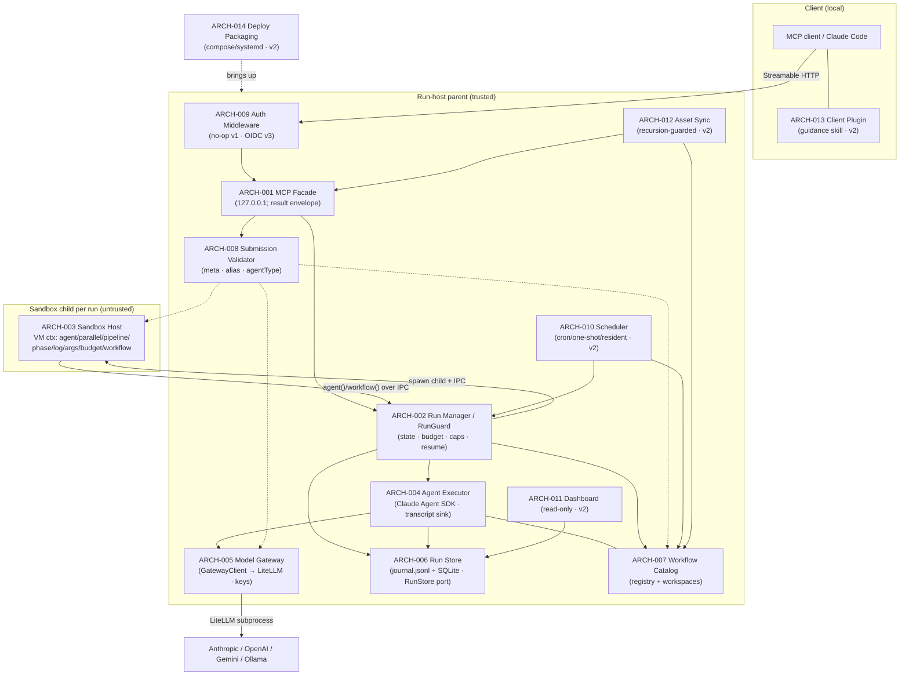

# 02 Architecture — Remote Workflow Engine

> Decomposition of REQ-001..021 into modules. Each `### ARCH-NNN`'s `traces` points back to the REQ(s) it realizes; matching verification is integration test IT-*.
> **Load-bearing decision**: a single **trust-boundary / IPC seam** splits an *untrusted child* (the Claude-generated orchestration JS, pure API surface only) from a *trusted parent* (budget/journal/agent-spawn/secrets). That one seam simultaneously minimizes the security blast radius (D6), is the master test seam (stub the agent executor → dry-run the real 641-line fixture with zero model calls), and is the natural single-authority point for budget/concurrency consistency.
> **Compat kernel vs extensions** (compat-spec §6): ARCH-001..008 are the v1 compat kernel + entry-point validation; ARCH-009..014 are deliberate extensions that attach at pre-existing v1 seams (auth-as-middleware, scheduler-over-catalog, dashboard-over-store, sync-over-workspace) with **zero v1 rework**. **v3 slice** ARCH-015..019 hang on the *same* untrusted-child ⟂ trusted-parent boundary (provisioning registry, secret store, SDK session-options builder + outer timeout race, asset-ingestion policy, workRoot project-isolation guard) — again zero v1 rework; the only v1/v2 module *amendments* are three fail-closed tightenings recorded in the rationale (global RunGuard semaphore, non-loopback bind guard, proxy-subprocess lifecycle).
> Panel provenance: `.panel/gate2/adversarial.r1.md` (security/scalability/testability, opus) + `.panel/gate2/quality.r1.md` (observability/replaceability/consumability/self-sustainability, sonnet-5). Decision rationale at the foot of this file.

## Compat kernel (v1) — 100%-compat baseline (compat-spec §1–§5)

### ARCH-001 — MCP Facade (Streamable HTTP interface)
- **status:** draft
- **traces:** REQ-005, REQ-007
- **note:** Streamable-HTTP transport; dispatches `workflow_run/status/result/suspend/resume/stop/list` + `workflow_agent_log`; binds `127.0.0.1` by default, `0.0.0.0` opt-in (D5); async `runId` return. Emits a **uniform result envelope** `{runId,status,result,error?}` from every tool so agent callers branch identically (consumability). No business logic (delegates to ARCH-002), no direct persistence (reads via ARCH-006), no auth *decision* (calls the ARCH-009 seam, a no-op in v1). Depends: ARCH-002, ARCH-006, ARCH-008, ARCH-009(no-op).
- **iter:** v1

### ARCH-002 — Run Manager / Lifecycle (single per-run authority · RunGuard)
- **status:** draft
- **traces:** REQ-002, REQ-006
- **note:** The single authority per run: state machine (`queued/running/suspended/stopped/completed/failed`), concurrency gate `min(16,cores−2)`, global agent counter (≤1000), **budget accounting** (`total/spent()/remaining()`, hard-throw at ceiling), serialized journal-append ordering, suspend/resume/stop, replay-from-cache orchestration. These three caps together form the shared **RunGuard** read by both orchestration and the agent spawner so they cannot drift (quality: self-sustainability bound). Does NOT run script code (ARCH-003) or call the model (ARCH-004) — owns policy & truth, not execution. Depends: ARCH-003, ARCH-004, ARCH-006, ARCH-007.
- **iter:** v1

### ARCH-003 — Sandbox Host (untrusted-child execution kernel)
- **status:** draft
- **traces:** REQ-001, REQ-002
- **note:** One Node child process per run; restricted **VM context** exposing ONLY the workflow API surface (`agent/parallel/pipeline/phase/log/args/budget/workflow`); determinism guards (`Date.now`,`Math.random`,argless `new Date()` throw); no fs/Node/network/`require` in-context; 512 KB cap; JS-not-TS parse rejection; `meta` literal validation; `parallel`/`pipeline` null-semantics; `workflow()` one-level nesting throw; 4096-item/call cap. Holds **no secrets, no store handle, no network** — marshals each `agent()`/`workflow()` over the IPC seam to ARCH-002; the in-script `budget` is a read-only view (ARCH-002 is source of truth). Depends: ARCH-002 (IPC only).
- **iter:** v1

### ARCH-004 — Agent Executor (Claude Agent SDK headless)
- **status:** draft
- **traces:** REQ-003, REQ-007
- **note:** Per `agent()` call: one Claude Agent SDK headless session; `schema`→StructuredOutput with retry-on-mismatch; `agentType` resolved from the server-side registry (unknown → reported error, not hang); `effort`/`isolation` applied; terminal failure after retries → resolves `null` (never rejects). Runs **parent-side** so untrusted script never touches the SDK or keys. **AgentTranscriptSink**: one capture path taps the SDK message/event stream → `agent-<id>.jsonl` (feeds `workflow_agent_log`, dashboard, and resume cache — not three paths). Token deltas emitted here feed both the `budget` view and the status API (one accounting path). Depends: ARCH-005, ARCH-006, ARCH-007.
- **iter:** v1

### ARCH-005 — Model Gateway (embedded LiteLLM behind GatewayClient)
- **status:** draft
- **traces:** REQ-004
- **note:** Manages the embedded **LiteLLM** subprocess; exposes it only through a narrow **`GatewayClient.invoke(prompt,opts)`** interface (one impl today, `LiteLLMGatewayClient` over `ANTHROPIC_BASE_URL`) so the gateway is replaceable per D2 without touching ARCH-004. Owns the alias→provider mapping (`sonnet/haiku/opus/default → Anthropic/OpenAI/Gemini/Ollama`) as **config**; **sole custody of provider API keys** (parent-only). Every call is **correlation-tagged** with `runId`/`agentId` so the LiteLLM request log joins back to the store (makes REQ-004 "local backend only" verifiable). Surfaces real provider+model id + token usage back to ARCH-002/004. **Provider-down handling**: bounded timeout → retry → `null` (reuses REQ-003 null semantics) so a dead/hung provider (e.g. local Ollama) cannot hang a whole run — see decision D-G below (user-confirmed: in v1).
- **iter:** v1

### ARCH-006 — Run Store (journal.jsonl + SQLite, RunStore port · RunRecorder)
- **status:** draft
- **traces:** REQ-006, REQ-007
- **note:** Durable persistence behind a narrow injectable **`RunStore`** port (create/append/query run & agent records): `journal.jsonl` per run (each `agent()` return in completion order — the resume cache keyed on `(prompt,opts)` longest-unchanged-prefix), `agent-<id>.jsonl` transcripts, SQLite **index** for `list/status`. Survives restart; single-writer *per run* (per-run files → no cross-run contention). **RunRecorder**: one writer of every state transition (timestamp + `runId`), two readers (status API, dashboard). Boot-recovery emits one log line enumerating re-hydrated runs. Port abstraction is for **testability** (in-memory fake), NOT multi-DB portability (no REQ asks to swap SQLite → deliberately not built).
- **iter:** v1

### ARCH-007 — Workflow Catalog (named registry + per-workflow/per-run workspaces)
- **status:** draft
- **traces:** REQ-013, REQ-014
- **note:** Named registry (save/list/invoke-by-name; version pinning so prior runs reference their version); `workflow(name)` resolution (unknown name → catchable throw). **Per-workflow persistent work folder** + **per-run workspace** rooting: agent file I/O confined to the run workspace, run A cannot see run B, workflow X's folder unreachable from Y via the API; documented retention/cleanup policy. Hands ARCH-004 a *rooted* workspace path and refuses to resolve outside it. Registry-version and work-folder are merged (one identity key = one module; splitting would be two modules over one PK). Depends: ARCH-006 (metadata).
- **iter:** v1

### ARCH-008 — Submission Validator (fail-fast at entry points)
- **status:** draft
- **traces:** REQ-001, REQ-004, REQ-014
- **note:** One validation facade invoked at both `workflow_run` and workflow-registration entry points so errors surface **at submission, not mid-run**: `meta` literal shape (compat-spec §1), model-alias mappings resolve (REQ-004 "missing mapping reported at submission"), `agentType` existence. Delegates to each owning module's rule (ARCH-003 parse/meta, ARCH-005 alias table, ARCH-007 registry) but presents **one error-reporting shape** — collapses three ad-hoc checks into one seam (consumability). Depends: ARCH-003, ARCH-005, ARCH-007.
- **iter:** v1

## Extension modules (v2/v3) — attach at existing v1 seams, zero v1 rework

### ARCH-009 — Auth Middleware (pluggable, no-op in v1)
- **status:** draft
- **traces:** REQ-012
- **note:** Wraps the ARCH-001 request pipeline; **ships v1 as a pass-through no-op** (D5), v3 swaps in an OIDC resource server (401 + resource metadata, PKCE; Keycloak dev / enterprise SSO / Entra ID). Auth-disabled config = v1 behavior (backward compatible). No ARCH-001 signature change → drop-in. Depends: ARCH-001.
- **iter:** v3

### ARCH-010 — Scheduler (cron / one-shot / resident-trigger)
- **status:** draft
- **traces:** REQ-015
- **note:** A driver **over ARCH-007 + ARCH-002**: cron schedules, one-shot-at-T (auto-completes; editable before firing), resident `workflow_trigger(name,args)` (rejected when disabled). Starts runs via the **same code path** as a manual `workflow_run` → scheduled runs appear in `workflow_list`/dashboard like any run. Pure consumer of existing surfaces; no kernel change. Depends: ARCH-007, ARCH-002.
- **iter:** v2

### ARCH-011 — Web Dashboard (read-only over the store)
- **status:** draft
- **traces:** REQ-008
- **note:** **Read-only over ARCH-006** (+ live tail): run list with status, drill-in to phase/agent tree with live-updating states + token usage, per-agent transcript view. Adds no write path — cannot perturb runs. Depends: ARCH-006.
- **iter:** v2

### ARCH-012 — Asset Sync (recursion-guarded upload)
- **status:** draft
- **traces:** REQ-009
- **note:** MCP tools `asset_push/asset_list/asset_delete` writing into ARCH-007's server-side workspace. **Recursion guard (D4)**: rejects/strips this system's own plugin/guidance skill/self-MCP-config, reporting the exclusion. **AssetValidator** with a *live probe* of pushed MCP configs (attempt connect/handshake) — server-runnable (remote HTTP / npx stdio) accepted; non-runnable or interactively-authenticated-headless (compat-spec §5 caveat) rejected with an actionable reason. Depends: ARCH-007, ARCH-001.
- **iter:** v2

### ARCH-013 — Claude Code Client Plugin (install + guidance skill)
- **status:** draft
- **traces:** REQ-010
- **note:** Client-side artifact: MCP connection config + guidance skill teaching agents when to use the remote service vs the built-in dynamic Workflow tool (incl. the async **submit→poll `workflow_status`→fetch `workflow_result`** pattern, since `workflow_run` returns `runId` immediately). Coexists conflict-free with the local Workflow tool; **excluded from its own sync** (D4). Depends: (client-side; consumes ARCH-001).
- **iter:** v2

### ARCH-014 — Deploy Packaging (local + remote Linux)
- **status:** draft
- **traces:** REQ-011
- **note:** docker-compose / systemd bring-up of ARCH-001..008 + the LiteLLM (ARCH-005) subprocess; documented smoke check (submit sample workflow → completes); identical steps on localhost and remote host. DEPLOY.md sets a **restart policy** (`Restart=on-failure`) — the self-healing seam v1/v2 need (no custom watchdog) — and loudly documents the **v2-without-auth caveat** (asset_push = server-side code execution; require SSH-tunnel/VPN until v3 auth). Depends: all ARCH-001..008 (+ v2 modules when present).
- **iter:** v2

## v3 slice modules (REQ-016..020) — attach at the existing trust boundary, zero v1 rework

### ARCH-015 — MCP Provisioning Registry (admin-write, referenced-by-name)
- **status:** draft
- **traces:** REQ-017
- **note:** SQLite-backed `name → {kind: stdio|http, config}`, provisioned **out-of-band** from run submission via an admin-only `mcp_provision` tool (probes the server at provision time → `MCP_PROBE_FAILED` on a dead config; reject, not silent). At session build the run references MCPs **by name**; unknown name → typed `MCP_NOT_PROVISIONED` at submission/run (never silent no-op). Sibling of the ARCH-007 catalog over the ARCH-006 store; **read** by ARCH-017 which injects ONLY the explicitly-referenced entries with `strictMcpConfig` preserved (host ambient MCP never inherited — the VAL-003 isolation invariant). Admin-provisioned stdio is trusted **because** it is admin-provisioned, not per-run-uploaded — so the security-critical property is the *write authority* (see the non-loopback bind guard, D-BIND). Depends: ARCH-006, ARCH-001.
- **iter:** v3

### ARCH-016 — Secret Store + Resolver (parent-only, never workspace-reachable)
- **status:** draft
- **traces:** REQ-018
- **note:** Parent-only. Loads `${secret:name}` sources from systemd `LoadCredential`/process env into parent memory at startup; a narrow **`SecretResolver` port** resolves `${secret:name}` → value **at session-build time** and injects it into the MCP/provider config the parent hands the SDK. Registry/asset entries store **only the handle**, never plaintext; a missing handle → typed `SECRET_MISSING` / `SECRET_HANDLE_INVALID` (fail-closed — never a hang, never the literal handle smuggled through as a value). **Two-layer containment** to make REQ-018's stated invariant *true*, not just handle-shaped (see D-SEC): (1) provider keys live only in the LiteLLM proxy process env/memory — off every agent-reachable filesystem path; (2) MCP secrets resolved in parent memory, never written to any workspace path; and the ARCH-007 confinement callback is made **realpath-based + argument-name-complete + `Bash`-deny-outside-root** so a tool-capable agent cannot `cat` the proxy config or a sibling run's journal. **Redaction is part of this module, not an afterthought** (D-REDACT): resolved values never enter transcripts/dashboard/logs; SessionInitRecord logs handle *names* only. One concrete source today (env/`LoadCredential`) behind the resolver port — **no vault/KMS impl until a second backend is a real requirement** (Karpathy). Depends: ARCH-005, ARCH-015, ARCH-007.
- **iter:** v3

### ARCH-017 — SDK Session-Options Builder (pure) + outer timeout race
- **status:** draft
- **traces:** REQ-016, REQ-020
- **note:** Splits **policy** from **spawn** — the master v3 test seam. A **pure** builder `(providerClass, alias, config, provisionedRefs, resolvedSecrets) → SDKOptions` sets `thinking:{type:'disabled'}` for non-Anthropic aliases (Anthropic left at SDK default — the D-F6 regression guard), the **curated tool allowlist** (never the full built-in Claude Code surface, so small models are not drowned into text-only degradation), and the explicitly-referenced injected-MCP set (`strictMcpConfig`). Provider capability is a **config-driven `ProviderProfile`** per alias (`supportsExtendedThinking/supportsToolUse/timeoutMs/retries/effortMapping`), single source of truth shared with the alias validator — GLM/qwen/next-provider is a config row, not a gateway rewrite (D2 replaceability; also answers the open `effort`-mapping question). Impure half: `Promise.race(query, timeoutMs)` that **kills the CLI subprocess** on timeout (not a bare abandon — an orphan child burns tokens and holds a global slot for its ~4-min internal backoff) → `agent()` resolves `null`, bound observably applied on BOTH gateway paths. Both impls write one **`FailureEnvelope`** `{kind:timeout|provider_error|tool_error|schema_mismatch, attempts, elapsedMs, providerDetail}` before resolving `null` (never fake success text) and one **`SessionInitRecord`** at build (resolved alias→provider+model id, thinking mode, allowlist, injected-MCP names, secret-handle names, cwd) — makes REQ-016 c3 "curated surface observable in session init" auditable from the store. Real `tool_use` round-trip against local Ollama is the one unavoidable real-tier integration test; everything else (thinking flag, allowlist, strict-MCP, typed errors, secret-never-in-artifact) is a pure unit test. Lives **inside** the GatewayClient impls behind the unchanged `invoke(prompt,opts)` contract (SDK options never leak through ARCH-004 into orchestration). Depends: ARCH-004, ARCH-005, ARCH-015, ARCH-016.
- **iter:** v3

### ARCH-018 — Asset-Ingestion Policy (hooks-drop by construction, MCP-config redirect)
- **status:** draft
- **traces:** REQ-019
- **note:** A pure classifier at the ARCH-012 asset boundary: **hook-kind assets rejected by construction** with a typed `HOOKS_UNSUPPORTED` reason (never silently materialized) — closes the arbitrary-server-side-code (RCE) vector by construction; the engine's OWN internal `PreToolUse` workspace-boundary hook is a fixed control (not user-uploadable) and is unaffected. **MCP-config-kind assets are redirected to ARCH-015 provisioning** rather than materialized per-run (the REQ-009 rescope); skill-kind continues to ARCH-012 materialization. One-line unit test per asset kind. Depends: ARCH-012, ARCH-015.
- **iter:** v3

### ARCH-019 — WorkRoot Project-Isolation Guard (boot fail-fast + session-init confinement)
- **status:** draft
- **traces:** REQ-021
- **note:** Closes the session-init confinement leak that **BYPASSES the ARCH-016 tool-level jail** (empirically reproduced 2026-07-11: `workRoot:"./data"` inside the engine repo → a qwen agent verbatim echoed the operator's MEMORY.md). With `settingSources:['project']` (needed so ARCH-017's session loads the run workspace's own materialized `.claude/skills`), the agent CLI resolves the *project root* to the nearest ancestor containing a `.git`/`CLAUDE.md` marker and loads ITS `CLAUDE.md` + `~/.claude/projects/<hash>/memory` into agent context — the leak happens at **session-init, not via a Read tool call**, so ARCH-016's realpath/argument-complete/`Bash`-deny callback never intercepts it. Two-part fix, the minimum that makes REQ-021 true: **(1) boot fail-fast** — at server boot the entrypoint resolves the configured `workRoot` and walks its ancestors; if `workRoot` itself or any ancestor carries a project marker (`.git`/`CLAUDE.md`), boot aborts with a typed `WORKROOT_INSIDE_PROJECT` error naming the offending ancestor + remedy (set workRoot outside any project); a marker-free ordinary data dir boots normally (no false positive). **(2) session-init confinement** — ARCH-017 builds each run session with `cwd` = the run workspace under a now-guaranteed-project-free workRoot, so the CLI's project-root resolution cannot climb into an operator project. Owned as a boot/entrypoint guard co-located with ARCH-007's workspace-rooting authority (a fixed control, not runtime-configurable); consumed by ARCH-017 at session build. **No new runtime subsystem** (Karpathy — one boot check + a cwd invariant, not a per-agent OS jail; consistent with D-SEC's "no uid/namespace jail" ruling). Depends: ARCH-007, ARCH-017, ARCH-014 (boot).
- **iter:** v3

## Decision rationale (contested / gap points)

- **D-VAL — centralized Validator vs per-module checks** (quality ⟂ adversarial): adversarial had each module validate its own inputs; quality wanted one Validator to avoid three ad-hoc entry-point checks. **Resolved (quality conceded the ownership, adversarial conceded the facade):** ARCH-008 is a thin *facade* at the two entry points that **delegates** to each module's rule — one fail-fast error shape without duplicating validation logic or inverting module ownership. Simplicity holds (no new rule engine).
- **D-G — gateway provider-down circuit breaker** (quality's one genuine gap; C4-adjacent): no REQ-004 criterion covers an unreachable/hung provider. **Resolved to the minimal option**: fold a bounded timeout→retry→`null` into ARCH-005's `GatewayClient` (reuses REQ-003's existing null-on-terminal-failure semantics; costs no new run-state). **USER CONFIRMED 2026-07-03: keep the minimal breaker in v1** (REQ-004 acceptance extended accordingly). No heavier circuit-breaker/bulkhead is proposed (speculative for a single-node QM tool).
- **C1 sandbox strength vs perf** → honor D6 exactly (process + restricted VM, secrets parent-only); no container/gVisor per run (QM class doesn't warrant it; trust split already removes keys/network/fs from blast radius).
- **C2 single writer vs horizontal scale** → a run is single-authority/single-host (ARCH-002); scale is across *runs*, not within one. No distributed budget consensus (needless flexibility; v1 is localhost).
- **C3 injectable seams vs simplicity** → inject only where non-deterministic/networked/costly: **ARCH-004 (SDK), ARCH-005 (Gateway), ARCH-006 (Store)** + the determinism guards as the clock/RNG seam. ARCH-001/003/007 stay concrete. The ARCH-004 stub alone unlocks full compat-suite dry-runs of `sdlc-run.js`.
- **C4 v2 asset_push RCE before v3 auth** → do not pull OIDC forward (respects D5 sequencing); ship the ARCH-009 no-op seam, gate exposure via tunnel/VPN deployment, document the caveat in ARCH-014.
- **Explicitly NOT built** (both groups agree, Karpathy): pluggable DB backend, pluggable sandbox strategy, pluggable agent-execution engine (D1 fixes the SDK), metrics/alerting stack, autoscaling, cross-run agent memory, prompt self-calibration.

### v3 slice (REQ-016..020) — panel convergence
- **D-SEC — how far to contain secrets (adversarial security ⟂ scalability/testability/simplicity, IC1).** Security wanted an OS filesystem jail per run (uid/mount-namespace/chroot) to make REQ-018's *"no secret on any sandbox-reachable path"* invariant hold generally; that needs elevated caps, complicates docker/systemd deploy, is hard to exercise in CI, and exceeds the QM warrant. Simplicity wanted the existing lexical `file_path` check. **Resolved to the minimal option that still makes the *stated* invariant true — two-layer containment** (ARCH-016): keys off every agent-reachable filesystem (env-only into the proxy) + a realpath/argument-complete/`Bash`-deny confinement callback. **Security conceded the full OS jail; simplicity conceded the lexical-only check** — because the review already ruled a lexical `file_path`-only check *under-builds* a stated invariant, and under-building an invariant is a defect, not a Karpathy win. Full uid-per-run jail noted as the robust alternative, deferred unless a HIGH re-escalates.
- **D-DOS — global RunGuard semaphore (amends ARCH-002, no new module).** v3's SDK harness spawns a CLI subprocess *per agent* plus N stdio-MCP children per session, and the scheduler launches runs autonomously → per-run caps multiply into a single-node exhaustion surface. **Both groups co-signed:** promote the concurrency gate + global agent counter to **one process-global semaphore shared by every `RunGuard`** (budget stays per-run — that is the REQ-002 per-run quantity C2 licenses; the *global* counter is not). REQ-020's timeout must FREE the slot on kill (D-KILL), or a hung provider starves the very resource the semaphore rations. Carried review finding V2, now acute — lands with v3, not after.
- **D-KILL — outer timeout kills the child (adversarial R3 ⟂ "configure the SDK's own retry knobs").** One side argued REQ-020 is met by tuning the CLI's internal retry/backoff. **Resolved to both, with the engine-owned outer bound non-negotiable** (ARCH-017): configure what the SDK exposes, but a black-box child's policy is not our contract — the outer `Promise.race` must **kill** the subprocess (not abandon the promise), else an orphan burns tokens and holds a global slot. Kill-on-timeout + per-attempt token attribution close the "REQ-020 passes its test while budget silently rots" hazard both groups flagged as highest-risk.
- **D-PROFILE — ProviderProfile config vs hardcoded if-Anthropic branch (quality replaceability ⟂ Karpathy "speculative structure").** Quality wanted a per-alias capability table; simplicity read it as speculative. **Resolved for the config table** (folded into ARCH-017): it is a reaction to a *confirmed real defect* (the D-F6 thinking-400 on Ollama), not imagined flexibility — debt already incurred. It also retires the open `effort`-mapping question as a config row instead of future code. Kept as a flat config table, **not** a formal provider SPI/plugin (that abstraction is the part Karpathy cuts).
- **D-REDACT — clear errors vs info-disclosure on the unauthenticated listener (IC4, security ⟂ consumability).** REQ-017/018 demand *clear* errors, but enumerating the provisioned-MCP inventory or the secret-name set to any caller on the no-auth listener is disclosure. **Resolved: clear *typed* error (reason-code taxonomy: `MCP_NOT_PROVISIONED/MCP_PROBE_FAILED/SECRET_MISSING/SECRET_HANDLE_INVALID/HOOKS_UNSUPPORTED/PROVIDER_TIMEOUT`) to the submitting client, but transcripts/dashboard/logs redact resolved secret values and do not enumerate the secret set.** Consumability conceded discoverability endpoints until auth (REQ-012) lands; security conceded that a clear typed error to the trusted-behind-tunnel submitter is fine.
- **D-BIND — non-loopback bind guard (amends ARCH-009, no new module).** v3 stacks an RCE-capable provisioning surface + a secret store on the same unauthenticated listener. **Resolved:** materialize the ARCH-009 no-op middleware in *code* (the review found only the deploy half of C4 shipped) and add a **fail-closed guard that refuses `bind != 127.0.0.1` unless an explicit `insecureNoAuth:true` is set.** Quality saw the guard as creep against the "OIDC deferred" decision; **it is not auth** — a one-`if` fail-closed default that makes the deferral safe. OIDC itself stays deferred (respects D5/scope).
- **D-PROC — proxy/CLI subprocess lifecycle (quality ManagedSubprocess supervisor ⟂ adversarial "let systemd/docker restart-policy do it").** Confirmed real defects: port-4000 collision, proxy never stopped on shutdown, mkdtemp config dirs leaked, and (once D-KILL lands) orphaned CLI children. **Resolved to the minimum that fixes the incurred debt, folded into ARCH-005 (proxy) + ARCH-017 (CLI kill-on-timeout), not a new self-heal subsystem:** derived/dynamic port selection, health probe before first use, SIGTERM→SIGKILL shutdown tied to engine lifecycle, temp-dir cleanup on session end/stop/timeout. **Restart/auto-recovery stays on the supervisor** (systemd `Restart=on-failure` / docker restart-policy per ARCH-014) — no in-process watchdog (adversarial won the "less code" point; quality won the lifecycle-cleanup point).
- **D-PROBE — MCP liveness at provision + submission, no background poller.** Run the existing `mcp-probe` at provision time (reject dead configs) and optionally at run-submission for referenced names (fail-fast). **No continuous background probing** (speculative on a single node) — both groups agree.
- **D-WORKROOT — REQ-021 session-init leak, added in synthesis beyond the panel's stated REQ-016..020 scope.** The 2-group panel (`.panel/architecture/adversarial.r1.md` opus + `quality-dimensions.r1.md` sonnet, round-1 headlines complementary — no round 2 needed) scoped itself to REQ-016..020; REQ-021 (added 2026-07-11 after the empirical MEMORY.md-echo reproduction) had **no ARCH**, the one decomposition gap. **Synthesis adds ARCH-019 rather than folding into ARCH-016**, because the leak is orthogonal to ARCH-016's *tool-call* reachability containment: it happens at session-init via the CLI's project-root resolution, which the realpath/`Bash`-deny callback never sees. Chosen minimal shape = a **boot fail-fast guard** (`WORKROOT_INSIDE_PROJECT`) + a **workspace-cwd-outside-any-project invariant** — no per-run OS jail (consistent with the D-SEC ruling that a uid/namespace jail exceeds the QM warrant). Both stances are satisfied: the adversarial "confinement must actually hold, not just be handle-shaped" (a real ancestor-walk, fail-closed) and the quality "opaque failure = defect" (a typed, actionable boot error naming the offending ancestor, not a silent leak). Panel altitude note: this is agent-altitude confinement on the system-altitude boot path.
- **REQ-009 rescope acknowledged:** its acceptance now delegates hook-rejection and MCP-config-redirect to ARCH-018; ARCH-012 remains the skill-materialization + recursion-guard owner. No trace change to ARCH-012.
- **v3 "Explicitly NOT built"** (both groups, Karpathy): pluggable vault/KMS secret backend, provider-capability probe subsystem, MCP connection pool, background MCP health poller, per-run OS uid/namespace jail, in-process self-heal/watchdog, cross-run agent memory, OTel/metrics stack. All deferred until a real requirement or a re-escalated HIGH forces them.

## Architecture container diagram

### ARCH-020 — Workspace byte-transport (recursive listing + sha256 + chunked realpath-contained get + body cap)
- **status:** done
- **traces:** REQ-022, REQ-023, REQ-024
- workspace-artifacts (pure): recursive listArtifacts (rel path + size + sha256, symlink-escape skipped) + readArtifactChunk (windowed, size-capped, realpath-contained via isPathContained); server.ts readBody body-size cap (413).

### ARCH-021 — Seed-into-workspace (pre-agent materialization + .claude RCE strip)
- **status:** done
- **traces:** REQ-025
- workspace-seed.materializeSeed: engine-side, before agents start (RunManager.start); strips `.claude/settings*.json` + `.claude/hooks/**` (closes DES-028 hook-gate for the seed path), realpath-contained, rejects `.git` internals.

### ARCH-022 — Run-workspace retention (manual purge + opt-in TTL GC)
- **status:** done
- **traces:** REQ-026
- workspace_purge (terminal-only) + reclaimStaleWorkspaces (opt-in config.workspaceTtlMs, deletes TERMINAL+old, never active/suspended/unknown).

## v5 slice — GitHub issue reporting (ARCH-023)

### ARCH-023 — GitHub Issue Reporter
- **status:** done
- **traces:** REQ-027, REQ-028, REQ-029, REQ-030, REQ-066
- **iter:** v11
- Engine-side `issue_report` core (src/github/issue-reporter.ts): an injectable GithubIssueClient (bounded fetch — AbortController timeout + retry budget, 4xx-except-429 not retried — any non-2xx/network/timeout surfaced as a typed `GITHUB_API_ERROR`, never a hang/crash/fake-success). The GitHub token is read from the server-side SecretSource (`RWE_SECRET_GITHUB_TOKEN`), never workspace- or sandbox-reachable and never from tool args (extends ARCH-016's secret store to REQ-028). Fixed, machine-parseable agent-consumable body template + fixed `agent-reported` label (and optional `severity:<x>`) so a downstream solve-flow can query/parse it. Fixed target repo `HsuJavis/remote-workflow-engine`. Wired at server.ts `callTool` (`issue_report` case → `{issueNumber,url}` or typed error envelope) from the composition-root default (loadSecretSourceFromEnv + shared ENGINE_VERSION) or the `ServerConfig.issueReporter` test seam. Depends: ARCH-001 (tool/server surface), ARCH-016 (server-side secret store).
- **NB (v6):** REQ-035/036 amend this ARCH-023 `report()` path — dedup (fingerprint + hidden body marker + findOpenByFingerprint→createComment) and best-effort runId diagnostics enrichment are folded into `report()`; see ARCH-024.
- **NB (v11, REQ-066):** every filed issue always carries a version. `IssueReportInput` gains an optional `version`; when the caller omits it the engine fills its OWN running version (a `resolveEngineVersion()` seam = `package.json` version + best-effort `git describe`, computed once at the composition root, replacing the hardcoded `ENGINE_VERSION`). The body renders a labelled `Version:` line, and all five report fields (repro/version/severity/analysis/log) are always rendered (placeholder when absent) so no issue is ever version-less or field-sparse. Folded into the existing `renderIssueBody`/`report()` path; see DES-037.

## v6 slice — GitHub issue read/reply toolset (ARCH-024)

### ARCH-024 — GitHub Issue Ops (read/list/comment toolset + dedup + runId enrichment)
- **status:** done
- **traces:** REQ-031, REQ-032, REQ-033, REQ-034, REQ-035, REQ-036, REQ-067
- **iter:** v11
- Extends ARCH-023's GithubIssueClient with read/write issue ops (getIssue / listIssues / getComments / createComment / findOpenByFingerprint over a shared bounded-fetch `ghFetch`: 404→null on get/comments/createComment, other non-2xx→`GITHUB_API_ERROR`, retry only on 5xx/429/network — same never-hang/crash/fake-success discipline as ARCH-023). Surfaces four new MCP tools `issue_get` / `issue_list` / `issue_comments` / `issue_comment` (server.ts TOOL_NAMES + TOOL_METADATA + `callTool` cases), each returning a typed envelope (`ISSUE_NOT_FOUND` / `ISSUE_COMMENT_INVALID` / reused `GITHUB_TOKEN_MISSING` / `GITHUB_API_ERROR`).
- Two upgrades to the ARCH-023 `report()` path: REQ-035 dedup via `issueFingerprint()` (sha256 over title/component) + a hidden `<!-- rwe-fp:… -->` body marker that `findOpenByFingerprint` searches — a matching OPEN issue is commented instead of re-filed (`deduped:true`); REQ-036 best-effort runId enrichment of the `## Linked run` section from an injected `runDiagnostics(runId)` (facade status + artifact list + last-agent transcript tail), which never fails the report when the runId is unknown.
- Depends: ARCH-023 (GithubIssueClient + IssueReporter it extends), ARCH-001 (tool/server surface), ARCH-002 (McpFacade — supplies the runId enrichment data: workflow_status / artifacts / agent_log).
- **NB (v11, REQ-067):** a READ-ONLY dashboard Issues page that DISPLAYS current issues, sourced from the EXISTING `issue_list`/`issue_get` primitives (no new GitHub client work, no report form). Adds two read-only endpoints on the SAME dashboard-API transport (ARCH-011 / DES-018 `handleDashboardRequest`): `GET /api/issues` (open + resolved `agent-reported` groups) and `GET /api/issues/:number` (one issue's detail), plus a new Issues view in the dashboard page. A missing GitHub token degrades to a "not configured" notice (HTTP 200, never a 500/crash) so the rest of the dashboard still loads. Rides the ARCH-029 dashboard page + the ARCH-011 read-only HTTP transport; no run-lifecycle or v1 change. See DES-038.

## v7 slice — provider-native routing + OpenRouter + models_list catalog (ARCH-025, ARCH-026)

### ARCH-025 — Provider-native SDK routing + OpenRouter provider
- **status:** done
- **traces:** REQ-037, REQ-038
- **iter:** v7
- Splits the ARCH-005 gateway routing by provider at SDK-session build time: an `agent()` whose resolved alias has provider `anthropic` routes DIRECT to the real Anthropic API (`ANTHROPIC_BASE_URL` = real Anthropic, LiteLLM bypassed — no tool-schema translation), while `openai`/`openrouter`/`ollama` keep routing through the managed embedded LiteLLM proxy (translation layer preserved). The Anthropic-direct path carries dual auth resolved from config/secret presence (`resolveAnthropicAuth`): mode `api-key` → real `ANTHROPIC_API_KEY`; mode `subscription` → `CLAUDE_CODE_OAUTH_TOKEN` (from `claude setup-token`) with NO `ANTHROPIC_API_KEY`; the required-secret-missing case is a TYPED `ANTHROPIC_AUTH_MISSING` error, never a silent dummy-key run.
- Adds `openrouter` as a first-class provider (extends the ARCH-005 alias→provider mapping + the ARCH-020 submission validator's accepted-provider set): the embedded LiteLLM config gains a native wildcard `openrouter/*` route (reads server-side `OPENROUTER_API_KEY`), and a passthrough model string `openrouter/<id>` is NOT alias-cloaked through the rwe proxy — it goes RAW to match the LiteLLM `openrouter/*` wildcard so ANY current OpenRouter model works without a pre-listed alias (`isPassthroughModel`/`effectiveProvider` derive the provider from the prefix). A separate direct-`openai` provider case coexists (own key, no global `OPENAI_API_BASE` remap).
- Invariant (extends ARCH-016 / REQ-018 D-R2): all auth material — the real `ANTHROPIC_API_KEY`, the OAuth subscription token, and `OPENROUTER_API_KEY` — is injected into the SDK subprocess env ONLY (from the injected `secretSource`); it never reaches the run workspace, sandbox, or transcript.
- Depends: ARCH-005 (Model Gateway alias→provider mapping + LiteLLM the routing splits/extends), ARCH-016 (Secret Store/Resolver — the subprocess-only auth custody this reuses), ARCH-020 (submission validator whose accepted-provider set now admits `openrouter` + passthrough), ARCH-001 (tool/server + SDK gateway composition).

### ARCH-026 — Model catalog (`models_list`)
- **status:** done
- **traces:** REQ-039, REQ-040
- **iter:** v7
- A new discovery surface so an MCP client authoring a workflow can enumerate the models the engine offers. Federates four sources into ONE normalized array (`ModelEntry`: `{provider, model, alias?, description, modalities:{in,out}, contextWindow, price, toolUse, location}`): the curated-alias overlay, a small static openai/anthropic table, a LIVE query of Ollama `/api/tags` (local models), and a LIVE query of OpenRouter `/api/v1/models` (remote metadata incl. tool support from `supported_parameters`). Each live source is injectable (fetcher seams) and degrades gracefully — an unreachable live catalog drops only its own entries; the curated/static entries still return. No secret/API-key value ever appears in the output (secret-separated).
- Surfaces as MCP tool `models_list` (ARCH-001 tool/server surface: TOOL_NAMES + metadata/schema + callTool case) with an AND-filter over `{provider, query, modalityIn, modalityOut, maxPricePerM, minContext, toolUse, location, limit}`, capped by a sane default/hard `limit`, so a client can narrow OpenRouter's large catalog; an empty match returns `[]` (not an error). ServerConfig exposes injectable catalog seams (the fetchers) for test wiring.
- Depends: ARCH-001 (tool/server surface the tool is added to), ARCH-005 (the alias/provider knowledge the catalog federates over), ARCH-025 (the `openrouter` provider whose live catalog this exposes).

## v8 slice 1 — N-level workflow() composition (ARCH-027)

### ARCH-027 — N-level workflow() composition (config-capped nesting depth + cycle/descendant guards + depth-safe journal keying)
- **status:** done
- **traces:** REQ-041, REQ-042, REQ-043, REQ-044
- **iter:** v8
- Lifts the previous one-level `NESTING_ERROR` (a registered composite could not itself contain a `workflow()` node) into a bounded N-level composition tree, so a registered workflow can be a node inside another registered workflow up to a configurable depth. The nested child still runs INLINE, sharing the parent run's single `RunGuard` budget / concurrency cap / agent counter and its journal (extends ARCH-002/ARCH-005's inline-nested-run model from 1 level to N). Each `workflow()` call carries a nesting context down the recursion: `depth` (top run = 0, its first `workflow()` = 1), an `ancestors` name-set, and a deterministic parent frame-path key.
- Three composition guards enforced at the `onWorkflowRequest` boundary, in order (REQ-041/042/043), each a TYPED, branchable envelope error (never a crash/hang of the parent run): (a) `depth > maxWorkflowDepth` → `NESTING_DEPTH_EXCEEDED` (REQ-041; `maxWorkflowDepth` default **4**, validated ≤0/non-integer-rejected at config load); (b) target name ∈ its own `ancestors` set → `NESTING_CYCLE` (REQ-042; a self-call A→A refused at first re-entry) while a legitimate diamond — the same NON-ancestor workflow D called from two sibling branches — is allowed (D runs independently per branch, not mistaken for a cycle, because the guard keys on the ancestor CHAIN, not a global visited-set); (c) per-run total-descendant counter `++entry.descendants > maxWorkflowDescendants` → `DESCENDANT_CAP_EXCEEDED` (REQ-043; default **256**), bounding a wide-and-deep fan-out independently of the per-branch depth cap.
- Depth-safe journal keying (REQ-044b): the old multiplicative `_nestedCallSeq((parentCallSeq+1)×1e6+n)` scheme OVERFLOWED `MAX_SAFE_INTEGER` past ~depth 2 and corrupted replay. It is REPLACED by an ADDITIVE per-frame base allocation (`_frameBaseFor` + a fixed `NESTED_FRAME_STRIDE`): each distinct nested frame — keyed on a deterministic frame-path derived from the parent path + parent callSeq — is assigned `base = (++nestedFrameSeq) × STRIDE`, and that frame's own `agent()` callSeqs are namespaced under `base`. Frames are first-touched in deterministic execution order (including `parallel()` array order), so the keying is identical across a resume → cached replay stays deterministic and collision-free at arbitrary depth within `MAX_SAFE_INTEGER`. The shared-budget invariant (REQ-044a) falls out of keeping the child on the parent's single `RunGuard` (no per-level budget reset).
- Depends: ARCH-002 (RunManager run lifecycle / journal / RunGuard budget this extends), ARCH-005 (the WorkflowCatalog `workflow(name)` resolution the nested calls resolve through), ARCH-001 (ServerConfig → RunManager config threading for the two new caps).

### ARCH-028 — call-tree + composite linkage surfaced for the dashboard (agent frame tagging + nested workflow() boundary nodes)
- **status:** done
- **traces:** REQ-045, REQ-046, REQ-047
- **iter:** v8
- Slice 2 of v8: the first increment of the dashboard DATA layer over ARCH-027's N-level composition. ARCH-027 already gives each nested `workflow()` call a deterministic frame-path key and namespaces each frame's `agent()` calls under a frame base; this module SURFACES that hidden structure so a client can reconstruct the live call-tree (DAG) of a composite run and drill from any node to its transcript. No execution semantics change — this is a read-model/observability extension, not a scheduling change.
- Two structural signals are added to the `workflow_status` / `GET /api/runs/:id` read-model (`RunStatusView`): (a) FRAME-TAGGED AGENTS (REQ-045) — every `AgentRecord` carries the composite `frame` string it ran in (root script = `""`; a nested `workflow()`'s agents carry that call's frame-path, whose parent frame is a strict PREFIX), so agents group + nest by frame with no other data; (b) COMPOSITE-BOUNDARY NODES (REQ-046) — one `workflowNodes` entry `{ frame, name, parentFrame, depth }` per nested `workflow(name)` invocation, where `frame` equals the frame that call's own inner agents carry, `parentFrame` is the caller's frame (`""` at top level), and `depth` is 1-based. Together these let a client group agents by `frame` and nest frames by `parentFrame` to rebuild the whole tree deterministically (REQ-047), with each `agentId` resolving to its log via the existing `workflow_agent_log` drill-down.
- Boundary: the frame is STAMPED at agent-queue time (so an in-flight / just-queued agent already carries it, matching REQ-047's "current step = the running node") and threaded through the existing agent-transcript capture path unchanged; the boundary nodes are recorded at the same `onWorkflowRequest` recursion boundary ARCH-027 already owns, reusing its frame-path key (`framePathKey`) as the node's `frame` and its parent path key as `parentFrame` — so the tree keys are the SAME keys the journal already uses (one source of frame identity, no parallel bookkeeping). The read-model merge exposes the live per-run node list alongside the already-merged live agents/phases.
- Scope line for this increment: cross-restart persistence of the tree is OUT of scope (the persisted/derived `getRun()` path defaults `workflowNodes: []`); parallel-group markers, phase persistence, current-step/timing, and static pre-read + scriptVersion caching are deferred to later Slice-2 increments (recorded in 07-review). `workflow_status` itself needs no change — the MCP facade already returns the full `RunStatusView` as its `result`, so both new fields flow through automatically.
- Depends: ARCH-027 (the N-level composition + deterministic frame-path keying this read-model surfaces), ARCH-002 (the RunManager run/journal read-model `_mergeLive` this extends), ARCH-004 (the AgentExecutor / AgentTranscriptSink capture path the frame threads through).

## v8 slice 3 — dashboard UI: cards → live DAG → agent log (ARCH-029)

### ARCH-029 — dashboard UI: cards → live DAG → agent log (buildDagModel + /api/{workflows,runs/:id/dag} + nested-group page)
- **status:** done
- **traces:** REQ-048, REQ-049
- **iter:** v8
- Slice 3 of v8: the PRESENTATION layer over Slice-2's frame-tagged read-model (ARCH-028). Slice 2 surfaced the raw structural signals (agents carry a `frame`, each nested `workflow()` is a `workflowNodes` boundary node); this module turns that flat read-model into (a) a PURE call-tree model a client renders and (b) the browser-facing dashboard that renders cards → a nested composite DAG → an agent transcript. No execution semantics change — a read-model reshaping + a page, layered on the existing dashboard HTTP transport (ARCH-011/DES-018).
- Two pieces: (a) `buildDagModel(RunStatusView) → DagNode` (REQ-048) — a PURE, total reconstruction of the run's call-tree: index the Slice-2 `workflowNodes` by frame depth-ascending so a parent frame node always exists before its children, attach each frame-tagged agent to its frame's node with a ROOT FALLBACK (an agent whose frame has no matching node is not dropped — it lands on the root), never throws, never mutates its input. This is the single tested model shared by the HTTP endpoint and the page — no parallel tree-building logic. (b) The dashboard surface (REQ-049) — two new read-only endpoints on the existing dashboard-API transport (`GET /api/workflows` → the registered `WorkflowCatalog`; `GET /api/runs/:id/dag` → `buildDagModel(view)`), and a rewritten self-contained SPA that renders the workflow + run cards on `/dashboard`, a recursive nested-group DAG (composite groups, 3-state-colored agent nodes showing model) on `/dashboard/:runId`, and an agent transcript drill-down — on a 3-second poll.
- Boundary / routing fix: the two endpoints reuse the Slice-1/DES-018 dashboard-API handler (`handleDashboardRequest`) and the shared `RunStatusView` read-model; `buildDagModel` runs over exactly the ARCH-028 `frame`/`workflowNodes` fields, so `node.frame == its inner agents' frame` holds by construction from Slice 2. The top-level request router's dispatch predicate — which previously only matched `/api/runs*` — was widened to ALSO match `/api/workflows` (`src/server.ts:797`); without this, `/api/workflows` fell through to the `/mcp` JSON-RPC handler and returned `-32601` (method-not-found). This routing gap was caught at Gate 7.5 on a real run and fixed, with a regression test locking it (IT-048).
- Scope line for this increment: server-sent events are NOT used — the page keeps the 3-second poll (deferred); parallel-group markers, phase persistence + current-step/timing, static pre-read + scriptVersion caching, and cross-restart tree persistence remain deferred from Slice 2 (after a service restart an out-of-process run's `/dag` flattens because `getRun()` returns `workflowNodes: []` — exactly REQ-047's documented cross-restart-out-of-scope). Recorded in 07-review.
- Depends: ARCH-028 (the frame-tagged agents + `workflowNodes` boundary nodes this reconstructs and renders), ARCH-011 (the dashboard read-model + HTTP transport / DES-018 `handleDashboardRequest` these endpoints extend), ARCH-005 (the `WorkflowCatalog` the `/api/workflows` card list reads).

## v8 slice 2b — live execution detail: phase timeline + per-agent timing (ARCH-030)

### ARCH-030 — live execution detail: phase timeline (with timestamps + current step) + per-agent timing (started/ended/duration)
- **status:** done
- **traces:** REQ-050, REQ-051
- **iter:** v8
- Slice 2b of v8: the LIVE-EXECUTION-DETAIL layer over Slice-2/Slice-3's call-tree read-model + dashboard. Slice 2 tagged agents by frame and Slice 3 rendered the nested DAG; this module adds the two remaining "what is happening right now" signals the dashboard was missing — WHEN each `phase()` was entered (the phase timeline, with the last-while-running entry as the current step) and HOW LONG each agent took (dispatch→settle timing). No execution semantics change — two additional timestamps captured on the existing phase-push / agent-capture paths, surfaced through the same read-model + `buildDagModel` + page, layered on the Slice-3 dashboard (ARCH-029/DES-045/046).
- Two pieces: (a) phase timeline (REQ-050) — each `phases[]` entry becomes `{title, ts}` where `ts` is the ISO clock time the `phase()` call was entered; entries stay in call order (non-decreasing `ts`); while the run's status is `running` the LAST entry is the current step. `PhaseView.ts` is made a REQUIRED field so every producer stamps it, and the dashboard renders the timeline marking the current (last, while-running) phase. Back-compatible: a run with no `phase()` still yields `phases: []`. (b) per-agent timing (REQ-051) — each `AgentRecord` carries `startedAt` (the ISO time the agent acquired its concurrency slot / was dispatched to the gateway) and, once settled, `endedAt` (`endedAt ≥ startedAt`); a queued-not-yet-dispatched agent has neither, an in-flight one has only `startedAt`. `buildDagModel`'s agent nodes expose `startedAt`/`endedAt` + a derived non-negative `durationMs` (undefined while unfinished), and the page shows each node's duration.
- Boundary: reuses the SAME injectable `Clock` (`this._clock.isoNow()`) the engine already uses for journal/transition timestamps — one clock source, so an advancing test clock makes the timeline + timing deterministically assertable (IT-049). The `startedAt` stamp is taken at the EXISTING `markRunning` seam (the point the agent acquires its slot, `src/run-manager.ts:494`) — no new lifecycle state; `endedAt` is the `capture()` timestamp already threaded through. Timing/timeline are read-model/observability only — the `RunGuard` budget, concurrency semaphore, and run lifecycle are untouched.
- Scope line for this increment: this closes the "phase persistence + current-step + timing" and "per-node start/end/duration" items deferred from Slice 2/3. Still deferred to Slice 2c (recorded in 07-review): parallel-group markers (which sibling nodes ran as one `parallel()` batch — needs a sandbox-child protocol change), cross-restart phase/tree persistence (after a restart an out-of-process run's phases/tree are not rehydrated), SSE (the page keeps the 3-second poll), and static pre-read + `scriptVersion` cache.
- Depends: ARCH-029 (the Slice-3 `buildDagModel` + dashboard page these timing fields extend), ARCH-028 (the frame-tagged read-model the phases/timing ride alongside), ARCH-011 (the dashboard read-model + HTTP transport / DES-018 the page is served on).

## v8 slice 4 — cross-trigger chaining + run-admission (ARCH-031)

### ARCH-031 — cross-trigger chaining + run-admission (onTerminal hook + durable ContinuationStore + maxConcurrentRuns)
- **status:** done
- **traces:** REQ-052, REQ-053, REQ-054
- **iter:** v8
- Slice 4 of v8: the last core v8 trigger mechanism — CROSS-TRIGGER CHAINING (one run's completion durably starts another) plus a RUN-ADMISSION cap (a DoS chokepoint on top-level run count). The prior slices covered the observability surface (Slice 2/2b/3) and the scheduler/webhook ingress; this module closes the loop so runs can trigger runs, and bounds how many top-level runs may be live at once. No change to RunSpec/RunStore/journal semantics — one new lifecycle notification (`onTerminal`), one new engine-owned durable side table (continuations), and one admission counter, wired at the existing RunManager↔server seams.
- Three pieces: (a) authoritative `onTerminal` hook (REQ-052) — the RunManager fires an injected `onTerminal(runId, status)` EXACTLY once per top-level terminal transition, for all three terminal statuses (`completed`/`failed`/`stopped`), from the single authoritative `_transition` choke (not the un-`.catch`'d `.then` in `_runLive`, which never covers `stopped`); a non-terminal transition never fires it and a nested `workflow()` (no store row, never calls `_transition`) never fires it. Fire-and-forget after the persisted terminal write, so a throwing/slow listener never wedges the run. (b) durable ContinuationStore (REQ-053) — an engine-owned SQLite side table: `chain_create({afterRunId, run})` registers a pending continuation; when `afterRunId` completes the store starts `run.workflow` exactly once (failed/stopped → skipped), records the spawned `runId`, and inherits a lineage `rootRunId`; durable across restart via a boot reconcile; idempotent under a stop→resume→complete cycle; an unknown target returns `CHAIN_TARGET_NOT_FOUND`. (c) run-admission counter (REQ-054) — a `maxConcurrentRuns` cap (default 64, config-validated) enforced at the very TOP of `start()`, rejecting an over-limit top-level run with `RUN_ADMISSION_LIMIT` BEFORE any durable/expensive work (no `createRun`, no workspace mkdir, no seed, no sandbox spawn) — the run-count/sandbox-fork chokepoint the global agent-semaphore (which caps only `agent()` dispatch) does NOT provide; a nested `workflow()` consumes no slot, and a terminal run frees its slot.
- Boundary: the ContinuationStore is a structural peer of the scheduler port — it talks to RunManager and RunStore through structural seams (RunManagerPort.start / RunStorePort.getRun), never importing the classes, so it stays a testable, swappable side module (IT-051 drives it with fakes). The RunManager↔store construction cycle (RunManager needs `onTerminal → store`; store needs `runManager.start`) is broken with a late-bound closure in server composition — the `onTerminal` closure captures a `let continuations` populated immediately after, and it only ever fires at runtime (via `queueMicrotask`), long after both are assigned. Admission + onTerminal are the ONLY changes to the run lifecycle; the RunGuard budget, concurrency semaphore, and journal are untouched.
- Scope line for this increment: this closes the "runs trigger runs" + "bound concurrent runs" items of the v8 trigger plan. Still deferred (recorded in 07-review): external ingress security (Defer B — authn/z + rate-limit on any public trigger surface), durable in-flight-graph suspend/resume (Defer A — persist/rehydrate a mid-execution call-tree across restart), and the Slice-2c dashboard items (parallel-group markers, cross-restart phase/tree persistence, SSE, static pre-read + scriptVersion cache).
- Depends: ARCH-002 (the RunManager lifecycle / `_transition` state machine the `onTerminal` hook fires from and the admission gate fronts), ARCH-010 (the scheduler's SqliteSchedulerPort whose durable-side-table + boot-reconcile pattern the ContinuationStore mirrors), ARCH-001 (the MCP facade / tool surface the `chain_create`/`chain_list` tools and the late-bound server wiring extend).

## v8 slice 2c — cross-restart DAG persistence (ARCH-032)

### ARCH-032 — cross-restart DAG persistence (terminal-transition snapshot of phases + workflowNodes + per-agent frame/label/timing)
- **status:** done
- **traces:** REQ-055
- **iter:** v8
- Slice 2c of v8: fixes the one REAL data-loss the observability slices left open — after a restart an out-of-process run's nested DAG FLATTENS. Slice 2/2b/3 surfaced the call-tree (`frame`/`workflowNodes`), the phase timeline (`phases[]` with `ts`), and per-agent timing (`startedAt`/`endedAt`) — but ALL of that lived only in the per-process `RunEntry`. On the persisted read-back path `getRun()` returned `phases:[]` / `workflowNodes:[]` and `deriveAgentRecords` reconstructed agents from the `usage` transcript event WITHOUT `label`/`phase`/`frame`/timing — so a completed composite run, once the process is gone, rebuilt as a flat list of token-only agents (the deferral explicitly recorded in the Slice-2/2b/3 retros). This module persists that DAG detail ONCE at the authoritative terminal transition and overlays it on read-back, so `buildDagModel` rebuilds the SAME nested tree after a restart as before it. No execution-semantics change and no v1-core change — one engine-owned side table + one write on the existing terminal edge.
- Two pieces: (a) the terminal-transition SNAPSHOT (REQ-055) — a new `RunDagSnapshot {phases, agents, workflowNodes}` captured at the SINGLE authoritative terminal `_transition` (so `failed`/`stopped` are covered, not only `completed`, and it is written exactly once), gathering the run's live `entry.phases`, its full `AgentRecord[]` (via the in-process AgentExecutor's `getAllRecords()`, which carry `label`/`phase`/`frame`/`startedAt`/`endedAt` — the enriched records the transcript-derived path lacks), and `entry.workflowNodes`. (b) the read-back OVERLAY — `getRun()` reads the persisted snapshot row and, WHEN PRESENT, overlays it onto the reconstructed `RunStatusView` (phases/agents/workflowNodes from the snapshot); WHEN ABSENT it falls back to the existing derive-from-transcripts path (`deriveAgentRecords` / `phases:[]` / `workflowNodes:[]`) — so a run persisted before this change (or one that never reached a snapshot) still reconstructs at least as well as today, never worse, never a crash.
- Boundary: the snapshot is a MIGRATION-FREE engine-owned side table (`run_snapshots(runId PRIMARY KEY, json TEXT)` in the SqliteRunStore, `INSERT OR REPLACE`; a `snapshot?` field on the InMemory StoredRun) — same "don't touch v1 core" stance as the scheduler/continuation side tables; RunSpec/RunStore's existing shapes, journal, and the terminal state machine are otherwise untouched. The write is added to `_transition` next to the existing `recordTransition` call (the one authoritative terminal writer) so it rides the SAME choke the onTerminal hook (ARCH-031) rides — covering all three terminal statuses by construction. `saveSnapshot` is added to the `RunStore` port so both stores (InMemory / Sqlite) implement it uniformly.
- Scope line for this increment: this closes the "cross-restart phase/tree persistence" item deferred across Slice 2/2b/3. Still deferred (recorded in 07-review): SSE (Item B — the dashboard keeps the 3s poll), parallel-group markers (Item C — which siblings ran as one `parallel()` batch, needs a sandbox-child IPC change), and the static pre-read skeleton + `scriptVersion` cache (Item D).
- Depends: ARCH-006 (the SqliteRunStore / journal + transition audit trail this snapshot side-table sits beside), ARCH-030 (the Slice-2b phase `ts` + per-agent `startedAt`/`endedAt` the snapshot persists), ARCH-029 (the Slice-3 `buildDagModel` + `workflowNodes` read-model the overlaid snapshot rebuilds), ARCH-002 (the RunManager `_transition` terminal choke the snapshot is written from).

## v8 Defer B — external-ingress security (ARCH-033)

### ARCH-033 — external-ingress security (Host/Origin allowlist + HMAC-verified webhook ingress + durable webhook registry)
- **status:** done
- **traces:** REQ-056, REQ-057, REQ-058
- **iter:** v8
- Defer B of v8: the interim external-ingress SECURITY layer — the access control that lets any trigger surface (the scheduler, the new webhook ingress, the dashboard/API) face something less trusted than pure loopback, WITHOUT the full OIDC of REQ-012 (still deferred, D5). Two independent controls plus their management surface: a Host/Origin allowlist on EVERY HTTP route (DNS-rebinding + CSRF defense), and an HMAC-verified webhook ingress (`POST /hooks/:id`) that fires a PRE-BOUND workflow, backed by a durable webhook registry with a generate-once secret. No change to the run lifecycle or v1 core — one guard at the top of the HTTP handler, one new route, one engine-owned durable side table, three MCP tools.
- Three pieces: (a) the Host/Origin ALLOWLIST (REQ-056) — pure helpers (`isAllowedHost`/`isAllowedOrigin`) enforced at the TOP of the HTTP handler, uniform across `/mcp`, `/api/*`, `/dashboard`, `/hooks/*`: a foreign `Host` (DNS-rebinding) → 403, a PRESENT-but-foreign `Origin` (drive-by browser CSRF) → 403, but an ABSENT `Origin` is allowed (FAIL-OPEN — every programmatic MCP client / test sends none, so a fail-closed Origin check would break all legitimate non-browser callers). The allowset is loopback (`127.0.0.1`/`localhost`/`::1`) at the server port plus the configured non-loopback `bind` host; a real IP-literal / authority check, not a textual prefix (a `127.0.0.1.evil.example.com` prefix-bypass is rejected). (b) the WEBHOOK INGRESS (REQ-057) — `POST /hooks/:id`, fail-CLOSED and in order: id exists+enabled → HMAC-SHA256 constant-time over the RAW body BEFORE any JSON parse → ±300s timestamp window → `X-RWE-Delivery` dedup → fire the PRE-BOUND workflow (name from the stored registration, NEVER from the request body — no workflow-selection injection) with the parsed body as `args.event`; a replay of a seen delivery returns 200 with no second run. (c) the WEBHOOK REGISTRY + management tools (REQ-058) — a durable SQLite side table binding id → {workflow, secret}; `webhook_create` validates the workflow exists, generates a random secret server-side and returns it EXACTLY ONCE; `webhook_list` shows only a sha256 fingerprint (never the secret); `webhook_delete` removes it; durable across restart.
- Boundary: the WebhookRegistry is a structural peer of the scheduler/continuation side modules — it reaches the RunManager and the WorkflowCatalog through structural `RunManagerPort`/`CatalogPort` seams (no class import), so it stays unit-drivable with fakes (IT-054) over real SQLite. The allowlist helpers are pure (net-guard.ts, no I/O) and unit-tested as a truth table (UT-063). The secret is stored server-side (NOT a one-way hash) BECAUSE HMAC verification needs the key — the same GitHub/Stripe model; the interim access control (Host/Origin allowlist + loopback/LAN bind) stands in for OIDC, and a public `0.0.0.0` bind without OIDC remains a documented deployment caveat.
- Scope line for this increment: this closes the "external ingress security (authn/z on a public trigger surface)" item recorded as Defer B in the Slice-4 retro. Still deferred (recorded in 07-review): durable in-flight-graph suspend/resume (Defer A — persist/rehydrate a mid-execution call-tree across restart), and full OIDC (REQ-012, D5) for which this allowlist + bind-safety is the interim control.
- Depends: ARCH-011 (the single HTTP server / `/mcp`+dashboard transport the guard fronts and the `/hooks/:id` route slots into), ARCH-002 (the `RunManager.start` path the webhook fires the pre-bound workflow through), ARCH-010 (the scheduler's durable-side-table convention the WebhookRegistry mirrors), ARCH-001 (the MCP tool surface the `webhook_create`/`list`/`delete` tools extend), ARCH-005 (the D-BIND loopback guard / `net-guard.ts` the allowlist helpers are added beside).

## v8 Defer A — crash durability (ARCH-034)

### ARCH-034 — crash durability: interrupted-status boot recovery + journal read-back replay (Option X — reuse ResumeCache, no checkpoint protocol)
- **status:** done
- **traces:** REQ-059, REQ-060
- **iter:** v8
- Defer A of v8: a run that was in-flight when the engine crashed/restarted is now RESUMABLE, not lost — the last core v8 trigger-durability gap. Achieved via **Option X**: reuse the EXISTING ResumeCache/journal-replay machinery (the same one suspend/resume already relies on) plus two small additions — a NON-terminal `interrupted` status assigned at boot recovery, and a persisted-journal READ-BACK that populates a rehydrated run's ResumeCache. Deliberately NO new sandbox-checkpoint protocol (no VM snapshot / no mid-execution call-tree serialization): the journal of settled `agent()`/`workflow()` calls IS the durable checkpoint, and re-executing the script against a populated cache reconstructs the run's position by replaying settled calls and running only the unfinished tail. No change to the run lifecycle beyond one new status value; no v1-core schema change (the journal.jsonl and SQLite `runs` table already exist).
- Two pieces: (a) INTERRUPTED-STATUS BOOT RECOVERY (REQ-060) — `hydrateAll` reclassifies any row left `running` at boot (a run that was executing when the process died) to `interrupted` (a RESUMABLE, non-terminal status distinct from a user `suspended`/`stopped`), instead of the previous force-to-`failed` that made a crashed run permanently dead. `resume()`/`_requireLive` accept `interrupted` alongside suspended/stopped, so `workflow_resume(runId)` reaches a crashed run and re-executes it. The run's on-disk workspace (a deterministic function of name+runId) survives the restart, so file state the pre-crash agents produced is still present. (b) PERSISTED-JOURNAL READ-BACK (REQ-059) — a new `RunStore.getJournal(runId)` reads the run's journal.jsonl back (dropping the terminal `{type:'result'}` marker, and ROBUST to a crash-truncated final line — a real SIGKILL can leave a half-written tail, which is skipped, not thrown), and `_requireLive` populates the rehydrated `RunEntry.journal` from it (was hard-coded `journal:[]`). So a run resumed in a FRESH process replays its already-settled calls from cache — the gateway is NOT re-invoked for a call whose journal entry survives — instead of re-running everything live. A call that was mid-flight at the instant of the crash (dispatched but never journaled) has no entry → cache MISS → live re-dispatch on resume: the SAME semantics suspend/resume already guarantees, a documented caveat (not silent loss).
- Boundary: this reaches only the store's boot-recovery + a read-back method and the RunManager's rehydration path — the terminal state machine, RunSpec/RunStore shapes, the journal format, and the sandbox protocol are all untouched. `interrupted` is a single new value on the existing `RunStatus` union (a cosmetic `.st-interrupted` dashboard color accompanies it). A pre-existing NAMED-workflow-restart-resume bug surfaced by live crash testing is fixed on this same rehydration path (see DES-053 / IMPL-096): a named run stores no inline script on its spec (start() resolves it from the catalog at launch), so the prior `spec.script ?? ''` rehydrate ran an EMPTY script and returned `undefined` — `_requireLive` now re-resolves the script from the catalog the SAME way start() does. This bug predates Defer A (it also hit the suspended-run restart-resume path) but was never caught because every unit test used inline `start({script})`.
- Scope line for this increment: this closes the "durable in-flight-graph suspend/resume across restart" item recorded as Defer A in the Slice-4 / Slice-2c-Defer-B retros. Still deferred (recorded in 07-review): SSE (the dashboard keeps its 3s poll), `parallel()` group markers (needs a sandbox-child IPC change), the static pre-read + scriptVersion cache, and the mid-flight-at-crash re-run caveat (correct-by-design, same as suspend/resume) + side-effect idempotency of a re-run tail call. Full OIDC (REQ-012, D5) remains the separate deferred auth track.
- Depends: ARCH-006 (the RunStore journal.jsonl + SQLite the read-back reads and the boot-recovery reclassifies), ARCH-008 (the ResumeCache / cached-prefix replay this reuses wholesale — Option X), ARCH-002 (the `RunManager` rehydration / `resume()` path the `interrupted` status and journal-populate slot into), ARCH-014 (the named-workflow catalog the `_requireLive` script re-resolution reads from).

## v9 — workflow discovery / reuse decision (ARCH-035)

### ARCH-035 — workflow discovery: purpose (meta) + predicted static DAG skeleton, for the reuse-vs-create decision
- **status:** done
- **traces:** REQ-061, REQ-062
- **iter:** v9
- The v9 discovery theme: before an operator reuses a registered workflow (or authors a new one), they need to answer two questions WITHOUT running it or reading its script — "what is this workflow FOR?" (its purpose) and "what SHAPE does it have?" (its DAG). This module adds both as pure, read-only, side-effect-free discovery over the already-persisted catalog: (a) PURPOSE (REQ-061) — a workflow's `export const meta = { name, description, phases }` block is parsed into `{description, phases}`, surfaced in `workflow_list` (each entry now carries `description`) and in a new `workflow_get({name})` full-detail read; (b) PREDICTED DAG (REQ-062) — a static scan of the script's `phase()`/`agent()`/`parallel()`/`workflow()` calls yields an ordered skeleton (parallel-group ids, sub-workflow names, best-effort `dynamic` markers for loop/conditional bodies), exposed on `workflow_get.skeleton` and `GET /api/workflows/:name/skeleton`, and drawn on the dashboard's workflow card. Together they close the reuse-decision loop: SEE the purpose in the list → INSPECT the DAG before running → decide reuse vs new.
- Two pieces, both pure functions in a new `src/workflow-meta.ts` (no I/O, never execute the script, never throw on odd input): (a) `parseMeta(script) → {description, phases}` REUSES the sandbox's existing `checkMeta` scanner (the same one register-time validation already runs) to obtain the VALIDATED pure-literal meta object text, then evaluates it in an empty, timeout-bounded `runInNewContext` — safe precisely because the meta is a checked pure literal (no calls/vars/spreads/templates), so evaluation is side-effect-free; missing/impure/odd meta degrades to `{description:'', phases:[]}`. (b) `parseWorkflowSkeleton(script) → SkeletonNode[]` is a pure static regex scan (string/paren-aware span matching) that never runs the script. On-demand `parseMeta` (rather than a stored/migrated description column) keeps the description always in sync with the current script and needs no schema migration.
- Boundary: this is a purely ADDITIVE read layer over the existing WorkflowCatalog (ARCH-014) and MCP/HTTP facades — no change to registration storage, the run lifecycle, the sandbox protocol, or any existing tool's semantics. `workflow_list`'s return type is WIDENED (adds `description`, an additive field existing clients ignore); `workflow_get` + `GET /api/workflows/:name/skeleton` are NEW read-only surfaces; the dashboard card gains a description line + a click-to-skeleton drill-in. The skeleton is an explicitly BEST-EFFORT static prediction — loop/conditional bodies resolve their true count/shape only at run time, so their nodes are flagged `dynamic:true` rather than claimed exact. Unknown-name reads return a typed `WORKFLOW_NOT_FOUND` envelope (tool) / 404 (HTTP), never a throw.
- Scope line for this increment: this opens the v9 discovery theme (query purpose + inspect DAG before reuse). Still deferred (recorded in 07-review, unchanged from v8): SSE (the dashboard keeps its 3s poll), `parallel()` group markers on the RUN dag (needs a sandbox-child IPC change — the STATIC skeleton here does carry parallel groups, but the live-run DAG still does not), and full OIDC (REQ-012, D5, the separate deferred auth track).
- Depends: ARCH-014 (the named-workflow WorkflowCatalog whose stored scripts `parseMeta`/`parseWorkflowSkeleton` read and whose `list`/`getFull` this extends), and the `checkMeta` sandbox guard (reused wholesale by `parseMeta` to obtain the validated pure-literal meta object text).

## v10 — efficient large-codebase seeding (ARCH-036, ARCH-037)

> New theme: seeding a run's workspace (and the sibling `asset_push`) is today `files:[{path, contentB64}]` — full base64 in the MCP JSON body (+33% wire, whole blob buffered, an 8 MiB hard body cap, zero dedup). The accepted architecture — a 4-architect panel debate (first-principles · distributed-systems · adversarial-security · consumability), two rounds with cross-examination — is recorded in `docs/seed-sync-architecture.md`. It lands as vertical slices; v10 ships Slice 1 (the immediate compression + typed-error win) and Slice 2 (the CAS substrate — the main event).

### ARCH-036 — compressed request bodies + a typed, actionable too-large error (Slice 1, the immediate win)
- **status:** done
- **traces:** REQ-063
- **iter:** v10
- Slice 1 of the efficient-seeding roadmap (`docs/seed-sync-architecture.md` §Roadmap — the panel-unanimous "do first"): accept `Content-Encoding: gzip|deflate` on the `/mcp` request body so a compressible code seed/asset payload (code compresses ~3–5×) fits under the wire cap, and turn the opaque raw 413 into a TYPED, actionable error the client can act on. Zero design risk, on the path to the CAS substrate, and independently useful (a large `workflow_run` seed or `asset_push` that today 413s can be gzipped through immediately). The panel scoped it as a strictly additive transport concern — no change to any tool's payload shape, only how the body bytes arrive.
- Two bounds, both load-bearing (the adversarial-security seat's condition for accepting compression at all): a COMPRESSED-input cap (the existing `MAX_BODY_BYTES` = 8 MiB, applied to the bytes on the wire) AND a DECOMPRESSED-output cap (`MAX_DECOMPRESSED_BYTES` = 8× that), so a decompression bomb (a tiny gzip that inflates to gigabytes) is rejected mid-inflate and can never OOM the process. A body WITHOUT `Content-Encoding` decodes exactly as today (identity → same bytes), so the change is invisible to every existing client. The typed error names the cap and the next step (`{code:'BODY_TOO_LARGE', cap, phase:'compressed'|'decompressed', hint}`), surfaced as HTTP 413 on both the `/mcp` and webhook ingress paths.
- Boundary: this reaches ONLY the HTTP body-read seam (`readBody` split into a raw capped `readBodyBuffer` + a new decoding `readBodyDecoded`) and the two 413 catch blocks. The webhook path deliberately keeps reading the RAW body (`readBody`, un-decoded) because its HMAC is computed over the delivered bytes — auto-decompressing there would break signature verification; it merely gains the typed 413. No tool semantics, no payload schema, no run-lifecycle change.
- Depends: ARCH-020 (the workspace byte-transport whose v1.5 DoS body cap `MAX_BODY_BYTES` this bounds the compressed input against and extends with a decompressed-output cap), ARCH-033 (the webhook ingress path whose RAW-body HMAC read must NOT be auto-decompressed — it only gains the typed 413).

### ARCH-037 — the CAS substrate: a content-addressed blob store + manifest handshake for efficient seeding (Slice 2, the main event)
- **status:** done
- **traces:** REQ-064, REQ-065
- **iter:** v10
- Slice 2 of the roadmap, and the substrate the whole theme rests on (`docs/seed-sync-architecture.md` §"The accepted architecture (panel-unanimous)"): a CONTENT-ADDRESSED BLOB STORE (CAS, keyed by sha256 of the raw bytes) plus a manifest/plan handshake. This is NOT reinventing git — it mirrors the engine's OWN shipped OUT direction (`workspace-artifacts.ts` already emits a `{path, size, sha256}` manifest, chunks the transport, and `materializeSeed` is the assemble step); the IN direction is that mirror. The delta win over "just gzip + raise the cap" (Slice 1) lives entirely in the persistent, cross-push, per-namespace dedup: re-aligning a mostly-unchanged codebase re-transfers only the changed blobs, because `seed_plan` returns exactly the blobs THIS namespace still lacks.
- Two pieces: (a) the STORE (REQ-064) — `CasStore(dir)`: an on-disk immutable blob pool (`blobs/<sha[0:2]>/<sha>`) + a SQLite per-namespace refset; `blob_put(namespace, sha256, bytes)` byte-verifies and stores under the COMPUTED hash, `seed_plan(namespace, manifest)` returns `{missing}` per-namespace. (b) the ASSEMBLE (REQ-065) — `workflow_run({seedManifest:[{path,sha256,exec?}], seedNamespace})` reads each entry's bytes from the CAS and materializes the workspace through the SAME per-path guardrails as the inline seed, failing fast with `MISSING_BLOBS` before any durable work if a referenced blob wasn't uploaded.
- FOUR security invariants, enforced day-one (before OIDC — so multi-tenant is an enforcement flip, not a rewrite; `docs/seed-sync-architecture.md` §"Security invariants"): (1) `missing`/`hasRef` are PER-NAMESPACE ("blobs YOU must upload"), never global existence → closes the cross-tenant dedup oracle (the Harnik/Dropbox-2011 confirmation attack); (2) the server BYTE-VERIFIES every upload and stores under the COMPUTED hash (never the claimed one), with no exists-skip fast path → closes hash-poisoning AND confused-deputy exfil at once; (3) guardrails run at ASSEMBLE, per manifest `path` (the same ARCH-021 `materializeSeed` verdict: `.claude` strip → `.git` reject → realpath-contained → write → apply exec bit); (4) admission is the `missing` ticket (only asked-for hashes accepted) — per-tenant quotas + immutable-pool GC are the day-two extension of this same invariant.
- The manifest entry schema is `{path, sha256, exec?:boolean}` — REGULAR FILES ONLY, resolved by the panel as the fidelity-vs-safety tradeoff (`docs/seed-sync-architecture.md` §"Manifest entry schema"): `exec?` is the SOLE metadata bit (masked `& 0o755`; setuid/setgid/sticky unrepresentable), categorically safe because it grants no capability the jailed agent lacks and nothing auto-executes (the `.claude`-strip is the RCE gate, not the exec bit). NO `mode:int`, NO `symlink`/`type`/`target` — EVER: symlinks are unrepresentable and rejected, precisely so a future "tree-walker forgot `isPathContained`" bug stays harmless instead of becoming host-file exfiltration. A seed is a starting tree the agent builds from, not a frozen runnable image.
- Rejected transports (with the decisive reason, from the panel): **rsync** — a second network surface that bypasses `materializeSeed` (guardrails don't run) + a second auth root disjoint from OIDC → unanimously rejected. **git-bundle as transport** — the engine-minted baseline commit is an unrelated DAG with no common ancestor, so `bundle serverRef..HEAD` is empty (zero delta); recovering delta needs a per-tenant bare repo whose fetch negotiation IS an existence oracle serving any reachable object → strictly worse than the CAS here. (Deferred, NOT rejected: `seedRef` engine-pull kept as an optional egress-allowlisted transport for the CI/forge/air-gapped case, layered on the SAME CAS-assemble.)
- Boundary: additive over the existing seed path — `materializeSeed`'s inline `{path,contentB64}` seed and `asset_push` keep working untouched; the CAS is a new engine-owned store (`$workRoot/cas`, its own SQLite side table, same convention as schedules/webhooks) and `blob_put`/`seed_plan` are new tools; `workflow_run` gains the additive `seedManifest`/`seedNamespace` fields. The inline and CAS seed paths share ONE per-path verdict function so they can never diverge on policy.
- Scope line for this increment: this lands the substrate (Slices 1+2). Deferred to later increments (recorded in 07-review, per `docs/seed-sync-architecture.md` §Roadmap): the raw-streaming `POST /assets/blob/<sha256>` blob endpoint (no base64, no 8 MiB cap — the many-large-files transport), per-tenant quotas + immutable-pool refcount GC, the client `push_workspace.py` helper (git-as-client-cache: memoize `gitOID→sha256` so re-align is `git status`-fast) + the `rwe seed` CLI, and the optional `seedRef:{repoUrl,sha}` engine-pull behind an egress allowlist. Full OIDC (REQ-012, D5) remains the separate deferred auth track; the Host/Origin allowlist + loopback/LAN bind is the interim control the blob route will inherit.
- Depends: ARCH-021 (the `materializeSeed` workspace-seed guardrails the CAS assemble reuses via one shared per-path verdict), ARCH-002 (the `RunManager.start` admission/seed path the fail-fast `MISSING_BLOBS`/`CAS_UNAVAILABLE` check and the CAS assemble slot into), ARCH-006 (the RunStore/`createRun` durable boundary the fail-fast check sits BEFORE), and the engine-owned-SQLite-side-table convention (schedules/continuations/webhooks) the CAS refset follows.

## v11 Sprint 2 — tag-triggered fully-automatic, privilege-separated self-update (ARCH-038, ARCH-039, ARCH-040)

This slice makes the engine update ITS OWN code when an official GitHub version tag is pushed. The whole feature is **RCE-by-design** — a network event causes the host to fetch, build, and run new code — so every boundary is a security control, not hygiene. The decomposition follows the privilege-separation seam the panel judged non-negotiable and splits into the three cleanly-injectable units the testability lens identified: (038) the in-engine **unprivileged** verifier + flag-writer, (039) the out-of-engine **privileged** updater helper + systemd units, (040) the version/outcome **observability** the engine surfaces after the fact. Context flows across the privilege boundary through two files only — an update-request flag (engine→helper) and a result file (helper→engine) — never a shared process or shared privilege.

### ARCH-038 — GitHub tag webhook: unprivileged HMAC verifier + atomic flag-writer (the engine-side of self-update)
- **status:** draft
- **traces:** REQ-068, REQ-069
- **iter:** v1
- The in-engine, **unprivileged** half. A new route accepts the GitHub webhook POST, verifies `X-Hub-Signature-256` in constant time over the **RAW delivered bytes** (`readBodyBuffer`, captured BEFORE any JSON parse and BEFORE the REQ-063 `Content-Encoding` decode path — GitHub signs the wire bytes; HMACing the decoded body silently breaks verification, so a raw-body assertion is a required test), then — only on a `create`/`push` whose ref matches the configured tag pattern (default `v*`, regex `^v[0-9][0-9A-Za-z.\-+]*$`) — records ONE update request for tag T by writing an update-request flag file. Absent/invalid signature → 401, nothing recorded; non-tag or non-matching ref → 200 no-op, no flag. The route does NO work before verify (a bad-signature flood costs one cheap constant-time HMAC; a basic per-source rate limit suffices — brute-forcing a 256-bit secret is a non-threat).
- **Reuse the verifier, specialize the policy.** Extract the shared constant-time `timingSafeEqual` HMAC-SHA256-over-raw-body primitive already proven in `src/webhook-registry.ts` (`X-Hub-Signature-256: sha256=<hex>` matches after stripping the `sha256=` prefix). The **secret model diverges** from `WebhookRegistry.create()`: GitHub is the sender, so this is a **provisioned shared secret** (`RWE_SECRET_GITHUB_WEBHOOK_SECRET` via `loadSecretSourceFromEnv`, `RWE_SECRET_*` prefix — server-side only, never workspace/sandbox-reachable, never logged, never on the dashboard; extends REQ-018/D-R2), NOT the registry's generate-and-return. GitHub also sends **no signed timestamp**, so the RWE webhook's ±300s replay window does NOT transfer — dedup instead on `X-GitHub-Delivery` (reuse the `webhook_deliveries`-style table); a replayed valid delivery must not re-arm the update.
- **The flag file IS the new privilege boundary.** With privsep the flag is what the privileged helper trusts, so its location/ownership/permissions are the authz on the helper (R2, critical): it lives **outside any `workRoot`/run workspace** (an untrusted agent that could write it gets host RCE via the helper), is engine-user-owned, mode `0600`, and is **written atomically** (temp + `rename`) so the helper never reads a half-written tag. T is treated as untrusted attacker-influenced data from here on — validated against the tag pattern before the flag is written, and never shell-interpolated.
- The engine process does **nothing privileged** on this path: it never runs `git`, `npm`, or `systemctl` and needs no sudo. Its sole side effect is the atomic flag write. This is the load-bearing invariant of REQ-069's engine half and is directly unit-testable via a flag-sink seam (inject a `SecretSource`, a `Clock`, and the flag-writer function): valid signed tag → sink called with T; bad signature → 401, sink NOT called; non-tag/non-matching → 200, no sink; replayed delivery-id → no second flag.
- Depends: ARCH-033 (external-ingress security — REQ-056 Host/Origin allowlist; the forwarded webhook carries a public Host so this one route is either allowlisted or exempted, HMAC being its auth), the raw-body split from ARCH-036 (REQ-063 `readBodyBuffer`/`readBodyDecoded` — this route MUST take the raw branch), and the engine-owned-SQLite-side-table convention for delivery-id dedup.

### ARCH-039 — privilege-separated updater: systemd path-unit + oneshot + a dumb helper script
- **status:** draft
- **traces:** REQ-069, REQ-070
- **iter:** v1
- The out-of-engine, **privileged** half, shipped with deploy. A systemd `.path` unit watches the flag file; on change it triggers a oneshot `.service` that runs the helper script. The `.path`/`.service` directives are **trivial and carry ZERO decision logic** (declarative unit files are effectively untestable in CI) — every meaningful step lives in the helper SCRIPT so it is unit/integration-testable against a throwaway git repo (REQ-069). This is the only component granted the rights to `git`/`npm`/`systemctl`; the engine never is, preserving the VM-sandbox threat model even though the engine runs untrusted agent code and is now webhook-reachable.
- Helper sequence, all on untrusted T: (1) re-validate T against the tag pattern helper-side (defence-in-depth, independent of the engine); (2) `git fetch --tags` from the **pinned OFFICIAL remote** and confirm T resolves to an existing tag there — reject a rewritten `origin`, reject any ref that is not that exact tag (blocks foreign/nonexistent refs); (3) `git checkout` the **resolved SHA** via `execFile`/array-args — **never** `sh -c "git checkout $T"` (blocks `v1.0.0; rm -rf /`, `--upload-pack=…`, `--exec`, ref-injection); (4) `npm ci && npm run build`; (5) `systemctl restart rwe`. Serialized by an `flock` on an injectable lock-path so close tags (v1.4.0 then v1.4.1) can't interleave a checkout/build — **latest-tag-wins** (documented simple policy) — and **idempotent apply** (no-op / skip restart if already on T) so a replayed or duplicate arm can't force a restart storm (R5).
- **Safe-fail is a TESTED branch, not a hope** (REQ-070): any checkout/build failure **aborts BEFORE `systemctl restart`** (the prior good checkout keeps running) and records a `failed` outcome — the single most important test, whose failure mode is "service left down". Structured as one injectable branch: inject a failing build command → assert restart NOT called + prior checkout intact + outcome=failed. The helper writes its outcome (`{tag, status: applied|failed, ts, detail}`) to a **result file** the engine reads back across the boundary (see ARCH-040); it does not touch engine state directly.
- `git`/`systemctl`/`npm` are invoked through a command-prefix/env seam so integration tests substitute fakes — this is both the testability seam and the replaceability seam (the deployment substrate, not the engine, owns these binaries). Deploy artifacts to ship + document in DEPLOY: the helper script, the `.path` unit, the `.service` unit, and the flag/result path convention.
- Depends: ARCH-038 (the flag it consumes, and the atomic-write/permissions contract that makes the flag trustworthy), ARCH-034 (crash durability — a self-update restart == a controlled crash; in-flight runs resume via REQ-059/060 journal replay, so this path needs NO new in-flight-drain machinery).

### ARCH-040 — observable applied version + last-update outcome (version reporter + dashboard panel)
- **status:** draft
- **traces:** REQ-070
- **iter:** v1
- The after-the-fact observability half. After a successful update+restart the engine's reported version — `GET /api/version` and a field on `/api/status` — MUST equal the new tag (reuse the existing `resolveEngineVersion(exec?)` with its injectable `exec`). The **last-update outcome** (success/failure + tag + time) is a single durable record (one SQLite row, per the engine-owned-side-table convention — deliberately NOT an audit log / rollback-history DB; Karpathy) surfaced on the dashboard's update panel: a valid tag → `/api/version` returns the new tag; a tag whose build fails → the service stays up on the prior version and the panel shows the `failed` outcome for that tag.
- **When the engine reads the helper's result file** (named now so design does not invent a watcher daemon): at boot (covers the success case — a successful apply restarts the engine, which then ingests the result and updates the row) and lazily on `/api/status`/dashboard query (covers the failure case — the engine was never restarted, so it must pick up the `failed` result on demand). No polling daemon, no push channel; the result file + these two read points are sufficient.
- This slice **is** the system's own self-sustainability at the system altitude (a service healing/updating itself, never leaving itself down); the observability requirement here is scoped to the applied version + last outcome, deliberately NOT the broader `GET /health`/trace-ID/metrics surface the quality panel raised for the wider system (out of scope for REQ-068..070 — see rationale).
- Depends: ARCH-039 (the result file it ingests), ARCH-030 (the dashboard/`/api/status` surface the version field and update panel extend).

### Decision rationale — v11 Sprint 2 self-update
- **Panel process:** r1 only (`adversarial.r1.md` + `quality-dimensions.r1.md`); stances are **complementary, not contradictory** (quality-dimensions explicitly endorses the privilege-separation shape the adversarial group defends), so the conditional Round-2 rebuttal trigger was not met — synthesized directly. QM safety_class → no functional-safety/cybersecurity lenses (panel unchanged).
- **Webhook-receive vs poll (adversarial R1, "the decision the panel must make first"):** DECIDED in favour of the receive model — REQ-068's acceptance text unambiguously mandates the webhook POST + `X-Hub-Signature-256`, and it passed Gate 1; choosing poll would be rewriting a passed REQ, not architecture. The 127.0.0.1-only product boundary is preserved by keeping the **engine bound to loopback**: the architecture owns the route + HMAC, while HOW GitHub reaches it (reverse-proxy forwarding only the webhook path, or a relay/tunnel) is an operator deployment decision documented in DEPLOY. HMAC is the auth (GitHub's own model); the Host/Origin allowlist (REQ-056) must allowlist-or-exempt this one route since the forwarded request carries a public Host. `git ls-remote --tags` polling is recorded as the documented **zero-inbound fallback** for operators who refuse any inbound path — noted, not built. Not a user clarification: the requirement already chose.
- **Security vs Testability (signed-tag verification):** ship official-remote-pin + tag-pattern + existing-tag check now (all cheap and directly testable); **defer** GPG `git tag -v` signed-tag verification and `npm ci --ignore-scripts` as documented hardening — not v1 blockers. Adversarial's own Karpathy tie-break; accepted.
- **Security vs Availability (full-auto, no human gate):** REQ-070 mandates full-auto; accepted **because** privsep + official-remote-pin bound the blast radius. Recorded residual risk (adversarial R4): a malicious tag whose build SUCCEEDS is not caught by safe-fail (which protects availability, not integrity) — the only real defence is repo/secret integrity + the deferred signed-tag verification.
- **Single-instance ceiling (adversarial P5):** self-update is inherently host-local (it updates THIS checkout) and incompatible with multi-replica (split-brain versions) — documented, not fixed.
- **Out-of-scope quality-dimensions items — reviewed, deferred as future-REQ candidates, deliberately NOT given ARCH here** (an ARCH tracing no in-scope REQ would fail this Gate; Karpathy nothing-speculative): distributed trace-ID across the four-process boundary, `RunStorePort`/`CatalogPort` interfaces, OpenAPI spec for `/api/*`, named circuit-breaker states, journal archival policy, `GET /health` liveness. The **budget-on-crash-resume** gap (their R9 — `budget.spent()` must be re-derived from journaled agent records, not reset to zero) is the one worth carrying forward as a real defect candidate and is noted in the journal.

## v11 Sprint 3 — n8n-style graph dashboard on a Morandi light palette (ARCH-041..045)

This slice is, in the adversarial lens's words, **"90% a render layer over data that already exists + 10% two small, security-load-bearing data additions."** The subject observed is **agent-altitude** (each agent's harness — model/prompt/tools/skills/live-state); the delivery is **system-altitude** (HTTP routes, DOM render, payload bounds, the unauthenticated read plane). The defining risk is that the richest, most sensitive payload the dashboard has ever surfaced (prompts + resolved harness) is piped onto the **unauthenticated, reverse-proxy-forwardable (REQ-070) read plane** — so secret-redaction and XSS are the load-bearing controls, not hygiene. The decomposition follows the panel's converged **layered pure-function seams**: two durable data additions (041 `startedBy`, 044 harness capture) feed two pure server-side model/API seams (042 graph payload+layout) and two browser render seams (043 Morandi renderer, 045 harness detail panel). Every run-derived string renders via `textContent`; no external graph library; no SSE; no auth (D5 defers it). Reuses the existing substrate wholesale — `buildDagModel` (REQ-048, pure), `WorkflowNodeView{frame,parentFrame,depth}` (REQ-045/046), `parseWorkflowSkeleton` (REQ-062), the REQ-055 snapshot, per-agent timing (REQ-050/051), `AgentRecord`, the append-only `agent-<id>.jsonl` journal (REQ-059/060), and the global pre-routing Host/Origin net-guard (`server.ts:1097`) that all new `/api/*` routes inherit for free.

### ARCH-041 — trigger provenance (`startedBy`) on the durable run record
- **status:** draft
- **traces:** REQ-071
- **iter:** v1
- The first of the two data additions. REQ-071's trigger SOURCE node needs to know HOW a run started; no such field exists on the run record today. Add `startedBy: { type: 'client' | 'webhook' | 'schedule' | 'chain', id?: string }` to `RunSpec`, **set at `RunManager.start()` by each of the four callers** (MCP facade → `client`, `WebhookRegistry.deliver` → `webhook` + webhook id, `SchedulerEngine` → `schedule` + schedule name, `ContinuationStore.fire` → `chain` + parent run id). The `id?` links the source node to its originator for future drill-down.
- **Persist in the `runs` table, NOT only the REQ-055 terminal snapshot** — the source node must render for in-progress runs, and the snapshot fires at terminal (too late). Surface `startedBy` in `RunStatusView`, `workflow_status` (MCP), and `GET /api/runs/:id` so programmatic callers — not just the dashboard HTML — can read the trigger source (quality G10, no observability regression for non-browser consumers).
- **The `chain` enum value is required** (both lenses converged; adversarial K6's enumeration hole): a chain-spawned continuation maps to none of `client|webhook|schedule`, so without it a chained run's source node throws. The value exists so the run cannot crash; the **display LABEL for `chain` on the source node is a design-gate leftover** (REQ-071's acceptance only enumerates client/webhook/schedule) — deferred, not blocking.
- Depends: ARCH-031 (ContinuationStore, the `chain` caller), ARCH-033 (WebhookRegistry, the `webhook` caller), ARCH-002 (`RunManager.start` admission/seed path where `startedBy` is set), ARCH-006 (the `runs` table durable boundary).

### ARCH-042 — pure graph model + layout: `GraphPayload` + `layoutGraph` + skeleton-as-topology overlay
- **status:** draft
- **traces:** REQ-071, REQ-072
- **iter:** v1
- The server-authoritative, browser-free model seam. One shared internal type `GraphPayload = { kind:'skeleton'; nodes:SkeletonNode[]; name } | { kind:'run'; layout:GraphLayout; startedBy }` consumed by a single `renderGraph`, so the graph is written ONCE for both a live/finished run and a static workflow skeleton (REQ-071 names both as graph inputs). A **pure `layoutGraph(dag, trigger) → GraphLayout{ nodes:[{id,x,y,width,height,kind,state?,label,...}], edges }`** computes explicit positions (columns by phase → parallel-group → nesting depth) plus edges — no force-directed physics, no external lib, no DOM. Explicit coordinates are REQUIRED (not a preference): REQ-071's acceptance demands drawn **edges** and a **pan/zoom canvas**, and CSS-flexbox positions are only knowable via `getBoundingClientRect()` at runtime (untestable without a browser). This is the converged rebuttal — adversarial cited the edges/pan-zoom acceptance, quality conceded flexbox.
- **Skeleton-as-topology overlay for parallel groups (quality G2 Option A, adversarial concede):** the live-run DAG carries no parallel-group structure (`DagNode` groups only by composite frame; only `SkeletonNode.kind:'parallel'` from REQ-062 has it), and REQ-071's "2 parallel Draft agents → Verify" acceptance REQUIRES it. Use `SkeletonNode[]` as structural truth, annotate with live `AgentRecord` state by a `label+phase` key. **Static-vs-runtime divergence fallback is pinned so Option A has no correctness hole** (adversarial's added check): an unmatched *live* agent (loops/conditionals/dynamic labels the static scan didn't predict) falls back to frame-based `buildDagModel` grouping and still renders — **never drop a live agent**; an unmatched *skeleton* node renders inert (predicted, not-yet-run).
- **Additive API, no new endpoint:** `GET /api/runs/:id/dag` returns the `GraphPayload` envelope (the existing `DagModel` tree becomes `layout` inside `kind:'run'`); the dashboard is the only consumer and is rewritten this sprint, so no breakage. Kept as an **internal render seam, not a frozen versioned public contract** — adversarial holds against quality G11's "elevate to public API + migrate"; quality conceded the type is shared, the elevation is deferred. Add `warnings:string[]` for unattached-frame agents (quality G3, cheap observability aid) and `terminalAt?` on `RunStatusView` (quality G12) so pollers stop on completed runs.
- **Server-authoritative topology, recomputed per poll — quality G15 (client-side `buildDagModel` recompute + browser topology cache) is REJECTED.** Tie-break discriminator (unconverged: adversarial HELD, quality "not challenged"): a *live* run's topology GROWS mid-run (agents appear as phases progress), so cache-layout-on-first-load is not merely speculative for a 1-2-tab loopback dev — it is **incorrect** for live runs without an invalidation protocol, exactly the complexity Karpathy rejects. Keep `buildDagModel`/`layoutGraph` server-side; the poll re-fetches. `terminalAt?` already bounds polling of finished runs.
- Depends: ARCH-029 (`buildDagModel` + `/api/runs/:id/dag`), ARCH-035 (`parseWorkflowSkeleton` skeleton), ARCH-028 (frame/label/phase tagging the `label+phase` key uses), ARCH-041 (`startedBy` in the `kind:'run'` envelope).

### ARCH-043 — Morandi n8n renderer: SVG edge/text layer + pan/zoom + tinted nested frames
- **status:** draft
- **traces:** REQ-071, REQ-072
- **iter:** v1
- The dumb browser consumer of ARCH-042's pure layout. Hand-rolled **inline SVG**: a `<g>` root transformed for pan/zoom, an edge layer, node boxes, and per-frame tinted background containers. REQ-072's composed-workflow frames are **softly-tinted nested background containers** (one Morandi hue per frame, nested by `depth`, labeled with the sub-workflow name), each wrapping EXACTLY its own agents; a depth-2 sub-workflow renders as a tinted frame inside its parent's; a single-workflow run shows one plain region. The page body never scrolls horizontally — a wide graph pans within its own container (REQ-071 acceptance).
- **Deterministic per-frame color (converged, adversarial K7 == quality G16):** `morandiFrameHue(frame) = palette[stableHash(frame) % palette.length]` — a **pure function of the frame string**, so a frame never flickers color across the 3s poll. Morandi palette as CSS custom properties on a scoped selector (quality G6), making a swap a one-file change.
- **`textContent`-only invariant (security-load-bearing, adversarial K4, quality concede — explicit acceptance criterion):** every run-derived string (agent label, model id, workflow name, tool/skill names) is attacker-influenceable (a workflow author, a webhook `args` payload, or agent-produced text); render **all** of them via `textContent`, **including inside SVG `<text>`** — no `innerHTML` of any run-derived string anywhere in the graph path. This extends REQ-067's existing dashboard convention verbatim and is the concrete resolution of the security-vs-richness tension (the n8n look tempts a vendored lib + `innerHTML`; both yield).
- **Node cap + "N more" affordance** (adversarial K5) for very large runs (REQ-002's 1000-agent ceiling), not a virtualization/windowing engine (typical runs are tiny — virtualize is speculative; Karpathy tie-break). Keep the existing **3s poll; no SSE** (both lenses converged; SSE is the biggest YAGNI temptation here and adds a stateful transport to a stateless read plane — deferred).
- Depends: ARCH-042 (the `GraphPayload` + `layoutGraph` it renders), ARCH-029 (the dashboard page + poll it extends), REQ-067's textContent convention.

### ARCH-044 — harness capture at dispatch: `kind:'harness'` transcript event + pure `redactHarness`
- **status:** draft
- **traces:** REQ-073
- **iter:** v1
- The second data addition, and the security core. REQ-073's detail panel needs each agent's model + the prompt it ran + tool list + skill list + resolved MCP names; `AgentRecord` carries none of prompt/tools/skills today. **The transcript cannot yield them** (empirically confirmed this round — `TranscriptEvent.kind` ∈ `{message|tool_call|tool_result|usage}`; `extractEvents` captures only SDK *output*; the input prompt + curated tool surface + skills + MCP names never appear). Adversarial's r1 "derive-from-transcript" (K2) is therefore dead — **conceded on code evidence**; capture is mandatory.
- **Mechanism: capture as a NEW `TranscriptEvent` `kind:'harness'`, written as the agent's FIRST journaled event — no new `runs` column, no REQ-055 snapshot schema change.** This is the reconciliation of adversarial's "don't fatten the durable schema" (R3) with quality's "must survive restart": the append-only `agent-<id>.jsonl` journal **replays on restart** (REQ-059/060), so a harness journaled at dispatch survives a mid-run crash — where a snapshot-borne one (quality's original G4) would not, since the snapshot fires only at terminal. Harness stays a pure projection of the transcript, and it flows to programmatic MCP callers for free via the existing `workflow_agent_log` transcript path (satisfies quality G9 with zero new tool). **This resolves quality's "design gate must decide" — the discriminating constraint is what actually survives restart, and the journal does; decided here, not punted.**
- **Four mechanics pinned (adversarial, so design cannot unpick them):** (1) **capture point = the SDK gateway session-build, post-curation** (after `curateToolsForProvider` + MCP `resolveInjected`) — REQ-073 wants the *resolved* surface, so pre-curation capture would show provider-filtered-out tools; (2) **write eagerly** via the existing `AgentTranscriptSink` (mirroring `markQueued`), one `appendTranscript` at session-build — NOT batched into `_drain`'s settle-time array, else clicking a *running* agent shows nothing and a crash loses it; (3) **latest-wins dedupe** — the bounded retry loop can build a session more than once; (4) a **queued agent has no harness event yet** — REQ-073 only requires `idle` for queued, so this is intended, not a gap. **`deriveAgentRecords` MUST change (a required obligation, not optional):** `run-store.ts:18`'s `if (!usage) continue` drops a dispatched-but-unsettled agent on snapshot-less restart — it must yield a queued/running record from a harness-without-usage event (this also fixes the current in-flight-agent loss on restart).
- **No-secret = capture-time PRIMARY** (converged; adversarial conceded capture-time over render-time): the `HarnessDescriptor = { prompt (4 KB cap, "…(truncated)"), tools:string[], skills:string[], mcpServers:string[] }` stores **names only — never resolved MCP configs, never a provider key, never a resolved `${secret:}` value** (extends REQ-018/REQ-028 onto the observability plane). Resolved secrets never enter the record, so a client bug cannot render one. Expose the security-load-bearing transform as a **pure, unit-tested `redactHarness(rawOpts) → HarnessDescriptor`** — the one impure line is the eager sink emission at session-build; the projection stays pure and testable (adversarial C5). **Accepted VM-sandbox limit** (both lenses): a workflow script CAN pass a secret VALUE as a prompt string; the harness prompt captures whatever the script passed, at the transcript's trust level, 4 KB-bounded. Precise invariant: the engine never *substitutes* a REQ-018 `${secret:}` into a prompt — script-authored plaintext is the author's own boundary, not an engine leak. **Design-gate leftover:** whether the non-SDK direct-fetch/LiteLLM gateway emits its own resolved harness or renders harness-absent (model+status only) — one sink call either way; deferred, not blocking.
- Depends: ARCH-025 (the SDK/direct-fetch gateway session-build where `curateToolsForProvider` resolves the surface), ARCH-030/ARCH-032 (`AgentTranscriptSink` + `agent-<id>.jsonl` journal the event rides), ARCH-034 (journal read-back replay that makes the eager write restart-safe), ARCH-016 (REQ-018 Secret Store+Resolver — the secret-separation the redactor extends onto the observability plane).

### ARCH-045 — clickable agent box → harness detail panel (consumability + two-tier no-secret proof)
- **status:** draft
- **traces:** REQ-073
- **iter:** v1
- The browser + API consumption of ARCH-044's captured harness. Clicking an agent box opens a detail panel showing the agent's model, prompt text, tool/skill lists, resolved MCP names, and current status — `running` / `completed` / `idle` (still queued) / `failed` — with token counts; an in-flight agent shows `running` and live-updates on the 3s poll.
- **Consumability, no endpoint proliferation (converged):** extend the existing `workflow_agent_log` response (MCP tool + HTTP endpoint) with `harness: HarnessDescriptor | null` alongside the transcript — one surface grows, no new `/harness` route. **Canonical `AgentRecord.state` values stay `queued`/`running`/`done`/`failed`; the render-time display aliases are `queued → "idle"` and `done → "completed"`** (quality G13, matching REQ-073's observable wording) so MCP/API callers keep the canonical strings. Transcript fetched **on-click only** (never on the poll), display capped at 50 messages, `workflow_agent_log` HTTP gains optional `?limit=N&offset=M` (REQ-023 windowing precedent) — bounds the browser-OOM/engine-amplification vector (quality R8/G14) without SSE.
- **`textContent`-only in the detail panel too** — the harness `prompt` is the most attacker-influenceable field on the page; set it and all names via `textContent`, no `innerHTML` (shared invariant with ARCH-043).
- **Two-tier no-secret PROOF (adversarial C2/K3, quality concede — both tiers required, distinct reasons):** (1) a **fast unit test on the pure `redactHarness` mapper** (CI) — given a build that received a provisioned MCP config carrying a resolved secret, the output contains the server NAME/handle only, never the plaintext (proves the *function*); (2) **one headless-browser real-run at Gate 7.5** asserting the rendered detail-panel DOM contains no secret plaintext (proves the *whole path* — catches a future `innerHTML` regression between payload and pixel that capture-time purity alone cannot). Testability does not get to skip the real-run.
- Depends: ARCH-044 (the `HarnessDescriptor` + `redactHarness` it renders and proves), ARCH-030 (`workflow_agent_log` transcript endpoint it extends), ARCH-043 (the graph render + poll + textContent convention it plugs into).

## Decision rationale — v11 Sprint 3 (ARCH-041..045)

- **Panel process:** BOTH rounds ran and **Round 2 WAS triggered** (unlike Sprint 2's r1-only) because two round-1 stances materially conflicted, not merely complemented: **D1** derive-from-transcript (adversarial K2) vs capture-at-dispatch (quality G4), and **D6** CSS-flexbox layout (quality G7) vs explicit-coordinate/SVG (adversarial K1). Synthesized from the converged r2 stances with r1 as supporting context. QM safety_class → no functional-safety/cybersecurity lenses (panel unchanged).
- **D1 harness source — CONVERGED, decided here (not punted to design):** adversarial **conceded** derive-from-transcript on hard code evidence (the transcript carries neither prompt nor resolved surface); quality's "disputed; design gate must decide" is resolved by the discriminating constraint — *what survives restart*. The append-only `agent-<id>.jsonl` journal replays (REQ-059/060), so a `kind:'harness'` event journaled at dispatch survives a crash with **no snapshot schema change and no `runs` column** — meeting quality's underlying restart-safety concern via a cheaper mechanism than its original snapshot-borne G4. (ARCH-044)
- **D6 layout — REBUT then CONVERGE:** quality **conceded** CSS flexbox because REQ-071's acceptance demands drawn edges + a pan/zoom canvas, which flexbox draws neither and which need explicit coordinates (untestable via `getBoundingClientRect` without a browser). Converged on a pure position computation feeding an SVG edge/text layer, no external lib. (ARCH-042/043)
- **D4 skeleton overlay — adversarial PARTIAL-CONCEDE:** the shared `GraphPayload` + single `renderGraph` + skeleton-as-topology overlay is the minimum satisfying "a run OR a skeleton" and the ONLY source of parallel-group topology REQ-071 requires — not speculative. Adversarial added the static-vs-runtime divergence fallback (never drop a live agent) that quality's proposal lacked. Adversarial HELD against elevating `GraphPayload` to a frozen public contract (quality G11) — kept an internal seam; quality conceded the type is shared. (ARCH-042)
- **G15 topology cache — UNCONVERGED, tie broken here:** adversarial HELD against client-side recompute + browser cache; quality left it "not challenged." Broke the tie on a discriminator neither stated — a live run's topology grows mid-run, so cache-on-first-load is *incorrect* (not just speculative) without invalidation, the very complexity Karpathy rejects. Decided server-authoritative recompute per poll. (ARCH-042)
- **No-secret — CONVERGED on capture-time primary + two-tier proof:** adversarial conceded capture-time (names-only, nothing to scrub) is the primary mechanism over its r1 render-time redactor, but HELD the two-tier proof (pure-mapper unit test + one headless DOM assertion) regardless of mechanism, because only the DOM assertion catches a future `innerHTML` regression. Both accepted the prompt-smuggling case as a documented VM-sandbox limit, not a novel gap. (ARCH-044/045)
- **Converged small items — homed so design cannot lose them:** `startedBy`+`chain` at `start()` in `runs` table → 041; `warnings[]`+`terminalAt?` → 042; deterministic `stableHash(frame)` Morandi hue + node-cap "N more" + textContent → 043; four capture mechanics + `deriveAgentRecords` fix + 4 KB cap + `redactHarness` → 044; `workflow_agent_log` `harness` field + `?limit&offset` + 50-msg cap + `queued`-canonical/`idle`-alias + two-tier proof → 045. **Deferred, both lenses agree (design-gate leftovers, non-blocking):** the `chain` source-node display label, and whether the non-SDK gateway emits harness or renders harness-absent.
- **Karpathy simplicity throughout:** poll not SSE, hand-rolled SVG not a vendored graph lib, cap+"N more" not virtualization, journaled event not a new durable column, internal seam not a frozen public API, server-authoritative not client recompute — every tie broken toward the simpler equal-value option.
- **Deferred (adversarial): none new that block this slice.** SSE, auth (D5), and a public `GraphPayload` contract are the recorded future-REQ candidates, deliberately NOT given ARCH here (an ARCH tracing no in-scope REQ fails this Gate).

## v11 F1 — home dashboard: grouped workflow cards + reliability metrics (ARCH-046, ARCH-047)

### ARCH-046 — home cards: RUNNING / REGISTERED / OTHER grouping + description + mini graph preview
- **status:** draft
- **traces:** REQ-074
- **iter:** v11
- The dashboard home presents every workflow as a card in one of three groups — **RUNNING** (a registered workflow with ≥1 non-terminal run), **REGISTERED** (registered, no active run), **OTHER** (runs whose `name` is absent from / not in the catalog: inline-script or deregistered runs, keyed by name or `(inline)`). Each card shows the workflow's `description` (reusing DES-054 `parseMeta`) and a **mini graph preview** — the predicted static skeleton (DES-054 `parseWorkflowSkeleton` via the existing `GET /api/workflows/:name/skeleton`) rendered small and non-interactive through the SAME `layoutGraph` (ARCH-042/DES-064) + `cellToPixel` (ARCH-043/DES-065) projection at a reduced box size, Morandi-tinted. Clicking a card opens the full graph view (REQ-071): the active run's live graph when running, else the predicted-skeleton graph.
- Grouping + card assembly is a **PURE server-side fold** (`buildHomeView`) over the catalog list + `RunStore.listRuns()`, exposed additively as `GET /api/home` — **server-authoritative per poll** (cites the v11 G15 tie-break: the client never caches a topology that grows mid-run; the mini preview uses the STATIC skeleton, which is safe to fetch-once/cache). `textContent`-only for every run/workflow-derived string on the card and preview (shared no-auth-plane invariant, ARCH-043 / REQ-067).
- Boundary: purely ADDITIVE read layer — no run-lifecycle or catalog-storage change; an OTHER card has no catalog script → placeholder preview, never a throw; empty catalog + no runs → three empty groups.
- Depends: ARCH-035 (catalog `list`-with-`description` + `/skeleton` endpoint), ARCH-042 (`layoutGraph` + `GraphPayload` skeleton arm), ARCH-043 (SVG renderer + `textContent` invariant), ARCH-029 (dashboard page + 3s poll), ARCH-047 (the metrics the card surfaces).

### ARCH-047 — per-workflow reliability metrics: avg success rate + avg execution time
- **status:** draft
- **traces:** REQ-075
- **iter:** v11
- Each card shows **AVG SUCCESS RATE** (completed ÷ terminal runs) and **AVG EXECUTION TIME** (mean wall-clock of terminal runs) for that workflow, computed by a **PURE fold** (`computeWorkflowMetrics`) over `RunStore.listRuns()` grouped by workflow name. Terminal set = `{completed, failed, stopped}` (matches the existing `RunStatusView.terminalAt` definition — "first terminal transition (completed/failed/stopped)"); `queued`/`running`/`suspended`/`interrupted` are non-terminal and excluded from BOTH metrics. Zero terminal runs → both metrics `null` → the card renders `"— / —"` (the REQ's named divide-by-zero / NaN boundary). Duration = `terminalAt − createdAt` (**includes queue wait — an explicit choice**), over persisted ISO timestamps only; the fold reads **NO wall clock** (only terminal, already-timestamped runs count).
- Requires `terminalAt` additively on `RunSummary` / `RunStore.listRuns()` (the first terminal-transition `ts`; mirrors DES-063's additive `startedBy` — both InMemory + SQLite stores, no migration/backfill since it derives from existing persisted transitions).
- Boundary: a terminal run with an absent/unparseable `terminalAt` (legacy) is counted in successRate but skipped from the duration mean; all-absent → `avgDurationMs` null. Server-authoritative recompute per poll.
- Depends: ARCH-024 / ARCH-029 (`RunStore.listRuns` + dashboard), ARCH-046 (the home view that surfaces these).

### Decision rationale — v11 F1 (ARCH-046/047, self-decided, no panel)
- **Fix-mode, lean self-decision (QM, single UI area):** two small read-only card-UI REQs building entirely on shipped seams (DES-054 discovery + skeleton, DES-063 startedBy, DES-064/065 layout+render, RunStore.listRuns). No cross-cutting conflict → no expert panel per the F1 dispatch; grouped lenses self-applied (see 04-design `## Decision rationale — v11 F1`).
- **Created downstream of an empty-closure REQ, not out-of-closure ripple:** REQ-074/075 had zero downstream (trace `--impact` = 0 related). An impact-DESIGN delta on a design-empty closure IS creation of that downstream; it touches no Sprint-3 mid-flight item except the one-line supersession of DES-054's card-click behavior (which REQ-074 explicitly redefines).
- **Pure folds + server-authoritative:** both `buildHomeView` and `computeWorkflowMetrics` are pure and clock-free (Exit-Gate 5 seam consistency holds trivially — no method reads wall time), re-derived per poll per G15 rather than client-cached.
