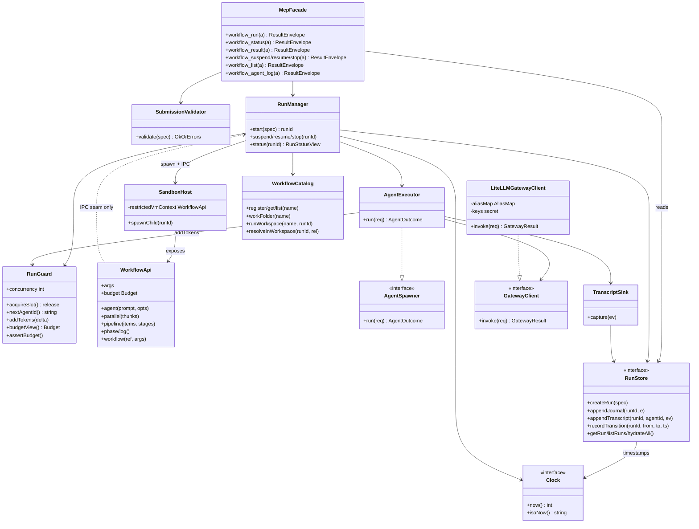

# 04 Detailed Design

> Interfaces, data structures, flows. Each `### DES-NNN`'s traces point back to ARCH/TASK. Matching verification is unit test UT-*.
> **Panel provenance:** `.panel/gate34/adversarial.r1.md` (interface-contract / boundary-error / testability, opus-4-8)
> + `.panel/gate34/quality.r1.md` (observability / replaceability / consumability / self-sustainability, sonnet-5).
> Headlines were complementary (contract+boundary+testability seams vs cross-cutting concerns landing on
> already-chosen seams) → no round-2 rebuttal; synthesized directly.
> **Degraded-fallback disclosure:** this host exposes no Agent/Task tool, so the designer applied all lens
> groups itself sequentially (the weak substitute for real per-lens subagents) and wrote the `.panel/gate34`
> proposals directly. Safety_class=QM → no functional-safety/cybersecurity lenses (panel unchanged).
> Language: TypeScript (D9). All types are illustrative signatures the verifier can bind UTs against.

## Module boundaries (who may call whom)
- **Untrusted child (ARCH-003)** holds no secrets/store/network; its ONLY channel to the trusted parent is the
  IPC seam (DES-006). It calls nothing else directly.
- **Trusted parent**: MCP Facade (DES-001) → Run Manager/RunGuard (DES-002/003/004) → {AgentExecutor (DES-007/008),
  RunStore (DES-010), Catalog (DES-011)}. AgentExecutor → GatewayClient (DES-009). Submission Validator (DES-012)
  is called only at the two entry points. Injected seams (RunStore, GatewayClient, AgentSpawner, Clock) are
  constructor-injected interfaces (DES-002/007/009/010/014).

## Real-tier validation & per-tier mock policy — see DES-015 (binds every REQ to a runnable path).

### DES-001 — MCP tool contract + uniform result envelope
- **status:** draft
- **traces:** ARCH-001, TASK-001, TASK-002
- **signature:** every tool returns `ResultEnvelope`; `workflow_run` is async (returns `runId` immediately), caller polls `workflow_status` then fetches `workflow_result`.
- **iter:** v1

```ts
type RunStatus = 'queued'|'running'|'suspended'|'stopped'|'completed'|'failed';
interface ResultEnvelope<T = unknown> { runId: string; status: RunStatus; result?: T; error?: ErrEnvelope; }
interface ErrEnvelope { code: string; message: string; field?: string; }

interface McpFacade {
  workflow_run(a: { name?: string; script?: string; args?: unknown; budget?: number|null }): Promise<ResultEnvelope<{runId:string}>>;
  workflow_status(a: { runId: string }): Promise<ResultEnvelope<RunStatusView>>;
  workflow_result(a: { runId: string }): Promise<ResultEnvelope>;            // result = script return value
  workflow_suspend(a: { runId: string }): Promise<ResultEnvelope>;
  workflow_resume(a: { runId: string; script?: string }): Promise<ResultEnvelope>;
  workflow_stop(a: { runId: string }): Promise<ResultEnvelope>;
  workflow_list(a?: {}): Promise<ResultEnvelope<RunSummary[]>>;
  workflow_agent_log(a: { runId: string; agentId: string }): Promise<ResultEnvelope<TranscriptEvent[]>>;
}
```
Boundary/error: unknown `runId` → envelope with `error{code:'RUN_NOT_FOUND'}`, never throw across the tool boundary. Submission-time failures (DES-012) return `status:'failed'` + `error` synchronously (before a `runId` exists → `runId:''`). Bind: 127.0.0.1 default; `bind:'0.0.0.0'` opt-in only (REQ-005). No business logic here — pure delegation.

> **Gate 6 note (D-I2, IMPL-018/IMPL-019):** `workflow_result`'s `result` field is the **script's own
> return value**, not the `RunStatusView` — this was already the documented contract above but the
> initial parallel implementation mistakenly returned the `RunStatusView` from `workflow_result` too
> (and `McpFacade` built its own private `RunStore` instead of sharing the one `workflow_status`/
> `workflow_result` read from, causing `RUN_NOT_FOUND` everywhere). Both are now wired per this spec —
> see `src/mcp-facade.ts`, `src/run-manager.ts`.

> **Gate 6 note (D-I9, IMPL-027):** `workflow_list`'s `RunSummary[]` signature above undersold the
> contract — REQ-014 requires a REGISTERED-but-never-run workflow to be visible via `workflow_list`
> too, not just started runs. `result` is now a flat kind-discriminated array mixing catalog entries
> (`{kind:'workflow', name, version, createdAt}`, sourced from `WorkflowCatalog.list()`) with run
> summaries (`{kind:'run', ...RunSummary}`), so existing callers doing `list.some(w => w.runId === x)`
> and new callers doing `list.some(w => w.name === y)` both work against the same array. See
> `src/mcp-facade.ts`, `src/workflow-catalog.ts`.

> **Gate 8 route-back note (D-G8-3, IMPL-051; review finding C-1):** `server.ts`'s `tools/list`
> handler previously served `{name, description: name, inputSchema: {type:'object'}}` for every
> tool — the tool's own name repeated as its description, and an opaque schema with no
> `properties`/`required` at all, so an MCP client could not learn any tool's real parameter
> contract from `tools/list` alone (this section's own consumability rationale). Fix: a new
> `TOOL_METADATA` record gives each of the 10 tools a real, non-name-echoing description plus a
> real JSON `inputSchema.properties`/`required` mirroring exactly the argument shape
> `callTool()`/`McpFacade` already accept above (e.g. `workflow_run`:
> `name?`/`script?`/`args?`/`budget?`; `workflow_agent_log`: required `runId`+`agentId`).
> `workflow_list` (genuinely zero-parameter per this section's own `workflow_list(a?: {})`
> signature) gets `inputSchema.properties: {}` — real, not a placeholder, but correctly empty since
> it truly takes no arguments. See `src/server.ts`.

### DES-002 — RunGuard (single-authority caps + budget)
- **status:** draft
- **traces:** ARCH-002, TASK-003
- **signature:** shared object read by BOTH orchestration and the agent spawner so caps cannot drift.
- **iter:** v1

```ts
interface Budget { total: number|null; spent(): number; remaining(): number; }   // read-only view handed to VM
interface RunGuard {
  readonly concurrency: number;          // min(16, cores-2)
  acquireSlot(): Promise<() => void>;    // resolves when a slot is free; returns release fn
  nextAgentId(): string;                 // throws AgentCapError once 1000 issued this run
  addTokens(delta: number): void;        // single accounting path; feeds Budget + status
  budgetView(): Budget;                  // total/spent()/remaining(); remaining()=Infinity when total=null
  assertBudget(): void;                  // throws BudgetExceededError when spent() >= total (hard ceiling)
}
```
Boundary/error: at exactly `concurrency` in-flight, the (N+1)th `acquireSlot()` awaits (queues) and all still complete (REQ-002). `nextAgentId()` throws at the 1001st call. `assertBudget()` is checked BEFORE each `agent()` dispatch so budget-exhausted calls throw inside the script (REQ-002). `addTokens` is the ONLY writer of token totals → `budgetView().spent()` and the status API can never diverge.

> **Gate 6 round-3 route-back note (D-F8, IMPL-D-F8-1):** this server-side `RunGuard`/`Budget` was
> always the single authority and was never itself wrong — the gap (`08-validation.md` round-2/3
> finding, `state.yaml` `pending[]` item 3) was that the SEPARATE, sandbox-VM-side `Budget` object
> `agent()` scripts actually read (DES-005's `WorkflowApi.budget`, realized over the DES-006 IPC seam
> in `src/sandbox/child-entry.ts`) had its own independent `spent()/remaining()` hard-coded to
> `spent=0` always, never reading THIS `RunGuard`. Closed by piggybacking `RunGuard.budgetView().
> spent()` onto every `agentResult` IPC message (see DES-006's route-back note) — the script-visible
> view now tracks this authority live, one writer (`addTokens`), same invariant, just also mirrored
> across the process boundary. No change to this interface itself. See DES-006's note,
> `src/run-manager.ts`, `src/sandbox/child-entry.ts`.

> **Gate 8 route-back note (D-G8-6, IMPL-051; review finding V2, REQ-002):** `assertBudget()` was a
> stale PRE-DISPATCH-only check — tokens are only added post-invoke via `addTokens()` (DES-008's own
> `capture()`) — so under `parallel()`, a burst of N concurrent `agent()` calls could all read the
> same stale `spent()` (still reflecting none of their own eventual cost) and all pass the gate
> before any one of them recorded real spend, materially overshooting the hard ceiling this
> section's own boundary text promises. Fix: `RunGuard` grows `reserve(): number` (atomically
> reserves the run's ENTIRE currently-remaining budget for one about-to-dispatch call — synchronous,
> no per-call cost estimate exists ahead of time, so this is the simplest atomic gate) and
> `releaseReserved(amount)` (frees it once the call settles, regardless of its real cost — real cost
> accounting via `addTokens()` is untouched, a separate concern). `assertBudget()` now checks
> `spent() + <reserved> >= total`. `RunManager._handleAgentRequest` calls `reserve()` synchronously
> (no `await` in between) immediately after `assertBudget()`, releasing it in a `finally` around the
> rest of the call. Since only ONE call can ever hold a full-remaining-budget reservation at a time,
> the 2nd..Nth concurrent dispatch in a burst now synchronously throws `BudgetExceededError` (the
> existing hard-throw-at-ceiling contract, unchanged) instead of all reaching the gateway. No-op
> (unbounded budget) when `total===null`, matching this section's existing `remaining()=Infinity`
> convention. See `src/run-guard.ts`, `src/run-manager.ts`.

### DES-003 — Run state machine + suspend/resume/stop lifecycle
- **status:** draft
- **traces:** ARCH-002, TASK-004
- **signature:** legal transitions only; every transition persisted via RunRecorder before it is observable.
- **iter:** v1

```ts
// legal edges: queued→running; running→{suspended,stopped,completed,failed};
//              suspended→{running(resume),stopped}; stopped→running(resume w/ cached prefix)
interface RunManager {
  start(spec: RunSpec): Promise<string>;                 // returns runId, runs async
  suspend(runId: string): Promise<void>;                 // stop in-flight agents, persist, → suspended
  resume(runId: string, script?: string): Promise<void>; // replay cache (DES-004) then run live
  stop(runId: string): Promise<void>;                    // terminate sandbox child, → stopped
  status(runId: string): Promise<RunStatusView>;
}
```
Boundary/error: illegal transition (e.g. resume a `running` run) → `IllegalTransitionError` surfaced as envelope error. On process crash, a `running` run re-hydrates as `failed` (not silently `running`) but its journal prefix stays resumable; a `suspended` run re-hydrates resumable (REQ-006, restart survival). Suspend must actually abort in-flight SDK sessions (AbortSignal through AgentExecutor), not just flip the flag.

### DES-004 — Resume cache / replay contract
- **status:** draft
- **traces:** ARCH-002, TASK-005
- **signature:** longest-unchanged prefix of `agent()` calls keyed by `(prompt, opts)` replays from journal instantly.
- **iter:** v1

```ts
interface ResumePlan { cachedThrough: number; replay(callSeq: number, key: CallKey): unknown|MISS; }
type CallKey = { prompt: string; opts: AgentOpts };   // structural equality → cache hit
```
Boundary/error: same script + same args → 100% cache hit (every `agent()` returns cached, zero model calls). First edited/new `(prompt,opts)` and everything after runs live. Prior run must be `stopped`/`suspended` before resume (else `IllegalTransitionError`). `workflow_resume` with an edited script re-runs only from the first changed call (REQ-006 cached-prefix). Determinism guards (DES-005) exist precisely so replay is sound.

> **Gate 6 route-back note (D-F13, IMPL-048; REQ-006):** Gate 7.5 round 5 found that an
> ABORTED-mid-flight `agent()` call (workflow_suspend/workflow_stop cutting it short) journals
> `{value:null}` INDISTINGUISHABLE from a genuinely-completed terminal-provider-error null (DES-009's
> own legitimate `{ok:false}` outcome) — `ResumeCache.replay()` (correctly, per its documented "same
> script+args -> 100% cache hit" contract) then replays that aborted null as if it were a completed
> call, so `workflow_resume` never re-runs it live (violates this section's own "same final result as
> an uninterrupted run" promise). Fix: `JournalEntry` (DES-010) grows `aborted?: boolean` — true only
> when `AgentExecutor.run()`'s outcome was `{kind:'null', aborted:true}` (the signal fired before or
> during the gateway call), never for a genuine `{kind:'null'}` terminal/schema-exhaustion outcome.
> `Plan.replay()` now treats an `aborted` entry as a cache MISS (`this._missed = true; return MISS`)
> exactly like a missing/changed-key entry — the same "everything from the first miss onward runs
> live" contract this section already documents, just triggered by a different condition. See
> `src/resume-cache.ts`, `src/agent-executor.ts`, `src/run-manager.ts`, `src/types.ts`.

> **Gate 8 route-back note (D-G8-1, IMPL-051; review finding V3, REQ-006/ARCH-002/ARCH-006):** a
> nested `workflow()` call spawns a NEW `SandboxHost`/child process for the nested script, and that
> child has its OWN independent `callSeq` counter (`child-entry.ts`'s own `nextCallSeq`) starting at
> 0 again — but `RunManager._handleWorkflowRequest` forwarded the nested child's
> `agent()` calls into the SAME `_handleAgentRequest` (and so the same shared per-run journal /
> `ResumePlan`'s `Map<callSeq, JournalEntry>`) as the outer script's own `callSeq` values, without
> any namespacing. The outer script's own `callSeq` 0 and the nested script's own `callSeq` 0
> silently collided (last-write-wins in the `Map`), corrupting this section's own "longest-
> unchanged-prefix" replay contract for the WHOLE run (once any `callSeq` misses, `Plan.replay()`
> makes every later `callSeq` miss too — this section's own documented behavior), not just the
> nested call. Fix: `RunManager` gains `_nestedCallSeq(parentCallSeq, nestedCallSeq) =
> (parentCallSeq+1) * 1_000_000 + nestedCallSeq` — the nested child's own raw `callSeq` is namespaced
> into a numeric range keyed off the PARENT's own `callSeq` for the `workflow()` call that spawned
> it (itself unique in the parent's own `callSeq` space, and — critically — deterministic across an
> original run and a resume of the same unmodified script, since the same `workflow()` call gets the
> same parent-level `callSeq` both times). `SandboxHost.onWorkflowRequest`'s existing 3rd `callSeq`
> parameter (already threaded by `host.ts`, previously unused by `_handleWorkflowRequest`) supplies
> `parentCallSeq`. See `src/run-manager.ts`.

### DES-005 — Sandbox VM bindings (workflow API surface) + guards
- **status:** draft
- **traces:** ARCH-003, TASK-006, TASK-007
- **signature:** restricted VM context exposes EXACTLY the compat-spec §2 surface and nothing else.
- **iter:** v1

```ts
interface WorkflowApi {                       // the only globals visible inside the sandboxed script
  agent(prompt: string, opts?: AgentOpts): Promise<unknown|null>;
  parallel(thunks: Array<() => Promise<unknown>>): Promise<Array<unknown|null>>;
  pipeline(items: unknown[], ...stages: Stage[]): Promise<Array<unknown|null>>;
  phase(title: string): void;
  log(message: string): void;
  readonly args: unknown;                     // verbatim JSON, undefined if absent
  readonly budget: Budget;                    // read-only view (DES-002); no setter exposed
  workflow(nameOrRef: string|{scriptPath:string}, args?: unknown): Promise<unknown>;
}
type AgentOpts = { label?: string; phase?: string; schema?: object; model?: string;
                   effort?: 'low'|'medium'|'high'|'xhigh'|'max'; isolation?: 'worktree'; agentType?: string };
type Stage = (prev: unknown, item: unknown, index: number) => Promise<unknown>;
```
Boundary/error (all throw INSIDE the script, catchable/reported): `Date.now()`, `Math.random()`, argless `new Date()` (determinism guard); >4096 items in one `parallel`/`pipeline` call; second-level `workflow()` nesting; script >512 KB; TS syntax (type annotations/generics fail to parse — must match original JS-not-TS); non-literal `meta` (variables/calls/spreads/interpolation rejected). No `fs`/`require`/`process`/network reachable in-context. `budget` is frozen getters — mutation attempts throw.

### DES-006 — IPC seam message protocol (child ↔ parent)
- **status:** draft
- **traces:** ARCH-003, TASK-008
- **signature:** tagged discriminated union over the child process channel; every request correlated by `(runId, callSeq)`.
- **iter:** v1

```ts
// child → parent (untrusted asks trusted to do the privileged thing)
type ChildMsg =
  | { t: 'agent';    runId: string; callSeq: number; prompt: string; opts: AgentOpts }
  | { t: 'workflow'; runId: string; callSeq: number; ref: string|{scriptPath:string}; args: unknown }
  | { t: 'phase';    runId: string; title: string }
  | { t: 'log';      runId: string; message: string }
  | { t: 'done';     runId: string; result: unknown }        // script return value
  | { t: 'error';    runId: string; error: { message: string; stack?: string } };
// parent → child
type ParentMsg =
  | { t: 'agentResult';    callSeq: number; value: unknown|null }   // null carries the null-semantics contract
  | { t: 'workflowResult'; callSeq: number; value: unknown }
  | { t: 'agentThrow';     callSeq: number; error: { code: string; message: string } } // budget/nesting/unknown-name
  | { t: 'abort';          reason: 'suspend'|'stop' }
  | { t: 'init';           args: unknown; budget: { total: number|null } };
```
Boundary/error: the master test seam — stubbing the parent side lets a UT dry-run `sdlc-run.js` (641 lines) with ZERO model calls. `agentThrow` maps to a thrown error inside the VM (budget ceiling, unknown `workflow(name)`, second-level nesting); `agentResult{value:null}` maps to the null return. Unknown `callSeq` correlation → protocol error (fail loud, never hang).

> **Gate 6 round-3 route-back note (D-F8, IMPL-D-F8-1):** `ParentMsg`'s `'agentResult'` variant
> grows an optional `spent?: number` — the real cumulative `RunGuard` token total as of that call's
> completion, piggybacked onto the SAME message (no new message type; the child already receives one
> `agentResult` per `agent()` call, and budget only ever changes as a side effect of one). `SandboxHost`
> (`src/sandbox/host.ts`) grows an optional `onBudgetSnapshot?: () => number` config hook, called when
> sending `agentResult`; `RunManager` wires it to `entry.guard.budgetView().spent()`
> (`src/run-manager.ts`). The child (`src/sandbox/child-entry.ts`) tracks a local `spentSoFar`
> updated from each `agentResult.spent`; the script-visible `budget.spent()/remaining()` accessors
> now read `spentSoFar` instead of a hard-coded stub (`remaining()` still derives from the
> `StartMsg.budgetTotal` captured at spawn — total itself never changes mid-run). Omitting
> `onBudgetSnapshot` (e.g. existing dry-run test seams) → no `spent` field sent, `spentSoFar` stays
> at its initial `0`, unchanged prior behavior. See `src/ipc/protocol.ts`, `src/sandbox/host.ts`,
> `src/sandbox/child-entry.ts`, `src/run-manager.ts`.

### DES-007 — Agent Executor / AgentSpawner contract
- **status:** draft
- **traces:** ARCH-004, TASK-009
- **signature:** one Claude Agent SDK headless session per `agent()`; schema→StructuredOutput retry; terminal failure → null.
- **iter:** v1

```ts
interface AgentSpawner {                                   // injected seam; fake for dry-runs
  run(req: AgentReq): Promise<AgentOutcome>;
}
interface AgentReq { runId: string; agentId: string; prompt: string; opts: AgentOpts;
                     workspace: string; signal: AbortSignal; }
type AgentOutcome =
  | { kind: 'text';   value: string }                      // no schema → final text string
  | { kind: 'object'; value: object }                      // schema → validated object (retry-on-mismatch)
  | { kind: 'null' }                                       // terminal API error after retries → agent() resolves null
```
Boundary/error: `schema` present → subagent forced to call StructuredOutput; validation at tool-call layer → model retries on mismatch; after retry budget exhausted with still-invalid → `kind:'null'` (never reject). Unknown `agentType` → reported error (not hang) surfaced at submission (DES-012) or as `agentThrow`. `agentType` resolves system-prompt/tools from the server-side registry; composes with `schema`. Runs PARENT-side so the untrusted script never touches the SDK or keys.

> **Gate 6 route-back note (D-V4/D-V5, IMPL-029):** `schema` validation is real Ajv (`ajv` dep,
> JSON-Schema draft-07-ish subset, `strict:false`) — `ajv.compile(opts.schema)` then up to
> `SCHEMA_RETRY_ATTEMPTS = 3` attempts total (never infinite), never a bare `as object` cast.
> `AgentExecutorDeps` grew an additive `agentTypes?: Record<string, {systemPrompt: string}>` seam
> (a server-side agent-definition registry, resolved by name before any gateway dispatch — unknown
> name throws before dispatch, known name's `systemPrompt` is prepended to the outbound prompt).
> Composition-root note: no caller (`server.ts`/`run-manager.ts`) currently populates `agentTypes`
> from an actual on-disk registry (e.g. `.claude/agents/*.md` per the compat-spec) — every
> `agentType` is "unknown" (fails fast, per spec) until that loader is built; no test in this route
> back drives that loader, so it was deliberately left unbuilt rather than speculatively implemented
> (see IMPL-029 needs_clarification). See `src/agent-executor.ts`.

> **Gate 6 final route-back note (D-F2, IMPL-036):** the loader is now built —
> `src/agent-definitions.ts`'s `loadAgentDefinitions(dir)` reads every `agents/*.md` file directly
> under `dir`, splits its `---\n...\n---\n` frontmatter (flat `key: value` lines; `name`/`model`
> read, `tools` parsed-but-unused — no seam restricts tools per agentType yet, so it is
> intentionally not stored) from its body (the `systemPrompt`), and returns a
> `Record<string, AgentTypeDef>`. `AgentTypeDef` grew an optional `model?: string` (an alias name,
> resolved the same way `opts.model` already is): `AgentExecutor.run()` now also applies a resolved
> definition's `model` to the outbound `opts.model` when the caller didn't already set one (in
> addition to the existing systemPrompt-prepend behavior). `ServerConfig.agentDefinitionsDir`
> (new) triggers the load once at `createServer()` startup and forwards the registry through
> `RunManagerDeps.agentTypes` into every `AgentExecutor` this manager constructs (both the
> `start()` and rehydrate-on-restart `_requireLive()` construction sites). Omitted
> `agentDefinitionsDir` → empty registry, unchanged prior behavior (every `agentType` "unknown").
> Proven end-to-end by IT-016 (real `createServer()` + a real on-disk frontmatter file + a real
> local Ollama-shaped stub — only the third-party LLM network is faked). See
> `src/agent-definitions.ts`, `src/agent-executor.ts`, `src/run-manager.ts`, `src/server.ts`.

> **Gate 6 route-back note (D-F11, IMPL-048; REQ-003):** Gate 7.5 round 5's central tool-use finding
> (agent()'s tool-use loop never actually fires against a real local model through the SDK-default
> gateway, root-caused to the CLI's own full uncurated tool surface — dozens of tools — overwhelming
> a 7B model's tool-selection ability) is fixed at the curation half here: `AgentTypeDef` (this
> section's own interface) grows `tools?: string[]` — the frontmatter `tools:` list
> `agent-definitions.ts` already parsed but, per this section's own prior note, deliberately left
> unstored ("no seam restricts tools per agentType yet") now IS stored and applied.
> `AgentExecutor.run()`'s existing agentType-resolution block (the one that already applies
> `def.systemPrompt`/`def.model`) now ALSO applies `def.tools` to the outbound `opts.allowedTools`
> the same way it applies `model` — only when the caller didn't already set an `allowedTools` of
> their own (an explicit per-call value always wins, same precedence `model` already follows).
> `AgentOutcome`'s `{kind:'null'}` variant also grows an optional `aborted?: boolean` this round
> (D-F13's own need, documented under DES-004/DES-010) — set when `req.signal` was already aborted,
> or the internal abort-vs-invoke race resolved as aborted; a genuine terminal gateway failure or
> exhausted schema-retry still returns `{kind:'null'}` with `aborted` absent. See
> `src/agent-executor.ts`, `src/agent-definitions.ts` — the gateway-side half of D-F11 (curating
> `options.allowedTools`/`options.tools` on the actual SDK session) is documented under DES-009.

### DES-008 — AgentTranscriptSink + token accounting
- **status:** draft
- **traces:** ARCH-004, TASK-010
- **signature:** single capture path taps the SDK event stream → `agent-<id>.jsonl`; token deltas → RunGuard.addTokens.
- **iter:** v1

```ts
interface TranscriptEvent { ts: string; kind: 'message'|'tool_call'|'tool_result'|'usage'; data: unknown; }
interface AgentRecord {
  agentId: string; label?: string; phase?: string;
  state: 'queued'|'running'|'done'|'failed';
  provider: string; model: string;                         // REAL provider + real model id actually used
  tokens: { input: number; output: number };
}
```
Boundary/error: ONE sink feeds `workflow_agent_log`, the dashboard (v2), and the resume cache — not three paths (observability). Every `usage` event calls `RunGuard.addTokens(delta)` so the `budget` view and the status API share one number. Local-Ollama routing must show `provider:'ollama'` in the record and NO paid-provider call in the gateway log (REQ-004 verifiability).

> **Gate 6 route-back note (D-V6, IMPL-029):** `RunStore` grew a real `getTranscript(runId, agentId):
> Promise<TranscriptEvent[]>` read-back accessor (`InMemoryRunStore` reads its in-memory map;
> `SqliteRunStore` reads `agent-<id>.jsonl` line-by-line, `[]` if the file never materialized) —
> `McpFacade.workflow_agent_log` now delegates to it instead of a hard-coded `[]`. See
> `src/run-store.ts`, `src/store/sqlite-run-store.ts`, `src/mcp-facade.ts`.

> **Gate 6 route-back note (D-F12, IMPL-048; REQ-007/REQ-002):** Gate 7.5 round 5 found
> `AgentRecord.state` (this section's own `'queued'|'running'|'done'|'failed'` type) never actually
> produced `'queued'`/`'running'` — `AgentTranscriptSink.capture()` only ever created a record at
> call-RESOLUTION time, so an in-flight or concurrency-queued agent was invisible in
> `workflow_status` (`agents:[]` while the run itself showed `status:'running'`). Fix: the sink grows
> two additive methods — `markQueued(agentId, label?, phase?)` (records `state:'queued'`,
> `provider:''`/`model:''`/`tokens:{0,0}` placeholders) and `markRunning(agentId)` (flips an existing
> record's `state` to `'running'`, preserving `label`/`phase`) — both exposed on `AgentExecutor`
> itself (delegating to its private sink) alongside the existing `getRecord`/`getAllRecords`.
> `RunManager._handleAgentRequest` (DES-003) now allocates the agentId via `RunGuard.nextAgentId()`
> and calls `markQueued` BEFORE `await guard.acquireSlot()` (so a call genuinely blocked behind the
> concurrency cap is observable immediately, not only once it dispatches), then calls `markRunning`
> right after the slot is acquired and before dispatching to the spawner. `capture()` (unchanged)
> still overwrites the record with the real terminal `'done'`/`'failed'` state once the call
> resolves. See `src/agent-executor.ts`, `src/run-manager.ts`.

> **Gate 8 route-back note (D-G8-2, IMPL-051; review finding O-1, ARCH-004, REQ-007):** this
> section's own signature promises "single capture path taps the SDK event stream" — but
> `AgentTranscriptSink.capture()` only ever emitted a single terminal `kind:'usage'` event per call;
> separately, `ClaudeAgentSdkGatewayClient._drain` explicitly discarded every real SDK message except
> the final `type:'result'` one (`if (msg.type !== 'result') continue`). Net effect:
> `workflow_agent_log` could only ever show one summary token-count line per `agent()` call, never
> the real reasoning/tool-call trace this section's own `TranscriptEvent.kind` type
> (`'message'|'tool_call'|'tool_result'|'usage'`) already declared it should. Fix: `GatewayResult`'s
> `ok:true` variant (DES-009) grows optional `events?: TranscriptEvent[]`. `_drain` now accumulates
> a `TranscriptEvent` for every non-`result` SDK message's own `message.content` items
> (`type:'text'`->`kind:'message'`, `type:'tool_use'`->`kind:'tool_call'`,
> `type:'tool_result'`->`kind:'tool_result'`) instead of discarding them, returning them on the
> final `GatewayResult`. `capture()` now emits each of `result.events` (in order) BEFORE the terminal
> `usage` event — a real reasoning/tool-call trace now reaches `workflow_agent_log`.
> `LiteLLMGatewayClient` (no SDK message stream to tap) leaves `events` unset — unchanged single-
> `usage`-event legacy behavior for that path. See `src/gateway/client.ts`,
> `src/gateway/claude-agent-sdk-client.ts`, `src/agent-executor.ts`.

### DES-009 — GatewayClient interface + provider-down breaker + null semantics
- **status:** draft
- **traces:** ARCH-005, TASK-011, TASK-012
- **signature:** narrow `invoke(prompt,opts)` over LiteLLM; bounded timeout→retry→null; sole key custody (parent-only).
- **iter:** v1

```ts
interface GatewayClient {                                   // injected seam; one impl = LiteLLMGatewayClient
  invoke(req: { prompt: string; opts: AgentOpts; runId: string; agentId: string }): Promise<GatewayResult>;
}
type GatewayResult =
  | { ok: true;  provider: string; model: string; tokens: { input: number; output: number }; content: unknown }
  | { ok: false; provider: string; reason: 'timeout'|'unreachable'|'terminal' };   // → agent() resolves null
interface AliasMap { [alias: string]: { provider: 'anthropic'|'openai'|'gemini'|'ollama'; model: string }; }
```
Boundary/error (D-G, user-confirmed v1): unreachable/hung provider → bounded `timeoutMs` (config, sane default) → `retries` (config) → `{ok:false}` → `agent()` resolves `null`, run continues, never hangs; the failure is visible in the AgentRecord. Every call correlation-tagged `(runId,agentId)` so the LiteLLM log joins back to the store. `default` alias used when `opts.model` omitted; unmapped alias → caught at submission (DES-012), never mid-run. API keys live ONLY here (parent).

> **Gate 6 route-back note (D-V1/D-R1, IMPL-029):** `GatewayConfig` grew `useLiteLLMProxy?: boolean`
> (default `true` from `server.ts`'s composition root as of this route-back — D-R1; explicit
> `false` opts back into the pre-existing direct-per-provider-`fetch` path) and an injectable
> `proxyManager?: LiteLLMProxyManager` seam (tests fake its `spawnImpl`/`fetchImpl`, never a real
> `litellm` binary — D-R2/DES-015). `LiteLLMProxyManager` (`src/gateway/litellm-proxy.ts`) owns one
> `litellm --config ... --port ...` subprocess: config.yaml generated straight from the existing
> `AliasMap` (one source of truth), bounded-timeout health poll (never hangs), idempotent `start()`.
> When the proxy path is active, `invoke()` calls the proxy's Anthropic-Messages-shaped
> `POST /v1/messages` (alias name as `model`) instead of each provider's native endpoint directly —
> this is a direct HTTP call shaped to match what a real `@anthropic-ai/claude-agent-sdk` headless
> session pointed at `ANTHROPIC_BASE_URL=<proxy>` would send, not an actual SDK session construction
> (`@anthropic-ai/claude-agent-sdk` is an added-but-currently-unused dependency — no test in this
> route back drives real SDK session objects; see IMPL-029 needs_clarification for the open question
> of whether that full swap is required for v1 sign-off). Manually smoke-tested end-to-end against a
> real spawned `litellm` + real local Ollama (see IMPL-litellm-proxy-manager); no automated test
> spawns the real binary (D-R3: Python 3.11/3.12 runtime requirement, documented in DEPLOY.md).
> IT-005 (`gateway-provider-down.test.ts`) retimed to inject `fetchImpl`+fake `proxyManager` so its
> breaker-semantics assertions are deterministic, not dependent on Python cold-start. See
> `src/gateway/client.ts`, `src/gateway/litellm-proxy.ts`, `src/server.ts`.

> **Gate 6 final route-back note (D-F1, IMPL-036/037):** user decision D1 stands (twice confirmed)
> — the direct-fetch-to-proxy shape above does NOT satisfy "genuine SDK sessions" (a raw fetch has
> no tool-use agent loop); the accept-direct-fetch alternative was explicitly REJECTED. New
> `ClaudeAgentSdkGatewayClient` (`src/gateway/claude-agent-sdk-client.ts`) implements `GatewayClient`
> against the REAL `@anthropic-ai/claude-agent-sdk` `query()` export: with no `queryImpl` override
> the default IS the real SDK export (UT-018, `vi.mock`s only the third-party module — unit tier);
> wires `ANTHROPIC_BASE_URL` to the given `baseUrl` (e.g. the already-built `LiteLLMProxyManager`'s
> proxy) and a dummy, non-empty, never-real `ANTHROPIC_API_KEY` (D-R2); reads the session's own
> `result` message (`subtype:'success'` → `{ok:true, content: msg.result, tokens: msg.usage.*}`,
> anything else or a thrown/aborted iteration → `{ok:false}`, never a hang, never a rejection).
> `queryImpl` stays injectable. `IT-015` is the real-subprocess companion (real SDK pointed at a
> LOCAL stub `/v1/messages` server, including one genuine tool-use turn) — in THIS environment it is
> RED for a documented, pre-anticipated reason (see `05-tests.md`'s IT-015 note + journal.md, and
> IMPL-037's test_defect report to the verifier): this sandboxed dev environment is *itself* a
> nested Claude Code agent host, and `query()` here is intercepted by that outer host with a live
> synthetic response (confirmed via a throwaway debug script: the intercepted request bodies carry
> the OUTER project's own system prompts/agent-type list and a live model id, never our stub's SSE
> bytes) rather than genuinely spawning an independent CLI subprocess against `ANTHROPIC_BASE_URL` —
> the test's own skip-guard anticipates exactly this failure mode in prose but its literal condition
> (`stub.requests.length > 0` within 20s) doesn't catch it, because the intercepted calls do still
> reach the local port with a wrong-shaped body. Not a defect in `ClaudeAgentSdkGatewayClient` itself
> — UT-018 fully pins its logic. Composition-root wiring: an additive `ServerConfig.gateway?:
> GatewayClient` override seam was added to `createServer()` (no existing caller sets it, zero
> regression) so this class CAN be selected explicitly; it was deliberately NOT wired as the
> zero-config default for `RunManager`/`server.ts`'s existing `aliases`-absent or
> `useLiteLLMProxy:true` construction paths, because ~20 existing green tests (`val-002`, `val-006`,
> `e2e/suspend-resume-replay`, etc. — see their own "fast local no-credential agent() rejection path"
> comments) depend on that path's near-instant no-credential terminal-fail behavior, and IT-005/
> IT-013 pin the raw-fetch transport shape for the `useLiteLLMProxy:true` path specifically; no test
> in this round forces re-wiring either of those paths, and doing so untested risked exactly the kind
> of speculative, unverified production behavior Gate 6 discipline warns against. Flagged to the
> orchestrator as needs_clarification (see 06-impl-log.md IMPL-037) rather than silently wired. See
> `src/gateway/claude-agent-sdk-client.ts`, `src/server.ts`.

> **Gate 6 round-3 route-back note (D-F6/D-F7/D-F9a, IMPL-SLICE-DF6-DF7-DF9a-1/2/3):** three
> additive changes finalize what UT-020/UT-021/IT-019 pinned as red (verifier-authored design
> extensions not yet written up here, per those tests' own notes):
> (1) **D-F9a — signal threading.** `GatewayClient.invoke(req)`'s `req` grows an optional
> `signal?: AbortSignal` (`src/gateway/client.ts`); `AgentExecutor`'s `_invokeOnce` forwards its own
> `req.signal` (already required on `AgentReq` per DES-007) straight through
> (`src/agent-executor.ts`). `RunManager` needed no change — `entry.abortController.signal` was
> already threaded into `AgentExecutor.run()`'s call (predates this round). Scope is deliberately
> narrow: only `ClaudeAgentSdkGatewayClient` honors the incoming `signal` this round (D-F7's bounded
> race is explicitly scoped to it too) — `LiteLLMGatewayClient`'s `callProvider`/`callViaLiteLLMProxy`
> do NOT yet tie their own `AbortController` to this external signal; that remains `state.yaml`
> `pending[]` item (4), unchanged, out of this round's binding text.
> (2) **D-F6 — alias-aware thinking policy.** `ClaudeAgentSdkGatewayConfig` grows `aliases?:
> AliasMap` (same shape `LiteLLMGatewayClient` already takes). `invoke()` sets `options.thinking =
> {type:'disabled'}` for any alias not confirmed `provider:'anthropic'` (including an
> alias absent from the map — the safe default), and leaves `options.thinking` unset (SDK default)
> only for a confirmed Anthropic-mapped alias.
> (3) **D-F7 — bounded race.** `ClaudeAgentSdkGatewayConfig` grows `timeoutMs?: number` /
> `retries?: number` (mirroring `GatewayConfig`). When `timeoutMs` is set, `invoke()` makes
> `1 + retries` attempts, each racing the session drain against an `AbortController`-driven timer
> (`Promise.race`) exactly like `LiteLLMGatewayClient`'s per-attempt race — first success wins,
> exhausting all attempts without one returns the last `{ok:false}`. The same `AbortController` also
> answers the external `req.signal` (D-F9a) via a `once` listener, so either the timeout or an
> external abort resolves the race; both listeners are cleaned up in a `finally`. When neither
> `timeoutMs` nor `req.signal` is set, `invoke()` is unchanged legacy (unbounded single attempt).
> See `src/gateway/client.ts`, `src/agent-executor.ts`, `src/gateway/claude-agent-sdk-client.ts`.

> **Gate 6 round-4 route-back note (D-F10, gap-tests-7, IT-021/IT-022/UT-022/UT-023):** Gate 7.5
> round 4 found the 3 fixes above (D-F6/D-F7/D-F9a) were all real at the class level but DEAD in
> production because `src/main.ts` (the real product entrypoint) never constructed
> `ClaudeAgentSdkGatewayClient` with `aliases`/`timeoutMs`/`retries`, and never read/forwarded
> `agentDefinitionsDir` at all -- no existing test constructed the server the way `main.ts` itself
> does, so this whole class of composition-root wiring gap was invisible below the 45-minute
> real-run validation tier. Fix, ORCH D-F10 STRUCTURAL RULE: `src/main.ts`'s inline
> `FileConfig -> ServerConfig` translation is now an exported, independently testable helper --
> `export async function composeConfig(fileConfig: FileConfig, deps?: { queryImpl?, proxyManager? }):
> Promise<ServerConfig>` -- with `main()` itself reduced to `composeConfig(loadFileConfig())` +
> `createServer()`. `composeConfig()` forwards `aliases`/`timeoutMs`/`retries` into the constructed
> `ClaudeAgentSdkGatewayClient` (`gateway:'sdk'`, the default) and forwards `agentDefinitionsDir`
> into the returned `ServerConfig` regardless of gateway choice (`gateway:'direct-fetch'` leaves
> `config.gateway` unset so `createServer()`'s own `aliases`-driven `LiteLLMGatewayClient`
> construction applies, unchanged). `src/main.ts` also gained an import-guard
> (`fileURLToPath(import.meta.url) === process.argv[1]`) so `main()`'s side-effecting boot only runs
> when the file is the real process entry point, not merely imported to reach `composeConfig` --
> a necessary companion, since re-running the whole program on every import would make the export
> pointless. `IT-021`/`IT-022` (`tests/integration/main-composition-root(-agent-types).test.ts`)
> are the STRUCTURAL-RULE tests themselves: they boot via `import('../../src/main.js')` +
> `composeConfig()`, not a hand-built `ServerConfig`, closing the exact blind spot Gate 7.5 round 4
> identified.
>
> Also closes the `state.yaml pending[]` item (4) noted in the round-3 note above:
> `LiteLLMGatewayClient.invoke(req)`'s parameter type now includes `signal?: AbortSignal` and both
> `callProvider`/`callViaLiteLLMProxy` listen for its `abort` event to abort their own per-attempt
> `AbortController` (`UT-023`) -- the `"direct-fetch"` path is no longer excluded from D-F9a's signal
> threading. `ClaudeAgentSdkGatewayClient._invokeOnce`'s local `AbortController` (built whenever
> `timeoutMs` or `req.signal` is set) is now additionally assigned to the real SDK cancellation hook
> `Options.abortController` (`sdk.d.ts:1275`) BEFORE `query()` is called, not only raced against
> locally (`UT-022`) -- this is a genuine new capability (Gate 7.5 round 4's real repro showed the
> spawned `claude` CLI subprocess kept running past an unsuspended local race), verified so far only
> at unit tier (`vi.mock`s the SDK module); real-subprocess-kill confirmation against a live `claude`
> CLI remains Gate 7.5's job, same boundary as `IT-015`'s own documented environment caveat.
> `rwe.config.example.json` gained the `agentDefinitionsDir` key + a shipped example `agents/`
> directory (`researcher.md`/`writer.md`, same frontmatter shape `agent-definitions.ts` already
> parses and `IT-016`/`IT-022` already exercise) closing the config-drift half of the gap. See
> `src/main.ts`, `src/gateway/client.ts`, `src/gateway/claude-agent-sdk-client.ts`,
> `rwe.config.example.json`, `agents/`.

> **Gate 6 route-back note (D-F11, IMPL-048; REQ-003, ORCH ruling on Gate 7.5 round 5's tool-use
> defect):** the DES-007 note above threads a curated tool list as far as `opts.allowedTools`; this
> note is the gateway-side half that makes it real on the wire. `ClaudeAgentSdkGatewayConfig` grows
> `defaultAllowedTools?: string[]` (a configurable server-wide default core set, forwarded from
> `rwe.config.json`'s new `defaultAllowedTools` key via `main.ts`'s `composeConfig()` — same
> forwarding convention as `aliases`/`timeoutMs`/`retries`). `invoke()` resolves a `curatedTools`
> list once per call: the caller's (agentType-derived) `opts.allowedTools` when given, else
> `defaultAllowedTools`, else a built-in minimal core set (`['Read','Write','Bash']`) — NEVER left
> unset. A direct real-CLI repro (IT-023) proved `options.allowedTools` ALONE does not narrow the
> outbound wire tool surface at all — the SDK's own doc (`sdk.d.ts:1323`) confirms it only
> auto-approves listed tools without prompting; `options.tools` (`sdk.d.ts:~1370`) is what actually
> restricts the model's available BUILT-IN tools. The same repro also showed the CLI additionally
> inherits this HOST machine's own project/user Claude Code settings (MCP plugin tool definitions —
> e.g. Playwright/Cloudflare tools present in this dev sandbox — entirely unrelated to this product)
> regardless of `tools`; `settingSources: []` (SDK isolation mode: skip loading any filesystem
> settings) + `strictMcpConfig: true` (restrict MCP servers to only what `mcpServers` explicitly
> passes — none here) eliminates that leakage too. `invoke()` now sets `allowedTools`, `tools` (both
> to `curatedTools`), `settingSources: []`, and `strictMcpConfig: true` on every call — proven by
> IT-023 (real CLI subprocess + local stub capturing the actual outbound request body) that the wire
> tool surface is deterministically exactly the curated set, independent of whatever Claude Code
> configuration happens to exist on the host machine running this product. See
> `src/gateway/claude-agent-sdk-client.ts`, `src/main.ts`, `rwe.config.example.json`.

> **Gate 8 route-back note (D-G8-4, IMPL-051; review finding S-1, decision D-G):** this section's
> own boundary text promises "bounded `timeoutMs` (config, sane default) ... never hangs" — but the
> *default* production gateway path (`ClaudeAgentSdkGatewayClient`, selected by `main.ts`'s
> `composeConfig()` whenever no config file exists at all, the exact zero-config "just run it"
> deployment `main.ts` was built to support) had no hardcoded fallback of its own, unlike `bind`/
> `port` which both already default in `composeConfig()`. `loadFileConfig()` returns `{}` in that
> shape, so `timeoutMs` stayed `undefined` end-to-end — `ClaudeAgentSdkGatewayClient.invoke()` only
> races a bound `when this._config.timeoutMs !== undefined` (D-F7's own note above), so a dead/hung
> local provider hung the whole run (RunGuard's concurrency slot stays held) indefinitely, violating
> decision D-G (user-reconfirmed 2026-07-03: "keep the minimal breaker in v1"). Fix:
> `composeConfig()`'s `timeoutMs: fileConfig.timeoutMs` grows the same hardcoded `?? 15000` fallback
> `server.ts`'s own legacy `LiteLLMGatewayClient` construction already has. A second, more direct
> bug was found while verifying the fix: the `ClaudeAgentSdkGatewayClient` constructor call was
> reading the raw `fileConfig.timeoutMs` (still `undefined` in the zero-config case) instead of the
> just-resolved `config.timeoutMs` — fixed alongside, since the fallback above would otherwise have
> been dead code. See `src/main.ts`.

> **Gate 8 route-back note (D-G8-5, IMPL-051; review finding V5, D-R2):** this class's own header
> comment already promised "never reads or forwards a real host credential" — but `invoke()`'s
> `options.env` spread the ENTIRE `process.env` verbatim (`{...process.env, ANTHROPIC_BASE_URL:...,
> ANTHROPIC_API_KEY:...}`) into the spawned `claude` CLI subprocess, true only for the two
> `ANTHROPIC_*` keys actually overridden — every other host secret (`OPENAI_API_KEY`,
> `GEMINI_API_KEY`, cloud credentials, tokens, ...) leaked straight through. Fix: a new
> `ENV_ALLOWLIST = ['PATH','HOME','SHELL','LANG','LC_ALL','TMPDIR','TERM']` (the keys the subprocess
> genuinely needs to find its own binaries, resolve `$HOME`-relative config/cache paths, and respect
> the host's locale/shell) + `buildSubprocessEnv(baseUrl)` builds `options.env` from only those
> allowlisted keys (when present in the host env) plus the overridden `ANTHROPIC_BASE_URL`/
> `ANTHROPIC_API_KEY` pair — never the full `process.env`. See
> `src/gateway/claude-agent-sdk-client.ts`.

### DES-010 — RunStore port + journal / record data shapes
- **status:** draft
- **traces:** ARCH-006, TASK-013, TASK-014
- **signature:** narrow injectable port (in-memory fake for tests); journal.jsonl per run + SQLite index; single-writer per run.
- **iter:** v1

```ts
interface RunStore {                                        // injected seam; InMemoryRunStore fake for UTs
  createRun(r: RunSpec): Promise<string>;
  appendJournal(runId: string, e: JournalEntry): Promise<void>;   // ordered append, one writer per run
  appendTranscript(runId: string, agentId: string, ev: TranscriptEvent): Promise<void>;
  recordTransition(runId: string, from: RunStatus|null, to: RunStatus, ts: string): Promise<void>;
  getRun(runId: string): Promise<RunStatusView|null>;
  listRuns(): Promise<RunSummary[]>;
  hydrateAll(): Promise<RunSummary[]>;                      // boot recovery: one log line enumerating re-hydrated runs
}
interface JournalEntry { callSeq: number; key: CallKey; value: unknown|null; ts: string; scriptVersion: string; }
interface RunStatusView { runId: string; status: RunStatus; phases: PhaseView[]; agents: AgentRecord[]; scriptVersion: string; }
```
Boundary/error: journal records each `agent()` return in COMPLETION order (the resume cache, DES-004). Per-run files → no cross-run write contention. Survives restart (REQ-006). Port exists for TESTABILITY (in-memory fake), NOT multi-DB portability — SQLite swap deliberately not built (Karpathy). Prior runs' journals keep referencing the `scriptVersion` they ran with (REQ-014).

> **Gate 6 note (D-I2, IMPL-019; REQ-006, IMPL-025):** the port grew two small additive methods beyond
> the original signature above, both needed to keep `workflow_result`/restart-survival honest rather
> than reconstructing them ad hoc in `RunManager`: `recordResult(runId, result)` / `getResult(runId)`
> (the script's return value — SqliteRunStore persists it as a `result` column plus a
> `{type:'result',...}` marker line in that run's `journal.jsonl`) and `getSpec(runId)` (the original
> `name`/`script`/`args`/`budget`, needed to rebuild a live `RunEntry` for `suspend`/`resume`/`stop`
> after a process restart — SqliteRunStore added `script`/`args`/`budget` columns). See
> `src/run-store.ts`, `src/store/sqlite-run-store.ts`.

> **Gate 6 route-back note (D-V6/D-V7, IMPL-029):** `RunStore` grew `getTranscript(runId, agentId):
> Promise<TranscriptEvent[]>` (see DES-008's note) and `createRun(spec, scriptVersion = 'v1')` gained
> an optional third param — `RunManager.start()` now threads the catalog's actually-resolved
> `scriptVersion` (e.g. `"v2"` after an update) through it instead of every run hard-coding `'v1'`
> (default preserved for existing call sites). REQ-013 artifact listing did NOT change this port —
> `McpFacade.workflow_artifacts` reads the filesystem directly via a new `RunManager.workspacePath
> (runId)` accessor (live state first, falls back to recomputing the deterministic
> `name`+`runId`-derived path from `RunStore.getSpec` for a run this process hasn't touched since
> restart) rather than adding an artifact-listing method to the store port itself (smaller blast
> radius — DES-011 already owns workspace path derivation). See `src/run-store.ts`,
> `src/store/sqlite-run-store.ts`, `src/run-manager.ts`, `src/mcp-facade.ts`.

> **Gate 6 round-3 route-back note (D-F9b, IMPL-D-F9b-1):** `getRun`'s `RunStatusView.agents` was a
> hard-coded `[]` in BOTH `InMemoryRunStore` and `SqliteRunStore` (`08-validation.md` round-2/3
> finding, `state.yaml` `pending[]` item 5's root cause, real: AgentRecord was only ever tracked in
> an in-process `AgentExecutor`'s transient Map, which does not survive a restart, even though the
> underlying `agent-<id>.jsonl` transcripts already do per D-V6). New exported helper
> `deriveAgentRecords(transcripts: Map<string, TranscriptEvent[]>): AgentRecord[]`
> (`src/run-store.ts`) derives one `AgentRecord` per agentId from that agent's last `usage`
> transcript event (an agent with no `usage` event yet — still in flight, or never completed — is
> omitted, same as it would be from the in-process Map before its own capture resolves). Both
> `getRun` implementations now call it instead of hard-coding `[]`: `InMemoryRunStore` passes its
> already-in-memory transcripts map; `SqliteRunStore` grows a private `_allTranscripts(runId)` that
> enumerates every on-disk `agent-<id>.jsonl` file in that run's directory (the restart-survival
> source, since no in-process Map exists after a real restart) and reads each one back via the
> existing `_readTranscriptFile` helper (D-V6). This closes `McpFacade.workflow_agent_log`'s
> downstream `AGENT_NOT_FOUND`-after-restart gap too, since that facade method gates on
> `view.agents.find(...)` before ever calling `getTranscript`. See `src/run-store.ts`,
> `src/store/sqlite-run-store.ts`.

> **Gate 6 route-back note (D-F13, IMPL-048; REQ-006):** `JournalEntry` (this section's own
> interface) grows `aborted?: boolean` — see the DES-004 note above for the full rationale
> (distinguishing an ABORTED-null from a genuine TERMINAL-null so `ResumeCache.replay()` re-runs the
> former live on resume). Absent/false for every entry recorded before this route-back and for every
> ordinary terminal-null entry going forward — the field is purely additive, no existing journal
> shape/consumer changes. See `src/types.ts`, `src/run-manager.ts`, `src/resume-cache.ts`.

### DES-011 — Workflow Catalog: registry + workspace rooting
- **status:** draft
- **traces:** ARCH-007, TASK-015, TASK-016
- **signature:** named registry with version pinning; per-workflow work folder + per-run workspace; rooted paths only.
- **iter:** v1

```ts
interface WorkflowCatalog {
  register(name: string, script: string): Promise<{ version: string }>;     // new version each update
  get(name: string): Promise<{ script: string; version: string }>;          // unknown → CatalogNotFoundError (catchable)
  list(): Promise<Array<{ name: string; version: string }>>;
  workFolder(name: string): string;                                          // persistent per-workflow root
  runWorkspace(name: string, runId: string): string;                         // per-run dir under workFolder
  resolveInWorkspace(runId: string, rel: string): string;                    // throws if escapes the run workspace
}
```
Boundary/error: `workflow('other-name')` unknown → catchable throw naming the missing workflow (mapped to `agentThrow`, REQ-014). Agent file I/O confined to the run workspace: run A cannot see run B's files; workflow X's folder unreachable from Y via the API surface (REQ-013). `resolveInWorkspace` rejects `..`/absolute escapes. Updating a registered workflow bumps `version`; the next run uses the new script, prior journals keep their pinned version. Documented retention/cleanup governs old run workspaces.

> **Gate 6 note (D-I9, IMPL-027):** `list()` grew a `createdAt: string` field per entry (registration
> timestamp) beyond the signature above, needed so `McpFacade.workflow_list` can surface it directly
> without McpFacade reaching into catalog internals — see `src/workflow-catalog.ts`.

> **Gate 6 route-back note (D-V2, IMPL-029):** registrations (`name`/`script`/`version`/`createdAt`)
> now persist in an on-disk SQLite DB (`catalog.db` under `workRoot`, `better-sqlite3` — the same
> dependency `SqliteRunStore` already uses, no new one) instead of an in-memory `Map`, so
> `workflow_list`/`workflow_run(name)` keep working across a server restart pointed at the same
> `workRoot` (REQ-014 acceptance extended per user decision). `register()` bumps the existing row's
> version rather than inserting a new one, so per-name version numbering also survives restart. See
> `src/workflow-catalog.ts`.

### DES-012 — Submission Validator: one error shape at entry points
- **status:** draft
- **traces:** ARCH-008, TASK-017
- **signature:** thin facade delegating to each module's rule; returns one error shape at BOTH entry points, pre-run.
- **iter:** v1

```ts
interface SubmissionValidator {
  validate(spec: RunSpec): Promise<{ ok: true } | { ok: false; errors: ErrEnvelope[] }>;
}
// delegates: ARCH-003 meta/parse · ARCH-005 alias resolves · ARCH-007 registry/agentType existence
```
Boundary/error: fails FAST at submission, never mid-run — missing model-alias mapping, malformed `meta` literal, unknown `agentType`, unknown workflow name, TS-not-JS parse all surface here as `errors:[{code,field,message}]` (consumability: one shape, caller branches once). It only aggregates the owning modules' rules — no duplicated/inverted validation logic (D-VAL).

### DES-013 — Cross-cutting error / null-semantics + throw contract
- **status:** draft
- **traces:** ARCH-003, ARCH-004, ARCH-005
- **signature:** ONE shared contract for every null-return and every hard-throw so paths cannot drift.
- **iter:** v1

```ts
// NULL (resolve, never reject):  agent() terminal API error after retries;  parallel() thunk throw → that slot null;
//   pipeline() stage throw → item→null, remaining stages skipped;  provider timeout/unreachable/terminal (D-G).
// THROW (inside script, catchable/reported):  budget ceiling (spent()>=total);  2nd-level workflow() nesting;
//   unknown workflow(name);  determinism guards;  >4096 items/call;  >512KB;  TS-not-JS;  malformed meta;
//   unmapped alias & unknown agentType (surfaced at submission, DES-012).
```
Boundary/error: `parallel()`/`pipeline()` calls themselves NEVER reject (barrier resolves with nulls in slots). This single enumeration is the checklist the verifier turns into UTs — every row is one testable case.

### DES-014 — Clock / RNG determinism seam consistency
- **status:** draft
- **traces:** ARCH-003, ARCH-006
- **signature:** every parent-side method that reads time takes the injected Clock; the sandbox VM has NO clock (guards throw).
- **iter:** v1

```ts
interface Clock { now(): number; isoNow(): string; }       // injected; FixedClock for UTs
```
Seam consistency (Exit-Gate 5): the ONLY sanctioned time reads in the v1 kernel are `RunRecorder.recordTransition` timestamps and `RunStore.appendJournal`/`appendTranscript` `ts` — ALL take the injected `Clock` (no bare `Date.now()`/`new Date()` anywhere in kernel code). The sandbox never reads time at all (determinism guards throw). No `get_due(clock)`/`rearm(wallclock)` asymmetry exists in v1 because there is no scheduler yet; when ARCH-010 (Scheduler, v2) is built it MUST adopt the same injected `Clock` in EVERY method that reads time (forward-flag). RNG: no kernel randomness; `Math.random()` inside the script throws.

### DES-015 — Real-tier validation path + per-tier mock policy
- **status:** draft
- **traces:** ARCH-001, ARCH-004, ARCH-005
- **signature:** per-REQ real entrypoint + real wiring the validator can run; explicit mock policy per tier.
- **iter:** v1

Real entrypoint(s): the running MCP Streamable HTTP server on 127.0.0.1; real wiring = real sandbox child process + real RunStore (journal.jsonl + SQLite on disk) + real embedded LiteLLM subprocess. Real external deps: LLM providers via LiteLLM (E2E uses a local Ollama backend or a test/sandbox API key — never a mock of the SUT's own gateway boundary).

Per-REQ real-tier path (what proves it, end to end):
- REQ-001/002 — submit `sdlc-run.js` (and synthetic null/nesting/budget fixtures) via `workflow_run`, assert `workflow_result` deep-equals the script return; determinism-guard fixtures throw.
- REQ-003 — a workflow whose `agent()` reads a workspace file; real SDK session performs the read.
- REQ-004 — `agent(...,{model:'haiku'})` routes through real LiteLLM; assert AgentRecord provider+model and (Ollama alias) that the gateway log shows only the local backend; provider-down fixture → agent()=null.
- REQ-005 — real MCP client `tools/list` + async submit→poll→fetch over Streamable HTTP; bind check 127.0.0.1.
- REQ-006 — suspend→resume replay + restart survival against the real on-disk store.
- REQ-007 — `workflow_status`/`workflow_agent_log` over a real completed run.
- REQ-013/014 — real registry register/list/invoke-by-name + per-run workspace isolation on disk.

Per-tier mock policy: **unit** may mock freely — RunStore(InMemory), AgentSpawner(fake), GatewayClient(fake), Clock(Fixed) — to isolate logic. **integration** uses real adjacent components (real sandbox child + real RunStore), mocking ONLY third-party network you genuinely cannot run. **E2E/acceptance MUST NOT mock the SUT's own boundaries** (no faking the sandbox, store, or GatewayClient); external LLM providers go through a local Ollama or sandbox/test credentials. This is what lets Gate 7.5 actually run the system and blocks mock-only false-green.

## Template (reference — not a work item)
<!-- TEMPLATE EXAMPLE (uncommented by the stage agent when writing real items)
    ### DES-001 — <interface/function/data-model name>
- **status:** draft
- **traces:** ARCH-001, TASK-001
- **signature:** <interface signature / schema / flow notes>
- **iter:** v1
-->
## Class diagram
<!-- Use classDiagram for design; add a sequenceDiagram for key flows. The dashboard auto-renders and cites the source -->

