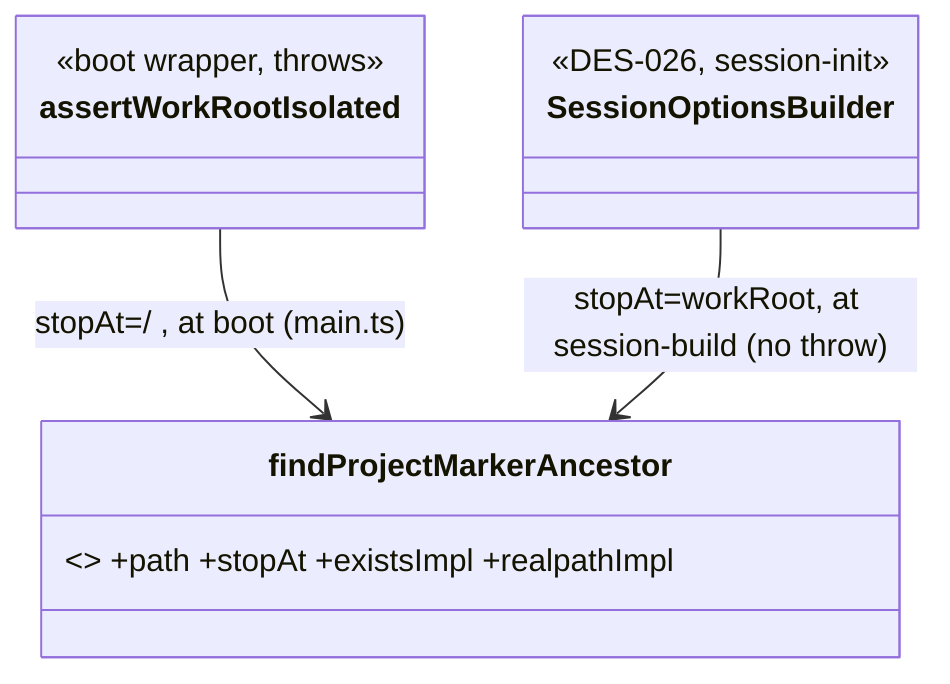

# 04 Detailed Design

> Interfaces, data structures, flows. Each `### DES-NNN`'s traces point back to ARCH/TASK. Matching verification is unit test UT-*.
> **Panel provenance:** `.panel/gate34/adversarial.r1.md` (interface-contract / boundary-error / testability, opus-4-8)
> + `.panel/gate34/quality.r1.md` (observability / replaceability / consumability / self-sustainability, sonnet-5).
> Headlines were complementary (contract+boundary+testability seams vs cross-cutting concerns landing on
> already-chosen seams) → no round-2 rebuttal; synthesized directly.
> **Degraded-fallback disclosure:** this host exposes no Agent/Task tool, so the designer applied all lens
> groups itself sequentially (the weak substitute for real per-lens subagents) and wrote the `.panel/gate34`
> proposals directly. Safety_class=QM → no functional-safety/cybersecurity lenses (panel unchanged).
> Language: TypeScript (D9). All types are illustrative signatures the verifier can bind UTs against.

## Module boundaries (who may call whom)
- **Untrusted child (ARCH-003)** holds no secrets/store/network; its ONLY channel to the trusted parent is the
  IPC seam (DES-006). It calls nothing else directly.
- **Trusted parent**: MCP Facade (DES-001) → Run Manager/RunGuard (DES-002/003/004) → {AgentExecutor (DES-007/008),
  RunStore (DES-010), Catalog (DES-011)}. AgentExecutor → GatewayClient (DES-009). Submission Validator (DES-012)
  is called only at the two entry points. Injected seams (RunStore, GatewayClient, AgentSpawner, Clock) are
  constructor-injected interfaces (DES-002/007/009/010/014).

## Real-tier validation & per-tier mock policy — see DES-015 (binds every REQ to a runnable path).

### DES-001 — MCP tool contract + uniform result envelope
- **status:** draft
- **traces:** ARCH-001, TASK-001, TASK-002
- **signature:** every tool returns `ResultEnvelope`; `workflow_run` is async (returns `runId` immediately), caller polls `workflow_status` then fetches `workflow_result`.
- **iter:** v1

```ts
type RunStatus = 'queued'|'running'|'suspended'|'stopped'|'completed'|'failed';
interface ResultEnvelope<T = unknown> { runId: string; status: RunStatus; result?: T; error?: ErrEnvelope; }
interface ErrEnvelope { code: string; message: string; field?: string; }

interface McpFacade {
  workflow_run(a: { name?: string; script?: string; args?: unknown; budget?: number|null }): Promise<ResultEnvelope<{runId:string}>>;
  workflow_status(a: { runId: string }): Promise<ResultEnvelope<RunStatusView>>;
  workflow_result(a: { runId: string }): Promise<ResultEnvelope>;            // result = script return value
  workflow_suspend(a: { runId: string }): Promise<ResultEnvelope>;
  workflow_resume(a: { runId: string; script?: string }): Promise<ResultEnvelope>;
  workflow_stop(a: { runId: string }): Promise<ResultEnvelope>;
  workflow_list(a?: {}): Promise<ResultEnvelope<RunSummary[]>>;
  workflow_agent_log(a: { runId: string; agentId: string }): Promise<ResultEnvelope<TranscriptEvent[]>>;
}
```
Boundary/error: unknown `runId` → envelope with `error{code:'RUN_NOT_FOUND'}`, never throw across the tool boundary. Submission-time failures (DES-012) return `status:'failed'` + `error` synchronously (before a `runId` exists → `runId:''`). Bind: 127.0.0.1 default; `bind:'0.0.0.0'` opt-in only (REQ-005). No business logic here — pure delegation.

> **Gate 6 note (D-I2, IMPL-018/IMPL-019):** `workflow_result`'s `result` field is the **script's own
> return value**, not the `RunStatusView` — this was already the documented contract above but the
> initial parallel implementation mistakenly returned the `RunStatusView` from `workflow_result` too
> (and `McpFacade` built its own private `RunStore` instead of sharing the one `workflow_status`/
> `workflow_result` read from, causing `RUN_NOT_FOUND` everywhere). Both are now wired per this spec —
> see `src/mcp-facade.ts`, `src/run-manager.ts`.

> **Gate 6 note (D-I9, IMPL-027):** `workflow_list`'s `RunSummary[]` signature above undersold the
> contract — REQ-014 requires a REGISTERED-but-never-run workflow to be visible via `workflow_list`
> too, not just started runs. `result` is now a flat kind-discriminated array mixing catalog entries
> (`{kind:'workflow', name, version, createdAt}`, sourced from `WorkflowCatalog.list()`) with run
> summaries (`{kind:'run', ...RunSummary}`), so existing callers doing `list.some(w => w.runId === x)`
> and new callers doing `list.some(w => w.name === y)` both work against the same array. See
> `src/mcp-facade.ts`, `src/workflow-catalog.ts`.

> **Gate 8 route-back note (D-G8-3, IMPL-051; review finding C-1):** `server.ts`'s `tools/list`
> handler previously served `{name, description: name, inputSchema: {type:'object'}}` for every
> tool — the tool's own name repeated as its description, and an opaque schema with no
> `properties`/`required` at all, so an MCP client could not learn any tool's real parameter
> contract from `tools/list` alone (this section's own consumability rationale). Fix: a new
> `TOOL_METADATA` record gives each of the 10 tools a real, non-name-echoing description plus a
> real JSON `inputSchema.properties`/`required` mirroring exactly the argument shape
> `callTool()`/`McpFacade` already accept above (e.g. `workflow_run`:
> `name?`/`script?`/`args?`/`budget?`; `workflow_agent_log`: required `runId`+`agentId`).
> `workflow_list` (genuinely zero-parameter per this section's own `workflow_list(a?: {})`
> signature) gets `inputSchema.properties: {}` — real, not a placeholder, but correctly empty since
> it truly takes no arguments. See `src/server.ts`.

### DES-002 — RunGuard (single-authority caps + budget)
- **status:** draft
- **traces:** ARCH-002, TASK-003
- **signature:** shared object read by BOTH orchestration and the agent spawner so caps cannot drift.
- **iter:** v1

```ts
interface Budget { total: number|null; spent(): number; remaining(): number; }   // read-only view handed to VM
interface RunGuard {
  readonly concurrency: number;          // min(16, cores-2)
  acquireSlot(): Promise<() => void>;    // resolves when a slot is free; returns release fn
  nextAgentId(): string;                 // throws AgentCapError once 1000 issued this run
  addTokens(delta: number): void;        // single accounting path; feeds Budget + status
  budgetView(): Budget;                  // total/spent()/remaining(); remaining()=Infinity when total=null
  assertBudget(): void;                  // throws BudgetExceededError when spent() >= total (hard ceiling)
}
```
Boundary/error: at exactly `concurrency` in-flight, the (N+1)th `acquireSlot()` awaits (queues) and all still complete (REQ-002). `nextAgentId()` throws at the 1001st call. `assertBudget()` is checked BEFORE each `agent()` dispatch so budget-exhausted calls throw inside the script (REQ-002). `addTokens` is the ONLY writer of token totals → `budgetView().spent()` and the status API can never diverge.

> **Gate 6 round-3 route-back note (D-F8, IMPL-D-F8-1):** this server-side `RunGuard`/`Budget` was
> always the single authority and was never itself wrong — the gap (`08-validation.md` round-2/3
> finding, `state.yaml` `pending[]` item 3) was that the SEPARATE, sandbox-VM-side `Budget` object
> `agent()` scripts actually read (DES-005's `WorkflowApi.budget`, realized over the DES-006 IPC seam
> in `src/sandbox/child-entry.ts`) had its own independent `spent()/remaining()` hard-coded to
> `spent=0` always, never reading THIS `RunGuard`. Closed by piggybacking `RunGuard.budgetView().
> spent()` onto every `agentResult` IPC message (see DES-006's route-back note) — the script-visible
> view now tracks this authority live, one writer (`addTokens`), same invariant, just also mirrored
> across the process boundary. No change to this interface itself. See DES-006's note,
> `src/run-manager.ts`, `src/sandbox/child-entry.ts`.

> **Gate 8 route-back note (D-G8-6, IMPL-051; review finding V2, REQ-002):** `assertBudget()` was a
> stale PRE-DISPATCH-only check — tokens are only added post-invoke via `addTokens()` (DES-008's own
> `capture()`) — so under `parallel()`, a burst of N concurrent `agent()` calls could all read the
> same stale `spent()` (still reflecting none of their own eventual cost) and all pass the gate
> before any one of them recorded real spend, materially overshooting the hard ceiling this
> section's own boundary text promises. Fix: `RunGuard` grows `reserve(): number` (atomically
> reserves the run's ENTIRE currently-remaining budget for one about-to-dispatch call — synchronous,
> no per-call cost estimate exists ahead of time, so this is the simplest atomic gate) and
> `releaseReserved(amount)` (frees it once the call settles, regardless of its real cost — real cost
> accounting via `addTokens()` is untouched, a separate concern). `assertBudget()` now checks
> `spent() + <reserved> >= total`. `RunManager._handleAgentRequest` calls `reserve()` synchronously
> (no `await` in between) immediately after `assertBudget()`, releasing it in a `finally` around the
> rest of the call. Since only ONE call can ever hold a full-remaining-budget reservation at a time,
> the 2nd..Nth concurrent dispatch in a burst now synchronously throws `BudgetExceededError` (the
> existing hard-throw-at-ceiling contract, unchanged) instead of all reaching the gateway. No-op
> (unbounded budget) when `total===null`, matching this section's existing `remaining()=Infinity`
> convention. See `src/run-guard.ts`, `src/run-manager.ts`.

> **Gate 8 v2 review route-back note (D-V2G8-2, IMPL-064/067; review finding V4 MEDIUM — a
> regression against D-G8-6 directly above):** `reserve()` reserving the run's ENTIRE remaining
> budget for ONE call overcorrected — under `parallel([a,b,c])`, the first concurrent `agent()` call
> to reach `reserve()` monopolized 100% of whatever budget remained, so every other call in the SAME
> burst synchronously threw `BudgetExceededError` before ever reaching the gateway: concurrency
> collapsed to exactly 1, always, regardless of how much real headroom the budget had (REQ-002's
> own `parallel()` concurrency promise broken). Fix: `reserve()` now reserves
> `Math.min(remaining, this.total / 2)` — a flat half of the total budget per call, not the whole
> remainder — so a burst can push at most 2 calls' worth of reservations through before a 3rd (or
> later) hits a real `assertBudget()` check against what's genuinely left. Restores concurrency for
> the common (generously-bounded) case (IT-037) while the hard ceiling still holds once a budget is
> tight for real (IT-030's near-exhausted regression guard, re-verified green). See
> `src/run-guard.ts`.

### DES-003 — Run state machine + suspend/resume/stop lifecycle
- **status:** draft
- **traces:** ARCH-002, TASK-004
- **signature:** legal transitions only; every transition persisted via RunRecorder before it is observable.
- **iter:** v1

```ts
// legal edges: queued→running; running→{suspended,stopped,completed,failed};
//              suspended→{running(resume),stopped}; stopped→running(resume w/ cached prefix)
interface RunManager {
  start(spec: RunSpec): Promise<string>;                 // returns runId, runs async
  suspend(runId: string): Promise<void>;                 // stop in-flight agents, persist, → suspended
  resume(runId: string, script?: string): Promise<void>; // replay cache (DES-004) then run live
  stop(runId: string): Promise<void>;                    // terminate sandbox child, → stopped
  status(runId: string): Promise<RunStatusView>;
}
```
Boundary/error: illegal transition (e.g. resume a `running` run) → `IllegalTransitionError` surfaced as envelope error. On process crash, a `running` run re-hydrates as `failed` (not silently `running`) but its journal prefix stays resumable; a `suspended` run re-hydrates resumable (REQ-006, restart survival). Suspend must actually abort in-flight SDK sessions (AbortSignal through AgentExecutor), not just flip the flag.

### DES-004 — Resume cache / replay contract
- **status:** draft
- **traces:** ARCH-002, TASK-005
- **signature:** longest-unchanged prefix of `agent()` calls keyed by `(prompt, opts)` replays from journal instantly.
- **iter:** v1

```ts
interface ResumePlan { cachedThrough: number; replay(callSeq: number, key: CallKey): unknown|MISS; }
type CallKey = { prompt: string; opts: AgentOpts };   // structural equality → cache hit
```
Boundary/error: same script + same args → 100% cache hit (every `agent()` returns cached, zero model calls). First edited/new `(prompt,opts)` and everything after runs live. Prior run must be `stopped`/`suspended` before resume (else `IllegalTransitionError`). `workflow_resume` with an edited script re-runs only from the first changed call (REQ-006 cached-prefix). Determinism guards (DES-005) exist precisely so replay is sound.

> **Gate 6 route-back note (D-F13, IMPL-048; REQ-006):** Gate 7.5 round 5 found that an
> ABORTED-mid-flight `agent()` call (workflow_suspend/workflow_stop cutting it short) journals
> `{value:null}` INDISTINGUISHABLE from a genuinely-completed terminal-provider-error null (DES-009's
> own legitimate `{ok:false}` outcome) — `ResumeCache.replay()` (correctly, per its documented "same
> script+args -> 100% cache hit" contract) then replays that aborted null as if it were a completed
> call, so `workflow_resume` never re-runs it live (violates this section's own "same final result as
> an uninterrupted run" promise). Fix: `JournalEntry` (DES-010) grows `aborted?: boolean` — true only
> when `AgentExecutor.run()`'s outcome was `{kind:'null', aborted:true}` (the signal fired before or
> during the gateway call), never for a genuine `{kind:'null'}` terminal/schema-exhaustion outcome.
> `Plan.replay()` now treats an `aborted` entry as a cache MISS (`this._missed = true; return MISS`)
> exactly like a missing/changed-key entry — the same "everything from the first miss onward runs
> live" contract this section already documents, just triggered by a different condition. See
> `src/resume-cache.ts`, `src/agent-executor.ts`, `src/run-manager.ts`, `src/types.ts`.

> **Gate 8 route-back note (D-G8-1, IMPL-051; review finding V3, REQ-006/ARCH-002/ARCH-006):** a
> nested `workflow()` call spawns a NEW `SandboxHost`/child process for the nested script, and that
> child has its OWN independent `callSeq` counter (`child-entry.ts`'s own `nextCallSeq`) starting at
> 0 again — but `RunManager._handleWorkflowRequest` forwarded the nested child's
> `agent()` calls into the SAME `_handleAgentRequest` (and so the same shared per-run journal /
> `ResumePlan`'s `Map<callSeq, JournalEntry>`) as the outer script's own `callSeq` values, without
> any namespacing. The outer script's own `callSeq` 0 and the nested script's own `callSeq` 0
> silently collided (last-write-wins in the `Map`), corrupting this section's own "longest-
> unchanged-prefix" replay contract for the WHOLE run (once any `callSeq` misses, `Plan.replay()`
> makes every later `callSeq` miss too — this section's own documented behavior), not just the
> nested call. Fix: `RunManager` gains `_nestedCallSeq(parentCallSeq, nestedCallSeq) =
> (parentCallSeq+1) * 1_000_000 + nestedCallSeq` — the nested child's own raw `callSeq` is namespaced
> into a numeric range keyed off the PARENT's own `callSeq` for the `workflow()` call that spawned
> it (itself unique in the parent's own `callSeq` space, and — critically — deterministic across an
> original run and a resume of the same unmodified script, since the same `workflow()` call gets the
> same parent-level `callSeq` both times). `SandboxHost.onWorkflowRequest`'s existing 3rd `callSeq`
> parameter (already threaded by `host.ts`, previously unused by `_handleWorkflowRequest`) supplies
> `parentCallSeq`. See `src/run-manager.ts`.

### DES-005 — Sandbox VM bindings (workflow API surface) + guards
- **status:** draft
- **traces:** ARCH-003, TASK-006, TASK-007
- **signature:** restricted VM context exposes EXACTLY the compat-spec §2 surface and nothing else.
- **iter:** v1

```ts
interface WorkflowApi {                       // the only globals visible inside the sandboxed script
  agent(prompt: string, opts?: AgentOpts): Promise<unknown|null>;
  parallel(thunks: Array<() => Promise<unknown>>): Promise<Array<unknown|null>>;
  pipeline(items: unknown[], ...stages: Stage[]): Promise<Array<unknown|null>>;
  phase(title: string): void;
  log(message: string): void;
  readonly args: unknown;                     // verbatim JSON, undefined if absent
  readonly budget: Budget;                    // read-only view (DES-002); no setter exposed
  workflow(nameOrRef: string|{scriptPath:string}, args?: unknown): Promise<unknown>;
}
type AgentOpts = { label?: string; phase?: string; schema?: object; model?: string;
                   effort?: 'low'|'medium'|'high'|'xhigh'|'max'; isolation?: 'worktree'; agentType?: string };
type Stage = (prev: unknown, item: unknown, index: number) => Promise<unknown>;
```
Boundary/error (all throw INSIDE the script, catchable/reported): `Date.now()`, `Math.random()`, argless `new Date()` (determinism guard); >4096 items in one `parallel`/`pipeline` call; second-level `workflow()` nesting; script >512 KB; TS syntax (type annotations/generics fail to parse — must match original JS-not-TS); non-literal `meta` (variables/calls/spreads/interpolation rejected). No `fs`/`require`/`process`/network reachable in-context. `budget` is frozen getters — mutation attempts throw.

### DES-006 — IPC seam message protocol (child ↔ parent)
- **status:** draft
- **traces:** ARCH-003, TASK-008
- **signature:** tagged discriminated union over the child process channel; every request correlated by `(runId, callSeq)`.
- **iter:** v1

```ts
// child → parent (untrusted asks trusted to do the privileged thing)
type ChildMsg =
  | { t: 'agent';    runId: string; callSeq: number; prompt: string; opts: AgentOpts }
  | { t: 'workflow'; runId: string; callSeq: number; ref: string|{scriptPath:string}; args: unknown }
  | { t: 'phase';    runId: string; title: string }
  | { t: 'log';      runId: string; message: string }
  | { t: 'done';     runId: string; result: unknown }        // script return value
  | { t: 'error';    runId: string; error: { message: string; stack?: string } };
// parent → child
type ParentMsg =
  | { t: 'agentResult';    callSeq: number; value: unknown|null }   // null carries the null-semantics contract
  | { t: 'workflowResult'; callSeq: number; value: unknown }
  | { t: 'agentThrow';     callSeq: number; error: { code: string; message: string } } // budget/nesting/unknown-name
  | { t: 'abort';          reason: 'suspend'|'stop' }
  | { t: 'init';           args: unknown; budget: { total: number|null } };
```
Boundary/error: the master test seam — stubbing the parent side lets a UT dry-run `sdlc-run.js` (641 lines) with ZERO model calls. `agentThrow` maps to a thrown error inside the VM (budget ceiling, unknown `workflow(name)`, second-level nesting); `agentResult{value:null}` maps to the null return. Unknown `callSeq` correlation → protocol error (fail loud, never hang).

> **Gate 6 round-3 route-back note (D-F8, IMPL-D-F8-1):** `ParentMsg`'s `'agentResult'` variant
> grows an optional `spent?: number` — the real cumulative `RunGuard` token total as of that call's
> completion, piggybacked onto the SAME message (no new message type; the child already receives one
> `agentResult` per `agent()` call, and budget only ever changes as a side effect of one). `SandboxHost`
> (`src/sandbox/host.ts`) grows an optional `onBudgetSnapshot?: () => number` config hook, called when
> sending `agentResult`; `RunManager` wires it to `entry.guard.budgetView().spent()`
> (`src/run-manager.ts`). The child (`src/sandbox/child-entry.ts`) tracks a local `spentSoFar`
> updated from each `agentResult.spent`; the script-visible `budget.spent()/remaining()` accessors
> now read `spentSoFar` instead of a hard-coded stub (`remaining()` still derives from the
> `StartMsg.budgetTotal` captured at spawn — total itself never changes mid-run). Omitting
> `onBudgetSnapshot` (e.g. existing dry-run test seams) → no `spent` field sent, `spentSoFar` stays
> at its initial `0`, unchanged prior behavior. See `src/ipc/protocol.ts`, `src/sandbox/host.ts`,
> `src/sandbox/child-entry.ts`, `src/run-manager.ts`.

### DES-007 — Agent Executor / AgentSpawner contract
- **status:** draft
- **traces:** ARCH-004, TASK-009
- **signature:** one Claude Agent SDK headless session per `agent()`; schema→StructuredOutput retry; terminal failure → null.
- **iter:** v1

```ts
interface AgentSpawner {                                   // injected seam; fake for dry-runs
  run(req: AgentReq): Promise<AgentOutcome>;
}
interface AgentReq { runId: string; agentId: string; prompt: string; opts: AgentOpts;
                     workspace: string; signal: AbortSignal; }
type AgentOutcome =
  | { kind: 'text';   value: string }                      // no schema → final text string
  | { kind: 'object'; value: object }                      // schema → validated object (retry-on-mismatch)
  | { kind: 'null' }                                       // terminal API error after retries → agent() resolves null
```
Boundary/error: `schema` present → subagent forced to call StructuredOutput; validation at tool-call layer → model retries on mismatch; after retry budget exhausted with still-invalid → `kind:'null'` (never reject). Unknown `agentType` → reported error (not hang) surfaced at submission (DES-012) or as `agentThrow`. `agentType` resolves system-prompt/tools from the server-side registry; composes with `schema`. Runs PARENT-side so the untrusted script never touches the SDK or keys.

> **Gate 6 route-back note (D-V4/D-V5, IMPL-029):** `schema` validation is real Ajv (`ajv` dep,
> JSON-Schema draft-07-ish subset, `strict:false`) — `ajv.compile(opts.schema)` then up to
> `SCHEMA_RETRY_ATTEMPTS = 3` attempts total (never infinite), never a bare `as object` cast.
> `AgentExecutorDeps` grew an additive `agentTypes?: Record<string, {systemPrompt: string}>` seam
> (a server-side agent-definition registry, resolved by name before any gateway dispatch — unknown
> name throws before dispatch, known name's `systemPrompt` is prepended to the outbound prompt).
> Composition-root note: no caller (`server.ts`/`run-manager.ts`) currently populates `agentTypes`
> from an actual on-disk registry (e.g. `.claude/agents/*.md` per the compat-spec) — every
> `agentType` is "unknown" (fails fast, per spec) until that loader is built; no test in this route
> back drives that loader, so it was deliberately left unbuilt rather than speculatively implemented
> (see IMPL-029 needs_clarification). See `src/agent-executor.ts`.

> **Gate 6 final route-back note (D-F2, IMPL-036):** the loader is now built —
> `src/agent-definitions.ts`'s `loadAgentDefinitions(dir)` reads every `agents/*.md` file directly
> under `dir`, splits its `---\n...\n---\n` frontmatter (flat `key: value` lines; `name`/`model`
> read, `tools` parsed-but-unused — no seam restricts tools per agentType yet, so it is
> intentionally not stored) from its body (the `systemPrompt`), and returns a
> `Record<string, AgentTypeDef>`. `AgentTypeDef` grew an optional `model?: string` (an alias name,
> resolved the same way `opts.model` already is): `AgentExecutor.run()` now also applies a resolved
> definition's `model` to the outbound `opts.model` when the caller didn't already set one (in
> addition to the existing systemPrompt-prepend behavior). `ServerConfig.agentDefinitionsDir`
> (new) triggers the load once at `createServer()` startup and forwards the registry through
> `RunManagerDeps.agentTypes` into every `AgentExecutor` this manager constructs (both the
> `start()` and rehydrate-on-restart `_requireLive()` construction sites). Omitted
> `agentDefinitionsDir` → empty registry, unchanged prior behavior (every `agentType` "unknown").
> Proven end-to-end by IT-016 (real `createServer()` + a real on-disk frontmatter file + a real
> local Ollama-shaped stub — only the third-party LLM network is faked). See
> `src/agent-definitions.ts`, `src/agent-executor.ts`, `src/run-manager.ts`, `src/server.ts`.

> **Gate 6 route-back note (D-F11, IMPL-048; REQ-003):** Gate 7.5 round 5's central tool-use finding
> (agent()'s tool-use loop never actually fires against a real local model through the SDK-default
> gateway, root-caused to the CLI's own full uncurated tool surface — dozens of tools — overwhelming
> a 7B model's tool-selection ability) is fixed at the curation half here: `AgentTypeDef` (this
> section's own interface) grows `tools?: string[]` — the frontmatter `tools:` list
> `agent-definitions.ts` already parsed but, per this section's own prior note, deliberately left
> unstored ("no seam restricts tools per agentType yet") now IS stored and applied.
> `AgentExecutor.run()`'s existing agentType-resolution block (the one that already applies
> `def.systemPrompt`/`def.model`) now ALSO applies `def.tools` to the outbound `opts.allowedTools`
> the same way it applies `model` — only when the caller didn't already set an `allowedTools` of
> their own (an explicit per-call value always wins, same precedence `model` already follows).
> `AgentOutcome`'s `{kind:'null'}` variant also grows an optional `aborted?: boolean` this round
> (D-F13's own need, documented under DES-004/DES-010) — set when `req.signal` was already aborted,
> or the internal abort-vs-invoke race resolved as aborted; a genuine terminal gateway failure or
> exhausted schema-retry still returns `{kind:'null'}` with `aborted` absent. See
> `src/agent-executor.ts`, `src/agent-definitions.ts` — the gateway-side half of D-F11 (curating
> `options.allowedTools`/`options.tools` on the actual SDK session) is documented under DES-009.

### DES-008 — AgentTranscriptSink + token accounting
- **status:** draft
- **traces:** ARCH-004, TASK-010
- **signature:** single capture path taps the SDK event stream → `agent-<id>.jsonl`; token deltas → RunGuard.addTokens.
- **iter:** v1

```ts
interface TranscriptEvent { ts: string; kind: 'message'|'tool_call'|'tool_result'|'usage'; data: unknown; }
interface AgentRecord {
  agentId: string; label?: string; phase?: string;
  state: 'queued'|'running'|'done'|'failed';
  provider: string; model: string;                         // REAL provider + real model id actually used
  tokens: { input: number; output: number };
}
```
Boundary/error: ONE sink feeds `workflow_agent_log`, the dashboard (v2), and the resume cache — not three paths (observability). Every `usage` event calls `RunGuard.addTokens(delta)` so the `budget` view and the status API share one number. Local-Ollama routing must show `provider:'ollama'` in the record and NO paid-provider call in the gateway log (REQ-004 verifiability).

> **Gate 6 route-back note (D-V6, IMPL-029):** `RunStore` grew a real `getTranscript(runId, agentId):
> Promise<TranscriptEvent[]>` read-back accessor (`InMemoryRunStore` reads its in-memory map;
> `SqliteRunStore` reads `agent-<id>.jsonl` line-by-line, `[]` if the file never materialized) —
> `McpFacade.workflow_agent_log` now delegates to it instead of a hard-coded `[]`. See
> `src/run-store.ts`, `src/store/sqlite-run-store.ts`, `src/mcp-facade.ts`.

> **Gate 6 route-back note (D-F12, IMPL-048; REQ-007/REQ-002):** Gate 7.5 round 5 found
> `AgentRecord.state` (this section's own `'queued'|'running'|'done'|'failed'` type) never actually
> produced `'queued'`/`'running'` — `AgentTranscriptSink.capture()` only ever created a record at
> call-RESOLUTION time, so an in-flight or concurrency-queued agent was invisible in
> `workflow_status` (`agents:[]` while the run itself showed `status:'running'`). Fix: the sink grows
> two additive methods — `markQueued(agentId, label?, phase?)` (records `state:'queued'`,
> `provider:''`/`model:''`/`tokens:{0,0}` placeholders) and `markRunning(agentId)` (flips an existing
> record's `state` to `'running'`, preserving `label`/`phase`) — both exposed on `AgentExecutor`
> itself (delegating to its private sink) alongside the existing `getRecord`/`getAllRecords`.
> `RunManager._handleAgentRequest` (DES-003) now allocates the agentId via `RunGuard.nextAgentId()`
> and calls `markQueued` BEFORE `await guard.acquireSlot()` (so a call genuinely blocked behind the
> concurrency cap is observable immediately, not only once it dispatches), then calls `markRunning`
> right after the slot is acquired and before dispatching to the spawner. `capture()` (unchanged)
> still overwrites the record with the real terminal `'done'`/`'failed'` state once the call
> resolves. See `src/agent-executor.ts`, `src/run-manager.ts`.

> **Gate 8 route-back note (D-G8-2, IMPL-051; review finding O-1, ARCH-004, REQ-007):** this
> section's own signature promises "single capture path taps the SDK event stream" — but
> `AgentTranscriptSink.capture()` only ever emitted a single terminal `kind:'usage'` event per call;
> separately, `ClaudeAgentSdkGatewayClient._drain` explicitly discarded every real SDK message except
> the final `type:'result'` one (`if (msg.type !== 'result') continue`). Net effect:
> `workflow_agent_log` could only ever show one summary token-count line per `agent()` call, never
> the real reasoning/tool-call trace this section's own `TranscriptEvent.kind` type
> (`'message'|'tool_call'|'tool_result'|'usage'`) already declared it should. Fix: `GatewayResult`'s
> `ok:true` variant (DES-009) grows optional `events?: TranscriptEvent[]`. `_drain` now accumulates
> a `TranscriptEvent` for every non-`result` SDK message's own `message.content` items
> (`type:'text'`->`kind:'message'`, `type:'tool_use'`->`kind:'tool_call'`,
> `type:'tool_result'`->`kind:'tool_result'`) instead of discarding them, returning them on the
> final `GatewayResult`. `capture()` now emits each of `result.events` (in order) BEFORE the terminal
> `usage` event — a real reasoning/tool-call trace now reaches `workflow_agent_log`.
> `LiteLLMGatewayClient` (no SDK message stream to tap) leaves `events` unset — unchanged single-
> `usage`-event legacy behavior for that path. See `src/gateway/client.ts`,
> `src/gateway/claude-agent-sdk-client.ts`, `src/agent-executor.ts`.

### DES-009 — GatewayClient interface + provider-down breaker + null semantics
- **status:** draft
- **traces:** ARCH-005, TASK-011, TASK-012
- **signature:** narrow `invoke(prompt,opts)` over LiteLLM; bounded timeout→retry→null; sole key custody (parent-only).
- **iter:** v1

```ts
interface GatewayClient {                                   // injected seam; one impl = LiteLLMGatewayClient
  invoke(req: { prompt: string; opts: AgentOpts; runId: string; agentId: string }): Promise<GatewayResult>;
}
type GatewayResult =
  | { ok: true;  provider: string; model: string; tokens: { input: number; output: number }; content: unknown }
  | { ok: false; provider: string; reason: 'timeout'|'unreachable'|'terminal' };   // → agent() resolves null
interface AliasMap { [alias: string]: { provider: 'anthropic'|'openai'|'gemini'|'ollama'; model: string }; }
```
Boundary/error (D-G, user-confirmed v1): unreachable/hung provider → bounded `timeoutMs` (config, sane default) → `retries` (config) → `{ok:false}` → `agent()` resolves `null`, run continues, never hangs; the failure is visible in the AgentRecord. Every call correlation-tagged `(runId,agentId)` so the LiteLLM log joins back to the store. `default` alias used when `opts.model` omitted; unmapped alias → caught at submission (DES-012), never mid-run. API keys live ONLY here (parent).

> **Gate 6 route-back note (D-V1/D-R1, IMPL-029):** `GatewayConfig` grew `useLiteLLMProxy?: boolean`
> (default `true` from `server.ts`'s composition root as of this route-back — D-R1; explicit
> `false` opts back into the pre-existing direct-per-provider-`fetch` path) and an injectable
> `proxyManager?: LiteLLMProxyManager` seam (tests fake its `spawnImpl`/`fetchImpl`, never a real
> `litellm` binary — D-R2/DES-015). `LiteLLMProxyManager` (`src/gateway/litellm-proxy.ts`) owns one
> `litellm --config ... --port ...` subprocess: config.yaml generated straight from the existing
> `AliasMap` (one source of truth), bounded-timeout health poll (never hangs), idempotent `start()`.
> When the proxy path is active, `invoke()` calls the proxy's Anthropic-Messages-shaped
> `POST /v1/messages` (alias name as `model`) instead of each provider's native endpoint directly —
> this is a direct HTTP call shaped to match what a real `@anthropic-ai/claude-agent-sdk` headless
> session pointed at `ANTHROPIC_BASE_URL=<proxy>` would send, not an actual SDK session construction
> (`@anthropic-ai/claude-agent-sdk` is an added-but-currently-unused dependency — no test in this
> route back drives real SDK session objects; see IMPL-029 needs_clarification for the open question
> of whether that full swap is required for v1 sign-off). Manually smoke-tested end-to-end against a
> real spawned `litellm` + real local Ollama (see IMPL-litellm-proxy-manager); no automated test
> spawns the real binary (D-R3: Python 3.11/3.12 runtime requirement, documented in DEPLOY.md).
> IT-005 (`gateway-provider-down.test.ts`) retimed to inject `fetchImpl`+fake `proxyManager` so its
> breaker-semantics assertions are deterministic, not dependent on Python cold-start. See
> `src/gateway/client.ts`, `src/gateway/litellm-proxy.ts`, `src/server.ts`.

> **Gate 6 final route-back note (D-F1, IMPL-036/037):** user decision D1 stands (twice confirmed)
> — the direct-fetch-to-proxy shape above does NOT satisfy "genuine SDK sessions" (a raw fetch has
> no tool-use agent loop); the accept-direct-fetch alternative was explicitly REJECTED. New
> `ClaudeAgentSdkGatewayClient` (`src/gateway/claude-agent-sdk-client.ts`) implements `GatewayClient`
> against the REAL `@anthropic-ai/claude-agent-sdk` `query()` export: with no `queryImpl` override
> the default IS the real SDK export (UT-018, `vi.mock`s only the third-party module — unit tier);
> wires `ANTHROPIC_BASE_URL` to the given `baseUrl` (e.g. the already-built `LiteLLMProxyManager`'s
> proxy) and a dummy, non-empty, never-real `ANTHROPIC_API_KEY` (D-R2); reads the session's own
> `result` message (`subtype:'success'` → `{ok:true, content: msg.result, tokens: msg.usage.*}`,
> anything else or a thrown/aborted iteration → `{ok:false}`, never a hang, never a rejection).
> `queryImpl` stays injectable. `IT-015` is the real-subprocess companion (real SDK pointed at a
> LOCAL stub `/v1/messages` server, including one genuine tool-use turn) — in THIS environment it is
> RED for a documented, pre-anticipated reason (see `05-tests.md`'s IT-015 note + journal.md, and
> IMPL-037's test_defect report to the verifier): this sandboxed dev environment is *itself* a
> nested Claude Code agent host, and `query()` here is intercepted by that outer host with a live
> synthetic response (confirmed via a throwaway debug script: the intercepted request bodies carry
> the OUTER project's own system prompts/agent-type list and a live model id, never our stub's SSE
> bytes) rather than genuinely spawning an independent CLI subprocess against `ANTHROPIC_BASE_URL` —
> the test's own skip-guard anticipates exactly this failure mode in prose but its literal condition
> (`stub.requests.length > 0` within 20s) doesn't catch it, because the intercepted calls do still
> reach the local port with a wrong-shaped body. Not a defect in `ClaudeAgentSdkGatewayClient` itself
> — UT-018 fully pins its logic. Composition-root wiring: an additive `ServerConfig.gateway?:
> GatewayClient` override seam was added to `createServer()` (no existing caller sets it, zero
> regression) so this class CAN be selected explicitly; it was deliberately NOT wired as the
> zero-config default for `RunManager`/`server.ts`'s existing `aliases`-absent or
> `useLiteLLMProxy:true` construction paths, because ~20 existing green tests (`val-002`, `val-006`,
> `e2e/suspend-resume-replay`, etc. — see their own "fast local no-credential agent() rejection path"
> comments) depend on that path's near-instant no-credential terminal-fail behavior, and IT-005/
> IT-013 pin the raw-fetch transport shape for the `useLiteLLMProxy:true` path specifically; no test
> in this round forces re-wiring either of those paths, and doing so untested risked exactly the kind
> of speculative, unverified production behavior Gate 6 discipline warns against. Flagged to the
> orchestrator as needs_clarification (see 06-impl-log.md IMPL-037) rather than silently wired. See
> `src/gateway/claude-agent-sdk-client.ts`, `src/server.ts`.

> **Gate 6 round-3 route-back note (D-F6/D-F7/D-F9a, IMPL-SLICE-DF6-DF7-DF9a-1/2/3):** three
> additive changes finalize what UT-020/UT-021/IT-019 pinned as red (verifier-authored design
> extensions not yet written up here, per those tests' own notes):
> (1) **D-F9a — signal threading.** `GatewayClient.invoke(req)`'s `req` grows an optional
> `signal?: AbortSignal` (`src/gateway/client.ts`); `AgentExecutor`'s `_invokeOnce` forwards its own
> `req.signal` (already required on `AgentReq` per DES-007) straight through
> (`src/agent-executor.ts`). `RunManager` needed no change — `entry.abortController.signal` was
> already threaded into `AgentExecutor.run()`'s call (predates this round). Scope is deliberately
> narrow: only `ClaudeAgentSdkGatewayClient` honors the incoming `signal` this round (D-F7's bounded
> race is explicitly scoped to it too) — `LiteLLMGatewayClient`'s `callProvider`/`callViaLiteLLMProxy`
> do NOT yet tie their own `AbortController` to this external signal; that remains `state.yaml`
> `pending[]` item (4), unchanged, out of this round's binding text.
> (2) **D-F6 — alias-aware thinking policy.** `ClaudeAgentSdkGatewayConfig` grows `aliases?:
> AliasMap` (same shape `LiteLLMGatewayClient` already takes). `invoke()` sets `options.thinking =
> {type:'disabled'}` for any alias not confirmed `provider:'anthropic'` (including an
> alias absent from the map — the safe default), and leaves `options.thinking` unset (SDK default)
> only for a confirmed Anthropic-mapped alias.
> (3) **D-F7 — bounded race.** `ClaudeAgentSdkGatewayConfig` grows `timeoutMs?: number` /
> `retries?: number` (mirroring `GatewayConfig`). When `timeoutMs` is set, `invoke()` makes
> `1 + retries` attempts, each racing the session drain against an `AbortController`-driven timer
> (`Promise.race`) exactly like `LiteLLMGatewayClient`'s per-attempt race — first success wins,
> exhausting all attempts without one returns the last `{ok:false}`. The same `AbortController` also
> answers the external `req.signal` (D-F9a) via a `once` listener, so either the timeout or an
> external abort resolves the race; both listeners are cleaned up in a `finally`. When neither
> `timeoutMs` nor `req.signal` is set, `invoke()` is unchanged legacy (unbounded single attempt).
> See `src/gateway/client.ts`, `src/agent-executor.ts`, `src/gateway/claude-agent-sdk-client.ts`.

> **Gate 6 round-4 route-back note (D-F10, gap-tests-7, IT-021/IT-022/UT-022/UT-023):** Gate 7.5
> round 4 found the 3 fixes above (D-F6/D-F7/D-F9a) were all real at the class level but DEAD in
> production because `src/main.ts` (the real product entrypoint) never constructed
> `ClaudeAgentSdkGatewayClient` with `aliases`/`timeoutMs`/`retries`, and never read/forwarded
> `agentDefinitionsDir` at all -- no existing test constructed the server the way `main.ts` itself
> does, so this whole class of composition-root wiring gap was invisible below the 45-minute
> real-run validation tier. Fix, ORCH D-F10 STRUCTURAL RULE: `src/main.ts`'s inline
> `FileConfig -> ServerConfig` translation is now an exported, independently testable helper --
> `export async function composeConfig(fileConfig: FileConfig, deps?: { queryImpl?, proxyManager? }):
> Promise<ServerConfig>` -- with `main()` itself reduced to `composeConfig(loadFileConfig())` +
> `createServer()`. `composeConfig()` forwards `aliases`/`timeoutMs`/`retries` into the constructed
> `ClaudeAgentSdkGatewayClient` (`gateway:'sdk'`, the default) and forwards `agentDefinitionsDir`
> into the returned `ServerConfig` regardless of gateway choice (`gateway:'direct-fetch'` leaves
> `config.gateway` unset so `createServer()`'s own `aliases`-driven `LiteLLMGatewayClient`
> construction applies, unchanged). `src/main.ts` also gained an import-guard
> (`fileURLToPath(import.meta.url) === process.argv[1]`) so `main()`'s side-effecting boot only runs
> when the file is the real process entry point, not merely imported to reach `composeConfig` --
> a necessary companion, since re-running the whole program on every import would make the export
> pointless. `IT-021`/`IT-022` (`tests/integration/main-composition-root(-agent-types).test.ts`)
> are the STRUCTURAL-RULE tests themselves: they boot via `import('../../src/main.js')` +
> `composeConfig()`, not a hand-built `ServerConfig`, closing the exact blind spot Gate 7.5 round 4
> identified.
>
> Also closes the `state.yaml pending[]` item (4) noted in the round-3 note above:
> `LiteLLMGatewayClient.invoke(req)`'s parameter type now includes `signal?: AbortSignal` and both
> `callProvider`/`callViaLiteLLMProxy` listen for its `abort` event to abort their own per-attempt
> `AbortController` (`UT-023`) -- the `"direct-fetch"` path is no longer excluded from D-F9a's signal
> threading. `ClaudeAgentSdkGatewayClient._invokeOnce`'s local `AbortController` (built whenever
> `timeoutMs` or `req.signal` is set) is now additionally assigned to the real SDK cancellation hook
> `Options.abortController` (`sdk.d.ts:1275`) BEFORE `query()` is called, not only raced against
> locally (`UT-022`) -- this is a genuine new capability (Gate 7.5 round 4's real repro showed the
> spawned `claude` CLI subprocess kept running past an unsuspended local race), verified so far only
> at unit tier (`vi.mock`s the SDK module); real-subprocess-kill confirmation against a live `claude`
> CLI remains Gate 7.5's job, same boundary as `IT-015`'s own documented environment caveat.
> `rwe.config.example.json` gained the `agentDefinitionsDir` key + a shipped example `agents/`
> directory (`researcher.md`/`writer.md`, same frontmatter shape `agent-definitions.ts` already
> parses and `IT-016`/`IT-022` already exercise) closing the config-drift half of the gap. See
> `src/main.ts`, `src/gateway/client.ts`, `src/gateway/claude-agent-sdk-client.ts`,
> `rwe.config.example.json`, `agents/`.

> **Gate 6 route-back note (D-F11, IMPL-048; REQ-003, ORCH ruling on Gate 7.5 round 5's tool-use
> defect):** the DES-007 note above threads a curated tool list as far as `opts.allowedTools`; this
> note is the gateway-side half that makes it real on the wire. `ClaudeAgentSdkGatewayConfig` grows
> `defaultAllowedTools?: string[]` (a configurable server-wide default core set, forwarded from
> `rwe.config.json`'s new `defaultAllowedTools` key via `main.ts`'s `composeConfig()` — same
> forwarding convention as `aliases`/`timeoutMs`/`retries`). `invoke()` resolves a `curatedTools`
> list once per call: the caller's (agentType-derived) `opts.allowedTools` when given, else
> `defaultAllowedTools`, else a built-in minimal core set (`['Read','Write','Bash']`) — NEVER left
> unset. A direct real-CLI repro (IT-023) proved `options.allowedTools` ALONE does not narrow the
> outbound wire tool surface at all — the SDK's own doc (`sdk.d.ts:1323`) confirms it only
> auto-approves listed tools without prompting; `options.tools` (`sdk.d.ts:~1370`) is what actually
> restricts the model's available BUILT-IN tools. The same repro also showed the CLI additionally
> inherits this HOST machine's own project/user Claude Code settings (MCP plugin tool definitions —
> e.g. Playwright/Cloudflare tools present in this dev sandbox — entirely unrelated to this product)
> regardless of `tools`; `settingSources: []` (SDK isolation mode: skip loading any filesystem
> settings) + `strictMcpConfig: true` (restrict MCP servers to only what `mcpServers` explicitly
> passes — none here) eliminates that leakage too. `invoke()` now sets `allowedTools`, `tools` (both
> to `curatedTools`), `settingSources: []`, and `strictMcpConfig: true` on every call — proven by
> IT-023 (real CLI subprocess + local stub capturing the actual outbound request body) that the wire
> tool surface is deterministically exactly the curated set, independent of whatever Claude Code
> configuration happens to exist on the host machine running this product. See
> `src/gateway/claude-agent-sdk-client.ts`, `src/main.ts`, `rwe.config.example.json`.

> **Gate 8 v2 review route-back note (D-V2G8-1(a)(b)(c)(d), IMPL-064/067; review finding V3 HIGH):**
> the D-F11 tool-curation note directly above closed the "which tools are on the wire" half of the
> tool-use defect but left the PERMISSION half wide open: `options.permissionMode` was hard-coded
> `'bypassPermissions'` (skips every tool-call decision outright, headless-safe but with zero
> arbitration) paired with a default tool set that (pre-this-note) still included `'Bash'` and no
> path-argument check at all — together these let any `agent()` prompt drive a fully-privileged
> shell, or a Read/Write call reach any path on the host (the LiteLLM proxy's own `config.yaml`, a
> sibling run's workspace/journal — both literally reachable via `../` from a run's own `cwd` since
> `RunManager`'s default `workRoot` places every run's workspace as a sibling directory), closing
> neither the key-exfiltration nor the cross-run-read path this finding named. Fix, four parts:
> **(a)** `permissionMode` is now `'default'`, not `'bypassPermissions'` — headless behavior is
> preserved because the callback in (d) below always resolves synchronously, never `null`/pending.
> **(b)** `BUILT_IN_CORE_TOOLS` drops `'Bash'` (now `['Read','Write']`) — a privileged shell is now
> an explicit `agentType`/`opts.allowedTools`/`defaultAllowedTools` opt-in, never silently default.
> **(c)** `LiteLLMProxyManager._doStart()`'s subprocess spawn grows an explicit `env: {
> ...process.env }` — the ONE place real provider keys need to live, now a real, testable custody
> statement instead of an implicit Node default; the agent-facing CLI subprocess's own
> `buildSubprocessEnv` allowlist (D-G8-5) is untouched — the "proxy yes, agent no" split holds.
> **(d)** a new `isInsideWorkspace(candidate, root)` (`path.resolve` + `root + path.sep`-prefix
> check, so a sibling dir sharing a string prefix is never wrongly treated as "inside") backs a
> shared `toolUsePreCheck(root, candidate)` decision, wired into `options.canUseTool` (inspects a
> tool call's own path argument — `input.file_path` for Read/Write, `options.blockedPath` for a Bash
> escape — against `req.workspace ?? this._config.cwd`) **and** into an `options.hooks.PreToolUse`
> matcher. Both are wired, not just `canUseTool` alone, because real-SDK verification (not just the
> mocked unit tests) surfaced a genuine shadowing gap: the SDK's own
> `CLAUDE_SDK_CAN_USE_TOOL_SHADOWED` runtime warning documents that a BARE `allowedTools` entry
> (e.g. the default `'Read'`) auto-approves that tool call before `canUseTool` is ever consulted —
> and (b)'s D-F11-mandated non-empty bare `allowedTools` default means the built-in Read/Write case
> hits exactly that shadow. `hooks.PreToolUse` (the SDK's own suggested mechanism for this exact
> case) fires for every tool call regardless of that shadow, so the workspace boundary holds either
> way — confirmed end-to-end against a real `@anthropic-ai/claude-agent-sdk` session (not just the
> mocked `UT-039/040/041` unit tests): a genuine out-of-workspace `Read` (`/etc/hostname`) is denied
> with `path outside run workspace: ...`; a genuine in-workspace `Read` still succeeds. No workspace
> root known at all (neither `req.workspace` nor a configured `cwd`) -> nothing to enforce against,
> allow (unchanged legacy behavior for direct unit-tier calls). See
> `src/gateway/claude-agent-sdk-client.ts`, `src/gateway/litellm-proxy.ts`.

> **Gate 8 route-back note (D-G8-4, IMPL-051; review finding S-1, decision D-G):** this section's
> own boundary text promises "bounded `timeoutMs` (config, sane default) ... never hangs" — but the
> *default* production gateway path (`ClaudeAgentSdkGatewayClient`, selected by `main.ts`'s
> `composeConfig()` whenever no config file exists at all, the exact zero-config "just run it"
> deployment `main.ts` was built to support) had no hardcoded fallback of its own, unlike `bind`/
> `port` which both already default in `composeConfig()`. `loadFileConfig()` returns `{}` in that
> shape, so `timeoutMs` stayed `undefined` end-to-end — `ClaudeAgentSdkGatewayClient.invoke()` only
> races a bound `when this._config.timeoutMs !== undefined` (D-F7's own note above), so a dead/hung
> local provider hung the whole run (RunGuard's concurrency slot stays held) indefinitely, violating
> decision D-G (user-reconfirmed 2026-07-03: "keep the minimal breaker in v1"). Fix:
> `composeConfig()`'s `timeoutMs: fileConfig.timeoutMs` grows the same hardcoded `?? 15000` fallback
> `server.ts`'s own legacy `LiteLLMGatewayClient` construction already has. A second, more direct
> bug was found while verifying the fix: the `ClaudeAgentSdkGatewayClient` constructor call was
> reading the raw `fileConfig.timeoutMs` (still `undefined` in the zero-config case) instead of the
> just-resolved `config.timeoutMs` — fixed alongside, since the fallback above would otherwise have
> been dead code. See `src/main.ts`.

> **Gate 8 route-back note (D-G8-5, IMPL-051; review finding V5, D-R2):** this class's own header
> comment already promised "never reads or forwards a real host credential" — but `invoke()`'s
> `options.env` spread the ENTIRE `process.env` verbatim (`{...process.env, ANTHROPIC_BASE_URL:...,
> ANTHROPIC_API_KEY:...}`) into the spawned `claude` CLI subprocess, true only for the two
> `ANTHROPIC_*` keys actually overridden — every other host secret (`OPENAI_API_KEY`,
> `GEMINI_API_KEY`, cloud credentials, tokens, ...) leaked straight through. Fix: a new
> `ENV_ALLOWLIST = ['PATH','HOME','SHELL','LANG','LC_ALL','TMPDIR','TERM']` (the keys the subprocess
> genuinely needs to find its own binaries, resolve `$HOME`-relative config/cache paths, and respect
> the host's locale/shell) + `buildSubprocessEnv(baseUrl)` builds `options.env` from only those
> allowlisted keys (when present in the host env) plus the overridden `ANTHROPIC_BASE_URL`/
> `ANTHROPIC_API_KEY` pair — never the full `process.env`. See
> `src/gateway/claude-agent-sdk-client.ts`.

### DES-010 — RunStore port + journal / record data shapes
- **status:** draft
- **traces:** ARCH-006, TASK-013, TASK-014
- **signature:** narrow injectable port (in-memory fake for tests); journal.jsonl per run + SQLite index; single-writer per run.
- **iter:** v1

```ts
interface RunStore {                                        // injected seam; InMemoryRunStore fake for UTs
  createRun(r: RunSpec): Promise<string>;
  appendJournal(runId: string, e: JournalEntry): Promise<void>;   // ordered append, one writer per run
  appendTranscript(runId: string, agentId: string, ev: TranscriptEvent): Promise<void>;
  recordTransition(runId: string, from: RunStatus|null, to: RunStatus, ts: string): Promise<void>;
  getRun(runId: string): Promise<RunStatusView|null>;
  listRuns(): Promise<RunSummary[]>;
  hydrateAll(): Promise<RunSummary[]>;                      // boot recovery: one log line enumerating re-hydrated runs
}
interface JournalEntry { callSeq: number; key: CallKey; value: unknown|null; ts: string; scriptVersion: string; }
interface RunStatusView { runId: string; status: RunStatus; phases: PhaseView[]; agents: AgentRecord[]; scriptVersion: string; }
```
Boundary/error: journal records each `agent()` return in COMPLETION order (the resume cache, DES-004). Per-run files → no cross-run write contention. Survives restart (REQ-006). Port exists for TESTABILITY (in-memory fake), NOT multi-DB portability — SQLite swap deliberately not built (Karpathy). Prior runs' journals keep referencing the `scriptVersion` they ran with (REQ-014).

> **Gate 6 note (D-I2, IMPL-019; REQ-006, IMPL-025):** the port grew two small additive methods beyond
> the original signature above, both needed to keep `workflow_result`/restart-survival honest rather
> than reconstructing them ad hoc in `RunManager`: `recordResult(runId, result)` / `getResult(runId)`
> (the script's return value — SqliteRunStore persists it as a `result` column plus a
> `{type:'result',...}` marker line in that run's `journal.jsonl`) and `getSpec(runId)` (the original
> `name`/`script`/`args`/`budget`, needed to rebuild a live `RunEntry` for `suspend`/`resume`/`stop`
> after a process restart — SqliteRunStore added `script`/`args`/`budget` columns). See
> `src/run-store.ts`, `src/store/sqlite-run-store.ts`.

> **Gate 6 route-back note (D-V6/D-V7, IMPL-029):** `RunStore` grew `getTranscript(runId, agentId):
> Promise<TranscriptEvent[]>` (see DES-008's note) and `createRun(spec, scriptVersion = 'v1')` gained
> an optional third param — `RunManager.start()` now threads the catalog's actually-resolved
> `scriptVersion` (e.g. `"v2"` after an update) through it instead of every run hard-coding `'v1'`
> (default preserved for existing call sites). REQ-013 artifact listing did NOT change this port —
> `McpFacade.workflow_artifacts` reads the filesystem directly via a new `RunManager.workspacePath
> (runId)` accessor (live state first, falls back to recomputing the deterministic
> `name`+`runId`-derived path from `RunStore.getSpec` for a run this process hasn't touched since
> restart) rather than adding an artifact-listing method to the store port itself (smaller blast
> radius — DES-011 already owns workspace path derivation). See `src/run-store.ts`,
> `src/store/sqlite-run-store.ts`, `src/run-manager.ts`, `src/mcp-facade.ts`.

> **Gate 6 round-3 route-back note (D-F9b, IMPL-D-F9b-1):** `getRun`'s `RunStatusView.agents` was a
> hard-coded `[]` in BOTH `InMemoryRunStore` and `SqliteRunStore` (`08-validation.md` round-2/3
> finding, `state.yaml` `pending[]` item 5's root cause, real: AgentRecord was only ever tracked in
> an in-process `AgentExecutor`'s transient Map, which does not survive a restart, even though the
> underlying `agent-<id>.jsonl` transcripts already do per D-V6). New exported helper
> `deriveAgentRecords(transcripts: Map<string, TranscriptEvent[]>): AgentRecord[]`
> (`src/run-store.ts`) derives one `AgentRecord` per agentId from that agent's last `usage`
> transcript event (an agent with no `usage` event yet — still in flight, or never completed — is
> omitted, same as it would be from the in-process Map before its own capture resolves). Both
> `getRun` implementations now call it instead of hard-coding `[]`: `InMemoryRunStore` passes its
> already-in-memory transcripts map; `SqliteRunStore` grows a private `_allTranscripts(runId)` that
> enumerates every on-disk `agent-<id>.jsonl` file in that run's directory (the restart-survival
> source, since no in-process Map exists after a real restart) and reads each one back via the
> existing `_readTranscriptFile` helper (D-V6). This closes `McpFacade.workflow_agent_log`'s
> downstream `AGENT_NOT_FOUND`-after-restart gap too, since that facade method gates on
> `view.agents.find(...)` before ever calling `getTranscript`. See `src/run-store.ts`,
> `src/store/sqlite-run-store.ts`.

> **Gate 6 route-back note (D-F13, IMPL-048; REQ-006):** `JournalEntry` (this section's own
> interface) grows `aborted?: boolean` — see the DES-004 note above for the full rationale
> (distinguishing an ABORTED-null from a genuine TERMINAL-null so `ResumeCache.replay()` re-runs the
> former live on resume). Absent/false for every entry recorded before this route-back and for every
> ordinary terminal-null entry going forward — the field is purely additive, no existing journal
> shape/consumer changes. See `src/types.ts`, `src/run-manager.ts`, `src/resume-cache.ts`.

### DES-011 — Workflow Catalog: registry + workspace rooting
- **status:** draft
- **traces:** ARCH-007, TASK-015, TASK-016
- **signature:** named registry with version pinning; per-workflow work folder + per-run workspace; rooted paths only.
- **iter:** v1

```ts
interface WorkflowCatalog {
  register(name: string, script: string): Promise<{ version: string }>;     // new version each update
  get(name: string): Promise<{ script: string; version: string }>;          // unknown → CatalogNotFoundError (catchable)
  list(): Promise<Array<{ name: string; version: string }>>;
  workFolder(name: string): string;                                          // persistent per-workflow root
  runWorkspace(name: string, runId: string): string;                         // per-run dir under workFolder
  resolveInWorkspace(runId: string, rel: string): string;                    // throws if escapes the run workspace
}
```
Boundary/error: `workflow('other-name')` unknown → catchable throw naming the missing workflow (mapped to `agentThrow`, REQ-014). Agent file I/O confined to the run workspace: run A cannot see run B's files; workflow X's folder unreachable from Y via the API surface (REQ-013). `resolveInWorkspace` rejects `..`/absolute escapes. Updating a registered workflow bumps `version`; the next run uses the new script, prior journals keep their pinned version. Documented retention/cleanup governs old run workspaces.

> **Gate 6 note (D-I9, IMPL-027):** `list()` grew a `createdAt: string` field per entry (registration
> timestamp) beyond the signature above, needed so `McpFacade.workflow_list` can surface it directly
> without McpFacade reaching into catalog internals — see `src/workflow-catalog.ts`.

> **Gate 6 route-back note (D-V2, IMPL-029):** registrations (`name`/`script`/`version`/`createdAt`)
> now persist in an on-disk SQLite DB (`catalog.db` under `workRoot`, `better-sqlite3` — the same
> dependency `SqliteRunStore` already uses, no new one) instead of an in-memory `Map`, so
> `workflow_list`/`workflow_run(name)` keep working across a server restart pointed at the same
> `workRoot` (REQ-014 acceptance extended per user decision). `register()` bumps the existing row's
> version rather than inserting a new one, so per-name version numbering also survives restart. See
> `src/workflow-catalog.ts`.

### DES-012 — Submission Validator: one error shape at entry points
- **status:** draft
- **traces:** ARCH-008, TASK-017
- **signature:** thin facade delegating to each module's rule; returns one error shape at BOTH entry points, pre-run.
- **iter:** v1

```ts
interface SubmissionValidator {
  validate(spec: RunSpec): Promise<{ ok: true } | { ok: false; errors: ErrEnvelope[] }>;
}
// delegates: ARCH-003 meta/parse · ARCH-005 alias resolves · ARCH-007 registry/agentType existence
```
Boundary/error: fails FAST at submission, never mid-run — missing model-alias mapping, malformed `meta` literal, unknown `agentType`, unknown workflow name, TS-not-JS parse all surface here as `errors:[{code,field,message}]` (consumability: one shape, caller branches once). It only aggregates the owning modules' rules — no duplicated/inverted validation logic (D-VAL).

### DES-013 — Cross-cutting error / null-semantics + throw contract
- **status:** draft
- **traces:** ARCH-003, ARCH-004, ARCH-005
- **signature:** ONE shared contract for every null-return and every hard-throw so paths cannot drift.
- **iter:** v1

```ts
// NULL (resolve, never reject):  agent() terminal API error after retries;  parallel() thunk throw → that slot null;
//   pipeline() stage throw → item→null, remaining stages skipped;  provider timeout/unreachable/terminal (D-G).
// THROW (inside script, catchable/reported):  budget ceiling (spent()>=total);  2nd-level workflow() nesting;
//   unknown workflow(name);  determinism guards;  >4096 items/call;  >512KB;  TS-not-JS;  malformed meta;
//   unmapped alias & unknown agentType (surfaced at submission, DES-012).
```
Boundary/error: `parallel()`/`pipeline()` calls themselves NEVER reject (barrier resolves with nulls in slots). This single enumeration is the checklist the verifier turns into UTs — every row is one testable case.

### DES-014 — Clock / RNG determinism seam consistency
- **status:** draft
- **traces:** ARCH-003, ARCH-006
- **signature:** every parent-side method that reads time takes the injected Clock; the sandbox VM has NO clock (guards throw).
- **iter:** v1

```ts
interface Clock { now(): number; isoNow(): string; }       // injected; FixedClock for UTs
```
Seam consistency (Exit-Gate 5): the ONLY sanctioned time reads in the v1 kernel are `RunRecorder.recordTransition` timestamps and `RunStore.appendJournal`/`appendTranscript` `ts` — ALL take the injected `Clock` (no bare `Date.now()`/`new Date()` anywhere in kernel code). The sandbox never reads time at all (determinism guards throw). No `get_due(clock)`/`rearm(wallclock)` asymmetry exists in v1 because there is no scheduler yet; when ARCH-010 (Scheduler, v2) is built it MUST adopt the same injected `Clock` in EVERY method that reads time (forward-flag). RNG: no kernel randomness; `Math.random()` inside the script throws.

### DES-015 — Real-tier validation path + per-tier mock policy
- **status:** draft
- **traces:** ARCH-001, ARCH-004, ARCH-005
- **signature:** per-REQ real entrypoint + real wiring the validator can run; explicit mock policy per tier.
- **iter:** v1

Real entrypoint(s): the running MCP Streamable HTTP server on 127.0.0.1; real wiring = real sandbox child process + real RunStore (journal.jsonl + SQLite on disk) + real embedded LiteLLM subprocess. Real external deps: LLM providers via LiteLLM (E2E uses a local Ollama backend or a test/sandbox API key — never a mock of the SUT's own gateway boundary).

Per-REQ real-tier path (what proves it, end to end):
- REQ-001/002 — submit `sdlc-run.js` (and synthetic null/nesting/budget fixtures) via `workflow_run`, assert `workflow_result` deep-equals the script return; determinism-guard fixtures throw.
- REQ-003 — a workflow whose `agent()` reads a workspace file; real SDK session performs the read.
- REQ-004 — `agent(...,{model:'haiku'})` routes through real LiteLLM; assert AgentRecord provider+model and (Ollama alias) that the gateway log shows only the local backend; provider-down fixture → agent()=null.
- REQ-005 — real MCP client `tools/list` + async submit→poll→fetch over Streamable HTTP; bind check 127.0.0.1.
- REQ-006 — suspend→resume replay + restart survival against the real on-disk store.
- REQ-007 — `workflow_status`/`workflow_agent_log` over a real completed run.
- REQ-013/014 — real registry register/list/invoke-by-name + per-run workspace isolation on disk.

Per-tier mock policy: **unit** may mock freely — RunStore(InMemory), AgentSpawner(fake), GatewayClient(fake), Clock(Fixed) — to isolate logic. **integration** uses real adjacent components (real sandbox child + real RunStore), mocking ONLY third-party network you genuinely cannot run. **E2E/acceptance MUST NOT mock the SUT's own boundaries** (no faking the sandbox, store, or GatewayClient); external LLM providers go through a local Ollama or sandbox/test credentials. This is what lets Gate 7.5 actually run the system and blocks mock-only false-green.

## Iteration v2 — extension-module design (ARCH-010..014; attaches at v1 seams, zero v1 rework)

> **Panel provenance (v2):** `.panel/design/adversarial.r1.md` (interface-contract / boundary-error /
> testability, opus-4-8) + `.panel/design/quality-dimensions.r1.md` (observability / replaceability /
> consumability / self-sustainability, sonnet-5). Round-1 headlines were largely complementary (contract+
> boundary+testability seams vs cross-cutting concerns landing on the same seams); the two material
> conflicts (asset live-probe drop-vs-keep; scheduler catch-up backfill; asset re-probe) are reconciled in
> the v2 Decision rationale at the foot of this file — synthesized directly, no round-2 needed.
> Safety_class=QM → no functional-safety/cybersecurity lenses. All v2 tools return the DES-001
> `ResultEnvelope` and pass the ARCH-009 auth no-op seam unchanged; new tools get real
> `TOOL_METADATA.inputSchema` in the D-G8-3 shape (do NOT repeat the v1 placeholder-schema finding).

### DES-016 — Scheduler port + Schedule record + persistence + `workflow_trigger`
- **status:** draft
- **traces:** ARCH-010, TASK-019
- **signature:** discriminated `Schedule` union persisted in SQLite; `SchedulerPort` CRUD + resident trigger over Catalog(ARCH-007)+RunManager(ARCH-002); all tools return `ResultEnvelope`.
- **iter:** v2

```ts
type Schedule =                        // each arm carries optional budget → the run it starts (KP-9)
  | { kind:'cron';     id:string; workflow:string; args?:unknown; budget?:number|null; cron:string; tz?:string; enabled:boolean }
  | { kind:'once';     id:string; workflow:string; args?:unknown; budget?:number|null; at:string /*ISO*/;        enabled:boolean }
  | { kind:'resident'; id:string; workflow:string; args?:unknown; budget?:number|null;                            enabled:boolean };
interface ScheduleStatus { id:string; kind:Schedule['kind']; workflow:string; enabled:boolean;
                           nextFire?:string; lastFire?:string; lastRunId?:string; }
// Closed error-code union (KP-1) — an agent caller branches retryable-vs-terminal without string-matching:
type ScheduleErrCode = 'INVALID_CRON'|'AT_UNPARSEABLE'|'WORKFLOW_NOT_FOUND'|'SCHEDULE_NOT_FOUND'|'SCHEDULE_DISABLED'|'ALREADY_COMPLETED';
interface SchedulerPort {
  create(s: Omit<Schedule,'id'>): Promise<ResultEnvelope<Schedule>>;   // validates cron/at/name at SUBMISSION
  list(): Promise<ScheduleStatus[]>;                                   // observability surface (schedule_list)
  setEnabled(id: string, on: boolean): Promise<ResultEnvelope<void>>;
  delete(id: string): Promise<ResultEnvelope<void>>;
  trigger(workflow: string, args?: unknown): Promise<ResultEnvelope<{runId:string}>>; // resident; disabled → error
  originOf(runId: string): 'manual'|'cron'|'once'|'resident';          // SYNC (KP-2): reads the schedule store synchronously (better-sqlite3), the one deliberately-sync method
}
// MCP tools: schedule_create / schedule_list / schedule_delete / workflow_trigger — each ResultEnvelope + real TOOL_METADATA.inputSchema.
```
Boundary/error: cron/`at` validated synchronously at `create` (invalid cron expr → `INVALID_CRON` / unparseable `at` → `AT_UNPARSEABLE` / unknown workflow name → `WORKFLOW_NOT_FOUND`, each an `ErrEnvelope` with `field`, never a run that silently never fires — reuse DES-012 fail-fast, delegate name-existence to Catalog). **`trigger` precondition pinned (KP-3):** unknown workflow → `WORKFLOW_NOT_FOUND`; a `resident` whose `enabled=false` → `SCHEDULE_DISABLED` (REQ-015 clause 3); never a thrown exception across the tool boundary. `setEnabled`/`delete` on an unknown id → `SCHEDULE_NOT_FOUND` (never throw). **Why `resident` is its own kind (KP-4):** trigger-eligibility is persisted and enable-gated uniformly in the ONE schedule store (a single `Schedule` union), rather than splitting an `enabled` flag onto the Catalog entry — simpler than a two-store split; it carries no time field. **Cost containment (KP-9 / R1, agent-altitude self-sustainability):** each `Schedule` arm carries an optional `budget` that flows into `RunManager.start(spec)` exactly like a manual run's budget (the run path already enforces it via RunGuard); absent → the server-level default cap applies (no unbounded-spend-on-an-unattended-timer). **Overlap = allowed and is an explicit accepted risk** (a slow cron can pile independent runs against paid providers); skip-if-running is a documented v2 non-goal — mitigated by per-run budget + the tunnel-gate (D5/C4), re-evaluate with auth in v3. **Same run path:** `trigger` and every scheduled fire call `RunManager.start(spec)` exactly like `workflow_run`, so scheduled/triggered runs appear in `workflow_list`/dashboard identically and are covered by the existing AgentSpawner stub (zero second execution path). **Persistence:** schedules live in SQLite under `workRoot` (same `better-sqlite3` dependency the catalog/store already use — no new dep, no ARCH-006/007 signature change), survive restart, re-armed at boot (DES-017). **Run-origin observability (zero v1 rework):** the scheduler records `scheduleId → runId` in its OWN store; `originOf(runId)` derives a run's origin by that join — the v1 `RunSpec`/`RunStore` are NOT modified (see rationale D-V2a).

### DES-017 — Scheduler firing engine: pure `tick(now)` + `computeNextFire` + Ticker/Clock seam
- **status:** draft
- **traces:** ARCH-010, TASK-024
- **signature:** the firing decision is a PURE function of persisted schedules + `now`; the only impure part is a driver loop; every time read goes through the injected Clock (Exit-Gate-5).
- **iter:** v2

```ts
interface ScheduleFiring { id:string; workflow:string; args?:unknown; kind:Schedule['kind']; }
interface Ticker { start(cb:()=>void): void; stop(): void; }        // real=setInterval; FakeTicker.advance() in UT
function tick(schedules: Schedule[], now: number): ScheduleFiring[]; // PURE: what is due at `now`; starts no runs
function computeNextFire(cron: string, tz: string|undefined, after: number): number; // PURE named helper (DST/rollover)
// driver: onTick = () => { for (f of tick(store.all(), clock.now())) runManager.start(specOf(f)); store.markFired(f, clock.now()); }
// bootRearm(clock: Clock): void  — re-computes nextFire for every persisted schedule from clock.now() at startup.
```
Boundary/error (all pure, table-driven UT via `FixedClock`+`FakeTicker`, zero wallclock waiting): **missed fire while server was down** — cron = **fire-once-on-catch-up-then-resume** (NEVER backfill every missed slot); one-shot whose `at` is already past at boot or at create = **fire-immediately**. A `once` **auto-completes** (sets `enabled=false`) after firing exactly once. **Overlap** = allowed (a fire while a prior run of the same workflow is still running starts an independent run — matches "appears like any manual run"; skip-if-running is a documented non-goal for v2). Editing `at` before firing applies the new time; editing after a `once` has fired → `error` (already completed). **Seam consistency (Exit-Gate 5, named per method):** `tick(now)` takes `now` (the driver passes `clock.now()`); `computeNextFire(...,after)` takes `after` (clock-sourced); `bootRearm(clock)` takes the injected Clock; `create`/`setEnabled`/`markFired` stamp `nextFire`/`lastFire` via the injected Clock. **No scheduler method reads the wall clock itself** — there is no `get_due(clock)`/`rearm(wall)` asymmetry (the exact time-bomb DES-014 forward-flagged for this module).

### DES-018 — Dashboard: pure `buildDashboardModel` + read-only HTTP / live-tail
- **status:** draft
- **traces:** ARCH-011, TASK-020, TASK-025
- **signature:** all data-shaping in a pure VM builder over the existing store shapes; HTML/transport is a dumb renderer; live update = poll the injectable RunStore port; strictly read-only.
- **iter:** v2

```ts
interface DashboardVM { runs: RunSummary[]; selected?: RunStatusView; transcript?: TranscriptEvent[]; degraded?: string; }
function buildDashboardModel(runs: RunSummary[], view?: RunStatusView, tr?: TranscriptEvent[]): DashboardVM; // PURE, UT
// read-only HTTP: GET /api/runs → RunSummary[]; GET /api/runs/:id → RunStatusView; GET /api/runs/:id/agents/:aid → TranscriptEvent[]
```
Boundary/error: NO parallel dashboard DTO — payloads are exactly the shapes the MCP read-tools already return (one data model, two transports). **NO mutation/write endpoint exists** (cannot perturb a run — REQ-008/ARCH-011). Live update = **poll the already-injectable RunStore port** (reuse the established test seam; no bespoke store event-bus — simplicity+testability align). A store read error mid-tail returns a partial/last-known VM with `degraded` set + an error badge, **never a 500 that takes the page down**; the tail survives a run being stopped/deleted underneath it. **Stored-XSS invariant (KP-12):** the HTML page injects run/agent/transcript data — which includes model-produced text and tool args — into the DOM **only via `textContent` / `JSON.stringify`, never `innerHTML`** (see `src/dashboard-page.ts`), so a transcript containing `<script>` is structurally escaped on an unauthenticated dashboard; verifier asserts a `<script>`-bearing transcript renders escaped. **Transcript pagination (KP-6, deferred-safe):** `GET /api/runs/:id/agents/:aid` returns the whole `TranscriptEvent[]` today; an optional `?limit`/`?after` cursor is a NON-breaking additive extension (optional query params, default = whole), deferred to when a real long-run pain appears — no contract break to add later (Karpathy: not speculative now). Known boundary (v1.1 carry-forward): an aborted `AgentRecord` may still read `'running'`; the dashboard renders agent state as-recorded and does not fabricate liveness — the run's own final status is authoritative (documented, not fixed here — zero v1 rework).

> **Gap-test verifier note (D-V2I-4, 2026-07-04):** confirmed there is no separate dashboard bind/port
> — `read-only HTTP` above is served on the SAME `http` server/listener as `/mcp` (`src/server.ts`'s
> single `createHttpServer` handler routes by `req.url` prefix, e.g. `/api/runs`, not by a second
> port). A `dashboardPort` composition-root config key was removed from `UT-033`'s coverage for this
> reason (dead wiring with nothing to ever consult it).

> **Gate 6 route-back (D-V2V-2, 2026-07-04, gap-tests-v2b):** the user's own Gate-1 choice was an
> explicit 瀏覽器即時儀表板 (browser live dashboard) — a JSON-only transport with no literal HTML page
> to open in a browser tab did not satisfy that acceptance criterion (VAL-018 finding, Gate 7.5
> round 1). Added `GET /dashboard` (+ `GET /dashboard/<runId>` SPA-style routing) on the SAME
> server/port as `/api/runs*`/`/mcp` — a minimal self-contained static HTML/JS page
> (`src/dashboard-page.ts`'s `DASHBOARD_HTML` const, served verbatim by `src/server.ts`): a run
> list, a drill-in phase/agent-tree view (per-agent `agentId`/`state`/`tokens`), a transcript view,
> and `setInterval`-based polling so state/tokens refresh with no manual reload. The page's own
> client JS calls the SAME `buildDashboardModel`-shaped `/api/runs*` endpoints this section already
> defines — **no parallel dashboard DTO, no second data model**: "one data model, two transports"
> is now genuinely two (the JSON API the MCP tools/other clients still use, and this HTML page for
> a human in a literal browser). `buildDashboardModel` itself is untouched. See
> `tests/acceptance/val-018-dashboard-browser-ui.test.ts` (VAL-018).

### DES-019 — Asset Sync core: push/list/delete + recursion-guard + path-safety
- **status:** draft
- **traces:** ARCH-012, TASK-021
- **signature:** explicit `files[]` payload (inspectable without unpacking); two mandatory pure security predicates; partial-push atomicity.
- **iter:** v2

```ts
type AssetKind = 'skill'|'hook'|'mcp-config';
interface AssetPush { kind: AssetKind; name: string; files: Array<{ path:string; contentB64:string }>; }
interface AssetPushResult { stored: string[]; excluded: Array<{ name:string; reason:string }>; }
// MCP tools: asset_push(AssetPush) → ResultEnvelope<AssetPushResult>; asset_list() → {kind,name}[]; asset_delete({kind,name}).
function isSelfReferential(a: AssetPush, selfBind: {host:string;port:number}, reservedPrefix: string): boolean; // pure fast-gate, D4
function safeRelPath(p: string, assetRoot: string): string | null;   // pure fast-gate; null ⇒ escapes root ⇒ reject
function assertContained(absTarget: string, assetRoot: string): void; // IMPURE write-time guard: fs.realpath prefix / O_NOFOLLOW
```
Boundary/error (fast pure gate + edge guard; both directions UT-covered): **(1) recursion guard (D4)** — reject/strip any asset that is (a) a `mcp-config` whose endpoint/URL resolves to *this* server's own bind addr/port, or (b) matches this system's own plugin / guidance-skill identity by reserved name prefix (`rwe-*`). Every exclusion is REPORTED in `excluded[]` (REQ-009 clause 3), never silent; UT with a self-config fixture (must reject) AND a benign-lookalike (must NOT over-reject). **Self-ref must NORMALIZE, not string-compare (KP-8):** resolve `localhost`/`0.0.0.0`/the loopback set / bind-equivalent addrs to "self" before comparing — a bare `hostname===host` compare under-rejects (`localhost`≡`127.0.0.1`) and the D4 guard fails OPEN, letting a remote agent re-invoke this service. **(2) path-traversal / workspace-escape — TWO-TIER (KP-7):** the pure `safeRelPath` fast-gate rejects `..`/absolute (fully UT'd both directions); a **pure string check cannot enforce symlink containment** (a component resolving through an existing symlinked dir redirects the write outside root, invisible to the string), so the write-time `assertContained` guard requires `fs.realpath(target)` to be a prefix of the realpathed asset root (or `O_NOFOLLOW` per component) — on a no-auth service where `asset_push` is already code-exec, path-containment is the LAST boundary and must hold on disk, not just in a testable string. Verified by a tmpdir-with-planted-symlink integration test (KP-17), not only pure UT. **(3) size/count caps (KP-13):** each file's decoded `contentB64` and the per-push total are capped (mirrors v1's 512 KB script cap) → `ASSET_TOO_LARGE`; guards disk-fill/OOM DoS on a no-auth surface. **Partial-push atomicity:** if ANY file fails ANY gate, reject the WHOLE push (no half-written asset dir). **Overwrite:** pushing an existing `(kind,name)` replaces it; a run already using the old version keeps its loaded copy (per-run resolution at spawn) — documented, does not crash. **Known boundary:** `agentType` (`agents/*.md`) definitions load once at `createServer()` and are NOT hot-synced by this path — documented asymmetry (assets sync live, agent prompts need restart), not silently equated.

> **Gate 6 route-back (D-V2V-1, 2026-07-04, gap-tests-v2b):** this module (push/list/delete +
> the two predicates) was already correct — the gap Gate 7.5 round 1 found (VAL-017) was that
> NOTHING downstream ever read what it stored. Closed at the consumer, not here (this module stays
> transport-agnostic, unchanged): `src/gateway/claude-agent-sdk-client.ts` now (a) reads every
> stored `mcp-config` asset FRESH off disk (`assetRoot/mcp-config/<name>/...`) on every `invoke()`
> call and threads it into `Options.mcpServers` (`strictMcpConfig:true` unchanged — see DES-020's
> own note below), and (b) materializes every stored `skill`/`hook` asset into THAT call's own run
> workspace (`AgentReq.workspace`, forwarded through `GatewayClient.invoke()`'s new optional
> `workspace` field) at `<workspace>/.claude/skills|hooks/<name>/`, with `options.cwd` re-scoped to
> that workspace and `options.settingSources` becoming `['project']` (host-level `'user'`/`'local'`
> sources stay excluded either way — the D-F11 isolation this class was built to close is
> preserved, now scoped per run instead of globally off). `composeConfig()` (`src/main.ts`) forwards
> the resolved `assetRoot` (defaulting the same way `src/server.ts`'s own `AssetSyncService`
> construction does, `join(workRoot,'assets')`, when the config file omits it) into the
> constructed `ClaudeAgentSdkGatewayClient`. This system's own `rwe-*` skill/plugin is excluded
> end-to-end unchanged (D4 already prevents it from ever landing on disk, so there is nothing for
> the new read-side to find). See `tests/integration/asset-mcp-config-wiring.test.ts` (IT-035),
> `tests/integration/asset-skill-materialization-wiring.test.ts` (IT-036).

### DES-020 — Asset MCP-config live-probe validator behind injected `McpProbe` port
- **status:** draft
- **traces:** ARCH-012, TASK-026
- **signature:** the one network dependency isolated behind an injected port; static transport classification first, live probe only for runnable kinds; machine-readable reason code.
- **iter:** v2

```ts
interface McpProbe { probe(cfg: McpServerConfig): Promise<{ ok:true } | { ok:false; code:string; message:string }>; }
// FakeMcpProbe (accept/reject) in UT; real connect/handshake (remote-HTTP) or npx-stdio-spawn exercised ONLY at real-tier.
function classifyTransport(cfg: McpServerConfig): 'remote-http'|'npx-stdio'|'unsupported'; // PURE, UT
```
Boundary/error: `classifyTransport` (pure, UT) is the first gate — `remote-http` / `npx-stdio` are server-runnable and get probed; anything else (e.g. interactively-authenticated-headless per compat-spec §5) is rejected at push time with a **machine-readable `code`** (consumability: an agent client distinguishes "unsupported kind" from "unreachable" programmatically), not just a human string. The live probe is behind the injected `McpProbe` port so UT fakes accept/reject and the real handshake/spawn runs only at the real-tier (DES-023) — never a flaky network dependency in UT (adversarial C2/conflict-3 resolution: keep the REQ-mandated probe but inject it). Push is rejected BEFORE the asset lands (no half-validated config in the workspace). **Bounded + dangerous (KP-11):** the probe is hard-bounded by a timeout (shipped `PROBE_TIMEOUT_MS`, same breaker discipline as the gateway — a hung handshake never hangs the tool). Probing an `npx-stdio` config **spawns `npx <pkg>`**, i.e. installs+runs an arbitrary npm package at PUSH time, pulling code-exec forward from run-time to validate-time; on a no-auth service this is acceptable ONLY behind the DES-022 tunnel-gate (D5/C4) — documented as the compensating control, not silently ignored.

> **Gate 6 route-back (D-V2V-1, 2026-07-04, gap-tests-v2b):** unchanged by the DES-019 note above —
> this module still owns exactly the push-time gate (`classifyTransport` + the injected `McpProbe`,
> both in `src/mcp-probe.ts`/`src/server.ts`'s `checkMcpConfigTransport`). Only an already-accepted
> (server-runnable, probe-passed) `mcp-config` asset ever reaches disk, so the new
> `readMcpConfigAssets()` read-side (DES-019's note) never encounters an unsupported/unreachable
> config in the first place — no double-validation needed at the read side.

### DES-021 — Claude Code client plugin artifact + guidance skill
- **status:** draft
- **traces:** ARCH-013, TASK-022
- **signature:** client-side artifact (not a server API): plugin dir layout = MCP connection config + a guidance-skill markdown; two invariants only.
- **iter:** v2

```
plugin/                         # installable Claude Code plugin dir
  .mcp.json                     # MCP connection config → remote server (Streamable HTTP url + bind)
  skills/rwe-remote-workflow/SKILL.md   # guidance skill (reserved rwe-* name → self-excluded by DES-019 D4)
```
Boundary/error (deliberately thin, mostly non-code): the guidance skill teaches (i) the async **`workflow_run` returns a `runId` → poll `workflow_status` → fetch `workflow_result`** contract (the single easiest thing a calling agent gets wrong), (ii) the new v2 tools' **envelope-not-exception** gotchas (e.g. `workflow_trigger` on a disabled resident returns `error{SCHEDULE_DISABLED}`, not a throw), and (iii) **when to use the remote service vs the built-in local dynamic Workflow tool**. Two invariants for the verifier: the plugin's MCP tool namespace must **NOT collide** with the local dynamic Workflow tool (both coexist — REQ-010), and the plugin + its `rwe-*` skill + this `.mcp.json` are **self-excluded** from asset sync (D4, DES-019). UT/artifact test: `.mcp.json` is valid JSON pointing at the configured server; `SKILL.md` present with the async-contract section; reserved-prefix name matches the DES-019 guard.

### DES-022 — Deploy packaging + hardening (compose / systemd / smoke / orphan-reap / port-config)
- **status:** draft
- **traces:** ARCH-014, TASK-023, TASK-027
- **signature:** docker-compose (LiteLLM-optional profile) + systemd unit (`Restart=on-failure`) + scripted smoke check; the reproduced orphan-child / port-collision hazards designed IN.
- **iter:** v2

```
docker-compose.yml   # default profile: server only (direct-fetch/SDK path, no LiteLLM subprocess)
                     # profile "litellm": + managed LiteLLM (Python 3.11/3.12 required, D-R3)
deploy/rwe.service   # systemd: Restart=on-failure; ExecStart=node dist/main.js
scripts/smoke.sh     # non-interactive, exit-code: boot → submit sample workflow → assert completed → shutdown
```
Boundary/error: **DEPLOY.md leads with the dependency-free direct-fetch/SDK path** and presents LiteLLM as opt-in (replaceability + the path repeatedly real-verified clean); LiteLLM path documents the **Python 3.11/3.12 pin** (system 3.14 lacks prebuilt wheels — real, found live). **No-auth caveat** documented loudly: `asset_push` = server-side code execution → require SSH-tunnel/VPN until v3 auth (D5/C4). **Hardening (TASK-027, both panels binding):** SIGTERM/SIGINT handler **cascade-kills the LiteLLM child via process-group kill** (not `child.kill()` on the direct handle — `Restart=on-failure` alone does not reap leaked children); LiteLLM **port is configurable** (not hard-coded 4000); **pre-bind port ownership/liveness check** fails fast with an actionable message instead of false-positive-attaching to a stale proxy. The `smoke.sh` exercises boot→run→shutdown and **asserts no leaked LiteLLM child + no port clash**, not just a happy-path submit (the real-tier obligation for REQ-011). **Wiring completeness (standing rule 1):** every new config key (scheduler db path, configurable litellm port, asset root) is threaded through the exported `composeConfig()` helper and covered by the composition-root wiring-completeness UT — wiring gaps caught at unit tier. (D-V2I-4, 2026-07-04: no separate "dashboard bind/port" key exists — the dashboard shares the `/mcp` server's own bind/port, see DES-018's own note; dropped from this list and from `UT-033`'s coverage.)

### DES-023 — v2 real-tier validation paths + per-tier mock policy (extends DES-015)
- **status:** draft
- **traces:** ARCH-011, ARCH-012, ARCH-014
- **signature:** per-REQ real entrypoint + real wiring for the v2 REQs; explicit per-tier mock policy so E2E/acceptance never mock the SUT's own boundaries.
- **iter:** v2

Real entrypoint(s): the running MCP Streamable HTTP server (REQ-009/010/015) + the read-only dashboard HTTP server (REQ-008) + the documented deploy bring-up (REQ-011). Real wiring reuses the v1 real chain (real sandbox child + real on-disk RunStore + real Catalog) and adds the real SQLite schedule store, real asset FS writes under the workspace root, and the real `McpProbe`.

Per-REQ real-tier path (what proves it, end to end):
- **REQ-008** — boot the server with a real completed run AND a real in-flight run; HTTP GET the dashboard, assert the run list + drill-in phase/agent tree render, agent states update **without manual reload** (poll observed to refresh), and a selected agent's transcript is viewable. `buildDashboardModel` proven at UT with the InMemory store fake.
- **REQ-009** — `asset_push` a real local skill dir → it lands under the workspace root → a subsequent real `workflow_run` whose agent invokes that skill succeeds; push a real npx-stdio/remote-HTTP MCP config → real `McpProbe` accepts, a later run calls its tools; push a non-runnable config → rejected with a reason `code`; push this system's own plugin/guidance-skill/self-`.mcp.json` → excluded + reported in `excluded[]`.
- **REQ-010** — install the plugin in a real Claude Code client → `tools/list`/MCP-server list shows the remote server + the guidance skill is available; a locally-generated dynamic workflow JS still runs via the local Workflow tool unaffected, and the same JS submitted through the plugin's MCP connection runs remotely (both coexist, no namespace collision).
- **REQ-011** — on a clean Linux host, the documented DEPLOY.md steps only → server (+ LiteLLM when the profile is selected) boots and `smoke.sh` returns exit 0 (sample workflow completes); identical steps on localhost; shutdown leaves no orphan LiteLLM child and no port-4000 clash.
- **REQ-015** — a near-term cron schedule fires a real run that appears in `workflow_list` and keeps firing until disabled; a one-shot fires exactly once then auto-completes; `workflow_trigger(name,args)` starts a run immediately, and a disabled resident → `error{SCHEDULE_DISABLED}`. Firing logic proven deterministically at UT via `FixedClock`+`FakeTicker` time-travel (missed-fire/catch-up cases included) with zero wallclock waiting.

Per-tier mock policy: **unit** may mock freely — RunStore(InMemory), AgentSpawner(fake), `Clock`(Fixed), `Ticker`(Fake), `McpProbe`(Fake) — to isolate logic; tests construct servers via injected configs, never call paid endpoints, need no live credentials (fakes/local stubs only), `fileParallelism:false` kept. **integration** uses real adjacent components (real SQLite schedule store, real asset FS writes, real scheduler `tick` over a real Clock), mocking ONLY third-party network you genuinely cannot run. **E2E/acceptance MUST NOT mock the SUT's own boundaries** — no faking the dashboard HTTP server, the scheduler, the asset FS, or the `McpProbe`; external MCP servers probed go through a real sandbox MCP server / test npx package, and LLM providers go through local Ollama or sandbox/test credentials. This is what lets Gate 7.5 actually run the v2 system and blocks mock-only false-green.

### DES-024 — MCP Provisioning Registry: store + strict-by-name injection
- **status:** draft
- **traces:** ARCH-015, TASK-028, TASK-029
- **signature:** SQLite sibling catalog over the ARCH-006 store; pure resolve of the strict injected-MCP set by name; provision behind the injected `McpProbe`.
- **iter:** v3

```ts
type McpKind = 'stdio' | 'http';
interface McpProvisionRecord { name: string; kind: McpKind; config: unknown; healthy: boolean; provisionedAt: string; }
interface McpRegistry {
  register(rec: { name: string; kind: McpKind; config: unknown }): Promise<Result>;   // TASK-029: probes first
  get(name: string): McpProvisionRecord | undefined;
  list(): McpProvisionRecord[];                                        // store-internal; NOT an unauth MCP tool (D-V3f)
  delete(name: string): Promise<void>;
  resolveInjected(referencedNames: string[]): { configs: Record<string, unknown> } | { error: ReasonCode };  // MCP_NOT_PROVISIONED
}
```
Boundary/error: unknown name → `{error:'MCP_NOT_PROVISIONED'}` at submission (via DES-012 facade) AND at session build — never a silent no-op. `resolveInjected` returns ONLY the referenced entries → the builder passes them with `strictMcpConfig` (host ambient MCP never inherited — VAL-003). Provision: `McpProbe` dead → `MCP_PROBE_FAILED`, nothing persisted; live → row persisted `healthy:true`. Boot re-validation is warn-at-boot / fail-at-use (D-V3g): a bad row is marked `healthy:false`, logged (name only), never crashes the server; a run referencing it gets the typed error at submission. Testability: all CRUD + `resolveInjected` are pure UTs over the InMemory store; probe is the one injected seam (fake prober UT).

### DES-025 — Secret Store + Resolver (pure resolve + capture-time redaction)
- **status:** draft
- **traces:** ARCH-016, TASK-030, TASK-031
- **signature:** synchronous resolve of preloaded values + atomic config walk + a pure capture-time redactor; loading confined to startup; provider keys never off the proxy process.
- **iter:** v3

```ts
interface SecretSource { resolve(handle: string): string | undefined; names(): string[]; }   // preloaded at startup (env/LoadCredential)
// pure — imports no fs/net/process:
function resolveConfig(config: unknown, source: SecretSource): unknown;   // atomic: throws {code:'SECRET_MISSING'} or {code:'SECRET_HANDLE_INVALID'}
function redact(event: unknown, secretValues: string[]): unknown;         // capture-time; replaces any occurrence with '‹redacted›'
const HANDLE = /\$\{secret:([A-Za-z0-9_.-]+)\}/g;                          // the only legal handle grammar
```
Boundary/error: **atomic all-or-nothing** — a config with one good and one missing handle throws `SECRET_MISSING`, injects nothing partial, spawns nothing (fail-closed on REQ-018's core invariant). Malformed handle → `SECRET_HANDLE_INVALID` (never the literal `${secret:...}` smuggled through as a value). Handles are legal only in provisioned-MCP config values and provider-alias config; inert (never resolved) in workflow scripts and pushed skills — by construction. **Redaction is a single capture-time choke point** applied by the AgentTranscriptSink (DES-008) BEFORE any write to `agent-<id>.jsonl`, and by the RunRecorder — property invariant: given `${secret:x}`, no byte of x's resolved value appears in any persisted transcript, `SessionInitRecord`, dashboard field, or log line; handle NAMES stay loggable (diagnosability survives redaction). Two-layer containment (TASK-031): provider keys live only in the LiteLLM proxy process env/memory; the ARCH-007 confinement callback is realpath-based + argument-name-complete + `Bash`-deny-outside-root so a tool-capable agent cannot `cat` the proxy config or a sibling journal. Testability: `resolveConfig`/`redact` are pure UTs (atomicity, redaction, grammar); the source loader is a thin adapter; the confinement hardening is target-tier (planted-symlink integration + agent-cannot-read case).

### DES-026 — SDK Session-Options Builder (pure) + ProviderProfile + SessionInitRecord
- **status:** draft
- **traces:** ARCH-017, TASK-032
- **signature:** the master v3 test seam — a pure `(providerClass, alias, config, provisionedRefs, resolvedSecrets) → SDKOptions`; capability is a flat boot-validated config table; one audit record per build.
- **iter:** v3

```ts
interface ProviderProfile {                    // one flat row per alias; boot-validated by ajv; single source of truth
  providerClass: 'anthropic' | 'non-anthropic';
  supportsExtendedThinking: boolean;           // → builder thinking flag
  timeoutMs: number;                           // → DES-027 outer race
  retries: number;                             // → DES-027 outer race
  effortMapping?: Record<string, unknown>;     // → resolves the open `effort`-mapping question (pass-through default)
}                                              // supportsToolUse CUT (no consumer; allowlist applies regardless — D-V3b)
function buildSessionOptions(providerClass: string, alias: string, config: unknown,
                             provisionedRefs: Record<string, unknown>, resolvedSecrets: unknown): SDKOptions;  // PURE
interface SessionInitRecord {                  // transcript head (agent-<id>.jsonl line 1)
  alias: string; provider: string; modelId: string; thinkingMode: 'disabled' | 'sdk-default';
  allowlist: string[]; injectedMcpNames: string[]; secretHandleNames: string[]; cwd: string;   // NAMES only, never values
  settingSources: string[]; resolvedProjectRoot: string | null;   // REQ-021 auditability: stored, queryable confinement fact
}
```
Boundary/error: non-Anthropic alias → `thinking:{type:'disabled'}` (the D-F6 400 regression guard); Anthropic → left at SDK default. Curated tool allowlist ONLY (never the full built-in Claude Code surface — small models must not degrade to text-only). Unprofiled alias → **fail-safe default** (thinking disabled, conservative) AND submission-time `ALIAS_PROFILE_MISSING` via the DES-012 facade (defense in depth); the profile table is **ajv-boot-validated** — a typo'd field fails boot with `CONFIG_SCHEMA_ERROR` (boot-axis code, DES-013) rather than degrading silently, and `supportsToolUse` is CUT (no consumer). The ARCH-008 alias validator and the builder read the **same** `ProviderProfile` table instance — two copies is how D-F6 recurs. **Session-init project-marker re-walk (R2/Adv#3):** the builder re-runs DES-031's `findProjectMarkerAncestor(cwd, workRoot, existsImpl, realpathImpl)` from the run-workspace `cwd` up to (excluding) `workRoot` and refuses the build (typed error) on a hit — closing the intra-run REQ-021 leak an agent re-opens by writing a marker into its workspace after boot's one-time check; load-bearing precondition (stated): ARCH-016 confines agent writes to the run-workspace subtree — if weakened the cross-run variant escalates to HIGH. `SessionInitRecord` persists as the transcript head via the existing sink (no new file kind, now carrying `settingSources`+`resolvedProjectRoot`) and is reachable through `workflow_agent_log`; `workflow_status` per-agent entries carry resolved provider+modelId + `thinkingMode`. Testability: table-driven UT matrix (providerClass × thinking × allowlist × MCP refs × secret handles × cwd-marker) + a purity UT (frozen input → deterministic, asserts NO env/global/clock read); a **`settingSources`-never-`user`/`local` regression UT** (R9 — guards the `~/.claude/CLAUDE.md` global-memory leak class the workRoot walk cannot catch, today held only by a ternary); `SessionInitRecord` snapshot UT diffs against the `ps aux` argv Gate 7.5 already proved. This builder is a pure UT for everything except the one real Ollama `tool_use` round-trip (DES-028). Lives INSIDE the GatewayClient impls behind the unchanged `invoke(prompt,opts)` — SDKOptions never leak up through ARCH-004.

### DES-027 — Outer timeout race + kill-on-timeout + slot-free-exactly-once + FailureEnvelope
- **status:** draft
- **traces:** ARCH-017, TASK-033, TASK-035, TASK-037
- **signature:** the impure half — bound over the injected Clock, kill via the process-group primitive, one idempotent slot release, one internal failure record, never fake success.
- **iter:** v3

```ts
type FailureKind = 'timeout' | 'provider_error' | 'tool_error' | 'schema_mismatch';   // INTERNAL classification
interface FailureEnvelope { kind: FailureKind; attempts: number; elapsedMs: number; providerDetail?: string; }  // → AgentRecord
interface AgentSemaphore { withSlot<T>(fn: () => Promise<T>): Promise<T>; gauge(): { total: number; inUse: number; queued: number }; }
// outer race (inside each GatewayClient impl), over the injected Clock + injected spawn/kill (DES-027 seam):
//   race(query(), clock.delay(profile.timeoutMs)) → on timeout: killGroup(child); on all attempts spent → FailureEnvelope → null
```
Boundary/error (R1, both panels HIGH): the D-DOS slot is acquired in `withSlot` and released **exactly once** in one `finally` keyed to the race outcome (idempotent guard) — covering success / schema-retry-exhausted / provider-error / timeout-kill / suspend / stop. Never double-free (cap silently exceeded) nor never-free (a hung provider starves every run). On timeout the CLI child is killed via the DES-029 process-group primitive (its stdio-MCP grandchildren reaped) BEFORE the slot frees. Each impl writes ONE `FailureEnvelope` into the AgentRecord (surfaced in `workflow_status` + dashboard drill-in) and resolves `agent()` to `null` — the failure is NEVER smuggled as fake success text (REQ-020 clause 2). The AgentRecord transitions to a terminal state: `failed`(kind:timeout/provider_error) or `aborted`(suspend/stop) — no phantom `running` agent accumulates under the overnight scheduler (D-V3d). `FailureKind` is internal; at the client envelope `kind:timeout` maps to the published `PROVIDER_TIMEOUT` `ReasonCode` (one mapping fn — DES-013 taxonomy). Testability: timeout rides the injected Clock (UT time-travels the ~4-min CLI backoff, asserts `null` at simulated `timeoutMs`); kill is the injected `killImpl` (assert called exactly once); the semaphore is injected max=1 and a UT asserts `gauge().inUse` returns to 0 on every branch. Every time-reading path here takes the injected Clock (Exit-Gate-5 seam consistency — no bare `Date.now()`).

### DES-028 — Asset-Ingestion Policy: pure classifier
- **status:** draft
- **traces:** ARCH-018, TASK-034
- **signature:** one pure classifier at the ARCH-012 boundary; one UT per asset kind.
- **iter:** v3

```ts
type AssetKind = 'skill' | 'mcp-config' | 'hook';
type Disposition = { action: 'materialize' } | { action: 'redirect-to-provisioning' } | { action: 'reject'; code: 'HOOKS_UNSUPPORTED' };
function classifyAsset(kind: AssetKind, asset: unknown): Disposition;   // PURE
```
Boundary/error: `hook` → `reject{HOOKS_UNSUPPORTED}` by construction (closes the arbitrary-server-side-code / RCE vector — never silently materialized); the engine's OWN internal `PreToolUse` workspace-boundary hook is a fixed control (not user-uploadable) and is unaffected. `mcp-config` → `redirect-to-provisioning` (DES-024, not per-run materialized — the REQ-009 rescope). `skill` → `materialize` (ARCH-012 unchanged). Testability: one pure UT per kind.

### DES-029 — D-PROC: per-agent CLI subprocess lifecycle + D-BIND loopback guard
- **status:** draft
- **traces:** ARCH-005, ARCH-009, TASK-036, TASK-037
- **signature:** detached process-group spawn + kill-the-group primitive + race-safe proxy port + probe-gates-first-call; one tested `isLoopback` fail-closed guard.
- **iter:** v3

```ts
interface CliLifecycle {
  spawnDetached(cmd: string, args: string[], opts: SpawnOpts): ChildHandle;   // own process group (detached)
  killGroup(h: ChildHandle): void;                                            // kill(-pgid) SIGTERM→SIGKILL; reaps grandchildren
  cleanupTemp(h: ChildHandle): void;                                          // rm the session temp dir
}
function isLoopback(bind: string): boolean;   // accepts 127.0.0.0/8 + ::1; rejects everything else (truth-table UT)
```
Boundary/error: the SDK CLI child is spawned detached in its own process group so `killGroup` on timeout reaps its N stdio-MCP grandchildren (a bare `child.kill()` orphans them — re-creating the orphan-litellm pathology at higher volume). Proxy port selection is race-safe (bind port 0 and read the assigned port / retry-on-EADDRINUSE — NOT check-then-bind); the health probe gates the FIRST agent call, not server boot (a slow proxy degrades one run, not the engine). Restart/auto-recovery stays with systemd/docker `Restart=on-failure` — no in-process watchdog (D-PROC). `isLoopback` fail-closed: a non-loopback bind requires explicit opt-in, and `mcp_provision` refuses to serve when `bind != loopback` even with `insecureNoAuth:true` (RCE-grade write authority ⇒ stricter default than a read); the guard is NOT auth — real auth stays REQ-012/ARCH-009. Testability: `spawnImpl`/`killImpl` injected (UT asserts kill-called-once, never a real `claude` CLI); `isLoopback` is a pure truth-table UT.

### DES-030 — v3 real-tier validation paths + per-tier mock policy (extends DES-015/023)
- **status:** draft
- **traces:** ARCH-015, ARCH-016, ARCH-017, ARCH-018, ARCH-019
- **signature:** per-REQ real entrypoint + real wiring for REQ-016..021; explicit per-tier mock policy so E2E/acceptance never mock the SUT's own boundaries.
- **iter:** v3

Real entrypoint(s): the running MCP server with `gateway:"sdk"` + the managed LiteLLM proxy on Python 3.11/3.12 (REQ-016/020), the SQLite provisioning registry + `mcp_provision` (REQ-017), the parent-only secret store fed from real env/`LoadCredential` (REQ-018), and the real asset-push boundary (REQ-019). Real wiring reuses the v1/v2 real chain (real sandbox child + on-disk RunStore + Catalog) and adds a real local Ollama provider, a real provisioned MCP server (sandbox/test npx package), and real secret env.

Per-REQ real-tier path (what proves it, end to end):
- **REQ-016** — an alias mapped to a real local Ollama model with a tool available When run on the SDK gateway Then the model emits a native `tool_use` (not text), the tool executes in the run workspace, and its result lands in the agent's final answer — asserted on the **persisted `agent-<id>.jsonl` transcript** (same artifact Gate 7.5 forensically reconstructed), and the `SessionInitRecord` head shows `thinkingMode:'disabled'` + the curated allowlist. Everything but this one round-trip is a pure UT.
- **REQ-017** — `mcp_provision` a real MCP once → a later real `workflow_run` referencing it by name gets its tools; an unprovisioned name → typed `MCP_NOT_PROVISIONED` at submission; the SDK session injects ONLY the referenced MCP (`strictMcpConfig`, host ambient never inherited — VAL-003 continues to hold).
- **REQ-018** — a provisioned MCP / provider alias configured with `${secret:name}` resolving from real env → the run works and NO byte of the value appears in any transcript/dashboard/log; a tool-capable agent attempting to `cat` the proxy config or a sibling journal is denied (realpath confinement); a missing handle → `SECRET_MISSING` at submission, never a hang or literal pass-through.
- **REQ-019** — `asset_push` a hook-kind asset → rejected `HOOKS_UNSUPPORTED` (nothing materialized); an MCP-config asset → redirected to provisioning (not materialized per-run); a skill asset → materialized; the engine's own internal `PreToolUse` boundary hook still fires.
- **REQ-020** — with a real (or fault-injected) hung provider and a configured `timeoutMs`/`retries` on the `gateway:"sdk"` path, the affected `agent()` resolves `null` within the bound (the CLI child + its stdio-MCP grandchildren killed, the D-DOS slot freed — `gauge().inUse` returns to baseline), the run continues, and the `FailureEnvelope` is visible in the AgentRecord — never fake success text. Timeout/kill/slot logic proven deterministically at UT via the injected Clock + injected `killImpl` + injected semaphore, zero wallclock waiting.
- **REQ-021** (ARCH-019/DES-031) — real entrypoint = the running server booted with a `workRoot` nested inside a real git repo → boot aborts with `WORKROOT_INSIDE_PROJECT` naming the offending ancestor (no server comes up); booted with a marker-free data-dir `workRoot` → boots, and a real Ollama agent run whose workspace sits under it does NOT echo the operator's `CLAUDE.md`/memory (the empirical MEMORY.md-echo repro now fails closed). Session-init variant: a real run where agent A writes `CLAUDE.md` into its workspace → the subsequent same-run `agent()` build is refused (marker not loaded into agent B). The boot walk + the session-init re-walk are proven deterministically at UT via injected `existsImpl`/`realpathImpl` (truth table incl. symlink-into-project); the boot-abort and the no-echo run are the real-tier assertions (real fs, real Ollama, real `settingSources:['project']` CLI). E2E must NOT stub the guard or the session builder.

Per-tier mock policy: **unit** may mock freely — McpRegistry(InMemory store), `McpProbe`(fake), `SecretSource`(fake map), `Clock`(Fixed), `AgentSemaphore`(injected max=N), `spawnImpl`/`killImpl`(fake), `queryImpl`(fake) — to isolate the pure builder/resolver/classifier and the deterministic race; no paid endpoints, no live credentials, `fileParallelism:false` kept. **integration** uses real adjacent components (real SQLite registry, real asset FS writes, real secret env loading, real process-group spawn/kill of a stub child), mocking ONLY third-party network you genuinely cannot run. **E2E/acceptance MUST NOT mock the SUT's own boundaries** — no faking the registry, the secret resolver, the session builder, the kill path, or the asset classifier; provisioned MCP servers are real sandbox/test npx packages, and the LLM goes through **real local Ollama** (never a mocked model) so the native `tool_use` round-trip and the D-F6 thinking-disabled fix are proven for real. This is what lets Gate 7.5 actually run the v3 system on the `gateway:"sdk"` default path and blocks mock-only false-green.

### DES-031 — WorkRoot Project-Isolation Guard: pure marker-ancestor predicate (boot + session-init call sites)
- **status:** draft
- **traces:** ARCH-019, TASK-038
- **signature:** one pure predicate, two call sites — a throwing boot wrapper and a non-throwing session-build re-walk; `realpathSync` canonicalization, injected fs seams.
- **iter:** v3

```ts
// pure: the single predicate. realpathSync FIRST (resolve() misses a symlinked workRoot into a git repo — Adv#5).
// walk EXISTING ancestors from realpath(path) up to (but excluding) stopAt; return the first carrying a marker, else null.
function findProjectMarkerAncestor(
  path: string, stopAt: string | null,           // stopAt=null → walk to filesystem root (boot); =workRoot → session-init
  existsImpl: (p: string) => boolean,
  realpathImpl: (p: string) => string,
): string | null;                                 // marker = `.git` OR `CLAUDE.md`, as FILE or DIR
function assertWorkRootIsolated(workRoot: string, existsImpl, realpathImpl): void;  // boot wrapper: throw on hit
class WorkRootInsideProjectError extends Error { ancestor: string; marker: '.git' | 'CLAUDE.md'; remedy: string; }
```

Boundary/error: **(1) boot** — `assertWorkRootIsolated` (`stopAt=/`) raises `WORKROOT_INSIDE_PROJECT` (boot-axis `ReasonCode`, DES-013) naming the offending ancestor + marker type + remedy; a marker-free data dir returns void. A **non-existent** `workRoot` does NOT early-return/bypass — the walk checks the *existing* ancestors of the resolved path; clean chain → warn+proceed (a freshly-provisioned server may boot before its workRoot dir exists), a marker on an existing ancestor → fail. **(2) session-init** (DES-026 reuse, `stopAt=workRoot`) — re-walk from the run-workspace `cwd` up to (excluding) `workRoot`; on a hit **refuse the build with a typed error** (chosen over the engine planting a synthetic boundary marker — an active engine write into the agent's workspace could collide with agent scripts that read markers; refuse is simpler and side-effect-free). This closes the intra-run REQ-021 leak an agent re-opens by writing `.git`/`CLAUDE.md` into its workspace after boot's one-time check. **Load-bearing precondition (stated):** ARCH-016 confines agent writes to the run-workspace subtree (not above into the shared per-workflow folder); if that confinement is ever weakened the cross-run variant becomes reachable and this MED-HIGH escalates to HIGH. The guard is a FIXED control, not a per-deployment pluggable strategy — no "allow-inside-project" flag without reopening REQ-021. Testability: `existsImpl`/`realpathImpl` injected, all pure UTs (no live fs, no real model). Boot truth table: marker at workRoot → throws naming workRoot; marker at mid-ancestor → throws naming it; `.git`-file vs `.git`-dir → both trip; clean-to-`/` → void, no false positive, terminates (no infinite loop); `~/.claude` present without a marker → does NOT trip; symlinked workRoot into a project → trips ONLY after `realpathSync` (a fake realpathImpl models the symlink). Session-init: marker written in workspace → build refused; clean workspace → build proceeds. Complements the `settingSources`-never-`user`/`local` UT (DES-026, R9) which guards the disjoint global-`~/.claude` leak class this walk cannot see.

## v3 Decision rationale (contested / converged points)

The two design-panel groups (adversarial opus-4-8 — interface/boundary/testability; quality-dimensions sonnet — observability/replaceability/consumability/self-sustainability) came in **complementary, not conflicting** on the load-bearing choices, so no round 2 was needed. Both independently flagged the same #1 risk (the kill-path slot free-exactly-once / orphan pair). Reconciliations:

- **D-V3a — kill-path slot accounting: single idempotent `withSlot` release (both panels' #1 HIGH risk, converged).** Adversarial (#1) and quality (S-1) independently ranked the slot double-free/never-free as the highest hazard. **Resolved (no conflict):** one `withSlot(fn)` try/finally, idempotent, keyed to the race outcome, release provably once on every branch; a UT with injected semaphore(max=1) asserts `gauge().inUse` returns to 0 on success/schema-exhausted/provider-error/timeout-kill/suspend/stop (DES-027).
- **D-V3b — ProviderProfile: flat config table, and `supportsToolUse` CUT (quality pre-conceded; adversarial held the config-table line).** Adversarial expected quality/replaceability to push a provider SPI; quality instead **pre-conceded** the discipline ("every field names its consumer or is cut") and offered `supportsToolUse` for the chop (no consumer — the curated allowlist applies regardless). **Resolved to the simpler shape (Karpathy tie-break):** a flat boot-schema-validated table `{providerClass, supportsExtendedThinking, timeoutMs, retries, effortMapping}`, single-sourced with the ARCH-008 validator; `supportsToolUse` dropped. GLM/qwen/next = a config row, not a plugin framework (D-PROFILE upheld).
- **D-V3c — redaction is a capture-time choke point, not a post-filter (adversarial #2 ⟂ quality O-8, converged).** Both required redaction at the write boundary. **Resolved:** a pure `redact(event, secretValues)` applied by the transcript sink BEFORE any write, `SessionInitRecord` logs handle NAMES only; property invariant "no resolved value byte in any artifact" (DES-025). This is DISTINCT from the ARCH-016 filesystem-containment half — both needed, neither substitutes.
- **D-V3d — terminal agent state `aborted`/`timeout` (quality O-3 ⟂ Karpathy "backlog scope creep").** Quality argued the v1.1 cosmetic "phantom running" finding becomes a REQ-020 *verifiability* requirement the moment kill-on-timeout is a designed, frequent, overnight-scheduler path (~1 enum + 2 transition sites). **Resolved: adopt** — REQ-020's "bound observably applied" is unverifiable if the record never transitions; the cost is trivial and the alternative accumulates phantom agents exactly when nobody watches (DES-027).
- **D-V3e — reason-code taxonomy: one PUBLISHED union, axis-annotated, finer internal `FailureEnvelope.kind` (adversarial C1/C2 ⟂ quality O-2, converged r2).** Adversarial wanted a small stable client-facing enum; quality wanted a single anti-drift union owned once. **Reconciled r2 (both satisfied, single owner):** ONE exported `ReasonCode` union in `types/reason-codes.ts`, consumed by ARCH-008 (submission validator), ARCH-017 (`FailureEnvelope`) and ARCH-001 (MCP envelope), contract-tested — but each member **annotated by axis** so the type is single-owner while the invariant "a boot code never appears in a per-run `ResultEnvelope`" is a contract test, not an enum fork: **boot** (`WORKROOT_INSIDE_PROJECT`, `CONFIG_SCHEMA_ERROR` — fail-to-start), **submission** (`MCP_NOT_PROVISIONED`, `SECRET_MISSING`, `SECRET_HANDLE_INVALID`, `ALIAS_PROFILE_MISSING`), **run** (`PROVIDER_TIMEOUT`, `HOOKS_UNSUPPORTED`, `MCP_PROBE_FAILED`). The internal 4-value `FailureEnvelope.kind` classifies for the store and maps INTO the published run codes via one deterministic function (`timeout→PROVIDER_TIMEOUT`); a runtime-dead MCP surfaces as `FailureEnvelope{kind:'tool_error'}` → `agent()` null (no new public code — stated, not a silent no-op). Two enums for two concepts (client reason vs internal classification), not drift.
- **D-V3f — no discovery/enumeration endpoints on the no-auth listener (adversarial's sharpest expected disagreement — quality pre-conceded).** Quality/consumability wanted `mcp_list`/`secret_list` for agent UX but **explicitly held the line against its own dimension**; adversarial refused enumeration on the unauthenticated surface. **Resolved: no inventory-enumeration MCP tools until REQ-012 auth lands** — a clear typed error to the submitter is the discoverability surface; `McpRegistry.list()` stays store-internal (dashboard/admin behind the same 127.0.0.1+tunnel boundary), never an unauth tool.
- **D-V3g — process-group kill + boot graceful degradation (quality S-2/S-4 asked for MORE than the ARCH note; adversarial conceded on its own orphan-threat grounds).** Quality asked to kill the process GROUP (reap the CLI's stdio-MCP grandchildren) and to warn-at-boot/fail-at-use rather than crash on a bad registry row. **Resolved: adopt both** — the architecture note's own orphan threat model applies one level down (grandchildren), so process-group kill is the consistent choice (DES-029); one bad row degrading per-entry (not crashing every overnight schedule) is the self-sustainability pattern (DES-024). No in-process watchdog — restart stays on the supervisor (D-PROC line held).
- **D-V3h — `isLoopback` predicate + provision write-authority stricter default (adversarial #4/R7, quality neutral).** **Resolved:** one tested `isLoopback` (127.0.0.0/8 + ::1) replacing string equality (a `=== '127.0.0.1'` is simultaneously a `::1` false-reject and a prefix-match bypass risk); `mcp_provision` refuses when `bind != loopback` even with `insecureNoAuth` — RCE-grade write authority earns a stricter default than a read (DES-029). The guard is documented as NOT auth (D-BIND).
- **D-V3i — atomic secret resolution + fail-safe unprofiled-alias default (adversarial #3/#5).** **Resolved:** `resolveConfig` is all-or-nothing (mixed good/missing → `SECRET_MISSING`, nothing partial spawned — DES-025); an unprofiled alias defaults thinking-disabled (fail-safe, not fail-open) AND is caught at submission via `ALIAS_PROFILE_MISSING` (DES-026). Fail-safe > fail-open on both.
- **D-V3j — global semaphore is an injected composition-root instance, never a `static` (adversarial C1 internal, quality O-4 gauge).** **Resolved:** ONE `AgentSemaphore` built at the composition root, passed by reference into every RunGuard (true global rationing + injectable/resettable for UTs); a gauge (total/in-use/queued) rides the existing `workflow_status`/server-status response so starvation is observable and the release invariant is testable (DES-027/TASK-035). Gauge accepted over "speculative metrics" because it is the ONLY observable for the new global resource D-DOS itself introduces, on an existing response — no metrics stack.
- **D-V3k — ARCH-019 gets its own TASK/DES + a session-init re-walk (r2's one arbitrated item; adversarial #3 held-then-decided, quality conceded).** ARCH-019 (added at v3 Gate 2 to close REQ-021) had no TASK/DES — IMPL-080/UT-051 traced straight to REQ-021, skipping the decomposition layer. **Decomposed now:** TASK-038 (pure `findProjectMarkerAncestor` + `assertWorkRootIsolated` boot wrapper + `realpathSync` + boot wiring) / DES-031, and the existing IMPL-080/UT-051 re-threaded through them (surgical amendment, no stage rewind). The r2 open item — adversarial *held* the session-init re-walk pending one empirical repro, quality *conceded* it as its own self-sustainability nightmare — is **decided in favor of shipping the re-walk**: the underlying leak class was already empirically reproduced (the MEMORY.md echo that motivated REQ-021/ARCH-019), it is the *same one pure predicate at a second call site* (zero new subsystem, Karpathy-clean), and a boot-only guard against a runtime-mutable tree is a known false-security pattern. Chose **refuse-the-build** over quality's alternative of the engine planting a synthetic boundary marker (an active engine write into the agent workspace risks colliding with agent scripts). `settingSources`-never-`user`/`local` (Adv#8/R9) and `realpathSync`-not-`resolve` (Adv#5/R6) folded in as the two low-cost invariants guarding the disjoint global-memory and symlink-bypass leak classes.
- **Explicitly NOT built in v3 (both groups, Karpathy):** no vault/KMS secret backend (env/`LoadCredential` is the one real source; port ready for a real second backend), no provider SPI/plugin framework, no background MCP re-poller (provision-time + submission-time probes only — D-PROBE), no cross-run agent memory / prompt self-calibration / transcript compression, no in-process subprocess watchdog (supervisor owns restart), no discovery/enumeration endpoints (until auth), no OIDC (REQ-012 stays deferred — D5).

## v2 Decision rationale (contested / converged points)

- **D-V2a — run-origin observability WITHOUT touching v1 RunSpec** (quality observability ⟂ Gate-2 zero-v1-rework): quality wanted `triggeredBy` threaded end-to-end into the journal; that would modify the v1 `RunSpec`/`RunStore`/`RunManager` signatures. **Resolved:** the scheduler records `scheduleId→runId` in its OWN store and exposes `originOf(runId)`; origin is derived by join, fully observable, with ZERO v1 signature change. Quality conceded the journal-field ask in exchange for keeping the Gate-2 promise; observability goal still met.
- **D-V2b — asset live-probe: keep but inject** (adversarial testability/simplicity ⟂ REQ-009 + quality self-sustainability): adversarial preferred DROPPING the live probe for static classification (conflict-3, its strongest simplicity call); REQ-009's own acceptance and the dispatch explicitly require a live-probe validator. **Resolved (adversarial conceded the drop, kept the seam):** static `classifyTransport` gates first (pure, UT), then the REQ-mandated live probe runs behind an injected `McpProbe` port — UT-fakeable, real only at real-tier. Honors the REQ without a flaky UT dependency.
- **D-V2c — scheduler catch-up: fire-once, never backfill** (adversarial boundary ⟂ quality self-sustainability): quality floated durable backfill of every missed slot ("never miss a job"); adversarial argued fire-once-catch-up as the boundary-safe minimum. **Resolved to fire-once-on-catch-up (cron) / fire-immediately (one-shot):** never a backfill storm; the whole decision is pure inside `tick(now)` and UT-covered for the downtime case. Quality's stronger ask was the higher-value-claim but the simpler policy delivers equal REQ-015 satisfaction — simpler wins (Karpathy tie-break).
- **D-V2d — asset liveness: push-time-only, re-probe deferred** (quality self-sustainability ⟂ adversarial simplicity/no-auth-scope): quality wanted a lazy on-first-use re-probe for asset drift; adversarial resisted extra outbound traffic on an explicitly unauthenticated (D5) v2 service. **Resolved: push-time probe only for v2; asset drift documented as a known boundary, lazy re-probe deferred to v3 (post-auth).** Keeps the v2 attack surface unchanged and the design minimal.
- **D-V2e — GatewayClient parity: documented decision, no new build** (quality replaceability): quality flagged the two `GatewayClient` impls have drifted (abort/timeout/thinking wired inconsistently). **Resolved to option (b):** the `sdk`/direct-fetch path is the documented PRIMARY (per D-F5/D1, already real-verified), LiteLLM a constrained fallback — recorded explicitly rather than building a v2 parity contract-test (that touches v1 code; out of the zero-rework v2 scope). No DES item.
- **D-V2f — scheduler split, dashboard split, asset split along test seams** (adversarial task-splitting note, uncontested): TASK-019/024 (CRUD+resident vs clock/firing engine), TASK-020/025 (pure VM vs HTTP transport), TASK-021/026 (pure security core vs network probe) — each half has a distinct test seam and reviewer; lets the UT-heavy pure halves land fully tested even if the network/transport halves lag.
- **D-V2g — orphan-reap + port-config designed in, not carried forward** (both panels binding): the repeatedly-Gate-7.5-reproduced orphan-LiteLLM + port-4000 hazards become TASK-027 with real assertions in `smoke.sh`, rather than surviving as "known limitations" a third iteration.
- **D-V2h — schedule budget + overlap accepted-risk** (adversarial R1, agent-altitude self-sustainability): the single highest-value gap the just-run panel added — unattended cron/resident runs default to unbounded paid spend. **Resolved:** each `Schedule` arm carries an optional `budget` threaded into the SAME `RunManager.start` budget-enforcement path a manual run uses (the run spec already carries `budget?:number|null`, shipped), defaulting to a server-level cap when absent; overlap-allowed is kept but recorded as an EXPLICIT accepted risk (per-run budget + tunnel-gate are the compensating controls, skip-if-running deferred to v3-with-auth). Chosen over silence; simpler than a max-in-flight scheduler guard for a single-node QM tool.
- **D-V2i — dashboard XSS already structurally prevented; pagination deferred-safe** (adversarial KP-12/KP-6): the shipped page renders untrusted model output via `textContent`/`JSON.stringify` only (no `innerHTML`), so stored XSS is prevented by construction — recorded as a verifier invariant, no code change. Transcript pagination is a NON-breaking additive `?limit`/`?after` extension (optional query params), so deferring it now is safe (Karpathy: not speculative) — added only when a real long-run pain appears.
- **D-V2j — path/self-ref containment as TWO-TIER, with a shipped-code hardening item** (adversarial KP-7/KP-8, R2 HIGH given D5): the design mandates a pure fast-gate (`safeRelPath`/`isSelfReferential`, fully UT'd) PLUS an impure edge guard (`fs.realpath`-prefix / `O_NOFOLLOW` at write time; loopback-set normalization for self-ref). **Honest shipped state:** the current `src/asset-sync.ts` implements the pure string gates only (no realpath symlink guard; a bare-string self-ref compare that under-rejects `localhost`≡`127.0.0.1`). The tunnel-gate (D5/C4, DES-022) is the deployment-level compensating control that bounds severity for v2, but these two are carried as a **v2.1 asset-containment hardening backlog item** (target-tier tests: planted-symlink integration + `localhost`-vs-`127.0.0.1` self-ref real case) rather than closed — flagged, not silently equated to done.
- **D-V2k — asset size/count caps** (adversarial KP-13): per-file + per-push byte caps → `ASSET_TOO_LARGE`, mirroring v1's 512 KB script cap; cheap DoS/disk-fill boundary on a no-auth surface. Design requirement added; carried with D-V2j as the same v2.1 asset-hardening item where not yet in shipped code.
- **D-V2l — closed error-code union** (adversarial KP-1, both lenses agreed): the free-form `code` string becomes a documented closed union (`INVALID_CRON|AT_UNPARSEABLE|WORKFLOW_NOT_FOUND|SCHEDULE_NOT_FOUND|SCHEDULE_DISABLED|ALREADY_COMPLETED`; asset side `PATH_ESCAPE|SELF_REFERENTIAL|ASSET_TOO_LARGE|MCP_UNSUPPORTED|MCP_UNREACHABLE`) so an agent caller branches retryable-vs-terminal without string-matching — satisfies the contract-uniformity AND boundary-taxonomy lenses at once. Shipped scheduler codes already conform; formalized here.
- **D-V2m — TASK-019 clock-seam note corrected (KP-15)** (adversarial testability, seam consistency): the stale "no clock needed" note contradicted DES-016/017 and the shipped `create` (which computes an initial `nextFire` via the injected Clock). Resolved via option (ii): CRUD takes the injected `Clock` and stamps `nextFire`/`lastFire` through it, delegating the cron math to `computeNextFire` — every scheduler method that reads time uses the injected Clock, no bare `Date.now()` (Exit-Gate-5). Note fixed in 03-tasks.md.
- **Explicitly NOT built in v2** (both groups, Karpathy): no pluggable scheduler backend (in-process cron suffices for single-node QM), no store event-bus (poll the RunStore port), no schedule-status dashboard panel (MCP `schedule_list` tool is the v2 observability surface; dashboard schedule view deferred), no agent-prompt hot-reload, no background asset re-poller.

## Template (reference — not a work item)
<!-- TEMPLATE EXAMPLE (uncommented by the stage agent when writing real items)
    ### DES-001 — <interface/function/data-model name>
- **status:** draft
- **traces:** ARCH-001, TASK-001
- **signature:** <interface signature / schema / flow notes>
- **iter:** v1
-->
## Class diagram
<!-- Use classDiagram for design; add a sequenceDiagram for key flows. The dashboard auto-renders and cites the source -->


### DES-032 — listArtifacts / readArtifactChunk (src/workspace-artifacts.ts)
- **status:** done
- **traces:** TASK-039, TASK-040
- `listArtifacts(workspace): {path,size,sha256}[]` (recursive, isPathContained-skip); `readArtifactChunk(workspace,relPath,offset?,length?,maxChunk=1MiB): {path,size,offset,length,eof,base64}|{error:'PATH_OUTSIDE_WORKSPACE'|'NOT_A_FILE'}` (positioned read).
### DES-033 — readBody cap (src/server.ts)
- **status:** done
- **traces:** TASK-041
- `readBody(req, maxBytes=8MiB)`: discards past cap (bounded memory), rejects BodyTooLargeError → 413.
### DES-034 — materializeSeed (src/workspace-seed.ts)
- **status:** done
- **traces:** TASK-042
- `materializeSeed(workspace, {path,contentB64}[]): {written,stripped,rejected}`; STRIP_RE for `.claude/settings*.json|hooks/**`; isPathContained + `.git` reject.
### DES-035 — RunSpec.seed + RunManager.start materialization
- **status:** done
- **traces:** TASK-042
- RunSpec.seed threaded from workflow_run; materialized before _runLive (replay-safe).
### DES-036 — reclaimStaleWorkspaces + workspace_purge (src/workspace-gc.ts, McpFacade)
- **status:** done
- **traces:** TASK-043
- `reclaimStaleWorkspaces(workRoot,ttlMs,statusOf,nowMs): reclaimedIds` (TERMINAL+old only); `McpFacade.workspace_purge` (terminal-only, idempotent).
### DES-037 — IssueReporter / GithubIssueClient / renderIssueBody (src/github/issue-reporter.ts)
- **status:** done
- **traces:** ARCH-023, TASK-044
- **iter:** v5
- `IssueReporter.report(input: IssueReportInput): Promise<IssueReportResult>` — validates required `[title, reproSteps, analysis]` (missing/empty → `{ok:false,error:{code:'ISSUE_REPORT_INVALID', field}}`, no GitHub call), resolves the token via `SecretSource.resolve('GITHUB_TOKEN')` (absent/empty → `GITHUB_TOKEN_MISSING`), renders the body, calls the client; any client failure is caught and returned as `{ok:false,error:{code:'GITHUB_API_ERROR', message}}` — never throws across the tool boundary. Success → `{ok:true, issueNumber, url}`.
- `createGithubIssueClient(opts:{token,repo,fetchImpl?,timeoutMs?,retries?}): GithubIssueClient` — bounded `POST {api}/repos/{repo}/issues` per attempt: AbortController `timeoutMs` (default 10000) + `retries` budget (default 1); non-2xx/network/timeout → `GithubApiError` (code `GITHUB_API_ERROR`, carries HTTP `status`); 4xx except 429 is not retried.
- `renderIssueBody(input, meta:{engineVersion, nowIso}): string` — FIXED, machine-parseable template with labelled sections `## Summary` / `## Reproduction steps` / `## Logs` / `## Analysis / root cause` / `## Environment` (engine version + ISO timestamp, optional severity/component) / `## Linked run` (only when `runId`).
- typed error codes: `ISSUE_REPORT_INVALID` (bad request), `GITHUB_TOKEN_MISSING` (secret unset), `GITHUB_API_ERROR` (bounded API failure).
- injection seam: `ServerConfig.issueReporter?` — tests inject a real IssueReporter over a fake GithubIssueClient (or bypass fetch via `clientImpl`); prod composition root builds `new IssueReporter({ secretSource: loadSecretSourceFromEnv(), engineVersion: ENGINE_VERSION })`. Fixed repo `HsuJavis/remote-workflow-engine`; `issue_report` inputSchema requires `[title, reproSteps, analysis]`.
