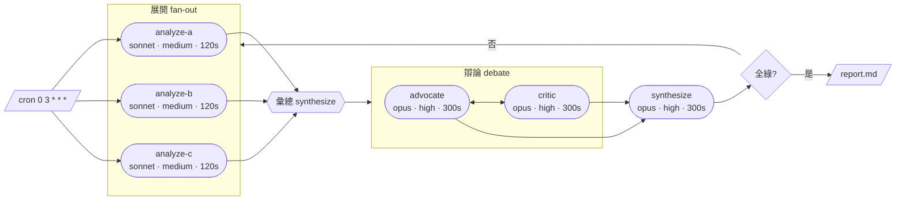
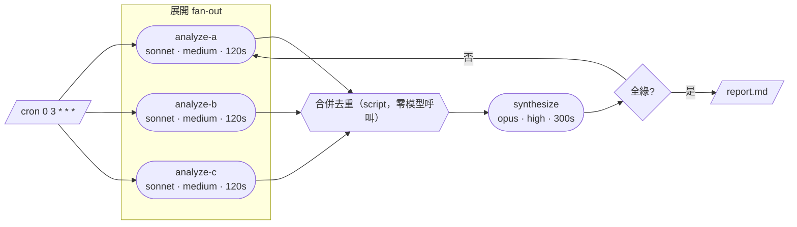

# v24 Gate 1 staging（v23 收官並合併後才貼進 01-requirements.md）

**時機已裁定 [OWNER]:選項 A —— 先收完 v23、合併,再進 v24。**
理由:v23 存活的部分佔多數(describe / skeleton 下架 / 遮蔽 / AUTHORING),而且現在的樹是綠的、
實跑驗證過的;停在最後一關等於丟掉已完成的驗證。analyzer 子系統多活一個 iteration 不影響使用者。

擁有者已裁定 = **[OWNER]**;仍待訪談 = **[OPEN]**。

---

## 一、線圖改由作者提供,移除 analyzer 子系統 [OWNER]

**這反轉 v23 的核心交付,理由成立:作者提供的圖比模型從程式碼反推更正確**,而且沒有模型呼叫、
沒有逾時、沒有小模型畫不出來的問題。

### 規則
- `workflow_register` **必須同時提供 JS 與該 JS 的 Mermaid 圖** —— **一律必填,沒有例外** [OWNER]
- 兩邊都驗:JS 不能 parse → 錯誤;Mermaid 不能 render → 錯誤
- **script 更新時強制重交圖** [OWNER] —— 這是唯一能防止圖與程式碼漂移的機制,因為引擎再也無法自行推導
- Dashboard 顯示該圖
- **移除 `workflow_regenerate_diagram`**（作者交圖,沒有「重新產生」這回事)

### 已知代價(寫進需求,不要靜默承受)
一律必填會讓**動態產生的工作流也必須連圖一起產生**。LLM 產生器有能力同時寫出 script 與 Mermaid,
但這是它多出來的義務,而且**一個「圖畫錯」會擋掉一次「程式碼正確」的註冊**。
擁有者明確選擇一律必填而非「綁觸發器才必填」,理由是一致性優先。

### 刪除清單(v23 剛建、v24 拆除)
`graph-analyzer.ts`(326 行)、`graphAnalyzer` config 區塊(REQ-104 全作廢)、
`describeTriggerBindings` 的 prompt 渲染、`UNBOUND_ENTRY_LABEL`、非同步產生與 reconcile、
誠實缺席狀態機(`diagramStatus: pending|unavailable` 不再需要 —— 註冊時就有圖)。

### 改用途而非刪除
`diagram-gate.ts`:從「驗模型輸出符合 ASCII 詞彙表」→「驗作者的 Mermaid 能 render」。

### 存活
`trigger-bindings.ts`(`triggers` 欄位仍要)、`workflow-view.ts` 投影、skeleton 移除、遮蔽、
`workflow_describe`、`docs/AUTHORING.md`（並擴充:作者現在要交圖)。

### 帳本要記的反轉
這推翻擁有者自己在 v23 Gate 1 的 **A2 裁定**(「全用 ASCII,不做 Mermaid」)。
理由:作者手寫 Mermaid 遠比手寫 ASCII 線圖容易,且 dashboard 有現成渲染。需在需求中說明反轉理由。

---

## 二、觸發器改為「先建立、再由註冊認領」[OWNER]

### 現況(已查證)
三個觸發器存的都只是**工作流名稱字串**,`scheduler.ts:245` 與 `webhook-registry.ts:145`
呼叫 `start({ name })` 時**不帶 version/channel**,所以每次觸發都跑「當下 release 指向的版本」。
建立時檢查 `resolve(name,{channel:'release'})` 通得過(v22 H4),但那是建立時檢查、不是釘選。

→ **觸發是 name 層級、圖是 (name, version) 層級,兩者對不齊**,所以作者寫圖時不可能知道觸發方式。

### 改為
```
webhook_create() / schedule_create()  →  { id }        此時尚無工作流
workflow_register({ script, mermaid, triggers:[id…] })  ← 註冊時認領
沒帶 triggers → 該工作流只能手動執行（workflow_run）    [OWNER]
```
**觸發成為版本化產物的一部分** —— 每一版自己宣告綁哪些觸發器,`workflow_publish` 移動 release 時
生效的觸發集合跟著換。作者在寫圖的當下就知道觸發方式,**圖可以正確畫出入口**。

### 連帶規則 [OPEN — 我的建議,待 Gate 1 訪談確認]
1. **懸空觸發器**:未被任何工作流認領時 fire → **拒絕並記錄**,不得靜默丟棄(現況不可能發生,反轉後會)
2. **獨佔**:一個觸發器只能被一支工作流認領;共用會讓「這個 webhook 會啟動什麼」需要反查
3. **反向清理**:`workflow_deregister` 後觸發器**變回未認領**,不連帶刪除使用者建立的東西

### `workflow_deregister` 回傳觸發器 id [OWNER]
解除註冊時**回傳原本認領的 trigger id 清單**,提示呼叫端(通常是 LLM)記得去刪除。
不自動刪除 —— 那是使用者建立的資源;但也不沉默,否則會留下無人認領的觸發器。

### 必須連帶處理的檢查搬家
反轉後 `schedule_create`/`webhook_create` **不能再檢查工作流解析得出來**(建立時還沒有工作流)。
v22 H4 修的正是那道檢查 —— 它**移到** `workflow_register`(驗 trigger id 存在且未被認領)。
**檢查沒有消失,是換了位置。** 本 iteration 反覆的教訓:檢查搬家時,所有描述舊位置的東西都要跟著搬
（註解、docblock、架構文件、帳本、型別註記 —— v21–v23 已累計十三例)。

---

## 三、工作區工具重整:九個收成六個 [OWNER]

| 新名 | 取代 | 動作 |
|---|---|---|
| `workspace_diff`   | `seed_plan`                          | 給 manifest,回「還缺哪些 sha256」 |
| `workspace_push`   | `blob_put` + `asset_push`            | 上傳 |
| `workspace_pull`   | `workflow_artifact_get`              | 讀回(分頁、有大小上限) |
| `workspace_list`   | `workflow_artifacts` + `asset_list`  | 列出(路徑、大小、sha256) |
| `workspace_delete` | `asset_delete` + **新的部分刪除**     | 刪指定檔案 |
| `workspace_purge`  | 同名保留                              | 清空整個工作區 |

動詞順序講完整條路徑:**diff 看差異 → push 只傳缺的 → pull 取回結果**。

### 作用域:`kind` 與 `runId` 互斥,沒有第三層
```
帶 kind（skill|hook|mcp-config）→ <workRoot>/assets/<kind>/<name>/   工具箱:上傳一次,每次執行都用得到
帶 runId、路徑任意              → <workRoot>/<wf>/<runId>/<path>     工作檯:只有那一次執行看得到
```
兩個都給或都不給 → 型別錯誤。

**已查證、寫進需求避免後人誤解:**
- skill/hook 存在 `assets/` 獨立樹,執行開始時由引擎複製進 `.claude/skills|hooks/`
  (`claude-agent-sdk-client.ts:166-175`)。**`mcp-config` 不在該迴圈** —— 由 harness 直接讀去組設定,
  不落工作區。三種 kind 的行為並不一致。
- **一次執行只有一個工作區,全體 agent 共用**(`runWorkspace(name, runId)` 是 runId 層級;
  `host.ts` 單一 `workspaceRoot`)。**沒有 agent 層作用域**,也**沒有 agent 間隔離**
  ——平行 agent 寫同一檔案會互相覆蓋,引擎不管。既有設計,不是缺陷,但要寫明。
- 兩條寫入路徑對 `.claude/` 的裁決相反但寫的是不同的樹。統一後必須是
  **一份 path-verdict、兩組以目的地為鍵的規則** —— 與 REQ-065 為 inline/CAS seed 做過的事同一原則。

### `workspace_delete` 時機 [OWNER]
**執行中不得變更工作區**,與 `workspace_purge` 一致。

---

## 四、工作區權限模型 [OWNER] —— 安全議題,優先於命名

**查證出的現況:這組工具完全沒有擁有權檢查**,`principal` 根本沒被穿進去:
```
workflow_get(args, { authEnabled, principal })   ← 有身分,會遮蔽
workflow_artifacts(args: { runId })              ← 只有 runId
workflow_artifact_get(args: { runId, path, … })  ← 只有 runId
workspace_purge(args: { runId })                 ← 只有 runId
```
任何通過驗證的呼叫者都能列出、讀取、清空**任何**一次執行的工作區。
**與 v22 H2 同形:遮蔽在一個端點成立,換一個端點就繞過。** v22 花三輪把 `workflow_get` 的 script
遮起來,但工作流跑出來的東西沒遮 —— 而 seed 的用途正是把真實 codebase 送進去。

| 作用域 | 讀 | 寫 / 刪 |
|---|---|---|
| 某次執行的工作區 | **僅啟動該次執行的 principal** | 同左 |
| 資產樹 | 任何通過驗證者(本來就要被所有執行用到) | 僅擁有者 |
| auth 關閉時 | 全開(維持單機操作者現況) | 全開 |

**明確裁定:工作流擁有者「不」能讀別人用他的工作流跑出來的工作區。**
已知代價:擁有者無法直接診斷他人回報的問題,而 REQ-095 正是讓使用者對特定工作流回報問題。
→ 需求要寫明這個取捨,並說明回報者須自行附上必要證據。

### `namespace` 綁 principal [OWNER]
現況 `namespace` 是呼叫者自填字串 —— **那是分區,不是權限**(自我宣告)。
改為從 principal 推導。既有的「不做跨租戶去重」保留(避免變成存在性探測器)。**破壞性變更,需相容期。**

---

## 五、刪除 `chain_create` / `chain_list` [OWNER]

查證後,它與 script 內 `workflow()` 的實質差異只剩「另起獨立 run」與「超過一層巢狀」。
**我先前以為 chain 獨有的「撐得過重啟」是錯的** —— REQ-059/060 保證整個 run 撐得過重啟並重播已完成
的呼叫,行內 `workflow()` 同樣受惠。串接一律寫在 script 的 `workflow()` 裡:條件、重試、傳參都在同一處
可見,不像 chain 是散在引擎側表的隱形連線。

### [OPEN] 連帶後果,Gate 1 訪談需確認
刪掉 chain 後,**`workflow()` 的一層巢狀上限(`NESTING_ERROR`)變成硬限制** —— 現在深鏈可繞道 chain,
之後不行。若有超過兩層的串接需求,該上限須一併放寬,否則是拿掉一個能力而沒補上。

---

## 六、前綴與命名一致化 [OWNER]

### 6a. `run_*`:執行層獨立前綴（7 個)
`workflow_*` 目前同時裝「工作流定義」與「一次執行」兩種實體 —— 與剛修掉的工作區問題**完全同型**。

| 現名 | 新名 |
|---|---|
| `workflow_run` | **`run_start`**（現名讀起來像屬性,它其實是啟動動作) |
| `workflow_status` | `run_status` |
| `workflow_result` | `run_result` |
| `workflow_suspend` | `run_suspend` |
| `workflow_resume` | `run_resume` |
| `workflow_stop` | `run_stop` |
| `workflow_agent_log` | `run_agent_log` |

改完後三個前綴各對應一種實體,**且作用域鍵與前綴一致**:
`workflow_*` ← name｜`run_*` ← runId｜`workspace_*` ← runId 或 kind

### 6b. `workflow_list` 拆分
已驗證 `mcp-facade.ts:302-310` 回傳 `({kind:'workflow'…}) | (RunSummary & {kind:'run'})` ——
兩種欄位集合完全不同的實體塞進同一個扁平陣列,呼叫者拿到第一件事必定是自己分流。
```
workflow_list()                          → 只回工作流
run_list({ workflow?, status?, limit? })  → 只回執行,可篩選
```
**實得不只是乾淨**:現在無法問「這支工作流最近失敗的執行有哪些」,得全部拉回自己過濾 ——
而那正是最常見的診斷動作。

### 6c. `workflow_get` → `workflow_source`
名字的暗示與實際相反:`get` 聽起來比 `describe` 更基本、更該先用,但它是**需要擁有權**的特權檢視。
`workflow_source` 把「要權限」寫進名字。順帶:非擁有者的 `scriptWithheld:true` 應加一句指向
`workflow_describe`,讓被擋下的呼叫者知道該去哪。

### 6d. `issue_comments` → `issue_get_comments` [OWNER]
**現況是真正的危險,不只是不好看**:`issue_comments`(讀)與 `issue_comment`(對 GitHub 發文)
差一個 `s`,LLM 挑錯的代價是在別人的 issue 下留言。
```
issue_comments → issue_get_comments   讀,並新增分頁參數 [OWNER]
issue_comment  → issue_comment_post   寫,動詞明示副作用
```
**新增參數**:取最新 N 筆 / 最近更新 N 筆 —— 長討論串一次全讀浪費 token。

### 不動的兩項(已評估)
- `schedule_setEnabled` 駝峰與其他全小寫不一致(也正是架構文件把 40 數成 39 的原因)——
  改名收益低於破壞成本,**只修文件計數**。
- `workflow_trigger` 表面像 `run_start` 的重複,但它額外檢查常駐排程存在且啟用
  （停用回 `SCHEDULE_DISABLED`),語意不同,**保留**（隨 6a 更名為 `run_trigger`)。

---

## 七、工具總數

```
現況                                    40
− chain_create, chain_list              −2
− workflow_regenerate_diagram           −1
工作區 8 個 → 6 個                       −2
+ run_list（自 workflow_list 拆出)       +1
────────────────────────────────────────────
v24 後                                   36
```
其餘皆為更名,不影響數量。

---

## 八、破壞性變更與相容期

第一至第六項**全部**是破壞性的(改名、加權限、刪工具、註冊多一個必填欄位),
與 v22 關掉 inline script 同一類。**建議同一個 iteration 一次做完** —— 分批就要多段相容期與多輪
Gate 7.5 實跑。需求須指定舊名相容期與其終止條件。

---

## 九、v24 最終工具表(36)——**驗收標準:LLM 僅憑 MCP schema 就能正確使用,不需要 skill**

### 工作流定義（6）— 鍵是 `name`
| 工具 | 必要輸入 | 輸出 | 描述 |
|---|---|---|---|
| `workflow_register` | `name`, `script`, `mermaid` | `{version}` | 註冊/更新具名工作流。**`mermaid` 必填**:該 script 的流程圖,render 不過即拒。可選 `triggers[]`(先建立的觸發器 id;不帶 = 只能手動執行)、`defaults`、`params`。首位註冊者成為擁有者。錯誤:`PARSE_ERROR`／`MERMAID_INVALID`／`UNKNOWN_ALIAS`／`MCP_NOT_PROVISIONED`／`TRIGGER_NOT_FOUND`／`TRIGGER_ALREADY_CLAIMED`／`NOT_WORKFLOW_OWNER` |
| `workflow_deregister` | `name` | `{removed, releasedTriggers[]}` | 移除工作流。**回傳原本認領的觸發器 id,提示你去刪除** —— 引擎不代刪使用者建立的資源。錯誤:`NOT_WORKFLOW_OWNER` |
| `workflow_publish` | `name`, `version`, `channel` | `{}` | 把 `beta`／`release` 指標移到已註冊的某版本。**註冊不等於發布**;未發布的 channel 被解析時回 `CHANNEL_UNPUBLISHED` |
| `workflow_describe` | `name` | 公開解釋面 | **任何人可讀、無 script**。回傳用途、解析出的 `(version, resolvedBy)`、`channels`、`versions`、`params`(含引擎上限)、`lockedKeys`、`triggers`(現行綁定)、`mermaid`、`owner`、`reportProblem`。可選 `version`／`channel` 選擇版本 |
| `workflow_source` | `name` | 完整檢視含 `script` | **需擁有權**。非擁有者得到 `scriptWithheld:true` 並被指向 `workflow_describe` |
| `workflow_list` | （無） | 工作流陣列 | 只回工作流(不含執行)。每筆:`name`／`version`／`channels`／`description`／`params` |

### 執行（9）— 鍵是 `runId`
| 工具 | 必要輸入 | 輸出 | 描述 |
|---|---|---|---|
| `run_start` | `name` | `{runId}` | 啟動已註冊工作流的一次執行。可選 `args`、`version`／`channel`(預設 release)、`seed`／`seedManifest`／`seedNamespace`／`seedRef{repoUrl,sha}`、`overrides{model,effort,timeoutMs,appendPrompt}`(僅這四個可調,其餘為引擎所有) |
| `run_status` | `runId` | 狀態視圖 | 生命週期(`queued`／`running`／`suspended`／`stopped`／`completed`／`failed`)+ phases + 各 agent 紀錄(含 provider／model／效力參數來源) |
| `run_result` | `runId` | script 回傳值或錯誤 | 只有終結的執行才有值 |
| `run_suspend` | `runId` | `{}` | 中止進行中的 agent 呼叫、停沙箱,狀態保留 |
| `run_resume` | `runId` | `{}` | 續跑。**已完成的呼叫從 journal 重播、不重呼叫模型**;撐得過引擎重啟 |
| `run_stop` | `runId` | `{}` | 永久停止並終結沙箱 |
| `run_agent_log` | `runId`, `agentId` | 逐字事件 | 單次 agent 呼叫的轉錄。**秘密值在落地前已換成 `‹secret:NAME›`** |
| `run_list` | （無） | 執行摘要陣列 | 可選 `workflow`／`status`／`limit` 篩選 —— 「這支工作流最近失敗的執行」用這個 |
| `run_trigger` | `workflow` | `{runId}` | 立即觸發常駐排程的工作流。已停用回 `SCHEDULE_DISABLED` |

### 工作區（6）— `runId` 與 `kind` **互斥**
| 工具 | 必要輸入 | 輸出 | 描述 |
|---|---|---|---|
| `workspace_diff` | `manifest[]` | `{missing[]}` | 給 `[{path, sha256}]`,回**還缺哪些 sha256**。大型 codebase 先問再傳,只傳缺的 |
| `workspace_push` | `runId`+`path`+內容 ｜ `kind`+`name`+內容 | `{}` | 上傳。帶 `runId` = 該次執行的工作檯;帶 `kind`(`skill｜hook｜mcp-config`) = 跨執行的工具箱。伺服器**對收到的位元組自算雜湊並以之儲存**,與宣告不符回 `BLOB_HASH_MISMATCH` 且不存 |
| `workspace_pull` | `runId`, `path` | `{contentB64, eof}` | 分頁讀取(推進 `offset` 直到 `eof`),有大小上限。路徑逃逸被拒 |
| `workspace_list` | （無;`runId` 或 `kind` 擇一） | 檔案陣列 | `{path, size, sha256}`。有 sha256 才能在本地比對哪些真的變了 |
| `workspace_delete` | `runId`+`paths[]` ｜ `kind`+`name` | `{deleted[]}` | 刪指定檔案。**執行進行中拒絕** |
| `workspace_purge` | `runId` | `{}` | 清空整個工作區(紀錄與轉錄保留)。**僅限已終結的執行** |

> 權限:執行工作區**僅啟動者可讀寫**;資產樹任何人可讀、僅擁有者可寫。auth 關閉時全開。

### 觸發器（7）— 先建立、再由 `workflow_register` 認領
| 工具 | 必要輸入 | 輸出 | 描述 |
|---|---|---|---|
| `schedule_create` | `cron` ｜ `at` ｜ `resident` 之一 | `{id}` | 建立排程,**尚未綁定任何工作流** —— 把回傳的 `id` 填進 `workflow_register.triggers` |
| `schedule_list` | （無） | 排程陣列 | 含 `enabled`／`nextFire`／`lastFire`／`lastRunId`／`claimedBy`(認領它的工作流,或 null) |
| `schedule_delete` | `id` | `{}` | 刪除排程 |
| `schedule_setEnabled` | `id`, `enabled` | `{}` | 停用/啟用而不刪除 |
| `webhook_create` | （無） | `{webhookId, url, secret}` | **`secret` 只顯示這一次**。外部以 `X-RWE-Signature`(sha256 HMAC)POST 到 `url`。同樣尚未綁定,把 `webhookId` 填進註冊 |
| `webhook_list` | （無） | webhook 陣列 | 只給 `secretFingerprint`,永不回傳 secret;含 `claimedBy` |
| `webhook_delete` | `id` | `{}` | 刪除 webhook |

### 問題回報（5）
| 工具 | 必要輸入 | 輸出 | 描述 |
|---|---|---|---|
| `issue_report` | `title`, `body` | `{number, url}` | 把已分析的問題寫成 GitHub issue。可選 `workflow` 綁定來源工作流 |
| `issue_get` | `number` | issue 本體 | `{number, title, state, labels, body, url, commentCount}` |
| `issue_list` | （無） | issue 陣列 | 可選 `state`(預設 open)／`limit`(預設 30) |
| `issue_get_comments` | `number` | 留言陣列 | **可選 `latest`／`since`／`limit`** —— 長討論串一次全讀浪費 token,預設只取最近數筆 |
| `issue_comment_post` | `number`, `body` | `{commentId, url}` | **有副作用:對 GitHub 發文** |

### 環境（3）
| 工具 | 必要輸入 | 輸出 | 描述 |
|---|---|---|---|
| `models_list` | （無） | 模型目錄 | 跨供應商統一:精選別名 + 即時 Ollama + 即時 OpenRouter + 靜態表。每筆含 `capability`／`stability`／`modalities{in,out}`／`contextWindow`／`price`／`costLevel`(0–10)／`toolUse`／`location`。**絕不含任何金鑰**。可依 provider／模態／價格／context／工具支援篩選 |
| `mcp_provision` | `name`, `config` | `{}` | **先實際探測再登錄**,探不到即拒且不留痕。登錄後的名稱才能被 `agent({mcp})` 引用 |
| `system_info` | （無） | 主機快照 | CPU／記憶體／磁碟／行程。排重運算前先看餘裕 |

---

## 十、Advisor 審查後的修正（用「冷啟動 LLM 只拿 tools/list 走一遍典型旅程」推演)

### 10.1【阻斷,我的設計錯誤】workspace 作用域不能用「kind XOR runId」一句話帶過
第九章那句口號**走不通它自己宣傳的旅程**:播種是 `diff → push → run_start`,
**push 發生時 runId 根本還不存在**;執行中已裁定不得變更;終結後 push 沒有意義。
現行 `blob_put` 本來就**不帶 path、不帶 runId** —— path 活在交給 `run_start` 的 manifest 裡。
runId 模式的 push 是我把全域規則過度一般化**發明出來的新能力**,而且直接牴觸不可變性裁定。

**改為逐工具的模式表(取代「kind XOR runId」):**
| 工具 | 模式 A | 模式 B |
|---|---|---|
| `workspace_push` | `{sha256, contentB64}` — CAS,namespace 由 principal 推導,**無 path、無 runId** | `{kind, name, 內容}` — 資產 |
| `workspace_diff` | 僅 CAS,**無作用域參數**（描述明說:比對對象是你自己的 CAS 池,由身分推導) | — |
| `workspace_list` | `{runId}` 執行工作區 | `{kind}` 資產 |
| `workspace_pull` | `{runId, path}` | — |
| `workspace_delete` | `{runId, paths[]}` **僅終結後** | `{kind, name}` |
| `workspace_purge` | `{runId}` | — |

### 10.2【阻斷】撰寫知識在 schema 裡沒有家 —— 而那正是驗收標準本身
冷客戶端從 register 的 schema 知道要交 `script` 與 `mermaid`,但**不知道 script 有什麼 API**。
- `script` 參數描述必須帶:沙箱 API 全清單(`agent` / `parallel` / `pipeline` / `phase` / `log` /
  `args` / `budget` / `workflow`)、`meta` 形狀(`{name, description, phases, params:{knobs,args}}`)
  與一個 `meta.params` 範例、以及 REQ-106 的四條撰寫規則
- `mermaid` 參數描述必須帶:**「render 得過」由哪個解析器判定**、內容規則
先例:#24 把 DSL 寫進工具描述、REQ-106 把四條規則放進 `workflow_register.script` 描述;
本 repo 也已有超長工具描述(`workflow_get`)。一致,不是新做法。

### 10.3【阻斷】register → run 的頭號陷阱沒寫在會撞到它的地方
新客戶端最常見的第一條路是 register 完直接 `run_start` → 撞 `CHANNEL_UNPUBLISHED`(註冊不發布)。
這句話目前只在 `workflow_publish` 那列。**`run_start` 自己必須列錯誤碼並帶解法**:
「剛註冊的工作流沒有 release —— 先 `workflow_publish`,或帶 `{version}`」。
同列還缺**等待模式**:「輪詢 `run_status` 至終結,再 `run_result`」—— 沒有阻塞式呼叫,schema 不說就不會知道。

### 10.4【系統性】跨工具指標與 errors 推成通則
- **每個工具一行 `errors:`** —— 現在只有 register 有,推成通則
- 每個依賴別的工具的描述要**指名對方**:
  `run_start` →「可調參數先查 `workflow_describe`」;
  `schedule_create`/`webhook_create` →「把 id 填進 `workflow_register.triggers`」(已有,保留);
  `run_trigger` →「需要一個已被認領的 resident 排程」

### 10.5【OPEN — 需擁有者裁定】A3「只畫結構、秘密不入圖」的命運
A3 是綁在 **analyzer 輸出**上的裁定。作者自供 mermaid 後,合理替代大概是
「作者自己的責任,寫進 AUTHORING.md;非擁有者可見性照舊」——
但 **A2 的反轉已記錄、A3 的還沒**。本帳本自己的規矩:被取代的裁定要記,不是蒸發。

### 10.6【驗收方式】這條需求的 Gate 7.5 是冷模型探針,不是描述審查
「LLM 僅憑 schema 能用」是**可測的**,寫進 acceptance:
給一個**沒有本對話脈絡**的模型,只有 `tools/list`,要它完成三條典型旅程 ——
(a) register + publish + run + result;(b) 大 repo 播種;(c) 綁 webhook。
與 REQ-104「只有真跑算數」同一教義。**任何看過本對話的審查者(含 advisor 與我)都不是合格受試者。**

### 10.7 小項
`issue_get_comments` 的 `latest`(筆數)與 `since`(時間戳)語意重疊 —— **擇一為主**,另一個若保留須說明優先序。

---

## 十一、後續裁定（擁有者,本輪對話)

### 11.1 A3 的處置 [OWNER]
A3(只畫結構、秘密不入圖)原本綁在 analyzer 輸出上。作者自供 mermaid 後,
**改為作者責任,寫進 `docs/AUTHORING.md`;非擁有者可見性照舊**（圖是公開的)。
[記錄用]:A2 的反轉已記於第一章,A3 的處置記於此 —— 被取代的裁定要記,不是蒸發。

### 11.2 `issue_get_comments` 只留 `latest` [OWNER]
去掉 `since`,避免筆數與時間戳兩套語意重疊。預設只取最近數筆。

### 11.3 `workflow_deregister` 不連帶刪除觸發器 [OWNER — 原 [OPEN] 結案]
回傳 `releasedTriggers[]` **僅作提醒**,讓呼叫端(通常是 LLM)知道有相依觸發器待刪。
引擎不代刪使用者建立的資源,也不沉默。

### 11.4 巢狀上限維持一層,**不放寬** [OWNER — 原 [OPEN] 結案]
**查證:Claude Code 的 dynamic workflow 也是一層**（其 `workflow()` 說明原文:
"Nesting is one level only: `workflow()` inside a child throws.")。RWE 與參考實作對齊,不是任意限制。

**擁有者提出的正解:需要多層時「攤平」——** 讀取被呼叫工作流的 script,合併成同一層。
理由是決定性的:**這樣才畫得出 mermaid。** 若 `release` 把 `deploy` 當黑箱,它的圖只有兩種畫法,
兩種都壞:畫成不透明節點 → 圖等於沒說話;把 deploy 內部畫進來 → deploy 一改,release 的圖默默過時,
而引擎無從偵測(正是「改 script 強制重交圖」要防的事)。
**攤平後 script 與圖的範圍一致**,矛盾消失。

→ 我先前主張「刪 chain 就要放寬上限」是**錯的方向**:放寬會讓圖與程式碼的範圍脫鉤。維持一層是對的,
且**刪掉 `chain_*` 沒有能力損失** —— 深鏈的正解是攤平,不是繞道。

**邊界(與 v22 遮蔽一致,無需新規則):**
| `deploy` 是誰的 | 能否攤平 | 圖怎麼畫 |
|---|---|---|
| 自己的 | ✅ 讀 `workflow_source` 攤平 | 完整流程 |
| 別人的 | ❌ 讀不到 script | 當黑箱畫成一個節點 —— **誠實,因為對你它就是黑箱** |

**但非擁有者仍看得到對方的 mermaid**（`workflow_describe` 公開)[OWNER 明確要求]:
「不能讀 system prompt,但可以知道大概怎麼走」。所以畫黑箱節點時不是瞎畫。

`docs/AUTHORING.md` 須教這三件事:需要多層時攤平;呼叫他人工作流時畫成黑箱節點;
攤平是可見的複製貼上 —— 上游修好 bug 不會自動同步,需重新攤平(代價明說,不粉飾)。

### 11.5【新發現,待擁有者裁定 [OPEN]】寫死的 model 在執行前不可見 —— 使用者會直接損失金錢
**區別在作者把 model 寫在哪:**
```
script 裡 agent({ model:'opus' })   → 寫死,使用者 override 蓋不過（per-call opts 優先序最高)
註冊 defaults / meta.params.default → 預設,使用者 override 蓋得過
```
**缺口:`workflow_describe` 只回宣告的 `params` 與六個「引擎」鎖定鍵,不會說「第 3 個 agent 的
model 被作者寫死」** —— 那在 script 裡,非擁有者讀不到。實際會發生:
```
describe → 看到 model 可調 → run_start({overrides:{model:'haiku'}}) → 無任何錯誤
                          → 寫死 opus 的 agent 照樣用 opus → 帳單不是那麼回事
```
**這是「宣告 ≠ 強制執行」第四例**（同類:v23 Gate 8 的 A4 —— `type:'string'` 的 `min`/`max` 是死的
卻照樣端給使用者看)。目前唯一發現方式是**事後**查 `provenance`（分 call/agentType/override/default/
engine 五級,掛在 harness descriptor,經 `run_agent_log` 可見)—— 但那是花完錢之後。

**建議修法**（小):註冊時靜態掃 `agent()` 的 opts,在 `describe` 的每個旋鈕加計數 ——
```
params.knobs.model = { type:'string', default:'sonnet', pinnedAtCalls: 3, totalCalls: 7 }
```
**只回數量,不回哪些 agent、不回寫死成什麼**（那些屬遮蔽範圍)。
「你的 override 對其中 3 個不生效」這個事實,使用者有權在花錢前知道。
作者若要完全鎖住,`meta.params` 本就可以不宣告該旋鈕;但**一旦宣告,契約就該誠實反映實際可調範圍**。

---

## 十二、逐 agent 的參數契約 [OWNER] —— 取代第十一章 11.5 的「計數」提議

**擁有者明確要求**:作者寫出**不寫死、可調整**的 script;**每個 agent 的每個可調項都要有預設值**;
使用者再依**當前可用模型**與自己的任務,微調 effort / timeout 等**所有 harness 可調參數**。
**所有可調的部分都是每個 agent 各自設定,不是整支工作流吃同一個值。**

**擁有者明確否決**:上傳 subagent 定義的功能(我先前的提議,撤回)。

### 12.1 形狀:值住在 meta,script 只有名字
```js
export const meta = {
  params: {
    agents: {
      analyze: { model: { type:'string', default:'sonnet' },
                 effort: { type:'enum', enum:['low','medium','high'], default:'medium' },
                 timeoutMs: { type:'number', default:120000 } },
      review:  { model: { type:'string', default:'opus' },
                 effort: { type:'enum', enum:['low','medium','high'], default:'high' } },
    }
  }
};

agent(prompt, { label: 'analyze' });   // 只有名字,沒有任何值
agent(prompt, { label: 'review'  });
```
```
run_start({ overrides: { agents: {
  analyze: { model: 'haiku' },                   // 該模型下線,使用者自己換
  review:  { effort: 'low', timeoutMs: 60000 },  // 這次不需要那麼重
}}})
```
四個可調項(`model` / `effort` / `timeoutMs` / `appendPrompt`)**全部逐 agent**。

**識別鍵沿用既有的 `label`** —— `AgentOpts.label` 已存在(`types.ts:45`)且已流進 transcript 與
dashboard,不需要發明新概念。

### 12.2 要改的三處(已查證現況)
1. **`effort` / `timeoutMs` 目前沒有 per-agent 層。** `resolve.ts:74` 原文:這兩個是
   `call › snapshot › engine`,只有 `model` 有中間(agentType)層。要補。
2. **`AgentOpts` 要禁掉值、只留名字。** 現在同時有 `label` 與 `model`/`effort`/`timeoutMs` ——
   後三者就是要禁止的寫死。**註冊時靜態掃到即拒**,錯誤訊息指向 `meta.params.agents`。
   (這取代第十一章 11.5 的「計數」提議 —— 擁有者不接受計數,理由是「還是不知道是哪一個」;
   禁止之後不存在「哪一個」的問題。)
3. **`overrides` 從扁平改為逐 agent**:`overrides.agents.<label>.<key>`。
   舊的扁平形狀可留作「套用到所有 agent」的簡寫,但那是相容期的事。

### 12.3 [OPEN] 兩個待確認
- **`label` 對「有宣告 params 的 agent」是否必填?** 現在是選填;要當參數鍵就必須有,否則對不起來。
- **同一 label 用在兩個 `agent()` 呼叫**目前合法(label 本來只是顯示用)。那時兩者共用同一組設定 ——
  這可能正是所要(同一角色跑兩次),但要寫明。

### 12.4 連帶:`workflow_describe` 的 params 改形狀
不再是四個旋鈕,而是**每個 agent 一組**。使用者一眼看到「這支工作流有 analyze 與 review,
各自能調什麼、預設是什麼」。這也讓 v24 的驗收標準(僅憑 schema 可用)在參數這一層真正成立。

### 12.5 對稱性要寫進 guide
`model` / `effort` / `timeoutMs` / `appendPrompt` —— **使用者最終決定**
`prompt` / `tools` / `skills` / `mcp` / `workdir` / `cwd` —— **作者決定,使用者永不可改**
不對稱是刻意的:前者是資源與品質的取捨,後者是安全邊界。

### 12.6 v23 的教訓,直接適用於 `workflow_authoring_guide`（裁定 #9)
`AUTHORING.md` 的 params 範例曾經**教出引擎會拒絕的寫法**,由 Gate 7.5 validator
**實際對活引擎執行**才發現,不是讀出來的。
→ **`workflow_authoring_guide` 交付時,它給出的每一個範例都必須有測試實際註冊過。**
否則同一個缺陷會以更大規模重演(那份 guide 的範例會多得多)。

---

## 十三、參數對照表（`workflow_authoring_guide` 必須逐項說明)

### 13.1 使用者**可以**調的 —— 四項,逐 agent
| 參數 | 預設值寫在哪 | 使用者怎麼改 | 引擎上限 |
|---|---|---|---|
| `model` | `meta.params.agents.<label>.model.default` | `run_start({overrides:{agents:{<label>:{model}}}})` | 必須是已知別名或 `openrouter/<id>`,否則 `UNKNOWN_ALIAS` |
| `effort` | `…<label>.effort.default` | 同上 | `maxEffort`（預設 `high`) |
| `timeoutMs` | `…<label>.timeoutMs.default` | 同上 | `maxTimeoutMs`（預設 600000) |
| `appendPrompt` | `…<label>.appendPrompt.default` | 同上 | `maxAppendPromptBytes`（預設 1024);內容被包進 `<user-instructions untrusted="true">`,偽造關閉標記會被 `PARAM_OUT_OF_RANGE` 擋下 |

### 13.2 使用者**不能**調的 —— 六個鎖定鍵(`contract.ts:8`)
| 參數 | 寫在哪 | 為什麼鎖 |
|---|---|---|
| `prompt` | `agent(prompt, …)` 的第一個引數,在 script 裡 | **它就是工作流的邏輯本身** —— 可改就等於改寫工作流 |
| `tools` | `meta` 或 agentType frontmatter | 工具面是安全邊界 |
| `skills` | 同上 | 同上 |
| `mcp` | 同上(且須先 `mcp_provision` 探測通過) | 同上 |
| `workdir` | **引擎計算**(`workflow-catalog.ts:627` `runWorkspace(name, runId)`) | 隔離邊界,不接受外部指定 |
| `cwd` | 同上 | 同上 |

送進任何一個 → `PARAM_LOCKED`。**使用者連試都不行,不是靜默忽略。**

### 13.3 什麼時候吃預設、什麼時候吃修改值
```
使用者 overrides 有給該 agent 的該鍵 → 用它，但先與引擎上限取交集
                    ↓ 沒給
meta.params.agents.<label>.<key>.default → 用它，同樣先收斂
                    ↓ 沒宣告 default
引擎預設（model：預設別名；effort/timeoutMs：引擎值）
```
**上限永遠最後套用** —— 使用者給 `timeoutMs: 999999999` 不會報錯地變成 600000?
**不會** —— 超過上限是 `PARAM_OUT_OF_RANGE`,明確拒絕,不靜默截斷。(這點 guide 要寫清楚,
因為「收斂」與「拒絕」是兩種行為,v23 的 A4 就是栽在把兩者搞混。)

### 13.4 這些全部要在 `workflow_authoring_guide` 裡 [OWNER 要求]
13.1–13.3 三張表 + 對稱性說明(可調的是資源與品質取捨,鎖定的是安全邊界與工作流邏輯)。

---

## 十四、Mermaid 規格 —— 讓 LLM 產出的圖格式一致 [OWNER 要求]

**目標**:一眼看出**辯論 / 展開 / 彙總**,且每個 agent 標註它可調的 harness 參數。

### 14.1 節點形狀詞彙(固定,不得自創)
| 形狀 | 語法 | 意義 |
|---|---|---|
| 平行四邊形 | `[/"…"/]` | **觸發方式**（入口)或**最終產出**(出口) |
| 圓角 | `(["…"])` | **一個 agent** |
| 菱形 | `{"…"}` | 條件分支 |
| 六角 | `{{"…"}}` | **彙總/join 節點** |

### 14.2 agent 節點的標籤格式(固定三行)
```
(["<label><br/>model · effort · timeoutMs"])
```
例:`(["analyze<br/>sonnet · medium · 120s"])`
→ **每個 agent 的可調參數直接寫在節點上**,使用者看圖就知道能調什麼、現在是什麼。

### 14.3 三種流程模式的固定畫法

**規則:**
- **fan-out / fan-in 的邊必須逐條寫開**（`TRIG --> A1` / `TRIG --> A2` …),
  **不得用 `TRIG --> A1 & A2 & A3` 收合** —— 收合會讓 mermaid 把分支疊在一起,看不出「錯開」的展開結構。
- **展開**用 `subgraph` 包起來,標題含「展開」;**辯論**同理標題含「辯論」,成員之間用 `<-->` 雙向邊。
- **彙總**必用六角 join 節點,不得讓多條邊直接進同一個 agent —— join 節點是「這裡收斂」的視覺錨點。
- **迴圈**用回邊加標籤(`CHK -->|否| FANOUT`)。
- **跳過/捨棄**用虛線 `-.->`。

### 14.4 註冊時可機械驗證的三條(取代已移除的 analyzer)
1. **render 得過**（v24 已定)
2. **script 裡每個 `agent({label})` 的 label,都必須在圖中有一個對應節點** ——
   這是**取代 analyzer 的抗漂移機制**:作者加了 agent 卻沒更新圖,註冊就被拒
3. **每個 agent 節點的標籤必須符合 14.2 的三段格式** —— 否則可調參數不會出現在圖上

前兩條是實質的,第三條是格式的。三條都在註冊時檢查,錯誤訊息指向 `workflow_authoring_guide`。

### 14.5 [OPEN] 一個取捨
第 2 條會讓「圖與 script 的 agent 集合必須完全一致」。好處是不可能漂移;
代價是作者每加一個 agent 都得改圖(這正是「改 script 強制重交圖」的必然結果,一致)。
若覺得太嚴,可放寬成「圖中的 agent 節點必須是 script label 的子集」——
但那就允許漏畫,失去抗漂移的意義。**建議維持嚴格。**

---

## 十四之修正 [OWNER] —— 彙總的畫法:六角形只給「非 agent 彙總」

**擁有者指出 14.3 的規則錯誤,成立。** 我原本寫「彙總必用六角 join 節點,不得讓多條邊直接進同一個
agent」,但我自己的範例同時放了 `JOIN{{"彙總 synthesize"}}` **和** `SYN(["synthesize…"])` ——
**同一件事畫了兩個節點**,而且把「整合者其實是一個 agent、有自己的可調參數」藏了起來。

### 修正後的規則:形狀回答「這一步要不要花模型呼叫」
| 彙總方式 | 畫法 | 對應的 script |
|---|---|---|
| **agent 彙總**（一個 agent 讀全部輸出並整合) | fan-in 的邊**直接收進該 agent 的圓角節點**,不加六角形 | `const rs = await parallel([…]); await agent(prompt + rs, {label:'synthesize'})` |
| **非 agent 彙總**（script 層合併/去重/過濾) | **六角形** `{{"…"}}`,因為沒有 agent 節點可掛 | `const merged = rs.filter(Boolean).flat()` |

**為什麼這個區分有價值**:讀圖的人一眼分辨「三路 fan-out 後直接進 agent」(收斂與整合是同一次模型呼叫)
與「先經六角形合併再進 agent」(合併免費,之後才花一次)。

**而且它對應真實結構**:六角形代表的東西**不會出現在 `run_agent_log`、沒有 model/effort/timeout
可調**;agent 節點三者都有。形狀差異剛好對應可觀測性與成本的差異。

### 14.3 的範例據此改寫

若該工作流的彙總**是**由 agent 直接讀三路輸出(沒有 script 層合併),則刪掉 `DEDUP`,
三條邊直接進 `SYN` —— **少一個節點,而且誠實**。

---

## 十五、三角色權限模型 [OWNER]

**現況(已查證):引擎沒有任何角色概念。** `grep role|isAdmin|admin` 在 `src/` 與 `src/auth/` 零命中。
而 `mcp_provision` 的工具描述自稱 **"Admin tool"**,`case 'mcp_provision'` 卻**沒有任何權限檢查** ——
「宣告 ≠ 強制執行」第十五例,而且這次寫在**對外的工具描述**上,呼叫端會據以相信它受保護。

### 15.1 三個角色
| 角色 | 能做什麼 |
|---|---|
| **管理者 admin** | 全部權限 |
| **編排者 author** | 撰寫自己的工作流;使用已註冊的工作流與自己的工作流 |
| **使用者 user** | 只能使用已註冊的工作流 |

### 15.2 逐工具對照
| 工具 | user | author | admin |
|---|---|---|---|
| `workflow_list` / `workflow_describe` | ✅ | ✅ | ✅ |
| `run_start` / `run_status` / `run_result` / `run_suspend` / `run_resume` / `run_stop` / `run_agent_log` / `run_list` / `run_trigger` | ✅ 自己啟動的 | ✅ | ✅ 全部 |
| `workspace_*`（執行工作區) | ✅ 自己啟動的 | ✅ 自己啟動的 | ✅ 全部(見 15.4 待裁) |
| `models_list` / `system_info` | ✅ | ✅ | ✅ |
| `issue_*` | ✅ | ✅ | ✅ |
| `workflow_register` | ❌ | ✅ | ✅ |
| `workflow_deregister` / `workflow_publish` / `workflow_source` | ❌ | ✅ **僅自己擁有的** | ✅ 全部 |
| `schedule_create` / `webhook_create` + list/delete | ❌ | ✅ 僅自己建立的 | ✅ 全部 |
| `workspace_push({kind})`（資產樹) | ❌ | ✅ | ✅ |
| `mcp_provision` | ❌ | ❌ | ✅ **（現在完全沒擋)** |

**注意 `hook` 資產已由構造擋掉**（`server.ts` 註解:"a `hook` is rejected by construction
(never materialized, closes the arbitrary-server-side-code vector)"),所以 author 能推的資產
只有 `skill` 與 `mcp-config`,不含可在引擎主機執行的東西。這個既有防線與角色模型正交,兩者都要保留。

### 15.3 設定檔形狀(先用手動編輯,[OWNER])
```json
{
  "principals": {
    "alice@example.com": { "role": "admin" },
    "bob@example.com":   { "role": "author" },
    "*":                 { "role": "user" }
  }
}
```
**auth 關閉時全員視為 admin** —— 維持單機操作者的現況,與既有的「auth 關閉即全開」一致。

### 15.4 [OPEN] 三個必須裁的邊界
1. **admin 能不能讀別人執行的工作區?** 第四章已裁「僅啟動者可讀」,連工作流擁有者都不行。
   admin 若要能讀(診斷用)就是那條規則的例外 —— **例外要明寫,不能靠「admin 當然可以」默認**。
   而 seed 的用途正是把真實 codebase 送進去,所以這是實質的隱私決定。
2. **未列在設定檔的已驗證身分,預設是哪個角色?** 上例用 `"*": user`。
   另一個選擇是**預設拒絕**（未列出即無權限)—— 安全但每個新帳號都要先加設定。
3. **角色與擁有權的關係**:author 擁有自己註冊的工作流;admin 是否**繞過**擁有權閘門
   (可 deregister/publish 別人的)?表中我暫記為可以,但這讓「擁有者」在 admin 面前失去意義,需確認。

### 15.5 實作起點
`resolvePrincipal` 已在 `/mcp` dispatch 解析出身分(v22 H1 的修復把它接進三個 catalog 寫入)。
角色只需在其後多一層查表:`principal → role`,再由每個 case 依 15.2 檢查。
**不需要新的認證機制** —— 只是把已經解析出來的身分,對應到一張手動維護的表。

---

## 十六、工具收斂與 workflow_list 的可執行性 [OWNER]

### 16.1 移除 `run_trigger` [OWNER]
查證後它與 `run_start` 的實質差別只有兩點:
```
若「存在常駐排程且該排程被停用」→ 拒絕 SCHEDULE_DISABLED（沒有常駐排程時照樣啟動)
startedBy 標成 {type:'schedule'} 而非手動
```
**移除是對的,理由比「重複」更好**:停用一個排程的語意是「別再自動觸發」,不是「禁止人手動執行」
（一般 cron 系統即如此);而把人手動按下的執行標成 `schedule` 是**謊報**,移除後如實標為手動,
**可觀測性反而變準**。

### 16.2 `mcp_provision` 併入 `workspace_push({kind:'mcp'})` [OWNER]
**注意這不只是搬家,是收掉一個既有重複**:`asset_push` 的 kind 本來就含 `mcp-config`,
與 `mcp_provision` 並存 —— 一個存檔案、一個進登錄表。合併後只剩一條路。

- **保留探測** [OWNER]:推的時候先實際連一次,連不上即拒且不存。
  介面統一了,`mcp_provision` 原本「已登錄的名稱都曾經真的活著」的保證不能丟。
- **權限:管理者與編排者都可推** [OWNER]（不同於我原本建議的管理者專屬)。
- 產出 `mcp.json` 進工作區。

### 16.3 `workflow_list` 要能分辨可執行與否 [OPEN — 我從擁有者的提問延伸,非其指示]
**查證(`workflow-catalog.ts:602-603` 的註解原文)**:列表回的是**所有已註冊的名稱,含未發布的草稿** ——
「a draft with no channel is still visible in the listing, just not runnable by name yet」。
版本欄描述 release 指向的版本,沒發布就用 beta,都沒有就用最新註冊的。

**在 v24 的角色模型下這會咬人**:使用者只能跑已發布的,卻在列表看到跑不動的草稿,點下去撞
`CHANNEL_UNPUBLISHED`。

建議:每筆加 `runnable: boolean`（release 有指向即 true),`workflow_list` 接 `onlyRunnable?`;
**使用者角色預設只看 runnable**,編排者與管理者看全部(草稿是他們的工作中產物)。

---

## 十七、【查證發現】追溯目前不涵蓋「誰上傳」—— 與 16.2 的開放綁在一起 [OPEN]

擁有者裁定 16.2 開放給編排者時的理由是「真的違規,系統的 traceability 應該都有紀錄是誰上傳、
是哪個 workflow 導致的」。**查證後,前半不成立:**

```
mcp_provisions 表:  name │ kind │ config │ healthy │ provisionedAt
                                                     ↑ 只有「何時」,沒有「誰」
asset_push 的 case:  完全沒有取用 principal
                     asset-sync.ts 中 principal / owner / pushedBy 零命中
```

| 事項 | 有紀錄嗎 |
|---|---|
| 哪個工作流用了某個 MCP | ✅ script 的 `agent({mcp})` + 工作流有 `owner` |
| 哪次執行用了它 | ✅ `startedBy` + harness descriptor |
| **誰上傳了那個 MCP 設定** | ❌ |
| **誰上傳了那個 skill** | ❌ |

出事時查得到「是 bob 的工作流用了 `github` 這個 MCP」,**但查不到那個設定是誰放進來的** ——
而後者才是違規者。

**建議把追溯當成 16.2 開放的必要條件,而非獨立加分項:**
```
mcp_provisions 加 pushedBy TEXT
資產樹每筆記錄 pushedBy / pushedAt
workspace_list({kind}) 回傳含 pushedBy
```
成本很小(一個欄位 + 一次 principal 傳遞),`resolvePrincipal` 已在 `/mcp` 解析好身分,
與角色查表同一個位置。

**[OPEN] 待擁有者裁定**:追溯補上才開放給編排者,還是先開放、追溯後補?
—— 開放的正當性建立在追溯上,這是我必須指出而非替您決定的。

---

## 十七之裁定 [OWNER] — 追溯先補,與 16.2 的開放**綁在一起**
`pushedBy` 必須在開放給編排者**之前**落地,不是後補。
```
mcp_provisions 加 pushedBy TEXT           （現在只有 provisionedAt)
資產樹每筆記錄 pushedBy / pushedAt         （現在 asset_push 根本沒取用 principal)
workspace_list({kind}) 回傳含 pushedBy     （管理者看得到誰放了什麼)
```
**驗收綁定**:`workspace_push({kind:'mcp'})` 開放給編排者的那條需求,其 acceptance 必須包含
「推上去之後 `workspace_list` 查得到 pushedBy 是推的人」—— 兩者同一條 REQ,不可分開通過。

---

## 十八、資產的可發現性與存活期 —— 兩個查證發現

### 18.1【真缺口】沒有任何工具能列出已登錄的 MCP
`grep mcp_list|listProvisions|mcpRegistry.list` → **零命中**。
作者要寫 `agent({mcp:['github']})` 時**無從得知 `github` 存不存在**,只能猜;猜錯的話 v22 的 N-1
讓它記在 `mcpUnresolved`,但那是**執行完才看得到**。
對比 skill 有 `asset_list` 可查 —— **只有 MCP 不可發現**。
→ v24 統一後 `workspace_list({kind:'mcp'})` 自動補上,是合併順帶解掉的既有缺口。**需求要寫明這一點,
否則它會被當成純改名而漏掉。**

### 18.2【我的命名造成的誤解,需擁有者裁定】資產不在任何工作區裡
```
資產樹      <workRoot>/assets/<kind>/<name>/     全域,獨立一棵
執行工作區  <workRoot>/<wf>/runs/<runId>/        每次執行一個（workflow-catalog.ts:628)
```
兩者**完全平行、互不包含**。`workspace_purge` 與 `workflow_deregister` **都不會**刪到資產;
只有 `workspace_delete({kind,name})` 會。skill/mcp 上傳一次即長期存在,跨所有工作流與執行;
執行開始時引擎複製 skill 進該次執行的 `.claude/`,那是**副本**,原件留在 `assets/`。

**擁有者據此產生了誤解(以為資產住在某個工作區、會被刪掉),而誤解的來源是我把上傳工具命名為
`workspace_push({kind:'skill'})` —— 「workspace」直接暗示它住在工作區裡。**

**[OPEN] 取捨:**
- (a) 維持 `workspace_*` 統一前綴,但 guide 必須明寫存活期差異 ——
      擁有者當初統一的理由(都是「把檔案弄到伺服器上」)仍成立
- (b) 資產另立前綴(`asset_push`/`asset_list`/`asset_delete` 保留,只把 blob/seed 併入
      `workspace_*`)—— 名字誠實反映存活期不同,但前綴回到兩個

我原本推薦 (a),但**統一的代價已經實際發生了一次誤解**。待擁有者裁定。

### 18.3【OPEN】系統內建資產
目前**沒有任何內建** —— `assets/` 開機為空,全靠上傳。所以「刪掉就不能用」在單一資產上成立:
有人刪掉 `github` 這個 MCP,所有用它的工作流下次執行**靜默降級**成 `mcpUnresolved`。

若要內建,兩個層次要分開:
- **內建且不可刪**（引擎隨附,`workspace_delete` 拒絕)—— 保證基礎能力永遠在
- **可被發現**（`workspace_list({kind})` 一併列出並標 `builtin:true`)

**第二點無論有沒有內建都該做**,因為現在連使用者自己上傳的 MCP 都沒地方查(見 18.1)。
待擁有者裁定:內建要不要進 v24,還是先只補可發現性。

---

## 十九、資產改為「每個工作流自有 + 全域內建」[OWNER] —— 取代第三、十五、十八章的資產部分

### 19.1 查證出的現況缺陷(三個疊在一起,多編排者下必然爆)
```js
materializeAssets(this._config.assetRoot, req.workspace)      // 只有兩個參數
  for (const name of readdirSync(dir))                        // 讀「全部」
    copyDirRecursive(src, …/.claude/skills/<name>)
```
| 缺陷 | 後果 |
|---|---|
| **全域命名空間** | 50 個編排者上傳同名 skill → 後者直接覆蓋前者,無警告 |
| **全部匯入,無篩選** | 每次 agent 呼叫都複製**全部** skill 進 `.claude/`,不論需不需要 |
| **trigger word 撞車** | 不同名但描述重疊的 skill 同時在場 → LLM 選錯或混亂 |

**第二點隨編排者數量線性惡化** —— 不是邊界情況,是必然;單一操作者時看不出來,一開放給多編排者立刻爆。
且 `skills` 明明是六個鎖定鍵之一(理應由作者決定該 agent 用哪些),**materialize 根本不看那個宣告** ——
又一次「宣告 ≠ 強制執行」。
註:`materializeAssets` 的迴圈**也含 `hook`**;hook 目前由構造擋掉上傳,但若哪天開放,
同一問題會以可執行程式碼的形式出現。

### 19.2 [OWNER] 新模型:資產歸屬工作流,擁有者控制
```
<workRoot>/<wf>/assets/<kind>/<name>/   每個工作流自有 —— 由該工作流的 owner 控制   ★新增
<workRoot>/<wf>/runs/<runId>/           每次執行的工作區                        （已存在)
<workRoot>/assets/<kind>/<name>/        全域內建 —— 管理者直接在系統上建好        （現址改為僅內建)
```
**命名空間問題直接消失**:各工作流的 `assets/` 互不相干,同名不互蓋 ——
且不需要把 principal 塞進路徑,因為**工作流本來就有 owner**。
引擎已有 `workFolder(name)` 這層(`workflow-catalog.ts:628` 的 `runs/` 就掛在它下面),不需新概念。

**順帶解掉 18.2 的命名困惑**:資產既然歸屬工作流,`workspace_*` 這個前綴就名副其實了。
18.2 的 (a)/(b) 取捨因此**不再需要裁定** —— 採 (a),而且現在名字是誠實的。

### 19.3 列表要同時揭露兩種來源 [OWNER]
```
workspace_list({ workflow:'deploy', kind:'skill' })
  → [ { name:'review-checklist', scope:'workflow', pushedBy:'alice@…' },
      { name:'code-search',      scope:'global', builtin:true } ]
```
作者一眼看到「這支工作流自己有什麼」+「系統全域有什麼」,再據以指定要用哪些。
**這同時補上 18.1 的缺口**:現在連已登錄的 MCP 都無法被發現。

### 19.4 選擇性 materialize —— 只複製宣告過的 [必要,否則 19.1 的第二、三點沒解]
```js
agent(prompt, { label:'review' })     // meta 宣告該 label 用哪些 skill / mcp
materializeAssets(assetRoot, workspace, declared)   // ← 加第三個參數
```
**沒宣告就一個都不複製。** 這同時解掉「全部匯入」與「trigger word 撞車」——
現場只會有作者指名的那幾個。`skills`/`mcp` 是鎖定鍵,所以宣告權在作者、使用者不可改,與 13.2 一致。

MCP 依宣告產生 `.mcp.json` 進該次執行的工作區。

### 19.5 [OPEN] 三個待裁的邊界
1. **`workflow_deregister` 要不要一併刪掉該工作流的 assets?**
   它們是工作流的一部分,刪掉合理;但若之後同名重新註冊,資產已消失。
   （與 trigger 的處置對照:trigger 是使用者建立的資源,只回傳 id 提醒;assets 是工作流自己的。)
2. **assets 跨版本共用嗎?** v22 之後工作流有 v1..vN;資產目前無版本概念。
   共用最單純(資產是作者為這支工作流準備的工具箱),但 v3 改了 skill 會影響仍在 release 的 v2。
3. **推送順序**:`workspace_push({workflow, kind, …})` 需要工作流已存在,但 script 可能引用尚未推上去的
   skill。→ 建議**註冊時不驗資產存在、執行時才驗**,否則會產生循環相依。

---

## 十九之裁定 [OWNER] — 19.5 三個邊界結案 + 兩項新增

### 19.5.1 `workflow_deregister` **連同資產一起刪** [OWNER]
**前提已查證成立**:`deregister` 本來就在同一個交易裡刪掉 `workflow_versions`（script 本體)
與 `workflow_diagrams`（`workflow-catalog.ts:489-491`)。資產一併刪除是**一致的,不是新政策**。
→ 與 trigger 的處置差異也因此站得住:**trigger 是使用者建立的獨立資源**（只回傳 id 提醒);
**assets 是工作流的一部分**(隨之消滅)。

### 19.5.2 資產**跨版本共用** [OWNER]
資產掛在 `workFolder(name)` 底下,是 **per-name**;`runs/<runId>` 才是 per-run。
所以 v1..vN 天然共用同一份資產。
**[必須寫進 guide]**:改動一個 skill 會**同時影響仍在 release 的舊版本** ——
資產沒有版本概念,這是刻意的簡化,但作者必須知道。

### 19.5.3 註冊時**不驗**資產存在 [OWNER]
理由:API 本身就是分開的(推資產與註冊是兩支工具),硬要驗會造成循環相依。
→ 資產缺失在**執行時**才發現,並照 v22 N-1 的既有機制記在 `mcpUnresolved` / 對應欄位上,
**不得靜默降級**。

### 19.5.4【OWNER 新增】skill 的宣告粒度是**每個 agent**,不是整支工作流
```js
meta.params.agents = {
  analyze: { model:{…}, effort:{…}, skills:['code-search'] },
  review:  { model:{…}, effort:{…}, skills:['review-checklist','style-guide'] },
}
agent(prompt, { label:'analyze' })   // 只 materialize code-search
agent(prompt, { label:'review'  })   // 只 materialize 那兩個
```
**這是 19.4 選擇性 materialize 的正確粒度** —— 我先前寫「該 agent 宣告的」但沒把粒度釘死;
若停在工作流層級,一支工作流有 20 個 skill 時每個 agent 仍然全吃,
**trigger word 撞車的問題原封不動**。粒度必須到 agent。

註:`skills` 與 `mcp` 是**鎖定鍵**,所以宣告權在作者、使用者不可改 —— 與 13.2 一致。
但 `model`/`effort`/`timeoutMs`/`appendPrompt` 使用者可逐 agent 調,**兩者在同一個
`meta.params.agents.<label>` 區塊裡並存,一個可調一個不可調**,guide 要講清楚這個並存。

### 19.5.5【OWNER 新增】內建 MCP 仍要開 API 給管理者上傳,並記錄上傳者
不是只讓管理者「直接在系統上建好」——**要有工具**,而且**要記誰上傳**。
```
workspace_push({ scope:'global', kind:'mcp', name, config })   ← 僅管理者
  → 探測通過才存;記錄 pushedBy / pushedAt
workspace_list({ kind:'mcp' })
  → 同時列出「這支工作流自有的」與「全域內建的」，各標 scope 與 pushedBy
```
與第十七章的裁定一致:**追溯先補,綁在一起** —— 全域內建同樣要有 `pushedBy`,
否則管理者之間也無從追究。

---

## 二十、Gate 1 訪談裁定(2026-09-04)—— 所有 [OPEN] 結案

| # | 項目 | 裁定 |
|---|---|---|
| 1 | **範圍切分** | **一次做完** —— 全部破壞性變更集中一輪,一段相容期、一輪 Gate 7.5 |
| 2 | **舊工具名相容期** | **不留** —— `tools/list` 只有新名。呼叫端目前只有擁有者自己,而同時存在新舊兩套會直接違背「LLM 僅憑 schema 就能用」 |
| 3 | **admin 讀他人工作區** | 可讀,**但要留稽核紀錄**(誰、何時、讀了哪個 run)—— 與資產 `pushedBy` 同一原則:權限有了,用過留痕 |
| 4 | **E2E 範圍** | **只測 v24 的 REQ** + 每個 MCP 工具介面實測一次 + 全新 Claude 的 schema-only 實驗。v21–v23 的 106 條已在各自 Gate 7.5 實跑驗證(rtm 106/106 real:true) |
| 5 | **觸發器三規則** | 照建議:懸空觸發→拒絕並記錄;一觸發器只能被一支工作流認領(獨佔);deregister 後變回未認領,不連帶刪除 |
| 6 | **圖與 script 一致性** | **強制一致(雙向)** —— script 的每個 agent label 都須在圖中有節點,反之亦然。作者加 agent 沒改圖 → **註冊直接被拒**。這是取代 analyzer 的抗漂移機制 |
| 7 | **內建資產** | **進 v24**。管理者可透過 `workspace_push({scope:'global'})` **上傳,也可移除**(非「不可刪」);記 `pushedBy`;`workspace_list` 同時列出工作流自有與全域,各標 scope |
| 8 | **schema-only 驗收** | **一次要寫對**。見 20.1 —— 受測對象是文件,不是模型 |
| 9 | 11.5 寫死 model | 由第十二章取代:**禁止 `agent()` 帶值**,不做計數 |
| 10 | 10.5 A3 | 作者責任,寫進 `AUTHORING.md`(第十一章 11.1 已裁) |
| 11 | 16.3 `workflow_list` | 加 `runnable` 欄位 + `onlyRunnable?` 參數;使用者角色預設只看 runnable |

### 20.1 schema-only 實驗的驗收語意 [OWNER —— 這改變了受測對象]
擁有者原話:「**一次要寫對。如果有錯要檢討那邊說明不夠。要能達到 opus 可以看手冊和 schema 就知道怎麼用。**」

**受測的是文件,不是模型。** 因此:
- 一個**全新**的 Claude(無本對話脈絡),只給 `tools/list` + `workflow_authoring_guide`
- 要求它寫出一支**多 agent 協作**的工作流(含 Mermaid)、註冊、發布、執行,並得到正確結果
- **任何一步出錯 → 不是實驗失敗,是文件缺陷**:定位「哪一段說明不足」→ 補 guide/schema →
  **換另一個全新 Claude 重跑**(原受試者已有脈絡,不可重用)
- 通過條件:**全新 Claude 一次寫對**,無需試錯

→ 這條寫進 REQ 的 acceptance,且**必須在 Gate 7.5 真跑**,不能用描述審查代替。
   任何看過本對話的審查者(含我與 advisor)都不是合格受試者。
