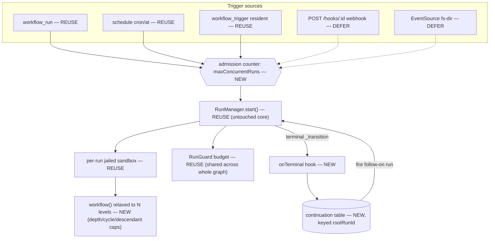
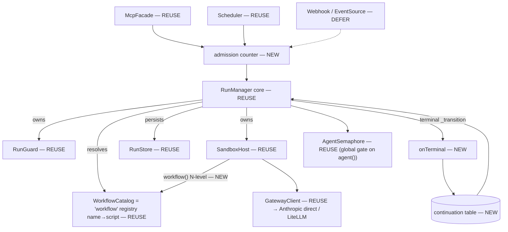

# v8 — Compose registered workflows into a system graph (lean design)

> Status: **DESIGN / for review** (not built). Revised 2026-07-26 after an adversarial review
> that cut the first draft's `RunPlan` trigger subsystem as over-design.
> The 繁中 human-facing version (with a glossary + rendered diagrams) is the published Artifact
> "把已註冊的 workflow 組成一張系統 graph".

## 0. What changed, and why

The first draft centered on a declarative **`RunPlan`** type dispatched by a `TriggerRouter` /
`workflow_dispatch` driver, plus a lineage-budget ledger. Two adversarial reviewers with *opposing*
theses converged on the same verdict: **`RunPlan` is over-design — cut it.**

Core insight (grounded in code, not opinion):

- **A composing workflow's code already IS an arbitrary DAG.** `parallel()` = fan-out, awaiting an
  array + plain-JS merge = fan-in, data-dependency via variables = diamonds, `if` = conditional routing,
  `await workflow(x)` = sequential chaining, `for`/`while` = loops. `RunPlan.runs[]` is literally
  `parallel(workflow())`.
- **Budget is already shared across the whole in-run graph.** A nested `workflow()`'s `agent()` calls
  route back through the *same* `runId` → the *same* `RunGuard` (`run-manager.ts:168/351/355`). The
  lineage-budget ledger the first draft proposed solves a problem that does not exist inside one
  composing run.
- **The real blocker is the one-level nesting cap.** `workflow()` nesting is hard-limited to one level:
  a nested run's sandbox is created with no `onWorkflowRequest` (`run-manager.ts:353`), so a second-level
  `workflow()` throws `NESTING_ERROR` (`host.ts:112`, `guards.ts:183`). A composing workflow can call
  **leaf** workflows only — so a *registered composite cannot be a node in another graph*. That, not
  RunPlan, is what blocks "compose already-registered workflows into a system graph."

**Cut:** `RunPlan` type · `TriggerRouter` layer · `workflow_dispatch` tool · lineage-budget ledger.
**Keep as the actual work:** lift nesting to N levels (config-capped) + three small kernel pieces
(completion hook · durable continuation table · admission counter) + a dashboard upgrade the user
requested. Details below.

## 1. The design in one screen

A registered workflow is a first-class reusable unit. The **same script** runs two ways:

- **Standalone / concurrent** — each `workflow_run` is its own run (own `runId`, own `RunGuard` budget,
  independent lifecycle, observable separately). N of them run concurrently, bounded by the new
  admission counter + the existing global agent semaphore.
- **Composed into a graph** — a top workflow calls the others via `workflow(name, args)`; they become
  nodes of **one** run (shared parent budget, one lineage). "Composition is closed": a composite is just
  another registered workflow, re-triggerable and (once N-level nesting lands) re-composable.

Four pieces to add; everything else is unchanged:

| Add | Solves | Size |
|---|---|---|
| **N-level nesting** (config `maxWorkflowDepth`) | composites can be nodes → a real system graph | relax one guard + depth/cycle/descendant caps |
| **`onTerminal(runId, status)` hook** | a run finishing emits an event → cross-trigger chaining (e.g. cron A done → run B) | ~1 kernel hook on the authoritative `_transition` |
| **continuation table** (SQLite, keyed `rootRunId`) | persist "after A, run B" → survives restart; async joins arriving hours later | one small table, scheduler-`run_origins` pattern |
| **admission counter** at `RunManager.start` | stop runaway run-count from exhausting disk/PID/FD | a `maxConcurrentRuns` gate |

Budget is already graph-shared, so **no new budget subsystem**.

## 2. Architecture — marked reuse / new / deferred



Legend: **REUSE** = existing core, untouched · **NEW** = this feature · **DEFER** = separate slice
(external ingress, see §7). Every path funnels through the single `RunManager.start()`.

## 3. Module relationships



`RunManager` **owns** RunGuard/SandboxHost, **resolves** WorkflowCatalog, **persists** RunStore — all
unchanged. The feature adds three green modules on the periphery + one admission gate. No `RunPlan`, no
`TriggerRouter` — a whole layer lighter than the first draft.

## 4. Composition example + data-passing contract

"Compose" = write a new workflow that calls registered sub-workflows, choosing their **trigger mode**
(`parallel()` = concurrent / `await` = sequential) and **connection mode** (return value = data pass /
array = fan-in / `if` = conditional).

```js
export const meta = { name:'order-fulfillment', phases:[{title:'驗證+鎖庫存'},{title:'出貨+通知'}] };
const order = args.order;

// trigger mode: parallel (fan-out)
phase('驗證+鎖庫存');
const [pay, stock] = await parallel([
  () => workflow('verify-payment', { order }),
  () => workflow('reserve-stock',  { order }),
]);

// connection mode: fan-in + conditional
if (!pay?.ok || !stock?.ok) {
  await workflow('flag-review', { order, reason:{ pay, stock } });
  return { status:'needs-review', pay, stock };
}

// trigger mode: sequential; connection mode: data passing (tracking)
phase('出貨+通知');
const ship = await workflow('arrange-shipment', { order, reservationId: stock.reservationId });
await workflow('notify-customer', { order, tracking: ship.tracking });
return { status:'fulfilled', tracking: ship.tracking };
```

**Data-passing contract.** A sub-workflow's `return` value round-trips through the sandbox IPC as JSON,
so the parent receives a **plain JS object** (not a string) — provided the sub-workflow returns an object,
not `JSON.stringify(...)`. The engine does **not** auto-merge outputs; fan-in aggregation is plain
JavaScript in the composing script:

| Step | Owner | Contract |
|---|---|---|
| sub-workflow **output shape** | sub-workflow author | `return { ok, paymentId, amount }` — the object shape IS its public contract; always return a structured object, never a formatted JSON string |
| **fan-in aggregation** (mapping) | composing script | knows each sub's output shape; explicitly maps upstream-output → next-input `args`; no magic merge |
| next workflow **input read** | downstream workflow | `const { paymentId, reservationId, items } = args;` — reads from the `args` you built |

If a sub-workflow really returns a formatted JSON string, the composer parses it itself
(`typeof x === 'string' ? JSON.parse(x) : x`). Prefer structured objects.

**Current limit → what Slice 1 lifts:** `workflow()` is one level today, so the five sub-workflows above
must be leaves. After N-level nesting they can themselves be composites — that is the real "graph of
registered workflows."

## 5. Two run modes — standalone vs composed (same script)

| | Standalone / concurrent | Composed into a graph |
|---|---|---|
| how fired | each `workflow_run(...)`, fire many for concurrency | top workflow calls `workflow('build-and-review', …)` |
| how many runs | independent runs (each a `runId`) | one run, nested nodes (one lineage) |
| budget | independent `RunGuard` each | shared parent `RunGuard` (one per graph) |
| observability | each `workflow_status(runId)` | one run's view shows the whole graph |
| lifecycle | independent; one failing doesn't touch others | parent dies → nodes collapse with it |
| concurrency bound | admission counter + global agent semaphore | in-graph `parallel()`, same agent semaphore |

Same registered script, both ways — nothing is rewritten. This is why "compose into a graph" needs **no
new tool**: register a composing workflow and `workflow_run` it.

## 6. Dashboard — cards → progressive DAG → agent log

Requirement: home page lists **registered workflows** and **running runs** as **cards**; click a card →
its **DAG** with live model / current-step / status; click an agent node → its **detailed log**; a
**composite** workflow shows as **multiple cards**, each DAG detailed like a single workflow.

### 6.1 Current observability surface (what's free vs new)

The engine already serves a dashboard on the same port as `/mcp`:

| Endpoint | Returns | file:line |
|---|---|---|
| `GET /dashboard[/:runId]` | dark HTML SPA, polls every 3 s | `server.ts:763`, `dashboard-page.ts:103` |
| `GET /api/runs` | `RunSummary[]` | `server.ts:590` |
| `GET /api/runs/:id` | `RunStatusView` (live-merged: per-agent `state/model/label/phase/tokens`, phase titles) | `server.ts:608`, `run-manager.ts:229` |
| `GET /api/runs/:id/agents/:aid` · `workflow_agent_log` | per-agent `TranscriptEvent[]` | `server.ts:595`, `mcp-facade.ts:158` |
| `GET /api/status` | DOS gauge = `{agentSemaphore:{total,inUse,queued}}` (JSON, not visual) | `server.ts:771` |
| `workflow_list` | registered workflows + runs | `mcp-facade.ts:146` |

| Dashboard need | Status | Gap to fill |
|---|---|---|
| registered-workflow cards | **AVAILABLE** | `workflow_list kind=workflow` (add optional static skeleton) |
| running-run cards | **AVAILABLE** | `/api/runs` + 3 s poll (keep poll; SSE later) |
| DAG w/ live model/step/status | **PARTIAL → mostly NEW** | node data exists (agent record has model/state); **structure missing** — parallel-group membership + call-tree not recorded, `callSeq` is flat, journal(`callSeq`) and transcript(`agentId`) are disjoint id spaces (`guards.ts:138`, `types.ts:95`) |
| current step | **PARTIAL** | phases are live-only, not persisted, no current marker, lost on restart (`sqlite-run-store.ts:170`, `run-manager.ts:298`) |
| per-agent log drill-down | **AVAILABLE** | `workflow_agent_log` (non-SDK providers emit only a `usage` summary, `agent-executor.ts:145`) |
| composite → multiple cards | **NEW** | nested `workflow()` runs inline as `${runId}-nested` with no run row / no parent linkage (`run-manager.ts:340-359`); record nested-call boundary + name + parent link |

### 6.2 How the DAG is built — static pre-read + cache + live overlay

**"Fixed code" ≠ "fixed DAG".** Loops (`for`/`while`), conditionals (`if`), and data-driven fan-out
(`list.map(agent)`) make the executed node set runtime-dependent. So the DAG is *progressive*:

1. **Static pre-read skeleton** — parse the script's `agent()/parallel()/workflow()/phase()` calls to
   draw a *predicted* skeleton; mark dynamic regions `?` / `×N`.
2. **Cache after first run** — key the observed shape by `scriptVersion` as a better prior for next time.
3. **Runtime is truth** — flip nodes **✓ done · ● running · ○ upcoming** live, and add nodes static
   analysis couldn't predict. Live info (model / step / status) updates *on the same DAG*.

Purely-static workflows: all three coincide, full DAG drawable up front. Dynamic workflows: "upcoming"
is a best-effort prediction, reconciled against the real branch. Node identity keys on `label` / `phase`
name (so encourage `agent(prompt, { label })`).

### 6.3 Composite = multiple cards, still one run

Keep the settled model: a composite is **one run** (shared budget, one lineage). The dashboard's
"multiple cards" is a **view over that one run** — record the nested `workflow()` boundaries and render
them as sub-cards / sub-DAGs, each detailed like a single workflow. We do **not** promote nested calls to
independent runs (that would break the shared budget).

## 7. Scope — four slices (deferred pieces stay separate)

- **Slice 1 — N-level nesting (+ config depth).** Relax `workflow()` to N levels; depth cap read from
  `rwe.config.json`:
  ```jsonc
  { "maxWorkflowDepth": 4 }   // max workflow-call depth; default 4; exceed → NESTING_DEPTH_EXCEEDED
  ```
  Add an ancestor-cycle guard (target ∈ ancestors → refuse) + a total-descendant cap. Budget already
  shared, so no new budget machinery.
- **Slice 2 — DAG structure + composite linkage (dashboard's data layer).** Record the call tree:
  `parallel()` group membership, nested `workflow()` boundary + name, a journal↔transcript key, phase
  persistence + current-step + timing; static pre-read + `scriptVersion` cache. **Coupled to Slice 1**
  (record parent→child linkage while lifting nesting).
- **Slice 3 — Dashboard upgrade.** Reuse `/dashboard` + APIs; cards (registered + running) → click →
  live 3-state DAG → click agent → log; composites render as multiple sub-cards. Keep the 3 s poll.
- **Slice 4 — cross-trigger chaining + anti-runaway.** `onTerminal` on the authoritative `_transition`
  (not the un-`catch`ed `.then` in `_runLive`, `run-manager.ts:323`) · continuation table (SQLite, keyed
  `rootRunId`) · admission counter `maxConcurrentRuns` at `RunManager.start` (`run-manager.ts:144`; the
  global semaphore caps only `agent()` spawn at `:398`, not run count / sandbox fork / seed).

### Deferred (separate slices, explicitly out of scope here)

- **Defer A — crash durability (highest severity).** A graph = one blocking run. On restart,
  `hydrateAll` marks `running → failed` (`sqlite-run-store.ts:180`) and `_requireLive` only rehydrates
  suspended/stopped (`run-manager.ts:255`) — a long in-flight graph is lost silently on any
  deploy/restart, with no per-node resume state. The fix is durable suspend/resume, a larger separate
  investment. **Name it as the ceiling:** long graph + deploy = data loss; short graphs unaffected.
- **Defer B — external-ingress security (its own slice).** Webhook/event ingress needs HMAC + timestamp
  (±300 s) + `deliveryId` idempotent dedup (atomic `INSERT OR IGNORE` before `start()`) + Host/Origin
  allowlist on `/mcp` (drive-by DNS-rebinding → RCE). This is *who may trigger*, orthogonal to
  *composition*. Until OIDC, admin-write tools stay firewall/tunnel-only.

## 8. Typed error codes (branchable, envelope-not-exception)

`NESTING_DEPTH_EXCEEDED` · `NESTING_CYCLE` · `DESCENDANT_CAP_EXCEEDED` · `RUN_ADMISSION_LIMIT` ·
`WORKFLOW_NOT_FOUND` · `CONTINUATION_NOT_FOUND`. (Ingress/webhook codes belong to Defer B.)

## 9. Next step

Rewrite done (this doc). On the user's go-ahead: iso-agile-sdlc **Gate 1** from **Slice 1** (N-level
nesting + config depth). Slice 2/3 may merge into one dashboard iteration given their coupling. Grounding
`file:line` throughout come from a read-only exploration of `run-manager.ts`, `sandbox/{host,guards}.ts`,
`store/sqlite-run-store.ts`, `server.ts`, `dashboard-page.ts`, `mcp-facade.ts`, `agent-executor.ts`,
`types.ts`, `scheduler.ts`.
